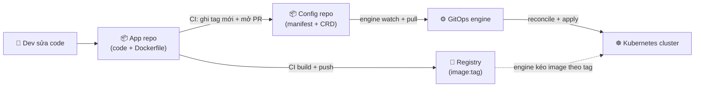
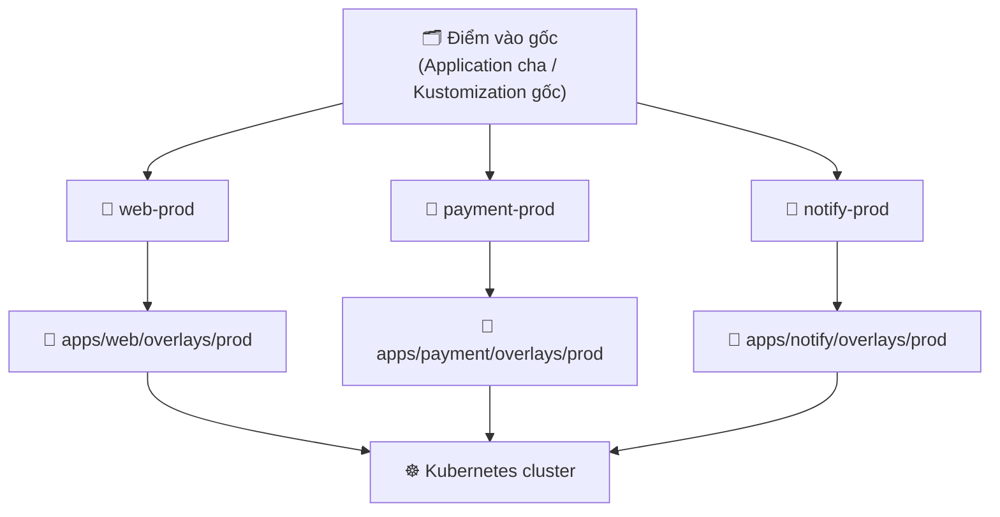

# Cấu trúc Repo GitOps — Tách config, env promotion, app-of-apps

> **Tác giả:** Mr.Rom\
> **Phiên bản:** v1.0.0\
> **Tạo lúc:** 13/06/2026\
> **Cập nhật:** 13/06/2026\
> **Level:** Basic\
> **Tags:** gitops, repository-structure, kustomize, argocd, flux, environment-promotion, app-of-apps\
> **Yêu cầu trước:** [ArgoCD vs Flux](01_flux-vs-argocd.md)

> 🎯 *Bài trước bạn đã chọn được engine (ArgoCD hay Flux). Nhưng engine chỉ đọc YAML — nó không tự sắp xếp repo cho bạn. Repo bừa bộn thì dev→staging→prod hỗn loạn, đổi 1 config phải sửa 3 chỗ, CI quay loop vô tận. Sau bài này bạn sẽ thiết kế được một repo GitOps gọn gàng cho Acme Shop: tách code khỏi config, dùng Kustomize base + overlays cho 3 môi trường, gom nhiều app bằng app-of-apps (ArgoCD) / Kustomization tree (Flux), và promote dev→staging→prod chỉ bằng một Pull Request.*

## 🎯 Sau bài này bạn sẽ

- [ ] Hiểu vì sao phải tách **repo app code** khỏi **repo config/GitOps** (quyền, vòng đời, tránh CI loop)
- [ ] Phân biệt **monorepo** vs **polyrepo** cho phần config và biết khi nào chọn cái nào
- [ ] Dùng **Kustomize base + overlays** để promote `dev → staging → prod` không copy-paste
- [ ] Đọc được cây thư mục repo GitOps thực tế và biết mỗi thư mục để làm gì
- [ ] Gom nhiều app bằng **app-of-apps** (ArgoCD) hoặc **Kustomization tree** (Flux)
- [ ] Promote một version mới qua **Pull Request** (đổi image tag/digest ở overlay của env)

---

## Acme Shop có engine rồi, nhưng repo thì... loạn

Acme Shop vừa chọn xong GitOps engine ở bài trước. Sếp hớn hở bảo: *"Tốt, giờ quăng hết YAML vào Git là xong chứ gì?"*. Bạn làm theo — và một tuần sau mọi thứ rối tung:

- Dev sửa code app, CI build image mới, **commit luôn cả manifest deploy** vào cùng repo app. Mỗi lần CI cập nhật tag image → tạo commit mới → commit đó lại trigger CI chạy lại → build lại → cập nhật tag → trigger CI... **vòng lặp vô tận** đốt sạch CI minutes.
- File `deployment.yaml` cho `dev`, `staging`, `prod` là **3 bản copy gần giống hệt**. Đổi một label chung → phải sửa 3 file. Lần nào cũng quên 1 file → môi trường lệch nhau.
- Muốn lên prod, ai đó `kubectl edit` sửa replicas trực tiếp trên cluster vì "sửa 3 file YAML mệt quá". Drift quay lại đúng thời `kubectl apply` tay.
- Có 8 microservice, mỗi cái 1 `Application` ArgoCD. Bootstrap cluster mới phải `kubectl apply` 8 file bằng tay, sót 1 cái không ai biết.

Vấn đề ở đây **không phải engine** — engine chạy đúng. Vấn đề là **cách tổ chức repo**. GitOps lấy Git làm nguồn chân lý, nên *cấu trúc của Git* quyết định toàn bộ trải nghiệm vận hành. Một repo thiết kế tốt giải quyết cả 4 nỗi đau trên. Bài này đi qua từng pattern theo đúng thứ tự bạn cần khi dựng repo thật.

🪞 **Ẩn dụ xuyên bài**: hãy hình dung repo GitOps như một **bếp nhà hàng**. *Repo app code* là khu chế biến (đầu bếp nấu món — viết code). *Repo config* là **kho công thức + thực đơn dán tường** (món nào, bao nhiêu phần, bày ra sao). *Base* là công thức gốc, *overlays* là biến tấu theo từng chi nhánh (chi nhánh dev nêm nhạt để thử, chi nhánh prod nêm chuẩn cho khách). *Promotion* là việc bê một công thức đã chạy ngon ở chi nhánh nhỏ lên áp dụng cho chi nhánh lớn — và phải có người ký duyệt (PR) trước khi đổi thực đơn cho khách thật.

---

## 1️⃣ Vì sao phải tách repo app code khỏi repo config?

Câu hỏi đầu tiên ai cũng vấp: *"Code và manifest deploy của cùng một app — sao không để chung một repo cho tiện?"*. Để chung **chạy được**, nhưng sinh ra 3 vấn đề thực tế. Tách ra giải quyết cả ba.

**Định nghĩa**:

- **Repo app code** (hay *app repo*) — chứa source code ứng dụng (Python/Go/Node...), `Dockerfile`, test. CI của repo này lo **build + push image** lên registry.
- **Repo config / GitOps** (hay *config repo*, `gitops-config`) — chứa manifest Kubernetes (Deployment, Service, ConfigMap...) + các CRD của engine (`Application` ArgoCD hoặc `Kustomization` Flux). Đây là repo mà engine **watch**.

Ba lý do để tách, theo thứ tự quan trọng:

- **Tránh CI loop (vòng lặp CI vô tận)** — đây là lý do "đau" nhất. Nếu code và manifest chung repo, mỗi lần CI cập nhật tag image vào manifest sẽ tạo commit mới, commit đó lại trigger CI (vì cùng repo) → build lại → cập nhật tag → trigger lại... Tách repo cắt đứt vòng này: CI chỉ chạy ở app repo (khi code đổi), việc cập nhật tag đẩy sang config repo (không trigger build).
- **Quyền (permissions)** — code và config có nhóm người chạm vào khác nhau. Dev chạm code cả ngày; còn quyền *deploy lên prod* nên giới hạn ở số ít người (SRE/lead). Tách repo cho phép đặt branch protection chặt cho config repo (nhất là thư mục `prod`) mà không cản trở dev đẩy code thường ngày.
- **Vòng đời (lifecycle) khác nhau** — một commit code không nhất thiết là một lần deploy, và một lần deploy (đổi replicas, đổi config) không nhất thiết có code mới. Trộn chung làm lịch sử Git lẫn lộn: nhìn `git log` không phân biệt được "đây là thay đổi code" hay "đây là thay đổi vận hành". Tách ra → mỗi repo một dòng lịch sử sạch.

> 💡 Hiểu 3 lý do rồi, ta nhìn luồng chạy end-to-end qua sơ đồ để thấy "tách" cắt đứt CI loop ở đâu.



→ Mấu chốt: CI ở **App repo** không bao giờ ghi vào chính nó — nó ghi tag mới sang **Config repo**. Vì engine chỉ watch Config repo (không chạy CI build), commit cập nhật tag *không* khởi động vòng build lại. Đường nét đứt từ Registry tới Cluster cho thấy image được engine kéo về theo đúng tag mà Config repo khai báo.

> [!WARNING]
> Để code và manifest deploy **chung một repo** là cạm bẫy hay gặp nhất với người mới GitOps. Hậu quả nặng nhất không phải "rối" mà là **CI loop**: CI tự trigger chính nó qua commit cập nhật tag, đốt CI minutes và làm engine sync liên tục. Luôn tách App repo và Config repo ngay từ đầu.

---

## 2️⃣ Monorepo hay polyrepo cho phần config?

Đã quyết tách code khỏi config. Câu hỏi tiếp: phần *config* của nhiều app — gom hết vào **một** config repo (monorepo), hay mỗi app **một** config repo (polyrepo)?

🪞 Quay lại ẩn dụ bếp: monorepo là **một quyển sổ công thức dày** cho cả nhà hàng; polyrepo là **mỗi món một tờ công thức rời**. Sổ dày dễ tra cứu tổng thể nhưng ai sửa cũng đụng chung quyển; tờ rời độc lập nhưng muốn xem toàn cảnh thực đơn phải gom nhiều tờ.

**Định nghĩa nhanh**:

- **Monorepo config** — một repo `gitops-config` duy nhất chứa manifest của *tất cả* các app + môi trường.
- **Polyrepo config** — mỗi app (hoặc mỗi team) có một config repo riêng (`web-config`, `payment-config`...).

So sánh để chọn — bảng dưới gom các tiêu chí một team thật sự cân nhắc, không phải "cái nào xịn hơn":

| Tiêu chí | **Monorepo config** | **Polyrepo config** |
|---|---|---|
| Số repo phải quản | 1 — đơn giản | Nhiều — phải đặt tên, cấp quyền từng cái |
| Nhìn toàn cảnh hệ thống | ✅ Dễ — mọi thứ trong một chỗ | ⚠️ Khó — phải gom nhiều repo |
| Thay đổi xuyên nhiều app (atomic) | ✅ Một PR sửa nhiều app cùng lúc | ❌ Phải nhiều PR ở nhiều repo |
| Cô lập quyền theo team | ⚠️ Phải dùng `CODEOWNERS` theo thư mục | ✅ Tự nhiên — mỗi team một repo |
| Branch protection cho `prod` | Đặt theo path (CODEOWNERS) | Đặt cho cả repo |
| Phù hợp quy mô | Team nhỏ–vừa, ít chục app | Tổ chức lớn, nhiều team độc lập |
| Bán kính ảnh hưởng khi lỗi | Rộng hơn (chung repo) | Hẹp hơn (cô lập từng repo) |

> ⚠️ Bảng so sánh **đặc tính**, không cho điểm. Với đa số team Basic/vừa, **monorepo config** là lựa chọn mặc định hợp lý: ít thứ phải quản, nhìn toàn cảnh dễ, và quyền theo team vẫn làm được bằng `CODEOWNERS` (mỗi thư mục có người duyệt riêng). Polyrepo chỉ "đáng giá" khi tổ chức lớn, nhiều team thực sự cần biên giới repo cứng.

Acme Shop có 8 microservice, một team platform nhỏ → bài này chọn **monorepo config** (`gitops-config`). Mọi ví dụ phía dưới dựng trên repo đơn này.

> [!TIP]
> Dù chọn monorepo, bạn vẫn cô lập quyền theo team được bằng file `CODEOWNERS`. Ví dụ `apps/payment/** @acme/payment-team` bắt mọi PR đụng thư mục `payment` phải có người team payment duyệt — biên giới mềm nhưng đủ chặt cho phần lớn trường hợp.

---

## 3️⃣ Promotion dev → staging → prod bằng Kustomize base + overlays

Tới phần xương sống của bài. Có config repo rồi, làm sao một app chạy được trên 3 môi trường mà **không** phải bê 3 bản YAML copy gần giống hệt?

### Vấn đề của "directory-per-env thuần copy"

Cách ngây thơ nhất là tạo 3 thư mục, mỗi thư mục một bộ YAML đầy đủ:

```text
apps/web/
├── dev/deployment.yaml        # bản đầy đủ
├── staging/deployment.yaml    # copy của dev, sửa vài dòng
└── prod/deployment.yaml       # copy nữa, sửa vài dòng
```

Vấn đề: 90% nội dung 3 file **giống hệt nhau**, chỉ khác replicas, image tag, vài biến môi trường. Đổi một thứ chung (ví dụ thêm một label, đổi port) → phải sửa cả 3 file, sót một là lệch môi trường. Đây chính là nỗi đau "sửa 1 chỗ phải sửa 3 nơi" ở đầu bài.

### Kustomize: tách phần chung (base) khỏi phần khác (overlay)

**Định nghĩa**: *Kustomize* là công cụ build manifest Kubernetes theo kiểu **xếp lớp** (đã tích hợp sẵn trong `kubectl`). Ý tưởng:

- **base** (lớp nền) — phần manifest **chung** cho mọi môi trường (viết **một** lần).
- **overlay** (lớp phủ) — mỗi môi trường một overlay, chỉ chứa **phần khác biệt** so với base (patch lên base).

🪞 Theo ẩn dụ bếp: *base* là **công thức gốc** dán bếp; mỗi *overlay* là **tờ ghi chú nhỏ** kẹp thêm: "chi nhánh dev: nấu 1 phần, nêm nhạt"; "chi nhánh prod: nấu 10 phần, nêm chuẩn". Đầu bếp đọc công thức gốc + tờ ghi chú của chi nhánh mình → ra món đúng cho chi nhánh đó. Không ai chép lại cả công thức.

Cấu trúc thư mục một app theo base + overlays:

```text
apps/web/
├── base/
│   ├── deployment.yaml
│   ├── service.yaml
│   └── kustomization.yaml        # liệt kê resource của base
└── overlays/
    ├── dev/
    │   └── kustomization.yaml     # patch: 1 replica, tag dev
    ├── staging/
    │   └── kustomization.yaml     # patch: 2 replicas, tag staging
    └── prod/
        └── kustomization.yaml     # patch: 5 replicas, tag prod
```

#### Viết base — phần chung, một lần duy nhất

Base chứa Deployment "trung tính": không gắn cứng replicas hay tag cho môi trường nào. Đây là khung mà mọi overlay sẽ phủ lên. File `deployment.yaml` của base:

```yaml
# apps/web/base/deployment.yaml
apiVersion: apps/v1
kind: Deployment
metadata:
  name: web
  labels:
    app: web
spec:
  replicas: 1                      # giá trị mặc định, overlay sẽ ghi đè
  selector:
    matchLabels:
      app: web
  template:
    metadata:
      labels:
        app: web
    spec:
      containers:
        - name: web
          image: ghcr.io/acme/web   # KHÔNG tag ở đây — overlay đặt tag
          ports:
            - containerPort: 8080
          resources:
            requests:
              cpu: 100m
              memory: 128Mi
```

Service đi kèm cũng nằm trong base vì 3 môi trường dùng chung định nghĩa Service:

```yaml
# apps/web/base/service.yaml
apiVersion: v1
kind: Service
metadata:
  name: web
spec:
  selector:
    app: web
  ports:
    - port: 80
      targetPort: 8080
```

Cuối cùng, base cần một `kustomization.yaml` liệt kê những resource thuộc về nó. File này nói với Kustomize: "base của tôi gồm Deployment và Service ở 2 file trên":

```yaml
# apps/web/base/kustomization.yaml
apiVersion: kustomize.config.k8s.io/v1beta1
kind: Kustomization
resources:
  - deployment.yaml
  - service.yaml
```

> 📖 Base xong là phần chung đã gọn trong một chỗ. Giờ ta viết overlay cho từng môi trường — chỉ phần khác biệt.

#### Viết overlay — chỉ phần khác biệt

Overlay `dev` không chép lại Deployment. Nó **trỏ về base** rồi khai báo phần khác: namespace `dev`, 1 replica, dùng image tag `dev-latest`. Kustomize có hai cách thông dụng để đổi replicas và image — bài này dùng field `replicas` và `images` (gọn, không cần viết patch JSON):

```yaml
# apps/web/overlays/dev/kustomization.yaml
apiVersion: kustomize.config.k8s.io/v1beta1
kind: Kustomization
namespace: dev
resources:
  - ../../base                     # ← kế thừa toàn bộ base
replicas:
  - name: web
    count: 1                       # dev: 1 bản chạy
images:
  - name: ghcr.io/acme/web
    newTag: dev-20260613           # tag môi trường dev
```

Overlay `staging` gần giống — chỉ khác con số. 2 replicas, tag staging:

```yaml
# apps/web/overlays/staging/kustomization.yaml
apiVersion: kustomize.config.k8s.io/v1beta1
kind: Kustomization
namespace: staging
resources:
  - ../../base
replicas:
  - name: web
    count: 2
images:
  - name: ghcr.io/acme/web
    newTag: v1.2.3                 # tag đã qua test ở staging
```

Overlay `prod` chặt chẽ nhất — 5 replicas, và **gắn image theo digest** (không phải tag) cho bất biến tuyệt đối. Digest `sha256:...` luôn trỏ đúng một image, không bao giờ bị đẩy đè như tag:

```yaml
# apps/web/overlays/prod/kustomization.yaml
apiVersion: kustomize.config.k8s.io/v1beta1
kind: Kustomization
namespace: production
resources:
  - ../../base
replicas:
  - name: web
    count: 5
images:
  - name: ghcr.io/acme/web
    digest: sha256:3f7a9b2c1d4e5f60718293a4b5c6d7e8f90112233445566778899aabbccddeef
```

> [!NOTE]
> *Tag* (`v1.2.3`) là một cái nhãn có thể bị đẩy đè (người ta có thể push image khác lên cùng tag). *Digest* (`sha256:...`) là vân tay duy nhất của đúng một image — bất biến. Với prod, nhiều team pin theo digest để chắc chắn "cái chạy hôm nay đúng là cái đã test", không bị đổi ngầm.

#### Build thử để thấy kết quả

Kustomize tích hợp sẵn trong `kubectl` qua cờ `-k`. Lệnh `kubectl kustomize` build ra manifest cuối cùng (không apply) để bạn kiểm tra trước. Build overlay `prod`:

```bash
kubectl kustomize apps/web/overlays/prod
```

Kết quả mong đợi (rút gọn phần quan trọng):

```yaml
apiVersion: v1
kind: Service
metadata:
  name: web
  namespace: production
spec:
  ports:
    - port: 80
      targetPort: 8080
  selector:
    app: web
---
apiVersion: apps/v1
kind: Deployment
metadata:
  labels:
    app: web
  name: web
  namespace: production
spec:
  replicas: 5
  selector:
    matchLabels:
      app: web
  template:
    metadata:
      labels:
        app: web
    spec:
      containers:
        - image: ghcr.io/acme/web@sha256:3f7a9b2c1d4e5f60718293a4b5c6d7e8f90112233445566778899aabbccddeef
          name: web
          ports:
            - containerPort: 8080
          resources:
            requests:
              cpu: 100m
              memory: 128Mi
```

→ Đọc output: `namespace: production` và `replicas: 5` đến từ overlay; `containerPort`, `resources`, Service đến từ base — không hề lặp lại. Đặc biệt dòng `image:` đã thành `ghcr.io/acme/web@sha256:...` (gắn digest) đúng như overlay prod khai báo. Bạn viết phần chung **một lần** ở base, mỗi môi trường chỉ thêm vài dòng khác biệt.

> [!TIP]
> Trước khi commit bất kỳ overlay nào, chạy `kubectl kustomize <thư mục overlay>` để xem manifest cuối cùng. Đây là cách bắt lỗi sớm (sai indent, sai tên resource trong `replicas`) ngay trên máy, trước khi engine apply lên cluster thật.

---

## 4️⃣ Quản nhiều app: app-of-apps (ArgoCD) vs Kustomization tree (Flux)

Một app đã gọn với base + overlays. Nhưng Acme Shop có 8 app. Bootstrap cluster mới mà `kubectl apply` 8 file CRD bằng tay thì lại quay về cảnh "sót một cái không ai biết". Cần một cách **gom nhiều app thành một điểm vào duy nhất**. Mỗi engine có cách riêng — bản chất giống nhau: *một thứ "cha" trỏ tới nhiều thứ "con"*.

### Với ArgoCD: app-of-apps

**Định nghĩa**: *app-of-apps* (app-của-các-app) là pattern dùng **một `Application` "cha"** trỏ vào một thư mục chứa nhiều file `Application` "con". Apply mỗi `Application` cha → ArgoCD tự bung ra toàn bộ app con.

🪞 Ẩn dụ: app-of-apps như một **thùng carton lớn** — bên trong xếp nhiều hộp nhỏ (mỗi hộp là một app). Bạn chỉ cần đưa một cái thùng lớn vào kho (apply 1 lần), kho tự mở ra và xếp từng hộp con vào đúng kệ.

Cấu trúc: một thư mục `argocd-apps/` chứa các file `Application` con, và một `Application` cha trỏ vào thư mục đó. File cha:

```yaml
# argocd-apps/root.yaml — Application "cha"
apiVersion: argoproj.io/v1alpha1
kind: Application
metadata:
  name: acme-root
  namespace: argocd
spec:
  project: default
  source:
    repoURL: https://github.com/acme/gitops-config
    targetRevision: main
    path: argocd-apps              # ← thư mục chứa các Application con
  destination:
    server: https://kubernetes.default.svc
    namespace: argocd
  syncPolicy:
    automated:
      prune: true
      selfHeal: true
```

Trong thư mục `argocd-apps/`, mỗi app một file `Application` con. Ví dụ con cho `web` ở môi trường prod (trỏ thẳng vào overlay đã viết ở phần 3):

```yaml
# argocd-apps/web-prod.yaml — Application "con"
apiVersion: argoproj.io/v1alpha1
kind: Application
metadata:
  name: web-prod
  namespace: argocd
spec:
  project: default
  source:
    repoURL: https://github.com/acme/gitops-config
    targetRevision: main
    path: apps/web/overlays/prod   # ← overlay prod của Kustomize
  destination:
    server: https://kubernetes.default.svc
    namespace: production
  syncPolicy:
    automated:
      prune: true
      selfHeal: true
```

Bootstrap cả cluster chỉ bằng **một** lệnh — apply riêng `Application` cha, phần còn lại ArgoCD tự lo:

```bash
kubectl apply -f argocd-apps/root.yaml
```

→ ArgoCD đọc `acme-root`, thấy nó trỏ vào thư mục `argocd-apps/`, tự phát hiện tất cả file `Application` con trong đó và sync từng cái. Thêm app mới chỉ việc thêm một file `*.yaml` con vào `argocd-apps/` rồi commit — `acme-root` tự nhặt lên. Không còn `kubectl apply` 8 file bằng tay.

### Với Flux: Kustomization tree

**Định nghĩa**: Flux không có khái niệm "app cha" riêng. Thay vào đó, dùng một **`Kustomization` gốc** trỏ vào thư mục chứa các `Kustomization` con — tạo thành một **cây** (tree). `Kustomization` gốc apply các file con; mỗi con apply một app.

Cụ thể: một `GitRepository` khai báo nguồn (đã học ở bài trước), rồi `Kustomization` gốc trỏ vào thư mục `clusters/acme/`:

```yaml
# clusters/acme/flux-root.yaml
apiVersion: source.toolkit.fluxcd.io/v1
kind: GitRepository
metadata:
  name: acme-gitops
  namespace: flux-system
spec:
  interval: 1m
  url: https://github.com/acme/gitops-config
  ref:
    branch: main
---
apiVersion: kustomize.toolkit.fluxcd.io/v1
kind: Kustomization
metadata:
  name: acme-apps                  # Kustomization "gốc"
  namespace: flux-system
spec:
  interval: 10m
  sourceRef:
    kind: GitRepository
    name: acme-gitops
  path: ./clusters/acme/apps       # ← thư mục chứa các Kustomization con
  prune: true
```

Trong `clusters/acme/apps/` là các `Kustomization` con, mỗi cái trỏ vào một overlay app:

```yaml
# clusters/acme/apps/web-prod.yaml — Kustomization "con"
apiVersion: kustomize.toolkit.fluxcd.io/v1
kind: Kustomization
metadata:
  name: web-prod
  namespace: flux-system
spec:
  interval: 10m
  sourceRef:
    kind: GitRepository
    name: acme-gitops
  path: ./apps/web/overlays/prod   # ← cùng overlay Kustomize như ArgoCD dùng
  prune: true
  targetNamespace: production
```

→ Điểm hay: cả ArgoCD lẫn Flux đều trỏ vào **cùng các overlay Kustomize** (`apps/web/overlays/prod`). Phần "vỏ engine" (`Application` hay `Kustomization`) khác nhau, nhưng phần manifest app thì dùng chung — đúng như bài trước đã nói: đổi engine không phải viết lại manifest.

> 💡 Hai cách (app-of-apps và Kustomization tree) chung một ý tưởng: một điểm vào "gốc" tự bung ra nhiều app con. Sơ đồ dưới gom cả hai vào một mental model.



→ Sơ đồ cho thấy "gốc" chỉ là một lớp gom: nó không chứa manifest app, chỉ trỏ tới các con. Mỗi con trỏ tiếp xuống overlay Kustomize thực tế. Bootstrap = apply mỗi "gốc"; mở rộng = thêm một file con. Đây là cách repo GitOps scale từ 1 app lên hàng chục app mà không loạn.

---

## 5️⃣ Cây thư mục repo GitOps hoàn chỉnh cho Acme Shop

Ghép tất cả lại, đây là cây thư mục `gitops-config` thực tế — gộp cả phần app-of-apps của ArgoCD và (tuỳ chọn) phần Kustomization tree của Flux. Bạn chỉ giữ phần engine mình dùng:

```text
gitops-config/
├── README.md
├── CODEOWNERS                          # cô lập quyền theo thư mục
│
├── apps/                               # manifest app — Kustomize base + overlays
│   ├── web/
│   │   ├── base/
│   │   │   ├── deployment.yaml
│   │   │   ├── service.yaml
│   │   │   └── kustomization.yaml
│   │   └── overlays/
│   │       ├── dev/kustomization.yaml
│   │       ├── staging/kustomization.yaml
│   │       └── prod/kustomization.yaml
│   ├── payment/
│   │   ├── base/...
│   │   └── overlays/{dev,staging,prod}/kustomization.yaml
│   └── notify/
│       ├── base/...
│       └── overlays/{dev,staging,prod}/kustomization.yaml
│
├── argocd-apps/                        # (nếu dùng ArgoCD) app-of-apps
│   ├── root.yaml                       # Application cha
│   ├── web-dev.yaml
│   ├── web-staging.yaml
│   ├── web-prod.yaml
│   ├── payment-prod.yaml
│   └── notify-prod.yaml
│
└── clusters/                           # (nếu dùng Flux) Kustomization tree
    └── acme/
        ├── flux-root.yaml              # GitRepository + Kustomization gốc
        └── apps/
            ├── web-prod.yaml           # Kustomization con
            └── payment-prod.yaml
```

→ Ba khu rõ ràng: `apps/` là **nội dung thật** (manifest app, không phụ thuộc engine); `argocd-apps/` hoặc `clusters/` là **vỏ engine** (chỉ trỏ vào `apps/`); `CODEOWNERS` lo quyền. Khu `apps/` tái dùng được cho cả hai engine — đó là phần "ổn định" nhất của repo.

> [!IMPORTANT]
> Quy tắc vàng: thư mục `apps/` (manifest Kubernetes thuần + Kustomize) **không được** chứa thứ riêng của engine (`Application`/`Kustomization` CRD). Vỏ engine để ở `argocd-apps/` hoặc `clusters/`. Tách bạch này giúp bạn đổi engine, hoặc dùng cùng `apps/` cho nhiều cluster, mà không phải sửa manifest app.

---

## 6️⃣ Promotion qua Pull Request — dev → staging → prod

Đây là phần "vận hành hằng ngày". Có repo gọn rồi, làm sao đưa một version từ dev lên prod một cách **an toàn, có dấu vết, có người duyệt**? Câu trả lời GitOps: **đổi image tag/digest ở overlay của env, qua một Pull Request**.

**Định nghĩa**: *environment promotion* (thăng cấp môi trường) là việc đưa cùng một version ứng dụng đi lần lượt qua dev → staging → prod, mỗi bước có kiểm thử và phê duyệt. Trong GitOps, "promote" cụ thể = **sửa tag/digest image trong file `kustomization.yaml` của overlay env kế tiếp**, rồi mở PR cho người khác duyệt.

🪞 Ẩn dụ bếp: promotion là bê một công thức **đã chạy ngon** ở chi nhánh dev (thử nghiệm) sang áp dụng cho chi nhánh staging (chạy thử với khách nội bộ), rồi mới tới prod (khách thật). Mỗi lần "đổi thực đơn" cho chi nhánh lớn hơn đều phải có quản lý ký duyệt — đó là PR.

### Luồng promotion chuẩn

Quy trình thực tế cho Acme Shop diễn ra theo các bước rõ ràng:

1. **CI ở app repo** build image mới (ví dụ `v1.2.4`), push lên registry, rồi tự mở một PR vào `gitops-config` cập nhật **overlay `dev`** sang tag `v1.2.4`. Merge PR đó → engine sync → app chạy `v1.2.4` ở dev.
2. **Test ở dev**. Khi ổn, một người mở PR đổi **overlay `staging`** sang `v1.2.4` (copy đúng tag đã chạy ở dev). PR được review → merge → engine sync staging.
3. **QA ở staging**. Khi pass, mở PR đổi **overlay `prod`** — thường pin theo **digest** của image `v1.2.4` cho bất biến. PR prod yêu cầu **người duyệt khác tác giả** (branch protection). Merge → engine sync prod.

Mỗi bước là một commit/PR riêng → `git log` của `gitops-config` chính là **lịch sử deploy đầy đủ**: ai promote cái gì, lên đâu, lúc nào, ai duyệt. Rollback = `git revert` commit promotion.

### Ví dụ một PR promote staging

Promote = một thay đổi nhỏ trong file overlay. Ví dụ promote `web` từ `v1.2.3` lên `v1.2.4` ở staging — chỉ sửa đúng dòng `newTag`. Đây là diff của PR:

```diff
# apps/web/overlays/staging/kustomization.yaml
 images:
   - name: ghcr.io/acme/web
-    newTag: v1.2.3
+    newTag: v1.2.4
```

→ PR chỉ thay một dòng — cực dễ review, cực rõ ý định ("promote web lên v1.2.4 ở staging"). Người duyệt nhìn diff là hiểu ngay, không phải đọc 200 dòng YAML. Đây là sức mạnh của base + overlays: phần khác biệt nhỏ tới mức promotion gói gọn trong một dòng.

### Cấu hình branch protection cho thư mục prod

Để PR prod thực sự "có người duyệt khác", dùng `CODEOWNERS` + branch protection của GitHub. File `CODEOWNERS` ở gốc repo:

```text
# CODEOWNERS — ai phải duyệt khi đụng thư mục nào
apps/*/overlays/dev/        @acme/dev-team
apps/*/overlays/staging/    @acme/dev-team
apps/*/overlays/prod/       @acme/sre-team @acme/leads
argocd-apps/                @acme/sre-team
```

→ Mọi PR đụng `overlays/prod/` bắt buộc có thành viên `sre-team` hoặc `leads` duyệt. Kết hợp với rule "không được tự duyệt PR của mình" trong branch protection → promotion lên prod luôn có ít nhất một người thứ hai kiểm. Drift kiểu "tự sửa nóng" bị chặn từ gốc vì mọi thay đổi đều phải qua PR.

> [!WARNING]
> Bật `prune` + auto-sync rồi mà để PR prod **tự duyệt được bởi chính tác giả** thì "approval" của GitOps trở nên rỗng nghĩa — ai cũng tự đẩy thẳng lên prod. Luôn cấu hình branch protection yêu cầu **ít nhất một reviewer khác tác giả** cho thư mục `prod`.

---

## 💡 Cạm bẫy thường gặp & Best practice

### ❌ Cạm bẫy: để app code và manifest deploy chung một repo

- **Triệu chứng**: CI chạy liên tục không dừng; mỗi commit cập nhật tag image lại trigger build mới; đốt CI minutes.
- **Nguyên nhân**: code và manifest chung repo → CI cập nhật tag tạo commit → commit trigger lại CI → vòng lặp.
- **Cách tránh**: tách **App repo** (code, CI build/push) khỏi **Config repo** (manifest, engine watch). CI ở app repo chỉ *ghi tag sang* config repo (mở PR), không ghi vào chính nó.

### ❌ Cạm bẫy: copy nguyên YAML cho từng môi trường (directory-per-env thuần copy)

- **Triệu chứng**: 3 môi trường lệch nhau từ từ; đổi một label chung phải sửa 3 file, hay sót.
- **Nguyên nhân**: 90% nội dung 3 file trùng nhau nhưng được duy trì độc lập.
- **Cách tránh**: dùng **Kustomize base + overlays** — phần chung viết một lần ở base, mỗi env chỉ ghi phần khác (replicas, tag) trong overlay.

### ❌ Cạm bẫy: nhầm CRD `Kustomization` của Flux với file `kustomization.yaml`

- **Triệu chứng**: viết `spec.resources` vào CRD Flux `Kustomization`, hoặc viết `sourceRef` vào file `kustomization.yaml` của Kustomize — rồi báo lỗi schema.
- **Nguyên nhân**: trùng tên nhưng là hai thứ khác nhau hoàn toàn.
- **Cách tránh**: nhớ — file `kustomization.yaml` (`kustomize.config.k8s.io/v1beta1`) có `resources`, `images`, `replicas` (config của công cụ Kustomize); còn CRD Flux `Kustomization` (`kustomize.toolkit.fluxcd.io/v1`) có `sourceRef`, `path`, `interval`, `prune` (đơn vị reconcile của Flux).

### ✅ Best practice: pin prod theo digest, dev/staging theo tag

- **Vì sao**: tag (`v1.2.3`) có thể bị push đè → "cái chạy hôm nay" khác "cái đã test". Digest (`sha256:...`) bất biến, đảm bảo prod chạy đúng image đã qua QA.
- **Cách áp dụng**: overlay `dev`/`staging` dùng `images[].newTag`; overlay `prod` dùng `images[].digest`. Khi promote lên prod, lấy digest tương ứng của tag đã pass staging.

### ✅ Best practice: branch protection chặt cho thư mục prod

- **Vì sao**: GitOps coi "PR được duyệt" là cổng kiểm soát thay deploy. Nếu tác giả tự duyệt được PR prod → cổng vô nghĩa.
- **Cách áp dụng**: `CODEOWNERS` gắn `apps/*/overlays/prod/` cho team SRE/leads + branch protection yêu cầu ≥1 reviewer khác tác giả. Dev/staging có thể nới lỏng hơn.

### ✅ Best practice: tách bạch khu `apps/` (manifest) và khu vỏ engine

- **Vì sao**: giữ `apps/` thuần Kubernetes + Kustomize giúp đổi engine (ArgoCD ↔ Flux) hay dùng lại cho cluster khác mà không sửa manifest.
- **Cách áp dụng**: manifest app ở `apps/`; CRD engine ở `argocd-apps/` (ArgoCD) hoặc `clusters/` (Flux). Vỏ engine chỉ *trỏ* vào `apps/`, không chứa manifest.

---

## 🧠 Tự kiểm tra (Self-check)

**Q1.** Vì sao phải tách repo app code khỏi repo config? Lý do "đau" nhất là gì?

<details>
<summary>💡 Xem giải thích</summary>

Ba lý do: **tránh CI loop**, **quyền (permissions)**, **vòng đời (lifecycle)** khác nhau. Lý do "đau" nhất là **CI loop**: nếu chung repo, CI cập nhật tag image tạo commit mới, commit đó lại trigger CI (cùng repo) → build lại → cập nhật tag → trigger lại... vòng lặp vô tận đốt CI minutes. Tách repo cắt đứt vòng này — CI chỉ chạy ở app repo, việc cập nhật tag đẩy sang config repo (engine watch, không build).

</details>

**Q2.** Trong Kustomize, base và overlay khác nhau ở chỗ nào? Đặt replicas và image tag ở đâu?

<details>
<summary>💡 Xem giải thích</summary>

**base** chứa phần manifest **chung** cho mọi môi trường (viết một lần): Deployment, Service, resources... — nhưng không gắn cứng giá trị riêng từng env. **overlay** mỗi môi trường một cái, **trỏ về base** (`resources: [../../base]`) và chỉ khai báo **phần khác biệt**. Replicas và image tag đặt ở **overlay** (qua field `replicas` và `images` trong `kustomization.yaml` của overlay), để mỗi env có giá trị riêng mà không đụng base.

</details>

**Q3.** App-of-apps (ArgoCD) và Kustomization tree (Flux) giải quyết vấn đề gì? Ý tưởng chung là gì?

<details>
<summary>💡 Xem giải thích</summary>

Cả hai giải quyết việc **gom nhiều app thành một điểm vào duy nhất** — để bootstrap cluster (và thêm app mới) không phải `kubectl apply` nhiều file bằng tay. Ý tưởng chung: một thứ **"gốc/cha"** trỏ vào thư mục chứa nhiều thứ **"con"**; apply gốc → engine tự bung ra tất cả con. ArgoCD: `Application` cha trỏ vào thư mục chứa `Application` con. Flux: `Kustomization` gốc trỏ vào thư mục chứa `Kustomization` con. Cả hai đều trỏ tiếp xuống cùng các overlay Kustomize trong `apps/`.

</details>

**Q4.** Trong GitOps, "promote một version lên prod" cụ thể là làm gì? Vì sao nên qua PR?

<details>
<summary>💡 Xem giải thích</summary>

"Promote lên prod" = **sửa image tag/digest trong file `kustomization.yaml` của overlay `prod`** (thường pin theo digest cho bất biến), rồi mở **Pull Request**. Qua PR vì: (1) có **người duyệt khác** kiểm trước khi đụng prod — branch protection + `CODEOWNERS` cho thư mục prod; (2) `git log` thành **lịch sử deploy đầy đủ** (ai promote gì, lúc nào, ai duyệt); (3) rollback dễ — chỉ cần `git revert` commit promotion. Diff PR thường chỉ một dòng (`newTag`/`digest`) nên cực dễ review.

</details>

**Q5.** Vì sao nên giữ thư mục `apps/` thuần Kubernetes + Kustomize, không để CRD của engine vào đó?

<details>
<summary>💡 Xem giải thích</summary>

Vì manifest Kubernetes + Kustomize là **chuẩn chung, không phụ thuộc engine**. Giữ `apps/` sạch khỏi CRD ArgoCD/Flux cho phép: (1) **đổi engine** (ArgoCD ↔ Flux) mà không sửa manifest app — chỉ thay phần "vỏ engine" ở `argocd-apps/` hoặc `clusters/`; (2) **dùng lại cùng `apps/`** cho nhiều cluster; (3) lịch sử rõ ràng — thay đổi manifest và thay đổi cấu hình engine không lẫn vào nhau. Vỏ engine chỉ *trỏ* vào `apps/`, không chứa manifest.

</details>

---

## ⚡ Tra cứu nhanh (Cheatsheet)

| Mục đích | Lệnh / Cú pháp |
|---|---|
| Build overlay xem manifest cuối | `kubectl kustomize apps/web/overlays/prod` |
| Build + apply overlay (test tay) | `kubectl apply -k apps/web/overlays/dev` |
| Đổi replicas trong overlay | field `replicas: [{name: web, count: 5}]` |
| Đổi image tag trong overlay | field `images: [{name: ghcr.io/acme/web, newTag: v1.2.4}]` |
| Pin image theo digest (prod) | field `images: [{name: ..., digest: sha256:...}]` |
| Bootstrap cả cluster (ArgoCD) | `kubectl apply -f argocd-apps/root.yaml` |
| Liệt kê app (ArgoCD) | `argocd app list` |
| Liệt kê Kustomization (Flux) | `flux get kustomizations` |
| Rollback một lần promote | `git revert <commit-promotion>` |

```yaml
# === apiVersion cần nhớ (dễ nhầm) ===
# File kustomization.yaml (công cụ Kustomize):
#   kustomize.config.k8s.io/v1beta1   → có resources, images, replicas
# CRD Kustomization (Flux):
#   kustomize.toolkit.fluxcd.io/v1    → có sourceRef, path, interval, prune
# Application (ArgoCD):
#   argoproj.io/v1alpha1              → có source, destination, syncPolicy
```

```text
# === Bộ khung overlay tối thiểu (copy nhanh) ===
apiVersion: kustomize.config.k8s.io/v1beta1
kind: Kustomization
namespace: <env>
resources:
  - ../../base
replicas:
  - name: <deployment>
    count: <số>
images:
  - name: <registry/image>
    newTag: <tag>        # hoặc: digest: sha256:...
```

---

## 📚 Từ Điển Thuật Ngữ (Glossary)

| EN | VN | Giải thích |
|---|---|---|
| App repo | Repo mã ứng dụng | Repo chứa source code + Dockerfile; CI build/push image |
| Config repo / gitops-config | Repo cấu hình | Repo chứa manifest + CRD engine; là repo engine watch |
| Monorepo | Repo đơn gộp | Một repo chứa config của tất cả app/môi trường |
| Polyrepo | Đa repo | Mỗi app/team một repo config riêng |
| CI loop | Vòng lặp CI | CI tự trigger chính nó qua commit cập nhật tag — cạm bẫy khi chung repo |
| Kustomize | (giữ nguyên) | Công cụ build manifest theo lớp base + overlay, tích hợp trong kubectl |
| Base | Lớp nền | Phần manifest chung cho mọi môi trường, viết một lần |
| Overlay | Lớp phủ | Phần khác biệt của một môi trường, patch lên base |
| Environment promotion | Thăng cấp môi trường | Đưa một version qua dev→staging→prod, mỗi bước test + duyệt |
| Image tag | Nhãn image | Cái tên gắn lên image (v1.2.3), có thể bị push đè |
| Image digest | Vân tay image | Mã sha256 bất biến, trỏ duy nhất một image |
| App-of-apps | App-của-các-app | Pattern ArgoCD: 1 Application cha trỏ vào thư mục chứa nhiều Application con |
| Kustomization tree | Cây Kustomization | Cách Flux gom app: 1 Kustomization gốc trỏ vào thư mục chứa nhiều Kustomization con |
| Pull Request (PR) | Yêu cầu hợp nhất | Đề xuất thay đổi cần review trước khi merge — cổng duyệt của GitOps |
| Branch protection | Bảo vệ nhánh | Luật buộc PR có người duyệt khác tác giả trước khi merge |
| CODEOWNERS | Chủ sở hữu mã | File định ai phải duyệt PR khi đụng thư mục nào |

---

## 🔗 Liên kết & Tài nguyên

### 🧭 Định hướng lộ trình học

- ⬅️ **Bài trước:** [ArgoCD vs Flux — Hai GitOps engine hàng đầu](01_flux-vs-argocd.md)
- ➡️ **Bài tiếp theo:** [Secrets trong GitOps — Sealed Secrets, SOPS, External Secrets](03_secrets-in-gitops.md)
- ↑ **Về cụm:** [GitOps — Declarative Continuous Delivery](../../README.md)

### 🧩 Các chủ đề có thể bạn quan tâm

- [GitOps là gì? — Git làm nguồn chân lý cho vận hành](00_what-is-gitops.md) — nền tảng trước khi bàn cấu trúc repo
- [Sync, Drift & Reconciliation — Trái tim của GitOps](04_sync-drift-and-reconciliation.md) — engine reconcile các overlay này ra sao
- [GitOps với ArgoCD — Git = Single Source of Truth](../../../ci-cd/lessons/02_intermediate/01_gitops-with-argocd.md) — hands-on ArgoCD chuyên sâu (ApplicationSet, multi-cluster, sync waves)
- [Kubernetes ConfigMaps & Secrets](../../../kubernetes/lessons/01_basic/03_configmaps-and-secrets.md) — nền tảng cấu hình trước khi đưa lên GitOps

### 🌐 Tài nguyên tham khảo khác

- [Tài liệu chính thức Kustomize](https://kubectl.docs.kubernetes.io/references/kustomize/) — tham chiếu đầy đủ field `kustomization.yaml`
- [Kustomize — Bases và Overlays (Kubernetes docs)](https://kubernetes.io/docs/tasks/manage-kubernetes-objects/kustomization/) — hướng dẫn base + overlay chính chủ
- [ArgoCD — Cluster Bootstrapping (App-of-Apps)](https://argo-cd.readthedocs.io/en/stable/operator-manual/cluster-bootstrapping/) — pattern app-of-apps chi tiết
- [Flux — Ways of structuring your repositories](https://fluxcd.io/flux/guides/repository-structure/) — các cách tổ chức repo theo Flux
- [OpenGitOps (CNCF)](https://opengitops.dev/) — 4 nguyên tắc GitOps chuẩn

---

## 📌 Nhật ký thay đổi (Changelog)

- **v1.0.0 (13/06/2026)** — Bản đầu tiên. Cấu trúc repo GitOps cho Acme Shop: tách App repo vs Config repo (3 lý do: tránh CI loop, quyền, vòng đời) + monorepo vs polyrepo config + Kustomize base + overlays cho dev/staging/prod (replicas + images newTag/digest, build bằng `kubectl kustomize`) + quản nhiều app bằng app-of-apps (ArgoCD) và Kustomization tree (Flux) + cây thư mục `gitops-config` hoàn chỉnh + promotion qua PR (diff 1 dòng newTag, CODEOWNERS + branch protection cho prod). 2 sơ đồ mermaid + 5 pitfall/best-practice + 5 self-check + cheatsheet + glossary.
