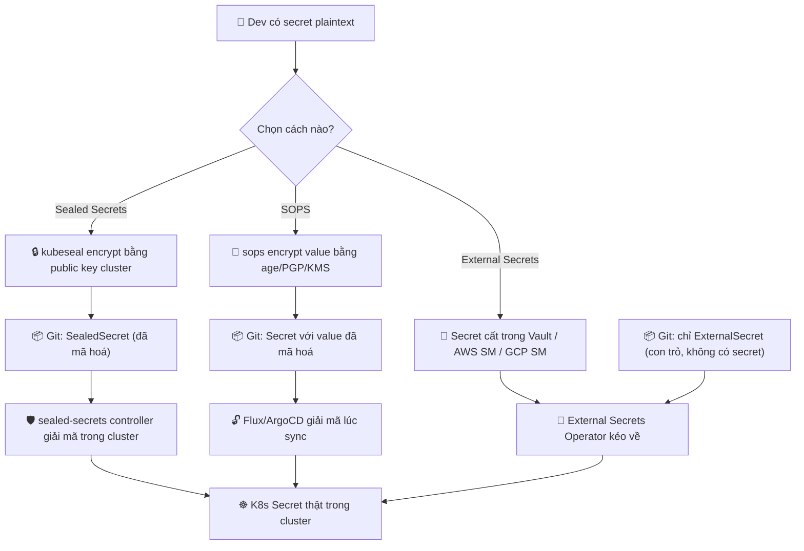
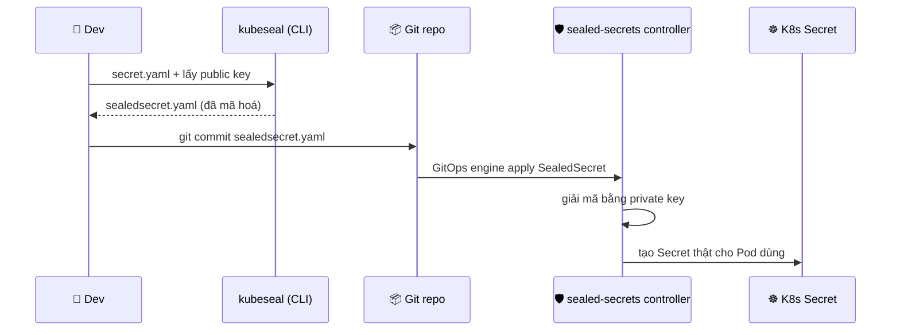
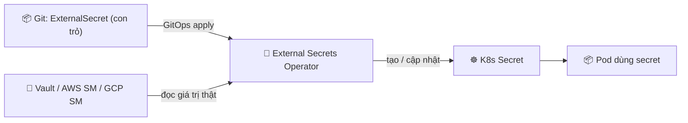

# Secrets trong GitOps — Sealed Secrets, SOPS, External Secrets

> **Tác giả:** Mr.Rom\
> **Phiên bản:** v1.0.0\
> **Tạo lúc:** 13/06/2026\
> **Cập nhật:** 13/06/2026\
> **Level:** Basic\
> **Tags:** gitops, secrets, sealed-secrets, sops, external-secrets, kubernetes, security\
> **Yêu cầu trước:** [Cấu trúc Repo GitOps](02_repository-structure-and-patterns.md)

> 🎯 *Bài trước bạn đã biết cách tổ chức repo GitOps — tách config, env promotion, app-of-apps. Nhưng có một loại file bạn **tuyệt đối không được** đặt vào repo đó dạng thường: mật khẩu database, API key, token. Sau bài này bạn sẽ hiểu vì sao "commit secret plaintext" là sai lầm chết người, nắm 3 giải pháp chuẩn (Sealed Secrets, SOPS, External Secrets), biết khi nào dùng cái nào, và tự tay seal một Sealed Secret cho mật khẩu database của Acme Shop.*

## 🎯 Sau bài này bạn sẽ

- [ ] Hiểu vì sao **không bao giờ** commit Secret plaintext vào Git — kể cả repo private
- [ ] Phân biệt 3 giải pháp: **Sealed Secrets** (encrypt trong Git), **SOPS** (encrypt từng value), **External Secrets** (secret ở ngoài Git)
- [ ] Đọc được luồng "encrypt → commit → controller giải mã trong cluster" của từng cái
- [ ] Chọn đúng giải pháp qua bảng so sánh + tiêu chí "khi nào dùng cái nào"
- [ ] Tự tay seal một `SealedSecret` cho mật khẩu DB của Acme Shop bằng `kubeseal`
- [ ] Tránh cạm bẫy commit nhầm secret và biết cách xử lý khi lỡ lộ trong Git history

---

## Acme Shop suýt làm một việc rất tệ

Bài trước, Acme Shop đã dựng xong repo `gitops-config` gọn gàng: thư mục `apps/`, overlay theo env, app-of-apps. App web cần kết nối Postgres, nên cần một biến `DATABASE_URL` chứa mật khẩu. Theo đúng kiến thức Kubernetes cơ bản, bạn tạo một `Secret`:

```yaml
# ❌ KHÔNG BAO GIỜ commit file này — đây là ví dụ để CẢNH BÁO
apiVersion: v1
kind: Secret
metadata:
  name: acme-db
  namespace: production
type: Opaque
stringData:
  password: "SuperSecret123!"      # mật khẩu Postgres production NẰM TRẦN ở đây
```

Một bạn trong team định `git add` file này vào `gitops-config` để ArgoCD/Flux tự apply. Nghe rất "GitOps" — mọi thứ khai báo trong Git. Nhưng dừng lại đã.

Kubernetes `Secret` **không hề mã hoá** giá trị — nó chỉ **encode Base64**. Mà Base64 là *encoding*, không phải *encryption*: ai cũng giải ngược được trong một giây. Đẩy file này lên Git, dù repo là **private**, đồng nghĩa:

- Mọi người có quyền đọc repo (cả CI runner, cả integration của bên thứ ba) thấy mật khẩu production.
- Git lưu **lịch sử vĩnh viễn** — xoá file ở commit sau, mật khẩu vẫn còn trong commit cũ. Lộ là lộ mãi mãi.
- Repo private hôm nay có thể bị set nhầm public ngày mai, hoặc bị clone bởi laptop bị hack. Một biến cố nhỏ → toàn bộ secret bay.

> [!CAUTION]
> Base64 **không phải** mã hoá. `echo "U3VwZXJTZWNyZXQxMjMh" | base64 -d` giải ra `SuperSecret123!` ngay tức khắc. Đừng bao giờ coi `data:` trong K8s Secret là "đã được bảo vệ" — nó chỉ là chữ thường được viết kiểu khác.

Vậy GitOps đòi "mọi thứ trong Git" — mà secret lại "không được trong Git". Mâu thuẫn này giải quyết thế nào? Câu trả lời là: **không commit secret trần, mà commit phiên bản đã mã hoá** (Sealed Secrets, SOPS), **hoặc để secret hẳn bên ngoài Git** rồi đồng bộ vào cluster (External Secrets). Cả ba đều giữ được tinh thần GitOps mà không hề rò rỉ.

---

## 1️⃣ Bài toán cốt lõi: GitOps muốn mọi thứ trong Git, secret thì không thể

Trước khi xem giải pháp, phải nắm rõ **bản chất xung đột**. GitOps đặt ra nguyên tắc: trạng thái mong muốn của hệ thống nằm declarative trong Git, và một controller tự đồng bộ cluster theo Git. Nhưng `Secret` lại là thứ duy nhất *không thể* nằm trần trong Git.

🪞 **Ẩn dụ đời thường**: hãy hình dung repo GitOps như một **tủ kính trưng bày** đặt giữa sảnh công ty — ai đi qua cũng nhìn thấy bên trong. Bạn để bản vẽ thiết kế, danh sách sản phẩm, sơ đồ phòng ban trong tủ thì OK. Nhưng **chìa khoá két sắt** mà để trần trong tủ kính thì… ai cũng cầm được. Ba giải pháp trong bài tương ứng ba cách xử lý chìa khoá:

- **Sealed Secrets** — bỏ chìa vào một **hộp khoá số** rồi mới đặt vào tủ kính. Hộp chỉ mở được bằng mã mà *duy nhất phòng bảo vệ trong toà nhà* (controller trong cluster) biết. Người ngoài nhìn thấy hộp nhưng không mở nổi.
- **SOPS** — vẫn để "tài liệu" trong tủ, nhưng riêng dòng chìa khoá thì **bôi đen mã hoá**, chỉ ai có chìa giải mã (age/PGP/KMS key) mới đọc được.
- **External Secrets** — **không để chìa trong tủ kính chút nào**. Chìa cất ở **két sắt riêng** (Vault / AWS Secrets Manager). Trong tủ kính chỉ dán mẩu giấy "chìa nằm ở ngăn số 7 của két", và bảo vệ tự đi lấy khi cần.

Điểm chung của cả ba: **thứ commit vào Git không bao giờ là secret đọc được**. Khác biệt là *secret đã mã hoá nằm trong Git* (Sealed Secrets, SOPS) hay *secret nằm hẳn ngoài Git* (External Secrets).

> 💡 Hiểu 3 cách tiếp cận rồi, ta xem chúng định vị ra sao trong luồng GitOps qua sơ đồ bên dưới — để thấy "chỗ nào secret được mã hoá, chỗ nào nó được giải mã".



→ Cả ba luồng đều kết thúc tại cùng một chỗ: một `Secret` Kubernetes **thật** nằm trong cluster (đỏ ở cuối) để Pod dùng. Khác biệt cốt lõi nằm ở giữa: với Sealed Secrets và SOPS, *bản mã hoá nằm trong Git*; với External Secrets, *Git chỉ chứa con trỏ*, secret thật nằm ở kho ngoài. Giờ ta mổ xẻ từng cái.

---

## 2️⃣ Sealed Secrets — bỏ secret vào "hộp khoá" chỉ cluster mở được

### Sealed Secrets là gì

**Định nghĩa**: *Sealed Secrets* là một dự án của Bitnami gồm hai phần — một **controller** chạy trong cluster, và một CLI tên `kubeseal`. Bạn dùng `kubeseal` mã hoá một `Secret` thường thành một CRD mới tên `SealedSecret`. CRD này **an toàn để commit vào Git** (kể cả repo public), vì chỉ controller — với private key giữ kín trong cluster — mới giải mã ngược lại thành `Secret` thật được.

🪞 **Ẩn dụ**: nhớ lại tủ kính ở phần trước — `SealedSecret` là cái **hộp khoá số đặt trong tủ**. Ai cũng nhìn thấy hộp, ai cũng cầm hộp được, nhưng mở thì chỉ "phòng bảo vệ" (controller) có mã. Public key giống như "khe nhét tiền vào hộp" — ai cũng nhét vào được; private key giống "chìa mở đáy hộp" — chỉ bảo vệ giữ.

Cơ chế là **mã hoá bất đối xứng** (asymmetric encryption):

- Controller sinh một cặp khoá khi cài. **Public key** dùng để *mã hoá* — `kubeseal` lấy public key này (ai cũng lấy được, không cần giữ bí mật).
- **Private key** dùng để *giải mã* — nằm an toàn trong cluster, không bao giờ rời cluster, không bao giờ vào Git.

> [!IMPORTANT]
> Vì private key nằm *bên trong* cluster, `SealedSecret` mã hoá cho cluster A **không** giải được ở cluster B (khác private key). Đây là tính năng bảo mật cố ý, nhưng cũng là điều phải lưu ý: backup private key của controller là việc bắt buộc, nếu không mất cluster là mất luôn khả năng giải secret.

### Luồng hoạt động

Để thấy rõ "ai làm gì, lúc nào", hãy xem trình tự từ lúc dev có secret tới lúc Pod dùng được:



→ Điểm mấu chốt: thứ đi qua Git (mũi tên `git commit`) là **bản đã mã hoá**. Việc giải mã chỉ xảy ra *bên trong* cluster, do controller làm, ở bước cuối. Dev không cần giữ bất kỳ private key nào — chỉ cần public key (không bí mật) để seal.

### Đặc điểm cần nhớ ở mức Basic

`SealedSecret` có vài đặc tính quan trọng mà bạn nên biết trước khi dùng — đặc biệt là cơ chế "scope" quyết định secret có thể đổi tên/namespace hay không:

| Đặc điểm | Ý nghĩa |
|---|---|
| CRD `SealedSecret` | Là resource an toàn commit vào Git; controller "mở" nó ra thành `Secret` |
| Public key để encrypt | Lấy bằng `kubeseal --fetch-cert`, không bí mật, có thể đưa cho cả CI |
| Private key trong cluster | Không bao giờ rời cluster — cần **backup riêng** phòng mất cluster |
| Scope `strict` (mặc định) | `SealedSecret` chỉ giải được đúng `name` + `namespace` đã seal — đổi 1 trong 2 là hỏng |
| Scope `namespace-wide` | Cho phép đổi `name` trong cùng namespace |
| Scope `cluster-wide` | Giải được ở mọi name/namespace — tiện nhưng kém an toàn hơn |

> Hiểu Sealed Secrets rồi, ta xem cách tiếp cận khác — SOPS — không cần controller riêng mà tận dụng luôn engine GitOps để giải mã.

---

## 3️⃣ SOPS — mã hoá từng value, Flux & ArgoCD giải mã khi sync

### SOPS là gì

**Định nghĩa**: *SOPS* (Secrets OPerationS) là một công cụ của Mozilla để mã hoá file cấu hình (YAML, JSON, ENV…). Điểm hay nhất của SOPS là nó **chỉ mã hoá phần giá trị (value)**, giữ nguyên phần khoá (key) — nên file vẫn đọc được cấu trúc, vẫn diff được trong Git, chỉ riêng giá trị nhạy cảm bị mã hoá. SOPS hỗ trợ nhiều "backend" khoá: **age** (đơn giản, hiện đại), **PGP**, hoặc **KMS** của cloud (AWS KMS, GCP KMS, Azure Key Vault).

🪞 **Ẩn dụ**: SOPS giống **bút bôi đen tài liệu mật**. Tờ tài liệu vẫn để trong tủ kính, vẫn đọc được "Tên: …, Phòng ban: …", nhưng riêng dòng "Mật khẩu: ████████" thì bị bôi đen. Chỉ ai cầm "đèn giải mã" (age/PGP/KMS key) mới đọc được phần bôi đen.

Khác biệt lớn nhất so với Sealed Secrets: SOPS **không cần một controller chuyên dụng** để giải mã. Thay vào đó, **chính GitOps engine** (Flux có sẵn tích hợp SOPS; ArgoCD dùng plugin như `argocd-vault-plugin` hoặc `helm-secrets`) sẽ giải mã file SOPS *lúc sync*, rồi mới apply vào cluster.

Một file Secret đã SOPS-encrypt trông như sau — chú ý `password` đã thành chuỗi mã hoá, còn cấu trúc vẫn rõ ràng:

```yaml
# acme-db.sops.yaml — value đã mã hoá, key vẫn đọc được
apiVersion: v1
kind: Secret
metadata:
    name: acme-db
    namespace: production
type: Opaque
stringData:
    password: ENC[AES256_GCM,data:Yk3v...,iv:9aF...,tag:0pQ...,type:str]
sops:
    age:
        - recipient: age1ql3z7hjy54pw3hyww5ayyfg7zqgvc7w3j2elw8zmrj2kg5sfn9aqmcac8j
          enc: |
            -----BEGIN AGE ENCRYPTED FILE-----
            YWdlLWVuY3J5cHRpb24ub3JnL3YxCi0+IFgyNTUxOSBNZ...
            -----END AGE ENCRYPTED FILE-----
    encrypted_regex: ^(data|stringData)$
    version: 3.9.0
```

→ Bạn thấy `metadata` và `type` vẫn plaintext (diff được khi review PR), chỉ giá trị trong `stringData` bị mã hoá. Khối `sops:` ở cuối lưu metadata để giải mã (ai là recipient, regex nào được mã hoá). File này commit vào Git an toàn vì không có "đèn giải mã" thì không đọc được value.

### Flux giải mã SOPS thế nào

Với Flux, bạn chỉ cần (1) đưa private key vào cluster dưới dạng một Secret, và (2) trỏ `Kustomization` tới nó qua trường `decryption`. Cấu hình tối thiểu:

```yaml
# Kustomization của Flux — bật giải mã SOPS bằng age
apiVersion: kustomize.toolkit.fluxcd.io/v1
kind: Kustomization
metadata:
  name: acme-shop-web
  namespace: flux-system
spec:
  interval: 5m
  sourceRef:
    kind: GitRepository
    name: acme-gitops
  path: ./apps/web/production
  prune: true
  decryption:
    provider: sops               # bật giải mã SOPS
    secretRef:
      name: sops-age             # Secret chứa private key age, đã tạo trong cluster
```

→ Lúc reconcile, `kustomize-controller` của Flux thấy file `*.sops.yaml`, dùng private key trong Secret `sops-age` để giải mã value, rồi mới apply `Secret` thật vào cluster. Private key age (`sops-age`) là thứ duy nhất **không** nằm trong Git — bạn tạo nó một lần bằng `kubectl create secret` lúc bootstrap.

> [!NOTE]
> Với cloud KMS (AWS KMS / GCP KMS), bạn thậm chí không cần đưa private key vào cluster — Flux/controller dùng **IAM của cluster** để gọi KMS giải mã. Cách này tránh được việc lưu private key trong cluster, hợp với team đã ở sẵn trên cloud có KMS.

### Vì sao nhiều team thích SOPS

So với Sealed Secrets, SOPS có một điểm cộng lớn cho review: vì chỉ value bị mã hoá, **PR diff vẫn đọc được** "đã đổi key nào, thêm key nào" — chỉ không thấy giá trị. Với Sealed Secrets, cả khối ciphertext đổi mỗi lần re-seal nên diff gần như vô nghĩa. Đổi lại, SOPS đòi mỗi dev (và CI) phải quản khoá giải mã, hơi phức tạp hơn mô hình "public key cho mọi người" của Sealed Secrets.

> Đã có hai cách "mã hoá rồi cho vào Git", giờ xem cách thứ ba theo triết lý ngược lại — không cho secret vào Git chút nào.

---

## 4️⃣ External Secrets Operator (ESO) — để secret hẳn ngoài Git

### ESO là gì

**Định nghĩa**: *External Secrets Operator* (ESO) là một operator Kubernetes đồng bộ secret **từ một kho secret bên ngoài** — như HashiCorp Vault, AWS Secrets Manager, GCP Secret Manager, Azure Key Vault — **vào** một `Secret` Kubernetes trong cluster. Điểm cốt lõi: **secret thật không bao giờ nằm trong Git**. Git chỉ chứa một CRD `ExternalSecret` — bản chất là *con trỏ* nói "lấy key tên X ở kho Y, đặt vào Secret tên Z".

🪞 **Ẩn dụ**: ESO giống **két sắt ngân hàng + nhân viên giao nhận**. Chìa khoá thật (secret) cất trong **két ngân hàng** (Vault / AWS SM). Trong tủ kính GitOps, bạn chỉ dán **phiếu yêu cầu**: "Lấy giúp gói số 7 ở két ngân hàng, để vào ngăn `acme-db`". Nhân viên giao nhận (ESO) đọc phiếu, đến ngân hàng lấy đúng gói, mang về cluster. Phiếu thì để công khai cũng không sao — nó không phải chìa khoá.

ESO làm việc với hai CRD chính:

- **`SecretStore`** (hoặc `ClusterSecretStore`) — khai báo "kho secret nằm ở đâu, xác thực thế nào" (vd: Vault tại URL này, dùng token này).
- **`ExternalSecret`** — khai báo "lấy key nào từ kho đó, ánh xạ vào K8s Secret nào".

### Luồng hoạt động

`ExternalSecret` là thứ duy nhất nằm trong Git. ESO định kỳ đọc nó, đi lấy giá trị thật từ kho ngoài, rồi tạo/cập nhật `Secret` Kubernetes:



→ Secret thật chỉ chạy trên trục **Vault → ESO → cluster**, *không hề* đi qua Git. Git chỉ có `ExternalSecret`. Lợi ích kèm theo: nếu bạn **xoay (rotate)** mật khẩu trong Vault, ESO tự đồng bộ giá trị mới vào cluster ở chu kỳ tiếp theo — Git không cần thay đổi gì.

Một `ExternalSecret` tối thiểu, lấy mật khẩu DB của Acme Shop từ Vault:

```yaml
# external-secret.yaml — con trỏ, an toàn commit vào Git
apiVersion: external-secrets.io/v1
kind: ExternalSecret
metadata:
  name: acme-db
  namespace: production
spec:
  refreshInterval: 1h            # cứ 1 giờ đồng bộ lại từ kho ngoài
  secretStoreRef:
    name: vault-backend          # trỏ tới SecretStore đã khai báo
    kind: SecretStore
  target:
    name: acme-db                # tên K8s Secret sẽ được tạo
    creationPolicy: Owner
  data:
    - secretKey: password        # key trong K8s Secret
      remoteRef:
        key: secret/data/acme/db # đường dẫn trong Vault
        property: password       # field trong gói đó
```

→ Không một ký tự mật khẩu nào xuất hiện ở đây. ESO đọc `remoteRef`, vào Vault lấy `password` tại `secret/data/acme/db`, rồi tạo K8s Secret `acme-db` với key `password`. Đẩy file này lên Git công khai cũng vô hại — nó chỉ là địa chỉ, không phải nội dung.

> [!NOTE]
> ESO là lựa chọn tự nhiên khi **đã có sẵn** một kho secret tập trung (công ty dùng Vault, hoặc đã ở AWS với Secrets Manager). Nếu chưa có kho nào, dựng Vault chỉ để chứa vài secret nhỏ là "dùng dao mổ trâu giết gà" — lúc đó Sealed Secrets hoặc SOPS nhẹ hơn nhiều.

---

## 5️⃣ Đặt lên bàn cân — chọn cái nào?

Đã hiểu cả ba, giờ là lúc so sánh để chọn. Bảng dưới gom những tiêu chí một team thực sự cân nhắc — không phải "cái nào xịn nhất" mà là "cái nào hợp tình huống của bạn":

| Tiêu chí | **Sealed Secrets** | **SOPS** | **External Secrets (ESO)** |
|---|---|---|---|
| Secret nằm ở đâu | Đã mã hoá, **trong Git** | Đã mã hoá, **trong Git** | **Ngoài Git** (Vault/AWS SM/GCP SM) |
| Cần thành phần gì | Controller + CLI `kubeseal` | CLI `sops` + key (age/PGP/KMS) | Operator ESO + kho secret ngoài |
| Ai giải mã | sealed-secrets controller | GitOps engine (Flux/ArgoCD plugin) | ESO kéo từ kho ngoài |
| PR diff đọc được không | ❌ Cả khối ciphertext đổi | ✅ Thấy key đổi, value ẩn | ✅ Chỉ là con trỏ, rõ ràng |
| Xoay (rotate) secret | Phải re-seal + commit lại | Phải re-encrypt + commit lại | ✅ Tự đồng bộ, Git không đổi |
| Phụ thuộc hạ tầng ngoài | Không | Không (trừ khi dùng cloud KMS) | Có — cần Vault/cloud SM sẵn |
| Độ phức tạp setup | Thấp | Trung bình (quản key) | Cao hơn (kho ngoài + xác thực) |
| Hợp nhất khi | Cluster nhỏ/vừa, muốn nhanh gọn | Cần review diff, đã quen quản key/KMS | Đã có kho secret tập trung, cần rotate |

> ⚠️ Bảng so sánh **bản chất**, không phải "điểm số". Cả ba đều giải được bài toán "không commit secret trần". Một dòng đáng chú ý là **xoay secret**: với Sealed Secrets/SOPS bạn phải commit lại khi đổi mật khẩu; với ESO chỉ cần đổi trong kho ngoài, cluster tự cập nhật — đây là khác biệt thực tế lớn cho team rotate secret thường xuyên.

Để dễ nhớ, có thể tóm gọn:

- **Sealed Secrets** = *"khoá vào hộp rồi cho vào Git"* — đơn giản nhất, không cần hạ tầng ngoài. Hợp khi bạn muốn bắt đầu nhanh.
- **SOPS** = *"bôi đen từng giá trị"* — review-friendly, hợp team đã quen quản khoá hoặc dùng cloud KMS.
- **ESO** = *"để secret ở két, Git chỉ giữ phiếu"* — mạnh nhất về rotate và tập trung, nhưng cần sẵn Vault/cloud SM.

### Tín hiệu chọn nhanh

- Cluster nhỏ/vừa, chưa có Vault, muốn dùng ngay → **Sealed Secrets**.
- Cần review PR thấy "đổi key gì", hoặc đã có AWS/GCP KMS → **SOPS**.
- Công ty đã chuẩn hoá secret trong Vault / AWS Secrets Manager, cần auto-rotate → **ESO**.

---

## 6️⃣ Hands-on: seal mật khẩu DB cho Acme Shop bằng Sealed Secrets

Giờ ta làm thật. Mục tiêu: tạo một `SealedSecret` cho mật khẩu Postgres của Acme Shop, an toàn để commit vào `gitops-config`. Ta dùng Sealed Secrets vì nó nhẹ và không cần hạ tầng ngoài — phù hợp nhất để bắt đầu.

> [!IMPORTANT]
> Cần một cluster Kubernetes đang chạy (minikube/kind cũng được) và `kubectl` đã trỏ đúng cluster. Kiểm tra nhanh bằng `kubectl cluster-info` trước khi bắt đầu.

### 🛠️ Bước 1: Cài controller Sealed Secrets vào cluster

Controller là phần sinh cặp khoá và giải mã `SealedSecret` về sau. Cài bằng manifest chính thức (thay version tag bằng bản mới nhất khi làm thật):

```bash
kubectl apply -f https://github.com/bitnami-labs/sealed-secrets/releases/download/v0.27.1/controller.yaml
```

Đợi controller sẵn sàng trong namespace `kube-system`:

```bash
kubectl rollout status deployment/sealed-secrets-controller -n kube-system
```

Kết quả mong đợi:

```
deployment "sealed-secrets-controller" successfully rolled out
```

Dòng này báo controller đã chạy ổn. Lúc khởi động lần đầu, nó tự sinh một cặp khoá public/private và lưu private key dưới dạng một Secret trong `kube-system` — bạn không cần đụng tới, nhưng nhớ rằng đây là thứ cần backup.

### 🛠️ Bước 2: Cài CLI `kubeseal` trên máy bạn

`kubeseal` là công cụ mã hoá phía client. Trên macOS dùng Homebrew:

```bash
brew install kubeseal
```

Kiểm tra cài đặt:

```bash
kubeseal --version
```

Kết quả mong đợi (số version có thể khác):

```
kubeseal version: v0.27.1
```

> [!TIP]
> Nếu không dùng macOS, tải binary trực tiếp từ trang Releases của `bitnami-labs/sealed-secrets` trên GitHub rồi `chmod +x` và đưa vào `PATH`. CLI `kubeseal` chỉ cần *public key* để mã hoá nên cài ở đâu cũng được, kể cả trên CI runner.

### 🛠️ Bước 3: Tạo Secret thường (LOCAL — không commit)

Đầu tiên tạo một `Secret` Kubernetes bình thường, nhưng **chỉ ở local**, không apply lên cluster và **tuyệt đối không commit**. Dùng `--dry-run=client` để chỉ sinh ra YAML chứ không gửi lên cluster:

```bash
kubectl create secret generic acme-db \
  --namespace=production \
  --from-literal=password='SuperSecret123!' \
  --dry-run=client -o yaml > /tmp/acme-db-secret.yaml
```

File `/tmp/acme-db-secret.yaml` chứa mật khẩu dạng Base64. Đây là file **nhạy cảm** — nó nằm ở `/tmp` để dùng tạm rồi xoá, không bao giờ đặt vào thư mục repo. Xem nhanh để hiểu nó chứa gì:

```bash
cat /tmp/acme-db-secret.yaml
```

Kết quả:

```yaml
apiVersion: v1
data:
  password: U3VwZXJTZWNyZXQxMjMh
kind: Secret
metadata:
  creationTimestamp: null
  name: acme-db
  namespace: production
```

Để ý `password: U3VwZXJTZWNyZXQxMjMh` — đó là Base64 của `SuperSecret123!`, giải ngược một giây ra. Chính vì thế file này **không được** lên Git. Bước tiếp theo ta sẽ "niêm phong" nó.

### 🛠️ Bước 4: Seal thành `SealedSecret`

Đưa file Secret thường vào `kubeseal`. Lệnh này lấy public key *từ controller trong cluster* để mã hoá, rồi xuất ra một `SealedSecret`:

```bash
kubeseal --format=yaml \
  --controller-namespace=kube-system \
  --controller-name=sealed-secrets-controller \
  < /tmp/acme-db-secret.yaml \
  > apps/web/production/acme-db-sealedsecret.yaml
```

Xem kết quả — đây mới là file **an toàn để commit**:

```bash
cat apps/web/production/acme-db-sealedsecret.yaml
```

Kết quả (chuỗi mã hoá sẽ khác trên máy bạn):

```yaml
apiVersion: bitnami.com/v1alpha1
kind: SealedSecret
metadata:
  creationTimestamp: null
  name: acme-db
  namespace: production
spec:
  encryptedData:
    password: AgBy3i4OJSWK+PiTySYZ...rất-dài...vQ9z8Q==
  template:
    metadata:
      creationTimestamp: null
      name: acme-db
      namespace: production
    type: Opaque
```

So với Bước 3, giá trị `password` giờ là một chuỗi mã hoá bất đối xứng **dài và vô nghĩa** với người ngoài — chỉ controller giải được. Khối `template` mô tả `Secret` mà controller sẽ tạo ra sau khi giải mã. File này commit vào Git public cũng an toàn.

> [!WARNING]
> `SealedSecret` được seal theo scope `strict` mặc định: nó chỉ giải được đúng `name: acme-db` + `namespace: production`. Nếu sau này bạn copy nó sang namespace khác hoặc đổi tên, controller sẽ từ chối giải mã. Muốn linh hoạt hơn thì seal lại với `--scope namespace-wide`.

### 🛠️ Bước 5: Xoá file nhạy cảm + commit `SealedSecret`

Xoá ngay file Secret thường ở `/tmp` để không sót mật khẩu trên đĩa:

```bash
rm /tmp/acme-db-secret.yaml
```

Giờ chỉ còn `SealedSecret` (đã mã hoá) trong thư mục repo. Commit nó như mọi manifest GitOps khác:

```bash
git add apps/web/production/acme-db-sealedsecret.yaml
git commit -m "feat: thêm SealedSecret cho mật khẩu DB của Acme Shop"
```

Kết quả mong đợi:

```
[main 7f3a9c2] feat: thêm SealedSecret cho mật khẩu DB của Acme Shop
 1 file changed, 18 insertions(+)
 create mode 100644 apps/web/production/acme-db-sealedsecret.yaml
```

Dòng `1 file changed` xác nhận chỉ file `SealedSecret` (đã mã hoá) được commit. Khi push lên, ArgoCD/Flux sẽ apply `SealedSecret` này, controller giải mã nó thành `Secret` `acme-db` thật trong namespace `production` để Pod web dùng. Vòng GitOps khép kín mà mật khẩu chưa bao giờ nằm trần trong Git.

### 🛠️ Bước 6 (tuỳ chọn): kiểm chứng controller đã tạo Secret thật

Nếu cluster của bạn cũng đang chạy GitOps (hoặc bạn apply tay để thử), kiểm tra controller đã "mở hộp" thành công:

```bash
kubectl apply -f apps/web/production/acme-db-sealedsecret.yaml
kubectl get secret acme-db -n production
```

Kết quả mong đợi:

```
NAME      TYPE     DATA   AGE
acme-db   Opaque   1      3s
```

Cột `TYPE` là `Opaque` và `DATA` là `1` (một key `password`) — nghĩa là controller đã giải mã `SealedSecret` và tạo ra `Secret` thật. Pod nào mount `acme-db` giờ sẽ lấy được mật khẩu Postgres.

> [!CAUTION]
> Đừng dùng `kubectl get secret acme-db -o yaml` rồi paste output đi đâu — nó hiển thị Base64 của mật khẩu thật. Cấm dán output đó vào ticket, Slack hay log công khai.

---

## 💡 Cạm bẫy thường gặp & Best practice

### ❌ Cạm bẫy: commit nhầm Secret plaintext, tưởng "repo private là an toàn"

- **Triệu chứng**: file `secret.yaml` (hoặc `.env`, `values-prod.yaml` có mật khẩu) bị `git add` rồi push, với suy nghĩ "repo mình private mà".
- **Nguyên nhân**: nhầm Base64 với mã hoá, và đánh giá thấp rủi ro repo private (CI runner, integration bên thứ ba, đổi nhầm sang public, laptop bị hack).
- **Cách tránh**: thêm pattern nhạy cảm vào `.gitignore` (`*.env`, `*secret*.yaml` cho file plaintext, `*.key`, `*.pem`); chạy secret scanner (gitleaks, trufflehog) ở pre-commit hook; chỉ commit `SealedSecret`/`*.sops.yaml`/`ExternalSecret`.

### ❌ Cạm bẫy: lỡ commit secret rồi xoá ở commit sau, tưởng "thế là xong"

- **Triệu chứng**: thấy lộ secret, vội `git rm secret.yaml` + commit + push, nghĩ đã sạch.
- **Nguyên nhân**: Git lưu **toàn bộ lịch sử** — secret vẫn nằm nguyên trong commit cũ, ai cũng `git log -p` / `git show <commit>` ra được.
- **Cách tránh**: coi như secret **đã lộ vĩnh viễn** → việc số 1 là **xoay (rotate) ngay** mật khẩu/token đó ở hệ thống gốc (đổi password Postgres, revoke API key). Xoá khỏi history (`git filter-repo` hoặc BFG) chỉ là dọn dẹp, **không** thay được việc rotate.

### ❌ Cạm bẫy: mất cluster là mất luôn private key Sealed Secrets

- **Triệu chứng**: cluster chết/tạo lại, apply lại các `SealedSecret` cũ thì controller mới không giải được (private key khác).
- **Nguyên nhân**: private key nằm trong cluster; cluster mới = cặp khoá mới.
- **Cách tránh**: **backup private key** của controller ngay sau khi cài. Cụ thể: `kubectl get secret -n kube-system -l sealedsecrets.bitnami.com/sealed-secrets-key -o yaml > sealed-secrets-key-backup.yaml`, rồi cất file backup này ở nơi *an toàn ngoài Git* (vault/password manager), không bao giờ commit.

### ✅ Best practice: chuẩn hoá một giải pháp cho cả tổ chức

- **Vì sao**: mỗi repo/team dùng một kiểu (chỗ Sealed, chỗ SOPS, chỗ commit nhầm plaintext) → khó audit, dễ sót lỗ hổng.
- **Cách áp dụng**: chốt một giải pháp mặc định theo bối cảnh (chưa có Vault → Sealed Secrets; đã có Vault/cloud SM → ESO), viết vào tài liệu chuẩn của repo `gitops-config`, và bật secret scanning ở CI để chặn plaintext lọt vào.

### ✅ Best practice: tách secret ra khỏi manifest thường, đặt cạnh app nhưng đánh dấu rõ

- **Vì sao**: trộn secret (dù đã mã hoá) lẫn config thường dễ gây nhầm khi review và khó áp policy.
- **Cách áp dụng**: đặt `SealedSecret`/`ExternalSecret` thành file riêng có hậu tố rõ ràng (`*-sealedsecret.yaml`, `*-externalsecret.yaml`); với Sealed Secrets cân nhắc tắt `prune` cho resource secret để tránh xoá nhầm gây downtime khi file bị lỡ tay xoá khỏi Git.

---

## 🧠 Tự kiểm tra (Self-check)

**Q1.** Vì sao không được commit K8s `Secret` plaintext vào Git, dù repo là private?

<details>
<summary>💡 Xem giải thích</summary>

Vì K8s `Secret` chỉ **encode Base64** chứ không mã hoá — ai cũng giải ngược một giây. Repo private vẫn rủi ro: CI runner, integration bên thứ ba, laptop bị hack, hoặc lỡ tay đổi repo sang public đều làm lộ secret. Quan trọng nhất: Git lưu **lịch sử vĩnh viễn**, nên secret từng commit là lộ mãi mãi dù sau đó có xoá file. Giải pháp: commit bản đã mã hoá (Sealed Secrets/SOPS) hoặc để secret ngoài Git (ESO).

</details>

**Q2.** Sealed Secrets dùng cơ chế khoá gì? Public key và private key mỗi cái dùng cho việc gì, nằm ở đâu?

<details>
<summary>💡 Xem giải thích</summary>

Sealed Secrets dùng **mã hoá bất đối xứng**. **Public key** dùng để *mã hoá* (encrypt) — `kubeseal` lấy nó qua `--fetch-cert`, không bí mật, có thể đưa cho cả CI. **Private key** dùng để *giải mã* (decrypt) — nằm an toàn trong cluster (controller giữ), không bao giờ rời cluster, không vào Git. Hệ quả: `SealedSecret` seal cho cluster A không giải được ở cluster B; và phải backup private key phòng mất cluster.

</details>

**Q3.** Khác biệt cốt lõi giữa SOPS và Sealed Secrets về việc "ai giải mã" và "review PR" là gì?

<details>
<summary>💡 Xem giải thích</summary>

**Ai giải mã**: Sealed Secrets cần một **controller chuyên dụng** trong cluster giải mã; SOPS **không cần controller riêng** — chính GitOps engine (Flux tích hợp sẵn, ArgoCD qua plugin) giải mã lúc sync. **Review PR**: SOPS chỉ mã hoá *value*, giữ nguyên *key/cấu trúc* → diff vẫn đọc được "đổi key nào, thêm key nào", chỉ ẩn giá trị; Sealed Secrets mã hoá cả khối → ciphertext đổi mỗi lần re-seal, diff gần như vô nghĩa.

</details>

**Q4.** Với External Secrets Operator, secret thật nằm ở đâu, và Git chứa gì? Khi xoay (rotate) secret thì sao?

<details>
<summary>💡 Xem giải thích</summary>

Secret thật nằm **ngoài Git**, trong một kho secret tập trung (Vault / AWS Secrets Manager / GCP Secret Manager). Git chỉ chứa CRD `ExternalSecret` — một **con trỏ** nói "lấy key X từ kho Y, đặt vào K8s Secret Z", không chứa giá trị nào. Khi rotate: bạn chỉ đổi giá trị **trong kho ngoài**, ESO tự đồng bộ vào cluster ở chu kỳ `refreshInterval` tiếp theo — **Git không cần thay đổi gì**. Đây là điểm mạnh lớn nhất của ESO so với Sealed Secrets/SOPS (vốn phải re-encrypt + commit lại khi rotate).

</details>

**Q5.** Acme Shop lỡ commit `database.env` chứa mật khẩu Postgres production lên Git từ tuần trước. Việc đầu tiên cần làm là gì, và vì sao xoá file khỏi history là chưa đủ?

<details>
<summary>💡 Xem giải thích</summary>

Việc số 1 là **xoay (rotate) ngay** mật khẩu Postgres đó — đổi password ở chính database — vì phải coi như nó **đã lộ vĩnh viễn**. Xoá khỏi Git history (`git filter-repo`/BFG) **chưa đủ** vì: (1) repo có thể đã được clone/fork/cache ở nhiều nơi (CI, laptop, mirror) mà bạn không kiểm soát được; (2) ngay cả khi dọn sạch history trên remote, không có gì đảm bảo chưa ai đọc/copy trong khoảng thời gian lộ. Dọn history chỉ là bước vệ sinh sau, không thay được việc đổi mật khẩu.

</details>

---

## ⚡ Tra cứu nhanh (Cheatsheet)

| Mục đích | Lệnh / Cú pháp |
|---|---|
| Cài controller Sealed Secrets | `kubectl apply -f https://github.com/bitnami-labs/sealed-secrets/releases/download/v0.27.1/controller.yaml` |
| Cài CLI kubeseal (macOS) | `brew install kubeseal` |
| Tạo Secret thường (local, không commit) | `kubectl create secret generic <name> --from-literal=k=v --dry-run=client -o yaml > /tmp/s.yaml` |
| Seal thành SealedSecret | `kubeseal --format=yaml < /tmp/s.yaml > sealedsecret.yaml` |
| Lấy public key của cluster | `kubeseal --fetch-cert > pub-cert.pem` |
| Seal bằng public key offline | `kubeseal --cert pub-cert.pem --format=yaml < /tmp/s.yaml > sealedsecret.yaml` |
| Seal scope namespace-wide | `kubeseal --scope namespace-wide --format=yaml < /tmp/s.yaml > ss.yaml` |
| Backup private key Sealed Secrets | `kubectl get secret -n kube-system -l sealedsecrets.bitnami.com/sealed-secrets-key -o yaml > backup.yaml` |
| Mã hoá file bằng SOPS (age) | `sops --encrypt --age <age-pubkey> secret.yaml > secret.sops.yaml` |
| Giải mã file SOPS xem tạm | `sops --decrypt secret.sops.yaml` |
| Giải Base64 (chứng minh ≠ mã hoá) | `echo 'U3VwZXJTZWNyZXQxMjMh' \| base64 -d` |

```yaml
# === apiVersion các CRD secret (tra nhanh khi viết YAML) ===
# SealedSecret (Bitnami):
#   bitnami.com/v1alpha1
# ExternalSecret / SecretStore / ClusterSecretStore (ESO):
#   external-secrets.io/v1
# Kustomization có decryption SOPS (Flux):
#   kustomize.toolkit.fluxcd.io/v1   (dùng spec.decryption.provider: sops)
```

---

## 📚 Từ Điển Thuật Ngữ (Glossary)

| EN | VN | Giải thích |
|---|---|---|
| Secret (K8s) | Bí mật Kubernetes | Object chứa dữ liệu nhạy cảm; **chỉ encode Base64**, không mã hoá |
| Base64 | (giữ nguyên) | Cách *encode* (mã hoá lại dạng chữ), giải ngược dễ — KHÔNG phải encryption |
| Encryption | Mã hoá | Biến dữ liệu thành dạng chỉ ai có khoá mới đọc được |
| Sealed Secrets | (giữ nguyên) | Dự án Bitnami: encrypt Secret thành `SealedSecret` an toàn commit |
| SealedSecret | (giữ nguyên) | CRD chứa secret đã mã hoá; chỉ controller trong cluster giải được |
| kubeseal | (giữ nguyên) | CLI client mã hoá Secret thành SealedSecret bằng public key |
| Asymmetric encryption | Mã hoá bất đối xứng | Cặp khoá: public để encrypt, private để decrypt |
| SOPS | (giữ nguyên) | Công cụ Mozilla mã hoá riêng *value* trong file YAML/JSON/ENV |
| age | (giữ nguyên) | Backend khoá hiện đại, đơn giản cho SOPS (thay PGP) |
| KMS | Key Management Service | Dịch vụ quản khoá của cloud (AWS/GCP/Azure) để encrypt/decrypt |
| External Secrets Operator | (ESO) | Operator đồng bộ secret từ kho ngoài vào K8s Secret |
| ExternalSecret | (giữ nguyên) | CRD con trỏ: lấy key nào từ kho ngoài, đặt vào Secret nào |
| SecretStore | (giữ nguyên) | CRD khai báo kho secret ngoài nằm đâu, xác thực thế nào |
| Vault | (giữ nguyên) | Kho secret tập trung của HashiCorp |
| Rotate (secret) | Xoay khoá | Thay mật khẩu/token cũ bằng giá trị mới định kỳ hoặc khi lộ |
| Scope (Sealed Secrets) | Phạm vi | Quy tắc SealedSecret giải được ở name/namespace nào (strict/namespace/cluster-wide) |

---

## 🔗 Liên kết & Tài nguyên

### 🧭 Định hướng lộ trình học

- ⬅️ **Bài trước:** [Cấu trúc Repo GitOps — Tách config, env promotion, app-of-apps](02_repository-structure-and-patterns.md)
- ➡️ **Bài tiếp theo:** [Sync, Drift & Reconciliation — Trái tim của GitOps](04_sync-drift-and-reconciliation.md)
- ↑ **Về cụm:** [GitOps — Declarative Continuous Delivery](../../README.md)

### 🧩 Các chủ đề có thể bạn quan tâm

- [GitOps là gì? — Git làm nguồn chân lý cho vận hành](00_what-is-gitops.md) — nền tảng vì sao mọi thứ phải declarative trong Git
- [ArgoCD vs Flux — Hai GitOps engine hàng đầu](01_flux-vs-argocd.md) — engine nào giải mã SOPS, hỗ trợ secret ra sao
- [GitOps với ArgoCD — Git = Single Source of Truth](../../../ci-cd/lessons/02_intermediate/01_gitops-with-argocd.md) — hands-on ArgoCD chuyên sâu, có nhắc ExternalSecret
- [Kubernetes ConfigMaps & Secrets](../../../kubernetes/lessons/01_basic/03_configmaps-and-secrets.md) — nền tảng K8s Secret trước khi đưa lên GitOps

### 🌐 Tài nguyên tham khảo khác

- [Sealed Secrets (Bitnami) — GitHub](https://github.com/bitnami-labs/sealed-secrets) — controller + kubeseal, hướng dẫn cài đặt và scope
- [SOPS (getsops) — GitHub](https://github.com/getsops/sops) — tài liệu mã hoá value bằng age/PGP/KMS
- [Flux — Mozilla SOPS guide](https://fluxcd.io/flux/guides/mozilla-sops/) — bật giải mã SOPS trong Kustomization
- [External Secrets Operator — tài liệu chính thức](https://external-secrets.io/) — SecretStore/ExternalSecret với Vault/AWS SM/GCP SM
- [gitleaks — GitHub](https://github.com/gitleaks/gitleaks) — quét secret lọt vào Git, dùng ở pre-commit/CI

---

## 📌 Nhật ký thay đổi (Changelog)

- **v1.0.0 (13/06/2026)** — Bản đầu tiên. Vấn đề cốt lõi: KHÔNG commit Secret plaintext (Base64 ≠ encryption; rủi ro repo private + Git history vĩnh viễn). 3 giải pháp: Sealed Secrets (controller Bitnami + kubeseal, mã hoá bất đối xứng, scope strict/namespace/cluster-wide), SOPS (Mozilla, encrypt value bằng age/PGP/KMS, Flux/ArgoCD giải mã khi sync), External Secrets Operator (đồng bộ từ Vault/AWS SM/GCP SM, secret ngoài Git, auto-rotate). 3 sơ đồ mermaid (tổng quan + sequence Sealed Secrets + luồng ESO) + bảng so sánh chọn-cái-nào + hands-on seal mật khẩu DB Acme Shop bằng kubeseal (6 bước) + cạm bẫy commit nhầm / lộ trong history + best practice rotate-first.
