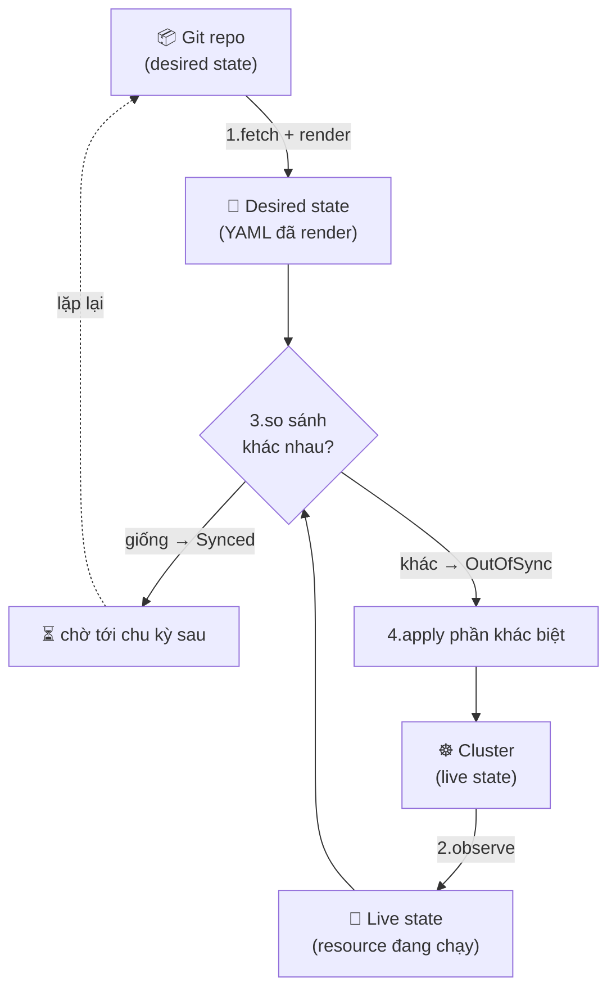

# Sync, Drift & Reconciliation — Trái tim của GitOps

> **Tác giả:** Mr.Rom\
> **Phiên bản:** v1.0.0\
> **Tạo lúc:** 13/06/2026\
> **Cập nhật:** 13/06/2026\
> **Level:** Basic\
> **Tags:** gitops, argocd, reconciliation, drift, sync, self-heal, prune, sync-waves, rollback, kubernetes\
> **Yêu cầu trước:** [Secrets trong GitOps](03_secrets-in-gitops.md)

> 🎯 *Cả cụm GitOps đến giờ đã dạy bạn "ai là engine" (ArgoCD/Flux), "repo trông như nào", "giấu secret ở đâu". Nhưng còn một câu hỏi quan trọng nhất chưa trả lời: **vì sao cluster lại luôn khớp Git?** Cơ chế nào âm thầm so sánh, phát hiện lệch, rồi tự sửa? Sau bài này bạn sẽ hiểu reconciliation loop — bộ máy tim đập của GitOps — và tự tay bật auto-sync + self-heal + prune cho app Acme Shop, sửa nóng một resource rồi xem GitOps lặng lẽ kéo nó về đúng Git.*

## 🎯 Sau bài này bạn sẽ

- [ ] Hiểu **reconciliation loop** là gì và vì sao nó là "trái tim" khiến GitOps khác CI push một lần
- [ ] Phân biệt **sync mode auto vs manual**, biết khi nào dùng cái nào
- [ ] Giải thích được 3 cơ chế kỷ luật: **self-heal** (tự revert), **prune** (tự xoá), **drift detection** (phát hiện lệch)
- [ ] Dùng **sync waves** + **resource hooks** (PreSync/PostSync) để sắp thứ tự apply, ví dụ chạy migrate DB *trước* khi rollout app
- [ ] Đọc được **health status** của resource và hiểu rollback = `git revert` → cluster tự sync về bản cũ
- [ ] Tự bật auto-sync/selfHeal/prune cho app Acme Shop, gây drift bằng tay, rồi quan sát GitOps tự chữa

---

## Một sự cố lúc 3h sáng mà ai làm ops cũng từng nếm

Acme Shop đã lên GitOps. Git là nguồn chân lý, ArgoCD chạy trong cluster lo phần đồng bộ. Mọi thứ êm đẹp — cho tới 3h sáng.

Payment service bắt đầu trả lỗi 500. On-call vào cluster, đoán là cần bật log chi tiết để soi. Trong cơn buồn ngủ, họ gõ thẳng:

```bash
kubectl edit deployment/payment-api -n production
# sửa ENV DEBUG: "false" → "true", lưu, pod restart
```

Log verbose bật lên, tìm ra bug, fix, đi ngủ. Sáng hôm sau mở lại cluster để kiểm tra thì... `DEBUG` đã về lại `"false"`. Ơ kìa, ai sửa? Không ai cả. Chính **ArgoCD** đã âm thầm phát hiện cluster lệch khỏi Git (Git vẫn ghi `DEBUG: "false"`) và **tự kéo về** sau vài phút.

Nghe có vẻ phiền, nhưng đây chính xác là điều bạn *muốn* GitOps làm: cluster luôn khớp Git, không ai "lén sửa" mà tồn tại được. Cơ chế đứng sau hành vi đó tên là **reconciliation loop** — và nó là phần làm GitOps trở thành GitOps, chứ không chỉ là "CI gõ `kubectl apply` cho đẹp". Bài này mổ xẻ cái loop đó: nó so sánh gì, sửa gì, sửa thế nào, và những cạm bẫy khiến nó xoá nhầm cả database.

> [!NOTE]
> Bài này lấy **ArgoCD** làm ví dụ chính vì nó có UI và CLI dễ quan sát loop. Mọi khái niệm (reconcile, drift, self-heal, prune, sync waves, health) đều có tương đương trong Flux — chỉ khác tên CRD và lệnh. Cụm GitOps đã so sánh hai tool ở [bài 01](01_flux-vs-argocd.md).

---

## 1️⃣ Reconciliation loop — vòng lặp không bao giờ ngủ

Trước hết phải hiểu cái "loop" này, vì mọi thứ còn lại đều xoay quanh nó.

Trong GitOps luôn tồn tại **hai trạng thái** mà engine quan tâm:

- **Desired state** (trạng thái mong muốn): những gì bạn *khai báo* trong Git — file YAML, Helm values, Kustomize overlay. Đây là "ý muốn".
- **Live state** (trạng thái thực): những gì cluster *đang thực sự* chạy — Pod nào sống, ENV nào đang set, replicas bao nhiêu. Đây là "thực tế".

**Reconciliation** (đối chiếu / hoà giải) là việc engine liên tục so hai cái này và sửa thực tế cho khớp ý muốn. Không phải làm một lần lúc commit, mà **lặp đi lặp lại mãi mãi** theo một chu kỳ. Đó là lý do gọi nó là *loop* (vòng lặp).

🪞 **Ẩn dụ đời thường**: reconciliation loop giống một **bộ điều nhiệt (thermostat) trong nhà**. Bạn đặt mong muốn "25°C" (desired state ghi trên màn hình). Thermostat cứ vài giây lại đo nhiệt độ phòng thật (live state). Phòng nóng lên 27°C → nó bật điều hoà kéo xuống. Phòng lạnh quá → nó tắt. Bạn không ra lệnh "bật/tắt" từng lần — bạn chỉ khai báo *con số mong muốn*, cái loop tự lo phần còn lại. GitOps engine làm y hệt, chỉ thay "nhiệt độ" bằng "trạng thái Kubernetes".

Mỗi vòng lặp gồm 4 bước, lặp lại liên tục:

> 💡 Hiểu được "thermostat" rồi, ta xem 4 bước cụ thể của một vòng lặp qua sơ đồ — đây là khái niệm trừu tượng nhất của cả bài nên hãy nhìn kỹ.



→ Điểm cốt lõi của sơ đồ: cái loop **không bao giờ kết thúc**. Dù không ai commit gì mới, nó vẫn quay đều — nên dù ai đó sửa tay trên cluster (làm live state lệch), vòng kế tiếp sẽ thấy "khác nhau" và kéo về. Đây chính là khác biệt nền tảng giữa GitOps (reconcile mãi mãi) và CI push truyền thống (apply một lần lúc deploy rồi quên).

ArgoCD chạy loop này theo chu kỳ mặc định khoảng 3 phút (có thể chỉnh), *cộng* với phản ứng tức thì khi nhận webhook từ Git. Flux thì khai báo `interval` ngay trong CRD (ví dụ `interval: 5m`).

> [!NOTE]
> "Apply phần khác biệt" nghĩa là engine không xoá sạch rồi tạo lại — nó tính ra *đúng phần lệch* và chỉ sửa phần đó (declarative, idempotent). Nếu live đã khớp desired, vòng lặp không làm gì cả ngoài đánh dấu `Synced`. Đây là lý do reconcile chạy hoài mà không gây xáo trộn cluster.

---

## 2️⃣ Sync mode: tự động (auto) vs thủ công (manual)

Loop ở trên *phát hiện* lệch ở mọi tool. Nhưng "phát hiện xong có tự sửa không?" lại là một lựa chọn — đó chính là **sync mode**.

**Manual sync** (đồng bộ thủ công): engine vẫn reconcile và *phát hiện* lệch, đánh dấu app là `OutOfSync`, nhưng **không tự apply**. Nó đứng chờ tới khi có người bấm nút "Sync" (trên UI) hoặc gõ lệnh. Giống thermostat *báo* "phòng nóng quá rồi" nhưng chờ bạn đồng ý mới bật điều hoà.

**Auto sync** (đồng bộ tự động): phát hiện lệch là apply ngay, không cần ai bấm. Đây mới là GitOps "đúng tinh thần" — Git đổi thì cluster đổi theo, không có khâu thủ công.

Hai mode khác nhau ở một dòng cấu hình. Trong ArgoCD, mode được khai báo ở `spec.syncPolicy` của `Application`. Khi **không** có khối `automated`, app ở chế độ manual:

```yaml
# acme-shop-web — MANUAL sync: phát hiện lệch nhưng chờ người bấm Sync
apiVersion: argoproj.io/v1alpha1
kind: Application
metadata:
  name: acme-shop-web
  namespace: argocd
spec:
  project: default
  source:
    repoURL: https://github.com/acme/gitops-config
    targetRevision: main
    path: apps/web/production
  destination:
    server: https://kubernetes.default.svc
    namespace: production
  # KHÔNG có syncPolicy.automated → manual: chỉ báo OutOfSync, không tự apply
```

Chỉ cần thêm khối `automated` là chuyển sang auto:

```yaml
# acme-shop-web — AUTO sync: lệch là tự apply ngay
spec:
  syncPolicy:
    automated: {}        # bật auto-sync; lệch khỏi Git → tự apply
```

→ Sự khác biệt nằm gọn ở việc có hay không khối `automated`. Lưu ý: ở dạng `automated: {}` thì ArgoCD *tự sync khi Git đổi*, nhưng **chưa** tự revert sửa-tay trên cluster và **chưa** tự xoá resource thừa — hai hành vi đó cần bật thêm `selfHeal` và `prune` (mục 3 ngay dưới).

Vậy khi nào chọn cái nào? Bảng dưới tóm tắt — nhưng nhớ rằng đây là kim chỉ nam, không phải luật cứng:

| Tình huống | Nên chọn | Vì sao |
|---|---|---|
| Môi trường dev / staging | **Auto** | Muốn nhanh, lỡ sai thì sửa lại, ít rủi ro |
| Production app stateless thông thường | **Auto** | Đúng tinh thần GitOps, cluster luôn khớp Git |
| Production cực nhạy cảm (banking, hạ tầng dùng chung) | **Manual** | Muốn người nhìn diff + bấm sync có chủ đích, tránh apply nhầm lúc 3h sáng |
| Mới chuyển sang GitOps, team chưa quen | **Manual** trước | Tập "đọc diff trước khi sync", rồi mới mở auto |

> [!TIP]
> Pattern thực dụng cho team mới: bật **auto cho dev/staging**, để **manual cho prod** trong vài tuần đầu. Khi cả team đã quen nhìn diff và tin vào pipeline, mới mở auto cho prod. GitOps không bắt bạn "auto hết ngay từ ngày một".

---

## 3️⃣ Ba cơ chế kỷ luật: self-heal, prune, drift detection

Bật auto-sync rồi, giờ tới ba khái niệm hay bị nhập nhằng. Chúng liên quan nhau nhưng **không phải một thứ**. Bảng nhỏ phân biệt trước, rồi đào từng cái:

| Cơ chế | Trả lời câu hỏi | Hành động |
|---|---|---|
| **Drift detection** | "Cluster có lệch Git không?" | Chỉ *phát hiện* + báo `OutOfSync` (không tự sửa) |
| **Self-heal** | "Ai sửa tay trên cluster?" | Tự *revert* thay đổi tay về đúng Git |
| **Prune** | "Resource nào đã bị xoá khỏi Git?" | Tự *xoá* resource đó khỏi cluster |

### 3.1 Drift detection — phát hiện lệch

**Drift** (trôi dạt) là khi live state lệch khỏi desired state. Nguyên nhân kinh điển: ai đó `kubectl edit` / `kubectl scale` tay, hoặc một controller khác sửa resource, hoặc hotfix lúc sự cố rồi quên commit.

**Drift detection** là phần *quan sát* của loop — nó luôn bật ở mọi GitOps engine, kể cả khi bạn để manual sync. Khi phát hiện lệch, ArgoCD đánh dấu app `OutOfSync` và cho bạn xem chính xác lệch ở đâu:

```bash
# Xem app đang lệch ở chỗ nào (diff giữa Git và cluster)
argocd app diff acme-shop-web
```

Kết quả mẫu khi có ai đó scale replicas tay từ 3 lên 5:

```
===== apps/Deployment production/acme-shop-web ======
3c3
<   replicas: 3
---
>   replicas: 5
```

Đọc output: dòng bắt đầu bằng `<` là **desired state** (Git muốn `replicas: 3`), dòng `>` là **live state** (cluster đang chạy `replicas: 5`). Dấu `3c3` nghĩa là dòng 3 *changed*. Nhìn vào đây bạn biết ngay cluster đã drift — ai đó scale tay mà chưa commit.

### 3.2 Self-heal — tự chữa lành

Phát hiện drift rồi, *có tự sửa không* là việc của **self-heal**. Khi bật `selfHeal: true`, mỗi khi loop thấy live lệch khỏi Git (do sửa tay), nó **tự apply lại** desired state, xoá bỏ thay đổi tay. Đây chính là cơ chế đã "trả `DEBUG` về `false`" trong sự cố đầu bài.

🪞 Quay lại ẩn dụ thermostat: self-heal giống thermostat **không cho phép bạn xoay núm điều hoà bằng tay** — bạn vừa chỉnh xuống 18°C, nó kéo về 25°C ngay, vì 25°C mới là con số "ghi trong cấu hình". Muốn 18°C thật thì phải đổi *cấu hình* (Git), không phải xoay tay.

### 3.3 Prune — tự dọn rác (và vì sao nguy hiểm)

**Prune** (dọn rác / tỉa cành) trả lời câu hỏi ngược lại: resource nào *từng* có trong Git, giờ đã bị **xoá khỏi Git**, thì cũng nên bị xoá khỏi cluster. Không có prune, bạn xoá file `old-service.yaml` khỏi Git nhưng Service đó vẫn sống nhăn trong cluster mãi mãi — cluster đầy "rác mồ côi".

Nghe rất hợp lý, nhưng prune là cơ chế **nguy hiểm nhất** trong cả bài. Vì sao? Vì nó *xoá thật*. Nếu bạn vô tình xoá nhầm file YAML khỏi Git (hoặc merge một PR sai, hoặc một lỗi đường dẫn `path` khiến ArgoCD "tưởng" thư mục rỗng), thì với `prune: true` + `selfHeal: true`, engine sẽ **xoá sạch** resource tương ứng khỏi cluster — kể cả khi đó là Deployment đang phục vụ khách hàng, hoặc tệ hơn, một `PersistentVolumeClaim` chứa dữ liệu.

> [!CAUTION]
> `automated.prune: true` áp dụng cho resource có dữ liệu (PVC/Database/Secret) có thể gây **mất dữ liệu vĩnh viễn** nếu file YAML bị xoá nhầm khỏi Git. Với resource stateful nhạy cảm, hãy tắt prune riêng cho chúng bằng annotation `argocd.argoproj.io/sync-options: Prune=false` thay vì để prune toàn bộ app.

Cách bật cả ba cơ chế đúng kỷ luật GitOps trong một `Application` như sau — đọc kỹ comment từng dòng:

```yaml
# acme-shop-web — GitOps đầy đủ kỷ luật: auto + selfHeal + prune
apiVersion: argoproj.io/v1alpha1
kind: Application
metadata:
  name: acme-shop-web
  namespace: argocd
spec:
  project: default
  source:
    repoURL: https://github.com/acme/gitops-config
    targetRevision: main
    path: apps/web/production
  destination:
    server: https://kubernetes.default.svc
    namespace: production
  syncPolicy:
    automated:
      prune: true            # xoá resource đã bị xoá khỏi Git (cẩn thận!)
      selfHeal: true         # tự revert sửa-tay trên cluster về đúng Git
    syncOptions:
      - CreateNamespace=true  # tự tạo namespace đích nếu chưa có
      - PruneLast=true        # apply resource mới TRƯỚC, prune cái cũ SAU (an toàn hơn)
```

→ Bộ ba `automated` + `selfHeal` + `prune` là "kỷ luật GitOps đầy đủ": Git nói gì, cluster đúng y vậy — không thừa, không thiếu, không ai sửa lén. Riêng `PruneLast=true` là một mẹo an toàn: nó đảm bảo resource mới được tạo *trước* khi resource cũ bị xoá, tránh khoảng trống downtime giữa chừng.

> [!WARNING]
> Để bảo vệ một resource cụ thể khỏi bị prune (ví dụ PVC database), thêm annotation ngay trên resource đó trong Git:
> ```yaml
> metadata:
>   annotations:
>     argocd.argoproj.io/sync-options: Prune=false
> ```
> Khi đó app vẫn prune bình thường các resource khác, riêng cái này được "miễn tử".

---

## 4️⃣ Sync waves + resource hooks — sắp thứ tự apply

Đến giờ ta coi "apply" như một hành động duy nhất. Nhưng một app thật có nhiều resource phụ thuộc nhau, và Kubernetes `apply` cả thư mục **không đảm bảo thứ tự**. Ví dụ kinh điển của Acme Shop: app web cần database đã chạy migration *trước* khi pod mới khởi động — nếu pod mới lên mà schema DB chưa cập nhật, app crash.

Đây là lúc cần **sync waves** và **resource hooks**.

### 4.1 Sync waves — đánh số thứ tự apply

**Sync wave** (đợt đồng bộ) là một con số nguyên gắn vào từng resource qua annotation. Engine apply resource theo thứ tự **wave thấp trước, wave cao sau**, và *chờ wave hiện tại Healthy rồi mới sang wave kế*.

🪞 Ẩn dụ: sync wave giống **thứ tự dọn cỗ** — phải bê bàn ra (wave -1) rồi mới bày bát đĩa (wave 0), bày xong mới dọn món (wave 1). Không ai bày món lên cái bàn chưa kê.

Cách gắn wave qua annotation `argocd.argoproj.io/sync-wave`. Giá trị **bắt buộc là số nguyên dạng chuỗi** (`"-1"`, `"0"`, `"1"`), không phải chữ:

```yaml
# Namespace lên trước nhất (wave thấp nhất)
apiVersion: v1
kind: Namespace
metadata:
  name: production
  annotations:
    argocd.argoproj.io/sync-wave: "-2"
---
# ConfigMap + Secret lên trước Deployment
apiVersion: v1
kind: ConfigMap
metadata:
  name: acme-web-config
  namespace: production
  annotations:
    argocd.argoproj.io/sync-wave: "-1"
---
# Deployment ở wave mặc định
apiVersion: apps/v1
kind: Deployment
metadata:
  name: acme-shop-web
  namespace: production
  annotations:
    argocd.argoproj.io/sync-wave: "0"
---
# Ingress lên sau cùng (cần Service đã sẵn sàng)
apiVersion: networking.k8s.io/v1
kind: Ingress
metadata:
  name: acme-shop-web
  namespace: production
  annotations:
    argocd.argoproj.io/sync-wave: "1"
```

→ ArgoCD apply Namespace (-2) → chờ ổn → ConfigMap (-1) → chờ ổn → Deployment (0) → chờ Healthy → Ingress (1). Không còn race condition kiểu "Ingress trỏ vào Service chưa tồn tại".

### 4.2 Resource hooks — chèn việc vào giữa quy trình sync

Sync wave sắp thứ tự *resource thường*. Nhưng có những việc cần chạy *quanh* một lần sync — ví dụ **migrate DB trước khi rollout app**, hoặc **gửi thông báo Slack sau khi sync xong**. Đó là việc của **resource hooks**.

Hook là một resource Kubernetes (thường là `Job`) được gắn annotation `argocd.argoproj.io/hook` để báo cho ArgoCD biết "chạy cái này vào giai đoạn nào của quy trình sync". Bốn giai đoạn chính:

| Hook | Chạy khi nào | Ví dụ điển hình |
|---|---|---|
| **PreSync** | *Trước* khi apply resource thường | Migrate schema DB, backup trước khi deploy |
| **Sync** | *Trong* lúc sync (mặc định) | Phần lớn resource bình thường |
| **PostSync** | *Sau* khi mọi resource đã Healthy | Smoke test, warm cache, báo Slack "deploy xong" |
| **SyncFail** | Khi sync *thất bại* | Gửi alert, rollback thủ công, dọn dẹp |

Ví dụ kinh điển nhất: Acme Shop muốn chạy `alembic upgrade head` (migrate database) **trước** khi pod web mới lên. Đây là một `Job` PreSync:

```yaml
# PreSync Job — migrate DB chạy TRƯỚC khi rollout app web
apiVersion: batch/v1
kind: Job
metadata:
  name: acme-db-migrate
  namespace: production
  annotations:
    argocd.argoproj.io/hook: PreSync               # chạy trước phần sync chính
    argocd.argoproj.io/hook-delete-policy: HookSucceeded  # xoá Job khi chạy xong
spec:
  template:
    spec:
      containers:
        - name: migrate
          image: ghcr.io/acme/web:v1.2.4
          command: ["alembic", "upgrade", "head"]   # nâng schema DB lên bản mới
      restartPolicy: Never
  backoffLimit: 2                                    # thử lại tối đa 2 lần nếu fail
```

→ ArgoCD chạy Job `acme-db-migrate` *trước*, chờ nó thành công, **rồi mới** rollout Deployment web. Nếu migrate fail, ArgoCD *dừng* sync — không rollout pod mới lên một schema chưa sẵn sàng. `hook-delete-policy: HookSucceeded` đảm bảo Job migrate được dọn đi sau khi xong, không để lại rác.

> [!NOTE]
> `hook-delete-policy` quyết định khi nào ArgoCD xoá resource hook. `HookSucceeded` = xoá sau khi thành công; `HookFailed` = xoá sau khi thất bại; `BeforeHookCreation` = xoá bản cũ ngay trước khi tạo bản mới (hữu ích để mỗi lần sync luôn chạy Job mới sạch, không vướng Job lần trước).

---

## 5️⃣ Health assessment — resource đã "khoẻ" chưa?

Sync wave và hook đều "chờ resource Healthy rồi mới sang bước kế". Nhưng "Healthy" nghĩa là gì? Đây là phần **health assessment** (đánh giá sức khoẻ) — và nó *khác* với sync status.

Cần phân biệt rõ **hai trục trạng thái độc lập** trong ArgoCD:

- **Sync status**: cluster có *khớp* Git không? → `Synced` / `OutOfSync`.
- **Health status**: resource có *chạy ổn* không? → `Healthy` / `Progressing` / `Degraded` / `Suspended` / `Missing`.

Một app có thể `Synced` (đúng y Git) nhưng `Degraded` (pod crash liên tục vì bug trong chính cái Git đó). Ngược lại, một app có thể `OutOfSync` (Git vừa đổi, chưa kịp apply) nhưng vẫn `Healthy` (bản cũ vẫn chạy tốt). Hai trục không phụ thuộc nhau.

🪞 Ẩn dụ: **sync status** giống "ngôi nhà có xây *đúng bản vẽ* không?", còn **health status** giống "ngôi nhà đó có *ở được* không (điện nước chạy, mái không dột)?". Xây đúng bản vẽ chưa chắc ở được — nếu chính bản vẽ có lỗi.

ArgoCD tự suy ra health cho các resource phổ biến:

| Resource | Healthy khi… | Degraded khi… |
|---|---|---|
| `Deployment` | Đủ replicas mong muốn ở trạng thái ready | Pod crash, không đủ replicas sau timeout |
| `Pod` | `Running` và mọi container ready | `CrashLoopBackOff`, `Error` |
| `Service` | Có endpoint (với LoadBalancer: có ngoại IP) | LoadBalancer chờ IP mãi không có |
| `Job` (hook) | Hoàn thành thành công | Fail vượt `backoffLimit` |
| `Ingress` | Có địa chỉ load balancer | Chưa được cấp địa chỉ |

Xem nhanh cả sync lẫn health bằng CLI:

```bash
argocd app list
```

Kết quả mẫu:

```
NAME            CLUSTER     NAMESPACE   PROJECT  STATUS     HEALTH       SYNCPOLICY
acme-shop-web   in-cluster  production  default  Synced     Healthy      Auto-Prune
acme-shop-api   in-cluster  production  default  OutOfSync  Progressing  Auto-Prune
```

Đọc output: cột `STATUS` là sync status (khớp Git chưa), cột `HEALTH` là health status (chạy ổn chưa). App `acme-shop-web` vừa `Synced` vừa `Healthy` — lý tưởng. App `acme-shop-api` đang `OutOfSync` + `Progressing` — nghĩa là Git vừa đổi, ArgoCD đang rollout pod mới và chờ chúng ready. Cột `SYNCPOLICY` ghi `Auto-Prune` xác nhận app đang bật auto-sync kèm prune.

---

## 6️⃣ Rollback = `git revert` → cluster tự sync về bản cũ

Một trong những điều đẹp nhất của GitOps: vì Git là nguồn chân lý và có *toàn bộ lịch sử*, rollback không phải một thao tác "ma thuật" trên cluster — nó chỉ là **lùi Git về commit cũ**, rồi để loop tự kéo cluster theo.

Tình huống Acme Shop: vừa deploy `web:v1.2.4`, hoá ra bản này có bug nặng, cần về `v1.2.3` ngay. Cách *đúng tinh thần GitOps*:

```bash
# 1. Lùi commit deploy v1.2.4 (tạo commit mới đảo ngược, GIỮ lịch sử)
git revert HEAD --no-edit

# 2. Push lên main — Git giờ lại mô tả desired state = v1.2.3
git push origin main
```

→ Xong. Bạn *không* gõ `kubectl` gì cả. ArgoCD nhận webhook (hoặc tới chu kỳ reconcile), thấy Git giờ muốn `v1.2.3`, tự apply, cluster về bản cũ. Lịch sử Git ghi lại đầy đủ: deploy v1.2.4 → revert về v1.2.3, ai làm, lúc nào — audit trail hoàn hảo.

> [!TIP]
> Dùng `git revert` (tạo commit đảo ngược) thay vì `git reset --hard` (xoá lịch sử). Revert giữ nguyên dòng thời gian — bạn vẫn thấy "đã từng deploy v1.2.4 rồi rút lui", cực kỳ quý khi điều tra sự cố sau này. `reset --hard` trên nhánh chung là điều cấm kỵ.

ArgoCD cũng có lệnh rollback nhanh về một revision đã deploy trước đó, hữu ích cho tình huống khẩn:

```bash
# Xem lịch sử các lần deploy của app (mỗi dòng 1 revision)
argocd app history acme-shop-web

# Rollback nhanh về revision số 12 (lấy ID từ lệnh history)
argocd app rollback acme-shop-web 12
```

> [!WARNING]
> `argocd app rollback` đưa *cluster* về trạng thái cũ nhưng **không sửa Git**. Nếu app đang bật `selfHeal`/auto-sync, loop sẽ thấy cluster lệch khỏi Git (Git vẫn ghi bản mới) và kéo ngược về bản lỗi — đúng kiểu vòng lặp ở sự cố đầu bài. Vì vậy `argocd app rollback` chỉ nên dùng cho cấp cứu tạm thời; **rollback "thật"** trong GitOps luôn là `git revert` để Git và cluster cùng về bản cũ.

---

## 7️⃣ Hands-on — bật auto-sync và xem GitOps tự chữa drift

Giờ ráp mọi thứ lại: ta sẽ bật auto-sync + selfHeal + prune cho app web của Acme Shop, rồi cố tình sửa tay một resource, và quan sát GitOps lặng lẽ revert. Đây chính là sự cố đầu bài, nhưng lần này bạn chủ động tạo ra để *hiểu* cơ chế.

> [!NOTE]
> Phần này giả định bạn đã có ArgoCD chạy trong cluster và đã đăng nhập `argocd` CLI (cách cài đặt nằm ở bài CI/CD intermediate về ArgoCD — xem mục Liên kết cuối bài). Ở đây ta tập trung vào *cơ chế reconcile*, không lặp lại bước cài.

### 🛠️ Bước 1: Bật auto-sync + selfHeal + prune cho app

App `acme-shop-web` ban đầu để manual sync. Ta bật đủ ba cơ chế bằng một lệnh CLI:

```bash
argocd app set acme-shop-web \
  --sync-policy automated \
  --self-heal \
  --auto-prune
```

Kiểm tra mode đã đổi:

```bash
argocd app get acme-shop-web
```

Kết quả mẫu (phần đầu):

```
Name:               argocd/acme-shop-web
Project:            default
Sync Policy:        Automated (Prune)
Sync Status:        Synced to main (a1b2c3d)
Health Status:      Healthy
```

Đọc output: dòng `Sync Policy: Automated (Prune)` xác nhận auto-sync + prune đã bật. `Sync Status: Synced` nghĩa cluster đang khớp đúng commit `a1b2c3d` của nhánh `main`. `Health Status: Healthy` cho biết app đang chạy ổn. Đây là trạng thái "vàng" — đúng Git và khoẻ mạnh.

### 🛠️ Bước 2: Gây drift bằng tay (giả lập sự cố 3h sáng)

Bây giờ ta đóng vai on-call buồn ngủ, sửa thẳng replicas trên cluster từ 3 lên 5, *không* qua Git:

```bash
kubectl scale deployment/acme-shop-web -n production --replicas=5
```

Kết quả:

```
deployment.apps/acme-shop-web scaled
```

Xác nhận cluster đã thật sự đổi:

```bash
kubectl get deployment/acme-shop-web -n production
```

```
NAME            READY   UP-TO-DATE   AVAILABLE   AGE
acme-shop-web   5/5     5            5           2d
```

Đọc output: cột `READY 5/5` cho thấy cluster giờ chạy 5 pod — đã *drift* khỏi Git (Git vẫn ghi `replicas: 3`). Live state lệch desired state. Vòng reconcile kế tiếp sẽ "thấy" điều này.

### 🛠️ Bước 3: Quan sát drift detection bắt được

Ngay sau khi scale tay, ArgoCD phát hiện lệch. Xem diff:

```bash
argocd app diff acme-shop-web
```

```
===== apps/Deployment production/acme-shop-web ======
3c3
<   replicas: 3
---
>   replicas: 5
```

Đọc output: dòng `< replicas: 3` là desired state (Git), dòng `> replicas: 5` là live state (cluster). Drift detection đã chỉ thẳng vào chỗ lệch. Nếu bạn để manual sync, app sẽ nằm `OutOfSync` ở đây mãi tới khi bạn bấm sync. Nhưng ta đã bật self-heal — nên xem bước kế.

### 🛠️ Bước 4: Self-heal tự revert về Git

Vì `selfHeal: true`, không cần làm gì cả. Vòng reconcile kế tiếp (trong vòng vài phút, hoặc gần như tức thì nếu có webhook) sẽ tự kéo cluster về `replicas: 3`. Nếu muốn xem ngay không chờ chu kỳ, ép reconcile thủ công:

```bash
argocd app sync acme-shop-web
```

Sau đó kiểm tra lại cluster:

```bash
kubectl get deployment/acme-shop-web -n production
```

```
NAME            READY   UP-TO-DATE   AVAILABLE   AGE
acme-shop-web   3/3     3            3           2d
```

Đọc output: `READY 3/3` — replicas đã tự về 3, đúng như Git. Thay đổi tay (`--replicas=5`) đã bị xoá bỏ mà bạn không gõ một lệnh `kubectl scale` nào để sửa lại. Đây chính xác là điều đã "trả `DEBUG` về `false`" ở sự cố đầu bài. GitOps vừa tự chữa drift trước mắt bạn.

### 🛠️ Bước 5: Cách làm *đúng* — đổi qua Git

Bài học rút ra: muốn cluster chạy 5 replicas thật, đừng `kubectl scale` — hãy sửa *desired state* trong Git:

```bash
# Trong repo gitops-config, sửa apps/web/production/deployment.yaml: replicas: 3 → 5
git add apps/web/production/deployment.yaml
git commit -m "chore: scale acme-shop-web lên 5 replicas cho mùa cao điểm"
git push origin main
```

→ Lần này ArgoCD thấy *Git* muốn 5 replicas → apply → cluster lên 5 và **giữ nguyên** (vì giờ live khớp desired). Self-heal không revert nữa, vì không còn drift. Đây là quy tắc vàng của GitOps: **muốn đổi cluster, đổi Git — đừng đổi tay**.

### 🧹 Dọn dẹp

Nếu bạn tạo app riêng để thử nghiệm bài này, trả nó về manual để khỏi auto-sync ngoài ý muốn, hoặc xoá hẳn:

```bash
# Trả app về manual sync (giữ app)
argocd app set acme-shop-web --sync-policy none

# Hoặc xoá hẳn app thử nghiệm (KHÔNG xoá nếu đây là app thật!)
# argocd app delete acme-shop-web
```

---

## 💡 Cạm bẫy thường gặp & Best practice

### ❌ Cạm bẫy: auto-prune xoá nhầm resource quan trọng

- **Triệu chứng**: ai đó merge một PR xoá nhầm file YAML (hoặc sửa sai `path` của `Application`), vài phút sau resource — có khi cả PVC chứa database — biến mất khỏi cluster.
- **Nguyên nhân**: `automated.prune: true` hiểu "resource không còn trong Git = phải xoá khỏi cluster", và nó làm đúng như vậy — kể cả khi việc mất file là *tai nạn*.
- **Cách tránh**: bật branch protection + bắt buộc PR review (2 người khác nhau) để không ai một mình xoá nhầm. Với resource stateful nhạy cảm, gắn `argocd.argoproj.io/sync-options: Prune=false` để miễn prune riêng cho chúng. Dùng `PruneLast=true` để giảm rủi ro downtime giữa chừng.

### ❌ Cạm bẫy: hotfix tay lúc sự cố bị self-heal revert (vòng lặp vô tận)

- **Triệu chứng**: on-call `kubectl edit` chữa cháy, vài phút sau thay đổi biến mất, lại edit, lại biến mất — "cuộc chiến" với chính ArgoCD lúc 3h sáng.
- **Nguyên nhân**: `selfHeal: true` coi mọi sửa-tay là drift và revert về Git. Nó không phân biệt "sửa lén" với "hotfix khẩn cấp".
- **Cách tránh**: có quy trình **break glass** (kính vỡ khẩn cấp) ghi sẵn trong runbook: (1) tạm tắt auto-sync `argocd app set <app> --sync-policy none`, (2) sửa tay + xác minh fix, (3) commit fix vào Git, (4) bật lại `argocd app set <app> --sync-policy automated --self-heal --auto-prune`. Như vậy fix được giữ *và* về lại GitOps đúng cách.

### ❌ Cạm bẫy: `argocd app rollback` mà quên rằng Git chưa đổi

- **Triệu chứng**: rollback cluster về bản tốt bằng `argocd app rollback`, vài phút sau cluster lại về bản lỗi.
- **Nguyên nhân**: `rollback` chỉ đổi *cluster*, không đổi *Git*. Self-heal/auto-sync thấy cluster lệch Git (Git vẫn ghi bản lỗi) → kéo về bản lỗi.
- **Cách tránh**: rollback "thật" trong GitOps luôn là `git revert` + push, để Git và cluster cùng về bản cũ. `argocd app rollback` chỉ dùng cấp cứu tạm, và phải `git revert` ngay sau đó.

### ✅ Best practice: bắt đầu manual, mở auto dần theo độ tự tin

- **Vì sao**: bật auto + selfHeal + prune ngay từ ngày đầu trên prod, lúc team chưa quen đọc diff, dễ dẫn tới apply/prune nhầm mà không ai kịp ngăn.
- **Cách áp dụng**: dev/staging bật auto cho nhanh; prod để manual vài tuần đầu (tập "đọc `argocd app diff` trước khi sync"). Khi pipeline đáng tin và team đã quen, mới mở auto cho prod. GitOps không bắt phải auto-hết-ngay.

### ✅ Best practice: dùng sync waves + PreSync hook cho mọi app có migrate DB

- **Vì sao**: nếu pod web mới lên *trước* khi schema DB được migrate, app crash hàng loạt — sự cố deploy kinh điển.
- **Cách áp dụng**: đặt migrate DB thành `Job` annotation `argocd.argoproj.io/hook: PreSync` để nó chạy *trước* và *chặn* rollout nếu fail. Dùng sync wave số nguyên để đảm bảo Namespace/ConfigMap/Secret lên trước Deployment, Ingress lên sau cùng.

---

## 🧠 Tự kiểm tra (Self-check)

**Q1.** Vì sao reconciliation loop là điểm khiến GitOps khác CI push truyền thống?

<details>
<summary>💡 Xem giải thích</summary>

CI push truyền thống chạy `kubectl apply` *một lần* lúc có commit, rồi quên — nó không biết và không sửa nếu sau đó cluster bị ai đó `kubectl edit` tay. Reconciliation loop thì chạy **liên tục mãi mãi**: mỗi chu kỳ nó so desired state (Git) với live state (cluster), thấy lệch là kéo về. Nhờ loop này, cluster *luôn* khớp Git, không chỉ tại thời điểm deploy. Đây là lý do drift bị tự phát hiện và (nếu bật self-heal) tự sửa, điều mà push model không làm được.

</details>

**Q2.** Phân biệt drift detection, self-heal và prune. Cái nào "phá huỷ" nhất?

<details>
<summary>💡 Xem giải thích</summary>

- **Drift detection**: chỉ *phát hiện* cluster lệch Git và báo `OutOfSync` — không tự sửa. Luôn bật ở mọi mode.
- **Self-heal**: tự *revert* thay đổi-tay trên cluster về đúng Git (sửa thuộc tính resource đang tồn tại).
- **Prune**: tự *xoá* resource đã bị xoá khỏi Git ra khỏi cluster.

**Prune nguy hiểm nhất** vì nó xoá thật — nếu file YAML bị xoá nhầm khỏi Git (PR sai, sai `path`), prune sẽ xoá resource tương ứng khỏi cluster, kể cả PVC chứa dữ liệu → mất dữ liệu vĩnh viễn. Self-heal chỉ revert thuộc tính, ít rủi ro mất dữ liệu hơn.

</details>

**Q3.** Acme Shop cần chạy `alembic upgrade head` (migrate DB) trước khi rollout app web. Dùng cơ chế gì và khai báo thế nào?

<details>
<summary>💡 Xem giải thích</summary>

Dùng **resource hook PreSync**: tạo một `Job` chạy `alembic upgrade head`, gắn annotation `argocd.argoproj.io/hook: PreSync`. ArgoCD sẽ chạy Job này *trước* phần sync chính, chờ nó thành công rồi mới rollout Deployment web. Nếu migrate fail, ArgoCD dừng sync — không đưa pod mới lên một schema chưa sẵn sàng. Thêm `argocd.argoproj.io/hook-delete-policy: HookSucceeded` để Job tự dọn sau khi xong. (Sync wave dùng để sắp thứ tự resource *thường*; hook dùng để chèn việc *quanh* một lần sync — hai cơ chế bổ trợ nhau.)

</details>

**Q4.** Một app hiển thị `Synced` nhưng `Degraded`. Nghĩa là gì?

<details>
<summary>💡 Xem giải thích</summary>

Hai trục trạng thái độc lập: **Sync status** (`Synced`) nói cluster *đúng y* Git; **Health status** (`Degraded`) nói resource *chạy không ổn* (ví dụ pod `CrashLoopBackOff`). `Synced` + `Degraded` nghĩa là: cluster đã apply đúng những gì Git mô tả, nhưng *chính cái Git đó* có vấn đề — ví dụ image bug, config sai khiến pod crash. Sửa bằng cách *đổi Git* (sửa config/đổi image), không phải sửa tay cluster (vì self-heal sẽ revert).

</details>

**Q5.** Vì sao rollback "thật" trong GitOps là `git revert` chứ không phải `argocd app rollback`?

<details>
<summary>💡 Xem giải thích</summary>

`git revert` tạo commit mới đảo ngược bản lỗi, làm *Git* (nguồn chân lý) mô tả lại bản cũ — loop tự kéo cluster theo, Git và cluster cùng về bản cũ, lịch sử đầy đủ. Còn `argocd app rollback` chỉ đổi *cluster*, **không đổi Git**. Nếu app bật self-heal/auto-sync, loop thấy cluster lệch Git (Git vẫn ghi bản lỗi) và kéo ngược về bản lỗi → vòng lặp. Vì vậy `argocd app rollback` chỉ là giải pháp cấp cứu tạm; rollback đúng tinh thần GitOps luôn đi qua Git.

</details>

---

## ⚡ Tra cứu nhanh (Cheatsheet)

| Mục đích | Lệnh / Cú pháp |
|---|---|
| Xem trạng thái sync + health 1 app | `argocd app get <app>` |
| Liệt kê mọi app + sync/health | `argocd app list` |
| Xem drift (diff Git vs cluster) | `argocd app diff <app>` |
| Sync thủ công ngay | `argocd app sync <app>` |
| Bật auto + selfHeal + prune | `argocd app set <app> --sync-policy automated --self-heal --auto-prune` |
| Tắt auto-sync (về manual) | `argocd app set <app> --sync-policy none` |
| Xem lịch sử các lần deploy | `argocd app history <app>` |
| Rollback cluster về revision cũ (tạm) | `argocd app rollback <app> <revision>` |
| Rollback đúng GitOps | `git revert <commit> && git push` |

```yaml
# === Annotation hay dùng (đặt trên resource trong Git) ===
metadata:
  annotations:
    argocd.argoproj.io/sync-wave: "-1"                    # thứ tự apply (số nguyên dạng chuỗi)
    argocd.argoproj.io/hook: PreSync                      # PreSync | Sync | PostSync | SyncFail
    argocd.argoproj.io/hook-delete-policy: HookSucceeded  # khi nào xoá hook
    argocd.argoproj.io/sync-options: Prune=false          # miễn prune cho resource này
```

```yaml
# === syncPolicy đầy đủ kỷ luật GitOps (trong Application) ===
spec:
  syncPolicy:
    automated:
      prune: true        # xoá resource đã rời Git
      selfHeal: true     # revert sửa-tay về Git
    syncOptions:
      - CreateNamespace=true
      - PruneLast=true   # tạo mới trước, xoá cũ sau
```

---

## 📚 Từ Điển Thuật Ngữ (Glossary)

| EN | VN | Giải thích |
|---|---|---|
| Reconciliation loop | Vòng lặp đối chiếu | Loop liên tục so desired state (Git) với live state (cluster) rồi apply phần khác biệt |
| Desired state | Trạng thái mong muốn | Những gì khai báo trong Git — "ý muốn" của bạn |
| Live state | Trạng thái thực | Những gì cluster đang thực sự chạy — "thực tế" |
| Sync | Đồng bộ | Hành động apply desired state vào cluster cho khớp |
| Sync mode (auto/manual) | Chế độ đồng bộ | Auto = tự apply khi lệch; manual = chờ người bấm sync |
| Drift | Trôi dạt / lệch | Khi live state lệch khỏi desired state (thường do sửa tay) |
| Drift detection | Phát hiện lệch | Phần loop quan sát và báo `OutOfSync` khi cluster lệch Git |
| Self-heal | Tự chữa lành | Tự revert thay đổi-tay trên cluster về đúng Git |
| Prune | Dọn rác / tỉa | Tự xoá resource khỏi cluster khi nó đã bị xoá khỏi Git |
| Sync wave | Đợt đồng bộ | Số nguyên đánh thứ tự apply resource (thấp trước, cao sau) |
| Resource hook | Móc vòng đời | Resource (thường Job) chạy vào giai đoạn PreSync/Sync/PostSync/SyncFail |
| PreSync / PostSync | Trước / sau sync | Giai đoạn hook chạy trước (migrate DB) hoặc sau (smoke test) phần sync chính |
| Health assessment | Đánh giá sức khoẻ | ArgoCD suy ra resource Healthy/Progressing/Degraded |
| Sync status | Trạng thái đồng bộ | Cluster có khớp Git không: `Synced` / `OutOfSync` |
| Health status | Trạng thái sức khoẻ | Resource chạy ổn không: `Healthy` / `Progressing` / `Degraded` |
| Rollback | Quay lui | Đưa về bản cũ — trong GitOps là `git revert` để Git+cluster cùng lui |
| Break glass | Kính vỡ khẩn cấp | Quy trình tạm tắt GitOps để hotfix khẩn, rồi commit lại và bật về |

---

## 🔗 Liên kết & Tài nguyên

### 🧭 Định hướng lộ trình học

- ⬅️ **Bài trước:** [Secrets trong GitOps — Sealed Secrets, SOPS, External Secrets](03_secrets-in-gitops.md)
- ↑ **Về cụm:** [GitOps — Declarative Continuous Delivery](../../README.md)

### 🧩 Các chủ đề có thể bạn quan tâm

- [GitOps là gì? — Git làm nguồn chân lý cho vận hành](00_what-is-gitops.md) — nền tảng pull model, vì sao Git là nguồn chân lý
- [ArgoCD vs Flux — Hai GitOps engine hàng đầu](01_flux-vs-argocd.md) — engine nào chạy cái loop reconcile này
- [Cấu trúc Repo GitOps — Tách config, env promotion, app-of-apps](02_repository-structure-and-patterns.md) — bố cục repo để sync gọn gàng
- [GitOps với ArgoCD — Git = Single Source of Truth](../../../ci-cd/lessons/02_intermediate/01_gitops-with-argocd.md) — hands-on ArgoCD chuyên sâu (cài đặt, ApplicationSet, multi-cluster, RBAC)

### 🌐 Tài nguyên tham khảo khác

- [ArgoCD — Automated Sync Policy](https://argo-cd.readthedocs.io/en/stable/user-guide/auto_sync/) — chi tiết auto-sync, selfHeal, prune
- [ArgoCD — Sync Phases and Waves](https://argo-cd.readthedocs.io/en/stable/user-guide/sync-waves/) — sync wave + hook PreSync/PostSync
- [ArgoCD — Resource Health](https://argo-cd.readthedocs.io/en/stable/operator-manual/health/) — cách ArgoCD đánh giá health từng resource
- [Flux — Kustomization reconciliation](https://fluxcd.io/flux/components/kustomize/kustomizations/) — `interval`, `prune`, dependsOn phía Flux
- [OpenGitOps (CNCF)](https://opengitops.dev/) — 4 nguyên tắc GitOps, trong đó "continuously reconciled" là cốt lõi bài này

---

## 📌 Nhật ký thay đổi (Changelog)

- **v1.0.0 (13/06/2026)** — Bản đầu tiên. Đào sâu cơ chế reconcile của GitOps: reconciliation loop (desired vs live, apply phần khác biệt, ẩn dụ thermostat + sơ đồ mermaid 4 bước); sync mode auto vs manual + bảng khi nào dùng; ba cơ chế kỷ luật drift detection / self-heal / prune (kèm cảnh báo prune nguy hiểm, Prune=false cho stateful); sync waves + resource hooks (PreSync migrate DB, hook-delete-policy); health assessment (sync status vs health status, bảng Healthy/Degraded); rollback = `git revert` vs cạm bẫy `argocd app rollback` không sửa Git. Hands-on 5 bước Acme Shop: bật auto/selfHeal/prune → gây drift `kubectl scale` → diff → self-heal revert → cách đúng qua Git. 3 cạm bẫy + 2 best practice + 5 self-check + cheatsheet. Bài cuối khép cụm Basic.
