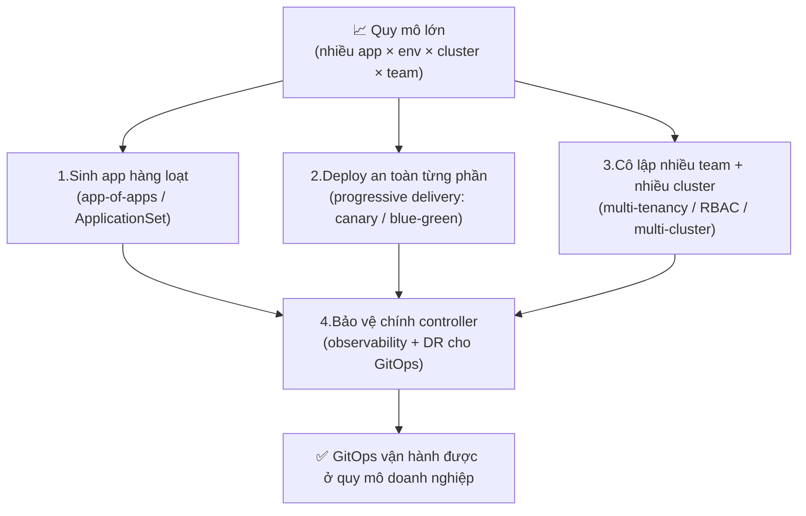

# GitOps Intermediate — Khi GitOps gặp quy mô nhiều app, nhiều team, nhiều cluster

> **Tác giả:** Mr.Rom\
> **Phiên bản:** v1.0.0\
> **Tạo lúc:** 13/06/2026\
> **Cập nhật:** 13/06/2026\
> **Level:** Intermediate\
> **Tags:** gitops, argocd, applicationset, app-of-apps, progressive-delivery, canary, multi-cluster, multi-tenancy, rbac, observability, disaster-recovery, kubernetes\
> **Yêu cầu trước:** [Sync, Drift & Reconciliation (basic)](../01_basic/04_sync-drift-and-reconciliation.md)

> 🎯 *Cụm Basic đã dạy bạn dựng GitOps cho **một** app: ArgoCD/Flux sync một `Application`, reconcile loop tự kéo cluster về Git, drift bị tự chữa. Nhưng ngoài đời Acme Shop không dừng ở một app — nó có hàng chục service, mỗi service ba môi trường, chạy trên nhiều cluster, do nhiều team đụng tay. Bài này là **bản đồ** của cả chặng Intermediate: vì sao "tạo `Application` bằng tay" sụp đổ ở quy mô lớn, bốn nhóm vấn đề bạn sắp gặp, và lộ trình bốn bài để chinh phục từng nhóm.*

## 🎯 Sau bài này bạn sẽ

- [ ] Hiểu vì sao **tạo tay từng `Application`** không kham nổi khi số app × env × cluster bùng nổ — và hướng giải bằng **app-of-apps / ApplicationSet**
- [ ] Hiểu vì sao **sync thẳng (deploy hết một phát)** vẫn rủi ro dù đã có GitOps — và vì sao cần **progressive delivery** (canary / blue-green) GitOps-native
- [ ] Hiểu vì sao **nhiều team dùng chung một ArgoCD** cần **multi-tenancy + RBAC + cô lập** để không giẫm chân nhau
- [ ] Hiểu vì sao **chính GitOps controller** cũng cần **observability + disaster recovery** — nó là điểm chết người (single point of failure) mới của hệ thống
- [ ] Map được 4 bài Intermediate vào 4 nhóm vấn đề và chọn được thứ tự học hợp lý

---

## Acme Shop sau sáu tháng dùng GitOps — và ngày mọi thứ bắt đầu rối

Quay lại Acme Shop. Sáu tháng trước, họ chỉ có **một** app web, một `Application` trong ArgoCD, một repo `gitops-config`. Mọi thứ đẹp như sách giáo khoa: sửa Git → ArgoCD sync → cluster khớp. Bạn đã học chính xác mô hình đó ở cụm Basic.

Nhưng business không đứng yên. Sáu tháng sau, bức tranh thành thế này:

- **23 microservice**: web, payment, cart, search, notify, recommendation, inventory... mỗi cái một team nhỏ.
- **3 môi trường** cho mỗi service: `dev`, `staging`, `production`.
- **4 cluster**: `dev` (1 cluster), `staging` (1 cluster), `production` chia hai region `prod-us-east` + `prod-eu-west` để gần khách hàng.
- **5 team**: payment, search, platform, growth, data — dùng *chung một* ArgoCD.

Bạn thử nhân ra xem: 23 service × 3 env, mà prod lại nhân đôi vì 2 region... con số `Application` cần quản lý vọt lên gần **trăm cái**. Và đây là những thứ bắt đầu cháy:

- Mỗi service mới ra đời, ai đó phải copy-paste tay 4-5 file `Application` YAML, sửa tên, sửa path, sửa namespace. Sai một ký tự là app deploy nhầm chỗ.
- Một lần deploy `payment:v2.0` lên thẳng production → bug ở 0.5% request → nhưng vì sync apply *toàn bộ* 100% replicas cùng lúc, cả production payment chết, mất tiền thật.
- Team search vô tình tạo một `Application` trỏ vào namespace `payment-prod` → suýt đè lên service của team payment. Không ai chặn được vì mọi người đều có quyền như nhau.
- Một sáng ArgoCD server crash, không ai biết, các app drift mà chẳng có cảnh báo. Tệ hơn: hôm sau cần khôi phục ArgoCD thì... không ai biết back up cái gì để khôi phục.

Bốn vết cháy đó **không phải lỗi GitOps** — chúng là cái giá của *quy mô*. GitOps cơ bản giải quyết "làm sao cluster khớp Git". Quy mô lớn đặt ra bốn câu hỏi *mới* mà cụm Basic chưa chạm: làm sao **sinh** app hàng loạt, làm sao **deploy an toàn từng phần**, làm sao **cô lập nhiều team**, và làm sao **bảo vệ chính cái controller** đang gánh tất cả.

Đó là toàn bộ nội dung chặng Intermediate.

---

## 1️⃣ Bốn nhóm vấn đề khi GitOps gặp quy mô — bức tranh tổng

Trước khi đào từng nhóm, hãy nhìn cả bốn cùng lúc. Mỗi vết cháy ở Acme Shop ứng với một nhóm vấn đề, và mỗi nhóm ứng với đúng một bài trong chặng này.

🪞 **Ẩn dụ đời thường**: GitOps cơ bản giống bạn tự nấu ăn cho **một** mình — một bếp, một nồi, một thực đơn, dễ kiểm soát. GitOps ở quy mô lớn giống vận hành một **chuỗi nhà hàng**: bạn không thể tự tay nấu từng món ở từng chi nhánh (cần *dây chuyền* — app-of-apps/ApplicationSet), không thể bê nguyên thực đơn mới cho cả chuỗi trong một đêm (cần *thử ở vài bàn trước* — canary), nhiều đầu bếp dùng chung một bếp phải có khu riêng kẻo đụng dao nhau (cần *cô lập* — multi-tenancy), và cái bếp trung tâm điều phối tất cả mà cháy thì cả chuỗi tê liệt (cần *camera + bình chữa cháy* — observability + DR).

Bốn nhóm vấn đề đó liên hệ với nhau theo sơ đồ dưới — đây là khái niệm trừu tượng nhất của cả bài, hãy nhìn kỹ để thấy chúng *xếp tầng* lên nhau chứ không rời rạc.



→ Điểm cốt lõi của sơ đồ: ba nhóm đầu (sinh app, deploy an toàn, cô lập team) đều **đổ dồn** vào nhóm thứ tư. Vì khi bạn đã để GitOps controller *tự sinh trăm app*, *tự quyết deploy từng phần*, *gánh nhiều team* — thì bản thân nó trở thành "trái tim" của cả hệ thống vận hành. Trái tim đó mà mù (không observability) hoặc chết mà không khôi phục được (không DR) thì mọi tự động hoá ở ba nhóm trên đều thành con dao hai lưỡi. Đó là lý do bài bảo vệ controller được học *sau cùng* — nó là lớp nền đỡ cho tất cả.

Bảng dưới map từng vết cháy ở Acme Shop sang nhóm vấn đề và sang bài học tương ứng, để bạn thấy chặng này có "địa chỉ" rõ ràng chứ không lan man:

| Vết cháy ở Acme Shop | Nhóm vấn đề | Bài học giải quyết |
|---|---|---|
| Copy-paste tay ~100 `Application` YAML, dễ sai | Sinh app hàng loạt tự động | **Bài 01** — App-of-Apps & ApplicationSet |
| Deploy 100% một phát → bug nhỏ làm sập cả prod | Deploy an toàn từng phần | **Bài 02** — Progressive Delivery (canary / blue-green) |
| Team này đụng vào namespace của team kia; quản nhiều cluster rối | Cô lập team + nhiều cluster | **Bài 03** — Multi-Cluster & Multi-Tenancy |
| ArgoCD crash âm thầm, không alert, không biết khôi phục thế nào | Bảo vệ chính controller | **Bài 04** — Security, Observability & DR |

→ Bốn bài, bốn nhóm vấn đề, một mạch logic: tự động hoá việc sinh app → làm cho deploy an toàn → cho nhiều người dùng chung an toàn → bảo vệ cái nền gánh tất cả. Giờ ta đi sâu từng nhóm để bạn hiểu *vì sao* cần, trước khi các bài sau dạy *làm thế nào*.

---

## 2️⃣ Nhóm 1 — Sinh app hàng loạt: vì sao tạo tay sụp đổ

Ở cụm Basic, mỗi `Application` là một file YAML bạn viết tay rồi `kubectl apply`. Một, hai, năm app — ổn. Nhưng quy luật rất tàn nhẫn: số `Application` cần quản lý = số_app × số_env × số_cluster.

Hãy đặt phép nhân thật cho Acme Shop trong bảng dưới — con số sẽ tự nói lên vấn đề:

| Cách quản lý | Số app | Số env | Số cluster prod | Tổng `Application` phải viết tay | Khi thêm 1 app mới |
|---|---|---|---|---|---|
| Tạo tay từng `Application` | 23 | 3 | 2 (us-east + eu-west) | ~92 file YAML | Phải thêm ~4-5 file mới, sửa tay |
| App-of-Apps | 23 | 3 | 2 | 1 app cha quản N app con (vẫn viết N file con) | Thêm 1 file con vào folder, app cha tự nhận |
| ApplicationSet | 23 | 3 | 2 | **1 ApplicationSet** sinh ra tất cả từ template + generator | Thêm 1 dòng vào generator (hoặc tự phát hiện từ Git/cluster) |

→ Tạo tay 92 file không chỉ tốn công — nó là **mỏ lỗi** (chỉ cần một `path` sai là app deploy nhầm chỗ) và không ai review nổi 92 file gần-giống-nhau. Hai pattern cứu vãn là:

- **App-of-Apps** (app-của-các-app) — một `Application` "cha" trỏ vào một folder chứa các file `Application` con. ArgoCD sync app cha → tự apply tất cả app con. 🪞 Giống một **bảng phân công** treo ở cửa: thay vì gọi tên từng nhân viên mỗi sáng, bạn dán một bảng "ai làm gì", mọi người tự đọc. Bạn vẫn viết từng dòng phân công, nhưng quản lý qua *một* điểm.
- **ApplicationSet** (bộ-sinh-app) — một CRD *sinh ra* nhiều `Application` từ một **template** + một **generator** (bộ phát hiện danh sách: list, Git directory, cluster...). 🪞 Giống một **khuôn bánh** + một danh sách hương vị: bạn đổ một khuôn, máy tự dập ra 10 cái bánh khác vị. Thêm vị mới = thêm một dòng, không phải nặn tay từng cái.

Khác biệt cốt lõi: App-of-Apps vẫn cần bạn *viết* từng app con (chỉ gom quản lý); ApplicationSet *tự sinh* app từ pattern. Khi số app/env/cluster bùng nổ, ApplicationSet mới là thứ scale thật.

Để bạn hình dung "tự sinh" cụ thể trông ra sao (bài 01 sẽ mổ xẻ kỹ), đây là một ApplicationSet rút gọn dùng *list generator* — nó khai báo *một* template, liệt kê ba môi trường, và để ArgoCD tự dập ra ba `Application`:

```yaml
apiVersion: argoproj.io/v1alpha1
kind: ApplicationSet
metadata:
  name: payment-envs
  namespace: argocd
spec:
  generators:
    - list:
        elements:                 # mỗi phần tử → 1 Application
          - env: dev
          - env: staging
          - env: production
  template:                       # 1 khuôn dùng chung cho cả 3 env
    metadata:
      name: 'payment-{{env}}'     # nội suy tên: payment-dev, payment-staging, payment-production
    spec:
      project: team-payment
      source:
        repoURL: https://github.com/acme/gitops-config
        targetRevision: main
        path: 'apps/payment/overlays/{{env}}'   # mỗi env 1 overlay riêng
      destination:
        server: https://kubernetes.default.svc
        namespace: '{{env}}'
      syncPolicy:
        automated:
          prune: true
          selfHeal: true
```

→ Một file này thay cho ba file `Application` viết tay. Khi thêm môi trường thứ tư (vd `canary`), bạn chỉ thêm *một dòng* `- env: canary` vào `elements` — không copy-paste cả file. Nhân điều này cho 23 service, bạn thấy ngay vì sao ApplicationSet là thứ scale thật còn copy-paste tay thì không. (`{{env}}` là cú pháp nội suy biến của ApplicationSet — generator bơm giá trị vào template.)

> [!NOTE]
> Cụm Basic đã giới thiệu *khái niệm* app-of-apps ở bài [Cấu trúc Repo GitOps](../01_basic/02_repository-structure-and-patterns.md) ở mức "đây là một pattern bố cục repo". Bài 01 của chặng này sẽ đi *thực chiến*: viết ApplicationSet với nhiều generator (list, Git directory, cluster, matrix), xử lý cạm bẫy matrix bùng nổ, và pattern rollout dev → staging → prod có thứ tự.

---

## 3️⃣ Nhóm 2 — Deploy an toàn từng phần: vì sao sync thẳng vẫn rủi ro

Đây là chỗ nhiều người hiểu nhầm. Họ nghĩ: "Có GitOps rồi, rollback chỉ là `git revert`, vậy deploy an toàn rồi còn gì?". Đúng là rollback *dễ hơn nhiều* — nhưng GitOps cơ bản vẫn deploy theo kiểu **all-at-once**: khi sync, nó apply desired state mới và Kubernetes rollout *toàn bộ* replicas sang bản mới.

Vấn đề là: bug không phải lúc nào cũng lộ ở `staging`. Có những bug chỉ xuất hiện dưới **traffic thật** — lỗi với 0.5% request có header lạ, memory leak chỉ thấy sau 10 phút tải cao, dependency bên thứ ba timeout lúc cao điểm. Với deploy all-at-once, bug như vậy đập vào **100% khách hàng cùng lúc** trước khi bạn kịp `git revert`. Rollback nhanh không cứu được khoảng thời gian "100% khách dính bug".

🪞 **Ẩn dụ**: deploy all-at-once giống **đổ cả nồi nước sôi vào bồn tắm rồi mới nhúng chân** — nóng quá thì đã bỏng cả người. Progressive delivery giống **nhúng một ngón chân thử nước trước**: chỉ cho 5% khách dùng bản mới, đo xem có "bỏng" (lỗi/chậm) không, ổn thì tăng dần 5% → 25% → 50% → 100%.

**Progressive delivery** (giao hàng tăng tiến) là chiến lược rollout *từng phần có kiểm soát*, hai kiểu phổ biến:

| Chiến lược | Cách làm | Khi nào hợp | Đánh đổi |
|---|---|---|---|
| **Canary** (chim hoàng yến) | Cho một % nhỏ traffic vào bản mới, tăng dần nếu metric tốt | Service stateless, có metric rõ (error rate, latency) | Hai phiên bản chạy song song một lúc — cần version tương thích |
| **Blue-Green** (xanh-lục) | Dựng full bản mới (green) song song bản cũ (blue), gạt 100% traffic sang green một nhát khi đã verify | Cần đổi tức thì, rollback tức thì; tài nguyên dư để chạy 2 bản full | Tốn gấp đôi tài nguyên lúc chuyển; vẫn là "đổi một phát" (nhưng đảo lại được ngay) |

Tên "canary" đến từ thợ mỏ ngày xưa: họ mang **chim hoàng yến** xuống hầm — chim nhạy khí độc, chim ngất trước thì thợ biết đường chạy. Canary release cũng vậy: một nhóm nhỏ traffic là "con chim" báo nguy trước khi cả production dính.

Cụ thể, một lần canary cho `payment` của Acme Shop diễn ra theo từng nấc, mỗi nấc *dừng lại đo metric* rồi mới đi tiếp:

```text
v1 (cũ) ──100%──>  [deploy v2 dạng canary]
  bước 1:  v2 nhận  5%  traffic  → đo error rate + latency 5 phút → OK?
  bước 2:  v2 nhận 25%  traffic  → đo tiếp → OK?
  bước 3:  v2 nhận 50%  traffic  → đo tiếp → OK?
  bước 4:  v2 nhận 100% traffic  → canary thành công, v1 nghỉ
  (bất kỳ bước nào metric xấu → tự ABORT, kéo về 0% v2, v1 gánh lại 100%)
```

→ Điểm mấu chốt: bug ở v2 (nếu có) chỉ chạm tối đa 5% khách ở bước 1 rồi bị chặn — thay vì 100% như deploy all-at-once. Và việc "đo rồi quyết tiếp/dừng" là *tự động*, khai báo sẵn trong Git, không cần ai ngồi canh bấm nút.

Điểm GitOps-native là: bạn không bấm nút canary thủ công — bạn **khai báo** chiến lược canary trong Git (qua công cụ như **Argo Rollouts**), và controller tự thực thi từng bước, tự đo metric, tự dừng/đảo nếu xấu. Vẫn đúng tinh thần "Git là nguồn chân lý", chỉ là "desired state" giờ mô tả cả *cách rollout* chứ không chỉ *cái gì rollout*.

> [!IMPORTANT]
> Canary cần một thứ then chốt mà GitOps không tự có: **khả năng chia traffic theo %** và **đo metric để tự quyết**. Phần chia traffic thường dựa vào service mesh hoặc ingress (xem liên hệ ở mục Liên kết), còn phần đo-và-quyết là việc của Argo Rollouts với *AnalysisTemplate*. Bài 02 ráp cả hai lại.

---

## 4️⃣ Nhóm 3 — Cô lập nhiều team & nhiều cluster: vì sao "chung một ArgoCD" cần luật

Ở Acme Shop, 5 team dùng *chung một* ArgoCD. Mặc định, ArgoCD `default` project mở toang: ai có quyền tạo `Application` thì tạo được từ **bất kỳ repo nào** vào **bất kỳ namespace/cluster nào**. Đó là quả bom hẹn giờ:

- Team search vô tình trỏ một `Application` vào namespace `payment-prod` → đè lên service team payment.
- Một junior tạo app trỏ vào `repoURL` lạ (gõ nhầm, hoặc repo bị hack) → deploy chart độc vào cluster.
- Mọi người thấy *mọi* app của *mọi* team trên UI → rối, và sync nhầm app của người khác.

🪞 **Ẩn dụ**: chung một ArgoCD mà không cô lập giống một **văn phòng mở không vách ngăn, không khoá tủ** — ai cũng với tay vào bàn của người khác. Multi-tenancy giống chia **khu làm việc có vách + thẻ từ riêng**: team payment chỉ vào được khu payment, không mở được tủ của team search.

GitOps ở quy mô nhiều team cần ba lớp:

- **Multi-tenancy** (đa-người-thuê) — chia ArgoCD thành các "khu" logic cho từng team. Trong ArgoCD, công cụ là **AppProject**: nó *whitelist* repo được phép dùng, namespace/cluster được phép deploy, loại resource được phép tạo. Team payment có AppProject chỉ cho deploy vào `payment-*`, chỉ từ repo `payment-*`.
- **RBAC** (Role-Based Access Control — phân quyền theo vai trò) — ai được *làm gì* với app nào. Dev của team payment chỉ `sync` được app payment, không đụng được app team khác; viewer chỉ xem.
- **Multi-cluster** (đa-cluster) — một ArgoCD "hub" điều khiển nhiều cluster (us-east, eu-west, staging) theo mô hình **hub-and-spoke** (trục-và-nan-hoa): một control plane trung tâm, nhiều cluster "nan hoa" được đăng ký vào. Khác với "mỗi cluster một ArgoCD riêng" — hub-and-spoke quản tập trung nhưng đặt ra bài toán cô lập và bảo mật kết nối.

Để thấy "hàng rào" cụ thể trông ra sao, đây là một AppProject rút gọn cho team payment — nó *chặn từ gốc* việc team payment đụng vào chỗ không phải của mình (bài 03 sẽ đào sâu RBAC kèm theo):

```yaml
apiVersion: argoproj.io/v1alpha1
kind: AppProject
metadata:
  name: team-payment
  namespace: argocd
spec:
  description: Khu làm việc riêng của team payment
  sourceRepos:                          # chỉ được deploy TỪ các repo này
    - https://github.com/acme/payment-*
  destinations:                         # chỉ được deploy VÀO các đích này
    - namespace: 'payment-*'
      server: '*'
  clusterResourceWhitelist:             # không cho tạo resource cấp cluster bừa bãi
    - group: ''
      kind: Namespace
```

→ Với AppProject này, dù ai đó trong team payment lỡ tạo `Application` trỏ vào `namespace: payment-prod` thì OK, nhưng trỏ nhầm vào `search-prod` (không khớp `payment-*`) sẽ bị ArgoCD **từ chối** ngay — sự cố "đè service team khác" bị chặn ngay từ khâu khai báo. Gán app vào project bằng `spec.project: team-payment` là xong.

Cô lập team (multi-tenancy + RBAC) và quản nhiều cluster (hub-and-spoke) đi chung một bài vì chúng đan vào nhau: khi một hub điều khiển nhiều cluster *và* phục vụ nhiều team, bạn phải đồng thời trả lời "team nào được chạm cluster nào, namespace nào, qua repo nào".

> [!WARNING]
> Cạm bẫy kinh điển ở quy mô lớn: dùng `default` AppProject (mở `*`) cho production. Chỉ một `Application` trỏ sai `destination` là đè lên service của team khác — và nếu app đó bật auto-sync + self-heal, nó còn *giữ* cái sai đó. AppProject whitelist là hàng rào chặn lỗi này từ gốc.

---

## 5️⃣ Nhóm 4 — Bảo vệ chính controller: observability + DR cho GitOps

Đây là nhóm dễ bị bỏ quên nhất, và cũng nguy hiểm nhất. Lý do: khi GitOps "chạy ngon", controller (ArgoCD/Flux) trở nên *vô hình* — mọi người quên mất rằng giờ **toàn bộ** việc deploy của cả công ty đi qua nó. Nó vừa thành thứ quan trọng nhất, vừa thành thứ ít ai nhìn tới nhất.

Hãy nghĩ về hai kịch bản ở Acme Shop:

- **Controller mù**: ArgoCD repo-server quá tải, sync chậm dần, vài app `OutOfSync` hàng giờ mà *không ai biết* vì chẳng có dashboard hay alert. Đến khi khách phàn nàn mới phát hiện bản fix bảo mật chưa kịp lên production suốt nửa ngày.
- **Controller chết không dậy lại được**: cluster chứa ArgoCD bị hỏng. Không sao — Git vẫn còn, *desired state* vẫn còn. Nhưng còn **cấu hình của chính ArgoCD**? Danh sách cluster đã đăng ký, các AppProject, RBAC, secret kết nối cluster... nếu những thứ đó *không* nằm trong Git và *không* được back up, thì dựng lại ArgoCD = làm lại từ đầu thủ công, giữa lúc đang cháy.

🪞 **Ẩn dụ**: GitOps controller giống **người điều phối không lưu** ở sân bay — khi mọi chuyến bay (deploy) suôn sẻ, không ai để ý anh ta. Nhưng anh ta mà ngất (không observability để biết) hoặc đài điều phối cháy mà không có đài dự phòng (không DR), thì cả sân bay tê liệt. Đài điều phối càng quan trọng càng phải có *camera giám sát* và *kế hoạch dựng lại*.

Hai lớp bảo vệ:

| Lớp | Trả lời câu hỏi | Công cụ / cách làm điển hình |
|---|---|---|
| **Observability** (khả năng quan sát) | "Controller có khoẻ không? App nào đang OutOfSync/Degraded? Sync có chậm/lỗi không?" | ArgoCD expose metrics Prometheus → dashboard Grafana; `argocd-notifications` bắn Slack khi sync fail / health degraded |
| **Disaster Recovery — DR** (khôi phục thảm hoạ) | "ArgoCD chết thì dựng lại trong bao lâu, từ đâu?" | "App-of-apps tự bootstrap" + giữ *cấu hình ArgoCD trong Git* (declarative setup) + back up những thứ không-thể-tái-tạo (cluster secret) |

Mấu chốt của DR trong GitOps: nếu bạn làm đúng (cấu hình ArgoCD cũng nằm trong Git, dùng app-of-apps để tự bootstrap), thì khôi phục ArgoCD gần như là "cài lại ArgoCD trống → trỏ vào repo gốc → nó tự dựng lại toàn bộ app". GitOps biến DR từ "ác mộng thủ công" thành "lặp lại bootstrap". Nhưng điều đó chỉ đúng *nếu* bạn thiết kế cho nó từ đầu — đó chính là nội dung bài 04.

> [!IMPORTANT]
> Quy tắc vàng cho nhóm này: **chính cấu hình GitOps controller cũng phải là GitOps** (cluster đăng ký, AppProject, RBAC khai báo trong Git). Thứ duy nhất không nên ở Git là secret thật — những thứ đó cần một chiến lược back up riêng. Làm được vậy thì "khôi phục ArgoCD" chỉ là bootstrap lại từ Git.

---

## 6️⃣ Lộ trình học — thứ tự bốn bài và vì sao

Bốn bài được sắp theo đúng mạch logic ở sơ đồ §1: trước hết phải *sinh* được app hàng loạt, rồi mới lo *deploy chúng an toàn*, rồi *cho nhiều người dùng chung*, cuối cùng *bảo vệ cái nền*. Học theo thứ tự này thì mỗi bài đứng trên vai bài trước.

Bảng dưới là lộ trình kèm "thứ bạn mang về" sau mỗi bài, để bạn tự định vị mình đang ở đâu trong chặng:

| Thứ tự | Bài | Nhóm vấn đề | Sau bài, bạn làm được |
|---|---|---|---|
| 1 | [App-of-Apps & ApplicationSet](01_app-of-apps-and-applicationset.md) | Sinh app hàng loạt | Viết 1 ApplicationSet sinh ra hàng chục app từ template + generator, thay cho việc copy-paste tay |
| 2 | [Progressive Delivery với Argo Rollouts](02_progressive-delivery-with-argo-rollouts.md) | Deploy an toàn từng phần | Khai báo canary / blue-green GitOps-native, để controller tự rollout từng % và tự dừng khi metric xấu |
| 3 | [Multi-Cluster & Multi-Tenancy](03_multi-cluster-and-multi-tenancy.md) | Cô lập team + nhiều cluster | Dựng AppProject + RBAC cô lập từng team, quản nhiều cluster từ một hub |
| 4 | [Security, Observability & DR cho GitOps](04_security-observability-and-dr.md) | Bảo vệ chính controller | Gắn metrics + alert cho ArgoCD, thiết kế bootstrap để khôi phục được khi controller chết |

> [!TIP]
> Nếu bạn đang gấp giải một vấn đề cụ thể, không nhất thiết học tuần tự: app mới deploy hoài bị sai tay → nhảy bài 01; vừa bị sự cố "deploy là sập prod" → bài 02; nhiều team mới onboard đang giẫm chân → bài 03; vừa bị ArgoCD chết không dậy → bài 04. Nhưng nếu học để *xây nền vững*, hãy đi theo thứ tự 01 → 04.

Một lưu ý liên cụm: chặng này dùng **ArgoCD** làm ví dụ chính (vì có UI/CLI dễ quan sát), nhưng mọi khái niệm — ApplicationSet, canary, multi-tenancy, DR — đều có tương đương trong Flux. Bạn đã so sánh hai engine ở [bài Basic 01](../01_basic/01_flux-vs-argocd.md), nên ở đây ta tập trung vào *tư duy quy mô* hơn là cú pháp một tool.

---

## 💡 Cạm bẫy thường gặp & Best practice

### ❌ Cạm bẫy: "Có GitOps rồi nên scale là chuyện nhỏ"

- **Triệu chứng**: team chạy ngon một app với GitOps, rồi cứ thế nhân lên — copy-paste `Application` tay, deploy all-at-once lên prod, cho mọi team dùng chung `default` project. Vài tháng sau: trăm file YAML hỗn loạn, một deploy làm sập prod, team này đè service team kia.
- **Nguyên nhân**: nhầm "GitOps đã giải quyết deploy" với "GitOps đã giải quyết *vận hành ở quy mô*". GitOps cơ bản giải bài toán đồng bộ một app; nó *không* tự sinh app, *không* tự deploy từng phần, *không* tự cô lập team.
- **Cách tránh**: nhận diện sớm bốn nhóm vấn đề quy mô (sinh app / deploy an toàn / cô lập / bảo vệ controller) và áp đúng công cụ — đúng là nội dung bốn bài chặng này. Đừng đợi cháy mới học.

### ❌ Cạm bẫy: bật ApplicationSet matrix "cho tiện" rồi sinh ra hàng trăm app

- **Triệu chứng**: dùng matrix generator (clusters × apps) để "deploy mọi app lên mọi cluster" → vô tình sinh ra hàng trăm `Application` → ArgoCD chậm, UI rối, đôi khi deploy nhầm app vào cluster không nên có.
- **Nguyên nhân**: matrix là tích Descartes — 10 cluster × 20 app = 200 app, dễ vượt xa số app thực sự cần.
- **Cách tránh**: luôn dùng `selector` lọc cluster/app trong generator (ví dụ chỉ cluster có label `env=production`). Chi tiết ở bài 01. Nguyên tắc: sinh *đúng* số app cần, không sinh theo tích Descartes mù quáng.

### ✅ Best practice: chính cấu hình GitOps cũng phải là GitOps

- **Vì sao**: nếu danh sách cluster, AppProject, RBAC, các `Application` gốc nằm rải rác "tạo tay trên UI", thì khi ArgoCD chết bạn không có gì để dựng lại — DR thành thủ công giữa lúc cháy.
- **Cách áp dụng**: khai báo *toàn bộ* cấu hình ArgoCD bằng YAML trong Git, dùng app-of-apps để ArgoCD tự bootstrap chính mình. Khôi phục = cài ArgoCD trống → trỏ vào repo gốc → nó tự dựng lại. Thứ duy nhất tách riêng là secret thật (cần back up riêng). Chi tiết ở bài 04.

### ✅ Best practice: phân lớp auto-sync theo môi trường, không "auto hết" ngay

- **Vì sao**: ở quy mô lớn, bật auto-sync + self-heal + prune đồng loạt cho mọi app prod khi team chưa quen dễ dẫn tới apply/prune nhầm hàng loạt.
- **Cách áp dụng**: dev/staging auto cho nhanh; prod manual hoặc auto-không-prune trong giai đoạn đầu; production cực nhạy cảm dùng progressive delivery (bài 02) thay vì sync thẳng. Mở rộng tự động hoá theo *độ tự tin*, không theo *sự nóng vội*.

---

## 🧠 Tự kiểm tra (Self-check)

**Q1.** GitOps cơ bản đã có rollback dễ bằng `git revert`. Vậy vì sao deploy ở quy mô lớn vẫn cần progressive delivery (canary/blue-green)?

<details>
<summary>💡 Xem giải thích</summary>

Vì `git revert` chỉ giúp *quay lui nhanh*, nó **không** giúp *tránh bug đập vào 100% khách hàng* ngay từ đầu. GitOps cơ bản deploy all-at-once: khi sync, toàn bộ replicas chuyển sang bản mới cùng lúc. Những bug chỉ lộ dưới traffic thật (lỗi 0.5% request, memory leak sau tải cao, dependency timeout lúc cao điểm) sẽ ảnh hưởng *toàn bộ* khách trước khi bạn kịp revert.

Progressive delivery giải đúng khoảng trống đó: chỉ cho một % nhỏ traffic vào bản mới (canary), đo metric, tăng dần nếu tốt — nên bug (nếu có) chỉ chạm một nhóm nhỏ và bị chặn lại trước khi lan ra 100%. Rollback nhanh và "không deploy hỏng ra diện rộng" là hai vấn đề khác nhau.

</details>

**Q2.** Phân biệt App-of-Apps và ApplicationSet. Cái nào thực sự scale khi số app/env/cluster bùng nổ?

<details>
<summary>💡 Xem giải thích</summary>

- **App-of-Apps**: một `Application` "cha" trỏ vào folder chứa các file `Application` con. Nó *gom quản lý* các app qua một điểm, nhưng bạn **vẫn phải viết tay** từng file app con. Thêm app = thêm một file con.
- **ApplicationSet**: một CRD *tự sinh ra* nhiều `Application` từ một template + generator (list / Git directory / cluster / matrix). Bạn không viết từng app, bạn viết *một* template; generator tự dập ra hàng loạt.

Khi số app × env × cluster bùng nổ (Acme Shop ~92 app), App-of-Apps vẫn buộc bạn duy trì ~92 file gần giống nhau — không scale thật. **ApplicationSet** mới scale: một ApplicationSet sinh toàn bộ, thêm app/env/cluster chỉ là thêm một dòng generator (hoặc generator tự phát hiện từ Git/cluster).

</details>

**Q3.** Vì sao bài "Security, Observability & DR cho GitOps" được học *sau cùng* trong chặng?

<details>
<summary>💡 Xem giải thích</summary>

Vì ba nhóm vấn đề đầu (sinh app hàng loạt, deploy an toàn từng phần, cô lập nhiều team) đều **đổ dồn** vào nhóm thứ tư. Khi bạn đã để GitOps controller tự sinh trăm app, tự quyết deploy canary, gánh nhiều team và nhiều cluster, thì bản thân controller trở thành "trái tim" của toàn bộ vận hành — một single point of failure mới.

Trái tim đó mà *mù* (không observability để biết app nào OutOfSync/Degraded, sync có chậm/lỗi không) hoặc *chết mà không dậy lại được* (không DR — không back up cấu hình, không bootstrap được) thì mọi tự động hoá ở ba nhóm trên đều thành rủi ro. Bảo vệ controller là lớp nền đỡ cho tất cả, nên học sau khi đã hiểu ba nhóm kia tạo ra "gánh nặng" gì cho nó.

</details>

**Q4.** Ở Acme Shop, 5 team dùng chung một ArgoCD với `default` AppProject (mở `*`). Rủi ro gì và giải bằng gì?

<details>
<summary>💡 Xem giải thích</summary>

**Rủi ro**: `default` project mở toang — ai tạo được `Application` thì deploy được từ *bất kỳ* repo nào vào *bất kỳ* namespace/cluster nào. Hệ quả: team search có thể vô tình trỏ app vào `payment-prod` đè lên service team payment; ai đó trỏ vào `repoURL` lạ (gõ nhầm/repo bị hack) → deploy chart độc; mọi người thấy và sync nhầm app của team khác.

**Giải bằng** multi-tenancy + RBAC:
- **AppProject** whitelist cho từng team: chỉ cho repo nào, namespace/cluster nào, loại resource nào — team payment chỉ deploy vào `payment-*` từ repo `payment-*`.
- **RBAC** giới hạn ai làm gì với app nào: dev payment chỉ `sync` app payment, không đụng app team khác.

Đây là nội dung bài 03 (Multi-Cluster & Multi-Tenancy), đi chung với hub-and-spoke quản nhiều cluster vì hai vấn đề đan vào nhau.

</details>

**Q5.** Cluster chứa ArgoCD bị hỏng hoàn toàn. Git vẫn còn nguyên. Vì sao "Git còn" *chưa chắc* đủ để khôi phục, và làm thế nào để DR trở thành chuyện đơn giản?

<details>
<summary>💡 Xem giải thích</summary>

"Git còn" đảm bảo *desired state của app* (YAML deploy) vẫn còn — đó là điều kiện cần. Nhưng dựng lại ArgoCD còn cần **cấu hình của chính ArgoCD**: danh sách cluster đã đăng ký, các AppProject, RBAC, và các `Application`/ApplicationSet gốc. Nếu những thứ này được "tạo tay trên UI" và *không* nằm trong Git, thì khi ArgoCD chết, bạn không có gì để dựng lại tự động — phải làm lại thủ công giữa lúc đang cháy.

Cách biến DR thành chuyện đơn giản: **chính cấu hình ArgoCD cũng phải là GitOps** — khai báo cluster/AppProject/RBAC/app gốc bằng YAML trong Git, dùng app-of-apps để ArgoCD tự bootstrap chính mình. Khi đó khôi phục = cài ArgoCD trống → trỏ vào repo gốc → nó tự dựng lại toàn bộ. Thứ duy nhất tách riêng là **secret thật** (token kết nối cluster...) — không để trong Git, nên cần một chiến lược back up riêng. Đây là nội dung bài 04.

</details>

---

## ⚡ Tra cứu nhanh (Cheatsheet)

| Nhóm vấn đề ở quy mô lớn | Triệu chứng | Công cụ / pattern | Bài học |
|---|---|---|---|
| Sinh app hàng loạt | Copy-paste tay hàng chục `Application`, dễ sai | App-of-Apps, **ApplicationSet** (+ generator: list/git/cluster/matrix) | Bài 01 |
| Deploy an toàn từng phần | Deploy 100% một phát → bug làm sập cả prod | Progressive delivery: **canary** / **blue-green** (Argo Rollouts) | Bài 02 |
| Cô lập nhiều team + nhiều cluster | Team đụng namespace của nhau; quản nhiều cluster rối | **AppProject** (multi-tenancy) + **RBAC** + **hub-and-spoke** multi-cluster | Bài 03 |
| Bảo vệ chính controller | ArgoCD crash âm thầm, không khôi phục được | **Metrics + alert** (Prometheus/Grafana/notifications) + **DR** (config-as-GitOps, bootstrap) | Bài 04 |

| Khái niệm | Một câu định vị |
|---|---|
| App-of-Apps | 1 app cha quản N app con bạn *vẫn viết tay* |
| ApplicationSet | 1 template + generator *tự sinh* N app |
| Canary | Cho % nhỏ traffic thử bản mới, tăng dần nếu metric tốt |
| Blue-Green | Dựng full bản mới song song, gạt 100% traffic một nhát (đảo lại được ngay) |
| Multi-tenancy | Chia ArgoCD thành "khu" cô lập cho từng team (AppProject) |
| Hub-and-spoke | 1 ArgoCD hub điều khiển nhiều cluster nan-hoa |
| DR cho GitOps | Cấu hình ArgoCD cũng ở Git → khôi phục = bootstrap lại |

---

## 📚 Từ Điển Thuật Ngữ (Glossary)

| EN | VN | Giải thích |
|---|---|---|
| App-of-Apps | App-của-các-app | 1 `Application` cha trỏ vào folder chứa các `Application` con; sync cha → apply con |
| ApplicationSet | Bộ sinh Application | CRD tự sinh nhiều `Application` từ 1 template + generator |
| Generator | Bộ phát sinh | Nguồn danh sách để ApplicationSet sinh app: list, Git directory, cluster, matrix |
| Matrix generator | Bộ sinh ma trận | Tích Descartes của nhiều generator (vd cluster × app) — dễ bùng nổ số app |
| Progressive delivery | Giao hàng tăng tiến | Rollout bản mới từng phần có kiểm soát thay vì all-at-once |
| Canary | Canary (chim hoàng yến) | Cho % nhỏ traffic vào bản mới, tăng dần nếu metric tốt |
| Blue-Green | Blue-Green (xanh-lục) | Dựng full bản mới (green) song song bản cũ (blue), gạt traffic một nhát |
| Argo Rollouts | Argo Rollouts | Controller GitOps-native thực thi canary/blue-green qua khai báo trong Git |
| AnalysisTemplate | Mẫu phân tích | Khai báo metric + ngưỡng để Argo Rollouts tự quyết tiếp tục/dừng canary |
| Multi-tenancy | Đa người thuê | Cô lập nhiều team/người dùng trên cùng một hệ thống dùng chung |
| AppProject | Dự án (trong ArgoCD) | Object nhóm logic + whitelist repo/namespace/cluster + RBAC cho 1 team |
| RBAC | Phân quyền theo vai trò | Role-Based Access Control — ai được làm gì với resource nào |
| Multi-cluster | Đa cluster | Quản lý nhiều Kubernetes cluster từ một control plane |
| Hub-and-spoke | Trục-và-nan-hoa | 1 ArgoCD hub trung tâm điều khiển nhiều cluster nan-hoa |
| Observability | Khả năng quan sát | Khả năng biết hệ thống đang ra sao qua metric/log/trace |
| Disaster Recovery (DR) | Khôi phục thảm hoạ | Kế hoạch + cách dựng lại hệ thống sau khi sập |
| Single point of failure | Điểm chết người duy nhất | Một thành phần mà hỏng là cả hệ thống tê liệt |
| Control plane | Mặt phẳng điều khiển | Phần điều phối/ra-quyết-định của hệ thống (ở đây là ArgoCD) |

---

## 🔗 Liên kết & Tài nguyên

### 🧭 Định hướng lộ trình học

- ➡️ **Bài tiếp theo:** [App-of-Apps & ApplicationSet — Quản hàng loạt app tự động](01_app-of-apps-and-applicationset.md)
- ↑ **Về cụm:** [GitOps — Declarative Continuous Delivery](../../README.md)

### 🧩 Các chủ đề có thể bạn quan tâm

- [Sync, Drift & Reconciliation — Trái tim của GitOps](../01_basic/04_sync-drift-and-reconciliation.md) — nền tảng reconcile loop, sync mode, self-heal/prune mà cả chặng này đứng trên
- [Cấu trúc Repo GitOps — Tách config, env promotion, app-of-apps](../01_basic/02_repository-structure-and-patterns.md) — bố cục repo để ApplicationSet/app-of-apps gọn gàng
- [ArgoCD vs Flux — Hai GitOps engine hàng đầu](../01_basic/01_flux-vs-argocd.md) — engine nào thực thi mọi pattern trong chặng này
- [GitOps với ArgoCD — Git = Single Source of Truth](../../../ci-cd/lessons/02_intermediate/01_gitops-with-argocd.md) — hands-on ArgoCD chuyên sâu: cài đặt, ApplicationSet, multi-cluster, RBAC
- [Traffic Management — Routing, Canary, Retry & Circuit Breaking](../../../service-mesh/lessons/01_basic/02_traffic-management.md) — lớp chia traffic theo % mà canary GitOps dựa vào

### 🌐 Tài nguyên tham khảo khác

- [OpenGitOps (CNCF)](https://opengitops.dev/) — 4 nguyên tắc GitOps, nền tảng cho mọi pattern quy mô lớn
- [ArgoCD — ApplicationSet](https://argo-cd.readthedocs.io/en/stable/user-guide/application-set/) — generator, template, rollout strategy
- [Argo Rollouts](https://argo-rollouts.readthedocs.io/) — canary/blue-green GitOps-native + AnalysisTemplate
- [ArgoCD — Declarative Setup & Projects](https://argo-cd.readthedocs.io/en/stable/operator-manual/declarative-setup/) — khai báo cluster/AppProject/RBAC bằng Git (nền của DR)
- [ArgoCD — Operator Manual: Disaster Recovery](https://argo-cd.readthedocs.io/en/stable/operator-manual/disaster_recovery/) — back up & khôi phục ArgoCD

---

## 📌 Nhật ký thay đổi (Changelog)

- **v1.0.0 (13/06/2026)** — Bản đầu tiên. Bài intro mở chặng Intermediate của cụm GitOps. Dẫn từ tình huống Acme Shop scale (23 service × 3 env × 4 cluster × 5 team) để chỉ ra GitOps cơ bản không tự giải bài toán quy mô. Map 4 nhóm vấn đề (sinh app hàng loạt → app-of-apps/ApplicationSet; deploy an toàn từng phần → progressive delivery canary/blue-green; cô lập nhiều team + nhiều cluster → multi-tenancy/RBAC/hub-and-spoke; bảo vệ chính controller → observability + DR) vào 4 bài 01-04, kèm sơ đồ mermaid "ba nhóm đổ dồn vào nhóm bảo vệ controller". Lộ trình học có thứ tự + bảng "thứ mang về". Liên hệ ci-cd (ArgoCD hands-on) + service-mesh (chia traffic cho canary). 2 cạm bẫy + 2 best practice + 4 self-check + 2 bảng cheatsheet + glossary đầy đủ thuật ngữ chặng.
