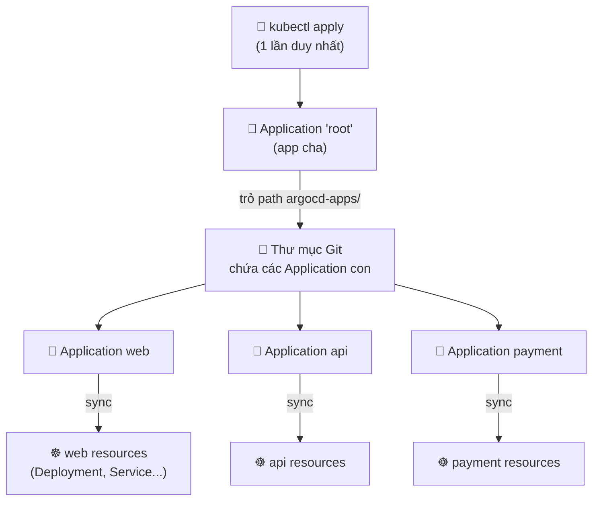
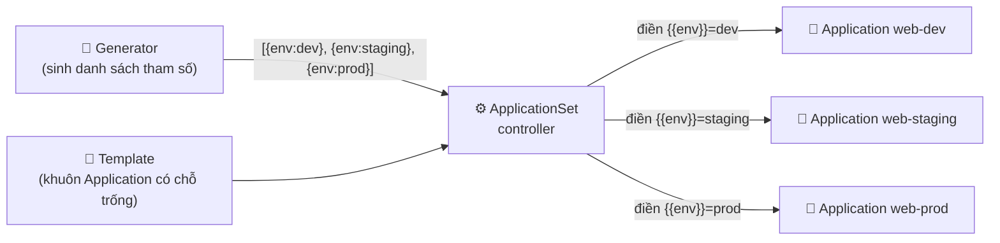

# App-of-Apps & ApplicationSet — Quản hàng loạt app tự động

> **Tác giả:** Mr.Rom\
> **Phiên bản:** v1.0.0\
> **Tạo lúc:** 13/06/2026\
> **Cập nhật:** 13/06/2026\
> **Level:** Intermediate\
> **Tags:** gitops, argocd, applicationset, app-of-apps, generators, multi-env, multi-cluster, flux, kustomization, bootstrap\
> **Yêu cầu trước:** [GitOps Intermediate — Khi GitOps gặp quy mô nhiều app, nhiều team, nhiều cluster](00_intermediate-overview.md)

> 🎯 *Cụm Basic đã dạy bạn tạo **một** `Application` trỏ vào một thư mục Git, rồi để reconcile loop tự sync. Nhưng Acme Shop giờ có hàng chục microservice × 3 môi trường × nhiều cluster — viết tay từng `Application` là việc bất khả thi và đầy lỗi. Sau bài này bạn sẽ hiểu hai pattern quản app hàng loạt: **app-of-apps** (một app cha bootstrap cả hệ) và **ApplicationSet** (một template + generator tự sinh Application động), biết khi nào dùng cái nào, nắm cả 7 generator (List, Cluster, Git, Matrix, Merge, SCM Provider, Pull Request) và đối chiếu sang Flux. Cuối bài bạn tự tay viết một ApplicationSet Git-directory generator tự dò mọi overlay env của Acme Shop và sinh Application cho từng cái.*

## 🎯 Sau bài này bạn sẽ

- [ ] Hiểu vì sao tạo tay N `Application` cho M env × K cluster **không scale**, và pattern nào giải quyết
- [ ] Dùng **app-of-apps**: một `Application` cha trỏ vào thư mục chứa nhiều `Application` con để bootstrap cả hệ trong một lần
- [ ] Hiểu **ApplicationSet controller** + cách một *template* + *generator* sinh ra Application động
- [ ] Phân biệt và dùng được 7 **generator**: List, Cluster, Git (directory + file), Matrix, Merge, SCM Provider, Pull Request
- [ ] Dùng **templating fields** (`{{cluster}}`, `{{path}}`, `{{env}}`) để mỗi Application sinh ra mang đúng giá trị riêng
- [ ] Đối chiếu được sang **Flux** (Kustomization tree + tenant) làm điều tương đương
- [ ] Quyết định **khi nào dùng app-of-apps vs ApplicationSet** dựa trên bản chất bài toán
- [ ] Tự viết một **ApplicationSet Git-directory generator** tự sinh Application cho mọi overlay env của Acme Shop

---

## Khi 1 app thành 40 app: lúc copy-paste YAML không còn kham nổi

Hồi ở cụm Basic, Acme Shop chỉ có một app web. Bạn viết một `Application` YAML, `kubectl apply`, xong — ArgoCD lo phần còn lại. Đẹp.

Rồi Acme Shop lớn lên. Tách monolith thành microservice: `web`, `api`, `payment`, `catalog`, `search`, `notify`, `cart`, `order`... đếm sơ đã hơn chục cái. Mỗi service lại chạy ở 3 môi trường: `dev`, `staging`, `production`. Rồi vì khách hàng ở cả Việt Nam lẫn Singapore, production tách thành 2 cluster theo region. Làm phép nhân nhanh:

```
10 service × 3 env = 30 Application
... cộng thêm production nhân đôi cluster ≈ 40+ Application
```

Bây giờ thử hình dung công việc: mỗi `Application` là một file YAML ~30 dòng, khác nhau đúng vài chỗ — tên app, `path` Git, `namespace`, `server` cluster. Bạn ngồi copy file `web-dev.yaml` thành `web-staging.yaml`, sửa tay ba chỗ, lưu. Lặp lại 40 lần. Thêm một service mới? Lại copy 3 file nữa. Mở thêm một cluster region thứ ba? Copy *toàn bộ* 40 file một lần nữa, sửa `server`.

> [!WARNING]
> Copy-paste YAML quy mô lớn không chỉ tốn công — nó là **ổ lỗi**. Sửa thiếu một `namespace`, app deploy nhầm chỗ; quên đổi một `path`, app kéo sai config; lệch một `server`, app lên nhầm cluster production. Lỗi kiểu này âm thầm, khó phát hiện, và đúng kiểu sẽ nổ lúc 3h sáng.

Vấn đề cốt lõi: **danh sách Application của bạn không phải là dữ liệu cố định — nó là kết quả của một công thức** (service × env × cluster). Mà công thức thì máy nên tính, không nên để người gõ tay. GitOps sinh ra để chống "sửa tay trên cluster"; vậy thì việc *quản lý chính các Application* cũng nên declarative và tự động nốt.

Hai pattern trả lời bài toán này, ở hai cấp độ:

- **App-of-apps** — gom một *danh sách* Application có sẵn vào một app cha để bootstrap cả hệ trong một lần apply. Hợp khi danh sách app khác nhau về bản chất, viết tay từng cái vẫn chấp nhận được, nhưng muốn quản tập trung.
- **ApplicationSet** — không viết từng Application nữa, mà viết *một template + một generator*; controller tự nhân bản ra Application theo công thức. Hợp khi các app giống nhau về cấu trúc, chỉ khác vài biến (env, cluster, path).

Bài này mổ xẻ cả hai.

---

## 1️⃣ App-of-apps — một app cha bootstrap cả hệ

Bắt đầu từ pattern đơn giản hơn về ý tưởng.

Bạn đã biết một `Application` của ArgoCD trỏ vào một thư mục Git và sync mọi resource trong đó vào cluster. Câu hỏi nghịch lý nhưng then chốt: **chính `Application` cũng là một resource Kubernetes** (một CRD `kind: Application`). Vậy điều gì ngăn một `Application` trỏ vào một thư mục Git chứa toàn... các file `Application` khác?

Không gì cả. Và đó chính là **app-of-apps**.

🪞 **Ẩn dụ đời thường**: app-of-apps giống một **mục lục sách**. Bạn không cần lật tìm từng chương rải rác — chỉ cần một trang mục lục (app cha) liệt kê mọi chương (app con) và số trang của chúng. Đưa cuốn sách cho ai, họ mở mục lục là thấy toàn bộ cấu trúc. Trong GitOps, bạn apply *một* app cha, ArgoCD đọc "mục lục" rồi tự tạo mọi app con — bootstrap cả hệ chỉ bằng một thao tác.

**Cơ chế**: app cha (thường tên `bootstrap` hoặc `root`) trỏ `path` vào một thư mục Git chứa nhiều file `Application` con. ArgoCD sync app cha → tạo các `Application` con đó như resource trong namespace `argocd` → mỗi app con đến lượt nó sync app thật của mình.

> 💡 Đây là khái niệm dễ "xoắn não" nhất của pattern (app trỏ vào app), nên hãy nhìn sơ đồ dưới để thấy quan hệ cha–con–app-thật rõ ràng trước khi đọc YAML.



→ Điểm cốt lõi của sơ đồ: bạn chỉ chạm tay vào **đúng một** thứ — app `root`. Mọi thứ bên dưới là dây chuyền tự động. Thêm một service mới chỉ là thêm một file `Application` con vào thư mục `argocd-apps/` rồi commit; lần reconcile kế tiếp, app `root` thấy thư mục có thêm file → tự tạo app con mới. Không ai phải `kubectl apply` thủ công nữa.

### 1.1 Viết app cha

App cha không có gì lạ so với một `Application` bình thường — chỉ là `path` của nó trỏ vào thư mục chứa các `Application` con thay vì thư mục manifest của app thật. Đọc kỹ phần `source.path`:

```yaml
# root-app.yaml — app cha, trỏ vào thư mục chứa các Application con
apiVersion: argoproj.io/v1alpha1
kind: Application
metadata:
  name: root
  namespace: argocd                 # mọi Application sống trong namespace argocd
spec:
  project: default
  source:
    repoURL: https://github.com/acme/gitops-config
    targetRevision: main
    path: argocd-apps               # thư mục chứa các file Application con
  destination:
    server: https://kubernetes.default.svc
    namespace: argocd               # app con được tạo trong namespace argocd
  syncPolicy:
    automated:
      prune: true                   # xoá app con nếu file của nó bị xoá khỏi Git
      selfHeal: true                # tự revert nếu ai sửa app con bằng tay
```

Cấu trúc Git tương ứng — thư mục `argocd-apps/` chứa từng `Application` con, còn manifest thật của mỗi app nằm ở `apps/`:

```
gitops-config/
├── argocd-apps/                 # ← app cha trỏ vào đây
│   ├── web.yaml                 # Application con: web
│   ├── api.yaml                 # Application con: api
│   └── payment.yaml             # Application con: payment
└── apps/                        # manifest thật của từng app
    ├── web/production/...
    ├── api/production/...
    └── payment/production/...
```

→ Apply `root-app.yaml` một lần. ArgoCD sync app `root` → tạo 3 `Application` con (`web`, `api`, `payment`) trong namespace `argocd` → mỗi app con sync manifest của mình từ `apps/.../production`. Cả hệ lên trong một dây chuyền, từ một lệnh apply.

> [!TIP]
> Vì `prune: true` ở app cha áp dụng cho chính các `Application` con, xoá một file trong `argocd-apps/` sẽ khiến app con (và mọi resource nó quản) bị gỡ sạch. Đây là dao hai lưỡi: tiện để dọn app cũ, nhưng nguy hiểm nếu xoá nhầm file. Branch protection + PR review là bắt buộc cho repo bootstrap.

### 1.2 Hạn chế của app-of-apps

App-of-apps gọn cho việc *bootstrap*, nhưng nó vẫn yêu cầu bạn **viết tay từng file `Application` con**. Quay lại bài toán 40 app: bạn vẫn phải tạo 40 file trong `argocd-apps/`, mỗi file khác nhau vài dòng. App cha chỉ giúp bạn *apply một lần* thay vì 40 lần — nó **không** giúp bạn *viết ít YAML hơn*.

Nói cách khác: app-of-apps gom một *danh sách có sẵn*, nhưng không *sinh ra* danh sách đó. Khi danh sách app là kết quả của một công thức (mọi service × mọi env × mọi cluster), ta cần thứ biết "nhân bản theo công thức" — đó là ApplicationSet.

---

## 2️⃣ ApplicationSet — một template, sinh Application động

Đây là nhân vật chính của bài.

**ApplicationSet** là một controller riêng (đi kèm ArgoCD từ phiên bản 2.3 trở đi) và một CRD `kind: ApplicationSet`. Thay vì bạn viết N file `Application`, bạn viết **một** `ApplicationSet` gồm hai phần:

- **`generators`** — nguồn sinh ra *danh sách tham số*. Mỗi phần tử trong danh sách là một bộ biến (ví dụ `{env: dev, namespace: dev}`).
- **`template`** — khuôn của một `Application`, trong đó có các chỗ trống `{{...}}` được điền bằng tham số từ generator.

Controller lấy *mỗi phần tử* generator sinh ra, đổ vào template, và tạo ra *một* `Application` tương ứng. Generator đẻ ra 30 phần tử → 30 Application xuất hiện.

🪞 **Ẩn dụ đời thường**: ApplicationSet giống **một khuôn làm bánh + một khay nguyên liệu**. Khuôn (template) định hình mọi cái bánh giống nhau; khay nguyên liệu (generator) quyết định có bao nhiêu cái và mỗi cái nhân gì (đậu xanh, sầu riêng, trứng muối). Bạn không nặn từng cái bánh bằng tay — đổ nguyên liệu vào khuôn, máy ra hàng loạt. Thêm một loại nhân vào khay → tự có thêm một cái bánh, không phải làm lại khuôn.

> 💡 Sơ đồ dưới là mô hình trừu tượng nhất của cả bài — generator + template → controller → loạt Application. Nắm được nó là nắm được mọi generator phía sau, vì chúng chỉ khác nhau ở "lấy danh sách tham số từ đâu".



→ Điểm cốt lõi: ApplicationSet **không tự deploy app** — nó chỉ *sinh ra các `Application`*. Mỗi `Application` sinh ra sau đó hoạt động y hệt một `Application` viết tay (có sync policy, reconcile loop, self-heal riêng). ApplicationSet là "nhà máy đẻ Application", còn việc deploy thật vẫn do từng Application lo. Sửa danh sách → controller tự thêm/bớt Application tương ứng, không cần ai can thiệp.

### 2.1 Quan hệ với app-of-apps

Hai pattern không loại trừ nhau. ApplicationSet *thay thế* app-of-apps trong phần lớn trường hợp vì nó vừa apply một lần *vừa* sinh động (đỡ viết tay). Nhưng app-of-apps vẫn hữu ích khi danh sách app **không theo công thức nào** (mỗi app một kiểu, chart khác nhau, không có quy luật để generator dò). Bảng so sánh nằm ở mục 4 cuối bài.

---

## 3️⃣ Bảy generator — lấy danh sách tham số từ đâu

Mọi generator đều làm cùng một việc: **sinh ra một danh sách bộ-tham-số** để đổ vào template. Chúng chỉ khác nhau ở *nguồn* lấy danh sách đó. Nắm bảng tổng quan trước, rồi đào từng cái:

| Generator | Lấy danh sách từ | Dùng điển hình |
|---|---|---|
| **List** | Danh sách viết tay trong YAML | Vài env cố định, ít thay đổi |
| **Cluster** | Các cluster đã đăng ký với ArgoCD | Deploy thứ gì đó lên *mọi* cluster |
| **Git directory** | Tên các thư mục con khớp glob trong Git | Mỗi thư mục = một app/env, tự dò |
| **Git file** | Nội dung các file config (JSON/YAML) trong Git | Tham số phức tạp lưu trong file |
| **Matrix** | Tích Descartes của 2 generator | app × cluster, env × region |
| **Merge** | Gộp nhiều generator, override theo key | Base + ngoại lệ riêng vài cluster |
| **SCM Provider** | Mọi repo của một org trên GitHub/GitLab | Mỗi repo = một app, tự dò repo mới |
| **Pull Request** | Mỗi PR đang mở của repo | Tạo môi trường preview cho từng PR |

### 3.1 List generator — danh sách viết tay

Đơn giản nhất: bạn liệt kê thẳng các phần tử. Hợp khi số env cố định và ít đổi. Ví dụ Acme Shop muốn deploy app `web` lên 3 env, mỗi env khác nhau ở `namespace` và `path` overlay:

```yaml
apiVersion: argoproj.io/v1alpha1
kind: ApplicationSet
metadata:
  name: web-envs
  namespace: argocd
spec:
  generators:
    - list:
        elements:
          - env: dev
            namespace: dev
          - env: staging
            namespace: staging
          - env: production
            namespace: production
  template:
    metadata:
      name: 'web-{{env}}'                          # web-dev, web-staging, web-production
    spec:
      project: default
      source:
        repoURL: https://github.com/acme/gitops-config
        targetRevision: main
        path: 'apps/web/overlays/{{env}}'          # đường dẫn overlay theo env
      destination:
        server: https://kubernetes.default.svc
        namespace: '{{namespace}}'
      syncPolicy:
        automated:
          prune: true
          selfHeal: true
        syncOptions:
          - CreateNamespace=true
```

→ Controller sinh đúng 3 Application: `web-dev`, `web-staging`, `web-production`. Mỗi cái có `path` và `namespace` riêng, điền từ phần tử tương ứng. Thêm env `qa`? Thêm một phần tử vào `elements`, commit — Application `web-qa` tự xuất hiện.

### 3.2 Cluster generator — sinh theo cluster đã đăng ký

ArgoCD lưu mỗi cluster đã đăng ký dưới dạng một Secret có label `argocd.argoproj.io/secret-type: cluster`. Cluster generator đọc danh sách đó và sinh một Application cho *mỗi* cluster. Đây là cách deploy thứ "ai cũng cần" (monitoring agent, log collector, network policy) lên toàn bộ flotilla cluster:

```yaml
apiVersion: argoproj.io/v1alpha1
kind: ApplicationSet
metadata:
  name: monitoring-all-clusters
  namespace: argocd
spec:
  generators:
    - clusters: {}                                 # MỌI cluster ArgoCD biết
  template:
    metadata:
      name: 'monitoring-{{name}}'                  # {{name}} = tên cluster
    spec:
      project: default
      source:
        repoURL: https://github.com/acme/gitops-config
        targetRevision: main
        path: apps/monitoring
      destination:
        server: '{{server}}'                       # API endpoint của cluster đó
        namespace: monitoring
      syncPolicy:
        automated:
          prune: true
          selfHeal: true
        syncOptions:
          - CreateNamespace=true
```

→ Có 4 cluster đăng ký → 4 Application `monitoring-<tên>`. Đăng ký thêm cluster thứ 5 bằng `argocd cluster add` → ApplicationSet tự dò ra → monitoring tự lên cluster mới. Đây là **pattern tự đăng ký** (self-registering): hạ tầng cluster mới tự kéo theo bộ công cụ chuẩn, không ai phải nhớ apply.

> [!NOTE]
> Cluster generator phơi ra các biến `{{name}}` (tên cluster), `{{server}}` (URL API), và `{{metadata.labels.<key>}}` (label gắn lúc đăng ký). Muốn chỉ chọn cluster production, thêm `selector.matchLabels: {env: production}` vào `clusters` — generator chỉ sinh cho cluster mang label đó.

### 3.3 Git generator — dò directory hoặc đọc file

Git generator có hai chế độ, đừng nhầm.

**Chế độ directory** dò *tên các thư mục con* khớp một glob pattern, mỗi thư mục thành một phần tử. Hợp khi mỗi thư mục Git là một app hoặc một env độc lập. Ví dụ dò mọi thư mục trực tiếp dưới `apps/`:

```yaml
spec:
  generators:
    - git:
        repoURL: https://github.com/acme/gitops-config
        revision: main
        directories:
          - path: apps/*                           # mỗi thư mục con của apps/ = 1 phần tử
  template:
    metadata:
      name: '{{path.basename}}'                    # tên app = tên thư mục cuối (web, api...)
    spec:
      source:
        repoURL: https://github.com/acme/gitops-config
        targetRevision: main
        path: '{{path}}'                           # đường dẫn đầy đủ tới thư mục đó
      destination:
        server: https://kubernetes.default.svc
        namespace: production
```

→ Có `apps/web`, `apps/api`, `apps/payment` → sinh 3 Application tên `web`, `api`, `payment`. Thêm thư mục `apps/search` rồi commit → Application `search` tự xuất hiện. *Cấu trúc thư mục chính là cấu hình* — đây là điểm bạn sẽ dùng cho hands-on cuối bài.

**Chế độ file** đọc *nội dung* các file config (JSON hoặc YAML) khớp glob; mỗi file là một phần tử, và mọi key trong file thành biến template. Hợp khi tham số phức tạp hơn vài chuỗi:

```yaml
spec:
  generators:
    - git:
        repoURL: https://github.com/acme/gitops-config
        revision: main
        files:
          - path: 'clusters/**/config.json'        # đọc nội dung mỗi config.json
  template:
    metadata:
      name: '{{cluster.name}}-ingress'             # key lồng nhau từ JSON
    spec:
      source:
        repoURL: https://github.com/acme/gitops-config
        targetRevision: main
        path: 'apps/ingress/overlays/{{cluster.tier}}'
      destination:
        server: '{{cluster.address}}'
        namespace: ingress
```

Với file `clusters/sg/config.json` nội dung:

```json
{
  "cluster": {
    "name": "prod-sg",
    "tier": "production",
    "address": "https://prod-sg.eks.amazonaws.com"
  }
}
```

→ Một Application `prod-sg-ingress`, dùng overlay `production`, deploy lên endpoint `prod-sg`. Mỗi `config.json` mới = một Application mới. File chứa cả "ý đồ" của cluster, generator chỉ việc đọc.

### 3.4 Matrix generator — nhân hai chiều

Đây là generator giải bài toán "M env × K cluster" gốc của bài. **Matrix** lấy *tích Descartes* (Cartesian product) của hai generator con: mỗi phần tử của generator A ghép với mỗi phần tử của generator B. Hai chiều giao nhau, các biến được trộn vào cùng một template.

Ví dụ: deploy app `payment` lên *mọi* cluster production × *mỗi* env trong danh sách:

```yaml
spec:
  generators:
    - matrix:
        generators:
          - clusters:                              # generator A: cluster production
              selector:
                matchLabels:
                  env: production
          - list:                                  # generator B: danh sách app
              elements:
                - app: payment
                - app: order
  template:
    metadata:
      name: '{{app}}-{{name}}'                     # payment-prod-sg, order-prod-vn, ...
    spec:
      project: default
      source:
        repoURL: https://github.com/acme/gitops-config
        targetRevision: main
        path: 'apps/{{app}}/production'
      destination:
        server: '{{server}}'
        namespace: production
```

→ 2 cluster production × 2 app = 4 Application (`payment-prod-sg`, `payment-prod-vn`, `order-prod-sg`, `order-prod-vn`). Mỗi app sinh ra mang đủ biến từ *cả hai* generator (`{{app}}` từ list, `{{name}}`/`{{server}}` từ clusters).

> [!CAUTION]
> Matrix là phép nhân — nó **bùng nổ tổ hợp** rất nhanh. 10 cluster × 20 app = 200 Application, đủ làm ApplicationSet controller và ArgoCD nặng nề, UI lag. Luôn dùng `selector` để lọc bớt chiều cluster/app trước khi nhân, đừng để `clusters: {}` (tất cả) nhân với `list` dài.

### 3.5 Merge generator — gộp và override theo key

Trong khi Matrix *nhân* hai generator (tạo nhiều phần tử hơn), **Merge** *gộp* nhiều generator thành cùng một tập phần tử, **ghép theo một key chung** và cho generator sau **ghi đè** giá trị của generator trước. Số phần tử **không** tăng — bạn vẫn có bấy nhiêu cluster, nhưng vá thêm/sửa giá trị cho vài cái cá biệt.

Bài toán điển hình: mọi cluster dùng `replicas: 2` mặc định, *riêng* cluster `prod-sg` cần `replicas: 5`. Merge cho phép định nghĩa base một lần rồi vá ngoại lệ:

```yaml
spec:
  generators:
    - merge:
        mergeKeys:
          - server                                 # ghép các phần tử theo cùng 'server'
        generators:
          - clusters: {}                           # base: mọi cluster, replicas mặc định
          - list:                                  # override: chỉ vá cluster cá biệt
              elements:
                - server: https://prod-sg.eks.amazonaws.com
                  replicas: "5"
  template:
    metadata:
      name: 'web-{{name}}'
    spec:
      source:
        repoURL: https://github.com/acme/gitops-config
        targetRevision: main
        path: apps/web/production
        kustomize:
          replicas:
            - name: web
              count: '{{replicas}}'                # cluster thường nhận default, prod-sg nhận 5
      destination:
        server: '{{server}}'
        namespace: production
```

→ Generator clusters sinh mọi cluster; list chỉ có một phần tử khớp `server` của `prod-sg`. Merge ghép theo `server`: cluster `prod-sg` được override `replicas: "5"`, các cluster còn lại giữ giá trị mặc định (bạn cấp default ở base list hoặc ở template). Kết quả: *cùng số Application* như chỉ dùng clusters, nhưng một cái được vá riêng.

### 3.6 SCM Provider generator — dò mọi repo của một org

**SCM Provider** (SCM = Source Code Management, hệ quản mã nguồn như GitHub/GitLab) gọi API của org để lấy *danh sách mọi repo* khớp tiêu chí, mỗi repo thành một phần tử. Hợp với mô hình "mỗi microservice một repo, mỗi repo tự mang manifest deploy của mình":

```yaml
spec:
  generators:
    - scmProvider:
        github:
          organization: acme                       # quét mọi repo của org 'acme'
          allBranches: false                       # chỉ lấy nhánh mặc định
          tokenRef:
            secretName: github-token               # Secret chứa PAT để gọi API
            key: token
        filters:
          - repositoryMatch: '^svc-'               # chỉ repo tên bắt đầu bằng 'svc-'
            pathsExist:
              - deploy/manifests                   # và phải có thư mục deploy/manifests
  template:
    metadata:
      name: '{{repository}}'                       # tên app = tên repo
    spec:
      source:
        repoURL: '{{url}}'                         # URL repo do generator cấp
        targetRevision: '{{branch}}'
        path: deploy/manifests
      destination:
        server: https://kubernetes.default.svc
        namespace: '{{repository}}'
```

→ Org `acme` có `svc-cart`, `svc-order`, `svc-search` (mỗi cái có `deploy/manifests`) → 3 Application tự sinh. Tạo repo `svc-wishlist` mới đúng convention → ApplicationSet dò ra → app tự lên. Đây là tự-đăng-ký ở *tầng repo*: ra mắt service mới không cần đụng tới repo GitOps.

### 3.7 Pull Request generator — môi trường preview cho từng PR

Generator độc đáo nhất. **Pull Request** gọi API SCM lấy *danh sách mọi PR đang mở* của một repo, mỗi PR thành một phần tử. Dùng để dựng **môi trường preview ephemeral** (tạm thời) cho từng PR — reviewer mở đúng môi trường của PR đó để xem trước khi merge:

```yaml
spec:
  generators:
    - pullRequest:
        github:
          owner: acme
          repo: web
          tokenRef:
            secretName: github-token
            key: token
        requeueAfterSeconds: 60                    # quét PR mới mỗi 60 giây
  template:
    metadata:
      name: 'web-pr-{{number}}'                    # web-pr-128, web-pr-129, ...
    spec:
      source:
        repoURL: https://github.com/acme/web
        targetRevision: '{{head_sha}}'             # commit mới nhất của nhánh PR
        path: deploy/preview
      destination:
        server: https://kubernetes.default.svc
        namespace: 'preview-pr-{{number}}'         # mỗi PR một namespace riêng
      syncPolicy:
        automated:
          prune: true
          selfHeal: true
        syncOptions:
          - CreateNamespace=true
```

→ Mở PR #128 → Application `web-pr-128` sinh ra, deploy bản preview vào namespace `preview-pr-128`. **Đóng/merge PR → Application tự biến mất** và namespace được dọn. Vòng đời môi trường khớp đúng vòng đời PR, không để lại rác.

> [!TIP]
> Pull Request generator là cách rẻ nhất để có "review app" như Heroku/Vercel ngay trong cluster của bạn. Kết hợp `filters` (ví dụ chỉ PR có label `preview`) để khỏi dựng môi trường cho mọi PR vặt — tránh tốn tài nguyên cluster.

### 3.8 Templating: goTemplate và các trường biến

Mọi ví dụ trên dùng cú pháp `{{var}}` của *fasttemplate* (bộ template mặc định, thay chuỗi đơn giản). ArgoCD còn hỗ trợ **Go template** mạnh hơn (có `if`, `range`, hàm) khi bạn bật cờ `spec.goTemplate: true`. Khi đó cú pháp đổi sang dạng Go (`{{.var}}`):

```yaml
spec:
  goTemplate: true                                 # bật Go template
  goTemplateOptions: ["missingkey=error"]          # lỗi ngay nếu thiếu biến (an toàn)
  generators:
    - list:
        elements:
          - env: dev
          - env: production
  template:
    metadata:
      name: 'web-{{.env}}'                         # chú ý dấu chấm: {{.env}} không phải {{env}}
```

→ `goTemplateOptions: ["missingkey=error"]` là mẹo an toàn quan trọng: nếu template tham chiếu một biến không tồn tại, controller báo lỗi *ngay* thay vì âm thầm sinh ra tên app rỗng/sai. Với fasttemplate (mặc định) thì biến thiếu bị bỏ qua lặng lẽ — dễ tạo app lỗi.

> [!IMPORTANT]
> Có một cạm bẫy factual quan trọng: annotation `argocd.argoproj.io/sync-wave` dùng để sắp thứ tự resource *bên trong một lần sync của một app* — nó **không** sắp thứ tự giữa các `Application` do ApplicationSet sinh ra. Hơn nữa giá trị sync-wave **bắt buộc là số nguyên dạng chuỗi** (`"0"`, `"5"`); đặt `sync-wave: "{{env}}-wave"` sẽ render thành `"dev-wave"` và ArgoCD parse số nguyên *thất bại*. Muốn deploy dev → staging → prod *có thứ tự*, dùng `spec.strategy.type: RollingSync` của ApplicationSet (sắp theo từng nhóm Application), không phải sync-wave.

---

## 4️⃣ Flux làm điều tương đương: Kustomization tree + tenant

Nếu cluster Acme Shop chạy Flux thay vì ArgoCD, hai pattern trên có "bản dịch" tương ứng — chỉ khác tên CRD và cách tổ chức.

Flux không có một CRD `ApplicationSet` đơn lẻ. Thay vào đó nó dùng **cây Kustomization** (`Kustomization` CRD của `kustomize-controller`): một `Kustomization` cha trỏ vào thư mục Git chứa các `Kustomization` con khác — y hệt ý tưởng app-of-apps, nhưng đối tượng là `Kustomization` thay vì `Application`.

Bảng đối chiếu khái niệm để bạn chuyển ngữ giữa hai hệ:

| Khái niệm | ArgoCD | Flux |
|---|---|---|
| Đơn vị deploy một app | `Application` | `Kustomization` (+ `GitRepository` nguồn) |
| Gom nhiều app (bootstrap) | App-of-apps | Cây `Kustomization` (cha trỏ thư mục con) |
| Sinh app động từ template | `ApplicationSet` + generators | (Không có 1-1) — thường dùng `flux create tenant` + script, hoặc cây Kustomization theo thư mục env |
| Sắp thứ tự deploy | sync-wave / RollingSync | `dependsOn` giữa các `Kustomization` |
| Cô lập team | `AppProject` + RBAC | **Tenant** (namespace + ServiceAccount + RBAC gắn vào `Kustomization`) |

Ví dụ một `Kustomization` cha bootstrap cả hệ (tương đương app cha của app-of-apps):

```yaml
# flux: Kustomization cha trỏ vào thư mục chứa các Kustomization con
apiVersion: kustomize.toolkit.fluxcd.io/v1
kind: Kustomization
metadata:
  name: apps
  namespace: flux-system
spec:
  interval: 10m                                    # reconcile mỗi 10 phút
  sourceRef:
    kind: GitRepository
    name: gitops-config                            # GitRepository đã khai báo trước
  path: ./clusters/production/apps                 # thư mục chứa các Kustomization con
  prune: true                                      # tương đương prune của ArgoCD
```

→ Flux sync `Kustomization` `apps` → áp dụng mọi `Kustomization` con trong `./clusters/production/apps` → mỗi con kéo app thật của mình. Đây là cây Kustomization — bản Flux của app-of-apps.

Về phần "sinh động theo công thức" như ApplicationSet generators, Flux **không có** một controller generator tương đương trực tiếp. Cách Flux-native là tổ chức **một thư mục Git per-env / per-cluster** rồi để cây Kustomization phản ánh cấu trúc đó — giống tinh thần Git-directory generator nhưng làm thủ công qua bố cục thư mục. Để cô lập nhiều team, Flux dùng khái niệm **tenant**: `flux create tenant` sinh namespace + ServiceAccount + RBAC, và mỗi `Kustomization` của team chạy *dưới* ServiceAccount đó (impersonation) — team không đụng được tài nguyên team khác.

> [!NOTE]
> Đây là khác biệt triết lý: ArgoCD nghiêng về "một control plane sinh động nhiều app/cluster" (hub-and-spoke + ApplicationSet), còn Flux nghiêng về "mỗi cluster tự chạy Flux của mình, cấu trúc thư mục Git là cấu hình". Bài [Multi-Cluster & Multi-Tenancy](03_multi-cluster-and-multi-tenancy.md) cuối cụm sẽ đào sâu cách cô lập team trên cả hai.

---

## 5️⃣ Khi nào dùng app-of-apps vs ApplicationSet

Cả hai cùng giải bài toán "nhiều app", nhưng hợp với hình thái khác nhau. Dưới đây là kim chỉ nam, không phải luật cứng:

| Tiêu chí | App-of-apps | ApplicationSet |
|---|---|---|
| Bản chất danh sách app | Cố định, mỗi app một kiểu (chart/cấu trúc khác nhau) | Theo công thức (service × env × cluster), cấu trúc giống nhau |
| Cách thêm app mới | Viết tay file `Application` con mới | Generator tự dò (thêm thư mục/cluster/repo/env) |
| Lượng YAML phải viết | Một file per app (vẫn nhiều khi N lớn) | Một template duy nhất cho cả nhóm |
| Sinh theo cluster động | Không (phải viết tay từng cluster) | Có (Cluster generator tự dò) |
| Môi trường preview theo PR | Không hợp | Có (Pull Request generator) |
| Độ phức tạp ban đầu | Thấp, dễ hiểu | Cao hơn (phải hiểu generator + template) |
| Khi nào chọn | Bootstrap một bộ app heterogeneous, ít thay đổi | Đội hình app đồng nhất, scale theo nhiều chiều |

→ Quy tắc thực dụng: **ApplicationSet cho mọi thứ có quy luật** (cùng app nhiều env/cluster, preview PR, monitoring toàn cluster). **App-of-apps cho phần "bootstrap nền"** — gom các thành phần hạ tầng khác nhau bản chất (ingress controller, cert-manager, monitoring stack, *và cả các ApplicationSet*) vào một app `root` để bật cụm chỉ bằng một apply. Hai pattern thường *kết hợp*: app `root` (app-of-apps) trỏ vào thư mục chứa vài `ApplicationSet` + vài `Application` lẻ.

---

## 6️⃣ Hands-on — ApplicationSet Git-directory tự sinh app cho mọi overlay env của Acme Shop

Giờ ráp lại. Acme Shop có repo `gitops-config` với app `web` được tổ chức theo Kustomize base + overlays, mỗi env một thư mục overlay. Mục tiêu: viết *một* ApplicationSet dùng **Git-directory generator** tự dò mọi thư mục overlay và sinh một Application cho mỗi env — thêm env mới chỉ bằng cách thêm thư mục, không sửa ApplicationSet.

> [!NOTE]
> Phần này giả định bạn đã có ArgoCD chạy trong cluster + đã `argocd login` (cách cài nằm ở bài CI/CD intermediate về ArgoCD — xem mục Liên kết). Ở đây ta tập trung vào ApplicationSet, không lặp bước cài.

### 🛠️ Bước 1: Cấu trúc thư mục overlay trong Git

Generator Git-directory dò *tên thư mục* để sinh phần tử, nên cấu trúc thư mục chính là "danh sách env". Repo `gitops-config` cần bố cục như sau:

```
gitops-config/
└── apps/
    └── web/
        ├── base/                       # Kustomize base dùng chung
        │   ├── deployment.yaml
        │   ├── service.yaml
        │   └── kustomization.yaml
        └── overlays/
            ├── dev/                     # mỗi thư mục con = 1 env
            │   └── kustomization.yaml
            ├── staging/
            │   └── kustomization.yaml
            └── production/
                └── kustomization.yaml
```

Mỗi `overlays/<env>/kustomization.yaml` tham chiếu base và vá phần riêng của env. Ví dụ overlay `dev` (giữ số replicas nhỏ cho tiết kiệm):

```yaml
# apps/web/overlays/dev/kustomization.yaml
apiVersion: kustomize.config.k8s.io/v1beta1
kind: Kustomization
resources:
  - ../../base                          # kế thừa base dùng chung
replicas:
  - name: web
    count: 1                            # dev chỉ cần 1 replica
```

→ ApplicationSet sẽ dò ba thư mục `dev`, `staging`, `production` dưới `overlays/` và biến mỗi tên thư mục thành một env. Cấu trúc thư mục là cấu hình — đây là cốt lõi của generator này.

### 🛠️ Bước 2: Viết ApplicationSet Git-directory generator

Bây giờ viết ApplicationSet dò glob `apps/web/overlays/*` — mỗi thư mục con khớp glob thành một phần tử. Đọc kỹ phần `directories` và cách `{{path.basename}}` được dùng để lấy tên env:

```yaml
# web-overlays-appset.yaml — tự sinh 1 Application cho mỗi overlay env của web
apiVersion: argoproj.io/v1alpha1
kind: ApplicationSet
metadata:
  name: web-overlays
  namespace: argocd
spec:
  generators:
    - git:
        repoURL: https://github.com/acme/gitops-config
        revision: main
        directories:
          - path: apps/web/overlays/*              # mỗi thư mục overlay = 1 env
  template:
    metadata:
      name: 'web-{{path.basename}}'                # path.basename = tên thư mục cuối (dev/staging/production)
    spec:
      project: default
      source:
        repoURL: https://github.com/acme/gitops-config
        targetRevision: main
        path: '{{path}}'                           # đường dẫn đầy đủ tới overlay đó
      destination:
        server: https://kubernetes.default.svc
        namespace: '{{path.basename}}'             # namespace trùng tên env
      syncPolicy:
        automated:
          prune: true
          selfHeal: true
        syncOptions:
          - CreateNamespace=true                   # tự tạo namespace dev/staging/production
```

Áp dụng ApplicationSet vào cluster:

```bash
kubectl apply -f web-overlays-appset.yaml
```

Kết quả:

```
applicationset.argoproj.io/web-overlays created
```

→ Output xác nhận ApplicationSet `web-overlays` đã được tạo. Bản thân nó chưa deploy gì — nó là "nhà máy". Bước kế ta xem nó đã đẻ ra những Application nào.

### 🛠️ Bước 3: Kiểm tra các Application được sinh ra

ApplicationSet controller dò Git, thấy 3 thư mục overlay, sinh 3 Application. Liệt kê chúng:

```bash
argocd app list
```

Kết quả mẫu:

```
NAME                     CLUSTER     NAMESPACE    PROJECT  STATUS  HEALTH   SYNCPOLICY
web-dev                  in-cluster  dev          default  Synced  Healthy  Auto-Prune
web-production           in-cluster  production   default  Synced  Healthy  Auto-Prune
web-staging              in-cluster  staging      default  Synced  Healthy  Auto-Prune
```

Đọc output: ba app `web-dev`, `web-staging`, `web-production` xuất hiện — mỗi cái tên ghép từ `web-` + tên thư mục overlay (`{{path.basename}}`), nằm đúng namespace trùng tên env. Cột `STATUS Synced` + `HEALTH Healthy` cho thấy mỗi app đã sync và chạy ổn. Cột `SYNCPOLICY Auto-Prune` xác nhận `automated.prune` từ template đã được áp vào *từng* Application sinh ra. Bạn viết một template, có ba app.

Muốn nhìn chính bản thân ApplicationSet (chứ không phải các app con), dùng `kubectl`:

```bash
kubectl get applicationset web-overlays -n argocd
```

```
NAME           AGE
web-overlays   30s
```

→ ApplicationSet là một CRD trong namespace `argocd`. Nó "đứng sau" và liên tục dò Git để đồng bộ danh sách Application với danh sách thư mục.

### 🛠️ Bước 4: Thêm env mới chỉ bằng cách thêm thư mục

Đây là khoảnh khắc thấy giá trị thật. Acme Shop muốn thêm môi trường `qa`. Với cách viết tay cũ, bạn phải tạo một `Application` mới. Với ApplicationSet Git-directory, bạn chỉ thêm *một thư mục overlay* và commit — không đụng ApplicationSet:

```bash
# Trong repo gitops-config: tạo overlay qa kế thừa base
mkdir -p apps/web/overlays/qa
```

Tạo file `apps/web/overlays/qa/kustomization.yaml`:

```yaml
# apps/web/overlays/qa/kustomization.yaml
apiVersion: kustomize.config.k8s.io/v1beta1
kind: Kustomization
resources:
  - ../../base
replicas:
  - name: web
    count: 2                            # qa dùng 2 replica
```

Commit và push:

```bash
git add apps/web/overlays/qa
git commit -m "feat(web): thêm môi trường qa"
git push origin main
```

→ Lần reconcile kế tiếp, ApplicationSet controller dò lại glob `apps/web/overlays/*`, thấy có thêm thư mục `qa`, và *tự sinh* Application `web-qa`. Kiểm tra:

```bash
argocd app list
```

```
NAME                     CLUSTER     NAMESPACE    PROJECT  STATUS  HEALTH   SYNCPOLICY
web-dev                  in-cluster  dev          default  Synced  Healthy  Auto-Prune
web-production           in-cluster  production   default  Synced  Healthy  Auto-Prune
web-qa                   in-cluster  qa           default  Synced  Healthy  Auto-Prune
web-staging              in-cluster  staging      default  Synced  Healthy  Auto-Prune
```

Đọc output: app `web-qa` đã tự xuất hiện ở namespace `qa`, `Synced` + `Healthy` — bạn không viết một dòng `Application` nào cho nó. Đây chính là điều copy-paste 40 file không bao giờ làm được: danh sách app *tự đồng bộ* với cấu trúc Git.

### 🛠️ Bước 5: Hiểu hành vi xoá (cẩn thận)

Cơ chế hoạt động cả chiều ngược: xoá thư mục overlay → Application tương ứng *biến mất*. Mặc định ApplicationSet bật chế độ xoá app khi phần tử generator biến mất. Đây là dao hai lưỡi — tiện để dọn env cũ, nhưng nguy hiểm nếu xoá nhầm thư mục:

```bash
# CẢNH BÁO minh hoạ: xoá overlay qa sẽ khiến Application web-qa (và mọi resource của nó) bị gỡ
# Trong repo gitops-config:
# git rm -r apps/web/overlays/qa && git commit -m "..." && git push
```

> [!CAUTION]
> Xoá một thư mục overlay khỏi Git làm ApplicationSet xoá Application tương ứng, và vì template có `automated.prune: true`, *mọi resource* của app đó bị gỡ khỏi cluster — kể cả PVC chứa dữ liệu nếu có. Để chống xoá nhầm hàng loạt, bật chính sách bảo vệ của ApplicationSet bằng `spec.syncPolicy.preserveResourcesOnDeletion: true` (giữ resource khi Application bị ApplicationSet xoá) và luôn yêu cầu PR review cho repo GitOps.

### 🧹 Dọn dẹp

Nếu bạn tạo ApplicationSet này chỉ để thử nghiệm, xoá nó để khỏi tiếp tục sinh app ngoài ý muốn:

```bash
# Xoá ApplicationSet → các Application con (web-dev/staging/...) cũng bị gỡ theo
kubectl delete applicationset web-overlays -n argocd
```

```
applicationset.argoproj.io "web-overlays" deleted
```

→ Xoá ApplicationSet sẽ kéo theo các Application nó sinh ra (trừ khi bạn đã bật `preserveResourcesOnDeletion`). Nếu đây là app thật đang phục vụ khách, **đừng** chạy lệnh này.

---

## 💡 Cạm bẫy thường gặp & Best practice

### ❌ Cạm bẫy: Matrix generator gây bùng nổ tổ hợp

- **Triệu chứng**: bật một ApplicationSet matrix, vài phút sau ArgoCD UI lag nặng, controller ngốn CPU, hàng trăm Application hiện ra ngoài dự kiến.
- **Nguyên nhân**: matrix là phép *nhân*. `clusters: {}` (mọi cluster, ví dụ 10) nhân với một `list` 20 app = 200 Application — mỗi cái là một reconcile loop riêng, cộng dồn thành tải khổng lồ.
- **Cách tránh**: luôn thêm `selector.matchLabels` để lọc chiều cluster (chỉ `env: production`) hoặc rút ngắn `list` trước khi nhân. Ước lượng tích số *trước* khi apply: nếu tích vượt vài chục, cân nhắc tách thành nhiều ApplicationSet nhỏ thay vì một matrix to.

### ❌ Cạm bẫy: dùng sync-wave để sắp thứ tự giữa các Application của ApplicationSet

- **Triệu chứng**: đặt `argocd.argoproj.io/sync-wave: "{{env}}-wave"` trong template mong dev lên trước prod, nhưng ApplicationSet báo lỗi parse, hoặc các app lên *cùng lúc* không theo thứ tự nào.
- **Nguyên nhân**: sync-wave chỉ sắp thứ tự resource *bên trong một lần sync của một app*, **không** giữa các `Application`. Hơn nữa giá trị phải là *số nguyên dạng chuỗi* (`"0"`); `"{{env}}-wave"` render thành `"dev-wave"` → ArgoCD parse số nguyên thất bại.
- **Cách tránh**: muốn deploy theo thứ tự dev → staging → prod, dùng `spec.strategy.type: RollingSync` của ApplicationSet (sắp các Application theo nhóm label, chờ nhóm trước Healthy mới sang nhóm sau). Để sắp resource *trong* một app thì mới dùng sync-wave với giá trị số nguyên cố định.

### ❌ Cạm bẫy: biến template thiếu mà controller im lặng sinh app sai

- **Triệu chứng**: ApplicationSet sinh ra Application có tên kỳ lạ (kiểu `web-`) hoặc trỏ vào `path` rỗng, app `OutOfSync` mãi mà không rõ vì sao.
- **Nguyên nhân**: với fasttemplate (mặc định), một biến `{{var}}` không tồn tại trong phần tử generator bị thay bằng *chuỗi rỗng* lặng lẽ, không báo lỗi — tên app/path bị cụt.
- **Cách tránh**: bật `spec.goTemplate: true` + `spec.goTemplateOptions: ["missingkey=error"]` để controller báo lỗi *ngay* khi template tham chiếu biến không có, thay vì âm thầm tạo app hỏng. Luôn `kubectl get applicationset <name> -n argocd -o yaml` xem `status` nếu app sinh ra trông sai.

### ✅ Best practice: kết hợp app-of-apps (bootstrap) + ApplicationSet (đội hình)

- **Vì sao**: hai pattern bù cho nhau. App-of-apps gom các thành phần *khác bản chất* (ingress controller, cert-manager, monitoring) để bật cụm bằng một apply; ApplicationSet sinh động các app *đồng nhất* (mọi service × mọi env). Trộn lại được cả hai lợi ích.
- **Cách áp dụng**: tạo một app `root` (app-of-apps) trỏ vào thư mục `bootstrap/` chứa: vài `Application` lẻ cho hạ tầng nền, *và* vài `ApplicationSet` cho đội hình microservice. Apply `root` một lần → cụm tự lên đầy đủ. Đây là pattern bootstrap chuẩn cho một cluster mới.

### ✅ Best practice: bảo vệ chống xoá hàng loạt trên repo GitOps

- **Vì sao**: ApplicationSet xoá thư mục/cluster = xoá Application = (với `prune: true`) xoá resource thật. Một PR sai hoặc `git rm` nhầm có thể quét sạch nhiều app cùng lúc.
- **Cách áp dụng**: bật `spec.syncPolicy.preserveResourcesOnDeletion: true` để giữ resource khi Application bị ApplicationSet gỡ; bắt buộc branch protection + 2 reviewer khác nhau cho repo `gitops-config`; với app stateful, thêm annotation `argocd.argoproj.io/sync-options: Prune=false` ngay trên resource nhạy cảm.

---

## 🧠 Tự kiểm tra (Self-check)

**Q1.** App-of-apps và ApplicationSet đều "quản nhiều app". Khác nhau cốt lõi ở đâu?

<details>
<summary>💡 Xem giải thích</summary>

**App-of-apps** gom một *danh sách Application có sẵn* (bạn vẫn viết tay từng file `Application` con) vào một app cha, để bootstrap cả hệ chỉ bằng *một* lần apply. Nó giúp bạn *apply ít lần hơn*, không giúp *viết ít YAML hơn*.

**ApplicationSet** *sinh ra* danh sách Application từ một *template + generator*. Bạn viết một template duy nhất; generator (List/Cluster/Git/...) tự đẻ ra Application theo công thức (service × env × cluster). Thêm env/cluster/repo mới → app tự xuất hiện, không sửa template.

Tóm tắt: app-of-apps *gom* danh sách có sẵn; ApplicationSet *tính ra* danh sách động. Khi danh sách app là kết quả của một công thức, dùng ApplicationSet; khi nó là một bộ thành phần khác bản chất ít đổi, dùng app-of-apps. Thường kết hợp cả hai.

</details>

**Q2.** Acme Shop muốn deploy một monitoring agent lên *mọi* cluster, kể cả cluster đăng ký sau này. Generator nào? Vì sao không dùng List?

<details>
<summary>💡 Xem giải thích</summary>

Dùng **Cluster generator** (`clusters: {}`). Nó đọc danh sách cluster đã đăng ký với ArgoCD và sinh một Application cho mỗi cluster, phơi ra `{{name}}` và `{{server}}` để điền destination.

Không dùng **List** vì List là danh sách *viết tay cố định*: mỗi lần đăng ký cluster mới bạn phải sửa YAML thêm phần tử — không scale. Cluster generator tự dò cluster mới (đăng ký bằng `argocd cluster add`) và tự sinh Application monitoring cho nó — pattern tự đăng ký (self-registering). Muốn lọc chỉ cluster production thì thêm `selector.matchLabels: {env: production}`.

</details>

**Q3.** Phân biệt Matrix và Merge generator. Cái nào làm *tăng* số Application?

<details>
<summary>💡 Xem giải thích</summary>

- **Matrix** lấy *tích Descartes* hai generator: mỗi phần tử A ghép với mỗi phần tử B → số phần tử **nhân lên** (2 cluster × 3 app = 6 Application). Dùng để phủ "mọi tổ hợp" (app × cluster). Cẩn thận bùng nổ tổ hợp.

- **Merge** *gộp* nhiều generator theo một `mergeKeys` chung, generator sau **ghi đè** giá trị generator trước. Số phần tử **không tăng** — bạn vẫn có bấy nhiêu cluster, chỉ *vá* thêm/sửa giá trị cho vài cái cá biệt (ví dụ mọi cluster `replicas: 2`, riêng `prod-sg` override `replicas: 5`).

→ **Matrix làm tăng** số Application (phép nhân); **Merge giữ nguyên** số lượng (gộp + override). Matrix trả lời "mọi tổ hợp", Merge trả lời "base + ngoại lệ".

</details>

**Q4.** Vì sao Pull Request generator hợp với "môi trường preview cho từng PR" còn Git-directory thì không?

<details>
<summary>💡 Xem giải thích</summary>

**Pull Request generator** gọi API SCM lấy *danh sách PR đang mở*, mỗi PR thành một phần tử với biến `{{number}}`, `{{head_sha}}`, `{{branch}}`. Vòng đời Application **khớp đúng vòng đời PR**: mở PR → app preview sinh ra; merge/đóng PR → app tự biến mất + namespace dọn sạch. Đây chính là điều môi trường preview cần — ephemeral, tự sinh tự huỷ theo PR.

**Git-directory generator** dò *thư mục trong nhánh mặc định* (thường `main`). Nó không biết gì về PR đang mở; thư mục chỉ thay đổi khi có commit vào nhánh đó. Vì vậy nó hợp với env *cố định* (dev/staging/prod là các thư mục trường tồn), không hợp với env *tạm thời theo PR* (PR không tạo thư mục mới trên `main`).

</details>

**Q5.** Trong ApplicationSet template, đặt `argocd.argoproj.io/sync-wave: "{{env}}-wave"` để dev lên trước prod. Có chạy không? Cách đúng là gì?

<details>
<summary>💡 Xem giải thích</summary>

**Không chạy**, vì hai lý do:

1. **sync-wave không sắp thứ tự giữa các Application**. Nó chỉ order resource *bên trong một lần sync của một app*. Các Application do ApplicationSet sinh ra là độc lập, sync-wave không điều phối chúng với nhau.
2. **Giá trị sai kiểu**. sync-wave bắt buộc là *số nguyên dạng chuỗi* (`"0"`, `"5"`). `"{{env}}-wave"` render thành `"dev-wave"` → ArgoCD parse số nguyên thất bại.

**Cách đúng**: dùng `spec.strategy.type: RollingSync` của ApplicationSet — sắp các Application thành từng bước theo label (ví dụ bước 1 `env=dev`, bước 2 `env=staging`, bước 3 `env=prod`), chờ mỗi bước Healthy rồi mới sang bước kế. sync-wave (số nguyên cố định) chỉ dùng để sắp resource *trong* một app.

</details>

---

## ⚡ Tra cứu nhanh (Cheatsheet)

| Mục đích | Lệnh / Cú pháp |
|---|---|
| Liệt kê mọi ApplicationSet | `kubectl get applicationset -n argocd` |
| Xem chi tiết 1 ApplicationSet | `kubectl describe applicationset <name> -n argocd` |
| Xem các Application nó sinh ra | `argocd app list` |
| Áp dụng ApplicationSet từ file | `kubectl apply -f appset.yaml` |
| Xoá ApplicationSet (gỡ cả app con) | `kubectl delete applicationset <name> -n argocd` |
| Đăng ký cluster (cho Cluster generator) | `argocd cluster add <kube-context>` |
| Liệt kê cluster đã đăng ký | `argocd cluster list` |

```yaml
# === Khung ApplicationSet (generator + template) ===
apiVersion: argoproj.io/v1alpha1
kind: ApplicationSet
metadata:
  name: <ten-appset>
  namespace: argocd
spec:
  goTemplate: true                              # bật Go template (cú pháp {{.var}})
  goTemplateOptions: ["missingkey=error"]       # báo lỗi nếu thiếu biến
  generators:
    - <loai-generator>: { ... }                 # list | clusters | git | matrix | merge | scmProvider | pullRequest
  template:
    metadata:
      name: '<ten-app>-{{.var}}'
    spec:
      project: default
      source:
        repoURL: https://github.com/acme/gitops-config
        targetRevision: main
        path: '<path-co-{{.var}}>'
      destination:
        server: '{{.server}}'
        namespace: '{{.namespace}}'
      syncPolicy:
        automated: { prune: true, selfHeal: true }
        syncOptions: [CreateNamespace=true]
```

```yaml
# === Cú pháp nhanh từng generator ===
# List — danh sách viết tay
- list:
    elements:
      - { env: dev, namespace: dev }

# Cluster — mọi cluster đã đăng ký (lọc bằng selector)
- clusters:
    selector: { matchLabels: { env: production } }

# Git directory — dò thư mục theo glob
- git:
    repoURL: https://github.com/acme/gitops-config
    revision: main
    directories: [{ path: 'apps/*/overlays/*' }]

# Matrix — tích Descartes 2 generator (phép NHÂN)
- matrix:
    generators: [{ clusters: {} }, { list: { elements: [{ app: web }] } }]

# Merge — gộp theo key, generator sau override (KHÔNG nhân)
- merge:
    mergeKeys: [server]
    generators: [{ clusters: {} }, { list: { elements: [{ server: ..., replicas: "5" }] } }]
```

---

## 📚 Từ Điển Thuật Ngữ (Glossary)

| EN | VN | Giải thích |
|---|---|---|
| App-of-apps | App-của-các-app | Một `Application` cha trỏ vào thư mục Git chứa nhiều `Application` con, để bootstrap cả hệ bằng một lần apply |
| ApplicationSet | Tập Application | CRD + controller sinh ra nhiều `Application` động từ một template + generator |
| Generator | Bộ sinh | Phần của ApplicationSet sinh ra danh sách tham số để đổ vào template |
| Template (ApplicationSet) | Khuôn Application | Khuôn của một `Application` với các chỗ trống `{{...}}` được điền từ generator |
| List generator | Generator danh sách | Sinh phần tử từ danh sách viết tay trong YAML |
| Cluster generator | Generator cluster | Sinh một Application cho mỗi cluster đã đăng ký với ArgoCD |
| Git directory generator | Generator thư mục Git | Dò tên thư mục con khớp glob trong Git, mỗi thư mục thành một phần tử |
| Git file generator | Generator file Git | Đọc nội dung file config (JSON/YAML) trong Git, mỗi file thành một phần tử |
| Matrix generator | Generator ma trận | Tích Descartes của hai generator — phép nhân, dễ bùng nổ tổ hợp |
| Merge generator | Generator gộp | Gộp nhiều generator theo key chung, generator sau override — không tăng số phần tử |
| SCM Provider generator | Generator nhà cung cấp SCM | Dò mọi repo của một org GitHub/GitLab, mỗi repo thành một phần tử |
| Pull Request generator | Generator Pull Request | Sinh một Application cho mỗi PR đang mở — dùng dựng môi trường preview |
| Cartesian product | Tích Descartes | Mọi tổ hợp ghép cặp giữa hai tập (cơ chế của Matrix generator) |
| Templating field | Trường template | Biến `{{cluster}}`, `{{path}}`, `{{env}}`... được điền vào template |
| goTemplate | Go template | Bộ template mạnh (có `if`/`range`/hàm) bật bằng `goTemplate: true`, cú pháp `{{.var}}` |
| RollingSync | Đồng bộ cuốn chiếu | Chiến lược ApplicationSet sync các Application theo nhóm tuần tự (dev → staging → prod) |
| Kustomization (Flux) | Kustomization | CRD của Flux mô tả một đơn vị deploy; cây Kustomization = bản Flux của app-of-apps |
| Tenant (Flux) | Người thuê | Khái niệm Flux cô lập team: namespace + ServiceAccount + RBAC gắn vào Kustomization |
| Preview environment | Môi trường preview | Môi trường tạm thời dựng cho từng PR để xem trước khi merge |
| Self-registering | Tự đăng ký | Pattern: thêm cluster/repo/thư mục mới → app tự sinh, không cần can thiệp tay |

---

## 🔗 Liên kết & Tài nguyên

### 🧭 Định hướng lộ trình học

- ⬅️ **Bài trước:** [GitOps Intermediate — Khi GitOps gặp quy mô nhiều app, nhiều team, nhiều cluster](00_intermediate-overview.md)
- ➡️ **Bài tiếp theo:** [Progressive Delivery — Canary & Blue-Green GitOps-native](02_progressive-delivery-with-argo-rollouts.md)
- ↑ **Về cụm:** [GitOps — Declarative Continuous Delivery](../../README.md)

### 🧩 Các chủ đề có thể bạn quan tâm

- [Cấu trúc Repo GitOps — Tách config, env promotion, app-of-apps](../01_basic/02_repository-structure-and-patterns.md) — bố cục base/overlays mà ApplicationSet Git-directory dựa vào
- [Sync, Drift & Reconciliation — Trái tim của GitOps](../01_basic/04_sync-drift-and-reconciliation.md) — cơ chế từng Application sinh ra sẽ chạy
- [ArgoCD vs Flux — Hai GitOps engine hàng đầu](../01_basic/01_flux-vs-argocd.md) — nền tảng để hiểu phần Flux Kustomization tree
- [GitOps với ArgoCD — Git = Single Source of Truth](../../../ci-cd/lessons/02_intermediate/01_gitops-with-argocd.md) — cài đặt ArgoCD + ApplicationSet trong bức tranh CI/CD

### 🌐 Tài nguyên tham khảo khác

- [ArgoCD — App of Apps pattern](https://argo-cd.readthedocs.io/en/stable/operator-manual/cluster-bootstrapping/) — bootstrap cụm bằng app cha
- [ApplicationSet — Generators](https://argo-cd.readthedocs.io/en/stable/operator-manual/applicationset/Generators/) — tài liệu chính thức cả 7 generator
- [ApplicationSet — Go Template](https://argo-cd.readthedocs.io/en/stable/operator-manual/applicationset/GoTemplate/) — bật `goTemplate` + hàm dựng sẵn
- [ApplicationSet — Progressive Syncs (RollingSync)](https://argo-cd.readthedocs.io/en/stable/operator-manual/applicationset/Progressive-Syncs/) — sắp thứ tự deploy giữa các Application
- [Flux — Kustomization](https://fluxcd.io/flux/components/kustomize/kustomizations/) — `dependsOn`, cây Kustomization phía Flux
- [Flux — Multi-tenancy (tenant)](https://fluxcd.io/flux/installation/configuration/multitenancy/) — cô lập team bằng tenant

---

## 📌 Nhật ký thay đổi (Changelog)

- **v1.0.0 (13/06/2026)** — Bản đầu tiên. Mở bằng bài toán scale (1 app → 40 app, copy-paste YAML không kham nổi). App-of-apps: app cha trỏ thư mục Application con, bootstrap một lần + sơ đồ cha-con-app-thật + hạn chế. ApplicationSet: template + generator, controller sinh động + sơ đồ mô hình + ẩn dụ khuôn bánh. Đào đủ 7 generator (List, Cluster, Git directory + file, Matrix, Merge, SCM Provider, Pull Request) kèm YAML chạy được + templating fields + cờ goTemplate/missingkey. Đối chiếu Flux (Kustomization tree + tenant) + bảng khái niệm. Bảng khi nào app-of-apps vs ApplicationSet. Hands-on 5 bước Acme Shop: cấu trúc overlay → viết Git-directory generator → kiểm tra app sinh ra → thêm env qa bằng cách thêm thư mục → hành vi xoá + preserveResourcesOnDeletion. 3 cạm bẫy (matrix explosion, sync-wave nhầm, biến template thiếu) + 2 best practice + 5 self-check + cheatsheet + glossary 20 thuật ngữ.
