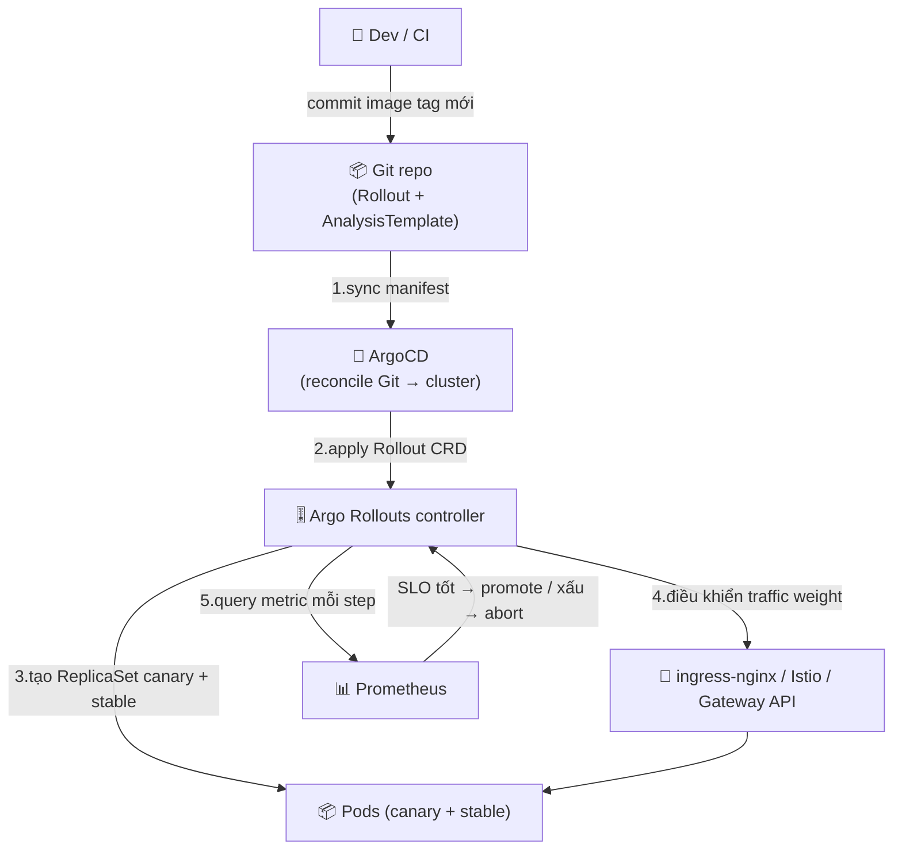

# Progressive Delivery — Canary & Blue-Green GitOps-native

> **Tác giả:** Mr.Rom\
> **Phiên bản:** v1.0.0\
> **Tạo lúc:** 13/06/2026\
> **Cập nhật:** 13/06/2026\
> **Level:** Intermediate\
> **Tags:** gitops, argo-rollouts, canary, blue-green, progressive-delivery, analysistemplate, prometheus, flagger, argocd, auto-rollback\
> **Yêu cầu trước:** [App-of-Apps & ApplicationSet](01_app-of-apps-and-applicationset.md)

> 🎯 *App-of-Apps đã giúp bạn quản hàng chục app bằng vài file YAML. Nhưng mỗi lần ArgoCD sync một image mới, cluster vẫn nhảy thẳng sang version mới kiểu "được ăn cả ngã về không". Bài này dạy cách **deploy an toàn theo đúng tinh thần GitOps**: thay `Deployment` bằng `Rollout` CRD, khai canary + blue-green ngay trong Git, gắn `AnalysisTemplate` đọc metric Prometheus để **tự promote khi tốt, tự abort khi xấu** — tất cả đều là manifest trong repo, ArgoCD sync, không ai gõ tay. Cuối bài bạn tự tay làm một canary cho Acme Shop web tự rollback khi error rate vượt SLO.*

## 🎯 Sau bài này bạn sẽ

- [ ] Hiểu vì sao `Deployment` thường + ArgoCD sync vẫn là "deploy mù", và `Rollout` CRD giải quyết điều đó như thế nào theo cách GitOps-native
- [ ] Khai báo **canary** và **blue-green** strategy hoàn toàn trong Git, để ArgoCD sync như mọi manifest khác
- [ ] Viết **AnalysisTemplate** + **metric provider (Prometheus)** để Rollout tự promote/abort theo SLO (error rate, latency)
- [ ] Hiểu cách Argo Rollouts **tích hợp traffic shaping** (ingress-nginx / Istio / Gateway API / SMI) và chọn đúng provider
- [ ] Phân biệt vai trò hai controller — **ArgoCD** (reconcile Git→cluster) và **Argo Rollouts** (điều phối progression) — để tránh "đánh nhau" giữa selfHeal và canary
- [ ] Biết **Flagger** (phía Flux) là lựa chọn tương đương và khác Argo Rollouts ở đâu
- [ ] Tự tay làm một canary Rollout cho Acme Shop web với analysis Prometheus tự abort khi metric xấu

---

## Khi "GitOps đã sync đúng" vẫn làm sập production

Acme Shop đã lên GitOps khá bài bản. ArgoCD sync mọi app, App-of-Apps quản hàng chục service, CI chỉ việc đẩy image tag mới vào repo `gitops-config` rồi để controller lo phần còn lại. Tự tin lắm.

Tối 11/11, CI cập nhật `web` từ `v2.4.0` lên `v2.5.0` trong Git. ArgoCD thấy desired state đổi, làm đúng nhiệm vụ: rolling update `Deployment`. Trong vài phút, toàn bộ pod web chạy `v2.5.0`. ArgoCD báo xanh: `Synced`, `Healthy`. Theo *mọi* định nghĩa của GitOps ở các bài trước, hệ thống đang hoàn hảo — cluster khớp Git, pod đang chạy.

Nhưng dashboard kể câu chuyện khác:

```
T+0   (sync bắt đầu)   error rate ~0.2%   ✅
T+3   (50% pod v2.5.0)  error rate 14%     🔴
T+5   (100% pod v2.5.0) error rate 31%     🔴
```

`v2.5.0` có một bug khiến query DB timeout. On-call phải `git revert` để kéo cluster về `v2.4.0`. Tổng thời gian khách hàng gặp lỗi: hơn 10 phút, đỉnh mùa sale.

Vấn đề nằm ở đâu? **Không phải ở GitOps** — ArgoCD đã sync đúng y Git. Vấn đề là *cái được sync*: một `Deployment` bản chất chỉ biết "rolling update từ version cũ sang version mới", nó **không có khái niệm "thử 5% trước, đo metric, rồi mới đi tiếp"**. ArgoCD `Healthy` chỉ nghĩa "đủ pod ready", chứ không nghĩa "app phục vụ khách tốt". GitOps làm cho việc *đổi version* trở nên an toàn về mặt audit/rollback, nhưng bản thân *quá trình đổi* vẫn là all-or-nothing.

> [!NOTE]
> Khái niệm progressive delivery (canary/blue-green/feature flag) đã được giới thiệu ở [bài CI/CD — Progressive Delivery](../../../ci-cd/lessons/02_intermediate/04_progressive-delivery.md). Bài đó trả lời "progressive delivery *là gì* và vì sao cần". Bài này đi **góc GitOps**: cái `Rollout` và `AnalysisTemplate` đó *sống trong Git như thế nào*, ArgoCD sync chúng ra sao, và hai controller phối hợp/xung đột ở đâu. Nếu chưa nắm khái niệm canary cơ bản, đọc bài kia trước.

Cái còn thiếu là một lớp "điều phối triển khai có metric gate" — và quan trọng với cụm này: lớp đó cũng phải **khai báo được trong Git** để vẫn đúng GitOps. Đó là việc của **Argo Rollouts**.

---

## 1️⃣ `Rollout` CRD — "Deployment có não", và vì sao nó hợp GitOps

Trước hết phải hiểu thứ thay thế `Deployment`.

**Argo Rollouts** là một controller chạy trong cluster (giống ArgoCD là controller), cung cấp một CRD tên `Rollout`. Bạn dùng `Rollout` *thay cho* `Deployment`: nó có gần như y hệt cấu trúc (`replicas`, `selector`, `template`), nhưng thêm một khối `strategy` cho phép khai *cách* roll version mới — từng bước, có pause, có metric gate.

🪞 **Ẩn dụ đời thường**: nếu `Deployment` là một **công tắc đèn** (bật = sáng toàn nhà ngay), thì `Rollout` là một **chiết áp (dimmer) có cảm biến**: bạn vặn sáng từ từ 5% → 25% → 100%, và nếu cảm biến thấy "chói mắt quá" (metric xấu) nó *tự vặn về tối*. Cùng là "bật đèn version mới", nhưng một cái mù, một cái có phản hồi.

Điểm mấu chốt với cụm GitOps: **`Rollout` chỉ là một manifest Kubernetes như mọi manifest khác**. Nó có `kind`, `apiVersion`, nằm trong file YAML trong repo. Nghĩa là ArgoCD đối xử với nó *y hệt* `Deployment` — clone repo, render, apply, reconcile. Bạn không cần "tích hợp đặc biệt" gì giữa ArgoCD và Argo Rollouts: ArgoCD lo việc đưa manifest từ Git vào cluster, Argo Rollouts lo việc *thực thi progression* đã khai trong manifest đó.

Đây là khái niệm trừu tượng nhất của cả bài — ai làm gì — nên hãy nhìn kỹ sơ đồ phân vai dưới đây trước khi đi vào YAML:

> 💡 Sơ đồ dưới tách bạch hai controller: ArgoCD (Git → cluster) và Argo Rollouts (điều phối canary + đọc metric). Hiểu ranh giới này là hiểu 80% bài.



→ Điểm cốt lõi của sơ đồ: **ArgoCD dừng vai trò ở bước 2** (đưa manifest vào cluster). Mọi thứ "từ từ, đo đạc, tự rollback" (bước 3-5) là Argo Rollouts làm, *bên trong* cluster, dựa trên đúng cái manifest mà Git mô tả. Git vẫn là nguồn chân lý: muốn đổi cách canary, bạn sửa `strategy` trong Git, không gõ tay.

> [!NOTE]
> Argo Rollouts là project **CNCF** thuộc cùng họ Argo với ArgoCD, nên hai cái ghép với nhau cực mượt — kể cả phần health check (mục 5). Nhưng về kỹ thuật, Argo Rollouts độc lập với ArgoCD: bạn có thể dùng Rollout mà không cần ArgoCD, và ngược lại. Trong cụm này ta luôn giả định cặp ArgoCD + Argo Rollouts.

### Cài Argo Rollouts (controller + CLI plugin)

Argo Rollouts gồm hai phần: **controller** chạy trong cluster (cài 1 lần qua manifest), và **kubectl plugin** chạy ở máy bạn để quan sát/promote/abort. Cài controller vào namespace riêng `argo-rollouts`:

```bash
kubectl create namespace argo-rollouts
kubectl apply -n argo-rollouts \
  -f https://github.com/argoproj/argo-rollouts/releases/latest/download/install.yaml
```

Cài plugin `kubectl argo rollouts` (macOS dùng Homebrew):

```bash
brew install argoproj/tap/kubectl-argo-rollouts
```

Kiểm tra cả hai đã sẵn sàng:

```bash
kubectl argo rollouts version
```

Kết quả mẫu:

```
kubectl-argo-rollouts: v1.7.2+a2c0a3b
  BuildDate: 2026-01-15T10:22:04Z
```

Đọc output: dòng này xác nhận **plugin** ở máy bạn đã cài. Để chắc **controller** trong cluster cũng đang chạy, kiểm tra deployment của nó:

```bash
kubectl get deployment argo-rollouts -n argo-rollouts
```

```
NAME            READY   UP-TO-DATE   AVAILABLE   AGE
argo-rollouts   1/1     1            1           40s
```

Cột `READY 1/1` cho biết controller đã lên và sẵn sàng nhận `Rollout` CRD. Nếu cột này là `0/1` kéo dài, controller chưa khởi động xong — chờ thêm hoặc xem log `kubectl logs -n argo-rollouts deployment/argo-rollouts`.

> [!TIP]
> Bản thân Argo Rollouts controller *cũng nên được cài qua GitOps* (một `Application` trỏ tới manifest install của nó), thay vì `kubectl apply` tay như trên. Ở đây ta cài tay cho nhanh để học; nhưng đúng tinh thần cụm này, "công cụ vận hành cluster" cũng là một app trong Git như mọi app khác.

---

## 2️⃣ Canary trong Git — khai từng bước, ArgoCD sync như thường

Giờ ta chuyển app `acme-shop-web` từ `Deployment` sang `Rollout` với chiến lược canary. Điểm cần nhớ: file này nằm trong repo `gitops-config`, ở đúng `path` mà `Application` của ArgoCD đang trỏ tới — nên khi bạn commit, ArgoCD tự sync.

**Canary** (chim hoàng yến — thợ mỏ xưa mang chim vào hầm để dò khí độc trước) nghĩa là: đưa version mới ra cho một *tỷ lệ nhỏ* traffic trước, quan sát, rồi mới tăng dần. Trong `Rollout`, mỗi bước là một phần tử trong `strategy.canary.steps`: `setWeight` đặt % traffic cho canary, `pause` dừng lại để quan sát.

So với `Deployment` cũ, khác biệt gói gọn trong khối `strategy` — phần còn lại (replicas, template, container) gần như y nguyên:

```yaml
# gitops-config/apps/web/production/rollout.yaml
apiVersion: argoproj.io/v1alpha1
kind: Rollout                       # thay cho kind: Deployment
metadata:
  name: acme-shop-web
  namespace: production
spec:
  replicas: 10
  selector:
    matchLabels:
      app: acme-shop-web
  template:                         # giống hệt template của Deployment
    metadata:
      labels:
        app: acme-shop-web
    spec:
      containers:
        - name: web
          image: ghcr.io/acme/web:v2.4.0
          ports:
            - containerPort: 8080
  strategy:
    canary:                         # phần MỚI so với Deployment
      steps:
        - setWeight: 5              # 1. đẩy 5% traffic sang version mới
        - pause: { duration: 2m }   # 2. dừng 2 phút quan sát (bake time)
        - setWeight: 25             # 3. tăng lên 25%
        - pause: { duration: 5m }
        - setWeight: 50             # 4. nửa traffic
        - pause: { duration: 5m }
        - setWeight: 100            # 5. toàn bộ — canary thành stable
```

Commit file này lên Git như mọi thay đổi GitOps khác:

```bash
git add apps/web/production/rollout.yaml
git commit -m "feat(web): chuyển acme-shop-web sang Rollout canary"
git push origin main
```

→ ArgoCD nhận webhook (hoặc tới chu kỳ reconcile), thấy desired state giờ là một `Rollout`, và apply nó vào cluster — *y hệt cách nó apply một Deployment*. Không có bước "tích hợp" thủ công nào. Từ giờ, app web của Acme Shop được điều phối bởi Argo Rollouts, nhưng vẫn được *quản trị* bởi Git + ArgoCD.

> [!IMPORTANT]
> Khi `Rollout` mới được tạo lần đầu (chưa có version cũ để so), nó **không** chạy canary — nó deploy thẳng 100% vì chưa có gì để "thử dần". Canary steps chỉ kích hoạt từ lần *cập nhật image* thứ hai trở đi. Đây là hành vi đúng: lần đầu chưa có baseline.

### Trigger canary: chỉ cần đổi image tag trong Git

Đây là phần đẹp nhất của mô hình GitOps. Để bắt đầu một canary, bạn **không** gõ lệnh deploy nào — bạn chỉ sửa image tag trong Git:

```bash
# Trong gitops-config: sửa rollout.yaml image v2.4.0 → v2.5.0
git add apps/web/production/rollout.yaml
git commit -m "release(web): v2.5.0 (canary)"
git push origin main
```

Chuỗi sự kiện sau đó hoàn toàn tự động:

1. ArgoCD thấy image tag đổi → sync `Rollout` mới vào cluster.
2. Argo Rollouts controller thấy `spec.template` đổi → bắt đầu chạy `steps`: tạo ReplicaSet canary chạy `v2.5.0` với 5% traffic.
3. Pause 2 phút, rồi 25%, 50%, 100% — theo đúng `steps` đã khai trong Git.

Quan sát tiến trình canary bằng plugin (đây là lệnh bạn sẽ dùng nhiều nhất):

```bash
kubectl argo rollouts get rollout acme-shop-web -n production --watch
```

Kết quả mẫu khi đang ở bước 25%:

```
Name:            acme-shop-web
Namespace:       production
Status:          ॥ Paused
Message:         CanaryPauseStep
Strategy:        Canary
  Step:          3/7
  SetWeight:     25
  ActualWeight:  25
Images:          ghcr.io/acme/web:v2.4.0 (stable)
                 ghcr.io/acme/web:v2.5.0 (canary)
Replicas:
  Desired:       10
  Current:       10
  Updated:       3
  Ready:         10
  Available:     10
```

Đọc output: `Status: Paused` + `Step: 3/7` cho biết canary đang dừng ở bước 3 (đợt 25%) để quan sát. Dòng `Images` liệt kê *hai* version cùng tồn tại — `v2.4.0 (stable)` và `v2.5.0 (canary)` — đây chính là đặc trưng của canary: hai version chạy song song. `Updated: 3` nghĩa 3/10 pod đã là canary (~25%), khớp `SetWeight: 25`.

---

## 3️⃣ AnalysisTemplate + Prometheus — để Rollout tự quyết, không cần người canh

Canary ở mục 2 vẫn còn một lỗ hổng: nó **pause theo thời gian** rồi tự đi tiếp, *không nhìn metric*. Nếu `v2.5.0` lỗi, nó vẫn nhẫn nại pause đủ 2 phút rồi... đẩy lên 25% như thường. Cần một người (hoặc một cỗ máy) *nhìn dashboard* và quyết "đi tiếp hay quay đầu".

Đó là việc của **`AnalysisTemplate`** — một CRD nữa của Argo Rollouts, cũng là **manifest trong Git**. Nó định nghĩa: *truy vấn metric gì, ngưỡng nào là tốt, ngưỡng nào là xấu*. Khi gắn vào canary, mỗi bước Rollout sẽ tự query metric (ví dụ từ Prometheus) và **tự promote nếu đạt SLO, tự abort + rollback nếu vi phạm**.

🪞 Quay lại ẩn dụ chiết áp: `AnalysisTemplate` chính là **cảm biến ánh sáng** gắn vào dimmer. Trước đó dimmer vặn sáng theo *đồng hồ hẹn giờ* (pause theo thời gian). Giờ nó vặn sáng *theo cảm biến* — chói quá (error rate cao) thì tự vặn tối lại (abort).

### Viết AnalysisTemplate đọc error rate từ Prometheus

`AnalysisTemplate` nhận `args` (tham số, ví dụ tên service) và khai một danh sách `metrics`. Mỗi metric có: câu query, ngưỡng `successCondition`/`failureCondition`, và provider (ở đây là Prometheus). Đặt file này cạnh `rollout.yaml` trong Git:

```yaml
# gitops-config/apps/web/production/analysis-error-rate.yaml
apiVersion: argoproj.io/v1alpha1
kind: AnalysisTemplate
metadata:
  name: web-error-rate
  namespace: production
spec:
  args:
    - name: service-name              # tham số truyền từ Rollout vào
  metrics:
    - name: error-rate
      interval: 30s                   # cứ 30s query Prometheus 1 lần
      count: 5                        # cần 5 lần đo đạt mới coi là pass
      # successCondition: tỷ lệ lỗi 5xx < 1% thì coi là tốt
      successCondition: result[0] < 0.01
      # failureLimit: tới 2 lần đo fail là abort canary (Failed TẠI lần thứ 2)
      failureLimit: 2
      provider:
        prometheus:
          address: http://prometheus.monitoring.svc:9090
          query: |
            sum(rate(http_requests_total{service="{{args.service-name}}", status=~"5.."}[2m]))
            /
            sum(rate(http_requests_total{service="{{args.service-name}}"}[2m]))
```

Vài điểm dễ sai cần nắm:

- `result[0]` là **kết quả đầu tiên** Prometheus trả về cho query. Query trên trả về một số (tỷ lệ 5xx / tổng request), nên `result[0]` là con số đó.
- `successCondition` và `failureCondition` là *biểu thức*, không phải số cứng — Argo Rollouts đánh giá chúng trên `result`.
- `count` + `interval`: analysis chạy `count` lần, mỗi lần cách nhau `interval`. Phải *đủ count lần pass* mới promote.
- `failureLimit`: số lần đo *fail* mà tới đó analysis bị coi là Failed. `failureLimit: 2` nghĩa tới 2 lần đo fail là abort (Failed TẠI lần thứ 2, không phải lần thứ 3). `failureLimit: 0` = không tha một lần fail nào.

### Gắn analysis vào canary steps

Giờ chèn bước `analysis` vào giữa các `setWeight` trong `Rollout`. Mỗi lần đặt weight mới, ta cho nó *bake* một chút rồi *phân tích* trước khi đi tiếp:

```yaml
# rollout.yaml — phần strategy được nâng cấp có analysis
spec:
  strategy:
    canary:
      steps:
        - setWeight: 5
        - pause: { duration: 1m }        # bake ngắn cho có traffic mẫu
        - analysis:                       # ← cổng metric ở mức 5%
            templates:
              - templateName: web-error-rate
            args:
              - name: service-name
                value: acme-shop-web
        - setWeight: 25
        - analysis:                       # ← cổng metric ở mức 25%
            templates:
              - templateName: web-error-rate
            args:
              - name: service-name
                value: acme-shop-web
        - setWeight: 50
        - analysis:
            templates:
              - templateName: web-error-rate
            args:
              - name: service-name
                value: acme-shop-web
        - setWeight: 100
```

→ Bây giờ mỗi lần tăng weight, Rollout *không tự đi tiếp* — nó chạy `web-error-rate` analysis, query Prometheus 5 lần (mỗi 30s). Nếu error rate luôn < 1% → promote sang weight kế. Nếu vi phạm tới 2 lần đo → **abort**: Argo Rollouts kéo toàn bộ traffic về `stable` (`v2.4.0`) và dừng. Không ai phải thức canh dashboard lúc 3h sáng.

> [!IMPORTANT]
> Query Prometheus phải khớp **metric mà app thật sự expose**. Ví dụ trên giả định app có metric `http_requests_total` với label `service` và `status`. Nếu app bạn dùng tên metric/label khác (ví dụ `istio_requests_total`, `nginx_ingress_controller_requests`), phải sửa query cho khớp — sai tên metric thì query trả rỗng, và analysis sẽ *fail* (hoặc inconclusive), khiến canary abort oan.

### Thêm metric latency (nhiều metric cùng lúc)

Một analysis có thể kiểm *nhiều* metric — và **tất cả phải pass** mới promote. Ngoài error rate, một SLO phổ biến là **p95 latency** (95% request nhanh hơn ngưỡng). Thêm metric thứ hai vào cùng template:

```yaml
# analysis-error-rate.yaml — thêm metric latency
spec:
  args:
    - name: service-name
  metrics:
    - name: error-rate
      interval: 30s
      count: 5
      successCondition: result[0] < 0.01           # 5xx < 1%
      failureLimit: 2
      provider:
        prometheus:
          address: http://prometheus.monitoring.svc:9090
          query: |
            sum(rate(http_requests_total{service="{{args.service-name}}", status=~"5.."}[2m]))
            /
            sum(rate(http_requests_total{service="{{args.service-name}}"}[2m]))
    - name: p95-latency
      interval: 30s
      count: 5
      successCondition: result[0] < 0.5            # p95 < 500ms (0.5 giây)
      failureLimit: 2
      provider:
        prometheus:
          address: http://prometheus.monitoring.svc:9090
          query: |
            histogram_quantile(0.95,
              sum(rate(http_request_duration_seconds_bucket{service="{{args.service-name}}"}[2m])) by (le)
            )
```

→ Giờ canary chỉ đi tiếp khi *cả* error rate < 1% *và* p95 < 500ms. Một trong hai xấu là abort. Đây chính là "auto-promote/abort theo SLO" mà mục tiêu bài nhắc tới: SLO của bạn (error rate + latency) được mã hoá thành điều kiện máy đọc được, nằm trong Git.

> [!NOTE]
> Prometheus chỉ là một trong nhiều **metric provider**. Argo Rollouts còn hỗ trợ Datadog, New Relic, CloudWatch, Graphite, Wavefront, hay một `web` provider gọi HTTP endpoint bất kỳ. Cú pháp `provider:` đổi theo nguồn, phần còn lại (successCondition, failureLimit) giữ nguyên. Prometheus là phổ biến nhất trong hệ K8s open source nên ta dùng nó làm ví dụ.

---

## 4️⃣ Blue-green trong Git — đổi 100% tức thì sau khi kiểm tra

Canary đẩy traffic *từ từ*. Đôi khi bạn muốn ngược lại: dựng **toàn bộ** version mới song song với version cũ, kiểm tra kỹ (smoke test, QA nội bộ) trên môi trường giống production y hệt, rồi **chuyển 100% traffic trong một nhịp**. Đó là **blue-green**.

🪞 Ẩn dụ: blue-green giống có **hai sân khấu y hệt** — "xanh" (blue) đang diễn cho khán giả, "lục" (green) dựng cảnh mới ở sau màn. Khi cảnh mới sẵn sàng và được duyệt, bạn *kéo màn* — khán giả lập tức xem sân khấu lục, không ai thấy lúc chuyển. Nếu cảnh lục hỏng, kéo màn ngược lại sân khấu xanh tức thì.

`Rollout` khai blue-green bằng `strategy.blueGreen` thay vì `canary`. Hai field quan trọng: `activeService` (Service trỏ tới version đang phục vụ khách) và `previewService` (Service trỏ tới version mới để test nội bộ trước khi cắt):

```yaml
# rollout.yaml — strategy blue-green thay cho canary
apiVersion: argoproj.io/v1alpha1
kind: Rollout
metadata:
  name: acme-shop-web
  namespace: production
spec:
  replicas: 10
  selector:
    matchLabels:
      app: acme-shop-web
  template:
    metadata:
      labels:
        app: acme-shop-web
    spec:
      containers:
        - name: web
          image: ghcr.io/acme/web:v2.5.0
          ports:
            - containerPort: 8080
  strategy:
    blueGreen:
      activeService: acme-shop-web-active     # Service khách đang dùng (blue)
      previewService: acme-shop-web-preview   # Service để test bản mới (green)
      autoPromotionEnabled: false             # KHÔNG tự cắt — chờ người duyệt
      prePromotionAnalysis:                   # chạy analysis TRƯỚC khi cắt traffic
        templates:
          - templateName: web-error-rate
        args:
          - name: service-name
            value: acme-shop-web-preview
```

Hai field quyết định hành vi:

- `autoPromotionEnabled: false` — sau khi green sẵn sàng, Rollout *dừng lại chờ* bạn duyệt thay vì cắt ngay. Đặt `true` nếu muốn tự cắt sau khi analysis pass.
- `prePromotionAnalysis` — chạy analysis trên `previewService` (green) *trước khi* cắt traffic. Nếu green đã xấu ngay từ preview, không cắt sang nữa.

Vì `autoPromotionEnabled: false`, sau khi green lên và pass pre-promotion analysis, bạn *chủ động* cắt traffic bằng lệnh promote — và đây là một quyết định có chủ đích của người vận hành:

```bash
kubectl argo rollouts promote acme-shop-web -n production
```

→ Lệnh này trỏ `activeService` từ ReplicaSet cũ (blue) sang mới (green) — 100% traffic chuyển trong một nhịp. Nếu sau đó phát hiện vấn đề, abort kéo ngược lại blue tức thì (vì pod blue vẫn còn sống chưa bị xoá).

So sánh nhanh hai chiến lược để biết khi nào chọn cái nào — đây là phần "WHEN" của bài:

| Tiêu chí | Canary | Blue-Green |
|---|---|---|
| Cách shift traffic | Tăng dần (5% → 100%) | Cắt 100% một nhịp |
| Phát hiện lỗi sớm | Rất tốt — chỉ 5% user dính lúc đầu | Trễ hơn — lỗi lộ sau khi cắt (trừ khi pre-promotion analysis bắt được) |
| Tài nguyên tốn thêm | Ít (chỉ vài pod canary) | Gấp đôi (2 version đủ replicas song song) |
| Test nội bộ trước khi cắt | Khó (traffic thật trộn) | Dễ (preview service riêng) |
| Rollback | Abort → kéo weight về 0 | Trỏ active service về blue, tức thì |
| Hợp khi | Stateless web/API, muốn giảm blast radius | Cần kiểm kỹ trên env y hệt prod trước khi cắt |

> [!WARNING]
> Blue-green tốn **gấp đôi tài nguyên** trong lúc chuyển (cả blue lẫn green đều chạy đủ replicas). Với app `replicas: 10` nghĩa là 20 pod cùng lúc — phải chắc cluster đủ chỗ, nếu không green sẽ kẹt `Pending` và Rollout treo. Canary tiết kiệm hơn vì chỉ thêm vài pod canary.

---

## 5️⃣ Traffic shaping + sự phối hợp giữa hai controller

Đến giờ ta nói "đẩy 25% traffic" như thể đơn giản. Nhưng *cách* Argo Rollouts thật sự chia traffic phụ thuộc vào **traffic provider** bạn dùng — và đây là chỗ tích hợp với mạng lưới (ingress/mesh).

### Mặc định: chia theo số replica (thô)

Nếu không khai traffic provider, Argo Rollouts xấp xỉ tỷ lệ bằng **số pod**: `setWeight: 5` với `replicas: 10` → khoảng 1 pod canary, và Service round-robin chia traffic ~10% (không phải đúng 5%). Đủ cho dev/test, nhưng không chính xác — và không làm được canary mịn dưới mức "1 pod".

### Chính xác hơn: ingress-nginx / Istio / Gateway API / SMI

Để chia traffic *đúng %* (và làm được routing nâng cao như theo header), Argo Rollouts tích hợp với lớp mạng qua `trafficRouting`. Lúc này nó quản hai Service — `canaryService` và `stableService` — rồi điều khiển provider chia traffic giữa chúng. Bảng dưới tóm các provider phổ biến để bạn chọn theo hạ tầng sẵn có:

| Provider | Độ chính xác traffic | Khi nào chọn |
|---|---|---|
| Replica count (mặc định) | Xấp xỉ theo số pod | Dev/test, cluster nhỏ, chưa có ingress/mesh |
| `nginx` (ingress-nginx) | Chính xác % + theo header | Đa số team đã dùng ingress-nginx |
| `istio` | Chính xác % + L7 (header/cookie/region) | Đã có Istio service mesh |
| `gatewayAPI` (qua plugin) | Chính xác % theo chuẩn Gateway API | Muốn theo chuẩn K8s mới, không khoá vào 1 ingress |
| `smi` (Service Mesh Interface) | Chính xác % qua TrafficSplit | Mesh hỗ trợ SMI (Linkerd...) |

Ví dụ dùng ingress-nginx — khai `trafficRouting.nginx` trong `Rollout`, trỏ tới ingress stable đang có. Argo Rollouts sẽ tự tạo/cập nhật một canary ingress với annotation weight tương ứng:

```yaml
# rollout.yaml — canary với traffic routing chính xác qua ingress-nginx
spec:
  strategy:
    canary:
      canaryService: acme-shop-web-canary    # Service trỏ pod canary
      stableService: acme-shop-web-stable    # Service trỏ pod stable
      trafficRouting:
        nginx:
          stableIngress: acme-shop-web        # Ingress hiện có của app
      steps:
        - setWeight: 5
        - pause: { duration: 1m }
        - analysis:
            templates:
              - templateName: web-error-rate
            args:
              - name: service-name
                value: acme-shop-web
        - setWeight: 25
        - analysis:
            templates:
              - templateName: web-error-rate
            args:
              - name: service-name
                value: acme-shop-web
        - setWeight: 100
```

→ Với `trafficRouting.nginx`, `setWeight: 5` giờ là **đúng 5% traffic** (ingress-nginx đặt annotation `nginx.ingress.kubernetes.io/canary-weight: "5"` trên canary ingress), không còn xấp xỉ theo pod. Cả `canaryService` và `stableService` (và các Ingress) đều là manifest bạn để trong Git để ArgoCD sync — không có gì "tạo tay ngoài Git".

### Cạm bẫy lớn nhất của GitOps + Rollouts: selfHeal "đánh nhau" với canary

Đây là điểm *đặc trưng góc GitOps* mà bài CI/CD không có. Nhớ lại: ArgoCD bật `selfHeal: true` sẽ *revert mọi thay đổi trên cluster về đúng Git*. Nhưng Argo Rollouts, trong lúc chạy canary, **liên tục sửa cluster**: nó chỉnh `weight`, đổi số replica của ReplicaSet canary/stable, cập nhật annotation ingress... Những thứ này *không có trong Git* (Git chỉ ghi `strategy`, không ghi "đang ở weight 25%").

Câu hỏi tự nhiên: vậy selfHeal có revert mất tiến trình canary không? **Không** — và lý do đáng hiểu:

- ArgoCD so sánh desired (Git) với live ở mức *spec mà bạn khai*. Những field Argo Rollouts tự quản (như weight hiện tại, số pod mỗi ReplicaSet) **không nằm trong `Rollout` spec của Git** — chúng ở `status` hoặc ở ReplicaSet con do controller tạo. ArgoCD mặc định bỏ qua chúng (qua cơ chế health check riêng cho Rollout, xem dưới).
- Argo Rollouts là project họ Argo nên ArgoCD **hiểu health của `Rollout`**: nó biết `Rollout` đang `Progressing` (canary chạy dở) thì *chưa* coi là lỗi, và biết `Degraded` khi canary abort. Nhờ đó ArgoCD không "sốt ruột" revert giữa chừng.

> [!CAUTION]
> Cạm bẫy thật sự xảy ra khi bạn để **số `replicas` hoặc weight cứng** ở chỗ ArgoCD coi là drift, hoặc dùng một ingress controller mà ArgoCD *cũng* quản các annotation mà Rollouts đang sửa. Khi đó selfHeal có thể giật annotation canary về giá trị Git, phá tiến trình. Cách tránh: để Argo Rollouts toàn quyền với canary/stable Service + canary Ingress, và nếu cần, dùng `ignoreDifferences` trong `Application` để ArgoCD bỏ qua các field mà Rollouts tự quản.

Cấu hình `ignoreDifferences` để ArgoCD đừng đụng vào field Rollouts quản — đặt ngay trong `Application`:

```yaml
# Application của acme-shop-web — bỏ qua field do Argo Rollouts tự quản
spec:
  ignoreDifferences:
    - group: argoproj.io
      kind: Rollout
      jsonPointers:
        - /spec/replicas      # nếu dùng HPA/Rollouts tự scale, đừng để ArgoCD revert
```

→ Với khai báo này, ArgoCD vẫn sync `Rollout` (image, strategy, template) nhưng *không* coi việc `replicas` bị controller/HPA chỉnh là drift — tránh selfHeal kéo ngược giữa canary. Đây là cách hai controller "chia ranh giới" sạch sẽ: Git quản *ý định*, Rollouts quản *quá trình thực thi*.

---

## 6️⃣ Flagger — lựa chọn tương đương phía Flux

Nếu cụm GitOps của bạn chạy **Flux** thay vì ArgoCD, đối tác progressive delivery tự nhiên là **Flagger** (cũng thuộc Flux/CNCF) — không phải Argo Rollouts. Hai cái giải quyết cùng bài toán nhưng triết lý khác nhau, và biết khác biệt giúp bạn chọn đúng.

Khác biệt cốt lõi về *mô hình*: Argo Rollouts bắt bạn **thay `Deployment` bằng `Rollout` CRD**. Flagger thì **giữ nguyên `Deployment`** của bạn, và bạn khai thêm một CRD `Canary` *trỏ tới* Deployment đó — Flagger tự nhân bản/điều phối phía sau. Cả hai cách đều "khai trong Git, controller sync", nên cả hai đều GitOps-native.

| Tiêu chí | Argo Rollouts | Flagger |
|---|---|---|
| Họ / pair tự nhiên | Argo (pair ArgoCD) | Flux (pair Flux) |
| Object chính | `Rollout` thay `Deployment` | giữ `Deployment` + thêm CRD `Canary` |
| Chiến lược | Canary, blue-green, analysis | Canary, blue-green, A/B (theo header) |
| Metric analysis | `AnalysisTemplate` (Prometheus/Datadog/...) | `MetricTemplate` (Prometheus/Datadog/...) |
| Traffic shaping | ingress-nginx, Istio, Gateway API, SMI | App Mesh, Istio, Linkerd, NGINX, Gateway API, SMI |
| Quan sát | `kubectl argo rollouts` + UI riêng | `kubectl describe canary` + sự kiện |
| Khi chọn | Đang dùng ArgoCD | Đang dùng Flux |

Một `Canary` của Flagger trông như sau — để bạn nhận ra "cùng ý tưởng, khác hình hài". Lưu ý nó *trỏ tới* một Deployment có sẵn (`targetRef`) chứ không thay thế:

```yaml
# Flagger Canary — giữ nguyên Deployment, khai canary trỏ vào nó
apiVersion: flagger.app/v1beta1
kind: Canary
metadata:
  name: acme-shop-web
  namespace: production
spec:
  targetRef:                       # trỏ tới Deployment có sẵn (không thay thế)
    apiVersion: apps/v1
    kind: Deployment
    name: acme-shop-web
  service:
    port: 8080
  analysis:
    interval: 30s                  # đo mỗi 30s
    threshold: 2                   # tới 2 lần đo fail → rollback
    maxWeight: 50                  # tăng tối đa tới 50% rồi cắt phần còn lại
    stepWeight: 5                  # mỗi bước +5%
    metrics:
      - name: error-rate
        thresholdRange:
          max: 1                   # error rate tối đa 1%
        interval: 1m
```

→ Ý tưởng giống hệt Argo Rollouts: tăng weight từng bước, đo metric, quá ngưỡng thì rollback — chỉ khác cú pháp và việc giữ nguyên `Deployment`. **Quy tắc chọn đơn giản**: dùng ArgoCD thì chọn Argo Rollouts; dùng Flux thì chọn Flagger. Đừng trộn lẫn để khỏi hai controller giẫm chân nhau.

---

## 7️⃣ Hands-on — canary Acme Shop web tự abort khi error rate xấu

Giờ ráp tất cả lại: ta deploy một canary cho `acme-shop-web` qua Git, rồi *cố tình* tung một version lỗi để xem analysis Prometheus tự bắt và abort — đúng kịch bản 11/11 ở đầu bài, nhưng lần này GitOps tự cứu.

> [!NOTE]
> Phần này giả định bạn đã có: cluster với ArgoCD + Argo Rollouts controller (mục 1), Prometheus chạy trong namespace `monitoring`, và app `acme-shop-web` expose metric `http_requests_total{service,status}`. Ta tập trung vào *cơ chế canary + analysis qua Git*, không lặp lại cài đặt Prometheus.

### 🛠️ Bước 1: Đưa Rollout + AnalysisTemplate vào Git

Trong repo `gitops-config`, tạo hai file ở `apps/web/production/`. Trước hết `rollout.yaml` với canary có analysis (rút gọn còn 2 cổng cho dễ quan sát):

```yaml
# apps/web/production/rollout.yaml
apiVersion: argoproj.io/v1alpha1
kind: Rollout
metadata:
  name: acme-shop-web
  namespace: production
spec:
  replicas: 5
  selector:
    matchLabels:
      app: acme-shop-web
  template:
    metadata:
      labels:
        app: acme-shop-web
    spec:
      containers:
        - name: web
          image: ghcr.io/acme/web:v2.4.0
          ports:
            - containerPort: 8080
  strategy:
    canary:
      steps:
        - setWeight: 20
        - pause: { duration: 1m }
        - analysis:
            templates:
              - templateName: web-error-rate
            args:
              - name: service-name
                value: acme-shop-web
        - setWeight: 60
        - analysis:
            templates:
              - templateName: web-error-rate
            args:
              - name: service-name
                value: acme-shop-web
        - setWeight: 100
```

Và `analysis-error-rate.yaml` (giống mục 3):

```yaml
# apps/web/production/analysis-error-rate.yaml
apiVersion: argoproj.io/v1alpha1
kind: AnalysisTemplate
metadata:
  name: web-error-rate
  namespace: production
spec:
  args:
    - name: service-name
  metrics:
    - name: error-rate
      interval: 30s
      count: 4
      successCondition: result[0] < 0.01     # 5xx < 1% là tốt
      failureLimit: 2                          # tới 2 lần đo fail → abort
      provider:
        prometheus:
          address: http://prometheus.monitoring.svc:9090
          query: |
            sum(rate(http_requests_total{service="{{args.service-name}}", status=~"5.."}[2m]))
            /
            sum(rate(http_requests_total{service="{{args.service-name}}"}[2m]))
```

Commit cả hai. ArgoCD sẽ sync chúng vào cluster:

```bash
git add apps/web/production/rollout.yaml apps/web/production/analysis-error-rate.yaml
git commit -m "feat(web): canary Rollout + analysis error-rate"
git push origin main
```

### 🛠️ Bước 2: Xác nhận ArgoCD đã sync và Rollout khoẻ

Kiểm tra ArgoCD đã đưa `Rollout` vào cluster (lần đầu deploy thẳng 100%, chưa canary):

```bash
argocd app get acme-shop-web
```

Kết quả mẫu (phần đầu):

```
Name:               argocd/acme-shop-web
Sync Status:        Synced to main (a1b2c3d)
Health Status:      Healthy

GROUP        KIND              NAMESPACE   NAME            STATUS  HEALTH
argoproj.io  Rollout           production  acme-shop-web   Synced  Healthy
argoproj.io  AnalysisTemplate  production  web-error-rate  Synced  Synced
```

Đọc output: ArgoCD đã sync *cả* `Rollout` *lẫn* `AnalysisTemplate` — chúng chỉ là manifest như mọi resource khác. `Rollout` ở trạng thái `Healthy` nghĩa Argo Rollouts báo về cho ArgoCD rằng app đang ổn (đây là tích hợp health ở mục 5). Đây là baseline `v2.4.0`.

### 🛠️ Bước 3: Tung version lỗi qua Git (kịch bản 11/11)

Đóng vai CI release một bản lỗi: sửa image tag sang `v2.5.0-bad` (giả định bản này có bug làm 5xx tăng vọt). Vẫn chỉ là một commit:

```bash
# Sửa rollout.yaml: image v2.4.0 → v2.5.0-bad
git add apps/web/production/rollout.yaml
git commit -m "release(web): v2.5.0-bad (canary)"
git push origin main
```

→ ArgoCD sync image mới → Argo Rollouts thấy `template` đổi → khởi động canary: tạo ReplicaSet `v2.5.0-bad` ở 20% traffic, bake 1 phút, rồi chạy analysis.

### 🛠️ Bước 4: Quan sát analysis bắt lỗi và tự abort

Theo dõi canary real-time:

```bash
kubectl argo rollouts get rollout acme-shop-web -n production --watch
```

Lúc analysis phát hiện error rate vượt ngưỡng, output chuyển sang:

```
Name:            acme-shop-web
Status:          ✖ Degraded
Message:         RolloutAborted: metric "error-rate" assessed Failed
Strategy:        Canary
  Step:          3/6
  SetWeight:     0
  ActualWeight:  0
Images:          ghcr.io/acme/web:v2.4.0 (stable)
Replicas:
  Desired:       5
  Updated:       0
  Ready:         5
  Available:     5
```

Đọc output: `Status: Degraded` + `Message: RolloutAborted: metric "error-rate" assessed Failed` cho biết analysis đã đánh giá metric error-rate là *Failed* và **tự abort**. Quan trọng nhất: `SetWeight: 0` và chỉ còn `v2.4.0 (stable)` trong `Images` — traffic đã *tự* về 100% bản tốt, version lỗi bị kéo về 0% mà bạn **không gõ một lệnh rollback nào**. Đây chính xác là điều đã *không* xảy ra ở sự cố 11/11.

Xem chi tiết kết quả analysis để biết nó fail vì sao:

```bash
kubectl argo rollouts get rollout acme-shop-web -n production
```

Phần `ANALYSISRUN` trong output sẽ ghi rõ metric nào fail:

```
NAME                                      KIND         STATUS    AGE
⟳ acme-shop-web                           Rollout      ✖ Degraded
└──# revision:2
   └──Σ acme-shop-web-7d4c... (canary)    AnalysisRun  ✖ Failed
      └──⊞ error-rate                      Metric       ✖ Failed   2/2 failures
```

Đọc output: `error-rate Metric ✖ Failed 2/2 failures` nghĩa metric error-rate đã fail đủ `failureLimit: 2` lần → analysis Failed → Rollout abort. Mọi thứ tự động, đúng SLO bạn khai trong Git.

### 🛠️ Bước 5: Sửa đúng cách — version tốt qua Git

Bài học GitOps không đổi: muốn cứu, **đừng** `kubectl` tay — sửa Git. Đẩy bản đã fix (`v2.5.1`) bằng một commit, ArgoCD sync, canary chạy lại từ đầu, lần này analysis pass và tự promote lên 100%:

```bash
# Sửa rollout.yaml: image v2.5.0-bad → v2.5.1 (bản đã fix)
git add apps/web/production/rollout.yaml
git commit -m "fix(web): v2.5.1 vá bug DB timeout"
git push origin main
```

Theo dõi lại — lần này canary đi hết các step:

```bash
kubectl argo rollouts get rollout acme-shop-web -n production --watch
```

```
Name:            acme-shop-web
Status:          ✔ Healthy
Strategy:        Canary
  Step:          6/6
  SetWeight:     100
  ActualWeight:  100
Images:          ghcr.io/acme/web:v2.5.1 (stable)
```

Đọc output: `Status: Healthy` + `Step: 6/6` + chỉ còn `v2.5.1 (stable)` — canary đã hoàn tất, version mới lên 100% *sau khi* analysis xác nhận metric tốt qua từng cổng. Toàn bộ vòng đời (lỗi → abort → fix → promote) đều đi qua Git, có audit trail đầy đủ.

### 🧹 Dọn dẹp

Nếu đây là app thử nghiệm, gỡ qua Git (xoá file rồi để prune dọn), hoặc xoá nhanh để thử lại:

```bash
# Cách đúng GitOps: xoá file khỏi Git, ArgoCD prune
# git rm apps/web/production/rollout.yaml apps/web/production/analysis-error-rate.yaml && git commit -m "chore: gỡ canary thử nghiệm" && git push

# Hoặc xoá nhanh tài nguyên thử nghiệm (KHÔNG dùng cho app thật)
# kubectl delete rollout acme-shop-web -n production
```

---

## 💡 Cạm bẫy thường gặp & Best practice

### ❌ Cạm bẫy: ArgoCD báo `Healthy` nhưng app vẫn lỗi (health ≠ SLO)

- **Triệu chứng**: ArgoCD `Synced` + `Healthy`, nhưng khách hàng vẫn gặp lỗi 5xx hàng loạt sau deploy.
- **Nguyên nhân**: `Healthy` của ArgoCD/Deployment chỉ nghĩa "đủ pod ready", *không* nghĩa "app phục vụ tốt". Một bug logic (query timeout) khiến pod vẫn `Ready` nhưng trả 500. Health check không thay được metric gate.
- **Cách tránh**: gắn `AnalysisTemplate` đọc metric *nghiệp vụ* (error rate, latency) vào canary. Để chính metric — chứ không phải "pod có ready không" — quyết định promote/abort. Đây là khác biệt giữa "deploy thành công kỹ thuật" và "deploy thành công thật sự".

### ❌ Cạm bẫy: query Prometheus sai metric/label → canary abort oan

- **Triệu chứng**: canary luôn abort dù app *thật ra* khoẻ; hoặc analysis ở trạng thái `Inconclusive`.
- **Nguyên nhân**: query trỏ tới metric/label không tồn tại (sai tên `http_requests_total`, sai label `service`), Prometheus trả rỗng → `result[0]` không tồn tại → analysis fail/inconclusive.
- **Cách tránh**: chạy thử query trong Prometheus UI *trước* khi gắn vào Rollout. Đảm bảo nó trả về đúng một số. Cân nhắc thêm điều kiện đủ lưu lượng (đừng đánh giá khi traffic gần 0, dễ ra số nhiễu). Test analysis trên môi trường staging trước.

### ❌ Cạm bẫy: selfHeal của ArgoCD giật field mà Argo Rollouts đang quản

- **Triệu chứng**: canary đang chạy thì `replicas` hoặc weight bị nhảy về giá trị Git giữa chừng, tiến trình canary loạn.
- **Nguyên nhân**: ArgoCD `selfHeal` coi thay đổi do Rollouts/HPA tạo ra là drift và revert. Hai controller tranh quyền trên cùng field.
- **Cách tránh**: dùng `ignoreDifferences` trong `Application` cho các field Rollouts/HPA tự quản (ví dụ `/spec/replicas`). Để Argo Rollouts toàn quyền với canary/stable Service và canary Ingress; Git chỉ giữ *ý định* (image, strategy), không giữ trạng thái tức thời của canary.

### ❌ Cạm bẫy: blue-green nhưng cluster không đủ tài nguyên cho 2 version

- **Triệu chứng**: promote blue-green thì green kẹt `Pending`, Rollout treo, không cắt được traffic.
- **Nguyên nhân**: blue-green chạy *đủ replicas* cả hai version cùng lúc (gấp đôi). Cluster không đủ CPU/RAM → pod green không schedule được.
- **Cách tránh**: tính trước capacity (2× trong lúc chuyển). Nếu hạ tầng eo hẹp, ưu tiên canary (chỉ thêm vài pod). Hoặc đảm bảo cluster autoscaler kịp cấp node trước khi promote.

### ✅ Best practice: mỗi cổng analysis = một SLO máy đọc được, để trong Git

- **Vì sao**: SLO viết trong wiki thì không ai canh lúc 3h sáng; SLO viết thành `successCondition`/`failureLimit` thì máy tự thực thi mỗi lần deploy. Và vì nó trong Git, nó được review qua PR như mọi thay đổi khác.
- **Cách áp dụng**: với mỗi service quan trọng, định nghĩa error rate + latency ngưỡng cụ thể, mã hoá thành `AnalysisTemplate`, gắn vào canary steps. Bắt đầu ngưỡng *rộng* rồi siết dần khi đã tin pipeline.

### ✅ Best practice: bake time hợp lý + đủ traffic trước khi analysis

- **Vì sao**: analysis ngay khi vừa setWeight (chưa có traffic) sẽ ra số nhiễu → quyết định sai. Quá ngắn thì chưa đủ mẫu; quá dài thì deploy chậm.
- **Cách áp dụng**: thêm một `pause` ngắn (bake time) *trước* bước `analysis` đầu để gom đủ traffic mẫu. Chọn `interval`/`count` sao cho cửa sổ đo phủ đủ request thật của app — app traffic thấp cần cửa sổ rộng hơn.

---

## 🧠 Tự kiểm tra (Self-check)

**Q1.** Vì sao "ArgoCD sync đúng + báo Healthy" vẫn có thể làm sập production, và `Rollout` giải quyết thế nào?

<details>
<summary>💡 Xem giải thích</summary>

ArgoCD chỉ đảm bảo *cluster khớp Git* và *đủ pod ready* — nó không biết app có *phục vụ khách tốt* không. Một `Deployment` bản chất là rolling update all-or-nothing: bug logic (vd query timeout) khiến pod vẫn `Ready` nhưng trả 500, mà ArgoCD vẫn báo `Healthy`. `Rollout` CRD thay `Deployment`, cho phép khai canary/blue-green: đẩy version mới ra *từng phần*, gắn `AnalysisTemplate` đọc metric nghiệp vụ (error rate/latency) để *tự promote khi tốt, tự abort khi xấu*. Quyết định dựa trên metric thật, không chỉ "pod ready".

</details>

**Q2.** `Rollout` và `AnalysisTemplate` "sống" ở đâu trong mô hình GitOps, và ArgoCD đối xử với chúng ra sao?

<details>
<summary>💡 Xem giải thích</summary>

Cả hai chỉ là **manifest Kubernetes** (có `apiVersion`/`kind`), nằm trong repo `gitops-config` ở đúng `path` mà `Application` trỏ tới. ArgoCD đối xử với chúng *y hệt* `Deployment`/`Service`: clone repo, render, apply, reconcile. Không cần "tích hợp đặc biệt" giữa ArgoCD và Argo Rollouts — ArgoCD lo đưa manifest từ Git vào cluster (Git → cluster), Argo Rollouts lo *thực thi* progression đã khai trong manifest đó. Muốn đổi cách canary, sửa `strategy` trong Git rồi commit, không gõ tay.

</details>

**Q3.** Trong `AnalysisTemplate`, `successCondition: result[0] < 0.01` và `failureLimit: 2` nghĩa là gì?

<details>
<summary>💡 Xem giải thích</summary>

- `result[0]` là kết quả đầu tiên Prometheus trả về cho query (ở ví dụ là tỷ lệ 5xx/tổng request — một số).
- `successCondition: result[0] < 0.01` nghĩa: coi lần đo là *tốt* khi error rate < 1%.
- `failureLimit: 2` nghĩa: tới 2 lần đo *xấu* là analysis bị coi là Failed (Failed TẠI lần thứ 2, không phải lần thứ 3). Khi đó Argo Rollouts kéo traffic về 0 (về stable) và dừng canary.

Analysis chạy `count` lần, mỗi lần cách `interval`; phải đủ lần pass mới promote, đủ `failureLimit` lần fail thì abort.

</details>

**Q4.** Khi nào chọn canary, khi nào blue-green?

<details>
<summary>💡 Xem giải thích</summary>

- **Canary**: đẩy traffic *tăng dần* (5% → 100%), chỉ một phần nhỏ user dính lúc đầu → blast radius nhỏ, phát hiện lỗi sớm; tốn ít tài nguyên thêm (vài pod canary). Hợp app stateless web/API muốn an toàn từng bước. Khó test nội bộ vì traffic thật trộn.
- **Blue-green**: dựng *toàn bộ* version mới song song (gấp đôi tài nguyên), test kỹ trên `previewService` giống prod, rồi cắt 100% traffic một nhịp; rollback tức thì bằng cách trỏ active về blue. Hợp khi cần kiểm kỹ trước khi cắt, và cluster đủ chỗ cho 2 version.

</details>

**Q5.** Vì sao `selfHeal` của ArgoCD không phá tiến trình canary, và khi nào nó *có thể* gây xung đột?

<details>
<summary>💡 Xem giải thích</summary>

`selfHeal` so desired (Git) với live ở mức *spec bạn khai*. Những field Argo Rollouts tự quản trong lúc canary (weight hiện tại, số pod mỗi ReplicaSet) nằm ở `status`/ở ReplicaSet con, *không* trong `Rollout` spec của Git → ArgoCD bỏ qua. Thêm nữa, ArgoCD hiểu health của `Rollout` (biết `Progressing` là canary chạy dở, chưa phải lỗi) nên không sốt ruột revert.

Xung đột *có thể* xảy ra khi `replicas` bị HPA/Rollouts chỉnh mà ArgoCD coi là drift, hoặc khi ArgoCD cũng quản các annotation ingress mà Rollouts đang sửa. Tránh bằng `ignoreDifferences` (bỏ qua `/spec/replicas`...) và để Rollouts toàn quyền với canary/stable Service + canary Ingress.

</details>

**Q6.** Nếu cụm dùng Flux thay vì ArgoCD, dùng tool nào cho progressive delivery và khác Argo Rollouts ở đâu?

<details>
<summary>💡 Xem giải thích</summary>

Dùng **Flagger** (họ Flux/CNCF). Khác biệt mô hình: Argo Rollouts bắt thay `Deployment` bằng `Rollout` CRD; Flagger *giữ nguyên* `Deployment`, bạn khai thêm CRD `Canary` trỏ tới Deployment đó (`targetRef`), Flagger tự điều phối phía sau. Cả hai đều canary/blue-green, đều đọc metric (Argo: `AnalysisTemplate`; Flagger: `MetricTemplate`), đều khai trong Git để controller sync. Quy tắc chọn: ArgoCD → Argo Rollouts; Flux → Flagger; đừng trộn lẫn.

</details>

---

## ⚡ Tra cứu nhanh (Cheatsheet)

| Mục đích | Lệnh / Cú pháp |
|---|---|
| Cài Argo Rollouts controller | `kubectl apply -n argo-rollouts -f https://github.com/argoproj/argo-rollouts/releases/latest/download/install.yaml` |
| Cài CLI plugin (macOS) | `brew install argoproj/tap/kubectl-argo-rollouts` |
| Kiểm tra version | `kubectl argo rollouts version` |
| Xem 1 rollout (real-time) | `kubectl argo rollouts get rollout <name> -n <ns> --watch` |
| Liệt kê rollout | `kubectl argo rollouts list rollouts -n <ns>` |
| Promote thủ công (đi tiếp / cắt blue-green) | `kubectl argo rollouts promote <name> -n <ns>` |
| Đi tiếp 1 step (promote thường đã advance 1 step) | `kubectl argo rollouts promote <name> -n <ns>` |
| Skip toàn bộ step/analysis/pause còn lại | `kubectl argo rollouts promote <name> -n <ns> --full` |
| Abort canary (về stable) | `kubectl argo rollouts abort <name> -n <ns>` |
| Đổi image (ngoài Git, để test) | `kubectl argo rollouts set image <name> web=<image> -n <ns>` |
| Trigger canary đúng GitOps | sửa image tag trong Git → `git commit && git push` |

```yaml
# === Canary steps tối thiểu (trong Rollout) ===
spec:
  strategy:
    canary:
      steps:
        - setWeight: 5
        - pause: { duration: 2m }     # bake time
        - analysis:                    # cổng metric
            templates:
              - templateName: web-error-rate
            args:
              - name: service-name
                value: acme-shop-web
        - setWeight: 50
        - setWeight: 100
```

```yaml
# === AnalysisTemplate Prometheus tối thiểu ===
apiVersion: argoproj.io/v1alpha1
kind: AnalysisTemplate
metadata:
  name: web-error-rate
spec:
  args:
    - name: service-name
  metrics:
    - name: error-rate
      interval: 30s
      count: 5
      successCondition: result[0] < 0.01   # 5xx < 1%
      failureLimit: 2                        # tới 2 lần đo fail → abort
      provider:
        prometheus:
          address: http://prometheus.monitoring.svc:9090
          query: |
            sum(rate(http_requests_total{service="{{args.service-name}}", status=~"5.."}[2m]))
            / sum(rate(http_requests_total{service="{{args.service-name}}"}[2m]))
```

```yaml
# === ignoreDifferences để ArgoCD không giẫm chân Rollouts ===
spec:
  ignoreDifferences:
    - group: argoproj.io
      kind: Rollout
      jsonPointers:
        - /spec/replicas
```

---

## 📚 Từ Điển Thuật Ngữ (Glossary)

| EN | VN | Giải thích |
|---|---|---|
| Progressive delivery | Triển khai tiệm tiến | Đẩy version mới ra từng bước có metric gate, thay vì all-or-nothing |
| Argo Rollouts | (giữ nguyên) | Controller + CRD của họ Argo, thay `Deployment` để làm canary/blue-green |
| Rollout (CRD) | (giữ nguyên) | CRD thay `Deployment`, thêm `strategy` canary/blue-green |
| Canary | Triển khai dò (chim hoàng yến) | Đẩy version mới cho % traffic nhỏ trước, tăng dần nếu metric tốt |
| Blue-Green | Xanh-Lục | Hai version song song, cắt 100% traffic một nhịp sau khi kiểm tra |
| AnalysisTemplate | Mẫu phân tích | CRD định nghĩa metric query + ngưỡng để Rollout tự promote/abort |
| Metric provider | Nguồn metric | Hệ đo (Prometheus, Datadog...) mà analysis truy vấn |
| successCondition | Điều kiện đạt | Biểu thức trên `result` xác định lần đo là tốt |
| failureLimit | Hạn số lần fail | Số lần đo xấu tối đa trước khi abort canary |
| setWeight | Đặt trọng số | % traffic phân cho canary ở một bước |
| pause / bake time | Tạm dừng / thời gian ủ | Dừng để gom traffic mẫu trước khi đánh giá |
| Promote | Thăng cấp | Cho canary đi tiếp step kế / cắt blue-green sang green |
| Abort | Huỷ bỏ | Kéo traffic về stable, dừng canary |
| Traffic routing | Định tuyến traffic | Cơ chế chia % traffic (ingress-nginx/Istio/Gateway API/SMI) |
| Gateway API | (giữ nguyên) | Chuẩn K8s mới cho routing, thay thế dần Ingress |
| SMI | Service Mesh Interface | Chuẩn chung cho service mesh (TrafficSplit...) |
| Flagger | (giữ nguyên) | Tool progressive delivery phía Flux, giữ `Deployment` + CRD `Canary` |
| ignoreDifferences | Bỏ qua khác biệt | Cấu hình ArgoCD bỏ qua field do controller khác (Rollouts/HPA) quản |

---

## 🔗 Liên kết & Tài nguyên

### 🧭 Định hướng lộ trình học

- ⬅️ **Bài trước:** [App-of-Apps & ApplicationSet — Quản hàng loạt app tự động](01_app-of-apps-and-applicationset.md)
- ➡️ **Bài tiếp theo:** [Multi-Cluster & Multi-Tenancy — Quản nhiều cluster, cô lập nhiều team](03_multi-cluster-and-multi-tenancy.md)
- ↑ **Về cụm:** [GitOps — Declarative Continuous Delivery](../../README.md)

### 🧩 Các chủ đề có thể bạn quan tâm

- [GitOps Intermediate — Khi GitOps gặp quy mô nhiều app, nhiều team, nhiều cluster](00_intermediate-overview.md) — bức tranh lớn của cả cụm intermediate
- [Sync, Drift & Reconciliation — Trái tim của GitOps](../01_basic/04_sync-drift-and-reconciliation.md) — selfHeal/prune/drift, nền tảng để hiểu vì sao Rollouts không bị revert giữa chừng
- [GitOps với ArgoCD — Git = Single Source of Truth](../../../ci-cd/lessons/02_intermediate/01_gitops-with-argocd.md) — cài đặt ArgoCD, Application, sync waves/hooks
- [Progressive Delivery — Argo Rollouts canary + Feature flags](../../../ci-cd/lessons/02_intermediate/04_progressive-delivery.md) — nền khái niệm canary/blue-green/feature flag (góc CI/CD)

### 🌐 Tài nguyên tham khảo khác

- [Argo Rollouts — Documentation](https://argo-rollouts.readthedocs.io/) — spec đầy đủ Rollout, canary, blue-green
- [Argo Rollouts — Analysis & Metrics](https://argo-rollouts.readthedocs.io/en/stable/features/analysis/) — AnalysisTemplate, các provider, successCondition/failureLimit
- [Argo Rollouts — Traffic Management](https://argo-rollouts.readthedocs.io/en/stable/features/traffic-management/) — ingress-nginx, Istio, Gateway API, SMI
- [Flagger — Documentation](https://docs.flagger.app/) — progressive delivery phía Flux (Canary CRD, MetricTemplate)
- [Argo Rollouts + Argo CD Integration](https://argo-rollouts.readthedocs.io/en/stable/features/kubectl-plugin/) — health check tích hợp giữa hai controller

---

## 📌 Nhật ký thay đổi (Changelog)

- **v1.0.0 (13/06/2026)** — Bản đầu tiên. Đi góc GitOps cho progressive delivery: `Rollout` CRD thay `Deployment` (ẩn dụ dimmer có cảm biến) là manifest trong Git để ArgoCD sync; sơ đồ mermaid phân vai hai controller (ArgoCD reconcile vs Argo Rollouts điều phối); canary khai trong Git + trigger bằng đổi image tag; AnalysisTemplate + Prometheus (successCondition/failureLimit, multi-metric error rate + p95 latency) tự promote/abort theo SLO; blue-green (activeService/previewService, autoPromotionEnabled, prePromotionAnalysis) + bảng so sánh canary vs blue-green; traffic shaping (replica/ingress-nginx/Istio/Gateway API/SMI) + cạm bẫy selfHeal vs canary và cách dùng ignoreDifferences; Flagger phía Flux (giữ Deployment + Canary CRD) + bảng so sánh. Hands-on 5 bước Acme Shop: đưa Rollout+AnalysisTemplate vào Git → sync → tung version lỗi → analysis tự abort → fix qua Git tự promote. 4 cạm bẫy + 2 best practice + 6 self-check + cheatsheet + glossary.
