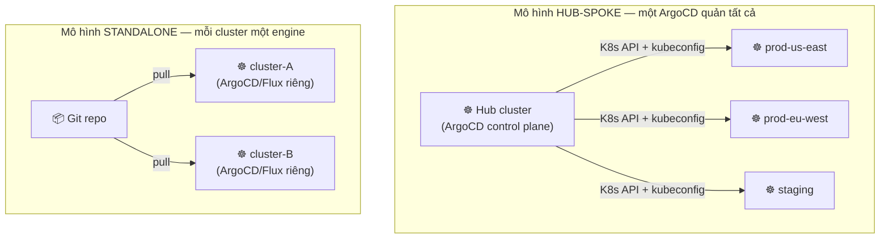
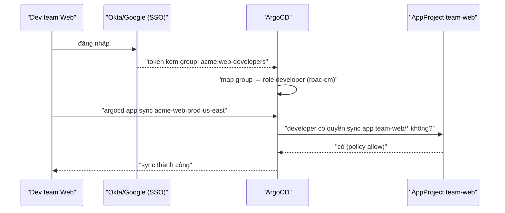

# Multi-Cluster & Multi-Tenancy — Quản nhiều cluster, cô lập nhiều team

> **Tác giả:** Mr.Rom\
> **Phiên bản:** v1.0.0\
> **Tạo lúc:** 13/06/2026\
> **Cập nhật:** 13/06/2026\
> **Level:** Intermediate\
> **Tags:** gitops, argocd, flux, multi-cluster, multi-tenancy, appproject, rbac, sso, applicationset, blast-radius, kubernetes\
> **Yêu cầu trước:** [Progressive Delivery với Argo Rollouts](02_progressive-delivery-with-argo-rollouts.md)

> 🎯 *Đến giờ Acme Shop đã biết quản hàng loạt app (ApplicationSet) và deploy an toàn theo kiểu canary (Argo Rollouts). Nhưng quy mô lại lớn thêm: không chỉ một cluster mà nhiều cluster (prod-us, prod-eu, staging, dev), không chỉ một team mà nhiều team cùng dùng chung một GitOps control plane. Câu hỏi mới: làm sao deploy ra **mọi cluster** mà không phải copy-paste, và làm sao để team A **không thể** lỡ tay deploy đè lên namespace của team B? Sau bài này bạn sẽ đăng ký được external cluster vào ArgoCD, dùng Cluster generator để rải app ra toàn bộ cluster, dựng AppProject + RBAC + SSO group để cô lập từng team, hiểu cách Flux làm multi-tenancy bằng ServiceAccount impersonation, và tự tay khoá AppProject `team-acme` chỉ được dùng đúng repo, đúng namespace, đúng cluster.*

## 🎯 Sau bài này bạn sẽ

- [ ] Phân biệt **hai mô hình multi-cluster**: hub-spoke (một ArgoCD quản N cluster) vs standalone (ArgoCD/Flux mỗi cluster) — biết khi nào dùng cái nào
- [ ] Đăng ký **external cluster** vào ArgoCD bằng `argocd cluster add` và hiểu nó tạo ra cái gì trong cluster
- [ ] Dùng **ApplicationSet Cluster generator** để deploy một app ra mọi cluster, lọc theo label
- [ ] Hiểu **multi-tenancy** là gì và vì sao "cùng một control plane" lại nguy hiểm nếu không cô lập
- [ ] Dựng **ArgoCD AppProject** giới hạn `sourceRepos` / `destinations` / `clusterResourceWhitelist` cho từng team
- [ ] Map **RBAC policy + SSO group** để team chỉ thao tác được app của chính mình
- [ ] Hiểu **Flux multi-tenancy**: tenant + namespace + ServiceAccount impersonation + RBAC
- [ ] Giải thích **blast radius** (bán kính sát thương) và cách cô lập nó giữa các team

---

## Tình huống — một control plane, mười team, và một buổi sáng hoảng loạn

Acme Shop tăng trưởng. Giờ có 4 cluster: `prod-us-east`, `prod-eu-west`, `staging`, `dev`. Và có 4 team: team Web, team Payment, team Search, team Data. Tất cả dùng chung **một ArgoCD** trên cluster quản lý trung tâm — vì dựng riêng 4 ArgoCD thì ai bảo trì?

Một buổi sáng, một dev mới của team Search tạo Application để deploy service tìm kiếm. Trong lúc copy-paste từ ví dụ trên mạng, bạn ấy để nguyên:

```yaml
destination:
  server: https://kubernetes.default.svc
  namespace: production          # ← namespace của team Payment!
```

ArgoCD vui vẻ apply. Service search bị nhét vào namespace `production` của Payment, ghi đè một ConfigMap trùng tên. Payment service bắt đầu trả lỗi 500. Không ai cố ý phá — chỉ là **không có rào chắn nào ngăn một team chạm vào tài nguyên của team khác**.

Đây là vấn đề kinh điển khi GitOps scale lên: một control plane mạnh thì tiện, nhưng "mạnh" cũng nghĩa là "ai cũng có thể với tới mọi thứ". Bài này giải quyết đúng hai mặt của bài toán quy mô đó:

1. **Multi-cluster** — làm sao một ArgoCD quản được nhiều cluster, và rải app ra chúng mà không copy-paste.
2. **Multi-tenancy** — làm sao nhiều team dùng chung mà mỗi team bị "nhốt" trong phần của mình, không vô tình (hay cố ý) chạm vào team khác.

> [!NOTE]
> Bài này lấy **ArgoCD** làm ví dụ chính vì nó có mô hình hub-spoke và AppProject rất rõ ràng để minh hoạ. Phần [Flux multi-tenancy](#5️⃣-flux-multi-tenancy--cô-lập-bằng-serviceaccount-impersonation) sẽ cho thấy cách Kubernetes-native hơn (ServiceAccount impersonation). Hai cách khác triết lý nhưng cùng mục tiêu: **cô lập blast radius**.

---

## 1️⃣ Hai mô hình multi-cluster — hub-spoke vs standalone

Trước khi bàn "rải app ra nhiều cluster", phải chọn **kiến trúc**. Có hai mô hình cơ bản, và lựa chọn này ảnh hưởng tới mọi thứ phía sau.

**Mô hình hub-spoke** (trục–nan hoa): có **một** ArgoCD đặt trên một cluster trung tâm (hub). Nó cầm kubeconfig của tất cả các cluster khác (spoke) và reconcile từ xa — gọi API server của từng spoke để apply resource. Một control plane, một UI, một chỗ nhìn thấy toàn cảnh.

**Mô hình standalone** (mỗi cluster một engine): mỗi cluster có **ArgoCD/Flux riêng**, chỉ lo cho chính nó, pull từ Git một cách độc lập. Không có "hub" — N cluster là N control plane tự trị.

🪞 **Ẩn dụ đời thường**: hub-spoke giống **một tổng đài điều phối taxi** — một tổng đài trung tâm thấy mọi xe, điều xe nào đi đâu. Standalone giống **mỗi tài xế tự nhận khách qua app riêng** — không ai điều phối chung, nhưng nếu tổng đài sập thì tài xế vẫn chạy được. Hub-spoke dễ nhìn toàn cảnh; standalone bền hơn khi một mắt xích chết.

Trước khi đào sâu, sơ đồ dưới đây là khái niệm trừu tượng nhất của cả phần này — nó cho thấy hai mô hình khác nhau ở "ai cầm quyền điều khiển cluster":



→ Điểm cốt lõi: trong hub-spoke, **hub cầm credential của mọi spoke** — tiện quản lý nhưng hub trở thành điểm tập trung rủi ro (sập hub = mất khả năng deploy mọi nơi, lộ hub = lộ creds mọi cluster). Trong standalone, mỗi cluster tự chủ — bền hơn nhưng bạn mất "một màn hình nhìn thấy tất cả". Đa số tổ chức vừa và nhỏ chọn hub-spoke vì đơn giản; tổ chức lớn / yêu cầu cách ly mạng cao thường nghiêng standalone.

Bảng dưới tóm tắt đánh đổi để bạn chọn — nhớ đây là kim chỉ nam, không phải luật cứng:

| Tiêu chí | Hub-spoke (1 ArgoCD) | Standalone (mỗi cluster 1 engine) |
|---|---|---|
| Số control plane | 1 (dễ bảo trì) | N (mỗi cluster tự lo) |
| Nhìn toàn cảnh | ✅ Một UI thấy hết | ❌ Phải nhìn từng cluster |
| Bán kính rủi ro khi hub sập | 🔴 Mất deploy toàn bộ | 🟢 Chỉ ảnh hưởng 1 cluster |
| Lưu trữ credential | Hub giữ kubeconfig mọi cluster | Không có credential xuyên cluster |
| Cách ly mạng | Hub phải gọi tới được mọi cluster | Mỗi cluster chỉ cần ra Git |
| Khi nên chọn | Team nhỏ/vừa, muốn quản tập trung | Nhiều cluster cách ly, yêu cầu tự trị cao |

> [!TIP]
> Có mô hình lai phổ biến: **một ArgoCD per "khu vực tin cậy"** — ví dụ một hub cho mọi cluster prod, một hub riêng cho dev/staging. Vừa giữ được "nhìn toàn cảnh trong từng nhóm", vừa giới hạn blast radius khi một hub gặp sự cố. Đừng nghĩ chỉ có đúng/sai nhị phân.

Phần còn lại của bài tập trung vào **hub-spoke**, vì đây là mô hình cần kỹ thuật riêng (đăng ký cluster, Cluster generator) — standalone thì mỗi engine y hệt bài basic, chỉ nhân lên N lần.

---

## 2️⃣ Đăng ký external cluster vào ArgoCD

Trong hub-spoke, hub cần "biết" các spoke. Mặc định ArgoCD chỉ thấy cluster nó đang chạy bên trong (gọi là `in-cluster`, địa chỉ `https://kubernetes.default.svc`). Muốn quản thêm cluster khác, phải **đăng ký** nó.

Cơ chế đăng ký rất Kubernetes: ArgoCD tạo một `ServiceAccount` trên cluster đích, gán quyền cho nó, rồi lưu token + địa chỉ API server vào một `Secret` trong namespace `argocd`. Từ đó hub dùng token này để gọi API của spoke mỗi vòng reconcile.

🪞 Ẩn dụ: đăng ký cluster giống **đưa chìa khoá nhà cho người quản gia** — bạn (cluster đích) cấp cho quản gia (ArgoCD hub) một chìa riêng (ServiceAccount token), không phải chìa master của chủ nhà (admin kubeconfig của bạn). Quản gia chỉ vào được những phòng bạn cho phép.

### 🛠️ Bước 1: Kiểm tra context trong kubeconfig

`argocd cluster add` nhận tên một **context** trong file kubeconfig local của bạn. Trước hết liệt kê các context đang có để lấy đúng tên:

```bash
kubectl config get-contexts -o name
```

Kết quả mẫu:

```
in-cluster
prod-us-east
prod-eu-west
staging
```

Đọc output: mỗi dòng là một context — tức một "lối vào" tới một cluster kèm credential. Ta sẽ đăng ký `prod-us-east` vào ArgoCD ở bước sau. Tên này chính là đối số truyền cho `argocd cluster add`.

### 🛠️ Bước 2: Thêm cluster vào ArgoCD

Lệnh `argocd cluster add` dùng credential trong context để **tạo ServiceAccount + token trên cluster đích**, rồi đăng ký vào hub. Mặc định nó tạo ServiceAccount `argocd-manager` với quyền `cluster-admin` trên cluster đó:

```bash
argocd cluster add prod-us-east
```

Kết quả mẫu:

```
WARNING: This will create a service account `argocd-manager` on the cluster referenced by context `prod-us-east` with full cluster level privileges. Do you want to continue [y/N]? y
INFO[0003] ServiceAccount "argocd-manager" created in namespace "kube-system"
INFO[0003] ClusterRole "argocd-manager-role" created
INFO[0003] ClusterRoleBinding "argocd-manager-role-binding" created
Cluster 'https://prod-us-east.eks.amazonaws.com' added
```

Đọc output: ArgoCD cảnh báo nó sắp tạo ServiceAccount **quyền cluster-admin** — đây là điểm cần chú ý về bảo mật (xem cảnh báo bên dưới). Ba dòng `INFO` xác nhận nó đã tạo `ServiceAccount` + `ClusterRole` + `ClusterRoleBinding` trên `prod-us-east`. Dòng cuối báo cluster đã được thêm thành công.

> [!WARNING]
> Mặc định `argocd cluster add` cấp quyền **cluster-admin** cho ServiceAccount của ArgoCD trên cluster đích. Nếu hub bị xâm nhập, kẻ tấn công có cluster-admin trên *mọi* spoke. Với cluster nhạy cảm, hãy thu hẹp quyền bằng cách tự định nghĩa ClusterRole hẹp hơn, hoặc dùng cờ `--namespace` để giới hạn ArgoCD chỉ quản vài namespace cụ thể trên cluster đó. (Lưu ý: cờ `--system-namespace` chỉ đổi namespace nơi ServiceAccount `argocd-manager` được tạo — mặc định `kube-system` — chứ không tự thu hẹp quyền.)

### 🛠️ Bước 3: Kiểm tra cluster đã đăng ký

Sau khi thêm, liệt kê mọi cluster ArgoCD đang quản để xác nhận:

```bash
argocd cluster list
```

Kết quả mẫu:

```
SERVER                                    NAME          VERSION  STATUS      MESSAGE
https://kubernetes.default.svc            in-cluster    1.29     Successful
https://prod-us-east.eks.amazonaws.com    prod-us-east  1.29     Successful
```

Đọc output: cột `STATUS = Successful` nghĩa là hub kết nối được tới API server của cluster và token còn hợp lệ. Nếu thấy `Failed` hoặc `Unknown`, thường do token hết hạn, network giữa hub và spoke bị chặn, hoặc kubeconfig sai. `in-cluster` luôn có sẵn — đó là chính cluster hub.

Từ giờ, trong `Application` bạn có thể trỏ `destination.server` tới URL spoke, hoặc tiện hơn là trỏ theo **tên** đã đăng ký:

```yaml
spec:
  destination:
    name: prod-us-east        # dùng TÊN cluster (rõ ràng hơn URL dài)
    namespace: production
```

> [!NOTE]
> Đăng ký cluster qua CLI tiện cho thử nghiệm, nhưng nó tạo Secret *bằng tay* — không nằm trong Git, nên không "GitOps". Production thường khai báo cluster Secret dưới dạng declarative (một `Secret` với label `argocd.argoproj.io/secret-type: cluster`) và quản nó qua một tool như SealedSecrets/External Secrets. Như vậy danh sách cluster cũng versioned trong Git như mọi thứ khác.

---

## 3️⃣ ApplicationSet Cluster generator — rải app ra mọi cluster

Đã đăng ký nhiều cluster, giờ tới phần ngọt ngào: deploy một app ra **tất cả** chúng mà không viết tay N file `Application`. Đây là việc của **Cluster generator** trong ApplicationSet — bạn đã gặp ApplicationSet ở bài App-of-Apps; lần này nó sinh Application theo *cluster* thay vì theo env.

Vấn đề kinh điển: Acme Shop muốn mọi cluster đều có agent monitoring (Prometheus node-exporter, log shipper...). Nếu thêm cluster thứ 5 vào tuần sau, bạn *không* muốn phải nhớ tạo thêm Application cho monitoring trên cluster đó. Cluster generator giải quyết đúng điều này: nó tự sinh một Application cho **mỗi** cluster ArgoCD biết, và khi bạn đăng ký cluster mới, nó *tự* sinh thêm.

### 3.1 Cluster generator cơ bản — deploy ra mọi cluster

`generators.clusters: {}` (rỗng) nghĩa là "lấy tất cả cluster đã đăng ký". Mỗi cluster cung cấp hai biến template hữu ích: `{{name}}` (tên cluster) và `{{server}}` (URL API server). Lead-in xong, đây là ApplicationSet rải monitoring ra mọi cluster:

```yaml
# monitoring-all-clusters.yaml — deploy agent monitoring ra MỌI cluster
apiVersion: argoproj.io/v1alpha1
kind: ApplicationSet
metadata:
  name: monitoring
  namespace: argocd
spec:
  generators:
    - clusters: {}                 # lấy TẤT CẢ cluster đã đăng ký với ArgoCD
  template:
    metadata:
      name: 'monitoring-{{name}}'  # vd monitoring-prod-us-east, monitoring-staging
    spec:
      project: platform            # AppProject của team platform (mục 4)
      source:
        repoURL: https://github.com/acme/gitops-config
        targetRevision: main
        path: apps/monitoring
      destination:
        server: '{{server}}'       # trỏ vào API server của TỪNG cluster
        namespace: monitoring
      syncPolicy:
        automated:
          prune: true
          selfHeal: true
        syncOptions:
          - CreateNamespace=true
```

→ ArgoCD đọc danh sách cluster, sinh một Application cho mỗi cái: `monitoring-in-cluster`, `monitoring-prod-us-east`, `monitoring-prod-eu-west`, `monitoring-staging`. Đăng ký cluster thứ 5 → ApplicationSet *tự* sinh `monitoring-<tên-mới>` mà bạn không sửa gì. Đây là pattern "self-registering": hạ tầng chung tự lan ra mọi cluster.

### 3.2 Lọc cluster theo label — chỉ rải đúng nhóm

Không phải app nào cũng cần lên mọi cluster. Ví dụ một app prod-only thì không nên xuất hiện ở `dev`. Cluster generator hỗ trợ `selector.matchLabels` để **lọc** — chỉ sinh Application cho cluster có label khớp.

Label được gắn vào cluster *lúc đăng ký* (hoặc sửa sau trên Secret cluster). Giả sử ta đã gắn label `env=production` cho `prod-us-east` và `prod-eu-west`. ApplicationSet dưới đây chỉ deploy app web prod ra hai cluster đó, bỏ qua `staging`/`dev`:

```yaml
# web-prod-clusters.yaml — chỉ deploy ra cluster có label env=production
apiVersion: argoproj.io/v1alpha1
kind: ApplicationSet
metadata:
  name: acme-web-prod
  namespace: argocd
spec:
  generators:
    - clusters:
        selector:
          matchLabels:
            env: production        # CHỈ cluster gắn label env=production
  template:
    metadata:
      name: 'acme-web-{{name}}'
    spec:
      project: team-web
      source:
        repoURL: https://github.com/acme/web-config
        targetRevision: main
        path: overlays/production
      destination:
        server: '{{server}}'
        namespace: production
      syncPolicy:
        automated:
          prune: true
          selfHeal: true
```

→ Chỉ sinh `acme-web-prod-us-east` và `acme-web-prod-eu-west`. Cluster `staging`/`dev` không khớp label nên bị bỏ qua. Muốn rollout app prod ra một region mới? Chỉ cần đăng ký cluster mới với label `env=production` — không sửa ApplicationSet.

Để xem label hiện tại của một cluster, đọc Secret cluster tương ứng:

```bash
kubectl get secret -n argocd -l argocd.argoproj.io/secret-type=cluster \
  -o custom-columns='NAME:.metadata.name,ENV:.metadata.labels.env'
```

Kết quả mẫu:

```
NAME                       ENV
cluster-prod-us-east-xxx   production
cluster-prod-eu-west-xxx   production
cluster-staging-xxx        staging
```

Đọc output: cột `ENV` cho thấy label `env` của từng cluster Secret. Chỉ hai cluster có `env=production` mới được Cluster generator ở trên chọn. Nếu cột trống nghĩa là cluster đó chưa được gắn label — cần thêm label vào Secret để selector hoạt động.

> [!CAUTION]
> Cluster generator + `automated.prune: true` là kết hợp mạnh nhưng nguy hiểm: nếu một cluster tạm thời **mất kết nối** rồi bị xoá khỏi danh sách (token hết hạn, Secret bị xoá), ApplicationSet có thể coi đó là "cluster không còn nữa", xoá Application tương ứng, và prune sẽ **xoá sạch** resource trên cluster đó khi nó kết nối lại. Với app stateful, hãy bật `preserveResourcesOnDeletion: true` trong `spec.syncPolicy` của ApplicationSet để giữ resource khi Application bị gỡ.

---

## 4️⃣ Multi-tenancy với ArgoCD — AppProject + RBAC + SSO

Đã quản được nhiều cluster, giờ tới phần *cô lập nhiều team* — chính là sự cố đầu bài. Quay lại: một dev team Search lỡ deploy vào namespace `production` của Payment. Vì sao được? Vì Application đó dùng project `default`, mà **`default` project mở toang** — cho phép deploy từ *bất kỳ* repo tới *bất kỳ* cluster/namespace.

Multi-tenancy (đa người thuê) là việc nhiều "tenant" (team) dùng chung một control plane nhưng mỗi tenant chỉ thấy/chạm được phần của mình. Công cụ chính của ArgoCD là **AppProject**.

🪞 Ẩn dụ: AppProject giống **hợp đồng thuê văn phòng trong một toà nhà chung** — toà nhà (ArgoCD) cho nhiều công ty thuê (team), nhưng hợp đồng của mỗi công ty ghi rõ "anh chỉ được vào tầng 3, cửa số 301-310, dùng kho hàng B". Anh không thể tự ý mở cửa phòng công ty khác, dù cùng toà nhà.

AppProject kiểm soát ba thứ chính:

| Trường AppProject | Giới hạn điều gì | Trả lời câu hỏi |
|---|---|---|
| `sourceRepos` | Repo Git nào được phép làm nguồn | "App của team này được kéo code từ đâu?" |
| `destinations` | Cluster + namespace nào được deploy tới | "App này được phép hạ cánh ở đâu?" |
| `clusterResourceWhitelist` | Loại tài nguyên *cấp cluster* nào được tạo | "Team này có được tạo ClusterRole/Namespace không?" |

### 4.1 AppProject giới hạn nguồn và đích

Đây là trái tim của cô lập. Một AppProject cho team Web chỉ cho phép: nguồn từ repo của Web, đích là namespace `web-*` trên các cluster prod, và *không* được tạo tài nguyên cấp cluster (trừ Namespace). Mọi Application gán vào project này đều bị "nhốt" trong các giới hạn đó:

```yaml
# appproject-team-web.yaml — cô lập team Web
apiVersion: argoproj.io/v1alpha1
kind: AppProject
metadata:
  name: team-web
  namespace: argocd
spec:
  description: "App của team Web — chỉ deploy được vào namespace web-*"

  # 1. Chỉ cho phép kéo từ repo của team Web (và 1 Helm repo công khai)
  sourceRepos:
    - https://github.com/acme/web-config
    - https://charts.bitnami.com/bitnami

  # 2. Chỉ cho phép deploy vào namespace web-* trên cluster prod
  destinations:
    - namespace: 'web-*'
      server: https://prod-us-east.eks.amazonaws.com
    - namespace: 'web-*'
      server: https://prod-eu-west.eks.amazonaws.com

  # 3. Chỉ được tạo Namespace ở cấp cluster — KHÔNG được tạo ClusterRole/CRD
  clusterResourceWhitelist:
    - group: ''
      kind: Namespace

  # 4. Trong namespace của mình thì được tạo mọi loại resource thường
  namespaceResourceWhitelist:
    - group: '*'
      kind: '*'
```

→ Bây giờ nếu dev team Web tạo một Application gán `project: team-web` nhưng trỏ `destination.namespace: production`, ArgoCD **từ chối sync** với lỗi đại loại "destination production is not permitted in project team-web". Sự cố đầu bài *không thể xảy ra* nữa — rào chắn đã ở đúng chỗ.

Gán project cho Application chỉ là một dòng:

```yaml
spec:
  project: team-web          # ← buộc Application tuân giới hạn của AppProject team-web
```

> [!IMPORTANT]
> Project `default` mặc định cho phép *mọi thứ* (`sourceRepos: ['*']`, `destinations: [server: '*', namespace: '*']`). Trong môi trường đa team, hãy **siết `default` lại** (hoặc cấm dùng nó) và bắt mọi Application phải thuộc một AppProject cụ thể. Để project `default` mở toang = vô hiệu hoá toàn bộ multi-tenancy.

### 4.2 RBAC trong AppProject — ai được làm gì

`destinations`/`sourceRepos` giới hạn *Application làm được gì*, nhưng chưa giới hạn *con người nào được thao tác Application nào*. Đó là việc của **RBAC** (Role-Based Access Control — kiểm soát truy cập theo vai trò).

AppProject có thể định nghĩa **role** ngay bên trong nó, kèm các dòng policy. Mỗi dòng policy đọc theo công thức: `p, <subject>, <resource>, <action>, <object>, <effect>`. Ví dụ cho team Web có hai vai trò — developer (xem + sync app của mình) và viewer (chỉ xem):

```yaml
# (tiếp trong appproject-team-web.yaml) — thêm roles
  roles:
    - name: developer
      description: "Dev team Web — xem + sync app của team"
      policies:
        # cho phép GET (xem) mọi app trong project team-web
        - p, proj:team-web:developer, applications, get, team-web/*, allow
        # cho phép SYNC mọi app trong project team-web
        - p, proj:team-web:developer, applications, sync, team-web/*, allow
      groups:
        - acme:web-developers      # map tới group SSO (mục 4.3)

    - name: viewer
      description: "Chỉ xem app của team Web"
      policies:
        - p, proj:team-web:viewer, applications, get, team-web/*, allow
      groups:
        - acme:all-readers
```

→ Hai vai trò khác nhau ở *action*: `developer` có cả `get` và `sync`; `viewer` chỉ `get`. Cả hai bị giới hạn `object = team-web/*` — tức **chỉ app trong project team-web**, không chạm tới app của Payment hay Search. `groups` nối vai trò này với một SSO group, để không phải gán quyền cho từng người.

> [!NOTE]
> Cú pháp policy của ArgoCD dựa trên Casbin. Phần `object` dạng `<project>/<app>` — `team-web/*` nghĩa "mọi app thuộc project team-web". `effect` là `allow` hoặc `deny` (`deny` luôn thắng `allow` nếu trùng). Có hai cấp RBAC: **project-scoped** (trong AppProject như trên, chỉ cho app của project đó) và **global** (`argocd-rbac-cm`, mục kế).

### 4.3 RBAC toàn cục + SSO group

RBAC trong AppProject lo phần app của *một* project. Còn quyền *toàn cục* (ví dụ "platform admin được làm mọi thứ", "mọi nhân viên được xem read-only") nằm ở ConfigMap `argocd-rbac-cm`. Đây cũng là chỗ map **SSO group** (từ Okta/Google/GitHub) tới role.

Vì sao cần SSO group? Vì gán quyền cho từng cá nhân không scale — nhân viên vào/ra liên tục. Thay vào đó, ArgoCD tin tưởng "group" mà nhà cung cấp SSO khẳng định người dùng thuộc về, rồi map group → role. Đây là ConfigMap RBAC toàn cục:

```yaml
# argocd-rbac-cm.yaml — RBAC toàn cục + map SSO group → role
apiVersion: v1
kind: ConfigMap
metadata:
  name: argocd-rbac-cm
  namespace: argocd
data:
  # mặc định: ai chưa được map thì chỉ xem (read-only)
  policy.default: role:readonly

  policy.csv: |
    # --- định nghĩa role toàn cục ---
    # platform-admin: làm mọi thứ trên mọi app + mọi cluster
    p, role:platform-admin, applications, *, */*, allow
    p, role:platform-admin, clusters, *, *, allow

    # --- map SSO group → role ---
    # group platform-admins trên SSO → role platform-admin
    g, acme:platform-admins, role:platform-admin
    # group web-developers → role developer của project team-web (định nghĩa trong AppProject)
    g, acme:web-developers, proj:team-web:developer

  # các "scope" lấy từ token SSO để khớp group/email
  scopes: '[groups, email]'
```

→ Dòng `g, acme:platform-admins, role:platform-admin` nghĩa: ai thuộc SSO group `acme:platform-admins` được làm mọi thứ. Dòng `g, acme:web-developers, proj:team-web:developer` nối group dev Web tới role developer *của riêng project team-web*. `policy.default: role:readonly` đảm bảo người lạ (chưa được map) chỉ xem được, không sync/xoá gì.

Cơ chế xuyên suốt từ "đăng nhập SSO" tới "được phép sync app" như sơ đồ dưới — đây là luồng phân quyền hoàn chỉnh:



→ Điểm mấu chốt: ArgoCD *không* tự quyết bạn là ai — nó tin nhà cung cấp SSO khẳng định bạn thuộc group nào, rồi tra bảng map để biết bạn được làm gì. Đổi nhân sự = thêm/bớt người khỏi group trên SSO, *không* sửa ArgoCD. Đây là cách quản quyền cho hàng chục team mà không phát điên.

---

## 5️⃣ Flux multi-tenancy — cô lập bằng ServiceAccount impersonation

ArgoCD cô lập team bằng AppProject (một lớp khái niệm *của riêng ArgoCD*). Flux làm khác hẳn: nó dựa thẳng vào **RBAC gốc của Kubernetes** thông qua **ServiceAccount impersonation** (đóng vai ServiceAccount). Triết lý khác, nhưng cùng mục tiêu cô lập.

Ý tưởng cốt lõi: thay vì Flux dùng quyền cao của chính nó để apply mọi thứ, mỗi tenant có một `ServiceAccount` *quyền hẹp* trong namespace của mình. Khi reconcile resource của tenant đó, Flux **đóng vai** (impersonate) ServiceAccount ấy — nên nó chỉ làm được đúng những gì RBAC cho phép ServiceAccount đó làm. Nếu manifest của team A cố tạo resource trong namespace team B, Kubernetes API *từ chối* vì ServiceAccount của A không có quyền ở namespace B.

🪞 Ẩn dụ: ServiceAccount impersonation giống **người quản gia đeo bảng tên của chính chủ phòng khi vào phòng đó** — quản gia (Flux) có thể vào nhiều phòng, nhưng khi vào phòng 301 anh đeo bảng tên "chủ phòng 301" và chỉ được làm những gì chủ phòng 301 được phép. Anh không thể mượn quyền đó để mở phòng 302.

Một tenant Flux gồm bốn mảnh: **Namespace** + **ServiceAccount** + **RBAC (RoleBinding)** + **Kustomization** trỏ vào repo tenant với `serviceAccountName`. Dưới đây là cấu hình tối thiểu cho tenant `team-acme`:

```yaml
# flux-tenant-team-acme.yaml — cô lập tenant team-acme trong Flux
---
apiVersion: v1
kind: Namespace
metadata:
  name: team-acme
---
# ServiceAccount mà Flux sẽ "đóng vai" khi apply resource của tenant này
apiVersion: v1
kind: ServiceAccount
metadata:
  name: team-acme
  namespace: team-acme
---
# RBAC: cho ServiceAccount quyền admin CHỈ trong namespace team-acme
apiVersion: rbac.authorization.k8s.io/v1
kind: RoleBinding
metadata:
  name: team-acme-reconciler
  namespace: team-acme
roleRef:
  apiGroup: rbac.authorization.k8s.io
  kind: ClusterRole
  name: admin                       # ClusterRole "admin" có sẵn của K8s (chỉ trong ns này)
subjects:
  - apiGroup: ""
    kind: ServiceAccount
    name: team-acme
    namespace: team-acme
```

→ `RoleBinding` (không phải `ClusterRoleBinding`) tham chiếu ClusterRole `admin` nhưng **gói gọn trong namespace `team-acme`** — đây là mẹo quan trọng: ServiceAccount có quyền admin *chỉ ở* namespace của mình, không phải toàn cluster. Đây là rào chắn RBAC thật của Kubernetes, mạnh hơn rào "logic" của AppProject vì nó được API server enforce.

Tiếp theo là `Kustomization` của Flux — nó trỏ vào repo của tenant và *bắt buộc* dùng ServiceAccount trên qua `spec.serviceAccountName`:

```yaml
# (tiếp) — Kustomization của tenant, ép impersonate ServiceAccount team-acme
apiVersion: kustomize.toolkit.fluxcd.io/v1
kind: Kustomization
metadata:
  name: team-acme-apps
  namespace: team-acme
spec:
  interval: 5m
  sourceRef:
    kind: GitRepository
    name: team-acme-repo            # GitRepository trỏ tới repo của tenant
  path: ./apps
  prune: true
  targetNamespace: team-acme        # mọi resource hạ cánh vào namespace team-acme
  serviceAccountName: team-acme     # ← Flux ĐÓNG VAI ServiceAccount này khi apply
```

→ Dòng `serviceAccountName: team-acme` là chìa khoá: Flux apply mọi resource trong repo tenant *dưới danh nghĩa* ServiceAccount `team-acme`. Nếu repo tenant chứa một manifest cố tạo resource ngoài namespace `team-acme`, Kubernetes API từ chối — vì ServiceAccount đó không có quyền ngoài namespace của mình. Cô lập được *cluster API server* bảo đảm, không phụ thuộc thiện chí của tenant.

> [!TIP]
> Flux có lệnh tạo nhanh khung tenant: `flux create tenant team-acme --with-namespace=team-acme --export > tenant.yaml`. Nó sinh sẵn Namespace + ServiceAccount + RoleBinding. Cờ `--export` in ra YAML (không apply trực tiếp) để bạn commit vào Git — đúng tinh thần GitOps.

Bảng dưới đối chiếu hai triết lý cô lập để bạn nắm khác biệt cốt lõi:

| Khía cạnh | ArgoCD (AppProject) | Flux (impersonation) |
|---|---|---|
| Lớp cô lập | Logic riêng của ArgoCD (project) | RBAC gốc Kubernetes |
| Ai enforce | ArgoCD application-controller | Kubernetes API server |
| Đơn vị tenant | AppProject + roles | Namespace + ServiceAccount + RoleBinding |
| Giới hạn nguồn | `sourceRepos` whitelist | Mỗi tenant một GitRepository riêng |
| Giới hạn đích | `destinations` whitelist | RBAC namespace của ServiceAccount |
| Điểm mạnh | UI rõ, gom quyền tập trung | Cô lập "thật" do API server đảm bảo |

---

## 6️⃣ Blast radius — cô lập bán kính sát thương giữa team

Mọi thứ ở trên đều phục vụ một khái niệm xuyên suốt: **blast radius** (bán kính sát thương) — khi một thứ hỏng (sự cố, cấu hình sai, kẻ tấn công), nó kéo theo bao nhiêu thứ khác sập theo. Multi-tenancy tốt = blast radius nhỏ.

Hãy nhìn lại sự cố đầu bài qua lăng kính blast radius. *Không có* cô lập, một dev team Search lỡ tay → ghi đè ConfigMap của Payment → Payment sập. Bán kính sát thương lan từ Search sang Payment. *Có* AppProject `team-search` giới hạn `destinations: search-*`, lỗi tương tự bị chặn ngay ở khâu sync — bán kính = 0, không lan ra ngoài team Search.

Các tầng cô lập blast radius, từ ngoài vào trong:

| Tầng cô lập | Cô lập điều gì | Công cụ |
|---|---|---|
| **Cluster** | Sự cố một cluster không lan sang cluster khác | Nhiều cluster (prod tách dev), standalone engine |
| **Namespace** | Team này không chạm tài nguyên team kia | AppProject `destinations`, Flux RBAC namespace |
| **Nguồn (repo)** | Không deploy được từ repo lạ / độc hại | AppProject `sourceRepos`, GitRepository riêng |
| **Quyền cấp cluster** | Team không tạo được ClusterRole/CRD nguy hiểm | `clusterResourceWhitelist` |
| **Con người** | Người team A không sync được app team B | RBAC + SSO group |

→ Mỗi tầng là một rào chắn độc lập. Một rào thủng (ví dụ ai đó leak credential) thì các rào còn lại vẫn giữ. Đây là tư duy *defense in depth* (phòng thủ nhiều lớp) áp dụng vào GitOps: đừng đặt cược toàn bộ vào một rào duy nhất.

> [!WARNING]
> Cạm bẫy phổ biến: cô lập rất kỹ ở tầng namespace nhưng **quên tầng quyền cấp cluster**. Nếu AppProject để `clusterResourceWhitelist` mở (`group: '*', kind: '*'`), một team vẫn có thể tạo `ClusterRoleBinding` cấp quyền cluster-admin cho ServiceAccount của mình — leo thang đặc quyền (privilege escalation) và phá vỡ mọi cô lập namespace. Luôn whitelist tài nguyên cấp cluster ở mức tối thiểu.

---

## 7️⃣ Hands-on — dựng AppProject `team-acme` khoá repo + namespace + cluster đích

Giờ ráp mọi thứ lại thành một ví dụ cô lập hoàn chỉnh. Ta sẽ dựng AppProject `team-acme` chỉ cho phép: kéo code từ đúng một repo, deploy vào đúng namespace `acme-*`, trên đúng một cluster prod, và *không* được tạo tài nguyên cấp cluster ngoài Namespace. Sau đó tạo một Application hợp lệ và thử một Application "phạm luật" để thấy ArgoCD chặn.

> [!NOTE]
> Phần này giả định bạn đã có ArgoCD chạy, đã đăng nhập `argocd` CLI, và đã đăng ký cluster `prod-us-east` ở mục 2. Ta tập trung vào *cô lập tenant*, không lặp lại bước cài ArgoCD (xem mục Liên kết cuối bài).

### 🛠️ Bước 1: Tạo AppProject `team-acme`

Khai báo AppProject với đủ ba giới hạn cốt lõi. Đọc kỹ comment từng khối — đây chính là "hợp đồng thuê" của team Acme:

```yaml
# appproject-team-acme.yaml
apiVersion: argoproj.io/v1alpha1
kind: AppProject
metadata:
  name: team-acme
  namespace: argocd
spec:
  description: "Tenant team-acme — khoá repo + namespace acme-* + cluster prod-us-east"

  # 1. Chỉ kéo được từ đúng repo của team Acme
  sourceRepos:
    - https://github.com/acme/acme-shop-config

  # 2. Chỉ deploy vào namespace acme-* trên cluster prod-us-east
  destinations:
    - namespace: 'acme-*'
      server: https://prod-us-east.eks.amazonaws.com

  # 3. Cấp cluster: chỉ được tạo Namespace, không gì khác (chặn leo thang quyền)
  clusterResourceWhitelist:
    - group: ''
      kind: Namespace

  # 4. Trong namespace của mình: được tạo mọi resource thường
  namespaceResourceWhitelist:
    - group: '*'
      kind: '*'

  # 5. RBAC: dev của team chỉ get + sync app của project này
  roles:
    - name: developer
      description: "Dev team Acme"
      policies:
        - p, proj:team-acme:developer, applications, get, team-acme/*, allow
        - p, proj:team-acme:developer, applications, sync, team-acme/*, allow
      groups:
        - acme:acme-developers
```

Apply project vào cluster ArgoCD:

```bash
kubectl apply -f appproject-team-acme.yaml
```

Kết quả mẫu:

```
appproject.argoproj.io/team-acme created
```

### 🛠️ Bước 2: Kiểm tra AppProject đã có giới hạn đúng

Xác nhận project tồn tại và đọc lại các giới hạn:

```bash
argocd proj get team-acme
```

Kết quả mẫu:

```
Name:                        team-acme
Description:                 Tenant team-acme — khoá repo + namespace acme-* + cluster prod-us-east
Destinations:                https://prod-us-east.eks.amazonaws.com,acme-*
Repositories:                https://github.com/acme/acme-shop-config
Allowed Cluster Resources:   /Namespace
Denied Namespaced Resources: <none>
```

Đọc output: `Destinations` xác nhận chỉ cluster `prod-us-east` + namespace `acme-*`; `Repositories` chỉ một repo; `Allowed Cluster Resources: /Namespace` nghĩa team chỉ được tạo Namespace ở cấp cluster. Mọi giới hạn đã vào đúng chỗ — đây là rào chắn của tenant.

### 🛠️ Bước 3: Tạo Application hợp lệ (tuân luật)

Application này tuân đủ luật: nguồn đúng repo, đích `acme-prod` (khớp `acme-*`), trên cluster `prod-us-east`. ArgoCD sẽ chấp nhận:

```yaml
# app-acme-shop-valid.yaml — HỢP LỆ với project team-acme
apiVersion: argoproj.io/v1alpha1
kind: Application
metadata:
  name: acme-shop-web
  namespace: argocd
spec:
  project: team-acme                                    # gán vào tenant team-acme
  source:
    repoURL: https://github.com/acme/acme-shop-config   # ✅ repo trong sourceRepos
    targetRevision: main
    path: apps/web/production
  destination:
    server: https://prod-us-east.eks.amazonaws.com      # ✅ cluster cho phép
    namespace: acme-prod                                # ✅ khớp pattern acme-*
  syncPolicy:
    automated:
      prune: true
      selfHeal: true
    syncOptions:
      - CreateNamespace=true
```

```bash
kubectl apply -f app-acme-shop-valid.yaml
```

Kết quả mẫu:

```
application.argoproj.io/acme-shop-web created
```

→ Application được tạo và sync bình thường vì mọi thứ nằm trong giới hạn project. Đây là đường đi "đúng luật".

### 🛠️ Bước 4: Thử Application phạm luật — xem ArgoCD chặn

Bây giờ giả lập đúng sự cố đầu bài: một Application gán `project: team-acme` nhưng cố deploy vào namespace `production` (của team khác, *không* khớp `acme-*`):

```yaml
# app-acme-shop-violation.yaml — PHẠM LUẬT: namespace production không khớp acme-*
apiVersion: argoproj.io/v1alpha1
kind: Application
metadata:
  name: acme-shop-rogue
  namespace: argocd
spec:
  project: team-acme
  source:
    repoURL: https://github.com/acme/acme-shop-config
    targetRevision: main
    path: apps/web/production
  destination:
    server: https://prod-us-east.eks.amazonaws.com
    namespace: production                               # ❌ KHÔNG khớp acme-*
  syncPolicy:
    automated: {}
```

```bash
kubectl apply -f app-acme-shop-violation.yaml
```

Application được *tạo* nhưng khi reconcile, ArgoCD báo lỗi điều kiện. Kiểm tra:

```bash
argocd app get acme-shop-rogue
```

Kết quả mẫu (phần Conditions):

```
Name:               argocd/acme-shop-rogue
Project:            team-acme
Sync Status:        Unknown
Health Status:      Unknown
CONDITION                    MESSAGE
InvalidSpecError             application destination {https://prod-us-east.eks.amazonaws.com production} is not permitted in project 'team-acme'
```

Đọc output: dòng `InvalidSpecError` nói thẳng — destination `production` **không được phép** trong project `team-acme`. ArgoCD từ chối deploy. Sự cố đầu bài (Search ghi đè Payment) *không thể xảy ra* nữa: dù dev gõ sai namespace, rào chắn AppProject chặn ngay trước khi resource chạm cluster. Đây chính là multi-tenancy đang làm việc.

### 🧹 Dọn dẹp

Xoá các tài nguyên thử nghiệm để cluster sạch sẽ:

```bash
# Xoá hai Application thử nghiệm
kubectl delete application acme-shop-web acme-shop-rogue -n argocd

# Xoá AppProject (chỉ xoá nếu đây là project thử nghiệm!)
kubectl delete appproject team-acme -n argocd
```

→ Lưu ý: xoá Application có `prune: true` sẽ kéo theo xoá resource nó quản trên cluster. Đừng chạy lệnh này với app thật đang phục vụ khách.

---

## 💡 Cạm bẫy thường gặp & Best practice

### ❌ Cạm bẫy: để mọi Application dùng project `default`

- **Triệu chứng**: bất kỳ team nào cũng deploy được vào bất kỳ namespace/cluster nào; một dev lỡ tay là ghi đè tài nguyên team khác (chính sự cố đầu bài).
- **Nguyên nhân**: project `default` mặc định mở toang (`sourceRepos: ['*']`, `destinations: server '*' namespace '*'`). Nó *không* cô lập gì cả — chỉ là chỗ chứa app khi bạn lười tạo project.
- **Cách tránh**: tạo một AppProject cho mỗi team, siết `sourceRepos`/`destinations`/`clusterResourceWhitelist`. Siết luôn project `default` về rỗng hoặc cấm dùng. Quy tắc: *không Application nào được sống trong `default` ở môi trường đa team*.

### ❌ Cạm bẫy: hub cầm cluster-admin mọi spoke = một điểm thủng chết cả hệ

- **Triệu chứng**: một lỗ hổng trên ArgoCD hub (hoặc credential hub bị leak) cho kẻ tấn công quyền cluster-admin trên *tất cả* cluster đã đăng ký.
- **Nguyên nhân**: `argocd cluster add` mặc định cấp ServiceAccount quyền cluster-admin trên cluster đích, và hub giữ token đó. Hub trở thành "chìa khoá vạn năng" của toàn bộ hạ tầng.
- **Cách tránh**: thu hẹp quyền ServiceAccount của ArgoCD trên từng cluster (ClusterRole hẹp, hoặc giới hạn namespace bằng cờ `--namespace` khi add). Cân nhắc tách hub theo "khu vực tin cậy" (hub prod riêng, hub dev riêng) để giới hạn blast radius. Bảo vệ hub như tài sản nhạy cảm nhất.

### ❌ Cạm bẫy: cô lập namespace nhưng quên `clusterResourceWhitelist`

- **Triệu chứng**: team bị giới hạn `destinations: team-x-*` nhưng vẫn tạo được `ClusterRoleBinding` cấp quyền cluster-admin cho ServiceAccount của mình → leo thang đặc quyền, phá vỡ mọi cô lập.
- **Nguyên nhân**: `destinations` chỉ giới hạn *namespace đích*, không giới hạn *loại tài nguyên cấp cluster* được tạo. Nếu `clusterResourceWhitelist` mở (`group '*' kind '*'`), team tạo được tài nguyên cấp cluster tuỳ ý.
- **Cách tránh**: whitelist tài nguyên cấp cluster ở mức tối thiểu (thường chỉ `Namespace`). Tuyệt đối không để `ClusterRole`/`ClusterRoleBinding`/`CRD` trong whitelist của một team thường.

### ✅ Best practice: map quyền qua SSO group, không gán cho cá nhân

- **Vì sao**: gán quyền cho từng người không scale — nhân viên vào/ra liên tục, quên thu hồi quyền là lỗ hổng. Quản theo group thì việc "vào/ra team" chỉ là thêm/bớt thành viên group trên SSO.
- **Cách áp dụng**: định nghĩa role trong AppProject/`argocd-rbac-cm`, map `g, <sso-group>, <role>`. Khi người mới vào team, admin SSO thêm họ vào group — ArgoCD tự cấp quyền tương ứng, không sửa cấu hình ArgoCD.

### ✅ Best practice: chọn Flux impersonation khi cần cô lập "cứng" do API server enforce

- **Vì sao**: AppProject là rào *logic* do ArgoCD enforce — nếu ai đó bypass ArgoCD (apply YAML thẳng vào cluster), rào đó vô tác dụng. Flux impersonation dùng RBAC gốc Kubernetes — API server enforce, không bypass được qua ArgoCD.
- **Cách áp dụng**: với tenant không tin cậy hoặc yêu cầu cách ly cao, dùng Flux per-tenant ServiceAccount + RoleBinding namespace + `serviceAccountName` trong Kustomization. Kết hợp với NetworkPolicy + ResourceQuota để cô lập trọn vẹn.

---

## 🧠 Tự kiểm tra (Self-check)

**Q1.** Khác biệt cốt lõi giữa mô hình hub-spoke và standalone là gì? Mỗi cái mạnh ở đâu?

<details>
<summary>💡 Xem giải thích</summary>

**Hub-spoke**: một ArgoCD trên cluster trung tâm cầm kubeconfig của mọi cluster khác và reconcile chúng từ xa. Mạnh ở *quản tập trung* — một UI nhìn thấy toàn bộ, dễ bảo trì (chỉ 1 control plane). Yếu ở *blast radius*: hub sập = mất khả năng deploy mọi nơi; hub bị xâm nhập = lộ credential mọi cluster.

**Standalone**: mỗi cluster có ArgoCD/Flux riêng, pull từ Git độc lập. Mạnh ở *tự trị + cô lập* — một cluster chết không ảnh hưởng cluster khác, không có credential xuyên cluster. Yếu ở *quan sát*: phải nhìn từng cluster riêng, không có "một màn hình thấy tất cả".

Đa số team nhỏ/vừa chọn hub-spoke vì đơn giản. Tổ chức lớn / yêu cầu cách ly mạng cao nghiêng standalone. Mô hình lai: một hub per "khu vực tin cậy" (hub prod riêng, hub dev riêng).

</details>

**Q2.** `argocd cluster add prod-us-east` tạo ra cái gì trên cluster đích? Vì sao điểm này nhạy cảm về bảo mật?

<details>
<summary>💡 Xem giải thích</summary>

Nó tạo trên cluster đích: một `ServiceAccount` (`argocd-manager`), một `ClusterRole` (`argocd-manager-role`) và một `ClusterRoleBinding` nối chúng — mặc định **quyền cluster-admin**. Sau đó lưu token + URL API server vào một `Secret` (label `argocd.argoproj.io/secret-type: cluster`) trong namespace `argocd` của hub.

Nhạy cảm vì: hub giờ giữ token cluster-admin của cluster đích. Nếu hub bị xâm nhập hoặc Secret leak, kẻ tấn công có cluster-admin trên *mọi* spoke đã đăng ký. Vì vậy nên thu hẹp quyền (ClusterRole hẹp / giới hạn namespace) và bảo vệ hub như tài sản nhạy cảm nhất.

</details>

**Q3.** Bạn muốn deploy một stack monitoring ra *mọi* cluster, và khi đăng ký cluster mới thì nó tự được monitoring mà không sửa cấu hình. Dùng cơ chế gì?

<details>
<summary>💡 Xem giải thích</summary>

Dùng **ApplicationSet với Cluster generator** (`generators: - clusters: {}`). Generator này lấy tất cả cluster đã đăng ký với ArgoCD và sinh một Application cho mỗi cluster, với biến `{{name}}` và `{{server}}` để template hoá tên app và destination.

Khi đăng ký cluster mới, ApplicationSet *tự* phát hiện và sinh thêm Application monitoring cho cluster đó — đây là pattern "self-registering". Nếu chỉ muốn vài cluster (vd prod), thêm `selector.matchLabels` để lọc theo label gắn vào cluster lúc đăng ký.

</details>

**Q4.** AppProject `team-web` đặt `destinations: [namespace: web-*]` nhưng `clusterResourceWhitelist: [group '*', kind '*']`. Lỗ hổng ở đâu?

<details>
<summary>💡 Xem giải thích</summary>

`destinations` chỉ giới hạn *namespace đích* (chỉ deploy vào `web-*`), nhưng `clusterResourceWhitelist` mở toang cho phép team tạo *bất kỳ tài nguyên cấp cluster nào* — kể cả `ClusterRoleBinding`. Team có thể tạo một `ClusterRoleBinding` gán `cluster-admin` cho ServiceAccount của mình → **leo thang đặc quyền**, từ đó chạm tới mọi namespace, phá vỡ toàn bộ cô lập namespace.

Sửa: whitelist tài nguyên cấp cluster ở mức tối thiểu — thường chỉ `Namespace`. Không bao giờ để `ClusterRole`/`ClusterRoleBinding`/`CRD` trong whitelist của một team thường.

</details>

**Q5.** Flux cô lập tenant bằng ServiceAccount impersonation. Vì sao cách này được coi là cô lập "cứng" hơn AppProject của ArgoCD?

<details>
<summary>💡 Xem giải thích</summary>

AppProject là rào *logic do ArgoCD enforce*: ArgoCD application-controller kiểm tra destination/source trước khi apply. Nếu ai đó bypass ArgoCD (apply YAML thẳng vào cluster bằng kubectl), AppProject *không* ngăn được.

Flux impersonation dùng **RBAC gốc Kubernetes**: mỗi tenant có ServiceAccount quyền hẹp (RoleBinding chỉ trong namespace của mình), và Flux apply resource *dưới danh nghĩa* ServiceAccount đó (`serviceAccountName` trong Kustomization). Nếu manifest tenant cố tạo resource ngoài namespace của mình, **Kubernetes API server từ chối** — vì ServiceAccount không có quyền. Cô lập này do API server đảm bảo, không bypass được qua đường vòng. Vì vậy nó "cứng" hơn rào logic của AppProject.

</details>

---

## ⚡ Tra cứu nhanh (Cheatsheet)

| Mục đích | Lệnh / Cú pháp |
|---|---|
| Liệt kê context trong kubeconfig | `kubectl config get-contexts -o name` |
| Đăng ký external cluster | `argocd cluster add <context>` |
| Đăng ký + giới hạn namespace | `argocd cluster add <context> --namespace <ns>` |
| Liệt kê cluster đã đăng ký | `argocd cluster list` |
| Xoá cluster khỏi ArgoCD | `argocd cluster rm <server>` |
| Liệt kê AppProject | `argocd proj list` |
| Xem chi tiết AppProject | `argocd proj get <project>` |
| Tạo AppProject nhanh | `argocd proj create <project> --description "..."` |
| Thêm repo cho phép | `argocd proj add-source <project> <repoURL>` |
| Thêm destination cho phép | `argocd proj add-destination <project> <server> <namespace>` |
| Tạo khung tenant Flux | `flux create tenant <name> --with-namespace=<ns> --export` |

```yaml
# === ApplicationSet Cluster generator (deploy ra mọi cluster) ===
spec:
  generators:
    - clusters:
        selector:
          matchLabels:
            env: production        # bỏ selector → ra MỌI cluster
  template:
    metadata:
      name: 'myapp-{{name}}'
    spec:
      destination:
        server: '{{server}}'       # API server của từng cluster
        namespace: myapp
```

```yaml
# === AppProject cô lập tenant (3 giới hạn cốt lõi) ===
spec:
  sourceRepos:
    - https://github.com/acme/team-repo
  destinations:
    - namespace: 'team-*'
      server: https://prod-us-east.eks.amazonaws.com
  clusterResourceWhitelist:
    - group: ''
      kind: Namespace              # tối thiểu — chặn leo thang quyền
  roles:
    - name: developer
      policies:
        - p, proj:team:developer, applications, sync, team/*, allow
      groups:
        - acme:team-developers     # map tới SSO group
```

---

## 📚 Từ Điển Thuật Ngữ (Glossary)

| EN | VN | Giải thích |
|---|---|---|
| Multi-cluster | Đa cluster | Quản lý/deploy lên nhiều Kubernetes cluster cùng lúc |
| Multi-tenancy | Đa người thuê | Nhiều team dùng chung một control plane nhưng mỗi team bị cô lập |
| Hub-spoke | Trục–nan hoa | Một ArgoCD trung tâm (hub) quản nhiều cluster (spoke) từ xa |
| Standalone | Tự trị | Mỗi cluster có engine GitOps riêng, pull độc lập từ Git |
| External cluster | Cluster ngoài | Cluster không phải nơi ArgoCD chạy, được đăng ký để quản từ xa |
| Cluster generator | Bộ sinh theo cluster | Generator của ApplicationSet sinh Application cho mỗi cluster đã đăng ký |
| AppProject | Dự án ứng dụng | CRD của ArgoCD nhóm + giới hạn nguồn/đích/quyền cho một tập Application |
| `sourceRepos` | Repo nguồn cho phép | Whitelist các repo Git một AppProject được phép kéo |
| `destinations` | Đích cho phép | Whitelist cluster + namespace một AppProject được phép deploy tới |
| `clusterResourceWhitelist` | Whitelist tài nguyên cấp cluster | Giới hạn loại tài nguyên cấp cluster được tạo (vd chỉ Namespace) |
| RBAC | Kiểm soát truy cập theo vai trò | Cơ chế phân quyền dựa trên role thay vì từng cá nhân |
| SSO group | Nhóm SSO | Nhóm người dùng từ nhà cung cấp SSO (Okta/Google), map tới role |
| Tenant | Người thuê | Một đơn vị cô lập (thường = một team) trong môi trường multi-tenancy |
| ServiceAccount impersonation | Đóng vai ServiceAccount | Flux apply resource dưới danh nghĩa ServiceAccount quyền hẹp của tenant |
| Blast radius | Bán kính sát thương | Phạm vi thiệt hại lan ra khi một thứ hỏng/bị tấn công |
| Privilege escalation | Leo thang đặc quyền | Lợi dụng lỗ hổng để tự nâng quyền lên cao hơn mức được cấp |
| Defense in depth | Phòng thủ nhiều lớp | Đặt nhiều rào chắn độc lập để một rào thủng không sập cả hệ |

---

## 🔗 Liên kết & Tài nguyên

### 🧭 Định hướng lộ trình học

- ⬅️ **Bài trước:** [Progressive Delivery — Canary & Blue-Green GitOps-native](02_progressive-delivery-with-argo-rollouts.md)
- ➡️ **Bài tiếp theo:** [Security, Observability & DR cho GitOps](04_security-observability-and-dr.md)
- ↑ **Về cụm:** [GitOps — Declarative Continuous Delivery](../../README.md)

### 🧩 Các chủ đề có thể bạn quan tâm

- [App-of-Apps & ApplicationSet — Quản hàng loạt app tự động](01_app-of-apps-and-applicationset.md) — nền tảng ApplicationSet mà Cluster generator dựa vào
- [GitOps Intermediate — Khi GitOps gặp quy mô nhiều app, nhiều team, nhiều cluster](00_intermediate-overview.md) — bức tranh tổng cụm intermediate
- [Sync, Drift & Reconciliation — Trái tim của GitOps](../01_basic/04_sync-drift-and-reconciliation.md) — cơ chế reconcile mà mỗi cluster chạy
- [GitOps với ArgoCD — Git = Single Source of Truth](../../../ci-cd/lessons/02_intermediate/01_gitops-with-argocd.md) — cài đặt ArgoCD, kiến trúc, RBAC chi tiết hơn

### 🌐 Tài nguyên tham khảo khác

- [ArgoCD — Declarative Setup: Clusters](https://argo-cd.readthedocs.io/en/stable/operator-manual/declarative-setup/#clusters) — khai báo cluster Secret theo kiểu GitOps
- [ArgoCD — Projects (AppProject)](https://argo-cd.readthedocs.io/en/stable/user-guide/projects/) — chi tiết sourceRepos/destinations/whitelist
- [ArgoCD — RBAC Configuration](https://argo-cd.readthedocs.io/en/stable/operator-manual/rbac/) — policy.csv, role, map SSO group
- [ApplicationSet — Cluster Generator](https://argo-cd.readthedocs.io/en/stable/operator-manual/applicationset/Generators-Cluster/) — selector, label, biến template
- [Flux — Multi-tenancy](https://fluxcd.io/flux/installation/configuration/multitenancy/) — tenant, ServiceAccount impersonation, RBAC
- [flux2-multi-tenancy (GitHub)](https://github.com/fluxcd/flux2-multi-tenancy) — repo mẫu chính thức của Flux cho multi-tenancy

---

## 📌 Nhật ký thay đổi (Changelog)

- **v1.0.0 (13/06/2026)** — Bản đầu tiên. Đào sâu multi-cluster + multi-tenancy cho GitOps: hai mô hình hub-spoke vs standalone (sơ đồ mermaid + bảng đánh đổi + ẩn dụ tổng đài taxi); đăng ký external cluster qua `argocd cluster add` (ServiceAccount + ClusterRole + Secret, cảnh báo cluster-admin); ApplicationSet Cluster generator rải app ra mọi cluster + lọc theo label; multi-tenancy ArgoCD bằng AppProject (sourceRepos/destinations/clusterResourceWhitelist) + RBAC role + map SSO group (sơ đồ sequence luồng phân quyền); Flux multi-tenancy bằng ServiceAccount impersonation (Namespace + ServiceAccount + RoleBinding + Kustomization serviceAccountName, bảng đối chiếu hai triết lý); blast radius + defense in depth (bảng 5 tầng cô lập). Hands-on dựng AppProject `team-acme` khoá repo + namespace acme-* + cluster prod-us-east, test app hợp lệ vs phạm luật (InvalidSpecError). 3 cạm bẫy + 2 best practice + 5 self-check + cheatsheet.
</content>
</invoke>
