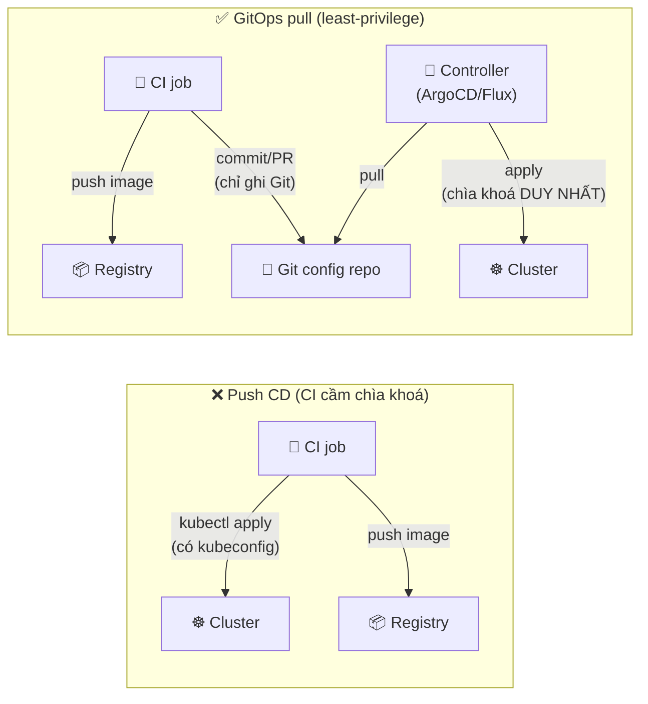

# Security, Observability & DR cho GitOps

> **Tác giả:** Mr.Rom\
> **Phiên bản:** v1.0.0\
> **Tạo lúc:** 13/06/2026\
> **Cập nhật:** 13/06/2026\
> **Level:** Intermediate\
> **Tags:** gitops, security, least-privilege, signed-commit, image-signing, admission, rbac, observability, metrics, alerting, disaster-recovery, backup, argocd, flux\
> **Yêu cầu trước:** [Multi-Cluster & Multi-Tenancy](03_multi-cluster-and-multi-tenancy.md)

> 🎯 *Cả cụm intermediate đến giờ đã dạy Acme Shop cách "phình to" GitOps: quản hàng loạt app (App-of-Apps/ApplicationSet), deploy an toàn (canary/blue-green), và cô lập nhiều team trên nhiều cluster. Nhưng còn ba câu hỏi sống còn chưa trả lời: ai được phép đổi gì (**security**), làm sao biết chính cái controller GitOps đang ốm (**observability**), và nếu cluster ArgoCD/Flux bốc hơi lúc 3h sáng thì dựng lại bằng cách nào (**disaster recovery**). Sau bài này bạn sẽ siết quyền theo least-privilege, ký + verify commit, chặn image chưa ký ở admission, gắn metrics + alert cho chính controller, và viết được một quy trình DR khôi phục cả hệ GitOps từ Git.*

## 🎯 Sau bài này bạn sẽ

- [ ] Áp dụng **least-privilege**: CI không cầm credential cluster, chỉ commit Git — cluster do controller pull
- [ ] Siết **AppProject** + **RBAC** chặt để mỗi team chỉ đụng được app/namespace/repo của mình
- [ ] Bật **signed commit** + verify chữ ký ở GitOps controller, và **image signature verify** ở admission
- [ ] Hiểu vì sao **không bao giờ để secret thô** trong Git, link về cơ chế đã học
- [ ] Gắn **observability cho chính controller**: scrape metrics ArgoCD/Flux, dựng dashboard, alert khi `OutOfSync`/`Degraded`
- [ ] Viết được **quy trình DR**: backup `Application`/`AppProject` + cluster secret, bootstrap lại + sync để khôi phục

---

## Ba lỗ hổng mà một hệ GitOps "chạy ngon" vẫn có

Acme Shop đã có một hệ GitOps đáng nể: ApplicationSet sinh ra hàng chục app, Argo Rollouts lo canary, mỗi team một AppProject riêng trên ba cluster. Nhìn dashboard ArgoCD toàn màu xanh `Healthy`. Tưởng xong.

Rồi ba chuyện xảy ra trong một quý:

- Một developer bị lộ **personal access token** dùng trong GitHub Actions. Token đó có quyền `kubectl apply` thẳng vào production (vì pipeline cũ vẫn push trực tiếp). Kẻ tấn công dùng nó deploy một crypto-miner vào cluster — không qua Git, không ai review, không để lại dấu trong lịch sử Git.
- Một đêm ArgoCD bị kẹt: nó *ngừng reconcile* vì repo-server hết bộ nhớ, nhưng dashboard vẫn hiện trạng thái cũ là `Synced`. Suốt 6 tiếng mọi commit mới *không* được apply. Không ai biết, vì **chẳng có alert nào theo dõi chính ArgoCD**.
- Cluster quản trị (nơi chạy ArgoCD) bị xoá nhầm cả namespace `argocd`. May là app vẫn chạy ở cluster đích, nhưng **không còn ai reconcile** — drift bắt đầu tích tụ, và không ai biết phải dựng lại ArgoCD thế nào cho khớp trạng thái cũ.

Ba sự cố này có một điểm chung: chúng **không phải lỗi app**. Chúng là lỗ hổng ở *lớp vận hành GitOps* — phần mà người ta hay quên vì "nó chạy rồi". Bài này bịt đúng ba lỗ đó: siết **bảo mật** (ai đổi được gì, đổi qua đường nào), gắn **observability cho chính controller** (biết khi GitOps ốm), và chuẩn bị **disaster recovery** (dựng lại cả hệ từ Git).

> [!NOTE]
> Bài lấy **ArgoCD** làm ví dụ chính vì có UI/CLI dễ quan sát, nhưng mọi khái niệm đều có tương đương trong **Flux** — chỉ khác tên CRD và component. Chỗ nào khác biệt đáng kể, mình sẽ chỉ rõ cả hai.

---

## 1️⃣ Least-privilege — CI chỉ commit Git, không cầm chìa khoá cluster

Lỗ hổng đầu tiên (crypto-miner) đến từ một thói quen sót lại của thời "push CD": **CI cầm credential cluster**. Đây là điều GitOps pull model sinh ra để xoá bỏ — nhưng nhiều team chuyển sang GitOps mà *vẫn* để CI có quyền `kubectl`, thành ra có cả hai cửa.

Nguyên tắc nền tảng là **least-privilege** (đặc quyền tối thiểu): mỗi thành phần chỉ có *đúng* quyền nó cần, không hơn. Áp vào GitOps, ranh giới quyền rất rõ:

- **CI** (GitHub Actions, GitLab CI...) chỉ cần quyền: build image → push registry → **commit/PR vào Git repo cấu hình**. Hết. CI **không** được có kubeconfig hay quyền `kubectl apply` lên cluster đích.
- **GitOps controller** (ArgoCD/Flux) là thứ *duy nhất* có quyền ghi vào cluster. Nó pull từ Git rồi apply.

🪞 **Ẩn dụ đời thường**: hãy hình dung cluster là **két sắt trong ngân hàng**. Mô hình push CD cũ giống đưa cho mỗi nhân viên giao hàng (CI job) một chìa khoá két — ai cầm chìa cũng mở được, mất chìa là mất tiền. Mô hình GitOps least-privilege giống: nhân viên giao hàng chỉ được **bỏ phiếu yêu cầu vào khe** (commit Git), còn **một thủ quỹ duy nhất** (controller) đọc phiếu rồi tự mở két. Mất "phiếu" thì cũng chỉ là một yêu cầu chờ duyệt, không phải chìa khoá két.

Sơ đồ dưới so sánh hai luồng quyền — đây là khái niệm trừu tượng nhất của phần bảo mật, hãy nhìn kỹ "ai chạm được vào cluster":



→ Điểm cốt lõi: ở luồng pull, **không có mũi tên nào** đi thẳng từ CI vào cluster. Credential cluster chỉ tồn tại ở một chỗ duy nhất — controller. Lộ token CI thì hậu quả tệ nhất là "đẩy được một commit xấu vào Git", mà commit còn phải qua PR review + branch protection nữa.

Thực thi nguyên tắc này không phải bằng config GitOps, mà bằng việc **không cấp** quyền cho CI ngay từ đầu. Cụ thể:

- **Gỡ mọi `KUBECONFIG`/`KUBE_TOKEN` secret** khỏi CI. Nếu một job CI vẫn cần `kubectl` (hiếm), giới hạn nó bằng ServiceAccount RBAC chỉ-đọc.
- CI chỉ giữ: credential push registry (scope hẹp theo repo) + một token Git để commit vào repo cấu hình (tốt nhất là **deploy key** hoặc **GitHub App** giới hạn đúng repo đó).
- **Branch protection** trên repo cấu hình: bắt buộc PR, bắt buộc review từ người *khác* tác giả, chặn force-push lên `main`.

> [!WARNING]
> Sai lầm phổ biến nhất khi "chuyển sang GitOps": cài ArgoCD xong nhưng **quên gỡ** quyền `kubectl apply` của pipeline cũ. Lúc đó bạn có *hai* đường ghi vào cluster — và đường cũ (CI) chính là đường không qua review, không có audit trail, kẻ tấn công thích nhất. GitOps chỉ an toàn khi nó là đường **duy nhất**.

---

## 2️⃣ AppProject + RBAC — cô lập team ở tầng controller

Least-privilege không dừng ở "CI vs controller". Bản thân *bên trong* ArgoCD cũng cần phân quyền: team Payment không được sync app của team Search, dev không deploy thẳng vào `production`, không ai trỏ Application vào một repo lạ chứa chart độc.

Bạn đã gặp **AppProject** ở [bài Multi-Cluster & Multi-Tenancy](03_multi-cluster-and-multi-tenancy.md) như công cụ cô lập team. Ở đây ta nhìn nó dưới lăng kính **bảo mật**: AppProject là *hàng rào* (guardrail) giới hạn một nhóm Application được phép làm gì, còn RBAC là *danh sách ai được bấm nút gì*.

### 2.1 AppProject — giới hạn "được deploy gì, đi đâu, từ repo nào"

Project `default` mặc định cho phép *mọi thứ* (`*`) — tiện lúc thử nghiệm nhưng cực kỳ nguy hiểm cho production. Mỗi team nên có AppProject riêng với ba whitelist quan trọng: nguồn repo, đích deploy, và loại resource được tạo. Đọc kỹ comment từng khối:

```yaml
# AppProject cho team Payment — hàng rào bảo mật, không cho vượt rào
apiVersion: argoproj.io/v1alpha1
kind: AppProject
metadata:
  name: team-payment
  namespace: argocd
spec:
  description: "App cua team Payment — chi pham vi payment-*"
  # 1. CHỈ cho phép app trong project lấy config từ các repo này
  sourceRepos:
    - https://github.com/acme/payment-config
  # 2. CHỈ cho deploy vào namespace payment-* (chặn deploy nhầm vào production chung)
  destinations:
    - namespace: "payment-*"
      server: https://kubernetes.default.svc
  # 3. Chặn tạo resource cấp cluster nguy hiểm (ClusterRole, CRD...)
  clusterResourceWhitelist: []
  # 4. Cho phép mọi resource cấp namespace bình thường
  namespaceResourceWhitelist:
    - group: "*"
      kind: "*"
```

→ Với hàng rào này, dù một Application của team Payment *cố* trỏ `repoURL` sang repo lạ hoặc deploy vào `kube-system`, ArgoCD sẽ **từ chối sync** vì vi phạm whitelist. `clusterResourceWhitelist: []` (rỗng) đặc biệt quan trọng: nó chặn team tự tạo `ClusterRole`/`CRD` — những thứ có thể leo thang đặc quyền ra toàn cluster.

### 2.2 RBAC — ai được sync app nào

AppProject giới hạn *app làm được gì*; RBAC giới hạn *người làm được gì với app*. ArgoCD đọc RBAC từ ConfigMap `argocd-rbac-cm`, dạng policy CSV. Ý tưởng: ánh xạ nhóm SSO (GitHub/Okta team) vào role, role gắn vào project cụ thể.

```yaml
# argocd-rbac-cm — phân quyền theo nhóm SSO, mặc định chỉ-đọc
apiVersion: v1
kind: ConfigMap
metadata:
  name: argocd-rbac-cm
  namespace: argocd
data:
  # Mặc định: ai chưa được gán role gì → chỉ xem, không sửa
  policy.default: role:readonly
  policy.csv: |
    # Dev team Payment: chỉ xem + sync app trong project team-payment
    p, role:payment-dev, applications, get,  team-payment/*, allow
    p, role:payment-dev, applications, sync, team-payment/*, allow
    # KHÔNG cho payment-dev quyền delete app hay đụng project khác
    # Gán nhóm SSO "acme:payment" vào role trên
    g, acme:payment, role:payment-dev
  scopes: "[groups]"
```

→ Kết quả: thành viên nhóm `acme:payment` chỉ `get` + `sync` được app trong `team-payment`, không `delete`, không chạm tới project khác. Mọi người ngoài nhóm rơi về `role:readonly` (chỉ xem). Đây là least-privilege ở tầng người dùng — kết hợp với AppProject tạo thành hai lớp rào: rào *máy* (project) và rào *người* (RBAC).

> [!TIP]
> Flux không có RBAC riêng — nó **dựa thẳng vào Kubernetes RBAC**. Mỗi tenant Flux được giới hạn bằng một `ServiceAccount` + `Role`/`RoleBinding` trong namespace của họ, và `Kustomization` chạy với `spec.serviceAccountName` đó. Cùng triết lý least-privilege, chỉ khác là tận dụng RBAC sẵn có của K8s thay vì lớp riêng.

---

## 3️⃣ Signed commit — verify "ai thực sự viết Git"

Branch protection chặn được "ai *push* lên main", nhưng có một câu hỏi tinh vi hơn: làm sao chắc commit đó *thật sự* do người được phép viết, chứ không phải kẻ giả mạo `git config user.email`? Trong Git, tên tác giả chỉ là một chuỗi text — ai cũng đặt được. Đây là chỗ **signed commit** vào cuộc.

**Signed commit** (commit có chữ ký) — lập trình viên ký commit bằng khoá riêng (GPG hoặc SSH key), tạo ra một chữ ký mật mã không giả được. Git server verify chữ ký với khoá công khai đã đăng ký. Vì repo cấu hình là *nguồn chân lý* của cả cluster, ký commit nghĩa là: chỉ commit từ người có khoá hợp lệ mới được coi là "ý muốn chính thống".

Lập trình viên bật ký commit bằng SSH key (cách đơn giản, dùng lại khoá SSH sẵn có):

```bash
# 1. Cấu hình Git ký commit bằng SSH key (đơn giản hơn GPG)
git config --global gpg.format ssh
git config --global user.signingkey ~/.ssh/id_ed25519.pub

# 2. Bật tự động ký mọi commit
git config --global commit.gpgsign true

# 3. Commit như bình thường — giờ đã được ký
git commit -m "chore: scale payment-api len 5 replicas"
```

Phía GitOps controller, ta có thể bắt buộc *chỉ chấp nhận commit đã ký từ khoá tin cậy*. Trong ArgoCD, cấu hình này nằm ở **AppProject** qua trường `signatureKeys` — và khoá công khai được khai báo trong ConfigMap `argocd-gpg-keys-cm`:

```yaml
# AppProject yêu cầu commit phải được ký bởi khoá tin cậy
apiVersion: argoproj.io/v1alpha1
kind: AppProject
metadata:
  name: team-payment
  namespace: argocd
spec:
  description: "Payment — chi sync commit da ky"
  sourceRepos:
    - https://github.com/acme/payment-config
  destinations:
    - namespace: "payment-*"
      server: https://kubernetes.default.svc
  # CHỈ sync revision được ký bởi các GPG key ID dưới đây
  signatureKeys:
    - keyID: 4AEE18F83AFDEB23
```

→ Khi bật `signatureKeys`, ArgoCD sẽ **từ chối sync** bất kỳ commit nào không mang chữ ký hợp lệ từ khoá đã liệt kê. Kẻ tấn công dù đẩy được commit vào Git (qua token lộ) cũng không sync được, vì không có khoá ký. Đây là lớp phòng thủ *sâu hơn* branch protection: nó verify ngay tại điểm controller đọc Git.

> [!NOTE]
> ArgoCD verify chữ ký **GPG** cho commit/tag. Việc lập trình viên ký bằng SSH key (như lệnh trên) tiện cho phía GitHub UI hiển thị "Verified"; còn để ArgoCD `signatureKeys` chặn ở tầng sync thì khoá ký cần là **GPG key** đã nạp vào `argocd-gpg-keys-cm`. Trong thực tế, nhiều team dùng song song: SSH-sign cho dev tiện + branch protection "require signed commits", và để ArgoCD GPG-verify cho các project nhạy cảm nhất.

---

## 4️⃣ Image signature verify ở admission — chặn image lạ vào cluster

Signed commit bảo vệ *cấu hình* (Git nói đúng). Nhưng còn *artifact* mà cấu hình trỏ tới — cái **image** — thì sao? Một Application hoàn toàn hợp lệ, ký đầy đủ, vẫn có thể trỏ `image: evil.com/backdoor:latest`. GitOps controller chỉ lo "cluster khớp Git", nó **không kiểm tra image có đáng tin không**.

Chốt chặn cuối cùng nằm ở **admission controller** — lớp gác cổng của chính Kubernetes API server, kiểm tra mọi resource *trước khi* nó được tạo. Ta dùng nó để bắt buộc: **chỉ image đã ký bởi khoá Acme Shop mới được chạy**.

Cơ chế này (ký image bằng `cosign`, verify ở admission bằng policy engine như Kyverno/Sigstore policy-controller) đã được dạy chi tiết ở [Image Signing & Scanning](../../../container-registry/lessons/01_basic/03_image-signing-and-scanning.md) và [Policy & Admission](../../../container-registry/lessons/02_intermediate/03_policy-and-admission-enforcement.md). Ở đây ta chỉ ghép nó vào *vị trí GitOps*: nó là lớp gác **sau** controller, **trong** cluster.

Một policy Kyverno verify image ký bằng cosign trông như sau — bắt mọi Pod trong namespace `payment-*` phải dùng image có chữ ký hợp lệ:

```yaml
# Kyverno ClusterPolicy: chỉ cho image ĐÃ KÝ của Acme chạy
apiVersion: kyverno.io/v1
kind: ClusterPolicy
metadata:
  name: verify-acme-images
spec:
  validationFailureAction: Enforce   # Enforce = chặn; Audit = chỉ ghi log
  # Lưu ý: ở Kyverno mới, `spec.validationFailureAction` đang dần được thay bằng
  # per-rule `spec.rules[*].verifyImages[*].failureAction`. Trường này vẫn còn
  # hoạt động nên ví dụ vẫn chạy đúng; chỉ là khuyến nghị mới ưu tiên per-rule.
  webhookTimeoutSeconds: 30
  rules:
    - name: check-payment-images
      match:
        any:
          - resources:
              kinds:
                - Pod
              namespaces:
                - "payment-*"
      verifyImages:
        - imageReferences:
            - "ghcr.io/acme/*"
          attestors:
            - entries:
                - keys:
                    publicKeys: |-
                      -----BEGIN PUBLIC KEY-----
                      MFkwEwYHKoZIzj0CAQYIKoZIzj0DAQcDQgAE...
                      -----END PUBLIC KEY-----
```

→ Với policy `Enforce`, nếu ArgoCD sync một Deployment trỏ tới image chưa ký (hoặc ký bằng khoá lạ), admission controller **từ chối tạo Pod** — sync của ArgoCD sẽ báo lỗi, image độc không bao giờ chạy. Đây là điểm đẹp của kiến trúc: GitOps lo "đúng Git", admission lo "đúng artifact tin cậy" — hai mối quan tâm tách bạch, bổ trợ nhau.

🪞 Ẩn dụ: nếu signed commit là "kiểm tra chữ ký trên *đơn đặt hàng*", thì image verify ở admission là "kiểm tra niêm phong trên *kiện hàng thực tế*" ngay tại cửa kho. Đơn hàng thật mà hàng giả thì vẫn bị chặn ở cửa.

---

## 5️⃣ Không bao giờ để secret thô trong Git

Có một loại "image độc" còn âm thầm hơn: **secret bị commit thô vào Git**. Vì Git là nguồn chân lý của GitOps, mọi thứ trong repo đều bị đọc bởi controller *và* bởi bất kỳ ai có quyền đọc repo — kể cả lịch sử. Một password DB lỡ commit là lộ *vĩnh viễn* (Git history bất biến), kể cả khi bạn xoá file ở commit sau.

Đây là vấn đề đủ lớn để có hẳn một bài riêng: [Secrets trong GitOps](../01_basic/03_secrets-in-gitops.md) đã dạy ba cơ chế chuẩn — **Sealed Secrets** (mã hoá secret trước khi commit, chỉ controller trong cluster giải được), **SOPS** (mã hoá theo trường, dùng KMS/age), và **External Secrets** (Git chỉ chứa *con trỏ* tới secret nằm trong Vault/AWS Secrets Manager). Ở góc độ bảo mật của bài này, chỉ cần khắc cốt một quy tắc:

> [!CAUTION]
> Tuyệt đối **không** commit secret thô (password, API key, private key, kubeconfig) vào repo GitOps — kể cả repo private. Git history bất biến nghĩa là một lần lộ là lộ mãi mãi. Luôn dùng Sealed Secrets / SOPS / External Secrets, và bật **secret scanning** (gitleaks/trufflehog) ở pre-commit + CI để chặn ngay từ lúc commit.

→ Nguyên tắc gói gọn: repo GitOps được phép chứa secret **đã mã hoá** (Sealed/SOPS) hoặc **con trỏ** tới secret (External Secrets), không bao giờ chứa secret **plaintext**. Cách triển khai cụ thể nằm ở bài secrets — đây chỉ là cây cọc cắm trong bức tranh bảo mật tổng thể.

---

## 6️⃣ Observability cho chính controller — biết khi GitOps ốm

Chuyển sang lỗ hổng thứ hai trong sự cố đầu bài: ArgoCD *ngừng reconcile* 6 tiếng mà không ai biết. Đây là điểm mù kinh điển: team gắn metrics/alert cho *app* rất kỹ, nhưng quên rằng **chính GitOps controller cũng là một service có thể chết**. Nếu controller ngừng reconcile, cluster đóng băng ở trạng thái cũ — và bạn không hề hay.

🪞 Ẩn dụ: controller GitOps giống **người gác đèn hải đăng**. Nó canh cho cả đoàn tàu (app) đi đúng. Nhưng nếu *người gác* ngủ quên mà không ai kiểm tra người gác, cả đoàn tàu vẫn tưởng có đèn dẫn đường. Observability cho controller chính là "camera giám sát người gác đèn".

### 6.1 Ba nhóm metrics quan trọng nhất

Cả ArgoCD và Flux đều expose metrics dạng **Prometheus** (đã học ở [Metrics with Prometheus](../../../observability/lessons/01_basic/01_metrics-prometheus.md)). Trong rừng metrics, ba nhóm này trả lời ba câu hỏi sống còn về sức khoẻ GitOps:

| Nhóm metric | Câu hỏi nó trả lời | Metric ArgoCD tiêu biểu |
|---|---|---|
| **App health** | App có đang `Degraded` không? | `argocd_app_info{health_status="Degraded"}` |
| **Sync status** | App có bị `OutOfSync` lâu không? | `argocd_app_info{sync_status="OutOfSync"}` |
| **Reconcile duration** | Vòng reconcile có chậm/treo không? | `argocd_app_reconcile_bucket` (histogram) |

→ Ba nhóm này map đúng vào ba thứ "có thể hỏng": app chạy lỗi (health), cluster lệch Git mà không tự sửa (sync), và bản thân loop reconcile chậm dần tới treo (duration). Theo dõi reconcile duration đặc biệt quan trọng — nó là *chỉ báo sớm* cho sự cố "ArgoCD ngừng reconcile": duration tăng vọt trước khi controller chết hẳn.

> [!NOTE]
> Phía **Flux**, các controller (`source-controller`, `kustomize-controller`, `helm-controller`) expose metric `gotk_reconcile_duration_seconds` (histogram) và `gotk_reconcile_condition` (trạng thái Ready/Suspended của mỗi resource). Khái niệm y hệt ArgoCD — chỉ khác tiền tố `gotk_` (GitOps Toolkit) và việc Flux phân nhỏ thành nhiều controller.

### 6.2 Cho Prometheus scrape metrics controller

Metrics chỉ hữu ích khi được Prometheus *thu thập* đều đặn. ArgoCD expose metrics ở cổng `8082` trên service `argocd-metrics` (và `argocd-server-metrics`, `argocd-repo-server`). Cách gọn nhất là tạo một `ServiceMonitor` (CRD của Prometheus Operator) để Prometheus tự phát hiện và scrape:

```yaml
# ServiceMonitor — bảo Prometheus scrape metrics của application-controller
apiVersion: monitoring.coreos.com/v1
kind: ServiceMonitor
metadata:
  name: argocd-metrics
  namespace: argocd
  labels:
    release: kube-prometheus-stack   # khớp serviceMonitorSelector của Prometheus
spec:
  selector:
    matchLabels:
      app.kubernetes.io/name: argocd-metrics
  endpoints:
    - port: metrics      # cổng 8082 của service argocd-metrics
      interval: 30s      # scrape mỗi 30 giây
```

→ Sau khi apply, Prometheus tự thêm `argocd-metrics` vào danh sách target và bắt đầu thu metric mỗi 30 giây. Từ đây mọi metric `argocd_app_*` đã có trong Prometheus, sẵn sàng cho dashboard và alert. Label `release: kube-prometheus-stack` phải khớp `serviceMonitorSelector` mà Prometheus Operator của bạn cấu hình — nếu không, ServiceMonitor sẽ bị bỏ qua âm thầm.

### 6.3 Dashboard Grafana

Có metric rồi, [Grafana](../../../observability/lessons/01_basic/04_grafana-and-alerting.md) cho ta bức tranh trực quan. ArgoCD có sẵn dashboard chính thức (ID `14584` trên grafana.com) hiển thị số app theo health/sync status, reconcile duration, và lỗi sync gần đây. Import nhanh bằng tay: vào Grafana → Dashboards → Import → nhập ID `14584` → chọn datasource Prometheus.

Một panel tự dựng đơn giản nhưng cực giá trị: **đếm số app đang `OutOfSync`** — nếu con số này lớn hơn 0 lâu, có gì đó không tự sync được. Query PromQL:

```promql
# Số Application đang OutOfSync (lý tưởng = 0)
sum(argocd_app_info{sync_status="OutOfSync"})
```

→ Đặt panel này to, ngay đầu dashboard "GitOps Health". Mắt nhìn vào là biết ngay hệ thống có đang "trôi" không, không cần đọc từng app. Tương tự, một panel `sum(argocd_app_info{health_status="Degraded"})` cho biết bao nhiêu app đang ốm.

### 6.4 Alert khi OutOfSync/Degraded — hai tầng

Dashboard chỉ hữu ích khi *có người đang nhìn*. Lúc 3h sáng thì không ai nhìn — nên cần **alert tự động**. Có hai tầng alert bổ trợ nhau:

**Tầng 1 — Prometheus Alertmanager** (cảnh báo dựa trên metric). Đây là tầng phát hiện cả khi *chính ArgoCD chết* (vì nó nhìn từ ngoài, qua Prometheus):

```yaml
# PrometheusRule — alert khi có app OutOfSync/Degraded kéo dài, hoặc ArgoCD biến mất
apiVersion: monitoring.coreos.com/v1
kind: PrometheusRule
metadata:
  name: argocd-health
  namespace: argocd
  labels:
    release: kube-prometheus-stack
spec:
  groups:
    - name: argocd.rules
      rules:
        # App OutOfSync quá 15 phút → có gì đó không tự sync
        - alert: ArgoCDAppOutOfSync
          expr: argocd_app_info{sync_status="OutOfSync"} == 1
          for: 15m
          labels:
            severity: warning
          annotations:
            summary: "App {{ $labels.name }} OutOfSync qua 15 phut"
        # App Degraded quá 10 phút → app đang ốm
        - alert: ArgoCDAppDegraded
          expr: argocd_app_info{health_status="Degraded"} == 1
          for: 10m
          labels:
            severity: critical
          annotations:
            summary: "App {{ $labels.name }} dang Degraded"
        # Không scrape được metric ArgoCD → chính ArgoCD có thể đã chết
        - alert: ArgoCDControllerDown
          expr: up{job="argocd-metrics"} == 0
          for: 5m
          labels:
            severity: critical
          annotations:
            summary: "Khong scrape duoc metric ArgoCD — controller co the da chet"
```

→ Alert `ArgoCDControllerDown` chính là thứ thiếu trong sự cố đầu bài: nó dùng `up == 0` (Prometheus không scrape được target) để phát hiện *chính ArgoCD đã chết* — điều mà alert dựa trên metric nội bộ ArgoCD không bao giờ bắt được (vì ArgoCD chết thì lấy đâu metric để báo). Đây là lý do tầng Prometheus *bắt buộc* phải có.

**Tầng 2 — ArgoCD Notifications** (thông báo sự kiện từ chính ArgoCD). Tiện cho thông báo "deploy xong", "sync failed" tới Slack, nhưng nó *im lặng* nếu ArgoCD chết — nên chỉ là bổ trợ:

```yaml
# argocd-notifications-cm — báo Slack khi sync thất bại / app degraded
apiVersion: v1
kind: ConfigMap
metadata:
  name: argocd-notifications-cm
  namespace: argocd
data:
  service.slack: |
    token: $slack-token
  trigger.on-sync-failed: |
    - when: app.status.operationState.phase in ['Error', 'Failed']
      send: [app-sync-failed]
  trigger.on-health-degraded: |
    - when: app.status.health.status == 'Degraded'
      send: [app-health-degraded]
  template.app-sync-failed: |
    message: "App {{.app.metadata.name}} sync FAILED."
  template.app-health-degraded: |
    message: "App {{.app.metadata.name}} dang Degraded."
```

→ Quy tắc vàng: **tầng 1 (Prometheus) là bắt buộc** vì nó nhìn từ bên ngoài, bắt được cả khi controller chết. **Tầng 2 (ArgoCD Notifications) là bổ trợ** cho thông báo sự kiện tức thì. Có cả hai mới phủ kín — chỉ có tầng 2 thì y hệt lắp chuông báo cháy *bên trong* căn nhà đang cháy.

---

## 7️⃣ Disaster recovery — dựng lại cả hệ GitOps từ Git

Lỗ hổng thứ ba: cluster quản trị (chạy ArgoCD) bị xoá sạch namespace `argocd`. Tin tốt là GitOps có một tính chất khiến DR *dễ hơn* hầu hết hệ thống khác: **controller gần như stateless**.

### 7.1 Vì sao ArgoCD/Flux gần như stateless

Hãy nghĩ kỹ ArgoCD lưu *cái gì*:

- **Desired state** (app nào, deploy gì) → nằm trong **Git**, không nằm trong ArgoCD.
- **Live state** (app đang chạy ra sao) → nằm trong **cluster đích**, ArgoCD chỉ *quan sát*.
- ArgoCD tự lưu rất ít: chủ yếu là **danh sách `Application`/`AppProject`** (chính là CRD trong cluster, mà CRD đó *cũng nên* nằm trong Git theo app-of-apps) + **credential kết nối tới Git và các cluster đích** (dạng Secret).

🪞 Ẩn dụ: ArgoCD giống một **đầu đọc đĩa CD**. Toàn bộ "nhạc" (desired state) nằm trên đĩa (Git), không trong đầu đọc. Đầu đọc cháy thì mua cái mới, nhét đĩa cũ vào là phát lại y nguyên. Thứ duy nhất cần giữ riêng là "danh sách đĩa nào ở ngăn nào" (Application manifest) và "chìa khoá tủ đĩa" (cluster secret). Đó là toàn bộ "state" cần backup.

→ Hệ quả tuyệt vời: khôi phục ArgoCD = **cài lại ArgoCD trống + nạp lại Application/AppProject + nạp lại cluster secret → để nó tự sync**. Vì desired state vẫn nguyên trong Git, sau khi sync xong cluster đích trở về *đúng* trạng thái trước sự cố. Không cần "restore database" như hệ stateful.

### 7.2 Backup — đúng hai thứ cần giữ

Vì state ít, backup cũng gọn. Hai thứ *bắt buộc* backup:

1. **`Application` + `AppProject` manifest**: lý tưởng nhất là chúng đã nằm trong Git (theo pattern app-of-apps đã học ở [bài App-of-Apps & ApplicationSet](01_app-of-apps-and-applicationset.md)) — khi đó "backup" gần như miễn phí, vì Git chính là backup. Nếu vẫn còn app tạo bằng tay (chưa vào Git), export định kỳ:

```bash
# Export toàn bộ Application + AppProject ra file YAML (backup vào kho an toàn)
kubectl get applications,appprojects -n argocd -o yaml > argocd-apps-backup.yaml
```

2. **Cluster secret + repo credential**: đây là phần *không* nằm trong Git (vì là secret), nên *phải* backup riêng. ArgoCD lưu chúng dạng Secret có label `argocd.argoproj.io/secret-type`:

```bash
# Backup các secret cluster + repo của ArgoCD (cần để kết nối lại Git + cluster đích)
kubectl get secret -n argocd \
  -l argocd.argoproj.io/secret-type \
  -o yaml > argocd-secrets-backup.yaml
```

> [!CAUTION]
> File `argocd-secrets-backup.yaml` chứa credential thật (token Git, kubeconfig cluster đích) ở dạng base64 — *không* phải mã hoá. Cất nó vào nơi an toàn (Vault, S3 bucket có mã hoá + giới hạn quyền), **tuyệt đối không** commit vào Git. Đây là ngoại lệ duy nhất của quy tắc "mọi thứ vào Git" — vì chính nó là chìa khoá vào mọi cluster.

> [!TIP]
> ArgoCD có sẵn lệnh export/import gói gọn toàn bộ trạng thái: `argocd admin export -n argocd > backup.yaml` (export cả Application, AppProject, lẫn config/secret) và `argocd admin import -n argocd - < backup.yaml` (nạp lại). Tiện cho backup định kỳ tự động bằng CronJob.

### 7.3 Quy trình DR — bootstrap lại + sync

Khi cluster quản trị mất, quy trình khôi phục đi theo bốn bước. Mấu chốt: vì desired state ở Git, bước cuối cùng (sync) tự kéo mọi thứ về đúng — bạn không phải dựng lại từng app bằng tay.

```bash
# === QUY TRÌNH DR: khôi phục ArgoCD sau khi cluster quản trị mất ===

# 1. Cài lại ArgoCD TRỐNG vào cluster mới (hoặc namespace mới)
kubectl create namespace argocd
kubectl apply -n argocd \
  -f https://raw.githubusercontent.com/argoproj/argo-cd/stable/manifests/install.yaml
kubectl wait --for=condition=available --timeout=300s \
  -n argocd deployment/argocd-server

# 2. Nạp lại cluster secret + repo credential (chìa khoá để kết nối Git + cluster đích)
kubectl apply -f argocd-secrets-backup.yaml

# 3. Nạp lại Application + AppProject (danh sách app cần quản)
#    Nếu app đã ở Git theo app-of-apps: chỉ cần apply 1 root app, nó tự kéo phần còn lại
kubectl apply -f argocd-apps-backup.yaml

# 4. Để ArgoCD tự sync — desired state vẫn nguyên trong Git → cluster về đúng trạng thái cũ
argocd app sync -l argocd.argoproj.io/instance
```

→ Sau bước 4, ArgoCD đọc Git, so với cluster đích, và apply phần thiếu. Vì *cluster đích* thường vẫn chạy app (chỉ *controller* mất), reconcile chủ yếu là "ArgoCD nối lại quyền quản" chứ không phải deploy lại từ đầu. Nếu cả cluster đích cũng mất, bước 4 vẫn đúng — chỉ là sync sẽ deploy lại toàn bộ app từ Git.

> [!IMPORTANT]
> DR không phải thứ "viết runbook rồi để đó". Hãy **diễn tập** (DR drill) định kỳ: dựng một cluster nháp, chạy đúng bốn bước trên, xác nhận app về `Synced`/`Healthy`. Một runbook chưa từng chạy thử là một runbook *chưa biết có đúng không* — và bạn không muốn phát hiện nó sai lúc 3h sáng đang cháy nhà.

### 7.4 So sánh độ stateful — vì sao GitOps "dễ DR"

Để thấy rõ lợi thế, đặt cạnh các hệ khác:

| Hệ thống | State sống ở đâu | DR khó/dễ |
|---|---|---|
| Database (Postgres) | Trong chính nó (data file) | **Khó** — phải backup/restore data, lo consistency, lo mất giao dịch |
| App stateful (có PVC) | Trong volume | **Trung bình** — backup volume + restore đúng thứ tự |
| **GitOps controller** | **Trong Git (desired) + cluster đích (live)** | **Dễ** — cài lại trống + nạp secret/app + sync; desired không bao giờ mất nếu Git còn |

→ Bảng cho thấy đòn bẩy thật của GitOps: vì nó **không tự giữ desired state**, mất controller không bằng mất dữ liệu. Điều này biến DR từ "dự án khủng khiếp" thành "bốn lệnh + một backup secret". Điều kiện duy nhất: **Git phải còn** — nên Git repo cấu hình *bản thân nó* cần được backup/mirror đàng hoàng (GitHub đã replicate, nhưng team nghiêm túc vẫn mirror sang nơi thứ hai).

---

## 8️⃣ Tổng kết best practice — đóng cụm GitOps

Đây là bài cuối của cả cụm GitOps. Gom lại những nguyên tắc xuyên suốt từ basic tới intermediate thành một bộ "luật vận hành" để Acme Shop sống yên:

| Trụ cột | Nguyên tắc cốt lõi | Cơ chế cụ thể |
|---|---|---|
| **Least-privilege** | CI chỉ commit Git, controller là đường ghi *duy nhất* vào cluster | Gỡ kubeconfig khỏi CI; deploy key/GitHub App scope hẹp |
| **Cô lập** | Mỗi team một rào máy + rào người | AppProject (whitelist repo/dest/resource) + RBAC theo nhóm SSO |
| **Tin cậy nguồn** | Verify cả *cấu hình* lẫn *artifact* | Signed commit (`signatureKeys`) + image verify ở admission (Kyverno/cosign) |
| **Bảo mật secret** | Không bao giờ plaintext trong Git | Sealed Secrets / SOPS / External Secrets + secret scanning |
| **Observability** | Giám sát *chính controller*, không chỉ app | ServiceMonitor scrape metric + alert 2 tầng (Prometheus bắt buộc + Notifications bổ trợ) |
| **DR** | Tận dụng tính gần-stateless | Backup Application/AppProject + cluster secret; quy trình bootstrap lại + sync; DR drill định kỳ |

→ Sợi chỉ đỏ xuyên cả sáu trụ cột: **Git là nguồn chân lý, và mọi thứ khác phải bảo vệ/quan sát quanh nó**. Bảo mật là "ai được đổi Git và Git nói gì có đáng tin không"; observability là "controller có đang biến Git thành hiện thực không"; DR là "nếu mất controller, Git vẫn dựng lại được tất cả". Hiểu được sợi chỉ này là bạn đã nắm tinh thần GitOps ở mức vận hành thật sự, không chỉ "cài ArgoCD cho có".

---

## 💡 Cạm bẫy thường gặp & Best practice

### ❌ Cạm bẫy: chuyển sang GitOps nhưng quên gỡ quyền cluster của CI

- **Triệu chứng**: cài ArgoCD/Flux xong, GitOps chạy đẹp, nhưng pipeline cũ *vẫn* có `kubectl apply` thẳng vào prod. Một ngày token CI lộ → kẻ tấn công deploy thẳng vào cluster, không qua Git, không dấu vết.
- **Nguyên nhân**: GitOps chỉ an toàn khi controller là đường ghi *duy nhất*. Để CI còn quyền cluster = có một cửa hậu không review, không audit.
- **Cách tránh**: chủ động **gỡ mọi `KUBECONFIG`/`KUBE_TOKEN`** khỏi CI sau khi GitOps lên. CI chỉ giữ credential push registry + token commit Git (scope hẹp). Kiểm tra lại bằng cách thử `kubectl` từ runner CI — phải fail.

### ❌ Cạm bẫy: chỉ alert app, quên alert chính controller

- **Triệu chứng**: ArgoCD/Flux ngừng reconcile (OOM, kẹt repo-server), cluster đóng băng ở trạng thái cũ nhiều giờ mà không ai biết — dashboard vẫn xanh vì hiển thị state cũ.
- **Nguyên nhân**: alert chỉ dựa trên metric *nội bộ* controller. Controller chết thì không còn metric để báo — alert im lặng đúng lúc cần nhất.
- **Cách tránh**: thêm alert tầng Prometheus dùng `up{job="argocd-metrics"} == 0` (hoặc `gotk_*` cho Flux) để bắt *chính controller chết* từ bên ngoài. Theo dõi thêm reconcile duration tăng vọt như chỉ báo sớm.

### ❌ Cạm bẫy: bật `prune` + xoá nhầm Application/AppProject lúc DR

- **Triệu chứng**: trong lúc khôi phục, nạp lại thiếu một số Application; nếu một root app-of-apps đang bật `prune`, nó tưởng các app thiếu là "đã bị xoá khỏi Git" và prune sạch khỏi cluster đích.
- **Nguyên nhân**: prune hiểu "không có trong desired = phải xoá" — kể cả khi việc thiếu là do backup chưa nạp đủ.
- **Cách tránh**: khi DR, **tắt auto-sync/prune trước** (`argocd app set <root> --sync-policy none`), nạp đủ toàn bộ Application/AppProject, *kiểm tra danh sách đầy đủ* rồi mới bật lại sync. Với resource stateful (PVC) luôn để `Prune=false`.

### ✅ Best practice: hai lớp tin cậy — signed commit + image verify

- **Vì sao**: signed commit chỉ bảo vệ *cấu hình* (Git nói đúng), nhưng cấu hình hợp lệ vẫn có thể trỏ tới image độc. Hai lớp mới phủ kín "đúng ý muốn" *và* "đúng artifact".
- **Cách áp dụng**: bật `signatureKeys` ở AppProject nhạy cảm để chỉ sync commit đã ký; đồng thời đặt Kyverno/policy-controller `Enforce` verify chữ ký cosign cho image. Hai cơ chế ở hai tầng (Git và admission), tách bạch, bổ trợ.

### ✅ Best practice: coi DR là cơ bắp phải tập, không phải tài liệu để cất

- **Vì sao**: GitOps khiến DR *dễ về lý thuyết* (gần stateless), nhưng một runbook chưa chạy thử vẫn có thể sai (thiếu backup secret, sai thứ tự, credential hết hạn). Phát hiện sai lúc thật là thảm hoạ.
- **Cách áp dụng**: lập lịch **DR drill** định kỳ trên cluster nháp — chạy đúng 4 bước (cài trống → nạp secret → nạp app → sync), xác nhận về `Synced`/`Healthy`. Tự động hoá backup (`argocd admin export` qua CronJob) và mirror Git repo sang nơi thứ hai.

---

## 🧠 Tự kiểm tra (Self-check)

**Q1.** Vì sao trong GitOps least-privilege, CI *không* nên có quyền `kubectl apply` lên cluster?

<details>
<summary>💡 Xem giải thích</summary>

Vì trong mô hình pull, **controller là đường ghi duy nhất** vào cluster — nó pull desired state từ Git rồi apply. Nếu CI cũng có quyền cluster, bạn tạo ra một *cửa thứ hai* không qua PR review, không qua branch protection, không có audit trail trong Git. Lộ token CI lúc đó = kẻ tấn công deploy thẳng vào cluster (như crypto-miner trong tình huống đầu bài). Khi gỡ quyền cluster khỏi CI, hậu quả tệ nhất của việc lộ token CI chỉ là "đẩy được một commit xấu vào Git" — mà commit còn phải qua PR review + branch protection mới được merge, rồi controller mới sync. Bề mặt tấn công nhỏ hơn nhiều.

</details>

**Q2.** AppProject và RBAC khác nhau thế nào? Vì sao cần cả hai?

<details>
<summary>💡 Xem giải thích</summary>

- **AppProject** là hàng rào cho *app* (rào máy): giới hạn một nhóm Application được lấy config từ repo nào (`sourceRepos`), deploy vào namespace/cluster nào (`destinations`), tạo loại resource nào (`clusterResourceWhitelist`/`namespaceResourceWhitelist`). Dù người dùng *cố* cũng không vượt rào được.
- **RBAC** (`argocd-rbac-cm`) là hàng rào cho *người* (rào người): ai được `get`/`sync`/`delete` app nào, ánh xạ từ nhóm SSO vào role.

Cần cả hai vì chúng chặn hai loại rủi ro khác nhau: AppProject chặn "app deploy nhầm chỗ / từ repo lạ" (kể cả do cấu hình sai), RBAC chặn "người không phận sự bấm sync app của team khác". Có project mà không RBAC thì ai cũng sync được mọi app; có RBAC mà không project thì người đúng quyền vẫn có thể trỏ app vào repo độc.

</details>

**Q3.** Signed commit và image signature verify ở admission bảo vệ những thứ *khác nhau* nào?

<details>
<summary>💡 Xem giải thích</summary>

- **Signed commit** bảo vệ *cấu hình* — verify rằng commit trong Git (nguồn chân lý) thực sự do người có khoá tin cậy viết, không phải kẻ giả mạo. ArgoCD `signatureKeys` từ chối sync commit không ký hợp lệ.
- **Image signature verify ở admission** bảo vệ *artifact* — verify rằng image mà cấu hình trỏ tới đã được ký bởi khoá tổ chức (cosign), chặn ở admission controller của K8s.

Khác biệt cốt lõi: một cấu hình *hoàn toàn hợp lệ và đã ký* vẫn có thể trỏ tới `evil.com/backdoor:latest`. Signed commit không bắt được điều đó — chỉ image verify ở admission mới chặn. Ngược lại, image verify không biết commit có do người được phép viết không. Hai lớp ở hai tầng (Git và admission), bổ trợ nhau để phủ kín cả "đúng ý muốn" lẫn "đúng hàng".

</details>

**Q4.** Vì sao alert dựa trên metric *nội bộ* ArgoCD không đủ để phát hiện "ArgoCD chết"? Dùng gì thay thế?

<details>
<summary>💡 Xem giải thích</summary>

Vì nếu chính ArgoCD chết (controller crash, repo-server OOM), nó *không còn expose metric* nữa — nên alert dựa trên metric nội bộ ArgoCD sẽ im lặng đúng lúc cần báo nhất. Đây là điểm mù kinh điển: bạn đợi metric báo "có vấn đề", nhưng nguồn metric đã tắt.

Giải pháp là alert *từ bên ngoài*: dùng `up{job="argocd-metrics"} == 0` trong Prometheus. `up == 0` nghĩa là Prometheus *không scrape được* target — tức target (ArgoCD) đã chết hoặc không phản hồi. Vì Prometheus là một hệ riêng quan sát từ ngoài vào, nó vẫn sống và báo được khi ArgoCD chết. Đây là lý do tầng alert Prometheus là *bắt buộc*, còn ArgoCD Notifications chỉ là bổ trợ (nó cũng tắt khi ArgoCD tắt).

</details>

**Q5.** Vì sao DR cho GitOps controller *dễ hơn* DR cho một database? Hai thứ gì *bắt buộc* phải backup?

<details>
<summary>💡 Xem giải thích</summary>

Vì ArgoCD/Flux **gần như stateless**: desired state nằm trong **Git**, live state nằm trong **cluster đích**, controller tự giữ rất ít. Database thì *là* state — mất nó là mất dữ liệu, phải backup/restore data + lo consistency. Controller mất chỉ là mất "đầu đọc đĩa"; "đĩa" (Git) vẫn còn nên cài lại trống + sync là về nguyên trạng.

Hai thứ bắt buộc backup:
1. **`Application` + `AppProject` manifest** — danh sách app cần quản. Lý tưởng là chúng đã ở Git (app-of-apps) thì gần như miễn phí; nếu còn app tạo tay thì `kubectl get applications,appprojects -n argocd -o yaml`.
2. **Cluster secret + repo credential** — đây là phần *không* ở Git (vì là secret), nên phải backup riêng và cất nơi an toàn (không commit). Đây là chìa khoá để controller mới kết nối lại Git + cluster đích.

Quy trình: cài ArgoCD trống → nạp secret → nạp Application/AppProject → `argocd app sync` để Git tự kéo cluster về đúng trạng thái.

</details>

---

## ⚡ Tra cứu nhanh (Cheatsheet)

| Mục đích | Lệnh / Cú pháp |
|---|---|
| Gỡ quyền cluster khỏi CI (kiểm tra) | Thử `kubectl get pods` từ runner CI — phải **fail** |
| Bật ký commit bằng SSH key | `git config --global gpg.format ssh && git config --global commit.gpgsign true` |
| Backup Application + AppProject | `kubectl get applications,appprojects -n argocd -o yaml > apps-backup.yaml` |
| Backup cluster/repo secret | `kubectl get secret -n argocd -l argocd.argoproj.io/secret-type -o yaml > secrets-backup.yaml` |
| Export toàn bộ trạng thái ArgoCD | `argocd admin export -n argocd > backup.yaml` |
| Import lại trạng thái | `argocd admin import -n argocd - < backup.yaml` |
| Cài lại ArgoCD trống (DR bước 1) | `kubectl apply -n argocd -f https://raw.githubusercontent.com/argoproj/argo-cd/stable/manifests/install.yaml` |
| Sync mọi app sau DR | `argocd app sync -l argocd.argoproj.io/instance` |
| Tắt auto-sync trước khi DR | `argocd app set <app> --sync-policy none` |

```yaml
# === Bảo mật trong AppProject (đặt trong spec của AppProject) ===
spec:
  sourceRepos:
    - https://github.com/acme/payment-config   # whitelist repo nguồn
  destinations:
    - namespace: "payment-*"                    # whitelist namespace đích
      server: https://kubernetes.default.svc
  clusterResourceWhitelist: []                  # chặn tạo resource cấp cluster
  signatureKeys:
    - keyID: 4AEE18F83AFDEB23                    # chỉ sync commit ký bởi khoá này
```

```promql
# === PromQL hay dùng để theo dõi GitOps ===
sum(argocd_app_info{sync_status="OutOfSync"})    # số app OutOfSync (lý tưởng = 0)
sum(argocd_app_info{health_status="Degraded"})   # số app Degraded
up{job="argocd-metrics"}                          # 1 = ArgoCD sống, 0 = đã chết
```

---

## 📚 Từ Điển Thuật Ngữ (Glossary)

| EN | VN | Giải thích |
|---|---|---|
| Least-privilege | Đặc quyền tối thiểu | Mỗi thành phần chỉ có đúng quyền nó cần — CI chỉ commit Git, controller mới ghi cluster |
| AppProject | Dự án ứng dụng | CRD ArgoCD nhóm + giới hạn Application: whitelist repo/đích/resource |
| RBAC | Phân quyền theo vai trò | Ai được làm gì — ArgoCD đọc từ `argocd-rbac-cm`, ánh xạ nhóm SSO vào role |
| Signed commit | Commit có chữ ký | Commit ký bằng GPG/SSH key, không giả được; controller verify chữ ký |
| `signatureKeys` | Khoá ký tin cậy | Trường AppProject liệt kê khoá GPG được phép — chỉ sync commit ký bởi chúng |
| Admission controller | Bộ gác cổng API | Lớp K8s kiểm tra resource trước khi tạo — dùng để verify chữ ký image |
| Image signature | Chữ ký image | Chữ ký mật mã (cosign) trên image, chứng minh nguồn gốc tin cậy |
| Observability | Khả năng quan sát | Năng lực biết hệ thống (kể cả controller) đang chạy ra sao qua metric/log/trace |
| Reconcile duration | Thời gian reconcile | Mỗi vòng đối chiếu mất bao lâu — tăng vọt là chỉ báo sớm controller treo |
| ServiceMonitor | Cấu hình scrape | CRD bảo Prometheus tự phát hiện + scrape metric của một service |
| Alertmanager | Bộ định tuyến cảnh báo | Thành phần Prometheus gửi alert tới Slack/PagerDuty theo rule |
| Disaster recovery (DR) | Khôi phục thảm hoạ | Quy trình dựng lại hệ thống sau sự cố lớn (mất cluster, mất controller) |
| Stateless | Không giữ trạng thái | Thành phần không tự lưu dữ liệu sống — mất nó không mất dữ liệu |
| DR drill | Diễn tập khôi phục | Chạy thử quy trình DR định kỳ để chắc nó thật sự hoạt động |
| Break glass | Kính vỡ khẩn cấp | Quy trình tạm vượt rào GitOps để xử lý khẩn, rồi commit lại đúng cách |

---

## 🔗 Liên kết & Tài nguyên

### 🧭 Định hướng lộ trình học

- ⬅️ **Bài trước:** [Multi-Cluster & Multi-Tenancy — Quản nhiều cluster, cô lập nhiều team](03_multi-cluster-and-multi-tenancy.md)
- ↑ **Về cụm:** [GitOps — Declarative Continuous Delivery](../../README.md)

### 🧩 Các chủ đề có thể bạn quan tâm

- [App-of-Apps & ApplicationSet — Quản hàng loạt app tự động](01_app-of-apps-and-applicationset.md) — vì sao app nằm trong Git khiến backup gần như miễn phí
- [Secrets trong GitOps — Sealed Secrets, SOPS, External Secrets](../01_basic/03_secrets-in-gitops.md) — ba cơ chế giấu secret an toàn cho repo GitOps
- [Sync, Drift & Reconciliation — Trái tim của GitOps](../01_basic/04_sync-drift-and-reconciliation.md) — cơ chế reconcile mà observability ở bài này đang giám sát
- [Image Signing & Scanning — Trivy, cosign, SBOM, supply chain](../../../container-registry/lessons/01_basic/03_image-signing-and-scanning.md) — ký image bằng cosign trước khi verify ở admission
- [Policy & Admission — Chỉ cho image an toàn vào cluster](../../../container-registry/lessons/02_intermediate/03_policy-and-admission-enforcement.md) — Kyverno/policy-controller chặn image chưa ký
- [Metrics with Prometheus — De-facto metrics tool](../../../observability/lessons/01_basic/01_metrics-prometheus.md) — nền tảng scrape metric controller
- [Grafana & Alerting — Unified dashboard + alert routing](../../../observability/lessons/01_basic/04_grafana-and-alerting.md) — dựng dashboard + định tuyến alert GitOps

### 🌐 Tài nguyên tham khảo khác

- [ArgoCD — Security](https://argo-cd.readthedocs.io/en/stable/operator-manual/security/) — tổng quan mô hình bảo mật, RBAC, signed commit
- [ArgoCD — GnuPG signature verification](https://argo-cd.readthedocs.io/en/stable/user-guide/gpg-verification/) — chi tiết `signatureKeys` + `argocd-gpg-keys-cm`
- [ArgoCD — Metrics](https://argo-cd.readthedocs.io/en/stable/operator-manual/metrics/) — danh sách metric + ServiceMonitor mẫu
- [ArgoCD — Disaster Recovery](https://argo-cd.readthedocs.io/en/stable/operator-manual/disaster_recovery/) — `argocd admin export`/`import`
- [Kyverno — Verify Images](https://kyverno.io/docs/writing-policies/verify-images/) — policy verify chữ ký cosign ở admission
- [Flux — Monitoring](https://fluxcd.io/flux/monitoring/metrics/) — metric `gotk_*` của các Flux controller

---

## 📌 Nhật ký thay đổi (Changelog)

- **v1.0.0 (13/06/2026)** — Bản đầu tiên. Đóng cụm intermediate + cụm GitOps. Bảo mật GitOps: least-privilege (CI chỉ commit Git, controller là đường ghi duy nhất — kèm sơ đồ mermaid push vs pull + ẩn dụ két sắt), AppProject whitelist + RBAC theo nhóm SSO, signed commit + `signatureKeys` verify ở controller, image signature verify ở admission (Kyverno/cosign, link container-registry), quy tắc không bao giờ secret thô trong Git (link bài secrets). Observability cho chính controller: ba nhóm metric (app health/sync status/reconcile duration), ServiceMonitor scrape, dashboard Grafana 14584, alert 2 tầng (Prometheus `up==0` bắt controller chết + ArgoCD Notifications bổ trợ). Disaster recovery: vì sao controller gần-stateless (ẩn dụ đầu đọc đĩa CD), backup Application/AppProject + cluster secret, quy trình DR 4 bước bootstrap lại + sync, bảng so sánh độ stateful, DR drill. Tổng kết 6 trụ cột best practice. 3 cạm bẫy + 2 best practice + 5 self-check + cheatsheet + glossary.
