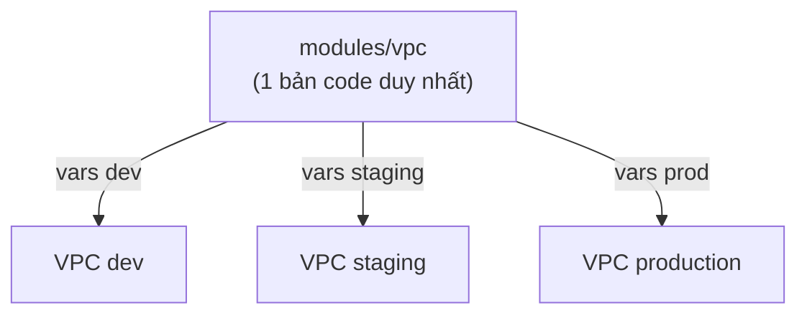

# 🎓 Modules & Multi-env — DRY + Reusability

> **Tác giả:** Mr.Rom\
> **Phiên bản:** v2.0.1\
> **Tạo lúc:** 23/05/2026\
> **Cập nhật:** 11/06/2026\
> **Level:** Basic\
> **Tags:** [MUST-KNOW]\
> **Yêu cầu trước:** [State & Backend — Production essentials](02_state-and-backend.md)

> 🎯 *Bạn vừa viết xong code Terraform cho VPC ở môi trường production, giờ cần dựng y hệt cho dev và staging. Cách "nhanh" là copy-paste cả thư mục ba lần — và đó cũng là cách nhanh nhất để sau này sửa một chỗ phải nhớ sửa ở ba nơi. Bài này chỉ cho bạn cách làm đúng: gói code lặp lại thành **module** (khối code tái sử dụng được), kéo module từ **Registry** công khai về dùng ngay, ghép nhiều module thành hệ thống lớn (**composition**), chọn chiến lược **multi-env** phù hợp (workspaces, thư mục tách riêng, hay Terragrunt), gắn **version** cho module để không vỡ bất ngờ, và viết **test** cho module. Đích đến: một codebase hạ tầng DRY, dùng lại được cho mọi môi trường.*

## 🎯 Sau bài này bạn sẽ

- [ ] Viết được một **module** — khối Terraform tái sử dụng.
- [ ] Dùng được **module công khai** từ Terraform Registry.
- [ ] Phân biệt nguồn module **local** và **remote**, biết khi nào dùng cái nào.
- [ ] Ghép nhiều module thành hệ thống lớn bằng các pattern **composition**.
- [ ] Chọn đúng chiến lược **multi-env**: workspaces vs thư mục tách riêng vs **Terragrunt**.
- [ ] Gắn **version** cho module và ghim phiên bản (*pinning*) để build ổn định.
- [ ] Viết **test** cho module bằng `terraform test` và Terratest.

---

## 1️⃣ Module là gì?

Trước khi học cách viết, cần hiểu module thực chất là gì. Nói gọn, một **module** chỉ là một nhóm file `.tf` được gom lại trong một thư mục để dùng lại. Bạn đã luôn làm việc với module mà không biết — thư mục gốc nơi bạn chạy `terraform apply` chính là *root module*. Khi tách phần code lặp lại ra một thư mục riêng rồi gọi vào, bạn tạo ra một *child module*.

### Vì sao cần module?

Có một phép thử đơn giản: nếu bạn thấy mình đang copy-paste một khối tài nguyên giữa các môi trường, đó là dấu hiệu cần module. Module giải quyết năm vấn đề cốt lõi trong quản lý hạ tầng — và bảng dưới gói gọn từng vấn đề đó:

- 🔁 **DRY** (*Don't Repeat Yourself* — không lặp lại) — một cấu hình VPC dùng chung cho cả ba môi trường, sửa một nơi áp dụng mọi nơi.
- 📦 **Encapsulation** (đóng gói) — giấu phần phức tạp bên trong, người dùng chỉ thấy đầu vào và đầu ra.
- 🎯 **Standardization** (chuẩn hoá) — cả team xài chung một bộ khối dựng, hạ tầng nhất quán.
- ✅ **Composition** (kết hợp) — ghép các khối đơn giản thành hệ thống phức tạp.
- 📚 **Sharing** (chia sẻ) — Terraform Registry có hàng nghìn module dùng sẵn.

### Cấu trúc một module

Một module chuẩn là một thư mục với **bốn file quen mặt**, mỗi file một vai trò rõ ràng: `main.tf` khai báo tài nguyên, `variables.tf` định nghĩa đầu vào, `outputs.tf` trả kết quả ra ngoài, và `README.md` mô tả cách dùng. Đây là bộ khung tối thiểu:

```
modules/vpc/
├── main.tf           # Resources
├── variables.tf      # Inputs
├── outputs.tf        # Outputs
└── README.md          # Documentation
```

Có module rồi thì gọi nó từ root module bằng khối `module "name" { source = "..." }`, truyền giá trị đầu vào và đọc đầu ra ra dùng:

```hcl
# envs/production/main.tf
module "vpc" {
  source       = "../../modules/vpc"
  name         = "acmeshop-prod"
  cidr_block   = "10.0.0.0/16"
  azs          = ["us-east-1a", "us-east-1b"]
}

# Use outputs
resource "aws_instance" "web" {
  subnet_id = module.vpc.public_subnet_ids[0]
}
```

🪞 **Ẩn dụ**: hãy xem module như một *hàm* trong lập trình. Bạn truyền tham số vào (chính là các *variables*), nó xử lý phần phức tạp bên trong, rồi trả về kết quả (các *outputs*). Người gọi không cần biết bên trong hàm làm gì, chỉ cần biết truyền gì vào và nhận lại được gì.

---

## 2️⃣ Viết một module — ví dụ VPC

Lý thuyết đủ rồi, giờ dựng một module VPC hoàn chỉnh từ con số không. Ta đi theo đúng thứ tự ba file: trước hết khai báo "hợp đồng" đầu vào, rồi viết tài nguyên, cuối cùng trả kết quả ra ngoài.

### `modules/vpc/variables.tf`

File `variables.tf` định nghĩa **giao diện đầu vào** của module — mỗi biến gồm tên, kiểu dữ liệu, giá trị mặc định và (nếu cần) ràng buộc kiểm tra. Người gọi truyền giá trị qua khối `module "vpc" { name = "..." }`. Đây chính là "hợp đồng API" của module — ai dùng cũng nhìn vào đây để biết phải cung cấp những gì:

```hcl
variable "name" {
  description = "Name prefix for resources"
  type        = string
}

variable "cidr_block" {
  description = "VPC CIDR"
  type        = string
  default     = "10.0.0.0/16"
}

variable "azs" {
  description = "Availability zones"
  type        = list(string)
}

variable "public_subnet_cidrs" {
  description = "Public subnet CIDRs"
  type        = list(string)
  default     = ["10.0.1.0/24", "10.0.2.0/24"]
}

variable "tags" {
  description = "Common tags"
  type        = map(string)
  default     = {}
}
```

### `modules/vpc/main.tf`

Tiếp theo là phần "ruột" — nơi khai báo tài nguyên thật. Để ý cách module dùng `var.name` và `var.tags` xuyên suốt: mọi tài nguyên đều lấy giá trị từ biến đầu vào, nên cùng một module có thể dựng ra hạ tầng khác nhau cho mỗi môi trường:

```hcl
resource "aws_vpc" "main" {
  cidr_block           = var.cidr_block
  enable_dns_support   = true
  enable_dns_hostnames = true
  tags = merge(var.tags, { Name = "${var.name}-vpc" })
}

resource "aws_subnet" "public" {
  count = length(var.public_subnet_cidrs)

  vpc_id                  = aws_vpc.main.id
  cidr_block              = var.public_subnet_cidrs[count.index]
  availability_zone       = var.azs[count.index % length(var.azs)]
  map_public_ip_on_launch = true
  tags = merge(var.tags, { Name = "${var.name}-public-${count.index}" })
}

resource "aws_internet_gateway" "main" {
  vpc_id = aws_vpc.main.id
  tags = merge(var.tags, { Name = "${var.name}-igw" })
}

resource "aws_route_table" "public" {
  vpc_id = aws_vpc.main.id
  route {
    cidr_block = "0.0.0.0/0"
    gateway_id = aws_internet_gateway.main.id
  }
  tags = merge(var.tags, { Name = "${var.name}-rt-public" })
}

resource "aws_route_table_association" "public" {
  count          = length(aws_subnet.public)
  subnet_id      = aws_subnet.public[count.index].id
  route_table_id = aws_route_table.public.id
}
```

### `modules/vpc/outputs.tf`

Sau khi tạo tài nguyên, module phải "trả" những giá trị mà người gọi cần dùng tiếp — như VPC ID hay danh sách subnet ID — qua file `outputs.tf`. Không có outputs thì module giống như một hàm không `return`, làm xong nhưng không ai lấy được kết quả:

```hcl
output "vpc_id" {
  description = "VPC ID"
  value       = aws_vpc.main.id
}

output "public_subnet_ids" {
  description = "Public subnet IDs"
  value       = aws_subnet.public[*].id
}

output "vpc_cidr_block" {
  value = aws_vpc.main.cidr_block
}
```

### Gọi module ra dùng

Ba file trên là toàn bộ module. Giờ ở root module, ta gọi nó vào, truyền vài biến, rồi đọc output để các tài nguyên khác dùng tiếp:

```hcl
# envs/production/main.tf
module "vpc" {
  source = "../../modules/vpc"

  name = "acmeshop-prod"
  azs  = ["us-east-1a", "us-east-1b"]
  tags = {
    Environment = "production"
    Team        = "platform"
  }
}

resource "aws_security_group" "web" {
  vpc_id = module.vpc.vpc_id    # ← Use module output
  # ...
}
```

Mỗi khi thêm module mới, phải `terraform init` lại để Terraform tải và liên kết module trước khi apply:

```bash
cd envs/production
terraform init       # Initialize modules
terraform apply
```

Đến đây bạn đã đạt được **DRY** thật sự: cùng module `vpc/` này, chỉ cần đổi biến đầu vào là dựng được hạ tầng cho dev, staging và prod mà không copy một dòng tài nguyên nào. Sơ đồ dưới trực quan hoá đúng ý đó — một bản code, ba bộ biến, ba hạ tầng:



→ Sửa module một chỗ, cả ba môi trường nhận thay đổi ở lần `apply` kế tiếp — đó chính là giá trị thật của DRY so với copy-paste ba thư mục.

---

## 3️⃣ Nguồn của module (module sources)

Module không nhất thiết phải nằm cùng thư mục với bạn. Terraform cho phép kéo module từ nhiều nơi qua thuộc tính `source` — từ thư mục cạnh bên, từ Registry công khai, từ một repo Git, cho tới một file nén trên HTTP hay S3. Mỗi nguồn hợp với một tình huống khác nhau.

### Local (đường dẫn tương đối)

Đơn giản và phổ biến nhất: module nằm ngay trong cùng repo Git, gọi qua đường dẫn tương đối. Đây là lựa chọn mặc định cho module nội bộ của team:

```hcl
module "vpc" {
  source = "../../modules/vpc"
}
```

### Terraform Registry (công khai)

Khi cần một khối hạ tầng phổ biến (VPC, EKS...), thay vì tự viết bạn kéo module từ Registry. Lưu ý phải có dòng `version` để ghim phiên bản:

```hcl
module "vpc" {
  source  = "terraform-aws-modules/vpc/aws"
  version = "~> 5.0"

  name = "acmeshop"
  cidr = "10.0.0.0/16"
  azs  = ["us-east-1a", "us-east-1b"]
  # ...
}
```

Module `terraform-aws-modules/vpc/aws` là module VPC do cộng đồng duy trì, hơn 100 triệu lượt tải — đã được tôi luyện qua vô số production, nên dùng yên tâm hơn tự viết từ đầu.

### Git

Nếu module nằm trong một repo Git riêng (ví dụ repo module dùng chung cho cả công ty), trỏ `source` thẳng tới đó. Cú pháp `//vpc` chỉ tới thư mục con, còn `?ref=...` ghim đúng tag hoặc commit:

```hcl
module "vpc" {
  source = "git::https://github.com/acmeshop/tf-modules.git//vpc?ref=v1.2.0"
}

# Or with SSH
source = "git@github.com:acmeshop/tf-modules.git//vpc?ref=v1.2.0"

# Pin to commit (immutable)
source = "git::https://github.com/acmeshop/tf-modules.git//vpc?ref=abc1234"
```

### Các nguồn khác

Terraform còn hỗ trợ vài nguồn ít gặp hơn — file nén qua HTTP, qua S3, hay một thư mục con bên trong repo Git — hữu ích khi module được đóng gói và phát hành sẵn:

```hcl
# HTTP archive
source = "https://example.com/vpc-module.tar.gz"

# S3
source = "s3::https://s3-us-east-1.amazonaws.com/bucket/vpc.tar.gz"

# Subdirectory in git
source = "git::https://github.com/x/y.git//path/to/module"
```

Dù dùng nguồn nào, nguyên tắc ghim phiên bản vẫn như nhau và tuyệt đối không nên bỏ qua: với Registry, dùng `version = "~> 5.0"` (ràng buộc theo SemVer); với Git, dùng `?ref=v1.2.0` (theo tag) hoặc `?ref=<SHA>` (ghim cứng một commit, bất biến).

---

## 4️⃣ Module công khai — Terraform Registry

Phần trước đã chạm tới Registry, giờ ta khai thác nó cho đến nơi. Điểm mạnh lớn nhất của Terraform là hệ sinh thái module công khai khổng lồ — phần lớn hạ tầng "boilerplate" (khuôn mẫu lặp đi lặp lại) đã có người viết sẵn và duy trì giúp bạn.

### Vài module nổi tiếng

Dưới đây là những module hay dùng nhất từ bộ `terraform-aws-modules` — gần như mọi dự án AWS đều đụng tới ít nhất một cái:

| Module | Mục đích |
|---|---|
| `terraform-aws-modules/vpc/aws` | AWS VPC |
| `terraform-aws-modules/eks/aws` | EKS cluster |
| `terraform-aws-modules/rds/aws` | RDS DB |
| `terraform-aws-modules/lambda/aws` | Lambda |
| `terraform-aws-modules/security-group/aws` | SG |
| `terraform-aws-modules/iam/aws` | IAM |

Muốn tìm thêm thì vào registry.terraform.io, mỗi module đều có sẵn tài liệu kèm ví dụ chạy được ngay.

### Ví dụ: dựng EKS cluster trong 30 dòng

Để thấy module công khai tiết kiệm công sức cỡ nào, hãy nhìn ví dụ dựng một EKS cluster hoàn chỉnh — chỉ vài chục dòng cấu hình:

```hcl
module "eks" {
  source  = "terraform-aws-modules/eks/aws"
  version = "~> 20.0"

  cluster_name    = "acmeshop-prod"
  cluster_version = "1.31"

  vpc_id     = module.vpc.vpc_id
  subnet_ids = module.vpc.private_subnet_ids

  eks_managed_node_groups = {
    general = {
      desired_size = 3
      min_size     = 1
      max_size     = 10
      instance_types = ["t3.medium"]
    }
  }

  tags = local.tags
}
```

Tự viết toàn bộ phần này (cluster + IAM + node groups + add-ons + ...) tốn hơn 500 dòng. Dùng module: gói gọn trong 30 dòng. Đó là chênh lệch giữa "tự gò từng con ốc" và "lắp module có sẵn".

### Ưu / nhược của module cộng đồng

Module cộng đồng tiện thật, nhưng không phải lựa chọn miễn phí về mặt đánh đổi. Bảng dưới cân hai mặt để bạn quyết định khi nào nên dùng:

| Ưu điểm | Nhược điểm |
|---|---|
| ✅ Đã tôi luyện qua production | ❌ "Hộp đen" — debug khó hơn |
| ✅ Tiết kiệm thời gian | ❌ Version trôi; có thể có breaking change |
| ✅ Theo best practice | ❌ Tổng quát — có thể không khớp nhu cầu đặc thù |
| ✅ Được duy trì | ❌ Phụ thuộc người maintain còn theo đuổi hay không |

Cách làm hợp lý tính tới 2026: dùng module cộng đồng cho phần **boilerplate** (VPC, EKS, IAM — ai cũng cần giống nhau), còn tự viết module cho phần **đặc thù nghiệp vụ** của riêng dự án bạn.

---

## 5️⃣ Module composition — ghép module thành hệ thống

Một module đơn lẻ ít khi đủ. Sức mạnh thật sự lộ ra khi bạn ghép nhiều module lại — output của module này chảy vào input của module kia, tạo thành một chuỗi phụ thuộc. Ví dụ dưới đây dựng cả một hệ thống: VPC sinh ra mạng, database nằm trong mạng đó, EKS cũng vậy, rồi app dùng endpoint của cả EKS lẫn database:

```hcl
# envs/production/main.tf
module "vpc" {
  source = "../../modules/vpc"
  # ...
}

module "database" {
  source = "../../modules/database"

  vpc_id     = module.vpc.vpc_id           # Pass output
  subnet_ids = module.vpc.private_subnet_ids
  db_name    = "acmeshop"
}

module "eks" {
  source = "../../modules/eks"

  vpc_id     = module.vpc.vpc_id
  subnet_ids = module.vpc.public_subnet_ids
  db_endpoint = module.database.endpoint
}

module "app" {
  source = "../../modules/app"

  cluster_endpoint = module.eks.cluster_endpoint
  cluster_ca_cert  = module.eks.cluster_ca_certificate
  db_endpoint      = module.database.endpoint
}
```

Để ý cách `module.vpc.vpc_id` được truyền sang `database` và `eks`: Terraform tự suy ra thứ tự dựng dựa trên các phụ thuộc này. Đó chính là tinh thần composition — module ghép với nhau qua output, không cần bạn chỉ định thứ tự thủ công.

### Lồng module (module nesting)

Module có thể gọi module khác bên trong nó — một module `app` có thể tự gọi `networking` và `compute` làm thành phần con:

```
modules/app/
├── main.tf            # Calls modules/networking/ + modules/compute/
├── networking/         (nested module)
└── compute/            (nested module)
```

Tiện thì tiện, nhưng lồng quá sâu sẽ khiến việc đọc và debug trở nên rối — mỗi tầng là một lớp gián tiếp che mất tài nguyên thật. **Quy tắc kinh nghiệm**: tối đa 2 tầng.

---

## 6️⃣ Chiến lược multi-env

Có module rồi, câu hỏi lớn tiếp theo là: cùng một codebase, làm sao dựng được nhiều môi trường (dev, staging, production) mà mỗi cái có state riêng và không giẫm chân nhau? Có ba chiến lược chính, mỗi cái một mức đánh đổi giữa "đơn giản" và "an toàn".

### Chiến lược 1 — Workspaces

Cách gọn nhất là dùng *workspaces* — Terraform giữ một bộ code chung nhưng tách state cho từng môi trường. Mỗi workspace có file state riêng:

```bash
terraform workspace new dev
terraform workspace new staging
terraform workspace new production

terraform workspace select production
terraform apply
```

Phần khác nhau giữa các môi trường (loại instance, số lượng...) được nhét vào một `locals` rồi chọn theo `terraform.workspace`:

```hcl
locals {
  config = {
    dev        = { instance_type = "t3.small",  count = 1 }
    staging    = { instance_type = "t3.medium", count = 2 }
    production = { instance_type = "t3.large",  count = 5 }
  }
  current = local.config[terraform.workspace]
}

resource "aws_instance" "web" {
  count         = local.current.count
  instance_type = local.current.instance_type
}
```

**Ưu điểm**: đơn giản, chỉ một codebase duy nhất.
**Nhược điểm**: rất dễ sai sót — chọn nhầm workspace là apply nhầm môi trường; lại thêm việc tất cả môi trường dùng chung file `.tf`, nên một thay đổi nhỏ ảnh hưởng tới mọi môi trường cùng lúc.

### Chiến lược 2 — Thư mục tách riêng (khuyến nghị)

Cách phổ biến hơn ở production là tách hẳn mỗi môi trường thành một thư mục riêng dưới `envs/`, dùng chung `modules/`. Mỗi môi trường có state, tfvars và backend độc lập:

```
infra/
├── modules/
│   ├── vpc/
│   ├── eks/
│   └── rds/
└── envs/
    ├── dev/
    │   ├── main.tf
    │   ├── terraform.tfvars
    │   └── backend.tf
    ├── staging/
    │   ├── main.tf
    │   └── terraform.tfvars
    └── production/
        ├── main.tf
        └── terraform.tfvars
```

File `main.tf` của mỗi môi trường gọn gàng — chỉ gọi module và truyền biến đặc thù cho môi trường đó:

```hcl
# envs/production/main.tf
module "vpc" {
  source = "../../modules/vpc"
  name   = "acmeshop-prod"
  azs    = ["us-east-1a", "us-east-1b"]
}
```

**Ưu điểm**: tường minh, khó nhầm lẫn. State của mỗi môi trường tách bạch hoàn toàn.
**Nhược điểm**: có một chút lặp lại (boilerplate) giữa các thư mục.

Tính tới 2026, đa số team chọn cách này: thư mục tách riêng — vì sự an toàn của state tách bạch đáng giá hơn chút lặp code.

### Chiến lược 3 — Terragrunt (lớp bọc DRY)

Khi số môi trường nhiều và phần boilerplate giữa các thư mục bắt đầu phình to, *Terragrunt* là công cụ bọc ngoài Terraform để khử lặp lại. Bạn khai báo cấu hình backend chung đúng một lần trong `terragrunt.hcl` ở thư mục cha:

```hcl
# terragrunt.hcl in envs/production/
remote_state {
  backend = "s3"
  config = {
    bucket = "acmeshop-tf-state"
    key    = "envs/${path_relative_to_include()}/terraform.tfstate"
  }
}

inputs = {
  environment = "production"
}
```

Còn mỗi module ở từng môi trường chỉ cần `include` lại cấu hình cha và khai báo phần riêng:

```hcl
# envs/production/vpc/terragrunt.hcl
include "root" {
  path = find_in_parent_folders()
}

terraform {
  source = "../../../modules/vpc"
}

inputs = {
  name = "acmeshop-prod"
  azs  = ["us-east-1a", "us-east-1b"]
}
```

Chạy thì dùng `terragrunt apply` thay cho `terraform apply` — Terragrunt sẽ tự sinh các file Terraform, init rồi apply:

```bash
terragrunt apply
# Generate Terraform files, init, apply
```

Tóm lại Terragrunt cộng thêm vào Terraform thuần ba thứ — và một cái giá:

- ✅ Cấu hình backend DRY dùng chung cho mọi môi trường (một file thay vì N file).
- ✅ Tự đặt tên file state theo từng môi trường.
- ✅ Quản lý phụ thuộc giữa các module kèm thứ tự dựng.
- ❌ Đổi lại là thêm một công cụ phải học.

Vậy nên: hợp với team lớn, nhiều môi trường. Còn dự án nhỏ thì thư mục tách riêng đã đủ, chưa cần kéo thêm Terragrunt vào.

---

## 7️⃣ Module versioning + publish

Module dùng chung mà không gắn version là một quả bom hẹn giờ: hôm nay chạy ngon, một bản cập nhật từ phía maintainer là có thể vỡ. Phần này lo phần "ổn định lâu dài" — gắn version cho module và phát hành nó cho người khác dùng.

### SemVer cho module

Module nên đánh version theo SemVer (*Semantic Versioning*), để con số tự nói lên mức độ thay đổi: vá lỗi, thêm tính năng tương thích ngược, hay phá vỡ tương thích:

```
v1.0.0 — Initial stable
v1.0.1 — Patch (bug fix, no API change)
v1.1.0 — Minor (new optional input, backward compat)
v2.0.0 — Major (breaking, e.g., required input added)
```

### Gắn tag trong Git

Với module Git, "phát hành một phiên bản" đơn giản là gắn tag rồi push lên, sau đó người dùng ghim đúng tag đó qua `?ref=`:

```bash
git tag v1.0.0
git push origin v1.0.0

# Consumers:
module "x" { source = "git::...?ref=v1.0.0" }
```

### Publish lên Terraform Registry

Muốn chia sẻ rộng hơn thì publish lên Registry. Quy ước đặt tên repo là `terraform-<provider>-<name>` (ví dụ `terraform-aws-myapp`), sau đó kết nối lên registry.terraform.io:

```text
GitHub repo `terraform-<provider>-<name>` → publish to registry.terraform.io
```

Lưu ý: module công khai cần repo GitHub mở (OSS). Còn module riêng tư thì dùng **private registry của Terraform Cloud**.

### Tài liệu cho module

Viết tài liệu module bằng tay vừa mất công vừa dễ lệch với code. Công cụ `terraform-docs` đọc thẳng `variables.tf` + `outputs.tf` rồi sinh ra bảng README tự động:

```bash
# Generate README from variables.tf + outputs.tf
brew install terraform-docs
terraform-docs markdown table modules/vpc > modules/vpc/README.md
```

Mẹo thực chiến: đưa lệnh này vào CI để mỗi PR đều bắt buộc README được cập nhật theo code, tránh tình trạng tài liệu "nói một đằng, code làm một nẻo".

---

## 8️⃣ Module testing

Module là code, mà code thì cần test — nhất là module dùng chung cho nhiều môi trường, một lỗi nhỏ có thể nhân lên thành sự cố ở mọi nơi. Có ba mức test, từ nhẹ tới nặng.

### Kiểu unit — `terraform plan`

Cách nhẹ nhất là dựng một cấu hình test gọi module với vài giá trị tối thiểu, rồi chạy `plan` để xác nhận module không lỗi và idempotent (chạy lại không sinh thay đổi):

```hcl
# tests/vpc-defaults/main.tf
module "vpc" {
  source = "../../modules/vpc"
  name   = "test"
  azs    = ["us-east-1a"]
}
```

Mã thoát của `terraform plan -detailed-exitcode` cho biết kết quả: `0` nghĩa là không có thay đổi (idempotent — đúng như mong đợi sau lần apply đầu), `2` nghĩa là lần chạy đầu còn thay đổi cần áp:

```bash
cd tests/vpc-defaults
terraform init
terraform plan -detailed-exitcode
# Exit 0 = no changes (idempotent)
# Exit 2 = first run
```

### Kiểu integration — Terratest

Khi cần kiểm tra hạ tầng thật (dựng lên, kiểm tra, rồi xoá), Terratest là lựa chọn phổ biến nhất. Đây là framework viết bằng Go: nó apply hạ tầng thật, assert các output, rồi tự destroy ở cuối:

```go
// tests/vpc_test.go
package test

import (
    "testing"
    "github.com/gruntwork-io/terratest/modules/terraform"
    "github.com/stretchr/testify/assert"
)

func TestVPC(t *testing.T) {
    options := &terraform.Options{
        TerraformDir: "../modules/vpc",
        Vars: map[string]interface{}{
            "name": "test",
            "azs":  []string{"us-east-1a"},
        },
    }

    defer terraform.Destroy(t, options)

    terraform.InitAndApply(t, options)

    vpcId := terraform.Output(t, options, "vpc_id")
    assert.NotEmpty(t, vpcId)
}
```

Chạy test thì như chạy test Go bình thường, nhớ để timeout đủ dài vì hạ tầng thật dựng/xoá tốn thời gian:

```bash
cd tests
go test -v -timeout 30m
```

### Các công cụ

Ngoài Terratest còn vài lựa chọn khác, mỗi cái hợp một bối cảnh:

- `terratest` — phổ biến nhất, mạnh nhất cho integration test.
- `Kitchen-Terraform` — dựa trên Ruby.
- `terraform test` — built-in sẵn từ Terraform 1.6, viết test bằng chính HCL.

Đáng chú ý nhất với người mới là `terraform test` tích hợp sẵn: không cần Go, không cần cài thêm gì, viết assertion ngay trong HCL:

```hcl
# tests/vpc.tftest.hcl
variables {
  name = "test"
  azs  = ["us-east-1a"]
}

run "create_vpc" {
  assert {
    condition     = aws_vpc.main.cidr_block == "10.0.0.0/16"
    error_message = "CIDR should default to 10.0.0.0/16"
  }
}
```

Chạy chỉ bằng một lệnh:

```bash
terraform test
```

Với những kiểm tra cơ bản, `terraform test` built-in dễ tiếp cận hơn Terratest nhiều — nên bắt đầu từ đây trước khi cần tới Go.

---

## 9️⃣ Cấu trúc tham khảo

Gom tất cả những gì đã học lại, đây là bộ khung thư mục hoàn chỉnh cho một dự án hạ tầng thật: một thư mục `bootstrap` dựng backend, các module tái sử dụng trong `modules/`, ba môi trường tách riêng trong `envs/`, test trong `tests/`, và CI trong `.github/`:

```
infra/
├── bootstrap/                    # One-time S3 + DynamoDB
├── modules/
│   ├── vpc/                       # Reusable VPC
│   ├── eks/                       # Reusable EKS
│   ├── rds/                       # Reusable RDS
│   └── app/                       # Reusable app deploy
├── envs/
│   ├── dev/
│   │   ├── backend.tf
│   │   ├── main.tf
│   │   └── terraform.tfvars
│   ├── staging/
│   │   ├── backend.tf
│   │   ├── main.tf
│   │   └── terraform.tfvars
│   └── production/
│       ├── backend.tf
│       ├── main.tf
│       └── terraform.tfvars
├── tests/
│   ├── vpc.tftest.hcl
│   └── eks.tftest.hcl
└── .github/workflows/terraform.yml
```

File `main.tf` của môi trường production minh hoạ rõ tinh thần composition: nó chỉ gọi ba module (vpc, eks, rds), truyền output của VPC sang EKS và RDS, và gắn tag chung qua `locals`:

```hcl
module "vpc" {
  source = "../../modules/vpc"

  name = "acmeshop-prod"
  azs  = ["us-east-1a", "us-east-1b", "us-east-1c"]
  tags = local.tags
}

module "eks" {
  source = "../../modules/eks"

  cluster_name = "acmeshop-prod"
  vpc_id       = module.vpc.vpc_id
  subnet_ids   = module.vpc.private_subnet_ids
  tags         = local.tags
}

module "rds" {
  source = "../../modules/rds"

  identifier = "acmeshop-prod-db"
  vpc_id     = module.vpc.vpc_id
  subnet_ids = module.vpc.private_subnet_ids
  tags       = local.tags
}

locals {
  tags = {
    Environment = "production"
    ManagedBy   = "Terraform"
    Project     = "Acmeshop"
  }
}
```

Kết quả: mỗi môi trường chỉ còn khoảng 100 dòng `main.tf` gọi module, còn phần phức tạp (200+ dòng) nằm gọn bên trong module. Đó chính là **composition + DRY** mà cả bài này hướng tới.

---

## 💡 Cạm bẫy thường gặp & Best practice

### ❌ Cạm bẫy: Không ghim version module

Để module không gắn version, sang năm một bản cập nhật phía maintainer có thể làm vỡ hạ tầng của bạn mà không báo trước.

→ **Fix**: luôn ghim — `version = "~> 5.0"` (Registry) hoặc `?ref=v1.0.0` (Git).

### ❌ Cạm bẫy: Lồng module quá sâu (3+ tầng)

Lồng từ 3 tầng trở lên khiến debug rất khổ — mỗi tầng là một lớp che mất tài nguyên thật.

→ **Fix**: giới hạn tối đa 2 tầng lồng.

### ❌ Cạm bẫy: Dùng workspaces cho môi trường production

Workspaces dễ dẫn tới sai sót "chọn nhầm workspace" → apply nhầm môi trường.

→ **Fix**: dùng thư mục tách riêng cho production.

### ❌ Cạm bẫy: Module không có README

Không có README thì người khác (và chính bạn sau vài tháng) không biết module nhận đầu vào gì.

→ **Fix**: dùng `terraform-docs` sinh README tự động, đưa vào CI.

### ✅ Best practice: Tái dùng module VPC/IAM thay vì tự viết lại

Viết lại module VPC/IAM từ đầu là tốn công vô ích.

→ **Fix**: tái dùng `terraform-aws-modules/*` — đã được tôi luyện qua production.

---

## 🧠 Tự kiểm tra (Self-check)

Năm câu dưới chạm vào đúng những chỗ dễ nhầm nhất khi làm việc với module và multi-env. Thử tự trả lời trước khi mở đáp án — đó là cách nhanh nhất để biết mình thật sự hiểu hay chỉ mới thấy quen.

**Q1.** **Module** là gì? Cấu trúc gồm những gì?

**Q2.** **Workspaces** vs **thư mục tách riêng** — chọn cái nào cho production?

**Q3.** Module từ **Terraform Registry** — ưu và nhược?

**Q4.** **Module versioning** — best practice ra sao?

**Q5.** **Terragrunt** cộng thêm gì so với Terraform thuần?

<details>
<summary>💡 Gợi ý đáp án</summary>

1. **Module** = một nhóm file `.tf` (`main.tf` + `variables.tf` + `outputs.tf` + README). Giống một hàm: đầu vào (vars) → đầu ra (outputs). Tái dùng được giữa các môi trường/dự án. Cấu trúc: `variables.tf` (inputs), `main.tf` (resources), `outputs.tf` (trả ra cho người gọi).

2. **Workspaces**: cùng code, state tách theo workspace. Đơn giản nhưng dễ dính lỗi "chọn nhầm workspace". **Thư mục tách riêng** (`envs/{dev,staging,prod}/`): tường minh, mỗi môi trường có state + tfvars + backend riêng. Best practice 2026: thư mục tách riêng cho production; workspaces hợp với dự án nhỏ hoặc môi trường tạm (theo từng PR).

3. **Ưu điểm**: đã được cộng đồng tôi luyện, tiết kiệm thời gian (module EKS 30 dòng thay vì 500), theo best practice, được duy trì. **Nhược điểm**: "hộp đen" khó debug, version trôi / có breaking change, tổng quát nên không khớp ca đặc thù, phụ thuộc maintainer còn theo đuổi. Dùng module cộng đồng cho boilerplate, tự viết cho phần đặc thù nghiệp vụ.

4. **SemVer** (1.0.0, 1.0.1, 1.1.0, 2.0.0). Gắn tag Git: `v1.0.0`. Người dùng ghim: `version = "~> 5.0"` (Registry) hoặc `?ref=v1.0.0` (Git). Bản patch cập nhật tự động, bản major nâng có chủ đích. Tài liệu khớp theo từng phiên bản.

5. **Terragrunt** cộng thêm: (a) **cấu hình backend DRY** cho mọi môi trường (1 file thay vì N). (b) **Tự đặt tên file state** theo đường dẫn. (c) **Quản lý phụ thuộc** kèm thứ tự giữa các module. (d) Kế thừa cấu hình từ file cha. Đổi lại là **thêm một công cụ** phải học, nhưng đáng cho setup multi-env lớn. Dự án nhỏ: Terraform thuần với thư mục tách riêng là đủ.
</details>

---

## ⚡ Tra cứu nhanh (Cheatsheet)

Phần tra nhanh cho lúc làm việc thật — gom theo nhóm: cấu trúc module, các nguồn `source`, bố cục multi-env, Terragrunt và các lệnh test.

### Cấu trúc module

```
modules/vpc/
├── main.tf
├── variables.tf
├── outputs.tf
└── README.md
```

### Nguồn module

```hcl
source = "../../modules/vpc"                                 # Local
source = "terraform-aws-modules/vpc/aws"                     # Registry
source = "git::https://github.com/x/y.git//vpc?ref=v1.0.0"  # Git
```

### Multi-env

```
envs/dev/main.tf       module "vpc" { source = "../../modules/vpc" }
envs/staging/main.tf    ...
envs/production/main.tf ...
```

### Terragrunt

```hcl
# terragrunt.hcl
remote_state { backend = "s3" config = { ... } }
inputs = { environment = "prod" }
```

### Test

```bash
terraform-docs markdown modules/vpc > modules/vpc/README.md
terraform test                         # Built-in
go test ./...                            # Terratest
```

---

## 📚 Từ Điển Thuật Ngữ (Glossary)

| Thuật ngữ | Tiếng Việt | Giải thích |
|---|---|---|
| **Module** | Mô-đun | Khối code Terraform tái sử dụng (nhóm file `.tf` trong một thư mục) |
| **Root module** | Mô-đun gốc | Thư mục cấp cao nhất, nơi chạy `terraform apply` |
| **Child module** | Mô-đun con | Module được gọi bởi root hoặc module khác |
| **Source** | Nguồn | Nơi chứa code của module (local, Git, Registry...) |
| **Terraform Registry** | Kho module công khai | Kho module dùng chung công khai |
| **Composition** | Kết hợp | Ghép nhiều module lại với nhau |
| **Workspaces** | Không gian làm việc | Các phiên bản state được đặt tên trên cùng một code |
| **Terragrunt** | — | Lớp bọc DRY cho Terraform |
| **terraform-docs** | — | Công cụ sinh README module tự động |
| **Terratest** | — | Framework integration test viết bằng Go |
| **`terraform test`** | — | Test viết bằng HCL, tích hợp sẵn (Terraform 1.6+) |
| **SemVer** | Đánh version ngữ nghĩa | Quy ước đánh số phiên bản MAJOR.MINOR.PATCH |

---

## 🔗 Liên kết & Tài nguyên

### 🧭 Định hướng lộ trình học

- ⬅️ **Bài trước:** [State & Backend — Production essentials](02_state-and-backend.md)
- ➡️ **Bài tiếp theo:** [IaC Best Practices & Alternatives](04_best-practices-and-alternatives.md)
- ↑ **Về cụm:** [IaC — Infrastructure as Code](../../README.md)

### 🧩 Các chủ đề có thể bạn quan tâm

- ☸️ [Kubernetes — Pods & Deployments](../../../kubernetes/lessons/01_basic/01_pods-and-deployments.md) — hạ tầng EKS dựng bằng module này chạy gì lên trên
- 🔁 [CI/CD — GitHub Actions](../../../ci-cd/lessons/01_basic/01_github-actions.md) — tự động chạy `terraform plan/apply` trong pipeline
- 🔁 [CI/CD — Pipeline patterns](../../../ci-cd/lessons/01_basic/03_pipeline-patterns.md) — chiến lược build/deploy theo môi trường

### 🌐 Tài nguyên tham khảo khác

- 📖 [Module docs](https://developer.hashicorp.com/terraform/language/modules)
- 📖 [Terraform Registry](https://registry.terraform.io/)
- 📖 [terraform-aws-modules](https://github.com/terraform-aws-modules)
- 📖 [Terragrunt](https://terragrunt.gruntwork.io/)
- 📖 [Terratest](https://terratest.gruntwork.io/)
- 📖 [terraform-docs](https://terraform-docs.io/)

---

> 🎯 *Sau bài này bạn đã làm chủ module + multi-env. Bài cuối của cụm basic dạy **best practices + alternatives** — đúc kết kinh nghiệm production.*

---

## 📌 Nhật ký thay đổi (Changelog)

- **v1.0.0 (23/05/2026)** — Bản đầu tiên. Cluster iac basic lesson 4/5. Cover: module anatomy + write VPC module from scratch + workspaces + multi-env (dev/staging/prod) + Terraform Registry + module versioning + count/for_each loops.
- **v1.1.0 (25/05/2026)** — Bổ sung lời dẫn trước Why module, Anatomy và variables.tf interface.
- **v2.0.0 (07/06/2026)** — Viết lại toàn bộ prose sang tiếng Việt narrative đúng gold-standard: thêm lời dẫn 2-3 câu trước mỗi code/bảng/list, câu phân tích sau, câu bắc cầu giữa các section, ẩn dụ "module = hàm"; Việt hoá đoạn điện tín EN và label Pros/Cons → Ưu/Nhược điểm. Áp fix QA: heading canonical (Self-check/Cheatsheet/Cạm bẫy & Best practice), Yêu cầu trước, Glossary 3 cột, nav 3 sub với marker ⬅️/➡️/↑ và link-text = tiêu đề H1 thực, sửa link cụm liên quan (K8s/CI-CD) đúng đường dẫn, gỡ nhãn (sắp viết). Giữ nguyên 100% code/lệnh/config/số liệu và cấu trúc 9 phần.
- **v2.0.1 (11/06/2026)** — Bổ sung sơ đồ module tái dùng (1 module VPC → 3 môi trường) cho trực quan.
