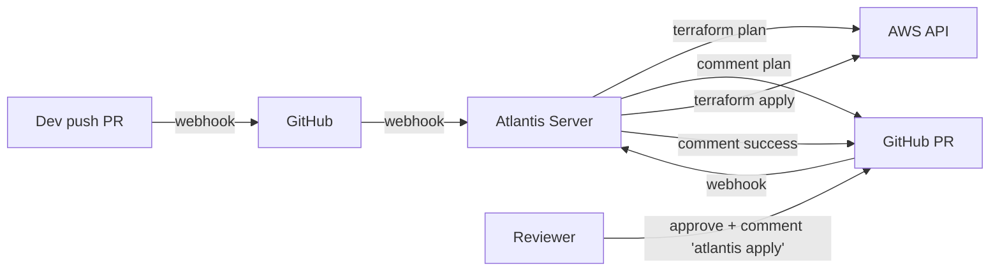
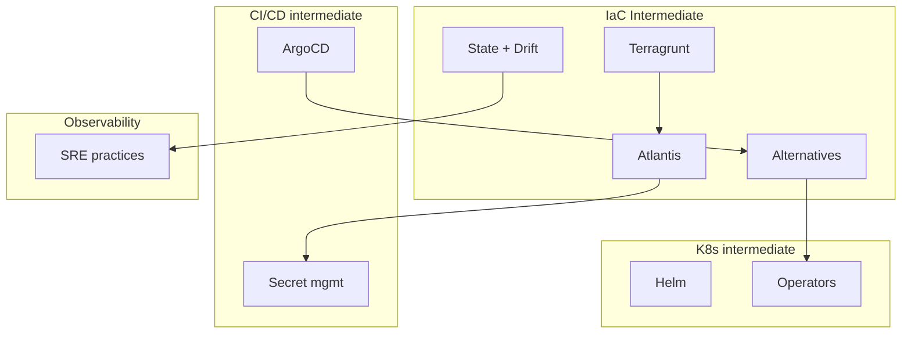

# 🎓 IaC Intermediate — Từ "terraform apply local" đến "GitOps infra"

> **Tác giả:** Mr.Rom\
> **Phiên bản:** v1.1.0\
> **Tạo lúc:** 24/05/2026\
> **Cập nhật:** 25/05/2026\
> **Level:** Intermediate\
> **Tags:** [MUST-KNOW]\
> **Prerequisites:** [IaC basic](../01_basic/), [CI/CD intermediate GitOps](../../../ci-cd/lessons/02_intermediate/01_gitops-with-argocd.md)

> 🎯 *Bài INTRO cuối DevOps intermediate sprint. Basic dạy Terraform basics + state + modules + best practices. Production scale cần: **Terragrunt DRY**, **Atlantis GitOps workflow**, **drift detection automation**, **multi-language alternatives** (Pulumi/CDK/Crossplane). Bài này map landscape.*

## 🎯 Sau bài này bạn sẽ

- [ ] Hiểu **khoảng cách** giữa "terraform apply local" và production GitOps infra
- [ ] Biết **4 mảng intermediate**: Terragrunt / Atlantis / State+Drift / Alternatives
- [ ] Hiểu **IaC GitOps anti-pattern war story** từ CI/CD intermediate
- [ ] Biết **landscape 2026**: Terraform/OpenTofu/Terragrunt/Atlantis/Pulumi/CDK/Crossplane
- [ ] Có **lộ trình** học 4 bài kế tiếp + complete DevOps intermediate sprint

---

## Tình huống — IaC at scale 10+ env break

Production AWS infra:
- 3 environments: dev, staging, prod.
- 5 regions: us-east-1, us-west-2, eu-west-1, ap-southeast-1, ap-northeast-1.
- 10 microservice teams, each own infra (EKS namespace, RDS, S3).

Repo `terraform-infra/`:
```
terraform-infra/
├── dev/
│   ├── us-east-1/
│   │   ├── vpc/      (200 lines)
│   │   ├── eks/      (300 lines)
│   │   ├── rds/      (150 lines)
│   │   ├── s3/       (100 lines)
│   │   └── ...
│   ├── us-west-2/    (same 5 modules, ~750 lines duplicate)
│   ├── eu-west-1/
│   └── ...
├── staging/  (same structure)
└── prod/     (same structure)
```

→ **3 envs × 5 regions × 5 modules = 75 folders, ~50K lines duplicate**. Update VPC CIDR → 15 files.

Workflow:
- Dev sửa `dev/us-east-1/vpc/`, `terraform apply` local.
- Sometimes forget update other envs → drift.
- 2 dev apply simultaneously → state lock conflict.
- No audit trail "who applied what when".

Sếp:
- *"Terragrunt cho DRY. Atlantis cho PR workflow. Drift detection cron. Bài này dạy IaC at scale."*

→ Bài này map 4 mảng.

---

## 1️⃣ Mảng 1 — Terragrunt: DRY Terraform

### Vấn đề DRY

Basic Terraform: copy-paste folder per env. Update = sửa N file. Đã giới thiệu bài 03 basic (workspaces + multi-env), nhưng workspaces có limits.

### Terragrunt giải pháp

**Terragrunt** = wrapper around Terraform, eliminates duplication:
- 1 module Terraform.
- Multiple `terragrunt.hcl` config files per env.
- Inheritance: shared config in root, override per env.

```
infra/
├── terragrunt.hcl                 # root config
├── modules/
│   ├── vpc/                       # 1 Terraform module
│   ├── eks/
│   └── rds/
└── live/
    ├── dev/
    │   ├── us-east-1/
    │   │   ├── vpc/terragrunt.hcl    # 10 lines, references modules/vpc
    │   │   └── ...
    │   └── ...
    └── prod/...
```

→ Module code 1 lần. Config per env minimal. DRY.

🪞 **Ẩn dụ**: *Terraform module như **bản vẽ kiến trúc nhà**. Basic Terraform: copy bản vẽ vào 75 folder, sửa kích thước per nhà. Terragrunt: 1 bản vẽ master, mỗi folder chỉ ghi "nhà này 3 phòng ngủ, sơn xanh, sân vườn 100m²" — bản vẽ inherit + override.*

→ Học deep ở **bài 01**.

---

## 2️⃣ Mảng 2 — Atlantis: GitOps for IaC

### Vấn đề local apply

`terraform apply` từ laptop:
- ❌ No audit trail.
- ❌ State drift (one dev's local cache ≠ another's).
- ❌ Credentials in dev laptop (security risk).
- ❌ No review (just apply directly).
- ❌ Multiple devs apply simultaneously → lock conflict.

### Atlantis giải pháp

**Atlantis** = automated PR-based Terraform workflow:
- Dev: open PR with `terraform` changes.
- Atlantis (running in cluster): auto-detect → run `terraform plan`.
- Plan output posted as PR comment.
- Reviewer approve PR.
- Dev comments `atlantis apply` → Atlantis runs apply.
- Merge PR.



→ **Single source of truth**: Git. **Audit trail**: PR. **No local apply**: credentials only in Atlantis.

🪞 **Ẩn dụ**: *Like ArgoCD for K8s, Atlantis is GitOps for infrastructure. Git = enforcement gate.*

→ Học deep ở **bài 02**.

---

## 3️⃣ Mảng 3 — State management + Drift detection

### Vấn đề drift

Drift = cluster state ≠ Terraform state ≠ Git state.

Causes:
- Manual change in AWS Console (emergency fix).
- IAM auto-rotation by AWS.
- Crashed apply (partial state).
- Out-of-band tool (Helm in EKS, kubectl direct).

Discovery: months later, `terraform plan` shows 200 changes → fear apply.

### Solutions

**Drift detection automation**:
- CI cron: `terraform plan` daily/hourly.
- Alert if diff > 0.
- Auto-PR with diff for review.

**State migration**:
- `terraform state mv` to refactor without recreate.
- Import existing resources `terraform import`.
- State surgery for emergencies.

**State backup**:
- S3 versioning enabled.
- Backup before destructive ops.
- Recovery procedure documented.

→ Học deep ở **bài 03**.

---

## 4️⃣ Mảng 4 — Alternatives: Pulumi / CDK / Crossplane

### Vấn đề Terraform

HCL có limits:
- Programming logic clunky (`for_each`, conditional resources).
- No real types / IDE intellisense.
- Multi-cloud: write per provider (no abstraction).
- Some teams prefer real language.

### Alternatives

**Pulumi**:
- Real languages (Python, TypeScript, Go, C#, Java, .NET).
- Same providers as Terraform under hood.
- State management same as Terraform.

```python
import pulumi
import pulumi_aws as aws

vpc = aws.ec2.Vpc("main", cidr_block="10.0.0.0/16")
subnet = aws.ec2.Subnet("public", vpc_id=vpc.id, cidr_block="10.0.1.0/24")
```

**AWS CDK / Terraform CDK (CDKTF)**:
- AWS CDK: synthesizes CloudFormation (AWS-only).
- CDKTF: synthesizes Terraform HCL → uses Terraform engine.

**Crossplane**:
- K8s-native IaC.
- CRD per cloud resource (`apiVersion: ec2.aws.upbound.io/v1beta1, kind: VPC`).
- ArgoCD/Flux sync infra YAML like apps.

```yaml
apiVersion: ec2.aws.upbound.io/v1beta1
kind: VPC
metadata:
  name: prod-vpc
spec:
  forProvider:
    region: us-east-1
    cidrBlock: 10.0.0.0/16
```

→ Học deep ở **bài 04**.

---

## 5️⃣ Mối liên hệ DevOps stack

IaC không tồn tại độc lập — gắn chặt với K8s (Helm cho deploy + Terraform cho cluster provision), CI/CD (ArgoCD GitOps loop), Observability (Prometheus track infra drift). Diagram dưới minh hoạ:



| IaC intermediate mảng | Connect tới |
|---|---|
| Terragrunt | Same DRY pattern as Helm sub-charts (K8s) |
| Atlantis | GitOps cùng concept ArgoCD (CI/CD) |
| Drift detection | SRE observability — alert on drift |
| Crossplane | K8s Operator pattern (K8s intermediate) — manage infra via K8s |

→ **IaC intermediate** là last piece DevOps intermediate sprint.

---

## 6️⃣ Tool stack 2026 — Cheatsheet

| Mục đích | Tool chính 2026 | Tool dự bị | Khi nào dùng |
|---|---|---|---|
| **IaC engine** | **OpenTofu** (Linux Foundation fork) hoặc **Terraform** | Pulumi | OpenTofu OSS license; Terraform vendor Hashicorp |
| **DRY wrapper** | **Terragrunt** | tg → atmos, terraspace | Terragrunt mature, popular |
| **PR workflow** | **Atlantis** | Spacelift, env0, Terraform Cloud | Atlantis OSS self-host; Spacelift/env0 commercial |
| **Multi-language IaC** | **Pulumi** | CDKTF | Pulumi for Python/TS/Go shops |
| **K8s-native IaC** | **Crossplane** | AWS Controllers for K8s (ACK), Config Connector | Crossplane multi-cloud; ACK AWS-only |
| **Policy as code** | **OPA** (Sentinel commercial) | Checkov, tfsec | OPA cross-tool; Checkov specific Terraform |
| **Drift detection** | **driftctl** (CloudSkiff) | Custom Atlantis cron | driftctl scan cloud vs Terraform |
| **Cost estimation** | **Infracost** | — | Free tier; commercial dashboard |
| **Security scan** | **tfsec** (Aqua), **Checkov** | snyk-iac | tfsec/Checkov in CI/PR |
| **Provider library** | **Terraform Registry** | — | Standard |
| **Module registry** | **Terraform Registry** + **Bitnami** | Private (Spacelift, Atlantis) | Public + private |
| **Multi-cloud abstraction** | **Crossplane Compositions** | Pulumi multi-cloud | Crossplane for K8s shops |

→ **Recommend 2026**: OpenTofu + Terragrunt + Atlantis + Infracost + Checkov + driftctl. Crossplane nếu cluster-driven infra.

---

## 7️⃣ Lộ trình 4 bài kế tiếp


| Bài | Nội dung | Output |
| --- | --- | --- |
| **01** Terragrunt | DRY pattern + env isolation + dependency graph + module versioning + remote state | Refactor 75-folder repo → DRY Terragrunt |
| **02** Atlantis GitOps | Setup Atlantis + PR workflow + RBAC + locks + integration GitHub | PR-based apply workflow, no local credentials |
| **03** State advanced + drift detection | State migration + import + backup/restore + driftctl + cron drift alert + recovery | Drift detection daily + alert + safe state ops |
| **04** Alternatives | Pulumi (real languages) + CDKTF + Crossplane (K8s-native) + decision matrix + multi-cloud | Choose right IaC tool per use case |


---

## 💡 Câu hỏi beginner hay hỏi

**Q1.** "Workspaces basic OK chưa, cần Terragrunt không?"

→ **Workspaces** OK cho dev/staging/prod cùng AWS account. **Terragrunt** cần khi:
- Multi-region (us-east + us-west + eu).
- Multi-account isolation (separate AWS account per env).
- Complex dependency (network → cluster → app stack).
- Module versioning per env.

If just dev/staging/prod 1 account → workspaces enough. Multi-region/account → Terragrunt.

**Q2.** "Atlantis tốn ops, dùng GitHub Actions được không?"

→ **GitHub Actions** OK cho small infra. **Atlantis** lợi thế:
- Native PR comment integration.
- State lock awareness.
- Multi-team RBAC.
- Plan/apply separation (review before apply).

Alternatives: **Spacelift / env0 / Terraform Cloud** — SaaS, less ops, $$.

**Q3.** "Pulumi vs Terraform — chọn nào?"

→ **Terraform** vẫn dominant 2026 (~70% market). **Pulumi** growing if:
- Team strong programming language (Python/TS/Go).
- Need real abstractions (classes, inheritance).
- Multi-cloud where abstraction matters.

Both same backend (providers). Migration possible (tools convert HCL ↔ Pulumi).

**Q4.** "Crossplane đáng đầu tư?"

→ Đáng nếu:
- Cluster K8s-centric (everything managed via K8s).
- ArgoCD sync infra + apps cùng nhau.
- Want self-service infra (devs create infra via K8s CRD).

Không đáng nếu:
- Team chưa thạo K8s.
- Infra dependency phức tạp ngoài K8s.

**Q5.** "Drift detection cron có gì khác Atlantis?"

→ Atlantis run when PR created. Drift cron runs **always** (hourly/daily) — detect changes **outside PR workflow** (manual changes, IAM auto-rotation, etc.). Complementary.

---

## 🗺️ Khi nào cần advanced (sau intermediate)?

Sau intermediate có **7 chủ đề advanced** thuộc enterprise scale — multi-account, custom provider, IaC testing, policy at scale. Đa số startup chỉ cần intermediate là đủ; advanced cho team platform 10+ engineer:

| Topic advanced | Nội dung | Khi nào |
|---|---|---|
| **Multi-account orchestration** | AWS Organizations + landing zone + Control Tower | Enterprise multi-account |
| **Custom provider** | Write Terraform provider in Go | Vendor lock-in escape |
| **Policy at scale** | OPA + Conftest + central policy repo | Compliance automation |
| **IaC testing** | terratest, Terragrunt unit tests, plan diff CI | High-confidence infra |
| **GitOps + IaC orchestration** | Crossplane Compositions + Argo Workflows | Platform team |
| **Cost optimization automation** | Spot recommender, Reserved Instance planner | Cost-sensitive scale |
| **Disaster recovery automation** | Cross-region failover orchestration | Critical workloads |

→ Cluster `03_advanced/` sẽ làm sau.

---

## 📚 Từ Điển Thuật Ngữ (Glossary)

| Term | Vietnamese / Explanation |
|---|---|
| **IaC at scale** | IaC patterns cho 10+ envs/teams/regions |
| **DRY** | Don't Repeat Yourself — minimize duplication |
| **Terragrunt** | Wrapper around Terraform for DRY config |
| **Atlantis** | Self-hosted PR-based Terraform workflow |
| **GitOps for IaC** | Git = source of truth, PR triggers apply |
| **State drift** | Actual cloud state ≠ Terraform state |
| **driftctl** | OSS tool detect drift between Terraform + cloud |
| **State migration** | Refactor Terraform structure without recreate (`state mv`) |
| **Pulumi** | Multi-language IaC (Python/TS/Go) |
| **AWS CDK** | AWS-native CDK, synthesizes CloudFormation |
| **CDKTF** | CDK for Terraform — TS/Python → Terraform HCL |
| **Crossplane** | K8s-native IaC, CRDs for cloud resources |
| **Compositions** | Crossplane abstraction (custom CRD over multiple resources) |
| **Spacelift / env0** | Commercial Atlantis alternatives (SaaS) |
| **Terraform Cloud** | HashiCorp's managed Terraform SaaS |
| **OpenTofu** | Linux Foundation fork of Terraform (OSS license) |
| **Policy as code** | Compliance rules in code (OPA/Sentinel/Checkov) |
| **Module registry** | Public/private repository of Terraform modules |

---

## 🔗 Liên kết & Tài nguyên

### 🧭 Định hướng lộ trình học
- ➡️ **Bài tiếp theo:** [Terragrunt — DRY Terraform cho multi-env multi-region](01_terragrunt-dry-multi-env.md) *(sắp viết)*
- ↑ **Về cụm:** [README](../../README.md)
- ⬅️ **Bài trước:** [IaC Best Practices & Alternatives](../01_basic/04_best-practices-and-alternatives.md)

### 🧩 Các chủ đề có thể bạn quan tâm
- 🔁 [CI/CD intermediate GitOps](../../../ci-cd/lessons/02_intermediate/01_gitops-with-argocd.md) — same pattern for apps
- 🔁 [CI/CD intermediate Secret mgmt](../../../ci-cd/lessons/02_intermediate/03_secret-management.md) — Vault for Terraform credentials
- 📊 [Observability intermediate SRE](../../../observability/lessons/02_intermediate/04_sre-practices.md) — alert on drift

### Tài nguyên ngoài (2026)
- 📖 [Terragrunt docs](https://terragrunt.gruntwork.io/)
- 📖 [Atlantis docs](https://www.runatlantis.io/)
- 📖 [Pulumi docs](https://www.pulumi.com/docs/)
- 📖 [Crossplane docs](https://docs.crossplane.io/)
- 📖 [OpenTofu](https://opentofu.org/)
- 📖 [driftctl](https://github.com/snyk/driftctl)
- 📖 [Spacelift](https://spacelift.io/) — commercial PR-based
- 📖 [env0](https://www.env0.com/) — commercial
- 📖 [Terraform Cloud](https://www.hashicorp.com/products/terraform) — HashiCorp managed

---

## 📌 Nhật ký thay đổi (Changelog)

- **v1.0.0 (24/05/2026)** — Bản đầu tiên. Lesson 00 INTRO cuối DevOps intermediate sprint. Map 4 mảng (Terragrunt/Atlantis/State+Drift/Alternatives) + tool stack 2026 + IaC at scale scenario + roadmap 4 bài kế tiếp + cross-link complete DevOps stack. Apply insight `__Ref__/` (GitOps "Git as enforcement gate" cho IaC).
- **v1.1.0 (25/05/2026)** — Apply Blueprint v0.5.4+ §3.6: thêm lead-in trước §5 DevOps stack diagram + §7 Lộ trình 4 bài + advanced topics roadmap.
