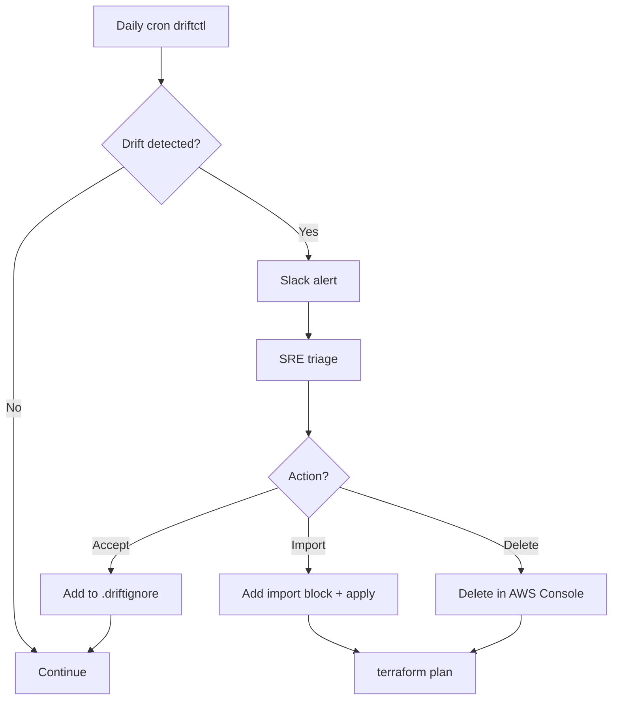

# 🎓 State management nâng cao + Drift detection — Cứu hạ tầng khỏi 200 resource bị xoá nhầm

> **Tác giả:** Mr.Rom\
> **Phiên bản:** v2.0.1\
> **Tạo lúc:** 24/05/2026\
> **Cập nhật:** 13/06/2026\
> **Level:** Intermediate\
> **Tags:** [MUST-KNOW]\
> **Yêu cầu trước:** [Atlantis — GitOps cho Terraform/Terragrunt](02_atlantis-gitops-for-iac.md), nắm cơ bản về Terraform state.

> 🎯 *Bài basic đã dạy state là gì và cách dùng backend S3/DynamoDB. Nhưng production luôn ném ra những tình huống mà bài cơ bản không chạm tới: hạ tầng *drift* (có người sửa tay ngoài Terraform), refactor đổi tên module mà không muốn recreate, import resource đã tồn tại vào Terraform, hay state hỏng phải khôi phục khẩn cấp. Bài này đi sâu vào các thao tác state nâng cao, dựng workflow tự động phát hiện drift bằng driftctl, và quy trình khôi phục an toàn khi mọi thứ vỡ.*

## 🎯 Sau bài này bạn sẽ

- [ ] Nắm chắc nhóm **lệnh state**: `mv`, `rm`, `pull`, `push`, `replace-provider` — đâu là lệnh an toàn, đâu là lệnh nguy hiểm.
- [ ] **Import** resource đã tồn tại vào Terraform (`terraform import` + sinh config tự động).
- [ ] **Refactor không recreate**: dùng `moved` block và `state mv`.
- [ ] Dựng **drift detection tự động**: driftctl + cron + alert.
- [ ] Biết quy trình **backup + khôi phục** state.
- [ ] Thực hiện **state surgery** (mổ state) cho tình huống khẩn cấp.
- [ ] Nắm workflow **gỡ bỏ module cũ** (migrate state sang module mới).
- [ ] Tránh được những thao tác state nguy hiểm nhất.

---

## Tình huống — `terraform plan` báo 200 thay đổi

Một chiều thứ Sáu, đồng nghiệp của bạn mở PR cho một thay đổi nhỏ xíu: thêm tag cho VPC. Lệnh chạy quen thuộc:

```bash
terragrunt plan
```

Nhưng kết quả thì không hề nhỏ:

```text
Plan: 12 to add, 5 to change, 200 to destroy.

# aws_instance.legacy[0] will be destroyed
# aws_security_group.unknown will be destroyed
# ... (200 resources)
```

200 resource mà Terraform cho rằng phải bị xoá. Đủ để tim ai cũng hẫng một nhịp. Lần theo dấu vết thì lộ ra cả một chuỗi thay đổi diễn ra âm thầm suốt nửa năm qua, không ai cập nhật lại Terraform:

- Sáu tháng trước, đội ops thêm tay vài EC2 instance để chữa cháy một sự cố.
- AWS tự thêm security group cho ELB.
- IAM role bị AWS tự xoay vòng (*rotate*) theo lịch.
- State của Terraform thì chưa từng được cập nhật theo những thay đổi đó.

Đây chính là *drift*: trạng thái thực tế trên cloud đã có 200 resource mà Terraform không hề biết tới. Và nếu cứ thế bấm `apply`, Terraform sẽ xoá sạch 200 resource đó — đồng nghĩa một cú *outage* (sập dịch vụ) ngay trong giờ làm việc.

Tình huống được leo thang lên đội SRE trực, mất nhiều giờ điều tra trước khi quyết định: import toàn bộ resource vào Terraform rồi mới tiếp tục. Bài học rút ra rất rõ ràng — phải có driftctl chạy cron mỗi ngày để drift không bao giờ tích tụ được tới mức nguy hiểm như vậy nữa. Đó chính là những gì bài này sẽ dựng cho bạn.

---

## 1️⃣ Ôn nhanh — Terraform state là gì

Trước khi mổ xẻ state, cần một mô hình tư duy đủ chắc để mọi thao tác phía sau không còn đáng sợ.

🪞 **Ẩn dụ**: *Terraform state giống như **bản đồ kho hàng**. Code là "danh sách tài sản đáng lẽ phải có", còn state là "bản đồ thực tế ai đang nằm ở đâu". Drift là khi bản đồ lệch khỏi thực tế — có người dời hàng mà không báo. State surgery là việc bạn ngồi chỉnh lại bản đồ cho khớp thực tế. Còn driftctl chính là anh nhân viên đi kiểm kho định kỳ để phát hiện chỗ lệch sớm.*

### Khái niệm state

State (`terraform.tfstate`) là cầu nối ánh xạ giữa hai thế giới:

- **Resource trong code** (ví dụ `aws_instance.web` của Terraform) ↔ **resource thực trên cloud** (instance AWS với ID `i-abc123`).
- Lưu lại giá trị các thuộc tính (*attributes*).
- Theo dõi quan hệ phụ thuộc giữa các resource.

Không có state, Terraform không thể phân biệt nổi: "VPC này là cái mình tạo ra, hay của người khác?". Đó là lý do state là trái tim của mọi thứ.

### File state trông như thế nào

State là một **snapshot dạng JSON** chứa metadata của mọi resource mà Terraform quản lý — id, attributes, dependencies, cây phân cấp module. Mỗi lần `apply` thành công, bộ đếm `serial` tăng thêm một. Dưới đây là một mảnh state điển hình để bạn hình dung cấu trúc:

```json
{
  "version": 4,
  "terraform_version": "1.7.0",
  "serial": 42,
  "lineage": "uuid-1234-...",
  "outputs": { ... },
  "resources": [
    {
      "module": "module.vpc",
      "mode": "managed",
      "type": "aws_vpc",
      "name": "main",
      "provider": "provider[\"registry.terraform.io/hashicorp/aws\"]",
      "instances": [
        {
          "schema_version": 1,
          "attributes": { "id": "vpc-abc123", "cidr_block": "10.0.0.0/16", ... }
        }
      ]
    }
    // ... more resources
  ]
}
```

Nhìn vào đây bạn sẽ thấy mỗi resource lưu trọn id thật trên cloud cùng các attribute — chính là cái "bản đồ" mà ẩn dụ nhắc tới.

### Backend lưu state

Việc chọn backend đúng quyết định trực tiếp chuyện cả team có làm việc chung được hay không. File local (mặc định) chỉ ổn cho dev làm một mình; còn production thì gần như mặc định là S3 + DynamoDB lock — đúng khuyến nghị của HashiCorp:

- **Local** (file `terraform.tfstate`): tệ cho làm việc nhóm vì không ai khoá được state, dễ ghi đè lẫn nhau.
- **Remote** (S3 + DynamoDB lock): chuẩn của production.

```hcl
terraform {
  backend "s3" {
    bucket = "acme-tfstate"
    key    = "dev/us-east-1/vpc/terraform.tfstate"
    region = "us-east-1"
    encrypt = true
    dynamodb_table = "acme-tfstate-lock"
  }
}
```

---

## 2️⃣ Nhóm lệnh state

Các lệnh `terraform state` chia làm hai nhóm rạch ròi: nhóm chỉ đọc (an toàn) và nhóm sửa state trực tiếp (nguy hiểm). Phân biệt được hai nhóm này là điều kiện tiên quyết trước khi đụng tới state thật.

### Lệnh đọc (an toàn)

Bốn lệnh dưới đây đều **read-only** — chỉ đọc, không đổi gì, nên dùng thoải mái. Đây là bộ công cụ điều tra đầu tiên khi bạn cần debug vấn đề về state:

```bash
# List resources in state
terraform state list

# Show details of resource
terraform state show <resource>
# e.g., terraform state show aws_vpc.main

# Pull state (read-only download)
terraform state pull > current.tfstate

# Tofu/Terragrunt
terragrunt state list
terragrunt state show <resource>
```

### Lệnh sửa state (NGUY HIỂM)

Ngược lại, ba lệnh sau **ghi thẳng vào state**: `mv` (đổi tên), `rm` (gỡ khỏi tracking), `push` (ghi đè). Mỗi lệnh là một con dao hai lưỡi — chạy sai một cái là mất luôn khả năng theo dõi hạ tầng:

```bash
# Rename resource in state (no AWS change)
terraform state mv <source> <dest>
# e.g., terraform state mv aws_vpc.old aws_vpc.new

# Remove resource from state (resource STAYS in AWS, just Terraform forgets it)
terraform state rm <resource>

# Replace provider reference
terraform state replace-provider <old> <new>

# Push modified state back (DANGER!)
terraform state push <file>
```

⚠️ **Nhóm lệnh này sửa state trực tiếp. Sai một bước là state hỏng (*corruption*).** Vì vậy, mỗi khi đụng vào, luôn theo đúng ba bước phòng thân:

1. Backup trước: `terraform state pull > backup-$(date +%s).tfstate`.
2. Thử ở môi trường non-prod trước.
3. Chạy `terraform plan` sau đó để xác nhận state vẫn khớp code.

### Các tình huống dùng `terraform state mv`

`state mv` toả sáng nhất khi bạn muốn đổi cách Terraform "gọi tên" một resource mà không hề muốn tạo lại nó. Ba tình huống điển hình:

**Tình huống 1** — Đổi tên resource trong code mà không recreate:

```hcl
# Before: aws_vpc.old
# After: aws_vpc.new

# Terraform would: destroy aws_vpc.old + create aws_vpc.new = downtime!

# Use state mv instead:
terraform state mv aws_vpc.old aws_vpc.new
# Now plan: no changes
```

Nếu chỉ đổi tên trong code rồi `apply`, Terraform sẽ hiểu là "xoá cái cũ, tạo cái mới" — tức downtime. `state mv` chỉ đổi nhãn trong bản đồ, không đụng tới resource thật.

**Tình huống 2** — Đưa resource vào trong một module:

```bash
terraform state mv aws_vpc.main module.vpc.aws_vpc.main
```

**Tình huống 3** — Chuyển resource giữa hai module:

```bash
terraform state mv module.old.aws_vpc.main module.new.aws_vpc.main
```

### Các tình huống dùng `terraform state rm`

`state rm` dùng khi bạn muốn Terraform "quên" một resource đi mà không xoá nó khỏi cloud. Hai tình huống hay gặp:

**Tình huống 1** — Resource bị xoá tay trên AWS, Terraform chưa biết:

```bash
# Resource gone in AWS, Terraform state still has it
# Plan would try to "destroy" non-existent resource = error
terraform state rm aws_vpc.deleted
# Now plan: clean
```

**Tình huống 2** — Chuyển quyền quản lý sang Terraform của team khác:

```bash
# This team's state forgets resource
terraform state rm aws_vpc.shared
# Other team imports same resource into their state
```

⚠️ Nhớ kỹ: `state rm` **không xoá resource khỏi cloud** — nó chỉ làm Terraform quên đi sự tồn tại của resource đó.

---

## 3️⃣ `moved` block — refactor kiểu hiện đại

Từ Terraform 1.1, có một cách refactor khai báo (*declarative*) gọn hơn hẳn `state mv`: thay vì gõ lệnh CLI riêng, bạn ghi luôn ý định "đổi tên" vào trong file `.tf`, và Terraform tự hiểu khi `plan`.

```hcl
# old.tf
resource "aws_vpc" "old_name" {
  cidr_block = "10.0.0.0/16"
}

# new.tf (after rename)
resource "aws_vpc" "new_name" {
  cidr_block = "10.0.0.0/16"
}

moved {
  from = aws_vpc.old_name
  to   = aws_vpc.new_name
}
```

→ Khi chạy `terraform plan`, Terraform tự phát hiện đây là đổi tên, không cần chạy `state mv` tay.

Cũng cùng cú pháp đó, bạn có thể dời resource vào trong một module:

```hcl
moved {
  from = aws_vpc.main
  to   = module.networking.aws_vpc.main
}
```

### So sánh với `state mv`

Vậy khi nào nên dùng cái nào? Bảng dưới đặt hai cách cạnh nhau theo những tiêu chí thực sự quan trọng khi làm việc nhóm và chạy qua Atlantis:

| Khía cạnh | `state mv` | `moved` block |
|---|---|---|
| Imperative hay declarative | Imperative | Declarative |
| Nằm trong code hay CLI | CLI (lệnh riêng) | Trong file `.tf` (review được qua PR) |
| Thân thiện với Atlantis | Không (phải gõ CLI tay) | Có (chỉ cần commit code) |
| Backup state trước khi chạy | Tự làm tay | Tự động qua plan |
| Dọn dẹp sau khi xong | Tay (có thể giữ lại) | Xoá block được sau khi đã apply |

**Khuyến nghị 2026**: ưu tiên `moved` block cho mọi refactor thông thường. Chỉ để dành `state mv` cho tình huống khẩn cấp hoặc khi dời resource giữa các state khác nhau.

---

## 4️⃣ Import resource đã tồn tại

### Vấn đề

Ai đó tạo tay một EC2 instance qua Console, giờ bạn muốn đưa nó vào cho Terraform quản lý. Có hai lựa chọn, và chúng chênh lệch nhau một trời một vực về rủi ro:

- **Destroy rồi recreate** qua Terraform: dính downtime, có thể mất data.
- **Import** resource có sẵn vào state: không phải tạo lại gì cả.

Production gần như luôn chọn import.

### Workflow import cổ điển

Cách cổ điển gồm bốn bước: viết code khớp với resource thật, import vào state, rồi `plan` để dò xem còn lệch không, và chỉnh code tới khi `plan` sạch:

```bash
# 1. Write Terraform code for the resource (no `id` field)
cat <<EOF > legacy-server.tf
resource "aws_instance" "legacy" {
  ami           = "ami-0c55b159cbfafe1f0"
  instance_type = "t3.medium"
  tags          = { Name = "legacy-server" }
}
EOF

# 2. Import existing AWS resource to Terraform state
terraform import aws_instance.legacy i-0abc123def456

# 3. Run plan to see if code matches actual
terraform plan
# Output: no changes (if code matches) OR show diff (if mismatch)

# 4. Adjust code until plan shows no changes
```

⚠️ Điểm đau của cách này: bạn phải viết code bằng tay rồi *hy vọng* nó khớp đúng thực tế trên AWS. Với resource nhiều thuộc tính, đây là việc mò mẫm tốn công.

### Import hiện đại (Terraform 1.5+)

Từ Terraform 1.5, có `import` block khai báo ngay trong code, để Terraform tự đọc resource và sinh config giúp bạn:

```hcl
import {
  to = aws_instance.legacy
  id = "i-0abc123def456"
}

resource "aws_instance" "legacy" {
  # Code (Terraform fills in via plan-generated config)
}
```

Chạy lệnh sau để Terraform đọc resource trên AWS và sinh ra `generated.tf` với đầy đủ thuộc tính:

```bash
terraform plan -generate-config-out=generated.tf
```

→ Việc của bạn chỉ còn là **copy lại và dọn dẹp** đoạn config sinh tự động, thay vì mò từng attribute. Sau đó apply để hoàn tất import vào state:

```bash
terraform apply
# Resource imported into state
```

### Workflow import hàng loạt

Quay lại tình huống 200 resource drift ở đầu bài. Import từng cái bằng tay là bất khả thi, nên ta script hoá: dùng driftctl để liệt kê resource chưa được quản lý, sinh `import` block hàng loạt, rồi để Terraform tự sinh config:

```bash
# 1. List resources in AWS not in Terraform state
driftctl scan --from tfstate+s3://acme-tfstate/dev/us-east-1/vpc/terraform.tfstate

# 2. Output: list of unmanaged resources
# Example output:
# Found 200 unmanaged resources:
#   - aws_instance.i-abc1: legacy-1
#   - aws_security_group.sg-xyz: emergency-rule
#   ...

# 3. Decide: import (manage in Terraform) or delete (out-of-band)
# Import:
for instance_id in $(driftctl scan ... | grep aws_instance | awk '{print $2}'); do
  echo "import { to = aws_instance.imported_${instance_id}; id = \"${instance_id}\" }" >> imports.tf
done

# 4. Generate config:
terraform plan -generate-config-out=generated.tf

# 5. Review + apply:
terraform apply
```

→ Nhờ script, việc import 200 resource từ chỗ bất khả thi trở thành làm được trong một buổi.

---

## 5️⃣ Tự động phát hiện drift

### Kiểm tra drift thủ công

Cách thủ công nhất là dùng chính Terraform để refresh state khỏi thực tế:

```bash
terraform plan -refresh-only
# Output: "X changes detected by refresh"
```

→ Cách này phát hiện được drift, nhưng có một điểm yếu chí mạng: thủ công nghĩa là **không ai chạy nó mỗi ngày**. Drift cứ thế tích tụ — đúng như câu chuyện 200 resource ở đầu bài.

### driftctl — quét drift tự động

Đây là lúc cần một công cụ chuyên dụng chạy tự động thay con người. [driftctl (Snyk)](https://github.com/snyk/driftctl) là công cụ mã nguồn mở chuyên so sánh IaC với trạng thái thật trên cloud (⚠️ **lưu ý 2026**: driftctl đã được Snyk đưa vào **maintenance mode**/archive — vẫn chạy được, tốt để học khái niệm, nhưng project mới nên cân nhắc `terraform plan -detailed-exitcode` native hoặc Spacelift/env0):

```bash
# Install
brew install driftctl

# Scan single state
driftctl scan --from tfstate+s3://acme-tfstate/dev/us-east-1/vpc/terraform.tfstate

# Output:
# Found resources from your IaC: 50
# Found resources in cloud: 250
# 
# Drift:
#   - 200 unmanaged resources (in cloud, not in IaC)
#   - 5 missing resources (in IaC, not in cloud — deleted manually?)
#   - 3 modified resources (attributes drift)
```

Output của driftctl tách drift làm ba loại rất rõ: resource thừa trên cloud (chưa được quản lý), resource thiếu (có trong IaC nhưng đã bị xoá tay), và resource bị sửa thuộc tính. Mỗi loại tương ứng một hướng xử lý khác nhau.

### Quét drift hằng ngày bằng cron

Sức mạnh thật của driftctl đến khi bạn để nó chạy tự động mỗi ngày qua một workflow CI. Workflow dưới đây quét drift theo ma trận môi trường × region, alert qua Slack nếu phát hiện drift, và lưu lại báo cáo:

```yaml
# .github/workflows/drift-detection.yml
name: Drift Detection
on:
  schedule:
    - cron: '0 6 * * *'    # daily 6am UTC
  workflow_dispatch:

jobs:
  drift:
    runs-on: ubuntu-latest
    strategy:
      matrix:
        env: [dev, staging, prod]
        region: [us-east-1, us-west-2, eu-west-1]
    steps:
      - uses: actions/checkout@v4
      - uses: snyk/driftctl@v2
      
      - name: Scan ${{ matrix.env }}-${{ matrix.region }}
        run: |
          driftctl scan \
            --from tfstate+s3://acme-tfstate/${{ matrix.env }}/${{ matrix.region }}/terraform.tfstate \
            --output json://drift.json
      
      - name: Alert if drift
        run: |
          DRIFT=$(jq '.summary.total_unmanaged' drift.json)
          if [ "$DRIFT" -gt 0 ]; then
            curl -X POST $SLACK_WEBHOOK -d "{
              \"text\": \"🚨 Drift in ${{ matrix.env }}/${{ matrix.region }}: $DRIFT unmanaged resources\"
            }"
          fi
      
      - uses: actions/upload-artifact@v3
        with:
          name: drift-report-${{ matrix.env }}-${{ matrix.region }}
          path: drift.json
```

→ Cứ mỗi sáng, hệ thống tự quét, bắn alert lên Slack nếu có drift, và lưu báo cáo lại. Drift không còn cơ hội âm thầm tích tụ.

### Workflow xử lý drift

Phát hiện ra drift mới chỉ là một nửa câu chuyện; nửa còn lại là quyết định làm gì với nó. Sơ đồ dưới đây vẽ lại luồng xử lý từ lúc cron quét tới lúc verify:



Ba nhánh quyết định ở đây tương ứng ba thái độ: kéo resource về cho Terraform quản (import), dọn nó đi (delete), hoặc chấp nhận drift này là bình thường (whitelist). Nhánh cuối dẫn ta tới `.driftignore`.

### `.driftignore` — chấp nhận drift đã biết

Một số resource vốn dĩ *sẽ* drift một cách hợp lệ, alert về chúng chỉ tổ gây nhiễu. Vài ví dụ điển hình:

- IAM session credentials (bị AWS xoay vòng tự động).
- CloudWatch log retention (đôi khi bị tự đặt).
- ECR repository policy (đôi khi ops chỉnh tay).

Với những trường hợp này, ta khai báo chúng vào `.driftignore` để driftctl bỏ qua:

```text
# .driftignore
*aws_iam_role.eks_node_*           # IAM auto-rotation
*aws_cloudwatch_log_group.lambda_* # CloudWatch auto-managed
```

→ driftctl sẽ lờ những resource này đi. Nhớ ghi chú lý do cho mỗi dòng để người sau hiểu vì sao nó được bỏ qua.

---

## 6️⃣ Backup + khôi phục state

State là tài sản quý nhất, nên phải có lưới an toàn cho nó. May mắn là S3 versioning lo gần hết phần này.

### Dùng S3 versioning để backup state

Chỉ cần bật versioning trên bucket chứa state, mỗi lần state đổi sẽ tự sinh một phiên bản cũ được giữ lại:

```hcl
resource "aws_s3_bucket_versioning" "tfstate" {
  bucket = aws_s3_bucket.tfstate.id
  versioning_configuration {
    status = "Enabled"
  }
}
```

→ Mỗi thay đổi state đẻ ra một version mới; các version cũ được giữ lại từ 90 ngày trở lên (cấu hình lifecycle ở phần best practice).

### Khôi phục sau khi lỡ destroy

**Kịch bản**: có người chạy nhầm `terragrunt destroy` lên môi trường sai. State giờ rỗng, và bạn cần rollback. Quy trình là tìm lại version trước cú destroy, tải về, kiểm tra rồi đẩy lại làm state hiện hành:

```bash
# List state versions in S3
aws s3api list-object-versions \
  --bucket acme-tfstate \
  --prefix dev/us-east-1/vpc/terraform.tfstate

# Output:
# Versions:
#   - VersionId: abc123, LastModified: 2026-05-24T09:00:00Z (current — empty after destroy)
#   - VersionId: def456, LastModified: 2026-05-24T08:00:00Z (before destroy)
#   - VersionId: ghi789, LastModified: 2026-05-23T15:00:00Z

# Download previous version
aws s3api get-object \
  --bucket acme-tfstate \
  --key dev/us-east-1/vpc/terraform.tfstate \
  --version-id def456 \
  restored.tfstate

# Verify
terraform show -json restored.tfstate | jq '.values.root_module.resources | length'

# Restore — push as current state
aws s3 cp restored.tfstate s3://acme-tfstate/dev/us-east-1/vpc/terraform.tfstate
```

→ State đã được khôi phục. Nhưng đây là điểm cực kỳ quan trọng: **resource thật trên cloud vẫn đã bị xoá** — bạn cần tạo lại chúng:

```bash
terraform apply
# Plan: 20 to add (recreate destroyed resources)
```

→ Resource được dựng lại dựa trên state. Lưu ý: **data có thể đã mất** (RDS, v.v.) — chuyện đó phụ thuộc vào backup riêng của từng dịch vụ, không phải state lo.

### Script backup state

Ngoài versioning của S3, một script backup chạy cron mỗi ngày sang một bucket riêng cho bạn thêm một lớp an toàn nữa:

```bash
#!/bin/bash
# backup-state.sh — run daily via cron

DATE=$(date +%Y%m%d-%H%M)
BACKUP_BUCKET="acme-tfstate-backups"

for env in dev staging prod; do
  for region in us-east-1 us-west-2 eu-west-1; do
    aws s3 cp \
      s3://acme-tfstate/$env/$region/ \
      s3://$BACKUP_BUCKET/$DATE/$env/$region/ \
      --recursive
  done
done

# Cleanup backups > 90 days
aws s3 ls s3://$BACKUP_BUCKET/ | awk '$1 < "'$(date -d '-90 days' +%Y%m%d)'"' \
  | xargs -I {} aws s3 rm s3://$BACKUP_BUCKET/{} --recursive
```

→ Backup mỗi ngày, giữ lại 90 ngày.

---

## 7️⃣ State surgery — thao tác khẩn cấp

Đôi khi state rơi vào tình trạng không khớp code và không lệnh thông thường nào chữa được. Lúc đó cần "mổ" state. Đây luôn là phương án cuối cùng, và mỗi ca dưới đây minh hoạ một dạng hỏng hay gặp.

### Ca 1: Hai PR sửa cùng một resource, state không nhất quán

```bash
terraform plan
# Error: state file has resource that doesn't exist in code
```

**Bước 1** — Pull state ra để soi:

```bash
terraform state pull > current.tfstate
jq '.resources[] | .type + "." + .name' current.tfstate
```

**Bước 2** — Xác định resource mồ côi (*orphan*):

```text
aws_instance.legacy   <- not in code anymore
```

**Bước 3** — Quyết định hướng xử lý:

- Resource vẫn còn trên AWS? → giữ lại, thêm nó vào code.
- Resource đã bị xoá? → gỡ khỏi state: `terraform state rm aws_instance.legacy`.

### Ca 2: Xung đột version của provider

```bash
terraform plan
# Error: provider hashicorp/aws version mismatch
```

**Nguyên nhân**: state được tạo bằng provider v5.x, giờ lại đang dùng v4.x.

**Cách chữa**: nâng provider hoặc ghim version trong code:

```bash
terraform init -upgrade
# OR pin in code:
required_providers {
  aws = { version = "~> 5.0" }
}
```

Nếu provider thực sự khác hẳn (ví dụ đổi từ `hashicorp/aws` sang một bản fork của cộng đồng), dùng:

```bash
terraform state replace-provider \
  hashicorp/aws \
  community/aws
```

### Ca 3: State JSON bị hỏng

State bị mất newline hoặc bị editor làm hỏng định dạng:

```bash
terraform state pull > current.tfstate
# Error: state file corrupted
```

**Cách chữa**:

1. Khôi phục từ S3 versioning (phiên bản trước).
2. Hoặc dựng lại state bằng `import` (nếu chi phí chấp nhận được).

⚠️ TUYỆT ĐỐI không sửa state JSON bằng tay. Luôn dùng lệnh `state mv/rm` vì chúng có kiểm tra hợp lệ.

---

## 8️⃣ Workflow gỡ bỏ module cũ

### Kịch bản

Module cũ `vpc-old` đã bị khai tử (*deprecated*). Module mới `vpc-new` có cấu trúc khác. **Mục tiêu**: migrate toàn bộ môi trường từ `vpc-old` sang `vpc-new` mà không phải tạo lại VPC. Đây là kiểu việc đòi hỏi đi từng bước cẩn thận, và thứ tự dưới đây là an toàn nhất.

### Bước 1: Chạy module `vpc-new` + import resource có sẵn

Làm ở dev trước:

```hcl
# Old: module.vpc_old
module "vpc_new" {
  source = "../../modules/vpc-new"
  cidr_block = "10.0.0.0/16"
}

import {
  to = module.vpc_new.aws_vpc.main
  id = data.terraform_remote_state.old.outputs.vpc_id
}
```

```bash
terragrunt plan
# Plan: import vpc + no changes if config matches
terragrunt apply
```

### Bước 2: Gỡ module cũ khỏi state

```bash
# After new module manages VPC
terragrunt state rm module.vpc_old
```

→ Giờ `vpc-old` không còn trong state nữa. Chỉ còn `vpc-new` quản lý VPC.

### Bước 3: Xoá code của module cũ

```bash
git rm -rf modules/vpc-old/
git commit -m "Remove deprecated vpc-old module"
```

### Bước 4: Lặp lại cho từng môi trường

Theo thứ tự rủi ro tăng dần: dev → staging → prod.

### Bước 5: Ghi tài liệu

Ghi rõ vào CHANGELOG để cả team biết đây là thay đổi breaking và có hướng dẫn migrate:

```text
## v2.0.0
- BREAKING: Deprecated `vpc-old` module. Migrate to `vpc-new`.
- Migration guide: docs/migrations/vpc-old-to-new.md
```

### Migrate bằng `moved` block (nâng cao)

Nếu việc refactor mang tính tương đương về ngữ nghĩa (tên attribute khớp nhau), `moved` block là cách sạch hơn cả — khỏi cần import:

```hcl
moved {
  from = module.vpc_old.aws_vpc.main
  to   = module.vpc_new.aws_vpc.main
}
```

→ Gọn hơn, không phải import nếu tên attribute đã khớp.

---

## 💡 Cạm bẫy thường gặp & Best practice

### ❌ Cạm bẫy: `state rm` xong rồi quên import lại

```bash
terraform state rm aws_vpc.main
# Resource still in AWS, but Terraform forgot
# Next apply: tries to create new VPC → already exists → fail
```

→ **Fix**: Sau `state rm`, phải chọn một trong hai hướng, đừng để resource lửng lơ:

- Import sang vị trí mới: `terraform import <new> <id>`.
- Hoặc xoá hẳn khỏi cloud qua AWS Console.

### ❌ Cạm bẫy: Sửa state JSON bằng tay

→ Rất dễ làm hỏng JSON, và lock có thể vỡ theo.

→ **Fix**: Luôn dùng lệnh `terraform state` — chúng có kiểm tra hợp lệ trước khi ghi.

### ❌ Cạm bẫy: Force-unlock trong lúc đang apply

```bash
terraform force-unlock <lock-id>
# Other apply running → conflict → state corruption
```

→ **Fix**: Chỉ unlock khi *chắc chắn* không có apply nào đang chạy. Kiểm tra UI của Atlantis hoặc bảng DynamoDB trước.

### ❌ Cạm bẫy: Không backup state trước thao tác phá huỷ

```bash
terraform state rm module.legacy
# Oops, removed wrong thing
```

→ **Fix**: backup trước, rồi mới làm việc rủi ro:

```bash
terraform state pull > backup-$(date +%s).tfstate
# Then risky op
# If wrong: aws s3 cp backup.tfstate s3://bucket/state.tfstate
```

### ❌ Cạm bẫy: driftctl scan quá rộng

→ Quét cả AWS account: hàng nghìn resource, output ngợp không đọc nổi.

→ **Fix**:

- Lọc theo tag: `driftctl scan --filter "Tags['Environment'] == 'dev'"`.
- Quét theo từng state file riêng.
- Dùng `.driftignore` cho nhiễu đã biết.

### ❌ Cạm bẫy: Để drift quá lâu không xử lý

→ Slack alert "drift detected" mỗi ngày — riết rồi cả team ngó lơ.

→ **Fix**:

- Coi drift là vấn đề hạng nhất (*first-class issue*). Mỗi alert tạo một ticket.
- Họp review drift định kỳ.
- Drift ở prod = sự cố mức SEV-2.

### ✅ Best practice: Giữ backup state từ 90 ngày trở lên

```hcl
resource "aws_s3_bucket_lifecycle_configuration" "tfstate" {
  bucket = aws_s3_bucket.tfstate.id
  
  rule {
    id = "versioning"
    status = "Enabled"
    noncurrent_version_expiration {
      noncurrent_days = 90
    }
  }
}
```

### ✅ Best practice: Dùng `moved` block để refactor

Declarative tốt hơn imperative, và review được qua PR.

### ✅ Best practice: Ghi tài liệu cho thao tác state

Viết hẳn vào wiki quy trình "Làm sao chạy `state mv` an toàn":

1. Backup state.
2. Báo cho team trên Slack.
3. Khoá thủ công.
4. Chạy lệnh.
5. Verify bằng plan.
6. Ghi vào runbook.

→ Để SRE mới vào còn theo được.

### ✅ Best practice: Tự động import cho các pattern drift đã biết

```python
# auto-import.py — runs after driftctl
import json, subprocess

drift = json.load(open('drift.json'))
for resource in drift['unmanaged']:
    if resource['type'] == 'aws_instance' and 'auto-import' in resource['tags']:
        # Generate import block + write to imports.tf
        with open('imports.tf', 'a') as f:
            f.write(f'import {{ to = aws_instance.imp_{resource["id"]}; id = "{resource["id"]}" }}\n')
```

→ Với loại drift đã biết là sẽ xảy ra, tự động hoá luôn việc import.

---

## 🧠 Tự kiểm tra (Self-check)

Năm câu dưới chạm đúng những chỗ dễ nhầm nhất khi làm việc với state nâng cao. Thử tự trả lời trước khi mở đáp án — đó là cách nhanh nhất để biết mình hiểu thật hay chỉ thấy quen.

**Q1.** `state mv` và `moved` block — khi nào dùng cái nào?

<details>
<summary>💡 Đáp án</summary>

**`state mv`**:
- Lệnh CLI, imperative.
- Tác động thẳng vào file state.
- Chạy tay, là một bước riêng.

```bash
terraform state mv aws_vpc.old aws_vpc.new
```

**Ưu điểm**:
- Nhanh cho thao tác lẻ một lần.
- Chạy được với cả Terraform đời cũ.

**Nhược điểm**:
- Không nằm trong code, không review được qua PR.
- Atlantis không tự chạy giúp.
- Dễ quên nếu có nhiều môi trường.

**`moved` block** (Terraform 1.1+):
- Nằm trong code `.tf`, declarative.
- `terraform plan` tự phát hiện.

```hcl
moved {
  from = aws_vpc.old
  to   = aws_vpc.new
}
```

**Ưu điểm**:
- Review được qua PR (dev khác thấy được ý định refactor).
- Atlantis tự apply.
- Idempotent qua các môi trường (commit + apply từng env).
- Giữ trong code làm lịch sử, hoặc xoá sau khi đã apply khắp nơi.

**Nhược điểm**:
- Cần Terraform đời mới.
- Một số trường hợp đặc biệt không hỗ trợ (ví dụ dời giữa các state).

**Khuyến nghị 2026**:
- **`moved` block** cho refactor code (đổi tên, dời vào/ra module).
- **`state mv`** cho khẩn cấp, thao tác giữa các state, sửa lẻ.

**Best practice**:
- Thêm `moved` block trong cùng PR với refactor.
- Apply từng env (Atlantis lo từng cái).
- Xoá `moved` block sau khi đã apply khắp nơi (dọn dẹp).
</details>

**Q2.** Vì sao backup state nên giữ từ 90 ngày trở lên?

<details>
<summary>💡 Đáp án</summary>

Vì các sự cố state có khoảng thời gian phát hiện rất khác nhau, và backup phải đủ dài để phủ trường hợp tệ nhất:

1. **Lỡ tay destroy** (phát hiện trong vài phút):
   - Hoảng ngay lập tức. Khôi phục version trước đó (cách đây 1 giờ).
   - Cần: giữ lại 1 giờ trở lên.

2. **Drift bị phát hiện sau nhiều tuần**:
   - Muốn so sánh hiện tại với "lúc trước khi drift bắt đầu".
   - Cần: giữ lại nhiều tuần.

3. **Audit tuân thủ (compliance)**:
   - Auditor hỏi: "Cho xem state vào ngày X".
   - Cần: giữ lại nhiều tháng.

4. **Điều tra sự cố (forensic)**:
   - Sự cố cách đây 60 ngày, muốn xác minh các thay đổi Terraform.
   - Cần: từ 90 ngày trở lên.

5. **Hỏng âm thầm**:
   - State sai lệch tinh vi suốt nhiều tuần trước khi bị phát hiện.
   - Cần: giữ lâu để tìm được mốc baseline lành lặn.

**Chi phí**:
- File state điển hình khoảng 100KB - 5MB.
- S3 versioning: $0.023/GB/tháng.
- 100 state files × 1MB × 100 versions × 90 ngày = ~10GB = $0.23/tháng.

→ **Chi phí không đáng kể, đổi lại lớp bảo hiểm cực lớn.**

**Khuyến nghị**:
- Bật **S3 versioning** trên bucket state.
- Đặt **lifecycle rule**: version cũ giữ 90 ngày, sau đó chuyển sang Glacier 1 năm, rồi xoá.

```hcl
resource "aws_s3_bucket_lifecycle_configuration" "tfstate" {
  rule {
    noncurrent_version_transition {
      noncurrent_days = 90
      storage_class = "GLACIER_IR"
    }
    noncurrent_version_expiration {
      noncurrent_days = 365
    }
  }
}
```

→ 90 ngày nóng, 1 năm lạnh, rồi xoá. Rẻ.

**Bonus**: Versioning còn chống được:
- Lỡ tay `terraform destroy`.
- Bug trong Terraform làm hỏng state.
- Kẻ xấu sửa state.

→ Kết hợp với mã hoá state file (KMS) = bảo vệ vững chắc.
</details>

**Q3.** Khi nào dùng `import` thay vì `state rm + recreate`?

<details>
<summary>💡 Đáp án</summary>

**Bối cảnh**: có resource AWS đã tồn tại nhưng chưa nằm trong Terraform. Bạn muốn Terraform quản lý nó.

**Phương án A: Import**

- Ưu điểm:
  - **Không downtime** — resource vẫn chạy.
  - **Không mất data** (RDS, S3, v.v.).
  - An toàn cho production.
- Nhược điểm:
  - Tốn công: phải viết code khớp với thực tế.
  - Rủi ro code lệch khỏi thực tế.

**Phương án B: State rm + recreate**

(Chỉ hợp lý nếu vòng đời resource cho phép tạo lại)

- Ưu điểm:
  - Code sạch (không phải khớp tay).
  - Terraform sở hữu hoàn toàn.
- Nhược điểm:
  - Downtime trong lúc recreate.
  - Mất data với resource có trạng thái.
  - IP/ID đổi → các phụ thuộc downstream vỡ.

**Ma trận quyết định**:

| Resource | Khuyến nghị |
|---|---|
| VPC, subnet, route table | Import (tránh đánh lại số IP) |
| RDS, DynamoDB | Import (không thì mất data) |
| S3 bucket | Import (data + tên bucket) |
| EC2 instance | Import (giữ uptime), HOẶC recreate nếu app stateless |
| Security group | Import hoặc recreate (tạo lại dễ) |
| Lambda function | Recreate được (không có data) |
| IAM role | Import (tránh làm vỡ các integration) |

**Nguyên tắc cho production**: **mặc định là import**. Chỉ recreate cho resource stateless và ít rủi ro.

**Import hàng loạt** (200 resource drift):
- Dùng `import` block + `terraform plan -generate-config-out=generated.tf`.
- Review code sinh ra, dọn dẹp.
- Test ở dev trước.

**Anti-pattern**:
- "Cứ destroy + recreate hết cho xong" — nhanh trong môi trường test, nhưng **thảm hoạ ở prod**.
- LUÔN kiểm tra kỹ trước khi destroy.
</details>

**Q4.** Phát hiện drift — cron hằng ngày hay realtime?

<details>
<summary>💡 Đáp án</summary>

**Cron hằng ngày**:
- driftctl scan một lần mỗi ngày.
- Slack alert nếu có drift.
- Review vào ngày làm việc kế tiếp.

**Ưu điểm**:
- Rẻ (một lần scan/ngày).
- Đủ dùng cho drift chậm.

**Nhược điểm**:
- Drift có thể tồn tại tới 24 giờ trước khi bị bắt.
- Thay đổi tay ngay sau lần scan → tồn tại 23 giờ không bị phát hiện.

**Phát hiện realtime (nâng cao)**:
- CloudTrail / AWS Config theo dõi mọi thay đổi.
- Webhook kiểm tra xem thay đổi có khớp Terraform không.
- Alert trong vài phút.

**Ưu điểm**:
- Bắt drift ngay lập tức.
- Audit được "ai đã sửa tay cái gì".

**Nhược điểm**:
- Tốn chi phí: CloudTrail + Config.
- Setup phức tạp.
- Nhiều false positive (mọi thay đổi đều bắn alert).

**Hybrid (khuyến nghị 2026)**:
1. **AWS Config rules**: phát hiện vi phạm compliance cụ thể (S3 public, IAM admin).
2. **driftctl cron hằng ngày**: bắt drift của Terraform.
3. **Họp review hằng tuần**: phân loại drift tích tụ.
4. **Theo mức độ quan trọng từng resource**: bật `prevent_destroy` cho resource trọng yếu.

**Bộ công cụ**:
- driftctl chạy hằng ngày.
- AWS Config Conformance Packs (bộ rule compliance có sẵn).
- Lambda + CloudTrail tuỳ biến cho pattern cụ thể (ví dụ "alert nếu ai đó chạy `terraform apply` ngoài Atlantis").

**Anti-pattern**: alert realtime trên mọi sự kiện CloudTrail = ngập trong nhiễu. Lọc chỉ còn **tạo/xoá resource**.

→ Cron hằng ngày là baseline tốt. Thêm realtime chọn lọc cho resource trọng yếu.
</details>

**Q5.** State file ngày càng phình to — làm gì?

<details>
<summary>💡 Đáp án</summary>

**Kích thước điển hình**:
- Một module: 10KB - 500KB.
- Prod lớn (100+ resource): 5MB - 50MB.

**Vấn đề khi state quá lớn**:
1. **Plan/apply chậm**: parse + diff lâu.
2. **Lock DynamoDB chậm**: ghi chậm hơn.
3. **Tốn RAM**: Terraform/Atlantis load state vào bộ nhớ.
4. **Refresh chậm**: mỗi lần refresh = gọi API cho từng resource.

**Dấu hiệu cần tách (split)**:
- State > 50MB.
- Plan > 5 phút.
- 1000+ resource trong một state.

**Cách refactor**: tách thành nhiều state (mỗi nhóm logic một state).

```text
Before:
  infrastructure/terraform.tfstate (50MB, all resources)

After:
  infrastructure/
    networking/terraform.tfstate (5MB)
    compute/terraform.tfstate (10MB)
    storage/terraform.tfstate (3MB)
    iam/terraform.tfstate (2MB)
```

→ Mỗi state nhỏ hơn, plan nhanh hơn, rủi ro được cô lập.

**Tham chiếu giữa các state**: `data "terraform_remote_state"` HOẶC `dependency` của Terragrunt.

**Các bước migrate**:
1. Backup state.
2. Tạo state file mới cho nhóm con.
3. `terraform state mv` resource sang state mới.
4. Cập nhật code để tham chiếu chéo state.
5. Verify bằng plan.

⚠️ Tốn công. Lên kế hoạch migrate vào lúc rảnh, test kỹ ở staging.

**Phòng ngừa**:
- Thiết kế state theo domain (network, compute, v.v.) ngay từ đầu.
- Terragrunt tự nhiên khuyến khích nhiều state nhỏ.
- Tránh anti-pattern "monolithic state".

**Bonus**: tách state = apply song song được (không còn lock toàn cục).
</details>

---

## ⚡ Tra cứu nhanh (Cheatsheet)

Phần tra nhanh cho lúc làm việc thật — gom theo nhóm: đọc state, sửa state, import, driftctl, S3 versioning, backup, force-unlock, và các block khai báo trong `.tf`.

```bash
# === Read state ===
terraform state list
terraform state show <resource>
terraform state pull > backup.tfstate
terraform state pull | jq '.resources | length'

# === Modify state (DANGER) ===
terraform state mv <source> <dest>
terraform state rm <resource>
terraform state replace-provider <old> <new>
terraform state push <file>      # rarely, after manual edit

# === Import ===
terraform import <resource> <id>
# Or modern (Terraform 1.5+):
terraform plan -generate-config-out=generated.tf

# === driftctl ===
driftctl scan --from tfstate+s3://bucket/path/state.tfstate
driftctl scan --output json://drift.json
driftctl scan --filter "Tags['Environment'] == 'dev'"

# === S3 versioning ===
aws s3api list-object-versions --bucket acme-tfstate --prefix dev/
aws s3api get-object --bucket acme-tfstate --key dev/vpc.tfstate --version-id <id> restored.tfstate

# === Backup state ===
terraform state pull > backup-$(date +%s).tfstate

# === Force unlock (emergency) ===
terraform force-unlock <lock-id>
terragrunt force-unlock <lock-id>
```

```hcl
# === moved block ===
moved {
  from = aws_vpc.old
  to   = aws_vpc.new
}

# === import block (Terraform 1.5+) ===
import {
  to = aws_instance.legacy
  id = "i-0abc123"
}

# === prevent_destroy ===
resource "aws_db_instance" "prod" {
  lifecycle {
    prevent_destroy = true
  }
}
```

---

## 📚 Từ Điển Thuật Ngữ (Glossary)

| Thuật ngữ | Tiếng Việt | Giải thích |
|---|---|---|
| **State** | Trạng thái | Ánh xạ code Terraform ↔ resource trên cloud |
| **State file** | File trạng thái | File JSON `terraform.tfstate` |
| **Remote backend** | Backend từ xa | State lưu trên S3/GCS/Azure (thay vì local) |
| **State lock** | Khoá state | Lock qua DynamoDB/blob để chặn sửa đồng thời |
| **Drift** | Lệch trạng thái | Trạng thái cloud ≠ trạng thái Terraform |
| **driftctl** | — | Công cụ mã nguồn mở phát hiện drift |
| **State import** | Nhập resource | Đưa resource cloud đã có vào Terraform state |
| **State migration** | Di trú state | Refactor cấu trúc state mà không tạo lại resource |
| **`moved` block** | — | Khai báo dời state (Terraform 1.1+) |
| **`import` block** | — | Khai báo import (Terraform 1.5+) |
| **State versioning** | Phiên bản hoá state | S3 versioning giữ lại các file state cũ |
| **State surgery** | Mổ state | Sửa state thủ công (phương án cuối) |
| **`prevent_destroy`** | — | Cài đặt lifecycle chặn xoá resource |
| **`create_before_destroy`** | — | Lifecycle đảm bảo tạo resource mới trước khi xoá cái cũ |
| **`replace-provider`** | — | Di trú state từ provider này sang provider khác |
| **Refresh** | Làm tươi | Cập nhật state từ trạng thái cloud thật (chỉ đọc) |
| **`terraform import`** | — | Lệnh import cổ điển qua CLI |
| **`.driftignore`** | — | File liệt kê drift dự kiến để driftctl bỏ qua |

---

## 🔗 Liên kết & Tài nguyên

### 🧭 Định hướng lộ trình học

- ⬅️ **Bài trước:** [Atlantis — GitOps cho Terraform/Terragrunt](02_atlantis-gitops-for-iac.md)
- ➡️ **Bài tiếp theo:** [IaC Alternatives — Pulumi vs CDK vs Crossplane](04_pulumi-cdk-crossplane.md)
- ↑ **Về cụm:** [IaC — Infrastructure as Code](../../README.md)

### 🧩 Các chủ đề có thể bạn quan tâm

- 🏗️ [State & Backend — Production essentials](../01_basic/02_state-and-backend.md) — nền tảng state
- 📊 [SRE practices — SLO + Error budget + Postmortem + On-call](../../../observability/lessons/02_intermediate/04_sre-practices.md) — alert khi có drift

### 🌐 Tài nguyên tham khảo khác

- 📖 [Terraform state docs](https://developer.hashicorp.com/terraform/language/state)
- 📖 [State commands](https://developer.hashicorp.com/terraform/cli/state)
- 📖 [Import block](https://developer.hashicorp.com/terraform/language/import)
- 📖 [moved block](https://developer.hashicorp.com/terraform/language/modules/develop/refactoring)
- 📖 [driftctl](https://github.com/snyk/driftctl)
- 📖 [AWS Config](https://docs.aws.amazon.com/config/)
- 📖 [Terraform state — sensitive data](https://developer.hashicorp.com/terraform/language/state/sensitive-data)

---

## 📌 Nhật ký thay đổi (Changelog)

- **v1.0.0 (24/05/2026)** — Bản đầu tiên. Lesson 03 intermediate. State commands deep (mv/rm/pull/push/replace-provider) + import (classic + modern block) + moved block + driftctl automation + daily cron drift detection + S3 versioning backup/recovery + state surgery + module deprecation workflow. 6 pitfall + 4 best practice + 5 self-check + cheatsheet.
- **v1.1.0 (25/05/2026)** — Apply Blueprint v0.5.4+ §3.6: thêm lead-in trước State files JSON + State backend + Read commands + Modify commands warnings.
- **v2.0.0 (07/06/2026)** — Viết lại toàn bộ prose sang tiếng Việt narrative theo gold-standard: thay tình huống bịa nhân vật bằng văn kể trung tính, Việt hoá các đoạn "điện tín" EN ở §1–§8 + thêm lời dẫn trước mỗi code/bảng/list và câu bắc cầu giữa section, Việt hoá Pros/Cons → Ưu điểm/Nhược điểm trong self-check. Áp fix QA: `Prerequisites:` → `Yêu cầu trước:`, Glossary 3 cột, nav chuẩn (⬅️/➡️/↑ + link text = tiêu đề H1 thực, bỏ nhãn "sắp viết" cho bài 04 đã tồn tại), bổ sung ngôn ngữ `text` cho fence output. Giữ nguyên 100% code/lệnh/config/số liệu và cấu trúc 8 phần + diagram.
- **v2.0.1 (13/06/2026)** — Thêm cảnh báo: driftctl đã được Snyk đưa vào maintenance mode/archive — vẫn dùng học khái niệm nhưng project mới cân nhắc native drift detection / Spacelift / env0.
