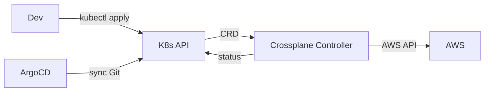
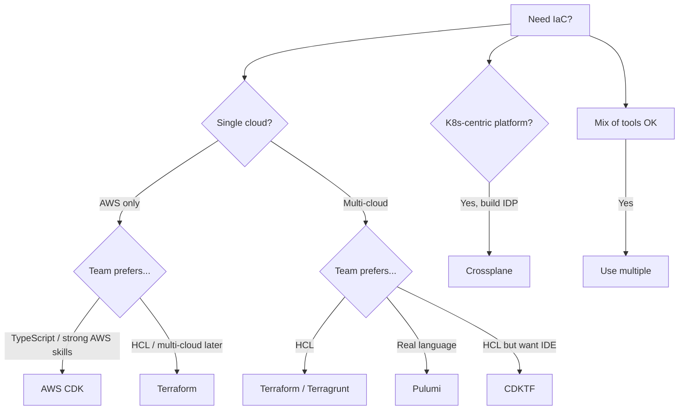
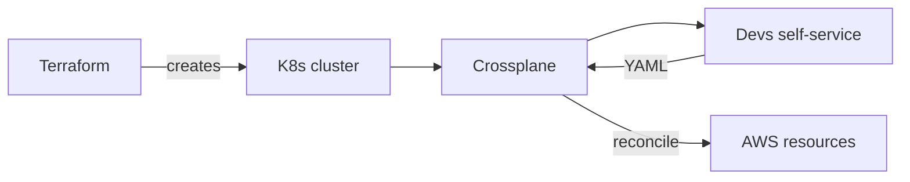

# 🎓 IaC Alternatives — Pulumi vs CDK vs Crossplane

> **Tác giả:** Mr.Rom\
> **Phiên bản:** v2.0.0\
> **Tạo lúc:** 24/05/2026\
> **Cập nhật:** 07/06/2026\
> **Level:** Intermediate\
> **Tags:** [MUST-KNOW]\
> **Yêu cầu trước:** [State management advanced + Drift detection](03_state-advanced-and-drift.md), đã dùng Terraform/Terragrunt thành thạo.

> 🎯 *Terraform/HCL vẫn thống trị thị trường *IaC* (*Infrastructure as Code* — hạ tầng mô tả bằng code), nhưng không phải là lựa chọn duy nhất. Bài này đi qua bốn ứng viên mạnh nhất: **Pulumi** (viết hạ tầng bằng Python/TypeScript/Go thật), **AWS CDK** (TypeScript sinh ra CloudFormation), **CDKTF** (CDK nhưng đích đến là Terraform), và **Crossplane** (định nghĩa cloud bằng CRD ngay trong Kubernetes). Với mỗi tool bạn sẽ nắm được cách dùng cốt lõi, rồi gom lại thành một bảng quyết định để chọn đúng tool cho từng dự án — kèm các lối di cư (*migration path*) giữa chúng.*

## 🎯 Sau bài này bạn sẽ

- [ ] Hiểu **Pulumi**: viết hạ tầng bằng ngôn ngữ lập trình thật thay vì DSL.
- [ ] Hiểu **AWS CDK** + **CDKTF**: hai bộ "synthesizer" sinh code hạ tầng theo chương trình.
- [ ] Hiểu **Crossplane**: IaC chạy ngay trong Kubernetes, đa cloud bằng CRD.
- [ ] So sánh kỹ **Terraform vs Pulumi vs CDK vs Crossplane** trên những trục quan trọng.
- [ ] Nắm các **lối di cư** (*migration path*) giữa các tool.
- [ ] Nắm các pattern **trừu tượng hoá đa cloud** (*multi-cloud abstraction*).
- [ ] Có một **bảng quyết định** để chọn tool đúng cho từng dự án.

---

## Tình huống — HCL làm khổ một team developer

Hãy bắt đầu từ một cảnh quen thuộc. Một team backend toàn người quen Python/TypeScript được giao quản lý một repo Terraform đang phình to dần. Họ vấp đủ thứ: logic lặp với `for_each` rối rắm, tạo resource có điều kiện thì cứ phải lách, không có type checking nên sai mới biết, IDE gợi ý yếu, và muốn viết test thì phải học thêm Go cho terratest.

Đây là một đoạn HCL điển hình khiến cả team đau đầu — chỉ để tạo một mớ subnet có điều kiện:

```hcl
locals {
  subnets = {
    for cidr in var.cidrs : "${cidr}-${var.region}" => {
      cidr_block = cidr
      az = element(var.azs, index(var.cidrs, cidr) % length(var.azs))
      type = startswith(cidr, "10.0") ? "public" : "private"
    }
  }
}

resource "aws_subnet" "main" {
  for_each = local.subnets
  cidr_block = each.value.cidr_block
  vpc_id = aws_vpc.main.id
  availability_zone = each.value.az
  
  tags = merge(var.common_tags, {
    Name = "${var.env}-${each.value.type}-${each.value.az}"
    Type = each.value.type
  })
}
```

Đọc đoạn trên phải dừng lại mấy nhịp mới hiểu: `for` lồng trong map, `element` + `index` + modulo để xoay vòng AZ, ternary để phân loại public/private. Cùng logic ấy viết bằng Python (Pulumi) lại sáng sủa như viết business logic thường ngày:

```python
for i, cidr in enumerate(cidrs):
    az = azs[i % len(azs)]
    subnet_type = "public" if cidr.startswith("10.0") else "private"
    aws.ec2.Subnet(f"{cidr}-{region}",
        cidr_block=cidr,
        vpc_id=vpc.id,
        availability_zone=az,
        tags={
            **common_tags,
            "Name": f"{env}-{subnet_type}-{az}",
            "Type": subnet_type,
        }
    )
```

Vẫn là Python quen thuộc: có type checking, IDE tự gợi ý, debug dễ. Sếp đi ngang, liếc qua màn hình rồi chốt: *"Đánh giá Pulumi cho các project mới đi. Bài này phân tích cho rõ."* — và đó chính là điểm xuất phát của cả bài.

---

## 1️⃣ Pulumi — viết hạ tầng bằng ngôn ngữ thật

🪞 **Ẩn dụ**: *Các tool IaC giống như các **ngôn ngữ vẽ kiến trúc**. Terraform HCL như một phần mềm **CAD chuyên dụng** — phải học một DSL riêng mới vẽ được. Pulumi như **AutoCAD chạy được Python** — dùng ngôn ngữ quen thuộc cộng thêm cả kho thư viện lập trình. AWS CDK như **AutoCAD chỉ cho riêng AWS**. Còn Crossplane như mô hình **BIM đặt trong Kubernetes** — mọi thứ đều là object của K8s.*

### Pulumi là gì

Trước hết, **Pulumi** cho phép bạn viết hạ tầng bằng **TypeScript / JavaScript / Python / Go / C# / Java** — toàn ngôn ngữ lập trình thật, không phải DSL. Điểm hay là bên dưới nó dùng đúng hệ sinh thái provider của Terraform, nên bạn đổi cách viết chứ không đổi nền tảng cloud:

- Pulumi kéo về package `pulumi-aws` (bọc lại provider AWS của Terraform).
- State của Pulumi cùng khái niệm với state của Terraform.
- Engine của Pulumi tương đương engine của Terraform.

Nói gọn: Pulumi đổi DSL (sang ngôn ngữ thật) nhưng vẫn nói chuyện với cùng các API cloud như Terraform.

### Cài đặt và khởi tạo project

Cài Pulumi chỉ một lệnh, rồi `pulumi new` sẽ scaffold project theo template tương ứng với từng cloud và từng ngôn ngữ. Kết quả ra một cấu trúc khá giống Terraform, nhưng code viết bằng ngôn ngữ lập trình thật (TS/Python/Go/C#):

```bash
# Install
brew install pulumi

# Create project
mkdir my-infra && cd my-infra
pulumi new aws-typescript     # or aws-python, aws-go, etc.
```

Cấu trúc project sinh ra trông như sau — đáng chú ý là `Pulumi.yaml` cho cấu hình chung và `Pulumi.<stack>.yaml` cho cấu hình riêng từng môi trường:

```
my-infra/
├── Pulumi.yaml              # project config
├── Pulumi.dev.yaml          # per-stack config (dev/staging/prod)
├── index.ts                 # main code
├── package.json
└── tsconfig.json
```

### Ví dụ bằng TypeScript

Để thấy khác biệt rõ nhất, hãy lấy đúng bài toán quen thuộc: tạo một VPC kèm 3 subnet trải trên 3 AZ. Pulumi cho phép dùng thẳng tính năng của ngôn ngữ (vòng lặp, điều kiện, hàm) thay cho cú pháp giới hạn của HCL:

```typescript
// index.ts
import * as pulumi from "@pulumi/pulumi";
import * as aws from "@pulumi/aws";

const env = pulumi.getStack();           // "dev", "staging", "prod"
const config = new pulumi.Config();
const cidr = config.require("vpcCidr");

// Create VPC
const vpc = new aws.ec2.Vpc("main", {
    cidrBlock: cidr,
    enableDnsHostnames: true,
    enableDnsSupport: true,
    tags: { Name: `${env}-vpc`, Environment: env },
});

// Create subnets (3 AZ)
const azs = await aws.getAvailabilityZones({ state: "available" });
const subnets = azs.names.slice(0, 3).map((az, i) =>
    new aws.ec2.Subnet(`public-${i}`, {
        vpcId: vpc.id,
        cidrBlock: `10.0.${i}.0/24`,
        availabilityZone: az,
        mapPublicIpOnLaunch: true,
        tags: { Name: `${env}-public-${az}` },
    })
);

// Internet Gateway
const igw = new aws.ec2.InternetGateway("main", {
    vpcId: vpc.id,
});

// Outputs
export const vpcId = vpc.id;
export const subnetIds = subnets.map(s => s.id);
```

Để ý cách `getStack()` lấy tên môi trường, `slice(0, 3)` + `.map()` để rải subnet — tất cả đều là TypeScript thuần, không cần học thêm cú pháp riêng.

### Bộ lệnh thường dùng

CLI của Pulumi xoay quanh vài lệnh chính — `stack`, `up`, `destroy`, `output`, `config`. Trải nghiệm khá giống Terraform, chỉ khác chỗ `up` gộp luôn cả bước `plan` lẫn `apply` thay vì tách hai lệnh:

```bash
pulumi stack init dev          # create stack
pulumi config set vpcCidr "10.0.0.0/16"
pulumi up                      # plan + apply (combined)
pulumi destroy                 # destroy
pulumi stack output vpcId      # read outputs

# State
pulumi stack export > stack.json
pulumi stack import < stack.json
```

### State backend

Mặc định Pulumi lưu state trên Pulumi Cloud — một dịch vụ SaaS có sẵn gói miễn phí. Nếu không muốn phụ thuộc dịch vụ ngoài, bạn tự host được trên S3 hoặc ngay máy local:

```bash
pulumi login s3://acme-pulumi-state
# Or local: pulumi login --local
```

Backend S3 ở đây có tính năng tương đương backend S3 của Terraform, nên team nào đã quen lưu state trên S3 sẽ thấy rất thân thuộc.

### Vòng lặp và điều kiện

Đây mới là *killer feature* thực sự của Pulumi so với Terraform: bạn dùng `for`/`if` thuần của Python/TS, không phải lách qua `count`/`for_each`/`dynamic` của HCL. Code đọc tự nhiên đúng như logic nghiệp vụ:

```python
# Python — natural
import pulumi
import pulumi_aws as aws

cidrs = ["10.0.0.0/24", "10.0.1.0/24", "10.0.2.0/24"]
azs = ["us-east-1a", "us-east-1b", "us-east-1c"]

vpc = aws.ec2.Vpc("main", cidr_block="10.0.0.0/16")

subnets = []
for i, cidr in enumerate(cidrs):
    if i < 2:  # only first 2 are public
        subnet = aws.ec2.Subnet(f"public-{i}",
            vpc_id=vpc.id,
            cidr_block=cidr,
            availability_zone=azs[i],
            map_public_ip_on_launch=True,
        )
        subnets.append(subnet)
```

`if i < 2` là điều kiện thật, `for` là vòng lặp thật — đặt breakpoint debug được như mọi đoạn Python khác.

### Hàm và module

Vì là ngôn ngữ thật nên bạn tái sử dụng code bằng hàm như bình thường: gói logic tạo VPC vào một hàm rồi gọi lại nhiều lần cho từng môi trường:

```python
# Reusable component
def create_vpc(name, cidr, azs):
    vpc = aws.ec2.Vpc(f"{name}-vpc", cidr_block=cidr)
    subnets = [aws.ec2.Subnet(f"{name}-subnet-{i}", vpc_id=vpc.id, ...) for i, az in enumerate(azs)]
    return vpc, subnets

# Use multiple times
dev_vpc, dev_subnets = create_vpc("dev", "10.0.0.0/16", ["us-east-1a", "us-east-1b"])
prod_vpc, prod_subnets = create_vpc("prod", "10.1.0.0/16", ["us-east-1a", "us-east-1b", "us-east-1c"])
```

Đây chính là các kỹ thuật trừu tượng hoá chuẩn của lập trình — kế thừa, mixin, v.v. — điều mà module của HCL không làm được trọn vẹn.

### Viết test

Lợi ích kéo theo: hạ tầng test được như code thường. Pulumi cho mock toàn bộ cloud nên bạn viết unit test bằng pytest, chạy nhanh, không cần dựng resource thật:

```python
# test_vpc.py — using pytest
import pulumi

class MyMocks(pulumi.runtime.Mocks):
    def new_resource(self, args):
        return [args.name + '_id', args.inputs]

pulumi.runtime.set_mocks(MyMocks(), preview=False)

def test_vpc_cidr():
    from infra import vpc
    assert vpc.cidr_block == "10.0.0.0/16"
```

Mock cloud xong, test chạy gần như tức thì — khác hẳn cảnh phải `terraform apply` lên môi trường thật rồi mới kiểm tra được.

### So sánh tính năng Pulumi vs Terraform

Gom các điểm trên lại, bảng dưới đặt Pulumi cạnh Terraform trên những trục mà người chọn tool quan tâm nhất — từ DSL, state, đến cộng đồng và chi phí:

| Feature | Terraform | Pulumi |
|---|---|---|
| DSL | HCL | TypeScript / Python / Go / C# / Java |
| State backend | S3/GCS/etc. | Pulumi Cloud (default) / S3 / local |
| Providers | Terraform registry | Pulumi (wraps Terraform) |
| Loops | `for_each`, `count` | Real `for` |
| Conditionals | `count = condition ? 1 : 0` | Real `if` |
| Type checking | Limited (HCL) | Strong (TS/Python typed) |
| IDE support | Plugin (Terraform extension) | Native (VSCode/IntelliJ) |
| Testing | terratest (Go) | Native (pytest/jest) |
| Multi-cloud | Per-provider | Per-provider, abstractable |
| Community 2026 | ~70% market | ~20% growing |
| Migration TF → Pulumi | `pulumi import` + `tf2pulumi` tool | — |
| Cost | Free OSS | OSS free; Cloud SaaS paid (team features) |

Điểm rút ra: Pulumi thắng rõ ở trải nghiệm developer (ngôn ngữ thật, type, test, IDE), còn Terraform vẫn áp đảo về cộng đồng và độ trưởng thành — một sự đánh đổi mà ta sẽ gặp lại ở bảng quyết định cuối bài.

---

## 2️⃣ AWS CDK — TypeScript/Python sinh ra CloudFormation

### AWS CDK là gì

Nếu Pulumi tự chạy engine riêng thì **AWS CDK** đi một con đường khác: bạn viết TypeScript / Python / Java / C# / Go, và nó **sinh ra template CloudFormation** rồi để CloudFormation lo phần triển khai. Đây là điểm phân biệt cốt lõi — CDK nhắm tới CloudFormation, còn Pulumi chạy engine của riêng mình.

### Cài đặt

Cài CDK qua npm rồi `cdk init` để dựng khung project theo ngôn ngữ bạn chọn:

```bash
npm install -g aws-cdk
mkdir my-cdk && cd my-cdk
cdk init app --language typescript
```

### Ví dụ

Đoạn dưới tạo một VPC bằng CDK, cố tình dùng cả hai mức trừu tượng để bạn thấy khác biệt: `ec2.Vpc` (mức cao, tự lo subnet/IGW/route table) và `ec2.CfnSubnet` (mức thấp, ánh xạ 1:1 với CloudFormation):

```typescript
// lib/my-stack.ts
import * as cdk from 'aws-cdk-lib';
import * as ec2 from 'aws-cdk-lib/aws-ec2';
import { Construct } from 'constructs';

export class MyStack extends cdk.Stack {
  constructor(scope: Construct, id: string, props?: cdk.StackProps) {
    super(scope, id, props);

    // L2 construct — high-level abstraction
    const vpc = new ec2.Vpc(this, 'MyVpc', {
      maxAzs: 3,
      natGateways: 1,
      subnetConfiguration: [
        { name: 'public', subnetType: ec2.SubnetType.PUBLIC, cidrMask: 24 },
        { name: 'private', subnetType: ec2.SubnetType.PRIVATE_WITH_EGRESS, cidrMask: 24 },
      ],
    });
    
    // L1 construct — direct CloudFormation
    new ec2.CfnSubnet(this, 'CustomSubnet', {
      vpcId: vpc.vpcId,
      cidrBlock: '10.0.99.0/24',
    });
  }
}
```

### Bộ lệnh thường dùng

Vòng đời làm việc với CDK xoay quanh vài lệnh quen thuộc — `synth` để sinh template, `deploy`/`destroy` để triển khai, `diff` để xem thay đổi, và `bootstrap` chạy một lần để chuẩn bị S3 chứa asset:

```bash
cdk synth                # generate CloudFormation template
cdk deploy               # deploy stack
cdk destroy              # destroy
cdk diff                 # show changes
cdk bootstrap            # one-time setup (S3 for assets)
```

### Ba mức construct của CDK

Sức mạnh thật của CDK nằm ở ba mức trừu tượng (*construct level*), càng lên cao càng viết ít mà ra nhiều. Hiểu ba mức này là hiểu cách CDK đánh đổi giữa "kiểm soát chi tiết" và "năng suất":

- **L1 (`CfnXxx`)**: ánh xạ 1:1 với resource của CloudFormation. Dài dòng nhưng kiểm soát hoàn toàn.
- **L2 (`Xxx`)**: các trừu tượng do AWS chuẩn hoá, có default hợp lý (ví dụ `Vpc` tự tạo subnet + IGW + route table).
- **L3 (patterns)**: các pattern gộp nhiều resource (ví dụ `LoadBalancedFargateService` = ALB + ECS Fargate + Task definition).

Ở mức L3, năng suất gần như "phép thuật" — cả một API serverless gói trong vài dòng:

```typescript
// L3 example — entire serverless API in 5 lines
new cdk_patterns.LambdaRestApi(this, 'Api', {
  handler: myFunction,
  proxy: false,
});
```

Đánh đổi đi kèm: L3 đẩy năng suất lên cực đại nhưng cũng khoá chặt bạn vào bộ Construct của AWS — càng tiện càng khó thoát.

### CDK vs Pulumi vs Terraform

Vậy đặt cạnh nhau, CDK đứng ở đâu? Bảng dưới so ba tool trên các trục then chốt — đặc biệt là phạm vi cloud, vì đây chính là giới hạn lớn nhất của CDK:

| Aspect | CDK | Pulumi | Terraform |
|---|---|---|---|
| Backend | CloudFormation (AWS-only) | Terraform engine (multi-cloud) | Terraform engine |
| Cloud support | AWS only | All clouds | All clouds |
| State | CloudFormation native | Pulumi state | Terraform state |
| L3 patterns | Strong (AWS-curated) | Community | Community |
| Stack drift | CloudFormation handles | Pulumi diff | Terraform diff |
| Best for | AWS-only shops | Multi-cloud + dev DX | Standard |

Kết luận ngắn gọn: CDK tuyệt vời cho team chỉ làm AWS và muốn tích hợp sâu, nhưng không phải lựa chọn cho đa cloud — đó là khoảng trống mà CDKTF lấp vào ở phần tiếp theo.

---

## 3️⃣ CDKTF — CDK cho Terraform

### CDKTF là gì

**CDKTF** (CDK for Terraform) là cách ghép cái hay của cả hai thế giới: viết TypeScript / Python / Go / Java / C#, nhưng đầu ra là **Terraform HCL** thay vì CloudFormation. Nó kết hợp:

- Trải nghiệm developer của CDK (ngôn ngữ thật, IDE hỗ trợ tốt).
- Hệ sinh thái provider đa cloud của Terraform.

Nói cách khác, bạn giữ engine Terraform đã trưởng thành nhưng không phải viết HCL nữa.

### Cài đặt

Cài CLI rồi `cdktf init`, khai báo luôn provider muốn dùng:

```bash
npm install -g cdktf-cli
mkdir my-cdktf && cd my-cdktf
cdktf init --template=typescript --providers=aws
```

### Ví dụ

Cùng bài toán VPC + subnet, lần này viết bằng TypeScript nhưng đích đến là Terraform. Để ý cách `App` + `TerraformStack` đóng vai trò khung, còn `app.synth()` ở cuối mới là bước sinh ra HCL:

```typescript
// main.ts
import { Construct } from "constructs";
import { App, TerraformStack } from "cdktf";
import * as aws from "@cdktf/provider-aws";

class MyStack extends TerraformStack {
  constructor(scope: Construct, id: string) {
    super(scope, id);

    new aws.provider.AwsProvider(this, "AWS", { region: "us-east-1" });
    
    const vpc = new aws.vpc.Vpc(this, "MyVpc", {
      cidrBlock: "10.0.0.0/16",
      tags: { Name: "my-vpc" },
    });
    
    new aws.subnet.Subnet(this, "Public", {
      vpcId: vpc.id,
      cidrBlock: "10.0.1.0/24",
    });
  }
}

const app = new App();
new MyStack(app, "my-stack");
app.synth();
```

### Bộ lệnh thường dùng

Lệnh của CDKTF phản chiếu đúng vòng đời Terraform bên dưới — `synth` sinh HCL JSON, còn `deploy`/`diff` thực chất gọi tới `terraform apply`/`plan`:

```bash
cdktf synth              # generate Terraform HCL JSON
cdktf deploy             # synthesizes + terraform apply
cdktf destroy
cdktf diff               # terraform plan equivalent
```

### CDKTF vs Pulumi vs CDK

Cả ba đều cho bạn viết hạ tầng bằng ngôn ngữ thật, nên câu hỏi thực sự là *đầu ra đi về đâu* và *engine nào chạy*. Bảng dưới làm rõ điểm khác biệt đó:

| Aspect | CDKTF | Pulumi | AWS CDK |
|---|---|---|---|
| Target | Terraform HCL | Pulumi engine | CloudFormation |
| Languages | TS/Python/Go/Java/C# | TS/Python/Go/C#/Java | TS/Python/Go/Java/C# |
| State | Terraform state (S3/GCS) | Pulumi state | CloudFormation state |
| Providers | Terraform registry (huge) | Pulumi (wraps Terraform) | AWS only (CFN) |
| Engine maturity | Terraform (10+ years) | Pulumi (~5 years) | CloudFormation (15+ years) |
| Multi-cloud | Yes (via Terraform providers) | Yes | No |
| Migration from Terraform HCL | Easy (`cdktf convert`) | Tedious | NA |

Vị trí đẹp nhất của CDKTF: dành cho team đã sống trong hệ sinh thái Terraform nhưng muốn viết bằng TS/Python mà không phải đổi engine — vừa giữ được registry provider khổng lồ, vừa di cư từ HCL cực nhẹ.

---

## 4️⃣ Crossplane — IaC chạy ngay trong Kubernetes

### Crossplane là gì

**Crossplane** lật ngược cách tiếp cận: thay vì có một CLI riêng, nó định nghĩa hạ tầng cloud thành **CRD của Kubernetes** (*Custom Resource Definition* — kiểu resource tự định nghĩa). Bạn `kubectl apply` một file YAML mô tả VPC, và một controller sẽ gọi API cloud để dựng nó thật — y hệt cách K8s quản lý app. ArgoCD đồng bộ hạ tầng từ Git như đồng bộ app, nên GitOps phủ luôn cả tầng hạ tầng.



### Cài đặt

Crossplane cài bằng Helm vào cluster, rồi nạp thêm provider cho từng cloud (ở đây là provider EC2 của AWS):

```bash
helm install crossplane crossplane-stable/crossplane \
  --namespace crossplane-system \
  --create-namespace

# Install AWS provider
kubectl apply -f - <<EOF
apiVersion: pkg.crossplane.io/v1
kind: Provider
metadata:
  name: provider-aws-ec2
spec:
  package: xpkg.upbound.io/upbound/provider-aws-ec2:v1.0.0
EOF
```

### Ví dụ một CRD

Khi đã có provider, bạn mô tả resource cloud bằng đúng cú pháp YAML của K8s. Để ý `vpcIdRef` — đây là cách Crossplane cho một CRD tham chiếu tới CRD khác, thay cho biến output của Terraform:

```yaml
# Define cloud resources via CRDs
apiVersion: ec2.aws.upbound.io/v1beta1
kind: VPC
metadata:
  name: my-vpc
spec:
  forProvider:
    region: us-east-1
    cidrBlock: 10.0.0.0/16
    enableDnsHostnames: true
    enableDnsSupport: true
    tags:
      Name: my-vpc
      Environment: dev
  providerConfigRef:
    name: aws-dev
---
apiVersion: ec2.aws.upbound.io/v1beta1
kind: Subnet
metadata:
  name: public-subnet-1
spec:
  forProvider:
    region: us-east-1
    vpcIdRef:
      name: my-vpc      # reference other CRD
    cidrBlock: 10.0.1.0/24
    availabilityZone: us-east-1a
```

Apply xong, bạn theo dõi trạng thái resource bằng `kubectl` như mọi object K8s khác — cột `SYNCED`/`READY` cho biết Crossplane đã dựng xong tài nguyên thật chưa:

```bash
kubectl apply -f vpc.yaml
kubectl get vpc.ec2.aws.upbound.io
# NAME    SYNCED   READY   EXTERNAL-NAME   AGE
# my-vpc  True     True    vpc-abc123      2m
```

### Composition — giấu đi sự phức tạp

Bắt người dùng viết 30 CRD cho một mạng hoàn chỉnh thì chẳng khác gì viết HCL thô. Đây là lúc Composition vào cuộc: team platform định nghĩa một "kiểu hạ tầng" mới bằng **XRD** (*Composite Resource Definition*), còn người dùng chỉ điền vài tham số. Trước hết là XRD khai báo schema cho kiểu mới `XNetwork`:

```yaml
# XRD — define new "infrastructure type"
apiVersion: apiextensions.crossplane.io/v1
kind: CompositeResourceDefinition
metadata:
  name: xnetworks.acme.io
spec:
  group: acme.io
  names:
    kind: XNetwork
  versions:
    - name: v1alpha1
      schema:
        openAPIV3Schema:
          type: object
          properties:
            spec:
              type: object
              properties:
                region: { type: string }
                cidrBlock: { type: string }
                publicSubnets: { type: integer, default: 3 }
                privateSubnets: { type: integer, default: 3 }
---
# Composition — implement the new type
apiVersion: apiextensions.crossplane.io/v1
kind: Composition
metadata:
  name: standard-network
spec:
  compositeTypeRef:
    apiVersion: acme.io/v1alpha1
    kind: XNetwork
  resources:
    - name: vpc
      base:
        apiVersion: ec2.aws.upbound.io/v1beta1
        kind: VPC
        spec:
          forProvider:
            cidrBlock: 10.0.0.0/16   # default, overridable
    - name: public-subnet-1
      base:
        apiVersion: ec2.aws.upbound.io/v1beta1
        kind: Subnet
        spec:
          forProvider:
            cidrBlock: 10.0.1.0/24
    # ... more subnets, IGW, NAT, route tables
```

Sau khi platform team đã định nghĩa xong, người dùng chỉ cần viết một spec ngắn gọn:

```yaml
apiVersion: acme.io/v1alpha1
kind: XNetwork
metadata:
  name: prod-vpc
spec:
  region: us-east-1
  cidrBlock: 10.10.0.0/16
  publicSubnets: 3
  privateSubnets: 3
```

Vậy là một spec 5 dòng được Composition bung ra thành 30+ resource thật. Đây chính là nền tảng cho mô hình *self-service platform*: dev tự lấy hạ tầng mà không cần biết chi tiết AWS bên dưới.

### Crossplane được gì

Gom lại, Crossplane mang về bốn lợi ích mà các tool kia khó có cùng lúc:

1. **K8s-native**: cùng control plane với app. RBAC, ArgoCD, observability — tái dùng hết.
2. **Self-service**: dev tự tạo hạ tầng qua CRD đơn giản; platform team định nghĩa default an toàn qua Composition.
3. **Multi-cloud**: cùng một pattern Composition cho provider AWS/GCP/Azure.
4. **Continuous reconcile**: Crossplane định kỳ tự dò và sửa drift, khác Terraform vốn cần `apply` tường minh.

### Crossplane mất gì

Đổi lại, cái giá phải trả không nhỏ — và đều xoay quanh việc nó sống trong K8s:

1. **Gánh nặng K8s**: phải có sẵn một cluster đang chạy.
2. **Đường học dốc**: phải nắm cả CRD, Composition lẫn Functions.
3. **Chưa trưởng thành bằng Terraform**: tới 2026 vẫn ở mức CNCF Incubating.
4. **Debug khó hơn**: phải đọc log controller thay vì xem output `terraform plan` quen thuộc.

### Khi nào Crossplane thắng

Cân nhắc hai mặt trên, Crossplane sáng giá nhất trong các bối cảnh sau:

- **Platform team đang xây IDP** (*Internal Developer Platform* — nền tảng nội bộ cho dev).
- **K8s đã là trung tâm** (phần lớn workload chạy trên K8s).
- Cần các **trừu tượng đa cloud**.
- Người dùng IDP **thích viết YAML** để tự phục vụ.

### Khi nào Crossplane thua

Ngược lại, có những lúc Crossplane là dao mổ trâu giết gà:

- Team nhỏ, hạ tầng đơn giản.
- Team chưa quen K8s.
- Cần ngang bằng tính năng với Terraform (một số provider của Crossplane còn chậm theo sau).

---

## 5️⃣ Bảng quyết định — chọn tool IaC nào?

### Cây quyết định nhanh

Lý thuyết bốn tool đã đủ; giờ là lúc gộp lại thành một sơ đồ chọn nhanh. Cây dưới đi từ câu hỏi gốc "single cloud hay multi-cloud?" rồi rẽ nhánh theo sở thích ngôn ngữ và bối cảnh K8s:



### Bảng chi tiết

Cây quyết định cho hướng đi nhanh; bảng dưới gắn từng tình huống thực tế với tool phù hợp kèm lý do, để bạn đối chiếu sát hơn với dự án của mình:

| Use case | Tool | Reason |
|---|---|---|
| **Startup, AWS-only, small team** | Terraform | Simplest, broad community |
| **Startup, AWS-only, JS/TS team** | AWS CDK | DX win, AWS integration |
| **Enterprise, multi-cloud** | Terraform + Terragrunt | Standard, mature |
| **Multi-cloud, dev-first culture** | Pulumi | Real languages |
| **Migrate from CFN to multi-cloud** | CDKTF | TS code + Terraform multi-cloud |
| **K8s-heavy platform team** | Crossplane | K8s-native, self-service IDP |
| **Compliance-heavy, audit strict** | Terraform + OPA | Mature policy ecosystem |
| **Greenfield, want learn 1 thing** | OpenTofu | OSS license clean |

### Thực tế thị trường 2026 (ước lượng)

Còn nếu nhìn vào con số thị phần thực tế, bức tranh khá rõ ràng — Terraform vẫn là mặc định, các tool khác chia nhau phần còn lại:

| Tool | Market share | Trend |
|---|---|---|
| Terraform / OpenTofu | ~65% | Stable (OpenTofu growing) |
| Pulumi | ~15% | Growing |
| AWS CDK | ~12% | Stable (AWS shops) |
| CDKTF | ~3% | Growing slowly |
| Crossplane | ~5% | Growing (platform teams) |

Tóm lại: Terraform vẫn thống trị, Pulumi đang lên đều, còn Crossplane tuy nhỏ nhưng được giới platform team ưa chuộng cho IDP.

---

## 6️⃣ Các pattern trừu tượng hoá đa cloud

### Vấn đề

Trừu tượng đa cloud nghe hấp dẫn, nhưng gốc rễ của nó là một bài toán khó: cùng một khối hạ tầng logic lại trông rất khác trên mỗi cloud. "VPC" của AWS tương đương "VPC" của GCP và "VNet" của Azure — nhưng API, thuộc tính và hành vi đều lệch nhau. Có ba cách thường gặp để xử lý chuyện này.

### Pattern 1: Module Terraform riêng cho từng provider

Cách thẳng tay nhất là viết một module cho mỗi cloud, rồi bật/tắt theo biến `cloud`:

```
modules/
├── aws-vpc/
├── gcp-vpc/
└── azure-vnet/
```

```hcl
# Pick per env
module "vpc_aws" {
  source = "../modules/aws-vpc"
  count = var.cloud == "aws" ? 1 : 0
}
module "vpc_gcp" {
  source = "../modules/gcp-vpc"
  count = var.cloud == "gcp" ? 1 : 0
}
```

Nhược điểm lộ ra ngay: lặp code, mỗi cloud một module phải tự bảo trì, và cái `count = ... ? 1 : 0` chỉ là mẹo bật/tắt chứ không phải trừu tượng thật.

### Pattern 2: Lớp trừu tượng bằng Pulumi

Vì Pulumi là ngôn ngữ thật nên bạn dùng được hướng đối tượng (*OO*) đúng nghĩa: định nghĩa một lớp `Network` trừu tượng, rồi mỗi cloud kế thừa và hiện thực hoá theo cách của mình:

```typescript
abstract class Network {
  abstract id(): pulumi.Output<string>;
}

class AwsNetwork extends Network {
  vpc: aws.ec2.Vpc;
  constructor(name, cidr) {
    super();
    this.vpc = new aws.ec2.Vpc(name, { cidrBlock: cidr });
  }
  id() { return this.vpc.id; }
}

class GcpNetwork extends Network {
  network: gcp.compute.Network;
  // ...
}

// Caller doesn't care which cloud
const net: Network = config.cloud === "aws" 
  ? new AwsNetwork("main", "10.0.0.0/16") 
  : new GcpNetwork("main", "10.0.0.0/16");
```

Phía gọi không cần biết đang ở cloud nào — đây là trừu tượng OO thật sự, và là chỗ Pulumi toả sáng hơn hẳn HCL.

### Pattern 3: Composition của Crossplane

Crossplane giải cùng bài toán bằng cách định nghĩa một kiểu trừu tượng `XNetwork` (XRD), rồi viết một Composition cho mỗi cloud, gắn nhãn `cloud` để chọn đúng bản hiện thực:

```yaml
# XRD: define abstract type
apiVersion: apiextensions.crossplane.io/v1
kind: CompositeResourceDefinition
metadata:
  name: xnetworks.acme.io
spec:
  group: acme.io
  names:
    kind: XNetwork
---
# Composition for AWS
apiVersion: apiextensions.crossplane.io/v1
kind: Composition
metadata:
  name: aws-network
  labels:
    cloud: aws
spec:
  compositeTypeRef:
    apiVersion: acme.io/v1alpha1
    kind: XNetwork
  resources:
    - base: { kind: VPC, apiVersion: ec2.aws.upbound.io/v1beta1 }
---
# Composition for GCP
apiVersion: apiextensions.crossplane.io/v1
kind: Composition
metadata:
  name: gcp-network
  labels:
    cloud: gcp
spec:
  compositeTypeRef:
    apiVersion: acme.io/v1alpha1
    kind: XNetwork
  resources:
    - base: { kind: Network, apiVersion: compute.gcp.upbound.io/v1beta1 }
```

Người dùng chỉ tạo một `XNetwork`; bộ chọn của Composition sẽ khớp đúng cloud. Từ góc nhìn người dùng, mọi thứ hoàn toàn cloud-agnostic.

### Một lần kiểm tra với thực tế

Trước khi lao vào trừu tượng đa cloud, hãy tỉnh táo một nhịp: nó **đắt**. Thực tế ở phần lớn tổ chức là:

- 95% workload nằm trên 1 cloud (vì hiệu quả).
- 5% trên cloud dự phòng (cho *DR* — *Disaster Recovery*, khôi phục sau thảm hoạ).
- Các cloud khác nhau thường do các team khác nhau phụ trách.

Đừng trừu tượng quá tay. Chuyện bê nguyên hạ tầng từ cloud này sang cloud kia hiếm khi xảy ra; khi nào thật sự chuyển thì refactor lúc đó. Các trừu tượng đa cloud của Pulumi/Crossplane chỉ đáng làm khi bạn có **chiến lược đa cloud thực sự**.

---

## 7️⃣ Các lối di cư giữa các tool

### Terraform → Pulumi

Pulumi có công cụ tự động `tf2pulumi` để dịch HCL sang code Pulumi — nhưng kết quả chỉ là bản dịch máy, cần dọn dẹp lại bằng tay:

```bash
# Tool: tf2pulumi
brew install pulumi/tap/tf2pulumi
tf2pulumi --target typescript ./terraform-project
```

Riêng phần state thì không tự động: bạn phải dùng `pulumi import` để kéo các resource đang tồn tại vào quản lý của Pulumi.

### Terraform HCL → CDKTF

Đây là lối di cư nhẹ nhất, vì CDKTF vẫn dùng đúng engine Terraform:

```bash
cdktf convert --language typescript < main.tf
```

Lệnh trên chuyển HCL thành code TypeScript dùng construct của CDKTF, và state **giữ nguyên** (vẫn là Terraform state). Bạn chỉ đổi cách viết sang TS, còn triển khai vẫn qua engine Terraform — gần như không rủi ro.

### Terraform → Crossplane

Ngược lại, đây là con đường gập ghềnh nhất: không có công cụ tự động, phải viết lại thủ công thành CRD + Composition.

Mỗi resource phải được import lại vào quản lý của Crossplane — một quá trình dài và tốn công.

### CDK → CDKTF

Tương tự, chuyển từ AWS CDK sang CDKTF cũng phải làm tay, nhưng phần lớn kiến thức TypeScript vẫn tái dùng được:

```bash
# Migrate AWS CDK to CDKTF (multi-cloud capable)
# No automated tool — manual rewrite, same TS knowledge applies
```

### Mức độ khoá chân (lock-in)

Câu hỏi quan trọng khi chọn tool không chỉ là "dùng có sướng không" mà còn "thoát ra có dễ không". Bảng dưới xếp các tool theo mức khoá chân:

| Tool | Lock-in level |
|---|---|
| Terraform / OpenTofu | Low — HCL portable, multi-cloud |
| Terragrunt | Medium — Terragrunt-specific config |
| Pulumi | Medium — Pulumi state, real language |
| AWS CDK | High — AWS CloudFormation only |
| CDKTF | Low — outputs Terraform HCL |
| Crossplane | Medium — K8s-native |

Rõ ràng Terraform và CDKTF khoá chân thấp nhất (đầu ra là HCL portable), còn AWS CDK cao nhất vì gắn chặt với CloudFormation chỉ-AWS.

---

## 8️⃣ Hands-on: cùng một VPC viết bằng 4 tool

### Mục tiêu

Cách tốt nhất để cảm nhận khác biệt là viết đúng *một* khối hạ tầng — VPC + 2 subnet — bằng cả bốn tool, rồi đặt cạnh nhau. Ta sẽ làm lần lượt: Terraform, Pulumi (Python), AWS CDK (TypeScript), Crossplane (YAML).

### Terraform

Bản tham chiếu quen thuộc nhất — HCL khai báo, dùng `count` để lặp 2 subnet:

```hcl
resource "aws_vpc" "main" {
  cidr_block = "10.0.0.0/16"
  tags       = { Name = "main" }
}

resource "aws_subnet" "public" {
  count = 2
  vpc_id = aws_vpc.main.id
  cidr_block = "10.0.${count.index}.0/24"
  availability_zone = element(["us-east-1a", "us-east-1b"], count.index)
  tags = { Name = "public-${count.index}" }
}
```

### Pulumi (Python)

Cùng logic, nhưng vòng lặp là `for` Python thật thay cho `count`:

```python
import pulumi
import pulumi_aws as aws

vpc = aws.ec2.Vpc("main",
    cidr_block="10.0.0.0/16",
    tags={"Name": "main"})

for i, az in enumerate(["us-east-1a", "us-east-1b"]):
    aws.ec2.Subnet(f"public-{i}",
        vpc_id=vpc.id,
        cidr_block=f"10.0.{i}.0/24",
        availability_zone=az,
        tags={"Name": f"public-{i}"})
```

### AWS CDK (TypeScript L1 — tương đương)

Ở mức L1, CDK ánh xạ 1:1 với CloudFormation nên dài hơn, nhưng vòng lặp lại là `.forEach()` của TypeScript:

```typescript
import * as cdk from 'aws-cdk-lib';
import * as ec2 from 'aws-cdk-lib/aws-ec2';

class MyStack extends cdk.Stack {
  constructor(scope, id, props) {
    super(scope, id, props);
    
    const vpc = new ec2.CfnVPC(this, 'MainVpc', {
      cidrBlock: '10.0.0.0/16',
      tags: [{ key: 'Name', value: 'main' }],
    });
    
    ['us-east-1a', 'us-east-1b'].forEach((az, i) => {
      new ec2.CfnSubnet(this, `PublicSubnet${i}`, {
        vpcId: vpc.ref,
        cidrBlock: `10.0.${i}.0/24`,
        availabilityZone: az,
      });
    });
  }
}
```

### AWS CDK (TypeScript L2 — mức cao)

Cũng là CDK nhưng dùng construct L2: `ec2.Vpc` tự lo subnet + IGW + route table, nên cùng kết quả mà ngắn hơn hẳn:

```typescript
const vpc = new ec2.Vpc(this, 'MainVpc', {
  cidr: '10.0.0.0/16',
  maxAzs: 2,
  subnetConfiguration: [
    { name: 'public', subnetType: ec2.SubnetType.PUBLIC, cidrMask: 24 },
  ],
});
// VPC + 2 subnets + IGW + route tables — 5 lines!
```

### Crossplane (YAML)

Cuối cùng là Crossplane — khai báo từng resource bằng YAML, dài dòng nhất nhưng đổi lại được quản lý hoàn toàn trong K8s:

```yaml
apiVersion: ec2.aws.upbound.io/v1beta1
kind: VPC
metadata:
  name: main
spec:
  forProvider:
    region: us-east-1
    cidrBlock: 10.0.0.0/16
    tags: { Name: main }
---
apiVersion: ec2.aws.upbound.io/v1beta1
kind: Subnet
metadata:
  name: public-0
spec:
  forProvider:
    region: us-east-1
    vpcIdRef: { name: main }
    cidrBlock: 10.0.0.0/24
    availabilityZone: us-east-1a
---
apiVersion: ec2.aws.upbound.io/v1beta1
kind: Subnet
metadata:
  name: public-1
spec:
  forProvider:
    region: us-east-1
    vpcIdRef: { name: main }
    cidrBlock: 10.0.1.0/24
    availabilityZone: us-east-1b
```

### Quan sát đặt cạnh nhau

Bốn cách viết, bốn số dòng và bốn thế mạnh khác nhau. Bảng dưới tổng kết lại để thấy mỗi tool đánh đổi cái gì:

| Tool | Lines | Strengths |
|---|---|---|
| Terraform | 12 | Concise, declarative |
| Pulumi | 12 | Loop = real Python |
| CDK L1 | 18 | TypeScript familiar |
| CDK L2 | 8 | Highest abstraction |
| Crossplane | 22 | Declarative YAML, verbose |

Mỗi tool có cái giá của nó: CDK L2 thắng về số dòng nhưng khoá chặt vào AWS; Pulumi thắng về độ dễ đọc với người làm lập trình; Terraform cân bằng; còn Crossplane dài nhưng đổi lấy mô hình K8s-native.

---

## 💡 Cạm bẫy thường gặp & Best practice

### ❌ Cạm bẫy: Chọn tool theo trào lưu

Một câu hay nghe: *"Pulumi mới quá, đổi từ Terraform sang đi"* — rồi cả team lao vào di cư 50K dòng code chỉ để đổi lấy lợi ích cận biên. Hậu quả là một lượng công việc khổng lồ đổi lấy gần như không gì đáng kể.

→ **Khắc phục**:
- Giữ tool hiện tại trừ khi có **lý do mạnh** (thực sự cần đa cloud, hoặc team có thiên hướng ngôn ngữ rõ rệt).
- Project mới (*greenfield*) thì đánh giá lại từ đầu.
- Đừng di cư một repo đã ổn định mà chưa tính ROI.

### ❌ Cạm bẫy: Trộn nhiều tool trong cùng một repo

Một sai lầm phổ biến là để hạ tầng nằm rải giữa nhiều tool trong một repo:

```
infra/
├── terraform/    # half resources
├── pulumi/       # other half
└── cdk/          # legacy
```

→ Kết quả là gánh nặng nhận thức tăng vọt, state nằm rải mỗi nơi một kiểu, và người mới vào gần như không onboard nổi.

→ **Khắc phục**: Mỗi repo chọn 1 tool chính. Khi di cư thì làm dứt điểm rồi xoá cái cũ.

### ❌ Cạm bẫy: Dùng Pulumi mà thiếu kỷ luật lập trình

Vì Pulumi là ngôn ngữ thật nên rất dễ sa vào viết như script: một file 1000 dòng, không hàm, không type. Cái tự do của ngôn ngữ thật trở thành con dao hai lưỡi.

→ **Khắc phục**:
- Áp dụng đúng kỹ thuật phần mềm: hàm nhỏ, có type, có test.
- Code review hạ tầng như review code app.
- Dùng linter (ESLint, pylint).

### ❌ Cạm bẫy: Lạm dụng CDK L3

Construct L3 tiện tới mức gây nghiện — một dòng dựng cả một dịch vụ:

```typescript
new patterns.ApplicationLoadBalancedFargateService(this, 'App', { ... });
```

→ Nhưng đằng sau "phép thuật" đó là 30+ resource được tạo ngầm, và khi cần tinh chỉnh thì rất khó can thiệp.

→ **Khắc phục**:
- Dùng L2 cho phần lớn trường hợp (cân bằng giữa trừu tượng và kiểm soát).
- L3 chỉ khi default khớp y hệt nhu cầu.
- L1 khi cần tinh chỉnh chi tiết.

### ❌ Cạm bẫy: Loạn CRD với Crossplane

Khi không quản lý, cluster nhanh chóng có cả trăm CRD, khó tìm, Composition không đánh version. Sự linh hoạt biến thành mớ bòng bong.

→ **Khắc phục**:
- **Functions**: Crossplane v2 có Composition Functions (thay patch bằng code) — logic composition rõ ràng hơn.
- **Đánh version XRD**: v1alpha1 → v1beta1 → v1.
- **Tài liệu hoá**: mỗi XRD có README + ví dụ kèm theo.

### ❌ Cạm bẫy: Trừu tượng đa cloud quá sớm

Một cám dỗ kinh điển: trừu tượng Network/Compute/Storage ngay từ đầu để "lỡ sau này dùng cloud thứ hai". Rồi cloud thứ hai không bao giờ đến, và bạn ôm trọn sự phức tạp vô ích.

→ **Khắc phục**:
- YAGNI (*You Aren't Gonna Need It*): xây single-cloud trước đã.
- Refactor sang đa cloud khi thật sự cần.
- Trừu tượng đa cloud của Pulumi/Crossplane rất tốn công bảo trì.

### ✅ Best practice: Greenfield + team mạnh dev → cân nhắc Pulumi

Với một project mới tinh và team mạnh Python/TS, Pulumi rất đáng thử:

- Phát triển nhanh hơn rõ rệt nhờ ngôn ngữ thật.
- Test dễ hơn.
- Dev mới onboard nhanh hơn (Python = quen thuộc).

So với Terraform thì Terraform vẫn hơn ở:

- Cộng đồng lớn hơn.
- Nhiều provider/module sẵn có.
- Pattern đã được định hình.

→ Kinh nghiệm: thử Pulumi ở greenfield, giữ Terraform ở brownfield (dự án cũ đã chạy).

### ✅ Best practice: Platform team xây IDP bằng Crossplane

Mục tiêu của một platform engineer là để dev tự phục vụ hạ tầng. Với Crossplane, dev chỉ cần viết một YAML đơn giản:

```yaml
# Dev writes simple YAML:
apiVersion: acme.io/v1alpha1
kind: XApplication
metadata:
  name: my-service
spec:
  language: python
  database: postgres
  scale: small
```

→ Composition sẽ bung spec đó thành: K8s Deployment + Service + Ingress + RDS Postgres + Secret + Network Policy + IAM role.

Dev không cần biết gì về AWS — **platform giấu trọn sự phức tạp**. Đây là chỗ Crossplane vượt Terraform (vốn là tool hướng tới dev trực tiếp).

### ✅ Best practice: Lai HCL + CDKTF

Một số team chia việc rất khéo: dùng HCL cho hạ tầng ổn định (network, IAM), và dùng CDKTF cho phần hạ tầng nhiều logic động (đa region với điều kiện phức tạp).

Cả hai dùng chung engine Terraform, chỉ tách ra ở các repo khác nhau — nên vừa giữ được sự đơn giản của HCL, vừa có sức mạnh lập trình khi cần.

---

## 🧠 Tự kiểm tra (Self-check)

Năm câu dưới chạm vào đúng những quyết định khó nhất khi chọn và di cư tool IaC. Bạn thử tự trả lời trước khi mở đáp án — đây là cách nhanh nhất để biết mình đã nắm chắc hay mới thấy quen.

**Q1.** Pulumi vs Terraform — đâu là lý do thật sự (production) để chuyển?

<details>
<summary>💡 Đáp án</summary>

**Strong reasons to switch**:

1. **Team language strength**:
   - Backend team Python/TypeScript experts. Hate HCL.
   - Pulumi → use familiar language, IDE, testing.
   - **Quantifiable**: 20-30% faster dev velocity for complex IaC.

2. **Strong typing requirement**:
   - Multi-team contracts (type-safe interface between teams).
   - HCL has limited type checking. TypeScript/Java strong.

3. **Real abstraction needs**:
   - Need OO (classes, inheritance) for multi-cloud abstraction.
   - HCL modules limited compared to Pulumi components.

4. **Testing first-class**:
   - Want unit tests for IaC, not just integration (terratest).
   - Pulumi mocks → fast unit tests.

5. **Greenfield + dev team**:
   - New project, dev team comfortable with TS/Python, no HCL legacy.

**Weak reasons (avoid)**:

1. "HCL is ugly" — subjective, get used to it.
2. "Pulumi is new" — hype-driven, not justified.
3. "Want to migrate 50K LoC" — sunk cost, evaluate ROI.

**Reality**:
- Most teams stay Terraform (community + maturity).
- Pulumi attracts dev-first teams + greenfield.
- 2026 market: Terraform ~65%, Pulumi ~15%.

**Migration cost**:
- Small (< 5K LoC): low effort.
- Medium (5-50K): significant effort.
- Large (50K+): large effort + risk.

→ Don't migrate unless ROI > 1.5x.
</details>

**Q2.** AWS CDK vs CDKTF — nên chọn cái nào cho team chỉ làm AWS?

<details>
<summary>💡 Đáp án</summary>

**AWS CDK**:
- **Synthesizes CloudFormation**.
- AWS-native: tight integration, every AWS service.
- L3 patterns (high-level abstractions like LambdaRestApi).
- CloudFormation state.
- AWS support included.

**Phù hợp khi**:
- AWS-only forever.
- Want L3 patterns (faster dev).
- Trust CloudFormation maturity.
- AWS team support / enterprise contract.

**CDKTF**:
- **Synthesizes Terraform HCL**.
- Multi-cloud (any Terraform provider).
- Terraform state.
- Larger community (Terraform).

**Phù hợp khi**:
- "AWS now, maybe multi-cloud later".
- Migrating from Terraform HCL but want TS code.
- Want OSS Terraform engine (no CloudFormation lock-in).
- Prefer Terraform's deterministic plan/apply over CloudFormation's "drift detection".

**Decision matrix**:

| Question | Lean to |
|---|---|
| AWS only forever? | CDK |
| Multi-cloud possible? | CDKTF |
| Want L3 patterns (LambdaRestApi etc.)? | CDK |
| Have existing Terraform? | CDKTF (mix) |
| Strong CloudFormation knowledge? | CDK |
| Strong Terraform knowledge? | CDKTF |
| AWS enterprise contract? | CDK (support) |

**Real-world**:
- Startup AWS-only: CDK if team comfortable.
- Mid AWS-only: CDK + AWS Solutions Architect best practices.
- Enterprise multi-cloud: CDKTF or stick with Terraform HCL.

**Anti-pattern**: Use both CDK + CDKTF in same project. State systems different, debugging nightmare.
</details>

**Q3.** Crossplane vs Terraform cho team lấy K8s làm trung tâm?

<details>
<summary>💡 Đáp án</summary>

**Crossplane wins K8s-centric** when:

1. **Platform team building IDP** (Internal Developer Platform):
   - Devs self-service infra via CRDs.
   - Platform team writes Compositions (safe defaults).
   - Same kubectl/RBAC/ArgoCD for apps + infra.

2. **GitOps everything**:
   - Existing ArgoCD for apps.
   - Add infra YAML to same Git repo, ArgoCD syncs both.
   - Single workflow for devs.

3. **Continuous reconciliation**:
   - Terraform: explicit `apply` needed.
   - Crossplane: controller reconciles drift continuously.
   - Want self-healing infra.

4. **K8s expertise high**:
   - Team writes Operators / understands CRDs.
   - K8s = familiar paradigm.

**Crossplane loses** when:

1. **Simple infra**: Crossplane overhead unjustified.
2. **K8s skills low**: steep learning curve.
3. **Specific provider features**: Crossplane providers lag Terraform sometimes.
4. **Static infra**: rare changes don't benefit from continuous reconcile.

**Hybrid (common pattern)**:
- **Foundation** (VPC, K8s cluster, IAM): Terraform (stable, low change).
- **Application infra** (databases, queues, S3 buckets per app): Crossplane (dev self-service).
- Bootstrap: Terraform creates Crossplane control plane.



→ Terraform for bootstrap + foundation. Crossplane for self-service.

**Maturity**:
- Crossplane v1.x (2024+) production-ready.
- Major adopters: Upbound (vendor), Microsoft, Spotify.
- Still niche (~5% market 2026), growing.

**Realistic rollout**:
- Bootstrap with Terraform, K8s + ArgoCD first.
- Introduce Crossplane for new apps next.
- Migrate stable resources to Crossplane later (or stay hybrid).
</details>

**Q4.** Trừu tượng đa cloud — khi nào đáng với sự phức tạp bỏ ra?

<details>
<summary>💡 Đáp án</summary>

**Multi-cloud reality**:
- **95% workloads on 1 cloud** (efficient).
- **5% on DR/backup cloud** (geographic + business continuity).
- True multi-cloud (50/50 split): rare, expensive, complex.

**When worth abstracting**:

1. **Real multi-cloud strategy**:
   - Government / regulated industries with vendor diversity requirement.
   - Multi-region failover with different cloud per region (rare).
   - M&A: inherited multi-cloud, want consolidate.

2. **Cloud-agnostic SaaS product**:
   - Deploy customer's choice of cloud.
   - Need same infra portable AWS/GCP/Azure.

3. **Hedge against vendor lock-in**:
   - Strategic decision (often political).
   - Cost: 30-50% more vs single-cloud.

**When NOT worth**:

1. **Hypothetical "what if we migrate"**:
   - Migration rarely happens.
   - Cost of abstraction > cost of refactoring later.

2. **Single-cloud confidence**:
   - Team strong in one cloud.
   - Cloud features evolve fast (AWS Bedrock, GCP TPUs) — abstraction loses access.

**Cost of abstraction**:
- Slower dev (write generic API + provider-specific).
- More bugs (test each cloud).
- Lowest common denominator features.
- Maintenance burden.

**Realistic approach**:

1. **Build single-cloud cleanly**:
   - Good modules, well-tested.
   - Migrations later are refactor jobs, not "design from scratch".

2. **Cloud-agnostic where natural**:
   - K8s (runs everywhere).
   - PostgreSQL (managed in all clouds).
   - S3-compatible APIs (MinIO, S3, GCS, R2).

3. **Avoid abstraction for native services**:
   - AWS Lambda ≠ GCP Cloud Functions (different semantics).
   - DynamoDB ≠ Firestore (different APIs).
   - Don't pretend they're same.

**Tools per scenario**:
- True multi-cloud: Pulumi (real OO) or Crossplane (Compositions).
- Pseudo multi-cloud (mostly 1, some 2): Terraform per-provider modules.
- Just kidding multi-cloud: stick single cloud.

→ Multi-cloud is **organizational decision**, not technical default.
</details>

**Q5.** Di cư Terraform → Pulumi — hướng dẫn đầy đủ?

<details>
<summary>💡 Đáp án</summary>

**Phases**:

**Phase 0: Evaluation**:
- POC: convert 1 module Terraform → Pulumi.
- Team training (Python/TS Pulumi tutorial).
- Estimate effort for full repo.
- Decide: go / no-go.

**Phase 1: Convert code**:

```bash
# tf2pulumi automated conversion
tf2pulumi --target typescript ./terraform-project > pulumi-project/

# Manual cleanup:
# - Type fix (`any` → proper types)
# - Refactor to classes/functions
# - Tests
```

→ Output is mechanical translation. Refactor to idiomatic Pulumi.

**Phase 2: State migration**:

Option A: **Big bang import**:
```bash
# In Pulumi project
pulumi import aws:ec2/vpc:Vpc main-vpc vpc-abc123
pulumi import aws:ec2/subnet:Subnet pub-0 subnet-xyz
# ... for every resource (script this)
```

Option B: **Gradual**:
- Both Pulumi + Terraform present.
- Move resources one-by-one (`pulumi import`, then `terraform state rm`).
- Slower but safer.

**Phase 3: Cutover**:
- Apply Pulumi → no changes (state matches reality).
- Disable Terraform CI/CD.
- Archive Terraform code.
- Update docs.

**Phase 4: Optimize**:
- Refactor to Pulumi idioms.
- Add tests.
- Use Pulumi Cloud features (policy, audit).

**Risks**:
- **State corruption**: backup before each step.
- **Pulumi provider feature lag**: some Terraform features missing in Pulumi.
- **Team learning curve**: ramp-up needed.
- **Drift during migration**: freeze infra changes during cutover.

**Rollback plan**:
- Keep Terraform state untouched until Pulumi cutover successful.
- Run both deployments in parallel briefly (verify same outputs).
- If Pulumi fails: re-enable Terraform CI.

**Don't migrate if**:
- Repo > 100K LoC (huge cost, low ROI).
- Team not committed to Pulumi long-term.
- Just because "Terraform is old".

**Reality 2026**:
- Most Terraform repos NOT migrated. Familiarity inertia.
- New projects evaluated 50/50 Terraform vs Pulumi.
- Migrations: greenfield team uses Pulumi, brownfield stays Terraform.

→ Migration is **rare strategic decision**, not casual.
</details>

---

## ⚡ Tra cứu nhanh (Cheatsheet)

Phần tra nhanh cho lúc làm việc thật — gom theo từng tool, rồi tới vài template Pulumi và Crossplane hay dùng nhất.

```bash
# === Pulumi ===
pulumi new aws-typescript
pulumi stack init dev
pulumi config set <key> <value>
pulumi up
pulumi preview
pulumi destroy
pulumi stack export > backup.json
pulumi refresh

# === AWS CDK ===
cdk init app --language typescript
cdk synth
cdk deploy
cdk destroy
cdk diff
cdk bootstrap

# === CDKTF ===
cdktf init --template=typescript --providers=aws
cdktf synth
cdktf deploy
cdktf destroy
cdktf convert < main.tf

# === Crossplane ===
helm install crossplane crossplane-stable/crossplane -n crossplane-system --create-namespace
kubectl get providers
kubectl get vpc.ec2.aws.upbound.io
kubectl get xnetwork acme.io
```

```typescript
// === Pulumi quick template (TS) ===
import * as pulumi from "@pulumi/pulumi";
import * as aws from "@pulumi/aws";

const config = new pulumi.Config();
const vpc = new aws.ec2.Vpc("main", {
  cidrBlock: "10.0.0.0/16",
});
export const vpcId = vpc.id;
```

```yaml
# === Crossplane CRD ===
apiVersion: ec2.aws.upbound.io/v1beta1
kind: VPC
metadata: { name: my-vpc }
spec:
  forProvider:
    region: us-east-1
    cidrBlock: 10.0.0.0/16
  providerConfigRef: { name: aws-config }
```

---

## 📚 Từ Điển Thuật Ngữ (Glossary)

| Thuật ngữ | Tiếng Việt | Giải thích |
|---|---|---|
| **Pulumi** | Pulumi | Tool IaC đa ngôn ngữ (TS/Python/Go/C#/Java), chạy engine riêng |
| **AWS CDK** | AWS CDK | CDK của AWS, sinh ra template CloudFormation |
| **CDKTF** | CDK cho Terraform | CDK với đầu ra là Terraform HCL (TS/Python → HCL) |
| **Crossplane** | Crossplane | IaC chạy trong K8s, mô tả cloud bằng CRD |
| **Composition** | Bản kết hợp | Cơ chế Crossplane: 1 kiểu trừu tượng → nhiều resource |
| **Composite Resource Definition (XRD)** | Định nghĩa resource kết hợp | Khai báo một "kiểu hạ tầng" mới trong Crossplane |
| **Composition Functions** | Hàm cho Composition | Logic composition bằng code (Crossplane v2) |
| **L1/L2/L3 constructs** | Ba mức construct | Các mức trừu tượng của AWS CDK |
| **`pulumi import`** | Lệnh import của Pulumi | Đưa resource cloud đang tồn tại vào quản lý của Pulumi |
| **`tf2pulumi`** | Công cụ tf2pulumi | Dịch Terraform HCL → code Pulumi |
| **`cdktf convert`** | Lệnh convert của CDKTF | Dịch Terraform HCL → code CDKTF |
| **Cloud-agnostic** | Không phụ thuộc cloud | Code chạy được trên nhiều cloud |
| **OO abstraction** | Trừu tượng hướng đối tượng | Thiết kế OO (class, kế thừa) |
| **Pulumi Cloud** | Pulumi Cloud | Backend SaaS lưu state của Pulumi (mặc định) |
| **CloudFormation** | CloudFormation | Dịch vụ IaC của AWS (CDK sinh ra template cho nó) |
| **Provider** | Provider | Plugin kết nối tool IaC với API của cloud |
| **IDP** | Nền tảng nội bộ cho dev | *Internal Developer Platform* |
| **DR** | Khôi phục sau thảm hoạ | *Disaster Recovery* — cloud/môi trường dự phòng |

---

## 🔗 Liên kết & Tài nguyên

### 🧭 Định hướng lộ trình học

- ⬅️ **Bài trước:** [State management nâng cao + Drift detection — Cứu hạ tầng khỏi 200 resource bị xoá nhầm](03_state-advanced-and-drift.md)
- ↑ **Về cụm:** [IaC — Infrastructure as Code](../../README.md)

### 🧩 Các chủ đề có thể bạn quan tâm

- 🏗️ [IaC Best Practices & Alternatives](../01_basic/04_best-practices-and-alternatives.md) — nền tảng best practice + các tool thay thế
- ☸️ [Autoscaling & Operators — HPA, VPA, KEDA, CRD + Controller](../../../kubernetes/lessons/02_intermediate/04_autoscaling-and-operators.md) — Crossplane chính là một dạng Operator pattern

### 🌐 Tài nguyên tham khảo khác

- 📖 [Pulumi docs](https://www.pulumi.com/docs/)
- 📖 [AWS CDK docs](https://docs.aws.amazon.com/cdk/)
- 📖 [CDKTF docs](https://developer.hashicorp.com/terraform/cdktf)
- 📖 [Crossplane docs](https://docs.crossplane.io/)
- 📖 [tf2pulumi](https://github.com/pulumi/tf2pulumi)
- 📖 [Pulumi vs Terraform comparison](https://www.pulumi.com/docs/concepts/vs/terraform/)
- 📖 [Upbound (Crossplane vendor)](https://www.upbound.io/)
- 📖 [CNCF Crossplane landscape](https://landscape.cncf.io/?selected=crossplane)
- 📖 [AWS CDK Patterns](https://cdkpatterns.com/) — community patterns

---

## 📌 Nhật ký thay đổi (Changelog)

- **v1.0.0 (24/05/2026)** — Bản đầu tiên. Pulumi (real languages) + AWS CDK (synthesize CloudFormation) + CDKTF (synthesize Terraform) + Crossplane (K8s-native CRDs + Compositions) + decision matrix + migration paths + multi-cloud abstraction patterns + hands-on so sánh same VPC trong 4 tools. 6 pitfall + 4 best practice + 5 self-check + cheatsheet.
- **v1.1.0 (25/05/2026)** — Thêm lead-in trước Setup + Sample TypeScript + Commands + Loops/Conditionals.
- **v2.0.0 (07/06/2026)** — Viết lại toàn bộ phần prose sang tiếng Việt narrative theo gold-standard: thêm lời dẫn trước mỗi code/bảng/list + câu phân tích sau + câu bắc cầu giữa các section, Việt hoá các heading EN thuần (Concept/Setup/Sample/Commands/Benefits/When wins-loses... → tiêu đề tiếng Việt), giải thích thuật ngữ EN trong ngoặc lần đầu (IaC, CRD, XRD, IDP, DR, OO). Chuẩn hoá heading framework + nav (3 sub 🧭🧩🌐, marker ⬅️/↑, link-text = tiêu đề thực, xoá nhánh "sprint complete"), Glossary 3 cột, metadata "Yêu cầu trước". Bỏ ước tính thời lượng trong self-check Q1/Q3/Q5. Giữ nguyên 100% code/config/số liệu/flag và cấu trúc 8 phần + diagram.
