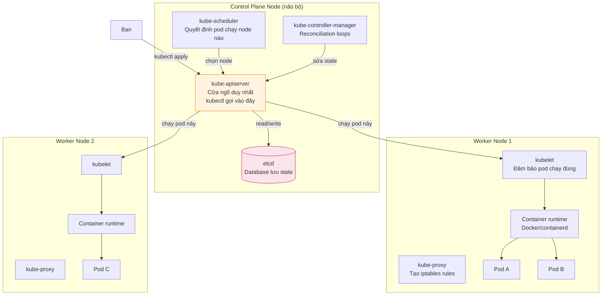
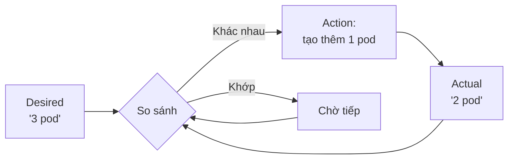

# Kubernetes — Hiểu sâu, viết được, vận hành được

> **Author:** Mr.Rom\
> **Version:** v1.0.0\
> **Created:** 20/05/2026\
> **Last updated:** 20/05/2026

> File này là **1 tài liệu duy nhất** đi từ "K8s là gì" đến "biết deploy app production-grade". Đọc theo thứ tự lần đầu, dùng làm reference về sau. Mỗi section có 6 phần cố định: **🎯 Vấn đề → 🧠 Khái niệm → 📊 Diagram → 📝 YAML → 🔧 Lệnh → ⚠️ Pitfall → ✅ Tự kiểm tra**.

---

## 📑 Mục lục

### Phần I — Nền móng (đọc nghiêm túc, đừng skim)

1. [Kubernetes giải quyết vấn đề gì?](#1-kubernetes-giải-quyết-vấn-đề-gì)
2. [Kiến trúc cluster — control plane vs worker](#2-kiến-trúc-cluster--control-plane-vs-worker)
3. [Declarative vs Imperative — cách K8s "nghĩ"](#3-declarative-vs-imperative--cách-k8s-nghĩ)
4. [Setup môi trường học — Minikube + kubectl](#4-setup-môi-trường-học--minikube--kubectl)

### Phần II — Object cơ bản

5. [Pod — đơn vị nhỏ nhất](#5-pod--đơn-vị-nhỏ-nhất)
6. [Namespace — tổ chức tài nguyên](#6-namespace--tổ-chức-tài-nguyên)
7. [Debug Pod — logs, exec, describe, cp](#7-debug-pod--logs-exec-describe-cp)

### Phần III — Workload thực tế

8. [Deployment — 3 tầng D/RS/P](#8-deployment--3-tầng-drsp)
9. [Service — networking trong cluster](#9-service--networking-trong-cluster)
10. [Rolling Update + Rollback](#10-rolling-update--rollback)

### Phần IV — Cấu hình & Bảo mật

11. [ConfigMap — config từ ngoài code](#11-configmap--config-từ-ngoài-code)
12. [Secret — credentials đúng cách](#12-secret--credentials-đúng-cách)

### Phần V — Lưu trữ

13. [Volume + PV + PVC](#13-volume--pv--pvc)
14. [StorageClass — dynamic provisioning](#14-storageclass--dynamic-provisioning)

### Phần VI — Reliability & Performance

15. [Probes — Liveness, Readiness, Startup](#15-probes--liveness-readiness-startup)
16. [HPA — Horizontal Pod Autoscaler](#16-hpa--horizontal-pod-autoscaler)
17. [Ingress — route HTTP từ ngoài vào](#17-ingress--route-http-từ-ngoài-vào)

### Phần VII — Workload nâng cao

18. [StatefulSet — stateful app](#18-statefulset--stateful-app)
19. [DaemonSet — pod trên mọi node](#19-daemonset--pod-trên-mọi-node)
20. [Job + CronJob — task có giới hạn](#20-job--cronjob--task-có-giới-hạn)
21. [Init Container + Sidecar pattern](#21-init-container--sidecar-pattern)

### Phần VIII — Production-grade

22. [RBAC + ServiceAccount](#22-rbac--serviceaccount)
23. [NetworkPolicy — firewall tầng Pod](#23-networkpolicy--firewall-tầng-pod)
24. [Affinity / Taints / Tolerations](#24-affinity--taints--tolerations)
25. [ResourceQuota + LimitRange + PodDisruptionBudget](#25-resourcequota--limitrange--poddisruptionbudget)

### Phần IX — Đóng gói & Quản lý YAML

26. [Helm — package manager](#26-helm--package-manager)
27. [Kustomize — overlay không cần template engine](#27-kustomize--overlay-không-cần-template-engine)

### Phần X — Tổng kết

28. [Cheatsheet — lệnh phải thuộc](#28-cheatsheet--lệnh-phải-thuộc)
29. [Troubleshooting tree — pod không Running thì làm gì?](#29-troubleshooting-tree--pod-không-running-thì-làm-gì)
30. [Hướng đi tiếp — sau guide này học gì?](#30-hướng-đi-tiếp--sau-guide-này-học-gì)

---

# Phần I — Nền móng

## 1. Kubernetes giải quyết vấn đề gì?

### 🎯 Vấn đề mà nó giải quyết

Hồi xưa, deploy 1 web app lên server thật là:

```
1 server vật lý → cài Linux → cài Node.js/Python → git clone → chạy app
```

Khi tải tăng:
- Mua thêm server → setup lại từ đầu → manual cấu hình load balancer
- 1 app chết → SSH vào server → bật lại tay
- Cần update version → SSH → git pull → restart → cầu trời không lỗi
- 3h sáng app crash → ai dậy bật lại?

Docker giải quyết được **đóng gói**: "app + dependency đóng trong 1 image, chạy được trên mọi nơi có Docker". Nhưng **vận hành nhiều container trên nhiều server** thì Docker không đủ:

- 10 server × 5 container mỗi server = 50 container — ai theo dõi?
- Container chết — ai bật lại?
- Cần scale 50 → 100 — chạy tay 50 lệnh?
- Update version cho 50 container — downtime ra sao?

**Kubernetes (K8s)** = hệ điều hành cho cụm server, chuyên chạy container.

### 🧠 Khái niệm

**Ẩn dụ dễ nhớ:** Hãy tưởng tượng bạn quản lý 1 đội xe taxi (50 chiếc).
- **Docker** = từng chiếc xe (đã đóng gói tài xế, GPS, máy lạnh).
- **Kubernetes** = tổng đài + người điều phối:
  - "Đang có 50 chuyến cần, cần 50 xe sẵn sàng" → tự gọi xe.
  - 1 xe hỏng → tổng đài tự gọi xe khác thay.
  - Khách tăng đột biến → tự huy động thêm xe.
  - Cần đổi sang xe mới hơn → đổi từng chiếc một, không gián đoạn dịch vụ.

K8s **không thay thế Docker** — K8s **dùng** Docker (hoặc containerd, CRI-O...) làm runtime để chạy container thật. K8s ở **trên** Docker.

### 📊 Diagram — vị trí của K8s

```
┌─────────────────────────────────────────────────┐
│  Bạn (developer / DevOps)                       │
│  "Tôi muốn 3 replica của app v6.0, scale theo  │
│   CPU, expose qua HTTPS"                        │
└────────────────────┬────────────────────────────┘
                     │ YAML
                     ▼
┌─────────────────────────────────────────────────┐
│  Kubernetes (control plane)                     │
│  Quản lý desired state, scheduling, healing    │
└────────────────────┬────────────────────────────┘
                     │ điều phối
                     ▼
┌─────────────────────────────────────────────────┐
│  Container runtime (Docker / containerd)        │
│  Chạy container thật                            │
└────────────────────┬────────────────────────────┘
                     │
                     ▼
┌─────────────────────────────────────────────────┐
│  Server vật lý / VM (node 1, node 2, ...)       │
└─────────────────────────────────────────────────┘
```

### 🔧 K8s làm được gì cụ thể?

| Khả năng | Cách K8s xử lý |
|---|---|
| **Self-healing** | Container chết → tự bật lại. Node chết → reschedule pod sang node khác |
| **Horizontal scaling** | 1 lệnh scale từ 3 → 100 replica, hoặc tự scale theo CPU/RAM |
| **Rolling update** | Update version từng pod một, không downtime |
| **Rollback** | Lỡ update lỗi → quay về version trước trong 5s |
| **Service discovery** | Pod gọi nhau qua tên DNS, không cần biết IP |
| **Load balancing** | Traffic tự chia đều cho tất cả replica |
| **Secret + Config management** | Tách credentials/config khỏi image |
| **Storage orchestration** | Tự mount disk (local, AWS EBS, GCE PD...) cho pod |

### ⚠️ Khi nào KHÔNG nên dùng K8s?

K8s không phải búa thần — đừng dùng K8s nếu:

- App chỉ có 1-2 container và không cần scale → docker-compose là đủ
- Team < 3 người, không có ai chuyên ops → K8s phức tạp hơn lợi
- Workload có 100% traffic ổn định, không cần auto-scale → VM truyền thống rẻ hơn
- Bạn chỉ chạy script chạy 1 lần → CronJob ngoài K8s (cron của OS) đủ rồi

### ✅ Tự kiểm tra

- Tại sao Docker không đủ cho production multi-server?
- K8s thay thế hay đứng trên Docker?
- Liệt kê 3 thứ K8s tự làm mà bạn không phải tay.

---

## 2. Kiến trúc cluster — control plane vs worker

### 🎯 Vấn đề

Bạn không chỉ chạy app — bạn còn cần ai đó **theo dõi** app. Trong K8s, role này được chia ra rõ ràng giữa **control plane** (não bộ) và **worker node** (cơ bắp).

### 🧠 Khái niệm

**Cluster** = 1 nhóm máy (node) làm việc cùng nhau như 1 hệ thống thống nhất.
- **Control plane node**: chạy "não bộ" — ra quyết định
- **Worker node**: chạy pod (container thật)

Một cluster có ít nhất 1 control plane và 0+ worker. Production: thường 3 control plane (HA) + nhiều worker.

### 📊 Diagram — chi tiết từng thành phần



### 🔧 Từng thành phần làm gì

| Thành phần | Ở đâu | Vai trò chính |
|---|---|---|
| **kube-apiserver** | Control plane | Tất cả request (từ `kubectl`, từ kubelet, từ controller) đều đi qua đây. RESTful API |
| **etcd** | Control plane | Key-value database lưu **toàn bộ** state cluster. Mất etcd = mất cluster |
| **kube-scheduler** | Control plane | "Pod mới này nên chạy node nào?" — tính dựa trên resource, affinity, taints |
| **kube-controller-manager** | Control plane | Vòng lặp reconciliation: deployment-controller, node-controller, endpoints-controller,... |
| **kubelet** | Worker | "Agent" trên mỗi node — nhận lệnh từ apiserver, gọi container runtime để chạy pod |
| **kube-proxy** | Worker | Tạo `iptables`/`IPVS` rules để pod giao tiếp qua Service |
| **Container runtime** | Worker | Chạy container thật (Docker, containerd, CRI-O) |
| **CoreDNS** | Pod | DNS nội bộ cluster — `service-name.namespace.svc.cluster.local` |
| **CNI plugin** | Pod hệ thống | Cấp IP cho pod, route traffic giữa pod (Calico, Cilium, Flannel,...) |

### 📝 Cách K8s xử lý 1 request — flow đầy đủ

Bạn gõ `kubectl apply -f deployment.yaml`:

```
1. kubectl đọc YAML → gửi HTTPS POST đến kube-apiserver
2. apiserver validate → ghi vào etcd
3. deployment-controller (trong controller-manager) phát hiện có Deployment mới
   → tạo ReplicaSet (cũng ghi vào etcd)
4. replicaset-controller phát hiện có ReplicaSet → tạo 3 Pod object (chưa chạy)
5. scheduler phát hiện Pod chưa có node → chọn node phù hợp → cập nhật Pod
6. kubelet trên node đó phát hiện có pod assign cho mình
   → gọi container runtime → pull image → chạy container
7. kubelet báo apiserver: "Pod đang Running"
8. apiserver cập nhật etcd
9. `kubectl get pods` → đọc từ apiserver → đọc từ etcd → hiển thị
```

**Điểm cốt lõi:** Tất cả nói chuyện qua apiserver. Không ai gọi trực tiếp etcd. Đây là lý do K8s có thể có nhiều control plane (HA) — chỉ cần apiserver + etcd cluster.

### ⚠️ Cạm bẫy

- Production etcd **phải** backup định kỳ. Mất etcd = mất cluster, không cứu được.
- Trong Minikube/Kind, tất cả thành phần trên chạy trong **1 container** duy nhất (single-node). Đừng tưởng tượng 5 server thật khi học local.

### ✅ Tự kiểm tra

- `kubectl` nói chuyện với cluster qua thành phần nào?
- etcd lưu cái gì?
- kubelet ở control plane hay worker?

---

## 3. Declarative vs Imperative — cách K8s "nghĩ"

### 🎯 Vấn đề

Đây là **tinh thần cốt lõi** của K8s. Hiểu sai chỗ này = học K8s mãi cũng không vào.

### 🧠 Khái niệm

**Imperative (mệnh lệnh)** — "Làm gì":
- "Hãy tạo cho tôi 1 container nginx, expose port 80, set env X=Y"
- Bạn nói **từng bước** phải làm
- Docker là imperative: `docker run -p 80:80 -e X=Y nginx`

**Declarative (khai báo)** — "Muốn gì":
- "Tôi muốn cluster luôn có 3 nginx pod, mỗi pod expose port 80, env X=Y"
- Bạn nói **trạng thái mong muốn**, K8s tự đảm bảo
- K8s primarily là declarative qua YAML

### 📊 So sánh

| | Imperative | Declarative |
|---|---|---|
| Cú pháp | `kubectl run`, `kubectl create`, `kubectl scale` | `kubectl apply -f file.yaml` |
| Lưu trữ | Trong đầu bạn / lịch sử shell | YAML check vào Git |
| Idempotent? | Không (chạy 2 lần → 2 pod) | Có (chạy nhiều lần → 1 trạng thái) |
| Phù hợp | Thử nghiệm, debug nhanh | Production, GitOps |
| Rollback | Manual | `kubectl rollout undo` |
| Audit | Khó | Git log = audit log |

### 🧠 Vòng lặp reconciliation — linh hồn của K8s

K8s **liên tục** so sánh:
- **Desired state**: trạng thái bạn khai báo (trong etcd)
- **Actual state**: trạng thái thực tế (kubelet báo lên)



Đây là lý do:
- Pod chết → K8s tự tạo lại (actual < desired → tạo)
- Bạn scale từ 3 → 10 → K8s tự tạo 7 pod (desired tăng)
- Node chết → pod trên node đó "biến mất" → actual giảm → reschedule sang node khác

**Bạn không bao giờ ra lệnh "tạo pod" trực tiếp.** Bạn khai báo desired state, K8s tự lo.

### 📝 So sánh thật

**Imperative — không nên dùng cho production:**
```bash
kubectl run myapp --image=morom/myapp:6.0 --port=5000
kubectl scale pod myapp --replicas=3   # ❌ scale pod không được, phải qua Deployment
```

**Declarative — chuẩn production:**
```yaml
# deployment.yaml
apiVersion: apps/v1
kind: Deployment
metadata:
  name: myapp
spec:
  replicas: 3              # ← desired state
  selector:
    matchLabels: { app: myapp }
  template:
    metadata:
      labels: { app: myapp }
    spec:
      containers:
      - name: myapp
        image: morom/myapp:6.0
        ports: [{ containerPort: 5000 }]
```
```bash
kubectl apply -f deployment.yaml         # tạo lần đầu
kubectl apply -f deployment.yaml         # sửa rồi apply lại — K8s tự diff & update
```

### ⚠️ Cạm bẫy lớn nhất cho người mới

Không bao giờ trộn imperative với declarative trên cùng resource. Vd:

```bash
kubectl create deployment myapp --image=morom/myapp:6.0    # imperative
kubectl apply -f myapp-deployment.yaml                     # rồi declarative
```

→ Sẽ thấy Warning:
```
Warning: resource deployments/myapp is missing the kubectl.kubernetes.io/last-applied-configuration annotation
```

Lý do: `apply` cần annotation `last-applied-configuration` để diff. `create` không lưu. Lần `apply` đầu sau `create`, K8s phải patch annotation. Không lỗi nhưng bẩn.

**Rule:** chọn 1 style, bám theo. Production luôn declarative.

### ✅ Tự kiểm tra

- Bạn muốn 3 replica nginx — viết YAML declarative.
- Vì sao production không nên dùng `kubectl run`?
- Nếu desired = 5 và actual = 3, K8s sẽ làm gì?

---

## 4. Setup môi trường học — Minikube + kubectl

### 🎯 Vấn đề

Bạn không có cluster K8s thật trên cloud — cần 1 cluster local để học.

### 🧠 So sánh 3 lựa chọn local cluster

| Tool | Cách hoạt động | Ưu | Nhược |
|---|---|---|---|
| **Minikube** ⭐ | Chạy 1 container Docker chứa cluster | Addons sẵn (Ingress, metrics, dashboard), dễ reset | Tốn ~2GB RAM |
| **Kind** | Cluster trong Docker (multi-node giả) | Nhanh, multi-node mô phỏng tốt | Phải `kind load docker-image` |
| **Docker Desktop K8s** | Tích hợp sẵn trong Docker Desktop | Share Docker daemon, không cần image load | Yếu addons, khó reset |

**Khuyến nghị cho học:** Minikube. Lý do — series này dùng addons (`minikube addons enable ingress`, `--cni=calico`) — sẵn 1 lệnh.

### 🔧 Setup macOS (Apple Silicon hoặc Intel)

```bash
# 1. Docker Desktop — tải từ https://www.docker.com/get-started
docker --version    # Verify >= 25.x

# 2. kubectl (Kubernetes CLI)
brew install kubectl
kubectl version --client

# 3. Minikube
brew install minikube
minikube version

# 4. Start cluster — lần đầu mất ~3 phút (pull image kicbase ~1.2GB)
minikube start --driver=docker

# 5. Verify
kubectl get nodes              # STATUS: Ready
kubectl get pods -A            # 7-8 system pod Running
```

### 🔧 Autocomplete (zsh) — phải có

```bash
echo 'source <(kubectl completion zsh)' >> ~/.zshrc
echo 'alias k=kubectl' >> ~/.zshrc
echo 'complete -F __start_kubectl k' >> ~/.zshrc
source ~/.zshrc
```

Giờ gõ `k get po<TAB>` → tự complete.

### 📝 Các lệnh Minikube hay dùng

```bash
minikube start --driver=docker          # Start cluster
minikube stop                           # Dừng (giữ state)
minikube delete                         # Xóa hẳn
minikube status                         # Check trạng thái
minikube dashboard                      # Mở UI dashboard trong browser
minikube image load my-image:tag        # Load image local vào cluster
minikube ssh                            # SSH vào VM của minikube
minikube addons list                    # List addons
minikube addons enable ingress          # Bật Ingress controller
minikube addons enable metrics-server   # Bật metrics-server (cho HPA)
```

### ⚠️ Cạm bẫy thường gặp

| Lỗi | Nguyên nhân | Fix |
|---|---|---|
| `minikube start` treo lâu | Docker Desktop chưa start hoặc thiếu RAM | Tăng RAM cho Docker Desktop ≥ 4GB |
| `ImagePullBackOff` khi apply Pod | Image local chưa push lên Docker Hub, cluster không thấy | `minikube image load <image>` |
| `kubectl` báo "connection refused" | Cluster chưa start | `minikube start` |
| Nhiều `minikube` profile chồng nhau | Tạo profile nhiều lần | `minikube delete --all` rồi start lại |

### ✅ Tự kiểm tra

- `minikube start` tạo cái gì trong Docker?
- Vì sao phải `minikube image load`?
- Khác giữa `minikube stop` và `minikube delete`?

---

# Phần II — Object cơ bản

## 5. Pod — đơn vị nhỏ nhất

### 🎯 Vấn đề

K8s không quản lý container trực tiếp. Đơn vị nhỏ nhất K8s quản lý là **Pod**.

### 🧠 Khái niệm

**Pod** = 1 hoặc nhiều container **share** với nhau:
- **Network**: cùng IP, cùng port space → `localhost` gọi lẫn nhau
- **Storage**: cùng volume
- **Lifecycle**: sống chết cùng nhau

99% trường hợp: 1 Pod = 1 container chính. Nhiều container chỉ khi cần **sidecar pattern** (Bài 21).

**Ẩn dụ:** Pod = 1 nhà trọ. Container = các phòng trong nhà.
- Chung 1 địa chỉ (IP)
- Chung hành lang (network)
- Chung kho (volume)
- Cả nhà bị phá → tất cả phòng đều mất

### 📊 Diagram

```
┌──────────────────────────────────┐
│  Pod (1 IP: 10.244.1.2)          │
│  ┌────────────┐  ┌────────────┐  │
│  │ Container  │  │ Sidecar    │  │
│  │ app:5000   │  │ logger:    │  │
│  │            │  │  ghi log   │  │
│  └────────────┘  └────────────┘  │
│  ↑ chung network namespace ↑     │
│  ↑ chung volume ./logs    ↑      │
└──────────────────────────────────┘
```

Container `app` gọi `localhost:5000` = chính nó. Container `logger` cũng gọi `localhost:5000` được — vì share network namespace.

### 📝 YAML Pod tối thiểu

```yaml
apiVersion: v1
kind: Pod
metadata:
  name: myapp-pod
  namespace: myapp-dev
  labels:
    app: myapp                    # quan trọng — Service/Deployment tìm pod qua label
spec:
  containers:
  - name: myapp                   # tên container trong pod
    image: morom/myapp:6.0
    imagePullPolicy: IfNotPresent # nếu image local có rồi, không pull
    ports:
    - containerPort: 5000         # chỉ document, không expose ra ngoài
    env:
    - name: APP_ENV
      value: "kubernetes"
    resources:
      requests:
        memory: "64Mi"
        cpu: "100m"               # 100m = 0.1 CPU
      limits:
        memory: "128Mi"
        cpu: "200m"
```

### 🔧 Lệnh

```bash
kubectl apply -f pod.yaml
kubectl get pods                          # List
kubectl get pods -o wide                  # Có IP, node
kubectl describe pod myapp-pod            # Chi tiết + Events
kubectl logs myapp-pod                    # stdout/stderr
kubectl exec -it myapp-pod -- /bin/bash   # Vào shell
kubectl delete pod myapp-pod              # Xóa
kubectl port-forward myapp-pod 8080:5000  # Tunnel local 8080 → pod 5000
```

### ⚠️ Cạm bẫy

| Sai lầm | Hậu quả | Đúng |
|---|---|---|
| Tạo Pod trần (không qua Deployment) | Pod chết là chết, không tự sống lại | Luôn qua Deployment trừ khi học bài 5 |
| `imagePullPolicy: Always` với tag cố định | Mỗi lần restart pull lại từ Docker Hub | Tag fix → `IfNotPresent`. Tag `latest` → `Always` |
| Không set `resources.requests` | Scheduler đặt pod random, có thể oversubscribed | Luôn set requests trong production |
| `containerPort` ≠ port app thật listen | Port-forward không work | Match đúng port app listen (vd Flask = 5000) |

### 🧠 Pod lifecycle

```
Pending → ContainerCreating → Running → (Succeeded | Failed | Terminating)
```

| Trạng thái | Ý nghĩa |
|---|---|
| `Pending` | Đang scheduling — chưa được gán node |
| `ContainerCreating` | Đang pull image / mount volume |
| `Running` | OK, ít nhất 1 container chạy |
| `Succeeded` | Hoàn thành (chỉ Job/CronJob) |
| `Failed` | Container exit với code ≠ 0 |
| `CrashLoopBackOff` | Container start → chết → start lại → vòng lặp |
| `ImagePullBackOff` | Không pull được image |

### ✅ Tự kiểm tra

- Pod khác Container chỗ nào?
- 2 container trong cùng pod gọi nhau qua gì? `localhost` hay IP pod?
- Khi nào pod ở status `Pending`?

---

## 6. Namespace — tổ chức tài nguyên

### 🎯 Vấn đề

Bạn có cluster duy nhất, nhưng:
- Có nhiều team — không muốn team A xóa nhầm pod của team B
- Có nhiều môi trường — dev / staging / prod
- Cần giới hạn resource cho từng nhóm

→ Cần "chia phòng" trong 1 cluster. Đó là **Namespace**.

### 🧠 Khái niệm

**Namespace** = thư mục logic trong cluster. Tất cả object (Pod, Service, Deployment,...) đều thuộc 1 namespace.

**Quan trọng:** namespace **không cô lập network** mặc định. Pod ở namespace A vẫn gọi được pod ở namespace B qua DNS. Cô lập network = NetworkPolicy (Bài 23).

### 📊 Diagram

```
Cluster
├── Namespace: kube-system          (hệ thống — DNS, scheduler, ...)
├── Namespace: kube-public          (resource public toàn cluster)
├── Namespace: default              (mặc định — đừng dùng cho app thật)
├── Namespace: myapp-dev            (env dev của team)
│   ├── Deployment: myapp
│   ├── Service: myapp
│   └── ConfigMap: myapp-config
├── Namespace: myapp-staging
└── Namespace: myapp-prod
```

### 📝 YAML

```yaml
apiVersion: v1
kind: Namespace
metadata:
  name: myapp-dev
---
apiVersion: v1
kind: Namespace
metadata:
  name: myapp-prod
```

### 🔧 Lệnh

```bash
# Tạo
kubectl create namespace myapp-dev
kubectl apply -f namespaces.yaml

# List
kubectl get namespaces           # alias: kubectl get ns

# Đặt default namespace để khỏi gõ -n hoài
kubectl config set-context --current --namespace=myapp-dev
kubectl config view --minify | grep namespace

# Xem resource trong namespace
kubectl get all -n myapp-dev

# Xem tất cả namespace
kubectl get pods -A              # -A = --all-namespaces

# Xóa namespace (xóa LUÔN mọi resource bên trong — cẩn thận)
kubectl delete namespace myapp-dev
```

### 🌐 DNS giữa namespace

Pod trong namespace `myapp-dev` gọi service `redis` cùng namespace:
```
redis
```

Gọi service `redis` ở namespace `myapp-prod`:
```
redis.myapp-prod
# Hoặc full FQDN:
redis.myapp-prod.svc.cluster.local
```

### ⚠️ Cạm bẫy

| Sai lầm | Đúng |
|---|---|
| Deploy app vào namespace `default` | Tạo namespace riêng, đặt default context vào đó |
| Tưởng namespace cô lập network | Không cô lập — cần NetworkPolicy nếu muốn |
| Tạo nhiều namespace `myapp` cho cùng team | Naming pattern: `<team>-<env>`, vd `payment-prod` |

### ✅ Tự kiểm tra

- Pod ở `dev` gọi service `redis` ở `prod` qua DNS gì?
- Xóa namespace có xóa Pod bên trong không?
- Vì sao đừng deploy vào `default`?

---

## 7. Debug Pod — logs, exec, describe, cp

### 🎯 Vấn đề

Pod không Running? App lỗi? Cần biết 4 lệnh debug cốt lõi.

### 🔧 4 lệnh phải thuộc

```bash
# 1. LOGS — đọc stdout/stderr container
kubectl logs <pod>
kubectl logs -f <pod>             # follow realtime (Ctrl+C để thoát)
kubectl logs --tail=50 <pod>      # 50 dòng cuối
kubectl logs --previous <pod>     # Log của container TRƯỚC khi restart (debug crash)
kubectl logs <pod> -c <container> # Chỉ định container nếu pod có nhiều

# 2. EXEC — chạy lệnh trong container
kubectl exec -it <pod> -- /bin/bash      # Interactive shell
kubectl exec -it <pod> -- sh             # Nếu không có bash (alpine, distroless)
kubectl exec <pod> -- ls /app            # 1-shot command
kubectl exec <pod> -- env                # Xem env vars thật trong container

# 3. DESCRIBE — info chi tiết + Events
kubectl describe pod <pod>
# Đọc 2 phần quan trọng:
# - Events (cuối output): lỗi pull image, OOMKilled, evicted,...
# - Conditions: Ready, ContainersReady,...

# 4. CP — copy file giữa pod ↔ local
kubectl cp <namespace>/<pod>:/path/in/pod ./local-file    # Pod → local
kubectl cp ./local-file <namespace>/<pod>:/tmp/           # Local → pod
```

### 🧠 Khi nào dùng cái nào?

```
Pod không Ready
    │
    ├── kubectl get pods → status gì?
    │     ├── ImagePullBackOff → describe → check Events → fix image name
    │     ├── CrashLoopBackOff → logs --previous → tìm lỗi crash
    │     ├── Pending → describe → "Insufficient cpu" hoặc "no node match selector"
    │     └── Running but not Ready → describe → check Readiness probe
    │
    └── Pod Running nhưng app không respond
          ├── logs → có request log không?
          ├── exec → curl localhost:<port> bên trong pod → có response không?
          ├── exec → ls /app, env → config đúng chưa?
          └── port-forward → curl từ máy bạn → có response không?
```

### 💡 Mẹo

**Container không có `curl`?**
```bash
# Trong pod (image distroless/scratch không có shell)
kubectl debug -it <pod> --image=nicolaka/netshoot --target=<container-name>
# → tạo ephemeral container có sẵn curl, dig, tcpdump,...
```

**Xem resource usage real-time:**
```bash
kubectl top pod <pod>          # Cần metrics-server cài
kubectl top nodes
```

### ⚠️ Cạm bẫy

| Sai lầm | Hậu quả |
|---|---|
| Chỉ đọc `kubectl get pods`, không describe | Bỏ qua Events — phần quan trọng nhất khi pod stuck |
| Exec vào pod rồi sửa file → tưởng đã fix | Pod restart, file mất. Phải sửa qua image hoặc ConfigMap |
| Logs không có gì → kết luận pod im lặng | Có thể app log ra file, không ra stdout. `exec` vào xem file log |

### ✅ Tự kiểm tra

- Pod báo `CrashLoopBackOff` → lệnh nào đọc log của lần crash trước?
- Container chạy alpine không có bash → exec sao?
- Pod Running nhưng curl từ ngoài không vào → debug bước nào trước?

---

# Phần III — Workload thực tế

## 8. Deployment — 3 tầng D/RS/P

### 🎯 Vấn đề

Pod trần có 4 nhược điểm chết người (đã liệt kê ở Bài 5). **Deployment** fix tất cả.

### 🧠 Mô hình 3 tầng

```
┌──────────────────────────────────────┐
│  Deployment      ← bạn viết YAML     │
│  "Tôi muốn 3 replica, image v6.0"    │
└─────────────────┬────────────────────┘
                  │ tạo & quản lý
                  ▼
┌──────────────────────────────────────┐
│  ReplicaSet     ← K8s tự tạo         │
│  "Đảm bảo LUÔN có 3 pod Running"     │
└─────────────────┬────────────────────┘
                  │ tạo & quản lý
                  ▼
┌──────────────────────────────────────┐
│  Pod × 3        ← container thật     │
└──────────────────────────────────────┘
```

**Bạn chỉ chạm tầng Deployment.** Hai tầng dưới K8s tự lo.

### 🧠 Vì sao có 3 tầng (không gộp lại 2)?

- **ReplicaSet** chuyên 1 việc: giữ số pod đúng `replicas`.
- **Deployment** thêm tính năng **versioning**: mỗi lần update spec, tạo **RS mới**, từ từ tăng RS mới + giảm RS cũ → rolling update. RS cũ giữ lại để rollback.

Khi xem `kubectl get rs`:
```
NAME                        DESIRED   CURRENT   READY   AGE
myapp-deployment-647cd87b   3         3         3       2h    ← RS hiện tại (v6.0)
myapp-deployment-8a1b2c3d   0         0         0       30m   ← RS cũ (v5.0, giữ để rollback)
```

### 📊 Naming pattern

```
myapp-deployment-647cd87b-7qzdw
└──────┬──────┘ └──┬──┘ └─┬─┘
       │           │      └── 5 ký tự random (unique pod)
       │           └────────── hash của pod template (đổi khi spec.template đổi)
       └────────────────────── tên Deployment
```

Khi bạn sửa `spec.template` (image, env, label) → hash đổi → K8s tạo RS mới → rolling update.

### 📝 YAML Deployment hoàn chỉnh

```yaml
apiVersion: apps/v1
kind: Deployment
metadata:
  name: myapp-deployment
  namespace: myapp-dev
spec:
  replicas: 3                           # desired count
  strategy:                             # update strategy (mặc định RollingUpdate)
    type: RollingUpdate
    rollingUpdate:
      maxSurge: 1                       # tối đa thêm 1 pod khi update
      maxUnavailable: 0                 # không cho phép pod nào unavailable
  selector:
    matchLabels:
      app: myapp                        # ⚠️ PHẢI MATCH template.metadata.labels
  template:                             # ← đây là Pod template
    metadata:
      labels:
        app: myapp                      # ⚠️ Pod sẽ có label này
    spec:
      containers:
      - name: myapp
        image: morom/myapp:6.0
        imagePullPolicy: IfNotPresent
        ports:
        - containerPort: 5000
        env:
        - name: APP_ENV
          value: "kubernetes"
        resources:
          requests:
            memory: "64Mi"
            cpu: "100m"
          limits:
            memory: "128Mi"
            cpu: "200m"
```

### 🔧 Lệnh

```bash
# Apply
kubectl apply -f deployment.yaml

# Quan sát 3 tầng
kubectl get deployments
kubectl get replicasets
kubectl get pods

# Self-healing test
kubectl delete pod <pod-name>             # → pod mới tự tạo trong < 5s

# Scale
kubectl scale deployment myapp-deployment --replicas=5
kubectl scale deployment myapp-deployment --replicas=3

# Cập nhật image (rolling update — Bài 10)
kubectl set image deployment/myapp-deployment myapp=morom/myapp:7.0

# Restart pods (không đổi image, chỉ trigger tạo lại)
kubectl rollout restart deployment/myapp-deployment

# Xóa
kubectl delete deployment myapp-deployment   # → xóa RS → xóa pod (cascade)
```

### ⚠️ Cạm bẫy

| Sai lầm | Triệu chứng | Fix |
|---|---|---|
| `selector.matchLabels` ≠ `template.metadata.labels` | Apply báo lỗi | Match đúng |
| Xóa Pod trực tiếp khi muốn dừng app | Pod tự tạo lại | Xóa Deployment |
| `replicas: 1` trong production | Update = downtime, pod chết = downtime | ≥ 2 replica |
| Không set `resources` | Scheduler đặt random, dễ OOM | Luôn set requests + limits |
| `maxUnavailable: 1` với `replicas: 1` | Update = 0 pod available = downtime | `replicas ≥ 2`, `maxUnavailable: 0` |

### ✅ Tự kiểm tra

- Pod chết, ReplicaSet làm gì?
- Bạn sửa image trong Deployment, RS làm gì?
- Vì sao không nên xóa Pod tay?

---

## 9. Service — networking trong cluster

### 🎯 Vấn đề

Pod có IP, nhưng:
- Pod chết → IP đổi. App khác đang gọi IP cũ → fail.
- 3 replica = 3 IP. Caller phải biết IP nào, load balance ra sao?
- Pod restart → IP mới hoàn toàn.

→ Cần 1 **địa chỉ ổn định** trỏ tới nhóm pod. Đó là **Service**.

### 🧠 Khái niệm

**Service** = endpoint ổn định (IP + DNS name) trỏ tới nhóm pod được chọn qua **label selector**.

**Ẩn dụ:** Service = số tổng đài. Pod = nhân viên. Khách gọi tổng đài, được nối tới nhân viên rảnh nhất. Nhân viên nghỉ việc — số tổng đài vẫn vậy.

### 📊 Diagram

```
                     ┌─ Pod 1 (app: myapp, IP: 10.244.1.5)
                     │
Service (10.96.5.2)  ├─ Pod 2 (app: myapp, IP: 10.244.2.7)  ← chọn pod qua
"myapp:80"           │                                          selector { app: myapp }
                     └─ Pod 3 (app: myapp, IP: 10.244.3.9)
```

Caller gọi `myapp:80` (DNS) hoặc `10.96.5.2:80` (ClusterIP). kube-proxy load-balance round-robin tới 1 trong 3 pod.

### 🧠 4 loại Service

| Type | Truy cập từ đâu | Use case |
|---|---|---|
| **ClusterIP** (mặc định) | Chỉ trong cluster | Pod gọi pod (vd app gọi Redis) |
| **NodePort** | Ngoài cluster qua `<NodeIP>:<port>` (port range 30000-32767) | Test, demo |
| **LoadBalancer** | Internet qua external IP do cloud cấp (AWS ELB, GCP LB) | Production trên cloud |
| **ExternalName** | DNS alias đến service ngoài cluster | Migration, legacy |

### 📝 YAML — 3 loại phổ biến

**ClusterIP — gọi nhau trong cluster:**
```yaml
apiVersion: v1
kind: Service
metadata:
  name: myapp
  namespace: myapp-dev
spec:
  type: ClusterIP                  # mặc định, có thể bỏ
  selector:
    app: myapp                     # ⚠️ MATCH labels của pod
  ports:
  - port: 80                       # port của Service
    targetPort: 5000               # port của pod (= containerPort)
    protocol: TCP
```

Caller (pod khác cùng namespace) gọi: `http://myapp:80` hoặc `http://myapp.myapp-dev.svc.cluster.local`.

**NodePort — expose ra ngoài (local test):**
```yaml
apiVersion: v1
kind: Service
metadata:
  name: myapp-nodeport
spec:
  type: NodePort
  selector:
    app: myapp
  ports:
  - port: 80                       # Service port (internal)
    targetPort: 5000               # Pod port
    nodePort: 30080                # Port mở trên mỗi node (range 30000-32767)
```

Truy cập: `http://<minikube-ip>:30080` hoặc `minikube service myapp-nodeport`.

**LoadBalancer — production cloud:**
```yaml
apiVersion: v1
kind: Service
metadata:
  name: myapp-lb
spec:
  type: LoadBalancer
  selector:
    app: myapp
  ports:
  - port: 80
    targetPort: 5000
```

Cloud (AWS/GCP) tự cấp external IP. Trên Minikube cần `minikube tunnel`.

### 🔧 Lệnh

```bash
kubectl apply -f service.yaml
kubectl get services                          # alias: kubectl get svc
kubectl describe service myapp                # Xem Endpoints (list IP pod)
kubectl get endpoints myapp                   # IP của các pod đang serve

# Expose nhanh (imperative, dùng cho học)
kubectl expose deployment myapp --port=80 --target-port=5000 --type=NodePort

# Test trong cluster
kubectl run tmp --image=curlimages/curl -it --rm -- curl http://myapp
```

### 🧠 Cách kube-proxy chuyển traffic

```
Pod caller curl myapp:80
   │
   ▼
CoreDNS resolve myapp → 10.96.5.2 (ClusterIP)
   │
   ▼
kube-proxy (iptables) intercept 10.96.5.2:80
   │
   ▼ load balance random (round-robin)
   ├─→ Pod 1 (10.244.1.5:5000)
   ├─→ Pod 2 (10.244.2.7:5000)
   └─→ Pod 3 (10.244.3.9:5000)
```

### ⚠️ Cạm bẫy

| Sai lầm | Triệu chứng | Fix |
|---|---|---|
| `selector` không match label pod | Service không có endpoint | `kubectl describe svc` → check "Endpoints" |
| `port` vs `targetPort` lẫn lộn | 502 / connection refused | `port` = Service expose ra, `targetPort` = pod listen thật |
| Dùng IP pod thay vì Service | IP đổi, app fail | Luôn gọi qua Service name |
| Pod không có label → Service không gom | Endpoints rỗng | `kubectl get pods --show-labels` để check |

### 🌐 DNS pattern đầy đủ

```
<service>                                     # cùng namespace
<service>.<namespace>                          # khác namespace
<service>.<namespace>.svc.cluster.local        # FQDN
```

### ✅ Tự kiểm tra

- Service biết pod nào thuộc về nó qua gì?
- 3 pod thì Service load balance ra sao?
- ClusterIP có truy cập được từ máy host (ngoài cluster) không?

---

## 10. Rolling Update + Rollback

### 🎯 Vấn đề

Bạn deploy app v6.0 → giờ có v7.0. Update sao cho:
- Không downtime
- Có thể rollback nếu lỗi
- Tự gradual (không thay tất cả 1 lúc)

### 🧠 Cách Deployment rolling update

Khi bạn `kubectl set image` hoặc `kubectl apply` với image mới:

```
Trước update: RS-old (v6.0) có 3 pod
                
Bước 1: K8s tạo RS-new (v7.0), 0 pod
Bước 2: RS-new scale lên 1 pod. Đợi Ready.
Bước 3: RS-old scale xuống 2 pod (xóa 1).
Bước 4: RS-new scale lên 2 pod.
Bước 5: RS-old scale xuống 1 pod.
Bước 6: RS-new scale lên 3 pod.
Bước 7: RS-old scale xuống 0 pod.

Sau update: RS-new (v7.0) có 3 pod, RS-old có 0 pod (giữ để rollback).
```

Số pod tổng luôn ≈ 3 → **không downtime**.

### 📝 Strategy trong YAML

```yaml
spec:
  strategy:
    type: RollingUpdate              # hoặc "Recreate" (xóa hết rồi tạo lại — có downtime)
    rollingUpdate:
      maxSurge: 1                    # tối đa thừa 1 pod (3 + 1 = 4 lúc cao điểm)
      maxUnavailable: 0              # không cho phép pod nào unavailable
```

| Strategy | Khi nào dùng |
|---|---|
| `RollingUpdate` (mặc định) | Hầu hết case — không downtime |
| `Recreate` | Khi 2 version không chạy được cùng lúc (vd DB migration schema khác) |

### 🔧 Lệnh

```bash
# Update image
kubectl set image deployment/myapp-deployment myapp=morom/myapp:7.0
# Hoặc sửa file YAML rồi apply:
kubectl apply -f deployment.yaml

# Theo dõi tiến trình
kubectl rollout status deployment/myapp-deployment

# Xem lịch sử
kubectl rollout history deployment/myapp-deployment
# Output:
# REVISION  CHANGE-CAUSE
# 1         <none>
# 2         kubectl set image deployment/myapp-deployment myapp=morom/myapp:7.0

# Chi tiết revision
kubectl rollout history deployment/myapp-deployment --revision=2

# ROLLBACK (về revision trước)
kubectl rollout undo deployment/myapp-deployment
# Hoặc về revision cụ thể:
kubectl rollout undo deployment/myapp-deployment --to-revision=1

# Pause / Resume rollout (vd để debug giữa chừng)
kubectl rollout pause deployment/myapp-deployment
kubectl rollout resume deployment/myapp-deployment
```

### 💡 Best practice — ghi change cause

```bash
# Cách 1: annotation khi apply
kubectl annotate deployment/myapp-deployment kubernetes.io/change-cause="Update to v7.0 — fix login bug"

# Cách 2: thêm vào YAML
metadata:
  annotations:
    kubernetes.io/change-cause: "Update to v7.0 — fix login bug"
```

→ Sau này `rollout history` thấy được lý do thay đổi.

### ⚠️ Cạm bẫy

| Sai lầm | Hậu quả |
|---|---|
| Update mà chưa test trên dev | Rollback thật cũng mất thời gian, traffic vẫn lỗi |
| `maxSurge: 0 + maxUnavailable: 1` với 1 replica | Downtime trong vài giây |
| Quên đặt readinessProbe (Bài 15) | K8s tưởng pod mới Ready trước khi app thật sẵn → traffic vào pod chưa sẵn → lỗi |
| Image dùng tag `latest` | `rollout undo` không thực sự rollback (tag không đổi, image cùng tên) |

### ✅ Tự kiểm tra

- Trong rolling update có khoảnh khắc 2 version cùng chạy. Có vấn đề gì?
- Vì sao `latest` tag không hợp production?
- Rollback về revision 1 — RS cũ vẫn còn không?

---

# Phần IV — Cấu hình & Bảo mật

## 11. ConfigMap — config từ ngoài code

### 🎯 Vấn đề

Bạn không nên hardcode config vào image:
- Đổi config → phải rebuild image
- Cùng image chạy ở dev/staging/prod với config khác
- Sửa config cần PR vào code repo

→ Tách config ra → **ConfigMap**.

### 🧠 Khái niệm

**ConfigMap** = lưu cặp key-value (không nhạy cảm) trong cluster, inject vào pod qua:
- Environment variable
- File mount
- Command-line args

**Không dùng cho password / token / secret** — đó là việc của **Secret** (Bài 12).

### 📝 YAML

```yaml
apiVersion: v1
kind: ConfigMap
metadata:
  name: myapp-config
  namespace: myapp-dev
data:
  APP_ENV: "kubernetes"
  APP_NAME: "K8s App"
  LOG_LEVEL: "info"
  DB_HOST: "postgres.myapp-dev"
  config.yaml: |
    feature_flags:
      new_ui: true
      beta_payment: false
```

→ Có 2 dạng key:
- Single value (`APP_ENV`, `LOG_LEVEL`,...) → inject làm env var
- Multi-line (`config.yaml`) → mount làm file

### 📝 Inject vào Pod

**Cách 1 — env vars:**
```yaml
spec:
  containers:
  - name: myapp
    image: morom/myapp:6.0
    envFrom:
    - configMapRef:
        name: myapp-config        # ← tất cả key trong ConfigMap thành env var
```

Hoặc chọn lọc:
```yaml
    env:
    - name: APP_ENV
      valueFrom:
        configMapKeyRef:
          name: myapp-config
          key: APP_ENV
```

**Cách 2 — mount làm file:**
```yaml
spec:
  containers:
  - name: myapp
    volumeMounts:
    - name: config-vol
      mountPath: /etc/myapp       # → /etc/myapp/config.yaml, /etc/myapp/APP_ENV,...
  volumes:
  - name: config-vol
    configMap:
      name: myapp-config
```

### 🔧 Lệnh

```bash
# Tạo từ literal
kubectl create configmap myapp-config \
  --from-literal=APP_ENV=kubernetes \
  --from-literal=LOG_LEVEL=info

# Tạo từ file
kubectl create configmap myapp-config --from-file=config.yaml

# Tạo từ env file
kubectl create configmap myapp-config --from-env-file=.env

# Xem
kubectl get configmap myapp-config -o yaml
kubectl describe configmap myapp-config

# Edit
kubectl edit configmap myapp-config
```

### ⚠️ Cạm bẫy

| Sai lầm | Hậu quả |
|---|---|
| Sửa ConfigMap, pod không tự nhận | `envFrom` chỉ inject lúc start. Phải `rollout restart` deployment |
| Lưu password trong ConfigMap | Mọi người có quyền read namespace đều thấy plain text |
| Tạo ConfigMap khác namespace với Pod | Pod không tham chiếu được. ConfigMap **namespace-scoped** |
| `data` value không phải string | YAML cast — vd `port: 5000` (int) sẽ lỗi. Phải `port: "5000"` |

### ✅ Tự kiểm tra

- Sửa ConfigMap, pod đang chạy có tự update không?
- Khi nào dùng `envFrom` vs `volumeMounts`?
- Có lưu API key được trong ConfigMap không? Vì sao?

---

## 12. Secret — credentials đúng cách

### 🎯 Vấn đề

Password DB, API key, TLS cert — phải lưu ở đâu để:
- Không hardcode trong image
- Không commit lên Git
- Inject vào pod runtime

→ **Secret**.

### 🧠 Khái niệm

**Secret** giống ConfigMap (key-value, namespace-scoped, inject vào pod) — nhưng:
- Lưu base64 (KHÔNG phải encrypt!) — chỉ "che mắt"
- Production: encrypt at rest qua **EncryptionConfiguration** của etcd
- Production: dùng **Sealed Secrets** (Bitnami) hoặc **External Secrets Operator** (Vault, AWS Secrets Manager)

⚠️ **Base64 ≠ encryption.** Bất kỳ ai `cat | base64 -d` đều decode được. Secret YAML **không bao giờ commit lên Git public**.

### 📝 YAML

**Cách 1 — stringData (recommend cho dev):**
```yaml
apiVersion: v1
kind: Secret
metadata:
  name: myapp-secret
  namespace: myapp-dev
type: Opaque
stringData:
  DB_PASSWORD: "supersecret123"
  API_KEY: "sk_test_abc123"
```

**Cách 2 — data (base64):**
```yaml
apiVersion: v1
kind: Secret
metadata:
  name: myapp-secret
type: Opaque
data:
  DB_PASSWORD: c3VwZXJzZWNyZXQxMjM=   # = echo -n "supersecret123" | base64
  API_KEY: c2tfdGVzdF9hYmMxMjM=
```

→ `stringData` tiện hơn cho con người viết tay. K8s tự encode về base64 khi store.

### 📝 Inject vào Pod (giống ConfigMap)

```yaml
spec:
  containers:
  - name: myapp
    envFrom:
    - secretRef:
        name: myapp-secret
```

Hoặc chọn lọc:
```yaml
    env:
    - name: DB_PASSWORD
      valueFrom:
        secretKeyRef:
          name: myapp-secret
          key: DB_PASSWORD
```

### 🧠 Các loại Secret đặc biệt

| Type | Use case |
|---|---|
| `Opaque` (mặc định) | Generic key-value |
| `kubernetes.io/tls` | TLS cert + private key |
| `kubernetes.io/dockerconfigjson` | Pull image từ private registry |
| `kubernetes.io/service-account-token` | Token cho ServiceAccount (Bài 22) |

**TLS Secret:**
```bash
kubectl create secret tls myapp-tls \
  --cert=server.crt \
  --key=server.key
```

**Docker registry Secret:**
```bash
kubectl create secret docker-registry regcred \
  --docker-server=https://index.docker.io/v1/ \
  --docker-username=morom \
  --docker-password=<password>

# Trong Pod:
spec:
  imagePullSecrets:
  - name: regcred
```

### 🔧 Lệnh

```bash
# Tạo từ literal
kubectl create secret generic myapp-secret \
  --from-literal=DB_PASSWORD=supersecret123

# Tạo từ file
kubectl create secret generic myapp-secret --from-file=password.txt

# Xem (decode tự động)
kubectl get secret myapp-secret -o jsonpath='{.data.DB_PASSWORD}' | base64 -d
```

### ⚠️ Cạm bẫy

| Sai lầm | Hậu quả |
|---|---|
| Commit secret.yaml lên Git | Lộ credentials. Dùng Sealed Secrets thay thế |
| Tưởng base64 là encrypt | Ai cũng decode được |
| Không bật etcd encryption at rest | etcd backup → credentials lộ |
| Đặt secret cùng namespace với mọi team | Mỗi team nên có namespace + RBAC riêng |

### 🛠️ Production-grade

- **Sealed Secrets** (Bitnami): mã hóa secret trước khi commit lên Git, controller trong cluster decrypt
- **External Secrets Operator**: K8s tự fetch từ AWS Secrets Manager / Vault / GCP Secret Manager
- **HashiCorp Vault**: secret store chuyên dụng + dynamic secrets

### ✅ Tự kiểm tra

- Secret có encrypt không?
- Vì sao không nên commit secret.yaml lên Git?
- Pull image private Docker Hub — dùng Secret type gì?

---

# Phần V — Lưu trữ

## 13. Volume + PV + PVC

### 🎯 Vấn đề

Container **ephemeral** (tạm thời) — pod chết, data trong container mất. Cần lưu data tồn tại qua restart, qua reschedule.

### 🧠 3 khái niệm

| Khái niệm | Vai trò | Ai tạo? |
|---|---|---|
| **Volume** | Storage attach vào pod (mỗi pod khai báo trong YAML) | Pod khai báo |
| **PersistentVolume (PV)** | Resource storage trong cluster (cluster-wide) | Admin (hoặc StorageClass tự tạo) |
| **PersistentVolumeClaim (PVC)** | Pod "đặt hàng" PV: "tôi cần 5Gi, mode ReadWriteOnce" | Developer (cùng namespace với pod) |

**Ẩn dụ:**
- **PV** = ổ cứng vật lý trong kho
- **PVC** = đơn yêu cầu mượn ổ cứng ("tôi cần 5GB")
- **K8s** = thủ kho, ghép PVC ↔ PV phù hợp

### 📊 Flow

```
1. Admin tạo PV (5Gi, ReadWriteOnce)            ┐
2. Dev tạo PVC (cần 5Gi, ReadWriteOnce)         ├ Bind tự động
3. K8s match PVC ↔ PV → PVC status: Bound       ┘
4. Dev mount PVC vào Pod như volume
5. Pod ghi file → file lưu trong PV
6. Pod chết → reschedule sang node khác → vẫn mount PV cũ → data còn nguyên
```

### 📝 YAML

**PV (admin tạo):**
```yaml
apiVersion: v1
kind: PersistentVolume
metadata:
  name: myapp-pv
spec:
  capacity:
    storage: 5Gi
  accessModes:
    - ReadWriteOnce               # 1 node ghi cùng lúc
  hostPath:                       # ⚠️ chỉ dùng local — single node
    path: /mnt/data/myapp
  persistentVolumeReclaimPolicy: Retain
```

**PVC (dev tạo):**
```yaml
apiVersion: v1
kind: PersistentVolumeClaim
metadata:
  name: myapp-pvc
  namespace: myapp-dev
spec:
  accessModes:
    - ReadWriteOnce
  resources:
    requests:
      storage: 5Gi
```

**Mount vào Pod:**
```yaml
spec:
  containers:
  - name: myapp
    image: morom/myapp:6.0
    volumeMounts:
    - name: data-vol
      mountPath: /app/data
  volumes:
  - name: data-vol
    persistentVolumeClaim:
      claimName: myapp-pvc
```

### 🧠 Access modes

| Mode | Ý nghĩa | Use case |
|---|---|---|
| `ReadWriteOnce` (RWO) | 1 node ghi cùng lúc | DB, app single-instance |
| `ReadOnlyMany` (ROX) | Nhiều node đọc (chỉ đọc) | Static content |
| `ReadWriteMany` (RWX) | Nhiều node ghi (cần NFS/CephFS) | Shared workspace |
| `ReadWriteOncePod` (RWOP) | Chỉ 1 pod được mount | DB strict single-writer |

### 🧠 Reclaim policy

Khi xóa PVC, PV phải làm gì?

| Policy | Hành vi |
|---|---|
| `Retain` | Giữ data, PV status `Released` (admin phải xóa tay) |
| `Delete` | Xóa luôn PV + data (mặc định cho dynamic provisioning) |
| `Recycle` (deprecated) | `rm -rf` data, PV có thể dùng lại |

### 🔧 Lệnh

```bash
kubectl get pv
kubectl get pvc
kubectl describe pvc myapp-pvc

# Xem volume gắn pod
kubectl get pod myapp-pod -o jsonpath='{.spec.volumes}'
```

### ⚠️ Cạm bẫy — `hostPath` chỉ dùng local

```yaml
hostPath:
  path: /mnt/data
```

→ Mount thư mục trên **node** vào pod. Pod reschedule sang node khác → mất data vì node khác không có folder đó.

**Production:**
- Cloud: dùng StorageClass + AWS EBS / GCE PD / Azure Disk
- On-prem: NFS, CephFS, Longhorn

### ✅ Tự kiểm tra

- PV và PVC ai tạo, khi nào bind?
- `hostPath` có dùng multi-node được không?
- Khác `ReadWriteOnce` và `ReadWriteMany`?

---

## 14. StorageClass — dynamic provisioning

### 🎯 Vấn đề

Cách trên (Bài 13) là **static** — admin phải tạo PV thủ công trước. Production không scale được.

→ **StorageClass** = template để **tự tạo PV** khi có PVC.

### 🧠 Khái niệm

**StorageClass** mô tả:
- Provisioner: ai cấp storage (AWS EBS, GCE PD, Azure Disk, local-path,...)
- Parameters: loại disk (gp3, ssd, hdd), encryption,...
- Reclaim policy mặc định

Khi PVC chỉ định `storageClassName: <name>` → K8s tự gọi provisioner → tạo PV → bind.

### 📊 Flow

```
1. Admin tạo StorageClass "fast-ssd" (AWS EBS gp3)
2. Dev tạo PVC chỉ định storageClassName: fast-ssd
3. K8s gọi provisioner → AWS tạo EBS volume → tạo PV object → bind PVC
4. Pod mount PVC → data lưu trên AWS EBS
5. Xóa PVC → (nếu reclaim=Delete) → xóa PV → xóa EBS volume
```

### 📝 YAML

**StorageClass (AWS EBS gp3):**
```yaml
apiVersion: storage.k8s.io/v1
kind: StorageClass
metadata:
  name: fast-ssd
provisioner: ebs.csi.aws.com
parameters:
  type: gp3
  encrypted: "true"
reclaimPolicy: Delete
volumeBindingMode: WaitForFirstConsumer    # tạo PV khi pod được schedule (đúng AZ)
allowVolumeExpansion: true                  # PVC có thể resize lớn hơn về sau
```

**PVC dùng:**
```yaml
apiVersion: v1
kind: PersistentVolumeClaim
metadata:
  name: myapp-pvc
spec:
  storageClassName: fast-ssd
  accessModes: [ReadWriteOnce]
  resources:
    requests:
      storage: 20Gi
```

### 🧠 `volumeBindingMode`

| Mode | Khi nào tạo PV |
|---|---|
| `Immediate` (mặc định) | Ngay khi PVC tạo (có thể tạo ở AZ khác pod sau này) |
| `WaitForFirstConsumer` | Đợi pod được schedule → tạo PV cùng AZ với pod (recommend cloud) |

### 🔧 Lệnh

```bash
kubectl get storageclass             # alias: sc
kubectl describe storageclass fast-ssd

# Mark default
kubectl annotate storageclass fast-ssd storageclass.kubernetes.io/is-default-class=true
```

### 🌐 Provisioner phổ biến

| Môi trường | Provisioner |
|---|---|
| AWS | `ebs.csi.aws.com` (EBS), `efs.csi.aws.com` (EFS — RWX) |
| GCP | `pd.csi.storage.gke.io` |
| Azure | `disk.csi.azure.com` |
| On-prem | `rook-ceph`, `longhorn`, `local-path-provisioner` |
| Minikube | `k8s.io/minikube-hostpath` (default, hostPath-based) |

### ✅ Tự kiểm tra

- Khác giữa static PV và dynamic provisioning?
- Vì sao `WaitForFirstConsumer` trên cloud lại quan trọng?
- StorageClass nào cho Minikube?

---

# Phần VI — Reliability & Performance

## 15. Probes — Liveness, Readiness, Startup

### 🎯 Vấn đề

K8s mặc định cho rằng pod "Ready" khi container Running. Nhưng:
- App có thể Running nhưng chưa load xong DB connection
- App có thể đang deadlock — process chạy nhưng không respond
- App boot chậm (Java/Spring) — 30s mới ready

→ K8s cần cách **check sức khỏe** chi tiết hơn. Đó là **probes**.

### 🧠 3 loại probe

| Probe | Mục đích | Fail → K8s làm gì |
|---|---|---|
| **Liveness** | "App còn sống không?" | **Restart container** |
| **Readiness** | "App sẵn sàng nhận traffic chưa?" | **Gỡ pod khỏi Service endpoint** (không restart) |
| **Startup** | "App boot xong chưa?" (chỉ chạy lúc start) | Restart nếu fail timeout |

### 📊 Khi nào fire?

```
Pod start
  │
  ▼
Startup probe (nếu có) ─── PASS ──┐
  │                                │
  ▼                                ▼
[FAIL] → restart           Liveness + Readiness bắt đầu chạy định kỳ
                                   │
                                   ├── Liveness FAIL → restart container
                                   └── Readiness FAIL → gỡ khỏi Service
```

### 📝 YAML

```yaml
spec:
  containers:
  - name: myapp
    image: morom/myapp:6.0
    ports:
    - containerPort: 5000

    # STARTUP — cho app boot chậm (Java, big init)
    startupProbe:
      httpGet:
        path: /health
        port: 5000
      failureThreshold: 30          # đợi tới 30 × 10s = 300s mới fail
      periodSeconds: 10

    # READINESS — gỡ khỏi Service nếu fail (không restart)
    readinessProbe:
      httpGet:
        path: /ready                # endpoint check DB, cache connect ok
        port: 5000
      initialDelaySeconds: 5
      periodSeconds: 5
      timeoutSeconds: 2
      failureThreshold: 3

    # LIVENESS — restart nếu fail
    livenessProbe:
      httpGet:
        path: /health               # endpoint chỉ check process còn sống
        port: 5000
      initialDelaySeconds: 15
      periodSeconds: 10
      timeoutSeconds: 3
      failureThreshold: 3
```

### 🧠 3 cách probe check

| Type | Cú pháp | Khi nào dùng |
|---|---|---|
| `httpGet` | HTTP GET URL | Web app — chuẩn nhất |
| `tcpSocket` | Mở TCP port | App không HTTP (DB, queue) |
| `exec` | Chạy lệnh trong container, exit code 0 = OK | Script custom, file marker |

**TCP probe:**
```yaml
livenessProbe:
  tcpSocket:
    port: 5432
  periodSeconds: 10
```

**Exec probe:**
```yaml
livenessProbe:
  exec:
    command: ["cat", "/tmp/healthy"]
  periodSeconds: 10
```

### 🧠 Phân biệt `/health` vs `/ready`

| Endpoint | Trả OK khi |
|---|---|
| `/health` (liveness) | Process còn chạy. **KHÔNG check DB**, vì DB chết tạm không nên restart app |
| `/ready` (readiness) | App có thể serve request. **Check DB, cache, dependency** |

→ Nếu trộn (vd `/health` check DB), DB chết tạm → liveness fail → app restart vô tận → CrashLoop.

### ⚠️ Cạm bẫy

| Sai lầm | Hậu quả |
|---|---|
| Liveness probe check DB | DB chậm → liveness fail → restart app vô tận |
| Quên readiness probe | Pod mới khởi tạo → Service đẩy traffic vào → 502 |
| `initialDelaySeconds` = 0 với app boot chậm | Probe fail ngay → restart loop. Dùng startupProbe |
| `timeoutSeconds` quá ngắn | False alarm khi app spike |

### ✅ Tự kiểm tra

- Khác giữa liveness và readiness?
- Pod stuck `0/1 Ready` — probe nào fail?
- Khi nào dùng startupProbe?

---

## 16. HPA — Horizontal Pod Autoscaler

### 🎯 Vấn đề

Traffic tăng đột biến → cần scale từ 3 → 20 pod. Lúc tải thấp → scale về 3 để tiết kiệm.

→ Tự động hóa = **HPA**.

### 🧠 Khái niệm

**HPA** điều khiển `replicas` của Deployment/StatefulSet dựa trên metrics (CPU, memory, custom).

**Lưu ý:**
- HPA scale **theo chiều ngang** (số pod). Vertical = VPA (scale CPU/RAM của 1 pod).
- Cần `metrics-server` cài trong cluster (Minikube: `minikube addons enable metrics-server`).
- Pod phải có `resources.requests.cpu` để HPA tính % CPU usage.

### 📝 YAML — autoscaling/v2 (multi-metric + behavior)

```yaml
apiVersion: autoscaling/v2
kind: HorizontalPodAutoscaler
metadata:
  name: myapp-hpa
  namespace: myapp-dev
spec:
  scaleTargetRef:
    apiVersion: apps/v1
    kind: Deployment
    name: myapp-deployment
  minReplicas: 3
  maxReplicas: 20
  metrics:
  - type: Resource
    resource:
      name: cpu
      target:
        type: Utilization
        averageUtilization: 70     # scale up khi CPU trung bình > 70% requests
  - type: Resource
    resource:
      name: memory
      target:
        type: Utilization
        averageUtilization: 80
  behavior:                         # chống flapping
    scaleDown:
      stabilizationWindowSeconds: 300   # đợi 5 phút trước khi scale down
      policies:
      - type: Percent
        value: 50
        periodSeconds: 60               # mỗi phút giảm tối đa 50%
    scaleUp:
      stabilizationWindowSeconds: 0     # scale up ngay khi vượt threshold
      policies:
      - type: Percent
        value: 100
        periodSeconds: 30               # tăng tối đa 100% mỗi 30s
```

### 🔧 Lệnh imperative (luyện)

```bash
kubectl autoscale deployment myapp-deployment \
  --cpu-percent=70 --min=3 --max=20

# Xem
kubectl get hpa
kubectl describe hpa myapp-hpa

# Load test để xem HPA hoạt động
kubectl run -it loader --image=busybox -- /bin/sh
# Trong shell:
while true; do wget -q -O- http://myapp; done
```

### ⚠️ Cạm bẫy

| Sai lầm | Triệu chứng |
|---|---|
| Pod không set `resources.requests.cpu` | HPA hiển thị `<unknown>/70%` |
| Quên cài `metrics-server` | `kubectl top pod` báo lỗi |
| `minReplicas: 0` | App chết hoàn toàn lúc idle |
| Threshold quá thấp | Flap liên tục (scale up/down loop) |

### ✅ Tự kiểm tra

- HPA scale theo chiều nào?
- Tại sao pod cần `resources.requests`?
- `behavior.scaleDown.stabilizationWindowSeconds` để làm gì?

---

## 17. Ingress — route HTTP từ ngoài vào

### 🎯 Vấn đề

NodePort xấu xí (port cao 30000+), LoadBalancer mỗi service một IP (tốn tiền cloud). Cần:
- 1 IP duy nhất expose nhiều service
- Route theo host (`app.com` ↔ `api.app.com`)
- Route theo path (`/api` ↔ `/web`)
- TLS termination (HTTPS)

→ **Ingress**.

### 🧠 Khái niệm

**Ingress** = quy tắc routing HTTP/HTTPS. **Chỉ là YAML quy tắc**, không tự xử lý request.

Cần **Ingress Controller** thực sự đứng nhận traffic và áp quy tắc:
- NGINX Ingress (phổ biến nhất)
- Traefik
- HAProxy
- Cloud-managed (AWS ALB, GCE Ingress)

```
Internet
   │
   ▼
Ingress Controller (NGINX pod)  ← thật ra là pod chạy NGINX
   │
   ├── host: app.com / → Service: web
   ├── host: api.app.com / → Service: api
   └── host: app.com /admin → Service: admin
```

### 📝 YAML

```yaml
apiVersion: networking.k8s.io/v1
kind: Ingress
metadata:
  name: myapp-ingress
  namespace: myapp-dev
  annotations:
    nginx.ingress.kubernetes.io/rewrite-target: /
spec:
  ingressClassName: nginx
  rules:
  - host: myapp.local
    http:
      paths:
      - path: /
        pathType: Prefix
        backend:
          service:
            name: myapp                # Service trỏ vào
            port:
              number: 80
  - host: api.myapp.local
    http:
      paths:
      - path: /
        pathType: Prefix
        backend:
          service:
            name: myapp-api
            port:
              number: 80
  tls:
  - hosts:
    - myapp.local
    secretName: myapp-tls              # TLS Secret chứa cert + key
```

### 🔧 Lệnh Minikube

```bash
# Bật addon
minikube addons enable ingress

# Apply
kubectl apply -f ingress.yaml

# Lấy IP
minikube ip
# Thêm vào /etc/hosts:
# <minikube-ip>  myapp.local  api.myapp.local

# Test
curl http://myapp.local
curl http://api.myapp.local
```

### 🧠 `pathType`

| pathType | Match |
|---|---|
| `Exact` | Match đúng path |
| `Prefix` | Match prefix (cẩn thận với `/` — match all) |
| `ImplementationSpecific` | Tuỳ controller |

### ⚠️ Cạm bẫy

| Sai lầm | Triệu chứng |
|---|---|
| Quên cài Ingress controller | `kubectl get ingress` thấy, nhưng truy cập không vào |
| `ingressClassName` không khớp | Controller bỏ qua Ingress của bạn |
| `host` không trỏ DNS / hosts file | 404 / connection refused |
| TLS secret sai namespace | Cert không apply, dùng default self-signed |

### ✅ Tự kiểm tra

- Ingress khác Service ở chỗ nào?
- Cần gì ngoài Ingress YAML để thật sự nhận traffic?
- Cho 2 service `app` và `api` cùng domain, khác path — Ingress route ra sao?

---

# Phần VII — Workload nâng cao

## 18. StatefulSet — stateful app

### 🎯 Vấn đề

Deployment phù hợp với **stateless** (app không lưu state trong pod). Nhưng DB, queue, cache distributed (Cassandra, MongoDB cluster, Kafka) cần:
- **Tên cố định**: `redis-0`, `redis-1`, `redis-2` (không random suffix)
- **Order khởi tạo**: tạo `redis-0` trước, đợi Ready, mới `redis-1`...
- **Storage riêng**: mỗi pod có PVC riêng, restart vẫn đúng disk

→ **StatefulSet**.

### 🧠 Khác Deployment

| | Deployment | StatefulSet |
|---|---|---|
| Tên pod | `myapp-deploy-647cd-7qzdw` (random) | `myapp-0`, `myapp-1`, `myapp-2` (sequential) |
| Order khởi tạo | Song song | Tuần tự (0 → 1 → 2) |
| Storage | Share PVC hoặc không | PVC riêng cho từng pod (volumeClaimTemplates) |
| Network | Service load-balance random | Headless Service → DNS từng pod riêng |
| Scale down | Random pod | Pod cuối (N-1) trước |

### 📝 YAML

```yaml
apiVersion: v1
kind: Service
metadata:
  name: redis
  namespace: myapp-dev
spec:
  clusterIP: None                  # ← HEADLESS Service
  selector:
    app: redis
  ports:
  - port: 6379
---
apiVersion: apps/v1
kind: StatefulSet
metadata:
  name: redis
  namespace: myapp-dev
spec:
  serviceName: redis               # Headless Service phía trên
  replicas: 3
  selector:
    matchLabels:
      app: redis
  template:
    metadata:
      labels:
        app: redis
    spec:
      containers:
      - name: redis
        image: redis:7-alpine
        ports:
        - containerPort: 6379
        volumeMounts:
        - name: data
          mountPath: /data
  volumeClaimTemplates:            # ← tạo PVC riêng cho mỗi pod
  - metadata:
      name: data
    spec:
      accessModes: [ReadWriteOnce]
      storageClassName: standard
      resources:
        requests:
          storage: 1Gi
```

→ Tạo ra: `redis-0`, `redis-1`, `redis-2`, mỗi pod có PVC riêng (`data-redis-0`, `data-redis-1`, `data-redis-2`).

### 🌐 DNS riêng từng pod

Vì có Headless Service `redis`:
- `redis-0.redis.myapp-dev.svc.cluster.local` → pod 0
- `redis-1.redis.myapp-dev.svc.cluster.local` → pod 1
- `redis-2.redis.myapp-dev.svc.cluster.local` → pod 2

→ App có thể trỏ đúng pod (vd primary = `redis-0`, replicas = `redis-1`, `redis-2`).

### 🔧 Lệnh

```bash
kubectl apply -f redis-statefulset.yaml
kubectl get statefulset
kubectl get pods -l app=redis      # redis-0, redis-1, redis-2
kubectl get pvc                    # data-redis-0, data-redis-1, data-redis-2

# Scale (vẫn tuần tự)
kubectl scale statefulset redis --replicas=5
```

### ⚠️ Cạm bẫy

| Sai lầm | Hậu quả |
|---|---|
| Quên `clusterIP: None` (Headless Service) | DNS từng pod không work, fallback load-balance |
| Dùng StatefulSet cho stateless app | Phức tạp không cần thiết. Stateless dùng Deployment |
| Xóa StatefulSet không xóa PVC | Storage tồn tại — đôi khi đó là chủ ý (giữ data) |

### ✅ Tự kiểm tra

- Vì sao DB distributed cần StatefulSet?
- Headless Service khác Service thường?
- Xóa StatefulSet, PVC có bị xóa không?

---

## 19. DaemonSet — pod trên mọi node

### 🎯 Vấn đề

Một số workload phải chạy **trên mỗi node**:
- Log collector (Fluentd, Filebeat) — thu log từ container trên node đó
- Monitoring agent (Prometheus node-exporter)
- Storage daemon (Ceph)
- CNI plugin (Calico, Cilium)

→ **DaemonSet**.

### 🧠 Khái niệm

**DaemonSet** = mỗi node trong cluster luôn có **đúng 1 pod** của DaemonSet này. Node mới thêm vào cluster → DaemonSet tự deploy pod mới lên đó.

### 📝 YAML

```yaml
apiVersion: apps/v1
kind: DaemonSet
metadata:
  name: log-collector
  namespace: kube-system
spec:
  selector:
    matchLabels:
      app: log-collector
  template:
    metadata:
      labels:
        app: log-collector
    spec:
      containers:
      - name: fluent-bit
        image: fluent/fluent-bit:latest
        volumeMounts:
        - name: varlog
          mountPath: /var/log
      volumes:
      - name: varlog
        hostPath:                  # mount log directory của node
          path: /var/log
      tolerations:                 # cho phép chạy cả trên control plane node
      - operator: Exists
```

### 🔧 Lệnh

```bash
kubectl apply -f daemonset.yaml
kubectl get daemonset -A
kubectl get pods -l app=log-collector -o wide   # 1 pod / node
```

### 🧠 Khi nào KHÔNG cần DaemonSet?

- App thường (web, API): dùng Deployment + HPA. K8s tự đặt pod lên node.
- Job 1 lần: dùng Job.

### ✅ Tự kiểm tra

- Có 5 node, DaemonSet sẽ tạo bao nhiêu pod?
- DaemonSet có scale lên thủ công không?
- Khi nào dùng DaemonSet thay Deployment?

---

## 20. Job + CronJob — task có giới hạn

### 🎯 Vấn đề

Không phải app nào cũng "chạy mãi". Có những task:
- Migrate DB schema (chạy 1 lần khi deploy)
- Backup nightly (định kỳ)
- Send email batch (chạy đến khi xong)

→ **Job** (1 lần) và **CronJob** (định kỳ).

### 🧠 Khái niệm

| | Job | CronJob |
|---|---|---|
| Khi chạy | Chạy ngay khi apply, đến khi `completions` đạt | Theo cron schedule |
| Pod lifecycle | `Succeeded` khi exit 0 | Mỗi lần fire tạo Job mới |

### 📝 Job — migrate DB

```yaml
apiVersion: batch/v1
kind: Job
metadata:
  name: db-migrate-v6
spec:
  template:
    spec:
      containers:
      - name: migrate
        image: morom/myapp:6.0
        command: ["python", "migrate.py"]
      restartPolicy: OnFailure         # Job pod không Always
  backoffLimit: 4                       # tối đa 4 lần retry nếu fail
  activeDeadlineSeconds: 600            # timeout 10 phút
```

### 📝 CronJob — backup hàng ngày 2h sáng

```yaml
apiVersion: batch/v1
kind: CronJob
metadata:
  name: db-backup
spec:
  schedule: "0 2 * * *"                 # cron syntax: "phút giờ ngày tháng thứ"
  successfulJobsHistoryLimit: 3
  failedJobsHistoryLimit: 1
  concurrencyPolicy: Forbid             # không cho 2 job overlap
  jobTemplate:
    spec:
      template:
        spec:
          containers:
          - name: backup
            image: postgres:15
            command: ["pg_dump", "-h", "postgres", "-U", "admin", "myapp"]
            volumeMounts:
            - name: backup
              mountPath: /backup
          restartPolicy: OnFailure
          volumes:
          - name: backup
            persistentVolumeClaim:
              claimName: backup-pvc
```

### 🧠 `concurrencyPolicy`

| Policy | Khi job trước chưa xong, tới giờ fire mới |
|---|---|
| `Allow` (mặc định) | Tạo job mới song song |
| `Forbid` | Bỏ qua lần fire này |
| `Replace` | Hủy job cũ, chạy mới |

### 🔧 Lệnh

```bash
kubectl apply -f job.yaml
kubectl get jobs
kubectl get cronjobs                 # alias: cj
kubectl logs job/db-migrate-v6

# Trigger CronJob ngay (test)
kubectl create job --from=cronjob/db-backup test-backup-now
```

### ⚠️ Cạm bẫy

| Sai lầm | Hậu quả |
|---|---|
| `restartPolicy: Always` cho Job | Vô lý — Job cần OnFailure hoặc Never |
| Quên `activeDeadlineSeconds` | Job stuck mãi nếu app deadlock |
| CronJob schedule timezone | K8s mặc định UTC. Đặt `spec.timeZone: "Asia/Ho_Chi_Minh"` (K8s 1.25+) |

### ✅ Tự kiểm tra

- Job khác Deployment ở `restartPolicy` thế nào?
- CronJob `0 */6 * * *` chạy lúc nào?
- 2 job overlap — policy nào dừng lần mới?

---

## 21. Init Container + Sidecar pattern

### 🎯 Vấn đề

- App chính cần chuẩn bị trước khi start (download config, đợi DB ready, migrate schema)
- App chính cần process song song (log shipping, metric exporter, service mesh proxy)

→ **Init Container** (chạy trước) và **Sidecar** (chạy song song).

### 🧠 Init Container

**Init container** chạy **tuần tự**, **hoàn thành** (exit 0) trước khi container chính start.

```yaml
spec:
  initContainers:                  # ← chạy trước
  - name: wait-for-db
    image: busybox
    command: ['sh', '-c', 'until nslookup postgres; do sleep 2; done']
  - name: migrate
    image: morom/myapp:6.0
    command: ['python', 'migrate.py']

  containers:                      # ← chạy sau khi init xong
  - name: myapp
    image: morom/myapp:6.0
```

→ Pod khởi tạo theo thứ tự:
1. `wait-for-db` chạy, exit 0
2. `migrate` chạy, exit 0
3. `myapp` start

Nếu bất kỳ init nào fail → restart pod (theo `restartPolicy`).

### 🧠 Sidecar pattern

**Sidecar** = container phụ chạy **song song** với container chính trong cùng Pod.

Use case:
- Log shipper: container chính ghi log ra file → sidecar Fluent Bit đọc file gửi đi
- Service mesh: Istio Envoy proxy inject vào pod để mTLS, observability
- Reverse proxy: NGINX sidecar terminate TLS trước khi tới app

```yaml
spec:
  containers:
  - name: myapp
    image: morom/myapp:6.0
    volumeMounts:
    - name: shared-logs
      mountPath: /var/log/app

  - name: log-shipper             # ← sidecar
    image: fluent/fluent-bit:latest
    volumeMounts:
    - name: shared-logs
      mountPath: /var/log/app     # đọc cùng folder

  volumes:
  - name: shared-logs
    emptyDir: {}                  # share volume giữa 2 container
```

### 🧠 K8s 1.28+ — native sidecar (Init container restartable)

K8s mới hỗ trợ sidecar đúng nghĩa:
```yaml
spec:
  initContainers:
  - name: sidecar-logger
    image: fluent/fluent-bit:latest
    restartPolicy: Always         # ← sidecar mode (K8s 1.28+)
  containers:
  - name: myapp
    image: morom/myapp:6.0
```

→ Sidecar khởi động trước app, song song với app, dừng sau app.

### ⚠️ Cạm bẫy

| Sai lầm | Hậu quả |
|---|---|
| Init container không exit 0 | Pod stuck `Init:CrashLoopBackOff` |
| Sidecar không share volume | Không communicate được với main container |
| Dùng sidecar khi không cần | Tốn resource, phức tạp. Suy nghĩ kỹ trước khi thêm |

### ✅ Tự kiểm tra

- Init container chạy song song hay tuần tự?
- 2 container trong pod share volume qua gì?
- Khi nào dùng sidecar?

---

# Phần VIII — Production-grade

## 22. RBAC + ServiceAccount

### 🎯 Vấn đề

Nhiều người, nhiều process truy cập cluster:
- Dev xem được pod nhưng không xóa được
- CI/CD deploy được Deployment nhưng không sửa được RBAC
- Pod cần gọi K8s API (vd Helm controller) — phải xác thực

→ **RBAC** (Role-Based Access Control) + **ServiceAccount**.

### 🧠 Khái niệm cốt lõi

| Khái niệm | Vai trò |
|---|---|
| **User** | Người thật (không phải K8s object, xác thực qua cert/OIDC bên ngoài) |
| **ServiceAccount** | Identity cho **pod** gọi API |
| **Role** | Tập permission trong **1 namespace** (vd: get/list pod) |
| **ClusterRole** | Tập permission **toàn cluster** |
| **RoleBinding** | Gán Role cho User/ServiceAccount **trong 1 namespace** |
| **ClusterRoleBinding** | Gán ClusterRole cho User/ServiceAccount **toàn cluster** |

### 📊 Diagram

```
User "alice"   ┐
ServiceAccount │     RoleBinding         Role
"deployer-sa"  ├──→  "deploy-binding" ──→ "deployer-role"
               ┘                            │
                                            ├─ get/list pods
                                            ├─ create/update deployment
                                            └─ get/list services
                                            (scoped to namespace myapp-dev)
```

### 📝 YAML

**ServiceAccount:**
```yaml
apiVersion: v1
kind: ServiceAccount
metadata:
  name: deployer-sa
  namespace: myapp-dev
```

**Role (chỉ trong namespace):**
```yaml
apiVersion: rbac.authorization.k8s.io/v1
kind: Role
metadata:
  name: deployer-role
  namespace: myapp-dev
rules:
- apiGroups: [""]
  resources: ["pods", "services"]
  verbs: ["get", "list", "watch"]
- apiGroups: ["apps"]
  resources: ["deployments"]
  verbs: ["get", "list", "create", "update", "patch"]
```

**RoleBinding:**
```yaml
apiVersion: rbac.authorization.k8s.io/v1
kind: RoleBinding
metadata:
  name: deploy-binding
  namespace: myapp-dev
subjects:
- kind: ServiceAccount
  name: deployer-sa
  namespace: myapp-dev
roleRef:
  kind: Role
  name: deployer-role
  apiGroup: rbac.authorization.k8s.io
```

**Pod dùng ServiceAccount:**
```yaml
spec:
  serviceAccountName: deployer-sa
  containers:
  - name: myapp
    image: morom/myapp:6.0
```

→ Pod tự có token được mount vào `/var/run/secrets/kubernetes.io/serviceaccount/token`.

### 🔧 Lệnh

```bash
# Tạo ServiceAccount
kubectl create serviceaccount deployer-sa -n myapp-dev

# Tạo Role + RoleBinding (imperative)
kubectl create role deployer-role -n myapp-dev \
  --verb=get,list,watch --resource=pods,services
kubectl create role deployer-role -n myapp-dev \
  --verb=get,list,create,update,patch --resource=deployments

kubectl create rolebinding deploy-binding -n myapp-dev \
  --role=deployer-role --serviceaccount=myapp-dev:deployer-sa

# Test permission
kubectl auth can-i create deployments --as=system:serviceaccount:myapp-dev:deployer-sa -n myapp-dev
# yes / no
```

### 🧠 Built-in ClusterRoles hay dùng

| ClusterRole | Quyền |
|---|---|
| `cluster-admin` | Full quyền (như root) |
| `admin` | Full quyền trong 1 namespace |
| `edit` | Sửa hầu hết resource, không sửa RBAC |
| `view` | Read-only |

### ⚠️ Cạm bẫy

| Sai lầm | Hậu quả |
|---|---|
| Gán `cluster-admin` cho ServiceAccount mặc định | App có quyền root trong cluster — risk lớn |
| Quên `serviceAccountName` trong Pod → dùng SA mặc định | App không có quyền cần thiết hoặc có quá nhiều |
| Role trong namespace A, gán cho SA namespace B | Không hoạt động — Role là namespace-scoped |

### ✅ Tự kiểm tra

- Khác giữa Role và ClusterRole?
- Pod xác thực với API server qua gì?
- `kubectl auth can-i` để làm gì?

---

## 23. NetworkPolicy — firewall tầng Pod

### 🎯 Vấn đề

Mặc định: **mọi pod đều gọi được mọi pod** (kể cả khác namespace). Production cần:
- Frontend chỉ gọi được backend, không gọi DB trực tiếp
- DB chỉ nhận từ backend, không từ internet
- Pod nào được gọi external (egress)?

→ **NetworkPolicy** = firewall ở tầng Pod.

### 🧠 Yêu cầu CNI hỗ trợ

NetworkPolicy chỉ hoạt động nếu CNI plugin hỗ trợ:
- ✅ Calico, Cilium, Weave Net
- ❌ Flannel (mặc định Minikube không Calico)

Minikube: `minikube start --cni=calico`.

### 📝 YAML — DB chỉ nhận từ backend

```yaml
apiVersion: networking.k8s.io/v1
kind: NetworkPolicy
metadata:
  name: db-allow-backend
  namespace: myapp-dev
spec:
  podSelector:
    matchLabels:
      app: postgres                # áp dụng cho pod có label app=postgres
  policyTypes:
  - Ingress
  ingress:
  - from:
    - podSelector:
        matchLabels:
          app: backend             # chỉ pod app=backend được gọi vào
    ports:
    - protocol: TCP
      port: 5432
```

### 📝 YAML — Default deny all (security best practice)

```yaml
apiVersion: networking.k8s.io/v1
kind: NetworkPolicy
metadata:
  name: default-deny-all
  namespace: myapp-prod
spec:
  podSelector: {}                  # match ALL pods
  policyTypes:
  - Ingress
  - Egress
# (không có ingress/egress rule → deny mọi traffic)
```

Sau đó tạo các policy "allow" cụ thể từng case.

### 📝 YAML — Allow egress to DNS + external HTTPS

```yaml
apiVersion: networking.k8s.io/v1
kind: NetworkPolicy
metadata:
  name: allow-dns-and-https
  namespace: myapp-dev
spec:
  podSelector:
    matchLabels:
      app: myapp
  policyTypes:
  - Egress
  egress:
  - to:
    - namespaceSelector:
        matchLabels:
          name: kube-system
    ports:
    - protocol: UDP
      port: 53                     # DNS
  - to:
    - ipBlock:
        cidr: 0.0.0.0/0
        except:
        - 10.0.0.0/8               # không cho gọi internal
    ports:
    - protocol: TCP
      port: 443                    # HTTPS
```

### 🔧 Lệnh

```bash
kubectl get networkpolicy -A           # alias: netpol
kubectl describe networkpolicy db-allow-backend -n myapp-dev

# Test
kubectl run tmp --image=busybox -it --rm -- wget -O- http://postgres:5432
# (từ pod không có label app=backend → fail)
```

### ⚠️ Cạm bẫy

| Sai lầm | Hậu quả |
|---|---|
| CNI không support NetworkPolicy | Policy không áp dụng, mọi traffic vẫn allow |
| Quên cho phép DNS egress | Pod không resolve được tên Service |
| Quên cho phép health probe | K8s không probe được pod → restart loop |
| `podSelector: {}` + không Ingress rule | Block hết, pod không nhận traffic |

### ✅ Tự kiểm tra

- NetworkPolicy không hoạt động trên Flannel — vì sao?
- "Default deny all" có rủi ro gì?
- Pod cần resolve DNS — phải cho phép port nào?

---

## 24. Affinity / Taints / Tolerations

### 🎯 Vấn đề

Mặc định scheduler đặt pod random vào node nào có resource. Production cần:
- Pod GPU phải đặt vào node có GPU
- Pod prod không lẫn vào node của dev
- 3 replica không nên cùng 1 node (tránh node chết = service chết)

### 🧠 4 cơ chế

| Cơ chế | Hướng | Cách hoạt động |
|---|---|---|
| **nodeSelector** | Pod chọn node | Match label đơn giản |
| **nodeAffinity** | Pod chọn node | Như nodeSelector nhưng linh hoạt (`In`, `NotIn`,...) |
| **podAffinity / podAntiAffinity** | Pod chọn theo pod khác | "Đặt cùng node với pod X" / "Không cùng node với pod X" |
| **Taints + Tolerations** | Node từ chối pod | Node có "taint", chỉ pod có "toleration" mới được vào |

### 📝 YAML

**nodeSelector — đơn giản nhất:**
```yaml
spec:
  nodeSelector:
    disktype: ssd
  containers: [...]
```

**nodeAffinity — linh hoạt hơn:**
```yaml
spec:
  affinity:
    nodeAffinity:
      requiredDuringSchedulingIgnoredDuringExecution:    # bắt buộc
        nodeSelectorTerms:
        - matchExpressions:
          - key: disktype
            operator: In
            values: [ssd, nvme]
      preferredDuringSchedulingIgnoredDuringExecution:   # ưu tiên
      - weight: 1
        preference:
          matchExpressions:
          - key: gpu
            operator: Exists
```

**podAntiAffinity — 3 replica không cùng node:**
```yaml
spec:
  affinity:
    podAntiAffinity:
      requiredDuringSchedulingIgnoredDuringExecution:
      - labelSelector:
          matchLabels:
            app: myapp
        topologyKey: kubernetes.io/hostname    # không cùng node
```

**Taint (admin set lên node):**
```bash
kubectl taint nodes node1 dedicated=db:NoSchedule
# → pod thường không thể schedule lên node1
```

**Toleration (pod đặt vào, để vượt taint):**
```yaml
spec:
  tolerations:
  - key: "dedicated"
    operator: "Equal"
    value: "db"
    effect: "NoSchedule"
```

### 🧠 Taint effects

| Effect | Hành vi |
|---|---|
| `NoSchedule` | Pod mới không được vào (pod cũ vẫn chạy) |
| `PreferNoSchedule` | Cố tránh, không bắt buộc |
| `NoExecute` | Pod hiện tại bị evict luôn |

### 🔧 Lệnh

```bash
# Label node
kubectl label nodes node1 disktype=ssd
kubectl get nodes --show-labels

# Taint
kubectl taint nodes node1 dedicated=db:NoSchedule
kubectl taint nodes node1 dedicated:NoSchedule-      # remove (note dấu - cuối)
```

### ⚠️ Cạm bẫy

| Sai lầm | Hậu quả |
|---|---|
| nodeSelector quá strict + không node match | Pod stuck `Pending` |
| Taint control plane không có toleration tương ứng | DaemonSet không chạy được trên control plane |
| podAntiAffinity với `replicas > số node` | 1 số pod `Pending` mãi |

### ✅ Tự kiểm tra

- nodeSelector vs nodeAffinity khác chỗ nào?
- Taint `NoExecute` vs `NoSchedule`?
- Cách đảm bảo 3 replica không cùng 1 node?

---

## 25. ResourceQuota + LimitRange + PodDisruptionBudget

### 🎯 Vấn đề

Cluster shared giữa nhiều team / namespace:
- Team A spam tạo 1000 pod → cluster chết
- 1 pod set `limits: 100Gi memory` → đẩy node OOM
- Maintenance node → đồng loạt drain → service xuống dưới mức tối thiểu

→ 3 cơ chế:

| Object | Giới hạn |
|---|---|
| **ResourceQuota** | Namespace không vượt X CPU, Y RAM, Z pod, ... |
| **LimitRange** | Default + max cho từng pod/container trong namespace |
| **PodDisruptionBudget (PDB)** | Đảm bảo X pod luôn available khi drain node |

### 📝 ResourceQuota

```yaml
apiVersion: v1
kind: ResourceQuota
metadata:
  name: myapp-quota
  namespace: myapp-dev
spec:
  hard:
    requests.cpu: "10"             # tổng requests.cpu ≤ 10 cores
    requests.memory: "20Gi"
    limits.cpu: "20"
    limits.memory: "40Gi"
    pods: "50"                     # tối đa 50 pod
    services: "10"
    persistentvolumeclaims: "20"
    secrets: "30"
    configmaps: "30"
```

### 📝 LimitRange — default + max cho mọi pod trong namespace

```yaml
apiVersion: v1
kind: LimitRange
metadata:
  name: myapp-limits
  namespace: myapp-dev
spec:
  limits:
  - type: Container
    default:                       # nếu pod không set limits, dùng cái này
      cpu: 500m
      memory: 256Mi
    defaultRequest:                # nếu pod không set requests
      cpu: 100m
      memory: 64Mi
    max:                           # pod KHÔNG được set vượt quá
      cpu: "2"
      memory: 1Gi
    min:
      cpu: 50m
      memory: 32Mi
```

### 📝 PodDisruptionBudget — đảm bảo X pod luôn available

```yaml
apiVersion: policy/v1
kind: PodDisruptionBudget
metadata:
  name: myapp-pdb
  namespace: myapp-dev
spec:
  minAvailable: 2                  # ít nhất 2 pod luôn available
  # HOẶC maxUnavailable: 1         # tối đa 1 pod được unavailable cùng lúc
  selector:
    matchLabels:
      app: myapp
```

→ Khi `kubectl drain` node, K8s sẽ đợi nếu evict pod sẽ vi phạm PDB.

### 🔧 Lệnh

```bash
kubectl get resourcequota -n myapp-dev
kubectl describe resourcequota myapp-quota -n myapp-dev
# Output:
# Used vs Hard
# requests.cpu     3       10
# pods             5       50

kubectl get limitrange -n myapp-dev
kubectl get pdb -n myapp-dev
```

### ⚠️ Cạm bẫy

| Sai lầm | Hậu quả |
|---|---|
| ResourceQuota set + pod không có resources | Pod không tạo được (Quota requires limits) |
| `minAvailable` = replicas | Không drain được node bao giờ |
| Không có LimitRange — dev quên set requests | Scheduler đặt pod random, OOM cluster |

### ✅ Tự kiểm tra

- Khác giữa ResourceQuota và LimitRange?
- PDB ngăn được rolling update không? (Có, nó áp dụng cho mọi voluntary disruption)
- Pod không set `requests` + có LimitRange — chuyện gì xảy ra?

---

# Phần IX — Đóng gói & Quản lý YAML

## 26. Helm — package manager

### 🎯 Vấn đề

App phức tạp = 10-20 file YAML (Deployment, Service, ConfigMap, Secret, Ingress, HPA,...). Mỗi env một bản — quản lý sao?

→ **Helm** = package manager cho K8s.

### 🧠 Khái niệm

**Chart** = template + values. Khi install:
- Helm render template với values cụ thể → output YAML cuối
- Apply YAML vào cluster
- Lưu "release" history → có thể rollback

### 📁 Cấu trúc Chart

```
myapp/
├── Chart.yaml              # metadata: name, version, description
├── values.yaml             # giá trị mặc định (env vars, replicas,...)
├── templates/
│   ├── deployment.yaml     # template — dùng {{ .Values.X }}
│   ├── service.yaml
│   ├── ingress.yaml
│   └── _helpers.tpl        # template helpers (đặt tên, label)
└── charts/                 # sub-chart (dependencies)
```

### 📝 Template ví dụ

`templates/deployment.yaml`:
```yaml
apiVersion: apps/v1
kind: Deployment
metadata:
  name: {{ .Release.Name }}-myapp
  namespace: {{ .Values.namespace }}
spec:
  replicas: {{ .Values.replicaCount }}
  selector:
    matchLabels:
      app: {{ .Release.Name }}
  template:
    metadata:
      labels:
        app: {{ .Release.Name }}
    spec:
      containers:
      - name: myapp
        image: "{{ .Values.image.repository }}:{{ .Values.image.tag }}"
        env:
        - name: APP_ENV
          value: {{ .Values.env | quote }}
```

`values.yaml`:
```yaml
namespace: myapp-dev
replicaCount: 3
image:
  repository: morom/myapp
  tag: "6.0"
env: kubernetes
```

### 🔧 Lệnh Helm

```bash
# Cài Helm
brew install helm

# Tạo chart từ template
helm create myapp

# Install
helm install my-release ./myapp

# Install với values override
helm install my-release ./myapp --set replicaCount=5 --set image.tag=7.0
helm install my-release ./myapp -f values-prod.yaml

# List releases
helm list -A

# Upgrade
helm upgrade my-release ./myapp -f values-prod.yaml

# Rollback
helm rollback my-release 1            # về revision 1

# Dry-run (xem YAML render mà không apply)
helm install my-release ./myapp --dry-run --debug

# Search public chart
helm repo add bitnami https://charts.bitnami.com/bitnami
helm install my-redis bitnami/redis

# Uninstall
helm uninstall my-release
```

### ⚠️ Cạm bẫy

| Sai lầm | Hậu quả |
|---|---|
| Hardcode value trong template | Không reusable cho env khác |
| Không versioning Chart | Không track được lịch sử |
| Dùng `--set` cho secret production | Lệnh history lưu password |
| Không `helm diff` trước upgrade | Surprise change |

### ✅ Tự kiểm tra

- Helm Chart là gì?
- `values.yaml` để làm gì?
- Khác giữa `helm install` và `helm upgrade`?

---

## 27. Kustomize — overlay không cần template engine

### 🎯 Vấn đề

Helm dùng template syntax (`{{ }}`) — học thêm, dễ lỗi. Có cách khác **pure YAML** không?

→ **Kustomize** = patch YAML qua overlay. Tích hợp sẵn trong `kubectl`.

### 🧠 Khái niệm

**Base** = YAML chuẩn (env-agnostic).
**Overlay** = patch trên base cho từng env (dev, staging, prod).

```
myapp/
├── base/
│   ├── kustomization.yaml
│   ├── deployment.yaml
│   ├── service.yaml
│   └── configmap.yaml
└── overlays/
    ├── dev/
    │   ├── kustomization.yaml
    │   └── replicas-patch.yaml
    ├── staging/
    │   └── kustomization.yaml
    └── prod/
        ├── kustomization.yaml
        ├── replicas-patch.yaml
        └── resources-patch.yaml
```

### 📝 Base — `base/kustomization.yaml`

```yaml
apiVersion: kustomize.config.k8s.io/v1beta1
kind: Kustomization

resources:
- deployment.yaml
- service.yaml
- configmap.yaml

commonLabels:
  app: myapp
```

### 📝 Overlay prod — `overlays/prod/kustomization.yaml`

```yaml
apiVersion: kustomize.config.k8s.io/v1beta1
kind: Kustomization

namespace: myapp-prod
namePrefix: prod-

resources:
- ../../base

patches:
- path: replicas-patch.yaml
- path: resources-patch.yaml

images:
- name: morom/myapp
  newTag: "7.0"

configMapGenerator:
- name: myapp-config
  literals:
  - APP_ENV=production
  - LOG_LEVEL=warn
```

### 📝 Patch — `overlays/prod/replicas-patch.yaml`

```yaml
apiVersion: apps/v1
kind: Deployment
metadata:
  name: myapp-deployment
spec:
  replicas: 10
```

→ Kustomize merge: base 3 replicas + overlay 10 → output 10.

### 🔧 Lệnh

```bash
# Xem output (không apply)
kubectl kustomize overlays/prod

# Apply
kubectl apply -k overlays/prod

# Diff
kubectl diff -k overlays/prod
```

### 🧠 Helm vs Kustomize

| | Helm | Kustomize |
|---|---|---|
| Template engine | Go templates `{{ }}` | Không — pure YAML patch |
| Đóng gói | Chart = package distributable | Folder local |
| Versioning | Built-in (releases) | Phải dùng Git |
| Phổ biến | Cộng đồng lớn (Bitnami,...) | Tích hợp sẵn kubectl |
| Khi nào chọn | Cần package share rộng | Mono-repo, dev workflow đơn giản |

→ Production thường **dùng cả 2**: Helm cho 3rd-party (Bitnami Redis, Prometheus), Kustomize cho app nội bộ.

### ⚠️ Cạm bẫy

| Sai lầm | Hậu quả |
|---|---|
| Patch không match `metadata.name` | Patch không apply |
| `namespace:` trong overlay không khớp namespace của resource | Override im lặng |
| Quên `kubectl apply -k` (dùng `-f` nhầm) | YAML không render đúng |

### ✅ Tự kiểm tra

- Base vs Overlay là gì?
- Kustomize có cần cài thêm tool không?
- Khi nào chọn Helm, khi nào Kustomize?

---

# Phần X — Tổng kết

## 28. Cheatsheet — lệnh phải thuộc

### 🔧 Cluster / Context

```bash
kubectl version --client
kubectl cluster-info
kubectl config get-contexts
kubectl config use-context <name>
kubectl config set-context --current --namespace=myapp-dev
```

### 🔧 Get / Describe

```bash
kubectl get <resource>                    # list
kubectl get <resource> -o wide            # thêm IP, node
kubectl get <resource> -o yaml            # full YAML
kubectl get <resource> -o jsonpath='{...}'  # JSONPath
kubectl get all -n <ns>                   # all resource trong namespace
kubectl get pods -A                       # all namespaces
kubectl get pods --show-labels
kubectl get pods -l app=myapp             # filter theo label
kubectl get pods --watch                  # realtime
kubectl describe <resource> <name>        # chi tiết
```

### 🔧 Apply / Delete

```bash
kubectl apply -f file.yaml
kubectl apply -f dir/
kubectl apply -k overlays/prod            # kustomize
kubectl delete <resource> <name>
kubectl delete -f file.yaml
kubectl delete pods --all -n <ns>         # cẩn thận
```

### 🔧 Debug

```bash
kubectl logs <pod>
kubectl logs -f <pod>                     # follow
kubectl logs --previous <pod>             # log trước restart
kubectl logs <pod> -c <container>         # pod nhiều container
kubectl exec -it <pod> -- /bin/bash
kubectl exec <pod> -- env
kubectl cp <ns>/<pod>:/path ./local
kubectl port-forward <pod> 8080:5000
kubectl top pod                           # CPU/RAM (cần metrics-server)
kubectl top nodes
```

### 🔧 Scale / Rollout

```bash
kubectl scale deployment <name> --replicas=5
kubectl set image deployment/<name> <container>=<image>
kubectl rollout status deployment/<name>
kubectl rollout history deployment/<name>
kubectl rollout undo deployment/<name>
kubectl rollout undo deployment/<name> --to-revision=2
kubectl rollout restart deployment/<name>
```

### 🔧 Imperative shortcut (luyện cú pháp)

```bash
kubectl create namespace <ns>
kubectl create deployment <name> --image=
kubectl expose deployment <name> --port=80 --type=NodePort
kubectl run <name> --image= --rm -it -- /bin/sh    # 1-shot pod
kubectl autoscale deployment <name> --min=2 --max=10 --cpu-percent=70
```

### 🔧 Output trick

```bash
kubectl get pod <pod> -o yaml > pod.yaml          # export
kubectl get pod <pod> -o json | jq '.spec.containers[0].image'
kubectl get pods -o custom-columns=NAME:.metadata.name,IP:.status.podIP
```

### 🔧 Auth / RBAC

```bash
kubectl auth can-i create pods
kubectl auth can-i create deployments --as=alice
kubectl auth can-i '*' '*' -A             # check super user
```

---

## 29. Troubleshooting tree — pod không Running thì làm gì?

```
Pod status?
│
├── Pending
│   └── kubectl describe pod → Events
│       ├── "0/X nodes available: Insufficient cpu/memory"
│       │   → Tăng node, hoặc giảm requests, hoặc xóa pod cũ
│       ├── "didn't match Pod's node affinity/selector"
│       │   → Label node chưa đúng, hoặc nodeSelector sai
│       ├── "didn't tolerate taint"
│       │   → Thêm toleration vào pod
│       └── "PersistentVolumeClaim is not bound"
│           → Check PVC, StorageClass
│
├── ContainerCreating (lâu > 30s)
│   └── kubectl describe pod → Events
│       ├── "Failed to pull image"
│       │   ├── Image name sai? → check tag
│       │   ├── Private registry? → imagePullSecrets
│       │   └── Local cluster? → minikube image load
│       ├── "MountVolume failed"
│       │   → Check PV, NFS, permissions
│       └── "FailedCreatePodSandBox"
│           → CNI lỗi, kubelet log
│
├── CrashLoopBackOff
│   └── kubectl logs --previous <pod>
│       ├── Exception in app
│       │   → Fix code, redeploy
│       ├── Missing env var / config
│       │   → Check ConfigMap, Secret reference
│       ├── Permission denied
│       │   → Check ServiceAccount, RBAC, file permission
│       └── OOMKilled (describe → "Last State: Terminated, Reason: OOMKilled")
│           → Tăng resources.limits.memory
│
├── ImagePullBackOff / ErrImagePull
│   └── kubectl describe → Events
│       ├── "manifest unknown" → Tag sai
│       ├── "unauthorized" → imagePullSecrets
│       └── "no such host" → DNS / network issue
│
├── Running but 0/1 Ready
│   └── kubectl describe → Conditions, Probes
│       ├── readinessProbe failing
│       │   → Sửa endpoint /ready, hoặc tăng initialDelaySeconds
│       └── App startup chậm
│           → Thêm startupProbe
│
├── Running but no traffic
│   ├── kubectl get endpoints <service>
│   │   ├── Endpoints rỗng → Selector không match pod labels
│   │   └── Endpoints có IP → Service OK
│   ├── kubectl exec <other-pod> -- curl <service>
│   │   ├── 200 OK → Service OK, vấn đề ở Ingress
│   │   ├── Connection refused → Pod không listen đúng port
│   │   └── No response → NetworkPolicy chặn
│
└── Evicted
    └── Node hết resource → reschedule
        → Tăng node, hoặc giảm requests
```

### 🔧 Lệnh debug "all-in-one"

```bash
# Comprehensive debug 1 pod
POD=myapp-pod
NS=myapp-dev

kubectl get pod $POD -n $NS -o wide
kubectl describe pod $POD -n $NS | tail -40
kubectl logs $POD -n $NS --tail=50
kubectl logs --previous $POD -n $NS --tail=50 2>/dev/null
kubectl get events -n $NS --sort-by='.lastTimestamp' | tail -20
```

---

## 30. Hướng đi tiếp — sau guide này học gì?

### 🎓 Sau khi nắm guide này

Bạn đã nắm **80% kiến thức K8s ứng dụng hằng ngày**. Tiếp theo có 3 hướng:

### 📚 Hướng 1 — Đào sâu vận hành

- **Observability**: Prometheus + Grafana (metrics), Loki (logs), Jaeger (tracing)
- **GitOps**: ArgoCD, Flux — deploy qua Git push
- **Service Mesh**: Istio, Linkerd — mTLS, traffic policy, observability mesh
- **Backup / DR**: Velero — backup cluster state + PV
- **Cluster API**: tạo cluster qua YAML (managed K8s as YAML)

### 🛠️ Hướng 2 — Tự build platform

- **Operators** (CRD + Controller): tự định nghĩa resource (vd `kind: PostgreSQLCluster`)
- **Kubebuilder / Operator SDK**: framework viết Operator bằng Go
- **Admission Webhooks**: validate / mutate request trước khi K8s lưu

### ☁️ Hướng 3 — Cloud K8s thực tế

- **AWS EKS**: managed K8s trên AWS, integration với IAM, ALB, EBS
- **GCP GKE**: managed K8s với Workload Identity, Anthos
- **Azure AKS**: managed K8s với Azure AD, Application Gateway
- **CKA / CKAD certification**: chứng chỉ chính thức CNCF

### 📖 Tài liệu chính thống

- [kubernetes.io/docs](https://kubernetes.io/docs) — official docs (đầy đủ nhất)
- [Kubernetes the Hard Way](https://github.com/kelseyhightower/kubernetes-the-hard-way) — tự dựng cluster from scratch (hiểu sâu)
- [The Kubernetes Book](https://www.amazon.com/Kubernetes-Book-Nigel-Poulton/dp/1521823634) — Nigel Poulton
- [Kubernetes Patterns](https://www.oreilly.com/library/view/kubernetes-patterns-2nd/9781098131678/) — O'Reilly, design patterns

### 🧠 Tư duy K8s — đọng lại

1. **Declarative > Imperative**: khai báo trạng thái, không ra lệnh
2. **Mọi thứ là resource**: Pod, Service, Deployment đều là object trong etcd
3. **Reconciliation loop**: K8s liên tục so sánh & sửa
4. **Loose coupling qua label/selector**: không hardcode tên/IP
5. **Cattle, not pets**: pod thay thế được, không nuông chiều pod nào
6. **Trust the platform**: đừng cố override scheduler, hãy gợi ý qua nodeAffinity

---

## 🎯 Lời kết

K8s phức tạp vì nó **gánh** sự phức tạp của distributed system thay bạn. Càng học, càng thấy nó **giải quyết đúng vấn đề** thay vì tạo ra vấn đề.

Quy tắc cuối: **đừng dùng K8s nếu workload không cần K8s**. 1 web app + 1 DB nhỏ — Docker Compose là đủ. K8s đáng giá khi bạn có:
- ≥ 3 service liên quan
- Cần auto-scale
- Cần multi-environment chuẩn hoá
- Team ≥ 5 người, cần cô lập rõ ràng

Khi nó đáng giá, K8s **không thay thế được**.

Học vui ✨

---

> 📁 Đường dẫn file này: `04_Knowledge/dev-knowledge/10_devops/kubernetes/00_kubernetes-complete-guide.md`
> 🔗 Tham khảo lab thực hành 26 bài: `04_Knowledge/_Ref/Docker-K8s/K8s/`
