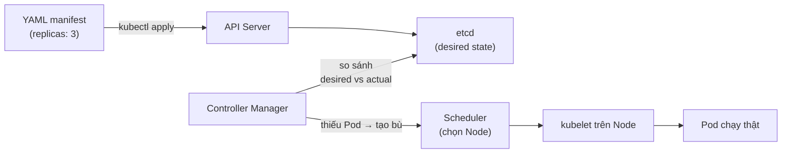

# 🎓 Tổng Quan Về Kubernetes: Giải Pháp Điều Phối Container Trách Nhiệm Cao

> **Tác giả:** Mr.Rom\
> **Phiên bản:** v2.0.3\
> **Tạo lúc:** 26/05/2026\
> **Cập nhật:** 13/06/2026\
> **Level:** Basic\
> **Tags:** [MUST-KNOW]

> 🎯 **Lời dẫn:**
> Chào bạn, bài học nhập môn này sẽ đưa bạn bước chân vào thế giới của **Kubernetes** (thường viết tắt là K8s) — tiêu chuẩn vàng và là "vua" trong lĩnh vực điều phối container hiện đại. Ở các bài học trước, bạn đã biết cách đóng gói app bằng Docker và ghép nối bằng Compose. Nhưng khi hệ thống mở rộng quy mô lên hàng chục server, Compose sẽ bộc lộ giới hạn. Bài học này sẽ giúp bạn hiểu rõ bản chất K8s, phân tích kiến trúc bên trong và tự tay dựng một cluster thử nghiệm tại local!

## 🎯 Sau bài học này, bạn sẽ làm chủ

- [x] Bản chất cốt lõi của **Kubernetes** và hành trình phát triển lịch sử từ nội bộ Google đến tiêu chuẩn ngành 2026.
- [x] Tư duy so sánh sắc bén giữa **Docker Compose** vs **Kubernetes** để lựa chọn đúng công nghệ phù hợp với quy mô dự án.
- [x] Sơ đồ kiến trúc toàn cảnh của một K8s Cluster: Phân biệt vai trò của bộ não điều khiển **Control Plane** và cơ bắp chạy thật **Worker Nodes**.
- [x] Lựa chọn và cài đặt thành công 1 trong 4 môi trường chạy K8s local tiện lợi: Minikube, kind, k3s/k3d, Docker Desktop K8s.
- [x] Sử dụng thành thạo bộ công cụ điều khiển CLI quyền lực **`kubectl`** để kiểm tra, tương tác và gỡ lỗi container.
- [x] Tư duy thiết kế tài nguyên dạng **Declarative** (mô tả trạng thái mong muốn qua YAML manifest) thay vì ra lệnh trực tiếp (Imperative).

---

## Tình Huống: Khi Ứng Dụng Đơn Lẻ Bị Quá Tải Trước Hàng Triệu Lượt Truy Cập Đồng Thời

Hãy tưởng tượng bạn vừa deploy thành công một ứng dụng FastAPI lên một máy chủ VPS đơn lẻ. Ứng dụng chạy mượt mà ở giai đoạn đầu. Nhưng khi chiến dịch marketing của công ty được tung ra, lưu lượng người dùng đột ngột tăng vọt lên gấp 10 lần. Bạn lập tức phải đối mặt với một loạt thảm họa vận hành:

- 😱 **Sự cố phần cứng vật lý:** VPS bị quá tải CPU/RAM dẫn đến crash mạng. Chỉ có 1 instance chạy duy nhất đồng nghĩa với việc toàn bộ hệ thống bị downtime (chết web).
- 😱 **Khó khăn khi Scale ngang:** Bạn muốn nhân bản ứng dụng lên thành 5 bản sao trên nhiều máy chủ khác nhau để chia sẻ tải, nhưng việc cấu hình thủ công Nginx load balancer và đồng bộ hóa code trên 5 máy chủ bằng tay cực kỳ phức tạp và dễ sai sót.
- 😱 **Downtime khi deploy phiên bản mới:** Mỗi lần bạn cập nhật tính năng mới cho app, bạn phải thủ công gõ lệnh SSH vào server, pull code, tắt app cũ và bật app mới lên — quá trình này gây ra khoảng 5-10 phút downtime khó chịu cho khách hàng.
- 😱 **Độ phức tạp khi giám sát:** Database, Redis cache, Frontend, Backend — 4 thành phần chạy rời rạc. Khi một dịch vụ gặp sự cố, bạn phải SSH vào từng máy chủ để lục tìm log gỡ lỗi.

Bạn bắt đầu tìm kiếm giải pháp điều phối tự động (Container Orchestration) và tất cả các bài viết công nghệ hàng đầu đều trỏ về một cái tên: **Kubernetes (K8s)**. Người ta ca ngợi nó như một "hệ điều hành" tối cao cho các cụm máy chủ, có khả năng tự động Scale, tự động phục hồi lỗi (Self-heal) và cập nhật không downtime (Rolling update).

Nhưng đối với người mới bắt đầu, K8s giống như một "ngọn núi cao vút" với hàng tá thuật ngữ phức tạp: Pod, Deployment, Service, Kubelet... Bài học tổng quan này sẽ đồng hành cùng bạn đi từ những khái niệm trực quan nhất để chinh phục ngọn núi này một cách dễ dàng!

---

## 1️⃣ Bản Chất Của Kubernetes: Hệ Điều Hành Cho Cluster Hay Cỗ Máy Tự Động Hóa?

**Kubernetes** (phát âm là *koo-ber-net-ees*, có nguồn gốc từ tiếng Hy Lạp mang nghĩa là "người lái tàu" hoặc "phi công") là một nền tảng mã nguồn mở mạnh mẽ chuyên dùng để tự động hóa việc triển khai, scale và quản lý các ứng dụng được đóng gói dưới dạng container trên một **cụm máy chủ (cluster)**.

- **Năm 2014:** Google chính thức mã nguồn mở dự án Kubernetes (được phát triển dựa trên dự án nội bộ tên là Borg đã vận hành hàng tỷ container của hãng suốt một thập kỷ).
- **Năm 2015:** Google trao tặng dự án này cho tổ chức phi lợi nhuận **CNCF** (Cloud Native Computing Foundation) quản lý.
- **Năm 2026:** K8s chính thức trở thành **de-facto standard (tiêu chuẩn bắt buộc)** của ngành điện toán đám mây. Mọi nhà cung cấp đám mây lớn (AWS, GCP, Azure, DigitalOcean) đều cung cấp dịch vụ Managed Kubernetes riêng biệt.

> [!NOTE]
> **Ẩn dụ sư phạm:**
> - **Chạy trên 1 server đơn lẻ:** Hệ điều hành máy chủ (như Linux) đóng vai trò trực tiếp quản lý các tiến trình (processes) cục bộ của máy tính đó.
> - **Chạy trên N servers (Cluster):** Kubernetes đóng vai trò như một "hệ điều hành ảo" bao trùm toàn bộ cluster, tự đưa ra quyết định: "Pod này chạy trên node nào, tự động khởi động lại khi crash, tự scale lên nhiều bản sao khi tải CPU cao".

---

### Những gì Kubernetes KHÔNG PHẢI (Tránh hiểu lầm)

Rất nhiều bạn mới học thường có những kỳ vọng quá đà hoặc nhầm lẫn về phạm vi của K8s. K8s được thiết kế cực kỳ tập trung vào nhiệm vụ điều phối container. Những tác vụ phụ trợ khác đều cần có các công cụ chuyên biệt bổ sung:

- ❌ K8s **không phải** là công cụ giám sát (monitoring): Bạn vẫn cần cài đặt thêm Prometheus và Grafana để xem biểu đồ tài nguyên.
- ❌ K8s **không phải** là hệ thống CI/CD: Bạn vẫn cần GitHub Actions hoặc ArgoCD để tự động hóa việc đưa code lên cluster.
- ❌ K8s **không phải** là một cơ sở dữ liệu: Mặc dù bạn có thể chạy Database trong K8s, nhưng tốt nhất trên production lớn vẫn nên ưu tiên sử dụng dịch vụ DB quản lý sẵn của các nhà cung cấp đám mây để đảm bảo an toàn dữ liệu.
- ❌ K8s **không bao giờ dễ hơn Docker Compose** — Nó phức tạp hơn gấp nhiều lần!

---

### Những gì Kubernetes làm CỰC KỲ XUẤT SẮC

Dưới đây là 8 năng lực cốt lõi giúp K8s trở thành bá chủ trong việc vận hành hệ thống lớn:

- ✅ **Tự động xếp lịch (Scheduling):** Quyết định thông minh container nào nên chạy ở máy chủ nào dựa trên dung lượng phần cứng còn trống.
- ✅ **Tự động co giãn (Auto-scaling):** Tự tăng số lượng container lên khi CPU quá tải và tự giảm xuống khi đêm khuya vắng người để tiết kiệm tiền.
- ✅ **Tự phục hồi (Self-healing):** Khi một container bị lỗi chết đột ngột, K8s lập tức tiêu hủy nó và khởi tạo một container mới thay thế chỉ trong vòng 1 giây.
- ✅ **Cập nhật không downtime (Rolling Update):** Thay thế từng container phiên bản cũ bằng phiên bản mới một cách cuốn chiếu, đảm bảo khách hàng không hề nhận ra hệ thống đang được nâng cấp.
- ✅ **Tự khám phá dịch vụ (Service Discovery & DNS):** Cấp phát địa chỉ IP ảo và tên miền DNS nội bộ tự động để các container giao tiếp ổn định với nhau.
- ✅ **Quản lý cấu hình và bí mật (Config & Secrets):** Phân tách hoàn toàn các thông tin cấu hình và mật khẩu bảo mật ra khỏi mã nguồn ứng dụng.

---

## 2️⃣ Docker Compose Đối Đầu Kubernetes: Cuộc Đọ Sức Giữa Đơn Giản Và Quy Mô Khổng Lồ

Để chọn đúng công cụ, bạn cần hiểu rõ ranh giới của Docker Compose và Kubernetes qua bảng so sánh toàn diện dưới đây:

| Tiêu chí | Docker Compose | Kubernetes (K8s) |
| :--- | :--- | :--- |
| **Số lượng máy chủ (Hosts)** | **Duy nhất 1 máy host** | Cụm nhiều máy host (hàng chục đến hàng ngàn server) |
| **Tự động co giãn (Auto-scale)** | ❌ Không hỗ trợ | ✅ Tự động scale dựa trên CPU/RAM thực tế |
| **Tự phục hồi (Self-healing)** | Hạn chế (chỉ restart qua cờ `restart: always`) | ✅ Tự động phát hiện lỗi và di chuyển pod sang node khỏe mạnh |
| **Cập nhật không downtime** | ❌ Phải tắt đi bật lại gây downtime ngắn | ✅ Rolling update cuốn chiếu mượt mà |
| **Độ khó khi học tập** | Chỉ cần 1 ngày để thành thạo | **Mất từ 1 đến 3 tháng học tập và thực hành liên tục** |
| **Chi phí hạ tầng tối thiểu** | $0 setup (Chạy mượt trên 1 VPS giá rẻ $5) | $$$ Tốn phí cho máy chủ master quản trị và quản lý mạng ảo |
| **Môi trường phù hợp nhất** | Phát triển ở local, chạy demo, dự án nhỏ | Hệ thống microservices lớn của doanh nghiệp |

> [!TIP]
> **Bí quyết thực chiến:**
> Đừng bao giờ vội vã đưa Kubernetes vào dự án quá sớm. Đối với 99% các dự án Startup trong năm đầu tiên, Docker Compose kết hợp với 1 máy chủ VPS duy nhất và Nginx là quá đủ để phục vụ hàng ngàn người dùng với chi phí tối thiểu. Hãy chỉ cân nhắc Kubernetes khi hệ thống của bạn xuất hiện 3 tín hiệu: đội ngũ lập trình viên trên 5 người, số lượng microservices lớn hơn 5, và cần chạy đa vùng (multi-region) để đảm bảo High Availability.

---

## 3️⃣ Giải Mã Kiến Trúc Cluster: Bộ Não Control Plane Và Cơ Bắp Worker Nodes

Một cụm máy chủ Kubernetes (Cluster) được tổ chức cực kỳ khoa học, chia thành hai phân vùng rõ rệt: Bộ chỉ huy trung tâm (**Control Plane**) và Đội ngũ thực thi vật lý (**Worker Nodes**).

```text
                  ┌──────────────────────────────────────────┐
                  │       BỘ CHỈ HUY (CONTROL PLANE)         │
                  │  ┌────────────────┐  ┌────────────────┐  │
                  │  │   API Server   │  │   etcd Store   │  │
                  │  │ (Cổng tiếp nhận)│  │ (Lưu trạng thái)│  │
                  │  └────────┬───────┘  └────────────────┘  │
                  │           │                              │
                  │  ┌────────┴───────┐  ┌────────────────┐  │
                  │  │   Scheduler    │  │   Controller   │  │
                  │  │  (Xếp lịch)    │  │   Manager      │  │
                  │  └────────────────┘  └────────────────┘  │
                  └───────────────────┬──────────────────────┘
                                      │
              ┌───────────────────────┼───────────────────────┐
              ▼                       ▼                       ▼
      ┌──────────────┐        ┌──────────────┐        ┌──────────────┐
      │ WORKER NODE 1│        │ WORKER NODE 2│        │ WORKER NODE 3│
      │ ┌──────────┐ │        │ ┌──────────┐ │        │ ┌──────────┐ │
      │ │ kubelet  │ │        │ │ kubelet  │ │        │ │ kubelet  │ │
      │ └──────────┘ │        │ └──────────┘ │        │ └──────────┘ │
      │ ┌──────────┐ │        │ ┌──────────┐ │        │ ┌──────────┐ │
      │ │kube-proxy│ │        │ │kube-proxy│ │        │ │kube-proxy│ │
      │ └──────────┘ │        │ └──────────┘ │        │ └──────────┘ │
      │ ┌──────────┐ │        │ ┌──────────┐ │        │ ┌──────────┐ │
      │ │container │ │        │ │container │ │        │ │container │ │
      │ │ runtime  │ │        │ │ runtime  │ │        │ │ runtime  │ │
      │ └──────────┘ │        │ └──────────┘ │        │ └──────────┘ │
      │   [Các Pod]  │        │   [Các Pod]  │        │   [Các Pod]  │
      └──────────────┘        └──────────────┘        └──────────────┘
```

### 🧠 Phân khu bộ não: Control Plane (Master Node)

Control Plane là cơ quan đầu não đưa ra các quyết định quan trọng của cluster. Nó bao gồm 5 thành phần cốt lõi:

1. **API Server (`kube-apiserver`):** Cổng giao tiếp duy nhất của K8s Cluster. Mọi câu lệnh từ bạn (qua `kubectl`) hoặc các thành phần khác đều phải đi qua đây dưới dạng chuẩn REST API.
2. **etcd:** Cơ sở dữ liệu dạng Key-Value cực kỳ an toàn và ổn định. Nó lưu trữ toàn bộ trạng thái cấu hình và thông số hoạt động của cluster. etcd là "nguồn dữ liệu chân lý duy nhất" (Single Source of Truth).
3. **Scheduler (`kube-scheduler`):** Người thợ xếp lịch thông minh. Nó liên tục kiểm tra xem có Pod nào mới được tạo ra mà chưa có máy chủ để chạy không, sau đó dựa vào RAM/CPU trống để chọn ra Node tốt nhất để đặt Pod đó vào.
4. **Controller Manager (`kube-controller-manager`):** Người giám sát trạng thái mong muốn. Nó liên tục chạy các vòng lặp kiểm tra: "Nếu mong muốn có 3 container chạy, nhưng thực tế chỉ có 2 container hoạt động vì 1 cái bị chết, Controller lập tức ra lệnh cho Scheduler tạo mới 1 container bổ sung".
5. **Cloud Controller Manager:** Tương tác trực tiếp với các nhà cung cấp đám mây (AWS, GCP, Azure) để tự động tạo ổ đĩa cứng (Persistent Volume) hoặc bộ cân bằng tải (Load Balancer) vật lý.

---

### 💪 Phân khu cơ bắp: Worker Nodes (Máy chủ chạy ứng dụng)

Worker Node là các máy chủ vật lý hoặc máy ảo thực tế chịu trách nhiệm chạy các container ứng dụng của bạn. Mỗi Node bắt buộc phải có 3 thành phần:

1. **kubelet:** Người đại diện trung thành của Control Plane trên mỗi Node. Nó lắng nghe các mệnh lệnh từ API Server gửi xuống và trực tiếp giám sát, ra lệnh cho công cụ Container Runtime chạy đúng số lượng Pod được chỉ định.
2. **kube-proxy:** Người gác cổng mạng. Nó quản lý toàn bộ các quy tắc định tuyến mạng ảo nội bộ, giúp các container có thể nói chuyện được với nhau và cho phép thế giới bên ngoài kết nối vào app.
3. **Container Runtime:** Động cơ chạy container thực tế (tiêu chuẩn hiện tại là `containerd` hoặc `CRI-O`, thay thế cho Docker engine truyền thống).

---

## 4️⃣ Lựa Chọn Sân Chơi Thử Nghiệm: 4 Phương Pháp Cài Đặt Kubernetes Tại Local

Để học tập K8s mà không mất tiền mua máy chủ đám mây, bạn có thể tự khởi tạo các cluster mini siêu gọn ngay trên máy laptop cá nhân của mình bằng 4 công cụ sau:

### Cách 1: kind (Kubernetes IN Docker) — Khuyên dùng Cho Học Tập & CI/CD
`kind` hoạt động bằng cách biến các container Docker thành các node K8s giả lập. Cực kỳ nhanh, nhẹ và hỗ trợ kiểm thử cụm nhiều node (multi-node) hoàn hảo.

```bash
# Cài đặt kind trên macOS bằng Homebrew
brew install kind

# Tạo một cluster mang tên "my-sandbox"
kind create cluster --name my-sandbox

# Kiểm tra xem các node đã sẵn sàng hoạt động chưa
kubectl get nodes
```

---

### Cách 2: minikube — Lựa chọn kinh điển truyền thống
Công cụ lâu đời nhất, thường khởi chạy K8s bên trong một máy ảo (Virtual Machine) chuyên biệt.

```bash
# Cài đặt minikube
brew install minikube

# Khởi chạy minikube sử dụng driver Docker làm nền tảng
minikube start --driver=docker
```

---

### Cách 3: k3s / k3d — Bản phân phối siêu nhẹ chuẩn bị chạy thật cho thiết bị nhúng
k3s là phiên bản tối giản hóa của K8s do hãng Rancher phát triển, lược bỏ các driver cũ để giảm dung lượng RAM tiêu thụ cực kỳ tiết kiệm (rất phù hợp cho máy tính Raspberry Pi hoặc VPS RAM yếu). `k3d` giúp chạy k3s trực tiếp trong Docker.

```bash
# Cài đặt k3d
brew install k3d

# Khởi tạo cluster gồm 1 master node và 2 worker node ảo
k3d cluster create my-k3d-cluster --servers 1 --agents 2
```

---

## 5️⃣ Làm Chủ kubectl: Bộ Lệnh Quyền Lực Nhất Điều Khiển Mọi Cluster

`kubectl` là công cụ giao diện dòng lệnh (CLI) chính thức để bạn gửi các mệnh lệnh đến API Server của Control Plane. Hãy học thuộc lòng và sử dụng thành thạo bộ lệnh cơ bản sau:

### Nhóm lệnh truy vấn thông tin (Get)
```bash
# Liệt kê toàn bộ các máy chủ node trong cluster kèm theo trạng thái
kubectl get nodes

# Liệt kê toàn bộ các Pod đang chạy trong phân vùng mặc định (Default Namespace)
kubectl get pods

# Liệt kê các Pod ở mọi phân vùng hệ thống (All Namespaces)
kubectl get pods -A

# Hiển thị thêm thông tin chi tiết (địa chỉ IP ảo, node đang chạy) của Pod
kubectl get pods -o wide
```

### Nhóm lệnh kiểm tra chi tiết và gỡ lỗi (Troubleshooting)
```bash
# Hiển thị toàn bộ thông tin chi tiết và lịch sử các sự kiện xảy ra của Pod
kubectl describe pod <tên-pod>

# Xem trực tiếp log ghi nhận của ứng dụng đang chạy trong Pod
kubectl logs <tên-pod>

# Xem log theo thời gian thực (tương tự tail -f)
kubectl logs -f <tên-pod>

# Mở một terminal tương tác trực tiếp bên trong container của Pod
kubectl exec -it <tên-pod> -- bash
```

### Nhóm lệnh ánh xạ và kiểm thử nhanh
```bash
# Ánh xạ cổng dịch vụ trực tiếp từ container ra cổng máy local để test nhanh không cần Ingress
kubectl port-forward pod/<tên-pod> 8080:80
```

---

## 6️⃣ Declarative YAML Đối Đầu Imperative: Triết Lý Mô Tả Trạng Thái Mong Muốn

Khi ra lệnh cho Kubernetes, bạn có thể lựa chọn 2 phương pháp tư duy hoàn toàn trái ngược nhau:

### 1. Tư duy Imperative (Mệnh lệnh trực tiếp - Chỉ làm HOW)
Bạn gõ trực tiếp các lệnh CLI yêu cầu K8s tạo tài nguyên ngay lập tức:

```bash
# Ra lệnh tạo deployment nginx ngay lập tức
kubectl create deployment nginx --image=nginx:latest

# Ra lệnh scale số lượng container lên thành 3
kubectl scale deployment nginx --replicas=3
```

> [!WARNING]
> Phương pháp Imperative chỉ phù hợp để lập trình viên gõ test nhanh ở môi trường dev. Tuyệt đối không dùng trên Production vì cấu hình không hề được lưu trữ lại. Nếu cluster bị sập, bạn sẽ không có cách nào dựng lại được hệ thống y hệt.

---

### 2. Tư duy Declarative (Mô tả trạng thái mong muốn - Chỉ khai báo WHAT)
Đây là triết lý thiết kế cốt lõi của Kubernetes và là **chuẩn mực bắt buộc trên Production**. Bạn viết toàn bộ thiết kế hệ thống vào một tệp tin cấu hình YAML (gọi là manifest), sau đó dùng lệnh `kubectl apply` để gửi lên cho K8s tự động thực hiện:

```yaml
# nginx-deployment.yaml
apiVersion: apps/v1
kind: Deployment
metadata:
  name: web-nginx
spec:
  replicas: 3                         # Trạng thái mong muốn: Luôn luôn duy trì 3 Pod chạy đồng thời
  selector:
    matchLabels:
      app: web-server
  template:
    metadata:
      labels:
        app: web-server
    spec:
      containers:
      - name: nginx-container
        image: nginx:1.25-alpine       # Phiên bản Nginx siêu nhẹ
        ports:
        - containerPort: 80           # Lắng nghe ở cổng 80 trong container
```

```bash
# Yêu cầu Kubernetes áp dụng và duy trì trạng thái mô tả trong file YAML
kubectl apply -f nginx-deployment.yaml
```

**Ưu điểm vượt trội:**
- Toàn bộ thiết kế hệ thống được lưu lại dưới dạng code (Infrastructure as Code - IaC), giúp bạn dễ dàng commit lên Git để quản lý phiên bản, kiểm duyệt code (Code Review) và tự động hóa CI/CD (GitOps).
- Có tính chất **Idempotent (độc lập tác vụ):** Dù bạn có gõ lệnh apply 10 lần thì hệ thống vẫn giữ nguyên 3 Pod khỏe mạnh, không hề gây ra tình trạng tạo trùng lặp.

Đằng sau một lệnh `kubectl apply` đơn giản là cả một vòng lặp cân bằng (Reconciliation Loop) chạy liên tục — chuỗi phối hợp giữa các thành phần Control Plane và Worker Node diễn ra như sau:



→ Chính vòng lặp này tạo nên tính Idempotent và khả năng tự phục hồi: bạn chỉ khai báo trạng thái mong muốn, K8s tự so sánh và điều chỉnh thực tế 24/7.

---

## 7️⃣ Managed Kubernetes Trên Production: Cân Nhắc Chi Phí Vận Hành Và Hiệu Năng Thực Tế

Việc tự cài đặt và bảo trì một cụm Kubernetes thủ công từ con số 0 (Self-hosted Kubernetes) trên hệ thống máy chủ vật lý của riêng bạn là một "cơn ác mộng" thực sự đối với đội ngũ DevOps (phải tự lo cấu hình bảo mật Control Plane, cấu hình mạng SDN, sao lưu etcd định kỳ, cập nhật phiên bản...).

Do đó, trên môi trường Production thực tế, hầu hết các doanh nghiệp đều ưu tiên sử dụng dịch vụ **Managed Kubernetes (Hạ tầng K8s được nhà cung cấp đám mây quản lý sẵn bộ não Control Plane)**:

- **Google Kubernetes Engine (GKE):** Dịch vụ K8s đỉnh cao nhất hiện nay, do chính các kỹ sư Google (cha đẻ của K8s) thiết kế và vận hành. Tích hợp các tính năng tự động scale và gỡ lỗi cực kỳ thông minh.
- **Amazon Elastic Kubernetes Service (EKS):** Phổ biến nhất trong môi trường doanh nghiệp lớn nhờ khả năng tích hợp bảo mật IAM cực kỳ chặt chẽ của hệ sinh thái AWS.
- **DigitalOcean Kubernetes (DOKS):** Lựa chọn thân thiện, giao diện trực quan và có mức chi phí cực kỳ tiết kiệm cho các startup vừa và nhỏ.

---

## 8️⃣ Tấm Bản Đồ 4 Tuần Chinh Phục Kubernetes Từ Con Số 0

Kubernetes là một hệ sinh thái khổng lồ. Để không bị "ngộp" kiến thức, mình đề xuất lộ trình học tập khoa học chia làm 4 tuần như sau:

```text
Tuần 1: Nền tảng cốt lõi (Basics)
  ├── Cài đặt kind / k3d chạy thử nghiệm local
  ├── Nắm chắc 3 khối tài nguyên cơ bản: Pod, Deployment, Service
  └── Làm chủ 15 câu lệnh kubectl thiết yếu hàng ngày

Tuần 2: Ứng dụng thực tế (Application Integration)
  ├── Quản lý cấu hình động bằng ConfigMap và Secrets
  ├── Phân chia phân vùng bảo mật bằng Namespaces và phân quyền RBAC
  └── Deploy thử hệ thống Web đa dịch vụ: FastAPI kết nối PostgreSQL
  
Tuần 3: Tiêu chuẩn Production (Enterprise Readiness)
  ├── Thiết lập kiểm tra sức khỏe container (Liveness / Readiness Probes)
  ├── Giới hạn RAM/CPU (Resource Requests / Limits) để tránh tranh chấp
  └── Cấu hình Ingress Controller định tuyến HTTPS tự động

Tuần 4: Vận hành nâng cao (Day 2 Operations)
  ├── Thiết lập hệ thống giám sát Prometheus và Grafana
  ├── Tự động hóa quá trình Deploy ứng dụng bằng công cụ GitOps ArgoCD
  └── Chuẩn bị ôn thi lấy chứng chỉ CKAD (Certified Kubernetes Developer)
```

---

## 9️⃣ Thực Hành Thực Chiến: Tự Tay Deploy Ứng Dụng FastAPI Đầu Tiên Lên kind

Để tổng kết toàn bộ kiến thức của bài học nhập môn này, chúng ta sẽ cùng thực hiện một dự án nhỏ: Khởi tạo một cluster `kind` cục bộ và tự tay deploy một ứng dụng FastAPI có tính năng nhân bản 3 Pod khỏe mạnh kết hợp Service định tuyến.

### Bước 1: Chuẩn bị tệp tin manifest cấu hình ứng dụng `app-fastapi.yaml`

Bạn hãy tạo một tệp tin mang tên `app-fastapi.yaml` với nội dung khai báo trạng thái mong muốn gồm 1 Deployment (chạy 3 Pod FastAPI) và 1 Service (đóng vai trò là đầu mối phân phối truy cập):

```yaml
# app-fastapi.yaml
apiVersion: apps/v1
kind: Deployment
metadata:
  name: fastapi-deployment            # Tên của Deployment quản lý Pod
  labels:
    app: api-server
spec:
  replicas: 3                         # Yêu cầu luôn duy trì 3 Pod chạy đồng thời để chia tải
  selector:
    matchLabels:
      app: api-server
  template:
    metadata:
      labels:
        app: api-server
    spec:
      containers:
      - name: fastapi-container
        # Sử dụng image FastAPI đã được đóng gói sẵn
        image: bitnami/fastapi:latest
        ports:
        - containerPort: 8000         # FastAPI mặc định chạy ở cổng 8000
        resources:
          limits:
            cpu: "500m"               # Giới hạn tối đa dùng 0.5 Core CPU
            memory: "256Mi"           # Giới hạn tối đa dùng 256 MB RAM
          requests:
            cpu: "100m"               # Yêu cầu tối thiểu để khởi chạy là 0.1 Core CPU
            memory: "128Mi"           # Yêu cầu tối thiểu 128 MB RAM

---
apiVersion: v1
kind: Service
metadata:
  name: fastapi-service               # Tên dịch vụ định tuyến đầu mối
spec:
  selector:
    app: api-server                   # Tìm và liên kết với các Pod có nhãn app: api-server
  ports:
  - protocol: TCP
    port: 80                          # Cổng public bên ngoài của Service
    targetPort: 8000                  # Cổng thực tế của container FastAPI nhận kết nối
  type: ClusterIP                     # Chỉ giao tiếp nội bộ an toàn bên trong Cluster
```

---

### Bước 2: Kích hoạt cluster và deploy tài nguyên

Bạn hãy gõ tuần tự các lệnh sau trên terminal của mình để thực thi:

```bash
# 1. Khởi tạo một K8s cluster mới bằng công cụ kind
kind create cluster --name fastapi-lab

# 2. Gửi tệp manifest cấu hình YAML lên cho Kubernetes tự động triển khai
kubectl apply -f app-fastapi.yaml

# 3. Theo dõi tiến trình khởi tạo và trạng thái của các Pod
kubectl get pods -w
```

Màn hình terminal sẽ hiển thị tiến trình khởi tạo 3 Pod song song:

```text
NAME                                  READY   STATUS              RESTARTS   AGE
fastapi-deployment-55b5d8f6d-4bbdd    0/1     ContainerCreating   0          5s
fastapi-deployment-55b5d8f6d-7xxbb    0/1     ContainerCreating   0          5s
fastapi-deployment-55b5d8f6d-8zzcc    0/1     ContainerCreating   0          5s
```

Chờ khoảng 10-15 giây để Docker tải image và khởi chạy thành công:

```text
NAME                                  READY   STATUS    RESTARTS   AGE
fastapi-deployment-55b5d8f6d-4bbdd    1/1     Running   0          20s
fastapi-deployment-55b5d8f6d-7xxbb    1/1     Running   0          20s
fastapi-deployment-55b5d8f6d-8zzcc    1/1     Running   0          20s
```

---

### Bước 3: Ánh xạ cổng dịch vụ và kiểm thử kết nối

Để kiểm tra xem hệ thống phân phối tải Service có hoạt động trơn tru không, bạn hãy thực hiện lệnh ánh xạ cổng (port-forward) trực tiếp từ máy host vào Service:

```bash
# Ánh xạ cổng 8080 của máy local vào cổng 80 của Service
kubectl port-forward svc/fastapi-service 8080:80
```

Bây giờ, bạn hãy mở một cửa sổ terminal mới (hoặc mở trình duyệt) và gửi yêu cầu HTTP truy cập thử:

```bash
curl http://localhost:8080
# Output: {"message": "Welcome to FastAPI"}
```

✅ Hệ thống đã chạy cực kỳ ổn định và an toàn! Để dọn dẹp sạch sẽ toàn bộ môi trường ảo vừa tạo để tránh tốn RAM máy tính của bạn, hãy chạy lệnh xóa cluster sau:

```bash
# Xóa bỏ cluster ảo hoàn toàn
kind delete cluster --name fastapi-lab
```

---

## ⚠️ 5 Cạm Bẫy Chết Người Dễ Gây Tổn Thất Khi Mới Học Kubernetes

1. **Vội vã đưa Kubernetes vào dự án quá sớm:** Đối với các dự án siêu nhỏ chỉ có 1-2 dịch vụ, việc vận hành K8s sẽ tiêu tốn của bạn nhiều thời gian cấu hình hơn là tập trung code tính năng chính.
2. **Cố gắng tự cài đặt Control Plane (Master Node) trên Production:** Việc quản trị bảo mật và sao lưu `etcd` cực kỳ phức tạp. Hãy luôn luôn sử dụng các dịch vụ Managed K8s (EKS, GKE, AKS) để giao nhiệm vụ bảo vệ "bộ não" cho các hãng đám mây lo.
3. **Quên kiểm tra Context đang hoạt động:** Lỗi cực kỳ tai hại khi bạn gõ nhầm lệnh xóa Pod hoặc deploy nhầm tệp cấu hình thử nghiệm từ máy local lên thẳng cụm máy chủ Production thật do quên kiểm tra context hiện tại. Hãy luôn dùng công cụ hỗ trợ hiển thị context an toàn như `kubectx` hoặc `k9s`.
4. **Chạy Database (Stateful Workload) trong K8s khi chưa đủ kinh nghiệm:** Dữ liệu có thể bị xóa mất hoàn toàn nếu bạn cấu hình sai Persistent Volume. Lời khuyên cho bạn là hãy để Database chạy ở các dịch vụ Cloud DB quản lý sẵn độc lập bên ngoài.
5. **Sử dụng lệnh Imperative trực tiếp trên môi trường Production:** Việc gõ các lệnh `kubectl edit` hay `kubectl scale` trực tiếp trên server sẽ làm cấu hình thực tế bị lệch hoàn toàn (Drift) so với file code lưu trữ trên Git, gây khó khăn cho việc phục hồi hệ thống khi có sự cố.

---

## 🧠 Tự kiểm tra (Self-check)

Bạn hãy cố gắng suy ngẫm và trả lời nhanh 5 câu hỏi cốt lõi sau để kiểm tra mức độ nắm bắt bài học:
1. Docker Compose khác biệt cốt lõi nhất với Kubernetes ở điểm nào?
2. Thành phần nào trong Control Plane đóng vai trò lưu trữ trạng thái cấu hình của toàn bộ cluster?
3. Tại sao triết lý Declarative (YAML Manifest) lại là chuẩn mực vận hành bắt buộc trên Production?
4. kubelet trên Worker Node làm nhiệm vụ gì?
5. Sự khác biệt giữa `kind` và `minikube` khi chạy thử nghiệm K8s ở local là gì?

<details>
<summary><b>💡 Bấm để xem gợi ý đáp án</b></summary>

1. **Khác biệt cốt lõi:** Docker Compose chỉ quản lý container trên duy nhất **1 máy host vật lý**, không hỗ trợ auto-scale tự động. Trong khi Kubernetes quản lý cả một **cụm nhiều máy host (Cluster)**, tự động điều phối, phục hồi lỗi và tự động co giãn.
2. **Lưu trữ trạng thái:** Thành phần **`etcd`** (cơ sở dữ liệu key-value) là nơi lưu trữ toàn bộ trạng thái mong muốn của cluster.
3. **Lý do Declarative là chuẩn mực:** Giúp toàn bộ cấu trúc hạ tầng được chuyển hóa thành code (IaC), dễ dàng theo dõi lịch sử qua Git, cho phép rollback nhanh chóng khi lỗi và tự động hóa quy trình deploy (GitOps).
4. **Nhiệm vụ của kubelet:** Đóng vai trò là "đại sứ đại diện" của Control Plane tại mỗi Worker Node, trực tiếp giám sát và ra lệnh cho Container Runtime khởi tạo hoặc tiêu hủy các Pod theo mệnh lệnh từ Master gửi xuống.
5. **kind vs minikube:** `kind` giả lập các node K8s bằng chính các container Docker nên khởi động cực kỳ nhanh (~15 giây) và rất nhẹ RAM. `minikube` sử dụng máy ảo (VM) riêng biệt nên khởi động chậm hơn và tốn tài nguyên phần cứng của laptop hơn.

</details>

---

## ⚡ Tra cứu nhanh (Cheatsheet)

### Khởi tạo môi trường ảo nhanh với `kind`
```bash
brew install kubectl kind k9s          # Cài đặt bộ 3 công cụ thần thánh
kind create cluster --name sandbox    # Tạo cluster sandbox nhanh
```

### Các câu lệnh `kubectl` cực kỳ thông dụng
```bash
kubectl get nodes                      # Kiểm tra danh sách node máy chủ
kubectl get pods                       # Xem danh sách Pod ở namespace mặc định
kubectl get pods -A                    # Xem toàn bộ Pod trong hệ thống
kubectl describe pod <tên-pod>         # Xem chi tiết cấu hình và log sự kiện lỗi của Pod
kubectl logs -f <tên-pod>              # Xem log chạy thực tế của ứng dụng
kubectl exec -it <tên-pod> -- sh       # Truy cập trực tiếp vào shell của Pod
kubectl apply -f manifest.yaml         # Áp dụng cấu hình file YAML
kubectl delete -f manifest.yaml        # Tiêu hủy tài nguyên khai báo trong file YAML
```

---

## 📚 Từ Điển Thuật Ngữ (Glossary)

- **Control Plane:** Bộ phận điều khiển chỉ huy trung tâm của Kubernetes Cluster, chịu trách nhiệm ra quyết định xếp lịch và giám sát trạng thái hệ thống.
- **Worker Node:** Các máy chủ vật lý hoặc máy ảo chịu trách nhiệm trực tiếp chạy các container ứng dụng.
- **Pod:** Đơn vị ảo nhỏ nhất của Kubernetes. Một Pod có thể chứa một hoặc một nhóm container dùng chung không gian mạng và phân vùng lưu trữ.
- **Reconciliation Loop (Vòng lặp cân bằng):** Cơ chế tự động chạy liên tục của K8s để so sánh trạng thái thực tế (Actual State) với trạng thái mong muốn (Desired State) nhằm đưa ra hành động điều chỉnh kịp thời.
- **Declarative (Khai báo):** Phương pháp lập trình yêu cầu lập trình viên mô tả trạng thái cuối cùng hệ thống cần đạt được (WHAT), để công cụ tự tính toán cách thực hiện.

---

## 🔗 Liên Kết & Tài Nguyên Học Tập Bổ Sung

### Các bài học liên quan trực tiếp
- [➡️ Bài học tiếp theo: Khởi tạo Pods và Deployments chuyên sâu](./01_pods-and-deployments.md)
- [🐳 Nền tảng bổ trợ: Cẩm nang làm chủ Docker từ cơ bản cho nhà phát triển](../../../docker/)

### Tài liệu chính hãng tham khảo thêm
- [Trang tài liệu hướng dẫn chính thức cực kỳ đầy đủ của Kubernetes](https://kubernetes.io/docs/)
- [Kelsey Hightower — Kubernetes the Hard Way (Học K8s bằng cách tự cài đặt thủ công từng component)](https://github.com/kelseyhightower/kubernetes-the-hard-way)
- [ k9s — Trình quản lý giao diện Terminal (TUI) cho Kubernetes đỉnh cao nhất](https://k9scli.io/)

---

## 📌 Lịch Sử Thay Đổi (Changelog)

- **v2.0.0 (26/05/2026)** — Nâng cấp toàn diện nội dung:
  - Chuẩn hóa khối metadata và tiêu đề.
  - Chuyển các tiêu đề H2 sang dạng câu hỏi gợi mở.
  - Chuẩn hóa các khối lưu ý sang định dạng GitHub Alerts.
  - Việt hóa các dòng ghi chú bên trong khối code YAML và Bash.
  - Bổ sung phần thực hành: khởi tạo cụm `kind` cục bộ và deploy ứng dụng FastAPI có giới hạn tài nguyên.
  - Sửa đường dẫn chéo trỏ chính xác về lộ trình DevOps Career Roadmap.
- **v1.1.0 (25/05/2026)** — Bổ sung lời dẫn trước các phần sơ đồ kiến trúc.
- **v1.0.0 (23/05/2026)** — Khởi tạo bản giới thiệu K8s.
- **v2.0.1 (10/06/2026)** — Chuyển metadata YAML frontmatter → block-quote chuẩn (field tiếng Việt); gỡ tên tác giả khỏi thân bài; bỏ dấu ":" cuối heading.
- **v2.0.2 (11/06/2026)** — Bổ sung sơ đồ vòng lặp reconciliation (kubectl apply → etcd → Controller → Scheduler → kubelet → Pod) cho trực quan.
- **v2.0.3 (13/06/2026)** — Sửa lỗi: managed K8s "GKS" (không tồn tại) → "AKS" (Azure).
