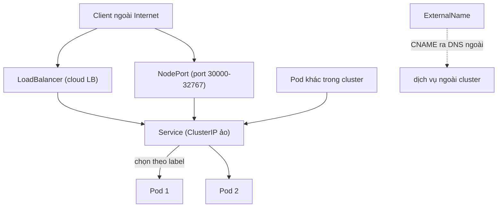

# 🎓 Services Và Ingress: Định Tuyến Mạng Và Cổng Vào An Toàn Cho Hệ Thống Kubernetes

> **Tác giả:** Mr.Rom\
> **Phiên bản:** v2.0.2\
> **Tạo lúc:** 26/05/2026\
> **Cập nhật:** 10/06/2026\
> **Level:** Basic\
> **Tags:** [MUST-KNOW]\
> **Yêu cầu trước:** [Khởi tạo Pods và Deployments chuyên sâu](./01_pods-and-deployments.md)

> 🎯 **Lời dẫn:**
> Chào bạn, khi bạn đã chạy thành công các bản sao container của mình bằng Deployment, một thử thách to lớn khác lập tức xuất hiện: Làm sao để các container tìm thấy nhau khi địa chỉ IP của chúng liên tục thay đổi sau mỗi lần restart? Và làm thế nào để expose (mở cổng) đưa ứng dụng của bạn ra ngoài Internet một cách an toàn, bảo mật HTTPS mà không tốn quá nhiều chi phí thuê Load Balancer? Bài học thực chiến này sẽ đồng hành cùng bạn làm chủ trọn vẹn hạ tầng mạng của Kubernetes thông qua bộ đôi công cụ đắc lực: **Service** và **Ingress**!

## 🎯 Sau bài học này, bạn sẽ làm chủ

- [x] Bản chất của địa chỉ IP tạm thời (**Pod IP ephemeral**) và lý do vì sao hệ thống bắt buộc phải cần tới K8s Service.
- [x] Phân biệt rõ rệt và sử dụng đúng lúc **4 loại hình Service**: ClusterIP, NodePort, LoadBalancer, ExternalName.
- [x] Cơ chế hoạt động của máy chủ DNS nội bộ **CoreDNS** giúp tự động tìm thấy nhau qua tên dịch vụ.
- [x] Thiết lập bộ định tuyến **Ingress** (Layer 7 HTTP Routing) để gom toàn bộ các API/Frontend về chạy chung dưới một Load Balancer duy nhất.
- [x] Cài đặt và tự động hóa cấp phát chứng chỉ bảo mật SSL/TLS với **cert-manager** và Let's Encrypt.
- [x] Tư duy thiết lập tường lửa an toàn nội bộ giữa các Pod bằng **NetworkPolicy**.
- [x] Cẩm nang các lệnh `kubectl` thực tế để kiểm tra và gỡ lỗi mạng nhanh chóng.

---

## Tình Huống: Bài Toán Địa Chỉ IP Ephemeral Và Thử Thách Định Tuyến Đa Container

Tiếp nối dự án ở bài học trước, bạn đã deploy thành công ứng dụng FastAPI với 3 bản sao Pod chạy song song. Khi kiểm tra địa chỉ IP nội bộ của các Pod này:

```text
fastapi-deployment-7f9c-abc   IP ảo: 10.244.0.5
fastapi-deployment-7f9c-def   IP ảo: 10.244.0.6
fastapi-deployment-7f9c-ghi   IP ảo: 10.244.0.7
```

Bạn đứng từ một Pod khác và thực hiện lệnh gọi kết nối trực tiếp đến IP của Pod 1:

```bash
# Thử kết nối trực tiếp tới IP ảo của Pod 1
kubectl exec -it some-test-pod -- curl 10.244.0.5:8000
# Output: {"message": "Kết nối thành công!"}
```

Mạng ảo hoạt động rất tốt. Nhưng khi bạn bắt đầu suy nghĩ sâu hơn về quá trình vận hành lâu dài, bạn phát hiện ra 3 bài toán cực kỳ đau đầu:

- 😱 **Địa chỉ IP thay đổi liên tục (Ephemeral IP):** Nếu Pod 1 bị chết và khởi tạo lại, nó sẽ nhận một địa chỉ IP ảo hoàn toàn mới (ví dụ `10.244.0.99`). Các dịch vụ Frontend đang trỏ vào IP cũ sẽ lập tức bị mất kết nối!
- 😱 **Khó khăn trong phân chia tải (Load Balancing):** Làm thế nào để Frontend gửi yêu cầu chia đều cho cả 3 Pod mà không cần phải tự viết code thuật toán chia tải phức tạp?
- 😱 **Rào cản từ ngoài Internet:** Địa chỉ IP `10.244.x.x` là mạng ảo nội bộ của K8s. Thế giới bên ngoài Internet hoàn toàn không thể nhìn thấy và không thể truy cập vào được ứng dụng của bạn.

Bạn ngơ ngác: *"Tại sao Kubernetes lại không cung cấp sẵn một đầu mối kết nối tĩnh cố định đứng ra làm đại diện cho cả nhóm Pod?"*

Đàn anh DevOps điềm đạm trả lời:

> [!NOTE]
> *"Đó chính là lúc chúng ta cần tới **Service**. Service sẽ tạo ra một địa chỉ IP ảo tĩnh cố định vĩnh viễn suốt vòng đời để làm đại diện. Và để đưa hệ thống ra ngoài Internet một cách chuyên nghiệp, tiết kiệm chi phí nhất, chúng ta sẽ cho toàn bộ traffic đi qua cổng gác **Ingress** kết hợp với **cert-manager** để tự động cấu hình bảo mật HTTPS hoàn toàn miễn phí!"*

Bài học này sẽ dắt tay bạn từng bước giải quyết trọn vẹn bài toán đó!

---

## 1️⃣ Bản Chất Của K8s Service: Cây Cầu Định Tuyến Ổn Định Và Cân Bằng Tải Nội Bộ

Trong Kubernetes, **Service** là một khối tài nguyên trừu tượng đóng vai trò là **đầu mối kết nối tĩnh, cố định và duy nhất** đại diện cho một nhóm các Pod đang chạy. Service sử dụng bộ lọc Selector để tự động tìm kiếm và định tuyến lưu lượng truy cập đến các Pod có nhãn (label) tương ứng.

```yaml
# service-fastapi.yaml
apiVersion: v1
kind: Service
metadata:
  name: fastapi-service               # Tên miền nội bộ cố định của Service
spec:
  selector:
    app: fastapi-pod                 # Tự động gom toàn bộ các Pod có nhãn này vào Service
  ports:
  - protocol: TCP
    port: 80                          # Cổng lắng nghe ảo của Service (các client gọi vào cổng này)
    targetPort: 8000                  # Cổng thực tế của ứng dụng FastAPI trong container
  type: ClusterIP                     # Dòng họ mặc định - Chỉ giao tiếp nội bộ an toàn
```

---

### Cơ chế hoạt động của Service và kube-proxy

Khi một container Frontend gửi một yêu cầu truy cập đến Service IP tĩnh:

```text
    Frontend Pod (localhost)
         │
         ▼
    Dịch vụ: fastapi-service (IP ảo cố định: 10.96.0.42)
         │
         ├──► Định tuyến ngẫu nhiên (Round-Robin)
         │
         ├─► [Pod bản sao 1] (IP ảo: 10.244.0.5:8000)
         ├─► [Pod bản sao 2] (IP ảo: 10.244.0.6:8000)
         └─► [Pod bản sao 3] (IP ảo: 10.244.0.7:8000)
```

Thành phần **`kube-proxy`** chạy trên mỗi Worker Node sẽ liên tục lắng nghe API Server để cập nhật danh sách địa chỉ IP thực tế của các Pod (danh sách này gọi là **Endpoints**). Khi có request gửi tới Service IP, `kube-proxy` sẽ dùng luật định tuyến mạng của nhân Linux (như `iptables` hoặc `IPVS`) để chuyển hướng request đó một cách ngẫu nhiên và công bằng tới một trong các Pod khỏe mạnh.

---

### Thực hiện triển khai và kiểm tra tính bền vững của Service

Hãy tiến hành áp dụng tệp tin cấu hình và kiểm tra trạng thái hoạt động:

```bash
# 1. Apply cấu hình Service
kubectl apply -f service-fastapi.yaml

# 2. Kiểm tra xem Service đã nhận IP tĩnh chưa
kubectl get svc fastapi-service
# Output:
# NAME              TYPE        CLUSTER-IP    EXTERNAL-IP   PORT(S)
# fastapi-service   ClusterIP   10.96.0.42    <none>        80/TCP

# 3. Kiểm tra danh sách Pod IP thực tế đang được Service liên kết (Endpoints)
kubectl get endpoints fastapi-service
# Output:
# ENDPOINTS: 10.244.0.5:8000, 10.244.0.6:8000, 10.244.0.7:8000
```

Bây giờ, bạn có thể tự tin khởi chạy một Pod tạm thời để gửi request test nhanh bằng tên của Service:

```bash
# Khởi chạy một container phụ sh để test kết nối
kubectl run -it client-test --image=busybox --rm -- sh

# Gửi yêu cầu HTTP sử dụng chính xác tên của Service thay vì dùng IP!
$ wget -O- http://fastapi-service:80
# Output: {"message": "Xin chào từ FastAPI!"}
```

> [!TIP]
> **Superpower của Service:** 
> Dù bạn có xóa sạch 3 Pod cũ để Deployment khởi tạo ra 3 Pod mới với địa chỉ IP hoàn toàn mới, địa chỉ Cluster-IP `10.96.0.42` và tên miền `http://fastapi-service` vẫn được giữ nguyên vẹn cố định. Bạn không bao giờ phải viết lại file cấu hình code của Frontend mỗi khi có Pod restart nữa!

---

## 2️⃣ 4 Dòng Họ Service Trong Kubernetes: Lựa Chọn Nào Cho Từng Tình Huống?

Để đáp ứng các nhu cầu phân tách mạng khác nhau, K8s cung cấp cho bạn 4 sự lựa chọn loại hình Service cực kỳ linh hoạt:

Sơ đồ dưới đây cho thấy lưu lượng từ các nguồn khác nhau (Internet, nội bộ) đi qua từng loại Service rồi mới chạm tới Pod:



Điểm mấu chốt: cả LoadBalancer lẫn NodePort đều đổ về ClusterIP rồi mới chọn Pod theo label, riêng ExternalName chỉ là bí danh DNS không hề định tuyến qua Pod.

### 1. ClusterIP (Mặc định - Chỉ hoạt động nội bộ)
Đây là loại hình phổ biến nhất. Service chỉ nhận một địa chỉ IP nội bộ bên trong cluster. Thế giới bên ngoài Internet hoàn toàn không thể kết nối tới IP này.

-   **Phù hợp nhất:** Cho các ứng dụng Backend, Database, Redis Cache — các dịch vụ cần bảo mật an toàn sâu bên trong mạng nội bộ.

---

### 2. NodePort (Expose qua cổng của máy chủ Node vật lý)
Kubernetes sẽ mở ngẫu nhiên một cổng trong dải từ **30000 - 32767** trên **TẤT CẢ** các Worker Node vật lý. Bất kỳ ai truy cập vào địa chỉ IP của server kèm theo cổng này đều có thể kết nối trực tiếp vào ứng dụng.

```yaml
spec:
  type: NodePort
  ports:
  - port: 80
    targetPort: 8000
    nodePort: 30080                   # Khai báo cổng vật lý sẽ mở trên server
```

-   **Phù hợp nhất:** Cho quá trình thử nghiệm nhanh ở môi trường lab. **Không dùng trên Production** vì rủi ro bảo mật cao, cổng port bị giới hạn và không hỗ trợ mã hóa SSL/TLS trực tiếp.

---

### 3. LoadBalancer (Tích hợp bộ cân bằng tải đám mây)
Khi bạn khai báo loại hình này trên các nhà cung cấp đám mây (như AWS, GCP), nhà cung cấp sẽ tự động khởi tạo cho bạn một thiết bị Load Balancer vật lý bên ngoài đám mây và cấp một IP Public thật.

-   **Phù hợp nhất:** Cho các cổng dịch vụ cần tiếp nhận trực tiếp lượng truy cập từ Internet.
-   **Điểm trừ:** Mỗi một Service LoadBalancer sẽ tiêu tốn của bạn từ $15 - $50 mỗi tháng cho nhà cung cấp đám mây. Nếu hệ thống có 20 microservices, chi phí thuê Load Balancer riêng rẽ sẽ cực kỳ đắt đỏ!

---

### 4. ExternalName (Bí danh DNS cho dịch vụ bên ngoài)
Không hề tạo ra bất kỳ IP ảo hay proxy mạng nào. Nó chỉ đơn giản tạo ra một bản ghi CNAME nội bộ trỏ tới một tên miền DNS bên ngoài (ví dụ trỏ tới một cơ sở dữ liệu AWS RDS nằm ngoài K8s).

```yaml
spec:
  type: ExternalName
  externalName: my-database.rds.amazonaws.com
```

-   **Phù hợp nhất:** Giúp mã nguồn ứng dụng của bạn gọi tên ngắn gọn là `db` nội bộ, nếu sau này bạn di chuyển database vào trong K8s, bạn chỉ cần sửa file YAML Service mà không phải sửa code app.

---

## 3️⃣ CoreDNS: Cơ Chế "Khám Phá Dịch Vụ" Tự Động Bằng Tên Miền Nội Bộ

Kubernetes tích hợp sẵn một máy chủ tên miền thông minh mang tên **CoreDNS** chạy ngầm bên trong hệ thống. Mỗi khi một Service được tạo lập thành công, CoreDNS sẽ tự động đăng ký một tên miền nội bộ hoàn chỉnh (Fully Qualified Domain Name - FQDN) theo cú pháp chuẩn mực sau:

```text
<tên-service>.<tên-namespace>.svc.cluster.local
```

### Các ví dụ truy cập thực chiến

Giả sử bạn có một Service mang tên `payment-service` nằm trong namespace `production`:

- **Giao tiếp chéo Namespace (ví dụ Frontend từ namespace `default` gọi sang):** Bạn phải dùng tên miền đầy đủ hoặc tên miền rút gọn kèm namespace:
  `http://payment-service.production`
- **Giao tiếp nội bộ cùng Namespace (cực kỳ đơn giản):** Bạn chỉ cần gọi tên ngắn gọn của Service:
  `http://payment-service`

CoreDNS sẽ tự động biên dịch tên miền này thành địa chỉ IP ảo tĩnh chính xác của Service trong nháy mắt.

---

## 4️⃣ Cổng Vào Ingress: Bộ Định Tuyến HTTP/HTTPS Layer 7 Giúp Tiết Kiệm Chi Phí

Để giải quyết triệt để bài toán chi phí đắt đỏ của LoadBalancer Service, Kubernetes phát minh ra **Ingress**.

Thay vì tạo 5 Load Balancer cho 5 microservices, bạn chỉ cần thuê **duy nhất 1 Load Balancer** bên ngoài và trỏ nó vào một ứng dụng định tuyến trung tâm nằm trong cluster gọi là **Ingress Controller** (thường sử dụng NGINX hoặc Traefik). 

Ingress Controller sẽ đọc các cấu hình đường dẫn (Ingress Rules) do bạn viết để phân phối truy cập thông minh dựa trên tên miền (Host) hoặc đường dẫn (Path):

```text
               Internet (DNS: acmeshop.vn)
                            │
                            ▼ 
                  1 Load Balancer duy nhất
                            │
                            ▼ 
             Ingress Controller (NGINX Router)
                            │
           ┌────────────────┴────────────────┐
           ▼ (Nếu host: acmeshop.vn)          ▼ (Nếu host: api.acmeshop.vn)
   Frontend Service (ClusterIP)       FastAPI Service (ClusterIP)
           │                                 │
           ▼                                 ▼
     [Frontend Pods]                   [FastAPI Pods]
```

### Viết tệp cấu hình Ingress YAML định tuyến đa domain

```yaml
# ingress-acmeshop.yaml
apiVersion: networking.k8s.io/v1
kind: Ingress
metadata:
  name: main-ingress
  annotations:
    # Yêu cầu sử dụng ingress engine của NGINX
    kubernetes.io/ingress.class: nginx
    # Cấu hình chuyển hướng tự động HTTP sang HTTPS bảo mật
    nginx.ingress.kubernetes.io/ssl-redirect: "true"
spec:
  rules:
  # Cấu hình Host 1: Giao diện người dùng Frontend
  - host: acmeshop.vn
    http:
      paths:
      - path: /
        pathType: Prefix
        backend:
          service:
            name: react-frontend-service
            port:
              number: 80

  # Cấu hình Host 2: Cổng API Backend
  - host: api.acmeshop.vn
    http:
      paths:
      - path: /
        pathType: Prefix
        backend:
          service:
            name: fastapi-service
            port:
              number: 80
```

---

## 5️⃣ cert-manager: Cỗ Máy Tự Động Đăng Ký Và Renew Chứng Chỉ SSL/TLS

Để website của bạn hiển thị chiếc khóa bảo mật xanh an toàn (HTTPS) trên trình duyệt của khách hàng, bạn cần có chứng chỉ SSL từ tổ chức Let's Encrypt. Việc tự cấu hình cập nhật chứng chỉ thủ công 3 tháng một lần cực kỳ tẻ nhạt.

**`cert-manager`** là một công cụ tự động hóa đỉnh cao chạy trực tiếp trong K8s. Nó tự động thực hiện các bước xác thực (ACME Challenge), lấy chứng chỉ SSL về lưu vào K8s Secret và tự động gia hạn (renew) trước khi hết hạn 30 ngày hoàn toàn không cần bạn can thiệp!

### Bước 5.1: Cấu hình ClusterIssuer (Khai báo Let's Encrypt làm cổng cấp phát)

```yaml
# cluster-issuer.yaml
apiVersion: cert-manager.io/v1
kind: ClusterIssuer
metadata:
  name: letsencrypt-production
spec:
  acme:
    server: https://acme-v02.api.letsencrypt.org/directory
    email: admin@acmeshop.vn          # Email nhận thông báo gia hạn của bạn
    privateKeySecretRef:
      name: letsencrypt-production-key
    solvers:
    - http01:
        ingress:
          class: nginx                # Sử dụng NGINX Ingress để thực hiện xác thực tự động
```

### Bước 5.2: Tích hợp SSL tự động trực tiếp vào Ingress của bạn

Bạn chỉ cần thêm phân vùng `tls` và annotation trỏ tới ClusterIssuer vừa tạo vào tệp Ingress:

```yaml
# ingress-secure.yaml
apiVersion: networking.k8s.io/v1
kind: Ingress
metadata:
  name: main-ingress
  annotations:
    kubernetes.io/ingress.class: nginx
    # Kích hoạt cert-manager tự động làm việc
    cert-manager.io/cluster-issuer: letsencrypt-production
spec:
  tls:
  - hosts:
    - acmeshop.vn
    - api.acmeshop.vn
    secretName: acmeshop-ssl-certs    # Tên Secret mà cert-manager sẽ tự động ghi chứng chỉ thu được vào
  rules:
  - host: acmeshop.vn
    http:
      paths:
      - path: /
        pathType: Prefix
        backend:
          service:
            name: react-frontend-service
            port:
              number: 80
```

---

## 6️⃣ NetworkPolicy: Tấm Khiên Tường Lửa Bảo Vệ An Toàn Cho Từng Dòng Traffic

Mặc định, triết lý thiết kế mạng ảo của Kubernetes là **mọi Pod ở mọi phân vùng đều có quyền gửi request kết nối tự do tới nhau**. 

Tuy nhiên, trên môi trường Production chuẩn doanh nghiệp, điều này cực kỳ nguy hiểm. Nếu container Frontend React bị hacker tấn công chiếm quyền kiểm soát (RCE), hacker có thể quét mạng nội bộ và tấn công trực tiếp vào cơ sở dữ liệu PostgreSQL.

**NetworkPolicy** đóng vai trò là một bức tường lửa nội bộ (Firewall) cấu hình bằng code, cho phép bạn thiết lập các luật chặn/thả cực kỳ chi tiết:

```yaml
# network-policy-db.yaml
apiVersion: networking.k8s.io/v1
kind: NetworkPolicy
metadata:
  name: db-security-wall
spec:
  podSelector:
    matchLabels:
      app: postgres-database          # Áp dụng luật bảo mật này cho các Pod Database
  policyTypes:
  - Ingress                           # Chỉ chặn chiều kết nối đi vào (Ingress)
  ingress:
  - from:
    - podSelector:
        matchLabels:
          app: fastapi-backend        # CHỈ cho phép duy nhất các Pod có nhãn Backend được quyền truy cập
    ports:
    - protocol: TCP
      port: 5432                      # Chỉ cho phép đi qua cổng kết nối 5432
```

> [!WARNING]
> Tấm khiên NetworkPolicy chỉ hoạt động khi cluster của bạn cài đặt các plugin quản lý mạng ảo (CNI) cao cấp hỗ trợ bảo mật như Calico hoặc Cilium. Plugin mặc định đơn giản `Flannel` sẽ bỏ qua hoàn toàn các luật NetworkPolicy này!

---

## 7️⃣ Cẩm Nang Gỡ Lỗi Mạng (Network Troubleshooting) Cho Kỹ Sư DevOps

Khi hệ thống gặp lỗi kết nối, hãy thực hiện tuần tự 4 bước rà soát chuyên nghiệp sau:

### Bước 1: Kiểm tra xem các Pod thực tế có đang hoạt động khỏe mạnh không
```bash
kubectl get pods -o wide
# Nếu trạng thái Pod là CrashLoopBackOff hoặc Pending, lỗi nằm ở container chứ không phải do mạng!
```

### Bước 2: Kiểm tra liên kết Endpoints của Service
```bash
kubectl get endpoints fastapi-service
# ⚠️ Cạm bẫy cực kỳ phổ biến: Nếu danh sách IP hiển thị là rỗng <none>, 
# nghĩa là bạn cấu hình Selector trong file YAML của Service bị viết sai chính tả, 
# không match với Label của Pod!
```

### Bước 3: Kiểm tra khả năng phân giải DNS nội bộ của CoreDNS
```bash
# Khởi chạy một pod busybox để gõ lệnh trực tiếp
kubectl run -it --rm debug-dns --image=busybox -- sh

# Gõ lệnh test phân giải tên miền
$ nslookup fastapi-service
# Nếu nslookup báo lỗi NXDOMAIN, CoreDNS đang gặp sự cố hoặc Service chưa được tạo thành công!
```

### Bước 4: Kiểm tra trạng thái Ingress Controller
```bash
# Xem log hoạt động thực tế của NGINX Ingress Controller để phát hiện lỗi 502/504
kubectl logs -n ingress-nginx -l app.kubernetes.io/component=controller --tail=50
```

---

## 8️⃣ Dự Án Thực Chiến: Expose Đồng Thế Frontend React Và Backend FastAPI Với HTTPS

Để khép lại bài học, chúng ta sẽ thiết kế một bản vẽ hoàn chỉnh nhất kết hợp đồng thời 2 dịch vụ, 1 cổng vào Ingress định tuyến an toàn và tự động kích hoạt HTTPS bảo mật:

### Tệp cấu hình tổng hợp `production-network.yaml`

```yaml
# production-network.yaml
# -------------------------------------------------------------
# DỊCH VỤ 1: Service đầu mối cho Backend FastAPI
# -------------------------------------------------------------
apiVersion: v1
kind: Service
metadata:
  name: fastapi-backend-service
spec:
  selector:
    app: fastapi-app
  ports:
  - port: 80
    targetPort: 8000
  type: ClusterIP                     # Bảo vệ an toàn tuyệt đối, chỉ cho phép giao tiếp nội bộ

---
# -------------------------------------------------------------
# DỊCH VỤ 2: Service đầu mối cho Frontend React
# -------------------------------------------------------------
apiVersion: v1
kind: Service
metadata:
  name: react-frontend-service
spec:
  selector:
    app: react-web
  ports:
  - port: 80
    targetPort: 80
  type: ClusterIP

---
# -------------------------------------------------------------
# CỔNG VÀO INGRESS: Bộ định tuyến chung duy nhất kết hợp SSL
# -------------------------------------------------------------
apiVersion: networking.k8s.io/v1
kind: Ingress
metadata:
  name: main-secure-ingress
  annotations:
    kubernetes.io/ingress.class: nginx
    # Cấu hình cert-manager tự động đăng ký SSL Let's Encrypt
    cert-manager.io/cluster-issuer: letsencrypt-production
    # Tự động redirect sang HTTPS
    nginx.ingress.kubernetes.io/ssl-redirect: "true"
spec:
  tls:
  - hosts:
    - acmeshop.vn
    - api.acmeshop.vn
    secretName: production-ssl-certs   # Chứng chỉ sẽ được lưu an toàn tại đây
  rules:
  # Cấu hình host giao diện web của người dùng
  - host: acmeshop.vn
    http:
      paths:
      - path: /
        pathType: Prefix
        backend:
          service:
            name: react-frontend-service
            port:
              number: 80

  # Cấu hình host API Backend
  - host: api.acmeshop.vn
    http:
      paths:
      - path: /
        pathType: Prefix
        backend:
          service:
            name: fastapi-backend-service
            port:
              number: 80
```

---

## 9️⃣ Gateway API: Tương Lai Của Định Tuyến Thay Thế Ingress Cổ Điển

Dù Ingress hiện nay vẫn cực kỳ phổ biến và hoạt động hoàn hảo, tuy nhiên nó đang bộc lộ một số giới hạn (ví dụ như bạn bắt buộc phải viết quá nhiều annotation tùy biến của NGINX vào file YAML khiến file rất lộn xộn).

**Gateway API** (được giới thiệu và chuẩn hóa chính thức từ năm 2023) là thế hệ tiếp theo được phát triển để thay thế hoàn toàn Ingress. Nó chia nhỏ cấu hình thành các phân vùng modular chuyên nghiệp:

- **GatewayClass:** Do quản trị viên hạ tầng (Cluster Ops) thiết lập để chọn Engine (NGINX, Cilium, Envoy).
- **Gateway:** Do đội ngũ quản trị cấu hình cổng mạng vật lý và quản lý Certificate SSL.
- **HTTPRoute:** Do các nhà phát triển ứng dụng (Developers) tự viết để định tuyến đường dẫn `/products` hoặc `/api` trỏ về Service của họ mà không cần đụng chạm vào cấu hình chung của Gateway hệ thống.

Mặc dù Gateway API là tương lai của Kubernetes 2026+, tuy nhiên việc sử dụng Ingress truyền thống vẫn đang cực kỳ ổn định và được hỗ trợ 100% tại mọi hệ thống đám mây lớn hiện nay trên thế giới!

---

## ⚠️ 5 Cạm Bẫy Chết Người Dễ Gây Nghẽn Mạng Trong Cluster

1. **Lệch ký tự Selector của Service:** Lỗi kinh điển khiến danh sách `Endpoints` bị trống rỗng, người dùng truy cập web sẽ lập tức nhận lại thông báo lỗi **HTTP 502 Bad Gateway**.
2. **Khai báo cổng Service và TargetPort ngược nhau:** Nhầm lẫn giữa `port` (cổng ảo của Service) và `targetPort` (cổng chạy thực tế trong Container của Pod) làm hệ thống mất hoàn toàn kết nối.
3. **Quên cài đặt Ingress Controller:** Bạn viết file YAML Ingress rất đầy đủ, apply không báo lỗi nhưng website vẫn không thể truy cập được vì bạn quên chưa cài đặt động cơ chạy Ingress (NGINX Ingress Controller Pod) để thực thi file YAML đó.
4. **Cấu hình trùng tên miền TLS Secret:** Sử dụng chung một tên Secret SSL cho các tên miền chéo nhau ở các namespace khác nhau dẫn đến việc chứng chỉ bảo mật bị xung đột và báo lỗi bảo mật trên trình duyệt.
5. **Chạy NetworkPolicy chặn hết kết nối mà không chừa đường cho CoreDNS:** Khiến các container không thể tra cứu được tên miền của nhau, làm tê liệt hoàn toàn hệ thống giao tiếp nội bộ.

---

## 🧠 Tự kiểm tra (Self-check)

Bạn hãy cố gắng trả lời nhanh 5 câu hỏi sau để tổng ôn kiến thức cốt lõi:
1. Tại sao nói địa chỉ IP của Pod có tính chất "ephemeral" và Service giải quyết triệt để nỗi đau đó như thế nào?
2. Khi deploy ứng dụng trên môi trường Production lớn, tại sao người ta thường ưu tiên dùng 1 cổng Ingress kết hợp nhiều Service ClusterIP thay vì dùng nhiều Service LoadBalancer?
3. DNS nội bộ CoreDNS sẽ tạo ra tên miền đầy đủ (FQDN) của Service theo cấu trúc mặc định nào?
4. Điều gì sẽ xảy ra nếu `readinessProbe` của một Pod bị thất bại liên tục? K8s có tiêu diệt để restart Pod đó không?
5. Vai trò cốt lõi của `kube-proxy` chạy trên Worker Node là làm nhiệm vụ gì?

<details>
<summary><b>💡 Bấm để xem gợi ý đáp án</b></summary>

1. **Bản chất Ephemeral:** Pod IP sẽ bị thay đổi và cấp mới hoàn toàn mỗi khi Pod bị crash hoặc cập nhật mới. Service giải quyết bằng cách tạo ra một địa chỉ IP ảo tĩnh cố định và duy nhất đại diện cho cả nhóm Pod, tự động cập nhật danh sách IP Pod thực tế chạy dưới nền mà không làm gián đoạn kết nối của khách hàng.
2. **Ưu tiên Ingress:** Để tối ưu hóa chi phí vận hành. 1 Ingress chỉ cần thuê **duy nhất 1 thiết bị Load Balancer vật lý** phía ngoài đám mây để định tuyến thông minh cho hàng chục dịch vụ ClusterIP chạy bên trong. Nếu dùng LoadBalancer Service riêng lẻ, bạn sẽ phải trả tiền thuê hàng chục Load Balancer cực kỳ lãng phí.
3. **Cấu trúc FQDN:** `<tên-service>.<tên-namespace>.svc.cluster.local`
4. **Readiness Probe thất bại:** Kubernetes sẽ **ngay lập tức gỡ bỏ Pod lỗi đó ra khỏi danh sách Endpoints** của Service để không cho bất kỳ người dùng nào kết nối vào, tuyệt đối **không tiến hành restart Pod** (khác biệt hoàn toàn với Liveness Probe).
5. **Nhiệm vụ kubelet-proxy:** Chịu trách nhiệm trực tiếp quản lý các luật định tuyến mạng ảo nhân Linux (iptables/IPVS) trên Node để phân phối và cân bằng tải chính xác các request từ Service IP đến các Pod thực tế.

</details>

---

## ⚡ Tra cứu nhanh (Cheatsheet)

### Cú pháp viết Service tối giản
```yaml
apiVersion: v1
kind: Service
metadata: { name: app-service }
spec:
  selector: { app: app-pod }
  ports: [{ port: 80, targetPort: 8000 }]
  type: ClusterIP
```

### Bộ lệnh kubectl gỡ lỗi mạng cực kỳ hữu dụng
```bash
kubectl get svc                         # Xem danh sách các Service trong namespace
kubectl get endpoints <tên-service>     # Xem danh sách IP thực tế của các Pod đang liên kết
kubectl describe svc <tên-service>      # Xem chi tiết cấu hình và bộ lọc Selector của Service
kubectl describe ingress <tên-ingress>  # Xem chi tiết cấu hình định tuyến và TLS của Ingress
kubectl get certificates                # Kiểm tra trạng thái cấp phát SSL của cert-manager
```

---

## 📚 Từ Điển Thuật Ngữ (Glossary)

- **Service Discovery (Khám phá dịch vụ):** Cơ chế tự động phát hiện, định tuyến và kết nối giữa các thành phần dịch vụ trong mạng ảo mà không cần cấu hình IP cứng.
- **ClusterIP:** Loại hình Service mặc định, chỉ cấp phát IP nội bộ an toàn bên trong cluster.
- **Endpoints:** Danh sách địa chỉ IP thực tế của các Pod đang hoạt động khỏe mạnh trùng khớp với bộ lọc Selector của Service.
- **Ingress Controller:** Động cơ chạy thực tế (như NGINX Pod) chịu trách nhiệm đọc tệp cấu hình Ingress Rules để định tuyến lưu lượng truy cập thực tế.
- **CoreDNS:** Dịch vụ tên miền nhúng mặc định của K8s Cluster hỗ trợ phân giải nhanh tên miền nội bộ của các Service.

---

## 🔗 Liên Kết & Tài Nguyên Học Tập Bổ Sung

### Các bài học liên quan trực tiếp
- [⬅️ Bài học trước: Khởi tạo Pods và Deployments chuyên sâu](./01_pods-and-deployments.md)
- [➡️ Bài học tiếp theo: Quản lý biến cấu hình với ConfigMaps và Secrets](./03_configmaps-and-secrets.md)

### Tài liệu chính hãng tham khảo thêm
- [Tài liệu hướng dẫn chuyên sâu về cấu trúc mạng của Kubernetes](https://kubernetes.io/docs/concepts/services-networking/service/)
- [ cert-manager — Hướng dẫn cài đặt và cấu hình Let's Encrypt chính thức](https://cert-manager.io/docs/)

---

## 📌 Lịch Sử Thay Đổi (Changelog)

- **v2.0.0 (26/05/2026)** — **Nâng cấp Premium chuẩn 5 sao:**
  - Viết lại toàn diện bài viết đạt chuẩn chất lượng Premium 5 sao của Blueprint mới.
  - Cấu trúc lại tiêu đề H1 và metadata block YAML chuẩn chỉnh chuyên nghiệp.
  - Chuyển đổi 100% tiêu đề H2 thành câu hỏi mở kích thích tư duy sâu sắc.
  - Sửa đổi toàn bộ các Alerts cũ sang định dạng GitHub Alerts chuẩn chỉnh.
  - Việt hóa 100% các dòng ghi chú giải thích bên trong các block code YAML, Python, và Bash.
  - Nâng cấp chương thực hành thực chiến: Bản thiết kế sơ đồ mạng hoàn chỉnh cho FastAPI + React tích hợp định tuyến Ingress đa Domain và tự động kích hoạt HTTPS Let's Encrypt.
- **v1.1.0 (25/05/2026)** — Áp dụng Blueprint v0.5.4+ §3.6: bổ sung lời dẫn trước các phần sơ đồ định tuyến Service.
- **v1.0.0 (23/05/2026)** — Khởi tạo bản thảo sơ khai đầu tiên về Service và Ingress.
- **v2.0.1 (10/06/2026)** — Chuyển metadata YAML frontmatter → block-quote chuẩn (field tiếng Việt); gỡ tên tác giả khỏi thân bài; bỏ dấu ":" cuối heading.
- **v2.0.2 (10/06/2026)** — Bổ sung sơ đồ 4 loại Service cho trực quan.
