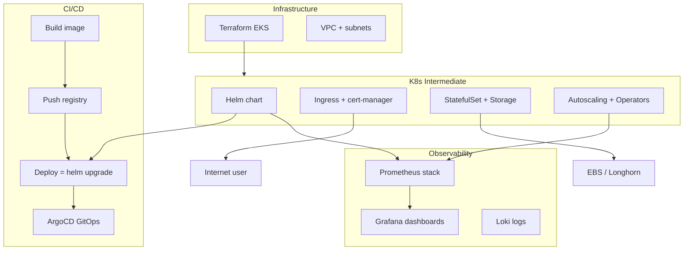

# 🎓 Kubernetes Intermediate — Production cluster vận hành thật

> **Tác giả:** Mr.Rom\
> **Phiên bản:** v1.2.0\
> **Tạo lúc:** 24/05/2026\
> **Cập nhật:** 25/05/2026\
> **Level:** Intermediate\
> **Tags:** [MUST-KNOW]\
> **Prerequisites:** Đã xong [K8s basic cluster](../01_basic/) ✅, deploy được Pod/Deployment/Service/Ingress trên kind/minikube

> 🎯 *Bài INTRO. Bạn deploy được first Pod, expose Service, hardcode ConfigMap, share cluster RBAC ở basic. Production thật cần gì khác? Bài này map 4 mảng intermediate (Helm + Ingress production + StatefulSet + Autoscaling+Operator) — chuẩn bị tâm thế cho 4 bài kế tiếp.*

## 🎯 Sau bài này bạn sẽ

- [ ] Hiểu **khoảng cách basic ↔ production** của K8s
- [ ] Biết **4 mảng intermediate**: Helm / Ingress production / StatefulSet+Storage / Autoscaling+Operator
- [ ] Biết **CNI quan trọng thế nào** — NetworkPolicy chỉ work với CNI hỗ trợ (Calico/Cilium)
- [ ] Biết **tool stack 2026**: Helm, Argo, cert-manager, Prometheus stack, KEDA
- [ ] Có **lộ trình** học 4 bài kế tiếp + chỗ kết nối với CI/CD + Observability + IaC

---

## Tình huống — Bạn promote app từ kind sang production cluster lần đầu

Bạn đã làm xong basic cluster:
- ✅ Deploy FastAPI Pod + Deployment + Service trên kind.
- ✅ Expose ra Internet qua Ingress nginx.
- ✅ Tách config ra ConfigMap + Secret.
- ✅ Split namespace cho team, gán RBAC.

Promote lên EKS production. Vấn đề bật ra liên tục:

| Tình huống | Bạn dùng basic |  Production cần |
|---|---|---|
| Deploy 5 service tương tự (FastAPI + Worker + Cron + ...) | Copy-paste 5 YAML | **Helm chart** template hóa |
| Cấp TLS cho domain `api.acmeshop.vn` | Tự generate cert manual | **cert-manager** auto-renew Let's Encrypt |
| Postgres trong K8s | Deployment + emptyDir | **StatefulSet** + PVC + StorageClass |
| Traffic tăng đột biến | Manual `kubectl scale` | **HPA** auto-scale theo CPU/RAM/custom metric |
| Triển khai Postgres operator | Tự viết YAML 200 dòng | **Postgres Operator** (CRD pattern) |
| Update prod 2x/ngày | Manual `kubectl apply` | **GitOps** (ArgoCD/Flux) sync Git → cluster |
| Setup Prometheus monitor | Manual install + config | **kube-prometheus-stack** Helm chart |
| Network restrict pod-to-pod | NetworkPolicy YAML | **NetworkPolicy + Calico/Cilium CNI** (CNI default không enforce!) |

→ Mỗi vấn đề là 1 ô của intermediate. Cluster này lấp 4 mảng quan trọng nhất.

### Real-world incidents — Vì sao intermediate là baseline 2026

5 sự cố thực tế 2021-2025 cho thấy mảng intermediate (StatefulSet, autoscaling, cert-manager, operator) không phải "nice to have" mà là **baseline phải có**. Bảng tổng hợp + nguyên nhân gốc:

| Năm | Sự cố | Nguyên nhân gốc | Liên quan mảng |
|---|---|---|---|
| 2021 | **Tesla K8s cluster bị mining crypto** | Dashboard không bật RBAC + cluster public | Basic (đã học) + Helm chart secure default (mảng 1) |
| 2023 | **Container.training Postgres data loss** | Postgres dùng Deployment + emptyDir, pod restart = mất hết | StatefulSet + PVC (mảng 3) |
| 2024 | **Acme Shop traffic spike Black Friday** | Manual scale không kịp, pod CPU throttle, RPS giảm 60% | HPA + KEDA (mảng 4) |
| 2024 | **Let's Encrypt rate-limit incident** ở 1 team VN | Tự renew cert manual mỗi tháng, lỡ deadline → cert expire → 502 toàn site 4h | cert-manager auto-renew (mảng 2) |
| 2025 | **GitHub.com Postgres operator bug** ở 1 fintech | Self-managed Postgres không có operator pattern → failover thủ công sai → 30 phút downtime | Operator pattern (mảng 4) |

→ **3/5 vụ là stateful data loss / scaling**. Mảng 3 + 4 là **must-have**, không phải optional.

---

## 1️⃣ Vì sao 4 mảng này quan trọng?

### Helm — Package manager của K8s

**Vấn đề**: Production cluster có 50+ Deployment, mỗi cái có 5-10 file YAML (Deploy/Service/Ingress/ConfigMap/HPA/...). Copy-paste 50 service = 500 file. Update tag image = sửa 50 file.

**Giải pháp Helm**:
- **Chart** = template YAML + `values.yaml` default.
- **Release** = 1 instance của chart đã render với values.
- Install/upgrade/rollback chart như `apt install` cho K8s.
- Public chart sẵn cho Postgres, Redis, Prometheus, Grafana, Argo, ...

🪞 **Ẩn dụ**: *Helm như **`apt` cho K8s** — `apt install postgresql` không cần biết nội bộ Postgres compile thế nào, chỉ `--set values.replicas=3` là xong. Chart developer viết template chuẩn, người dùng chỉ tweak values.*

→ Học ở **bài 01**.

### Ingress production — TLS + cert-manager + DNS

**Vấn đề**: Basic Ingress chỉ route traffic. Production cần:
- TLS cert (Let's Encrypt) auto-renew mỗi 60 ngày.
- DNS records auto-create (Route53, Cloudflare).
- Rate limiting per route.
- WAF rules.
- HTTP/2, HTTP/3 support.

**Giải pháp 2026**:
- **cert-manager** — auto Let's Encrypt TLS.
- **external-dns** — auto DNS records.
- **ingress-nginx** hoặc **Traefik** với annotation/middleware.
- **Gateway API** (chuẩn 2026, kế nhiệm Ingress) — flexible hơn.

🪞 **Ẩn dụ**: *Ingress production như **reception + bảo vệ + bảng hiệu** của cao ốc — không chỉ chỉ đường (basic Ingress), mà còn check ID (TLS), check danh sách (WAF), giới hạn người vào (rate limit).*

→ Học ở **bài 02**.

### StatefulSet + Storage — Stateful workload

**Vấn đề**: Deployment design cho **stateless** app. Stateful (Postgres, Redis, Kafka, Elasticsearch) cần:
- Stable network identity (`postgres-0`, `postgres-1`, ...).
- Persistent storage per pod (PVC).
- Ordered start/stop.
- Predictable hostname cho replication.

**Giải pháp**:
- **StatefulSet** — ordered + stable identity + per-pod PVC.
- **PersistentVolume (PV) + PersistentVolumeClaim (PVC)** — abstraction storage.
- **StorageClass** — dynamic provisioning (AWS EBS, GCP PD, Ceph, Longhorn).
- **VolumeSnapshot** — backup/restore.

🪞 **Ẩn dụ**: *Deployment như **nhân viên thay phiên** — ai cũng giống ai, sa thải 1 người tuyển 1 người thay. StatefulSet như **phòng nha cố định** — bệnh nhân (data) gắn với phòng (PVC) cụ thể, đổi nha sĩ vẫn cùng phòng đó.*

→ Học ở **bài 03**.

### Autoscaling + Operator — Cluster vận hành tự động

**Vấn đề**: Manual scale (`kubectl scale`) không kịp với load thay đổi giờ vàng. Setup database Postgres production: 30+ YAML (StatefulSet + Service + ConfigMap + Secret + PDB + backup CronJob + ...).

**Giải pháp**:
- **HPA** (Horizontal Pod Autoscaler) — scale pod theo CPU/memory/custom metric.
- **VPA** (Vertical Pod Autoscaler) — adjust request/limit của pod.
- **Cluster Autoscaler** (CA) — add/remove node theo demand.
- **KEDA** — scale theo external event (queue length, Kafka lag, ...).
- **Operator** (CRD + Controller) — abstract complex stateful workload: Postgres Operator, Redis Operator, Strimzi (Kafka), cert-manager itself.

🪞 **Ẩn dụ**: *HPA như **autopilot** — máy bay tự điều chỉnh độ cao theo gió, không phi công tay. Operator như **chuyên gia bệnh viện** — Postgres Operator biết cách backup/restore/failover Postgres mà không cần bạn viết YAML thủ công 200 dòng.*

→ Học ở **bài 04**.

---

## 2️⃣ Mối liên hệ với phần khác trong DevOps stack

K8s intermediate **không tồn tại độc lập** — gắn chặt với CI/CD (deploy qua Helm), Observability (Prometheus scrape pod metrics), IaC (provision cluster). Diagram dưới minh hoạ touchpoint:

| K8s intermediate mảng | Kết nối tới đâu |
|---|---|
| Helm chart | CI/CD `helm upgrade` step; ArgoCD/Flux quản lý release |
| Ingress + cert-manager | external-dns provision DNS; Cloudflare/Route53 |
| StatefulSet | IaC provision storage (EBS, Cloud SQL) qua Terraform |
| Autoscaling | Observability cung cấp metric source cho HPA custom; KEDA dùng RabbitMQ/Kafka metric |
| Operator | Tự nó là pattern; nhiều Operator dùng Prometheus ServiceMonitor → tích hợp observability |

→ **K8s intermediate là foundation cho mọi role DevOps/Platform/SRE production 2026**.

---

## 3️⃣ Tool stack 2026 — Cheatsheet

| Mục đích | Tool chính 2026 | Tool dự bị | Khi nào dùng |
|---|---|---|---|
| **Package manager** | **Helm 3** | Kustomize, Jsonnet | Helm cho ai cũng cần; Kustomize cho overlay nhẹ |
| **GitOps** | **ArgoCD** (Intuit, CNCF) | Flux (CNCF), Jenkins X | ArgoCD UI tốt hơn Flux; Flux native git-centric |
| **CNI (network)** | **Cilium** (eBPF, CNCF Graduated) | Calico, Flannel | Cilium 2026 default cho new cluster (NetworkPolicy + observability + service mesh) |
| **Ingress controller** | **ingress-nginx** | Traefik, HAProxy, Contour | nginx phổ biến nhất; Traefik nếu cần middleware đa dạng |
| **Gateway API** | **Gateway API** (chuẩn 2026) | Ingress (legacy) | Gateway API cho cluster mới; Ingress legacy support |
| **TLS / cert** | **cert-manager** | OpenShift cert-utils | cert-manager là CNCF standard |
| **DNS** | **external-dns** | manual | external-dns auto provision Route53/Cloudflare |
| **HPA metric source** | **Prometheus Adapter** + **KEDA** | metrics-server (default) | KEDA scale theo queue, Kafka lag, Cron |
| **Storage CSI driver** | **AWS EBS CSI / GCP PD / Longhorn** | OpenEBS, Rook (Ceph) | Cloud provider CSI cho cloud; Longhorn cho on-prem |
| **Operator framework** | **Operator SDK** (Red Hat) | Kubebuilder | Cùng Kubebuilder backend; SDK Go-first |
| **Monitoring** | **kube-prometheus-stack** (Helm) | Custom Prometheus + Grafana | Helm chart all-in-one — 90% setup |
| **Service mesh** | **Istio Ambient** (2026), **Linkerd**, **Cilium service mesh** | — | Khi cần mTLS pod-to-pod + traffic shifting |
| **Policy** | **Kyverno**, **OPA Gatekeeper** | — | Kyverno YAML-first (dễ); Gatekeeper Rego (flexible) |

→ **Starter stack recommend**: Helm + ArgoCD + Cilium + ingress-nginx + cert-manager + external-dns + kube-prometheus-stack.

---

## 4️⃣ CNI là gì + Vì sao quan trọng

**CNI** (Container Network Interface) = plugin specification cho networking trong K8s. CNI plugin chịu trách nhiệm:
- Cấp IP cho mỗi Pod.
- Route traffic Pod-to-Pod, Pod-to-Service, Pod-to-Internet.
- **Enforce NetworkPolicy** (nếu CNI hỗ trợ).

### Cạm bẫy thực tế (war story từ `__Ref__/`)

**Tình huống**: Team enforce NetworkPolicy default-deny trong namespace `production`. Apply xong → mọi pod không communicate được, Istio sidecar injection cũng fail (webhook bị block) → toàn bộ deploy fail.

**Root cause**: Cluster dùng **Minikube default CNI (kindnet hoặc bridge)** — **không enforce NetworkPolicy**! Policy được create nhưng silently ignored. Team tưởng đã restrict, thực ra mọi traffic vẫn pass cho đến khi Istio control plane đụng webhook... và webhook gọi qua mạng → bị block bởi policy đã có nhưng không enforce → break.

→ **Lesson**: CNI default của Minikube/kind **không production-grade**. NetworkPolicy chỉ work với CNI hỗ trợ:

| CNI | NetworkPolicy support | Khi dùng |
|---|---|---|
| **Cilium** (eBPF) | ✅ Full + L7 policy | **2026 recommend cho cluster mới** |
| **Calico** | ✅ Full L3/L4 + L7 enterprise | Production phổ biến |
| **Weave Net** | ✅ L3/L4 | Deprecated 2024+ |
| **Flannel** | ❌ Không enforce | Simple setup, không enforce policy |
| **kindnet** (kind default) | ❌ Không enforce | Local dev only |
| **bridge** (Minikube default) | ❌ Không enforce | Local dev only |

→ **Học bài 02** sẽ dạy enable Calico/Cilium trong minikube/kind cho test NetworkPolicy thật.

---

## 5️⃣ Lộ trình 4 bài kế tiếp

| Bài | Nội dung | Output sau bài |
| --- | --- | --- |
| **01** Helm | Chart anatomy + template + values + hooks + release lifecycle + public chart + chart museum | Viết được Helm chart cho FastAPI; deploy với `helm install` |
| **02** Ingress production | cert-manager Let's Encrypt + external-dns + ingress-nginx advanced + Gateway API + WAF/rate limit | Production endpoint `api.acmeshop.vn` TLS auto + DNS auto |
| **03** StatefulSet + Storage | StatefulSet vs Deployment + PV/PVC + StorageClass + dynamic provisioning + Postgres example + backup/restore | Deploy Postgres 3 replicas với data persistent + backup |
| **04** Autoscaling + Operators | HPA + VPA + CA + KEDA + Operator pattern (CRD + Controller) + write simple operator + use Postgres Operator | Cluster auto-scale + dùng Operator cho Postgres production |

---

## 6️⃣ ROI thực tế — Đầu tư intermediate được gì?

9 metric cụ thể trước/sau khi áp dụng intermediate patterns — không phải hứa hẹn mơ hồ. Số liệu thực từ team 5 dev + 1 cluster prod: tiết kiệm ~30-50h/tháng + $300/tháng infra cost:

| Số liệu | Trước intermediate | Sau intermediate | Δ |
|---|---|---|---|
| Deploy 1 service mới (YAML) | 5-10 file, 200+ dòng copy/paste | 1 `values.yaml` 20 dòng + Helm chart shared | **−90% LOC** |
| Cấp TLS cert mới + DNS | 30-60 phút manual | < 30 giây auto (cert-manager + external-dns) | **−99%** thời gian |
| Cert expire incident/năm | 1-3 lần (lỡ renew thủ công) | 0 (auto-renew 60 ngày trước expire) | **−100%** |
| Postgres data persistence | emptyDir (mất khi pod restart) | PVC + VolumeSnapshot (backup hàng ngày) | Data loss risk ≈ 0 |
| Traffic spike response time | 5-15 phút manual scale | 30-60s HPA tự scale | **−95%** |
| Setup Postgres production | 200+ dòng YAML + scripts thủ công backup/restore | 1 CR `PostgresCluster` 30 dòng (Postgres Operator) | **−85% LOC** |
| Cluster sửa drift (config mismatch) | Manual `kubectl diff` + apply | ArgoCD tự reconcile từ Git | Drift ≈ 0 |
| Storage cost stateful workload | EBS root volume manual | StorageClass với gp3 + auto-resize | Tiết kiệm 30-40% storage |
| Time to onboard team mới | 2-3 ngày setup từng cluster | 1 giờ `helm install` toàn bộ stack | **−90%** thời gian |

→ **Tiết kiệm điển hình** cho team 5 dev + 1 cluster production: **~30-50 giờ/tháng** dev time + **~$300/tháng** infra cost (auto-scale tiết kiệm node idle).

→ Quan trọng hơn: **1 vụ Postgres data loss = vài chục đến vài trăm giờ DBA recovery + uy tín**. Mảng 3 (Storage) trả lại chính nó sau 1 lần phòng được.

---

## 7️⃣ Learning timeline — Day 1 → Day 90

Roadmap 90 ngày từ beginner đến production-ready operator. Chia làm 5 mốc theo bài học. Đây không phải tối thiểu — mà là pace **thực tế** học part-time có deadline:

| Mốc | Bạn làm được gì | Đang ở bài nào |
|---|---|---|
| **Day 1-3** | Đọc bài 01, viết Helm chart cho 1 service FastAPI; `helm install` thành công | Bài 01 |
| **Day 4-7** | Refactor 5 service hiện có sang Helm chart; setup chart museum nội bộ | Bài 01 cuối |
| **Day 8-12** | Cài cert-manager + external-dns; cấp TLS cho `api.acmeshop.vn` auto | Bài 02 |
| **Day 13-17** | Switch CNI sang Cilium/Calico; test NetworkPolicy default-deny | Bài 02 cuối |
| **Day 18-25** | Deploy Postgres StatefulSet với PVC + VolumeSnapshot backup hàng ngày | Bài 03 |
| **Day 26-30** | Migrate Redis + Kafka sang StatefulSet pattern | Bài 03 cuối |
| **Day 31-40** | Setup HPA cho 5 service quan trọng; load test verify auto-scale | Bài 04 đầu |
| **Day 41-50** | Install Postgres Operator (Zalando/CrunchyData); migrate Postgres sang CR | Bài 04 cuối |
| **Day 51-60** | Setup ArgoCD GitOps cho toàn bộ cluster | Củng cố |
| **Day 61-90** | Lead onboarding cho team mới; viết runbook cluster operations | Advanced ready |

→ **Day 90**: bạn sẵn sàng làm **Platform Engineer**, **Senior DevOps**, hoặc **SRE Tier-2** cho production cluster.

---

## 8️⃣ Anti-patterns — Đừng làm gì khi mới qua intermediate

| Anti-pattern | Vì sao sai | Đúng phải làm gì |
|---|---|---|
| Dùng `helm template ... \| kubectl apply` thay vì `helm install/upgrade` | Mất release history, không rollback được | Luôn `helm install/upgrade --atomic --wait` |
| Postgres dùng Deployment + `volumeClaimTemplates` | Deployment không tạo PVC per pod → data race | Postgres luôn StatefulSet |
| StatefulSet không có `podManagementPolicy: Parallel` cho stateless-like workload | Pod start tuần tự → deploy chậm 10x | Stateful thật mới `OrderedReady`; còn lại `Parallel` |
| HPA scale theo CPU 80% nhưng app bottleneck ở DB | Scale pod không giúp, DB vẫn full | Custom metric (queue length, DB connection) qua Prometheus Adapter |
| cert-manager `Issuer` (namespace-scoped) cho toàn cluster | Mỗi namespace phải tạo lại = nhiều rate-limit Let's Encrypt | Dùng `ClusterIssuer` cho prod |
| NetworkPolicy default-deny **chưa test CNI hỗ trợ** | Policy không enforce, false sense of security | Verify CNI = Cilium/Calico trước khi enable policy |
| Operator không có `finalizer` cho CR cleanup | Delete CR → resource leak (PVC, Secret còn lại) | Operator phải có finalizer + reconcile cleanup |
| Mọi service dùng `Recreate` strategy thay vì `RollingUpdate` | Downtime mỗi lần deploy | `RollingUpdate` với `maxSurge`/`maxUnavailable` tinh chỉnh |
| Chart có `latest` image tag hardcoded trong `values.yaml` | Mất khả năng rollback chính xác | Tag = `<semver>` hoặc digest pinning |
| StatefulSet PVC dùng `ReclaimPolicy: Delete` | Pod chết → PVC tự xóa → data mất | Production luôn `ReclaimPolicy: Retain` + cleanup thủ công |

→ **Pattern chung**: K8s cho bạn power nhiều = footgun nhiều. Mỗi anti-pattern là 1 lần production fire có người đã trải qua.

---

## 💡 Câu hỏi beginner hay hỏi

**Q1.** "Đã basic, cần phải intermediate không?"

→ **Có**, nếu deploy production thật. Basic chỉ đủ cho dev/demo. Intermediate là baseline cho mọi role Platform Engineer / Site Reliability Engineer / Senior DevOps 2026.

**Q2.** "Học Helm hay Kustomize?"

→ Học **Helm** trước (chiếm 80% market). Kustomize là native K8s tool, đơn giản hơn nhưng power kém. Nhiều team dùng **cả 2**: Helm cho chart upstream (Postgres, nginx), Kustomize cho config tweak per env. Bài 01 sẽ so sánh chi tiết.

**Q3.** "ArgoCD hay Flux?"

→ **ArgoCD** popular hơn 2026 (CNCF Graduated). UI tốt. Flux thiên git-centric, lightweight. Nếu chưa biết, học ArgoCD trước. Bài 01 chạm đến — chi tiết ở CI/CD intermediate.

**Q4.** "Istio cần ngay từ intermediate không?"

→ **Không cần**. Service mesh là **advanced topic**. Intermediate đủ nếu chưa scale cần mTLS pod-to-pod hoặc traffic shifting phức tạp. Khi cần, học Cilium service mesh (lightweight) hoặc Istio Ambient.

**Q5.** "Có cần học cả Operator pattern không?"

→ **Có ít nhất hiểu pattern + dùng được**. Phần lớn dev không viết Operator từ đầu, nhưng phải **dùng** (Postgres Operator, cert-manager, prometheus-operator). Hiểu CRD + Controller pattern giúp debug khi Operator hỏng. Bài 04 dạy đến mức "viết simple operator" để hiểu.

**Q6.** "Có nên chạy database trong K8s không?"

→ **2026 view**: **Có**, nếu:
- Dùng **Operator** (Postgres Operator, Strimzi cho Kafka, ...) — không tự viết YAML.
- Có **StorageClass** với SSD + replication (EBS gp3, GCP SSD, Ceph).
- Có **backup** auto (VolumeSnapshot, pgBackRest, Velero).
- Team có **SRE on-call** xử incident.

**Không**, nếu team < 5 dev và chưa có K8s production kinh nghiệm. Dùng managed service (RDS, Cloud SQL) trước, migrate sau.

**Q7.** "Helm chart values.yaml lớn quá, quản lý sao?"

→ **3 chiến lược**:
1. **`values-<env>.yaml`** per environment (`values-prod.yaml`, `values-staging.yaml`).
2. **External Secrets Operator** — secret từ Vault/AWS Secrets Manager, không hard-code.
3. **Helmfile / Argo CD ApplicationSet** — đa cluster, đa env, declarative.

Bài 01 sẽ chạm chiến lược 1; chiến lược 2-3 ở CI/CD + IaC intermediate.

**Q8.** "Khi nào nên upgrade K8s version?"

→ **Cadence khuyến nghị 2026**:
- Upgrade 1 minor version (1.30 → 1.31) mỗi **3-6 tháng**.
- Test ở dev → staging → prod theo thứ tự.
- K8s hỗ trợ chính thức **N-2** version (3 version gần nhất). Lùi quá → security risk + không có patch.
- Managed (EKS/GKE/AKS) tự upgrade control plane; node group phải upgrade manual (hoặc Karpenter auto).

Detail upgrade ở K8s advanced cluster.

---

## 🗺️ Khi nào cần advanced (sau intermediate)?

Sau cluster này, nếu bạn cần đi sâu thêm:

| Topic advanced | Nội dung | Khi nào học |
|---|---|---|
| **Service mesh deep** | Istio Ambient, Linkerd, Cilium mesh, mTLS, traffic shifting | Multi-team cluster cần security + observability |
| **Multi-cluster federation** | Cluster API (CAPI), KubeFed, multi-region | Disaster recovery, geo-redundancy |
| **eBPF + Cilium deep** | Network observability, security (Tetragon) | Performance debugging, threat detection |
| **Custom controllers + Operators advanced** | Operator framework deep, finalizers, leader election | Build platform team's own operators |
| **Kubernetes internals** | etcd, API server, scheduler internals, audit log | SRE deep, troubleshoot kernel-level |
| **GPU + AI workloads** | Device plugins, node selector, AI inference platform | ML/AI production |

→ Cluster `03_advanced/` sẽ làm sau.

---

## 📚 Từ Điển Thuật Ngữ (Glossary)

| Term | Vietnamese / Explanation |
|---|---|
| **Helm** | Package manager cho K8s — `chart` template hóa YAML |
| **Chart** | Helm package = templates + values.yaml default + Chart.yaml metadata |
| **Release** | Instance của chart đã render với specific values + deployed cluster |
| **GitOps** | Pattern: Git = source of truth, controller (ArgoCD/Flux) sync Git → cluster |
| **ArgoCD** | GitOps CD tool (Intuit, CNCF Graduated) — UI mạnh |
| **Flux** | GitOps CD tool (Weaveworks, CNCF Graduated) — git-centric, lightweight |
| **CNI** | Container Network Interface — plugin specification networking K8s |
| **Cilium** | CNI plugin eBPF-based — NetworkPolicy + observability + service mesh (CNCF Graduated) |
| **Calico** | CNI plugin L3/L4 — production phổ biến (Tigera) |
| **NetworkPolicy** | K8s resource restrict pod-to-pod traffic (chỉ enforce với CNI hỗ trợ) |
| **cert-manager** | Auto-provision + renew TLS cert (Let's Encrypt, Vault, ...) |
| **external-dns** | Auto sync K8s Ingress/Service → DNS records (Route53, Cloudflare, ...) |
| **Gateway API** | Successor of Ingress — flexible, GA 2024+ |
| **StatefulSet** | Workload type cho stateful app: stable identity + per-pod PVC + ordered |
| **PV / PVC** | PersistentVolume (cluster resource) / PersistentVolumeClaim (namespace request) |
| **StorageClass** | Template provisioning PV — dynamic provisioning |
| **CSI** | Container Storage Interface — plugin storage driver |
| **HPA** | Horizontal Pod Autoscaler — scale replica theo metric |
| **VPA** | Vertical Pod Autoscaler — adjust request/limit |
| **Cluster Autoscaler** | Add/remove node theo demand |
| **KEDA** | Kubernetes Event-Driven Autoscaler — scale theo external event |
| **CRD** | Custom Resource Definition — extend K8s API |
| **Operator** | Controller pattern automate lifecycle của stateful app |
| **Service mesh** | Layer mTLS + traffic management giữa các microservice (Istio/Linkerd/Cilium) |
| **PDB** | Pod Disruption Budget — guarantee N pod available khi voluntary disruption |

---

## 🔗 Liên kết & Tài nguyên

### 🧭 Định hướng lộ trình học
- ➡️ **Bài tiếp theo:** [Helm — Package manager cho K8s, deploy 50 service không copy-paste](01_helm-package-manager.md) *(sắp viết)*
- ↑ **Về cụm:** [Kubernetes README](../../README.md)
- ⬅️ **Bài trước:** [Namespaces Và RBAC: Thiết Lập Biên Giới An Ninh Và Phân Quyền Hạn Chế Tối Đa](../01_basic/04_namespaces-and-rbac.md)

### 🧩 Các chủ đề có thể bạn quan tâm
- 🐳 [Docker intermediate](../../../docker/lessons/02_intermediate/) — image production-grade
- ➡️ **Bài tiếp theo:** [CI/CD basic](../../../ci-cd/) — pipeline → K8s deploy
- 📊 [Observability basic](../../../observability/) — Prometheus + Grafana
- 🏗️ [IaC basic](../../../iac/) — Terraform EKS provision

### Tài nguyên ngoài (2026)
- 📖 [Helm docs](https://helm.sh/docs/)
- 📖 [ArgoCD docs](https://argo-cd.readthedocs.io/)
- 📖 [Cilium docs](https://docs.cilium.io/)
- 📖 [Calico docs](https://docs.tigera.io/calico/)
- 📖 [cert-manager docs](https://cert-manager.io/docs/)
- 📖 [Gateway API](https://gateway-api.sigs.k8s.io/)
- 📖 [KEDA docs](https://keda.sh/)
- 📖 [Operator framework](https://operatorframework.io/)
- 📖 [CNCF landscape](https://landscape.cncf.io/) — full ecosystem
- 📖 [Killer Shell — CKA/CKAD/CKS prep](https://killer.sh/)

---

## 📌 Nhật ký thay đổi (Changelog)

- **v1.0.0 (24/05/2026)** — Bản đầu tiên. Lesson 00 INTRO của intermediate cluster. Map 4 mảng (Helm/Ingress/StatefulSet/Autoscaling+Operator) + tool stack 2026 + roadmap 4 bài kế tiếp + cross-link DevOps stack. Apply insight quan trọng từ `__Ref__/`: CNI default Minikube không enforce NetworkPolicy → war story team enforce policy bị break Istio sidecar webhook.
- **v1.1.0 (24/05/2026)** — Bổ sung: §"Real-world incidents" (Tesla mining, Postgres emptyDir data loss, Acme Black Friday, Let's Encrypt cert expire, Postgres operator failover), §6 ROI table 9 metric trước/sau, §7 Learning timeline Day 1 → 90, §8 Anti-patterns 10 mục K8s-specific, +3 câu hỏi beginner (DB in K8s, large values.yaml, K8s upgrade cadence). Lý do: user feedback yêu cầu mở rộng chiều sâu cho overview, đặc biệt anti-patterns vì K8s footgun nhiều.
- **v1.2.0 (25/05/2026)** — Apply Blueprint v0.5.4+ §3.6: thêm lead-in trước Real-world incidents + §2 DevOps stack + §5 Lộ trình 4 bài + §6 ROI table + §7 Learning timeline.
