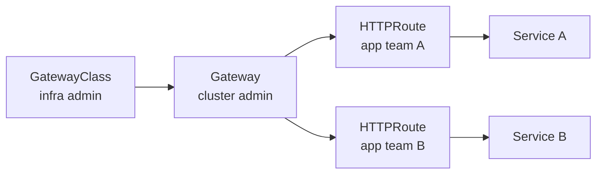

# 🎓 Ingress Production — cert-manager + external-dns + Gateway API

> **Tác giả:** Mr.Rom\
> **Phiên bản:** v1.1.0\
> **Tạo lúc:** 24/05/2026\
> **Cập nhật:** 25/05/2026\
> **Level:** Intermediate\
> **Tags:** [MUST-KNOW]\
> **Thời lượng đọc:** ~22 phút\
> **Prerequisites:** [01_helm-package-manager.md](01_helm-package-manager.md), [basic Ingress](../01_basic/02_services-and-networking.md)

> 🎯 *Basic Ingress chỉ route traffic. Production cần TLS auto Let's Encrypt + DNS auto-record + rate limiting + WAF + multi-host. Bài này dạy: setup ingress-nginx production-grade, cert-manager auto TLS, external-dns auto DNS, Gateway API (successor 2026), NetworkPolicy với Cilium/Calico CNI.*

## 🎯 Sau bài này bạn sẽ

- [ ] Install **ingress-nginx** production qua Helm với best-practice config
- [ ] Setup **cert-manager** + Let's Encrypt — TLS auto, renew 60 ngày
- [ ] Setup **external-dns** — sync Ingress → Route53/Cloudflare auto
- [ ] Hiểu **Gateway API** (chuẩn 2026) — khác Ingress thế nào
- [ ] **Rate limit + WAF + multi-host** annotations
- [ ] Enable **NetworkPolicy** thực tế với **Cilium** CNI
- [ ] Debug Ingress: cert pending, DNS không sync, 502 Bad Gateway

---

## Tình huống — Cấp TLS cho 5 domain, 1 hết hạn sau 90 ngày

Bạn deploy 5 service ra Internet với 5 domain:
- `api.acmeshop.vn`
- `app.acmeshop.vn`
- `admin.acmeshop.vn`
- `auth.acmeshop.vn`
- `cdn.acmeshop.vn`

Mỗi domain cần TLS cert. Bạn:
1. Vào ACM/Cloudflare/Let's Encrypt manual generate cert.
2. Copy `.crt` + `.key` thành K8s Secret.
3. Reference Secret trong Ingress YAML.
4. Reload Ingress controller.

→ 30 phút/domain. **5 domain = 2.5h**.

3 tháng sau, cert hết hạn — production gặp:
```
NET::ERR_CERT_DATE_INVALID
```
Customer email bão. Bạn lại renew manual, repeat 5 lần.

DNS records cũng vậy: thêm domain mới = vào AWS Console add A record point đến LoadBalancer.

Sếp: *"Setup cert-manager + external-dns. Cert tự renew, DNS tự sync. Manual cert là không acceptable năm 2026."*

→ Bài này dạy.

---

## 1️⃣ Ingress controller production — ingress-nginx

🪞 **Ẩn dụ**: *Ingress production như **reception + bảo vệ + bảng hiệu cao ốc** — basic Ingress chỉ chỉ đường (route). Production Ingress còn check ID (TLS qua cert-manager auto Let's Encrypt), kiểm danh sách (WAF block bot), tự gắn biển báo (external-dns auto DNS record), giới hạn người vào (rate limit).*

### Install qua Helm

Cài ingress-nginx bằng `kubectl apply` raw manifest cũng được, nhưng production luôn dùng **Helm chart** vì cấu hình phức tạp (replica, resource, TLS, metrics). Tối thiểu 3 replica + ServiceMonitor scrape Prometheus + LoadBalancer service public ra Internet:

```bash
helm repo add ingress-nginx https://kubernetes.github.io/ingress-nginx
helm repo update

helm install ingress-nginx ingress-nginx/ingress-nginx \
  --namespace ingress-nginx \
  --create-namespace \
  --version 4.x.x \
  --set controller.replicaCount=3 \
  --set controller.metrics.enabled=true \
  --set controller.metrics.serviceMonitor.enabled=true \
  --set controller.config.use-forwarded-headers="true" \
  --set controller.config.compute-full-forwarded-for="true" \
  --set controller.service.type=LoadBalancer
```

Hoặc với values file:
```yaml
# ingress-nginx-values.yaml
controller:
  replicaCount: 3
  
  podAntiAffinity: hard       # spread replica across nodes
  
  service:
    type: LoadBalancer
    annotations:
      service.beta.kubernetes.io/aws-load-balancer-type: nlb
      service.beta.kubernetes.io/aws-load-balancer-scheme: internet-facing
  
  config:
    use-forwarded-headers: "true"
    compute-full-forwarded-for: "true"
    use-proxy-protocol: "false"
    enable-real-ip: "true"
    keep-alive: "75"
    keep-alive-requests: "1000"
    proxy-body-size: "10m"           # max upload
    proxy-read-timeout: "60"
    proxy-send-timeout: "60"
    ssl-protocols: "TLSv1.2 TLSv1.3"
    ssl-ciphers: "ECDHE-ECDSA-AES128-GCM-SHA256:..."
    enable-modsecurity: "true"        # WAF
    enable-owasp-modsecurity-crs: "true"
  
  metrics:
    enabled: true
    serviceMonitor:
      enabled: true                   # Prometheus scrape
  
  resources:
    limits:
      cpu: 1000m
      memory: 1Gi
    requests:
      cpu: 200m
      memory: 256Mi
  
  autoscaling:
    enabled: true
    minReplicas: 3
    maxReplicas: 10
    targetCPUUtilizationPercentage: 70
```

### Verify

Sau khi Helm install xong, check 3 thứ: (1) controller Pod đã `Running`, (2) Service type `LoadBalancer` đã được cloud provider gán external IP/hostname, (3) endpoint port 80/443 đã mở. Nếu external IP còn `<pending>` quá 5 phút → có vấn đề với cloud provider quota hoặc IAM role:

```bash
kubectl get pods -n ingress-nginx
# ingress-nginx-controller-xxx   1/1 Running
# ingress-nginx-controller-yyy   1/1 Running
# ingress-nginx-controller-zzz   1/1 Running

kubectl get svc -n ingress-nginx
# ingress-nginx-controller   LoadBalancer   10.x.x.x   <external-ip>   80:30080,443:30443

# Public IP/hostname
kubectl get svc ingress-nginx-controller -n ingress-nginx -o jsonpath='{.status.loadBalancer.ingress[0].hostname}'
# a1b2c3d4.us-east-1.elb.amazonaws.com
```

### ingress-nginx vs Traefik vs HAProxy

3 ingress controller phổ biến nhất 2026. Mỗi cái có triết lý cấu hình khác nhau — ingress-nginx dựa vào **annotations**, Traefik dùng **CRD** với middleware chain, HAProxy thiên về low-latency. Bảng dưới so sánh để chọn đúng cái cho team:

| Aspect | ingress-nginx | Traefik | HAProxy |
|---|---|---|---|
| Popularity 2026 | **#1** (~60% market) | ~25% | ~10% |
| Configuration | YAML annotations | CRD (IngressRoute), middleware | YAML annotations |
| Performance | Tốt | Tốt | Best (low-latency) |
| Auto cert (built-in) | ❌ (cần cert-manager) | ✅ ACME built-in | ❌ |
| Dashboard | ❌ (cần Grafana) | ✅ built-in | ✅ |
| Plugin/middleware | Annotations + Lua | CRD-based, rich | annotations |
| Gateway API support | ✅ | ✅ | ✅ |

→ **Recommend 2026**: ingress-nginx (market leader, mature, Helm-friendly). Traefik nếu cần middleware đa dạng. HAProxy cho high-throughput.

---

## 2️⃣ cert-manager — TLS auto với Let's Encrypt

### Vì sao cert-manager

**Let's Encrypt** miễn phí TLS cert, renew 90 ngày. Manual = cron job + ACME client + Secret update + Ingress reload. **cert-manager** automate hết.

### Install

cert-manager cũng cài qua Helm. Tham số quan trọng: `installCRDs=true` (cài CRD `Certificate`, `Issuer`, `ClusterIssuer`) + `prometheus.enabled` (xuất metric cho Grafana). Sau install kiểm tra 3 Pod `cert-manager-*`, `cainjector`, `webhook` đều Running:

```bash
helm repo add jetstack https://charts.jetstack.io
helm repo update

helm install cert-manager jetstack/cert-manager \
  --namespace cert-manager \
  --create-namespace \
  --version v1.14.x \
  --set installCRDs=true \
  --set prometheus.enabled=true \
  --set prometheus.servicemonitor.enabled=true
```

Verify:
```bash
kubectl get pods -n cert-manager
# cert-manager-xxx              1/1 Running
# cert-manager-cainjector-xxx   1/1 Running
# cert-manager-webhook-xxx      1/1 Running
```

### Setup ClusterIssuer — Let's Encrypt

**Staging issuer** (testing — không rate limit):
```yaml
# clusterissuer-staging.yaml
apiVersion: cert-manager.io/v1
kind: ClusterIssuer
metadata:
  name: letsencrypt-staging
spec:
  acme:
    server: https://acme-staging-v02.api.letsencrypt.org/directory
    email: ops@acmeshop.vn
    privateKeySecretRef:
      name: letsencrypt-staging
    solvers:
      - http01:
          ingress:
            class: nginx
```

**Production issuer**:
```yaml
# clusterissuer-prod.yaml
apiVersion: cert-manager.io/v1
kind: ClusterIssuer
metadata:
  name: letsencrypt-prod
spec:
  acme:
    server: https://acme-v02.api.letsencrypt.org/directory
    email: ops@acmeshop.vn
    privateKeySecretRef:
      name: letsencrypt-prod
    solvers:
      - http01:
          ingress:
            class: nginx
```

Apply:
```bash
kubectl apply -f clusterissuer-staging.yaml
kubectl apply -f clusterissuer-prod.yaml

# Verify
kubectl get clusterissuer
# letsencrypt-staging   True   (Ready)
# letsencrypt-prod      True   (Ready)
```

### Add annotation vào Ingress → cert tự generate

Magic của cert-manager: **không cần tạo Certificate resource thủ công**. Chỉ thêm 1 annotation `cert-manager.io/cluster-issuer: <issuer>` vào Ingress + khai báo `tls.secretName`, cert-manager tự detect, request cert từ Let's Encrypt, lưu vào Secret. Workflow chạy nền hết:

```yaml
apiVersion: networking.k8s.io/v1
kind: Ingress
metadata:
  name: api-acmeshop
  annotations:
    cert-manager.io/cluster-issuer: letsencrypt-prod   # ← key annotation
spec:
  ingressClassName: nginx
  rules:
    - host: api.acmeshop.vn
      http:
        paths:
          - path: /
            pathType: Prefix
            backend:
              service:
                name: fastapi
                port:
                  number: 8000
  tls:
    - hosts:
        - api.acmeshop.vn
      secretName: api-acmeshop-tls    # ← cert-manager fills this Secret
```

Apply → cert-manager workflow:
1. Detect annotation → create Certificate resource.
2. Create Order → Challenge với Let's Encrypt.
3. Solve HTTP-01 challenge (deploy temp Ingress route `/.well-known/acme-challenge/...`).
4. Let's Encrypt validate → issue cert.
5. Store cert vào Secret `api-acmeshop-tls`.
6. Ingress dùng Secret cho TLS.

Verify:
```bash
# Watch certificate
kubectl get certificate -A
# NAMESPACE   NAME             READY   SECRET                 AGE
# default     api-acmeshop     True    api-acmeshop-tls       2m

kubectl describe certificate api-acmeshop
# ...
# Conditions:
#   Type    Status  Reason   Message
#   Ready   True    Ready    Certificate is up to date and has not expired

# View Secret
kubectl get secret api-acmeshop-tls -o yaml | yq '.data."tls.crt"' | base64 -d | openssl x509 -text -noout | grep "Not After"
# Not After : Aug 22 12:00:00 2026 GMT
```

→ Cert valid 90 ngày, cert-manager renew tự động ở day 60.

### DNS-01 challenge (cho wildcard cert)

HTTP-01 chỉ cấp cert specific domain. **Wildcard** `*.acmeshop.vn` cần DNS-01 challenge:

```yaml
apiVersion: cert-manager.io/v1
kind: ClusterIssuer
metadata:
  name: letsencrypt-wildcard
spec:
  acme:
    server: https://acme-v02.api.letsencrypt.org/directory
    email: ops@acmeshop.vn
    privateKeySecretRef:
      name: letsencrypt-wildcard
    solvers:
      - dns01:
          route53:                    # AWS Route53
            region: us-east-1
            hostedZoneID: Z1234567890ABC
            accessKeyID: AKIAxxx
            secretAccessKeySecretRef:
              name: route53-secret
              key: secret-access-key
```

Or Cloudflare:
```yaml
solvers:
  - dns01:
      cloudflare:
        email: ops@acmeshop.vn
        apiTokenSecretRef:
          name: cloudflare-api-token
          key: api-token
```

Now request wildcard:
```yaml
apiVersion: cert-manager.io/v1
kind: Certificate
metadata:
  name: wildcard-acmeshop
  namespace: default
spec:
  secretName: wildcard-acmeshop-tls
  issuerRef:
    name: letsencrypt-wildcard
    kind: ClusterIssuer
  dnsNames:
    - "*.acmeshop.vn"
    - "acmeshop.vn"
```

→ Cấp 1 cert dùng được cho mọi subdomain.

---

## 3️⃣ external-dns — DNS auto sync

### Vì sao external-dns

Tạo Ingress mới `app.acmeshop.vn` → phải vào AWS Console add A record point đến NLB. Quên = domain không resolve.

**external-dns** watch K8s Ingress/Service → auto create DNS records.

### Install (Route53 example)

```yaml
# values.yaml
provider: aws
aws:
  region: us-east-1
  zoneType: public

# IAM credentials hoặc IRSA (recommend)
serviceAccount:
  annotations:
    eks.amazonaws.com/role-arn: arn:aws:iam::123456789012:role/external-dns-role

# Filter — only manage specific domain
domainFilters:
  - acmeshop.vn

# Sync mode
policy: sync    # 'sync' (auto-delete) or 'upsert-only' (safer)

# Source — watch ingress + service
sources:
  - ingress
  - service

# Owner — track records created by THIS external-dns
txtOwnerId: acmeshop-prod
```

```bash
helm install external-dns external-dns/external-dns -f values.yaml -n external-dns --create-namespace
```

### Test

Tạo Ingress mới:
```yaml
apiVersion: networking.k8s.io/v1
kind: Ingress
metadata:
  name: app-new
  annotations:
    external-dns.alpha.kubernetes.io/hostname: app-new.acmeshop.vn
spec:
  ingressClassName: nginx
  rules:
    - host: app-new.acmeshop.vn
      http: ...
```

→ external-dns watch → create A record `app-new.acmeshop.vn` → NLB IP. Sau 1-5 phút, DNS propagate.

Logs:
```bash
kubectl logs -n external-dns deploy/external-dns
# time="..." level=info msg="Desired change: CREATE app-new.acmeshop.vn A"
# time="..." level=info msg="Creating record"
```

### Annotation control

```yaml
metadata:
  annotations:
    external-dns.alpha.kubernetes.io/hostname: "app1.acmeshop.vn,app2.acmeshop.vn"   # multi
    external-dns.alpha.kubernetes.io/ttl: "300"                                        # custom TTL
    external-dns.alpha.kubernetes.io/cloudflare-proxied: "true"                        # Cloudflare proxy
```

### Provider support

external-dns hỗ trợ: AWS Route53, GCP Cloud DNS, Azure DNS, Cloudflare, DigitalOcean, Hetzner, GoDaddy, Linode, OVH, ... ~30+ provider.

---

## 4️⃣ Hands-on: Setup TLS auto cho FastAPI

### Step 1: Prerequisites

- K8s cluster (EKS/GKE/kind với cloud LB).
- Domain `acmeshop.vn` managed bởi Route53/Cloudflare.
- ingress-nginx installed.
- cert-manager installed.
- external-dns installed (optional, có thể manual DNS).

### Step 2: Deploy FastAPI

```bash
helm install fastapi ./fastapi-chart \
  -f values-prod.yaml \
  --namespace production --create-namespace
```

### Step 3: Apply ClusterIssuer

(Đã làm ở §2 — kubectl apply clusterissuer-prod.yaml)

### Step 4: Ingress với cert-manager + external-dns annotations

```yaml
# fastapi-ingress.yaml
apiVersion: networking.k8s.io/v1
kind: Ingress
metadata:
  name: fastapi
  namespace: production
  annotations:
    # cert-manager
    cert-manager.io/cluster-issuer: letsencrypt-prod
    
    # external-dns
    external-dns.alpha.kubernetes.io/hostname: api.acmeshop.vn
    external-dns.alpha.kubernetes.io/ttl: "300"
    
    # nginx specific
    nginx.ingress.kubernetes.io/ssl-redirect: "true"
    nginx.ingress.kubernetes.io/force-ssl-redirect: "true"
    nginx.ingress.kubernetes.io/proxy-body-size: "10m"
    nginx.ingress.kubernetes.io/configuration-snippet: |
      more_set_headers "X-Frame-Options: DENY";
      more_set_headers "X-Content-Type-Options: nosniff";
      more_set_headers "Strict-Transport-Security: max-age=31536000; includeSubDomains";
spec:
  ingressClassName: nginx
  rules:
    - host: api.acmeshop.vn
      http:
        paths:
          - path: /
            pathType: Prefix
            backend:
              service:
                name: fastapi
                port:
                  number: 8000
  tls:
    - hosts:
        - api.acmeshop.vn
      secretName: fastapi-tls
```

Apply:
```bash
kubectl apply -f fastapi-ingress.yaml
```

### Step 5: Watch chain

```bash
# Ingress
kubectl get ingress -n production
# fastapi   nginx   api.acmeshop.vn   <external-ip>   80, 443

# Certificate (auto-created by cert-manager)
kubectl get certificate -n production
# fastapi-tls   True    fastapi-tls   30s

# DNS records (external-dns create)
aws route53 list-resource-record-sets --hosted-zone-id ZXXXXX | grep api.acmeshop.vn
# A record api.acmeshop.vn → <NLB IP>

# Test
curl -v https://api.acmeshop.vn
# < HTTP/2 200
# < strict-transport-security: max-age=31536000; includeSubDomains
# ...
```

→ **Đầu cuối tự động**: deploy chart → Ingress create → cert generate → DNS sync → traffic flow with TLS.

---

## 5️⃣ Rate limiting + Auth + WAF annotations

### Rate limit per IP

```yaml
metadata:
  annotations:
    nginx.ingress.kubernetes.io/limit-rps: "10"           # 10 req/sec per IP
    nginx.ingress.kubernetes.io/limit-burst-multiplier: "3" # burst 30
    nginx.ingress.kubernetes.io/limit-connections: "20"   # max 20 concurrent conn
```

### Basic Auth

```bash
# Tạo htpasswd
htpasswd -c auth admin
# (enter password)

kubectl create secret generic admin-auth --from-file=auth -n production
```

```yaml
annotations:
  nginx.ingress.kubernetes.io/auth-type: basic
  nginx.ingress.kubernetes.io/auth-secret: admin-auth
  nginx.ingress.kubernetes.io/auth-realm: "Admin only"
```

### OAuth2 proxy

```yaml
annotations:
  nginx.ingress.kubernetes.io/auth-url: "https://oauth2-proxy.acmeshop.vn/oauth2/auth"
  nginx.ingress.kubernetes.io/auth-signin: "https://oauth2-proxy.acmeshop.vn/oauth2/start?rd=$escaped_request_uri"
```

### CORS

```yaml
annotations:
  nginx.ingress.kubernetes.io/enable-cors: "true"
  nginx.ingress.kubernetes.io/cors-allow-origin: "https://app.acmeshop.vn,https://admin.acmeshop.vn"
  nginx.ingress.kubernetes.io/cors-allow-methods: "GET, POST, PUT, DELETE, OPTIONS"
  nginx.ingress.kubernetes.io/cors-allow-credentials: "true"
```

### WAF — ModSecurity + OWASP CRS

(Đã enable ở §1 config). Block common attacks: SQL injection, XSS, path traversal, etc.

```yaml
annotations:
  nginx.ingress.kubernetes.io/enable-modsecurity: "true"
  nginx.ingress.kubernetes.io/enable-owasp-modsecurity-crs: "true"
  nginx.ingress.kubernetes.io/modsecurity-snippet: |
    SecRuleEngine On
    SecRequestBodyAccess On
    SecRequestBodyLimit 13107200
```

---

## 6️⃣ Gateway API — Successor of Ingress

### Vấn đề với Ingress

Ingress design 2017, limitations:
- Annotation hell (mỗi controller có annotation riêng → không portable).
- Không support: TCP/UDP, gRPC native, traffic splitting cố định.
- 1 person team manage cả Ingress + cert + DNS thường.

### Gateway API design

**Gateway API** (sigs.k8s.io, GA 2024) — chuẩn 2026, role-based:

- **GatewayClass** (infra admin): define class (cloud LB type, controller).
- **Gateway** (cluster admin): instance — listen port + cert.
- **HTTPRoute / TCPRoute / GRPCRoute** (app team): route rules.



### Example Gateway

```yaml
apiVersion: gateway.networking.k8s.io/v1
kind: GatewayClass
metadata:
  name: nginx
spec:
  controllerName: k8s.io/ingress-nginx
---
apiVersion: gateway.networking.k8s.io/v1
kind: Gateway
metadata:
  name: prod-gateway
  namespace: gateway-system
spec:
  gatewayClassName: nginx
  listeners:
    - name: https
      protocol: HTTPS
      port: 443
      tls:
        mode: Terminate
        certificateRefs:
          - name: wildcard-acmeshop-tls
      allowedRoutes:
        namespaces:
          from: Selector
          selector:
            matchLabels:
              shared-gateway-access: "true"
---
apiVersion: gateway.networking.k8s.io/v1
kind: HTTPRoute
metadata:
  name: fastapi-route
  namespace: production
  labels:
    shared-gateway-access: "true"
spec:
  parentRefs:
    - name: prod-gateway
      namespace: gateway-system
  hostnames:
    - api.acmeshop.vn
  rules:
    - matches:
        - path:
            type: PathPrefix
            value: /
      backendRefs:
        - name: fastapi
          port: 8000
```

→ **Advantages**:
- Role separation rõ ràng (infra/cluster/app team).
- Portable (cùng API across controller).
- Built-in features: traffic split, mirror, retry, timeout.

### Migration strategy

1. **Hiện tại 2026**: Ingress still works, mature ecosystem.
2. **Mới setup**: dùng Gateway API ngay (Cilium, Istio Ambient native).
3. **Migrate existing**: từng app một, không big-bang.

→ Bài 04 advanced K8s sẽ deep Gateway API. Intermediate dùng Ingress + biết Gateway API.

---

## 7️⃣ NetworkPolicy thực sự (cần CNI hỗ trợ)

### Pitfall lặp lại — CNI default

Nhớ war story ở bài 00: Minikube default CNI **không enforce** NetworkPolicy. Bài này dạy enable Calico/Cilium.

### Install Cilium trên kind

```bash
# Tạo cluster kind không CNI default
cat > kind-config.yaml <<EOF
kind: Cluster
apiVersion: kind.x-k8s.io/v1alpha4
networking:
  disableDefaultCNI: true
  kubeProxyMode: none           # Cilium replace kube-proxy
nodes:
  - role: control-plane
  - role: worker
  - role: worker
EOF

kind create cluster --config kind-config.yaml --name cilium-cluster

# Install Cilium
helm install cilium cilium/cilium \
  --namespace kube-system \
  --version 1.15.x \
  --set ipam.mode=kubernetes \
  --set kubeProxyReplacement=true \
  --set k8sServiceHost=cilium-cluster-control-plane \
  --set k8sServicePort=6443 \
  --set hubble.enabled=true \
  --set hubble.relay.enabled=true \
  --set hubble.ui.enabled=true
```

Verify:
```bash
cilium status
# /¯¯\
# /¯¯\__/¯¯\    Cilium:         OK
# \__/¯¯\__/    Operator:       OK
# /¯¯\__/¯¯\    Envoy DaemonSet:  OK
# \__/¯¯\__/    Hubble Relay:   OK
# \__/       ClusterMesh:    disabled
```

### NetworkPolicy example

```yaml
# Default deny all ingress
apiVersion: networking.k8s.io/v1
kind: NetworkPolicy
metadata:
  name: default-deny-ingress
  namespace: production
spec:
  podSelector: {}
  policyTypes:
    - Ingress
```

```yaml
# Allow ingress to FastAPI from same namespace + ingress-nginx
apiVersion: networking.k8s.io/v1
kind: NetworkPolicy
metadata:
  name: fastapi-allow
  namespace: production
spec:
  podSelector:
    matchLabels:
      app: fastapi
  policyTypes:
    - Ingress
  ingress:
    - from:
        - podSelector: {}                   # same namespace
        - namespaceSelector:
            matchLabels:
              kubernetes.io/metadata.name: ingress-nginx
      ports:
        - protocol: TCP
          port: 8000
```

```yaml
# Cilium L7 policy (HTTP method)
apiVersion: cilium.io/v2
kind: CiliumNetworkPolicy
metadata:
  name: fastapi-l7
  namespace: production
spec:
  endpointSelector:
    matchLabels:
      app: fastapi
  ingress:
    - fromEndpoints:
        - matchLabels:
            app: frontend
      toPorts:
        - ports:
            - port: "8000"
              protocol: TCP
          rules:
            http:
              - method: GET
                path: "/api/v1/.*"
              - method: POST
                path: "/api/v1/orders"
```

→ Cilium support **L7 policy** (HTTP method + path). Calico support L3/L4 native, L7 trong enterprise edition.

### Hubble — Network observability

```bash
cilium hubble port-forward &
hubble observe --pod production/fastapi
# Aug 24 10:30:15.123 production/frontend-xxx → production/fastapi-yyy http GET /api/v1/users (200)
# Aug 24 10:30:16.456 production/worker-zzz → production/fastapi-yyy http POST /api/v1/jobs (DENIED)
```

→ Realtime see traffic flows + policy decisions.

---

## 💡 Pitfall & Best practice

### ❌ Pitfall: Certificate stuck `Pending`

```
kubectl describe certificate fastapi-tls
# Status: Pending
# Reason: Waiting for HTTP-01 challenge
```

**Common causes**:
1. **DNS chưa propagate** — domain chưa point đến NLB.
2. **Ingress controller chưa route challenge path** — check `nginx.ingress.kubernetes.io/use-regex` không true sai chỗ.
3. **Let's Encrypt rate limit** — staging cert 30,000/week, prod 50/week per domain. Test với `letsencrypt-staging` trước.

```bash
# Debug
kubectl describe challenge -n production
kubectl logs -n cert-manager deploy/cert-manager
kubectl logs -n ingress-nginx deploy/ingress-nginx-controller | grep "challenge"
```

### ❌ Pitfall: external-dns delete records không mong muốn

```yaml
policy: sync   # delete records if Ingress removed
```

→ Drop Ingress = drop A record = downtime.

→ **Fix safer**: `policy: upsert-only` (chỉ tạo + update, không delete).

### ❌ Pitfall: NetworkPolicy apply nhưng không enforce

→ CNI không hỗ trợ. Check:
```bash
kubectl get networkpolicy
# fastapi-allow   ...     (đã create)

# Nhưng traffic vẫn pass!
kubectl exec -n production debug -- curl fastapi.production.svc.cluster.local:8000
# 200 OK (should be denied!)
```

→ **Fix**: Verify CNI support. Re-install với Calico/Cilium.

### ❌ Pitfall: Cert-manager + ingress-nginx race condition

Khi deploy chart Helm có cả Ingress + Certificate resource cùng lúc, cert-manager có thể tạo HTTP-01 challenge Ingress conflict với main Ingress.

→ **Fix**: Helm hook order:
```yaml
metadata:
  annotations:
    "helm.sh/hook-weight": "-5"     # cert resource trước
```

Hoặc dùng DNS-01 challenge (không cần Ingress).

### ❌ Pitfall: NLB pre-warm cho traffic burst

AWS NLB cần "pre-warm" cho traffic > 25k req/sec (case launch product, sale). Không pre-warm = 503.

→ **Fix**: AWS support ticket request pre-warm trước event. Or use ALB (auto-scale faster).

### ❌ Pitfall: `proxy-body-size` default 1MB → upload >1MB fail

```yaml
annotations:
  nginx.ingress.kubernetes.io/proxy-body-size: "100m"   # 100MB
```

### ✅ Best practice: HTTP/2 + HTTP/3 (QUIC)

```yaml
controller:
  config:
    use-http2: "true"
    http3-port: "443"
    enable-quic: "true"
```

→ HTTP/3 over QUIC giảm latency cho mobile network.

### ✅ Best practice: Always SSL redirect + HSTS

```yaml
nginx.ingress.kubernetes.io/ssl-redirect: "true"
nginx.ingress.kubernetes.io/force-ssl-redirect: "true"
nginx.ingress.kubernetes.io/configuration-snippet: |
  more_set_headers "Strict-Transport-Security: max-age=63072000; includeSubDomains; preload";
```

### ✅ Best practice: PodDisruptionBudget cho ingress-nginx

```yaml
controller:
  podDisruptionBudget:
    enabled: true
    minAvailable: 2
```

→ Node maintenance/upgrade không drop traffic.

---

## 🧠 Self-check

**Q1.** HTTP-01 vs DNS-01 challenge — khi dùng cái nào?

<details>
<summary>💡 Đáp án</summary>

**HTTP-01**:
- Let's Encrypt yêu cầu serve file `/.well-known/acme-challenge/<token>` qua HTTP port 80.
- Easy setup — chỉ cần Ingress controller route.
- Limit: **không cấp được wildcard** (`*.acmeshop.vn`).
- Validate: web traffic public.

**DNS-01**:
- Let's Encrypt yêu cầu tạo TXT record `_acme-challenge.<domain>` với value cụ thể.
- Cần DNS provider API access (Route53/Cloudflare).
- **Cấp được wildcard** + domain không có HTTP endpoint public.
- Validate: DNS propagation.

**Choose**:
- HTTP-01: single domain cert, easy setup.
- DNS-01: wildcard, internal-only domain (không expose 80/443).
- Hybrid: dùng cả 2 ClusterIssuer cho different use case.
</details>

**Q2.** Tại sao Gateway API tốt hơn Ingress về role separation?

<details>
<summary>💡 Đáp án</summary>

**Ingress problem**: 1 YAML kết hợp cả 3 concern:
- Infrastructure (LB type, IP, port).
- TLS cert (Secret ref).
- Routing rules (path/host).

→ App team viết Ingress nhưng phải biết infra LB type. Cluster admin và app team đụng nhau ở 1 file.

**Gateway API**:
- **GatewayClass** (infra admin define): controller, LB type (cloud/internal).
- **Gateway** (cluster admin define): listener port, TLS cert, allowed namespaces.
- **HTTPRoute** (app team define): host, path, backend.

→ App team chỉ care HTTPRoute. Cluster admin manage Gateway shared. Infra admin define GatewayClass.

Plus: Gateway API has **TCPRoute, UDPRoute, GRPCRoute, TLSRoute** — native multi-protocol. Ingress chỉ HTTP/HTTPS.

→ Cleaner abstractions, future-proof, multi-tenant friendly.
</details>

**Q3.** Cách debug certificate stuck `Pending` >5 phút?

<details>
<summary>💡 Đáp án</summary>

Workflow debug:

```bash
# Step 1: Check certificate
kubectl describe certificate <name>
# Look for: Reason, Message in Status

# Step 2: Check CertificateRequest (cert-manager intermediate)
kubectl get certificaterequest
kubectl describe certificaterequest <name>

# Step 3: Check Order
kubectl get order
kubectl describe order <name>

# Step 4: Check Challenge
kubectl get challenge
kubectl describe challenge <name>

# Step 5: Check cert-manager logs
kubectl logs -n cert-manager deploy/cert-manager -f

# Step 6: Manually test ACME challenge URL
curl http://api.acmeshop.vn/.well-known/acme-challenge/<token>
# Should return 200 with the token

# Step 7: Check DNS
dig api.acmeshop.vn
# A record point đến NLB?

# Step 8: Check rate limit
# Let's Encrypt: 50 certs/week per registered domain (prod)
# 30000 challenges/week
```

Common reasons:
- DNS chưa propagate (wait 5-10 phút).
- Ingress controller không route ACME path (custom `path-type` annotation conflict).
- Firewall block port 80 (challenge HTTP-01).
- Rate limited (use staging first).
</details>

**Q4.** external-dns `policy: sync` vs `upsert-only` — production chọn cái nào?

<details>
<summary>💡 Đáp án</summary>

**`policy: sync`** (auto-delete):
- Pros: Source of truth = K8s. Drop Ingress = remove DNS automatic.
- Cons: **Risky** — `kubectl delete ingress` accident → DNS gone → outside customer can't access. 5 phút later realize, recreate Ingress → wait DNS propagate again 1-24h.

**`policy: upsert-only`**:
- Pros: Safer — DNS chỉ create + update, không delete tự động.
- Cons: Orphan records — Ingress xoá nhưng DNS vẫn point đến NLB cũ.

**Production recommend**:
- **`upsert-only`** for safety. Manual cleanup orphan records monthly via audit script.
- HoặC `sync` + **strict change management** (only ArgoCD-managed Ingress, no kubectl direct delete).

→ Best of both: `upsert-only` + monitoring (alert nếu Ingress khác state Git).
</details>

**Q5.** Cilium replace `kube-proxy` — benefit gì?

<details>
<summary>💡 Đáp án</summary>

**Default**: K8s dùng `kube-proxy` (iptables hoặc IPVS) cho Service ClusterIP routing.

**Cilium with `kubeProxyReplacement: true`**:
- Dùng **eBPF programs** directly in kernel networking stack thay iptables/IPVS.
- Pros:
  - **Faster**: eBPF bypass userland, less context switch.
  - **Scalable**: O(1) lookup vs iptables O(N) cho big cluster (5000+ services).
  - **Observability**: native tracing với Hubble.
  - **L7 features**: HTTP-aware routing/policy không cần sidecar.
  - **NodePort + LoadBalancer** native.
- Cons:
  - Requires kernel 5.10+ (modern Linux).
  - More complex setup (extra Cilium config).
  - kube-proxy ecosystem (many tools assume iptables).

→ **2026 trend**: New cluster default Cilium + kubeProxyReplacement. Old cluster keep kube-proxy.

Bonus: Cilium service mesh không cần Envoy sidecar — uses eBPF directly. Lighter weight than Istio sidecar mode.
</details>

---

## ⚡ Cheatsheet

```bash
# === ingress-nginx ===
helm install ingress-nginx ingress-nginx/ingress-nginx -n ingress-nginx --create-namespace -f values.yaml
kubectl get pods -n ingress-nginx
kubectl get svc ingress-nginx-controller -n ingress-nginx   # get LB IP

# === cert-manager ===
helm install cert-manager jetstack/cert-manager -n cert-manager --create-namespace --set installCRDs=true
kubectl apply -f clusterissuer-prod.yaml
kubectl get clusterissuer
kubectl get certificate -A
kubectl describe certificate <name>
kubectl get challenge -A   # ACME challenges in flight

# === external-dns ===
helm install external-dns external-dns/external-dns -n external-dns --create-namespace -f values.yaml
kubectl logs -n external-dns deploy/external-dns

# === Cilium ===
cilium install --version 1.15.x
cilium status
cilium connectivity test    # built-in network test
hubble observe              # realtime traffic

# === Test TLS ===
curl -v https://api.acmeshop.vn
openssl s_client -connect api.acmeshop.vn:443 -servername api.acmeshop.vn
testssl.sh api.acmeshop.vn   # comprehensive SSL test

# === Test rate limit ===
ab -n 1000 -c 100 https://api.acmeshop.vn/
# 429 Too Many Requests sau N request
```

```yaml
# === Common Ingress annotations cheatsheet ===
# cert-manager
cert-manager.io/cluster-issuer: letsencrypt-prod

# external-dns
external-dns.alpha.kubernetes.io/hostname: api.acmeshop.vn
external-dns.alpha.kubernetes.io/ttl: "300"

# Rate limit
nginx.ingress.kubernetes.io/limit-rps: "10"
nginx.ingress.kubernetes.io/limit-burst-multiplier: "3"

# Auth
nginx.ingress.kubernetes.io/auth-type: basic
nginx.ingress.kubernetes.io/auth-secret: admin-auth

# CORS
nginx.ingress.kubernetes.io/enable-cors: "true"
nginx.ingress.kubernetes.io/cors-allow-origin: "https://app.acmeshop.vn"

# Body size
nginx.ingress.kubernetes.io/proxy-body-size: "100m"

# Timeout
nginx.ingress.kubernetes.io/proxy-read-timeout: "60"
nginx.ingress.kubernetes.io/proxy-send-timeout: "60"

# SSL redirect
nginx.ingress.kubernetes.io/ssl-redirect: "true"
nginx.ingress.kubernetes.io/force-ssl-redirect: "true"

# WAF
nginx.ingress.kubernetes.io/enable-modsecurity: "true"
nginx.ingress.kubernetes.io/enable-owasp-modsecurity-crs: "true"
```

---

## 📚 Glossary

| Term | Vietnamese / Explanation |
|---|---|
| **Ingress** | K8s resource định nghĩa routing rules HTTP/HTTPS từ external → service |
| **Ingress controller** | Software thực hiện routing (ingress-nginx, Traefik, HAProxy) |
| **cert-manager** | Auto-provision + renew TLS cert (Let's Encrypt, Vault, ACME) |
| **ClusterIssuer** | cert-manager CRD config CA (Let's Encrypt staging/prod, internal CA) |
| **HTTP-01 challenge** | ACME challenge serve file qua HTTP để validate domain ownership |
| **DNS-01 challenge** | ACME challenge tạo TXT DNS record để validate (wildcard, internal) |
| **external-dns** | Auto sync K8s Ingress/Service → DNS records (Route53, Cloudflare) |
| **Let's Encrypt** | Free CA issue TLS cert, 90 ngày validity |
| **Gateway API** | Successor of Ingress (sigs.k8s.io) — flexible, role-based |
| **GatewayClass / Gateway / HTTPRoute** | Gateway API resource hierarchy |
| **ModSecurity** | WAF (Web Application Firewall) engine |
| **OWASP CRS** | Core Rule Set chống common attacks (SQLi, XSS, ...) |
| **CNI** | Container Network Interface — plugin spec networking K8s |
| **Cilium** | CNI eBPF-based (CNCF Graduated) — NetworkPolicy + L7 + observability |
| **eBPF** | Extended Berkeley Packet Filter — programmable kernel networking |
| **Hubble** | Cilium UI observability tool |
| **NetworkPolicy** | K8s resource restrict pod-to-pod traffic (chỉ enforce với CNI hỗ trợ) |
| **CiliumNetworkPolicy** | Cilium-specific CRD — L7 (HTTP method/path) policy |
| **kube-proxy** | K8s default Service routing (iptables/IPVS) — Cilium có thể replace |
| **HSTS** | HTTP Strict Transport Security — browser force HTTPS |

---

## 🔗 Liên kết & Tài nguyên

### Trong cluster
- ↶ Trước: [01_helm-package-manager.md](01_helm-package-manager.md)
- → Tiếp: [03_statefulset-and-storage.md](03_statefulset-and-storage.md) *(sắp viết)*
- ↑ Cluster: [Kubernetes README](../../README.md)

### Cross-reference
- ☸️ [K8s Basic Services & Networking](../01_basic/02_services-and-networking.md)
- 🌐 [HTTP/HTTPS basic](../../../../05_networking/http-https/) — TLS handshake
- 🔁 [CI/CD basic](../../../ci-cd/) — Ingress deploy trong pipeline

### Tài nguyên ngoài
- 📖 [ingress-nginx docs](https://kubernetes.github.io/ingress-nginx/)
- 📖 [cert-manager docs](https://cert-manager.io/docs/)
- 📖 [external-dns docs](https://kubernetes-sigs.github.io/external-dns/)
- 📖 [Gateway API](https://gateway-api.sigs.k8s.io/)
- 📖 [Cilium docs](https://docs.cilium.io/)
- 📖 [Hubble docs](https://docs.cilium.io/en/stable/observability/hubble/)
- 📖 [Let's Encrypt rate limits](https://letsencrypt.org/docs/rate-limits/)
- 📖 [testssl.sh](https://testssl.sh/) — comprehensive SSL audit
- 📖 [Mozilla Observatory](https://observatory.mozilla.org/) — security headers check

---

## 📌 Changelog

- **v1.1.0 (25/05/2026)** — Apply Blueprint v0.5.4+ §3.6: thêm lead-in trước Install qua Helm + Verify + ingress-nginx vs Traefik vs HAProxy + cert-manager Install + Add annotation cert tự generate.
- **v1.0.0 (24/05/2026)** — Bản đầu tiên. Lesson 02 của intermediate cluster. ingress-nginx production setup + cert-manager + Let's Encrypt + external-dns + Gateway API intro + NetworkPolicy + Cilium CNI replacement. Apply insight từ `__Ref__/`: CNI default Minikube không enforce NetworkPolicy → demo enable Cilium kind cluster. 6 pitfall + 4 best practice + 5 self-check + cheatsheet với 15+ common annotations.
