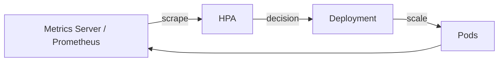
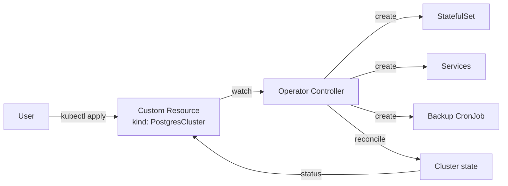

# 🎓 Autoscaling & Operators — HPA, VPA, KEDA, CRD + Controller

> **Tác giả:** Mr.Rom\
> **Phiên bản:** v1.1.0\
> **Tạo lúc:** 24/05/2026\
> **Cập nhật:** 25/05/2026\
> **Level:** Intermediate\
> **Tags:** [MUST-KNOW]\
> **Yêu cầu trước:** [03_statefulset-and-storage.md](03_statefulset-and-storage.md)

> 🎯 *Bài cuối intermediate. Manual `kubectl scale` không kịp với load spike. **HPA** scale pod, **VPA** adjust limits, **Cluster Autoscaler** add node, **KEDA** scale theo external event. Setup Postgres production 30+ YAML = pain — **Operator** abstract complex stateful workload. Bài này dạy cả 2 + viết simple operator.*

## 🎯 Sau bài này bạn sẽ

- [ ] Hiểu **HPA** (Horizontal Pod Autoscaler) — scale theo CPU/RAM/custom metric
- [ ] Hiểu **VPA** (Vertical Pod Autoscaler) — adjust resource request/limit
- [ ] Hiểu **Cluster Autoscaler (CA)** + **Karpenter** — add/remove node
- [ ] Dùng **KEDA** — scale theo queue length, Kafka lag, Cron schedule
- [ ] Hiểu **PDB-HPA interaction** (war story production)
- [ ] Hiểu **Operator pattern** — CRD + Controller reconciliation
- [ ] **Viết simple Operator** (Kubebuilder/Operator SDK)
- [ ] Use **CloudNativePG** Operator cho Postgres production

---

## Tình huống — Black Friday 10x traffic, manual scale không kịp

Sale lớn 11/11 — traffic dự kiến 10x. Bạn:

```bash
# Pre-scale manual
kubectl scale deployment/fastapi --replicas=20

# Traffic spike — CPU 100% → 503 errors
# Phải scale tiếp
kubectl scale deployment/fastapi --replicas=50
# Wait 30s spin up pods...
# Customers timeout 30s ago

# Sale lễ ngày hôm sau, traffic về bình thường
# Quên scale down → trả tiền 50 pod cả ngày
```

Đồng thời, sếp setup Postgres production cluster:
- 1 StatefulSet primary + replica
- 1 Service headless
- 1 ConfigMap tuning
- 1 Secret credentials
- 1 PDB
- 1 CronJob backup
- 1 ServiceMonitor Prometheus
- 1 NetworkPolicy
- Manual primary-replica replication setup
- Manual failover when primary die
- Manual schema migration

→ **30+ YAML files** + 200 dòng custom logic. Maintain qua thời gian = pain.

Sếp: *"HPA + KEDA cho autoscale auto. CloudNativePG Operator cho Postgres. 1 CRD 30 dòng thay 30 file YAML."*

→ Bài cuối intermediate dạy hết.

---

## 1️⃣ HPA — Horizontal Pod Autoscaler

🪞 **Ẩn dụ**: *Autoscaling như **autopilot máy bay** — phi công (SRE) không phải tay điều chỉnh độ cao liên tục theo gió (traffic). Operator như **chuyên gia bệnh viện** — Postgres Operator biết cách backup/restore/failover Postgres mà không cần bạn viết YAML thủ công 200 dòng. Cả 2 = automate expert knowledge.*

### Concept

**HPA** = K8s controller watch metric (CPU/memory/custom) → adjust `replicas` của Deployment/StatefulSet/ReplicaSet.



### Install metrics-server (prerequisite)

HPA **không tự đo** CPU/memory — nó query Metrics API. **metrics-server** là addon scrape kubelet và expose qua API. Không có metrics-server, HPA in `<unknown>` ở cột TARGETS và không scale gì. Cài 1 lần per cluster:

```bash
kubectl apply -f https://github.com/kubernetes-sigs/metrics-server/releases/latest/download/components.yaml

# Verify
kubectl top nodes
# NAME     CPU(cores)   MEMORY(bytes)
# node-1   500m         2Gi

kubectl top pods -n production
```

### HPA basic — CPU

HPA cơ bản scale theo CPU% (utilization vs request). Production cần thêm 3 thứ: **memory metric** (cùng lúc với CPU), **`behavior` block** (kiểm soát tốc độ scale up/down để không thrashing), và `stabilizationWindow` cho scale-down (chờ 5 phút để chắc traffic giảm thật, không spike tạm):

```yaml
apiVersion: autoscaling/v2
kind: HorizontalPodAutoscaler
metadata:
  name: fastapi-hpa
  namespace: production
spec:
  scaleTargetRef:
    apiVersion: apps/v1
    kind: Deployment
    name: fastapi
  minReplicas: 2
  maxReplicas: 50
  metrics:
    - type: Resource
      resource:
        name: cpu
        target:
          type: Utilization
          averageUtilization: 70   # scale up khi CPU > 70%
    - type: Resource
      resource:
        name: memory
        target:
          type: Utilization
          averageUtilization: 80
  behavior:
    scaleUp:
      stabilizationWindowSeconds: 30
      policies:
        - type: Percent
          value: 100              # double pods at once
          periodSeconds: 30
        - type: Pods
          value: 4                # OR add 4 pods at once
          periodSeconds: 30
      selectPolicy: Max
    scaleDown:
      stabilizationWindowSeconds: 300    # wait 5min before scale down
      policies:
        - type: Percent
          value: 10               # remove 10% pods
          periodSeconds: 60
```

→ Behavior:
- CPU > 70% → tăng replicas đến 2x current (or +4), every 30s.
- CPU < threshold for 5min → giảm 10% mỗi phút.

```bash
kubectl get hpa -n production
# NAME          REFERENCE             TARGETS     MINPODS  MAXPODS  REPLICAS
# fastapi-hpa   Deployment/fastapi    45%/70%     2        50       8
```

### HPA với custom metric (Prometheus)

Install **Prometheus Adapter**:

```bash
helm install prometheus-adapter prometheus-community/prometheus-adapter \
  --namespace monitoring \
  --set prometheus.url=http://prometheus.monitoring.svc \
  --set prometheus.port=9090
```

Config adapter expose custom metric:
```yaml
# adapter-config (helm values)
rules:
  custom:
    - seriesQuery: 'http_requests_per_second{namespace!="",pod!=""}'
      resources:
        overrides:
          namespace: {resource: namespace}
          pod: {resource: pod}
      name:
        matches: "^(.*)_per_second$"
        as: "${1}_rate"
      metricsQuery: 'rate(<<.Series>>{<<.LabelMatchers>>}[2m])'
```

HPA reference custom metric:
```yaml
apiVersion: autoscaling/v2
kind: HorizontalPodAutoscaler
metadata:
  name: fastapi-hpa-custom
spec:
  scaleTargetRef:
    apiVersion: apps/v1
    kind: Deployment
    name: fastapi
  minReplicas: 5
  maxReplicas: 100
  metrics:
    - type: Pods
      pods:
        metric:
          name: http_requests_rate
        target:
          type: AverageValue
          averageValue: "100"        # 100 req/sec per pod
```

→ Scale based on actual HTTP load, không phải CPU proxy. Accurate hơn cho web traffic.

---

## 2️⃣ VPA — Vertical Pod Autoscaler

### Concept

**VPA** = adjust pod's `resources.requests/limits` based on actual usage.

→ Use case:
- App memory usage tăng theo time (cache build up).
- Right-size requests để cost optimize (over-request waste).

### Install

VPA không native trong K8s — phải cài từ repo `kubernetes/autoscaler`. Script `vpa-up.sh` deploy 3 component: **Recommender** (gợi ý request size dựa trên history), **Updater** (kill pod cũ để recreate với request mới), **Admission Controller** (mutate pod spec lúc tạo):

```bash
git clone https://github.com/kubernetes/autoscaler.git
cd autoscaler/vertical-pod-autoscaler
./hack/vpa-up.sh
```

### Modes

VPA có 4 chế độ vận hành, từ "chỉ recommend cho người" tới "tự động kill + recreate pod". Production thường bắt đầu với `Off` (đọc recommendation 1-2 tuần) → `Initial` (áp lúc pod tạo mới) → `Auto` khi tin VPA quyết đúng. KHÔNG dùng `Auto` với database (gây downtime liên tục):

| Mode | Behavior |
|---|---|
| `Off` | Recommend only (read recommendation, manual apply) |
| `Initial` | Set requests when pod create (don't update running pod) |
| `Recreate` | Update requests = kill pod + recreate (downtime) |
| `Auto` | Same as Recreate (in 2026 still experimental for in-place) |

### Example

VPA manifest target 1 Deployment + chọn mode. Khai báo `resourcePolicy` để giới hạn min/max (tránh VPA recommend quá thấp hoặc quá cao). Production luôn set `minAllowed.memory` ≥ 256Mi để pod không bị set 50Mi vô lý gây OOM ngay:

```yaml
apiVersion: autoscaling.k8s.io/v1
kind: VerticalPodAutoscaler
metadata:
  name: fastapi-vpa
  namespace: production
spec:
  targetRef:
    apiVersion: apps/v1
    kind: Deployment
    name: fastapi
  updatePolicy:
    updateMode: Auto    # Recreate pods with new requests
  resourcePolicy:
    containerPolicies:
      - containerName: fastapi
        minAllowed:
          cpu: 100m
          memory: 128Mi
        maxAllowed:
          cpu: 2
          memory: 4Gi
        controlledResources: [cpu, memory]
```

VPA observe pod 7 days → recommend:
```bash
kubectl get vpa fastapi-vpa -n production -o yaml
# status:
#   recommendation:
#     containerRecommendations:
#       - containerName: fastapi
#         lowerBound: { cpu: 250m, memory: 384Mi }
#         target:     { cpu: 500m, memory: 512Mi }   # current resources
#         upperBound: { cpu: 1, memory: 1Gi }
```

### ❌ HPA + VPA same target = conflict

→ HPA scale replicas based on CPU%. VPA adjust CPU request. Khi VPA tăng request → CPU% giảm → HPA scale down → real CPU lại tăng → VPA tăng request nữa → loop.

**Fix**: 
- HPA dùng custom metric (HTTP req rate, queue length) **không phải CPU/memory**.
- VPA mode `Off` (recommend only) + manual apply.

→ Best practice 2026: **HPA cho replicas** based on custom metric, **VPA recommend mode** cho right-sizing.

---

## 3️⃣ Cluster Autoscaler vs Karpenter

### Cluster Autoscaler (CA) — Classic

- Add/remove **nodes** trong node group khi pod pending vì insufficient resource.
- Cloud-agnostic (AWS, GCP, Azure, ...).
- **Node group-based**: bạn predefine instance types per ASG/MIG.

### Karpenter (AWS-native, 2026 popular)

- Add/remove nodes **flexibly** — chọn instance type tốt nhất dynamic.
- Faster scale-up (1-2 phút vs 5 phút CA).
- **Provisioner CRD** define constraints (zone, arch, capacity-type spot/on-demand).
- Pod-driven: thấy pod pending → calculate cheapest fit → launch instance.

```yaml
# Karpenter Provisioner
apiVersion: karpenter.sh/v1beta1
kind: NodePool
metadata:
  name: default
spec:
  template:
    spec:
      requirements:
        - key: karpenter.sh/capacity-type
          operator: In
          values: [spot, on-demand]
        - key: kubernetes.io/arch
          operator: In
          values: [amd64, arm64]
        - key: karpenter.k8s.aws/instance-family
          operator: In
          values: [m5, m6i, c5, c6i, t3]
        - key: karpenter.k8s.aws/instance-size
          operator: NotIn
          values: [nano, micro]
      nodeClassRef:
        name: default
  limits:
    cpu: 1000
    memory: 1000Gi
  disruption:
    consolidationPolicy: WhenUnderutilized
    expireAfter: 720h    # rotate nodes weekly for security patches
```

→ Pod pending → Karpenter pick cheapest instance fitting constraints → launch ~60s.

### Cost reality

| Strategy | Saving | Trade-off |
|---|---|---|
| **On-demand only** | $0 baseline | Most expensive |
| **Spot for stateless** | 60-90% off | Spot interruption (2 min warning) |
| **Spot + on-demand mix** | 40-70% off | Balanced |
| **Karpenter + spot** | 50-80% off + faster autoscale | AWS-specific |

→ Karpenter + spot (60%) + on-demand (40%) cho stateless apps = best price/performance 2026 trên AWS.

---

## 4️⃣ KEDA — Event-driven autoscaling

### Vấn đề HPA không giải quyết

HPA scale theo metric **continuous** (CPU, RAM, req/sec). Một số scale signal:
- **RabbitMQ queue length > 1000** → scale worker.
- **Kafka consumer lag > 10000 messages** → scale consumer.
- **Cron schedule** — scale up before 8am, down after 6pm.
- **AWS SQS depth** → scale processor.
- **Cloud function-style**: scale-to-zero when no event.

→ HPA không native support. **KEDA** = K8s Event-Driven Autoscaler.

### KEDA architecture

KEDA chạy như HPA wrapper:
- ScaledObject CRD (KEDA-specific) → KEDA controller → External metrics API → standard HPA → Deployment.

### Install

```bash
helm install keda kedacore/keda --namespace keda --create-namespace
```

### Example: Scale worker by RabbitMQ queue

```yaml
apiVersion: keda.sh/v1alpha1
kind: ScaledObject
metadata:
  name: rabbitmq-worker
  namespace: production
spec:
  scaleTargetRef:
    name: worker                  # Deployment name
  minReplicaCount: 0              # scale-to-zero supported!
  maxReplicaCount: 100
  pollingInterval: 10             # check metric every 10s
  cooldownPeriod: 300             # wait 5min before scale down to 0
  triggers:
    - type: rabbitmq
      metadata:
        host: amqp://rabbitmq.production.svc:5672
        queueName: orders
        queueLength: "10"         # 1 pod per 10 messages
        protocol: amqp
```

→ Queue depth 100 → 10 pods. Queue empty 5min → 0 pods (free resource).

### Other triggers (50+ supported)

```yaml
# Kafka consumer lag
triggers:
  - type: kafka
    metadata:
      bootstrapServers: kafka.prod:9092
      consumerGroup: my-group
      topic: events
      lagThreshold: "100"

# AWS SQS
triggers:
  - type: aws-sqs-queue
    metadata:
      queueURL: https://sqs.us-east-1.amazonaws.com/.../jobs
      queueLength: "5"
      awsRegion: us-east-1
    authenticationRef:
      name: aws-trigger-auth

# Cron schedule
triggers:
  - type: cron
    metadata:
      timezone: Asia/Ho_Chi_Minh
      start: "0 8 * * 1-5"        # Mon-Fri 8am
      end: "0 18 * * 1-5"          # Mon-Fri 6pm
      desiredReplicas: "5"        # min 5 pods business hours

# Prometheus (custom metric)
triggers:
  - type: prometheus
    metadata:
      serverAddress: http://prometheus.monitoring:9090
      metricName: http_requests_total
      query: sum(rate(http_requests_total[1m]))
      threshold: "1000"

# HTTP add-on (request/sec)
triggers:
  - type: external
    metadata:
      scalerAddress: keda-http-add-on-external-scaler.keda:9090
```

→ KEDA support: Kafka, RabbitMQ, AWS (SQS/Kinesis/DynamoDB), GCP (Pub/Sub/Cloud Storage), Azure (Service Bus, Event Hubs), Redis, Cron, Prometheus, custom external scaler.

---

## 5️⃣ PodDisruptionBudget (PDB) — Quan trọng với HPA

### Concept

**PDB** = guarantee N pod available khi **voluntary disruption** (node drain, autoscaler scale-down, upgrade).

### Example

```yaml
apiVersion: policy/v1
kind: PodDisruptionBudget
metadata:
  name: fastapi-pdb
  namespace: production
spec:
  minAvailable: 80%           # always 80% pods available
  # OR: maxUnavailable: 2     # max 2 pods can be down at once
  selector:
    matchLabels:
      app: fastapi
```

→ Khi node drain (k8s node maintenance), K8s drain pods gradually keep 80% running. Nếu drain attempt break PDB → drain stuck, admin alert.

### War story: PDB + HPA conflict

Production incident (`__Ref__/`):
- HPA min=2, max=20, current=10 pods.
- PDB `minAvailable: 9`.
- HPA decide scale down: 10 → 8 pods.
- K8s try evict 2 pods → PDB block (8 < minAvailable 9).
- Eviction stuck → HPA continuously retry scale-down → cluster autoscaler trigger node consolidation → cascade evictions → 500 errors spike.

**Root cause**: PDB `minAvailable` quá close to HPA `minReplicas`.

**Fix**:
- PDB `maxUnavailable: 2` thay `minAvailable` absolute.
- PDB `minAvailable` < HPA `minReplicas` by safe margin (vd HPA min=5, PDB minAvailable=3).
- Test scale-down trên staging trước.

---

## 6️⃣ Operator pattern — CRD + Controller

### Vấn đề StatefulSet thuần

Postgres production cluster cần:
- Primary election (Patroni/Raft).
- Auto failover.
- WAL archiving + base backup → point-in-time recovery (PITR).
- Schema migration safe execution.
- Connection pooling (PgBouncer).
- Monitoring metrics.

→ Viết bằng YAML thuần + custom scripts = 500+ dòng, fragile.

### Operator = CRD + Controller



**Controller pattern**:
1. Watch CR (Custom Resource): `kind: PostgresCluster`.
2. Compare **desired state** (CR spec) với **actual state** (existing resources).
3. Reconcile: create/update/delete resources to match.
4. Loop forever — declarative, self-healing.

### Examples of Operators in 2026

| Operator | Use case |
|---|---|
| **cert-manager** | TLS cert management (bài 02) |
| **prometheus-operator** | Prometheus + ServiceMonitor + Alertmanager |
| **CloudNativePG** | Postgres HA cluster |
| **Strimzi** | Kafka cluster |
| **Velero** | Backup/restore K8s resources + volumes |
| **External Secrets Operator** | Sync secret từ Vault/AWS Secrets Manager |
| **ArgoCD** | GitOps (bài 01 helm intro) |
| **Karpenter** | Node autoscaler (bài 04 §3) |
| **istio-operator** | Service mesh |
| **Trivy Operator** | Continuous CVE scan trong cluster |

→ Hầu hết production K8s 2026 chạy 10+ Operators.

### CRD example — PostgresCluster

```yaml
# Define CRD (one-time, usually shipped với Operator)
apiVersion: apiextensions.k8s.io/v1
kind: CustomResourceDefinition
metadata:
  name: postgresclusters.postgresql.acme.io
spec:
  group: postgresql.acme.io
  names:
    plural: postgresclusters
    singular: postgrescluster
    kind: PostgresCluster
    shortNames: [pgcluster]
  scope: Namespaced
  versions:
    - name: v1
      served: true
      storage: true
      schema:
        openAPIV3Schema:
          type: object
          properties:
            spec:
              type: object
              properties:
                instances: { type: integer, minimum: 1, maximum: 10 }
                version: { type: string }
                storage:
                  type: object
                  properties:
                    size: { type: string }
                    storageClass: { type: string }
              required: [instances, version]
            status:
              type: object
              properties:
                phase: { type: string }
                primary: { type: string }
                replicas: { type: integer }
      additionalPrinterColumns:
        - name: Phase
          type: string
          jsonPath: .status.phase
        - name: Primary
          type: string
          jsonPath: .status.primary
```

### Use CR

```yaml
apiVersion: postgresql.acme.io/v1
kind: PostgresCluster
metadata:
  name: acme-db
  namespace: production
spec:
  instances: 3
  version: "16"
  storage:
    size: 100Gi
    storageClass: gp3-encrypted
```

```bash
kubectl get pgcluster -n production
# NAME       PHASE     PRIMARY      REPLICAS  AGE
# acme-db    Running   acme-db-1    3         10m
```

→ User CRUD ngắn gọn. Controller làm hết bên dưới (StatefulSet + Services + ConfigMap + Secret + Job migration + backup CronJob).

---

## 7️⃣ Hands-on: Write simple operator với Kubebuilder

### Setup

```bash
# Install kubebuilder
brew install kubebuilder

# Init project
mkdir my-operator && cd my-operator
kubebuilder init --domain=acme.io --repo=github.com/acme/my-operator

# Create API
kubebuilder create api --group webapp --version v1 --kind Echo
```

### Define spec (api/v1/echo_types.go)

```go
type EchoSpec struct {
    Message  string `json:"message"`
    Replicas int32  `json:"replicas"`
}

type EchoStatus struct {
    Phase string `json:"phase"`
    Pods  int32  `json:"pods"`
}
```

### Implement reconcile logic (internal/controller/echo_controller.go)

```go
func (r *EchoReconciler) Reconcile(ctx context.Context, req ctrl.Request) (ctrl.Result, error) {
    logger := log.FromContext(ctx)

    // 1. Fetch Echo CR
    var echo webappv1.Echo
    if err := r.Get(ctx, req.NamespacedName, &echo); err != nil {
        return ctrl.Result{}, client.IgnoreNotFound(err)
    }

    // 2. Define desired Deployment
    desiredDeploy := &appsv1.Deployment{
        ObjectMeta: metav1.ObjectMeta{
            Name:      echo.Name,
            Namespace: echo.Namespace,
        },
        Spec: appsv1.DeploymentSpec{
            Replicas: &echo.Spec.Replicas,
            Selector: &metav1.LabelSelector{
                MatchLabels: map[string]string{"app": echo.Name},
            },
            Template: corev1.PodTemplateSpec{
                ObjectMeta: metav1.ObjectMeta{
                    Labels: map[string]string{"app": echo.Name},
                },
                Spec: corev1.PodSpec{
                    Containers: []corev1.Container{{
                        Name:    "echo",
                        Image:   "ealen/echo-server:latest",
                        Env: []corev1.EnvVar{
                            {Name: "MESSAGE", Value: echo.Spec.Message},
                        },
                        Ports: []corev1.ContainerPort{{ContainerPort: 80}},
                    }},
                },
            },
        },
    }

    // 3. Set ownership (auto-cleanup when Echo deleted)
    if err := ctrl.SetControllerReference(&echo, desiredDeploy, r.Scheme); err != nil {
        return ctrl.Result{}, err
    }

    // 4. Create or Update Deployment
    var existingDeploy appsv1.Deployment
    err := r.Get(ctx, types.NamespacedName{Name: echo.Name, Namespace: echo.Namespace}, &existingDeploy)
    if errors.IsNotFound(err) {
        // Create
        logger.Info("Creating Deployment", "name", echo.Name)
        if err := r.Create(ctx, desiredDeploy); err != nil {
            return ctrl.Result{}, err
        }
    } else if err != nil {
        return ctrl.Result{}, err
    } else {
        // Update if spec differs
        if *existingDeploy.Spec.Replicas != echo.Spec.Replicas {
            logger.Info("Updating Deployment", "replicas", echo.Spec.Replicas)
            existingDeploy.Spec.Replicas = &echo.Spec.Replicas
            if err := r.Update(ctx, &existingDeploy); err != nil {
                return ctrl.Result{}, err
            }
        }
    }

    // 5. Update Echo status
    echo.Status.Phase = "Running"
    echo.Status.Pods = echo.Spec.Replicas
    if err := r.Status().Update(ctx, &echo); err != nil {
        return ctrl.Result{}, err
    }

    return ctrl.Result{}, nil
}
```

### Build + deploy

```bash
# Generate manifests (CRD, RBAC)
make manifests

# Install CRD
make install

# Run controller locally (dev)
make run

# Or deploy in cluster
make docker-build docker-push IMG=ghcr.io/acme/my-operator:v1
make deploy IMG=ghcr.io/acme/my-operator:v1
```

### Test

```yaml
# echo-cr.yaml
apiVersion: webapp.acme.io/v1
kind: Echo
metadata:
  name: hello
spec:
  message: "Hello from Operator"
  replicas: 3
```

```bash
kubectl apply -f echo-cr.yaml

kubectl get echo
# NAME    PHASE     PODS  AGE
# hello   Running   3     1m

kubectl get deploy
# NAME    READY   UP-TO-DATE   AVAILABLE
# hello   3/3     3            3
```

→ Operator created Deployment from CR.

Test reconciliation:
```bash
# Manually delete pod
kubectl delete pod -l app=hello

# Watch — controller recreate (via Deployment)
kubectl get pods -l app=hello -w
```

→ Self-healing: operator constantly reconcile desired state.

---

## 8️⃣ CloudNativePG — Production Postgres Operator

### Install

```bash
kubectl apply --server-side -f https://raw.githubusercontent.com/cloudnative-pg/cloudnative-pg/release-1.22/releases/cnpg-1.22.0.yaml

# Verify
kubectl get pods -n cnpg-system
# cnpg-controller-manager-xxx   1/1 Running
```

### Deploy Postgres cluster

```yaml
apiVersion: postgresql.cnpg.io/v1
kind: Cluster
metadata:
  name: acme-pg
  namespace: production
spec:
  instances: 3
  primaryUpdateStrategy: unsupervised
  
  bootstrap:
    initdb:
      database: acme
      owner: acme
      secret:
        name: acme-pg-credentials
  
  storage:
    storageClass: gp3-encrypted
    size: 100Gi
  
  postgresql:
    parameters:
      max_connections: "200"
      shared_buffers: "256MB"
      effective_cache_size: "1GB"
      wal_level: "replica"
  
  monitoring:
    enablePodMonitor: true     # Prometheus scrape
  
  backup:
    barmanObjectStore:
      destinationPath: s3://acme-backups/postgres/
      s3Credentials:
        accessKeyId:
          name: aws-creds
          key: ACCESS_KEY_ID
        secretAccessKey:
          name: aws-creds
          key: SECRET_ACCESS_KEY
      wal:
        compression: gzip
        maxParallel: 8
    retentionPolicy: "30d"
  
  affinity:
    enablePodAntiAffinity: true
    topologyKey: kubernetes.io/hostname
  
  resources:
    requests:
      memory: "512Mi"
      cpu: "500m"
    limits:
      memory: "2Gi"
      cpu: "2"
```

Apply:
```bash
kubectl create secret generic acme-pg-credentials \
  --from-literal=username=acme \
  --from-literal=password=$(openssl rand -base64 32) \
  -n production

kubectl apply -f acme-pg.yaml

# Watch cluster come up
kubectl get cluster -n production -w
# NAME      AGE   INSTANCES   READY   STATUS                  PRIMARY
# acme-pg   30s   3           1       Setting up primary      acme-pg-1
# acme-pg   1m    3           2       Creating replica 2      acme-pg-1
# acme-pg   2m    3           3       Cluster in healthy state  acme-pg-1
```

### Test failover

```bash
# Force delete primary
kubectl delete pod acme-pg-1 -n production

# Watch failover
kubectl get cluster -n production -w
# acme-pg   ...   3           3       Failing over           acme-pg-1
# acme-pg   ...   3           3       Promoting replica      acme-pg-2  ← new primary!
# acme-pg   ...   3           3       Cluster in healthy state  acme-pg-2
```

→ Operator detect primary failure, promote replica, ~30s downtime.

### Point-in-time recovery

```yaml
apiVersion: postgresql.cnpg.io/v1
kind: Cluster
metadata:
  name: acme-pg-restored
spec:
  instances: 3
  bootstrap:
    recovery:
      source: acme-pg
      recoveryTarget:
        targetTime: "2026-05-24 10:30:00.000+00"   # restore to specific time
  externalClusters:
    - name: acme-pg
      barmanObjectStore:
        destinationPath: s3://acme-backups/postgres/
        s3Credentials: ...
```

→ Recover database state at exact timestamp from S3 backups. Operator handle WAL replay.

---

## 💡 Cạm bẫy thường gặp & Best practice

### ❌ Cạm bẫy: HPA + VPA same target

(Đã giải thích §2). Loop infinite.

→ **Fix**: HPA dùng custom metric (req/sec), VPA `Off` mode.

### ❌ Cạm bẫy: HPA scale too aggressive

```yaml
behavior:
  scaleUp:
    policies:
      - type: Percent
        value: 1000   # 10x instant
```

→ Spike resource → autoscaler add nodes → cost spike. Or pod start cùng lúc → DB connection pool exhausted.

→ **Fix**: `stabilizationWindowSeconds: 30+` + `scaleUp` reasonable (100-200%).

### ❌ Cạm bẫy: PDB minAvailable too high vs HPA minReplicas

(War story §5). Block HPA scale-down → stuck.

→ **Fix**: PDB `maxUnavailable` thay `minAvailable`. Hoặc PDB minAvailable < HPA minReplicas - 2.

### ❌ Cạm bẫy: KEDA scale-to-zero break healthcheck

→ Pod scaled to 0, K8s service endpoint empty → upstream LB → 503.

→ **Fix**:
- KEDA HTTP add-on: handle wake-up khi request đến.
- Hoặc `minReplicaCount: 1` (keep 1 pod always).

### ❌ Cạm bẫy: Operator update CRD spec → break existing CR

→ Bump major version operator CRD schema → existing CR validation fail.

→ **Fix**: 
- CRD versioning: keep `v1` storage true + add `v1beta1` conversion webhook.
- Test upgrade trên staging cluster trước.

### ❌ Cạm bẫy: Custom operator infinite reconcile loop

```go
// Update CR status mỗi reconcile
echo.Status.LastReconciled = metav1.Now()    // ← trigger watch again
r.Status().Update(ctx, &echo)
```

→ Update status = trigger watch event = reconcile again = update status again. Loop.

→ **Fix**: Only update status when actual change. Use `equality.Semantic.DeepEqual` để check.

### ✅ Best practice: Resource requests = baseline, limits = max burst

```yaml
resources:
  requests:
    cpu: 200m       # K8s scheduler placement decision
    memory: 256Mi
  limits:
    cpu: 1000m      # max burst — pod throttle if exceed
    memory: 512Mi   # hard limit — pod OOM-killed if exceed
```

→ Request realistic, limit generous (1.5-2x request). HPA scale before hitting limit.

### ✅ Best practice: Karpenter cho heterogeneous workload

Different deployment types → different node types:
- Web tier: t-series (burst CPU) + spot.
- Batch job: c-series (compute) + spot.
- Database: m-series (balanced) + on-demand.
- AI/ML: g-series (GPU) + spot.

Karpenter pick per pod, vs CA fixed node group.

### ✅ Best practice: Operator over manual StatefulSet for stateful

Production database/Kafka/Elasticsearch → use Operator. Trade learning curve for ops automation.

---

## 🧠 Tự kiểm tra (Self-check)

**Q1.** Khi nào dùng HPA, KEDA, VPA — và conflict gì giữa chúng?

<details>
<summary>💡 Đáp án</summary>

**HPA**: continuous metric (CPU/memory/HTTP req-rate). Best for web traffic.

**KEDA**: event-driven (queue depth, Kafka lag, Cron). Best for batch worker, scheduled scale.

**VPA**: adjust pod resource request/limit. Best for right-sizing.

**Conflict matrix**:
| Combo | Status | Why |
|---|---|---|
| HPA + KEDA | OK | KEDA wraps HPA internally (1 controller) |
| HPA (CPU) + VPA (Auto) | ❌ | Loop: VPA increase CPU req → HPA see CPU% drop → scale down → real CPU spike → VPA again |
| HPA (custom) + VPA (Off) | ✅ | VPA recommend, HPA scale on app metric |
| HPA + CA + Karpenter | ✅ | HPA decide pod count; CA/Karpenter add nodes if needed |

**Recommend stack 2026**: HPA (custom metric) + KEDA (event-driven workload) + VPA (recommend mode) + Karpenter (node).
</details>

**Q2.** Why **scale-to-zero** powerful but tricky?

<details>
<summary>💡 Đáp án</summary>

**Power**: 
- Cost savings — không pay khi không có traffic.
- Like serverless on K8s — useful for staging, dev, batch worker.

**Tricky**:
1. **Cold start latency**: 0 → 1 pod cần pull image + container start + app warmup = 10-60s. First request after idle = slow.
2. **Service endpoint empty**: K8s Service no endpoints → upstream LB → 503/connection refused.
3. **Connection retry**: client retry burst hit single pod = overload.
4. **Healthcheck race**: pod start vs k8s adding to Service endpoints — request before Ready = 502.

**Mitigations**:
- **KEDA HTTP add-on**: HTTPScaledObject — intercept request, scale-up pod, wait Ready, then forward request. Customer transparent (500ms-2s cold start hidden).
- **Knative**: serverless on K8s, request-driven scale + activator.
- **minReplicaCount: 1**: keep 1 pod alive (warm) — small cost, huge UX benefit.

→ Production user-facing: prefer 1 min replica. Background worker (queue consumer): scale-to-zero OK.
</details>

**Q3.** PDB `minAvailable: 80%` vs `maxUnavailable: 2` — same scale, different behavior khi?

<details>
<summary>💡 Đáp án</summary>

5-pod Deployment:

**`minAvailable: 80%`** → 80% of 5 = **4 pods always available**.
- Maxunavailable allowed = 5 - 4 = 1.
- Scale down: HPA wants 3 pods → can't (would only have 3 < 4). Stuck.

**`maxUnavailable: 2`** → max 2 pods can be down.
- Min available = 5 - 2 = 3.
- Scale down: HPA wants 3 pods → 5 → 3 = remove 2. Allowed (within max 2).

**Different behavior on auto-scaling**:
- `minAvailable absolute` (e.g., `4`) — pin lower bound, regardless of current scale.
- `minAvailable %` — adjust với scale (4 of 5, 8 of 10).
- `maxUnavailable absolute` — only limit how many pods can disrupt at once.

**Recommend**: `maxUnavailable: 1` or `2` cho most cases — predictable, doesn't conflict với HPA scale-down.
</details>

**Q4.** Operator vs Helm chart — khi dùng cái nào?

<details>
<summary>💡 Đáp án</summary>

**Helm chart** = packaging + templating. Render YAML một lần khi `helm install/upgrade`. **Stateless deployment**.

**Operator** = runtime controller. Continuously reconcile state, react to events, manage lifecycle. **Living management**.

**Helm khi**:
- Deploy app stateless (FastAPI, web frontend).
- 1-time config + occasional upgrade.
- Don't need runtime intelligence.

**Operator khi**:
- Stateful workload với complex lifecycle (Postgres, Kafka, Elasticsearch).
- Continuous reconciliation needed (cert renewal, failover, backup scheduling).
- Domain-specific operations (DB migration, vacuum, primary election).

**Hybrid (common)**:
- Use Helm to **install Operator** itself (operator deployment chart).
- Use Operator's CRD for stateful workload (CR YAML).

Example flow:
```bash
# 1. Helm install CloudNativePG operator
helm install cnpg cnpg/cloudnative-pg --namespace cnpg-system --create-namespace

# 2. Apply CR managed by operator
kubectl apply -f acme-pg-cluster.yaml
```

→ Best of both worlds.
</details>

**Q5.** Karpenter vs Cluster Autoscaler — khi nào pick Karpenter?

<details>
<summary>💡 Đáp án</summary>

**Pick Karpenter when**:
1. **Heterogeneous workload**: different pod types need different instance types. Karpenter pick per pod; CA stuck với node group instance types.
2. **Speed**: Karpenter scale-up ~60s vs CA 5+ phút.
3. **Cost optimization**: Karpenter consolidation (merge underutilized nodes) + spot integration.
4. **AWS-specific**: Karpenter is AWS-native. GKE has built-in equivalent (Autopilot Node Auto-Provisioning). Azure has AKS Karpenter (beta).

**Stick CA when**:
1. Multi-cloud or non-AWS (CA cloud-agnostic).
2. Simple workload (homogeneous instance types).
3. Already setup, no migration appetite.

**Realistic 2026**: AWS production new clusters → Karpenter. Multi-cloud → CA. Migration CA → Karpenter là project ~weeks (rewrite NodePool configs, test, drain old).
</details>

---

## ⚡ Tra cứu nhanh (Cheatsheet)

```bash
# === HPA ===
kubectl get hpa -A
kubectl describe hpa <name>
kubectl edit hpa <name>                  # adjust min/max
kubectl autoscale deployment <name> --min=2 --max=10 --cpu-percent=70

# === VPA ===
kubectl get vpa
kubectl describe vpa <name>
kubectl get vpa <name> -o yaml | grep recommendation -A 20

# === KEDA ===
kubectl get scaledobject -A
kubectl describe scaledobject <name>
kubectl get hpa | grep keda-hpa          # KEDA-managed HPA

# === PDB ===
kubectl get pdb -A
kubectl describe pdb <name>

# === Cluster Autoscaler ===
kubectl logs -n kube-system -l app=cluster-autoscaler
kubectl get nodes
kubectl describe node <name>             # capacity + allocated

# === Karpenter ===
kubectl get nodepool
kubectl get nodeclaim                    # nodes managed by Karpenter
kubectl get ec2nodeclass                 # AWS-specific config

# === Operators ===
kubectl get crd                          # all CRDs
kubectl api-resources --api-group=<group>  # CRDs in group
kubectl explain <kind>.spec              # CRD schema

# === Custom Resource ===
kubectl get pgcluster                    # CloudNativePG
kubectl get certificate                  # cert-manager
kubectl get servicemonitor                # prometheus-operator
```

```yaml
# === HPA quick template ===
apiVersion: autoscaling/v2
kind: HorizontalPodAutoscaler
spec:
  scaleTargetRef: { apiVersion: apps/v1, kind: Deployment, name: <app> }
  minReplicas: 2
  maxReplicas: 20
  metrics:
    - type: Resource
      resource: { name: cpu, target: { type: Utilization, averageUtilization: 70 } }

# === KEDA quick template ===
apiVersion: keda.sh/v1alpha1
kind: ScaledObject
spec:
  scaleTargetRef: { name: <deployment> }
  minReplicaCount: 1
  maxReplicaCount: 50
  triggers:
    - type: <trigger>
      metadata: { ... }

# === PDB ===
apiVersion: policy/v1
kind: PodDisruptionBudget
spec:
  maxUnavailable: 1
  selector: { matchLabels: { app: <name> } }
```

---

## 📚 Từ Điển Thuật Ngữ (Glossary)

| Term | Vietnamese / Explanation |
|---|---|
| **HPA** | Horizontal Pod Autoscaler — scale replica count theo metric |
| **VPA** | Vertical Pod Autoscaler — adjust pod resource request/limit |
| **Cluster Autoscaler (CA)** | Add/remove node theo demand (cloud-agnostic) |
| **Karpenter** | Modern node autoscaler (AWS-native, pod-driven, flexible) |
| **KEDA** | Kubernetes Event-Driven Autoscaler — scale theo external event |
| **metrics-server** | Aggregate basic resource metrics (CPU/RAM) cho HPA |
| **Prometheus Adapter** | Expose Prometheus metric như K8s custom metric (cho HPA) |
| **PDB** | PodDisruptionBudget — guarantee N pod available khi voluntary disruption |
| **ScaledObject** | KEDA CRD — scale config theo trigger |
| **CRD** | Custom Resource Definition — extend K8s API |
| **Custom Resource (CR)** | Instance of CRD (như `kind: PostgresCluster`) |
| **Controller** | Reconciliation loop — watch CR, adjust real state to match desired |
| **Operator** | CRD + Controller pattern — automate complex stateful workload |
| **Kubebuilder** | Framework write Operator in Go (Red Hat origin) |
| **Operator SDK** | Alternative framework write Operator (multi-language support) |
| **CloudNativePG** | Postgres Operator (CNCF) — HA, backup, PITR built-in |
| **Reconciliation** | Loop control logic: compare desired vs actual, take action |
| **Finalizer** | Pre-delete hook — cleanup external resource before CR deletion |
| **Webhook** | Validating/Mutating admission webhook cho CRD |

---

## 🔗 Liên kết & Tài nguyên

### 🧭 Định hướng lộ trình học
- ⬅️ **Bài trước:** [StatefulSet & Storage — Postgres trong K8s, không mất data](03_statefulset-and-storage.md)
- ↑ **Về cụm:** [Kubernetes README](../../README.md)
- 🎯 Hoàn thành Kubernetes intermediate cluster!

### 🧩 Các chủ đề có thể bạn quan tâm
- 📊 [Observability Prometheus](../../../observability/lessons/01_basic/01_metrics-prometheus.md) — metrics source cho HPA custom
- 🐳 [Docker intermediate Security](../../../docker/lessons/02_intermediate/02_image-security-supply-chain.md) — operator-driven scan (Trivy operator)
- 🔁 [CI/CD basic Deploy strategies](../../../ci-cd/lessons/01_basic/04_deploy-strategies.md) — autoscale interact với deploy
- 🗄️ [PostgreSQL basic](../../../../06_databases/postgresql/) — Postgres concepts

### 🌐 Tài nguyên tham khảo khác
- 📖 [HPA docs](https://kubernetes.io/docs/tasks/run-application/horizontal-pod-autoscale/)
- 📖 [VPA GitHub](https://github.com/kubernetes/autoscaler/tree/master/vertical-pod-autoscaler)
- ↑ **Về cụm:** [Cluster Autoscaler docs](https://github.com/kubernetes/autoscaler/tree/master/cluster-autoscaler)
- 📖 [Karpenter docs](https://karpenter.sh/)
- 📖 [KEDA docs](https://keda.sh/docs/) — 50+ triggers
- 📖 [Operator framework](https://operatorframework.io/)
- 📖 [Kubebuilder book](https://book.kubebuilder.io/)
- 📖 [CloudNativePG docs](https://cloudnative-pg.io/documentation/)
- 📖 [Operator best practices](https://sdk.operatorframework.io/docs/best-practices/)
- 📖 [Awesome Operators list](https://operatorhub.io/) — marketplace

---

## 📌 Nhật ký thay đổi (Changelog)

- **v1.0.0 (24/05/2026)** — Bản đầu tiên. Lesson 04 — bài cuối intermediate. HPA (CPU/custom metric) + VPA + Cluster Autoscaler + Karpenter + KEDA event-driven + PDB-HPA war story (apply insight `__Ref__/`) + Operator pattern (CRD + Controller) + write simple operator với Kubebuilder + use CloudNativePG production-grade Postgres. 6 pitfall + 3 best practice + 5 self-check + cheatsheet đầy đủ.
- **v1.1.0 (25/05/2026)** — Apply Blueprint v0.5.4+ §3.6: thêm lead-in trước Install metrics-server + HPA basic CPU + VPA Install + Modes + Example.
