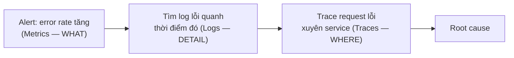

# 🎓 Observability là gì? — 3 pillars + monitoring landscape

> **Tác giả:** Mr.Rom\
> **Phiên bản:** v1.1.2\
> **Tạo lúc:** 23/05/2026\
> **Cập nhật:** 11/06/2026\
> **Level:** Basic\
> **Tags:** [MUST-KNOW]\
> **Yêu cầu trước:** [Kubernetes basics](../../../kubernetes/), [HTTP](../../../../05_networking/http-https/)

> 🎯 *Bài INTRO. Hiểu **observability** (3 pillars: metrics + logs + traces), **vs monitoring** (passive vs proactive), **landscape 2026** (Prometheus + Grafana + Loki + Tempo + Jaeger + Datadog + Honeycomb), **SLI/SLO/SLA**, **OpenTelemetry**. KHÔNG dạy Prometheus deep (bài 01).*

## 🎯 Sau bài này bạn sẽ

- [ ] Phân biệt **monitoring** vs **observability**
- [ ] **3 pillars**: metrics, logs, traces
- [ ] Hiểu **SLI / SLO / SLA**
- [ ] So sánh **6 tools** chính 2026
- [ ] **OpenTelemetry** — chuẩn vendor-neutral 2026
- [ ] **Vendor SaaS** (Datadog, NewRelic) vs **OSS** (Prometheus stack)
- [ ] **Cost** awareness — log storage = big bill
- [ ] **USE / RED / Four Golden Signals** patterns

---

## Tình huống — Bạn deploy production crash, không biết vì sao

Bạn deploy FastAPI lên K8s. Pod restart liên tục.

```bash
kubectl describe pod fastapi-xxx
# Reason: OOMKilled

kubectl logs fastapi-xxx
# (Just the last few stdout lines — no history before crash)
```

Bạn ngơ:
- **OOM** sao xảy ra? RAM tăng dần?
- Request nào trigger spike?
- Bao nhiêu user impact?
- Khi nào bắt đầu lỗi?

Tools manual không trả lời. Cần:
- 📊 **Time-series metrics** (RAM/CPU over time).
- 📜 **Aggregated logs** (search "error" trong 1 giờ).
- 🔍 **Distributed traces** (request → DB query → Redis → external API).

Senior:
> *"Đây là **observability**. 3 pillars: **metrics + logs + traces**. Production app không có = mù. Setup 1 lần, debug năm sau vẫn tận hưởng."*

→ Bài này tổng quan. Bài 01-04 đi sâu Prometheus, Loki, OTel, Grafana.

---

## 1️⃣ Monitoring vs Observability

2 khái niệm hay bị nhầm lẫn nhưng có sự khác biệt rõ ràng — Monitoring trả lời "broken?" (binary), Observability trả lời "**why** broken?" (root cause). Modern microservices/K8s/cloud require observability vì system phức tạp:

| Aspect | Monitoring | Observability |
|---|---|---|
| Focus | "Is it broken?" | "**Why** broken?" |
| Type | Reactive | Proactive (investigate unknown) |
| Data | Pre-defined dashboards | Rich data + query |
| Era | 2000s | 2020s+ |
| Example | "CPU > 80% alert" | "Why P99 latency spike yesterday?" |

→ **Monitoring** = subset of observability. Modern systems need observability vì:
- **Microservices** — 50+ services, can't pre-monitor everything.
- **K8s** — pods ephemeral, can't `ssh` and `top`.
- **Cloud** — vendor manages infra, you observe.

> 🧠 **Ẩn dụ — Monitoring vs Observability:**
> - **Monitoring** = đèn báo trên xe ("Check engine" ON).
> - **Observability** = mở capot, đọc tất cả sensors, biết **why** đèn ON.

---

## 2️⃣ 3 Pillars — Metrics, Logs, Traces

### Pillar 1 — **Metrics** (số đo theo thời gian)

Metrics là **số liệu numeric** thay đổi theo thời gian — CPU, RPS, error rate, latency. Pre-aggregated, low storage, query nhanh. Đây là dashboards + alerts truyền thống dựa trên:

```
CPU usage = 65%
HTTP requests/s = 1200
DB connections = 45
Error rate = 0.5%
```

- **Aggregated** — pre-computed counters/gauges.
- **Time-series** database (Prometheus, InfluxDB).
- Low storage cost.
- Fast query.

**Use case**: dashboards, alerts, trends.

**Tools**: **Prometheus**, InfluxDB, Datadog Metrics, CloudWatch.

### Pillar 2 — **Logs** (event records)

Logs là **detail events** từng phút từng giây — what happened, when. Trả lời câu hỏi *cụ thể* về 1 event. Storage cao hơn metrics, query chậm hơn nếu không index. Ví dụ điển hình:

```
2026-05-23 14:32:01 ERROR fastapi:1234 OOMKilled
2026-05-23 14:32:02 INFO  fastapi:1235 Restarting
2026-05-23 14:32:05 ERROR fastapi:1236 connection refused
```

- **Detailed events** — what + when.
- **Searchable** text.
- High storage cost (verbose).
- Slow at scale unless indexed.

**Use case**: debug specific events, audit.

**Tools**: **Loki**, ELK (Elasticsearch+Logstash+Kibana), Splunk, Datadog Logs, CloudWatch.

### Pillar 3 — **Traces** (luồng request)

Traces theo dõi 1 request **xuyên qua nhiều service** — root cause cho latency. Particularly critical cho microservices nơi 1 request đi qua 5-20 service. Ví dụ tracing 1 request:

```
Request abc-123 [200ms total]
  ├─ FastAPI handler        [10ms]
  ├─ Postgres query (5x)    [120ms]
  ├─ Redis cache           [5ms]
  └─ External API call     [60ms]
```

- **Distributed** — follow request across services.
- **Spans** with parent-child relationships.
- Medium cost.

**Use case**: latency root cause, microservices debug.

**Tools**: **Jaeger**, Tempo, Datadog APM, Honeycomb, Zipkin.

### Tổng kết

Mỗi pillar trả lời 1 loại câu hỏi khác nhau — cần **cả 3** mới observability đầy đủ. Mnemonic dễ nhớ:

```
Metrics   — "WHAT happens" (aggregated)
Logs      — "WHEN + DETAIL" (events)
Traces    — "WHERE in flow" (cross-service)
```

→ All 3 needed. Each tool good for **one question type**.

Trừu tượng nhất là cách 3 pillars **hợp lực** trong 1 phiên debug thật — mỗi pillar trả lời 1 câu rồi chuyền tiếp cho pillar kế. Sơ đồ dưới mô phỏng luồng điều tra điển hình:



→ Metrics phát hiện *có chuyện*, logs cho *chi tiết event*, traces chỉ ra *đoạn nào trong flow* — thiếu 1 mắt xích là chuỗi điều tra đứt giữa chừng.

---

## 3️⃣ SLI / SLO / SLA

### SLI — Service Level Indicator

**SLI** = số đo cụ thể: "what we measure".

```
SLI: availability = (successful requests / total requests) * 100%
SLI: latency = P99 response time
SLI: error rate = (5xx responses / all responses)
SLI: throughput = requests / second
```

### SLO — Service Level Objective

**SLO** = target nội bộ: "what we aim for".

```
SLO: 99.9% availability over 30 days
SLO: P99 latency < 500ms
SLO: error rate < 0.1%
```

### SLA — Service Level Agreement

**SLA** = contractual promise: "what we promise customer + penalty if break".

```
SLA: 99.5% uptime per month (else: refund credits)
```

→ **SLO > SLA**. Internal target tighter than promise (buffer for incidents).

### Error budget

```
SLO: 99.9% uptime = 43 min downtime/month allowed
Used: 30 min downtime so far this month
Remaining: 13 min error budget

If budget burned → freeze deploys, focus stability.
```

🪞 **Ẩn dụ**: *Error budget như **bình xăng** cho velocity. SLO 99.9% = 43 phút "xăng" mỗi tháng. Deploy risky = đốt xăng. Hết xăng → cấm deploy mới, chỉ sửa bug ổn định lại. Còn xăng → tự do ship feature.*

**Bảng SLO ↔ downtime** (cheatsheet để chọn SLO realistic):

| SLO target | Downtime/tháng | Downtime/năm | Khi nào chọn |
|---|---|---|---|
| 99% | 7h 18m | 3.65 ngày | Internal tool, MVP, dev env |
| 99.5% | 3h 39m | 1.83 ngày | Beta, low-stakes app |
| 99.9% (3 nines) | 43m 12s | 8.76h | **Default cho startup production** |
| 99.95% | 21m 36s | 4.38h | Critical SaaS, business hours strict |
| 99.99% (4 nines) | 4m 19s | 52m 36s | Banking, payment, healthcare |
| 99.999% (5 nines) | 25.9s | 5m 15s | Telco, life-critical (đắt khủng khiếp) |

→ Trade-off: **reliability vs velocity**. Burn budget fast → reduce deploys. Plenty left → ship features.

→ Sách "Site Reliability Engineering" (Google) bible.

---

## 4️⃣ Bối cảnh 2026 — Tools

### OSS stack (khuyến nghị)

| Tool | Pillar | Notes |
|---|---|---|
| **Prometheus** | Metrics | Pull-based, time-series DB |
| **Grafana** | Visualization | Dashboards for all 3 pillars |
| **Loki** | Logs | "Prometheus for logs" — label-based |
| **Tempo** | Traces | Grafana's tracing backend |
| **Jaeger** | Traces | CNCF, OG distributed tracing |
| **OpenTelemetry** | All 3 | **Vendor-neutral standard** instrumentation |
| **Alertmanager** | Alerts | Routes alerts from Prometheus |

→ **Grafana stack** ("LGTM": Loki + Grafana + Tempo + Mimir) = OSS modern default.

### SaaS thương mại

| Tool | Pricing | Notes |
|---|---|---|
| **Datadog** | $$$$ | Most popular, full-stack |
| **New Relic** | $$$ | APM focus, full-stack |
| **Honeycomb** | $$ | Best traces, observability focus |
| **Grafana Cloud** | $$ | Managed Grafana stack |
| **Lightstep / ServiceNow** | $$$ | Enterprise traces |
| **Sentry** | $ | Error tracking + traces |
| **Better Stack** | $ | Uptime + logs |

### Cloud-native

| Cloud | Native |
|---|---|
| AWS | CloudWatch (metrics + logs) + X-Ray (traces) |
| GCP | Cloud Monitoring + Cloud Logging + Cloud Trace |
| Azure | Azure Monitor + Application Insights |

### Chọn tools

| Scenario | Stack |
|---|---|
| **Startup OSS** | Prometheus + Grafana + Loki + OTel |
| **Startup velocity** | **Datadog** (1-click, $$ but saves ops) |
| **Enterprise compliance** | Splunk (logs) + Datadog (APM) |
| **K8s heavy** | Prometheus + Grafana on K8s |
| **Cost-sensitive** | OSS self-host |

→ **2026 trend**: OpenTelemetry instrumentation → ship to any vendor. Avoid vendor lock-in.

---

## 5️⃣ OpenTelemetry — Vendor-neutral standard 2026

**Problem**: instrument app for Datadog → switch to NewRelic → rewrite all instrumentation. Vendor lock-in.

**Solution**: **OpenTelemetry (OTel)** — CNCF standard instrumentation. App emit data ở định dạng OTel → ship to any vendor.

```python
# Python — OpenTelemetry instrumented FastAPI
from opentelemetry.instrumentation.fastapi import FastAPIInstrumentor
from opentelemetry.instrumentation.sqlalchemy import SQLAlchemyInstrumentor

FastAPIInstrumentor.instrument_app(app)
SQLAlchemyInstrumentor().instrument(engine=engine)

# Trace context auto-propagated. Spans created. Export to OTel Collector.
```

### Các thành phần

```
App → OTel SDK → OTel Collector → Vendor (Datadog | Prometheus | Tempo | ...)
                                   ↑ Configurable export
```

| Component | Purpose |
|---|---|
| **SDK** | Language SDK instrument app (Python, Node, Go, Java, ...) |
| **Auto-instrumentation** | Magic — instrument without code change |
| **Collector** | Receive, process, export OTel data |
| **Receivers** | Input (OTLP, Prometheus, Jaeger, ...) |
| **Exporters** | Output (vendor backends) |

### Auto-instrumentation

```bash
# Python
pip install opentelemetry-distro
opentelemetry-bootstrap --action=install
opentelemetry-instrument python app.py
```

→ Zero code change. Captures FastAPI/Flask, DB drivers, HTTP libs, Redis, etc.

### Mức độ phổ biến OTel 2026

- ✅ CNCF graduated (2024).
- ✅ Replacing OpenTracing + OpenCensus.
- ✅ Most vendors support (Datadog, NewRelic, Honeycomb, Tempo).
- ✅ **Default 2026** cho new instrumentation.

→ **Quy tắc 2026**: instrument với OTel. Ship to vendor of choice. Switch vendor = config change.

---

## 6️⃣ Cost awareness — Observability gets expensive

### Logs = $$$

- Production app produces **10GB-1TB+ logs/day**.
- Datadog logs: **$1.70 / GB ingested + $0.10 / GB retained**.
- 100GB/day = **$5,100/month** just logs.

### Metrics = $

- Prometheus: ~1 byte/sample. 10K metrics × 15s = 60K samples/min = 5GB/day.
- Cheap to store, cheap to query.

### Traces = $$

- 10% sample rate common.
- Tempo/Jaeger: ~$0.10 / GB.

### Chiến lược kiểm soát cost

| Strategy | Impact |
|---|---|
| **Sample traces** (1-10%) | -90% cost |
| **Log levels** — INFO in prod, not DEBUG | -50% volume |
| **Drop noisy logs** — health checks, etc. | -20% volume |
| **Aggregate** before send (e.g., counts instead of every event) | -80% |
| **Cardinality** control — limit unique labels | -50% |
| **Retention** — 7 days hot, 30 days cold | -70% cost |
| **OSS self-host** | -90% but ops cost |

→ Hot tier (recent, queryable) + warm tier (older, less queryable) + cold tier (S3, rare access).

---

## 7️⃣ Patterns — USE / RED / Four Golden Signals

### Brendan Gregg — USE method (tài nguyên)

For each resource (CPU, RAM, disk, network):

| Letter | Meaning |
|---|---|
| **U**tilization | % of time resource busy |
| **S**aturation | Queue / wait time |
| **E**rrors | Error count |

→ E.g., **CPU**: util 80% / sat (load avg) 5 / errors (none typically) = degraded.

### Tom Wilkie — RED method (service)

For each service:

| Letter | Meaning |
|---|---|
| **R**ate | Requests / second |
| **E**rrors | Failed requests / second |
| **D**uration | Response time distribution (P50, P95, P99) |

→ E.g., FastAPI: rate 1200rps / errors 5rps / P99 450ms.

### Google SRE — Four Golden Signals

| Signal | Description |
|---|---|
| **Latency** | Time to serve request |
| **Traffic** | Demand (requests/s) |
| **Errors** | Failed requests rate |
| **Saturation** | "Full" indicator (CPU/RAM/queue) |

→ Combination of RED + USE. **Industry standard**.

### Dùng trong dashboard

```
Dashboard layout:
  Row 1: Latency P50, P95, P99 (line chart)
  Row 2: Throughput (RPS) + Error rate %
  Row 3: CPU + RAM (saturation)
  Row 4: DB connections, queue depth
```

→ Operator glance → spot anomaly in 5s.

---

## 8️⃣ Cài observability stack

### Bắt đầu nhanh (Kind cluster)

```bash
# Install kube-prometheus-stack (Prometheus + Grafana + Alertmanager)
helm repo add prometheus-community https://prometheus-community.github.io/helm-charts
helm install monitoring prometheus-community/kube-prometheus-stack \
  -n monitoring --create-namespace

# Install Loki + Promtail (logs)
helm repo add grafana https://grafana.github.io/helm-charts
helm install loki grafana/loki-stack -n monitoring

# Install Tempo (traces)
helm install tempo grafana/tempo -n monitoring

# Port-forward Grafana
kubectl port-forward -n monitoring svc/monitoring-grafana 3000:80
# Login: admin / prom-operator (default)
```

→ Open `http://localhost:3000` → Grafana. Pre-built dashboards (K8s cluster, nodes, pods).

### Kiểm tra metric đang chảy

```
Grafana → Explore → Prometheus →
   query: kubelet_running_pods
   → graph showing pod count over time
```

### Kiểm tra logs

```
Grafana → Explore → Loki →
   query: {namespace="default"} |= "error"
   → live tail logs
```

→ 30 phút setup, save năm trời debug.

---

## 9️⃣ Stack decision của bạn

### Hiện tại — Solo dev, kind cluster

- Prometheus + Grafana (metrics + dashboards).
- Loki (logs).
- **Skip traces** — overkill for 1 service.

### Tương lai — 10 users, prod K8s

- Prometheus + Grafana + Loki + Tempo.
- OTel instrument FastAPI.
- 4 dashboards (FastAPI RED, Postgres, K8s, business).

### Tương lai — 100 users, distributed system

- Datadog hoặc Honeycomb (SaaS, save ops).
- OTel everywhere.
- SLO + error budget.
- On-call rotation.

→ **Start simple, scale gradually**. Don't over-engineer day 1.

---

## 💡 Cạm bẫy thường gặp & Best practice

1. **Logs ingest mọi thứ** → $5K/mo bill. Drop noisy logs (health checks, debug).
2. **No metric retention** → can't compare with last week. 30+ days metrics.
3. **No alerts** → outages user discover first. SLO-based alerts.
4. **Alert fatigue** → 100 alerts/day = ignored. Tune for **actionable** only.
5. **Lock-in vendor** → migration nightmare. **OTel** standard.

---

## 🧠 Tự kiểm tra (Self-check)

1. Khác **monitoring** và **observability**?
2. **3 pillars** + use case mỗi cái?
3. **SLI / SLO / SLA** — khác sao?
4. Tại sao **OpenTelemetry** quan trọng 2026?
5. **Four Golden Signals** là gì?

<details>
<summary>Gợi ý đáp án</summary>

1. **Monitoring**: "is it broken?" — pre-defined dashboards, reactive. **Observability**: "**why** broken?" — rich data + queryable, proactive investigation. Modern microservices need observability — can't pre-monitor 50+ services. Monitoring = subset.

2. **Metrics** — aggregated counters/gauges over time (CPU, RPS). Use: dashboards, alerts. **Logs** — detailed events. Use: debug specific event, audit. **Traces** — request flow across services. Use: latency root cause microservices.

3. **SLI** = what we measure (availability, P99 latency). **SLO** = internal target (99.9% uptime). **SLA** = contractual promise + penalty (99.5% else refund). SLO > SLA (buffer). Error budget = SLO - actual = freedom to deploy.

4. **Vendor-neutral instrumentation**. Without: switch Datadog → NewRelic = rewrite all instrumentation. With OTel: code emit OTel format → collector route to any vendor. Avoid lock-in. CNCF graduated 2024. Most vendors support. Default 2026.

5. (a) **Latency** — response time. (b) **Traffic** — RPS. (c) **Errors** — error rate. (d) **Saturation** — "full" indicator (CPU/RAM/queue). Google SRE pattern. Combine RED (services) + USE (resources). Dashboard 4 signals = 5s glance health.
</details>

---

## ⚡ Tra cứu nhanh (Cheatsheet)

### 3 Pillars

```
Metrics    Prometheus + Grafana
Logs       Loki / ELK / Splunk
Traces     Jaeger / Tempo / Honeycomb
```

### Modern stack OSS

```
Prometheus     metrics
Grafana        visualization
Loki           logs (label-based)
Tempo          traces
OpenTelemetry  instrumentation standard
Alertmanager   alerts routing
```

### 4 Golden Signals

```
Latency       response time
Traffic        RPS
Errors         error rate %
Saturation     resource fullness
```

### SLI/SLO/SLA

```
SLI = what we measure
SLO = target internal
SLA = promise + penalty
Error budget = SLO - actual
```

---

## 📚 Từ Điển Thuật Ngữ (Glossary)

| Thuật ngữ | Ý nghĩa |
|---|---|
| **Observability** | Ability to understand system from outputs |
| **Monitoring** | Subset — predefined health checks |
| **Metrics** | Numeric time-series |
| **Logs** | Event records (text) |
| **Traces** | Request flow across services |
| **Spans** | Unit in trace (function call, DB query) |
| **SLI / SLO / SLA** | Indicator / Objective / Agreement |
| **Error budget** | Allowed downtime within SLO |
| **OpenTelemetry (OTel)** | CNCF instrumentation standard |
| **Prometheus** | OSS metrics + alerting |
| **Grafana** | OSS visualization |
| **Loki / Tempo** | Grafana logs / traces |
| **APM** | Application Performance Monitoring |
| **USE / RED / Golden Signals** | Methodology patterns |
| **Sampling** | Capture % of traces for cost |
| **Cardinality** | Unique label combos (controls cost) |

---

## 🔗 Liên kết & Tài nguyên

### 🧭 Định hướng lộ trình học
- ➡️ **Bài tiếp theo:** [Metrics with Prometheus — De-facto metrics tool](01_metrics-prometheus.md)
- ↑ **Về cụm:** [observability README](../../README.md)

### 🌐 Tài nguyên tham khảo khác
- 📖 [SRE book (Google)](https://sre.google/books/) — free
- 📖 [Observability Engineering — Charity Majors](https://www.oreilly.com/library/view/observability-engineering/9781492076438/)
- 📖 [OpenTelemetry docs](https://opentelemetry.io/)
- 📖 [Grafana Labs blog](https://grafana.com/blog/)
- 📖 [Honeycomb learn](https://www.honeycomb.io/blog)
- 📖 [Brendan Gregg: USE method](http://www.brendangregg.com/usemethod.html)
- 📖 [CNCF Observability landscape](https://landscape.cncf.io/?group=projects&category=observability-and-analysis)

---

> 🎯 *Sau bài này hiểu observability landscape. Bài kế tiếp đi sâu **Prometheus** — de-facto metrics tool.*

---

## 📌 Nhật ký thay đổi (Changelog)

- **v1.0.0 (23/05/2026)** — Bản đầu tiên. Cluster observability basic lesson 1/5. Cover: monitoring vs observability + 3 pillars (Metrics/Logs/Traces) + SLI/SLO/SLA + error budget + tool stack 2026 (Prometheus/Loki/OTel/Grafana).
- **v1.1.0 (25/05/2026)** — Apply Blueprint v0.5.4+ §3.6: thêm lead-in trước §1 Monitoring vs Observability + §2 3 Pillars (Metrics + Logs + Traces) + Tổng kết.
- **v1.1.1 (11/06/2026)** — Việt hoá heading nội dung mô tả sang tiếng Việt (giữ thuật ngữ/brand/param) theo Vietnamese-first.
- **v1.1.2 (11/06/2026)** — Bổ sung sơ đồ luồng debug 3 pillars (alert → log → trace → root cause) cho trực quan.
