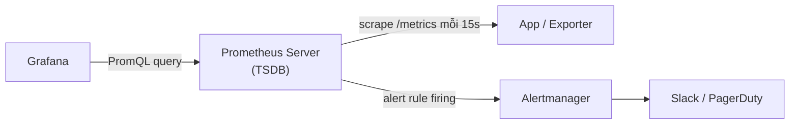

# 🎓 Metrics with Prometheus — De-facto metrics tool

> **Tác giả:** Mr.Rom\
> **Phiên bản:** v1.1.2\
> **Tạo lúc:** 23/05/2026\
> **Cập nhật:** 11/06/2026\
> **Level:** Basic\
> **Tags:** [MUST-KNOW]\
> **Yêu cầu trước:** [What is Observability](00_what-is-observability.md)

> 🎯 *Master **Prometheus**: architecture (pull-based, time-series DB), **4 metric types** (Counter, Gauge, Histogram, Summary), **PromQL** queries, **exporters** + instrumentation, **service discovery**, **federation** + remote write (scale), **kube-prometheus-stack** install.*

## 🎯 Sau bài này bạn sẽ

- [ ] Hiểu **Prometheus architecture** (pull vs push, TSDB)
- [ ] **4 metric types** + use case
- [ ] Setup **Prometheus** + scrape config
- [ ] Master **PromQL** — query language
- [ ] Instrument FastAPI với **prometheus-client**
- [ ] **node-exporter**, **cAdvisor**, **kube-state-metrics**
- [ ] **Service discovery** (K8s, Consul)
- [ ] **Federation** + remote write (long-term storage)

---

## 1️⃣ Prometheus là gì?

**Prometheus** = OSS metrics + alerting (SoundCloud 2012 → CNCF graduated 2018).

- **Pull-based** — scrape targets every 15-60s.
- **TSDB** (time-series database) — local storage, retention 15 days default.
- **PromQL** — powerful query language.
- **Alertmanager** — alert routing/grouping.

### Kiến trúc

Prometheus có 4 thành phần xoay quanh **TSDB local** (lưu time-series). **Retrieval** scrape `/metrics` endpoint từ app/exporter mỗi 15s; **PromQL engine** trả lời query qua HTTP API; **rule evaluator** chạy alert rule + đẩy alert vào **Alertmanager**; Alertmanager group/route ra Slack, Email, PagerDuty:

```
┌─────────────────────────┐
│  Prometheus Server       │
│  ┌──────┐  ┌──────────┐ │     scrape /metrics    ┌──────────┐
│  │ TSDB  │  │ Retrieval│─────►(every 15s)         │  App 1   │
│  └──────┘  └──────────┘ │                          └──────────┘
│       ▲     │                                       ┌──────────┐
│       │     └─Service discovery───────────────────►│  App 2   │
│   PromQL                                            └──────────┘
│       │                                              ┌──────────┐
│  ┌─────────┐    rules        ┌───────────────┐      │ node-exp │
│  │ HTTP API │───►Alerts────►│ Alertmanager  │       └──────────┘
│  └─────────┘                  └───────┬───────┘
│                                       │
│                                       ▼
│                           Slack/Email/PagerDuty
└─────────────────────────┘
```

Điểm trừu tượng nhất của kiến trúc này là mô hình **pull**: Prometheus chủ động đi "hỏi" — scrape target lấy metric, và chính Grafana cũng query ngược vào Prometheus. Sơ đồ rút gọn luồng dữ liệu:



→ Mọi mũi tên lấy dữ liệu đều xuất phát từ phía *tiêu thụ* (pull) — chỉ riêng alert là Prometheus chủ động đẩy sang Alertmanager để route đi notification.

### Pull vs Push (tranh luận)

**Prometheus pull**:
- ✅ Server controls scrape interval.
- ✅ Health check by failed scrape.
- ✅ Targets discovered automatically.
- ❌ Short-lived jobs (batch) need push gateway.
- ❌ NAT/firewall challenges.

**Push (StatsD, Datadog agent)**:
- ✅ Works behind NAT/firewall.
- ✅ Short-lived jobs natural.
- ❌ Server can't control overload.
- ❌ Lost target = silent.

→ **Prometheus pull** = de-facto. For push needs: **Pushgateway** (batch jobs).

---

## 2️⃣ Mô hình dữ liệu — Giải phẫu metric

Mỗi metric Prometheus có 3 phần: **tên** (`http_requests_total`), **labels** (key=value cho dimensions), và **value** (số tại 1 thời điểm). Bộ ba này tạo thành 1 *time-series* — chuỗi value theo thời gian. Anatomy đơn giản nhưng linh hoạt: chỉ cần thay đổi labels là tạo series mới:

```
http_requests_total{method="GET", path="/api/users", status="200"}  → 1234
└────────┬─────────┘└──────────────┬───────────────────────────┘     └─┬┘
   Metric name          Labels (dimensions)                          Value
```

### Time-series

Mỗi *series* được Prometheus lưu lại theo dạng list `(timestamp, value)`. Cách 15 giây (scrape interval mặc định), Prometheus ghi 1 sample mới. Sau 1 giờ có 240 sample, sau 1 ngày có 5,760 sample — đây là dữ liệu PromQL query và Grafana vẽ chart:

```
http_requests_total{method="GET", status="200"}
   1640000001  1200
   1640000016  1215
   1640000031  1234
   ...
```

→ Series = (metric + labels combination) over time.

### Labels — Dimensions

Labels chính là "dimension" để cắt lát dữ liệu. Cùng 1 metric `http_requests_total` nhưng kết hợp labels khác nhau (`method`, `path`, `status`) sinh ra nhiều series độc lập. Khi query PromQL, ta filter/aggregate dựa trên labels — đây là sức mạnh chính của Prometheus:

```
http_requests_total{method="GET", path="/users", status="200"}      → 1234
http_requests_total{method="POST", path="/users", status="201"}     → 56
http_requests_total{method="GET", path="/users", status="500"}      → 12
```

→ 3 different series. Aggregate via PromQL.

### Cardinality control — quan trọng

**Cardinality** = số lượng series active = tích Descartes của tất cả label value khả dĩ. Đây là bẫy lớn nhất của Prometheus: nhét label có giá trị **vô hạn** (user_id, request_id, email) sẽ tạo hàng triệu series → Prometheus OOM, query treo, disk đầy:

```
# ❌ Bad — high cardinality
http_requests_total{user_id="123"}   # 1M unique user_ids = 1M series
http_requests_total{request_id="..."} # Unique per request = ∞ series

# ✅ Good — low cardinality
http_requests_total{method, path, status}   # ~50 combinations
```

→ Cardinality explosion = Prometheus OOM. Rule of thumb: **<100K active series**.

---

## 3️⃣ 4 Metric types

### 1. Counter — Tăng đơn điệu

```
http_requests_total  (1, 2, 3, ..., 12345, 12346)
errors_total
bytes_received
```

- Only **goes up** (reset to 0 on restart).
- Math: rate, increase, sum.

```promql
# Requests per second (rate)
rate(http_requests_total[5m])

# Total in window
increase(http_requests_total[1h])
```

### 2. Gauge — Lên xuống

```
memory_usage_bytes
cpu_usage_percent
queue_depth
connections_active
```

- Snapshot value at scrape time.
- Math: avg, min, max, delta.

```promql
# Current memory
memory_usage_bytes

# Avg over 5min
avg_over_time(cpu_usage_percent[5m])

# Max in last hour
max_over_time(queue_depth[1h])
```

### 3. Histogram — Phân phối giá trị

```
http_request_duration_seconds_bucket{le="0.1"}   → 845
http_request_duration_seconds_bucket{le="0.5"}   → 1200
http_request_duration_seconds_bucket{le="1.0"}   → 1280
http_request_duration_seconds_bucket{le="+Inf"}  → 1300
http_request_duration_seconds_sum                → 234.56
http_request_duration_seconds_count              → 1300
```

→ **Bucket counts** + sum + count. Calculate quantiles after.

```promql
# P95 latency
histogram_quantile(0.95, rate(http_request_duration_seconds_bucket[5m]))

# Avg
rate(http_request_duration_seconds_sum[5m]) / rate(http_request_duration_seconds_count[5m])
```

### 4. Summary — Quantile tính sẵn

```
http_request_duration_seconds{quantile="0.5"}   → 0.05
http_request_duration_seconds{quantile="0.95"}  → 0.42
http_request_duration_seconds{quantile="0.99"}  → 1.10
```

- Quantiles computed **client-side**.
- ❌ Can't aggregate across instances.

→ **Histogram preferred 90% case** (aggregate works). Summary niche.

---

## 4️⃣ Cài đặt + Scrape config

### Cài đặt — Docker

```bash
docker run -d --name prometheus \
  -p 9090:9090 \
  -v $(pwd)/prometheus.yml:/etc/prometheus/prometheus.yml \
  prom/prometheus:latest
```

### `prometheus.yml`

```yaml
global:
  scrape_interval: 15s         # Default
  evaluation_interval: 15s

scrape_configs:
- job_name: 'prometheus'
  static_configs:
  - targets: ['localhost:9090']

- job_name: 'node'
  static_configs:
  - targets: ['node-exporter:9100']
  scrape_interval: 30s

- job_name: 'fastapi'
  static_configs:
  - targets: ['fastapi:8000']
  metrics_path: '/metrics'      # Default
```

→ Open `http://localhost:9090` → Web UI.

### Scrape endpoint

App must expose `/metrics`:
```
# HELP http_requests_total Total HTTP requests
# TYPE http_requests_total counter
http_requests_total{method="GET",status="200"} 1234

# HELP memory_usage_bytes Current memory
# TYPE memory_usage_bytes gauge
memory_usage_bytes 512000000
```

→ Plain text format. Use `prometheus-client` library.

---

## 5️⃣ Instrument FastAPI

### Cài đặt

```bash
pip install prometheus-fastapi-instrumentator
```

### Code app

```python
from fastapi import FastAPI
from prometheus_fastapi_instrumentator import Instrumentator

app = FastAPI()
Instrumentator().instrument(app).expose(app)

# Now /metrics auto-exposed with:
# http_request_duration_seconds (histogram)
# http_requests_total (counter)
# http_request_size_bytes (histogram)
# ...
```

### Metric tùy chỉnh

```python
from prometheus_client import Counter, Gauge, Histogram

orders_total = Counter(
    'orders_total',
    'Total orders placed',
    ['status']                          # Label
)

active_users = Gauge(
    'active_users',
    'Currently active users'
)

checkout_duration = Histogram(
    'checkout_duration_seconds',
    'Checkout flow time',
    buckets=[0.1, 0.5, 1, 2, 5, 10]
)

@app.post("/orders")
async def create_order(order: OrderCreate):
    with checkout_duration.time():
        result = process_order(order)
    orders_total.labels(status=result.status).inc()
    return result
```

### Kiểm tra

```bash
curl http://localhost:8000/metrics

# Output includes:
# orders_total{status="paid"} 142
# active_users 87
# checkout_duration_seconds_bucket{le="0.5"} 120
```

---

## 6️⃣ PromQL — Ngôn ngữ truy vấn

### Selectors

```promql
# All series for metric
http_requests_total

# Label filter (=, !=, =~, !~)
http_requests_total{method="GET"}
http_requests_total{method=~"GET|POST"}
http_requests_total{status!="500"}

# Range vector (last 5 min)
http_requests_total[5m]
```

### Aggregation

```promql
# Sum across all instances
sum(http_requests_total)

# Sum by label
sum by (method) (http_requests_total)

# Average
avg(memory_usage_bytes)

# Max / Min
max(cpu_usage_percent)
min(disk_free_bytes)

# Top 5
topk(5, http_requests_total)
```

### Các hàm rate

```promql
# Per-second rate (counter)
rate(http_requests_total[5m])
# = (current - 5min ago) / 300s

# Per-second increase rate
irate(http_requests_total[5m])
# = (last 2 samples) — instant rate

# Total increase
increase(http_requests_total[1h])
# = current - 1h ago
```

### Quantiles (histogram)

```promql
# P95 latency
histogram_quantile(
  0.95,
  rate(http_request_duration_seconds_bucket[5m])
)

# By label
histogram_quantile(
  0.95,
  sum by (path, le) (rate(http_request_duration_seconds_bucket[5m]))
)
```

### Toán tử toán học

```promql
# Error rate %
100 * sum(rate(http_requests_total{status=~"5.."}[5m]))
    / sum(rate(http_requests_total[5m]))

# Free disk %
100 * (node_filesystem_free_bytes / node_filesystem_size_bytes)
```

### Các truy vấn thường gặp

```promql
# RPS by endpoint
sum by (path) (rate(http_requests_total[1m]))

# Error rate
sum(rate(http_errors_total[5m])) / sum(rate(http_requests_total[5m]))

# P99 latency
histogram_quantile(0.99, rate(http_request_duration_seconds_bucket[5m]))

# Memory usage GB
container_memory_usage_bytes{pod="fastapi-xxx"} / 1024 / 1024 / 1024

# CPU usage cores
rate(container_cpu_usage_seconds_total[5m])

# Pod restarts in last hour
increase(kube_pod_container_status_restarts_total[1h]) > 0
```

→ PromQL = de-facto. Học cú pháp + 10 patterns đủ 90% query.

---

## 7️⃣ Exporters — Có sẵn cho mọi thứ

**Exporter** = service expose `/metrics` cho non-Prometheus apps.

| Exporter | Source |
|---|---|
| **node-exporter** | Linux node metrics (CPU/RAM/disk/network) |
| **cAdvisor** | Container metrics (Google, K8s default) |
| **kube-state-metrics** | K8s objects state (pods, deployments) |
| **postgres-exporter** | Postgres |
| **mysql-exporter** | MySQL |
| **redis-exporter** | Redis |
| **blackbox-exporter** | HTTP/TCP probes (uptime check) |
| **nginx-exporter** | Nginx |
| **rabbitmq-exporter** | RabbitMQ |

→ 200+ official + community. Install + scrape.

### Cài node-exporter

```bash
docker run -d --name node-exporter \
  -p 9100:9100 \
  --pid="host" \
  -v "/:/host:ro,rslave" \
  prom/node-exporter:latest \
  --path.rootfs=/host
```

```yaml
# prometheus.yml
scrape_configs:
- job_name: 'node'
  static_configs:
  - targets: ['node-exporter:9100']
```

→ Hundreds of metrics: `node_cpu_seconds_total`, `node_memory_MemFree_bytes`, `node_filesystem_free_bytes`, ...

### Blackbox-exporter — Giám sát uptime

```yaml
scrape_configs:
- job_name: 'blackbox'
  metrics_path: /probe
  params:
    module: [http_2xx]
  static_configs:
  - targets:
    - https://acmeshop.vn
    - https://api.acmeshop.vn
  relabel_configs:
  - source_labels: [__address__]
    target_label: __param_target
  - source_labels: [__param_target]
    target_label: instance
  - target_label: __address__
    replacement: blackbox-exporter:9115
```

→ Probe URL every 15s. `probe_success` = 0 or 1.

---

## 8️⃣ K8s service discovery

Static `targets` không scale. K8s — pods come/go. **Service Discovery** auto-detect.

```yaml
scrape_configs:
- job_name: 'kubernetes-pods'
  kubernetes_sd_configs:
  - role: pod
  relabel_configs:
  - source_labels: [__meta_kubernetes_pod_annotation_prometheus_io_scrape]
    action: keep
    regex: true
  - source_labels: [__meta_kubernetes_pod_annotation_prometheus_io_path]
    action: replace
    target_label: __metrics_path__
    regex: (.+)
  - source_labels: [__meta_kubernetes_namespace, __meta_kubernetes_pod_name]
    separator: /
    target_label: instance
```

→ Prometheus discover pods with annotation:

```yaml
apiVersion: v1
kind: Pod
metadata:
  name: fastapi
  annotations:
    prometheus.io/scrape: "true"
    prometheus.io/path: "/metrics"
    prometheus.io/port: "8000"
```

→ Pods auto-scrape. New pod = auto-added. Pod gone = auto-removed.

### Dùng kube-prometheus-stack thay thế

```bash
helm install monitoring prometheus-community/kube-prometheus-stack \
  -n monitoring --create-namespace
```

→ Pre-configured: Prometheus + Alertmanager + Grafana + node-exporter + kube-state-metrics + cAdvisor + dashboards + alerts. **Production K8s default**.

→ Use `ServiceMonitor` CRD to add custom scrape:

```yaml
apiVersion: monitoring.coreos.com/v1
kind: ServiceMonitor
metadata:
  name: fastapi
  labels:
    release: monitoring          # match Prometheus selector
spec:
  selector:
    matchLabels: { app: fastapi }
  endpoints:
  - port: http
    path: /metrics
```

→ Prometheus operator auto-add. Declarative.

---

## 9️⃣ Federation + Remote write

### Federation — Prometheus phân cấp

```
Global Prometheus
   ↑ federation (subset of metrics)
   │
Regional Prometheus 1 ────► local apps
Regional Prometheus 2 ────► local apps
```

→ Scale: 50K targets/Prometheus. Federate aggregates.

### Remote write — Lưu trữ dài hạn

Prometheus local retention 15 days default. **Long-term**:

```yaml
# prometheus.yml
remote_write:
- url: https://prometheus.grafana.net/api/prom/push
  basic_auth: { username: ..., password: ... }
```

→ Ship metrics to **Thanos**, **Mimir**, **Cortex**, **Grafana Cloud**, **VictoriaMetrics**.

### Tools lưu trữ dài hạn

| Tool | Notes |
|---|---|
| **Thanos** | Distributed Prometheus, query across replicas |
| **Mimir** | Grafana's, scalable Prometheus |
| **Cortex** | Original, multi-tenant |
| **VictoriaMetrics** | Faster, simpler than Prometheus |
| **Grafana Cloud** | Managed |

→ **2026 trend**: VictoriaMetrics gaining adoption (faster, lower resource).

---

## 1️⃣0️⃣ Alerting rules

```yaml
# alerts.yml
groups:
- name: app
  rules:
  - alert: HighErrorRate
    expr: |
      sum(rate(http_requests_total{status=~"5.."}[5m]))
        / sum(rate(http_requests_total[5m])) > 0.05
    for: 10m
    labels:
      severity: warning
    annotations:
      summary: "Error rate > 5% on {{ $labels.service }}"
      description: "Current: {{ $value | humanizePercentage }}"

  - alert: HighLatency
    expr: histogram_quantile(0.99, rate(http_request_duration_seconds_bucket[5m])) > 1.0
    for: 5m
    labels: { severity: warning }
    annotations:
      summary: "P99 latency > 1s"

  - alert: PodCrashLooping
    expr: rate(kube_pod_container_status_restarts_total[5m]) > 0
    for: 5m
    labels: { severity: critical }
    annotations:
      summary: "Pod {{ $labels.pod }} restarting"
```

```yaml
# prometheus.yml
rule_files:
- alerts.yml

alerting:
  alertmanagers:
  - static_configs:
    - targets: ['alertmanager:9093']
```

→ Detail Alertmanager + routing ở [bài 04 Grafana & Alerting](04_grafana-and-alerting.md).

---

## 💡 Cạm bẫy thường gặp & Best practice

1. **Cardinality explosion** (label `user_id`, `request_id`) → Prometheus OOM. <100K series rule.
2. **Counter vs Gauge confusion** → counter only goes up (use `rate()`). Gauge snapshot (use as-is).
3. **`rate()` on Gauge** → meaningless. Use `delta()` or `irate()`.
4. **Local storage as primary** → lose data on Prometheus restart > retention. Use remote write.
5. **Skip exporters, instrument all** → reinvent wheel. Use node-exporter + cAdvisor + kube-state-metrics.

---

## 🧠 Tự kiểm tra (Self-check)

1. **Pull** vs **Push** trong Prometheus?
2. 4 metric types — chọn cho: HTTP error count, current memory, request latency distribution?
3. PromQL query: **P95 latency 5min**?
4. Cardinality control — sao quan trọng?
5. **Federation** vs **Remote write** — khác sao?

<details>
<summary>Gợi ý đáp án</summary>

1. **Pull** (Prometheus default): server scrape `/metrics` every 15s. Server controls interval, health check via failed scrape, auto-discovery. **Push** (StatsD): app sends metrics to server. Works behind NAT, good for short-lived. Prometheus pull = de-facto, push via Pushgateway for batch jobs.

2. **HTTP error count** → **Counter** (monotonic up). **Current memory** → **Gauge** (snapshot). **Request latency distribution** → **Histogram** (buckets + sum + count → calculate quantiles via `histogram_quantile`).

3. ```promql
   histogram_quantile(0.95, rate(http_request_duration_seconds_bucket[5m]))
   ```
   Or by path: `histogram_quantile(0.95, sum by (path, le) (rate(..._bucket[5m])))`.

4. Each unique label combo = new time-series. `user_id` label = 1M users = 1M series. Prometheus OOM. **Rule of thumb**: <100K active series. Use bounded labels (method, path, status, NOT user_id).

5. **Federation**: hierarchical Prometheus — global Prom scrape subset metrics from regional Proms. Scale + aggregate. **Remote write**: ship samples to long-term storage (Thanos/Mimir/VictoriaMetrics/Grafana Cloud). Beyond 15-day local retention. Federation for query; remote write for storage.
</details>

---

## ⚡ Tra cứu nhanh (Cheatsheet)

### Install K8s

```bash
helm install monitoring prometheus-community/kube-prometheus-stack \
  -n monitoring --create-namespace
```

### Scrape config

```yaml
scrape_configs:
- job_name: 'app'
  static_configs:
  - targets: ['app:8000']
```

### Instrument FastAPI

```python
from prometheus_fastapi_instrumentator import Instrumentator
Instrumentator().instrument(app).expose(app)
```

### 4 metric types

```
Counter    monotonic up (requests_total)
Gauge      up/down snapshot (memory_used)
Histogram   distribution buckets (latency)
Summary    pre-calc quantiles (rare)
```

### PromQL essentials

```promql
rate(metric[5m])                   per-sec rate of counter
sum by (label) (metric)            aggregate
avg(metric)                         average
histogram_quantile(0.95, ...)      P95 from histogram
metric > 0.5                        threshold filter
```

### Exporters

```
node-exporter       node CPU/RAM/disk
cAdvisor             container metrics
kube-state-metrics    K8s objects
postgres-exporter     Postgres
blackbox-exporter     URL uptime
```

---

## 📚 Từ Điển Thuật Ngữ (Glossary)

| Thuật ngữ | Ý nghĩa |
|---|---|
| **Prometheus** | OSS metrics + alerting (CNCF) |
| **TSDB** | Time-series database |
| **Scrape** | Pull metrics from target |
| **Target** | Endpoint serving `/metrics` |
| **Counter / Gauge / Histogram / Summary** | 4 metric types |
| **Series** | Unique metric + labels combination |
| **Cardinality** | Number of active series |
| **PromQL** | Prometheus query language |
| **Exporter** | Service expose metrics for non-native apps |
| **node-exporter** | Linux machine metrics |
| **cAdvisor** | Container metrics |
| **kube-state-metrics** | K8s objects state |
| **Service Discovery** | Auto-detect targets (K8s/Consul) |
| **ServiceMonitor** | K8s CRD declarative scrape config |
| **Federation** | Hierarchical Prometheus |
| **Remote write** | Ship metrics to long-term storage |
| **Thanos / Mimir / VictoriaMetrics** | Long-term storage |

---

## 🔗 Liên kết & Tài nguyên

### 🧭 Định hướng lộ trình học
- ⬅️ **Bài trước:** [Observability là gì? — 3 pillars + monitoring landscape](00_what-is-observability.md)
- ➡️ **Bài tiếp theo:** [Logs — Loki, ELK, structured logging](02_logs-loki-elk.md)
- ↑ **Về cụm:** [observability README](../../README.md)

### 🧩 Các chủ đề có thể bạn quan tâm
- [K8s Pods + probes](../../../kubernetes/lessons/01_basic/01_pods-and-deployments.md)
- [FastAPI](../../../../07_web/backend/python-fastapi/)

### 🌐 Tài nguyên tham khảo khác
- 📖 [Prometheus docs](https://prometheus.io/docs/)
- 📖 [PromQL cheat sheet — Promlabs](https://promlabs.com/promql-cheat-sheet/)
- 📖 [kube-prometheus-stack](https://github.com/prometheus-community/helm-charts/tree/main/charts/kube-prometheus-stack)
- 📖 [Awesome Prometheus alerts](https://samber.github.io/awesome-prometheus-alerts/) — production-ready rules
- 📖 [VictoriaMetrics](https://victoriametrics.com/)

---

> 🎯 *Sau bài này metrics flowing. Bài kế tiếp dạy **logs** với Loki / ELK.*

---

## 📜 Changelog

- **v1.1.0 (25/05/2026)** — Apply Blueprint v0.5.4+ §3.6: thêm lead-in trước Architecture + §2 Data model + Time-series + Labels + Cardinality control.
- **v1.0.0 (23/05/2026)** — Bản đầu tiên. Observability sprint #2.
- **v1.1.1 (11/06/2026)** — Việt hoá heading nội dung mô tả sang tiếng Việt (giữ thuật ngữ/brand/param) theo Vietnamese-first.
- **v1.1.2 (11/06/2026)** — Bổ sung sơ đồ kiến trúc pull (scrape → TSDB → PromQL → Alertmanager) cho trực quan.
