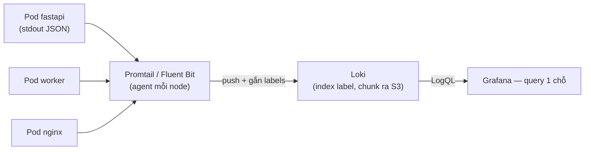

# 🎓 Logs — Loki, ELK, structured logging

> **Tác giả:** Mr.Rom\
> **Phiên bản:** v1.1.2\
> **Tạo lúc:** 23/05/2026\
> **Cập nhật:** 11/06/2026\
> **Level:** Basic\
> **Tags:** [MUST-KNOW]\
> **Yêu cầu trước:** [Metrics with Prometheus](01_metrics-prometheus.md)

> 🎯 *Logs deep: **structured logging** (JSON), **Loki** (Grafana's, label-based, cheap), **ELK** (Elasticsearch + Logstash + Kibana, full-text), **Promtail/Fluent Bit** agents, **LogQL** query, **log retention** strategies, **cost control**. Sau bài này centralize logs production.*

## 🎯 Sau bài này bạn sẽ

- [ ] Hiểu **structured** vs **unstructured** logs
- [ ] Setup **Loki** (Grafana's logs)
- [ ] **Promtail** / **Fluent Bit** agents
- [ ] **LogQL** query (Loki) + Kibana query (ELK)
- [ ] **ELK** vs Loki vs Splunk — chọn cái nào
- [ ] **Log retention** tier (hot/warm/cold)
- [ ] **Cost control** — drop noise, sampling, dedup
- [ ] FastAPI structured logging với `structlog`

---

## 1️⃣ Structured vs Unstructured

### Unstructured (truyền thống)

Log truyền thống là **text free-form** — chỉ con người đọc được, máy phải dùng regex để parse. OK cho debug local nhỏ, nhưng **không scale** cho production multi-service:

```
2026-05-23 14:32:01 INFO  Request received for /api/users from 192.168.1.5
2026-05-23 14:32:01 INFO  User 12345 authenticated successfully
2026-05-23 14:32:02 ERROR Database connection failed: timeout
```

→ Free-form text. Search via regex/grep. **Bad** for production:
- Hard to query specific field.
- No type safety.
- Hard to aggregate.

### Structured (JSON)

Log structured là **JSON object** — mỗi field có type rõ ràng (string/int/timestamp), query/aggregate dễ dàng. Đây là default 2026 cho mọi backend production. Correlate cross-service qua `request_id`:

```json
{"timestamp": "2026-05-23T14:32:01Z", "level": "INFO", "msg": "Request received", "path": "/api/users", "ip": "192.168.1.5", "request_id": "abc-123"}
{"timestamp": "2026-05-23T14:32:01Z", "level": "INFO", "msg": "User authenticated", "user_id": 12345, "request_id": "abc-123"}
{"timestamp": "2026-05-23T14:32:02Z", "level": "ERROR", "msg": "DB connection failed", "error": "timeout", "request_id": "abc-123"}
```

→ JSON. Query specific field. Aggregate. Correlate via `request_id`.

→ **2026 default**: structured logging.

### FastAPI với `structlog`

Cách viết log structured trong FastAPI dùng `structlog` (thư viện Python chuẩn 2026). Config 1 lần, log call sạch như `log.info("event_name", key=value)`. Output ra JSON tự động:

```python
import structlog
import logging

structlog.configure(
    processors=[
        structlog.processors.add_log_level,
        structlog.processors.TimeStamper(fmt="iso"),
        structlog.processors.dict_tracebacks,
        structlog.processors.JSONRenderer(),
    ],
    wrapper_class=structlog.make_filtering_bound_logger(logging.INFO),
)

log = structlog.get_logger()

@app.get("/users/{user_id}")
async def get_user(user_id: int, request: Request):
    log.info("get_user_request", user_id=user_id, ip=request.client.host)
    try:
        user = await db.get_user(user_id)
        log.info("get_user_success", user_id=user_id)
        return user
    except Exception as e:
        log.error("get_user_failed", user_id=user_id, error=str(e))
        raise
```

→ Console output (JSON):
```json
{"event":"get_user_request","timestamp":"2026-05-23T14:32:01Z","level":"info","user_id":42,"ip":"192.168.1.5"}
```

→ Log aggregator parse JSON → indexed fields → query like `user_id=42`.

---

## 2️⃣ Loki — Grafana's logs

**Loki** = OSS log aggregation, **label-based** (like Prometheus). Cheap, simple.

### Kiến trúc

Loki dùng **3-tier**: agent (Promtail/Fluent Bit) tail log từ container → đẩy vào Loki backend → Grafana query. Khác Elasticsearch: Loki **chỉ index label**, không full-text — nên rẻ hơn 10×:

```
App container → Promtail/Fluent Bit (agent) → Loki → Grafana (query)
                  ↑ tail logs                  ↑ store
                  ↑ add labels
```

Ý tưởng trừu tượng đáng nắm nhất là **log tập trung**: hàng chục pod rải trên nhiều node, nhưng tất cả đổ về 1 backend để query tại 1 chỗ. Sơ đồ luồng đầy đủ:



→ Pod chết hay node bay thì log vẫn còn ở Loki — debug không còn phụ thuộc `kubectl logs` trên container đang sống.

### So với Elasticsearch

Loki và Elasticsearch là 2 triết lý khác nhau — Loki tối ưu cost, Elasticsearch tối ưu query speed full-text. Pick theo nhu cầu: production logs thường rẻ là ưu tiên → Loki:

| Aspect | Loki | Elasticsearch |
|---|---|---|
| Index | Labels only | Full-text (every word) |
| Storage | Compressed chunks (S3) | Inverted index (large) |
| Cost | **10x cheaper** | Expensive |
| Query speed | Slower for ad-hoc text search | Fast |
| Best for | Log lines as data with metadata | Full-text search |

→ **Loki philosophy**: "labels for find logs, then grep content".

### Cài đặt (K8s)

```bash
helm install loki grafana/loki-stack \
  -n monitoring \
  --set promtail.enabled=true
```

→ Loki + Promtail (agent on every node). Logs from all pods → Loki.

### Chiến lược label (QUAN TRỌNG)

```yaml
# Promtail scrape pod logs, add labels:
labels:
  namespace: production         # ← Low cardinality
  app: fastapi                   # ← Low cardinality
  pod: fastapi-xxx-abc           # ← MEDIUM cardinality
  # NO: user_id (millions of unique values!)
```

→ **Rule**: labels **bounded set** (<1000 unique combos). High-card data in log line, not label.

### LogQL — Ngôn ngữ truy vấn Loki

```logql
# All logs from FastAPI in production
{namespace="production", app="fastapi"}

# Filter content (line filter)
{app="fastapi"} |= "error"           # contains
{app="fastapi"} != "healthcheck"     # not contains
{app="fastapi"} |~ "5\\d\\d"          # regex

# Parse JSON field
{app="fastapi"} | json | level="ERROR"

# Parse + filter + count
sum by (level) (count_over_time({app="fastapi"}[5m]))

# Rate
rate({app="fastapi"} |= "error" [5m])

# Top user errors
topk(10, sum by (user_id) (count_over_time({app="fastapi"} | json [1h])))
```

→ LogQL similar PromQL — combine selector + line filter + parser + aggregation.

---

## 3️⃣ Promtail / Fluent Bit / Vector — Các agent

Agents = ship logs from source → log backend.

### Promtail (mặc định của Loki)

```yaml
# promtail-config.yml
clients:
- url: http://loki:3100/loki/api/v1/push

scrape_configs:
- job_name: kubernetes-pods
  kubernetes_sd_configs:
  - role: pod
  pipeline_stages:
  - cri: {}                              # Parse CRI format
  - json:
      expressions:
        level: level
        msg: msg
  - labels:
      level:
  relabel_configs:
  - source_labels: [__meta_kubernetes_namespace]
    target_label: namespace
  - source_labels: [__meta_kubernetes_pod_label_app]
    target_label: app
```

→ Tail container logs, parse JSON, add labels, ship Loki.

### Fluent Bit — Nhẹ (CNCF)

```yaml
# fluent-bit.conf
[INPUT]
    Name        tail
    Path        /var/log/containers/*.log
    Parser      cri

[OUTPUT]
    Name        loki
    Match       *
    host        loki
    port        3100
    labels      job=fluent-bit
```

→ C-based, fastest. Default on EKS/GKE log agents.

### Vector (Datadog OSS)

→ Modern, transformations rich. Rust-based.

### So sánh

| Agent | Language | Notes |
|---|---|---|
| **Promtail** | Go | Loki default, K8s friendly |
| **Fluent Bit** | C | Fastest, smallest footprint |
| **Fluentd** | Ruby | Older, full-featured |
| **Vector** | Rust | Modern, transformations |
| **Filebeat** | Go | Elastic stack default |
| **Logstash** | Java | Heavy, ETL pipeline |

→ Loki → Promtail/Fluent Bit. Elastic → Filebeat. Modern flexible → Vector.

---

## 4️⃣ ELK Stack — Tìm kiếm full-text

**ELK** = **E**lasticsearch + **L**ogstash + **K**ibana.

```
App logs → Filebeat → Logstash (parse/enrich) → Elasticsearch (index) → Kibana (UI)
```

### Ưu điểm so với Loki

| Aspect | ELK | Loki |
|---|---|---|
| Full-text search | ✅ Fast | 🟡 Slower |
| Storage | Expensive (inverted index) | Cheap (chunks) |
| Setup | Complex | Simple |
| K8s native | OK | Better |
| Ecosystem | Mature, plugins | Newer |

### Cài đặt nhanh — Single node

```bash
docker run -d -p 9200:9200 -p 9300:9300 \
  -e "discovery.type=single-node" \
  -e "xpack.security.enabled=false" \
  elasticsearch:8.13.0

docker run -d -p 5601:5601 \
  -e "ELASTICSEARCH_HOSTS=http://elasticsearch:9200" \
  kibana:8.13.0
```

→ Kibana at `localhost:5601`. Filebeat ship logs.

### Kibana KQL — Truy vấn

```
level: "ERROR"
level: "ERROR" AND request_id: "abc-123"
status_code: 5*
NOT path: "/health"
@timestamp > now-15m
```

→ Lucene/KQL syntax. Easier than LogQL for full-text.

### Khi nào ELK vs Loki?

| Need | Choose |
|---|---|
| Full-text search heavy | **ELK** |
| Cost-sensitive | **Loki** |
| K8s native + Grafana stack | **Loki** |
| Mature ecosystem + Kibana familiar | **ELK** |
| Compliance / audit logs | **ELK** (better indexing) |
| Standard production observability | **Loki** (2026 default) |

→ **2026 trend**: Loki gaining vs ELK for cost. Both valid.

---

## 5️⃣ Kiểm soát cost — Logs = $$$$

### Thực tế về volume

```
Web app 10K users    → 10-50 GB/day
Microservices 50svc  → 500 GB-1 TB/day
```

### Giá Datadog 2026

```
Logs ingestion: $1.27/GB
Logs retention: $0.10/GB/month (15 days)

100GB/day = $3,810/month
1TB/day   = $38,100/month
```

→ Bills shock startups. Strategies:

### Chiến lược 1 — Drop noise

```yaml
# Fluent Bit filter
[FILTER]
    Name    grep
    Match   *
    Exclude path /health
    Exclude path /metrics
```

→ Health checks, metric scrapes = 90% noise. Drop.

### Chiến lược 2 — Sample debug logs

```yaml
[FILTER]
    Name    sample
    Match   *.debug
    sample  10                            # 1 in 10
```

→ Keep all ERROR/WARN. Sample 10% DEBUG.

### Chiến lược 3 — Log level theo env

```python
# Production
LOG_LEVEL = "INFO"        # Skip DEBUG

# Dev
LOG_LEVEL = "DEBUG"
```

### Chiến lược 4 — Retention tiers

```
Hot:   3 days  (queryable, fast, expensive)
Warm:  7 days   (queryable, slower, cheap)
Cold:  30 days  (S3 archive, restore if needed)
```

### Chiến lược 5 — Tránh log explosion

```python
# ❌ Log per request
log.info("user_xxx requested resource")  # 1M users/day × 5 logs = 5M logs/day

# ✅ Log on important events only
log.info("user_xxx_failed_login")
log.info("user_xxx_payment_completed")

# ❌ Log full HTTP body
log.info(f"Response: {response.json()}")  # MB per request

# ✅ Log metadata only
log.info("response_sent", size_bytes=len(body), status=200)
```

### Chiến lược 6 — OSS self-host

```
Loki self-host on $100/mo VPS = unlimited logs storage S3
Vs Datadog $3,000/mo
```

→ Trade ops time for cost saving. Worth at scale.

---

## 6️⃣ Tương quan log — Request ID

Pass `request_id` qua services để correlate logs.

### Sinh ở edge

```python
# FastAPI middleware
@app.middleware("http")
async def add_request_id(request: Request, call_next):
    request_id = request.headers.get("X-Request-ID") or str(uuid.uuid4())
    request.state.request_id = request_id

    # Bind to logger context
    structlog.contextvars.bind_contextvars(request_id=request_id)

    response = await call_next(request)
    response.headers["X-Request-ID"] = request_id
    return response
```

→ Every log in this request includes `request_id`. Trace flow:

```
{"request_id": "abc-123", "msg": "request started"}
{"request_id": "abc-123", "msg": "db query", "duration_ms": 12}
{"request_id": "abc-123", "msg": "response sent", "status": 200}
```

### Truyền xuống downstream

```python
# Call other service
async with httpx.AsyncClient() as client:
    headers = {"X-Request-ID": request.state.request_id}
    response = await client.get(other_service_url, headers=headers)
```

→ Other service uses same request_id. Cross-service log trace via Loki query:

```logql
{namespace="production"} |= "abc-123"
```

→ Returns ALL logs across ALL services for this request. Magic.

### Cách tiếp cận OpenTelemetry

OTel propagate **trace_id + span_id** automatically. Log with these = correlate logs ↔ traces. Best 2026 approach (xem [bài 03](03_traces-opentelemetry.md)).

---

## 7️⃣ Log levels — Dùng đúng cách

| Level | When |
|---|---|
| **TRACE** | Function entry/exit, very verbose (rare in prod) |
| **DEBUG** | Detail dev info (production: usually OFF) |
| **INFO** | Normal events (request, login, action) |
| **WARN** | Unexpected but recoverable (retry, fallback) |
| **ERROR** | Operation fail (caught exception) |
| **FATAL** | App crash imminent |

### Best practice

```python
# ✅ Good
log.info("user_login", user_id=42, ip="...")
log.warn("db_retry", attempt=2, max=3)
log.error("payment_failed", order_id=100, error=str(e))

# ❌ Bad
log.error("something went wrong")          # No context
log.info("DEBUG: checking user 42")        # Wrong level
log.info(f"user={user_dict}")              # Don't dump PII
```

### Dữ liệu nhạy cảm — Mask

```python
# ❌ Log password
log.info("login_attempt", username=u, password=p)

# ✅ Mask
log.info("login_attempt", username=u, password="***")
```

→ Compliance (GDPR, PCI-DSS): never log secrets, PII (email/phone/CC).

---

## 8️⃣ Cài đặt production — Stack của bạn

```
Pods → stdout → kubelet log file
                    ↓
                 Promtail (DaemonSet, every node)
                    ↓ ship to Loki
                 Loki (3 replicas, S3 backend)
                    ↓ query
                 Grafana → ops team
```

### Cài đặt bằng Helm

```bash
helm install loki grafana/loki-stack \
  -n monitoring \
  --set promtail.enabled=true \
  --set loki.persistence.enabled=true \
  --set loki.persistence.size=100Gi \
  --set loki.storage.bucketNames.chunks=acmeshop-loki-chunks \
  --set loki.storage.bucketNames.ruler=acmeshop-loki-ruler \
  --set loki.storage.type=s3
```

→ Loki ship chunks to S3 (cheap long-term). Local SSD = 24h hot cache.

### Promtail config — Lọc noise

```yaml
scrape_configs:
- job_name: pods
  kubernetes_sd_configs: [{ role: pod }]
  pipeline_stages:
  - cri: {}
  - json:
      expressions:
        level: level
  - labels: { level: }
  - drop:
      expression: ".*GET /health.*"        # Drop health checks
  - drop:
      expression: ".*kube-probe.*"          # Drop probe
```

### Grafana dashboard

```
Panel 1: Logs over time by app
  query: sum by (app) (rate({namespace="production"}[1m]))

Panel 2: Error rate
  query: sum(rate({app="fastapi"} | json | level="error" [5m]))

Panel 3: Top errors
  query: topk(10, sum by (msg) (count_over_time({app="fastapi"} | json | level="error" [1h])))

Panel 4: Live tail (specific request)
  query: {namespace="production"} |= "${request_id}"
```

→ Ops dashboard 4 panels = 80% debug needs.

---

## 9️⃣ Alerting trên logs

```yaml
# loki-rules.yml
groups:
- name: app-logs
  rules:
  - alert: HighErrorLogRate
    expr: |
      sum by (app) (rate({namespace="production"} | json | level="error" [5m])) > 0.1
    for: 10m
    labels: { severity: warning }
    annotations:
      summary: "{{ $labels.app }} error log rate high"

  - alert: PanicLog
    expr: |
      sum(rate({namespace="production"} |= "panic" [5m])) > 0
    for: 1m
    labels: { severity: critical }
    annotations:
      summary: "Panic detected in production"
```

→ Loki Ruler service eval rules → Alertmanager → Slack/PagerDuty.

---

## 💡 Cạm bẫy thường gặp & Best practice

1. **Unstructured logs** → painful query. JSON from day 1.
2. **High-cardinality labels** (user_id) → Loki explode. Bounded labels only.
3. **Log everything** → $$$. Drop noise (health, probes), sample debug.
4. **No request_id correlation** → can't trace flow. Middleware + propagate.
5. **Logging PII** (passwords, CC) → compliance fine. Mask sensitive.

---

## 🧠 Tự kiểm tra (Self-check)

1. Khác **structured** và **unstructured** logs?
2. **Loki labels** vs **content** — strategy?
3. Loki vs ELK — chọn 2026 startup?
4. **Cost control** — 5 strategies?
5. **request_id correlation** — implement thế nào?

<details>
<summary>Gợi ý đáp án</summary>

1. **Unstructured**: free text (`"User 42 logged in"`). Grep regex. Hard query field. **Structured**: JSON (`{"event": "login", "user_id": 42}`). Aggregator parse → field-level query. Modern 2026: **structured** mandatory.

2. **Loki philosophy**: labels for **find** logs (low cardinality bounded), content for **filter** within. Examples: labels = `namespace`, `app`, `pod`, `level`. Content = full log line with user_id, request_id (high cardinality OK because not label).

3. **Loki** for 2026 startup: 10x cheaper, K8s native, Grafana stack integrate, simple. **ELK** if: full-text search critical, mature org with Kibana expertise, compliance needs deep indexing. Most startup → Loki.

4. (a) **Drop noise** (health checks, probes). (b) **Sample DEBUG** (1 in 10). (c) **Log level INFO+ prod**. (d) **Retention tiers** (3 days hot, 30 days cold). (e) **OSS self-host** vs Datadog. (f) **Log metadata not bodies** (size_bytes not full JSON).

5. (1) **Middleware**: extract or generate `X-Request-ID` header, bind to logger context. (2) **Propagate** to downstream services via header. (3) **Logger include** request_id in every line. (4) **Query Loki** `{app="fastapi"} |= "abc-123"` returns all logs cross-services for request.
</details>

---

## ⚡ Tra cứu nhanh (Cheatsheet)

### Install K8s

```bash
helm install loki grafana/loki-stack -n monitoring \
  --set promtail.enabled=true
```

### Structured FastAPI

```python
import structlog
log = structlog.get_logger()
log.info("event", user_id=42, action="login")
```

### LogQL

```
{app="fastapi"}                             # all logs
{app="fastapi"} |= "error"                  # contains
{app="fastapi"} | json | level="error"      # JSON + filter
sum by (app) (rate({...}[5m]))               # rate
topk(10, count_over_time({...}[1h]))         # top
```

### Strategy

```
Structured JSON           ✅
request_id correlate      ✅
Drop noise (health)        ✅
Sample DEBUG               ✅
Bounded labels             ✅
Retention tiers            ✅
Never log PII              ✅
```

### Loki vs ELK

```
Loki   K8s + cheap + Grafana   2026 default
ELK     Full-text + mature
```

---

## 📚 Từ Điển Thuật Ngữ (Glossary)

| Thuật ngữ | Ý nghĩa |
|---|---|
| **Structured logging** | JSON format |
| **Loki** | Grafana logs, label-based |
| **LogQL** | Loki query language |
| **ELK** | Elasticsearch + Logstash + Kibana |
| **Filebeat / Fluent Bit / Promtail / Vector** | Log shipping agents |
| **Promtail** | Loki's default agent |
| **Inverted index** | Full-text index (Elasticsearch) |
| **Chunks** | Loki compressed storage units |
| **Label cardinality** | Unique label combinations |
| **Request ID** | Correlation token across services |
| **Log levels** | TRACE/DEBUG/INFO/WARN/ERROR/FATAL |
| **PII** | Personally Identifiable Information |
| **Retention tiers** | Hot/Warm/Cold storage |
| **Drop / Sample** | Cost reduction techniques |

---

## 🔗 Liên kết & Tài nguyên

### 🧭 Định hướng lộ trình học
- ⬅️ **Bài trước:** [Metrics with Prometheus — De-facto metrics tool](01_metrics-prometheus.md)
- ➡️ **Bài tiếp theo:** [Traces & OpenTelemetry — Distributed tracing](03_traces-opentelemetry.md)
- ↑ **Về cụm:** [observability README](../../README.md)

### 🧩 Các chủ đề có thể bạn quan tâm
- [FastAPI middleware](../../../../07_web/backend/python-fastapi/lessons/01_basic/04_auth-and-middleware.md) — request_id middleware

### 🌐 Tài nguyên tham khảo khác
- 📖 [Loki docs](https://grafana.com/docs/loki/latest/)
- 📖 [LogQL cheatsheet](https://grafana.com/docs/loki/latest/query/log_queries/)
- 📖 [Elastic Stack docs](https://www.elastic.co/guide/index.html)
- 📖 [structlog docs](https://www.structlog.org/) — Python structured logging
- 📖 [Fluent Bit docs](https://docs.fluentbit.io/)

---

> 🎯 *Sau bài này centralize logs production-grade. Bài kế tiếp dạy **traces** với OpenTelemetry.*

---

## 📌 Nhật ký thay đổi (Changelog)

- **v1.0.0 (23/05/2026)** — Bản đầu tiên. Cluster observability basic lesson 3/5. Cover: structured vs unstructured + structlog FastAPI + Loki architecture + label strategy + LogQL queries + Elasticsearch/Vector alternative + cost control (retention, sampling, dedup).
- **v1.1.0 (25/05/2026)** — Apply Blueprint v0.5.4+ §3.6: thêm lead-in trước §1 Unstructured + Structured + FastAPI structlog + §2 Loki Architecture + Vs Elasticsearch.
- **v1.1.1 (11/06/2026)** — Việt hoá heading nội dung mô tả sang tiếng Việt (giữ thuật ngữ/brand/param) theo Vietnamese-first.
- **v1.1.2 (11/06/2026)** — Bổ sung sơ đồ flow log tập trung (pod → agent → Loki → Grafana) cho trực quan.
