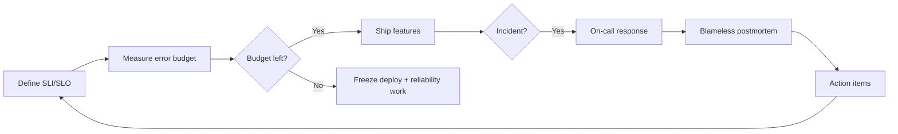
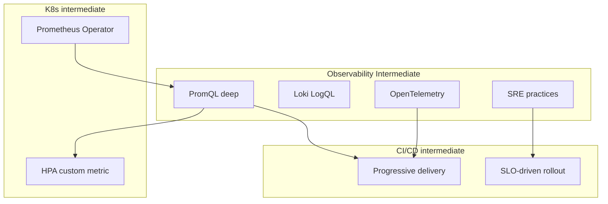

# 🎓 Observability Intermediate — Từ "có dashboard" đến "SRE practice"

> **Tác giả:** Mr.Rom\
> **Phiên bản:** v1.1.0\
> **Tạo lúc:** 24/05/2026\
> **Cập nhật:** 25/05/2026\
> **Level:** Intermediate\
> **Tags:** [MUST-KNOW]\
> **Yêu cầu trước:** [Observability basic](../01_basic/), [K8s intermediate](../../../kubernetes/lessons/02_intermediate/)

> 🎯 *Bài INTRO. Basic đã setup Prometheus + Grafana + Loki + Tempo. Production cần đi sâu: **PromQL fluent + recording rules + alerting strategy**, **LogQL + cardinality management**, **OTel instrumentation thật**, **SRE practices** (SLO, error budget, postmortem, on-call). Bài cuối DevOps intermediate sprint, prep cho IaC intermediate.*

## 🎯 Sau bài này bạn sẽ

- [ ] Hiểu **khoảng cách** giữa "có dashboard" và SRE production
- [ ] Biết **4 mảng intermediate**: PromQL deep / Logs deep / OTel / SRE practices
- [ ] Phân biệt **monitoring** vs **observability** vs **SRE** — từ ngữ thực sự
- [ ] Biết **landscape 2026**: Prometheus + Mimir/Thanos, Loki, Tempo, OpenTelemetry
- [ ] Có **lộ trình** học 4 bài kế tiếp + chỗ kết nối DevOps

---

## Tình huống — Có dashboard nhưng vẫn không biết "lỗi từ đâu"

Production 6 tháng có Prometheus + Grafana + Loki + Tempo (setup từ basic). Sáng thứ Hai 3am, on-call paged:

```
🚨 Alert: API error rate > 5% (current 12%)
```

On-call SRE workflow:
- Mở Grafana → API service dashboard → error rate spike. **OK biết bị spike, không biết tại sao**.
- Click panel "P99 latency" → cũng tăng. **OK chậm, không biết do đâu**.
- Loki search "ERROR last 15m" → 50,000 log lines. **Bão log, không filter được**.
- Click 1 log line → muốn xem trace, nhưng log không có `trace_id`. **Dead end**.
- Manual check 5 dashboard khác, mất 45 phút. Root cause: 1 DB connection pool exhausted.

Sếp post-mortem:
- *"Tại sao alert chỉ nói 'error rate cao' mà không nói nguyên nhân?"* — Alert rule chưa multi-dimensional.
- *"Tại sao log không correlate với trace?"* — Logs không structured có `trace_id`.
- *"Tại sao không có SLO?"* — Error budget không track → không biết cấp độ urgency.
- *"Tại sao runbook không có?"* — On-call mò 45 phút manual.

→ Bài này map 4 mảng để fix.

---

## 1️⃣ Monitoring vs Observability vs SRE

### Monitoring (cũ)

Monitoring truyền thống (2000s era) chỉ trả lời **câu hỏi đã biết trước** — set threshold, alert khi vượt. Đủ cho 1 server đơn giản, **không đủ** khi có microservices với hàng nghìn pod:

- **Predefined questions**: "CPU > 80%?", "Disk > 90%?"
- **Alert on threshold**: known unknowns.
- **Dashboard**: visualize predefined metrics.

→ Đủ cho infrastructure-level, không đủ cho microservices.

### Observability (modern)

Observability (2018+) cho phép **ask new questions** mà không phải predefine — bằng cách kết hợp 3 trụ cột (metrics + logs + traces) với high-cardinality. Đây là evolution cần thiết cho cloud-native:

- **Ask new questions**: explore data without predefined queries.
- **3 pillars**: metrics + logs + traces, correlated.
- **High cardinality**: drill down by user, request, transaction.

🪞 **Ẩn dụ**: *Monitoring như **đèn báo lò vi sóng** (chỉ ON/OFF threshold). Observability như **camera + cảm biến + microphone trong nhà bếp** — ai cũng có thể đặt câu hỏi mới: "Lúc 3pm nhiệt độ vùng nào cao nhất? Ai mở lò?"*

### SRE (Site Reliability Engineering — Google)

SRE là **discipline kỹ thuật** Google phát triển 2003 — dùng observability để run production reliably. 6 principles cốt lõi mỗi team SRE phải master, biến reliability từ "khẩu hiệu" thành **số đo cụ thể**:

- **Engineering discipline** dùng observability để run production.
- **SLI/SLO/SLA**: define reliability target numerically.
- **Error budget**: trade-off reliability vs velocity.
- **Blameless postmortem**: learn from incidents.
- **On-call**: sustainable rotation, runbook automation.
- **Toil reduction**: automate repetitive ops.

→ SRE = observability + process + culture.

---

## 2️⃣ Mảng 1 — PromQL deep + Recording/Alerting rules

### Vấn đề basic PromQL

Basic chỉ dùng `rate()` + `sum by ()`. Production cần:
- **Histogram quantile**: P50/P90/P99 latency.
- **Recording rules**: precompute expensive query (save 90% Prometheus CPU).
- **Multi-window burn rate alerts**: error budget consumption.
- **Aggregation functions**: `topk`, `bottomk`, `quantile_over_time`.
- **Predict_linear**: forecast disk full.

### Recording rules — Precompute

❌ Bad — dashboard query 30 series mỗi load:
```promql
sum by (service, status) (
  rate(http_requests_total[5m])
)
```

✅ Good — recording rule precompute:
```yaml
groups:
  - name: http_aggregates
    interval: 30s
    rules:
      - record: service:http_requests:rate5m
        expr: sum by (service, status) (rate(http_requests_total[5m]))
```

→ Dashboard query `service:http_requests:rate5m` — fast lookup, no recomputation.

🪞 **Ẩn dụ**: *Recording rules như **báo cáo tổng kết hàng ngày** — không phải mỗi lần CEO hỏi mới chạy phân tích 1 triệu rows. Precompute sẵn → trả lời câu hỏi 1 ms.*

→ Học deep ở **bài 01**.

---

## 3️⃣ Mảng 2 — Logs deep (Loki + LogQL + structured)

### Vấn đề basic Loki

Basic: ship log via Promtail, query trong Grafana với `{namespace="prod"}`. Đủ cho debug nhỏ.

Production cần:
- **LogQL deep**: regex parse, aggregate, alert.
- **Structured logging**: JSON với `trace_id` cho correlation.
- **Cardinality management**: high cardinality labels → Loki slow + expensive.
- **Retention policy**: hot/warm/cold storage.
- **Log shipping**: Promtail vs Vector vs Fluent Bit — chọn đúng.

### LogQL example

LogQL (Loki Query Language) tương tự PromQL — function aggregate + filter + transform log. 2 query phổ biến nhất: đếm error per service + tìm slow request:

```logql
# Count errors per service in last 5m
sum by (service) (
  rate(
    {namespace="prod"} | json | level="error" [5m]
  )
)

# Find slow requests in payment service
{service="payment"} 
  | json 
  | duration_ms > 1000 
  | line_format "{{.timestamp}} {{.endpoint}} {{.duration_ms}}ms"
```

→ Học deep ở **bài 02**.

---

## 4️⃣ Mảng 3 — OpenTelemetry instrumentation

### Vấn đề basic OTel

Basic: introduce OTel concept, vendor-neutral. Setup auto-instrumentation cho 1 service.

Production cần:
- **Manual instrumentation**: custom spans cho business logic.
- **Context propagation**: trace_id flow qua HTTP, gRPC, message queue.
- **Sampling strategies**: head-based vs tail-based.
- **OTel Collector**: receiver + processor + exporter pipeline.
- **Correlation**: logs ↔ traces ↔ metrics qua trace_id.
- **Multi-language**: Python + Node + Go consistency.

### Example: manual span

Auto-instrumentation cover ~70% case nhưng vẫn cần **manual span** cho business logic critical (payment, signup, ...). Cú pháp Python với OpenTelemetry SDK:

```python
from opentelemetry import trace

tracer = trace.get_tracer(__name__)

@app.post("/orders")
def create_order(req: OrderRequest):
    with tracer.start_as_current_span("validate_order") as span:
        span.set_attribute("user_id", req.user_id)
        span.set_attribute("amount", req.amount)
        validate(req)
    
    with tracer.start_as_current_span("call_payment_api"):
        result = payment_client.charge(req.amount)
    
    with tracer.start_as_current_span("save_order"):
        order = db.save(req)
    
    return order
```

→ Trace tree shows business logic timing: validate (10ms) → payment (500ms) → save (50ms).

→ Học deep ở **bài 03**.

---

## 5️⃣ Mảng 4 — SRE practices (SLI/SLO + postmortem + on-call)

### Vấn đề "9s talk"

Engineering teams: "Aim 99.99% uptime". Nhưng:
- Cách đo? (SLI definition)
- Trade-off với velocity? (Error budget policy)
- Khi nào ngừng deploy? (Burn rate alerts)
- Sau incident xong làm gì? (Postmortem)
- Ai trực 3am? (On-call rotation)

→ Engineering culture, không chỉ tools.

### SRE workflow



🪞 **Ẩn dụ**: *Error budget như **bình xăng cho velocity**. SLO 99.9% = 43 phút "xăng" mỗi tháng. Deploy risky = đốt xăng. Hết xăng → cấm deploy mới, chỉ sửa bug ổn định lại. Còn xăng → tự do ship feature.*

→ Học deep ở **bài 04**.

---

## 6️⃣ Mối liên hệ DevOps stack



| Obs intermediate mảng | Kết nối tới |
|---|---|
| PromQL deep | HPA custom metric (K8s) + canary auto-rollback (CI/CD) |
| Logs deep | Postmortem evidence + audit trail |
| OTel | Trace canary deploy + distributed bottleneck detection |
| SRE practices | Define progressive delivery thresholds + on-call automation |

→ **Obs intermediate là feedback loop** cho mọi cluster khác.

---

## 7️⃣ Tool stack 2026 — Cheatsheet

| Mục đích | Tool chính 2026 | Tool dự bị | Khi nào dùng |
|---|---|---|---|
| **Metrics core** | **Prometheus** | VictoriaMetrics | Prometheus default; VM cho high-scale |
| **Long-term metrics** | **Mimir** (Grafana) hoặc **Thanos** | InfluxDB | Multi-cluster federation, year+ retention |
| **Metrics SaaS** | **Grafana Cloud** | Datadog, New Relic | Khi không muốn self-host |
| **Logs** | **Loki** | Elasticsearch (legacy) | Loki cheap; ES powerful nhưng đắt |
| **Logs ship** | **Vector** (Datadog) hoặc **Promtail** | Fluent Bit | Vector hiện đại; Promtail Loki-native |
| **Traces** | **Tempo** (Grafana) | Jaeger | Tempo integrate Grafana stack |
| **Traces SaaS** | **Honeycomb** | Datadog APM | Honeycomb high-cardinality |
| **Instrumentation** | **OpenTelemetry** | Vendor SDK | OTel vendor-neutral, recommend 2026 |
| **Dashboards** | **Grafana** | — | Standard |
| **Alerting** | **Alertmanager** + **Grafana Alerts** | PagerDuty (route) | Alertmanager routing; Grafana Alerts UI |
| **Incident management** | **PagerDuty** | **OpsGenie**, **Incident.io** | PagerDuty leader; Incident.io modern |
| **Status page** | **Statuspage** (Atlassian), **Cachet** OSS | — | Public communication |
| **Postmortem** | **Confluence**, **Notion**, **Incident.io** | — | Documentation tool |

→ **Starter recommend 2026**: Prometheus + Loki + Tempo + Grafana + Alertmanager + Vector + OTel + PagerDuty.

---

## 8️⃣ Lộ trình 4 bài kế tiếp

| Bài | Nội dung | Output |
| --- | --- | --- |
| **01** PromQL deep | Functions deep + recording rules + multi-window burn rate alerts + Alertmanager routing + Mimir cho long-term | Production-grade alert + dashboard |
| **02** Logs deep | LogQL deep + structured logging + cardinality management + Promtail/Vector pipeline + retention | Loki production setup + 5 LogQL patterns |
| **03** OTel instrumentation | Manual span + context propagation + sampling (head/tail) + Collector pipeline + correlation logs/metrics/traces | FastAPI + frontend OTel instrumented end-to-end |
| **04** SRE practices | SLI/SLO definition + error budget burn rate + blameless postmortem template + on-call rotation + toil reduction | Production-grade SRE process |


---

## 💡 Câu hỏi beginner hay hỏi

**Q1.** "Có dashboard rồi, cần gì SLO?"

→ Dashboard là **passive observation**. SLO là **active commitment**. Khi error budget burn fast → SLO ép freeze deploy. Dashboard không ép. Engineering organization scale = cần SLO drive priority.

**Q2.** "Tự instrument với Prometheus client lib hay OTel?"

→ **OTel** 2026. Vendor-neutral, multi-signal (logs+metrics+traces 1 SDK). Prometheus client lib chỉ metrics. OTel emit OTLP → Collector → Prometheus/Tempo/Loki tùy backend.

**Q3.** "Loki vs Elasticsearch — chọn nào?"

→ **Loki** cho most. Cost 10-30x cheaper Elasticsearch. Trade-off: query slower trên full-text. Elasticsearch khi cần complex search + analytics on logs.

**Q4.** "Postmortem template quan trọng vậy?"

→ **Có**. Without template, postmortem inconsistent → khó pattern detect across incidents. With template (Summary/Timeline/Root Cause/Action Items/Owner/Date), 6 tháng review thấy "5 incident giống nhau do DB connection pool" → priority fix.

**Q5.** "On-call burnout làm sao?"

→ Multi-week off (1 week on, 2-3 weeks off). Runbook automation. Page only actionable alerts (alert hygiene). Compensate (overtime pay hoặc time-off). Bài 04 dạy patterns chi tiết.

---

## 🗺️ Khi nào cần advanced (sau intermediate)?

| Topic advanced | Nội dung | Khi nào học |
|---|---|---|
| **Multi-region observability** | Mimir federation + cross-region traces | Multi-cluster production |
| **eBPF observability** | Cilium Tetragon, Pixie, Parca CPU profiler | Performance debugging deep |
| **AI ops** | Anomaly detection ML, log clustering | Mature org with data volume |
| **Custom Grafana plugins** | Build custom panel type | UI productization |
| **OpenTelemetry deep** | Custom processors, traces sampling decision algo | Platform team |
| **Chaos engineering** | Chaos Mesh, game days, fault injection | SRE maturity 4-5 |

→ Cluster `03_advanced/` sẽ làm sau.

---

## 📚 Từ Điển Thuật Ngữ (Glossary)

| Term | Vietnamese / Explanation |
|---|---|
| **Monitoring** | Predefined threshold alerts (CPU > 80%) |
| **Observability** | Ask new questions about system state — 3 pillars correlated |
| **SRE** | Site Reliability Engineering — Google's discipline run production |
| **SLI** | Service Level Indicator — metric (success rate, latency) |
| **SLO** | Service Level Objective — target SLI (99.9% requests < 500ms) |
| **SLA** | Service Level Agreement — contract with customer (penalty if violated) |
| **Error budget** | 100% - SLO = allowed downtime (43 min/month at 99.9%) |
| **Burn rate** | Rate of error budget consumption (fast = bad) |
| **Recording rule** | Prometheus precompute query, save query time |
| **Alerting rule** | Prometheus query that triggers alert when threshold met |
| **Alertmanager** | Route alerts to receivers (PagerDuty, Slack, email) |
| **LogQL** | Loki query language (similar PromQL syntax) |
| **Cardinality** | # unique label combinations (high = expensive Prometheus/Loki) |
| **OpenTelemetry (OTel)** | Vendor-neutral SDK + protocol for telemetry |
| **OTel Collector** | Receive + process + export telemetry data |
| **Context propagation** | Pass trace_id through service-to-service calls |
| **Sampling** | Decide which traces to keep (cost vs visibility) |
| **Head-based sampling** | Decide at trace start (random %) |
| **Tail-based sampling** | Decide after trace complete (keep slow/error) |
| **Toil** | Manual repetitive operational work — reduce via automation |
| **Runbook** | Step-by-step incident response document |
| **Postmortem** | Document explaining incident: timeline, root cause, action items |
| **Blameless** | Postmortem culture: blame system/process, not individuals |
| **On-call** | Rotation responding to alerts (24/7 or business hours) |
| **MTTR** | Mean Time To Recovery — average incident resolution time |
| **MTBF** | Mean Time Between Failures — reliability indicator |

---

## 🔗 Liên kết & Tài nguyên

### 🧭 Định hướng lộ trình học
- ➡️ **Bài tiếp theo:** [PromQL chuyên sâu + Recording rules + Chiến lược Alerting](01_promql-deep-and-alerting.md) *(sắp viết)*
- ↑ **Về cụm:** [README](../../README.md)
- ⬅️ **Bài trước:** [Grafana & Alerting — Unified dashboard + alert routing](../01_basic/04_grafana-and-alerting.md)

### 🧩 Các chủ đề có thể bạn quan tâm
- ☸️ [K8s intermediate Autoscaling](../../../kubernetes/lessons/02_intermediate/04_autoscaling-and-operators.md) — HPA custom metric
- 🔁 [CI/CD intermediate Progressive delivery](../../../ci-cd/lessons/02_intermediate/04_progressive-delivery.md) — canary metric analysis
- 🏗️ [IaC basic](../../../iac/) — Terraform provisions observability stack

### Tài nguyên ngoài (2026)
- 📖 [Prometheus docs](https://prometheus.io/docs/)
- 📖 [PromQL cheat sheet](https://promlabs.com/promql-cheat-sheet/)
- 📖 [Grafana Loki docs](https://grafana.com/docs/loki/)
- 📖 [Grafana Tempo docs](https://grafana.com/docs/tempo/)
- 📖 [OpenTelemetry docs](https://opentelemetry.io/docs/)
- 📖 [SRE books (Google free)](https://sre.google/books/) — bible
- 📖 [Increment magazine](https://increment.com/) — software ops articles
- 📖 [USE / RED methods](https://www.brendangregg.com/usemethod.html) — Brendan Gregg
- 📖 [Four Golden Signals](https://sre.google/sre-book/monitoring-distributed-systems/) — Google SRE book
- 📖 [Honeycomb's observability blog](https://www.honeycomb.io/blog) — high-cardinality patterns

---

## 📌 Nhật ký thay đổi (Changelog)

- **v1.0.0 (24/05/2026)** — Bản đầu tiên. Lesson 00 INTRO. Map 4 mảng (PromQL deep / Logs deep / OTel / SRE practices) + tool stack 2026 + 3am incident scenario + roadmap 4 bài kế tiếp + cross-link DevOps stack. Apply 4 insight `__Ref__/` đã capture (SRE practices, postmortem, on-call patterns, alert saturation).
- **v1.1.0 (25/05/2026)** — Apply Blueprint v0.5.4+ §3.6: thêm lead-in trước Monitoring/Observability/SRE definitions + LogQL example + Manual span example.
