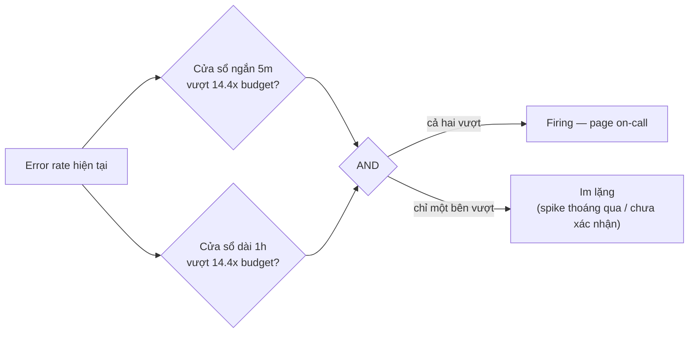

# 🎓 PromQL chuyên sâu + Recording rules + Chiến lược Alerting

> **Tác giả:** Mr.Rom\
> **Phiên bản:** v2.0.1\
> **Tạo lúc:** 24/05/2026\
> **Cập nhật:** 11/06/2026\
> **Level:** Intermediate\
> **Tags:** [MUST-KNOW]\
> **Yêu cầu trước:** [Observability Intermediate — Tổng quan](00_intermediate-overview.md), đã quen các truy vấn Prometheus cơ bản.

> 🎯 *Ở mức cơ bản, bạn viết được `rate(http_requests_total[5m])` và thấy đồ thị nhúc nhích. Nhưng *production* đòi nhiều hơn thế: percentile từ histogram, recording rule để dashboard không làm sập Prometheus, alert kiểu **multi-window burn rate** theo chuẩn Google SRE, cây routing của Alertmanager, và lưu trữ dài hạn bằng Mimir. Bài này đưa bạn từ "viết được PromQL" lên "dùng PromQL để vận hành hệ thống cảnh báo thật" — nơi mỗi alert nổ lên đều đáng để ai đó thức dậy lúc 3 giờ sáng.*

## 🎯 Sau bài này bạn sẽ

- [ ] Dùng thành thạo các hàm **PromQL** nâng cao: `histogram_quantile`, `predict_linear`, `quantile_over_time`.
- [ ] Viết **recording rule** để cắt mạnh tải CPU truy vấn (*query*) trên Prometheus.
- [ ] Viết **alerting rule** kiểu **multi-window burn rate** (mẫu của Google SRE).
- [ ] Cấu hình **Alertmanager**: cây *routing*, *silence* và *inhibition*.
- [ ] Kiểm soát **cardinality** (số tổ hợp label) để tránh bùng nổ metric.
- [ ] Hiểu khi nào cần **Federation + Mimir/Thanos** cho lưu trữ dài hạn và đa *cluster*.
- [ ] Nhận diện và né các *anti-pattern* cảnh báo phổ biến.

---

## Tình huống — 200 cảnh báo mỗi ngày, người trực kiệt sức

Hãy hình dung bạn vừa nhận ca *on-call* (trực sự cố) một tuần. Tổng kết tuần đó nhìn rất nản: hệ thống bắn ra hơn **200 cảnh báo mỗi ngày**, mà phần lớn là loại vô thưởng vô phạt.

Cụ thể, mỗi loại cảnh báo lại sai một kiểu:

- "CPU > 80%" nổ liên tục — nhưng *auto-scaler* tự co giãn xử lý hết, chẳng cần ai động tay.
- "Disk > 85%" gọi điện lúc 3 giờ sáng — trong khi host có ổ đĩa 10TB, 85% nghĩa là vẫn còn 1.5TB trống, hoàn toàn chưa khẩn cấp.
- "Service down" báo loạn — vào kiểm tra thì dịch vụ vẫn chạy ngon, cảnh báo bắn nhầm.
- Và rồi sự cố thật xảy ra lúc 2 giờ chiều — bị chôn vùi giữa 50 cảnh báo giả, mãi 20 phút sau mới có người để ý.

Cảm giác của người trực lúc đó rất dễ đoán: *"Mệt mỏi vì cảnh báo quá rồi. Giờ thấy gì cũng bơ. Kiểu này sớm muộn cũng bỏ lỡ cái thật."* Đây chính là *alert fatigue* — hội chứng "chai" cảnh báo, và nó nguy hiểm vì biến cả hệ thống giám sát đắt tiền thành tiếng ồn nền.

Buổi *post-mortem* (họp mổ xẻ sự cố) sau đó chỉ thẳng ra ba gốc rễ. Thứ nhất, cảnh báo dựa trên **ngưỡng tĩnh** (*threshold-based*) là cách làm lười — production cần cảnh báo dựa trên **SLO + nhiều cửa sổ thời gian**. Thứ hai, không có *runbook* (sổ tay xử lý sự cố) đính kèm nên người trực phải mò trong đêm. Thứ ba, không có cơ chế *silence/inhibition* nên cùng một nguyên nhân gốc lại spam cả trăm cảnh báo.

Bài này sẽ chữa cả ba từ gốc tới ngọn — đó cũng là lộ trình của các phần phía dưới.

---

## 1️⃣ PromQL chuyên sâu

Trước khi chạm tới alert, cần nói thật trôi chảy "ngôn ngữ" để hỏi Prometheus đã. PromQL là cái cần phải thuộc nằm lòng, vì mọi recording rule và alert sau này đều chỉ là một câu PromQL gắn thêm vài dòng cấu hình.

🪞 **Ẩn dụ**: *PromQL giống như **ngôn ngữ pha chế cocktail** — `rate()`, `sum()`, `histogram_quantile()` là các bước "đong — lắc — rót". Chỉ khi đúng thứ tự và đúng tỉ lệ thì ly cocktail (cái alert) mới ngon; pha sai một bước là ra cảnh báo giả (*false alarm*), uống vào "ngộ độc" cả ca trực.*

### Bốn kiểu dữ liệu trong PromQL

Mọi câu PromQL đều trả về một trong bốn kiểu dữ liệu, và phân biệt sai kiểu là lý do số một khiến query không chạy hoặc trả kết quả vô nghĩa. Quan trọng nhất là phân biệt *instant vector* (mỗi series một giá trị tại một mốc thời gian) với *range vector* (mỗi series là một mảng giá trị trải dài theo thời gian) — vì nhiều hàm chỉ nhận đúng một trong hai:

| Kiểu dữ liệu | Mô tả | Ví dụ |
|---|---|---|
| **Instant vector** | Một giá trị tại một mốc thời gian, cho mỗi series | `up`, `http_requests_total` |
| **Range vector** | Một dãy giá trị trải trên khoảng thời gian | `up[5m]`, `http_requests_total[1h]` |
| **Scalar** | Một con số đơn lẻ | `42`, `time()` |
| **String** | Chuỗi văn bản (hiếm dùng) | `"hello"` |

### Bốn nhóm toán tử

PromQL có bốn nhóm toán tử (*operator*), mỗi nhóm một vai trò: *arithmetic* để tính toán, *comparison* để lọc, *logical* để kết hợp các series, và *aggregation* để gộp dữ liệu theo label. Bốn ví dụ dưới đây là đại diện tiêu biểu cho từng nhóm:

```promql
# Arithmetic
node_memory_usage_bytes / node_memory_total_bytes * 100

# Comparison (returns 0/1 series)
node_cpu_usage > 0.8

# Logical (vector ops)
up{job="api"} == 1 and up{job="db"} == 1

# Aggregation
sum by (service) (rate(http_requests_total[5m]))
avg without (instance) (http_request_duration_seconds)
max by (cluster) (kube_pod_status_phase{phase="Pending"})
```

### Các toán tử gộp (aggregation)

Nhóm *aggregation* đáng nhớ riêng vì bạn sẽ dùng nó nhiều nhất khi xây dashboard và alert. Có khoảng chục toán tử, nhưng thực tế `sum/avg/min/max` đã gánh tới 80% trường hợp. `topk/bottomk` rất hợp cho dashboard kiểu "top N service ồn ào nhất", còn `quantile` dùng để xếp phân vị (*percentile*) trên một phân phối:

| Toán tử | Dùng cho |
|---|---|
| `sum` | Tổng (gộp nhiều series) |
| `avg` | Trung bình |
| `min` / `max` | Cực trị (nhỏ nhất / lớn nhất) |
| `count` | Đếm số series |
| `quantile(0.95, ...)` | Phân vị (nên dùng `histogram_quantile` thay thế cho latency) |
| `topk(5, ...)` | 5 series cao nhất |
| `bottomk(5, ...)` | 5 series thấp nhất |
| `stddev` / `stdvar` | Độ lệch chuẩn / phương sai |
| `group` | Như `sum` nhưng trả về 0/1 nhị phân |
| `count_values("status", ...)` | Phân bố theo giá trị label |

### Các hàm trên range vector

Khác với toán tử gộp (làm việc trên *instant vector*), nhóm hàm này nhận đầu vào là **range vector** — tức metric kèm khoảng thời gian như `[5m]`. `rate()` là hàm dùng nhiều nhất, tính tốc độ tăng trung bình mỗi giây cho counter. Riêng `predict_linear` thì đặc biệt: nó ngoại suy (dự báo) giá trị tương lai từ xu hướng hiện tại — rất hợp để cảnh báo "đĩa sắp đầy":

```promql
# Rate of increase per second (for counters)
rate(http_requests_total[5m])

# Increase over period
increase(http_requests_total[5m])    # rate * range duration

# Instant rate (last 2 points)
irate(http_requests_total[5m])       # for fast-changing — graph-friendly

# Average over time
avg_over_time(cpu_usage[10m])

# Quantile over time (e.g., P95 of CPU over 10m window)
quantile_over_time(0.95, cpu_usage[10m])

# Max over time
max_over_time(memory_usage[1h])

# Delta (for gauges, not counters)
delta(temperature[5m])

# Derivative (per-second slope for gauge)
deriv(temperature[5m])

# Prediction (linear regression)
predict_linear(disk_free_bytes[1h], 24*3600)  # extrapolate 24h
```

### Tính percentile từ histogram

Đây là phần dễ sai nhất với người mới, nên đáng dừng lại lâu hơn. Khi một dịch vụ ghi *latency* dưới dạng histogram, Prometheus không lưu từng giá trị riêng lẻ mà gom vào các "xô" (*bucket*): metric kết thúc bằng `_bucket` đếm số request rơi vào từng khoảng, kèm `_count` (tổng số) và `_sum` (tổng giá trị). Để rút ra một con số percentile (P95, P99...) từ đống bucket đó, ta dùng `histogram_quantile`:

```promql
# P95 latency
histogram_quantile(0.95,
  sum by (le) (rate(http_request_duration_seconds_bucket[5m]))
)

# P95 per service
histogram_quantile(0.95,
  sum by (service, le) (rate(http_request_duration_seconds_bucket[5m]))
)

# P50 (median)
histogram_quantile(0.5, sum by (le) (rate(http_request_duration_seconds_bucket[5m])))
```

Có hai điểm phải nhớ. Label `le` (viết tắt của *less than or equal*) chính là ranh giới trên của mỗi bucket, và bắt buộc phải giữ nó trong mệnh đề `sum by (le)` — bỏ đi là kết quả sai bét. Còn `histogram_quantile` thì *nội suy* (ước lượng) giá trị tại phân vị bạn yêu cầu dựa trên các bucket — nên độ chính xác phụ thuộc vào việc bucket được chia mịn hay thô.

### Vài mẫu truy vấn hay dùng

Cuối cùng, đây là bộ "công thức nấu sẵn" cho những câu hỏi xuất hiện hằng ngày trong vận hành — tỉ lệ thành công, tỉ lệ lỗi, độ bão hoà, dự báo đĩa đầy. Bạn gần như sẽ copy-paste chúng vào dashboard và alert suốt ngày, nên đáng thuộc.

Tỉ lệ thành công (*success rate*) — phần request không trả về lỗi 5xx trên tổng request:

```promql
sum(rate(http_requests_total{status!~"5.."}[5m]))
/
sum(rate(http_requests_total[5m]))
```

Tỉ lệ lỗi theo từng service — dùng `sum by (service)` để tách riêng từng dịch vụ:

```promql
sum by (service) (rate(http_requests_total{status=~"5.."}[5m]))
/
sum by (service) (rate(http_requests_total[5m]))
```

Độ bão hoà của *connection pool* (số kết nối đang dùng so với mức tối đa) — chạm 80% là dấu hiệu sắp nghẽn:

```promql
postgres_connections_in_use / postgres_connections_max > 0.8
```

Dự báo đĩa đầy trong 4 giờ tới — `predict_linear` ngoại suy xu hướng dung lượng trống, nếu kết quả âm nghĩa là sẽ cạn trước mốc đó:

```promql
predict_linear(node_filesystem_avail_bytes[1h], 4*3600) < 0
```

Phát hiện pod restart bất thường — tốc độ restart trong 15 phút lớn hơn 0:

```promql
rate(kube_pod_container_status_restarts_total[15m]) > 0
```

Top 5 nguồn log ồn ào nhất — hữu ích khi đi truy vết nơi đang xả log quá đà:

```promql
topk(5,
  sum by (source) (rate(loki_log_entries_received_total[5m]))
)
```

---

## 2️⃣ Recording rules — tính trước để khỏi tính lại

Viết PromQL trôi chảy rồi, nhưng có một cái bẫy về hiệu năng đang chờ ngay phía trước. Khi những câu truy vấn đắt đỏ đó bị gọi đi gọi lại hàng trăm lần mỗi phút, chính Prometheus sẽ quỵ. Recording rule sinh ra để giải đúng bài toán này.

### Vấn đề

Hãy hình dung một dashboard có 10 panel, mỗi panel chạy một biểu thức PromQL nặng (histogram quantile, nhiều phép gộp lồng nhau). Mỗi panel tự làm mới sau 30 giây, lại có vài người cùng mở dashboard — cộng dồn lại thành hàng trăm query mỗi phút, tất cả ập vào cùng lúc. Kết quả: CPU của Prometheus bị bão hoà, dashboard load ì ạch, và tệ hơn là các alert (cũng chạy query) bị tranh CPU nên trễ giờ.

### Cách giải

Ý tưởng đơn giản: thay vì tính lại biểu thức đắt đỏ mỗi lần ai đó hỏi, ta **tính trước theo định kỳ** rồi lưu kết quả thành một metric (time series) mới. Dashboard và alert sau đó chỉ việc đọc metric đã-tính-sẵn — nhanh như tra một con số có sẵn thay vì làm lại cả phép toán.

### Khai báo một recording rule

Recording rule được khai báo trong file rules của Prometheus, gom theo `groups`. Mỗi rule có `record` (tên metric mới) và `expr` (biểu thức để tính). Ví dụ dưới gói bốn rule hay dùng nhất — P95 latency, success rate, và tốc độ request ở ba cửa sổ thời gian:

```yaml
# prometheus rules file
groups:
  - name: http_recording_rules
    interval: 30s
    rules:
      # P95 latency per service
      - record: service:http_request_duration_seconds:p95
        expr: |
          histogram_quantile(0.95,
            sum by (service, le) (rate(http_request_duration_seconds_bucket[5m]))
          )
      
      # Success rate per service
      - record: service:http_success_rate:5m
        expr: |
          sum by (service) (rate(http_requests_total{status!~"5.."}[5m]))
          /
          sum by (service) (rate(http_requests_total[5m]))
      
      # Total requests per service (1m, 5m, 30m windows)
      - record: service:http_requests:rate1m
        expr: sum by (service) (rate(http_requests_total[1m]))
      - record: service:http_requests:rate5m
        expr: sum by (service) (rate(http_requests_total[5m]))
      - record: service:http_requests:rate30m
        expr: sum by (service) (rate(http_requests_total[30m]))
```

### Quy ước đặt tên (chuẩn chính thức của Prometheus)

Đặt tên recording rule không tuỳ tiện được — Prometheus có quy ước chính thức, và tuân theo nó giúp cả team nhìn tên là đoán ra ý nghĩa. Cấu trúc gồm ba phần ngăn nhau bằng dấu hai chấm:

```text
level:metric:operations
```

Ý nghĩa từng phần:

- `level` — mức gộp dữ liệu (`service`, `cluster`, `region`, `global`).
- `metric` — tên metric gốc.
- `operations` — phép đã áp lên (`p95`, `rate5m`, `sum`).

Vài ví dụ cụ thể để dễ hình dung:

- `service:http_requests:rate5m`
- `cluster:node_cpu_usage:avg`
- `global:user_signups:total`

### Áp dụng qua Prometheus Operator (trên K8s)

Khi chạy trên Kubernetes với *kube-prometheus*, bạn không sửa file rules trực tiếp mà khai báo qua một CRD tên `PrometheusRule`. Operator sẽ tự nạp nó vào Prometheus. Cùng nội dung rule, nhưng bọc trong manifest K8s:

```yaml
apiVersion: monitoring.coreos.com/v1
kind: PrometheusRule
metadata:
  name: http-recording-rules
  namespace: monitoring
  labels:
    release: kube-prometheus
spec:
  groups:
    - name: http_recording
      interval: 30s
      rules:
        - record: service:http_success_rate:5m
          expr: |
            sum by (service) (rate(http_requests_total{status!~"5.."}[5m]))
            /
            sum by (service) (rate(http_requests_total[5m]))
```

### Tác động lên hiệu năng

Vậy recording rule thực sự cứu được bao nhiêu? Bảng dưới đặt hai kịch bản cạnh nhau — không có và có recording rule — để thấy con số khác biệt:

| Không có recording rule | Có recording rule |
|---|---|
| Mở dashboard: 200 query × biểu thức nặng = vài phút CPU dồn cục | Mở dashboard: 200 lần tra metric đã tính sẵn = ~5s |
| Làm mới 30s × 24h = 86400 lần đánh giá biểu thức nặng | Rule đánh giá mỗi 30s = 86400 lần, dashboard tra cứu gần như miễn phí |

Điểm tinh tế cần nhìn ra: tổng khối lượng tính toán gần như **không đổi**, nhưng cách phân bổ thì khác hẳn. Recording rule trải đều tải ra liên tục (đều đặn mỗi 30s), thay vì để nó dồn thành một cú spike đúng lúc người dùng mở dashboard. Spike mới là thứ giết Prometheus, không phải tổng tải.

Quy tắc rút ra: **dùng recording rule cho mọi biểu thức bị lặp lại** trong dashboard và alert. Còn những query chỉ chạy một lần khi điều tra thì không cần.

---

## 3️⃣ Alerting rules — từ ngưỡng tĩnh tới burn rate

Recording rule cho ta những con số tin cậy và rẻ để tra cứu. Giờ là lúc biến chúng thành cảnh báo — nhưng đúng cách, để không lặp lại thảm cảnh 200 alert/ngày ở đầu bài. Phần này đi từ cách làm ngây thơ (ngưỡng tĩnh) tới mẫu chuẩn production (multi-window burn rate).

### Cảnh báo theo ngưỡng tĩnh (cách hay bị lạm dụng)

Cách đầu tiên ai cũng nghĩ tới là đặt một ngưỡng cố định: CPU vượt 80% thì báo. Đơn giản, nhưng đây chính là kiểu cảnh báo lười đã gây ra alert fatigue:

```yaml
- alert: HighCPU
  expr: node_cpu_usage > 0.8
  for: 5m
  labels:
    severity: warning
  annotations:
    summary: "High CPU on {{ $labels.instance }}"
    description: "CPU is {{ $value }}"
```

Ba vấn đề của cách này: CPU 80% có khi là cố ý (đang chạy *batch job* nặng), một instance đơn lẻ ồn lên cũng bắn alert, và quan trọng nhất — cảnh báo không nói được người trực phải *làm gì*.

### Cảnh báo dựa trên SLO (mẫu Google SRE)

Hướng đúng đắn là gắn cảnh báo vào trải nghiệm người dùng, thông qua SLO. Bạn định nghĩa một mục tiêu (ví dụ 99.9% request thành công), rồi chỉ báo động khi **ngân sách lỗi (*error budget*) đang bị đốt quá nhanh**. Thử cách đơn giản nhất trước — một cửa sổ thời gian duy nhất:

```yaml
- alert: HighErrorRate
  expr: |
    sum(rate(http_requests_total{status=~"5.."}[5m]))
    /
    sum(rate(http_requests_total[5m])) > 0.01      # 1% error rate
  for: 5m
```

Nhưng một cửa sổ vẫn chưa đủ tốt, và đây là chỗ tinh tế: cửa sổ ngắn (5m) phản ứng nhanh nhưng ồn, dễ báo giả vì một spike thoáng qua; cửa sổ dài (1h) thì yên tĩnh nhưng phát hiện sự cố thật quá trễ. Phải chọn một trong hai sao?

### Multi-window, multi-burn-rate (mẫu production)

Câu trả lời là: không phải chọn — ta dùng *cả hai* cùng lúc. Đây là mẫu chuẩn của Google SRE: alert chỉ nổ khi **cả cửa sổ ngắn lẫn cửa sổ dài đều đồng ý** rằng error budget đang bị đốt nhanh. Cửa sổ ngắn lo tốc độ phát hiện, cửa sổ dài lo xác nhận không phải báo giả:

```yaml
# SLO: 99.9% success → error budget = 0.1%
# Burn rate × normal rate = how fast budget consumed

- alert: ErrorBudgetBurnFast
  expr: |
    (
      sum(rate(http_requests_total{status=~"5.."}[5m]))
      /
      sum(rate(http_requests_total[5m]))
    ) > (14.4 * 0.001)              # 14.4x normal rate → burn 5% budget in 1h
    and
    (
      sum(rate(http_requests_total{status=~"5.."}[1h]))
      /
      sum(rate(http_requests_total[1h]))
    ) > (14.4 * 0.001)              # confirmed over 1h
  for: 2m
  labels:
    severity: critical
  annotations:
    summary: "Burning error budget 14.4x faster than normal"
    description: "Will exhaust 30-day budget in {{ ... }}"
    runbook: "https://wiki/runbooks/error-budget-burn"

- alert: ErrorBudgetBurnSlow
  expr: |
    (... 1h window ...) > (3 * 0.001)
    and
    (... 6h window ...) > (3 * 0.001)
  for: 15m
  labels:
    severity: warning
```

Logic `and` giữa hai cửa sổ chính là phần trừu tượng nhất của mẫu này, nên đáng vẽ ra cho rõ. Alert chỉ nổ khi cả hai "bồi thẩm" cùng gật đầu:



→ Cửa sổ ngắn cho tốc độ phát hiện, cửa sổ dài cho độ tin cậy — spike thoáng qua chỉ kích được một nhánh nên không bao giờ qua được cổng `AND`.

### Ma trận cửa sổ burn rate (theo SRE textbook)

Vậy nên ghép những cặp cửa sổ nào với nhau, và ở tốc độ đốt bao nhiêu? SRE textbook của Google đưa ra một bảng chuẩn. Mỗi dòng là một quy tắc cảnh báo: tốc độ đốt càng nhanh thì cửa sổ càng ngắn và mức độ càng nghiêm trọng:

| Tốc độ đốt | Cửa sổ ngắn | Cửa sổ dài | Mức tiêu thụ ngân sách |
|---|---|---|---|
| **Critical (gọi điện)** | 5m | 1h | 2% trong 1h, đốt hết ngân sách 30 ngày rất nhanh |
| **Critical (gọi điện)** | 30m | 6h | 5% trong 6h |
| **Warning (tạo ticket)** | 2h | 24h | 10% trong 24h |
| **Warning (tạo ticket)** | 6h | 72h | 30% trong 72h |

Nhờ nhiều ngưỡng xếp chồng, hệ thống bắt được cả hai dạng sự cố: đốt nhanh (sự cố thật, cần gọi điện ngay) và đốt chậm (suy giảm từ từ, chỉ cần tạo ticket) — mà không gây ồn.

### Annotation với templating

Một alert nổ ra mà không kèm thông tin thì cũng vô dụng như không có. Phần `annotations` cho phép nhúng giá trị động (tên service, mức lỗi, link) bằng cú pháp template của Go. Mục tiêu: chỉ cần đọc thông báo là người trực biết *cái gì, ở đâu, và mở link nào*:

```yaml
annotations:
  summary: "Error rate {{ humanizePercentage $value }} for {{ $labels.service }}"
  description: |
    Service {{ $labels.service }} in namespace {{ $labels.namespace }}
    has error rate {{ humanizePercentage $value }} (threshold 1%).
    
    Dashboard: https://grafana/d/api-overview?var-service={{ $labels.service }}
    Logs: https://grafana/explore?...
    Runbook: https://wiki/runbooks/{{ $labels.service }}-errors
```

Thông báo này gói đủ ba thứ người trực cần: *cái gì* (mức lỗi), *ở đâu* (service + namespace), và *đi đâu tiếp* (link tới dashboard, logs và runbook). Đó là khác biệt giữa một alert giúp được người trực và một alert chỉ làm họ tỉnh giấc.

---

## 4️⃣ Alertmanager — Routing, Silence và Inhibition

Prometheus quyết định *khi nào* một alert nổ. Nhưng *gửi nó cho ai, gộp ra sao, lúc nào nên im* lại là việc của Alertmanager — thành phần đứng giữa Prometheus và các kênh thông báo. Đây là nơi ta thật sự dập được tiếng ồn ở đầu bài.

### Cây routing

Alertmanager định tuyến alert bằng một cây quyết định: alert khớp matcher nào thì đi tới *receiver* (kênh nhận) tương ứng. Cây này lồng nhau được — ví dụ alert của team database đi vào Slack của họ, nhưng nếu là `critical` thì rẽ tiếp sang PagerDuty. Cấu hình mẫu cho một tổ chức nhiều team:

```yaml
# alertmanager.yaml
route:
  receiver: default-team
  group_by: [alertname, cluster, namespace]
  group_wait: 30s
  group_interval: 5m
  repeat_interval: 4h
  
  routes:
    # Critical → PagerDuty
    - matchers:
        - severity=~"critical"
      receiver: pagerduty
      group_wait: 0s
      repeat_interval: 1h
    
    # Database team alerts
    - matchers:
        - team="database"
      receiver: database-team-slack
      routes:
        - matchers:
            - severity=~"critical"
          receiver: database-team-pagerduty
    
    # Payment service
    - matchers:
        - service=~"payment.*"
      receiver: payment-team-slack
    
    # Maintenance window suppress
    - matchers:
        - alertname="HostDown"
        - environment="maintenance"
      receiver: blackhole          # /dev/null

receivers:
  - name: default-team
    slack_configs:
      - api_url: $SLACK_WEBHOOK
        channel: '#ops-alerts'
  
  - name: pagerduty
    pagerduty_configs:
      - service_key: $PD_KEY
        description: "{{ .GroupLabels.alertname }}"
  
  - name: payment-team-slack
    slack_configs:
      - channel: '#payment-alerts'
        title: "{{ .GroupLabels.alertname }}"
        text: "{{ range .Alerts }}{{ .Annotations.summary }}\n{{ end }}"
  
  - name: blackhole
```

### Grouping — gộp lại để bớt ồn

Vũ khí đầu tiên chống ồn là *grouping*. Khi một sự cố làm 100 instance cùng báo lỗi, ta không muốn 100 tin nhắn — ta muốn một tin gộp đủ thông tin. Bốn tham số dưới điều khiển việc gộp này:

```yaml
group_by: [alertname, cluster]
group_wait: 30s        # wait 30s for related alerts
group_interval: 5m     # send updates every 5m
repeat_interval: 4h    # re-send if still firing after 4h
```

Hiệu quả thấy ngay: 100 alert từ cùng một sự cố được gộp lại thành đúng một thông báo, liệt kê hết các instance bên trong. Người trực đọc một lần là nắm toàn cảnh.

### Silence — tắt tiếng tạm thời

Có những lúc bạn *biết trước* sẽ ồn — ví dụ đang deploy phiên bản mới và *rolling restart* chắc chắn làm bắn vài alert. Lúc đó dùng *silence*: tắt tiếng thủ công, có thời hạn, cho các alert khớp selector. Tạo qua UI của Alertmanager:

```text
Matchers:
  - service="payment"
  - environment="production"

Starts: now
Ends: now + 2h
Comment: "Deploying v2.5.0, suppress noise during rolling restart"
Creator: oncall@acme.com
```

Hoặc nhanh hơn bằng dòng lệnh với `amtool`:

```bash
amtool silence add \
  service=payment environment=production \
  --duration=2h \
  --comment="Deploy v2.5.0"
```

### Inhibition — chặn alert hệ quả

Silence là thủ công; *inhibition* là tự động theo luật. Ý tưởng: khi một sự cố gốc xảy ra, đừng để các alert hệ quả spam thêm. Ví dụ kinh điển — khi `ClusterDown` nổ, đừng gọi thêm `PodDown` (vì pod chết là hệ quả tất nhiên của cluster chết):

```yaml
inhibit_rules:
  - source_matchers:
      - alertname="ClusterDown"
    target_matchers:
      - alertname=~"PodDown|ServiceDown|HighLatency"
    equal: [cluster]
```

Luật này nói: khi `ClusterDown` đang nổ, mọi `PodDown` cùng `cluster` đó bị nén lại, không gửi đi. Người trực chỉ nhận đúng một alert về nguyên nhân gốc.

### Receiver — gửi nhiều kênh cùng lúc

Mỗi *receiver* không nhất thiết chỉ một kênh. Một receiver có thể đẩy đồng thời lên Slack, PagerDuty, email và cả webhook tuỳ biến — hữu ích khi muốn vừa báo nhanh vừa lưu vết vào hệ thống quản lý sự cố:

```yaml
receivers:
  - name: payment-team
    # Multiple channels per receiver
    slack_configs:
      - channel: '#payment-alerts'
    pagerduty_configs:
      - service_key: ...    # business-hours only via PD schedule
    email_configs:
      - to: payment-team@acme.com
    webhook_configs:
      - url: https://incident.io/api/alerts
```

Ở đây một alert thanh toán sẽ đồng thời vào Slack, gọi PagerDuty, gửi email và bắn sang Incident.io (công cụ quản lý sự cố). Mỗi kênh phục vụ một mục đích khác nhau.

---

## 5️⃣ Quản lý cardinality

Đến đây hệ thống alert đã gọn gàng. Nhưng có một "kẻ giết Prometheus" âm thầm khác, không liên quan tới alert mà liên quan tới *cách bạn gắn label* lên metric. Nó tên là *cardinality explosion*, và nhiều đội chỉ phát hiện ra khi Prometheus đột nhiên ngốn hết RAM rồi chết.

### Cardinality là gì?

Hiểu đơn giản, *cardinality* (lực lượng tập hợp) là **số tổ hợp label độc nhất** của một metric. Mỗi tổ hợp label khác nhau tạo ra một time series riêng biệt, và Prometheus lưu trữ tính theo *từng series*:

```promql
http_requests_total{service="api", method="GET", path="/users", status="200"}
http_requests_total{service="api", method="GET", path="/users", status="500"}
http_requests_total{service="api", method="POST", path="/orders", status="200"}
# ...
```

Ba dòng trên là ba series khác nhau, vì tổ hợp label khác nhau. Càng nhiều tổ hợp, càng nhiều series, càng tốn RAM và CPU.

### Khi cardinality bùng nổ

Vấn đề bùng nổ khi bạn gắn vào label một thứ có quá nhiều giá trị khả dĩ. Tuyệt đối tránh các label sau, vì mỗi cái có thể đẻ ra hàng triệu series:

- `user_id` — hàng triệu người dùng.
- `request_id` — mỗi request một giá trị.
- `email` — mỗi người một địa chỉ.
- `IP address` — rất nhiều IP.
- `URL kèm query param` (`?page=N&filter=...`) — gần như vô hạn biến thể.

Chỉ một label tai hại là đủ gây thảm hoạ:

```promql
http_requests_total{user_id="u-12345"}    # ← một triệu series!
```

Hậu quả: Prometheus chậm dần, tốn kém, rồi *OOM* (hết bộ nhớ, bị kernel kill).

### Cardinality bao nhiêu là chấp nhận được?

Ngược lại, các label "hiền" có tập giá trị hữu hạn và nhỏ thì dùng thoải mái:

- `service` — vài chục giá trị.
- `method` — GET, POST, PUT, DELETE.
- `status` — 200, 400, 500... khoảng chục giá trị.
- `pod` — vài trăm tới vài nghìn.
- `namespace` — vài chục.

Quy tắc ngón tay cái: mỗi label nên có **dưới 100 giá trị độc nhất**, và tổng cardinality mỗi metric nên giữ **dưới 10.000 series**.

### Phát hiện metric cardinality cao

Khi nghi ngờ có metric đang phình to, hai cách dưới giúp bạn tìm ra thủ phạm — qua API trạng thái TSDB hoặc qua chính PromQL:

```bash
# Top 10 metrics by cardinality
curl -s http://prometheus:9090/api/v1/status/tsdb | jq '.data.seriesCountByMetricName[]' | head -10

# Or via PromQL
topk(10, count by (__name__)({__name__=~".+"}))
```

### Cách khắc phục

Tìm ra thủ phạm rồi thì có bốn hướng xử lý, từ thô tới tinh. Đầu tiên, **bỏ label độc hại ngay lúc scrape** bằng *relabeling*:
   ```yaml
   scrape_configs:
     - job_name: api
       relabel_configs:
         - source_labels: [__meta_kubernetes_pod_label_user_id]
           action: drop
   ```

Hướng thứ hai: **gộp dữ liệu trước khi lưu** bằng recording rule, dùng `sum without` để vứt bỏ các label cardinality cao:

```yaml
- record: service:http_requests:rate5m
  expr: sum without (user_id, request_id) (rate(http_requests_total[5m]))
```

Hướng thứ ba: **đưa dữ liệu per-request sang traces**. Thay vì nhét `user_id` vào label của metric, hãy đặt nó làm thuộc tính của span trong tracing — *traces* sinh ra vốn để gánh dữ liệu cardinality cao.

Hướng thứ tư: **dùng histogram bucket cho path/route**. Thay vì tạo một metric riêng cho từng đường dẫn, dùng bucket `le` để đo phân phối latency — số bucket cố định, không phình theo số path.

### Mimir/Thanos khi cần quy mô lớn

Nếu sau tất cả mà bạn *thật sự* cần hàng triệu series — chẳng hạn lưu trữ dài hạn hoặc gộp đa cluster — thì câu trả lời không phải tinh chỉnh Prometheus đơn lẻ nữa, mà là một hệ thống mở rộng ngang:

- **Grafana Mimir** — kế thừa Cortex, mở rộng Prometheus theo chiều ngang.
- **Thanos** — federation + lưu trữ dài hạn trên S3.
- **VictoriaMetrics** — lựa chọn thay thế, vận hành đơn giản hơn.

Chi tiết các hệ này thuộc về bài advanced. Ở mức intermediate, việc cần nhớ là: cứ tránh cardinality explosion trước đã, đó là 90% giá trị.

---

## 6️⃣ Hands-on: dựng trọn bộ recording + alert

Giờ ráp mọi mảnh ghép lại thành một thứ chạy thật. Mục tiêu phần này: với một service FastAPI, dựng đủ chuỗi từ recording rule → định nghĩa SLO → alert burn rate → cấu hình Alertmanager → kích lỗi để kiểm chứng cảnh báo nổ đúng. Năm bước nối tiếp nhau.

### Bước 1: Recording rules cho FastAPI

Bắt đầu từ nền móng: bốn recording rule tính sẵn các chỉ số cốt lõi của FastAPI — tốc độ request, tỉ lệ thành công, P95 và P99 latency. Mọi alert phía sau sẽ dựa trên những metric đã-tính-sẵn này:

```yaml
# fastapi-recording.yaml
apiVersion: monitoring.coreos.com/v1
kind: PrometheusRule
metadata:
  name: fastapi-recording
  namespace: production
  labels:
    release: kube-prometheus
spec:
  groups:
    - name: fastapi_recording
      interval: 30s
      rules:
        - record: service:http_requests:rate5m
          expr: |
            sum by (service, status) (rate(http_requests_total{service="fastapi"}[5m]))
        
        - record: service:http_success_rate:5m
          expr: |
            sum(rate(http_requests_total{service="fastapi",status!~"5.."}[5m]))
            /
            sum(rate(http_requests_total{service="fastapi"}[5m]))
        
        - record: service:http_p95_latency:5m
          expr: |
            histogram_quantile(0.95,
              sum by (le) (rate(http_request_duration_seconds_bucket{service="fastapi"}[5m]))
            )
        
        - record: service:http_p99_latency:5m
          expr: |
            histogram_quantile(0.99,
              sum by (le) (rate(http_request_duration_seconds_bucket{service="fastapi"}[5m]))
            )
```

### Bước 2: Định nghĩa SLO

Tiếp theo, ghi rõ mục tiêu cần đạt thành một file SLO — coi như "hợp đồng chất lượng" của dịch vụ: 99.9% request thành công, P95 dưới 500ms, P99 dưới 1s, tính trên cửa sổ trượt 30 ngày. Đây là cơ sở để suy ra ngưỡng burn rate ở bước sau:

```yaml
# fastapi-slo.yaml
apiVersion: v1
kind: ConfigMap
metadata:
  name: fastapi-slo
data:
  slo.yaml: |
    service: fastapi
    slo:
      success_rate: 0.999          # 99.9% requests success
      p95_latency: 0.5             # P95 < 500ms
      p99_latency: 1.0             # P99 < 1s
    error_budget:
      window: 30d                  # 30-day rolling
```

### Bước 3: Alerting rules với burn rate

Giờ biến SLO thành cảnh báo. Ba alert: fast burn (đốt nhanh → gọi điện ngay), slow burn (đốt chậm → tạo ticket), và một alert latency P95. Chú ý cách công thức `14.4 * (1 - 0.999)` và `3 * (1 - 0.999)` lấy thẳng tốc độ đốt từ ma trận ở §3:

```yaml
# fastapi-alerts.yaml
apiVersion: monitoring.coreos.com/v1
kind: PrometheusRule
metadata:
  name: fastapi-alerts
  namespace: production
spec:
  groups:
    - name: fastapi_burn_rate
      rules:
        # Fast burn (page immediately)
        - alert: FastAPIErrorBudgetBurnFast
          expr: |
            (
              1 - (
                sum(rate(http_requests_total{service="fastapi",status!~"5.."}[5m]))
                /
                sum(rate(http_requests_total{service="fastapi"}[5m]))
              )
            ) > (14.4 * (1 - 0.999))
            and
            (
              1 - (
                sum(rate(http_requests_total{service="fastapi",status!~"5.."}[1h]))
                /
                sum(rate(http_requests_total{service="fastapi"}[1h]))
              )
            ) > (14.4 * (1 - 0.999))
          for: 2m
          labels:
            severity: critical
            team: backend
          annotations:
            summary: "FastAPI: Error budget burning 14.4x faster than allowed"
            description: |
              FastAPI error rate is 14.4x faster than SLO (99.9%) burn allows.
              At this rate, 30-day error budget exhausted in ~2 days.
              
              Dashboard: https://grafana.acmeshop.vn/d/fastapi
              Logs: https://grafana.acmeshop.vn/explore?service=fastapi&type=logs
              Runbook: https://wiki.acmeshop.vn/runbooks/fastapi-error-spike
        
        # Slow burn (ticket)
        - alert: FastAPIErrorBudgetBurnSlow
          expr: |
            (
              1 - (
                sum(rate(http_requests_total{service="fastapi",status!~"5.."}[6h]))
                /
                sum(rate(http_requests_total{service="fastapi"}[6h]))
              )
            ) > (3 * (1 - 0.999))
            and
            (
              1 - (
                sum(rate(http_requests_total{service="fastapi",status!~"5.."}[24h]))
                /
                sum(rate(http_requests_total{service="fastapi"}[24h]))
              )
            ) > (3 * (1 - 0.999))
          for: 30m
          labels:
            severity: warning
            team: backend
          annotations:
            summary: "FastAPI: Error budget slow burn"
            description: |
              Persistent elevated error rate over 6h+24h.
              Less urgent than fast burn, but trend negative.
        
        # Latency SLO
        - alert: FastAPILatencyP95High
          expr: service:http_p95_latency:5m > 0.5     # 500ms
          for: 10m
          labels:
            severity: warning
          annotations:
            summary: "FastAPI P95 latency > 500ms"
            description: "Currently {{ $value }}s"
```

### Bước 4: Cấu hình Alertmanager

Có alert rồi, định tuyến chúng: `critical` đi thẳng PagerDuty để gọi điện, alert của team backend vào Slack, và một luật inhibition để `ClusterDown` nén mọi cảnh báo hệ quả trong cùng cluster:

```yaml
# alertmanager.yaml
route:
  receiver: default
  group_by: [alertname, service]
  group_wait: 30s
  group_interval: 5m
  repeat_interval: 4h
  
  routes:
    - matchers:
        - severity=~"critical"
      receiver: pagerduty-backend
      group_wait: 0s
      repeat_interval: 1h
    
    - matchers:
        - team="backend"
      receiver: backend-team-slack
      routes:
        - matchers:
            - severity=~"critical"
          receiver: pagerduty-backend

receivers:
  - name: default
    slack_configs:
      - channel: '#ops-alerts'
        api_url: $SLACK_WEBHOOK
  
  - name: backend-team-slack
    slack_configs:
      - channel: '#backend-alerts'
        title: "[{{ .GroupLabels.severity | toUpper }}] {{ .GroupLabels.alertname }}"
        text: |
          {{ range .Alerts }}
          *Service:* {{ .Labels.service }}
          *Summary:* {{ .Annotations.summary }}
          *Description:* {{ .Annotations.description }}
          {{ end }}
  
  - name: pagerduty-backend
    pagerduty_configs:
      - service_key: $PD_KEY_BACKEND

inhibit_rules:
  - source_matchers:
      - alertname="ClusterDown"
    target_matchers:
      - severity=~"warning|critical"
    equal: [cluster]
```

### Bước 5: Kiểm chứng

Cuối cùng, đừng tin alert cho tới khi thấy nó nổ thật. Cách kiểm chứng đơn giản: bơm một loạt lỗi vào hệ thống rồi quan sát chuỗi phản ứng lan tới tận PagerDuty. Tạo lỗi bằng một vòng `curl`:

```bash
# Inject errors (curl loop)
for i in {1..1000}; do
  curl https://api.acmeshop.vn/intentional-error
done
```

Sau khi bơm lỗi, lần lượt theo dõi từng mắt xích để xác nhận pipeline thông suốt:

1. Trên Prometheus, query `service:http_success_rate:5m` — phải thấy tỉ lệ thành công tụt xuống.
2. Trên Alertmanager, alert chuyển sang trạng thái firing (sau khi qua mốc `for: 2m`).
3. Kênh Slack `#backend-alerts` nhận được thông báo.
4. PagerDuty gọi điện cho người đang trực.

Nếu cả bốn mắt xích đều phản ứng, pipeline cảnh báo của bạn đã thật sự hoạt động — chứ không chỉ "trông có vẻ đúng" trên giấy.

---

## 7️⃣ Federation + Mimir/Thanos

Tránh được cardinality explosion thì một Prometheus đơn lẻ đi được khá xa. Nhưng nó vẫn có trần — và khi chạm trần, bạn cần kiến trúc lớn hơn. Phần này phác qua các lựa chọn, đủ để biết khi nào nên bước sang.

### Giới hạn của một Prometheus đơn lẻ

Một node Prometheus, dù khoẻ tới đâu, vẫn vướng ba giới hạn cứng: chứa được khoảng 10 triệu series, ổ đĩa local quanh mức 15TB, và quan trọng nhất — chỉ một node nghĩa là một điểm chết duy nhất (*SPOF — single point of failure*). Vượt qua bất kỳ giới hạn nào trong số này là dấu hiệu cần kiến trúc khác.

### Federation (cơ bản)

Bước trung gian rẻ nhất là *federation*: một Prometheus cấp cluster chỉ kéo về các metric *đã được gộp sẵn* (recording rule) từ các Prometheus của từng team. Nhờ vậy lượng dữ liệu giảm mạnh mà vẫn giữ được góc nhìn toàn cục:

```yaml
# Cluster-level Prometheus federates from team Prometheus
scrape_configs:
  - job_name: federate
    scrape_interval: 60s
    honor_labels: true
    metrics_path: /federate
    params:
      match[]:
        - '{__name__=~"job:.+"}'         # only `job:*` recording rules
        - '{__name__=~"service:.+"}'      # only `service:*`
    static_configs:
      - targets:
          - prometheus-team-a:9090
          - prometheus-team-b:9090
```

Như vậy Prometheus cấp cluster chỉ hút về metric đã gộp sẵn từ từng team — giảm dữ liệu mà vẫn nhìn được xuyên team. Đủ cho quy mô vừa, nhưng federation không giải được bài toán lưu trữ dài hạn. Lúc đó tới lượt Mimir.

### Mimir (Grafana, kế thừa Cortex)

Mimir biến Prometheus thành một hệ mở rộng ngang thực thụ. Cài bằng Helm:

```bash
helm install mimir grafana/mimir-distributed \
  --namespace mimir \
  --create-namespace \
  -f values.yaml
```

Về bản chất, Mimir tách Prometheus thành nhiều thành phần để mở rộng độc lập: đường *ingest* nhận metric qua `remote_write`, lớp *storage* đẩy block lên S3/GCS, đường *query* truy vấn xuyên toàn bộ kho — và nhờ vậy gánh được trên 100 triệu series với thời gian lưu hàng năm.

Để đẩy dữ liệu sang, Prometheus cấp cluster chỉ cần khai báo `remote_write` trỏ về Mimir:

```yaml
remote_write:
  - url: http://mimir.mimir.svc/api/v1/push
```

### Thanos (cũ hơn, vẫn phổ biến)

Thanos nhắm cùng mục tiêu với Mimir nhưng theo kiến trúc khác: chạy *sidecar* gắn vào mỗi Prometheus để tải block lên S3, và một thành phần *query* để truy vấn liên kết. Điểm mạnh của Thanos là cắm thẳng vào hệ Prometheus có sẵn mà gần như không phải sửa gì.

Lời khuyên chọn lựa cho năm 2026: nếu dựng mới, chọn Mimir (đang phát triển tích cực); nếu đã có sẵn Prometheus và chỉ muốn thêm lưu trữ dài hạn, dùng Thanos sidecar.

---

## 💡 Cạm bẫy thường gặp & Best practice

Phần lý thuyết đã xong. Nhưng đa số nỗi đau về alert lại đến từ những lỗi rất "đời" — đặt sai ngưỡng, quên runbook, hay phình cardinality. Dưới đây là những cái bẫy phổ biến nhất, kèm cách chữa.

### ❌ Cạm bẫy: Cảnh báo trên CPU/RAM thô

```yaml
- alert: HighCPU
  expr: cpu_usage > 0.8
```

Loại này ồn và không có gì để hành động — CPU 80% nhiều khi là cố ý (đang chạy batch).

→ **Cách sửa**: Cảnh báo trên **tác động tới người dùng** (tỉ lệ lỗi, độ trễ). Bão hoà CPU phần lớn tự xử lý qua HPA, không cần đánh thức ai.

### ❌ Cạm bẫy: `for: 1m` quá ngắn

```yaml
for: 1m
```

Cửa sổ quá ngắn khiến alert *flapping* (nổ tắt liên tục) — một biến động thoáng qua cũng đủ kích hoạt.

→ **Cách sửa**: Tối thiểu `for: 5m` cho alert không nguy cấp. Riêng burn rate alert đã tự lo việc này nhờ cơ chế hai cửa sổ.

### ❌ Cạm bẫy: Alert không có link runbook

```yaml
annotations:
  summary: "Service down"
```

Người trực bị đánh thức lúc 3 giờ sáng, đọc xong vẫn không biết phải làm gì.

→ **Cách sửa**: Bắt buộc có trường `runbook_url`, kiểm tra bằng lint trong CI để không alert nào lọt qua mà thiếu.

### ❌ Cạm bẫy: Cardinality bùng nổ vì label

```promql
http_requests_total{user_id="u-123", request_id="r-abc"}
```

Gắn `user_id`/`request_id` vào label sẽ làm Prometheus *OOM* — chết vì hết bộ nhớ.

→ **Cách sửa**: Rà soát các *exporter* metric, gỡ bỏ label cardinality cao, chuyển dữ liệu per-request sang traces.

### ❌ Cạm bẫy: Recording rule có biểu thức quá nặng

```yaml
- record: foo:complex:5m
  expr: |
    histogram_quantile(0.99, 
      sum by (le, user_id) (rate(http_request_duration_seconds_bucket[5m]))
    )
```

Dù đã tính trước, recording rule vẫn chạy mỗi 30s. Nếu bản thân biểu thức mất 5s mới xong thì chính nó làm Prometheus tắc nghẽn (chú ý: ví dụ trên còn vô tình gom theo `user_id` — vừa nặng vừa nổ cardinality).

→ **Cách sửa**: Đo thời gian đánh giá từng rule:

```bash
curl http://prometheus:9090/api/v1/rules | jq '.data.groups[].rules[] | {name, evaluationTime}'
```

Rule nào mất hơn 1s thì phải tối ưu hoặc tách nhỏ.

### ❌ Cạm bẫy: Ngưỡng tĩnh không co giãn theo quy mô

```yaml
- alert: HighRequests
  expr: rate(http_requests_total[5m]) > 1000
```

Ngưỡng 1000 hợp lý hôm nay. App lớn lên gấp 10 lần là nó báo giả triền miên.

→ **Cách sửa**: Dùng tốc-độ-của-tốc-độ (phát hiện bất thường) hoặc burn rate (tính tương đối theo SLO) — cả hai đều tự co giãn.

### ❌ Cạm bẫy: Mọi alert cùng một mức ưu tiên

Để alert nào cũng gọi điện cho người trực là con đường ngắn nhất tới kiệt sức (*burnout*).

→ **Cách sửa**: Phân ba tầng rõ ràng:

- **critical** → PagerDuty (gọi điện/SMS).
- **warning** → kênh Slack.
- **info** → email tổng hợp.

### ❌ Cạm bẫy: Alert chưa từng được kiểm thử

```yaml
- alert: ServiceDown
  expr: up == 0
```

Một alert chưa bao giờ test có thể chứa lỗi trong `expr` — và đúng lúc dịch vụ chết thật thì nó lại không nổ.

→ **Cách sửa**:

- Viết unit test bằng `promtool test rules`.
- Định kỳ làm bài tập *chaos* (chủ động giết dịch vụ rồi xác nhận alert có nổ).

### ✅ Best practice: Đo "vệ sinh" cảnh báo

Đừng để bộ alert mục ruỗng theo thời gian. Theo dõi vài chỉ số sức khoẻ và làm việc này đều đặn:

- Số lượng alert mỗi tuần (mục tiêu: dưới 50).
- Thời gian từ lúc nổ tới lúc có người tiếp nhận.
- Alert tự hết mà không cần ai làm gì (= báo giả → nên xoá).
- Alert lặp đi lặp lại (= dấu hiệu cần tự động hoá việc xử lý).

Định kỳ ngồi lại rà soát và xoá thẳng tay những alert vô dụng.

### ✅ Best practice: Sinh runbook tự động

Liên kết tự động giữa alert và runbook qua tên, để không phải gắn link thủ công cho từng cái:

```yaml
annotations:
  runbook_url: "https://wiki.acmeshop.vn/runbooks/{{ .Labels.alertname }}"
```

Đường dẫn runbook trên wiki khớp đúng tên alert — chuẩn hoá một lần, dùng cho mọi alert.

### ✅ Best practice: SLI/SLO nằm cạnh code

Cuối cùng, hãy để định nghĩa SLO sống cùng repo của dịch vụ, được version chung với code, thay vì nằm rời trong cấu hình hạ tầng:

```yaml
# slos.yaml in app repo
service: fastapi
slos:
  - name: availability
    target: 0.999
    sli: |
      sum(rate(http_requests_total{service="fastapi",status!~"5.."}[5m]))
      / sum(rate(http_requests_total{service="fastapi"}[5m]))
  - name: latency
    target: 0.99
    sli: |
      histogram_quantile(0.99, sum by (le) (rate(http_request_duration_seconds_bucket{service="fastapi"}[5m]))) < 1
```

Khi đó SLO do team sở hữu và đi cùng vòng đời code. Các công cụ như **OpenSLO** hoặc **Sloth** sẽ tự sinh ra Prometheus rule từ file SLO này.

---

## 🧠 Tự kiểm tra (Self-check)

Năm câu hỏi dưới chạm đúng những chỗ dễ nhầm nhất của bài. Bạn thử tự trả lời trước khi mở đáp án — đây là cách nhanh nhất để biết mình thật sự hiểu hay chỉ mới thấy quen.

**Q1.** Vì sao multi-window burn rate alert tốt hơn cảnh báo theo ngưỡng tĩnh?

<details>
<summary>💡 Đáp án</summary>

**Threshold alert** (`error_rate > 1%`):
- **False positive at high traffic**: 1% of 100K req/sec = 1000 errors/sec. May be normal jitter.
- **False negative at low traffic**: 1% of 10 req/sec = 0.1 errors/sec. Tiny but bad service.
- **No time dimension**: 1 minute spike treated same as 6h sustained.

**Multi-window burn rate**:
- **Normalized to SLO**: "Are we burning error budget faster than allowed?"
- **Short + long windows**:
  - Short (5min) — fast detect spike.
  - Long (1h) — confirm not transient.
  - Both must agree → reduce false positive.
- **Multiple burn rates**:
  - Fast (14.4x) — page urgently, real incident.
  - Slow (3x) — ticket, gradual degradation.

**Net effect**:
- Catch big spikes within 2-5 min (fast burn).
- Catch slow degradation over hours (slow burn).
- Avoid noise from transient blips (long window confirms).

→ Industry standard 2026: multi-window. Threshold for legacy systems only.
</details>

**Q2.** Vì sao recording rule cải thiện hiệu năng dù tổng khối lượng tính toán không đổi?

<details>
<summary>💡 Đáp án</summary>

**Without recording rules**:
- Dashboard opens → 20 panels × expensive query × 30 user concurrent → 600 query bursts.
- Prometheus CPU spike, query latency 10s+.
- Alerts query same expressions → compete for CPU.
- User experience: dashboard slow, alerts delayed.

**With recording rules**:
- Recording rule runs every 30s (constant load).
- Dashboard query lookup precomputed metric = 1ms.
- 20 panels × 30 users × 1ms = nothing.
- Alerts also use precomputed.

**Total compute same**:
- Recording rule: query runs 1× per 30s, all day = 2880 evals.
- Without: query runs N× per dashboard view, but spiky.

**Key benefit**: **distribute load**. Constant 1 eval / 30s instead of spike when users access.

**Bonus**: same query result available to ALL consumers (dashboards + alerts + API). Single source of truth.

**Caveat**: high-cardinality recording rule wastes storage. Be selective. Only precompute expensive + frequently-used queries.
</details>

**Q3.** Cardinality vs trace data — phân biệt khi nào dùng cái nào?

<details>
<summary>💡 Đáp án</summary>

**Metric (Prometheus)**:
- **Aggregate** over time (rate, sum, percentile).
- **Low cardinality** by design (< 10K series per metric).
- **Time-series** efficient storage.
- Use for: "How many requests/sec? P99 latency? Error rate per service?"

**Trace (Tempo/Jaeger)**:
- **Per-request** detail.
- **High cardinality** by nature (every request unique trace_id).
- **Index by trace_id**, slow scan otherwise.
- Use for: "Why was request X slow? Which DB call took 1s in trace abc123?"

**Rule of thumb**:
| Question | Use |
|---|---|
| Aggregate stats | Metric |
| Specific request investigation | Trace |
| Per-user breakdown across all requests | High-card metric (bad) OR exemplars (good) |
| Performance distribution | Histogram metric |
| Cause-effect chain (call hierarchy) | Trace |

**Exemplars** (Prometheus + traces bridge):
- Histogram bucket can include `trace_id` exemplar.
- "Show me a sample slow request for this P99 bucket" → click → jump to trace.
- Best of both worlds.

→ Don't put `user_id` in metric label. Put in trace span attribute. Use exemplars to bridge.
</details>

**Q4.** Alertmanager inhibition vs silence — khi nào dùng cái nào?

<details>
<summary>💡 Đáp án</summary>

**Silence** = **manual, temporary** mute.
- Use case: deploying v2.5, expect 5 min noisy → silence 30 min.
- Set start/end time, comment, creator.
- Re-fire automatically when silence ends.

**Inhibition** = **rule-based, automatic** suppression.
- Use case: `ClusterDown` fires → suppress all dependent alerts (PodDown, ServiceDown, etc.).
- Configured in Alertmanager config (always active).
- Automatic — no human action.

**Ví dụ**:

Silence:
- Maintenance window (planned, manual).
- Investigating issue, don't want repeat pages.
- Deprecating service.

Inhibition:
- Cluster outage → service outages (suppress).
- Node down → pod evictions (suppress).
- Network partition → cross-AZ alerts (suppress).

**Both can coexist**: silence for ad-hoc, inhibition for permanent dependencies.

**Anti-pattern**: too many silences indicate alert quality issues. Audit silences quarterly — if same silence recurring, fix root cause (delete or fix alert).

→ Silence = "ignore now". Inhibition = "ignore when X happens".
</details>

**Q5.** Mimir/Thanos so với Prometheus đơn lẻ — khi nào thật sự cần?

<details>
<summary>💡 Đáp án</summary>

**Raw Prometheus đủ khi**:
- Single cluster, ≤ 10M series.
- Retention < 15 days.
- 1-2 person ops team.
- < 15TB metric data.

**Cần Mimir/Thanos khi**:
- **Multi-cluster**: federated query across regions.
- **Long-term retention**: 1 year+ for capacity planning, compliance.
- **High availability**: Prometheus replica = duplicate writes; Mimir dedupe.
- **Multi-tenant**: separate teams' metrics with quotas.
- **Cost**: S3 storage cheaper than local SSD for old data.

**Mimir advantages 2026**:
- Active development (Grafana Labs).
- Single binary, simpler ops than Thanos.
- Built-in alerting.

**Thanos advantages**:
- Larger community (older).
- Sidecar mode = drop-in for existing Prometheus.

**VictoriaMetrics alternative**:
- Simpler than both.
- 10x less RAM than Prometheus.
- Drop-in PromQL compatible.

**Decision**:
- New deployment 2026: Mimir (active dev) or VictoriaMetrics (simpler).
- Existing Prometheus, want long-term: Thanos sidecar.
- Cost-sensitive: VictoriaMetrics.

**Migration path**: Prometheus → add remote_write to Mimir → query Mimir for long-term + Prometheus for hot. Eventually deprecate local Prometheus.
</details>

---

## ⚡ Tra cứu nhanh (Cheatsheet)

```promql
# === Aggregation ===
sum by (service) (rate(http_requests_total[5m]))
avg without (instance) (cpu_usage)
topk(5, ...)
bottomk(5, ...)

# === Histogram ===
histogram_quantile(0.95, sum by (le) (rate(metric_bucket[5m])))

# === Predict ===
predict_linear(disk_free[1h], 24*3600)

# === Window functions ===
rate(metric[5m])               # per-second rate
irate(metric[5m])              # instant rate
increase(metric[5m])           # absolute increase
avg_over_time(metric[10m])
max_over_time(metric[1h])
quantile_over_time(0.95, metric[10m])

# === Counter resets ===
resets(metric[5m])              # # of resets (e.g., service restarts)
changes(metric[5m])             # # of value changes
```

```yaml
# === Recording rule template ===
- record: <level>:<metric>:<ops>
  expr: <expression>

# === Multi-window burn rate ===
- alert: ServiceBudgetBurnFast
  expr: |
    error_rate_5m > 14.4 * (1 - SLO_TARGET) 
    and 
    error_rate_1h > 14.4 * (1 - SLO_TARGET)
  for: 2m
  labels: { severity: critical }
  annotations:
    runbook_url: ...

# === Alertmanager ===
route:
  group_by: [alertname]
  routes:
    - matchers: [severity=critical]
      receiver: pagerduty
    - matchers: [team=backend]
      receiver: backend-slack
```

```bash
# === Tools ===
promtool check rules rules.yaml
promtool test rules tests.yaml
amtool alert query
amtool silence add foo=bar --duration=2h
amtool config routes show
amtool config routes test --tree
```

---

## 📚 Từ Điển Thuật Ngữ (Glossary)

Bảng dưới gom các thuật ngữ xuất hiện trong bài để bạn tra nhanh khi cần — cột giữa là cách gọi tiếng Việt (nếu có), cột phải là giải thích ngắn:

| Thuật ngữ | Tiếng Việt | Giải thích |
|---|---|---|
| **PromQL** | Ngôn ngữ truy vấn Prometheus | Ngôn ngữ để hỏi dữ liệu trong Prometheus |
| **Instant vector / Range vector** | Vector tức thời / vector khoảng | Một giá trị tại một mốc, so với dãy giá trị theo thời gian |
| **`rate()`** | Tốc độ trung bình | Tốc độ tăng trung bình mỗi giây của counter |
| **`irate()`** | Tốc độ tức thời | Tốc độ tính trên 2 điểm cuối cùng |
| **`increase()`** | Mức tăng tuyệt đối | Lượng tăng = rate × khoảng thời gian |
| **`histogram_quantile()`** | Tính phân vị | Tính percentile từ các bucket của histogram |
| **`predict_linear()`** | Ngoại suy tuyến tính | Dự báo giá trị tương lai bằng hồi quy tuyến tính |
| **Recording rule** | Luật ghi sẵn | Tính trước một query, lưu thành metric mới |
| **Alerting rule** | Luật cảnh báo | Query kích cảnh báo khi vượt ngưỡng |
| **Burn rate** | Tốc độ đốt ngân sách | Tốc độ tiêu thụ error budget (so với mức bình thường) |
| **Multi-window alert** | Cảnh báo nhiều cửa sổ | Alert xác thực trên 2 cửa sổ (ngắn + dài) |
| **Alertmanager** | — | Định tuyến alert tới các receiver (Slack/PagerDuty/email) |
| **Routing tree** | Cây định tuyến | Cấu hình định tuyến alert phân cấp |
| **Silence** | Tắt tiếng | Tắt tạm thời thủ công các alert khớp selector |
| **Inhibition** | Nén/chặn | Tự động nén alert khi một alert khác đang nổ |
| **Receiver** | Kênh nhận | Nơi gửi alert tới (Slack/PagerDuty/email/webhook) |
| **Cardinality** | Lực lượng (số tổ hợp) | Số tổ hợp label độc nhất của một metric |
| **Series** | Chuỗi thời gian | Một tổ hợp metric + label độc nhất (1 time series) |
| **Federation** | Liên kết | Prometheus cấp cluster hút dữ liệu từ Prometheus của team |
| **Mimir** | — | Prometheus mở rộng ngang của Grafana (kế thừa Cortex) |
| **Thanos** | — | Prometheus liên kết kèm lưu trữ trên S3 |
| **VictoriaMetrics** | — | Một metrics DB hiệu năng cao thay thế |
| **OpenSLO / Sloth** | — | Công cụ sinh Prometheus rule từ định nghĩa SLO |
| **Exemplar** | Mẫu đại diện | Một mẫu (vd `trace_id`) gắn vào bucket histogram |

---

## 🔗 Liên kết & Tài nguyên

### 🧭 Định hướng lộ trình học

- ⬅️ **Bài trước:** [Observability Intermediate — Từ "có dashboard" đến "SRE practice"](00_intermediate-overview.md)
- ➡️ **Bài tiếp theo:** [Loki + LogQL deep — Structured logging + quản lý cardinality](02_loki-logql-deep.md)
- ↑ **Về cụm:** [Observability — System Monitoring, Logging & Tracing](../../README.md)

### 🧩 Các chủ đề có thể bạn quan tâm

- ☸️ [Autoscaling & Operators — HPA, VPA, KEDA, CRD + Controller](../../../kubernetes/lessons/02_intermediate/04_autoscaling-and-operators.md) — HPA dùng PromQL custom metric
- 🔁 [Progressive Delivery — Argo Rollouts canary + Feature flags](../../../ci-cd/lessons/02_intermediate/04_progressive-delivery.md) — Argo Rollouts phân tích metric

### 🌐 Tài nguyên tham khảo khác

- 📖 [PromQL docs](https://prometheus.io/docs/prometheus/latest/querying/basics/)
- 📖 [PromLabs cheat sheet](https://promlabs.com/promql-cheat-sheet/)
- 📖 [SRE Workbook — Alerting on SLOs](https://sre.google/workbook/alerting-on-slos/)
- 📖 [Alertmanager docs](https://prometheus.io/docs/alerting/latest/alertmanager/)
- 📖 [Mimir docs](https://grafana.com/docs/mimir/)
- 📖 [Thanos docs](https://thanos.io/)
- 📖 [VictoriaMetrics docs](https://docs.victoriametrics.com/)
- 📖 [OpenSLO](https://openslo.com/)
- 📖 [Sloth — SLO generator](https://sloth.dev/)
- 📖 [Awesome Prometheus alerts](https://samber.github.io/awesome-prometheus-alerts/) — recipe collection

---

## 📌 Nhật ký thay đổi (Changelog)

- **v1.0.0 (24/05/2026)** — Bản đầu tiên. Lesson 01 intermediate. PromQL chuyên sâu (functions, operators, aggregation, range, histogram_quantile, predict_linear) + recording rules + multi-window burn rate alerts (Google SRE pattern) + Alertmanager routing/silence/inhibition + cardinality management + Mimir/Thanos federation. 8 cạm bẫy + 3 best practice + 5 self-check + cheatsheet.
- **v1.1.0 (25/05/2026)** — Thêm lời dẫn trước Data types + Operators + Aggregation + Range functions.
- **v2.0.0 (07/06/2026)** — Viết lại toàn bộ prose sang tiếng Việt narrative theo gold-standard: viết lại tình huống mở đầu và các đoạn "điện tín" EN ở §1–§7 thành câu mạch lạc có lời dẫn trước code/bảng/list; Việt hoá các sub-heading EN thuần (Solution/What's cardinality/Step N...) và metadata field ("Prerequisites" → "Yêu cầu trước"); sửa lỗi nghiêm trọng do bulk-replace ("Long window"/"Long" bị đổi nhầm thành "bạn" trong bảng burn rate + self-check Q1) và lỗi chữ "quanto" ở Q5; Glossary chuyển sang 3 cột (Thuật ngữ | Tiếng Việt | Giải thích); chuẩn hoá heading framework + nav marker (⬅️/➡️/↑) với link-text = tiêu đề H1 thực, gỡ nhãn "(sắp viết)" cho bài 02 đã tồn tại; gỡ residue meta "Apply Blueprint/Apply insight __Ref__" khỏi changelog. Giữ nguyên 100% code/lệnh/config/số liệu và cấu trúc 8 phần.
- **v2.0.1 (11/06/2026)** — Bổ sung sơ đồ multi-window burn rate (cổng AND giữa cửa sổ ngắn + dài) cho trực quan.
