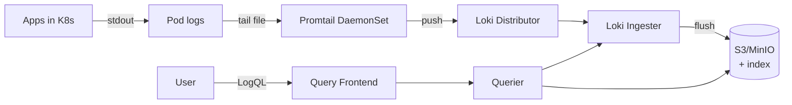

# 🎓 Loki + LogQL deep — Structured logging + quản lý cardinality

> **Tác giả:** Mr.Rom\
> **Phiên bản:** v2.0.0\
> **Tạo lúc:** 24/05/2026\
> **Cập nhật:** 07/06/2026\
> **Level:** Intermediate\
> **Tags:** [MUST-KNOW]\
> **Yêu cầu trước:** [PromQL chuyên sâu + Recording rules + Chiến lược Alerting](01_promql-deep-and-alerting.md), [Logs — Loki, ELK, structured logging](../01_basic/02_logs-loki-elk.md)

> 🎯 *Ở bài basic, bạn mới chỉ ship log với Promtail rồi gõ vài query `{namespace="prod"}` cho vui. Lên production thì khác hẳn: log phải truy vấn được, phải rẻ, và phải không làm sập Loki. Bài này đi sâu vào **LogQL** (regex parse, aggregate, alert từ log), **structured JSON logging** kèm `trace_id` để nối log với trace, **quản lý cardinality** (label sai một cái là Loki vừa chậm vừa đốt tiền), chọn đúng *shipper* (Promtail vs Vector vs Fluent Bit), và xây *retention strategy* hot/warm/cold để hoá đơn S3 không phình. Đích đến: một hệ log production query nhanh, chi phí kiểm soát được.*

## 🎯 Sau bài này bạn sẽ

- [ ] Viết **LogQL** thành thạo — các pattern query phổ biến, parse JSON và aggregate.
- [ ] Tạo **alert từ log** bằng Loki Ruler.
- [ ] Cấu hình **structured JSON logging** cho Python/Node/Go kèm `trace_id`.
- [ ] Hiểu **cardinality của label** — cái gì nên làm label, cái gì tuyệt đối không.
- [ ] So sánh **Promtail vs Vector vs Fluent Bit** để chọn đúng shipper.
- [ ] Thiết kế **retention policy** kèm S3 storage backend.
- [ ] Vận hành Loki **multi-tenant**.
- [ ] Tránh những lỗi hiệu năng Loki hay gặp nhất.

---

## Tình huống — Loki query timeout, hoá đơn AWS tăng vọt

Hãy bắt đầu từ một cảnh rất quen với bất kỳ ai vận hành Loki được vài tháng. Hệ thống đã có Loki từ thời còn ở mức basic, chạy êm. Nhưng 6 tháng sau, mọi thứ bắt đầu rạn nứt cùng lúc:

- Dev mở Grafana, query `{namespace="prod"}` cho 1 giờ gần nhất → **timeout sau 30 giây**.
- Loki ngốn 80 GB RAM → bị OOM kill.
- Hoá đơn AWS: riêng S3 storage của Loki đã $2,500/tháng (quý trước mới $300).
- Dev mới vào càu nhàu: *"Log khó dùng quá, thôi dùng `kubectl logs` cho nhanh."*

Nhìn bề ngoài thì như bốn vấn đề riêng lẻ, nhưng đào xuống tận gốc lại quy về bốn nguyên nhân cụ thể, mỗi cái là một bài học của chương này:

1. **Cardinality bùng nổ**: ai đó thêm label `request_id` → sinh ra hàng triệu *stream*.
2. **Log không cấu trúc** (*unstructured*): mỗi query phải regex parse → chậm.
3. **Retention 90 ngày cho tất cả**: giữ mọi thứ quá lâu → chi phí storage phình.
4. **Promtail để mặc định**: scrape mọi thứ → volume log khổng lồ.

Đây chính là kiểu nợ kỹ thuật âm thầm tích tụ rồi nổ một lần. Phần còn lại của bài sẽ gỡ từng nút một, theo đúng thứ tự để hiểu được "vì sao" trước khi sửa.

---

## 1️⃣ Kiến trúc Loki — nhắc lại nhanh

Trước khi tối ưu, cần nhớ lại Loki được lắp ráp từ những mảnh nào, vì mỗi vấn đề ở trên đều nằm ở một mảnh cụ thể. Loki có **6 component** chia làm 2 đường (*path*): đường ghi (Promtail → Distributor → Ingester → S3) và đường đọc (Querier → Query Frontend → S3). Sơ đồ dưới đây tóm tắt luồng dữ liệu đi từ pod cho tới lúc bạn gõ query:



Vai trò của từng component, đi theo đúng dòng chảy của một dòng log:

- **Promtail / Vector**: bộ thu log (*collector*), chạy dạng DaemonSet trên mỗi node.
- **Distributor**: nhận log, kiểm tra hợp lệ, chia (*shard*) theo stream.
- **Ingester**: đệm log trong RAM, ghi WAL, rồi flush xuống storage.
- **Storage**: object store (S3) chứa các *chunk*, kèm index (BoltDB shipper hoặc TSDB).
- **Querier**: thực thi query LogQL lên cả ingester lẫn storage.
- **Query Frontend**: chẻ nhỏ query, chạy song song, cache kết quả.

### Thiết kế cốt lõi — index label, không index nội dung

Điểm khiến Loki rẻ hơn hẳn nằm ở một quyết định kiến trúc rất táo bạo. Khác với Elasticsearch (index toàn văn mọi thứ), Loki làm ngược lại:

- **Chỉ index label** (phần nhỏ): `{namespace, service, pod}`.
- **Không index nội dung** (phần lớn): dòng log được nén và để nguyên trong S3.
- Khi query: lọc theo label → tải về đúng khối log khớp → `grep` nội dung trong đó.

Hệ quả là một sự đánh đổi rõ ràng: Loki **rẻ hơn 10–30 lần** so với ES, nhưng **chậm hơn** khi phải tìm toàn văn trên toàn bộ dữ liệu.

🪞 **Ẩn dụ**: *Loki giống một **thư viện sắp sách theo kệ chủ đề (label), nhưng không có mục lục tra từng từ trong từng cuốn**. Muốn tìm "sách về Docker" → đi thẳng tới kệ Docker, rất nhanh. Nhưng muốn tìm "cuốn nào có chứa từ X" trên toàn thư viện → phải lật từng trang từng cuốn, rất chậm.* Hiểu được sự đánh đổi này là chìa khoá để dùng Loki đúng cách — và cũng là gốc rễ của bài toán cardinality ở §6.

---

## 2️⃣ Cú pháp LogQL — đi sâu

LogQL là "ngôn ngữ" để hỏi chuyện Loki. Nhìn thoáng qua nó giống PromQL, nhưng dành cho log thay vì metric. Ta sẽ đi từ phần bắt buộc (chọn stream) ra dần tới những thao tác mạnh hơn (parse, aggregate, format).

### Stream selector — bắt buộc

Mỗi query LogQL **bắt buộc** phải mở đầu bằng *stream selector* — phần trong cặp ngoặc nhọn `{...}` dùng để lọc log theo label. Loki sẽ từ chối query nếu bạn để `{}` rỗng, vì như thế là bảo nó quét sạch mọi stream. Cú pháp tương tự PromQL nhưng áp cho log:

```logql
{namespace="production", service="fastapi"}
```

Bên trong selector, bạn ghép label bằng bốn toán tử so khớp:

- `=` khớp chính xác.
- `!=` không bằng.
- `=~` khớp regex.
- `!~` regex không khớp.

```logql
{service=~"fastapi|worker"}                # nhiều service
{namespace=~"prod|staging", env!="dev"}    # loại trừ dev
```

Nguyên tắc vàng: luôn thu hẹp bằng stream selector trước tiên, và không bao giờ để `{}` rỗng.

### Filter expression — lọc theo nội dung

Sau khi đã chọn được stream, bạn dùng **bốn toán tử filter** (`|=`, `!=`, `|~`, `!~`) để lọc tiếp theo *nội dung* dòng log. Vì filter phải quét nội dung nên chậm hơn lọc bằng label — do đó luôn thu hẹp stream trước, filter sau:

```logql
{service="fastapi"} |= "ERROR"             # chứa "ERROR"
{service="fastapi"} != "DEBUG"             # không chứa "DEBUG"
{service="fastapi"} |~ "ERROR|WARN"        # khớp regex
{service="fastapi"} !~ "health.*check"     # regex không khớp

# Nối chuỗi
{service="fastapi"} |= "ERROR" != "expected"
```

Filter luôn chạy *sau* khi đã chọn stream, và quét nội dung nên tốn hơn — đó là lý do thứ tự "stream trước, filter sau" rất quan trọng.

### Parse JSON

Khi app log ra JSON có cấu trúc, dùng pipe `| json` để Loki phân tích — nó tách các field thành **label tạm thời** (chỉ tồn tại trong query, không lưu xuống storage). Sau khi parse, bạn có thể lọc và format theo từng field:

```logql
{service="fastapi"} | json
```

Giả sử app ghi ra một dòng log JSON như sau:

```json
{
  "timestamp": "2026-05-24T10:00:00Z",
  "level": "error",
  "service": "fastapi",
  "trace_id": "abc123",
  "user_id": "u-12345",
  "endpoint": "/orders",
  "duration_ms": 1500,
  "message": "Database connection timeout"
}
```

Sau khi `| json`, mọi field trên trở thành biến để lọc và định dạng lại đầu ra:

```logql
# Lọc theo field JSON
{service="fastapi"} | json | level="error"

# Nhiều điều kiện
{service="fastapi"} | json | level="error" | duration_ms > 1000

# Định dạng lại dòng output
{service="fastapi"} | json | duration_ms > 1000 
  | line_format "{{.timestamp}} {{.endpoint}} {{.duration_ms}}ms"
```

### Parse logfmt

Định dạng phổ biến thứ hai là **logfmt** (`key=value key2=value2`) — kiểu log đặc trưng của hệ sinh thái Go (Kubernetes, Grafana dùng nhiều). Loki có `| logfmt` parse tương tự `| json`:

```text
ts=2026-05-24T10:00:00Z level=error service=fastapi trace_id=abc msg="DB timeout"
```

```logql
{service="fastapi"} | logfmt | level="error"
```

### Parse regex

Khi log không theo định dạng chuẩn nào (ví dụ access log của nginx), bạn dùng `| regexp` với *named capture group* để bóc tách field:

```logql
{service="nginx"} 
  | regexp `(?P<method>\w+) (?P<path>[^ ]+) HTTP/[\d.]+" (?P<status>\d+) (?P<bytes>\d+)`
  | status >= 500
```

Mỗi *named capture group* (như `?P<method>`) sẽ trở thành một field parse được để lọc tiếp.

### Aggregation — "metric query" của LogQL

Điểm thú vị: LogQL không chỉ tìm log, nó còn biến log thành số. Cú pháp aggregate gần như y hệt PromQL, giúp bạn tính tỷ lệ lỗi, top endpoint chậm, percentile... thẳng từ log:

```logql
# Đếm số lỗi mỗi phút theo service
sum by (service) (
  rate({namespace="prod"} | json | level="error" [5m])
)

# Top 10 endpoint chậm nhất
topk(10,
  sum by (endpoint) (
    rate({service="fastapi"} | json | duration_ms > 1000 [5m])
  )
)

# Percentile thứ 95 của duration
quantile_over_time(0.95,
  {service="fastapi"} | json | unwrap duration_ms [5m]
)
```

Hàm `unwrap` là mấu chốt: nó rút một field số (như `duration_ms`) ra để LogQL aggregate được như metric thật.

### `line_format` + `label_format`

Hai pipe này lo phần trình bày: `line_format` đổi cách hiển thị mỗi dòng output, `label_format` thêm hoặc đổi tên label:

```logql
# Tuỳ biến định dạng dòng output
{service="fastapi"} | json 
  | line_format "[{{.level | upper}}] {{.endpoint}} → {{.message}}"

# Thêm / đổi tên label
{service="fastapi"} | json
  | label_format component=`{{.service}}-{{.endpoint}}`
```

### Toán tử so sánh và phép toán

Sau khi parse, bạn có thể so sánh và tính toán trực tiếp trên field số:

```logql
# So sánh
{service="fastapi"} | json | duration_ms > 1000
{service="fastapi"} | json | status_code >= 400 and status_code < 500

# Phép toán
{service="fastapi"} | json | unwrap duration_ms | __error__=""
```

Lưu ý `__error__=""` ở cuối: nó loại bỏ những dòng parse lỗi, tránh làm bẩn kết quả aggregate.

---

## 3️⃣ 10 pattern LogQL phổ biến

Lý thuyết cú pháp ở trên sẽ đọng lại tốt nhất qua các tình huống thật. Dưới đây là 10 query bạn sẽ gõ đi gõ lại trong công việc — gom từ debug sự cố tới phân tích bất thường. Hãy xem đây như một "bộ công thức nấu nhanh".

### 1. Tìm log ERROR

```logql
{namespace="prod"} |= "ERROR"
```

### 2. Tìm một exception cụ thể

```logql
{namespace="prod"} |= "OperationalError" |= "connection"
```

### 3. Truy vết theo trace

```logql
{namespace="prod"} | json | trace_id="abc123"
```

Pattern này gom toàn bộ log của một trace cụ thể, xuyên suốt mọi service — cực kỳ hữu ích khi debug một request đi qua nhiều service.

### 4. Request chậm

```logql
{service="fastapi"} | json | duration_ms > 1000
  | line_format "{{.endpoint}} {{.duration_ms}}ms"
```

### 5. Tỷ lệ lỗi theo service

```logql
sum by (service) (
  rate({namespace="prod"} | json | level="error" [5m])
)
```

### 6. Top 10 nguồn log ồn ào nhất

```logql
topk(10,
  sum by (pod) (rate({namespace="prod"} [5m]))
)
```

### 7. P95 latency lấy từ log

```logql
quantile_over_time(0.95,
  {service="fastapi"} | json | unwrap duration_ms [5m]
)
```

### 8. Gom nhóm theo user

```logql
sum by (user_id) (
  count_over_time({service="payment"} | json | level="error" [10m])
)
```

Dùng pattern này thận trọng: nếu có rất nhiều user, kết quả sẽ sinh ra cardinality cao ngay trong query.

### 9. Phát hiện bất thường — tỷ lệ lỗi thay đổi đột ngột

```logql
# So 5 phút hiện tại với 5 phút trước
(
  sum(rate({service="fastapi"} | json | level="error" [5m]))
  /
  sum(rate({service="fastapi"} | json | level="error" [5m] offset 5m))
) > 2.0    # hiện tại nhiều gấp 2 lần so với 5 phút trước
```

### 10. Stack trace nhiều dòng

```logql
{service="fastapi"} |~ `Traceback.*\n.*\n.*` 
  | line_format "{{.}}"
```

---

## 4️⃣ Alert từ log với Loki Ruler

Tìm được log lỗi là một chuyện; biết ngay khi nó xảy ra lại là chuyện khác. Loki có sẵn **Ruler** — component định kỳ chạy các query LogQL rồi bắn alert khi vượt ngưỡng, hệt như Prometheus làm với metric.

### Cấu hình rule

File rule dưới đây minh hoạ ba kiểu alert thường gặp: tỷ lệ lỗi cao, phát hiện panic, và phát hiện brute-force đăng nhập:

```yaml
# loki-rules.yaml
groups:
  - name: log_alerts
    interval: 30s
    rules:
      - alert: HighErrorRate
        expr: |
          sum by (service) (
            rate({namespace="prod"} | json | level="error" [5m])
          ) > 10
        for: 5m
        labels:
          severity: warning
          team: backend
        annotations:
          summary: "High error rate in {{ $labels.service }}"
          description: "{{ $value }} errors/sec — investigate logs"
      
      - alert: PanicDetected
        expr: |
          rate({namespace="prod"} |= "PANIC" [1m]) > 0
        for: 0m
        labels:
          severity: critical
        annotations:
          summary: "PANIC in production"
          description: |
            Service crashed with panic.
            Logs: https://grafana/explore?q={{ $labels.service }} PANIC
      
      - alert: FailedLoginSpike
        expr: |
          sum by (source_ip) (
            rate({service="auth"} | json | event="login_failed" [5m])
          ) > 100
        for: 2m
        labels:
          severity: warning
          team: security
        annotations:
          summary: "Brute force from {{ $labels.source_ip }}"
```

Alert sinh ra từ log này được định tuyến qua Alertmanager y hệt alert của Prometheus — bạn tái dùng toàn bộ hạ tầng notify đã có.

### Khi nào dùng Loki alert, khi nào dùng Prometheus alert

Hai loại alert này không cạnh tranh mà bổ sung cho nhau. Phân biệt theo bản chất câu hỏi bạn đang hỏi:

**Prometheus alert** hợp khi:
- Dựa trên metric (số): `error_rate > X`.
- Aggregate theo thời gian.
- Ngưỡng là con số.

**Loki alert** hợp khi:
- Bắt **nội dung log cụ thể**: một chuỗi exception, panic, sự kiện bảo mật.
- **Phát hiện pattern**: failed login dồn dập, dấu hiệu SQL injection, stack trace lạ.
- **Sự kiện audit**: trigger theo quy định (truy cập PII, admin đăng nhập).

Kết luận: dùng cả hai, chúng bù trừ cho nhau — Prometheus cho biết "tỷ lệ lỗi tăng", còn Loki cho biết "đang xuất hiện exception loại mới".

---

## 5️⃣ Structured JSON logging

Mọi query đẹp đẽ ở §2–§3 chỉ chạy được khi log có cấu trúc. Đây là lúc bàn tới gốc rễ: log phải ghi ra JSON, không phải chuỗi văn xuôi.

### Sai — log không cấu trúc

Hãy nhìn cách log "tự nhiên" mà ai cũng từng viết:

```python
logger.info("User u-12345 logged in from 1.2.3.4, took 50ms")
```

Vấn đề: Loki không thể lọc theo `user_id` hay `latency` nếu không bổ regex — mỗi query lại phải parse, vừa chậm vừa dễ sai.

### Đúng — log JSON có cấu trúc

Thay vì nhồi mọi thứ vào một câu, tách thành các field rõ ràng:

```python
logger.info("user_login", extra={
    "user_id": "u-12345",
    "source_ip": "1.2.3.4",
    "latency_ms": 50,
    "trace_id": current_trace_id(),
})
```

Kết quả là một dòng JSON gọn gàng, mỗi thông tin một field:

```json
{"timestamp": "2026-05-24T10:00:00Z", "level": "info", "msg": "user_login", "user_id": "u-12345", "source_ip": "1.2.3.4", "latency_ms": 50, "trace_id": "abc123"}
```

Giờ thì `| json | user_id="u-12345"` chạy tức thì, không cần regex. Phần dưới là cách dựng structured logging cho ba ngôn ngữ phổ biến.

### Python — `structlog`

```python
import structlog

structlog.configure(
    processors=[
        structlog.contextvars.merge_contextvars,
        structlog.processors.add_log_level,
        structlog.processors.TimeStamper(fmt="iso"),
        structlog.processors.JSONRenderer(),
    ],
    wrapper_class=structlog.make_filtering_bound_logger(structlog.stdlib.INFO),
)

log = structlog.get_logger()

# Bind context cho request hiện tại (qua middleware)
structlog.contextvars.bind_contextvars(
    trace_id=current_trace_id(),
    user_id=current_user_id(),
)

log.info("order_created", order_id="o-123", amount=99.99)
```

### Node.js — `pino`

```javascript
import pino from 'pino';

const logger = pino({
  level: 'info',
  formatters: {
    level: (label) => ({ level: label }),
  },
  timestamp: pino.stdTimeFunctions.isoTime,
});

logger.info({
  user_id: 'u-12345',
  trace_id: getTraceId(),
  latency_ms: 50,
}, 'user_login');
```

### Go — `zap`

```go
import "go.uber.org/zap"

logger, _ := zap.NewProduction()
defer logger.Sync()

logger.Info("user_login",
    zap.String("user_id", "u-12345"),
    zap.String("trace_id", traceID),
    zap.Int("latency_ms", 50),
)
```

### Middleware cho FastAPI

Mẹo hay nhất để khỏi phải lặp lại `trace_id` ở mọi dòng log: bind nó một lần ở middleware, mọi log trong phạm vi request sẽ tự mang theo:

```python
@app.middleware("http")
async def logging_middleware(request, call_next):
    trace_id = get_trace_id()    # từ OTel context
    structlog.contextvars.bind_contextvars(trace_id=trace_id)
    
    start = time.time()
    response = await call_next(request)
    duration_ms = int((time.time() - start) * 1000)
    
    log.info("http_request",
        method=request.method,
        path=request.url.path,
        status_code=response.status_code,
        duration_ms=duration_ms,
    )
    
    structlog.contextvars.clear_contextvars()
    return response
```

Nhờ vậy, mọi dòng log trong phạm vi một request đều tự động có `trace_id` — không cần truyền tay.

### Bộ field chuẩn (quy ước production)

Để query xuyên service được, cả tổ chức nên thống nhất một bộ field. Bảng dưới là quy ước thường dùng:

| Field | Kiểu | Mô tả |
|---|---|---|
| `timestamp` | ISO 8601 | Thời điểm sự kiện |
| `level` | string | `debug` / `info` / `warn` / `error` / `fatal` |
| `service` | string | Tên service |
| `version` | string | Phiên bản service |
| `environment` | string | `prod` / `staging` / `dev` |
| `trace_id` | string | OTel trace ID |
| `span_id` | string | OTel span ID |
| `user_id` | string | User đã xác thực (nếu có) |
| `request_id` | string | UUID mỗi request |
| `msg` | string | Mô tả sự kiện |

Chuẩn hoá bộ field này trên mọi service chính là điều kiện để query cross-service hoạt động.

---

## 6️⃣ Quản lý cardinality của label

Đây là phần quan trọng nhất của cả bài, vì cardinality sai là nguyên nhân số một khiến Loki sập như trong tình huống mở đầu. Cần hiểu thật rõ "stream" là gì trước đã.

### "Stream" trong Loki là gì?

Mỗi tổ hợp label *duy nhất* tạo thành **một stream**. Ví dụ ba pod khác nhau của cùng một service:

```text
{namespace="prod", service="fastapi", pod="fastapi-abc"} → stream 1
{namespace="prod", service="fastapi", pod="fastapi-def"} → stream 2
{namespace="prod", service="fastapi", pod="fastapi-ghi"} → stream 3
```

Ba pod = ba stream. Hợp lý, con số nhỏ, Loki xử lý thoải mái.

### Cardinality bùng nổ

Vấn đề nổ ra khi ai đó lỡ tay đưa một giá trị thay đổi liên tục lên làm label. Đây là những label **cardinality cao** — TUYỆT ĐỐI không dùng làm label:

- `user_id` (hàng triệu giá trị).
- `request_id` (mỗi request một giá trị).
- `email`.
- `URL kèm tham số` (`/users/123?filter=...`).

Lý do nằm ở phép nhân không phanh:

```text
{service="fastapi", user_id="u-1"} → stream 1
{service="fastapi", user_id="u-2"} → stream 2
...
{service="fastapi", user_id="u-1000000"} → stream 1M
```

Một triệu user = một triệu stream → ingester OOM, query chậm thê thảm. Chính `request_id` ở tình huống đầu bài là thủ phạm kiểu này.

### Cách làm đúng

Quy tắc đơn giản: cái gì *ít thay đổi* thì làm label, cái gì *thay đổi theo từng request* thì để trong nội dung. Cụ thể:

✅ **Giữ làm label** (cardinality thấp, < 100 giá trị):
- `namespace`, `service`, `pod` (Promtail tự gắn).
- `level` (info, warn, error).
- `cluster`, `region`.

✅ **Giữ trong nội dung** (cardinality cao):
- `user_id`, `trace_id`, `request_id` → để thành field JSON, query bằng `| json | user_id="u-123"`.

Minh hoạ rõ cái đúng và cái sai cạnh nhau:

```python
# Đúng
log.info("payment_processed", user_id="u-123", amount=99.99)
# → dòng JSON, user_id nằm trong nội dung
# Loki label: {service="payment", level="info"}

# Sai
log.info("payment_processed", labels={"user_id": "u-123"})    # ← đừng!
```

### Kiểm tra cardinality

Để biết một label có đang phình hay không, đếm số giá trị duy nhất của nó qua Loki API hoặc Grafana:

```bash
# Loki API
curl http://loki:3100/loki/api/v1/label/<label_name>/values | jq '.data | length'

# Hoặc trong Grafana
# Settings → Loki datasource → tab Cardinality
```

Nên audit hằng tuần và giữ mỗi label dưới 100 giá trị duy nhất.

### Cấu hình giới hạn

Phòng bệnh hơn chữa: đặt giới hạn cứng để Loki tự từ chối khi cardinality vượt ngưỡng, buộc mọi người ghi log đúng cách:

```yaml
# loki config
limits_config:
  max_streams_per_user: 100000
  max_label_value_length: 2048
  max_label_name_length: 1024
  max_label_names_per_series: 30
  
  # Giới hạn theo tenant
  ingestion_rate_mb: 4
  ingestion_burst_size_mb: 6
  
  # Giới hạn query
  max_query_series: 500
  max_query_parallelism: 32
  max_query_length: 30d
```

Khi vượt giới hạn, Loki từ chối ingest — nghe có vẻ phũ nhưng đây chính là cơ chế ép cả team giữ thói quen tốt.

---

## 7️⃣ Promtail vs Vector vs Fluent Bit

Cardinality nằm ở phía Loki, nhưng "lượng log" và "cách parse" lại do *shipper* quyết định. Có ba lựa chọn phổ biến, mỗi cái mạnh ở một hoàn cảnh. Ta xem từng cái rồi đặt chúng cạnh nhau.

### Promtail (gốc của Loki)

Promtail là shipper "cùng nhà" với Loki, cấu hình bằng YAML, có sẵn service discovery cho K8s:

```yaml
# promtail-config.yaml
clients:
  - url: http://loki:3100/loki/api/v1/push

scrape_configs:
  - job_name: kubernetes-pods
    kubernetes_sd_configs:
      - role: pod
    relabel_configs:
      - source_labels: [__meta_kubernetes_namespace]
        target_label: namespace
      - source_labels: [__meta_kubernetes_pod_label_app]
        target_label: app
    pipeline_stages:
      - cri: {}
      - json:
          expressions:
            level: level
            trace_id: trace_id
      - labels:
          level:           # ← cẩn thận cardinality khi promote lên label
```

**Ưu điểm**:
- Gốc của Loki, cài đặt đơn giản.
- Service discovery cho K8s tích hợp sẵn.
- Có *pipeline stage* để parse ngay khi thu.

**Nhược điểm**:
- Chỉ đẩy được vào Loki.
- Ít tính năng hơn Vector.

### Vector (của Datadog, phổ biến từ 2024)

Vector viết bằng Rust, mạnh ở khả năng biến đổi (*transform*) và đẩy tới nhiều đích cùng lúc:

```toml
# vector.toml
[sources.k8s_logs]
type = "kubernetes_logs"

[transforms.parse_json]
type = "remap"
inputs = ["k8s_logs"]
source = '''
  . = parse_json!(.message)
'''

[transforms.filter_debug]
type = "filter"
inputs = ["parse_json"]
condition = '.level != "debug"'

[sinks.loki]
type = "loki"
inputs = ["filter_debug"]
endpoint = "http://loki:3100"
labels = { service = "{{ service }}", level = "{{ level }}" }
```

**Ưu điểm**:
- Nhiều đích (Loki + S3 + Kafka + nhiều nơi khác).
- VRL (*Vector Remap Language*) — biến đổi log rất mạnh.
- Hiệu năng xuất sắc (viết bằng Rust).
- Buffering / retry tích hợp sẵn.

**Nhược điểm**:
- Phải học VRL.
- Kém "K8s-native" hơn Promtail.

### Fluent Bit (CNCF Graduated)

Fluent Bit nhẹ, trưởng thành, cấu hình kiểu INI:

```ini
[INPUT]
    Name              tail
    Path              /var/log/containers/*.log
    Parser            cri
    Tag               kube.*

[FILTER]
    Name              kubernetes
    Match             kube.*

[OUTPUT]
    Name              loki
    Match             *
    Host              loki
    Port              3100
    Labels            namespace=$namespace,pod=$pod
```

**Ưu điểm**:
- Nhẹ (ngốn ít RAM).
- Trưởng thành, được dùng rộng rãi.
- Nhiều đích (Loki, Elasticsearch, CloudWatch...).

**Nhược điểm**:
- Cấu hình kiểu INI kém biểu đạt.
- Viết bằng C, phát triển tính năng chậm hơn Vector.

### Đặt cạnh nhau

Bảng dưới gom mọi tiêu chí lại để bạn chọn nhanh:

| Tiêu chí | Promtail | Vector | Fluent Bit |
|---|---|---|---|
| Sponsor | Grafana Labs | Datadog (open) | CNCF |
| Ngôn ngữ | Go | Rust | C |
| Mức ngốn RAM | Trung bình | Thấp | Thấp nhất |
| Native với Loki | ✅ | ✅ | ✅ |
| Nhiều đích | ❌ (chỉ Loki) | ✅ Nhiều | ✅ Nhiều |
| Sức mạnh transform | Cơ bản | Cao (VRL) | Lua script |
| K8s discovery | Native | Plugin | Plugin |
| Cấu hình | YAML | TOML | INI |
| Cộng đồng 2026 | Mạnh | Đang lên | Mạnh |

Khuyến nghị cho 2026, tuỳ hoàn cảnh:

- **Stack chỉ có Loki**: chọn Promtail (đơn giản nhất).
- **Nhiều đích** (Loki + S3 + Datadog): chọn Vector.
- **Hạn chế RAM**: chọn Fluent Bit.

---

## 8️⃣ Retention strategy + Storage tiers

Log gửi vào rồi thì phải tính chuyện giữ bao lâu — đây là gốc của hoá đơn $2,500 ở đầu bài. Bí quyết là không giữ mọi thứ ở cùng một mức "đắt đỏ".

### Vì sao retention quan trọng

Một app cỡ trung sinh ra khoảng 10–100 GB log mỗi ngày. Giữ vĩnh viễn ở storage nhanh = đốt tiền. Cách làm hợp lý là phân tầng theo độ "nóng" của dữ liệu:

```text
Hot:   7 ngày gần nhất  — SSD nhanh, query thường xuyên
Warm:  8-30 ngày        — S3 standard, chậm hơn
Cold:  31-365 ngày      — S3 IA / Glacier
Archive: > 1 năm        — Glacier Deep Archive (compliance)
```

### Cấu hình retention của Loki

Loki cho phép đặt retention khác nhau cho từng loại log qua `retention_stream` — production giữ lâu, dev giữ ngắn, log compliance giữ rất lâu:

```yaml
# loki config
compactor:
  working_directory: /loki/compactor
  shared_store: s3
  retention_enabled: true
  retention_delete_delay: 2h
  retention_delete_worker_count: 150

limits_config:
  # Retention theo tenant
  retention_period: 720h    # mặc định 30 ngày
  
  # Retention theo stream
  retention_stream:
    - selector: '{environment="prod"}'
      priority: 1
      period: 2160h          # 90 ngày cho prod
    - selector: '{environment="dev"}'
      priority: 2
      period: 168h           # 7 ngày cho dev
    - selector: '{compliance="pci"}'
      priority: 0            # ưu tiên cao nhất
      period: 8760h          # 1 năm cho PCI
```

Nhờ `retention_stream`, mỗi loại log có vòng đời riêng — không còn cảnh "giữ 90 ngày cho tất cả".

### S3 lifecycle policy

Bên dưới Loki, S3 còn tự hạ tầng (*tier*) cho dữ liệu cũ xuống các lớp rẻ hơn theo thời gian:

```json
{
  "Rules": [
    {
      "Id": "loki-tiering",
      "Status": "Enabled",
      "Transitions": [
        { "Days": 30, "StorageClass": "STANDARD_IA" },
        { "Days": 90, "StorageClass": "GLACIER_IR" },
        { "Days": 365, "StorageClass": "DEEP_ARCHIVE" }
      ],
      "Expiration": { "Days": 2555 }
    }
  ]
}
```

S3 tự chuyển dữ liệu sang tier rẻ dần theo thời gian. Loki vẫn query được (nhưng chậm với tier cold). Lưu ý `Expiration: 2555` ngày tương đương 7 năm — mốc hay dùng cho compliance.

### Ước tính chi phí (AWS S3, 100 GB log/ngày)

Con số nói rõ nhất giá trị của việc phân tầng. Cùng một khối lượng log, nếu để hết ở tier nóng sẽ rất đắt; phân tầng kéo tổng chi phí xuống đáng kể:

| Tier | Số ngày | Dung lượng | Chi phí/tháng |
|---|---|---|---|
| Standard | 30 | 3 TB | $69 |
| Standard-IA | 60 | 6 TB | $76 |
| Glacier Instant Retrieval | 275 | 27.5 TB | $110 |
| Deep Archive | còn lại | thay đổi | $20 |
| **Tổng** | | | **~$275** |

So với Elasticsearch để toàn bộ trên SSD nóng (~$3000/tháng cho cùng khối lượng), **Loki rẻ hơn khoảng 10 lần**.

---

## 9️⃣ Hands-on: dựng Loki production

Giờ ráp mọi mảnh lại thành một hệ chạy thật: cài Loki backend S3, dựng Promtail, cấu hình structured logging cho FastAPI, bật alert từ log, rồi test query. Năm bước, đi từ hạ tầng tới ứng dụng.

### Bước 1: Cài Loki với backend S3

```yaml
# loki-values.yaml (Helm)
loki:
  schemaConfig:
    configs:
      - from: "2024-04-01"
        store: tsdb
        object_store: s3
        schema: v13
        index:
          prefix: loki_index_
          period: 24h
  
  storage:
    type: s3
    s3:
      region: us-east-1
      bucketNames:
        chunks: loki-chunks-acme
        ruler: loki-ruler-acme
        admin: loki-admin-acme
  
  limits_config:
    retention_period: 720h    # 30 ngày
    max_streams_per_user: 100000
    ingestion_rate_mb: 8
    ingestion_burst_size_mb: 12

deploymentMode: SimpleScalable   # chế độ 3-binary: write/read/backend

write:
  replicas: 3
  resources:
    requests: { cpu: 500m, memory: 1Gi }
    limits: { cpu: 2, memory: 4Gi }

read:
  replicas: 3
  resources:
    requests: { cpu: 500m, memory: 1Gi }
    limits: { cpu: 2, memory: 4Gi }

backend:
  replicas: 3
  resources:
    requests: { cpu: 200m, memory: 512Mi }
    limits: { cpu: 1, memory: 2Gi }
```

```bash
helm install loki grafana/loki -f loki-values.yaml -n monitoring
```

### Bước 2: Cài Promtail DaemonSet

Promtail chạy trên mỗi node, tail log container và gắn các label chuẩn (namespace, app, node, pod, container) qua `relabel_configs`:

```yaml
# promtail-values.yaml
config:
  clients:
    - url: http://loki-write.monitoring:3100/loki/api/v1/push
  
  positions:
    filename: /tmp/positions.yaml
  
  scrape_configs:
    - job_name: kubernetes-pods
      pipeline_stages:
        - cri: {}
        - json:
            expressions:
              level: level
              trace_id: trace_id
              service: service
      kubernetes_sd_configs:
        - role: pod
      relabel_configs:
        - source_labels: [__meta_kubernetes_namespace]
          target_label: namespace
        - source_labels: [__meta_kubernetes_pod_label_app]
          target_label: app
        - source_labels: [__meta_kubernetes_pod_node_name]
          target_label: node
        - source_labels: [__meta_kubernetes_pod_name]
          target_label: pod
        - source_labels: [__meta_kubernetes_pod_container_name]
          target_label: container
```

```bash
helm install promtail grafana/promtail -f promtail-values.yaml -n monitoring
```

### Bước 3: Cấu hình structured logging cho FastAPI

Phần này áp dụng đúng bài học ở §5: cấu hình `structlog` ra JSON, rồi bind `trace_id` cùng các field chuẩn ở middleware:

```python
# logging_config.py
import structlog
import logging
import sys

logging.basicConfig(
    format="%(message)s",
    stream=sys.stdout,
    level=logging.INFO,
)

structlog.configure(
    processors=[
        structlog.contextvars.merge_contextvars,
        structlog.processors.add_log_level,
        structlog.processors.TimeStamper(fmt="iso"),
        structlog.processors.dict_tracebacks,
        structlog.processors.JSONRenderer(),
    ],
    wrapper_class=structlog.make_filtering_bound_logger(logging.INFO),
)

logger = structlog.get_logger()

# Trong FastAPI app
@app.middleware("http")
async def request_logging(request, call_next):
    from opentelemetry import trace
    span = trace.get_current_span()
    trace_id = format(span.get_span_context().trace_id, "032x")
    
    structlog.contextvars.bind_contextvars(
        trace_id=trace_id,
        service="fastapi",
        version=APP_VERSION,
        environment=ENV,
    )
    
    start = time.time()
    response = await call_next(request)
    duration_ms = int((time.time() - start) * 1000)
    
    logger.info("http_request",
        method=request.method,
        path=request.url.path,
        status_code=response.status_code,
        duration_ms=duration_ms,
    )
    
    structlog.contextvars.clear_contextvars()
    return response
```

### Bước 4: Cấu hình Loki Ruler cho alert từ log

Đóng gói rule vào ConfigMap để Loki Ruler nạp, bắt hai sự kiện quan trọng nhất — tỷ lệ lỗi cao và panic:

```yaml
apiVersion: v1
kind: ConfigMap
metadata:
  name: loki-rules
  namespace: monitoring
data:
  rules.yaml: |
    groups:
      - name: app_log_alerts
        interval: 30s
        rules:
          - alert: HighErrorRate
            expr: |
              sum by (service) (
                rate({namespace="prod"} | json | level="error" [5m])
              ) > 10
            for: 5m
            labels:
              severity: warning
            annotations:
              summary: "{{ $labels.service }} errors {{ $value }}/sec"
          
          - alert: PanicDetected
            expr: |
              rate({namespace="prod"} |~ "PANIC|panic:" [1m]) > 0
            for: 0m
            labels:
              severity: critical
            annotations:
              summary: "PANIC in production"
```

### Bước 5: Test query trong Grafana

Cuối cùng, mở Grafana Explore và chạy thử vài query để xác nhận pipeline thông suốt từ app tới Loki:

```logql
# 1. Mọi lỗi của FastAPI
{service="fastapi"} | json | level="error"

# 2. Request chậm
{service="fastapi"} | json | duration_ms > 1000
  | line_format "{{.path}} {{.duration_ms}}ms"

# 3. Một trace cụ thể
{namespace="prod"} | json | trace_id="abc123"

# 4. Top pod ồn ào nhất
topk(5,
  sum by (pod) (rate({namespace="prod"}[5m]))
)

# 5. Tỷ lệ lỗi theo service theo thời gian
sum by (service) (
  rate({namespace="prod"} | json | level="error" [5m])
)
```

---

## 💡 Cạm bẫy thường gặp & Best practice

### ❌ Cạm bẫy: Label cardinality cao trong pipeline Promtail

```yaml
pipeline_stages:
  - json:
      expressions:
        user_id: user_id
        request_id: request_id
  - labels:
      user_id:        # ← ĐỪNG promote lên label!
      request_id:     # ← ĐỪNG!
```

→ Stream bùng nổ, đúng kịch bản làm Loki OOM.

→ **Fix**: Để field nằm trong nội dung JSON (query bằng `| json | user_id=...`). KHÔNG promote lên label của Loki.

### ❌ Cạm bẫy: Query rỗng `{}`

```logql
{} |= "ERROR"
```

→ Quét toàn bộ stream. Chậm, tốn kém.

→ **Fix**: Luôn thu hẹp stream selector:
```logql
{namespace="prod", service=~"fastapi|payment"} |= "ERROR"
```

### ❌ Cạm bẫy: Không có retention policy

→ Log lớn lên vô tận. Hoá đơn AWS phình to.

→ **Fix**: Retention 30–90 ngày cho production. Log compliance (truy cập PII) giữ lâu hơn bằng tier archive.

### ❌ Cạm bẫy: Promtail tail mọi container

→ Vài app rất ồn (sidecar, hạ tầng). Một pod nói nhiều = 50% volume.

→ **Fix**: Drop ngay trong relabel của Promtail:
```yaml
relabel_configs:
  - source_labels: [__meta_kubernetes_pod_label_app]
    regex: "fluentd|debug-tool"
    action: drop
```

### ❌ Cạm bẫy: Log không cấu trúc

```python
logger.info(f"User {user_id} did {action}, took {duration}ms")
```

→ Không lọc được `user_id` nếu không regex. Query chậm.

→ **Fix**: Dùng structured JSON logging.

### ❌ Cạm bẫy: Trộn lẫn log level

→ DEBUG log trong production = volume + nhiễu + chi phí.

→ **Fix**: Log level production = INFO. Chỉ bật DEBUG khi đang điều tra. Dùng cơ chế **dynamic log level** (đổi level lúc runtime qua API).

### ❌ Cạm bẫy: Không có correlation ID

→ Sự cố xuyên service, trace bị xé lẻ. Không có `request_id` hay `trace_id` → không nối lại được.

→ **Fix**: Lan truyền `trace_id` qua OTel context xuyên mọi service. Đính nó vào mọi dòng log.

### ✅ Best practice: Loki + Tempo correlation

Trong Grafana: click vào dòng log có `trace_id` → "View trace" → nhảy thẳng sang Tempo. Đây là điều hướng xuyên trụ (*cross-pillar*) — từ log sang trace chỉ một cú click.

Cấu hình datasource:
```yaml
# grafana-datasources.yaml
- name: Loki
  jsonData:
    derivedFields:
      - matcherRegex: "trace_id=(\\w+)"
        name: TraceID
        url: '$${__value.raw}'
        datasourceUid: tempo
```

→ Một cú click là từ log nhảy thẳng sang trace tương ứng.

### ✅ Best practice: Giám sát volume log theo service

Theo dõi lượng log mỗi service và alert khi bất thường:

```promql
# Promtail metrics
rate(promtail_sent_bytes_total{tenant="acme"}[5m])
```

→ Volume đột ngột tăng 10 lần = một service đang lỗi (ví dụ vòng lặp vô hạn ghi log).

### ✅ Best practice: Đặt tag tài liệu cho sự kiện

Thêm field `event_type` và ghi rõ tài liệu các giá trị cho phép:

```python
log.info("payment_processed", event_type="payment.success", amount=99.99)
log.info("payment_failed", event_type="payment.failure", reason="declined")
```

→ Sự kiện trở nên dễ tra cứu. Query `{ } | json | event_type=~"payment.*"`.

---

## 🧠 Tự kiểm tra (Self-check)

Năm câu dưới chạm vào đúng những chỗ dễ sai nhất của Loki — từ chi phí, cardinality tới chọn shipper và retention. Bạn thử tự trả lời trước khi mở đáp án, đây là cách nhanh nhất để biết mình đã thật sự hiểu hay chỉ thấy quen.

**Q1.** Vì sao Loki rẻ hơn Elasticsearch tới 10 lần?

<details>
<summary>💡 Đáp án</summary>

**Elasticsearch**:
- **Index toàn văn mọi field**: tốn storage khủng khiếp (gấp 3–5 lần dữ liệu log thô).
- Đặt index trên **SSD/RAM** để query nhanh.
- Phải scale cả cluster tính toán.

**Loki**:
- **Chỉ index label** (nhỏ, có cấu trúc).
- **Nội dung để trong object storage** (S3), nén lại (gzip/snappy).
- Query: lọc theo label → quét các khối nội dung khớp.

**Khác biệt chi phí storage**:
- 100 GB log thô/ngày.
- ES: 300–500 GB đã index trên SSD = $0.10/GB/tháng × 500GB × 30 ngày = $1500/tháng cho 30 ngày dữ liệu.
- Loki: 30 GB nén trên S3 = $0.023/GB/tháng × 30GB × 30 ngày = $20/tháng.

**Đánh đổi**:
- Loki **chậm hơn** khi "tìm bất kỳ log nào chứa X" trên toàn bộ dữ liệu (full scan).
- ES **nhanh hơn** khi search tuỳ ý.

**Khi ES hợp lý**:
- Cần search phức tạp (free text, faceted, fuzzy).
- Compliance yêu cầu truy xuất nhanh qua nhiều năm.
- Dashboard phân tích log (Kibana).

**Khi Loki thắng**:
- Stack K8s/microservices (đã dùng Prometheus + Grafana sẵn).
- Log chủ yếu để debug/correlation (90% trường hợp).
- Quan tâm chi phí.

→ Phần lớn team năm 2026 chọn Loki. ES dành cho hệ cũ hoặc ca dùng chuyên biệt.
</details>

**Q2.** Vì sao kiểm soát cardinality lại quan trọng với hiệu năng Loki?

<details>
<summary>💡 Đáp án</summary>

**Mô hình storage của Loki**:
- Mỗi tổ hợp label duy nhất = 1 **stream**.
- Mỗi stream lưu riêng (chunk trong S3).
- RAM ingester: 1 stream = 1 buffer.

**Với cardinality thấp**:
- 100 service × 10 level × 10 pod/service = 10K stream. Quản được.

**Với label user_id (1 triệu user)**:
- 100 service × 1 triệu user = 100 triệu stream. Ingester OOM.

**Ảnh hưởng tới query**:
- Index Loki: `(label_set) → list_of_chunks`. Ít stream = index nhỏ.
- 100 triệu stream = index khổng lồ, tra cứu chậm.

**Ảnh hưởng tới ingestion**:
- Mỗi dòng log: hash label set → tìm/tạo stream → ghi chunk.
- Nhiều stream = nhiều file chunk = nhiều overhead small-object trên S3.

**Cách giảm thiểu**:
- **Đừng làm label cho thứ thay đổi theo request**: user_id, request_id, trace_id, IP.
- **Giữ label cardinality thấp**: service, namespace, level.
- **Chuyển dữ liệu theo từng sự kiện vào nội dung** (field JSON).
- **Query bằng `| json | user_id="..."`**: quét nội dung, không phải label.

**Chi phí**:
- Cardinality cao = ingester compute tăng vọt + cluster Loki phải scale + chi phí metadata S3.
- Rất dễ đội chi phí 10 lần mà không nhận ra.

→ **Ngân sách cardinality**: nhắm dưới 100K stream tổng mỗi tenant. Giám sát bằng công cụ `cardinality_analyzer`.
</details>

**Q3.** Khi nào dùng Loki alert, khi nào dùng Prometheus alert?

<details>
<summary>💡 Đáp án</summary>

**Prometheus alert**:
- Dựa trên metric (số).
- Câu hỏi định trước (error rate > X, latency > Y).
- Chuỗi thời gian liên tục.
- Hợp cho: vi phạm SLO, bão hoà hạ tầng, bất thường request.

**Loki alert**:
- Dựa trên nội dung (pattern log cụ thể).
- Phát hiện sau sự cố (loại exception mới).
- Theo sự kiện.
- Hợp cho:
  - **Panic / crash**: `|~ "panic:"`.
  - **Bảo mật**: failed login dồn dập từ cùng IP, pattern SQL injection.
  - **Audit**: admin đăng nhập, truy cập PII.
  - **Lỗi cụ thể**: pattern regression đã biết.
  - **Stack trace xuất hiện**: bắt loại exception mới ngay lập tức.

**Bổ trợ nhau**:
- Prometheus: "Service X có error rate tăng cao."
- Loki: "Service X đang ném ra loại exception MỚI (`OperationalError: connection`)."
- Cùng nhau: bức tranh đầy đủ hơn.

**Khi KHÔNG nên dùng Loki alert**:
- Metric volume cao có thể tính được từ log (nên tính thành metric Prometheus — recording rule từ Loki).
- Thống kê aggregate tốt nhất làm dạng metric.

**Ví dụ kết hợp**:
```yaml
# Prometheus: error rate > 1%
- alert: ErrorRateHigh
  expr: ...

# Loki: panic xuất hiện
- alert: PanicDetected
  expr: rate({namespace="prod"} |~ "panic:" [1m]) > 0
```

→ Cả hai cùng bắn trên một sự cố liên quan, cho hai loại tín hiệu khác nhau.
</details>

**Q4.** Vector vs Promtail — tình huống nhiều đích (multi-destination)?

<details>
<summary>💡 Đáp án</summary>

**Tình huống**: cần ship log tới Loki (vận hành) VÀ S3 (compliance/archive) VÀ Kafka (pipeline ML) VÀ Datadog (dashboard cho lãnh đạo).

**Promtail**: chỉ đẩy được vào Loki. Cần shipper riêng cho S3/Kafka/Datadog.

**Vector**: 1 agent, 4 đích:

```toml
[sources.k8s]
type = "kubernetes_logs"

[sinks.loki]
type = "loki"
inputs = ["k8s"]
endpoint = "http://loki:3100"

[sinks.s3]
type = "aws_s3"
inputs = ["k8s"]
bucket = "acme-logs-archive"
compression = "gzip"

[sinks.kafka]
type = "kafka"
inputs = ["k8s"]
bootstrap_servers = "kafka.kafka:9092"
topic = "logs"

[sinks.datadog]
type = "datadog_logs"
inputs = ["k8s"]
api_key = "${DD_API_KEY}"
```

**Lợi thế của Vector**:
- 1 process mỗi node (ngốn ít RAM).
- Transform nhất quán cho mọi đích (lọc bằng VRL một lần, ghi ra nhiều nơi).
- Buffering + retry xử lý backpressure sẵn.

**Tương đương bằng Promtail**: phải triển khai 4 shipper (Promtail + Fluent Bit + uploader S3 tự viết + DD agent). Nhiều thành phần lằng nhằng hơn.

**Đánh đổi**:
- Vector: mạnh hơn, phức tạp hơn một chút.
- Promtail: đơn giản hơn nếu chỉ có Loki.

**Khuyến nghị 2026**:
- Thuần K8s + Loki: Promtail.
- Nhiều đích, workload hỗn hợp: Vector.
- Edge hạn chế RAM: Fluent Bit.

→ Nhiều đích là thế mạnh của Vector. Mục đích đơn nhất = Promtail.
</details>

**Q5.** Retention strategy — phân tầng storage hot/warm/cold cho log thế nào?

<details>
<summary>💡 Đáp án</summary>

**Pattern truy cập** log theo độ tuổi:
- **7 ngày gần nhất**: 95% query (debug sự cố, trạng thái gần đây).
- **8-30 ngày**: 4% query (phân tích xu hướng, đào sâu post-mortem).
- **31-90 ngày**: 1% query (compliance, so sánh theo quý).
- **> 90 ngày**: query hiếm, giữ vì pháp lý/compliance.

**Phân tầng storage** (ví dụ AWS S3):
| Tier | Chi phí/GB/tháng | Độ trễ truy cập | Hợp cho |
|---|---|---|---|
| Standard | $0.023 | < 100ms | Hot (7 ngày gần nhất) |
| Intelligent-Tiering | thay đổi | thay đổi | Tự cân bằng |
| Standard-IA | $0.0125 | < 100ms | Warm (8-30 ngày), trả phí mỗi lần lấy |
| Glacier Instant | $0.004 | < 100ms | Cold (31-365 ngày) |
| Glacier Flexible | $0.0036 | 1-5 phút | Compliance archive |
| Glacier Deep | $0.00099 | 12 giờ | Dài hạn (nhiều năm) |

**Cấu hình**:

Retention Loki:
```yaml
limits_config:
  retention_stream:
    - selector: '{environment="prod"}'
      period: 2160h        # 90 ngày hot
```

S3 lifecycle:
```json
{
  "Rules": [{
    "Transitions": [
      { "Days": 30, "StorageClass": "STANDARD_IA" },
      { "Days": 90, "StorageClass": "GLACIER_IR" },
      { "Days": 365, "StorageClass": "DEEP_ARCHIVE" }
    ],
    "Expiration": { "Days": 2555 }
  }]
}
```

**Lưu ý**:
- Query Loki ở tier Glacier = **chậm** (Deep Archive cần 12 giờ để restore). Phải ghi rõ cho ops biết.
- Log compliance (PII, tài chính) — tách stream riêng với retention dài hơn.
- Test restore hằng quý: đừng để tới lúc audit mới phát hiện hỏng.

**Ví dụ chi phí** (100 GB/ngày):
- Để hết hot: 100 × 0.023 × 30 = $69/tháng cho mỗi 30 ngày dữ liệu.
- Phân tầng: hot $69 + IA $76 + Glacier IR $110 + Deep $20 = **~$275/tháng**.

→ Tiết kiệm đáng kể mà không mất quyền truy cập dữ liệu.
</details>

---

## ⚡ Tra cứu nhanh (Cheatsheet)

Phần tra nhanh cho lúc làm việc thật — gom theo nhóm: các kiểu query LogQL (selector, filter, parse, aggregate, format) và các lệnh API hay dùng cho Loki, Promtail, Ruler.

```logql
# === Selectors ===
{service="fastapi"}
{service=~"api.*"}
{namespace="prod", level="error"}

# === Filter ===
{...} |= "ERROR"
{...} != "DEBUG"
{...} |~ "ERROR|WARN"
{...} !~ "health.*check"

# === Parse ===
{...} | json
{...} | logfmt
{...} | regexp `(?P<name>pattern)`

# === Filter trên field đã parse ===
{...} | json | level="error"
{...} | json | duration_ms > 1000

# === Format ===
{...} | line_format "{{.field1}} {{.field2}}"
{...} | label_format new_label=`{{.field}}`

# === Aggregate ===
sum by (service) (rate({...} | json | level="error" [5m]))
quantile_over_time(0.95, {...} | json | unwrap duration_ms [5m])
topk(10, ...)

# === So sánh với offset ===
(... [5m]) / (... [5m] offset 5m)

# === Nhiều dòng ===
{...} |~ `Traceback.*\n.*`
```

```bash
# === Loki API ===
curl http://loki:3100/loki/api/v1/labels                    # mọi label
curl http://loki:3100/loki/api/v1/label/<name>/values        # giá trị của 1 label
curl 'http://loki:3100/loki/api/v1/query?query={service="fastapi"}'

# === Promtail ===
curl http://promtail:3101/metrics
curl http://promtail:3101/loki/api/v1/push -X POST -d ...

# === Loki Ruler ===
curl http://loki:3100/loki/api/v1/rules
```

---

## 📚 Từ Điển Thuật Ngữ (Glossary)

| Thuật ngữ | Tiếng Việt | Giải thích |
|---|---|---|
| **Loki** | Hệ tổng hợp log | Hệ log của Grafana — index label, nội dung để trong S3 |
| **LogQL** | Ngôn ngữ query của Loki | Cú pháp giống PromQL + thêm filter cho log |
| **Stream** | Luồng log | Một tổ hợp label duy nhất = 1 stream trong Loki |
| **Promtail** | Bộ thu log của Loki | Chạy DaemonSet trên K8s, tail file log |
| **Vector** | Bộ thu log của Datadog | Viết bằng Rust, đẩy được nhiều đích |
| **Fluent Bit** | Bộ thu log nhẹ (CNCF) | Viết bằng C, ngốn ít tài nguyên |
| **Stream selector** | Bộ chọn stream | `{label="value"}` — phần đầu bắt buộc của LogQL |
| **Filter expression** | Biểu thức lọc | `\|=`, `!=`, `\|~`, `!~` — lọc theo nội dung |
| **Parser stage** | Bước parse | `\| json`, `\| logfmt`, `\| regexp` — bóc field |
| **Cardinality** | Số tổ hợp label | Số tổ hợp label duy nhất (cao = tốn kém) |
| **Loki Ruler** | Bộ luật alert | Component chạy rule LogQL → bắn alert |
| **Structured logging** | Log có cấu trúc | Output JSON với bộ field nhất quán |
| **structlog** | Thư viện log Python | Structured logging cho Python |
| **pino** | Thư viện log Node.js | Structured logging cho Node.js |
| **zap** | Thư viện log Go | Structured logging cho Go |
| **`trace_id` correlation** | Nối log với trace | Liên kết dòng log với trace OTel |
| **Mimir** | Backend metric của Grafana | Lựa chọn thay cho Prometheus federation |
| **Storage tier** | Tầng lưu trữ | Hot/warm/cold = SSD / Standard-IA / Glacier |
| **Retention policy** | Chính sách lưu giữ | Giữ log bao lâu trước khi xoá |
| **Multi-tenant** | Đa người thuê | Loki tách dữ liệu theo tenant với quota riêng |
| **Schema config** | Cấu hình schema | Ánh xạ khoảng thời gian → phiên bản schema của Loki |
| **TSDB** | Cơ sở dữ liệu chuỗi thời gian | Định dạng index hiện đại của Loki |

---

## 🔗 Liên kết & Tài nguyên

### 🧭 Định hướng lộ trình học

- ⬅️ **Bài trước:** [PromQL chuyên sâu + Recording rules + Chiến lược Alerting](01_promql-deep-and-alerting.md)
- ➡️ **Bài tiếp theo:** [OpenTelemetry instrumentation — Spans + Context propagation + Sampling](03_opentelemetry-instrumentation.md)
- ↑ **Về cụm:** [Observability — System Monitoring, Logging & Tracing](../../README.md)

### 🧩 Các chủ đề có thể bạn quan tâm

- ⬅️ **Bài trước:** [Logs — Loki, ELK, structured logging](../01_basic/02_logs-loki-elk.md) — nền tảng trước bài này
- ☸️ [Helm — Package manager cho K8s, deploy 50 service không copy-paste](../../../kubernetes/lessons/02_intermediate/01_helm-package-manager.md) — deploy Loki qua Helm

### 🌐 Tài nguyên tham khảo khác

- 📖 [Loki docs](https://grafana.com/docs/loki/)
- 📖 [LogQL docs](https://grafana.com/docs/loki/latest/logql/)
- 📖 [Promtail docs](https://grafana.com/docs/loki/latest/clients/promtail/)
- 📖 [Vector docs](https://vector.dev/docs/)
- 📖 [Fluent Bit docs](https://docs.fluentbit.io/)
- 📖 [structlog (Python)](https://www.structlog.org/)
- 📖 [pino (Node.js)](https://getpino.io/)
- 📖 [zap (Go)](https://pkg.go.dev/go.uber.org/zap)
- 📖 [Grafana data source — Loki](https://grafana.com/docs/grafana/latest/datasources/loki/)
- 📖 [Loki cardinality analyzer](https://grafana.com/blog/2020/12/15/best-practices-for-loki-label-management/)

---

## 📌 Nhật ký thay đổi (Changelog)

- **v1.0.0 (24/05/2026)** — Bản đầu tiên. Lesson 02 intermediate. LogQL deep (selectors + filters + parsers + aggregation) + 10 common patterns + Loki alerting rules + structured JSON logging (Python/Node/Go) + label cardinality management + Promtail/Vector/Fluent Bit comparison + retention strategy with S3 lifecycle. 7 pitfall + 3 best practice + 5 self-check + cheatsheet.
- **v1.1.0 (25/05/2026)** — Apply Blueprint v0.5.4+ §3.6: thêm lead-in trước Architecture + Stream selector + Filter expressions + Parse JSON + Parse logfmt.
- **v2.0.0 (07/06/2026)** — Viết lại sang tiếng Việt narrative theo gold-standard: Việt hoá toàn bộ đoạn "điện tín" (Root causes, Components, Pros/Cons, Bad/Good, các đáp án self-check), thêm lời dẫn trước mỗi code/bảng/list và câu bắc cầu giữa section; chuẩn hoá heading framework (Glossary 3 cột, nav `⬅️/➡️/↑` + link-text = tiêu đề H1 thực, 3 sub-section), Việt hoá metadata "Yêu cầu trước", header bảng (Tiêu chí, Ưu/Nhược điểm) và sub-heading; xoá nhãn "(sắp viết)" cho bài 03 đã tồn tại, sửa nav trỏ đúng tiêu đề thực; thêm ngôn ngữ `text` cho fence output. Giữ nguyên 100% LogQL/code/config/số liệu và cấu trúc 9 phần + diagram.