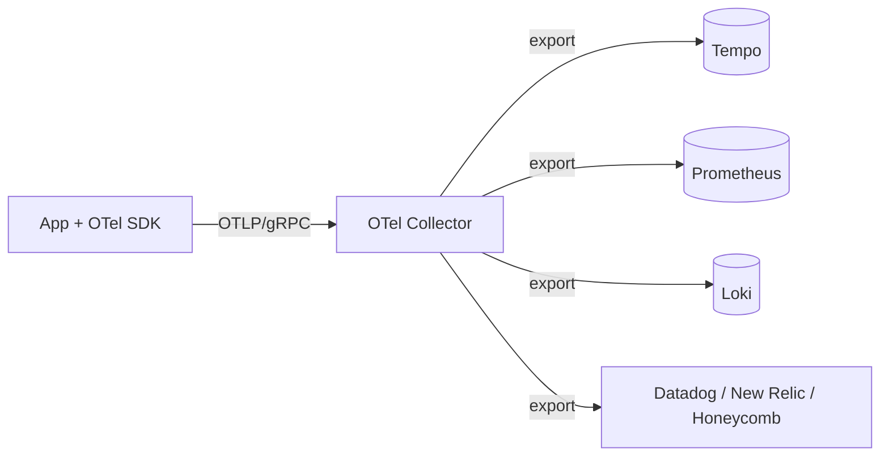
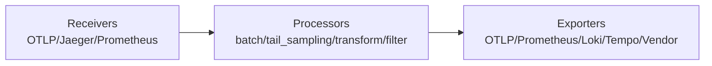
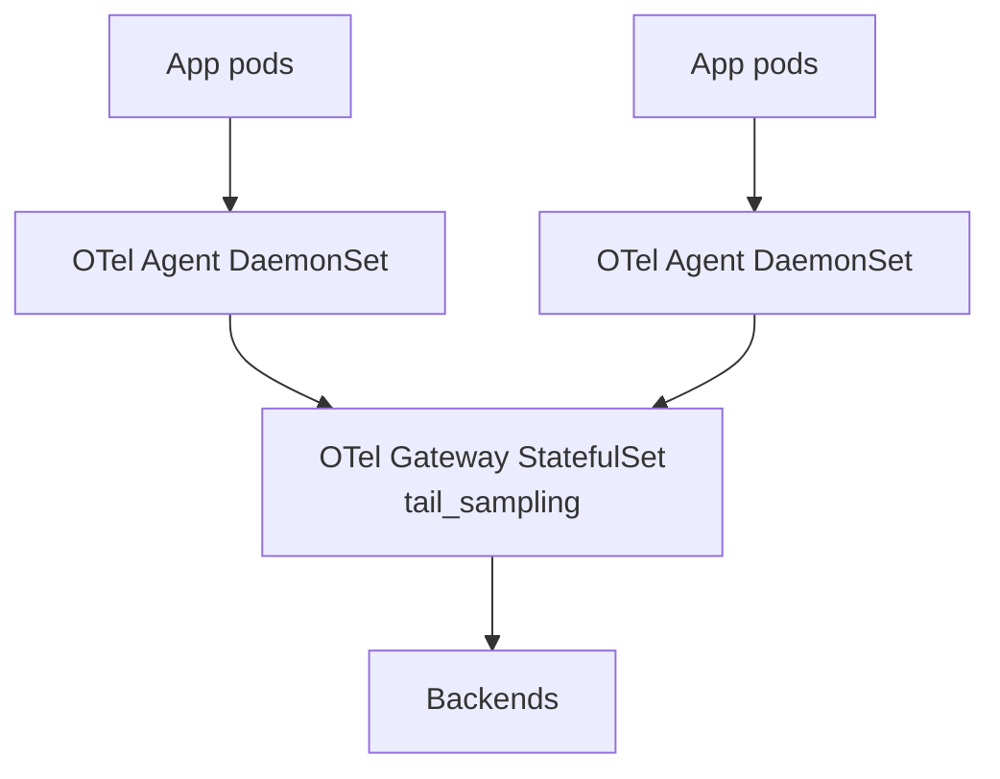

# 🎓 OpenTelemetry instrumentation — Spans + Context propagation + Sampling

> **Tác giả:** Mr.Rom\
> **Phiên bản:** v2.0.0\
> **Tạo lúc:** 24/05/2026\
> **Cập nhật:** 07/06/2026\
> **Level:** Intermediate\
> **Tags:** [MUST-KNOW]\
> **Yêu cầu trước:** [Loki + LogQL deep — Structured logging + cardinality management](02_loki-logql-deep.md), [Traces & OpenTelemetry — Distributed tracing](../01_basic/03_traces-opentelemetry.md)

> 🎯 *Ở bài basic, bạn đã làm quen khái niệm OTel và bật *auto-instrumentation* (tự sinh span mà không sửa code) cho đúng một service. Lên production, ngần đó là chưa đủ. Bài này dạy bạn dựng tracing đầy đủ: tự tay đặt **manual span** cho logic nghiệp vụ, **truyền ngữ cảnh** (*context propagation*) xuyên service qua HTTP/gRPC/queue, chọn **chiến lược sampling** (head-based hay tail-based), dựng **pipeline OTel Collector**, và **liên kết** ba trụ cột logs ↔ metrics ↔ traces để một cú click dẫn thẳng từ biểu đồ tới dòng log.*

## 🎯 Sau bài này bạn sẽ

- [ ] Hiểu **kiến trúc OTel**: SDK + Collector + backend, và vì sao tách ba lớp này lại quan trọng.
- [ ] **Đặt span thủ công** (*manual span*) cho Python/Node/Go kèm custom span + attributes.
- [ ] Truyền **ngữ cảnh** (*context propagation*) qua HTTP, gRPC và message queue Kafka/RabbitMQ.
- [ ] Phân biệt **chiến lược sampling**: head-based (quyết định lúc bắt đầu) vs tail-based (quyết định sau khi trace hoàn tất).
- [ ] Dựng **pipeline OTel Collector** (receiver → processor → exporter).
- [ ] **Liên kết ba trụ cột**: logs ↔ traces ↔ metrics.
- [ ] Dùng **exemplar**: nhảy từ histogram Prometheus thẳng sang trace trong Tempo.
- [ ] Tránh **6 cạm bẫy** thường gặp khi dùng OTel.

---

## Tình huống — một endpoint chậm P99 2s mà không biết vì sao

Hãy bắt đầu từ một buổi sáng quen thuộc với bất kỳ ai trực production. Dashboard báo: endpoint `/orders` có *P99 latency* (độ trễ ở phân vị 99%) lên tới 2s, trong khi P50 chỉ 100ms. Tức là phần lớn request nhanh, nhưng 1% chậm thảm hại — và đúng cái 1% đó là thứ khách hàng phàn nàn.

Bạn mở Tempo, search trace theo tên service, ra hơn 1000 trace. Bốc đại một cái xem thử:

```text
trace abc123: POST /orders
├── 50ms total
├── validate_request: 5ms
├── DB query: 30ms
└── return response: 15ms
```

Trace này nhanh — 50ms, hoàn toàn không phản ánh cái P99 đang đau. Thứ bạn cần là một trace có tổng thời gian vượt 1.5s, nhưng tìm nó giữa cả nghìn trace bằng tay thì như mò kim đáy bể. Lúc này có ba con đường, khác nhau ở chỗ bạn đã chuẩn bị hạ tầng tới đâu.

Nếu **chưa có exemplar lẫn tail-based sampling**, bạn buộc phải dò thủ công: vào Grafana → Tempo, search theo `duration > 1500ms`, ra khoảng 10 trace, mở từng cái tìm điểm nghẽn. Cách này chạy được, nhưng mỗi lần điều tra là một lần gõ query tay, mệt mỏi và không lặp lại được.

Nếu **đã bật exemplar**, mọi thứ gọn hơn hẳn: click thẳng vào bucket "1-2s" của histogram trong Prometheus là nhảy ngay sang một trace mẫu nằm đúng trong khoảng đó — chỉ một cú click.

Còn nếu **đã có tail-based sampling**, Collector sẽ tự quyết định *sau khi* trace hoàn tất: giữ lại toàn bộ trace chậm và lỗi, chỉ lấy mẫu 1% trace bình thường để tiết kiệm chi phí lưu trữ. Trace đáng xem thì luôn còn đó khi bạn cần.

Đó chính là ba kỹ thuật bài này dựng cho bạn: manual span để thấy rõ nghiệp vụ, context propagation để nối trace xuyên service, sampling để cân chi phí, và correlation để liên kết ba trụ cột.

---

## 1️⃣ Tổng quan kiến trúc OTel

Trước khi instrument, cần hình dung dữ liệu chảy đi đâu. OTel chia làm ba lớp tách bạch — app sinh dữ liệu, Collector xử lý, backend lưu trữ — và chính sự tách lớp này là điểm mạnh lớn nhất của nó.

🪞 **Ẩn dụ**: *OTel như **hộp đen máy bay (FDR)** gắn cho từng app — mọi cú click, mọi cuộc gọi DB, mọi exception đều được ghi nhãn thời gian + ngữ cảnh; Collector là phòng giải mã hộp đen, còn Tempo/Loki/Prometheus là kho lưu trữ ba loại dữ liệu khác nhau (trace - log - metric).*



Bốn thành phần trong sơ đồ có vai trò rõ ràng:

- **SDK** (theo từng ngôn ngữ): nhúng vào app để sinh span/metric/log.
- **OTLP** (*OpenTelemetry Protocol*): định dạng truyền dữ liệu trên đường truyền, chạy trên gRPC hoặc HTTP.
- **Collector**: nhận, biến đổi, rồi export tới nhiều backend cùng lúc.
- **Backend**: nơi lưu trữ và truy vấn — Tempo cho trace, Prometheus cho metric, Loki cho log.

### Vì sao chọn OTel thay vì SDK của vendor?

Trước khi OTel ra đời, mỗi vendor có một bộ SDK instrument riêng (*Datadog tracer*, *Jaeger client*, *New Relic agent*) với cách viết khác nhau. Hệ quả là khi muốn đổi vendor, bạn phải viết lại toàn bộ phần instrument. OTel sinh ra để **tách phần instrument khỏi backend**: cùng một đoạn code chạy được với mọi backend, chỉ cần đổi *exporter*. Bảng dưới so sánh năm chiều giữa SDK vendor và OTel để thấy vì sao OTel thành mặc định:

| Khía cạnh | SDK vendor (Jaeger, Datadog) | OpenTelemetry |
|---|---|---|
| Lock-in | Cao — code dính chặt vào vendor | Không — đổi backend tuỳ ý |
| Đa tín hiệu | Thường chỉ 1 loại tín hiệu | Cả 3 (logs + metrics + traces) |
| Bảo trì | Vendor tự phát hành | Cộng đồng CNCF |
| Độ phủ 2026 | Trưởng thành ở một số ngôn ngữ | Mọi ngôn ngữ + cloud SDK |
| Mức phổ biến | Theo từng vendor cụ thể | **Mặc định 2026** (CNCF Incubating → Graduating) |

→ Kết luận cho 2026: code mới dùng OTel; SDK vendor cũ thì migrate dần, không cần đập đi làm lại một lúc.

---

## 2️⃣ Đặt span thủ công (manual span)

Auto-instrumentation cho bạn span miễn phí ở tầng framework và thư viện, nhưng nó không biết gì về nghiệp vụ của bạn. Đây là phần bạn tự tay vẽ lại cây trace cho khớp với logic thật.

### Python — kết hợp auto và manual

Python OTel có hai chế độ bổ trợ cho nhau: **auto-instrumentation** (chỉ một dòng cho FastAPI, Requests, psycopg2 — tự bọc span quanh mọi call) và **manual span** (span tự đặt cho logic nghiệp vụ riêng). Phần setup chạy đúng một lần lúc khởi động app, sau đó các auto-instrumentor hoạt động ngầm:

```python
from opentelemetry import trace
from opentelemetry.sdk.trace import TracerProvider
from opentelemetry.sdk.trace.export import BatchSpanProcessor
from opentelemetry.exporter.otlp.proto.grpc.trace_exporter import OTLPSpanExporter
from opentelemetry.instrumentation.fastapi import FastAPIInstrumentor
from opentelemetry.instrumentation.requests import RequestsInstrumentor
from opentelemetry.instrumentation.psycopg2 import Psycopg2Instrumentor

# Setup (once at startup)
provider = TracerProvider()
exporter = OTLPSpanExporter(endpoint="otel-collector:4317", insecure=True)
provider.add_span_processor(BatchSpanProcessor(exporter))
trace.set_tracer_provider(provider)

# Auto-instrument frameworks
FastAPIInstrumentor.instrument_app(app)
RequestsInstrumentor().instrument()
Psycopg2Instrumentor().instrument(enable_commenter=True)
```

→ Chỉ với mấy dòng này, bạn đã có span tự động cho endpoint FastAPI, các request HTTP đi ra, và mọi query DB — hoàn toàn miễn phí.

### Manual span — cho logic nghiệp vụ

Auto-instrument bắt được call HTTP/DB nhưng **không hiểu nghiệp vụ**. Để các bước như "validate_order", "check_inventory", "charge_payment" hiện lên trên cây trace, bạn phải bọc logic nghiệp vụ trong `tracer.start_as_current_span(...)`. Mỗi span gắn thêm *attributes* (user_id, amount, sku) để sau này filter và debug nhanh hơn nhiều:

```python
tracer = trace.get_tracer(__name__)

@app.post("/orders")
def create_order(req: OrderRequest):
    # Auto span: "POST /orders" wraps everything
    
    with tracer.start_as_current_span("validate_order") as span:
        span.set_attribute("order.user_id", req.user_id)
        span.set_attribute("order.amount", req.amount)
        span.set_attribute("order.items_count", len(req.items))
        validate(req)
    
    with tracer.start_as_current_span("check_inventory") as span:
        for item in req.items:
            with tracer.start_as_current_span("inventory_check_item") as child:
                child.set_attribute("item.sku", item.sku)
                child.set_attribute("item.quantity", item.quantity)
                available = inventory.check(item.sku, item.quantity)
                child.set_attribute("inventory.available", available)
                if not available:
                    child.set_status(trace.Status(trace.StatusCode.ERROR, "Out of stock"))
                    raise HTTPException(400, "Out of stock")
    
    with tracer.start_as_current_span("charge_payment") as span:
        # Auto-instrumented requests library adds child span
        result = payment_client.charge(req.amount)
        span.set_attribute("payment.transaction_id", result.transaction_id)
    
    with tracer.start_as_current_span("save_order") as span:
        # Auto-instrumented psycopg2 adds DB span
        order = db.save(req)
        span.set_attribute("order.id", order.id)
    
    return order
```

Kết quả là một cây trace mà mỗi bước nghiệp vụ đều hiện rõ thời gian, và span của thư viện (HTTP tới Stripe, INSERT vào DB) tự gắn làm con của span nghiệp vụ tương ứng:

```text
POST /orders (200ms total)
├── validate_order (5ms)
├── check_inventory (30ms)
│   ├── inventory_check_item sku=A (10ms)
│   ├── inventory_check_item sku=B (10ms)
│   └── inventory_check_item sku=C (10ms)
├── charge_payment (150ms)
│   └── HTTP POST stripe.com/charges (140ms)    ← auto
└── save_order (15ms)
    └── INSERT INTO orders ... (12ms)             ← auto
```

→ Logic nghiệp vụ hiện rõ, điểm nghẽn lộ ngay: `charge_payment` chiếm 150ms trên tổng 200ms.

### Node.js — kết hợp auto và manual

Pattern Node.js gần giống Python: `NodeSDK` cộng với `getNodeAutoInstrumentations()` đã phủ Express/Fastify/HTTP/MySQL/Redis. Manual span dùng `tracer.startActiveSpan` với callback async — span tự `end()` khi callback resolve. Khác biệt cần nhớ: Node dùng `setStatus({ code: 1 })` cho OK và `code: 2` cho ERROR (Python dùng enum):

```javascript
import { NodeSDK } from '@opentelemetry/sdk-node';
import { OTLPTraceExporter } from '@opentelemetry/exporter-trace-otlp-grpc';
import { getNodeAutoInstrumentations } from '@opentelemetry/auto-instrumentations-node';

const sdk = new NodeSDK({
  traceExporter: new OTLPTraceExporter({ url: 'grpc://otel-collector:4317' }),
  instrumentations: [getNodeAutoInstrumentations()],
});

sdk.start();

// Manual span
import { trace } from '@opentelemetry/api';
const tracer = trace.getTracer('myapp');

app.post('/orders', async (req, res) => {
  const span = tracer.startActiveSpan('validate_order', async (span) => {
    span.setAttribute('order.user_id', req.body.userId);
    try {
      await validate(req.body);
      span.setStatus({ code: 1 });    // OK
    } catch (err) {
      span.recordException(err);
      span.setStatus({ code: 2 });    // ERROR
      throw err;
    } finally {
      span.end();
    }
  });
});
```

### Go — đặt span thủ công

Go khác Python/Node.js ở một điểm cốt lõi: **object context phải truyền tay** qua mọi hàm (`ctx context.Context`). Đây là idiom của Go — ngôn ngữ này không có cơ chế lưu ngữ cảnh theo luồng kiểu *async-local storage*. `tracer.Start(ctx, "name")` trả về một ctx mới kèm span, và bạn `defer span.End()` để chắc chắn span được đóng. Span con tự nối vào span cha qua chính ctx được truyền vào:

```go
import (
    "go.opentelemetry.io/otel"
    "go.opentelemetry.io/otel/attribute"
)

var tracer = otel.Tracer("myapp")

func CreateOrder(ctx context.Context, req OrderRequest) (*Order, error) {
    ctx, span := tracer.Start(ctx, "validate_order")
    span.SetAttributes(
        attribute.String("order.user_id", req.UserID),
        attribute.Float64("order.amount", req.Amount),
    )
    defer span.End()
    
    if err := validate(req); err != nil {
        span.RecordError(err)
        span.SetStatus(codes.Error, "validation failed")
        return nil, err
    }
    
    return saveOrder(ctx, req)
}
```

→ Biến `ctx` mang trace ID đi xuyên các hàm, nên span con tự động liên kết với span cha mà không cần khai báo thêm.

### Span attributes — đặt tên theo chuẩn

Một sai lầm phổ biến là mỗi người tự đặt tên attribute một kiểu, khiến query cross-tool không chạy. OTel có sẵn bộ [semantic conventions](https://opentelemetry.io/docs/specs/semconv/) — quy ước tên attribute chuẩn theo từng domain — và bạn nên bám theo:

| Domain | Attribute | Ví dụ |
|---|---|---|
| HTTP | `http.method` | `POST` |
| HTTP | `http.status_code` | `200` |
| HTTP | `http.route` | `/orders/:id` |
| DB | `db.system` | `postgresql` |
| DB | `db.statement` | `SELECT * FROM orders` |
| Messaging | `messaging.system` | `kafka` |
| Messaging | `messaging.destination` | `orders-topic` |
| Cloud | `cloud.provider` | `aws` |
| K8s | `k8s.pod.name` | `fastapi-abc` |
| Custom | `app.user_id` | `u-12345` (prefix `app.` cho attribute riêng) |

→ Dùng tên chuẩn thì query xuyên nhiều công cụ mới hoạt động, vì tool nào cũng hiểu cùng một bộ tên.

---

## 3️⃣ Truyền ngữ cảnh (context propagation)

Đặt span trong một service thì dễ. Cái khó là khi một request đi qua nhiều service — và đây là phần phân biệt tracing "đồ chơi" với tracing production.

### Vì sao propagation lại quan trọng

Tình huống: Service A gọi Service B qua HTTP, cả hai đều có OTel. Bạn muốn **một trace duy nhất** trải dài cả hai service để thấy request đi xuyên suốt thế nào.

Nếu không có propagation, bạn nhận về hai trace rời rạc, không cách nào nối lại — như hai khúc phim quay cùng một sự kiện mà không có timestamp chung. Còn khi có propagation, Service A gửi `trace_id` của mình qua HTTP header, Service B đọc được và *tiếp tục* cùng trace đó thay vì mở trace mới.

### Chuẩn W3C TraceContext

Cơ chế nối trace dựa trên một chuẩn chung: header `traceparent`. Sơ đồ dưới mổ xẻ các trường bên trong header này:

```text
traceparent: 00-4bf92f3577b34da6a3ce929d0e0e4736-00f067aa0ba902b7-01
                │  ┬────────────────────────────────┬  ┬───────────────┬  ┬
                │  │ trace_id                       │  │ span_id       │  │ flags
                │  └────────────────────────────────┘  └───────────────┘  │
                │                                                          └ sampled (01) or not (00)
                version
```

Điểm đáng nhớ: bit `flags` ở cuối cho biết trace này có được lấy mẫu (`01`) hay không (`00`) — đây chính là cách quyết định sampling lan truyền xuống các service phía sau.

### Python — propagation tự động

Tin tốt là với thư viện được auto-instrument, propagation diễn ra tự động — bạn không phải đụng tay vào header:

```python
from opentelemetry.instrumentation.requests import RequestsInstrumentor

RequestsInstrumentor().instrument()

# Now all `requests.get(...)` calls auto-inject traceparent header
response = requests.post("https://payment-service/charge", json={...})
# ↑ traceparent header added automatically
```

Service B (FastAPI đã auto-instrument) nhận request, tự đọc header `traceparent`, rồi tiếp tục đúng trace đó.

### Propagation thủ công

Khi dùng thư viện chưa được instrument sẵn, bạn tự bơm và đọc ngữ cảnh bằng `inject`/`extract`. Bên gửi inject header trước khi gọi đi, bên nhận extract rồi mở span trong context vừa lấy được:

```python
from opentelemetry.propagate import inject, extract

# Outgoing — inject
headers = {}
inject(headers)    # Adds traceparent + tracestate
requests.post("https://service-b/api", headers=headers, json={...})

# Incoming — extract
ctx = extract(request.headers)
with tracer.start_as_current_span("process", context=ctx):
    # Continue parent trace
    ...
```

### Propagation qua gRPC

gRPC truyền ngữ cảnh qua *metadata* thay vì HTTP header, nhưng ý tưởng y hệt — và OTel cũng có instrumentor riêng cho cả client lẫn server:

```python
from opentelemetry.instrumentation.grpc import GrpcInstrumentorClient, GrpcInstrumentorServer

GrpcInstrumentorClient().instrument()
GrpcInstrumentorServer().instrument()
```

→ Propagation qua metadata của gRPC hoạt động tương tự HTTP header — gắn instrumentor là xong.

### Propagation qua message queue (Kafka)

Với xử lý bất đồng bộ qua queue, ngữ cảnh phải bám theo *message*. OTel inject trace context vào header của message lúc gửi, rồi consumer extract ra để nối tiếp trace — nhờ vậy luồng async vẫn liền mạch:

```python
from opentelemetry.instrumentation.kafka import KafkaInstrumentor

KafkaInstrumentor().instrument()

# Producer
with tracer.start_as_current_span("publish_order"):
    producer.send("orders-topic", value=order.encode())
    # Trace context injected into Kafka headers

# Consumer
for message in consumer:
    ctx = extract(dict(message.headers))
    with tracer.start_as_current_span("process_order", context=ctx):
        # Continue trace from producer
        process(message.value)
```

→ Nhờ context đi kèm trong message header, xử lý async vẫn giữ được sự liên tục của trace.

### Baggage — mang theo thuộc tính xuyên suốt

Đôi khi bạn muốn mang theo vài thông tin chung dọc suốt request — ví dụ `user_id`, `tenant_id`, hay region — để service phía sau dùng mà khỏi phải fetch lại. Đó là việc của **baggage**: tập key-value được truyền song song cùng trace context. Nó hợp với những thứ như:

- Ngữ cảnh người dùng (`user_id`, `tenant_id`).
- Ngữ cảnh feature flag.
- Thông tin region/cluster.

```python
from opentelemetry.baggage import set_baggage, get_baggage

# Set
ctx = set_baggage("user_id", "u-12345")
ctx = set_baggage("tenant", "acme", context=ctx)

# Propagated automatically with trace context

# Read in downstream service
user_id = get_baggage("user_id")
```

→ Baggage được nhét vào một header riêng và lan truyền tự động, nên service phía sau có sẵn ngữ cảnh người dùng mà không phải gọi lại DB.

⚠️ **Kích thước baggage**: giữ nhỏ thôi (header có giới hạn độ dài). Đừng nhét dữ liệu lớn vào baggage.

---

## 4️⃣ Chiến lược sampling

Trace đầy đủ rất quý, nhưng lưu *toàn bộ* trace là một hoá đơn không ai trả nổi ở quy mô lớn. Sampling là nghệ thuật giữ lại đúng những gì đáng giữ.

### Vì sao phải sample?

Hãy thử nhẩm chi phí khi trace 100% request, để thấy con số tự nói lên vấn đề:

- Chi phí lưu trữ: 1KB/span × 100 span/trace × 1000 trace/giây = 100MB/giây → 8TB/ngày.
- Mạng: backend nhận trace bị quá tải.
- Phần lớn trace lặp lại nhau — 99% không mang thông tin gì mới.

→ Sampling = giữ lại một tập con đại diện thay vì ôm hết.

### Head-based sampling

Cách đơn giản nhất: quyết định giữ hay bỏ ngay tại **lúc trace bắt đầu**, thường là ngẫu nhiên theo tỷ lệ:

```python
from opentelemetry.sdk.trace.sampling import TraceIdRatioBased

# Sample 10% randomly
sampler = TraceIdRatioBased(0.1)
provider = TracerProvider(sampler=sampler)
```

**Ưu điểm**: đơn giản, quyết định ngay từ đầu nên lan truyền nhất quán xuống các service phía sau.
**Nhược điểm**: ngẫu nhiên — rất dễ bỏ lỡ đúng những trace chậm hoặc lỗi mà bạn cần nhất.

### Tail-based sampling (thông minh)

Cách khôn hơn: quyết định **sau khi trace hoàn tất**, áp luật để giữ lại trace chậm/lỗi/quan trọng. OTel Collector lo phần này qua processor `tail_sampling`:

```yaml
processors:
  tail_sampling:
    decision_wait: 10s              # wait 10s after first span
    num_traces: 10000               # buffer
    expected_new_traces_per_sec: 100
    policies:
      # Keep all error traces
      - name: errors
        type: status_code
        status_code: { status_codes: [ERROR] }
      
      # Keep all slow traces
      - name: slow
        type: latency
        latency: { threshold_ms: 1000 }
      
      # Keep all admin requests
      - name: admin
        type: string_attribute
        string_attribute: { key: user.role, values: [admin] }
      
      # Sample 1% of normal traces
      - name: random_sample
        type: probabilistic
        probabilistic: { sampling_percentage: 1 }
```

→ Đây là **kết hợp tốt nhất của cả hai**: giữ trọn những trace đáng quan tâm (lỗi, chậm, người dùng đặc biệt), còn trace bình thường thì chỉ lấy mẫu.

**Ưu điểm**:
- Bắt trọn trace đáng quan tâm 100%.
- Giảm lưu trữ trên 90%.
- Tiết kiệm chi phí đáng kể.

**Nhược điểm**:
- Phải buffer trong Collector (tốn memory + có độ trễ trước khi quyết định).
- Setup phức tạp hơn.

### Quyết định sampling lan truyền thế nào

Một điểm hay của head-based: khi sampler ở đầu quyết định "bỏ", các service phía sau cũng bỏ theo. Cơ chế nằm ở bit 0 của trường flag trong `traceparent` — `1` là đã sample, `0` là không.

→ Nhờ vậy quyết định sampling nhất quán xuyên suốt các service, không có chuyện service này giữ còn service kia bỏ.

### Khuyến nghị cho 2026

Không có một tỷ lệ đúng cho mọi quy mô — chọn theo lưu lượng thực tế của bạn:

**Quy mô nhỏ** (< 100 req/giây):
- Head-based 100% — giữ tất cả, chi phí không đáng kể.

**Quy mô vừa** (100-1000 req/giây):
- Head-based 10-20% (ngẫu nhiên).
- Tail-based cho các service quan trọng.

**Quy mô lớn** (> 1000 req/giây):
- Head-based 1-5% (lấy mẫu ngẫu nhiên).
- Tail-based: giữ trọn lỗi + trace chậm + service trọng yếu.

→ Sampling là cái núm chỉnh cân bằng giữa chi phí và độ quan sát. Hãy chỉnh dần theo thực tế.

---

## 5️⃣ Pipeline OTel Collector

Đến giờ app đã sinh ra trace ngon lành. Câu hỏi tiếp theo là: ai đứng giữa app và backend để gom, lọc, biến đổi rồi phân phối dữ liệu? Đó là OTel Collector.

### Kiến trúc

Mọi Collector đều theo cùng một mạch ba chặng — nhận vào (*receivers*), xử lý (*processors*), rồi xuất ra (*exporters*):



### Config mẫu

Dưới đây là một config hoàn chỉnh gói trọn ba chặng đó cho cả ba loại tín hiệu. Đáng chú ý là phần `processors` — nơi đặt `tail_sampling` đã học ở §4 và các bước làm sạch dữ liệu (xoá PII, hash câu SQL):

```yaml
# otel-collector-config.yaml
receivers:
  otlp:
    protocols:
      grpc: { endpoint: 0.0.0.0:4317 }
      http: { endpoint: 0.0.0.0:4318 }
  
  prometheus:
    config:
      scrape_configs:
        - job_name: 'apps'
          static_configs:
            - targets: ['fastapi:8000']

processors:
  batch:
    timeout: 5s
    send_batch_size: 1000
  
  memory_limiter:
    limit_percentage: 80
  
  resource:
    attributes:
      - key: deployment.environment
        value: production
        action: upsert
      - key: cluster
        value: prod-us-east
        action: upsert
  
  tail_sampling:
    decision_wait: 10s
    policies:
      - name: errors
        type: status_code
        status_code: { status_codes: [ERROR] }
      - name: slow
        type: latency
        latency: { threshold_ms: 1000 }
      - name: random
        type: probabilistic
        probabilistic: { sampling_percentage: 5 }
  
  attributes:
    actions:
      - key: http.user_agent
        action: delete                  # PII / noise
      - key: db.statement
        action: hash                     # anonymize SQL

exporters:
  otlp/tempo:
    endpoint: tempo:4317
    tls: { insecure: true }
  
  prometheus:
    endpoint: 0.0.0.0:9090
    namespace: otel
  
  loki:
    endpoint: http://loki:3100/loki/api/v1/push
  
  # SaaS backend
  otlp/datadog:
    endpoint: https://api.datadoghq.com
    headers:
      DD-API-KEY: $DD_API_KEY

service:
  pipelines:
    traces:
      receivers: [otlp]
      processors: [memory_limiter, resource, tail_sampling, attributes, batch]
      exporters: [otlp/tempo]
    
    metrics:
      receivers: [otlp, prometheus]
      processors: [memory_limiter, resource, batch]
      exporters: [prometheus]
    
    logs:
      receivers: [otlp]
      processors: [memory_limiter, resource, batch]
      exporters: [loki]
```

### Triển khai theo mô hình Agent + Gateway

Ở quy mô production, người ta hiếm khi dùng một Collector duy nhất, mà tách làm hai tầng: **Agent** chạy sát app trên từng node, **Gateway** xử lý tập trung. Sơ đồ dưới minh hoạ luồng đi:



**Agent** (chạy dạng DaemonSet, mỗi node một bản):
- Thu thập tại chỗ.
- Gắn metadata K8s (pod, node, namespace).
- Gom batch rồi chuyển tiếp về Gateway.

**Gateway** (chạy dạng StatefulSet):
- Xử lý tập trung.
- Tail-based sampling (cần đủ trace hoàn chỉnh mới quyết định được).
- Export ra nhiều backend.

→ Mô hình này scale tốt: Agent nhẹ trên từng node, Gateway lo các quyết định mang tính toàn cục.

### Cài qua Helm

Cách nhanh nhất để dựng cả hai tầng là dùng Helm chart chính thức — một lệnh cho Agent (mode daemonset), một lệnh cho Gateway (mode statefulset):

```bash
helm install otel-collector open-telemetry/opentelemetry-collector \
  --namespace otel \
  --create-namespace \
  --set mode=daemonset \
  -f agent-config.yaml

helm install otel-gateway open-telemetry/opentelemetry-collector \
  --namespace otel \
  --set mode=statefulset \
  --set replicaCount=3 \
  -f gateway-config.yaml
```

---

## 6️⃣ Liên kết ba trụ cột

Đây là phần "phép màu" của observability hiện đại — và cũng là lý do người ta chịu khó dựng cả hệ thống ở trên.

### Giấc mơ

Hình dung kịch bản lý tưởng: bạn click vào một đỉnh nhọn (*spike*) trên biểu đồ metric trong Grafana → nhảy thẳng sang các trace liên quan → rồi xem được luôn log của đúng span đó. Ba trụ cột nối thành một mạch điều tra liền lạc. Phần này dựng đúng giấc mơ ấy, qua ba bước.

### Cách dựng

#### Bước 1: Đưa trace ID vào log

Trụ cột đầu tiên là log phải mang theo `trace_id`. Việc này đã làm ở bài 02 (LogQL) — dùng `structlog` bind biến context `trace_id` trong middleware:

```python
@app.middleware("http")
async def trace_to_log(request, call_next):
    span = trace.get_current_span()
    trace_id = format(span.get_span_context().trace_id, "032x")
    
    structlog.contextvars.bind_contextvars(trace_id=trace_id)
    response = await call_next(request)
    structlog.contextvars.clear_contextvars()
    return response
```

#### Bước 2: Gắn trace ID làm exemplar trong metric

Trụ cột thứ hai là metric phải đính kèm *exemplar* — một mẫu `trace_id` gắn vào bucket histogram, để từ biểu đồ nhảy thẳng sang trace:

```python
from opentelemetry import metrics
from opentelemetry.sdk.metrics import MeterProvider
from opentelemetry.exporter.prometheus import PrometheusMetricReader
from prometheus_client import start_http_server

reader = PrometheusMetricReader()
provider = MeterProvider(metric_readers=[reader])
metrics.set_meter_provider(provider)

meter = metrics.get_meter(__name__)
request_duration = meter.create_histogram("http_request_duration_seconds", unit="s")

@app.middleware("http")
async def metric_middleware(request, call_next):
    start = time.time()
    response = await call_next(request)
    duration = time.time() - start
    
    # Histogram with exemplar (trace_id)
    span = trace.get_current_span()
    if span.get_span_context().is_valid:
        request_duration.record(
            duration,
            attributes={"method": request.method, "endpoint": request.url.path},
        )
        # Exemplar auto-added if Prometheus client supports
    
    return response
```

#### Bước 3: Cấu hình correlation giữa các datasource Grafana

Hai bước trên lo phần dữ liệu; bước cuối là dạy Grafana cách nối ba datasource lại với nhau — Loki có *derived field* để biến `trace_id` thành link, Tempo biết nhảy sang log/metric, Prometheus biết exemplar trỏ tới đâu:

```yaml
# Loki datasource — derived fields
- name: Loki
  jsonData:
    derivedFields:
      - matcherRegex: "trace_id=(\\w+)"
        name: TraceID
        url: '$${__value.raw}'
        datasourceUid: tempo

# Tempo datasource — service graph + logs
- name: Tempo
  jsonData:
    tracesToLogsV2:
      datasourceUid: loki
      filterByTraceID: true
    tracesToMetrics:
      datasourceUid: prometheus
      queries:
        - name: 'Request rate'
          query: 'sum(rate(traces_spanmetrics_calls_total{service="$$service"}[5m]))'
    serviceMap:
      datasourceUid: prometheus

# Prometheus — exemplar support
- name: Prometheus
  jsonData:
    exemplarTraceIdDestinations:
      - name: trace_id
        datasourceUid: tempo
```

### Quy trình khi đã liên kết xong

Khi ba trụ cột đã nối, quy trình điều tra một spike P99 gói gọn trong vài cú click, đi từ metric sang trace rồi sang log:

1. Dashboard Grafana: P99 latency vọt lên lúc 3 giờ chiều.
2. Click vào cột (có exemplar tag) → "View trace".
3. Tempo mở trace abc123.
4. Click span "save_order" → "View logs for span".
5. Loki tự query: `{service="fastapi"} | json | trace_id="abc123"`.
6. Đọc các dòng log giải thích chuyện gì đã xảy ra trong span đó.

→ Điều hướng trọn ba trụ cột chỉ trong vài cú click.

---

## 7️⃣ Hands-on: dựng FastAPI với OTel đầy đủ

Giờ ráp mọi mảnh ghép — auto + manual span, correlation log, OTel SDK — thành một app FastAPI chạy thật, từ cài thư viện tới verify trên Grafana.

### Bước 1: Cài dependencies

```bash
pip install \
  opentelemetry-api \
  opentelemetry-sdk \
  opentelemetry-exporter-otlp-proto-grpc \
  opentelemetry-instrumentation-fastapi \
  opentelemetry-instrumentation-requests \
  opentelemetry-instrumentation-psycopg2 \
  opentelemetry-instrumentation-redis \
  opentelemetry-instrumentation-logging \
  structlog
```

### Bước 2: Dựng `tracing.py`

Tách phần khởi tạo tracing ra một file riêng cho gọn. File này tạo `Resource` (mô tả service: tên, version, môi trường), gắn exporter OTLP, rồi auto-instrument loạt thư viện thường dùng:

```python
# tracing.py
from opentelemetry import trace, baggage
from opentelemetry.sdk.trace import TracerProvider
from opentelemetry.sdk.trace.export import BatchSpanProcessor
from opentelemetry.sdk.resources import Resource
from opentelemetry.exporter.otlp.proto.grpc.trace_exporter import OTLPSpanExporter
from opentelemetry.instrumentation.fastapi import FastAPIInstrumentor
from opentelemetry.instrumentation.requests import RequestsInstrumentor
from opentelemetry.instrumentation.psycopg2 import Psycopg2Instrumentor
from opentelemetry.instrumentation.redis import RedisInstrumentor
from opentelemetry.instrumentation.logging import LoggingInstrumentor

import os

def setup_tracing(service_name: str):
    resource = Resource.create({
        "service.name": service_name,
        "service.version": os.getenv("APP_VERSION", "dev"),
        "deployment.environment": os.getenv("ENV", "dev"),
    })
    
    provider = TracerProvider(resource=resource)
    
    otlp_exporter = OTLPSpanExporter(
        endpoint=os.getenv("OTEL_EXPORTER_OTLP_ENDPOINT", "otel-collector:4317"),
        insecure=True,
    )
    provider.add_span_processor(BatchSpanProcessor(otlp_exporter))
    
    trace.set_tracer_provider(provider)
    
    # Auto-instrument
    RequestsInstrumentor().instrument()
    Psycopg2Instrumentor().instrument(enable_commenter=True, commenter_options={})
    RedisInstrumentor().instrument()
    LoggingInstrumentor().instrument(set_logging_format=True)
    
    return trace.get_tracer(service_name)
```

### Bước 3: App `main.py`

App chính ráp tất cả lại: gọi `setup_tracing`, gắn middleware bind `trace_id`/`span_id` vào log, rồi đặt manual span cho từng bước nghiệp vụ kèm log có cấu trúc:

```python
from fastapi import FastAPI, HTTPException
from tracing import setup_tracing
from opentelemetry import trace
import structlog

app = FastAPI()
tracer = setup_tracing("fastapi")
FastAPIInstrumentor.instrument_app(app)

log = structlog.get_logger()

@app.middleware("http")
async def trace_log_middleware(request, call_next):
    span = trace.get_current_span()
    trace_id = format(span.get_span_context().trace_id, "032x")
    span_id = format(span.get_span_context().span_id, "016x")
    
    structlog.contextvars.bind_contextvars(
        trace_id=trace_id,
        span_id=span_id,
    )
    
    response = await call_next(request)
    structlog.contextvars.clear_contextvars()
    return response

@app.post("/orders")
async def create_order(order: OrderRequest):
    with tracer.start_as_current_span("validate_order") as span:
        span.set_attribute("order.user_id", order.user_id)
        span.set_attribute("order.amount", order.amount)
        if order.amount <= 0:
            span.set_status(trace.Status(trace.StatusCode.ERROR, "Invalid amount"))
            log.error("invalid_order", amount=order.amount)
            raise HTTPException(400, "Invalid amount")
        log.info("order_validated", user_id=order.user_id)
    
    with tracer.start_as_current_span("call_payment") as span:
        # Auto-instrumented requests
        result = requests.post("https://payment-service/charge", json={
            "amount": order.amount,
            "user_id": order.user_id,
        })
        span.set_attribute("payment.transaction_id", result.json()["tx_id"])
    
    with tracer.start_as_current_span("save_order") as span:
        # Auto-instrumented psycopg2 — DB span added
        order_id = await db.save(order)
        span.set_attribute("order.id", order_id)
        log.info("order_created", order_id=order_id)
    
    return {"order_id": order_id}
```

### Bước 4: Config OTel Collector

Dùng lại đúng config đã trình bày ở §5 — không cần viết lại.

### Bước 5: Deploy + verify

Cuối cùng, deploy cả stack rồi bắn traffic vào để xác nhận ba trụ cột đã nối đúng — search trace trong Tempo, query log trong Loki, và click từ span sang log:

```bash
# Deploy app, collector, Tempo, Loki, Grafana
helm install fastapi ./fastapi-chart -n production

# Generate traffic
ab -n 1000 -c 10 https://api.acmeshop.vn/orders

# Verify in Grafana
# → Tempo: search traces with service=fastapi
# → Loki: query {service="fastapi"} | json | trace_id="<id>"
# → Click trace span → view logs → all linked
```

---

## 💡 Cạm bẫy thường gặp & Best practice

### ❌ Cạm bẫy: Chỉ dùng auto-instrumentation

```python
FastAPIInstrumentor.instrument_app(app)
# Done — no manual spans
```

→ Cây trace chỉ hiện span của framework. Logic nghiệp vụ phẳng lì, không phân biệt được "validate vs payment vs save" — đúng lúc cần debug thì mù tịt.

→ **Fix**: Thêm manual span cho các thao tác nghiệp vụ. Auto + manual = bức tranh đầy đủ.

### ❌ Cạm bẫy: Attribute high-cardinality

```python
span.set_attribute("request_id", request_id)
span.set_attribute("user_id", user_id)
```

→ Index của Tempo có giới hạn, còn chi phí lưu trace thì tăng vọt khi attribute có quá nhiều giá trị khác nhau (*high-cardinality*).

→ **Fix**: Đẩy dữ liệu high-cardinality sang *span event* (dữ liệu một lần, không vào index để search):

```python
span.add_event("request_processed", attributes={"request_id": request_id})
```

### ❌ Cạm bẫy: Không sample, gửi 100% trace

→ Hoá đơn lưu trữ phình to, cluster Tempo quá tải.

→ **Fix**: Dùng tail-based sampling. Giữ trọn lỗi + trace chậm, lấy mẫu 5% trace bình thường.

### ❌ Cạm bẫy: Mất trace context trong async

```python
async def background_task():
    # Started in different context — parent trace lost
    ...

asyncio.create_task(background_task())
```

→ **Fix**: Truyền context thủ công:

```python
ctx = context.get_current()
asyncio.create_task(context.attach(ctx))
```

Hoặc dùng các helper async của OTel.

### ❌ Cạm bẫy: Đưa PII vào attribute

```python
span.set_attribute("user.email", "user@example.com")
span.set_attribute("user.password", "...")    # ← NEVER
```

→ Dữ liệu trace đi tới backend = lộ PII (thông tin định danh cá nhân).

→ **Fix**: Hash hoặc bỏ hẳn:

```python
span.set_attribute("user.id", user.id)         # ID OK
span.set_attribute("user.email_hash", hash(email))    # hash
# Don't include password, full SSN, credit card
```

OTel Collector cũng có thể redact ngay trong processor `attributes`.

### ❌ Cạm bẫy: Span không được đóng

```python
span = tracer.start_span("operation")
try:
    do_work()
except Exception:
    raise
# ← span.end() never called!
```

→ Span treo trong buffer của SDK, cuối cùng bị drop hoặc timeout.

→ **Fix**: Dùng context manager `with tracer.start_as_current_span(...)` — tự đóng span khi ra khỏi block.

### ✅ Best practice: Dùng attribute theo semantic convention

Dùng tên do OTel định nghĩa (`http.method`, `db.system`, `messaging.destination`) để mọi công cụ đều nhận diện được.

### ✅ Best practice: Tỷ lệ sampling theo từng service

Service trọng yếu (payment): 100% (hoặc tail-based với tỷ lệ giữ cao). Worker chạy nền: 1-10%.

```yaml
# Per-service rate
tail_sampling:
  policies:
    - name: critical
      type: string_attribute
      string_attribute:
        key: service.name
        values: [payment, auth]
      # No sub-policy = keep all
    - name: normal
      type: probabilistic
      probabilistic: { sampling_percentage: 5 }
```

### ✅ Best practice: Test trace end-to-end ngay ở môi trường dev

Dựng OTel + Tempo/Jaeger UI ngay trong dev, verify trace chạy đúng trước khi deploy. Bắt sớm lỗi đứt context propagation thay vì để lộ ra production.

---

## 🧠 Tự kiểm tra (Self-check)

Năm câu dưới chạm vào đúng những chỗ dễ vấp nhất khi dựng tracing. Bạn thử tự trả lời trước khi mở đáp án.

**Q1.** Vì sao cần **manual span** kết hợp auto-instrumentation, chứ không chỉ dùng auto?

<details>
<summary>💡 Đáp án</summary>

**Auto-instrumentation** cho các span:
- HTTP request entry: "POST /orders".
- DB query: "INSERT INTO orders".
- HTTP outgoing: "POST stripe.com/charges".

**Thiếu ngữ cảnh** (khi chỉ có auto):
- "validate_order" — logic kiểm tra nghiệp vụ.
- "check_inventory" — vòng lặp kiểm kho.
- "apply_discount" — tính chiết khấu.
- "send_confirmation_email" — gửi thông báo bất đồng bộ.

Trace auto chỉ cho thấy: tổng 200ms = ?? (không chia nhỏ được logic nghiệp vụ).

Manual span bổ sung:
```text
POST /orders 200ms
├── validate_order 5ms
├── check_inventory 100ms       ← bottleneck visible!
│   ├── DB lookup item A 30ms
│   ├── DB lookup item B 30ms
│   ├── DB lookup item C 30ms
├── apply_discount 5ms
├── stripe charge 80ms
└── save_order 10ms
```

→ "100ms nằm trong vòng lặp kiểm kho" — một điểm tối ưu cụ thể, làm được ngay.

**Quy tắc ngón tay cái**:
- Auto-instrument cho framework + thư viện.
- Manual span cho mỗi **thao tác nghiệp vụ** (validate, tính toán, ra quyết định).
- Độ sâu span 3-5 tầng là ổn. Sâu hơn sẽ nhiễu.

→ Auto = bộ khung. Manual = sự rõ ràng về nghiệp vụ.
</details>

**Q2.** Đánh đổi giữa head-based và tail-based sampling là gì?

<details>
<summary>💡 Đáp án</summary>

**Head-based**:
- Quyết định ngay lúc trace bắt đầu (theo % ngẫu nhiên).
- Quyết định lan truyền qua flag trong traceparent.
- **Ưu điểm**: đơn giản, overhead thấp, nhất quán xuyên service.
- **Nhược điểm**: ngẫu nhiên — có thể bỏ lỡ trace đáng quan tâm.

**Tail-based**:
- Quyết định SAU khi trace hoàn tất (Collector buffer lại).
- Áp luật: error/latency/attribute.
- **Ưu điểm**: giữ trọn trace quan trọng (lỗi, chậm, trọng yếu).
- **Nhược điểm**:
  - Tốn memory buffer (10K+ trace).
  - Có độ trễ quyết định (10-30s).
  - Collector tập trung — dễ thành điểm nghẽn đơn lẻ.

**Hybrid (tốt nhất)**:
- SDK ở app: head-based 100% (lấy mẫu tất cả).
- Collector: tail-based lọc.

→ App không tự quyết định. Collector quyết định tập trung theo luật.

**Khi nào head-based thuần là đủ**:
- Quy mô nhỏ (chi phí không phải vấn đề).
- Không có Collector / dùng SaaS vendor không hỗ trợ tail.

**Khi nào dùng tail-based thuần**:
- Cần thấy 100% lỗi.
- Nhạy cảm chi phí ở quy mô lớn.
- Đã có hạ tầng Collector.

**Production 2026**: hybrid. SDK app 100%, Collector tail-based 5-10% trace bình thường + 100% lỗi.
</details>

**Q3.** Truyền trace context qua async/message queue — điều gì có thể đứt gãy?

<details>
<summary>💡 Đáp án</summary>

**Các pattern làm đứt context**:

1. **Background task không propagate**:
```python
# BAD
async def process():
    pass

asyncio.create_task(process())   # ← new task, no parent context
```

Fix: truyền context tường minh hoặc dùng `contextvars`.

2. **Message queue không có header**:
```python
# BAD  
producer.send("topic", value=data)   # ← no trace headers
```

Fix: dùng thư viện Kafka/RabbitMQ đã được OTel instrument (`KafkaInstrumentor`).

3. **HTTP client tự viết, chưa auto-instrument**:
```python
# BAD
client = httpx.AsyncClient()
await client.post(...)              # ← no traceparent
```

Fix: instrument httpx (`HTTPXClientInstrumentor`).

4. **Thread pool không kế thừa context**:
```python
# BAD
with ThreadPoolExecutor() as ex:
    ex.submit(work)              # ← context not inherited
```

Fix: copy context, attach trong worker.

5. **Khoảng trống giữa các ngôn ngữ**:
- Python service → Java service qua Kafka → Go service.
- Tất cả phải hỗ trợ W3C TraceContext.
- Hầu hết SDK hiện đại đều có, nhưng nên verify.

6. **Lệch quyết định sampling**:
- Service A sample 100%, Service B sample 10%.
- Một số trace không trọn vẹn (Service B bỏ).
- Fix: dùng chung tỷ lệ sampling, hoặc dùng tail-based (quyết định sau khi hoàn tất).

**Cách verify**:
- Test E2E: kích một trace → xác nhận mọi service đều xuất hiện.
- Tìm "orphaned span" (span mồ côi) trong UI trace.

→ Truyền context là kỹ năng debug chính trong distributed tracing.
</details>

**Q4.** OTel Collector Agent vs Gateway — vì sao cần 2 tầng?

<details>
<summary>💡 Đáp án</summary>

**Một Collector duy nhất** (không có Agent):
- Mọi app push thẳng vào Collector trung tâm.
- Điểm chết đơn lẻ.
- Mạng: hàng nghìn app → Collector = nghẽn băng thông.
- Không có ngữ cảnh K8s theo từng node.

**Agent + Gateway**:

**Agent (DaemonSet trên mỗi node)**:
- Thu thập tại chỗ.
- Gắn metadata K8s (pod, node, namespace) qua processor `k8sattributes`.
- Gom batch + nén + chuyển tiếp về Gateway.
- Bền bỉ: nếu Gateway chết, Agent buffer (có giới hạn).
- Overhead thấp trên từng app.

**Gateway (StatefulSet, có nhiều bản)**:
- Nhận từ nhiều Agent.
- Các thao tác đắt, xử lý tập trung:
  - **Tail-based sampling** (cần đủ trace từ nhiều agent).
  - **Export đa backend** (Tempo + Datadog + S3).
  - **Transform kiểm soát chi phí** (bỏ attribute high-cardinality).
- Scale ngang.

**Lợi ích**:
- Khả năng phục hồi: Agent buffer khi Gateway chết.
- Hiệu năng: phân tán công việc.
- Chính sách tập trung: Gateway cập nhật luật một chỗ.
- Tiết kiệm mạng: Agent gom batch.

**Đánh đổi**:
- Nhiều thành phần phải vận hành hơn.
- Buffer tail-sampling trong Gateway (tốn memory).

**Khuyến nghị production 2026**: Agent + Gateway. Dev nhỏ: một Collector là đủ.
</details>

**Q5.** Liên kết ba trụ cột — quy trình thực tế ra sao?

<details>
<summary>💡 Đáp án</summary>

**Quy trình** — điều tra một spike P99 latency:

**Khởi đầu**: dashboard Grafana, alert "Service X P99 > 1s trong 5 phút".

1. **Metric**: click panel histogram latency.
2. **Exemplar**: histogram hiện các chấm — trace ID mẫu trong bucket "1-2s".
3. Click chấm exemplar → **Tempo mở ra**.
4. Tempo hiện trace abc123 (một trace chậm mẫu).
5. Cây trace: thấy phần chia nhỏ. Phát hiện span chậm "save_order 1500ms".
6. Click span → "Logs for this span" → **Loki mở ra**.
7. Loki tự query: `{service="x"} | json | trace_id="abc123"`.
8. Thấy dòng log: "DB connection acquired after 1400ms".
9. Click log → xem ngữ cảnh (user_id, query, v.v.).
10. Xác định nguyên nhân gốc: pool connection DB cạn.

**Yêu cầu để làm được**:
1. Code: trace_id trong JSON log.
2. App: OTel SDK với metric exemplar (thư viện Prometheus client hỗ trợ).
3. Collector: exemplar được truyền qua.
4. Grafana: datasource cấu hình derived field + link.

→ Correlation chính là siêu năng lực của observability 2026: từ một spike trên biểu đồ đi thẳng tới dòng log giải thích nguyên nhân, không phải mò mẫm.
</details>

---

## ⚡ Tra cứu nhanh (Cheatsheet)

Phần tra nhanh cho lúc làm việc thật — gom theo nhóm: setup Python OTel, đặt manual span, truyền context, baggage, rồi pipeline Collector và công cụ debug.

```python
# === Python OTel setup ===
from opentelemetry import trace
from opentelemetry.sdk.trace import TracerProvider
from opentelemetry.sdk.trace.export import BatchSpanProcessor
from opentelemetry.exporter.otlp.proto.grpc.trace_exporter import OTLPSpanExporter

provider = TracerProvider()
provider.add_span_processor(BatchSpanProcessor(OTLPSpanExporter(endpoint="...")))
trace.set_tracer_provider(provider)

# === Manual span ===
tracer = trace.get_tracer(__name__)
with tracer.start_as_current_span("operation") as span:
    span.set_attribute("key", "value")
    span.add_event("event_name", {"attr": "val"})
    span.set_status(trace.Status(trace.StatusCode.ERROR, "msg"))

# === Context propagation ===
from opentelemetry.propagate import inject, extract
headers = {}
inject(headers)
requests.post(url, headers=headers)

ctx = extract(request.headers)
with tracer.start_as_current_span("op", context=ctx):
    ...

# === Baggage ===
from opentelemetry.baggage import set_baggage, get_baggage
ctx = set_baggage("user_id", "u-123")
```

```yaml
# === Collector pipeline ===
receivers: [otlp]
processors: [memory_limiter, resource, tail_sampling, batch]
exporters: [otlp/tempo, prometheus, loki]

service:
  pipelines:
    traces: { receivers: [otlp], processors: [...], exporters: [otlp/tempo] }
    metrics: { receivers: [otlp, prometheus], processors: [...], exporters: [prometheus] }
    logs: { receivers: [otlp], processors: [...], exporters: [loki] }
```

```bash
# === Tools ===
otel-cli span --name "op" --service "test" --start "..." --end "..."   # CLI for testing
otel-tui                                                                  # local trace viewer
opentelemetry-instrumentation-list                                        # available auto-instrumentations
```

---

## 📚 Từ Điển Thuật Ngữ (Glossary)

| Thuật ngữ | Tiếng Việt | Giải thích |
|---|---|---|
| **OpenTelemetry (OTel)** | Bộ khung observability trung lập | Framework observability không phụ thuộc vendor (CNCF) |
| **SDK** | Thư viện instrument | Thư viện nhúng vào app để sinh telemetry (theo từng ngôn ngữ) |
| **Collector** | Bộ thu gom telemetry | Service nhận/xử lý/export telemetry |
| **OTLP** | Giao thức OpenTelemetry | OpenTelemetry Protocol (định dạng truyền trên gRPC/HTTP) |
| **Span** | Một thao tác | Một thao tác trong trace (query DB, gọi hàm) |
| **Trace** | Hành trình request | Cây gồm nhiều span = toàn bộ hành trình một request |
| **Trace context** | Ngữ cảnh trace | trace_id + span_id được truyền xuyên service |
| **W3C TraceContext** | Chuẩn truyền ngữ cảnh | Chuẩn truyền context qua HTTP header |
| **Baggage** | Hành lý ngữ cảnh | Tập key-value truyền kèm trace context |
| **Auto-instrumentation** | Instrument tự động | Thư viện bọc framework, thêm span mà không sửa code |
| **Manual instrumentation** | Instrument thủ công | Code tự thêm span cho logic nghiệp vụ |
| **Head-based sampling** | Lấy mẫu tại đầu | Quyết định ngay lúc trace bắt đầu (% ngẫu nhiên) |
| **Tail-based sampling** | Lấy mẫu tại đuôi | Quyết định sau khi trace hoàn tất (theo luật) |
| **Exemplar** | Mẫu liên kết | trace_id mẫu gắn vào metric (bucket histogram Prometheus) |
| **Service map** | Bản đồ service | Sơ đồ phụ thuộc giữa các service (tự suy ra từ trace) |
| **Semantic conventions** | Quy ước ngữ nghĩa | Bộ tên attribute chuẩn hoá của OTel |
| **Resource** | Thực thể nguồn | Tập attribute mô tả nguồn (service.name, host, v.v.) |
| **Processor** | Chặng xử lý | Chặng trong pipeline Collector (batch, filter, transform) |
| **Exporter** | Chặng xuất | Chặng gửi dữ liệu tới backend |
| **Receiver** | Chặng nhận | Chặng nhận dữ liệu vào |
| **Tempo** | Backend trace | Backend trace của Grafana (rẻ, lưu trên S3) |
| **Jaeger** | Hệ tracing gốc | Hệ distributed tracing nguyên thuỷ (CNCF Graduated) |
| **Honeycomb** | SaaS trace | SaaS trace chuyên high-cardinality |

---

## 🔗 Liên kết & Tài nguyên

### 🧭 Định hướng lộ trình học

- ⬅️ **Bài trước:** [Loki + LogQL deep — Structured logging + quản lý cardinality](02_loki-logql-deep.md)
- ➡️ **Bài tiếp theo:** [SRE practices — SLO + Error budget + Postmortem + On-call](04_sre-practices.md)
- ↑ **Về cụm:** [Observability — System Monitoring, Logging & Tracing](../../README.md)

### 🧩 Các chủ đề có thể bạn quan tâm

- 📊 [Traces & OpenTelemetry — Distributed tracing](../01_basic/03_traces-opentelemetry.md) — nền tảng khái niệm
- 📈 [PromQL chuyên sâu + Recording rules + Chiến lược Alerting](01_promql-deep-and-alerting.md) — metric + exemplar
- 🔁 [Progressive Delivery — Argo Rollouts canary + Feature flags](../../../ci-cd/lessons/02_intermediate/04_progressive-delivery.md) — trace cho canary deploy

### 🌐 Tài nguyên tham khảo khác

- 📖 [OpenTelemetry docs](https://opentelemetry.io/docs/)
- 📖 [OTel Collector docs](https://opentelemetry.io/docs/collector/)
- 📖 [Semantic conventions](https://opentelemetry.io/docs/specs/semconv/)
- 📖 [W3C TraceContext](https://www.w3.org/TR/trace-context/)
- 📖 [Grafana Tempo docs](https://grafana.com/docs/tempo/)
- 📖 [Jaeger docs](https://www.jaegertracing.io/docs/)
- 📖 [Honeycomb blog](https://www.honeycomb.io/blog) — high-cardinality patterns
- 📖 [OpenTelemetry Python](https://opentelemetry-python.readthedocs.io/)
- 📖 [OpenTelemetry JavaScript](https://opentelemetry.io/docs/instrumentation/js/)
- 📖 [OpenTelemetry Go](https://opentelemetry.io/docs/instrumentation/go/)
- 📖 [otel-cli](https://github.com/equinix-labs/otel-cli) — debug từ terminal

---

## 📌 Nhật ký thay đổi (Changelog)

- **v1.0.0 (24/05/2026)** — Bản đầu tiên. Lesson 03 intermediate. OTel architecture + manual span (Python/Node/Go) + context propagation (HTTP/gRPC/Kafka) + W3C TraceContext + Baggage + sampling head vs tail + Collector pipeline + correlation 3 pillars (exemplars + datasource derived fields). Hands-on FastAPI end-to-end. 6 pitfall + 3 best practice + 5 self-check + cheatsheet.
- **v1.1.0 (25/05/2026)** — Apply Blueprint v0.5.4+ §3.6: thêm lead-in trước Why OTel vs Vendor SDK + Python Auto+manual + Manual span business logic + Node.js Auto+manual + Go Manual span.
- **v2.0.0 (07/06/2026)** — Viết lại toàn bộ prose sang tiếng Việt narrative theo gold-standard: thêm lời dẫn trước mọi code/bảng/list và câu phân tích/bắc cầu giữa các section, Việt hoá các đoạn "điện tín" EN (tình huống mở bài, các section 1-7, pitfall, self-check), đổi nhãn Pros/Cons → Ưu điểm/Nhược điểm. Áp fix QA: "Prerequisites" → "Yêu cầu trước" + link-text = tiêu đề H1 thực; Glossary 3 cột (Thuật ngữ | Tiếng Việt | Giải thích); nav chuẩn marker ⬅️/➡️/↑ + 3 sub-heading 🧭/🧩/🌐, link-text khớp tiêu đề đích, gỡ nhãn "(sắp viết)" cho 04_sre-practices đã tồn tại; bổ sung ngôn ngữ `text` cho các fence output/trace tree. Giữ nguyên 100% code/số liệu/flag/cấu trúc 8 phần + diagram.
