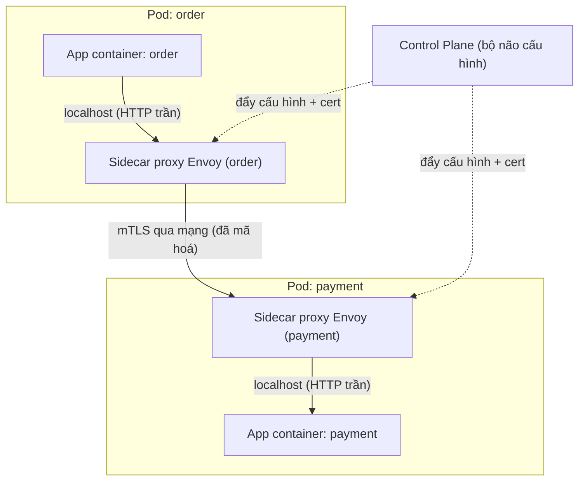

# Service Mesh là gì? — Tầng hạ tầng cho giao tiếp microservice

> **Tác giả:** Mr.Rom\
> **Phiên bản:** v1.0.0\
> **Tạo lúc:** 13/06/2026\
> **Cập nhật:** 13/06/2026\
> **Level:** Basic\
> **Tags:** service-mesh, microservice, kubernetes, istio, observability\
> **Yêu cầu trước:** [Kubernetes Services & Networking](../../../kubernetes/lessons/01_basic/02_services-and-networking.md)

> 🎯 *Ở bài Kubernetes Services bạn đã biết Pod tìm thấy nhau qua Service IP tĩnh và CoreDNS. Nhưng "gọi được nhau" mới là một nửa câu chuyện — gọi sao cho an toàn, có retry khi lỗi, mã hoá đường truyền, và đo được độ trễ là chuyện khác hẳn. Sau bài này bạn sẽ hiểu service mesh là gì, vì sao nó ra đời, sidecar và control plane hoạt động ra sao, và quan trọng nhất: khi nào bạn THẬT SỰ cần nó — khi nào thì chưa.*

## 🎯 Sau bài này bạn sẽ

- [ ] Hiểu bài toán giao tiếp service-to-service mà microservice nào cũng đụng phải (retry, timeout, mTLS, tracing)
- [ ] Định nghĩa được service mesh là gì và "tách mối quan tâm mạng ra tầng hạ tầng" nghĩa là gì
- [ ] Phân biệt rõ **data plane** và **control plane**, và vai trò của sidecar proxy (Envoy)
- [ ] Kể tên 4 nhóm tính năng cốt lõi: traffic management, security (mTLS), observability, resilience
- [ ] Biết khác biệt giữa kiến trúc **sidecar** và **sidecarless/ambient** (Istio ambient, Cilium eBPF)
- [ ] Tự quyết định được: dự án của mình đã CẦN service mesh chưa, hay vẫn còn là overkill

---

## Tình huống — Acme Shop và bài toán "service gọi service"

Acme Shop đã chạy được một thời gian trên Kubernetes. Hệ thống tách thành nhiều microservice nhỏ, mỗi cái một việc:

- `web` — frontend nhận request từ khách.
- `order` — xử lý đơn hàng.
- `payment` — gọi cổng thanh toán.
- `inventory` — kiểm tra tồn kho.
- `notification` — gửi email/SMS.

Nhờ bài Kubernetes Services trước đó, các service này gọi nhau ngon lành qua tên DNS nội bộ: `web` gọi `http://order`, `order` gọi `http://payment`, `http://inventory`... Mọi thứ "chạy được". Cho đến khi đội vận hành bắt đầu gặp những câu hỏi rất khó chịu:

- 😱 **Mạng nội bộ thỉnh thoảng chập chờn.** `payment` đôi khi trả lỗi do cổng thanh toán nghẽn nửa giây. Khách thấy "Đặt hàng thất bại" dù chỉ cần thử lại 1 lần là xong. Vậy ai lo việc **retry** (gọi lại) và **timeout** (cắt request treo quá lâu)?
- 😱 **Bảo mật nội bộ bằng 0.** Traffic giữa `order` và `payment` đang chạy **HTTP trần** trong cluster. Nếu một Pod nào đó bị chiếm quyền, kẻ tấn công nghe lén được cả số thẻ. Ai lo việc **mã hoá đường truyền** (mTLS) giữa mọi service?
- 😱 **Không nhìn thấy gì cả.** Khi khách báo "đặt hàng chậm", chẳng ai biết chậm ở đâu — `order` chậm? `payment` chậm? hay mạng giữa hai bên chậm? Ai lo việc **đo độ trễ, tỉ lệ lỗi, vẽ đường đi của request** (observability + tracing)?
- 😱 **Release rủi ro.** Muốn thả version `payment` mới cho 5% traffic thử trước (canary) rồi mới mở 100% — hiện không có cách nào ngoài việc tự code logic chia traffic trong app.

Giải pháp đầu tiên ai cũng nghĩ tới: **nhồi hết logic này vào từng service.** Mỗi team tự thêm thư viện retry, tự cấu hình timeout, tự tích hợp TLS, tự gắn tracing SDK. Nghe hợp lý — nhưng làm thật thì lộ ngay 3 vấn đề chí mạng:

1. **Lặp lại khắp nơi.** 5 service = viết logic retry/timeout/mTLS/tracing 5 lần. 50 service = 50 lần.
2. **Lệch nhau (drift).** `order` viết bằng Python, `payment` bằng Go, `notification` bằng Node.js. Mỗi ngôn ngữ một thư viện retry, một cách config timeout. Team A để timeout 3s, team B để 30s. Không ai thống nhất nổi.
3. **Sửa một chính sách = sửa N codebase.** Sếp bảo "từ nay mọi service phải retry tối đa 2 lần, timeout 5s, bật mTLS". Đồng nghĩa: mở 50 repo, sửa code, review, test, deploy lại 50 lần. Sai một cái là sự cố production.

Sếp DevOps gãi đầu: *"Mấy thứ retry, timeout, mã hoá, đo đạc này — chúng nó đâu phải logic nghiệp vụ của Acme Shop. Chúng là **chuyện của hạ tầng mạng**. Sao lại bắt mỗi service tự gánh? Phải có cách tách nó ra ngoài code app."*

Đó chính xác là lý do **service mesh** ra đời.

---

## 1️⃣ Vậy service mesh là gì?

Quay lại nỗi đau ở trên: những mối quan tâm như retry, timeout, mã hoá, đo đạc, chia traffic — chúng giống nhau ở **mọi** service, không phụ thuộc service đó làm gì về nghiệp vụ. Chúng là **cross-cutting concern** (mối quan tâm cắt ngang) — thứ xuất hiện ở mọi nơi nhưng không thuộc về riêng chỗ nào.

**Service mesh** là một **tầng hạ tầng chuyên lo việc giao tiếp service-to-service**. Thay vì để mỗi service tự code các mối quan tâm mạng kia, service mesh kéo chúng **ra khỏi code ứng dụng** và đẩy xuống một tầng riêng bên dưới — tầng này lo retry, timeout, mTLS, tracing, chia traffic cho **tất cả** service một cách đồng nhất, **không cần sửa một dòng code nghiệp vụ nào**.

> 🪞 **Ẩn dụ đời thường:** Hãy hình dung mỗi microservice là một **căn hộ trong chung cư Acme**. Trước đây, mỗi nhà tự kéo dây điện, tự lắp đường nước, tự thuê bảo vệ riêng — vừa tốn vừa mỗi nhà một kiểu. Service mesh giống như **ban quản lý toà nhà**: họ làm sẵn hệ thống điện nước chuẩn, camera an ninh, bảo vệ gác cổng cho **toàn bộ** chung cư. Cư dân (service) chỉ việc ở và làm việc của mình — mọi "hạ tầng đi lại, an ninh, giám sát" đã có ban quản lý lo, đồng bộ cho cả toà.

Điểm mấu chốt — và cũng là điều khiến service mesh "kỳ diệu":

> **Service mesh hoạt động ở tầng hạ tầng, trong suốt (transparent) với ứng dụng. App của bạn vẫn gọi `http://payment` như cũ — không biết rằng request đang được mã hoá, retry, đo đạc ở bên dưới.**

Acme Shop không phải viết lại `order`, `payment` hay bất kỳ service nào. Họ chỉ cần **cài service mesh vào cluster**, khai báo chính sách một lần (vd "mTLS bật toàn cluster", "retry 2 lần", "canary 5%"), và mesh áp dụng cho mọi service.

Hiểu định nghĩa rồi, câu hỏi tiếp theo là: làm sao một tầng hạ tầng "chen vào giữa" được mọi cuộc gọi mà không sửa code app? Câu trả lời nằm ở một mẫu thiết kế tên là **sidecar**.

---

## 2️⃣ Sidecar pattern — proxy đứng cạnh mỗi service

Để chặn và xử lý mọi traffic ra/vào một service mà không động vào code, service mesh dùng **sidecar pattern**: bên cạnh mỗi container ứng dụng, mesh nhét thêm một container thứ hai — một **proxy mạng**. Hai container này nằm chung trong **một Pod**, nên (nhờ kiến thức Pod ở bài K8s) chúng chia sẻ chung network namespace — tức là chung địa chỉ `localhost`.

> 🪞 **Ẩn dụ đời thường:** *Sidecar giống cái **thùng phụ gắn bên hông xe máy** (đúng nghĩa "side-car"). Xe (app) vẫn chạy bình thường, nhưng giờ có thêm một khoang phụ đi kèm khắp nơi để lo việc khác. Ở đây "việc khác" là toàn bộ chuyện mạng.*

Cơ chế cụ thể: mesh cấu hình lại mạng trong Pod (qua iptables hoặc eBPF) sao cho **mọi traffic ra và vào app đều bị ép đi vòng qua sidecar proxy trước**:

- App `order` muốn gọi `payment` → request **không** đi thẳng ra mạng, mà đi vào sidecar của chính `order` trước.
- Sidecar của `order` lo: mã hoá (mTLS), chọn đích, retry nếu lỗi, ghi nhận metric/trace.
- Sidecar của `order` gửi tới sidecar của `payment`.
- Sidecar của `payment` giải mã, kiểm tra chính sách bảo mật, rồi mới chuyển vào app `payment` qua `localhost`.

Proxy được dùng phổ biến nhất cho sidecar là **Envoy** — một proxy hiệu năng cao do Lyft phát triển và hiến cho CNCF. Istio, nhiều bản phân phối khác đều dùng Envoy làm sidecar; Linkerd dùng một micro-proxy riêng viết bằng Rust (`linkerd2-proxy`) nhưng ý tưởng giống hệt.

> 💡 Hiểu được "proxy đứng cạnh app, chặn mọi traffic" rồi, mình xem một Pod có sidecar trông như thế nào qua sơ đồ bên dưới — đây là hình ảnh trừu tượng cốt lõi nhất của cả service mesh.

### Sơ đồ — App, Sidecar và Control Plane

Sơ đồ dưới mô tả 2 Pod (mỗi Pod gồm app + sidecar) trao đổi với nhau, và cả hai sidecar đều được điều khiển bởi control plane ở trên:

Điểm cần để ý: app chỉ nói chuyện với sidecar của chính nó qua `localhost` bằng HTTP trần (đơn giản, không cần biết gì về mã hoá), còn **đoạn đi qua mạng giữa hai sidecar mới là đoạn được mã hoá mTLS** — và toàn bộ "luật chơi" của các sidecar do control plane (đường nét đứt) bơm xuống, chứ sidecar không tự quyết định.

---

## 3️⃣ Control plane vs Data plane — bộ não và đôi tay

Sơ đồ trên đã lộ ra hai "tầng" rất khác nhau trong service mesh. Đây là cách phân chia kiến trúc quan trọng nhất bạn cần nắm:

- **Data plane (mặt phẳng dữ liệu)** — là **tập hợp tất cả sidecar proxy**. Đây là nơi traffic thật sự chảy qua. Mỗi request của khách hàng đều đi xuyên qua các proxy này. Data plane lo phần "tay chân": mã hoá, retry, định tuyến, đo đạc từng request.
- **Control plane (mặt phẳng điều khiển)** — là **bộ não trung tâm**. Nó **không** xử lý traffic của khách. Việc của nó là: nhận chính sách bạn khai báo (vd "retry 2 lần", "canary 10%", "mTLS strict"), dịch ra cấu hình cụ thể, rồi **đẩy xuống tất cả sidecar**. Nó cũng phát chứng chỉ (cert) cho mTLS, theo dõi service nào còn sống, và gom metric.

> 🪞 **Ẩn dụ đời thường:** *Control plane là **trung tâm điều hành giao thông** của thành phố — nó không tự lái xe nào cả, nhưng quyết định đèn xanh đèn đỏ, phân luồng, đặt biển báo. Data plane là **toàn bộ cảnh sát giao thông đứng ở từng ngã tư** — họ là người trực tiếp điều phối từng chiếc xe (request) theo luật mà trung tâm đặt ra.*

Cách phân chia này giải thích vì sao service mesh "đổi chính sách một phát ăn cả cluster": bạn chỉ sửa cấu hình ở control plane (vd một file YAML khai báo "bật mTLS toàn namespace"), control plane tự đẩy xuống hàng trăm sidecar. Không ai phải đụng vào code app.

Bảng dưới chốt lại sự khác biệt để bạn không bao giờ nhầm hai khái niệm này:

| Tiêu chí | Data plane (Sidecar proxy) | Control plane (Bộ não) |
|---|---|---|
| Vai trò | Xử lý traffic thật (mã hoá, retry, định tuyến) | Quản lý cấu hình + phát cert + thu metric |
| Có traffic khách chảy qua? | ✅ Có — mỗi request đều qua | ❌ Không — chỉ quản lý |
| Số lượng | Nhiều — 1 sidecar / mỗi Pod (mode sidecar) | Ít — vài Pod trung tâm |
| Ví dụ phần mềm | Envoy, `linkerd2-proxy` | Istiod (Istio), Linkerd control plane |
| Hỏng thì sao? | Request qua Pod đó bị gián đoạn | Mesh vẫn chạy theo cấu hình cũ, nhưng không cập nhật được nữa |

> 💡 Lưu ý dòng cuối: control plane chết **không** làm sập ngay traffic — các sidecar vẫn chạy với cấu hình đã nhận trước đó. Đây là thiết kế cố ý để mesh "fail gracefully".

Hiểu được hai mặt phẳng rồi, giờ ta xem cụ thể service mesh **làm được những gì** cho Acme Shop.

---

## 4️⃣ Bốn nhóm tính năng cốt lõi

Mọi service mesh, dù khác nhau về cách triển khai, đều xoay quanh **4 nhóm tính năng**. Nhớ 4 nhóm này là nhớ được "service mesh để làm gì". Bảng dưới ánh xạ trực tiếp 4 nhóm vào 4 nỗi đau của Acme Shop ở đầu bài:

| Nhóm tính năng | Giải quyết nỗi đau nào | Ví dụ cụ thể |
|---|---|---|
| 🚦 Traffic management (quản lý lưu lượng) | Release rủi ro, không chia được traffic | Canary 5%, A/B test, traffic split theo header, mirror traffic |
| 🔐 Security — mTLS (bảo mật) | Traffic nội bộ chạy HTTP trần | Tự động mã hoá mọi cuộc gọi service-to-service, xác thực danh tính 2 chiều |
| 👁️ Observability (khả năng quan sát) | Không nhìn thấy chậm/lỗi ở đâu | Metric độ trễ + tỉ lệ lỗi cho mọi cặp service, distributed tracing |
| 🛡️ Resilience (khả năng phục hồi) | Mạng chập chờn, lỗi tạm thời | Retry, timeout, circuit breaking, outlier detection |

Cùng đi qua từng nhóm để hiểu vì sao chúng "đáng tiền".

### 🚦 Traffic management

Mesh quyết định request đi đâu, bao nhiêu phần trăm về đâu — **mà không cần app biết**. Acme Shop muốn thả `payment` v2 cho 5% khách thử trước? Chỉ cần khai báo một luật chia traffic ở control plane: 95% về v1, 5% về v2. Hài lòng thì tăng dần lên 100%; lỗi thì rollback tức thì về 0% — tất cả không deploy lại code, không sửa frontend.

### 🔐 Security — mTLS

**mTLS** (*mutual TLS* — TLS hai chiều) nghĩa là cả hai đầu của cuộc gọi đều trình chứng chỉ để chứng minh "tôi đúng là service mà tôi nói". Mesh tự phát cert cho mỗi service, tự mã hoá, tự xoay vòng cert — app không hề hay biết. Kết quả: traffic giữa `order` và `payment` từ HTTP trần biến thành kênh mã hoá, và `payment` còn biết chắc request **thật sự** đến từ `order` chứ không phải một Pod giả mạo.

> So với bài Kubernetes trước: ở đó bạn dùng `NetworkPolicy` để chặn/cho phép kết nối ở tầng L3/L4 (theo IP/port). mTLS của service mesh bổ sung tầng cao hơn — **mã hoá nội dung** và **xác thực danh tính** ở tầng ứng dụng. Hai thứ này bổ trợ nhau, không loại trừ.

### 👁️ Observability

Vì **mọi** request đều chui qua sidecar, sidecar là vị trí lý tưởng để đo đạc. Mesh tự sinh ra (không cần app sửa gì):

- **Metric vàng** cho mọi cặp service: tỉ lệ request, tỉ lệ lỗi, độ trễ (RED metrics).
- **Distributed tracing**: vẽ được đường đi của một request xuyên qua `web → order → payment → inventory`, chỉ rõ chặng nào tốn 800ms.
- **Service map**: sơ đồ ai gọi ai, traffic bao nhiêu — vẽ tự động.

Lưu ý nhỏ nhưng quan trọng về tracing: mesh tự đo được độ trễ từng chặng, nhưng để **nối** các chặng thành một trace hoàn chỉnh xuyên nhiều service, app vẫn cần **truyền tiếp (propagate) các header tracing** (như `traceparent`, `x-request-id`) sang request kế tiếp. Đây là phần nhỏ mà mesh không tự làm thay được hoàn toàn.

### 🛡️ Resilience

Đây là nhóm trị thẳng nỗi đau "mạng chập chờn":

- **Retry** — request lỗi tạm thời? sidecar tự gọi lại (theo số lần bạn cấu hình), app không cần code.
- **Timeout** — request treo quá lâu? sidecar cắt, trả lỗi nhanh thay vì để khách chờ vô tận.
- **Circuit breaking** (ngắt mạch) — một service đang "ngất"? sidecar tạm ngừng gửi request tới nó để khỏi làm nó chết hẳn, đồng thời tránh kéo sập cả hệ thống theo (cascading failure).
- **Outlier detection** — tự loại Pod nào đang trả lỗi/chậm bất thường ra khỏi nhóm nhận traffic.

→ Tất cả 4 nhóm đều có một mẫu số chung: **làm ở tầng hạ tầng, đồng nhất cho mọi service, không sửa code app.** Đó là toàn bộ giá trị của service mesh gói trong một câu.

---

## 5️⃣ Sidecar vs Sidecarless — mô hình ambient và eBPF

Đến đây bạn có thể thắc mắc: nhét một container Envoy vào **cạnh mỗi Pod** nghe có vẻ tốn kém. Đúng vậy — và đó chính là điểm yếu lớn nhất của mô hình sidecar truyền thống.

### Cái giá của sidecar

Mỗi sidecar là một tiến trình proxy thật, ăn CPU và RAM. Có 5 service × 3 replica = 15 sidecar. Có 200 service quy mô lớn = hàng trăm, hàng nghìn proxy chạy song song. Cộng dồn lại, sidecar gây ra:

- **Tốn tài nguyên** — mỗi sidecar ăn vài chục đến vài trăm MB RAM, nhân lên theo số Pod.
- **Thêm độ trễ** — mỗi request đi qua 2 lần proxy (sidecar bên gửi + sidecar bên nhận).
- **Phiền khi nâng cấp** — nâng version proxy = phải restart (rollout lại) toàn bộ Pod để thay sidecar.

Vì vậy, xu hướng 2024-2026 là tìm cách bỏ bớt hoặc bỏ hẳn sidecar — gọi chung là **sidecarless**. Có hai hướng chính.

### Hướng 1 — Istio Ambient mode (ztunnel + waypoint)

Istio giới thiệu chế độ **ambient** (đạt mức ổn định để dùng production từ Istio 1.22+) để bỏ sidecar trong từng Pod. Thay vào đó nó tách mesh thành 2 lớp:

- **ztunnel** (*zero-trust tunnel*) — một proxy nhẹ chạy **mỗi node một cái** (DaemonSet), không phải mỗi Pod. Nó lo lớp 4 (L4): mTLS và định tuyến cơ bản cho mọi Pod trên node đó.
- **waypoint proxy** — một proxy Envoy **tuỳ chọn**, chỉ bật khi bạn cần các tính năng lớp 7 (L7) như retry HTTP, traffic split, authorization phức tạp. Nó chạy theo namespace/service, không theo Pod.

→ Lợi ích: app nào chỉ cần mTLS thì khỏi tốn sidecar nào (chỉ dùng ztunnel chung của node); app nào cần tính năng L7 mới thêm waypoint. Tiết kiệm tài nguyên đáng kể so với "sidecar cho mọi Pod".

### Hướng 2 — Cilium dùng eBPF

**Cilium** (bạn đã gặp ở bài Ingress production) là một CNI dựa trên **eBPF** (*extended Berkeley Packet Filter* — công nghệ cho phép nạp chương trình chạy thẳng trong nhân Linux). Cilium đẩy phần lớn công việc mesh (mTLS, định tuyến L3/L4, observability) **xuống thẳng kernel qua eBPF**, không cần proxy userspace cho mỗi Pod. Khi cần xử lý L7, Cilium vẫn dùng một Envoy chung trên mỗi node thay vì mỗi Pod.

> 🪞 **Ẩn dụ đời thường:** *Sidecar truyền thống là **thuê một bảo vệ riêng đứng trước cửa từng căn hộ** — an toàn nhưng tốn kém khủng khiếp khi toà nhà có 500 phòng. Mô hình ambient/eBPF là **đặt trạm an ninh chung ở mỗi tầng** (mỗi node) — vẫn bảo vệ đủ, nhưng số nhân viên ít hơn hẳn.*

Bảng dưới so sánh ngắn gọn để bạn nắm bức tranh — bài 04 trong cụm này sẽ đi sâu khi chọn mesh cụ thể:

| Tiêu chí | Sidecar truyền thống | Sidecarless / Ambient / eBPF |
|---|---|---|
| Proxy chạy ở đâu | Mỗi Pod 1 proxy | Mỗi node 1 proxy (L4), L7 theo namespace |
| Tài nguyên tiêu thụ | Cao (nhân theo số Pod) | Thấp hơn nhiều |
| Độ trễ thêm | 2 hop proxy mỗi request | Ít hop hơn (L4 nhẹ ở kernel/node) |
| Nâng cấp proxy | Phải restart toàn bộ Pod | Không đụng Pod app |
| Ví dụ | Istio (sidecar), Linkerd | Istio ambient (ztunnel + waypoint), Cilium (eBPF) |
| Độ chín / ecosystem | Rất chín, nhiều tài liệu | Mới hơn, đang phổ biến nhanh |

→ Đừng hiểu nhầm "sidecarless tốt hơn nên bỏ sidecar đi". Sidecar vẫn cực kỳ chín và phổ biến; ambient/eBPF là lựa chọn hấp dẫn khi quy mô lớn hoặc nhạy cảm về tài nguyên. Quan trọng là **hiểu cả hai mô hình tồn tại và vì sao**.

---

## 6️⃣ Khi nào CẦN service mesh — và khi nào CHƯA

Đây là phần thực dụng nhất, và cũng là chỗ nhiều team mắc sai lầm: cài service mesh quá sớm rồi ôm thêm một đống phức tạp không đáng. Service mesh **không miễn phí** — nó thêm thành phần phải vận hành, thêm độ trễ, thêm thứ để debug khi sự cố.

Nguyên tắc vàng: **service mesh giải quyết vấn đề của quy mô. Khi chưa có vấn đề về quy mô, nó là gánh nặng chứ không phải lợi ích.**

### ✅ Bạn CẦN service mesh khi…

- **Có nhiều microservice** (thường từ ~10 trở lên) gọi chéo nhau chằng chịt — logic mạng lặp lại ở quá nhiều nơi.
- **Bắt buộc mã hoá nội bộ (mTLS)** vì yêu cầu bảo mật/tuân thủ (PCI-DSS, dữ liệu nhạy cảm), và bạn không muốn mỗi team tự làm TLS.
- **Cần triển khai an toàn nâng cao**: canary, A/B test, traffic shifting thường xuyên — và không muốn nhồi logic này vào app.
- **Mất kiểm soát về observability**: không trace được request xuyên service, không biết chậm/lỗi ở đâu, và bạn dùng nhiều ngôn ngữ khác nhau (khó chuẩn hoá SDK tracing).
- **Đa ngôn ngữ (polyglot)**: Python + Go + Node + Java... — chuẩn hoá retry/timeout/mTLS bằng thư viện trong từng ngôn ngữ là cơn ác mộng. Mesh làm một lần cho tất cả.

### ❌ Bạn CHƯA cần service mesh khi…

- **Chỉ có vài service** (2-5 cái), gọi nhau đơn giản. Mesh là **overkill** — bạn thêm cả một control plane để giải quyết vấn đề chưa tồn tại.
- **Monolith hoặc gần-monolith**: giao tiếp nội bộ chủ yếu là gọi hàm trong tiến trình, không phải qua mạng.
- **Team nhỏ, chưa rành Kubernetes**: mesh thêm một tầng phức tạp lớn. Khi sự cố, bạn phải debug thêm cả sidecar/control plane. Hãy vững K8s cơ bản trước.
- **Nhu cầu mạng đơn giản đã được đáp ứng bởi K8s sẵn có**: `Service` + `Ingress` + `NetworkPolicy` (như bài trước) đã đủ cho phần lớn use case nhỏ. Đừng vác đại bác đi bắn chim sẻ.
- **Một số tính năng có thể lấy "lẻ"**: chỉ cần TLS ngoài rìa? Dùng Ingress + cert-manager. Chỉ cần ít observability? Dùng metric/tracing SDK đơn giản. Không phải lúc nào cũng cần cả cỗ máy mesh.

> 💡 Một cách nghĩ gọn: **nếu bạn còn đếm được số service bằng một bàn tay, gần như chắc chắn bạn chưa cần service mesh.** Hãy đợi đến khi nỗi đau "logic mạng lặp lại + lệch nhau" thật sự nhức, rồi mới mang mesh ra trị.

Acme Shop ở đầu bài có 5+ service, đa ngôn ngữ, đã đau cả 4 nỗi đau (retry, mTLS, observability, canary) → đây là ca **đáng** dùng service mesh. Một startup mới có `web` + `api` + `db` thì chưa.

---

## 💡 Cạm bẫy thường gặp & Best practice

### ❌ Cạm bẫy: Cài service mesh quá sớm ("resume-driven architecture")

- **Triệu chứng**: Dự án mới 3-4 service nhưng đã cài Istio đầy đủ; team tốn phần lớn thời gian debug sidecar, control plane, mTLS handshake thay vì làm tính năng.
- **Nguyên nhân**: Cài mesh vì "nghe nói hay", vì CV, hoặc copy kiến trúc của công ty lớn — chứ không vì có nỗi đau thật về quy mô.
- **Cách tránh**: Bắt đầu bằng K8s `Service`/`Ingress`/`NetworkPolicy`. Chỉ thêm mesh khi đã chạm ngưỡng đau thật (nhiều service, đa ngôn ngữ, bắt buộc mTLS, cần canary thường xuyên). Mesh là thuốc cho bệnh quy mô, không phải vitamin uống phòng.

### ❌ Cạm bẫy: Tưởng mesh tự lo 100% tracing

- **Triệu chứng**: Bật mesh xong vẫn không nối được trace xuyên service — mỗi service ra một trace rời rạc.
- **Nguyên nhân**: Mesh đo được độ trễ từng chặng, nhưng app **không truyền tiếp** header tracing (`traceparent`, `x-request-id`) khi gọi service kế tiếp, nên mesh không biết các chặng thuộc cùng một request.
- **Cách tránh**: App vẫn cần propagate các tracing header sang downstream. Đây là phần nhỏ duy nhất app phải hợp tác — mesh lo phần còn lại.

### ✅ Best practice: Bắt đầu bằng observability, đừng nhảy thẳng vào mTLS strict

- **Vì sao**: mTLS strict (ép buộc) bật sai cách có thể chặn đứng traffic hợp lệ và gây sự cố ngay. Trong khi đó, observability gần như không rủi ro mà lại cho bạn bức tranh hệ thống ngay lập tức.
- **Cách áp dụng**: Cài mesh → bật observability + tracing trước, quan sát service map. Sau đó bật mTLS ở chế độ **permissive** (cho phép cả mã hoá lẫn HTTP trần trong giai đoạn chuyển tiếp), kiểm tra mọi thứ vẫn chạy, **rồi mới** chuyển sang **strict**.

### ✅ Best practice: Chọn mô hình proxy theo quy mô

- **Vì sao**: Sidecar cho mọi Pod tốn tài nguyên tuyến tính theo số Pod. Ở quy mô lớn, chi phí này rất thật.
- **Cách áp dụng**: Quy mô nhỏ/vừa và cần ecosystem chín → sidecar (Istio/Linkerd) ổn. Quy mô lớn hoặc nhạy cảm tài nguyên → cân nhắc Istio ambient hoặc Cilium eBPF. Đừng chọn theo "cái nào mới nhất" mà theo nhu cầu thật.

---

## 🧠 Tự kiểm tra (Self-check)

**Q1.** Vì sao việc bắt mỗi service tự code retry/timeout/mTLS/tracing lại là một ý tồi khi hệ thống có nhiều service?

💡 Đáp án

Ba lý do chính: (1) **Lặp lại** — viết cùng một logic ở mọi service, N service viết N lần. (2) **Lệch nhau (drift)** — hệ đa ngôn ngữ, mỗi ngôn ngữ một thư viện, mỗi team đặt timeout/retry khác nhau, không chuẩn hoá nổi. (3) **Sửa chính sách = sửa N codebase** — đổi một luật ("retry 2 lần, mTLS bật") phải mở, sửa, test, deploy lại toàn bộ service. Service mesh tách các mối quan tâm mạng này ra tầng hạ tầng, khai báo một lần áp dụng cho tất cả, không sửa code app.

**Q2.** Phân biệt data plane và control plane. Nếu control plane chết thì traffic của khách có sập ngay không?

💡 Đáp án

**Data plane** = tập hợp các sidecar proxy — nơi traffic thật chảy qua, lo mã hoá/retry/định tuyến/đo đạc từng request. **Control plane** = bộ não trung tâm — không có traffic khách chảy qua, chỉ nhận chính sách, đẩy cấu hình + cert xuống sidecar, thu metric.

Control plane chết **không** làm sập traffic ngay: các sidecar vẫn chạy với cấu hình đã nhận trước đó. Hệ quả là mesh không **cập nhật** được cấu hình mới (vd cert mới, luật mới) cho tới khi control plane sống lại. Đây là thiết kế "fail gracefully" cố ý.

**Q3.** Kể tên 4 nhóm tính năng cốt lõi của service mesh và mỗi nhóm trị nỗi đau gì.

💡 Đáp án

- **Traffic management** — chia/định tuyến traffic (canary, A/B, traffic split): trị nỗi đau release rủi ro.
- **Security (mTLS)** — tự mã hoá + xác thực 2 chiều giữa service: trị nỗi đau traffic nội bộ chạy HTTP trần.
- **Observability** — metric độ trễ/tỉ lệ lỗi, distributed tracing, service map: trị nỗi đau không biết chậm/lỗi ở đâu.
- **Resilience** — retry, timeout, circuit breaking, outlier detection: trị nỗi đau mạng chập chờn, lỗi tạm thời.

Điểm chung: tất cả làm ở tầng hạ tầng, đồng nhất cho mọi service, không sửa code app.

**Q4.** Sidecar pattern là gì, và mô hình ambient/eBPF cải thiện điều gì so với sidecar truyền thống?

💡 Đáp án

**Sidecar pattern**: nhét một proxy (thường là Envoy) vào **cùng Pod** với app; mọi traffic ra/vào app bị ép đi qua proxy này (qua iptables/eBPF). App nói chuyện với sidecar qua `localhost` bằng HTTP trần; phần đi qua mạng giữa các sidecar mới được mã hoá mTLS.

Điểm yếu: 1 proxy/mỗi Pod → tốn tài nguyên tuyến tính theo số Pod, thêm độ trễ (2 hop proxy/request), nâng cấp proxy phải restart toàn bộ Pod.

**Ambient/eBPF** cải thiện bằng cách bỏ proxy-per-Pod: Istio ambient dùng **ztunnel** (proxy L4 mỗi node) + **waypoint** (proxy L7 tuỳ chọn theo namespace); Cilium đẩy xử lý xuống **eBPF trong kernel**. Kết quả: ít proxy hơn, tốn ít tài nguyên hơn, nâng cấp không đụng Pod app.

**Q5.** Một startup có đúng 3 service (`web`, `api`, `db`). Họ có nên cài service mesh không? Vì sao?

💡 Đáp án

**Chưa nên.** 3 service gọi nhau đơn giản chưa tạo ra nỗi đau "logic mạng lặp lại + lệch nhau" mà mesh sinh ra để giải quyết. Cài mesh lúc này là **overkill**: thêm control plane + sidecar phải vận hành, thêm độ trễ, thêm thứ để debug khi sự cố — tất cả để trị một vấn đề chưa tồn tại.

K8s `Service` + `Ingress` + `NetworkPolicy` đã thừa sức cho quy mô này. Cần TLS ngoài rìa thì dùng Ingress + cert-manager. Đợi đến khi số service tăng mạnh, đa ngôn ngữ, hoặc bắt buộc mTLS nội bộ — lúc đó mới mang mesh ra.

---

## ⚡ Tra cứu nhanh (Cheatsheet)

| Khái niệm | Một câu chốt |
|---|---|
| Service mesh | Tầng hạ tầng lo giao tiếp service-to-service, tách khỏi code app |
| Cross-cutting concern | Mối quan tâm cắt ngang mọi service (retry/timeout/mTLS/tracing) |
| Sidecar | Proxy đứng cùng Pod với app, chặn mọi traffic ra/vào |
| Envoy | Proxy hiệu năng cao, dùng làm sidecar phổ biến nhất |
| Data plane | Tập hợp sidecar — nơi traffic thật chảy qua |
| Control plane | Bộ não — đẩy cấu hình + cert, không có traffic khách |
| mTLS | TLS hai chiều — mã hoá + xác thực danh tính 2 đầu |
| Traffic management | Canary, A/B, traffic split ở tầng hạ tầng |
| Resilience | Retry, timeout, circuit breaking, outlier detection |
| Observability | Metric độ trễ/lỗi, distributed tracing, service map tự động |
| Ambient mode | Istio bỏ sidecar/Pod: ztunnel (L4/node) + waypoint (L7) |
| eBPF mesh | Cilium đẩy xử lý mạng xuống kernel, ít proxy hơn |
| Khi nào dùng | Nhiều service + đa ngôn ngữ + cần mTLS/canary/observability |
| Khi nào CHƯA | Vài service đơn giản → overkill |

---

## 📚 Từ Điển Thuật Ngữ (Glossary)

| EN | VN | Giải thích |
|---|---|---|
| Service mesh | Lưới dịch vụ | Tầng hạ tầng lo giao tiếp service-to-service, tách khỏi code ứng dụng |
| Cross-cutting concern | Mối quan tâm cắt ngang | Thứ xuất hiện ở mọi service nhưng không thuộc nghiệp vụ riêng nào (retry, mTLS...) |
| Sidecar | Sidecar (giữ nguyên) | Container proxy đứng cùng Pod với app, chặn mọi traffic ra/vào |
| Sidecar pattern | Mẫu sidecar | Cách triển khai mesh bằng cách gắn proxy cạnh mỗi service |
| Data plane | Mặt phẳng dữ liệu | Tập hợp các sidecar proxy — nơi traffic thật chảy qua |
| Control plane | Mặt phẳng điều khiển | Bộ não trung tâm đẩy cấu hình + cert xuống sidecar |
| Envoy | Envoy (giữ nguyên) | Proxy hiệu năng cao (CNCF), dùng làm sidecar phổ biến nhất |
| mTLS | TLS hai chiều | Mã hoá + xác thực danh tính cả hai đầu cuộc gọi |
| Traffic management | Quản lý lưu lượng | Định tuyến/chia traffic (canary, A/B, split) ở tầng hạ tầng |
| Resilience | Khả năng phục hồi | Chịu lỗi tốt: retry, timeout, circuit breaking, outlier detection |
| Circuit breaking | Ngắt mạch | Tạm ngừng gửi request tới service đang "ngất" để tránh sập dây chuyền |
| Outlier detection | Phát hiện cá biệt | Tự loại Pod trả lỗi/chậm bất thường khỏi nhóm nhận traffic |
| Observability | Khả năng quan sát | Đo được metric/trace để hiểu hệ thống đang chạy ra sao |
| Distributed tracing | Truy vết phân tán | Vẽ đường đi của một request xuyên nhiều service |
| Ambient mode | Chế độ ambient | Mode Istio bỏ sidecar/Pod, dùng ztunnel + waypoint |
| ztunnel | (giữ nguyên) | Proxy L4 nhẹ chạy mỗi node trong Istio ambient (lo mTLS + định tuyến cơ bản) |
| Waypoint proxy | (giữ nguyên) | Proxy Envoy L7 tuỳ chọn trong Istio ambient (retry, split, authz) |
| eBPF | (giữ nguyên) | Công nghệ nạp chương trình chạy thẳng trong nhân Linux |
| Cilium | (giữ nguyên) | CNI/mesh dựa trên eBPF, xử lý mạng ở kernel, ít proxy hơn |
| Polyglot | Đa ngôn ngữ | Hệ thống dùng nhiều ngôn ngữ lập trình khác nhau |
| Cascading failure | Lỗi dây chuyền | Một service sập kéo theo các service phụ thuộc sập theo |

---

## 🔗 Liên kết & Tài nguyên

### 🧭 Định hướng lộ trình học

- ➡️ **Bài tiếp theo:** [Kiến trúc Service Mesh — Data plane, Control plane & Sidecar](01_architecture-and-sidecar.md)
- ↑ **Về cụm:** [Service Mesh — README cụm](../../README.md)

### 🧩 Các chủ đề có thể bạn quan tâm

- [Kubernetes Services & Networking](../../../kubernetes/lessons/01_basic/02_services-and-networking.md) — nền tảng Service/DNS/NetworkPolicy mà mesh xây bên trên
- [Ingress Production — cert-manager + external-dns + Gateway API](../../../kubernetes/lessons/02_intermediate/02_ingress-cert-manager-tls.md) — TLS ngoài rìa và Cilium CNI, bổ trợ cho mesh
- [Istio vs Linkerd vs Cilium — Chọn service mesh nào?](04_istio-vs-linkerd-vs-cilium.md) — so sánh sâu các mesh phổ biến

### 🌐 Tài nguyên tham khảo khác

- [Istio — What is a service mesh?](https://istio.io/latest/about/service-mesh/) — giải thích chính chủ từ Istio
- [Istio Ambient mode](https://istio.io/latest/docs/ambient/overview/) — kiến trúc ztunnel + waypoint
- [Linkerd docs](https://linkerd.io/2/overview/) — service mesh tối giản, micro-proxy Rust
- [Cilium Service Mesh](https://docs.cilium.io/en/stable/network/servicemesh/) — mesh dựa trên eBPF
- [Envoy proxy](https://www.envoyproxy.io/docs/envoy/latest/intro/what_is_envoy) — proxy nền tảng của nhiều mesh
- [CNCF Service Mesh landscape](https://landscape.cncf.io/guide#orchestration-management--service-mesh) — bức tranh toàn cảnh các mesh

---

## 📌 Nhật ký thay đổi (Changelog)

- **v1.0.0 (13/06/2026)** — Bản đầu tiên. Bài mở đầu cụm Service Mesh: định nghĩa service mesh và bài toán cross-cutting concern trong giao tiếp microservice; sidecar pattern + Envoy; phân biệt data plane vs control plane; 4 nhóm tính năng (traffic management, mTLS, observability, resilience); sidecar vs sidecarless/ambient (Istio ambient ztunnel + waypoint, Cilium eBPF); khung quyết định khi nào CẦN và khi nào CHƯA cần mesh. Kèm 1 sơ đồ mermaid app↔sidecar↔control plane, 2 cạm bẫy + 2 best practice, 5 self-check, cheatsheet và glossary.
