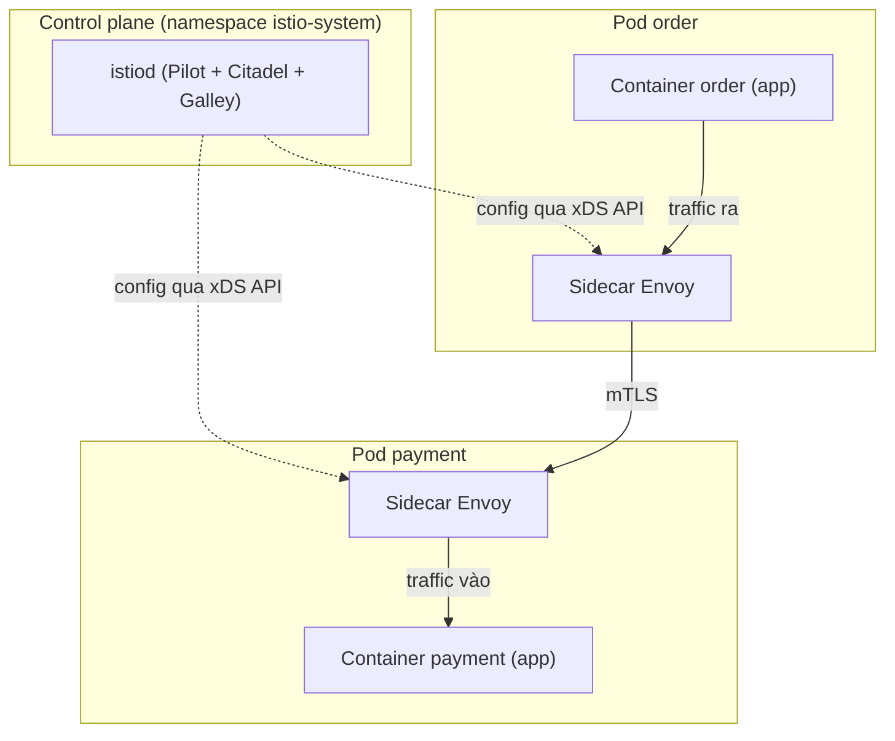
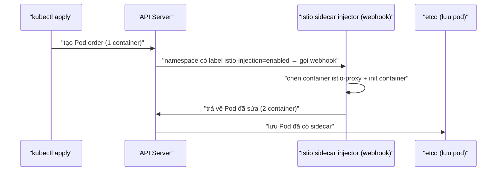

# Kiến trúc Service Mesh — Data plane, Control plane & Sidecar

> **Tác giả:** Mr.Rom\
> **Phiên bản:** v1.0.0\
> **Tạo lúc:** 13/06/2026\
> **Cập nhật:** 13/06/2026\
> **Level:** Basic\
> **Tags:** service-mesh, istio, sidecar, envoy, control-plane, data-plane, kubernetes\
> **Yêu cầu trước:** [Service Mesh là gì](00_what-is-service-mesh.md)

> 🎯 *Bài trước đã trả lời "Service Mesh là gì và vì sao Acme Shop cần nó". Bài này mổ xẻ bên trong: mesh được lắp ráp từ 2 mảnh — data plane (đội proxy Envoy) và control plane (istiod). Sau bài này bạn sẽ hiểu sidecar được "nhét" vào pod bằng cách nào, traffic bị chặn ra sao, và tự tay cài Istio rồi nhìn thấy 2 container trong 1 pod.*

## 🎯 Sau bài này bạn sẽ

- [ ] Phân biệt rạch ròi **data plane** (Envoy proxy) và **control plane** (istiod) — ai làm gì
- [ ] Hiểu **xDS API** — kênh control plane đẩy cấu hình xuống đám proxy
- [ ] Giải thích được **sidecar injection** tự động (namespace label + mutating webhook) và thủ công (`istioctl kube-inject`)
- [ ] Hiểu cơ chế **chặn traffic** vào Envoy: iptables redirect (init container) hoặc eBPF
- [ ] Biết istiod gộp 3 thành phần cũ (pilot + citadel + galley) và **ambient mode** (ztunnel + waypoint) bỏ sidecar
- [ ] Tự cài Istio demo profile, bật injection cho namespace `acme`, và xem **2 container** trong 1 pod

---

## Tình huống — Acme Shop muốn "phép màu" nhưng không sửa code

Quay lại Acme Shop: hệ thống đã có cả chục microservice chạy trên Kubernetes — `web`, `order`, `payment`, `cart`, `inventory`... Mỗi service gọi nhau ầm ầm: `web` gọi `order`, `order` gọi `payment`, `payment` gọi `inventory`. Bài toán giao tiếp service-to-service đẻ ra cả mớ yêu cầu:

- `payment` thi thoảng treo → cần **retry + timeout** để `order` không chờ vô tận.
- Traffic nội bộ đang chạy plaintext → cần **mã hoá** giữa các service (mTLS).
- Sếp hỏi "request từ `web` đi qua những service nào, chỗ nào chậm?" → cần **quan sát** (observability).
- Team muốn tung version mới của `order` cho 5% user trước → cần **canary**.

Ở bài trước bạn đã biết: nhồi hết logic này vào từng service là ác mộng — mỗi ngôn ngữ một thư viện, mỗi team một kiểu, sửa 1 chỗ phải build lại 10 service. Service mesh hứa hẹn làm tất cả những việc đó **mà không động vào một dòng code nghiệp vụ nào**.

Nghe như phép màu. Nhưng phép màu này hoạt động được nhờ một kiến trúc rất cụ thể. Câu hỏi đầu tiên: *nếu không sửa code, thì cái gì đứng ra retry, mã hoá, đo đạc thay cho service?*

---

## 1️⃣ Hai nửa của một mesh — data plane và control plane

Câu trả lời cho "cái gì làm thay": một **proxy** (máy chủ trung gian) đứng ngay cạnh mỗi service, hứng trọn mọi gói tin vào/ra. Service vẫn nghĩ mình nói chuyện trực tiếp với service khác, nhưng thực ra mọi thứ đi qua proxy này trước. Proxy mới là kẻ retry, mã hoá, đếm số request.

Nhưng một đám proxy rải khắp cluster mà không ai chỉ huy thì hỗn loạn. Phải có "bộ não" đứng trên, ra lệnh cho từng proxy: "route 5% sang version mới", "bật mTLS đi", "timeout 3 giây". Từ đó sinh ra cách chia mesh thành **2 tầng**:

- **Data plane** (mặt phẳng dữ liệu) — đội quân proxy. Đây là nơi **gói tin thật sự chảy qua**. Trong Istio, proxy này là **Envoy**.
- **Control plane** (mặt phẳng điều khiển) — bộ chỉ huy. Nó **không đụng vào gói tin nào cả**, chỉ tính toán cấu hình rồi đẩy xuống cho đám proxy. Trong Istio, bộ não này là **istiod**.

🪞 **Ẩn dụ**: 🪞 *Hình dung mesh như một **đội taxi của thành phố**. Mỗi **tài xế taxi** (Envoy proxy) là người thật sự chở khách (gói tin) trên đường — họ là data plane. **Trung tâm điều phối tổng đài** (istiod) không chở ai cả, nó chỉ ngồi một chỗ, bộ đàm cho từng tài xế: "tuyến này đang kẹt, đi đường khác", "khách VIP ưu tiên trước" — đó là control plane.*

Sự tách bạch này là chìa khoá: control plane có thể restart, update, thậm chí chết tạm thời mà **traffic vẫn chạy** — vì gói tin đi qua Envoy chứ không đi qua istiod. Tổng đài mất sóng thì tài xế vẫn chở nốt cuốc đang chạy theo chỉ dẫn cuối cùng.

> 💡 Định nghĩa rồi, ta xem hai tầng này nối với nhau và nối với service ra sao qua sơ đồ bên dưới.

### Sơ đồ kiến trúc tổng thể

Sơ đồ dưới mô tả 1 cluster Istio rút gọn: 2 pod ứng dụng (`order`, `payment`), mỗi pod có 1 sidecar Envoy, và istiod đứng trên đẩy cấu hình xuống.



Điểm cần nhớ: đường nét đứt (istiod → Envoy) là **kênh điều khiển** (config), còn đường nét liền (`order` → Envoy → Envoy → `payment`) là **kênh dữ liệu** (gói tin thật). Hai loại đường này không bao giờ trộn lẫn — đó chính là ý nghĩa của "tách data plane khỏi control plane".

---

## 2️⃣ Data plane — đội Envoy gánh mọi gói tin

**Định nghĩa**: Data plane là tập hợp các proxy chạy cùng mỗi workload, chịu trách nhiệm chặn, xử lý và chuyển tiếp **toàn bộ** traffic vào/ra của workload đó. Trong Istio (và phần lớn mesh hiện đại), proxy này là **Envoy** — một *high-performance proxy* (proxy hiệu năng cao) viết bằng C++, do Lyft tạo ra và hiến cho CNCF.

Vì sao lại là Envoy mà không phải Nginx hay HAProxy? Vì Envoy có một tính chất sống còn cho mesh: nó **nhận cấu hình động qua API** (gọi là xDS — sẽ nói ở phần 3), không cần reload hay restart khi đổi route. Tổng đài muốn đổi tuyến đường? Tài xế nghe bộ đàm rồi đổi ngay, không cần tấp vào lề tắt máy khởi động lại.

Mỗi Envoy sidecar gánh những việc sau, **thay cho** service:

- **Định tuyến (routing)** — quyết định request đi tới đâu: version v1 hay v2, pod nào còn khoẻ.
- **Resilience** (khả năng phục hồi) — retry khi lỗi, timeout khi treo, circuit breaking khi service quá tải.
- **mTLS** — mã hoá hai chiều giữa proxy này với proxy kia, kèm xác thực danh tính.
- **Telemetry** (đo đạc) — đếm số request, độ trễ, tỉ lệ lỗi rồi xuất ra Prometheus/tracing.

> [!NOTE]
> Envoy đứng cạnh service theo mô hình **sidecar** — mỗi pod có thêm 1 container Envoy chạy song song container app. Đây là lý do sau khi cài mesh, một pod tưởng "1/1" lại biến thành "2/2": 1 container app + 1 container Envoy. Phần 4 sẽ chỉ rõ cách Envoy được nhét vào.

Vì Envoy hứng **mọi** gói tin, nó là điểm hoàn hảo để cài đặt logic chung. Service không cần biết Envoy tồn tại — nó cứ gọi `http://payment:8080` như thường, Envoy âm thầm chen vào giữa. Đó là tính **trong suốt** (transparent) của mesh.

---

## 3️⃣ Control plane — istiod và kênh xDS

Đám Envoy tự nó không biết phải route đi đâu, retry mấy lần, mã hoá hay không. Tất cả những "luật chơi" đó do **control plane** tính ra và phân phối. Trong Istio, control plane gói gọn trong **một** tiến trình duy nhất tên là **istiod**.

### istiod gộp 3 thành phần cũ

Hồi Istio đời đầu (trước 1.5), control plane là một mớ nhiều process tách rời, mỗi process một việc. Từ Istio 1.5, chúng được **gộp vào một binary duy nhất** là `istiod` cho gọn và dễ vận hành. Bảng dưới ánh xạ 3 vai trò cũ vào istiod ngày nay:

| Thành phần cũ | Vai trò | Giờ nằm ở đâu |
|---|---|---|
| **Pilot** | Dịch cấu hình Istio (VirtualService, DestinationRule) sang config Envoy, đẩy qua xDS | Trong `istiod` |
| **Citadel** | Cấp + xoay vòng chứng chỉ cho mTLS (đóng vai CA của mesh) | Trong `istiod` |
| **Galley** | Validate + nạp cấu hình từ Kubernetes API | Trong `istiod` |

→ Ngày nay bạn chỉ thấy 1 deployment tên `istiod` trong namespace `istio-system`. Nhớ 3 cái tên cũ này hữu ích khi đọc tài liệu/blog cũ — nhưng thực tế chỉ vận hành 1 process.

### xDS API — kênh đẩy cấu hình

Câu hỏi cốt lõi: istiod nói chuyện với hàng trăm Envoy bằng cách nào? Câu trả lời là **xDS API** — viết tắt của *x Discovery Service* (chữ "x" là biến, đại diện cho cả họ API). Đây là một bộ giao thức gRPC mà Envoy dùng để **hỏi xin cấu hình** từ control plane.

"Họ xDS" gồm nhiều API con, mỗi cái lo một loại cấu hình:

| API con | Cung cấp cho Envoy | Ví dụ đời thường |
|---|---|---|
| **LDS** (Listener Discovery) | Các listener — Envoy lắng nghe cổng nào | "Mở tai ở cổng 8080" |
| **RDS** (Route Discovery) | Luật route — request nào đi đâu | "URL /pay → cụm payment-v1" |
| **CDS** (Cluster Discovery) | Các cluster — nhóm upstream đích | "Có cụm payment gồm 3 pod" |
| **EDS** (Endpoint Discovery) | Endpoint thật — IP:port từng pod | "payment đang ở 10.1.2.3, 10.1.2.4" |

Cơ chế hoạt động: mỗi Envoy mở **một kết nối gRPC bền** (streaming) tới istiod. Khi bạn `kubectl apply` một VirtualService mới, hoặc một pod `payment` mới sinh ra, istiod tính lại config rồi **push** xuống Envoy qua kết nối đó. Envoy nạp config mới **không cần restart**. Đó là lý do canary, đổi route, scale up/down diễn ra gần như tức thì.

🪞 Quay lại ẩn dụ tổng đài taxi: xDS chính là **kênh bộ đàm** giữa tổng đài và tài xế. Tổng đài (istiod) liên tục cập nhật: "có khách mới ở địa chỉ X" (EDS), "đường Y đang sửa, đi đường Z" (RDS). Tài xế (Envoy) nghe và điều chỉnh ngay trên đường, không cần về bãi.

---

## 4️⃣ Sidecar injection — Envoy được nhét vào pod bằng cách nào

Đây là phần "ảo thuật" nhất. Bạn deploy pod `order` bình thường với 1 container, nhưng sau khi bật mesh, pod chạy lên lại có **2 container**. Không ai sửa file Deployment của bạn. Vậy container Envoy từ đâu chui vào?

Câu trả lời nằm ở một cơ chế Kubernetes tên là **mutating admission webhook** (webhook biến đổi khi nạp tài nguyên) — một "trạm kiểm soát" mà mọi pod phải đi qua *trước khi* được tạo thật. Istio đăng ký một webhook tại đây; webhook này có quyền **sửa bản mô tả pod** đang được tạo, chèn thêm container Envoy vào.

### Cách 1 — Auto injection (khuyên dùng)

Cách phổ biến nhất: gắn **nhãn** (label) `istio-injection=enabled` lên namespace. Mọi pod tạo ra trong namespace đó sẽ tự động được chèn sidecar. Quy trình đầy đủ như sau:



Điểm mấu chốt: việc chèn xảy ra ở **API Server**, *trước khi* pod được lưu và lên lịch. Vì thế Deployment gốc của bạn trên Git **không hề bị sửa** — bản gốc vẫn 1 container, chỉ pod thực tế trong cluster mới có 2.

Bật injection cho 1 namespace cực gọn:

```bash
# Gắn nhãn để Istio tự inject sidecar cho mọi pod trong namespace acme
kubectl label namespace acme istio-injection=enabled
```

Lưu ý: nhãn này chỉ ảnh hưởng **pod tạo MỚI** sau khi gắn. Các pod đang chạy phải `kubectl rollout restart` thì mới được inject.

### Cách 2 — Manual injection

Khi không muốn (hoặc không được phép) gắn nhãn namespace, bạn có thể tự inject bằng `istioctl`. Lệnh này đọc YAML gốc, nhả ra YAML đã chèn sidecar:

```bash
# Đọc deployment gốc, in ra phiên bản đã chèn sidecar rồi apply
istioctl kube-inject -f order-deployment.yaml | kubectl apply -f -
```

→ Cách này dồn quyền kiểm soát cho người chạy lệnh, nhưng bất tiện: mỗi lần đổi config mesh phải inject lại thủ công. Production gần như luôn dùng auto injection.

> [!WARNING]
> Một cạm bẫy kinh điển: bạn `kubectl label namespace acme istio-injection=enabled` rồi `kubectl get pods` thấy vẫn `1/1`, tưởng injection hỏng. Thực ra các pod cũ sinh ra **trước** khi gắn nhãn nên chưa được inject. Phải `kubectl rollout restart deployment -n acme` để pod mới ra đời mới có sidecar.

---

## 5️⃣ Chặn traffic — làm sao mọi gói tin buộc phải đi qua Envoy

Inject được Envoy vào pod mới chỉ là nửa câu chuyện. Container `order` của bạn được lập trình gọi thẳng `http://payment:8080`, **không biết** Envoy tồn tại. Vậy làm sao ép nó đi vòng qua Envoy thay vì ra thẳng?

Đây là chỗ **init container** ra tay. Trong mỗi pod được inject, ngoài container Envoy (`istio-proxy`), Istio còn chèn thêm một **init container** tên `istio-init`. Init container chạy **trước** mọi container khác và làm đúng một việc: dựng **luật iptables** trong network namespace của pod.

### Cơ chế iptables redirect (mặc định)

Vì mọi container trong cùng 1 pod **chia sẻ chung network namespace**, luật iptables mà `istio-init` cài sẽ áp lên cả container app. Luật này nói đại ý: *"Mọi gói TCP đi ra (outbound) và đi vào (inbound) — chuyển hướng (redirect) hết về cổng của Envoy"*.

```
            Pod order  (chung 1 network namespace)
   ┌──────────────────────────────────────────────────┐
   │  Container order                                   │
   │     │ gọi http://payment:8080                      │
   │     ▼                                              │
   │  [iptables redirect outbound] ──► Envoy :15001     │
   │                                      │             │
   │                                      ▼ mTLS ra ngoài│
   └──────────────────────────────────────────────────┘
```

Kết quả: container `order` tưởng nó nối thẳng tới `payment`, nhưng gói tin bị iptables tóm ngay tại cửa, đẩy vào Envoy. Envoy xử lý (mTLS, retry, đo đạc) rồi mới gửi đi thật. Container app **hoàn toàn không biết** — đúng tinh thần "trong suốt".

> [!NOTE]
> Init container `istio-init` cần quyền `NET_ADMIN` để sửa iptables. Nếu cluster siết security không cho privileged init container, Istio có giải pháp thay thế là **Istio CNI plugin** — cài luật redirect ở tầng CNI thay vì init container, để pod app không cần quyền đặc biệt.

### Cơ chế eBPF (hiện đại hơn)

iptables hoạt động tốt nhưng có chi phí: mỗi gói tin phải đi qua chuỗi luật trong kernel, cluster lớn (hàng nghìn service) thì chuỗi luật phình to. Hướng mới là dùng **eBPF** (*extended Berkeley Packet Filter* — cho phép nạp chương trình nhỏ chạy ngay trong kernel) để chuyển hướng traffic. eBPF redirect nhanh hơn, không cần dài luật iptables, và là nền tảng cho các mesh thế hệ mới (Cilium service mesh, Istio ambient). Bài 04 so sánh Istio vs Linkerd vs Cilium sẽ đào sâu chỗ này.

---

## 6️⃣ Ambient mode — mesh không cần sidecar

Mô hình sidecar mạnh nhưng có một cái giá rõ rệt: **mỗi pod gánh thêm 1 container Envoy**. 500 pod = 500 Envoy, mỗi cái ăn CPU + RAM, và mỗi lần upgrade Istio phải restart toàn bộ pod để thay sidecar. Với cluster lớn, đây là gánh nặng thật.

Từ đó Istio sinh ra **ambient mode** (chế độ "không sidecar") — kiến trúc bỏ sidecar per-pod, thay bằng 2 lớp:

- **ztunnel** (*zero-trust tunnel*) — một proxy chạy **mỗi node 1 cái** (DaemonSet), lo tầng 4: mTLS + danh tính + định tuyến L4 cho mọi pod trên node đó. Đây là "lớp an toàn" (secure overlay).
- **waypoint proxy** — một proxy **tuỳ chọn**, chỉ bật khi cần xử lý tầng 7 (route theo HTTP, retry, traffic split phức tạp). Nó chạy riêng (per-namespace hoặc per-service), không nhồi vào từng pod.

Bảng dưới đối chiếu 2 mô hình để bạn thấy ambient đánh đổi cái gì:

| Khía cạnh | Sidecar mode | Ambient mode |
|---|---|---|
| Proxy ở đâu | 1 Envoy mỗi pod | ztunnel mỗi node + waypoint khi cần |
| Chi phí tài nguyên | Cao (nhân theo số pod) | Thấp hơn (nhân theo số node) |
| Upgrade Istio | Restart mọi pod để thay sidecar | Update ztunnel, không đụng pod app |
| Tầng 7 (HTTP route, retry) | Luôn có (Envoy đầy đủ) | Chỉ khi bật waypoint |
| Độ trưởng thành 2026 | Rất chín, mặc định lâu năm | GA gần đây, đang lan rộng |

> [!TIP]
> Với Acme Shop quy mô vài chục service, sidecar mode vẫn là lựa chọn an toàn và phổ biến nhất — tài liệu, ví dụ, cộng đồng đều xoay quanh nó. Ambient mode đáng cân nhắc khi cluster phình lên hàng trăm/nghìn pod và chi phí sidecar trở thành vấn đề thực sự. Bài này tập trung sidecar; ambient để bạn biết hướng đi tương lai.

### Chi phí tài nguyên của sidecar — con số thực tế

Đừng coi nhẹ chi phí sidecar. Mỗi Envoy sidecar tiêu tốn tài nguyên — và nó **cộng dồn** theo số pod, không phải số service. Các con số tham khảo (thay đổi theo phiên bản và lượng config):

- Mỗi sidecar Envoy thường xin (`requests`) khoảng vài trăm millicore CPU và đôi chục đến trăm MiB RAM ở trạng thái nhàn rỗi.
- Lượng RAM tăng theo **độ lớn config** mà Envoy phải giữ — cluster càng nhiều service, mỗi Envoy biết về càng nhiều endpoint → càng tốn.
- Mỗi request thêm một chặng latency nhỏ (app → Envoy → Envoy → app thay vì app → app).

→ Đây là lý do nên dùng tài nguyên `requests`/`limits` hợp lý cho sidecar, và dùng `Sidecar` resource của Istio để giới hạn mỗi proxy chỉ biết về service nó thật sự cần — tránh mỗi Envoy phải ôm config của cả cluster.

---

## 7️⃣ Hands-on — cài Istio và xem 2 container trong 1 pod

Giờ ráp tất cả lại bằng tay. Mục tiêu: cài Istio bản demo, bật injection cho namespace `acme`, deploy 1 app đơn giản, rồi tận mắt thấy pod có **2 container**.

> [!IMPORTANT]
> Cần sẵn một cluster Kubernetes đang chạy (minikube, kind, hoặc cloud) và `kubectl` trỏ đúng vào nó. Kiểm tra nhanh bằng `kubectl get nodes` thấy node `Ready` trước khi tiếp tục.

### 🛠️ Bước 1: Tải istioctl và cài Istio demo profile

`istioctl` là CLI chính thức để cài và vận hành Istio. Bản **demo profile** bật đầy đủ tính năng cho học tập (không tối ưu tài nguyên — chỉ dùng cho lab, không cho production). Tải về và thêm vào `PATH`:

```bash
# 1. Tải bản Istio mới nhất về thư mục hiện tại
curl -L https://istio.io/downloadIstio | sh -

# 2. Trỏ PATH tới istioctl vừa tải (thư mục dạng istio-1.xx.x)
cd istio-*
export PATH=$PWD/bin:$PATH

# 3. Kiểm tra istioctl chạy được
istioctl version
```

Kết quả mong đợi (control plane chưa cài nên báo "not found" là bình thường):

```
client version: 1.22.0
no ready Istio pods in "istio-system"
```

Dòng `client version` xác nhận `istioctl` đã chạy. Dòng `no ready Istio pods` chỉ nói control plane chưa được cài — chính là việc của bước tiếp theo.

### 🛠️ Bước 2: Cài control plane bằng demo profile

Lệnh `istioctl install` dựng istiod (control plane) cùng ingress/egress gateway vào namespace `istio-system`. Cờ `--set profile=demo` chọn cấu hình demo; `-y` tự xác nhận:

```bash
# Cài Istio control plane với demo profile
istioctl install --set profile=demo -y
```

Kết quả mong đợi:

```
✔ Istio core installed
✔ Istiod installed
✔ Ingress gateways installed
✔ Egress gateways installed
✔ Installation complete
```

Xác nhận istiod đã `Running`:

```bash
kubectl get pods -n istio-system
```

Kết quả:

```
NAME                                    READY   STATUS    RESTARTS   AGE
istiod-7d8f6c9b4-x2k9p                  1/1     Running   0          60s
istio-ingressgateway-5c8b7d6f9-mn4qz    1/1     Running   0          55s
istio-egressgateway-6f9d8c7b5-pl2wx     1/1     Running   0          55s
```

Cột `READY` hiện `1/1` và `STATUS` là `Running` nghĩa là control plane đã sẵn sàng. Lưu ý `istiod` chính là bộ não đã nói ở phần 3 — bạn chỉ thấy **1 pod** istiod, đúng như "gộp pilot + citadel + galley vào một".

### 🛠️ Bước 3: Tạo namespace acme và bật auto injection

Tạo namespace cho Acme Shop rồi gắn nhãn `istio-injection=enabled`. Đây là công tắc bật mesh cho namespace như đã học ở phần 4:

```bash
# 1. Tạo namespace acme
kubectl create namespace acme

# 2. Bật auto sidecar injection cho namespace này
kubectl label namespace acme istio-injection=enabled

# 3. Xác nhận nhãn đã gắn
kubectl get namespace acme --show-labels
```

Kết quả:

```
NAME   STATUS   AGE   LABELS
acme   Active   8s    istio-injection=enabled,kubernetes.io/metadata.name=acme
```

Thấy `istio-injection=enabled` trong cột `LABELS` là webhook đã sẵn sàng tóm mọi pod tạo mới trong `acme`.

### 🛠️ Bước 4: Deploy một app vào acme

Deploy một service đơn giản (`order`) — vẫn khai báo **1 container** như bình thường, không hề nhắc gì tới Istio. Đây là điểm cốt lõi: dev viết YAML như mọi khi, mesh tự lo phần còn lại.

```yaml
# order-deployment.yaml
apiVersion: apps/v1
kind: Deployment
metadata:
  name: order
  namespace: acme
spec:
  replicas: 1
  selector:
    matchLabels:
      app: order
  template:
    metadata:
      labels:
        app: order        # bắt buộc cho mesh nhận diện workload
    spec:
      containers:
        - name: order
          image: nginx:1.27   # app demo — chỉ 1 container, không có Envoy
          ports:
            - containerPort: 80
```

Apply file này vào cluster:

```bash
kubectl apply -f order-deployment.yaml
```

Kết quả:

```
deployment.apps/order created
```

### 🛠️ Bước 5: Nhìn thấy 2 container trong pod

Bây giờ là khoảnh khắc "ảo thuật". File YAML khai báo 1 container, nhưng pod thực tế phải có 2. Kiểm tra cột `READY`:

```bash
kubectl get pods -n acme
```

Kết quả mong đợi:

```
NAME                     READY   STATUS    RESTARTS   AGE
order-6c9f7d8b5-k4m2p    2/2     Running   0          20s
```

`READY` hiện `2/2` chứ không phải `1/1` — đây là bằng chứng injection đã hoạt động: 1 container app + 1 container Envoy đều đang chạy. Nếu thấy `1/1`, namespace chưa được gắn nhãn đúng hoặc pod sinh ra trước khi gắn nhãn (xem lại cảnh báo ở phần 4).

> 📖 Thấy `2/2` rồi, ta soi xem container thứ hai chính xác là cái gì.

### Giải thích — soi vào pod

Liệt kê tên các container trong pod để xác nhận:

```bash
# Lấy tên pod rồi liệt kê container bên trong
kubectl get pod -n acme -l app=order \
  -o jsonpath='{.items[0].spec.containers[*].name}'
```

Kết quả:

```
order istio-proxy
```

→ Đúng như dự đoán: container `order` (app của bạn) + container `istio-proxy` (chính là Envoy sidecar). Nếu muốn xem cả init container đã cài iptables:

```bash
kubectl get pod -n acme -l app=order \
  -o jsonpath='{.items[0].spec.initContainers[*].name}'
```

Kết quả:

```
istio-init
```

→ `istio-init` chính là init container ở phần 5 — nó chạy trước, dựng luật iptables để mọi traffic của container `order` bị ép vòng qua Envoy. Toàn bộ kiến trúc đã hiện ra trên một pod thật: app + Envoy sidecar + init container, tất cả do webhook chèn vào, dev không sửa một dòng.

---

## 💡 Cạm bẫy thường gặp & Best practice

### ❌ Cạm bẫy: Gắn nhãn namespace nhưng pod cũ vẫn 1/1

- **Triệu chứng**: Đã `kubectl label namespace acme istio-injection=enabled` nhưng `kubectl get pods` vẫn thấy pod `1/1`, không có sidecar.
- **Nguyên nhân**: Sidecar chỉ được inject lúc **tạo pod**. Pod sinh ra trước khi gắn nhãn không bị tác động hồi tố.
- **Cách tránh**: Sau khi gắn nhãn, chạy `kubectl rollout restart deployment <tên> -n acme` để pod mới ra đời được inject. Kiểm tra lại thấy `2/2`.

### ❌ Cạm bẫy: Tưởng control plane chết là mesh sập

- **Triệu chứng**: istiod restart (do upgrade, OOM...), lo sợ toàn bộ traffic đứt.
- **Nguyên nhân**: Hiểu nhầm rằng gói tin đi qua control plane.
- **Cách tránh**: Nhớ data plane tách khỏi control plane — Envoy giữ config cuối cùng và **vẫn route traffic** khi istiod tạm chết. Chỉ những thay đổi config **mới** mới bị hoãn cho tới khi istiod sống lại. Vẫn nên chạy istiod nhiều replica cho production.

### ❌ Cạm bẫy: Quên chi phí tài nguyên sidecar

- **Triệu chứng**: Sau khi bật mesh cho cả cluster, node hết CPU/RAM, pod bị `Pending` hoặc bị evict.
- **Nguyên nhân**: Mỗi pod gánh thêm 1 Envoy ăn CPU/RAM, nhân lên hàng trăm pod thành con số lớn — đặc biệt RAM phình theo số service mà Envoy phải biết.
- **Cách tránh**: Đặt `requests`/`limits` hợp lý cho sidecar; dùng `Sidecar` resource của Istio giới hạn phạm vi config mỗi proxy thấy; cân nhắc ambient mode khi cluster rất lớn.

### ✅ Best practice: Bật mesh từng namespace, không "big-bang" cả cluster

- **Vì sao**: Inject sidecar đồng loạt toàn cluster dễ gây sự cố diện rộng (tài nguyên, mTLS conflict, app không tương thích port). Khó cô lập lỗi.
- **Cách áp dụng**: Bật `istio-injection=enabled` cho **một** namespace ít rủi ro trước (như `acme` staging), kiểm chứng kỹ, rồi mới mở rộng dần sang namespace khác.

### ✅ Best practice: Dùng demo profile cho học, không cho production

- **Vì sao**: Demo profile bật mọi tính năng và đặt tài nguyên thoải mái để dễ thử nghiệm — không tối ưu cho tải thật, thiếu cấu hình HA.
- **Cách áp dụng**: Production dùng profile `default` (hoặc `IstioOperator` custom) với istiod nhiều replica, tài nguyên đo đạc kỹ, và bật mTLS theo lộ trình.

---

## 🧠 Tự kiểm tra (Self-check)

**Q1.** Khác biệt cốt lõi giữa data plane và control plane là gì? Cái nào gói tin đi qua?

<details>
<summary>💡 Đáp án</summary>

- **Data plane** = đội Envoy proxy chạy cạnh mỗi workload — đây là nơi **gói tin thật sự chảy qua**. Nó retry, mã hoá mTLS, đo đạc, route.
- **Control plane** = istiod — **không đụng gói tin nào**, chỉ tính cấu hình rồi đẩy xuống Envoy qua xDS.

Hệ quả: istiod chết tạm thời thì traffic vẫn chạy (Envoy giữ config cuối), chỉ thay đổi config mới bị hoãn.

</details>

**Q2.** istiod gộp 3 thành phần cũ nào, mỗi cái làm gì?

<details>
<summary>💡 Đáp án</summary>

- **Pilot** — dịch cấu hình Istio (VirtualService, DestinationRule) sang config Envoy và đẩy qua xDS.
- **Citadel** — đóng vai CA của mesh: cấp và xoay vòng chứng chỉ cho mTLS.
- **Galley** — validate và nạp cấu hình từ Kubernetes API.

Từ Istio 1.5, cả 3 gộp vào một binary `istiod` — bạn chỉ thấy 1 deployment trong `istio-system`.

</details>

**Q3.** Sidecar được nhét vào pod bằng cơ chế Kubernetes nào? File Deployment gốc có bị sửa không?

<details>
<summary>💡 Đáp án</summary>

Bằng **mutating admission webhook**. Khi namespace có nhãn `istio-injection=enabled`, API Server gọi webhook của Istio trước khi lưu pod; webhook chèn thêm container `istio-proxy` (Envoy) và init container `istio-init`.

File Deployment gốc **không bị sửa** — việc chèn xảy ra ở API Server ngay trước khi tạo pod thật, nên bản trên Git vẫn 1 container, chỉ pod thực tế mới có 2.

</details>

**Q4.** Vì sao container app gọi thẳng `payment:8080` mà traffic vẫn đi qua Envoy?

<details>
<summary>💡 Đáp án</summary>

Vì init container `istio-init` dựng **luật iptables** trong network namespace của pod (mà mọi container trong pod chia sẻ chung). Luật này redirect toàn bộ traffic inbound/outbound về cổng của Envoy. Container app không biết Envoy tồn tại — nó cứ gọi như thường, gói tin bị iptables tóm và đẩy vào Envoy.

Cluster hiện đại có thể dùng **eBPF** thay iptables cho nhanh hơn, và Istio CNI plugin để khỏi cần init container privileged.

</details>

**Q5.** Ambient mode khác sidecar mode ở đâu? Nó bỏ cái gì và thay bằng gì?

<details>
<summary>💡 Đáp án</summary>

Ambient mode **bỏ sidecar Envoy per-pod**, thay bằng 2 lớp:

- **ztunnel** — proxy chạy **mỗi node 1 cái** (DaemonSet), lo tầng 4: mTLS + danh tính + route L4.
- **waypoint proxy** — proxy **tuỳ chọn**, chỉ bật khi cần xử lý tầng 7 (HTTP route, retry phức tạp).

Lợi: chi phí tài nguyên thấp hơn (nhân theo số node thay vì số pod), upgrade Istio không phải restart pod app. Đánh đổi: kiến trúc mới hơn, và tầng 7 chỉ có khi bật waypoint.

</details>

---

## ⚡ Tra cứu nhanh (Cheatsheet)

| Mục đích | Lệnh |
|---|---|
| Cài Istio demo profile | `istioctl install --set profile=demo -y` |
| Kiểm tra phiên bản | `istioctl version` |
| Bật auto injection cho namespace | `kubectl label namespace acme istio-injection=enabled` |
| Tắt auto injection | `kubectl label namespace acme istio-injection-` |
| Inject thủ công | `istioctl kube-inject -f app.yaml \| kubectl apply -f -` |
| Xem pod (đếm container) | `kubectl get pods -n acme` |
| Liệt kê container trong pod | `kubectl get pod <pod> -o jsonpath='{.spec.containers[*].name}'` |
| Liệt kê init container | `kubectl get pod <pod> -o jsonpath='{.spec.initContainers[*].name}'` |
| Restart để inject pod cũ | `kubectl rollout restart deployment <tên> -n acme` |
| Xem pod istiod | `kubectl get pods -n istio-system` |
| Phân tích cấu hình proxy của 1 pod | `istioctl proxy-config all <pod> -n acme` |
| Kiểm tra mesh tổng thể | `istioctl analyze -n acme` |

---

## 📚 Từ Điển Thuật Ngữ (Glossary)

| EN | VN | Giải thích |
|---|---|---|
| Data plane | Mặt phẳng dữ liệu | Tập hợp proxy (Envoy) — nơi gói tin thật sự chảy qua, lo route/mTLS/retry |
| Control plane | Mặt phẳng điều khiển | Bộ não (istiod) tính config và đẩy xuống proxy, không đụng gói tin |
| Envoy | Envoy (giữ nguyên) | Proxy hiệu năng cao (C++) làm data plane, nhận config động qua xDS |
| Sidecar | Container đi kèm | Container Envoy chạy cạnh container app trong cùng 1 pod |
| istiod | istiod (giữ nguyên) | Tiến trình control plane của Istio, gộp Pilot + Citadel + Galley |
| Pilot | Pilot (giữ nguyên) | Thành phần (nay trong istiod) dịch config Istio → config Envoy |
| Citadel | Citadel (giữ nguyên) | Thành phần (nay trong istiod) làm CA, cấp chứng chỉ mTLS |
| Galley | Galley (giữ nguyên) | Thành phần (nay trong istiod) validate + nạp config từ K8s |
| xDS API | API khám phá cấu hình | Bộ giao thức gRPC để Envoy xin config từ control plane (LDS/RDS/CDS/EDS) |
| Mutating admission webhook | Webhook biến đổi tài nguyên | Cơ chế K8s cho phép sửa pod trước khi tạo — Istio dùng để chèn sidecar |
| Init container | Container khởi tạo | Container chạy trước container app; Istio dùng `istio-init` để cài iptables |
| iptables redirect | Chuyển hướng iptables | Luật kernel ép mọi traffic của pod đi vòng qua Envoy |
| eBPF | eBPF (giữ nguyên) | Nạp chương trình nhỏ vào kernel; thay iptables để redirect traffic nhanh hơn |
| Ambient mode | Chế độ không sidecar | Kiến trúc Istio bỏ sidecar, dùng ztunnel per-node + waypoint khi cần |
| ztunnel | ztunnel (giữ nguyên) | Proxy per-node trong ambient, lo tầng 4: mTLS + danh tính + route L4 |
| Waypoint proxy | Proxy điểm dừng | Proxy tuỳ chọn trong ambient, xử lý tầng 7 (HTTP route, retry) khi cần |
| mTLS | mTLS (giữ nguyên) | Mã hoá + xác thực hai chiều giữa các proxy trong mesh |

---

## 🔗 Liên kết & Tài nguyên

### 🧭 Định hướng lộ trình học

- ⬅️ **Bài trước:** [Service Mesh là gì? — Tầng hạ tầng cho giao tiếp microservice](00_what-is-service-mesh.md)
- ➡️ **Bài tiếp theo:** [Traffic Management — Routing, Canary, Retry & Circuit Breaking](02_traffic-management.md)
- ↑ **Về cụm:** [Service Mesh — Microservice Communication & Security](../../README.md)

### 🧩 Các chủ đề có thể bạn quan tâm

- [Bảo mật Service Mesh — mTLS tự động & Authorization Policy](03_security-mtls-and-authz.md)
- [Istio vs Linkerd vs Cilium — Chọn service mesh nào?](04_istio-vs-linkerd-vs-cilium.md)
- [Services Và Ingress: Định Tuyến Mạng Và Cổng Vào An Toàn Cho Hệ Thống Kubernetes](../../../kubernetes/lessons/01_basic/02_services-and-networking.md)

### 🌐 Tài nguyên tham khảo khác

- [Istio — Architecture](https://istio.io/latest/docs/ops/deployment/architecture/) — sơ đồ data plane / control plane chính thức
- [Istio — Sidecar Injection](https://istio.io/latest/docs/setup/additional-setup/sidecar-injection/) — chi tiết auto vs manual injection
- [Istio — Ambient Mesh](https://istio.io/latest/docs/ambient/overview/) — kiến trúc ztunnel + waypoint
- [Envoy proxy docs](https://www.envoyproxy.io/docs/envoy/latest/) — proxy làm data plane
- [xDS protocol](https://www.envoyproxy.io/docs/envoy/latest/api-docs/xds_protocol) — cách Envoy nhận config động

---

## 📌 Nhật ký thay đổi (Changelog)

- **v1.0.0 (13/06/2026)** — Bản đầu tiên. Mổ xẻ kiến trúc service mesh: data plane (Envoy) vs control plane (istiod), xDS API, sidecar injection (auto qua namespace label + mutating webhook / manual `istioctl kube-inject`), chặn traffic bằng iptables redirect (init container) hoặc eBPF, istiod gộp Pilot+Citadel+Galley, ambient mode (ztunnel + waypoint), chi phí tài nguyên sidecar. Hands-on: cài Istio demo profile, bật injection cho namespace `acme`, xem 2 container trong pod. Kèm 5 pitfall/best-practice, 5 self-check, cheatsheet, glossary.
