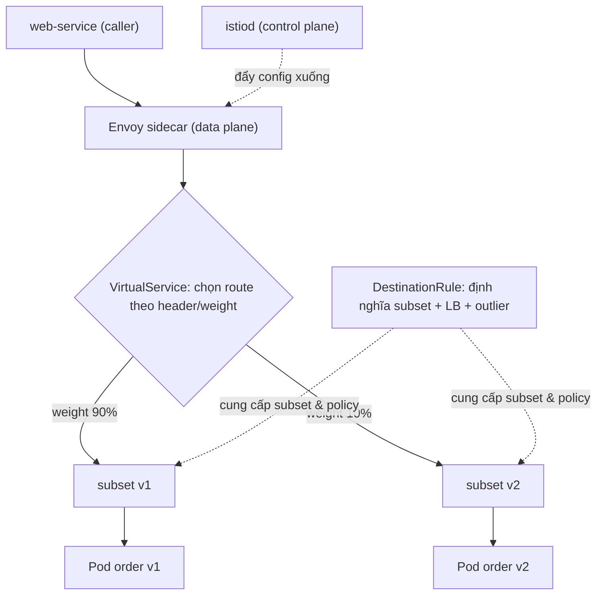

# Traffic Management — Routing, Canary, Retry & Circuit Breaking

> **Tác giả:** Mr.Rom\
> **Phiên bản:** v1.0.0\
> **Tạo lúc:** 13/06/2026\
> **Cập nhật:** 13/06/2026\
> **Level:** Basic\
> **Tags:** service-mesh, istio, traffic-management, canary, circuit-breaking\
> **Yêu cầu trước:** [Kiến trúc Service Mesh & Sidecar](01_architecture-and-sidecar.md)

> 🎯 *Bài trước bạn đã hiểu sidecar đứng giữa mọi cuộc gọi service-to-service. Bài này bạn sẽ dùng chính cái sidecar đó để **điều khiển traffic** — route theo weight/header, canary 90/10 dịch dần sang version mới, retry/timeout tự động, và circuit breaking cô lập host lỗi — tất cả bằng YAML, không sửa 1 dòng code service.*

## 🎯 Sau bài này bạn sẽ

- [ ] Hiểu cặp đôi **VirtualService** (route luật) + **DestinationRule** (subset + load balancing) và vì sao Istio tách 2 resource này
- [ ] Route traffic theo **weight** (canary) và theo **header/path** (định tuyến có điều kiện)
- [ ] Làm **canary release** 90/10 → dịch dần sang 100% mà không đụng tới K8s Service
- [ ] Cấu hình **retry** (`attempts`, `perTryTimeout`) + **timeout** cho cuộc gọi
- [ ] Bật **circuit breaking** qua outlier detection (eject host lỗi) + connection pool limit
- [ ] Dùng **fault injection** (delay/abort) để test resilience và **traffic mirroring** (shadow) để test không rủi ro

---

## Tình huống — Acme Shop muốn ra mắt order-service v2 mà không "đánh cược" cả production

Acme Shop có một mớ microservice chạy trên Kubernetes: `web`, `order`, `payment`, `inventory`... Bài trước bạn đã cài Istio và thấy mỗi Pod giờ có thêm 1 sidecar Envoy đứng chặn mọi traffic ra/vào.

Hôm nay team `order` viết xong `order-service` **v2** — refactor lại cách tính phí ship. Câu hỏi của sếp:

- 😱 *"Deploy thẳng v2 cho 100% khách? Nếu logic tính phí sai thì cả production toang ngay."*
- 😱 *"Hay deploy v2 song song, cho **10% traffic** nếm thử trước, theo dõi lỗi, rồi mới dịch dần lên 100%?"*
- 😱 *"Mà chia 10% bằng cách nào? Chẳng lẽ sửa K8s Service mỗi lần đổi tỷ lệ? Rồi nếu v2 chậm/lỗi, ai retry giúp? Ai ngắt mạch để 1 con v2 chết không kéo theo cả cụm?"*

Nếu bạn còn nhớ bài Kubernetes Services, K8s Service chia tải **round-robin đều** cho mọi Pod khớp label — nó không biết "v1" hay "v2", không chia được "90/10", không retry theo HTTP status. Muốn làm những việc đó ở tầng K8s thuần, bạn phải nhồi logic vào code từng service hoặc hack số lượng replica (muốn 10% thì phải có đúng 1 Pod v2 trên 9 Pod v1 — vô lý).

Chính vì thế **traffic management của service mesh** ra đời. Toàn bộ "luật giao thông" — chia tỷ lệ, route theo header, retry, timeout, ngắt mạch — được khai báo bằng YAML và đẩy xuống sidecar Envoy. Service code **không cần biết gì cả**.

> [!NOTE]
> Bài này dùng **Istio** làm ví dụ vì nó là service mesh phổ biến nhất và có mô hình traffic management rõ ràng nhất (VirtualService + DestinationRule). Linkerd/Cilium có khái niệm tương đương nhưng cú pháp khác — sẽ so sánh ở bài 04 của cụm.

---

## 1️⃣ Hai mảnh ghép: VirtualService và DestinationRule

Trước khi route được traffic, bạn cần hiểu Istio chia bài toán làm 2 nửa — và đây là chỗ người mới hay nhầm nhất.

🪞 **Ẩn dụ**: Hãy tưởng tượng một **trung tâm chuyển phát**:

- **DestinationRule** = *"danh sách các kho hàng có thể giao tới"*. Nó khai báo: dịch vụ `order` có những "phiên bản kho" nào (subset `v1`, `v2`), và quy tắc xếp tài (load balancing) khi giao tới mỗi kho.
- **VirtualService** = *"bảng luật điều phối của điều phối viên"*. Nó quyết định: kiện hàng (request) này đi tới kho nào — 90% về kho v1, 10% về kho v2; hay kiện có dán nhãn "internal" thì luôn về kho v2.

Tách 2 resource giúp **chia việc**: team hạ tầng định nghĩa "có những subset nào, load balancing ra sao" (DestinationRule), còn team ứng dụng viết "luật route" (VirtualService) mà không phải đụng phần kia.

| Resource | Trả lời câu hỏi | Khai báo gì |
|---|---|---|
| **VirtualService** | Request này đi *đâu*? | Match (header/path/weight) → route đích + retry + timeout + fault + mirror |
| **DestinationRule** | Đích đó *trông như thế nào*? | Subset (theo label version) + load balancing policy + connection pool + outlier detection |

Hiểu vai trò 2 resource rồi, ta xem chúng nối với nhau và với sidecar qua sơ đồ bên dưới.

> 💡 Sơ đồ dưới là phần trừu tượng nhất của bài: cách một request đi từ caller, qua sidecar, được VirtualService quyết route, rồi DestinationRule chọn host cụ thể.



Điểm mấu chốt: VirtualService chỉ *trỏ tên* subset (`v1`, `v2`); chính DestinationRule mới *định nghĩa* subset đó là những Pod nào (qua label) và áp policy gì. Thiếu DestinationRule, VirtualService trỏ vào subset không tồn tại → traffic 503.

---

## 2️⃣ Chuẩn bị sân khấu — deploy order-service v1 + v2

Để mọi ví dụ sau chạy được, ta deploy 2 phiên bản `order-service` song song trong namespace có bật sidecar injection. Phần này là HOW nền tảng — các section sau chỉ thêm VirtualService/DestinationRule lên trên.

### 🛠️ Bước 1: Tạo namespace và bật auto-injection

Istio chỉ tiêm sidecar vào Pod nếu namespace có label `istio-injection=enabled`. Ta tạo namespace `acme` và bật label đó trước, để mọi Pod deploy sau đều có Envoy:

```bash
# 1. Tạo namespace riêng cho Acme Shop
kubectl create namespace acme

# 2. Bật auto sidecar injection cho namespace này
kubectl label namespace acme istio-injection=enabled

# 3. Kiểm tra label đã gắn
kubectl get namespace acme --show-labels
```

Kết quả mong đợi:

```
NAME   STATUS   AGE   LABELS
acme   Active   5s    istio-injection=enabled,kubernetes.io/metadata.name=acme
```

Dòng `LABELS` phải chứa `istio-injection=enabled` — đây là điều kiện sống còn. Nếu thiếu label này, Pod deploy ra **không có sidecar**, và toàn bộ VirtualService/DestinationRule bên dưới sẽ vô tác dụng (vì không có Envoy để áp luật).

### 🛠️ Bước 2: Deploy 2 Deployment v1 + v2 với label `version`

Mấu chốt của canary là 2 Deployment **khác nhau ở label `version`** nhưng **chung label `app`**. Label `app: order` để K8s Service gom cả 2; label `version` để DestinationRule tách subset. Ở đây mình dùng cùng image demo `httpbin` cho cả v1 và v2 chỉ để minh hoạ — thực tế bạn thay bằng image order-service thật:

```yaml
# order-deploy.yaml
apiVersion: apps/v1
kind: Deployment
metadata:
  name: order-v1
  namespace: acme
spec:
  replicas: 2
  selector:
    matchLabels:
      app: order
      version: v1
  template:
    metadata:
      labels:
        app: order          # label chung — Service gom cả v1 và v2
        version: v1         # label riêng — DestinationRule tách subset
    spec:
      containers:
        - name: order
          image: docker.io/kennethreitz/httpbin:latest
          ports:
            - containerPort: 80
---
apiVersion: apps/v1
kind: Deployment
metadata:
  name: order-v2
  namespace: acme
spec:
  replicas: 2
  selector:
    matchLabels:
      app: order
      version: v2
  template:
    metadata:
      labels:
        app: order
        version: v2
    spec:
      containers:
        - name: order
          image: docker.io/kennethreitz/httpbin:latest
          ports:
            - containerPort: 80
```

### 🛠️ Bước 3: Tạo 1 K8s Service duy nhất cho cả 2 version

Đây là điểm khiến canary của Istio "đẹp": chỉ **một** K8s Service, selector chỉ dùng `app: order` (KHÔNG có `version`), nên nó gom cả Pod v1 lẫn v2. Việc chia v1/v2 hoàn toàn do Istio lo ở tầng trên:

```yaml
# order-service.yaml
apiVersion: v1
kind: Service
metadata:
  name: order
  namespace: acme
  labels:
    app: order
spec:
  selector:
    app: order              # KHÔNG có version → gom cả v1 + v2
  ports:
    - name: http            # tên port nên có prefix 'http' để Istio nhận diện protocol
      port: 80
      targetPort: 80
```

Apply cả 3 file rồi kiểm tra:

```bash
kubectl apply -f order-deploy.yaml
kubectl apply -f order-service.yaml

# Kiểm tra Pod — cột READY phải là 2/2 (1 app container + 1 sidecar Envoy)
kubectl get pods -n acme
```

Kết quả mong đợi:

```
NAME                        READY   STATUS    RESTARTS   AGE
order-v1-7d4f9c6b8-abcde    2/2     Running   0          40s
order-v1-7d4f9c6b8-fghij    2/2     Running   0          40s
order-v2-5b8c7d9f4-klmno    2/2     Running   0          40s
order-v2-5b8c7d9f4-pqrst    2/2     Running   0          40s
```

Cột `READY` hiển thị `2/2` chứ không phải `1/1` — đây là dấu hiệu sidecar Envoy đã được tiêm vào cạnh container app. Nếu bạn thấy `1/1`, nghĩa là namespace chưa có label injection (quay lại Bước 1). 4 Pod: 2 cho v1, 2 cho v2.

> 📖 *Sân khấu đã dựng xong: 1 Service `order` đứng trước 4 Pod (2 v1 + 2 v2). Giờ ta dạy Istio cách phân biệt v1/v2 bằng DestinationRule.*

---

## 3️⃣ DestinationRule — định nghĩa subset theo label version

DestinationRule trả lời câu hỏi *"dịch vụ `order` có những phiên bản nào?"*. Ta khai báo 2 subset, mỗi subset map tới một giá trị label `version`. Từ đây, VirtualService mới có "tên kho" để trỏ vào:

```yaml
# order-destinationrule.yaml
apiVersion: networking.istio.io/v1
kind: DestinationRule
metadata:
  name: order
  namespace: acme
spec:
  host: order               # tên K8s Service (order.acme.svc.cluster.local)
  subsets:
    - name: v1              # tên subset — VirtualService sẽ trỏ vào tên này
      labels:
        version: v1         # subset v1 = các Pod có label version=v1
    - name: v2
      labels:
        version: v2
```

Apply và kiểm tra:

```bash
kubectl apply -f order-destinationrule.yaml
kubectl get destinationrule -n acme
```

Kết quả mong đợi:

```
NAME    HOST    AGE
order   order   10s
```

> [!IMPORTANT]
> Trường `host: order` phải khớp **tên K8s Service** (không phải tên Deployment). Istio resolve nó thành FQDN `order.acme.svc.cluster.local`. Nếu gõ sai tên Service ở đây, subset trỏ vào hư không và mọi route sẽ trả 503.

DestinationRule còn là nơi đặt **load balancing policy** và **connection pool / outlier detection** — ta sẽ thêm vào chính file này ở section 6 và 7. Giờ subset đã sẵn sàng, ta viết luật route đầu tiên.

---

## 4️⃣ VirtualService — route theo weight (canary) và theo header/path

### Route mặc định 100% về v1

Trước khi canary, hãy "khoá" toàn bộ traffic về v1 để chắc chắn hành vi production không đổi. VirtualService dưới đây nói: mọi request tới host `order` → 100% subset v1:

```yaml
# order-vs-all-v1.yaml
apiVersion: networking.istio.io/v1
kind: VirtualService
metadata:
  name: order
  namespace: acme
spec:
  hosts:
    - order                 # áp cho traffic nội bộ tới Service 'order'
  http:
    - route:
        - destination:
            host: order
            subset: v1      # trỏ tới subset đã định nghĩa trong DestinationRule
          weight: 100        # 100% traffic về v1
```

Apply và test bằng 1 Pod tạm chạy `curl` liên tục:

```bash
kubectl apply -f order-vs-all-v1.yaml

# Chạy 1 client tạm trong namespace acme, gọi 10 lần vào header /headers
kubectl run -n acme client --image=curlimages/curl --rm -it --restart=Never -- \
  sh -c 'for i in $(seq 10); do curl -s -o /dev/null -w "%{http_code}\n" http://order/headers; done'
```

Kết quả mong đợi (10 dòng `200`):

```
200
200
200
200
200
200
200
200
200
200
```

Tất cả request đều thành công và (theo luật) đều rơi vào v1. Giờ ta chuyển sang chia tỷ lệ — phần cốt lõi của bài.

### Route theo weight — canary 90/10

Để canary, ta chỉ cần đổi `weight`: 90% giữ ở v1, 10% nếm thử v2. Lưu ý **tổng weight các destination phải bằng 100**:

```yaml
# order-vs-canary-90-10.yaml
apiVersion: networking.istio.io/v1
kind: VirtualService
metadata:
  name: order
  namespace: acme
spec:
  hosts:
    - order
  http:
    - route:
        - destination:
            host: order
            subset: v1
          weight: 90        # 90% traffic ở lại v1 (an toàn)
        - destination:
            host: order
            subset: v2
          weight: 10        # 10% traffic nếm thử v2 (canary)
```

### Route theo header — cho nội bộ test v2 trước

Đôi khi bạn muốn **toàn bộ team QA** thấy v2 (để test kỹ) trong khi khách thật vẫn 100% v1. Cách làm: match theo header. Request nào có header `x-user-group: internal` → luôn về v2; còn lại → v1. Istio xét các mục `http` **theo thứ tự**, mục nào match trước thì dùng, nên đặt luật header lên trên cùng:

```yaml
# order-vs-header.yaml
apiVersion: networking.istio.io/v1
kind: VirtualService
metadata:
  name: order
  namespace: acme
spec:
  hosts:
    - order
  http:
    # Luật 1: nội bộ (header x-user-group=internal) → luôn về v2
    - match:
        - headers:
            x-user-group:
              exact: internal
      route:
        - destination:
            host: order
            subset: v2
    # Luật 2: mọi request còn lại → v1 (mục không có match = catch-all, đặt cuối)
    - route:
        - destination:
            host: order
            subset: v1
```

Apply và test 2 trường hợp: có header và không header:

```bash
kubectl apply -f order-vs-header.yaml

# Request KHÔNG header → phải về v1
kubectl run -n acme c1 --image=curlimages/curl --rm -it --restart=Never -- \
  curl -s -o /dev/null -w "no-header: %{http_code}\n" http://order/headers

# Request CÓ header internal → phải về v2
kubectl run -n acme c2 --image=curlimages/curl --rm -it --restart=Never -- \
  curl -s -o /dev/null -w "internal: %{http_code}\n" -H "x-user-group: internal" http://order/headers
```

Kết quả mong đợi:

```
no-header: 200
internal: 200
```

> [!WARNING]
> Mục `http` không có `match` đóng vai trò **catch-all** và phải luôn nằm **cuối cùng**. Nếu đặt nó lên trên một luật `match` cụ thể, catch-all sẽ "nuốt" hết traffic và luật header bên dưới không bao giờ chạy.

### Route theo path — chia traffic theo URL prefix

Tương tự header, bạn có thể route theo `uri`. Ví dụ: gọi `/v2/...` thì sang v2, còn lại v1. `prefix` match phần đầu đường dẫn:

```yaml
# order-vs-path.yaml
apiVersion: networking.istio.io/v1
kind: VirtualService
metadata:
  name: order
  namespace: acme
spec:
  hosts:
    - order
  http:
    - match:
        - uri:
            prefix: /v2     # request có path bắt đầu /v2 → v2
      route:
        - destination:
            host: order
            subset: v2
    - route:                # catch-all → v1
        - destination:
            host: order
            subset: v1
```

→ 3 kiểu route (weight / header / path) là bộ công cụ định tuyến cơ bản. Tiếp theo ta dùng **weight** để làm một canary release hoàn chỉnh từ 0% → 100%.

---

## 5️⃣ Hands-on chính — canary release order-service v2 (90/10 → dịch dần)

Đây là kịch bản thực chiến của Acme Shop. Ý tưởng: chỉ sửa **một số** trong VirtualService để dịch traffic, **không hề đụng** K8s Service hay Deployment. Mỗi lần dịch, theo dõi error rate/latency của v2; ổn thì tăng tiếp, có vấn đề thì kéo về 0 trong vài giây.

### Giai đoạn 0 → 10% (mở màn canary)

Bắt đầu cho v2 nếm 10% traffic. Apply lại file canary 90/10 ở section 4:

```bash
kubectl apply -f order-vs-canary-90-10.yaml
```

Kiểm chứng tỷ lệ thực tế bằng cách bắn 100 request và đếm — vì cả v1 và v2 đều dùng chung image `httpbin`, response giống nhau nên ta không tách subset qua nội dung trả về mà đếm qua log sidecar. Cách đơn giản nhất là xem phân bố qua Istio telemetry (Kiali/Prometheus). Ở mức demo, gửi 100 request:

```bash
kubectl run -n acme load --image=curlimages/curl --rm -it --restart=Never -- \
  sh -c 'for i in $(seq 100); do curl -s -o /dev/null -w "%{http_code}\n" http://order/get; done | sort | uniq -c'
```

Kết quả mong đợi (toàn bộ 200, vì cả 2 subset đều khoẻ):

```
 100 200
```

> [!TIP]
> Để *nhìn thấy* phân bố 90/10 theo subset rõ ràng, mở **Kiali** (`istioctl dashboard kiali`) — đồ thị traffic graph hiển thị % request chảy về v1 vs v2 theo thời gian thực. Đây là cách verify canary chuẩn nhất thay vì đếm HTTP code thủ công.

### Giai đoạn 10% → 50% → 100% (dịch dần)

Khi v2 ở 10% chạy ổn (error rate không tăng, latency p99 chấp nhận được), ta dịch lên. Mỗi bước chỉ là một file VirtualService với weight khác. Đây là file 50/50:

```yaml
# order-vs-canary-50-50.yaml
apiVersion: networking.istio.io/v1
kind: VirtualService
metadata:
  name: order
  namespace: acme
spec:
  hosts:
    - order
  http:
    - route:
        - destination:
            host: order
            subset: v1
          weight: 50
        - destination:
            host: order
            subset: v2
          weight: 50
```

Và file 100% v2 (kết thúc canary — v2 thành phiên bản chính):

```yaml
# order-vs-all-v2.yaml
apiVersion: networking.istio.io/v1
kind: VirtualService
metadata:
  name: order
  namespace: acme
spec:
  hosts:
    - order
  http:
    - route:
        - destination:
            host: order
            subset: v2
          weight: 100
```

Quy trình dịch dần chỉ là chuỗi `kubectl apply`:

```bash
# Dịch 10% → 50%
kubectl apply -f order-vs-canary-50-50.yaml
# (theo dõi metric vài phút)

# Dịch 50% → 100% v2
kubectl apply -f order-vs-all-v2.yaml
```

| Bước canary | File apply | v1 | v2 | Việc cần làm sau khi apply |
|---|---|---|---|---|
| Mở màn | `order-vs-canary-90-10.yaml` | 90% | 10% | Theo dõi error rate + latency v2 |
| Tăng tốc | `order-vs-canary-50-50.yaml` | 50% | 50% | So sánh metric v1 vs v2 song song |
| Hoàn tất | `order-vs-all-v2.yaml` | 0% | 100% | Sau khi ổn, xoá Deployment v1 |

### Rollback tức thì khi v2 lỗi

Nếu giữa chừng v2 lỗi, **rollback chỉ là apply lại file 100% v1** — traffic kéo về v1 trong vài giây, không cần rebuild/redeploy gì:

```bash
# Sự cố! Kéo 100% traffic về v1 ngay
kubectl apply -f order-vs-all-v1.yaml
```

→ Đây chính là lý do canary bằng Istio mạnh hơn canary bằng cách chỉnh số replica: bạn điều khiển traffic bằng **một con số trong YAML**, rollback tức thì, và độ phân giải tỷ lệ mịn (1% cũng được) bất kể số Pod.

---

## 6️⃣ Retry + Timeout — tự động thử lại và cắt cuộc gọi treo

Quay lại nỗi lo của sếp: *"v2 thi thoảng chậm/lỗi, ai retry giúp?"*. Trong service mesh, retry và timeout khai báo ngay trong VirtualService — sidecar Envoy thực thi, **code service không cần try/catch + sleep + retry thủ công**.

### Timeout — cắt cuộc gọi treo quá lâu

Mặc định Envoy không timeout (chờ vô hạn). Một downstream treo có thể giữ connection mãi và làm cạn pool. Ta đặt `timeout` cho mỗi route — quá thời gian thì trả lỗi ngay thay vì treo:

```yaml
# order-vs-timeout.yaml
apiVersion: networking.istio.io/v1
kind: VirtualService
metadata:
  name: order
  namespace: acme
spec:
  hosts:
    - order
  http:
    - route:
        - destination:
            host: order
            subset: v1
      timeout: 2s           # cuộc gọi quá 2 giây → trả lỗi, không treo
```

### Retry — tự thử lại khi gặp lỗi tạm thời

Lỗi mạng chớp nhoáng (connect-failure, 503 do Pod đang restart) thường tự khỏi nếu thử lại. `retries` để Envoy tự retry mà caller không hề biết:

```yaml
# order-vs-retry.yaml
apiVersion: networking.istio.io/v1
kind: VirtualService
metadata:
  name: order
  namespace: acme
spec:
  hosts:
    - order
  http:
    - route:
        - destination:
            host: order
            subset: v1
      timeout: 5s                       # tổng thời gian tối đa cho cả request (gồm các lần retry)
      retries:
        attempts: 3                      # thử lại tối đa 3 lần
        perTryTimeout: 1s                # mỗi lần thử chờ tối đa 1 giây
        retryOn: connect-failure,5xx,gateway-error   # chỉ retry khi gặp các loại lỗi này
```

Apply và quan sát ý nghĩa các tham số:

```bash
kubectl apply -f order-vs-retry.yaml
```

- **`attempts: 3`** — Envoy thử tối đa 3 lần (1 lần đầu + 2 lần lại). Nếu cả 3 đều lỗi mới trả lỗi về caller.
- **`perTryTimeout: 1s`** — mỗi lần thử riêng lẻ chờ tối đa 1 giây; quá thì coi như fail lần đó và retry tiếp.
- **`timeout: 5s`** — trần tổng cho cả request kể cả retry. Đặt `timeout >= attempts * perTryTimeout` để không bị cắt giữa chừng (3 × 1s = 3s < 5s, ổn).
- **`retryOn`** — danh sách điều kiện retry. `connect-failure` (không nối được), `5xx` (lỗi server), `gateway-error` (502/503/504).

> [!CAUTION]
> Chỉ retry các request **idempotent** (GET, hoặc POST có idempotency key). Retry mù một `POST /orders` (tạo đơn) có thể tạo **đơn trùng** khi request đầu thực ra đã thành công nhưng response bị mất. Đây là lỗi sản xuất kinh điển khi bật retry không suy nghĩ.

→ Retry/timeout xử lý lỗi **tạm thời**. Nhưng nếu một host v2 *liên tục* lỗi thì retry chỉ làm nó tệ thêm — ta cần cô lập host đó. Đó là việc của circuit breaking.

---

## 7️⃣ Circuit Breaking — cô lập host lỗi + giới hạn connection pool

🪞 **Ẩn dụ**: *Circuit breaker giống **cầu dao điện** trong nhà. Khi một ổ cắm chập (host lỗi liên tục), cầu dao tự ngắt riêng nhánh đó để không cháy cả nhà (cả service). Sau một lúc, nó thử đóng lại xem nhánh đã ổn chưa.*

Khác với retry/timeout (đặt ở VirtualService), circuit breaking đặt ở **DestinationRule** vì nó là thuộc tính của *đích* (mỗi host khoẻ hay yếu), không phải của route. Ta thêm `trafficPolicy` vào DestinationRule đã tạo ở section 3:

```yaml
# order-destinationrule-cb.yaml
apiVersion: networking.istio.io/v1
kind: DestinationRule
metadata:
  name: order
  namespace: acme
spec:
  host: order
  trafficPolicy:
    loadBalancer:
      simple: LEAST_REQUEST           # gửi request tới host đang ít việc nhất
    connectionPool:
      tcp:
        maxConnections: 100           # tối đa 100 TCP connection tới service này
      http:
        http2MaxRequests: 1000        # tối đa 1000 request đồng thời
        maxRequestsPerConnection: 10  # mỗi connection phục vụ tối đa 10 request rồi đóng
    outlierDetection:
      consecutive5xxErrors: 5         # 1 host trả 5 lỗi 5xx liên tiếp...
      interval: 10s                   # ...xét mỗi 10 giây...
      baseEjectionTime: 30s           # ...thì eject (loại) host đó 30 giây
      maxEjectionPercent: 50          # nhưng không eject quá 50% số host (tránh sập cả cụm)
  subsets:
    - name: v1
      labels:
        version: v1
    - name: v2
      labels:
        version: v2
```

Apply và đọc ý nghĩa 3 nhóm cấu hình:

```bash
kubectl apply -f order-destinationrule-cb.yaml
kubectl get destinationrule order -n acme -o yaml | grep -A8 outlierDetection
```

Kết quả mong đợi (in lại đúng block đã khai báo):

```
      outlierDetection:
        baseEjectionTime: 30s
        consecutive5xxErrors: 5
        interval: 10s
        maxEjectionPercent: 50
```

Ba nhóm cấu hình giải quyết 3 vấn đề khác nhau:

- **`loadBalancer`** — chiến lược chia tải: `ROUND_ROBIN` (mặc định, đều), `LEAST_REQUEST` (host ít việc nhất — tốt khi latency lệch), `RANDOM`, `PASSTHROUGH`.
- **`connectionPool`** — giới hạn tài nguyên: chặn không cho caller mở quá nhiều connection/request, tránh một caller "ngốn" hết và làm sập service. Vượt limit → request bị từ chối nhanh (fail fast) thay vì xếp hàng vô tận.
- **`outlierDetection`** — đây là **circuit breaker** thực sự: host nào trả `consecutive5xxErrors` lỗi liên tiếp sẽ bị **eject** (loại khỏi pool) trong `baseEjectionTime`. Hết thời gian, host được thả lại thử; nếu lại lỗi, thời gian eject tăng gấp đôi. `maxEjectionPercent: 50` đảm bảo không bao giờ eject quá nửa số host (nếu không, 1 sự cố mạng toàn cục có thể eject sạch và sập service).

> [!WARNING]
> `maxEjectionPercent` mặc định của Istio là **10%**. Với service chỉ có 1-2 Pod, 10% làm tròn xuống nghĩa là *không host nào bị eject* — circuit breaker "có như không". Service ít Pod nên đặt rõ `maxEjectionPercent: 50` để outlier detection thực sự hoạt động.

→ Retry + timeout + circuit breaking là bộ ba **resilience**. Nhưng làm sao biết chúng hoạt động đúng *trước khi* sự cố thật xảy ra? Ta chủ động "gây lỗi giả" — fault injection.

---

## 8️⃣ Fault Injection — chủ động tiêm lỗi để test resilience

Bạn cấu hình retry/timeout xong, nhưng làm sao chắc nó chạy? Chờ production lỗi để kiểm chứng thì quá muộn. **Fault injection** cho phép tiêm **delay** (làm chậm) hoặc **abort** (trả lỗi) một tỷ lệ traffic — ngay tại sidecar, không sửa code — để xem hệ thống phản ứng ra sao.

### Tiêm delay — test timeout có hoạt động

VirtualService dưới làm chậm 50% request thêm 3 giây. Nếu bạn đã đặt `timeout: 2s` ở section 6, các request bị delay sẽ bị cắt → bạn xác nhận timeout hoạt động:

```yaml
# order-vs-fault-delay.yaml
apiVersion: networking.istio.io/v1
kind: VirtualService
metadata:
  name: order
  namespace: acme
spec:
  hosts:
    - order
  http:
    - fault:
        delay:
          percentage:
            value: 50         # 50% số request bị làm chậm
          fixedDelay: 3s      # chậm thêm 3 giây
      route:
        - destination:
            host: order
            subset: v1
```

### Tiêm abort — test xử lý lỗi phía caller

`abort` trả về HTTP status lỗi cho một tỷ lệ request. Ví dụ ép 10% request trả `503` — để kiểm tra caller (và circuit breaker) phản ứng đúng:

```yaml
# order-vs-fault-abort.yaml
apiVersion: networking.istio.io/v1
kind: VirtualService
metadata:
  name: order
  namespace: acme
spec:
  hosts:
    - order
  http:
    - fault:
        abort:
          percentage:
            value: 10         # 10% số request...
          httpStatus: 503     # ...bị trả về lỗi 503
      route:
        - destination:
            host: order
            subset: v1
```

Apply và gửi 50 request để thấy mix giữa 200 và 503:

```bash
kubectl apply -f order-vs-fault-abort.yaml

kubectl run -n acme fault --image=curlimages/curl --rm -it --restart=Never -- \
  sh -c 'for i in $(seq 50); do curl -s -o /dev/null -w "%{http_code}\n" http://order/get; done | sort | uniq -c'
```

Kết quả mong đợi (khoảng 10% là 503, phần còn lại 200 — con số dao động quanh tỷ lệ):

```
   5 503
  45 200
```

Khoảng 5/50 request trả `503` (≈10% như cấu hình), còn lại `200`. Tỷ lệ thực tế dao động nhẹ mỗi lần chạy vì đây là xác suất, không phải đúng tuyệt đối 5 request.

> [!CAUTION]
> Fault injection là **công cụ test**, KHÔNG để quên trên production. Một VirtualService abort 10% nằm sót lại sẽ làm 10% khách thật gặp lỗi 503 mà không ai hiểu vì sao. Luôn xoá hoặc gắn nhãn rõ ràng, và tốt nhất chỉ áp trong môi trường staging.

→ Fault injection test resilience nhưng có rủi ro (ảnh hưởng traffic thật). Có một cách test version mới **không rủi ro gì** với khách: mirroring.

---

## 9️⃣ Traffic Mirroring (Shadow) — test v2 bằng traffic thật mà khách không hề biết

🪞 **Ẩn dụ**: *Mirroring giống **phòng diễn tập có khán giả ảo**. Bạn cho diễn viên mới (v2) diễn lại đúng vở đang chiếu (traffic thật của v1), nhưng khán giả thật vẫn xem v1. Phản hồi của khán giả ảo bị bỏ đi — chỉ bạn ngồi xem v2 diễn có vấp không.*

Cụ thể: VirtualService gửi traffic thật tới v1 (khách nhận response từ v1 như bình thường), đồng thời **sao chép (mirror)** request đó gửi sang v2. Response của v2 bị **vứt bỏ** — khách không bao giờ thấy. Bạn quan sát log/metric v2 để biết nó có crash, có chậm, có lỗi không, với 100% traffic production thật mà rủi ro **bằng không**:

```yaml
# order-vs-mirror.yaml
apiVersion: networking.istio.io/v1
kind: VirtualService
metadata:
  name: order
  namespace: acme
spec:
  hosts:
    - order
  http:
    - route:
        - destination:
            host: order
            subset: v1        # traffic THẬT đi về v1 — khách nhận response của v1
      mirror:
        host: order
        subset: v2            # request được SAO CHÉP sang v2
      mirrorPercentage:
        value: 100.0          # mirror 100% traffic (response v2 bị vứt bỏ)
```

Apply và quan sát log của Pod v2 trong khi traffic chảy:

```bash
kubectl apply -f order-vs-mirror.yaml

# Gửi vài request (khách "ảo" — nhưng v2 cũng nhận bản sao)
kubectl run -n acme mir --image=curlimages/curl --rm -it --restart=Never -- \
  sh -c 'for i in $(seq 5); do curl -s -o /dev/null -w "%{http_code}\n" http://order/get; done'

# Xem log v2 — sẽ thấy request mirror chảy vào dù khách không gọi v2 trực tiếp
kubectl logs -n acme -l app=order,version=v2 -c order --tail=20
```

Kết quả mong đợi: client thấy `200` (từ v1), nhưng **log của Pod v2 cũng ghi nhận các request đó** — bằng chứng traffic đã được mirror sang v2:

```
200
200
200
200
200
```

> [!NOTE]
> Khi mirror, Istio tự gắn hậu tố `-shadow` vào header `Host`/`Authority` của request gửi sang v2 (ví dụ `order-shadow`). Nhờ vậy v2 có thể nhận biết đây là traffic shadow để **không ghi DB / không gọi payment thật** — tránh tác dụng phụ ngoài ý muốn từ traffic ảo.

→ Mirroring là bước test an toàn nhất trước khi canary: cho v2 "chạy thử" với traffic thật, soi log, rồi mới bắt đầu chia 10% thật ở section 5.

---

## 💡 Cạm bẫy thường gặp & Best practice

### ❌ Cạm bẫy: VirtualService trỏ subset chưa có trong DestinationRule

- **Triệu chứng**: Apply VirtualService với `subset: v2` nhưng mọi request về v2 trả `503 NR` (no route/no healthy upstream).
- **Nguyên nhân**: Subset `v2` chưa được định nghĩa trong DestinationRule, hoặc label trong DestinationRule không khớp label thật của Pod (ví dụ Pod có `version: v2` nhưng DestinationRule ghi `ver: v2`).
- **Cách tránh**: Luôn apply DestinationRule **trước** VirtualService. Kiểm tra `istioctl proxy-config cluster <pod>` để xem subset có endpoint không, hoặc `kubectl get pods -n acme --show-labels` để đối chiếu label.

### ❌ Cạm bẫy: tổng weight không bằng 100

- **Triệu chứng**: Canary chia tỷ lệ sai so với mong đợi, hoặc Istio báo lỗi validation khi apply.
- **Nguyên nhân**: Các `weight` trong cùng một `route` phải cộng lại đúng 100. Ghi `90` + `5` (tổng 95) là sai.
- **Cách tránh**: Mỗi lần đổi tỷ lệ, kiểm tra tổng = 100. Với 2 subset, đổi đồng thời cả 2 số (90/10 → 80/20).

### ❌ Cạm bẫy: bật retry cho request không idempotent

- **Triệu chứng**: Sau khi bật retry, thỉnh thoảng xuất hiện đơn hàng trùng / trừ tiền 2 lần.
- **Nguyên nhân**: `retryOn` retry cả request `POST` tạo dữ liệu. Request đầu thực ra đã thành công nhưng response về trễ/mất → Envoy retry → tạo bản ghi thứ hai.
- **Cách tránh**: Chỉ retry GET hoặc operation idempotent. Với POST quan trọng, dùng idempotency key phía service và giới hạn `retryOn` hợp lý.

### ✅ Best practice: mirror trước, canary sau

- **Vì sao**: Mirroring test v2 với 100% traffic thật mà rủi ro bằng 0 (response bị vứt). Phát hiện crash/regression *trước khi* một khách thật nào chạm vào v2.
- **Cách áp dụng**: Quy trình ra mắt: (1) mirror 100% sang v2, soi log/metric → (2) canary 10% → (3) dịch dần 50% → 100% → (4) xoá v1. Mỗi bước có cổng metric trước khi sang bước kế.

### ✅ Best practice: đặt timeout + circuit breaking ngay từ đầu

- **Vì sao**: Không timeout = cuộc gọi treo giữ connection → cạn pool → lỗi lan (cascading failure). Không outlier detection = 1 host lỗi vẫn nhận request và kéo tụt cả service.
- **Cách áp dụng**: Mọi service mới đều kèm sẵn DestinationRule có `connectionPool` + `outlierDetection`, và VirtualService có `timeout`. Coi đây là cấu hình mặc định, không phải tính năng "thêm sau".

---

## 🧠 Tự kiểm tra (Self-check)

**Q1.** Vì sao canary bằng Istio không cần đổi K8s Service hay số lượng replica?

<details>
<summary>💡 Xem giải thích</summary>

K8s Service chỉ gom Pod theo label `app: order` (không phân biệt version) và chia tải round-robin. Việc phân biệt v1/v2 và chia tỷ lệ nằm hoàn toàn ở tầng Istio: **DestinationRule** định nghĩa subset theo label `version`, **VirtualService** đặt `weight` cho từng subset. Dịch traffic = sửa một con số `weight` trong VirtualService rồi `kubectl apply`. K8s Service và Deployment không hề thay đổi. Nhờ vậy độ phân giải tỷ lệ mịn tới 1% bất kể số Pod, và rollback chỉ là apply lại file 100% v1.

</details>

**Q2.** Khác nhau cốt lõi giữa VirtualService và DestinationRule là gì?

<details>
<summary>💡 Xem giải thích</summary>

- **VirtualService** = luật *route*: request này đi đâu (match theo header/path/weight), kèm retry, timeout, fault, mirror.
- **DestinationRule** = mô tả *đích*: subset (theo label version), load balancing policy, connection pool, outlier detection (circuit breaking).

VirtualService chỉ *trỏ tên* subset; DestinationRule mới *định nghĩa* subset đó là Pod nào và áp policy gì. Phải có DestinationRule trước, nếu không VirtualService trỏ vào subset không tồn tại → 503.

</details>

**Q3.** `attempts: 3`, `perTryTimeout: 1s`, `timeout: 5s` — đặt `timeout` thế nào cho hợp lý?

<details>
<summary>💡 Xem giải thích</summary>

`timeout` là trần tổng cho cả request **gồm các lần retry**. Phải đảm bảo `timeout >= attempts * perTryTimeout` để không bị cắt giữa chừng. Ở đây `3 × 1s = 3s < 5s` → hợp lý, còn dư biên cho overhead. Nếu đặt `timeout: 2s` mà `attempts: 3, perTryTimeout: 1s`, request sẽ bị cắt sau ~2s khi mới retry được 2 lần — phí mất 1 lần retry.

</details>

**Q4.** `outlierDetection` đặt ở VirtualService hay DestinationRule? Vì sao?

<details>
<summary>💡 Xem giải thích</summary>

Ở **DestinationRule**. Outlier detection (circuit breaking) là thuộc tính của *đích* — nó theo dõi từng host (endpoint) khoẻ hay yếu và quyết định eject host nào ra khỏi pool. Đó là đặc tính của destination, không phải của route. Ngược lại, retry/timeout/fault/mirror gắn với *cách một route được xử lý* nên nằm ở VirtualService.

</details>

**Q5.** Vì sao service ít Pod nên đặt `maxEjectionPercent` cao hơn mặc định?

<details>
<summary>💡 Xem giải thích</summary>

Mặc định `maxEjectionPercent` của Istio là 10%. Với service chỉ 1-2 Pod, 10% làm tròn xuống = 0 host được phép eject → circuit breaker không bao giờ kích hoạt, "có như không". Đặt `maxEjectionPercent: 50` cho phép eject tới nửa số host, đủ để outlier detection thực sự cô lập host lỗi mà vẫn giữ ít nhất một host phục vụ.

</details>

---

## ⚡ Tra cứu nhanh (Cheatsheet)

```yaml
# === VirtualService: route theo weight (canary) ===
http:
  - route:
      - destination: { host: order, subset: v1 }
        weight: 90
      - destination: { host: order, subset: v2 }
        weight: 10

# === VirtualService: route theo header ===
http:
  - match:
      - headers: { x-user-group: { exact: internal } }
    route:
      - destination: { host: order, subset: v2 }
  - route:
      - destination: { host: order, subset: v1 }   # catch-all cuối cùng

# === VirtualService: retry + timeout ===
http:
  - route:
      - destination: { host: order, subset: v1 }
    timeout: 5s
    retries: { attempts: 3, perTryTimeout: 1s, retryOn: "connect-failure,5xx" }

# === VirtualService: fault injection ===
http:
  - fault:
      abort: { percentage: { value: 10 }, httpStatus: 503 }
    route:
      - destination: { host: order, subset: v1 }

# === VirtualService: mirror (shadow) ===
http:
  - route:
      - destination: { host: order, subset: v1 }
    mirror: { host: order, subset: v2 }
    mirrorPercentage: { value: 100.0 }

# === DestinationRule: subset + LB + circuit breaking ===
spec:
  host: order
  trafficPolicy:
    loadBalancer: { simple: LEAST_REQUEST }
    connectionPool:
      tcp: { maxConnections: 100 }
      http: { http2MaxRequests: 1000 }
    outlierDetection:
      consecutive5xxErrors: 5
      interval: 10s
      baseEjectionTime: 30s
      maxEjectionPercent: 50
  subsets:
    - name: v1
      labels: { version: v1 }
    - name: v2
      labels: { version: v2 }
```

```bash
# === Lệnh thao tác & debug ===
kubectl apply -f order-vs-canary-90-10.yaml          # apply luật route
kubectl get virtualservice -n acme                   # liệt kê VirtualService
kubectl get destinationrule -n acme                  # liệt kê DestinationRule
istioctl analyze -n acme                             # phát hiện cấu hình sai
istioctl proxy-config route <pod> -n acme            # xem route Envoy thực tế nhận
istioctl proxy-config cluster <pod> -n acme          # xem subset/endpoint Envoy biết
istioctl dashboard kiali                             # mở Kiali xem traffic graph % v1/v2
```

---

## 📚 Từ Điển Thuật Ngữ (Glossary)

| EN | VN | Giải thích |
|---|---|---|
| **VirtualService** | Luật định tuyến | Istio CRD định nghĩa request đi đâu: match header/path/weight + retry/timeout/fault/mirror |
| **DestinationRule** | Quy tắc đích | Istio CRD định nghĩa subset (theo label) + load balancing + connection pool + outlier detection |
| **Subset** | Phân nhóm | Một nhóm Pod của service xác định theo label (ví dụ `version: v1`) |
| **Canary release** | Ra mắt thăm dò | Cho một phần nhỏ traffic nếm thử version mới trước khi mở rộng toàn bộ |
| **Weight** | Trọng số | Tỷ lệ % traffic chia cho mỗi destination; tổng các weight trong một route = 100 |
| **Retry** | Thử lại | Sidecar tự gọi lại khi gặp lỗi tạm thời (`attempts`, `perTryTimeout`, `retryOn`) |
| **Timeout** | Thời gian chờ | Trần thời gian cho một cuộc gọi; quá hạn trả lỗi thay vì treo |
| **Circuit breaking** | Ngắt mạch | Cô lập host lỗi để tránh lỗi lan ra cả service |
| **Outlier detection** | Phát hiện host lỗi | Cơ chế đếm lỗi liên tiếp của từng host và eject host vượt ngưỡng |
| **Eject** | Loại tạm | Tạm gỡ một host khỏi load balancing pool trong `baseEjectionTime` |
| **Connection pool** | Bể kết nối | Giới hạn số connection/request đồng thời tới một service để fail fast |
| **Fault injection** | Tiêm lỗi | Chủ động delay/abort một tỷ lệ traffic để test resilience |
| **Traffic mirroring** | Soi gương (shadow) | Sao chép traffic thật sang version mới; response bản sao bị vứt bỏ |
| **Idempotent** | Bất biến lặp | Thao tác gọi lại nhiều lần cho cùng kết quả, an toàn để retry |
| **istiod** | Control plane Istio | Tiến trình điều phối, đẩy cấu hình route/policy xuống các sidecar Envoy |

---

## 🔗 Liên kết & Tài nguyên

### 🧭 Định hướng lộ trình học

- ⬅️ **Bài trước:** [Kiến trúc Service Mesh — Data plane, Control plane & Sidecar](01_architecture-and-sidecar.md)
- ➡️ **Bài tiếp theo:** [Bảo mật Service Mesh — mTLS tự động & Authorization Policy](03_security-mtls-and-authz.md)
- ↑ **Về cụm:** [Service Mesh README](../../README.md)

### 🧩 Các chủ đề có thể bạn quan tâm

- [Service Mesh là gì? — Tầng hạ tầng cho giao tiếp microservice](00_what-is-service-mesh.md)
- [Istio vs Linkerd vs Cilium — Chọn service mesh nào?](04_istio-vs-linkerd-vs-cilium.md)
- [Kubernetes Services & Networking](../../../kubernetes/lessons/01_basic/02_services-and-networking.md)

### 🌐 Tài nguyên tham khảo khác

- [Istio Traffic Management docs](https://istio.io/latest/docs/concepts/traffic-management/) — khái niệm gốc về VirtualService/DestinationRule
- [Istio VirtualService reference](https://istio.io/latest/docs/reference/config/networking/virtual-service/) — đầy đủ field của VirtualService
- [Istio DestinationRule reference](https://istio.io/latest/docs/reference/config/networking/destination-rule/) — đầy đủ field outlier detection + connection pool
- [Istio Bookinfo canary task](https://istio.io/latest/docs/tasks/traffic-management/traffic-shifting/) — bài lab canary chính thức của Istio

---

## 📌 Nhật ký thay đổi (Changelog)

- **v1.0.0 (13/06/2026)** — Bản đầu tiên. Lesson 02 cụm Service Mesh: VirtualService (route theo weight/header/path) + DestinationRule (subset theo label + load balancing + connection pool + outlier detection); canary release 90/10 → dịch dần không đổi K8s Service; retry (`attempts`/`perTryTimeout`/`retryOn`) + timeout; circuit breaking qua outlier detection; fault injection (delay/abort); traffic mirroring (shadow). Hands-on deploy order-service v1+v2 trên namespace `acme` và canary 10% sang v2. Kèm 4 cạm bẫy + 2 best practice + 5 self-check + cheatsheet + glossary.
