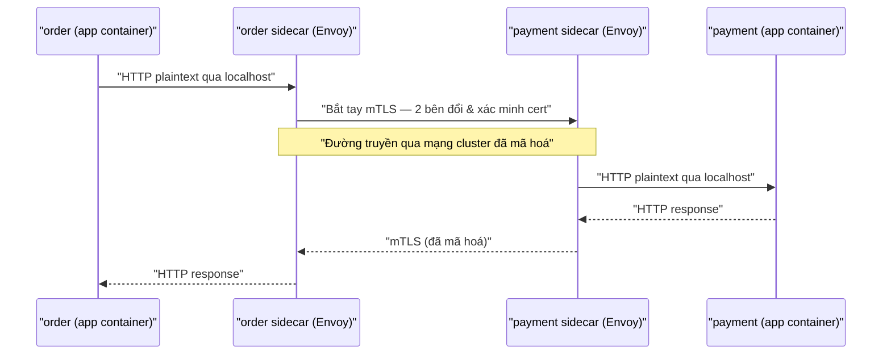

# 🔐 Bảo mật Service Mesh — mTLS tự động & Authorization Policy

> **Tác giả:** Mr.Rom\
> **Phiên bản:** v1.0.0\
> **Tạo lúc:** 13/06/2026\
> **Cập nhật:** 13/06/2026\
> **Level:** Basic\
> **Tags:** service-mesh, istio, mtls, security, zero-trust, authorization\
> **Yêu cầu trước:** [Traffic Management — Routing, Canary, Retry & Circuit Breaking](02_traffic-management.md)

> 🎯 *Bài trước bạn đã điều khiển traffic (canary, retry, circuit breaking) mà không đụng code. Bài này tiếp tục đường đó với bảo mật: bật mã hoá mTLS tự động giữa mọi service, gắn danh tính (identity) cho từng service, rồi viết AuthorizationPolicy theo tư duy zero-trust — chỉ ai được phép mới gọi được ai. Cuối bài bạn sẽ bật STRICT mTLS cho namespace Acme và chặn được mọi truy cập trực tiếp vào payment.*

## 🎯 Sau bài này bạn sẽ

- [ ] Hiểu vì sao mesh bật được mTLS **tự động** giữa các service mà không sửa một dòng code, và cert được xoay (rotate) ra sao
- [ ] Đọc được danh tính service theo chuẩn **SPIFFE/SVID** gắn với Kubernetes ServiceAccount
- [ ] Cấu hình **PeerAuthentication** ở chế độ `STRICT` vs `PERMISSIVE` và biết lộ trình migrate an toàn
- [ ] Viết **AuthorizationPolicy** ALLOW/DENY theo source principal, namespace, path, method (zero-trust)
- [ ] Dùng **RequestAuthentication** để xác thực JWT của end-user
- [ ] Quan sát (verify) chứng chỉ đang dùng giữa hai Pod

---

## Tình huống — Acme Shop chạy "trần" bên trong cluster

Acme Shop đã chạy nhiều microservice trên Kubernetes: `web` (frontend), `order` (xử lý đơn hàng), `payment` (thanh toán). Ở [bài Traffic Management](02_traffic-management.md), bạn đã dùng Istio để canary, retry, circuit breaking — traffic chảy êm ru.

Nhưng một chiều thứ Sáu, đội bảo mật chạy audit và gửi cho bạn 3 phát hiện lạnh gáy:

- 🔴 **Traffic nội bộ là plaintext.** `web → order → payment` đi qua mạng cluster **không mã hoá**. Ai bắt được gói tin trong cluster (Pod bị chiếm, node bị compromise, sniff `tcpdump`) là đọc được số thẻ.
- 🔴 **Không có danh tính.** `payment` không hề biết request đến **từ ai**. Một Pod bất kỳ trong cluster — kể cả Pod độc hại do hacker cài vào — `curl` thẳng `http://payment:8080/charge` là chạy.
- 🔴 **Mạng phẳng, tin lẫn nhau.** Mặc định mọi Pod gọi được mọi Pod (bạn đã thấy ở [K8s Services & Networking](../../../kubernetes/lessons/01_basic/02_services-and-networking.md)). `web` đáng lẽ chỉ nên gọi `order`, nhưng nó gọi thẳng `payment` cũng được.

Sếp bảo: *"Mã hoá hết traffic nội bộ. Mỗi service phải có danh tính. Và payment chỉ được gọi từ order, không ai khác. Nhưng đội mình có 40 service rồi — không sửa code từng cái được."*

Đây chính xác là việc service mesh sinh ra để làm. Vì mọi traffic đã đi qua **sidecar proxy** (bài [Kiến trúc & Sidecar](01_architecture-and-sidecar.md)), ta cài bảo mật **ở tầng proxy** — không service nào cần đổi code.

> 💡 Cả bài này mình dùng **Istio** làm ví dụ cụ thể (mesh phổ biến nhất 2026). Bài [04 — Istio vs Linkerd vs Cilium](04_istio-vs-linkerd-vs-cilium.md) sẽ so sánh; nhưng khái niệm mTLS / identity / authz là chung cho mọi mesh.

---

## 1️⃣ mTLS tự động — mã hoá hai chiều không cần đụng code

Trước hết phân biệt 2 khái niệm hay nhầm. *TLS* (Transport Layer Security) thông thường — như HTTPS bạn dùng hằng ngày — chỉ **client xác minh server**: trình duyệt kiểm tra cert của `acmeshop.vn`, còn server không biết client là ai. *mTLS* (mutual TLS — TLS hai chiều) thì **cả hai bên cùng trình cert cho nhau**: server cũng xác minh client. Nhờ vậy `payment` biết chắc đầu kia đúng là `order` chứ không phải kẻ giả mạo.

🪞 **Ẩn dụ đời thường:** *TLS thường giống bạn vào toà nhà — bạn xem bảng hiệu để biết "đúng toà nhà công ty", nhưng bảo vệ không kiểm tra bạn. mTLS giống cửa có 2 đầu đọc thẻ: bạn quẹt thẻ nhân viên, đồng thời bạn cũng xác nhận đây đúng là cửa công ty mình. Hai bên cùng chứng minh danh tính trước khi nói chuyện.*

Điều đặc biệt của mesh: việc làm mTLS **không nằm trong app**. Hãy nhớ kiến trúc sidecar — mỗi Pod có một proxy (Envoy) chạy kế bên, mọi gói tin ra/vào đều chui qua nó. mTLS xảy ra **giữa hai sidecar**, app chỉ thấy traffic plaintext localhost như cũ.



Điểm mấu chốt từ sơ đồ: app `order` và app `payment` **vẫn nói plaintext** với sidecar của chính nó qua `localhost` (an toàn vì cùng Pod), còn chặng đi qua mạng cluster — chặng duy nhất hacker sniff được — thì luôn mã hoá. Vì thế bật mTLS không cần đổi code, không cần TLS library trong app.

### Cert ở đâu ra, ai xoay (rotate)?

Câu hỏi tiếp theo: cert cho mỗi sidecar lấy từ đâu? Trong Istio, **`istiod`** (control plane) đóng vai trò CA (Certificate Authority — tổ chức cấp chứng chỉ) nội bộ của mesh:

- Khi một Pod khởi động, sidecar gửi yêu cầu (CSR) lên `istiod` xin cert cho danh tính của mình.
- `istiod` ký cert với thời hạn **rất ngắn** (mặc định 24 giờ).
- Sidecar **tự động gia hạn** cert trước khi hết hạn (mặc định khi còn ~50% vòng đời) — không downtime, không ai phải nhớ renew.

Khác hẳn việc bạn tự quản cert HTTPS public 90 ngày ở [bài cert-manager](../../../kubernetes/lessons/02_intermediate/02_ingress-cert-manager-tls.md). Cert nội bộ mesh sống tính bằng **giờ**, xoay liên tục, hoàn toàn tự động — cert ngắn hạn nghĩa là cert bị lộ cũng chỉ dùng được vài giờ.

> 📖 Cert là vô hình với app, nhưng nó "đại diện" cho danh tính của service. Vậy danh tính đó được đặt tên theo chuẩn nào — phần tiếp theo.

---

## 2️⃣ Identity — SPIFFE/SVID gắn với ServiceAccount

Một cert chỉ có ích nếu nó nói rõ "tôi là ai". Service mesh dùng chuẩn **SPIFFE** (Secure Production Identity Framework For Everyone — khung danh tính chuẩn cho workload) để đặt tên danh tính, và cert mang danh tính đó gọi là **SVID** (SPIFFE Verifiable Identity Document — chứng chỉ danh tính xác minh được).

Danh tính SPIFFE là một URI có dạng cố định. Với Istio trên Kubernetes, nó được sinh **tự động** từ ServiceAccount của Pod:

```text
spiffe://<trust-domain>/ns/<namespace>/sa/<service-account>
```

Ví dụ Pod `order` chạy bằng ServiceAccount `order-sa` trong namespace `acme` sẽ có danh tính:

```text
spiffe://cluster.local/ns/acme/sa/order-sa
```

🪞 **Ẩn dụ đời thường:** *SPIFFE ID giống số CMND/CCCD của service. Cert (SVID) là tấm thẻ vật lý mang số đó, do "cơ quan cấp" (istiod) ký tên đóng dấu, có hạn dùng. Khi `order` gọi `payment`, sidecar payment đọc "thẻ" và biết chính xác đối phương là `spiffe://cluster.local/ns/acme/sa/order-sa` — không thể giả.*

Điểm quan trọng cho phần authz sau: **danh tính = ServiceAccount, không phải tên Service hay Pod IP**. Pod IP đổi liên tục (ephemeral, bạn đã thấy ở [K8s Services](../../../kubernetes/lessons/01_basic/02_services-and-networking.md)), nhưng ServiceAccount thì cố định. Do đó, muốn `payment` chỉ tin `order`, bạn phải đảm bảo Pod `order` chạy bằng một ServiceAccount riêng — chứ không xài chung `default`.

Đây là một ServiceAccount riêng cho mỗi service — bước nền bắt buộc để authz có ý nghĩa. Nếu mọi Pod đều chạy `default` SA thì mọi danh tính giống nhau, authz vô dụng:

```yaml
# serviceaccounts.yaml — mỗi service một danh tính riêng
apiVersion: v1
kind: ServiceAccount
metadata:
  name: web-sa
  namespace: acme
---
apiVersion: v1
kind: ServiceAccount
metadata:
  name: order-sa
  namespace: acme
---
apiVersion: v1
kind: ServiceAccount
metadata:
  name: payment-sa
  namespace: acme
```

Sau đó trong Deployment, khai báo `serviceAccountName` để Pod nhận đúng danh tính:

```yaml
# Trích đoạn Deployment order
spec:
  template:
    spec:
      serviceAccountName: order-sa     # ← Pod order mang danh tính order-sa
      containers:
        - name: order
          image: acme/order:1.0
```

→ Từ đây trở đi, mọi cert sidecar của Pod `order` đều mang SPIFFE ID `.../sa/order-sa`. AuthorizationPolicy ở §4 sẽ dựa hẳn vào danh tính này.

---

## 3️⃣ PeerAuthentication — bật mTLS STRICT vs PERMISSIVE

Bật mTLS trong Istio dùng resource **`PeerAuthentication`**. Nó trả lời câu hỏi: *"Sidecar có bắt buộc đầu vào phải là mTLS không?"* Có 3 chế độ chính, nhưng 2 cái bạn cần nắm là `PERMISSIVE` và `STRICT`.

Trước khi xem YAML, hiểu rõ khác biệt — đây là chỗ dễ gây downtime nhất khi migrate:

| Mode | Sidecar chấp nhận đầu vào | Khi nào dùng |
|---|---|---|
| `PERMISSIVE` | **Cả mTLS lẫn plaintext** | Mặc định Istio. Dùng khi đang migrate — có service chưa kịp inject sidecar vẫn gọi được |
| `STRICT` | **Chỉ mTLS**, plaintext bị từ chối | Đích đến cuối cùng. Mọi đầu vào bắt buộc mã hoá + có danh tính |
| `DISABLE` | Chỉ plaintext, tắt mTLS | Hiếm dùng — chỉ cho service đặc biệt (vd healthcheck ngoài mesh) |

🪞 **Ẩn dụ:** *`PERMISSIVE` như cửa toà nhà giai đoạn lắp thẻ từ — ai có thẻ thì quẹt, ai chưa kịp làm thẻ vẫn cho vào tạm. `STRICT` là sau khi cả công ty đã có thẻ — không thẻ là không vào, dứt khoát.*

### Vì sao mặc định là PERMISSIVE — và lộ trình migrate

Nếu Istio bật `STRICT` ngay từ đầu, mọi traffic plaintext bị chặn lập tức → service nào chưa có sidecar (chưa inject) sẽ **đứt kết nối ngay**. Vì thế Istio mặc định `PERMISSIVE` để bạn migrate dần. Lộ trình an toàn 3 bước:

1. **Inject sidecar cho tất cả** — đảm bảo mọi Pod trong namespace đã có proxy (bật `istio-injection`). Khi đó traffic giữa các Pod đã có sidecar **tự động dùng mTLS** dù vẫn ở `PERMISSIVE`.
2. **Quan sát** — kiểm tra không còn traffic plaintext còn sót (xem §6). Istio có metric phân biệt kết nối mTLS vs plaintext.
3. **Bật `STRICT`** — khi chắc chắn 0 plaintext, siết lại. Lúc này plaintext bị từ chối hoàn toàn.

> ⚠️ Bật `STRICT` toàn mesh khi còn service chưa inject sidecar = **đứt traffic production ngay lập tức**. Luôn bật theo namespace, quan sát trước, rồi mới mở rộng.

### YAML — bật STRICT cho namespace acme

`PeerAuthentication` có phạm vi (scope) theo nơi đặt nó: đặt trong namespace `acme` thì áp cho mọi Pod trong `acme`; đặt trong namespace gốc của Istio (`istio-system`) và không có `selector` thì áp toàn mesh. Dưới đây ta siết riêng namespace `acme`:

```yaml
# peer-auth-strict.yaml — bắt buộc mTLS cho toàn bộ namespace acme
apiVersion: security.istio.io/v1
kind: PeerAuthentication
metadata:
  name: acme-default
  namespace: acme              # ← scope: chỉ namespace acme
spec:
  mtls:
    mode: STRICT               # ← mọi đầu vào phải là mTLS, plaintext bị chặn
```

Apply và kiểm tra:

```bash
kubectl apply -f peer-auth-strict.yaml
kubectl get peerauthentication -n acme
```

Kết quả mong đợi:

```text
NAME           MODE     AGE
acme-default   STRICT   8s
```

Cột `MODE` hiển thị `STRICT` xác nhận chính sách đã có hiệu lực cho cả namespace. Từ giây phút này, mọi Pod trong `acme` chỉ nhận kết nối mTLS — một Pod plaintext bên ngoài mesh `curl` vào sẽ bị sidecar từ chối ở tầng kết nối.

> 📖 mTLS đã bật xong: traffic mã hoá + mỗi service có danh tính. Nhưng mTLS chỉ **xác thực** (authentication — "anh là ai"), chưa **phân quyền** (authorization — "anh được làm gì"). `order` có danh tính rồi, nhưng `web` cũng có danh tính — vậy ai cấm `web` gọi thẳng `payment`? Đó là việc của AuthorizationPolicy.

---

## 4️⃣ AuthorizationPolicy — zero-trust, ai được gọi ai

Mặc định sau khi bật mTLS, mọi service **có danh tính** vẫn gọi được nhau — mới chỉ là "đã xác thực", chưa "phân quyền". **`AuthorizationPolicy`** là nơi bạn viết luật: *từ danh tính nào, vào đường dẫn nào, method nào → cho phép (ALLOW) hay từ chối (DENY)*.

🪞 **Ẩn dụ:** *mTLS giống quẹt thẻ vào toà nhà — ai có thẻ hợp lệ đều vào sảnh được. AuthorizationPolicy là cửa từng phòng: thẻ của bạn mở được phòng kế toán không? Vào giờ nào? Cửa nào? Zero-trust nghĩa là mặc định **mọi cửa khoá**, chỉ mở đúng người đúng cửa.*

### Cách Istio quyết định ALLOW/DENY

Đây là phần dễ hiểu nhầm nhất, đọc kỹ. Khi một request tới sidecar đích, Istio đánh giá theo thứ tự:

1. Nếu có **`CUSTOM`** action (uỷ quyền cho external authz) → đánh giá trước.
2. Nếu có bất kỳ luật **`DENY`** khớp → **từ chối** (DENY thắng).
3. Nếu **không có luật `ALLOW`** nào áp lên workload đó → **cho phép** (mặc định mở).
4. Nếu **có ít nhất một luật `ALLOW`** áp lên workload → chỉ request **khớp** một luật ALLOW mới được qua, còn lại từ chối.

Điểm cốt lõi của zero-trust nằm ở bước 3-4: **chỉ cần một AuthorizationPolicy kiểu ALLOW chạm tới workload, workload đó lập tức chuyển sang "mặc định từ chối"** — mọi thứ không khớp đều bị chặn. Đây là cách ta "khoá" payment lại.

### Cấu trúc một luật

Một rule trong AuthorizationPolicy gồm 3 phần (đều optional, càng nhiều thì càng hẹp):

- **`from`** — nguồn: `principals` (chính là SPIFFE ID), `namespaces`, `ipBlocks`.
- **`to`** — đích: `methods` (GET/POST...), `paths` (`/api/*`), `ports`.
- **`when`** — điều kiện thêm: claim trong JWT, header...

Lưu ý quan trọng về `principals`: giá trị là **SPIFFE ID bỏ tiền tố `spiffe://`**. Tức là danh tính `spiffe://cluster.local/ns/acme/sa/order-sa` viết trong policy thành `cluster.local/ns/acme/sa/order-sa`.

### Luật 1 — chỉ `web` được gọi `order`

Ta khoá `order`: chỉ chấp nhận request từ danh tính của `web`. Ví dụ này dùng `selector` để chỉ áp lên Pod có label `app: order`, và `from.principals` để chỉ định nguồn hợp lệ:

```yaml
# authz-order.yaml — chỉ web-sa được gọi order
apiVersion: security.istio.io/v1
kind: AuthorizationPolicy
metadata:
  name: order-allow-web
  namespace: acme
spec:
  selector:
    matchLabels:
      app: order                 # ← luật áp cho Pod order
  action: ALLOW
  rules:
    - from:
        - source:
            principals:
              - "cluster.local/ns/acme/sa/web-sa"   # ← chỉ danh tính web
      to:
        - operation:
            methods: ["GET", "POST"]                 # ← chỉ GET/POST
```

Vì đây là luật `ALLOW` đầu tiên chạm `order`, nó tự động "khoá" order: chỉ `web-sa` với method GET/POST mới qua, mọi nguồn khác (kể cả `payment` hay Pod lạ) bị từ chối — đúng tinh thần zero-trust.

### Luật 2 — chỉ `order` được gọi `payment`, chặn truy cập trực tiếp

Đây là yêu cầu gắt nhất của sếp: **không ai gọi thẳng payment trừ order**. Ta thắt thêm cả `paths` để chỉ cho phép đúng endpoint nghiệp vụ:

```yaml
# authz-payment.yaml — chỉ order-sa được gọi payment, chỉ POST /charge
apiVersion: security.istio.io/v1
kind: AuthorizationPolicy
metadata:
  name: payment-allow-order
  namespace: acme
spec:
  selector:
    matchLabels:
      app: payment               # ← luật áp cho Pod payment
  action: ALLOW
  rules:
    - from:
        - source:
            principals:
              - "cluster.local/ns/acme/sa/order-sa"  # ← chỉ danh tính order
      to:
        - operation:
            methods: ["POST"]
            paths: ["/charge"]                        # ← chỉ đúng endpoint thanh toán
```

Bây giờ `web` (hay bất kỳ ai) `curl` thẳng `payment` sẽ ăn `403`. Chỉ `order` với `POST /charge` lọt qua. Chuỗi `web → order → payment` được ép thành một đường duy nhất.

### (Tuỳ chọn) Luật DENY tường minh

Đôi khi bạn muốn chặn dứt khoát một thứ bất kể luật ALLOW (vì DENY luôn thắng). Ví dụ cấm mọi truy cập vào path admin của payment từ bên ngoài namespace:

```yaml
# authz-deny-admin.yaml — chặn mọi truy cập /admin* của payment từ ns khác
apiVersion: security.istio.io/v1
kind: AuthorizationPolicy
metadata:
  name: payment-deny-admin-cross-ns
  namespace: acme
spec:
  selector:
    matchLabels:
      app: payment
  action: DENY
  rules:
    - to:
        - operation:
            paths: ["/admin*"]
      from:
        - source:
            notNamespaces: ["acme"]    # ← nguồn KHÔNG thuộc namespace acme
```

→ Luật `DENY` này chạy trước mọi `ALLOW`. Bất kỳ ai ngoài namespace `acme` chạm `/admin*` của payment đều bị chặn, kể cả nếu có luật ALLOW khác cho phép.

---

## 5️⃣ RequestAuthentication — xác thực JWT của end-user

mTLS + AuthorizationPolicy ở trên trả lời "**service** nào gọi **service** nào". Nhưng còn **end-user** — khách hàng Acme đăng nhập qua app — thì sao? Họ gửi request mang **JWT** (JSON Web Token — token xác thực dạng chuỗi ký số) trong header `Authorization: Bearer ...`. Mesh cũng xác thực được token này, vẫn không cần app tự verify.

🪞 **Ẩn dụ:** *Nếu mTLS là "thẻ nhân viên giữa các phòng ban", thì JWT là "vé vào cửa của khách hàng" — do hệ thống đăng nhập (Identity Provider như Auth0, Keycloak, Google) phát. Sidecar đóng vai bảo vệ kiểm vé: vé có dấu thật không, còn hạn không, đúng sự kiện không.*

Việc này cần **2 resource phối hợp**, đây là chỗ rất hay nhầm:

- **`RequestAuthentication`** — chỉ định *cách verify JWT* (lấy public key từ đâu, issuer là ai). Nó **không** từ chối request thiếu token; nó chỉ nói "nếu có token thì verify thế này".
- **`AuthorizationPolicy`** — mới là nơi *bắt buộc phải có token hợp lệ* (dùng `requestPrincipals`).

Đầu tiên khai báo cách verify JWT cho service `web` — nguồn token (issuer) và nơi lấy khoá công khai để kiểm chữ ký (`jwksUri`):

```yaml
# req-auth-jwt.yaml — cách verify JWT cho web
apiVersion: security.istio.io/v1
kind: RequestAuthentication
metadata:
  name: web-jwt
  namespace: acme
spec:
  selector:
    matchLabels:
      app: web
  jwtRules:
    - issuer: "https://auth.acmeshop.vn"                   # ← ai phát token
      jwksUri: "https://auth.acmeshop.vn/.well-known/jwks.json"  # ← khoá công khai để verify chữ ký
```

Chỉ có resource trên thì request **không có** token vẫn qua (RequestAuthentication không chặn). Phải thêm AuthorizationPolicy ép "phải có principal từ JWT":

```yaml
# authz-require-jwt.yaml — bắt buộc JWT hợp lệ mới vào web
apiVersion: security.istio.io/v1
kind: AuthorizationPolicy
metadata:
  name: web-require-jwt
  namespace: acme
spec:
  selector:
    matchLabels:
      app: web
  action: ALLOW
  rules:
    - from:
        - source:
            requestPrincipals: ["*"]     # ← phải có JWT principal bất kỳ (đã verify)
```

`requestPrincipals: ["*"]` nghĩa "phải có một JWT đã verify thành công" (principal dạng `<issuer>/<subject>`). Token thiếu/sai/hết hạn → `RequestAuthentication` không sinh principal → AuthorizationPolicy không khớp → `403`.

> 💡 Phân biệt: `principals` = danh tính **service** (từ mTLS). `requestPrincipals` = danh tính **end-user** (từ JWT). Hai khái niệm khác nhau, đừng nhầm — một bài rất hay bị sai chỗ này.

Bạn còn lọc được theo claim trong token bằng `when` — ví dụ chỉ user có claim `group: admin` mới vào path `/admin`:

```yaml
  rules:
    - to:
        - operation:
            paths: ["/admin*"]
      when:
        - key: request.auth.claims[groups]
          values: ["admin"]              # ← chỉ user có group admin
```

---

## 6️⃣ Quan sát chứng chỉ — kiểm tra mTLS đang thật sự chạy

Bật policy xong, đừng tin "chắc là chạy". Phải **verify** thật sự sidecar đang dùng mTLS với danh tính đúng. Công cụ chính là `istioctl`.

Lệnh đầu tiên — xem trạng thái cert của một Pod cụ thể. Ví dụ kiểm tra Pod `order`:

```bash
istioctl proxy-config secret deploy/order -n acme
```

Kết quả mong đợi (rút gọn):

```text
RESOURCE NAME     TYPE           VALID CERT     SERIAL NUMBER        NOT AFTER                NOT BEFORE
default           Cert Chain     true           3f2a...              2026-06-14T08:21:00Z     2026-06-13T08:19:00Z
ROOTCA            CA             true           9b7c...              2036-06-10T...           2026-06-10T...
```

Dòng `default` là cert danh tính (SVID) của Pod order: cột `VALID CERT` = `true` nghĩa cert hợp lệ; `NOT AFTER` chỉ còn ~24 giờ so với `NOT BEFORE` — đúng đặc tính cert ngắn hạn, sẽ tự xoay. Dòng `ROOTCA` là cert gốc của `istiod` dùng để verify đầu kia.

Muốn xem chi tiết SPIFFE ID nằm trong cert (xác nhận danh tính đúng `order-sa`), trích cert ra rồi đọc phần SAN:

```bash
istioctl proxy-config secret deploy/order -n acme -o json \
  | jq -r '.dynamicActiveSecrets[0].secret.tlsCertificate.certificateChain.inlineBytes' \
  | base64 -d \
  | openssl x509 -noout -text \
  | grep -A1 "Subject Alternative Name"
```

Kết quả mong đợi:

```text
            X509v3 Subject Alternative Name: critical
                URI:spiffe://cluster.local/ns/acme/sa/order-sa
```

Dòng `URI:spiffe://...` xác nhận cert này mang đúng danh tính `order-sa` trong namespace `acme` — chính là thứ AuthorizationPolicy dựa vào. Nếu thấy `sa/default` ở đây nghĩa là Pod chưa gắn ServiceAccount riêng, authz của bạn sẽ sai.

Cuối cùng, kiểm tra cả đường đi `order → payment` có thực sự mã hoá hai chiều không bằng `istioctl x describe`:

```bash
istioctl experimental describe pod -n acme $(kubectl get pod -n acme -l app=payment -o name | head -1 | cut -d/ -f2)
```

Kết quả mong đợi (rút gọn):

```text
Pod: payment-7c9f-abcde
   ...
Effective PeerAuthentication:
   Workload mTLS mode: STRICT
Applied AuthorizationPolicy:
   acme/payment-allow-order
Checking if mTLS is enabled...
   STRICT mode found, all requests to payment must be mTLS
```

Output xác nhận 3 thứ một lượt: `payment` đang ở `STRICT` mode (bắt buộc mTLS), đã có `AuthorizationPolicy` `payment-allow-order` áp lên, và mọi request tới nó phải mã hoá. Đây là bằng chứng cấu hình đã ăn đúng Pod.

---

## 7️⃣ Hands-on — khoá namespace Acme đầu cuối

Giờ ráp tất cả thành một mạch hoàn chỉnh: bật `STRICT` mTLS cho `acme`, cho `web → order` và `order → payment`, rồi **chứng minh** truy cập trực tiếp vào payment bị chặn.

### 🛠️ Bước 1: Chuẩn bị namespace + ServiceAccount + injection

Giả sử bạn đã cài Istio (xem [bài Kiến trúc & Sidecar](01_architecture-and-sidecar.md)). Tạo namespace `acme`, bật sidecar injection, và tạo ServiceAccount riêng cho từng service:

```bash
# 1. Tạo namespace và bật auto-inject sidecar
kubectl create namespace acme
kubectl label namespace acme istio-injection=enabled

# 2. Tạo ServiceAccount riêng cho từng service (nền cho identity)
kubectl create serviceaccount web-sa -n acme
kubectl create serviceaccount order-sa -n acme
kubectl create serviceaccount payment-sa -n acme
```

Kết quả mong đợi:

```text
namespace/acme created
namespace/acme labeled
serviceaccount/web-sa created
serviceaccount/order-sa created
serviceaccount/payment-sa created
```

Label `istio-injection=enabled` là công tắc quan trọng nhất: mọi Pod tạo mới trong `acme` từ giờ sẽ được tự động chèn sidecar Envoy — điều kiện tiên quyết để mTLS hoạt động.

### 🛠️ Bước 2: Deploy 3 service

Deploy `web`, `order`, `payment`. Ở đây dùng image `curlimages/curl` cho `web` (để ta gọi thử) và một HTTP server đơn giản cho `order`/`payment`. Mỗi Deployment khai báo `serviceAccountName` đúng:

```yaml
# apps.yaml — 3 service mẫu trong namespace acme
apiVersion: apps/v1
kind: Deployment
metadata:
  name: order
  namespace: acme
spec:
  replicas: 1
  selector:
    matchLabels:
      app: order
  template:
    metadata:
      labels:
        app: order
    spec:
      serviceAccountName: order-sa
      containers:
        - name: order
          image: hashicorp/http-echo:1.0
          args: ["-text=order ok", "-listen=:8080"]
          ports:
            - containerPort: 8080
---
apiVersion: v1
kind: Service
metadata:
  name: order
  namespace: acme
spec:
  selector:
    app: order
  ports:
    - port: 8080
      targetPort: 8080
---
apiVersion: apps/v1
kind: Deployment
metadata:
  name: payment
  namespace: acme
spec:
  replicas: 1
  selector:
    matchLabels:
      app: payment
  template:
    metadata:
      labels:
        app: payment
    spec:
      serviceAccountName: payment-sa
      containers:
        - name: payment
          image: hashicorp/http-echo:1.0
          args: ["-text=charged", "-listen=:8080"]
          ports:
            - containerPort: 8080
---
apiVersion: v1
kind: Service
metadata:
  name: payment
  namespace: acme
spec:
  selector:
    app: payment
  ports:
    - port: 8080
      targetPort: 8080
---
apiVersion: apps/v1
kind: Deployment
metadata:
  name: web
  namespace: acme
spec:
  replicas: 1
  selector:
    matchLabels:
      app: web
  template:
    metadata:
      labels:
        app: web
    spec:
      serviceAccountName: web-sa
      containers:
        - name: web
          image: curlimages/curl:8.7.1
          command: ["sleep", "infinity"]     # giữ Pod sống để ta exec vào gọi thử
```

Apply và chờ Pod sẵn sàng (mỗi Pod phải hiện `2/2` — 1 app + 1 sidecar):

```bash
kubectl apply -f apps.yaml
kubectl get pods -n acme
```

Kết quả mong đợi:

```text
NAME                       READY   STATUS    RESTARTS   AGE
order-6b8c9d-xxxxx         2/2     Running   0          40s
payment-7c9f4a-yyyyy       2/2     Running   0          40s
web-5d7e8f-zzzzz           2/2     Running   0          40s
```

Cột `READY` hiển thị `2/2` là dấu hiệu sidecar đã được inject thành công (container thứ 2 chính là Envoy). Nếu thấy `1/1`, nghĩa là injection chưa ăn — kiểm tra lại label namespace ở Bước 1.

### 🛠️ Bước 3: Bật STRICT mTLS cho namespace acme

```bash
kubectl apply -f peer-auth-strict.yaml    # file ở §3
kubectl get peerauthentication -n acme
```

Kết quả mong đợi:

```text
NAME           MODE     AGE
acme-default   STRICT   5s
```

Giờ mọi traffic vào Pod trong `acme` bắt buộc mTLS. Vì cả 3 Pod đã có sidecar, chúng giao tiếp mTLS bình thường — chưa ai đứt.

### 🛠️ Bước 4: Áp AuthorizationPolicy

Áp 2 luật ALLOW đã viết ở §4: web→order và order→payment.

```bash
kubectl apply -f authz-order.yaml       # chỉ web-sa gọi order
kubectl apply -f authz-payment.yaml     # chỉ order-sa gọi payment, POST /charge
kubectl get authorizationpolicy -n acme
```

Kết quả mong đợi:

```text
NAME                  AGE
order-allow-web       6s
payment-allow-order   6s
```

### 🛠️ Bước 5: Chứng minh — web KHÔNG gọi thẳng payment được

Đây là phần thoả mãn nhất. `exec` vào Pod `web` rồi thử gọi `payment` trực tiếp — phải bị chặn:

```bash
kubectl exec -n acme deploy/web -c web -- \
  curl -s -o /dev/null -w "%{http_code}\n" http://payment:8080/charge
```

Kết quả mong đợi:

```text
403
```

Mã `403` (Forbidden) xác nhận AuthorizationPolicy đã chặn: `web` mang danh tính `web-sa`, nhưng luật `payment-allow-order` chỉ cho `order-sa` — nên sidecar payment từ chối thẳng. Đây chính là điều sếp yêu cầu: không ai gọi thẳng payment trừ order.

Để đối chứng, gọi `order` từ `web` (được phép) phải thành công:

```bash
kubectl exec -n acme deploy/web -c web -- \
  curl -s -o /dev/null -w "%{http_code}\n" http://order:8080/
```

Kết quả mong đợi:

```text
200
```

Mã `200` xác nhận đường hợp lệ `web → order` vẫn thông. Tổng kết: traffic nội bộ đã mã hoá (STRICT mTLS), mỗi service có danh tính riêng, và path `web → order → payment` bị ép thành đường duy nhất — đúng tinh thần zero-trust, mà không sửa một dòng code nào trong 3 service.

---

## 💡 Cạm bẫy thường gặp & Best practice

### ❌ Cạm bẫy: Bật STRICT toàn mesh khi còn service chưa có sidecar

- **Triệu chứng**: Vừa apply `PeerAuthentication` STRICT ở `istio-system` (toàn mesh), hàng loạt service báo `connection reset`, `503 UC`, traffic production đứt.
- **Nguyên nhân**: Service chưa inject sidecar vẫn gửi plaintext. STRICT từ chối plaintext → đứt ngay. Job, CronJob, healthcheck từ ngoài mesh cũng dính.
- **Cách tránh**: Migrate theo namespace, để `PERMISSIVE` trong lúc rollout sidecar, quan sát hết plaintext rồi mới STRICT từng namespace. Không bao giờ STRICT toàn mesh trong một lần.

### ❌ Cạm bẫy: AuthorizationPolicy chặn nhầm hết vì viết sai principal

- **Triệu chứng**: Áp luật ALLOW xong, **mọi** request 403, kể cả nguồn đúng.
- **Nguyên nhân**: Hay nhất là (1) ghi `principals` kèm tiền tố `spiffe://` (sai — phải bỏ tiền tố), (2) Pod nguồn chạy ServiceAccount `default` chứ không phải SA riêng nên principal không khớp, (3) áp policy lên namespace không có sidecar (policy không enforce được).
- **Cách tránh**: Verify SPIFFE ID thật của nguồn bằng `istioctl proxy-config secret` (§6) rồi copy đúng chuỗi đã bỏ `spiffe://`. Luôn gán SA riêng cho mỗi service.

### ❌ Cạm bẫy: Tưởng RequestAuthentication tự chặn request thiếu JWT

- **Triệu chứng**: Đã tạo `RequestAuthentication`, nhưng request **không có** token vẫn vào tỉnh bơ.
- **Nguyên nhân**: `RequestAuthentication` chỉ định *cách verify* token nếu có; nó **không** bắt buộc phải có token. Việc "phải có token" thuộc về `AuthorizationPolicy` với `requestPrincipals`.
- **Cách tránh**: Luôn đi cặp — `RequestAuthentication` (verify) + `AuthorizationPolicy` `requestPrincipals: ["*"]` (bắt buộc).

### ✅ Best practice: Một ServiceAccount riêng cho mỗi service

- **Vì sao**: Danh tính mesh = ServiceAccount. Dùng chung `default` SA thì mọi Pod cùng danh tính → AuthorizationPolicy không phân biệt được ai với ai, zero-trust vô nghĩa.
- **Cách áp dụng**: Tạo SA riêng theo service (`web-sa`, `order-sa`, `payment-sa`), khai báo `serviceAccountName` trong mọi Deployment. Coi đây là chuẩn bắt buộc trước khi viết authz.

### ✅ Best practice: Default-deny cho namespace nhạy cảm

- **Vì sao**: Zero-trust đúng nghĩa là "mặc định cấm". Dù từng service đã có luật ALLOW, một policy default-deny ở phạm vi namespace đảm bảo Pod mới (chưa kịp viết luật) không vô tình mở toang.
- **Cách áp dụng**: Áp một `AuthorizationPolicy` rỗng (`spec` chỉ có `action: ALLOW` mà không có `rules`, hoặc dùng pattern allow-nothing) ở phạm vi namespace, rồi thêm từng luật ALLOW cụ thể. Một policy ALLOW không có rule nào khớp = chặn tất cả.

---

## 🧠 Tự kiểm tra (Self-check)

**Q1.** Vì sao service mesh bật được mTLS mà không cần sửa code app?

<details>
<summary>💡 Đáp án</summary>

Vì mTLS xảy ra **giữa hai sidecar proxy** (Envoy), không nằm trong app. App vẫn gửi/nhận plaintext qua `localhost` tới sidecar của chính nó (an toàn vì cùng Pod). Chỉ chặng đi qua mạng cluster — giữa hai sidecar — mới được mã hoá. Sidecar tự xin cert từ `istiod`, tự bắt tay mTLS, tự xoay cert. App hoàn toàn không biết.

</details>

**Q2.** Danh tính của một service trong Istio gắn với cái gì — Pod IP, tên Service, hay ServiceAccount? Viết dạng SPIFFE ID cho service `order` (SA `order-sa`, namespace `acme`).

<details>
<summary>💡 Đáp án</summary>

Gắn với **ServiceAccount** (không phải Pod IP — IP ephemeral đổi liên tục; cũng không phải tên Service). Dạng SPIFFE ID:

```text
spiffe://cluster.local/ns/acme/sa/order-sa
```

Khi viết trong `AuthorizationPolicy.principals`, bỏ tiền tố `spiffe://`:

```text
cluster.local/ns/acme/sa/order-sa
```

</details>

**Q3.** Khác nhau giữa `PERMISSIVE` và `STRICT` trong PeerAuthentication? Vì sao không bật STRICT toàn mesh ngay từ đầu?

<details>
<summary>💡 Đáp án</summary>

- `PERMISSIVE`: sidecar chấp nhận **cả mTLS lẫn plaintext** đầu vào. Mặc định Istio.
- `STRICT`: **chỉ mTLS**, plaintext bị từ chối.

Không bật STRICT toàn mesh ngay vì service nào chưa có sidecar (chưa inject) vẫn gửi plaintext → STRICT chặn ngay → đứt traffic production. Lộ trình an toàn: inject sidecar hết → để PERMISSIVE → quan sát không còn plaintext → mới STRICT từng namespace.

</details>

**Q4.** Một workload có 1 luật `ALLOW` và 1 luật `DENY` cùng khớp một request. Kết quả ra sao? Và nếu workload **không** có luật ALLOW nào áp lên thì sao?

<details>
<summary>💡 Đáp án</summary>

- Khi cả DENY và ALLOW cùng khớp → **DENY thắng** (request bị từ chối). DENY luôn được đánh giá trước.
- Nếu workload **không có** luật ALLOW nào áp lên → request được **cho phép** (mặc định mở). Nhưng **chỉ cần một** luật ALLOW chạm tới workload, nó lập tức chuyển sang "mặc định từ chối" — chỉ request khớp ALLOW mới qua. Đây là cơ chế để "khoá" một service.

</details>

**Q5.** `principals` và `requestPrincipals` khác nhau thế nào?

<details>
<summary>💡 Đáp án</summary>

- `principals`: danh tính **service-to-service**, lấy từ cert mTLS (SPIFFE ID). Trả lời "service nào gọi tôi".
- `requestPrincipals`: danh tính **end-user**, lấy từ JWT đã verify bởi `RequestAuthentication` (dạng `<issuer>/<subject>`). Trả lời "người dùng nào đứng sau request".

Một bài hay nhầm: dùng `principals` để bắt JWT (sai) hoặc tưởng `RequestAuthentication` tự chặn request thiếu token (sai — phải dùng `AuthorizationPolicy` với `requestPrincipals`).

</details>

---

## ⚡ Tra cứu nhanh (Cheatsheet)

| Mục đích | Lệnh / Cú pháp |
|---|---|
| Bật auto-inject sidecar cho namespace | `kubectl label namespace acme istio-injection=enabled` |
| Tạo ServiceAccount riêng | `kubectl create serviceaccount order-sa -n acme` |
| Xem PeerAuthentication | `kubectl get peerauthentication -n acme` |
| Xem AuthorizationPolicy | `kubectl get authorizationpolicy -n acme` |
| Xem cert/SVID của một Pod | `istioctl proxy-config secret deploy/order -n acme` |
| Mô tả mTLS + authz áp lên Pod | `istioctl experimental describe pod <pod> -n acme` |
| Test bị chặn (403) | `kubectl exec -n acme deploy/web -c web -- curl -s -o /dev/null -w "%{http_code}\n" http://payment:8080/charge` |

```yaml
# Mẫu PeerAuthentication STRICT theo namespace
apiVersion: security.istio.io/v1
kind: PeerAuthentication
metadata: { name: acme-default, namespace: acme }
spec:
  mtls: { mode: STRICT }
```

```yaml
# Mẫu AuthorizationPolicy ALLOW theo principal + method + path
apiVersion: security.istio.io/v1
kind: AuthorizationPolicy
metadata: { name: payment-allow-order, namespace: acme }
spec:
  selector: { matchLabels: { app: payment } }
  action: ALLOW
  rules:
    - from: [{ source: { principals: ["cluster.local/ns/acme/sa/order-sa"] } }]
      to:   [{ operation: { methods: ["POST"], paths: ["/charge"] } }]
```

---

## 📚 Từ Điển Thuật Ngữ (Glossary)

| EN | VN | Giải thích |
|---|---|---|
| mTLS (mutual TLS) | TLS hai chiều | Cả client và server cùng trình cert xác minh nhau, không chỉ một bên |
| Authentication | Xác thực | Trả lời "anh là ai" — chứng minh danh tính |
| Authorization | Phân quyền | Trả lời "anh được làm gì" — kiểm soát quyền truy cập |
| Zero-trust | Không tin mặc định | Mặc định cấm mọi truy cập, chỉ mở đúng người đúng việc |
| SPIFFE | Khung danh tính workload | Chuẩn đặt tên danh tính cho workload, dạng URI `spiffe://...` |
| SVID | Chứng chỉ danh tính SPIFFE | Cert mang SPIFFE ID, do CA mesh ký, có hạn ngắn |
| Trust domain | Miền tin cậy | Phạm vi danh tính của mesh (Istio mặc định `cluster.local`) |
| CA (Certificate Authority) | Tổ chức cấp chứng chỉ | Bên ký cert; trong Istio là `istiod` |
| PeerAuthentication | (giữ nguyên) | Resource Istio bật/tắt mTLS (`STRICT`/`PERMISSIVE`/`DISABLE`) |
| AuthorizationPolicy | (giữ nguyên) | Resource Istio định luật ALLOW/DENY theo nguồn/đích |
| RequestAuthentication | (giữ nguyên) | Resource Istio định cách verify JWT của end-user |
| Principal | Chủ thể (service) | Danh tính service từ mTLS (= SPIFFE ID bỏ tiền tố) |
| Request principal | Chủ thể (người dùng) | Danh tính end-user từ JWT đã verify (`<issuer>/<subject>`) |
| JWT | Token xác thực ký số | Chuỗi token chứa claim, ký bởi Identity Provider |
| JWKS | Tập khoá công khai | Bộ public key để verify chữ ký JWT (`jwksUri`) |
| ServiceAccount | Tài khoản dịch vụ | Danh tính K8s gán cho Pod — nền cho identity mesh |
| Sidecar | Proxy đi kèm | Container Envoy chạy cạnh app, xử lý mọi traffic ra/vào |

---

## 🔗 Liên kết & Tài nguyên

### 🧭 Định hướng lộ trình học

- ⬅️ **Bài trước:** [Traffic Management — Routing, Canary, Retry & Circuit Breaking](02_traffic-management.md)
- ➡️ **Bài tiếp theo:** [Istio vs Linkerd vs Cilium — Chọn service mesh nào?](04_istio-vs-linkerd-vs-cilium.md)
- ↑ **Về cụm:** [Service Mesh — README cụm](../../README.md)

### 🧩 Các chủ đề có thể bạn quan tâm

- [Service Mesh là gì? — Tầng hạ tầng cho giao tiếp microservice](00_what-is-service-mesh.md)
- [Kiến trúc Service Mesh — Data plane, Control plane & Sidecar](01_architecture-and-sidecar.md)
- [Kubernetes Services & Networking — NetworkPolicy & mạng phẳng](../../../kubernetes/lessons/01_basic/02_services-and-networking.md)
- [Ingress Production — cert-manager + Gateway API](../../../kubernetes/lessons/02_intermediate/02_ingress-cert-manager-tls.md)

### 🌐 Tài nguyên tham khảo khác

- [Istio — Mutual TLS docs](https://istio.io/latest/docs/concepts/security/#mutual-tls-authentication) — giải thích mTLS, identity, cert rotation
- [Istio — Authorization Policy reference](https://istio.io/latest/docs/reference/config/security/authorization-policy/) — spec đầy đủ ALLOW/DENY/CUSTOM
- [Istio — Security tasks](https://istio.io/latest/docs/tasks/security/) — hands-on mTLS, JWT, authz
- [SPIFFE — Concepts](https://spiffe.io/docs/latest/spiffe-about/overview/) — chuẩn SPIFFE/SVID gốc

---

## 📌 Nhật ký thay đổi (Changelog)

- **v1.0.0 (13/06/2026)** — Bản đầu tiên. Bảo mật service mesh cấp Basic với Istio: mTLS tự động giữa sidecar + cert rotation, identity SPIFFE/SVID gắn ServiceAccount, PeerAuthentication (STRICT vs PERMISSIVE + lộ trình migrate), AuthorizationPolicy ALLOW/DENY theo principal/namespace/path/method (zero-trust), RequestAuthentication cho JWT end-user, và quan sát chứng chỉ bằng istioctl. Hands-on đầu cuối: bật STRICT mTLS cho namespace Acme, cho web→order và order→payment, chứng minh chặn truy cập trực tiếp payment (403). 4 cạm bẫy/best practice + 5 self-check + cheatsheet + glossary.
