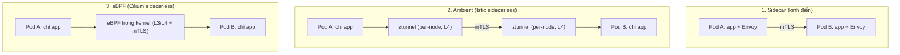
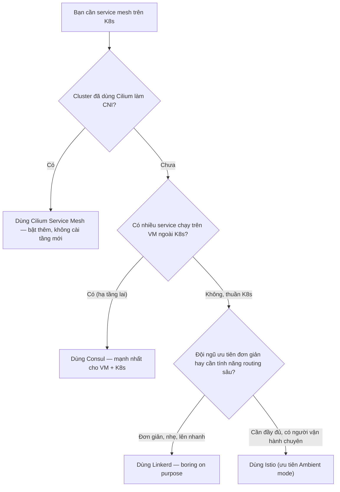

# Istio vs Linkerd vs Cilium — Chọn service mesh nào?

> **Tác giả:** Mr.Rom\
> **Phiên bản:** v1.0.0\
> **Tạo lúc:** 13/06/2026\
> **Cập nhật:** 13/06/2026\
> **Level:** Basic\
> **Tags:** service-mesh, istio, linkerd, cilium, consul, ebpf, sidecar, kubernetes\
> **Yêu cầu trước:** [Bảo mật mTLS & Authorization](03_security-mtls-and-authz.md)

> 🎯 *Ba bài trước bạn đã hiểu Service Mesh làm gì: routing, retry, mTLS, authorization. Nhưng "mesh" chỉ là khái niệm — phải chọn 1 sản phẩm cụ thể để cài. Bài này so sánh 4 cái tên bạn sẽ gặp đi gặp lại: Istio, Linkerd, Consul, Cilium — và quan trọng nhất: khi nào chọn cái nào để không "dùng dao mổ trâu giết gà".*

## 🎯 Sau bài này bạn sẽ

- [ ] Nói được điểm mạnh/yếu của Istio, Linkerd, Consul, Cilium bằng 1-2 câu mỗi cái
- [ ] Hiểu 3 kiến trúc data plane: **sidecar**, **ambient** (sidecarless có node-proxy), **eBPF** (sidecarless trong kernel) — vì sao 2026 mọi người chạy đua giảm overhead
- [ ] Đọc được bảng so sánh: proxy, mức resource, độ trưởng thành, learning curve
- [ ] Tự ra quyết định "Acme Shop nên chọn mesh nào" dựa trên ngữ cảnh đội ngũ + hạ tầng
- [ ] Ước lượng được chi phí vận hành (operational cost) thật sự — không chỉ là "miễn phí vì open-source"

---

## Tình huống — Acme Shop đứng trước cửa hàng mesh

Quay lại Acme Shop. Sau 3 bài trước, đội DevOps đã quyết: hệ thống ~15 microservice (`web`, `order`, `payment`, `inventory`, `notify`...) chạy trên Kubernetes **cần** một service mesh. Lý do đã rõ từ bài 00-03:

- `order` gọi `payment` nhưng không có **retry/timeout** thống nhất — mỗi service tự code một kiểu, chỗ có chỗ không.
- Traffic nội bộ giữa các service **chưa mã hoá** — audit bảo mật vừa "tuýt còi".
- Muốn **canary** `payment` v2 cho 5% traffic mà không phải sửa code.
- Muốn **quan sát** (observability): service nào gọi service nào, p99 latency bao nhiêu, lỗi ở đâu.

Cả đội gật gù: "Đúng rồi, cài mesh thôi!". Rồi mở Google gõ *"kubernetes service mesh"* — và đứng hình. Có **Istio**, **Linkerd**, **Consul**, **Cilium Service Mesh**, rồi cả **Kuma**, **Traefik Mesh**... Mỗi blog khen một cái khác nhau.

Một bạn junior hỏi: *"Anh ơi, sao không cứ chọn Istio cho chắc? Nghe nói nó mạnh nhất mà."*

Bạn senior đáp: *"Mạnh nhất không có nghĩa là phù hợp nhất. Istio mạnh nhưng phức tạp — cài lên rồi không ai trong team hiểu để debug thì còn khổ hơn không cài. Chọn mesh giống chọn xe: Acme Shop cần xe đi chợ hay xe đua F1? Để anh phân tích từng cái rồi mình quyết."*

Đó chính là nội dung bài này — không thiên vị cái nào, chỉ map đúng nhu cầu với công cụ.

---

## 1️⃣ Bốn cái tên bạn sẽ gặp — mỗi cái một triết lý

Trước khi đào sâu, hãy nắm "thần thái" của từng sản phẩm. Điểm mấu chốt: chúng khác nhau **không phải ở tính năng** (cái nào cũng có mTLS, retry, observability) mà ở **triết lý thiết kế** — đặc biệt là cách chạy *data plane* (lớp proxy chặn traffic).

🪞 **Ẩn dụ chọn xe**: bốn sản phẩm như bốn loại xe. *Istio* là xe tải đa năng có mọi thứ (nhưng nặng, tốn xăng, cần thợ giỏi). *Linkerd* là xe điện gọn nhẹ (ít option nhưng bật là chạy, ai cũng lái được). *Consul* là xe lội nước đi được cả đường nhựa lẫn off-road (chạy được cả VM lẫn K8s). *Cilium* là "xe đã gắn sẵn trong sàn nhà" — nếu hạ tầng mạng (CNI) của bạn vốn là Cilium thì mesh là tính năng bật thêm, không cần mua xe mới.

| Sản phẩm | Nhà phát triển | "Thần thái" 1 câu |
|---|---|---|
| **Istio** | Google, IBM, hiện thuộc CNCF | Đầy đủ tính năng nhất, mạnh nhất — nhưng phức tạp nhất |
| **Linkerd** | Buoyant, CNCF **Graduated** | Nhẹ, đơn giản, "boring on purpose" — ít option nhưng cực ổn |
| **Consul** | HashiCorp | Đa nền tảng — chạy được cả **VM lẫn K8s**, mạnh khi hạ tầng lai (hybrid) |
| **Cilium Service Mesh** | Isovalent (nay thuộc Cisco), CNCF **Graduated** | **eBPF sidecarless** — gắn liền với CNI, nhẹ vì chạy trong kernel |

> [!NOTE]
> "CNCF Graduated" (tốt nghiệp CNCF) là mức trưởng thành cao nhất của một dự án trong Cloud Native Computing Foundation — chứng tỏ dự án đã production-ready, có cộng đồng lớn, quy trình bảo mật rõ ràng. Cả Linkerd, Cilium và Istio đều đã đạt mức này (Istio graduated năm 2023, Linkerd 2021, Cilium 2023).

Hiểu sơ bộ rồi, ta đi sâu từng cái. Bắt đầu từ cái phổ biến nhất.

### Istio — "con dao Thuỵ Sĩ" của service mesh

**Istio** là service mesh ra đời sớm (2017) và được biết đến nhiều nhất. Data plane mặc định dùng **Envoy** — một *proxy* (máy chủ trung gian chặn và chuyển tiếp traffic) hiệu năng cao do Lyft viết, nay là chuẩn de-facto của ngành.

- **Mạnh nhất về tính năng**: traffic management cực kỳ chi tiết (header-based routing, fault injection, mirroring), tích hợp sâu observability, multi-cluster, hỗ trợ cả VM.
- **Phức tạp nhất**: nhiều CRD (`VirtualService`, `DestinationRule`, `Gateway`, `PeerAuthentication`, `AuthorizationPolicy`...), control plane `istiod` cần hiểu kỹ để vận hành.
- **2026 có thêm Ambient Mode**: chế độ **sidecarless** — bỏ sidecar Envoy trong mỗi Pod, thay bằng node-level proxy (`ztunnel`) cho L4 + `waypoint proxy` cho L7. Giảm overhead đáng kể (xem §3).

### Linkerd — "nhẹ và buồn tẻ một cách cố ý"

**Linkerd** chọn hướng ngược với Istio: làm **ít tính năng hơn nhưng cực kỳ đơn giản và ổn định**. Triết lý của họ là *"boring on purpose"* (buồn tẻ một cách cố ý) — nghĩa là mesh không nên là thứ bạn phải lo lắng hằng đêm.

- **Micro-proxy viết bằng Rust** (`linkerd2-proxy`) thay vì Envoy. Vì viết riêng cho service mesh nên cực nhẹ, tiêu thụ RAM/CPU rất thấp, không có lỗ hổng kiểu buffer-overflow của C/C++.
- **mTLS bật mặc định, zero-config** — cài xong là service-to-service đã mã hoá, không cần khai báo gì.
- **Đánh đổi**: ít tính năng routing nâng cao hơn Istio (không có fault injection chi tiết, không hỗ trợ VM tốt như Istio/Consul). Nhưng với 90% use case thì thừa đủ.

### Consul — "mesh cho thế giới không chỉ có Kubernetes"

**Consul** của HashiCorp xuất phát là một công cụ *service discovery* (khám phá dịch vụ) + key-value store, sau mở rộng thành service mesh (Consul Connect). Điểm độc nhất: **không bó buộc trong Kubernetes**.

- **Đa nền tảng (multi-platform)**: chạy mesh trên cả **máy ảo (VM)**, bare-metal, Nomad, lẫn K8s — cùng một control plane. Cực mạnh cho doanh nghiệp còn nhiều hệ thống legacy chạy trên VM chưa lên container.
- **Data plane dùng Envoy** (giống Istio).
- **Đánh đổi**: trên môi trường thuần K8s, Consul thường "nặng đô" hơn nhu cầu — sức mạnh thật của nó nằm ở **hybrid** (lai VM + K8s).

### Cilium Service Mesh — "mesh chạy trong nhân Linux"

**Cilium** vốn là một **CNI** (Container Network Interface — plugin cung cấp mạng cho Pod trong K8s), nổi tiếng vì dùng **eBPF** (Extended Berkeley Packet Filter — công nghệ cho phép chạy chương trình an toàn ngay trong nhân Linux). Từ nền tảng đó, Cilium thêm khả năng service mesh.

- **Sidecarless bằng eBPF**: thay vì nhồi 1 proxy vào mỗi Pod, Cilium xử lý L3/L4 (mTLS, load balancing) **ngay trong kernel** qua eBPF, và dùng 1 Envoy per-node cho L7. Overhead cực thấp.
- **Gắn liền với CNI**: nếu cluster của bạn **đã dùng Cilium làm CNI** (rất phổ biến 2026, các managed K8s như GKE Dataplane V2 dùng Cilium), thì bật mesh chỉ là thêm cấu hình — không cài thêm "tầng" mới.
- **Đánh đổi**: tính năng L7 (routing HTTP chi tiết) chưa phong phú bằng Istio; bắt buộc phải dùng Cilium làm CNI (không "gắn" lên cluster đang chạy Calico/Flannel được).

---

## 2️⃣ Bảng so sánh tổng hợp — nhìn 1 phát thấy hết

Bốn sản phẩm trên khác nhau ở nhiều chiều, đọc văn xuôi dễ rối. Bảng dưới gom mọi tiêu chí quan trọng để bạn so sánh trực tiếp — từ loại proxy, mô hình triển khai, đến mức tiêu tốn tài nguyên và độ khó học. Đây là bảng bạn sẽ quay lại tra mỗi lần phải quyết định.

| Tiêu chí | **Istio** | **Linkerd** | **Consul** | **Cilium** |
|---|---|---|---|---|
| **Proxy (data plane)** | Envoy (C++) | micro-proxy Rust | Envoy (C++) | eBPF (kernel) + Envoy/node cho L7 |
| **Mô hình triển khai** | Sidecar **hoặc** Ambient (sidecarless) | Sidecar | Sidecar | **Sidecarless** (eBPF) |
| **Resource overhead** | Cao (sidecar) → Trung bình (ambient) | **Thấp** | Cao (sidecar) | **Rất thấp** |
| **mTLS tự động** | ✅ (cần cấu hình `PeerAuthentication`) | ✅ **bật mặc định** | ✅ | ✅ |
| **Routing L7 nâng cao** | ✅✅✅ Phong phú nhất | ✅ Đủ dùng | ✅✅ | ✅ Đang hoàn thiện |
| **Hỗ trợ VM (ngoài K8s)** | ✅ | ❌ (chỉ K8s) | ✅✅✅ Mạnh nhất | ❌ (chỉ K8s) |
| **Learning curve** | 🔴 Dốc | 🟢 Thoải nhất | 🟡 Trung bình | 🟡 Trung bình (cần biết eBPF/CNI) |
| **Độ trưởng thành** | CNCF Graduated, ecosystem lớn nhất | CNCF Graduated, rất ổn định | Doanh nghiệp dùng nhiều (HashiCorp) | CNCF Graduated, đang lên nhanh |
| **Gắn với CNI** | Không | Không | Không | ✅ **Bắt buộc dùng Cilium CNI** |
| **Khi nào hợp nhất** | Cần đầy đủ tính năng, team đủ người vận hành | Cần đơn giản + nhẹ, lên nhanh | Hạ tầng lai VM + K8s | Đã dùng Cilium CNI sẵn |

> [!IMPORTANT]
> Đừng đọc bảng này như "Istio nhiều ✅ nhất nên thắng". Nhiều tính năng = nhiều thứ phải học, phải debug, phải bảo trì. Tiêu chí đúng là **"cái nào khớp với nhu cầu THẬT của bạn"** — phần lớn dự án không bao giờ chạm tới 50% tính năng của Istio.

Một điểm dễ gây hiểu nhầm cần nói rõ: cột "Resource overhead" của Istio ghi *"Cao → Trung bình"* vì nó phụ thuộc bạn chạy chế độ nào (sidecar truyền thống hay ambient mode mới). Phần tiếp theo sẽ giải thích tại sao sự khác biệt này lại lớn đến vậy.

---

## 3️⃣ Sidecar vs Ambient vs eBPF — cuộc đua giảm overhead 2026

Đây là phần quan trọng nhất của bài, vì nó là **xu hướng lớn nhất** của ngành service mesh 2026: làm sao để có lợi ích của mesh mà **bớt cái giá phải trả** (overhead).

### Vì sao overhead là vấn đề

Nhớ lại từ bài 01: mô hình kinh điển là **sidecar** — nhồi 1 container proxy (Envoy) vào *mỗi* Pod. Proxy này chặn mọi traffic vào/ra Pod để làm mTLS, retry, đo metric.

Vấn đề: nếu Acme Shop có 15 service × 3 replica = **45 Pod**, thì cũng có **45 proxy Envoy** chạy song song. Mỗi Envoy ngốn ~50-150 MB RAM và một chút CPU. Cộng lại = vài GB RAM chỉ để chạy "lớp mạng", chưa tính CPU và độ trễ thêm (latency) ở mỗi hop. Với cluster ngàn Pod thì con số này thành tiền thật trên hoá đơn cloud.

Sơ đồ dưới đối chiếu 3 kiến trúc data plane — chú ý số lượng proxy và vị trí của chúng thay đổi thế nào:

Điểm cốt lõi của sơ đồ: từ trên xuống dưới, proxy "rút lui" dần khỏi từng Pod — từ "1 proxy mỗi Pod" (sidecar) → "1 proxy mỗi node" (ambient) → "không proxy riêng, xử lý ngay trong kernel" (eBPF). Càng ít proxy, overhead càng thấp.

### 1. Sidecar — mô hình kinh điển

- **Cách chạy**: mỗi Pod có thêm 1 container proxy. App nói chuyện với proxy qua `localhost`, proxy lo phần còn lại.
- **Ưu**: cô lập tốt (proxy của Pod nào chỉ lo Pod đó), tính năng L7 đầy đủ, đã được kiểm chứng nhiều năm.
- **Nhược**: overhead nhân theo số Pod, thêm độ trễ ở mỗi hop, vòng đời proxy gắn cứng với Pod (proxy chưa sẵn sàng thì app cũng không gọi được — "race condition" lúc khởi động).
- **Ai dùng**: Istio (mặc định cũ), Linkerd, Consul.

### 2. Ambient — sidecarless kiểu Istio

Istio 2026 đẩy mạnh **Ambient Mode**: tách mesh thành 2 lớp.

- **`ztunnel`** (zero-trust tunnel): 1 proxy chạy **per-node** (mỗi máy 1 cái, không phải mỗi Pod), lo phần L4 — chủ yếu là **mTLS** và định tuyến cơ bản.
- **`waypoint proxy`**: chỉ bật khi bạn **cần** tính năng L7 (routing HTTP phức tạp). Không cần thì không tốn.
- **Ưu**: app Pod sạch sẽ (không sidecar), bật mTLS cho cả cluster mà overhead thấp hơn nhiều so với sidecar. Lên mesh từng phần ("L4 trước, L7 sau khi cần").
- **Nhược**: kiến trúc mới hơn, một số tính năng đặc thù vẫn đang hoàn thiện.

### 3. eBPF — sidecarless kiểu Cilium

Cilium đi xa nhất: **không có proxy riêng cho phần L3/L4** mà xử lý ngay trong **nhân Linux** bằng eBPF.

- **Cách chạy**: eBPF programs gắn vào kernel networking stack, lo load balancing, mTLS, network policy mà **không cần userspace proxy** cho phần lớn lưu lượng. L7 (HTTP routing) dùng 1 Envoy per-node khi cần.
- **Ưu**: overhead thấp nhất trong cả 4, vì bỏ được bước "đi vòng qua userspace proxy". Quan sát mạng cực mạnh qua **Hubble**.
- **Nhược**: cần kernel Linux đủ mới (5.10+), bắt buộc Cilium làm CNI, tính năng L7 chưa bằng Istio.

Tóm lại xu hướng 2026 rõ ràng: bảng dưới cho thấy mọi sản phẩm đều chạy về cùng một hướng — **giảm số proxy, giảm overhead**.

| Kiến trúc | Số proxy | Overhead | Đại diện | Trạng thái 2026 |
|---|---|---|---|---|
| **Sidecar** | 1/Pod | Cao | Linkerd, Consul, Istio (cũ) | Vẫn phổ biến, đã chín |
| **Ambient** | 1/node (+ waypoint khi cần) | Trung bình | Istio Ambient | Đang được áp dụng nhanh |
| **eBPF** | 0 (L4 trong kernel) + 1/node L7 | Rất thấp | Cilium | Đang lên mạnh, cần CNI Cilium |

> [!NOTE]
> Linkerd dù vẫn dùng sidecar nhưng overhead **rất thấp** nhờ micro-proxy Rust siêu nhẹ — không phải Envoy nặng nề. Nên "sidecar" không tự động đồng nghĩa với "tốn tài nguyên". Linkerd chứng minh sidecar gọn vẫn cạnh tranh tốt với sidecarless về resource.

---

## 4️⃣ Khi nào chọn cái nào — cây quyết định cho Acme Shop

Phần này trả lời câu hỏi triệu đô: *với hoàn cảnh CỦA TÔI thì chọn gì?* Không có "cái tốt nhất tuyệt đối" — chỉ có "cái phù hợp nhất với ngữ cảnh".

Hãy đi theo cây quyết định đơn giản dưới đây — đọc từ trên xuống, dừng ở nhánh đầu tiên khớp với bạn:

Cây này không phải luật cứng, nhưng nó phản ánh đúng cách các đội ra quyết định thực tế: câu hỏi đầu tiên luôn là "hạ tầng hiện có của tôi là gì", sau đó mới tới "đội tôi gánh nổi độ phức tạp nào".

### Chọn **Linkerd** nếu...

- Bạn muốn **đơn giản + nhẹ** và lên production nhanh, ít rủi ro vận hành.
- Team nhỏ, không có người chuyên trách mesh full-time.
- Nhu cầu chính là **mTLS + retry + observability cơ bản** (đúng 90% trường hợp).
- → **Đây là lựa chọn mặc định an toàn cho phần lớn dự án K8s thuần.**

### Chọn **Istio** nếu...

- Bạn **thật sự cần** tính năng nâng cao: traffic mirroring, fault injection chi tiết, routing theo header phức tạp, multi-cluster lớn.
- Team có người hiểu sâu mesh (hoặc dùng managed Istio của cloud provider).
- → Ưu tiên bật **Ambient mode** để bớt overhead thay vì sidecar truyền thống.

### Chọn **Consul** nếu...

- Hạ tầng của bạn **lai** — còn nhiều service chạy trên VM/bare-metal chưa container hoá, muốn 1 mesh quản cả VM lẫn K8s.
- Bạn đã dùng hệ sinh thái HashiCorp (Vault, Nomad, Terraform).

### Chọn **Cilium Service Mesh** nếu...

- Cluster của bạn **đã dùng Cilium làm CNI** rồi (rất phổ biến với managed K8s 2026).
- Bạn ưu tiên overhead thấp nhất + quan sát mạng sâu (Hubble), và chưa cần routing L7 quá phức tạp.

### Vậy Acme Shop chọn gì?

Quay lại tình huống đầu bài: Acme Shop ~15 service **thuần K8s** (không có VM legacy), CNI hiện tại là một plugin thường (chưa phải Cilium), team DevOps nhỏ, nhu cầu là mTLS + retry + canary cơ bản + observability.

Chiếu vào cây quyết định: không có VM lai → bỏ Consul. Chưa dùng Cilium CNI → bỏ Cilium (trừ khi muốn đổi cả CNI, đó là dự án lớn riêng). Còn lại Linkerd vs Istio: nhu cầu Acme Shop **không** chạm tới các tính năng "khủng" của Istio, team lại nhỏ → **Linkerd là lựa chọn hợp lý nhất**. Nếu sau này Acme Shop scale lên hàng trăm service với routing siêu phức tạp, lúc đó cân nhắc Istio Ambient.

> [!TIP]
> Một chiến lược thực dụng: bắt đầu với **Linkerd** vì đơn giản, lên nhanh, ít rủi ro. Chỉ chuyển sang Istio khi bạn **đụng trần** tính năng — tức là khi có nhu cầu cụ thể mà Linkerd không làm được. Đừng chọn Istio "phòng xa" cho những tính năng có thể bạn không bao giờ dùng tới.

---

## 5️⃣ Chi phí vận hành — cái giá thật của "miễn phí"

Cả 4 sản phẩm đều open-source miễn phí. Nhưng "miễn phí license" **không** có nghĩa "miễn phí vận hành". Chi phí thật của một service mesh nằm ở 3 chỗ, và đây là phần các đội hay đánh giá thấp.

Ba loại chi phí dưới đây cần cân nhắc *trước khi* cài, không phải sau khi đã lỡ:

| Loại chi phí | Nội dung | Istio | Linkerd | Consul | Cilium |
|---|---|---|---|---|---|
| **Tài nguyên (compute)** | RAM/CPU cho proxy + control plane → tiền cloud | Cao (sidecar) / TB (ambient) | Thấp | Cao | Rất thấp |
| **Nhân lực (learning + ops)** | Thời gian học, debug, nâng cấp, đọc CRD | Cao | Thấp | Trung bình | Trung bình |
| **Rủi ro vận hành** | Mesh hỏng = cả cluster mất kết nối; càng phức tạp càng dễ sai | Cao | Thấp | Trung bình | Trung bình |

- **Chi phí tài nguyên** là cái dễ thấy nhất trên hoá đơn cloud — nhiều sidecar Envoy = nhiều GB RAM. Đây là động lực chính của xu hướng sidecarless ở §3.
- **Chi phí nhân lực** thường bị bỏ quên nhưng lại lớn nhất về dài hạn. Một mesh phức tạp mà cả team không ai hiểu sâu = mỗi sự cố là một đêm thức trắng. Đây là lý do Linkerd đặt "đơn giản" làm tôn chỉ.
- **Chi phí rủi ro** là cái nguy hiểm nhất: service mesh nằm trên **đường đi của mọi request**. Mesh trục trặc = toàn bộ giao tiếp service-to-service đứt. Càng nhiều thành phần (CRD, proxy, control plane) thì bề mặt lỗi càng rộng.

> [!WARNING]
> Cạm bẫy kinh điển: chọn mesh mạnh nhất "cho chắc" rồi 6 tháng sau không ai trong team đủ tự tin nâng cấp version vì sợ vỡ production. Mesh trở thành "hộp đen không ai dám đụng" — đó là nợ kỹ thuật (technical debt) tệ nhất, vì nó nằm ngay tim hệ thống.

Một câu hỏi tỉnh táo cần tự hỏi trước khi cài bất kỳ mesh nào: *"Hệ thống của mình có thật sự cần mesh chưa, hay chỉ cần thư viện retry + một ít TLS thủ công là đủ?"* Với hệ thống dưới ~10 service, đôi khi mesh là "dùng dao mổ trâu giết gà". Mesh tỏ ra giá trị khi số lượng service đủ lớn để việc tự code retry/mTLS/observability ở từng service trở nên không kham nổi — đúng như tình huống Acme Shop.

Đến đây, bạn đã đi trọn cụm Basic của Service Mesh: từ *"mesh là gì"* (bài 00), *kiến trúc sidecar/control plane* (bài 01), *traffic management* (bài 02), *bảo mật mTLS + authz* (bài 03), và bây giờ là *chọn sản phẩm nào* (bài này). Bạn đã có đủ nền để tự tin bước vào phần Intermediate — nơi ta sẽ thật sự cài đặt và cấu hình một mesh cụ thể.

---

## 💡 Cạm bẫy thường gặp & Best practice

### ❌ Cạm bẫy: chọn Istio vì "nó mạnh nhất"

- **Triệu chứng**: cài Istio, dùng được 10% tính năng, nhưng mỗi lần debug 503 hoặc nâng version là cả team toát mồ hôi vì quá nhiều CRD và thành phần.
- **Nguyên nhân**: nhầm "nhiều tính năng" với "phù hợp". Mạnh nhất không bằng phù hợp nhất.
- **Cách tránh**: liệt kê **nhu cầu thật** trước (chỉ cần mTLS + retry? hay cần fault injection + multi-cluster?). Nếu nhu cầu cơ bản → Linkerd. Chỉ chọn Istio khi có tính năng cụ thể bắt buộc.

### ❌ Cạm bẫy: gắn Cilium Service Mesh lên cluster đang chạy CNI khác

- **Triệu chứng**: muốn dùng Cilium mesh nhưng cluster đang chạy Calico/Flannel, cài vào thì xung đột mạng.
- **Nguyên nhân**: Cilium Service Mesh **gắn liền với Cilium CNI** — không phải một mesh "cắm thêm" độc lập như Istio/Linkerd.
- **Cách tránh**: chỉ chọn Cilium mesh nếu cluster **đã** hoặc **sẵn sàng đổi** sang Cilium CNI (đổi CNI là một dự án hạ tầng lớn, không làm bừa trên production).

### ❌ Cạm bẫy: quên chi phí nhân lực, chỉ nhìn license "miễn phí"

- **Triệu chứng**: triển khai mesh phức tạp xong, tốn hàng tháng trời người chuyên trách để vận hành, đắt hơn cả một mesh thương mại quản lý hộ.
- **Nguyên nhân**: tưởng open-source = miễn phí toàn diện.
- **Cách tránh**: tính cả 3 loại chi phí ở §5 (tài nguyên + nhân lực + rủi ro). Team nhỏ → ưu tiên cái đơn giản nhất đáp ứng được nhu cầu.

### ✅ Best practice: bắt đầu đơn giản, nâng cấp khi đụng trần

- **Vì sao**: rủi ro lớn nhất của mesh là độ phức tạp vận hành. Bắt đầu với cái đơn giản (Linkerd) giảm tối đa rủi ro mà vẫn có đủ mTLS + retry + observability.
- **Cách áp dụng**: triển khai mesh đơn giản trước, đo lường và quan sát. Chỉ migrate sang mesh phức tạp hơn khi có **nhu cầu cụ thể đã được chứng minh** là cái hiện tại không làm được.

### ✅ Best practice: ưu tiên kiến trúc sidecarless cho cluster lớn

- **Vì sao**: với hàng trăm/ngàn Pod, overhead của sidecar nhân lên thành tiền thật và độ trễ thật.
- **Cách áp dụng**: nếu dùng Istio → bật Ambient mode; nếu hạ tầng cho phép → cân nhắc Cilium eBPF. Cluster nhỏ thì sidecar vẫn ổn, không cần phức tạp hoá.

---

## 🧠 Tự kiểm tra (Self-check)

**Q1.** Vì sao "Istio nhiều tính năng nhất" không tự động có nghĩa "Istio là lựa chọn tốt nhất cho mọi dự án"?

💡 Đáp án

Vì mỗi tính năng đi kèm chi phí: phải học, phải debug, phải bảo trì, và làm tăng bề mặt lỗi. Phần lớn dự án chỉ cần mTLS + retry + observability cơ bản — những thứ Linkerd làm tốt với độ phức tạp thấp hơn nhiều. Mesh nằm trên đường đi của mọi request, nên một mesh phức tạp mà team không hiểu sâu để vận hành sẽ rủi ro hơn là không cài. Tiêu chí đúng là "phù hợp với nhu cầu thật + năng lực team", không phải "nhiều tính năng nhất".

**Q2.** Giải thích sự khác nhau cơ bản giữa kiến trúc **sidecar**, **ambient** và **eBPF** về số lượng proxy và vị trí của chúng.

💡 Đáp án

- **Sidecar**: 1 proxy trong **mỗi Pod**. App nói chuyện với proxy qua localhost. Overhead cao vì nhân theo số Pod.
- **Ambient** (Istio): không proxy trong Pod. Thay bằng **1 proxy per-node** (`ztunnel`) lo L4/mTLS, và `waypoint proxy` chỉ bật khi cần L7. Overhead trung bình.
- **eBPF** (Cilium): L3/L4 (load balancing, mTLS) xử lý **ngay trong nhân Linux** bằng eBPF — không cần proxy userspace cho phần lớn lưu lượng; L7 dùng 1 Envoy per-node khi cần. Overhead thấp nhất.

Xu hướng 2026 là rút proxy ra khỏi từng Pod để giảm overhead: từ "1/Pod" → "1/node" → "0 (trong kernel)".

**Q3.** Linkerd vẫn dùng sidecar, vậy tại sao nó vẫn được coi là "nhẹ"?

💡 Đáp án

Vì sidecar của Linkerd là **micro-proxy viết bằng Rust** (`linkerd2-proxy`) được thiết kế riêng cho service mesh — siêu nhẹ, tiêu thụ RAM/CPU rất thấp, không nặng nề như Envoy (C++) đa năng. Điều này cho thấy "sidecar" không tự động đồng nghĩa với "tốn tài nguyên" — vấn đề nằm ở proxy cụ thể, không phải mô hình sidecar nói chung.

**Q4.** Acme Shop có ~15 service thuần K8s, không có VM legacy, CNI hiện tại không phải Cilium, team DevOps nhỏ, nhu cầu mTLS + retry + canary cơ bản. Nên chọn mesh nào và vì sao?

💡 Đáp án

Nên chọn **Linkerd**. Lý do theo cây quyết định:
- Không có VM lai → loại Consul.
- CNI chưa phải Cilium (đổi CNI là dự án hạ tầng lớn) → loại Cilium.
- Còn Linkerd vs Istio: nhu cầu Acme Shop không chạm tới tính năng nâng cao của Istio, team lại nhỏ → Linkerd phù hợp nhất (đơn giản, nhẹ, lên nhanh, rủi ro vận hành thấp).

Nếu sau này scale lên hàng trăm service với routing phức tạp thì cân nhắc migrate sang Istio Ambient.

**Q5.** "Open-source nên miễn phí" — câu này sai ở đâu khi nói về chi phí service mesh?

💡 Đáp án

License miễn phí, nhưng chi phí thật nằm ở 3 chỗ:
1. **Tài nguyên (compute)**: proxy + control plane ngốn RAM/CPU → tiền cloud thật (đặc biệt sidecar nhân theo số Pod).
2. **Nhân lực**: thời gian học, debug, nâng cấp, đọc CRD — một mesh phức tạp có thể tốn hàng tháng người chuyên trách.
3. **Rủi ro vận hành**: mesh nằm trên đường đi mọi request, hỏng là cả cluster mất kết nối; càng phức tạp bề mặt lỗi càng rộng.

Vì thế chọn mesh phải tính tổng chi phí sở hữu, không chỉ nhìn "free license".

---

## ⚡ Tra cứu nhanh (Cheatsheet)

| Câu hỏi | Trả lời nhanh |
|---|---|
| Mesh nhẹ + đơn giản nhất? | **Linkerd** (micro-proxy Rust, mTLS mặc định) |
| Mesh nhiều tính năng nhất? | **Istio** (Envoy, routing L7 phong phú) |
| Mesh cho hạ tầng lai VM + K8s? | **Consul** (HashiCorp, multi-platform) |
| Mesh overhead thấp nhất? | **Cilium** (eBPF sidecarless, cần Cilium CNI) |
| Sidecar là gì? | 1 proxy/Pod — overhead cao, đã chín |
| Ambient là gì? | Istio sidecarless: `ztunnel` per-node (L4) + waypoint (L7) |
| eBPF mesh là gì? | Cilium: L3/L4 + mTLS chạy trong kernel, không proxy userspace |
| Default an toàn cho K8s thuần? | **Linkerd**, nâng lên Istio khi đụng trần |
| Cilium mesh gắn với gì? | **Cilium CNI** — không cắm lên Calico/Flannel được |
| 3 loại chi phí mesh? | Tài nguyên + nhân lực + rủi ro vận hành |

---

## 📚 Từ Điển Thuật Ngữ (Glossary)

| EN | VN | Giải thích |
|---|---|---|
| Service Mesh | Lưới dịch vụ | Tầng hạ tầng lo giao tiếp service-to-service (mTLS, retry, observability) mà không sửa code app |
| Data plane | Mặt phẳng dữ liệu | Lớp proxy thực sự chặn và xử lý traffic giữa các service |
| Control plane | Mặt phẳng điều khiển | Lớp quản lý cấu hình, đẩy luật xuống cho data plane |
| Sidecar | Container đồng hành | Proxy chạy chung Pod với app để chặn traffic vào/ra |
| Sidecarless | Không sidecar | Mô hình bỏ proxy trong từng Pod, dùng node-proxy hoặc kernel |
| Ambient mode | Chế độ ambient | Mô hình sidecarless của Istio: `ztunnel` per-node (L4) + waypoint (L7) |
| ztunnel | (giữ nguyên) | Proxy L4 per-node của Istio Ambient, lo mTLS + định tuyến cơ bản |
| Waypoint proxy | Proxy waypoint | Proxy L7 trong Ambient, chỉ bật khi cần routing HTTP phức tạp |
| eBPF | (giữ nguyên) | Công nghệ chạy chương trình an toàn ngay trong nhân Linux |
| CNI | (giữ nguyên) | Container Network Interface — plugin cấp mạng cho Pod trong K8s |
| Envoy | (giữ nguyên) | Proxy hiệu năng cao (Lyft) — data plane mặc định của Istio/Consul |
| micro-proxy | Vi-proxy | Proxy nhỏ gọn của Linkerd viết bằng Rust, chuyên cho mesh |
| mTLS | TLS hai chiều | Mã hoá + xác thực hai phía giữa các service |
| Hubble | (giữ nguyên) | Công cụ quan sát mạng (observability) của Cilium |
| CNCF Graduated | (đã) tốt nghiệp CNCF | Mức trưởng thành cao nhất của dự án trong CNCF — production-ready |
| Overhead | Chi phí phụ trội | Tài nguyên/độ trễ tăng thêm do chạy mesh |
| Learning curve | Độ dốc học tập | Mức độ khó học và làm chủ một công cụ |

---

## 🔗 Liên kết & Tài nguyên

### 🧭 Định hướng lộ trình học

- ⬅️ **Bài trước:** [Bảo mật Service Mesh — mTLS tự động & Authorization Policy](03_security-mtls-and-authz.md)
- ↑ **Về cụm:** [Service Mesh — Microservice Communication & Security](../../README.md)

### 🧩 Các chủ đề có thể bạn quan tâm

- [Service Mesh là gì? — Tầng hạ tầng cho giao tiếp microservice](00_what-is-service-mesh.md)
- [Kiến trúc Service Mesh — Data plane, Control plane & Sidecar](01_architecture-and-sidecar.md)
- [Traffic Management — Routing, Canary, Retry & Circuit Breaking](02_traffic-management.md)
- [Kubernetes Services & Networking](../../../kubernetes/lessons/01_basic/02_services-and-networking.md)
- [Ingress Production — cert-manager + external-dns + Gateway API](../../../kubernetes/lessons/02_intermediate/02_ingress-cert-manager-tls.md)

### 🌐 Tài nguyên tham khảo khác

- [Istio docs](https://istio.io/latest/docs/) — chính chủ, có phần Ambient mode mới
- [Linkerd docs](https://linkerd.io/2/overview/) — gọn, dễ đọc cho người mới
- [Consul service mesh](https://developer.hashicorp.com/consul/docs/connect) — tài liệu HashiCorp
- [Cilium Service Mesh](https://docs.cilium.io/en/stable/network/servicemesh/) — phần mesh của Cilium
- [CNCF Landscape — Service Mesh](https://landscape.cncf.io/) — toàn cảnh các sản phẩm trong ngành

---

## 📌 Nhật ký thay đổi (Changelog)

- **v1.0.0 (13/06/2026)** — Bản đầu tiên. So sánh Istio / Linkerd / Consul / Cilium Service Mesh: triết lý từng sản phẩm, bảng so sánh tổng hợp (proxy, mô hình triển khai, overhead, mTLS, learning curve, độ trưởng thành), 3 kiến trúc data plane sidecar/ambient/eBPF và xu hướng giảm overhead 2026, cây quyết định "chọn cái nào", phân tích chi phí vận hành (tài nguyên + nhân lực + rủi ro). 2 sơ đồ mermaid, 3 cạm bẫy + 2 best practice, 5 self-check, cheatsheet + glossary. Bài đóng cụm Basic.
