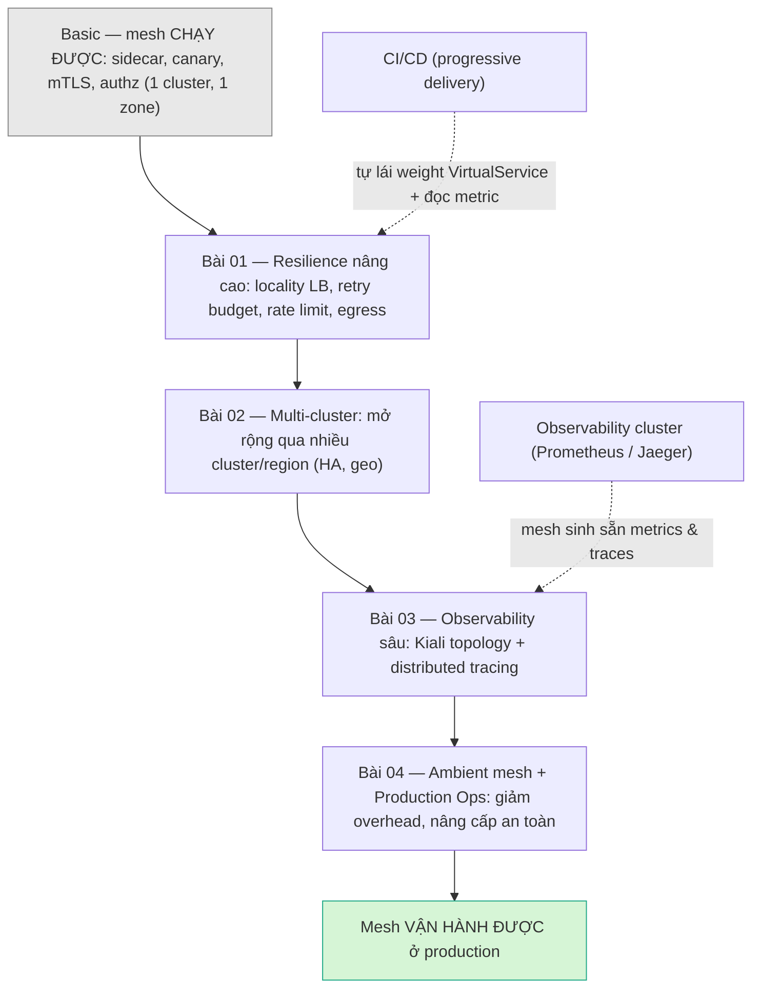

# Service Mesh Intermediate — Vận hành mesh ở Production

> **Tác giả:** Mr.Rom\
> **Phiên bản:** v1.0.0\
> **Tạo lúc:** 13/06/2026\
> **Cập nhật:** 13/06/2026\
> **Level:** Intermediate\
> **Tags:** service-mesh, istio, production, resilience, multi-cluster, observability, ambient-mesh, roadmap\
> **Yêu cầu trước:** [Istio vs Linkerd vs Cilium (basic)](../01_basic/04_istio-vs-linkerd-vs-cilium.md)

> 🎯 *Ở Basic bạn đã "bật mesh chạy được": sidecar inject, canary theo weight, mTLS STRICT, AuthorizationPolicy zero-trust — tất cả trong một cluster, một zone. Bài này là tấm bản đồ cho cả cụm Intermediate: vượt khỏi "chạy được" sang **vận hành production thật** — resilience đa zone, mở rộng nhiều cluster/region, quan sát sâu, và giảm overhead bằng ambient mesh. Sau bài bạn biết 4 bài tiếp theo giải quyết vấn đề gì, theo thứ tự nào, và vì sao mỗi cái lại cần đến cái kia.*

## 🎯 Sau bài này bạn sẽ

- [ ] Phân biệt rõ "mesh chạy được" (Basic) với "mesh vận hành được ở production" (Intermediate) — bốn lỗ hổng lớn cần lấp
- [ ] Nắm bức tranh tổng: resilience nâng cao → multi-cluster → observability sâu → ambient + ops, và vì sao đúng thứ tự đó
- [ ] Hiểu vai trò từng bài (01 → 04) trong cụm và bài nào giải quyết "nỗi đau" nào của Acme Shop
- [ ] Biết mesh nối vào hệ observability cluster (Prometheus/Jaeger) và CI/CD progressive delivery ở đâu
- [ ] Chọn được lộ trình học phù hợp với tình huống thực tế của đội bạn

---

## Tình huống — Acme Shop "chạy được" rồi, nhưng production bắt đầu gửi hoá đơn

Acme Shop đã đi hết cụm Basic: Istio cài xong, mọi service trong namespace `acme` có sidecar Envoy, traffic `web → order → payment` chảy mượt, mTLS STRICT bật, AuthorizationPolicy khoá `payment` chỉ cho `order` gọi. Trên cluster demo một node, mọi thứ đẹp như tài liệu.

Rồi production thật ập đến, và nó **không giống demo**:

- 💸 **Hoá đơn cloud tăng bất thường.** Cluster production trải **3 availability zone** của AWS. Mặc định Envoy chia tải đều cho mọi Pod bất kể zone → Pod `order` ở `zone-a` liên tục gọi `payment` ở `zone-c`, mỗi byte cross-zone bị tính phí, latency cộng thêm mỗi hop. Demo một node không bao giờ lộ ra điều này.
- 🌍 **Một region là chưa đủ.** Đội kinh doanh ký hợp đồng phục vụ khách châu Âu, đồng thời sếp muốn nếu cả region Singapore sập thì còn region khác đỡ. Một cluster, một region — không còn đủ.
- 🔭 **Sự cố xảy ra mà không ai biết vì sao.** 3 giờ sáng `payment` chậm, latency p99 leo thang, nhưng nhìn vào đâu? `kubectl logs` của 40 service? Không ai map nổi request đi qua những service nào, tắc ở đâu.
- 🐘 **Sidecar ăn tài nguyên.** 200 Pod = 200 sidecar Envoy, mỗi cái ngốn CPU/RAM. Hoá đơn compute phình, và mỗi lần nâng cấp Istio là một đêm mất ngủ vì sợ rolling restart toàn bộ sidecar làm đứt traffic.

Sếp tổng kết: *"Mesh chạy được rồi, tốt. Giờ nó phải **sống được ở production**: tiết kiệm phí mà vẫn chịu lỗi zone, mở ra nhiều cluster/region, nhìn thấy mọi thứ khi sự cố, và đừng để chính cái mesh thành gánh nặng tài nguyên."*

Bốn yêu cầu đó chính là bốn bài của cụm Intermediate. Bài này là **bản đồ** — nó không dạy cú pháp, mà cho bạn thấy toàn cảnh để biết mình đang ở đâu và đi đâu tiếp.

> [!NOTE]
> Cả cụm dùng **Istio** làm ví dụ cụ thể (mesh phổ biến nhất 2026) — bạn đã chọn nó ở [bài so sánh Basic](../01_basic/04_istio-vs-linkerd-vs-cilium.md). Các khái niệm (locality LB, multi-cluster, distributed tracing, sidecarless) đều có ở Linkerd/Cilium nhưng cú pháp khác. Mọi tiền tố `cross-AZ`, phí transfer là minh hoạ AWS — Google Cloud/Azure có mô hình tương tự.

---

## 1️⃣ "Chạy được" vs "vận hành được" — bốn lỗ hổng Basic chưa lấp

Đây là phần trừu tượng nhất của bài, nên hãy nhìn nó bằng một bức tranh trước. Ở Basic, bạn đã có đủ "bộ khung" của một mesh: data plane (Envoy), control plane (istiod), traffic management, security. Nhưng "có khung" khác "ở được". Một căn nhà đã xây xong tường và mái vẫn chưa ở được nếu thiếu điện nước, lối thoát hiểm, và cách bảo trì mà không phải đập đi xây lại.

🪞 **Ẩn dụ xuyên suốt cụm**: *Basic giống bạn **mở một quán ăn đầu tiên, một chi nhánh** — nấu ngon, khách vào ra ổn. Intermediate là khi bạn biến nó thành **một chuỗi nhà hàng nhiều chi nhánh, nhiều thành phố**: phải tối ưu để chi nhánh gần phục vụ khách gần (resilience đa zone), mở thêm chi nhánh ở thành phố khác và điều khách qua lại khi một nơi quá tải (multi-cluster), có **camera + bảng điều khiển trung tâm** để biết bếp nào đang tắc (observability), và quy trình bảo trì/đổi bếp mà không phải đóng cửa cả chuỗi (ambient + ops).* Ẩn dụ "chuỗi nhà hàng" này sẽ quay lại ở mỗi section.

Bốn lỗ hổng giữa "chạy được" và "vận hành được" gom thành bảng dưới — mỗi dòng ứng với một bài của cụm. Đây là cách nhanh nhất để định vị bài nào trị "nỗi đau" nào:

| Lỗ hổng ở Basic | "Nỗi đau" production của Acme | Bài trị nó |
|---|---|---|
| LB chia đều mọi zone, retry/rate-limit thô | Hoá đơn cross-zone, retry storm, một client cày sập service | **01 — Advanced Traffic & Resilience** |
| Mesh bó trong một cluster/region | Không chịu được sập region, không phục vụ đa địa lý | **02 — Multi-Cluster Mesh** |
| Chỉ có metric rời rạc, không thấy luồng | Sự cố mà không biết tắc ở service nào | **03 — Observability (Kiali & Tracing)** |
| Sidecar ngốn tài nguyên, nâng cấp đáng sợ | Hoá đơn compute, nâng cấp control plane rủi ro | **04 — Ambient Mesh & Production Ops** |

> 📖 Bảng cho thấy "đi đâu", nhưng chưa cho thấy "vì sao theo thứ tự đó". Sơ đồ dưới ghép 4 bài thành một hành trình có nhân quả — đây là phần đáng dừng lại nhất của cả bài.

### Sơ đồ — hành trình từ "chạy được" lên "vận hành được"

Bốn bài không phải bốn chủ đề rời rạc; chúng xếp thành một chuỗi có lý do. Sơ đồ dưới đọc từ trên xuống: điểm xuất phát (Basic), bốn chặng Intermediate, và đích đến (mesh production thật). Mũi tên đứt nét là các mối nối ra hệ thống ngoài mesh (observability cluster, CI/CD).

Mấu chốt của thứ tự này là **nhân quả, không phải ngẫu nhiên**: bạn cần resilience vững (01) **trước khi** dám trải mesh ra nhiều cluster (02) — vì multi-cluster làm "khoảng cách" và rủi ro lỗi tăng bội, nếu retry/locality chưa chắc thì mở rộng chỉ nhân lỗi lên. Có nhiều cluster rồi thì observability (03) trở nên **bắt buộc** chứ không còn là "nice to have" — không ai debug nổi một sự cố trải nhiều cluster bằng `kubectl logs`. Và chỉ khi đã quan sát được mọi thứ (03), bạn mới đủ tự tin làm những thay đổi lớn về kiến trúc và vận hành (04) như chuyển sang ambient hay nâng cấp control plane — vì lúc đó bạn *nhìn thấy* được tác động.

---

## 2️⃣ Bài 01 — Resilience nâng cao: làm mesh chịu lỗi và tiết kiệm ở đa zone

Lỗ hổng đầu tiên lộ ra ngay khi rời demo một node: production thật chạy đa zone, và mọi mặc định "chia đều" của Basic bỗng trở thành lãng phí và rủi ro. Bài 01 nâng resilience từ mức "một service, một zone" lên mức production đa zone.

🪞 **Ẩn dụ (chuỗi nhà hàng)**: *Khách ở quận 1 thì giao từ chi nhánh quận 1 — nhanh, rẻ. Chỉ khi chi nhánh quận 1 cháy hàng mới chuyển đơn sang quận 3. Đó là locality LB. Và mỗi quầy có bảo vệ đếm khách (rate limit) để một đoàn 200 người không làm sập cả quán.*

Bài 01 lấp bốn thiếu sót cụ thể của resilience cấp Basic:

- **Locality-aware load balancing** — dạy Envoy ưu tiên endpoint **cùng zone/region** (giảm phí cross-zone + latency) và **tự failover** khi cả một zone sập. Điều kiện sống còn: phải đi cặp với outlier detection, nếu không Envoy không biết zone nào "chết" để mà nhảy sang.
- **Retry budget** — giới hạn retry theo **tỷ lệ phần trăm** tổng traffic thay vì số lần tuyệt đối mỗi request. Đây là phòng tuyến chống **retry storm**: khi một zone bắt đầu chậm, nếu mọi request đều retry 3 lần thì tải nhân gấp 3-4 và dập service đang yếu chết hẳn.
- **Rate limiting hai tầng** — *local* (mỗi Envoy tự đếm, per-Pod, không cần backend) làm tuyến đầu chặn burst thô, và *global* (mọi Envoy hỏi chung một ratelimit service đếm trên Redis) để enforce quota dùng chung chính xác theo API key/user.
- **Egress control** — đổi mặc định từ "cho gọi ra bất kỳ đâu" sang `REGISTRY_ONLY` ("mặc định cấm, chỉ mở cái cho phép" qua ServiceEntry), chặn dependency bị nhiễm âm thầm rút dữ liệu ra ngoài.

Bài còn dạy **fault injection sâu** (tiêm delay + abort đồng thời để chaos test) và **traffic shifting nhiều nấc có cổng kiểm tra** — chính là cơ chế bên dưới mà công cụ progressive delivery sẽ tự động hoá (xem §6).

> [!IMPORTANT]
> Đây là bài **nền móng** của cả cụm Intermediate. Resilience chưa vững thì đừng vội multi-cluster — mở rộng một hệ thống mong manh chỉ làm nó mong manh ở nhiều nơi hơn. Hãy đi bài 01 cho chắc trước.

→ Khi một service đã chịu lỗi tốt **trong** một cluster, câu hỏi tiếp theo tự nhiên nảy ra: thế nếu cả cluster — cả region — sập thì sao? Đó là bài 02.

---

## 3️⃣ Bài 02 — Multi-cluster mesh: một mesh trải nhiều cluster/region

Locality failover ở bài 01 cứu bạn khi một *zone* sập, nhưng vẫn trong cùng một cluster. Production trưởng thành cần nhiều hơn: chịu được cả một *cluster/region* sập (HA — high availability), và phục vụ khách ở nhiều địa lý với độ trễ thấp (geo). Bài 02 nối nhiều cluster Kubernetes thành **một mesh logic duy nhất**.

🪞 **Ẩn dụ (chuỗi nhà hàng)**: *Bây giờ Acme mở chi nhánh ở thành phố khác. Hai chi nhánh phải dùng **chung một hệ thống đặt món** (service discovery xuyên cluster) và **tin nhau như người một nhà** (chung trust domain) — để nếu cả một thành phố mất điện, đơn tự chuyển sang thành phố còn lại mà khách không nhận ra.*

Những khái niệm cốt lõi bài 02 sẽ làm rõ:

- **Mô hình topology** — *multi-primary* (mỗi cluster có control plane riêng, ngang hàng, không có điểm chết đơn) so với *primary-remote* (một control plane trung tâm điều khiển các cluster remote). Mỗi mô hình có đánh đổi riêng về HA, độ phức tạp và chi phí vận hành.
- **Cross-cluster service discovery** — làm sao `order` ở cluster A "nhìn thấy" và gọi được `payment` ở cluster B như thể cùng cluster, để locality failover hoạt động *xuyên cluster*.
- **East-west gateway** — cổng chuyên cho traffic *giữa các cluster* (đông-tây), khác với ingress/north-south gateway lo traffic *từ ngoài vào*.
- **Trust domain chung** — để mTLS hoạt động xuyên cluster, các cluster phải chia sẻ một gốc tin cậy (root CA) chung; nếu không, sidecar cluster A và cluster B không thể xác minh cert của nhau.

> [!WARNING]
> Multi-cluster làm **độ phức tạp tăng vọt**: thêm network giữa cluster, thêm trust domain, thêm điểm hỏng. Đừng làm multi-cluster chỉ vì "nghe hay". Chỉ làm khi có yêu cầu thật về HA cấp region hoặc phân phối địa lý — và chỉ sau khi resilience một-cluster (bài 01) đã chắc.

→ Khi mesh trải nhiều cluster, một request có thể đi xuyên qua nhiều service ở nhiều cluster. Lúc sự cố xảy ra, `kubectl logs` từng service là vô vọng. Bạn cần nhìn thấy **toàn bộ luồng**. Đó là bài 03.

---

## 4️⃣ Bài 03 — Observability sâu: nhìn thấy mọi thứ khi sự cố

Càng nhiều service, càng nhiều cluster, càng dễ "mù" khi sự cố. Tin tốt: vì **mọi** traffic đã đi qua sidecar Envoy, mesh **sinh sẵn** metrics, traces và access log cho mọi cặp service — bạn không phải thêm code. Bài 03 dạy cách khai thác kho dữ liệu sẵn có đó.

🪞 **Ẩn dụ (chuỗi nhà hàng)**: *Bạn lắp **camera ở mọi bếp** (access log), một **bảng điều khiển trung tâm** hiện sơ đồ luồng đơn giữa các chi nhánh kèm đèn xanh-đỏ (Kiali topology), và **gắn thẻ theo dõi vào từng đơn hàng** để biết nó qua những bếp nào, kẹt ở đâu, mất bao lâu mỗi chặng (distributed tracing).*

Ba lớp quan sát bài 03 sẽ ghép lại:

- **Kiali** — bản đồ topology **trực quan** của mesh: service nào gọi service nào, traffic chảy bao nhiêu, đỏ ở đâu (lỗi), mTLS đã bật chưa. Đây là "bảng điều khiển" để thấy *cấu trúc* và *sức khoẻ* tức thời.
- **Metrics qua Prometheus** — mesh export sẵn các *golden signal* (traffic, error rate, latency, saturation) cho mọi cặp service. Đây cũng chính là nguồn dữ liệu mà cổng kiểm tra canary ở bài 01 truy vấn.
- **Distributed tracing (Jaeger/Tempo)** — ghép các "span" của một request đi qua N service thành một dòng thời gian duy nhất, chỉ rõ chặng nào tốn nhiều thời gian nhất. Đây là thứ duy nhất trả lời được câu hỏi "request chậm này tắc ở đâu trong 12 service nó đi qua".

> [!NOTE]
> Mesh chỉ **sinh** dữ liệu; nó không thay thế hệ observability của bạn. Metrics đổ về **Prometheus**, traces đổ về **Jaeger/Tempo** — chính là hệ thống bạn dựng ở cụm [Observability](../../../observability/README.md). Bài 03 dạy cách *nối* mesh vào hệ đó, không phải dựng lại từ đầu.

→ Đến đây bạn đã có một mesh chịu lỗi (01), trải nhiều cluster (02), và quan sát được mọi thứ (03). Vấn đề cuối cùng là chính cái mesh: nó tốn tài nguyên và mỗi lần nâng cấp là một ván cược. Đó là bài 04.

---

## 5️⃣ Bài 04 — Ambient mesh & Production Ops: giảm overhead, nâng cấp không sợ

Mô hình sidecar của Basic mạnh nhưng "nặng": mỗi Pod kèm một Envoy ngốn CPU/RAM, và mỗi lần nâng cấp Istio buộc rolling-restart toàn bộ Pod để thay sidecar — rủi ro và mệt mỏi ở quy mô hàng trăm service. Bài 04 trị hai nỗi đau cuối: **overhead** và **vận hành an toàn**.

🪞 **Ẩn dụ (chuỗi nhà hàng)**: *Thay vì mỗi nhân viên đeo một bộ đàm riêng (sidecar mỗi Pod) — vừa tốn pin vừa phải thu hồi cả loạt khi đổi máy — ta lắp **hệ liên lạc dùng chung cho cả tầng** (ztunnel mỗi node) và chỉ gắn thiết bị chuyên dụng ở những phòng cần xử lý phức tạp (waypoint proxy). Ít thiết bị hơn, đổi máy không phải gọi từng người về.*

Trọng tâm bài 04:

- **Istio ambient mode (sidecarless)** — kiến trúc mới tách thành hai lớp: **ztunnel** (một proxy nhẹ **mỗi node**, lo mTLS + L4 cho mọi Pod trên node đó) và **waypoint proxy** (chỉ bật khi cần xử lý L7 như routing/authz phức tạp). Bỏ sidecar mỗi Pod → giảm đáng kể CPU/RAM và độ phức tạp.
- **Nâng cấp control plane an toàn** — canary chính `istiod`: chạy song song phiên bản mới, dịch dần workload sang, theo dõi metric, rollback nếu lỗi — thay vì nâng cấp "tất cả một lần" rồi cầu nguyện.
- **Tuning hiệu năng** — giới hạn phạm vi mỗi sidecar chỉ "nhìn" những service nó cần (qua `Sidecar` resource), giảm bộ nhớ và lượng config istiod phải đẩy.
- **Khi nào nên sidecarless, khi nào giữ sidecar** — không phải mọi workload đều hợp ambient; bài cho khung quyết định.

> [!IMPORTANT]
> Ambient là thay đổi **kiến trúc data plane** — đừng làm khi chưa có observability tốt (bài 03). Bạn cần *nhìn thấy* tác động khi chuyển một service từ sidecar sang ambient. Đó là lý do bài 04 đứng **sau** bài 03.

→ Bốn bài này không sống một mình. Hai trong số đó nối thẳng ra các hệ thống bạn đã (hoặc sẽ) học ở cụm khác — phần tiếp theo nối các điểm đó lại.

---

## 6️⃣ Mesh không sống một mình — nối với observability cluster & CI/CD

Service mesh là một mảnh trong bức tranh platform lớn hơn. Hai mối nối quan trọng nhất quyết định bạn khai thác được bao nhiêu giá trị từ mesh.

🪞 **Ẩn dụ (chuỗi nhà hàng)**: *Mesh giống **hệ thống đường ống + cảm biến trong mỗi bếp** — nó sinh ra dữ liệu (camera, đồng hồ) và thực thi luật giao thông nội bộ. Nhưng **phòng giám sát trung tâm** (observability cluster) và **đội quản lý khai trương món mới** (CI/CD progressive delivery) là hệ thống riêng — mesh cấp dữ liệu và "cần điều khiển" cho chúng, chứ không thay thế chúng.*

Hai mối nối cụ thể, ánh xạ vào sơ đồ ở §1:

- **Observability cluster (Prometheus / Jaeger).** Mesh **sinh sẵn** metrics và traces; nhưng nơi *lưu trữ, truy vấn dài hạn, dashboard và alerting* là hệ observability bạn dựng riêng. Bài 03 nối mesh vào đó: metrics → **Prometheus** (xem [Metrics với Prometheus](../../../observability/lessons/01_basic/01_metrics-prometheus.md)), traces → **Jaeger/Tempo** (xem [Traces với OpenTelemetry](../../../observability/lessons/01_basic/03_traces-opentelemetry.md)). Mesh là *nguồn*, observability cluster là *kho + màn hình*.
- **CI/CD progressive delivery.** Cổng kiểm tra canary nhiều nấc ở bài 01 (dịch weight → đo metric → quyết tiến/lùi) bạn **không gõ tay** trên production. Công cụ như **Argo Rollouts** hoặc **Flagger** tự động hoá đúng vòng lặp đó: chúng *lái weight* trên VirtualService của Istio và *đọc metric* từ Prometheus của mesh để tự quyết promote hay rollback. Đây là điểm mesh và pipeline gặp nhau — xem [Progressive Delivery (CI/CD)](../../../ci-cd/lessons/02_intermediate/04_progressive-delivery.md).

Bảng dưới tóm tắt "ai làm gì" để bạn không nhầm vai trò giữa mesh và các hệ xung quanh:

| Việc | Mesh (Istio) làm gì | Hệ ngoài làm gì |
|---|---|---|
| Sinh metrics/traces | Envoy export sẵn cho mọi cặp service | Prometheus lưu + query; Grafana/Kiali hiển thị |
| Lưu trace dài hạn | Gửi span ra | Jaeger/Tempo thu thập + tìm kiếm |
| Canary deploy | Cung cấp "núm xoay" weight (VirtualService) | Argo Rollouts/Flagger xoay núm theo metric |
| Alerting | (không) | Prometheus Alertmanager bắn cảnh báo |

> [!TIP]
> Một sai lầm phổ biến là tưởng "bật mesh là có observability/CD luôn". Không — mesh cho bạn **dữ liệu sạch và núm điều khiển**, nhưng bạn vẫn cần Prometheus/Jaeger để *xem* và Argo/Flagger để *tự động hoá*. Mesh làm phần khó (instrument mọi service không cần code); phần còn lại là ghép nối.

---

## 7️⃣ Lộ trình học cụm Intermediate

Bốn bài có thứ tự khuyến nghị, nhưng tuỳ "nỗi đau" thực tế của đội bạn mà có thể nhảy cóc có chủ đích. Bảng dưới là lộ trình chuẩn cùng dấu hiệu nhận biết "khi nào bạn thật sự cần bài này":

| Thứ tự | Bài | Học khi… | Phụ thuộc bài trước |
|---|---|---|---|
| 1 | [Advanced Traffic & Resilience](01_advanced-traffic-and-resilience.md) | Cluster đã đa zone; thấy phí cross-zone, retry storm, hoặc cần rate limit/egress | Nền cho cả cụm |
| 2 | [Multi-Cluster Mesh](02_multi-cluster-mesh.md) | Cần HA cấp region hoặc phục vụ đa địa lý | Cần resilience (01) vững trước |
| 3 | [Observability — Kiali & Tracing](03_observability-kiali-and-tracing.md) | Sự cố mà không biết tắc ở đâu; càng cấp thiết khi đã multi-cluster | Hữu ích nhất sau 01-02 |
| 4 | [Ambient Mesh & Production Ops](04_ambient-mesh-and-production-ops.md) | Sidecar overhead đau; cần nâng cấp control plane an toàn | Cần observability (03) để thấy tác động |

Hai gợi ý đi đường tắt hợp lý:

- **Đội mới một cluster, một region nhưng muốn giảm hoá đơn ngay** → đi **01** trước (locality LB cắt phí cross-zone), rồi **03** (nhìn thấy để tối ưu tiếp). Tạm hoãn 02.
- **Đội đã đau vì sidecar overhead và sắp nâng cấp Istio lớn** → vẫn nên lướt **03** trước để có "mắt", rồi vào thẳng **04**. Đừng đổi kiến trúc khi đang mù.

> 💡 Nếu đội bạn chưa thật sự đa zone / chưa thật sự cần nhiều region, **đừng** cố học hết cụm cho "đủ". Mỗi tính năng Intermediate đổi lấy độ phức tạp — chỉ thêm khi có nỗi đau thật tương ứng. Bản đồ này để bạn biết *có gì* và *khi nào cần*, không phải checklist phải tick hết.

---

## 💡 Cạm bẫy thường gặp & Best practice

### ❌ Cạm bẫy: nhảy thẳng vào multi-cluster khi resilience một-cluster còn lỏng

- **Triệu chứng**: Đội hào hứng dựng multi-cluster để "production-grade", nhưng sự cố lại nhiều hơn — lỗi lan giữa các cluster, failover không hoạt động, debug cực khổ.
- **Nguyên nhân**: Multi-cluster nhân **độ phức tạp** và **bề mặt lỗi** lên. Nếu locality failover, retry budget, outlier detection (bài 01) chưa chắc trong *một* cluster, trải ra nhiều cluster chỉ làm hệ thống mong manh ở nhiều nơi hơn.
- **Cách tránh**: Đi đúng thứ tự — làm resilience một-cluster (01) cho vững, verify failover thật bằng chaos test, **rồi** mới multi-cluster (02). Multi-cluster là phần thưởng cho hệ đã ổn, không phải lối tắt tới ổn.

### ❌ Cạm bẫy: đổi kiến trúc (ambient) hoặc nâng cấp control plane khi chưa có observability

- **Triệu chứng**: Chuyển một service sang ambient hoặc nâng `istiod` rồi… không biết nó tốt lên hay xấu đi, vì không có baseline để so.
- **Nguyên nhân**: Mọi thay đổi lớn cần **đo trước/sau**. Thiếu Kiali + metrics + tracing (bài 03), bạn bay mù — sự cố do thay đổi gây ra cũng không truy được nguồn.
- **Cách tránh**: Dựng observability (03) trước, có baseline latency/error/topology, rồi mới làm bài 04. Canary cả control plane và quan sát metric trước khi promote.

### ❌ Cạm bẫy: tưởng "bật mesh là có sẵn observability và CI/CD"

- **Triệu chứng**: Bật Istio xong, mong đợi có dashboard đẹp và canary tự động ngay — nhưng không thấy gì.
- **Nguyên nhân**: Mesh **sinh** metrics/traces và cung cấp **núm xoay** weight, nhưng không tự lưu trữ, hiển thị hay tự động hoá. Đó là việc của Prometheus/Jaeger và Argo Rollouts/Flagger.
- **Cách tránh**: Hiểu rõ ranh giới: mesh là *nguồn dữ liệu + cơ chế*; observability cluster là *kho + màn hình*; CI/CD là *bộ tự động hoá*. Nối chúng lại (bài 03 + §6) mới ra giá trị đầy đủ.

### ✅ Best practice: thêm tính năng Intermediate theo "nỗi đau", không theo checklist

- **Vì sao**: Mỗi tính năng (locality LB, multi-cluster, ambient...) đổi lấy độ phức tạp vận hành. Thêm thứ không có nhu cầu thật = gánh nặng mà không lợi ích.
- **Cách áp dụng**: Với mỗi bài, hỏi "đội mình *đang* đau vì điều này chưa?". Đa zone và phí cross-zone → bài 01. Cần HA region → bài 02. Mù khi sự cố → bài 03. Sidecar overhead → bài 04. Chưa đau thì hoãn, ưu tiên việc khác.

### ✅ Best practice: coi mesh là một mảnh của platform, nối sớm với hệ xung quanh

- **Vì sao**: Giá trị lớn nhất của mesh đến khi nó *nối* vào observability và CI/CD — instrument mọi service miễn phí cho Prometheus, cấp núm xoay cho progressive delivery.
- **Cách áp dụng**: Ngay từ đầu, hướng metrics mesh về Prometheus chung và traces về Jaeger/Tempo chung (không silo riêng), và để canary mesh do Argo Rollouts/Flagger lái — đừng gõ tay weight trên production.

---

## 🧠 Tự kiểm tra (Self-check)

**Q1.** Bốn lỗ hổng giữa "mesh chạy được" (Basic) và "mesh vận hành được" (Intermediate) là gì, và mỗi cái ứng với bài nào?

💡 Đáp án

1. **LB chia đều/retry-rate-limit thô** → phí cross-zone, retry storm, một client cày sập service → **Bài 01 (Advanced Traffic & Resilience)**.
2. **Bó trong một cluster/region** → không chịu được sập region, không phục vụ đa địa lý → **Bài 02 (Multi-Cluster Mesh)**.
3. **Chỉ có metric rời rạc, không thấy luồng** → sự cố mà không biết tắc ở service nào → **Bài 03 (Observability — Kiali & Tracing)**.
4. **Sidecar ngốn tài nguyên, nâng cấp đáng sợ** → hoá đơn compute, nâng cấp control plane rủi ro → **Bài 04 (Ambient Mesh & Production Ops)**.

**Q2.** Vì sao thứ tự khuyến nghị là 01 → 02 → 03 → 04 chứ không phải ngẫu nhiên? Nêu mối nhân quả.

💡 Đáp án

- **01 trước 02**: Multi-cluster nhân độ phức tạp và bề mặt lỗi lên. Phải có resilience (locality failover, retry budget, outlier detection) vững trong *một* cluster trước, nếu không mở rộng chỉ nhân lỗi ra nhiều nơi.
- **02/03 gần nhau, 03 bắt buộc khi đã multi-cluster**: Một request trải nhiều cluster không thể debug bằng `kubectl logs`; observability sâu (Kiali + tracing) trở thành bắt buộc.
- **03 trước 04**: Ambient và nâng cấp control plane là thay đổi kiến trúc/vận hành lớn — cần đo trước/sau (baseline + tracing) để thấy tác động và truy nguồn sự cố. Đổi kiến trúc khi đang "mù" là rất rủi ro.

**Q3.** Mesh "sinh sẵn metrics/traces" — vậy có cần Prometheus/Jaeger nữa không? Mesh và hệ observability cluster phân vai thế nào?

💡 Đáp án

**Vẫn cần.** Mesh chỉ *sinh* dữ liệu (Envoy export metrics + traces cho mọi cặp service, không cần sửa code app), nhưng **không** lưu trữ dài hạn, truy vấn, dashboard hay alerting. Phân vai:

- **Mesh (Istio/Envoy)**: nguồn dữ liệu sạch.
- **Prometheus**: lưu + query metrics (golden signals).
- **Jaeger/Tempo**: thu thập + tìm kiếm traces.
- **Grafana/Kiali**: hiển thị; **Alertmanager**: cảnh báo.

Bài 03 dạy cách *nối* mesh vào hệ observability có sẵn, không dựng lại.

**Q4.** Quan hệ giữa mesh và CI/CD progressive delivery (Argo Rollouts/Flagger) là gì?

💡 Đáp án

Mesh cung cấp **núm xoay weight** (VirtualService — dịch % traffic giữa v1/v2) và **metrics** (qua Prometheus). Argo Rollouts/Flagger là bộ **tự động hoá**: chúng *lái weight* trên VirtualService của Istio và *đọc metric* (error rate, p99) từ Prometheus để tự quyết promote (tiến nấc tiếp) hay rollback. Tức là vòng lặp canary nhiều nấc có cổng kiểm tra (bài 01 dạy cơ chế thủ công) được CI/CD tự chạy. Mesh = cơ chế; CI/CD = bộ điều khiển tự động.

**Q5.** Đội bạn đang chạy một cluster, một region, nhưng hoá đơn cloud cao bất thường và đôi khi sự cố không rõ nguyên nhân. Nên học cụm Intermediate theo thứ tự nào, và bỏ qua bài nào tạm thời?

💡 Đáp án

Một cluster một region thì **chưa cần bài 02 (multi-cluster)** — hoãn nó. Lộ trình hợp lý:

1. **Bài 01** trước — locality LB cắt phí cross-zone (nếu cluster trải nhiều zone), rate limit/egress cho an toàn.
2. **Bài 03** tiếp — để *nhìn thấy* sự cố và điểm tắc, từ đó tối ưu có cơ sở.
3. **Bài 04** nếu sau đó thấy sidecar overhead đau.

Nguyên tắc: thêm tính năng theo "nỗi đau" thật, không theo checklist phải-học-hết.

---

## ⚡ Tra cứu nhanh (Cheatsheet)

| Bạn đang đau vì… | Bài cần học | Khái niệm cốt lõi |
|---|---|---|
| Phí cross-zone, latency đa zone | [01 — Advanced Traffic & Resilience](01_advanced-traffic-and-resilience.md) | Locality LB + outlier detection (đi cặp) |
| Retry storm khi service chậm | [01 — Advanced Traffic & Resilience](01_advanced-traffic-and-resilience.md) | Retry budget (% thay vì số lần) |
| Một client cày sập service | [01 — Advanced Traffic & Resilience](01_advanced-traffic-and-resilience.md) | Rate limit local + global (Redis) |
| Service gọi lung tung ra ngoài | [01 — Advanced Traffic & Resilience](01_advanced-traffic-and-resilience.md) | Egress `REGISTRY_ONLY` + ServiceEntry |
| Cần chịu sập region / đa địa lý | [02 — Multi-Cluster Mesh](02_multi-cluster-mesh.md) | Multi-primary, east-west gateway, trust domain chung |
| Sự cố mà không biết tắc ở đâu | [03 — Observability — Kiali & Tracing](03_observability-kiali-and-tracing.md) | Kiali topology + distributed tracing |
| Cần metric/golden signals của mesh | [03 — Observability — Kiali & Tracing](03_observability-kiali-and-tracing.md) | Prometheus + golden signals |
| Sidecar ngốn tài nguyên | [04 — Ambient Mesh & Production Ops](04_ambient-mesh-and-production-ops.md) | Ambient: ztunnel + waypoint |
| Sợ nâng cấp control plane | [04 — Ambient Mesh & Production Ops](04_ambient-mesh-and-production-ops.md) | Canary istiod + tuning `Sidecar` |

| Nối ra hệ ngoài | Mesh cấp gì | Học ở đâu |
|---|---|---|
| Metrics dài hạn + alerting | Envoy export sẵn | [Metrics với Prometheus](../../../observability/lessons/01_basic/01_metrics-prometheus.md) |
| Distributed traces | Span cho mọi cặp service | [Traces với OpenTelemetry](../../../observability/lessons/01_basic/03_traces-opentelemetry.md) |
| Canary tự động | Núm xoay weight VirtualService | [Progressive Delivery (CI/CD)](../../../ci-cd/lessons/02_intermediate/04_progressive-delivery.md) |

---

## 📚 Từ Điển Thuật Ngữ (Glossary)

| EN | VN | Giải thích |
|---|---|---|
| Resilience | Khả năng phục hồi | Mức độ hệ thống chịu lỗi (zone/host chết, chậm) mà vẫn phục vụ được |
| Locality LB | Cân bằng tải theo vị trí | Ưu tiên endpoint cùng zone/region để giảm latency + phí cross-zone |
| Failover | Chuyển dự phòng | Khi nơi hiện tại hỏng, tự đổ traffic sang nơi dự phòng |
| Retry budget | Hạn ngạch retry | Giới hạn retry theo % tổng traffic (chống retry storm), khác `attempts` thuần |
| Retry storm | Bão retry | Nhiều request cùng retry làm tải bùng nổ, dập service đang yếu |
| Rate limit | Giới hạn tốc độ | Chặn số request vượt ngưỡng trong một khoảng thời gian (trả `429`) |
| Egress | Traffic đi ra | Traffic từ trong mesh gọi ra đích ngoài mesh |
| Multi-cluster mesh | Mesh nhiều cluster | Một mesh logic trải nhiều cluster Kubernetes (HA + geo) |
| HA (high availability) | Sẵn sàng cao | Hệ thống vẫn chạy khi một thành phần (zone/cluster/region) sập |
| Geo distribution | Phân phối địa lý | Đặt service gần người dùng ở nhiều vùng để giảm độ trễ |
| Multi-primary | Đa control plane ngang hàng | Mỗi cluster có control plane riêng, không điểm chết đơn |
| Primary-remote | Control plane trung tâm | Một control plane điều khiển các cluster remote |
| East-west gateway | Cổng đông-tây | Cổng cho traffic *giữa các cluster*, khác ingress (bắc-nam) |
| Trust domain | Miền tin cậy | Phạm vi danh tính của mesh; multi-cluster cần gốc tin cậy chung |
| Observability | Khả năng quan sát | Đo + thấy được trạng thái hệ thống qua metrics/logs/traces |
| Kiali | (giữ nguyên) | Bảng điều khiển topology trực quan cho mesh Istio |
| Distributed tracing | Truy vết phân tán | Ghép span của một request qua N service thành một dòng thời gian |
| Span | Đoạn truy vết | Một chặng (một service) trong một trace, có thời gian bắt đầu/kết thúc |
| Golden signals | Tín hiệu vàng | 4 chỉ số sức khoẻ: traffic, error rate, latency, saturation |
| Ambient mesh | Mesh không sidecar | Kiến trúc Istio bỏ sidecar mỗi Pod, dùng ztunnel + waypoint |
| ztunnel | (giữ nguyên) | Proxy nhẹ mỗi node lo mTLS + L4 cho mọi Pod trên node (ambient) |
| Waypoint proxy | Proxy điểm dừng | Proxy L7 chỉ bật khi cần routing/authz phức tạp (ambient) |
| Control plane | Mặt phẳng điều khiển | Thành phần điều khiển mesh (Istio: `istiod`) đẩy config xuống proxy |
| Data plane | Mặt phẳng dữ liệu | Các proxy (Envoy/ztunnel) thực sự xử lý traffic |
| Progressive delivery | Giao hàng tiến triển | Ra mắt từng nấc nhỏ có cổng metric, tự rollback khi lỗi |
| VirtualService | (giữ nguyên) | CRD Istio định tuyến traffic (weight canary, retry, timeout) |

---

## 🔗 Liên kết & Tài nguyên

### 🧭 Định hướng lộ trình học

- ➡️ **Bài tiếp theo:** [Advanced Traffic & Resilience — Locality LB, Rate Limit, Egress](01_advanced-traffic-and-resilience.md)
- ↑ **Về cụm:** [Service Mesh — README cụm](../../README.md)

### 🧩 Các chủ đề có thể bạn quan tâm

- [Istio vs Linkerd vs Cilium — Chọn service mesh nào?](../01_basic/04_istio-vs-linkerd-vs-cilium.md)
- [Bảo mật Service Mesh — mTLS tự động & Authorization Policy](../01_basic/03_security-mtls-and-authz.md)
- [Multi-Cluster Service Mesh — Mở rộng mesh qua nhiều cluster](02_multi-cluster-mesh.md)
- [Observability mesh — Kiali, Metrics & Distributed Tracing](03_observability-kiali-and-tracing.md)
- [Ambient Mesh & Production Ops — Sidecarless, nâng cấp an toàn](04_ambient-mesh-and-production-ops.md)
- [Metrics với Prometheus](../../../observability/lessons/01_basic/01_metrics-prometheus.md)
- [Traces với OpenTelemetry](../../../observability/lessons/01_basic/03_traces-opentelemetry.md)
- [Progressive Delivery — Argo Rollouts & Flagger](../../../ci-cd/lessons/02_intermediate/04_progressive-delivery.md)

### 🌐 Tài nguyên tham khảo khác

- [Istio — Deployment Models](https://istio.io/latest/docs/ops/deployment/deployment-models/) — single vs multi-cluster, primary/remote
- [Istio — Ambient Mesh](https://istio.io/latest/docs/ambient/overview/) — kiến trúc sidecarless (ztunnel + waypoint)
- [Istio — Observability](https://istio.io/latest/docs/concepts/observability/) — metrics, traces, access log mesh sinh sẵn
- [Kiali](https://kiali.io/) — bảng điều khiển topology cho Istio
- [Flagger](https://flagger.app/) — progressive delivery operator lái canary qua mesh + metric

---

## 📌 Nhật ký thay đổi (Changelog)

- **v1.0.0 (13/06/2026)** — Bản đầu tiên. Bài overview/intro cho cụm Service Mesh Intermediate: phân biệt "mesh chạy được" (Basic) với "mesh vận hành được ở production"; bốn lỗ hổng cần lấp và ánh xạ 4 bài (01 advanced traffic & resilience, 02 multi-cluster, 03 observability Kiali/tracing, 04 ambient + production ops) kèm nhân quả thứ tự; sơ đồ hành trình từ Basic → 4 chặng → mesh production; nối mesh với observability cluster (Prometheus/Jaeger) và CI/CD progressive delivery (Argo Rollouts/Flagger); lộ trình học + 2 đường tắt theo nỗi đau. Tình huống xuyên suốt Acme Shop đa zone/đa region với ẩn dụ "chuỗi nhà hàng". 5 cạm bẫy/best practice + 5 self-check + cheatsheet định vị + glossary. Bài INTRO, không đi sâu cú pháp.
