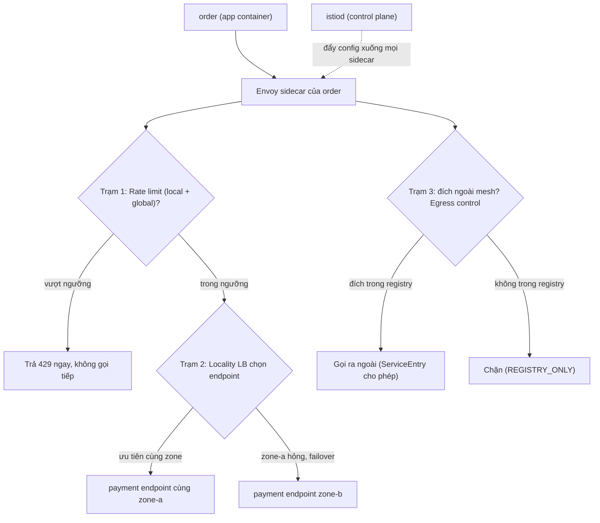
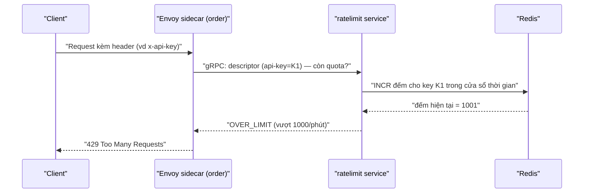

# Advanced Traffic & Resilience — Locality LB, Rate Limit, Egress

> **Tác giả:** Mr.Rom\
> **Phiên bản:** v1.0.0\
> **Tạo lúc:** 13/06/2026\
> **Cập nhật:** 13/06/2026\
> **Level:** Intermediate\
> **Tags:** service-mesh, istio, locality-lb, rate-limit, egress, resilience, envoy\
> **Yêu cầu trước:** [Intermediate Overview](00_intermediate-overview.md)

> 🎯 *Ở cấp Basic bạn đã canary, retry, circuit breaking cho một service trong một cluster. Bài này nâng lên tầm production thật: ưu tiên endpoint **cùng zone/region** để giảm latency và phí cross-zone (locality LB), tự **failover** khi cả một zone sập, **giới hạn tốc độ** (rate limit) cả ở từng Envoy lẫn toàn cục qua Redis, **kiểm soát egress** để service không gọi lung tung ra ngoài mesh, và tiêm lỗi sâu (delay/abort) để chaos test. Cuối bài bạn cấu hình locality LB + local rate limit thật cho service Acme.*

## 🎯 Sau bài này bạn sẽ

- [ ] Hiểu **locality-aware load balancing**: ưu tiên endpoint cùng zone/region, tự failover khi zone lỗi — qua `localityLbSetting` + `outlierDetection`
- [ ] Phân biệt **retry budget** (giới hạn tỷ lệ retry toàn cục) với `attempts` thuần, và retry **trên nhiều locality**
- [ ] Cấu hình **local rate limit** (per-Envoy, không cần backend) và hiểu khi nào chưa đủ
- [ ] Dựng **global rate limit** qua `ratelimit` service + Redis cho giới hạn dùng chung toàn cluster
- [ ] Kiểm soát **egress** bằng `ServiceEntry` + `outboundTrafficPolicy: REGISTRY_ONLY` (mặc định cấm, chỉ mở cái cho phép)
- [ ] Dùng **fault injection** sâu (delay + abort theo phần trăm) để chaos test resilience
- [ ] Thực hiện **traffic shifting nhiều bước** an toàn với cổng kiểm tra giữa các bước

---

## Tình huống — Acme Shop lên production đa zone và bắt đầu "chảy máu" hoá đơn cloud

Acme Shop đã chạy Istio mesh cơ bản: canary mượt, mTLS bật, authz chặt. Nhưng khi lên production thật trên một cluster trải **3 availability zone** (`zone-a`, `zone-b`, `zone-c`) của AWS, một loạt vấn đề mới xuất hiện mà bài Basic chưa chạm tới:

- 💸 **Hoá đơn cross-zone tăng vọt.** Mặc định Istio chia tải `ROUND_ROBIN` đều cho **mọi** Pod bất kể zone. Pod `order` ở `zone-a` thường xuyên gọi `payment` ở `zone-c` — mỗi byte qua zone bị AWS tính phí *cross-AZ data transfer*, và latency cộng thêm 1-2ms mỗi hop. Nhân với hàng triệu request/ngày, cả tiền lẫn độ trễ đều đau.
- 🌊 **Một khách "điên" gọi 10.000 req/s** vào endpoint search, làm cạn tài nguyên `order`, kéo sập cả service cho mọi khách khác. Không có ai chặn.
- 🕳️ **Service gọi tuỳ ý ra Internet.** Một thư viện bị nhiễm trong `order` có thể `curl` thẳng tới `evil.example.com` để rút dữ liệu — mesh không hề chặn traffic *đi ra* (egress).
- 🔥 **Không ai dám chắc resilience hoạt động** cho tới khi sự cố thật. Cần chủ động tiêm lỗi để diễn tập.

Sếp chốt: *"Ưu tiên gọi trong cùng zone để tiết kiệm phí và latency, nhưng zone sập thì phải tự nhảy sang zone khác. Giới hạn được tốc độ gọi. Service chỉ được ra ngoài mesh tới những đích mình cho phép. Và phải test được resilience trước khi nó cứu mình lúc 3 giờ sáng."*

Cả 4 yêu cầu này đều giải quyết được **ở tầng mesh, không sửa code service**. Đây chính là phần "nâng cao" mà Istio mạnh hơn hẳn K8s Service thuần.

> [!NOTE]
> Bài dùng **Istio** làm ví dụ (mesh phổ biến nhất). Các khái niệm locality LB, rate limit, egress đều có ở Linkerd/Cilium nhưng cú pháp khác. Toàn bộ tiền tố `cross-AZ`, phí transfer là minh hoạ AWS — Google Cloud/Azure có mô hình tương tự.

---

## 1️⃣ Bức tranh lớn — request đi đâu khi có locality, rate limit và egress

Trước khi đi vào từng tính năng, hãy nhìn toàn cảnh: một request từ `order` muốn gọi `payment` sẽ phải qua mấy "trạm kiểm soát" trong sidecar Envoy. Đây là phần trừu tượng nhất của bài — hiểu nó rồi mọi YAML phía sau chỉ là khai báo từng trạm.

🪞 **Ẩn dụ**: Hãy tưởng tượng sidecar Envoy như **một sân bay có nhiều cửa kiểm soát nối tiếp**:

- **Rate limit** = *quầy check-in giới hạn số khách/phút* — quá đông thì từ chối ngay (429), không cho tràn vào trong.
- **Locality LB** = *ưu tiên chuyến bay nội địa cùng thành phố* — chỉ khi hết ghế nội địa mới chuyển khách sang chuyến liên tỉnh (cross-zone).
- **Egress control** = *cửa xuất cảnh* — chỉ ai có visa tới đúng nước được phép (đích nằm trong registry), còn lại chặn.

Sơ đồ dưới ghép 3 trạm đó vào một luồng request, kèm vai trò control plane đẩy config xuống.



Điểm mấu chốt: tất cả các "trạm" này nằm **trong cùng một sidecar Envoy** và được điều khiển bằng các CRD khác nhau (`DestinationRule`, `EnvoyFilter`, `ServiceEntry`, `Sidecar`). App `order` không biết gì — nó chỉ gọi `http://payment` như cũ, còn việc chọn zone nào, chặn rate hay không, cho ra ngoài hay không đều do Envoy quyết theo config từ `istiod`.

---

## 2️⃣ Locality-aware load balancing — ưu tiên cùng zone, failover khi zone sập

Ở bài Basic, `loadBalancer` chỉ có `ROUND_ROBIN`/`LEAST_REQUEST` — chia đều **không quan tâm vị trí**. Trên cluster đa zone, đó là lãng phí: gọi xuyên zone vừa chậm vừa tốn phí. **Locality load balancing** dạy Envoy ưu tiên endpoint *gần nhất* (cùng zone → cùng region → khác region) và chỉ "tràn" sang xa hơn khi gần hết khoẻ.

🪞 **Ẩn dụ**: *Giống như bạn đặt đồ ăn — app ưu tiên quán **cùng phường** (cùng zone) giao nhanh, rẻ; quán phường hết hàng mới gọi sang **quận khác** (zone khác); cả quận cháy hàng mới đặt **tỉnh bên** (region khác). Không ai đặt từ tỉnh xa khi quán đầu ngõ còn mở.*

### Locality đến từ đâu?

Envoy biết "zone" của mỗi endpoint qua **label chuẩn của Kubernetes node**, được Istio đọc tự động:

- `topology.kubernetes.io/region` → region (vd `ap-southeast-1`)
- `topology.kubernetes.io/zone` → zone (vd `ap-southeast-1a`)

Cloud provider tự gắn 2 label này lên node. Pod chạy trên node nào thì "thừa hưởng" locality của node đó. Bạn không cần khai báo tay — chỉ cần cluster multi-zone thật.

### Điều kiện sống còn: phải có outlier detection

Đây là chỗ người mới hay vấp. **Locality LB chỉ failover khi Envoy biết một locality đã "không khoẻ".** Mà Envoy chỉ biết host nào không khoẻ thông qua **outlier detection** (đã học ở Basic). Thiếu `outlierDetection`, Envoy coi *mọi* endpoint đều khoẻ → không bao giờ failover → khi zone-a sập, traffic vẫn cố gửi vào zone-a và lỗi hàng loạt.

→ Quy tắc vàng: **bật locality LB thì BẮT BUỘC bật outlier detection kèm theo.** Chúng là một cặp.

### Hai chế độ: distribute và failover

Istio cho 2 cách khai báo locality, dùng cho 2 nhu cầu khác nhau:

- **`distribute`** — chia traffic theo **tỷ trọng cố định** giữa các locality (vd 80% cùng zone, 20% zone khác). Dùng khi bạn muốn kiểm soát chính xác phần trăm.
- **`failover`** — bình thường gửi 100% cùng zone, **chỉ khi** zone đó hỏng (qua outlier detection) mới đổ sang locality dự phòng theo thứ tự khai báo. Đây là kiểu phổ biến nhất cho mục tiêu "tiết kiệm phí + chịu lỗi zone".

Dưới đây là `DestinationRule` dùng **failover** cho `payment`: ưu tiên cùng zone, zone hỏng thì nhảy sang zone khác trong cùng region. Để ngắn gọn mình map theo region; trong thực tế zone là `<region><suffix>` (vd `ap-southeast-1a`), Istio so khớp theo cấu trúc phân cấp region/zone/sub-zone.

```yaml
# payment-dr-locality.yaml — locality failover + outlier detection (bắt buộc đi cặp)
apiVersion: networking.istio.io/v1
kind: DestinationRule
metadata:
  name: payment
  namespace: acme
spec:
  host: payment
  trafficPolicy:
    loadBalancer:
      simple: LEAST_REQUEST          # nền tảng LB trong từng locality
      localityLbSetting:
        enabled: true                # bật locality awareness
        failover:                    # khi region nguồn hỏng → đổ sang region đích
          - from: ap-southeast-1     # endpoint ở region này...
            to: ap-southeast-2       # ...hỏng thì failover sang region này
    outlierDetection:                # BẮT BUỘC — không có cái này, failover không kích hoạt
      consecutive5xxErrors: 5        # 1 endpoint trả 5 lỗi 5xx liên tiếp...
      interval: 5s                   # ...xét mỗi 5 giây...
      baseEjectionTime: 30s          # ...thì eject 30 giây
      maxEjectionPercent: 100        # cho phép eject tới 100% trong 1 zone (để failover sạch)
```

Apply và xác nhận locality setting đã ăn vào DestinationRule:

```bash
kubectl apply -f payment-dr-locality.yaml
kubectl get destinationrule payment -n acme -o jsonpath='{.spec.trafficPolicy.localityLbSetting.enabled}{"\n"}'
```

Kết quả mong đợi (in ra giá trị đã khai báo):

```
true
```

Giá trị `true` xác nhận `localityLbSetting` đã được lưu vào DestinationRule. Từ giờ Envoy của `order` sẽ ưu tiên endpoint `payment` cùng zone với mình; chỉ khi outlier detection eject hết endpoint cùng zone, traffic mới chảy sang zone/region khác.

> [!IMPORTANT]
> `maxEjectionPercent: 100` ở đây là cố ý: khi cả một zone thật sự sập, ta muốn eject **toàn bộ** endpoint zone đó để dồn traffic sang zone lành. Nhưng cẩn thận — nếu outlier detection quá nhạy (`consecutive5xxErrors` thấp) trong một sự cố lỗi *toàn cục* (không phải lỗi zone), nó có thể eject sạch và sập service. Cân chỉnh ngưỡng theo SLO thật.

### Xác minh phân bố theo zone

Để *nhìn thấy* traffic có thật sự ở lại cùng zone không, công cụ chuẩn là Kiali (traffic graph có nhãn locality) hoặc Prometheus với label `source_workload` / `destination_locality`. Ở mức lệnh, bạn kiểm tra Envoy của một Pod `order` thấy endpoint `payment` nào, kèm priority (priority 0 = locality gần nhất):

```bash
# Lấy 1 Pod order rồi xem cluster endpoint Envoy của nó biết
ORDER_POD=$(kubectl get pod -n acme -l app=order -o jsonpath='{.items[0].metadata.name}')
istioctl proxy-config endpoint "$ORDER_POD" -n acme --cluster "outbound|8080||payment.acme.svc.cluster.local"
```

Kết quả mong đợi (rút gọn — cột cuối là locality của từng endpoint):

```
ENDPOINT             STATUS      OUTLIER CHECK     CLUSTER
10.1.0.21:8080       HEALTHY     OK                outbound|8080||payment.acme.svc.cluster.local
10.1.0.55:8080       HEALTHY     OK                outbound|8080||payment.acme.svc.cluster.local
10.2.0.18:8080       HEALTHY     OK                outbound|8080||payment.acme.svc.cluster.local
```

Cột `STATUS` = `HEALTHY` và `OUTLIER CHECK` = `OK` nghĩa endpoint còn trong pool. Khi một zone sập, các endpoint zone đó sẽ chuyển `OUTLIER CHECK` thành `FAILED` (bị eject) — và đó là lúc locality failover dồn traffic sang zone còn lại.

→ Locality LB lo "gọi ai cho gần". Nhưng khi gọi xa (failover) hoặc gặp lỗi tạm thời, ta vẫn cần retry — và retry trên nhiều locality có một cái bẫy: retry storm.

---

## 3️⃣ Retry budget + retry trên nhiều locality

Ở Basic, `retries.attempts: 3` nghĩa "mỗi request thử lại tối đa 3 lần". Nghe vô hại, nhưng trên production đa zone nó là mầm của **retry storm** (bão retry): khi một zone bắt đầu chậm, *mọi* request đều retry → tải tăng gấp 3-4 lần → service đang yếu càng sập nhanh hơn. Retry "cứu" lúc lỗi lẻ tẻ, nhưng "giết" lúc lỗi diện rộng.

🪞 **Ẩn dụ**: *Một quán phở quá tải, nếu mỗi khách bị chờ lâu lại gọi thêm 3 lần "cho tôi thêm 1 tô" thì bếp càng ngộp. Cần một **hạn ngạch**: tối đa chỉ 20% đơn được phép gọi lại, phần còn lại đành chịu — để bếp có cơ hội hồi.*

### Retry budget — giới hạn tỷ lệ retry, không phải số lần

**Retry budget** giới hạn retry theo **tỷ lệ phần trăm so với traffic thật**, thay vì số tuyệt đối mỗi request. Ví dụ "retry chỉ được chiếm tối đa 20% tổng số request đang chạy" — khi nhiều request cùng fail, tổng retry bị trần lại, không bùng nổ.

Istio API (`VirtualService.retries`) chưa expose trực tiếp retry budget; nó dùng `retryRemoteLocalities` và `attempts`. Để bật retry budget thật của Envoy (`retry_budget`), ta dùng `EnvoyFilter` vá vào circuit breaker của cluster. Dưới đây là VirtualService với retry hợp lý + cho phép retry sang locality khác, kèm EnvoyFilter đặt retry budget:

```yaml
# payment-vs-retry.yaml — retry an toàn + retry sang locality khác khi cần
apiVersion: networking.istio.io/v1
kind: VirtualService
metadata:
  name: payment
  namespace: acme
spec:
  hosts:
    - payment
  http:
    - route:
        - destination:
            host: payment
      timeout: 3s
      retries:
        attempts: 2                     # giữ THẤP — 2 là đủ cho lỗi tạm thời
        perTryTimeout: 1s
        retryOn: connect-failure,reset,5xx
        retryRemoteLocalities: true     # cho phép retry vào endpoint ở locality KHÁC
```

Trường `retryRemoteLocalities: true` rất quan trọng cho đa zone: mặc định retry chỉ thử lại trong **cùng locality** — nếu cả zone đang lỗi thì retry vô ích (lại trúng host lỗi). Bật cờ này cho phép lần retry "nhảy" sang zone lành. Giờ thêm retry budget qua EnvoyFilter để chặn retry storm:

```yaml
# payment-retry-budget.yaml — đặt trần retry = 20% traffic (chống retry storm)
apiVersion: networking.istio.io/v1alpha3
kind: EnvoyFilter
metadata:
  name: payment-retry-budget
  namespace: acme
spec:
  workloadSelector:
    labels:
      app: order                        # áp cho phía GỌI (order gọi payment)
  configPatches:
    - applyTo: CLUSTER
      match:
        cluster:
          service: payment.acme.svc.cluster.local
      patch:
        operation: MERGE
        value:
          circuit_breakers:
            thresholds:
              - priority: DEFAULT
                retry_budget:
                  budget_percent:
                    value: 20.0          # retry tối đa = 20% số request đang chạy
                  min_retry_concurrency: 3   # nhưng luôn cho ít nhất 3 retry song song
```

Apply cả hai và kiểm tra EnvoyFilter đã được tạo:

```bash
kubectl apply -f payment-vs-retry.yaml
kubectl apply -f payment-retry-budget.yaml
kubectl get envoyfilter -n acme
```

Kết quả mong đợi:

```
NAME                   AGE
payment-retry-budget   7s
```

Có 3 tham số phối hợp tạo nên retry an toàn:

- **`attempts: 2`** ở VirtualService — trần *mỗi request*. Giữ thấp; cao hơn 3 hiếm khi giúp mà chỉ tăng tải.
- **`retryRemoteLocalities: true`** — cho lần retry nhảy sang zone lành thay vì lặp lại trên zone lỗi.
- **`retry_budget` 20%** ở EnvoyFilter — trần *toàn cục* trên cả cluster: dù mỗi request được phép retry 2 lần, **tổng** số retry không vượt 20% traffic. Đây là phòng tuyến chống retry storm.

> [!CAUTION]
> `EnvoyFilter` là API cấp thấp, không có validation thân thiện như VirtualService — gõ sai một field là Envoy nuốt lặng lẽ hoặc crash config. Luôn `istioctl proxy-config cluster <pod>` để xác minh patch đã ăn, và pin `apiVersion: networking.istio.io/v1alpha3` (EnvoyFilter vẫn ở alpha vì bám sát Envoy API).

→ Retry budget bảo vệ *downstream* khỏi chính traffic retry của mình. Nhưng còn bảo vệ service khỏi *một client gọi quá nhiều* thì sao? Đó là rate limiting.

---

## 4️⃣ Local rate limit — giới hạn ngay tại từng Envoy

**Rate limiting** giới hạn số request trong một khoảng thời gian. Có 2 tầng, bắt đầu từ cái đơn giản nhất: **local rate limit** — mỗi sidecar Envoy tự đếm và tự chặn, **không cần backend gì cả**.

🪞 **Ẩn dụ**: *Local rate limit giống mỗi cửa hàng có một **bảo vệ riêng** đếm khách: "mỗi phút cho 100 người vào quầy này". Bảo vệ không liên lạc với cửa hàng khác — chỉ lo quầy của mình. Đơn giản, nhanh, nhưng không biết tổng số khách toàn chuỗi.*

### Cơ chế token bucket

Local rate limit dùng **token bucket** (xô token): xô chứa tối đa `max_tokens` token, được nạp lại `tokens_per_fill` mỗi `fill_interval`. Mỗi request lấy 1 token; hết token → trả `429 Too Many Requests` ngay, không gọi vào app.

Local rate limit chưa có trong VirtualService/DestinationRule API thuần — phải khai báo qua `EnvoyFilter` chèn HTTP filter `envoy.filters.http.local_ratelimit`. Cấu hình dưới giới hạn `order` ở **10 request/phút mỗi Pod** (con số nhỏ để dễ test):

```yaml
# order-local-ratelimit.yaml — local rate limit 10 req/phút per-Envoy cho order
apiVersion: networking.istio.io/v1alpha3
kind: EnvoyFilter
metadata:
  name: order-local-ratelimit
  namespace: acme
spec:
  workloadSelector:
    labels:
      app: order                      # áp cho sidecar của order (inbound)
  configPatches:
    # 1. Cài HTTP filter local_ratelimit vào chuỗi xử lý inbound
    - applyTo: HTTP_FILTER
      match:
        context: SIDECAR_INBOUND
        listener:
          filterChain:
            filter:
              name: envoy.filters.network.http_connection_manager
              subFilter:
                name: envoy.filters.http.router
      patch:
        operation: INSERT_BEFORE       # đặt TRƯỚC router để chặn sớm
        value:
          name: envoy.filters.http.local_ratelimit
          typed_config:
            "@type": type.googleapis.com/envoy.extensions.filters.http.local_ratelimit.v3.LocalRateLimit
            stat_prefix: order_local_rl
            token_bucket:
              max_tokens: 10            # xô chứa tối đa 10 token
              tokens_per_fill: 10       # mỗi chu kỳ nạp lại 10 token
              fill_interval: 60s        # chu kỳ 60 giây → 10 req/phút
            filter_enabled:
              default_value:
                numerator: 100          # bật cho 100% traffic
                denominator: HUNDRED
            filter_enforced:
              default_value:
                numerator: 100          # thực thi (chặn) cho 100% traffic
                denominator: HUNDRED
            response_headers_to_add:
              - append_action: OVERWRITE_IF_EXISTS_OR_ADD
                header:
                  key: x-local-rate-limit
                  value: "true"         # gắn header để debug: response nào bị giới hạn
```

Apply và kiểm tra filter đã được chèn vào listener của Pod `order`:

```bash
kubectl apply -f order-local-ratelimit.yaml
ORDER_POD=$(kubectl get pod -n acme -l app=order -o jsonpath='{.items[0].metadata.name}')
istioctl proxy-config listener "$ORDER_POD" -n acme -o json | grep -c local_ratelimit
```

Kết quả mong đợi (số > 0 nghĩa filter đã có mặt trong config Envoy):

```
2
```

Số khác 0 xác nhận `local_ratelimit` đã được chèn vào listener của Envoy. Giờ test thật: bắn 15 request liên tiếp tới `order` từ một Pod client — 10 cái đầu phải `200`, từ cái 11 trở đi phải `429`:

```bash
kubectl run -n acme rl-test --image=curlimages/curl --rm -it --restart=Never -- \
  sh -c 'for i in $(seq 15); do curl -s -o /dev/null -w "%{http_code}\n" http://order:8080/; done | sort | uniq -c'
```

Kết quả mong đợi:

```
  10 200
   5 429
```

Đúng 10 request lọt (`200`), 5 request sau bị chặn (`429 Too Many Requests`) vì xô token đã cạn — và chỉ được nạp lại sau 60 giây. Đây là bằng chứng local rate limit hoạt động ngay tại sidecar, app `order` không hề nhận 5 request bị chặn.

> [!WARNING]
> Local rate limit là **per-Pod**. Nếu `order` có 3 Pod, mỗi Pod cho 10 req/phút → tổng thực tế là **30 req/phút**, không phải 10. Khi bạn cần một con số *dùng chung toàn cluster* (vd "tổng API key này tối đa 1000 req/phút bất kể có bao nhiêu Pod"), local rate limit không làm được — phải dùng global rate limit ở section sau.

---

## 5️⃣ Global rate limit — giới hạn dùng chung qua ratelimit service + Redis

Khi cần một hạn mức **chia sẻ giữa mọi Pod** (vd quota theo API key, theo user, theo tenant), bạn cần một bộ đếm tập trung. Đó là **global rate limit**: mọi Envoy hỏi chung một **rate limit service**, service này đếm trên **Redis**.

🪞 **Ẩn dụ**: *Thay vì mỗi cửa hàng có bảo vệ riêng (local), global rate limit giống **một tổng đài trung tâm**: mọi cửa hàng gọi điện hỏi "khách X này đã vào bao lần hôm nay?" trước khi cho vào. Tổng đài (ratelimit service) tra sổ chung (Redis) → đảm bảo tổng số lần khách X vào *toàn chuỗi* không vượt quota.*

### Kiến trúc 3 thành phần

Global rate limit cần phối hợp 3 mảnh. Sơ đồ dưới cho thấy đường đi của một quyết định "cho qua hay chặn".



Khác local (Envoy tự quyết), ở đây Envoy **hỏi** ratelimit service qua gRPC trước mỗi request, ratelimit service đếm trên Redis rồi trả `OK` hoặc `OVER_LIMIT`. Vì Redis là bộ đếm chung, mọi Pod `order` cùng tuân một con số tổng.

### Bước 1: Deploy Redis + ratelimit service

Triển khai `envoyproxy/ratelimit` (bộ rate limit service chính chủ của Envoy) và một Redis. ConfigMap chứa **luật rate limit** (domain + descriptor). Ví dụ: mỗi `x-api-key` tối đa 1000 request/phút:

```yaml
# ratelimit-stack.yaml — Redis + ratelimit service + luật
apiVersion: v1
kind: ConfigMap
metadata:
  name: ratelimit-config
  namespace: istio-system
data:
  config.yaml: |
    domain: acme-ratelimit
    descriptors:
      - key: api-key                  # khoá descriptor Envoy sẽ gửi lên
        rate_limit:
          unit: minute
          requests_per_unit: 1000     # 1000 req/phút cho MỖI giá trị api-key
---
apiVersion: apps/v1
kind: Deployment
metadata:
  name: redis
  namespace: istio-system
spec:
  replicas: 1
  selector:
    matchLabels:
      app: redis
  template:
    metadata:
      labels:
        app: redis
    spec:
      containers:
        - name: redis
          image: redis:7.2-alpine
          ports:
            - containerPort: 6379
---
apiVersion: v1
kind: Service
metadata:
  name: redis
  namespace: istio-system
spec:
  selector:
    app: redis
  ports:
    - port: 6379
      targetPort: 6379
---
apiVersion: apps/v1
kind: Deployment
metadata:
  name: ratelimit
  namespace: istio-system
spec:
  replicas: 1
  selector:
    matchLabels:
      app: ratelimit
  template:
    metadata:
      labels:
        app: ratelimit
    spec:
      containers:
        - name: ratelimit
          image: envoyproxy/ratelimit:master
          command: ["/bin/ratelimit"]
          env:
            - name: USE_STATSD
              value: "false"
            - name: LOG_LEVEL
              value: info
            - name: REDIS_SOCKET_TYPE
              value: tcp
            - name: REDIS_URL
              value: redis:6379
            - name: RUNTIME_ROOT
              value: /data
            - name: RUNTIME_SUBDIRECTORY
              value: ratelimit
            - name: RUNTIME_WATCH_ROOT
              value: "false"
          ports:
            - containerPort: 8081      # cổng gRPC để Envoy gọi
          volumeMounts:
            - name: config
              mountPath: /data/ratelimit/config
      volumes:
        - name: config
          configMap:
            name: ratelimit-config
---
apiVersion: v1
kind: Service
metadata:
  name: ratelimit
  namespace: istio-system
spec:
  selector:
    app: ratelimit
  ports:
    - name: grpc
      port: 8081
      targetPort: 8081
```

### Bước 2: Trỏ Envoy tới ratelimit service + định nghĩa descriptor

Cần 2 EnvoyFilter: một khai báo **cluster** trỏ tới ratelimit service và cài HTTP filter `ratelimit`; một định nghĩa **action** (lấy giá trị header `x-api-key` làm descriptor). Đây là filter cài vào gateway/ingress (hoặc sidecar tuỳ nơi enforce):

```yaml
# global-ratelimit-filter.yaml — cài HTTP filter ratelimit + cluster ratelimit
apiVersion: networking.istio.io/v1alpha3
kind: EnvoyFilter
metadata:
  name: global-ratelimit
  namespace: istio-system
spec:
  workloadSelector:
    labels:
      app: order
  configPatches:
    # 1. Cài HTTP filter ratelimit, trỏ tới ratelimit service qua gRPC
    - applyTo: HTTP_FILTER
      match:
        context: SIDECAR_INBOUND
        listener:
          filterChain:
            filter:
              name: envoy.filters.network.http_connection_manager
              subFilter:
                name: envoy.filters.http.router
      patch:
        operation: INSERT_BEFORE
        value:
          name: envoy.filters.http.ratelimit
          typed_config:
            "@type": type.googleapis.com/envoy.extensions.filters.http.ratelimit.v3.RateLimit
            domain: acme-ratelimit          # phải khớp 'domain' trong ConfigMap
            failure_mode_deny: false        # nếu ratelimit service chết → CHO QUA (fail open)
            timeout: 0.05s                  # chờ tối đa 50ms cho quyết định
            rate_limit_service:
              grpc_service:
                envoy_grpc:
                  cluster_name: outbound|8081||ratelimit.istio-system.svc.cluster.local
              transport_api_version: V3
```

Và EnvoyFilter định nghĩa **action** — lấy header `x-api-key` thành descriptor để gửi lên ratelimit service:

```yaml
# global-ratelimit-action.yaml — định nghĩa descriptor từ header x-api-key
apiVersion: networking.istio.io/v1alpha3
kind: EnvoyFilter
metadata:
  name: global-ratelimit-action
  namespace: istio-system
spec:
  workloadSelector:
    labels:
      app: order
  configPatches:
    - applyTo: HTTP_ROUTE
      match:
        context: SIDECAR_INBOUND
        routeConfiguration:
          vhost:
            name: "inbound|http|8080"
      patch:
        operation: MERGE
        value:
          route:
            rate_limits:
              - actions:
                  - request_headers:
                      header_name: x-api-key       # đọc header này...
                      descriptor_key: api-key      # ...thành descriptor key 'api-key'
```

Apply toàn bộ và kiểm tra ratelimit service đã chạy:

```bash
kubectl apply -f ratelimit-stack.yaml
kubectl apply -f global-ratelimit-filter.yaml
kubectl apply -f global-ratelimit-action.yaml
kubectl get pods -n istio-system -l app=ratelimit
```

Kết quả mong đợi:

```
NAME                         READY   STATUS    RESTARTS   AGE
ratelimit-6d4c8f9b7-abcde    1/1     Running   0          30s
```

Có 2 quyết định thiết kế quan trọng:

- **`failure_mode_deny: false`** (fail open) — nếu ratelimit service hoặc Redis chết, request **vẫn được cho qua** thay vì chặn sạch. Với rate limit, fail open thường an toàn hơn fail closed (đừng để bộ giới hạn chết kéo sập cả service). Đổi thành `true` chỉ khi giới hạn là yêu cầu bảo mật cứng.
- **`timeout: 0.05s`** — Envoy chỉ chờ 50ms cho quyết định; quá thì áp `failure_mode`. Giữ thấp để rate limit không thành nút thắt latency.

> [!TIP]
> **Local vs Global — không loại trừ nhau, hãy dùng cả hai.** Local rate limit (section 4) làm "tuyến đầu" chặn burst thô bạo ngay tại Envoy, không tốn round-trip mạng. Global rate limit làm "tuyến sau" enforce quota chính xác dùng chung. Production thật thường xếp local trước global: local lọc rác, global đếm chính xác phần còn lại.

→ Rate limit kiểm soát traffic *đi vào* service. Còn traffic service *đi ra ngoài mesh* — gọi API bên thứ ba, database ngoài — thì kiểm soát thế nào? Đó là egress.

---

## 6️⃣ Egress control + ServiceEntry — service chỉ được ra ngoài tới đích cho phép

Mặc định, Istio cho phép Pod gọi ra **bất kỳ** đích ngoài mesh (`outboundTrafficPolicy: ALLOW_ANY`). Điều đó tiện nhưng nguy hiểm: một dependency bị nhiễm trong `order` có thể âm thầm gửi dữ liệu tới `evil.example.com`. Tư duy production là **mặc định cấm, chỉ mở cái cho phép** — gọi là `REGISTRY_ONLY`.

🪞 **Ẩn dụ**: *`ALLOW_ANY` giống văn phòng cho nhân viên ra ngoài lúc nào, đi đâu cũng được. `REGISTRY_ONLY` giống công ty bảo mật cao: ra ngoài phải có **giấy phép ghi rõ địa điểm** (ServiceEntry). Không có giấy → bảo vệ chặn ngay ở cổng.*

### ServiceEntry — "khai báo" một đích ngoài vào registry của mesh

Để mesh "biết" một đích ngoài tồn tại (và được phép gọi), ta đăng ký nó bằng **`ServiceEntry`**. Sau khi đăng ký, đích đó nằm trong service registry của mesh — có thể áp luôn DestinationRule, retry, timeout như service nội bộ. Ví dụ: Acme cần gọi API tỷ giá `api.exchangerate.host` (HTTPS):

```yaml
# se-exchangerate.yaml — cho phép gọi ra api.exchangerate.host qua HTTPS
apiVersion: networking.istio.io/v1
kind: ServiceEntry
metadata:
  name: exchangerate-api
  namespace: acme
spec:
  hosts:
    - api.exchangerate.host
  location: MESH_EXTERNAL          # đích nằm NGOÀI mesh
  resolution: DNS                  # phân giải địa chỉ qua DNS
  ports:
    - number: 443
      name: https
      protocol: TLS                # traffic HTTPS đi qua (Envoy không giải mã)
```

### Bật REGISTRY_ONLY — siết outbound toàn mesh

Sau khi đã khai báo các đích hợp lệ bằng ServiceEntry, ta đổi chính sách outbound mặc định từ `ALLOW_ANY` sang `REGISTRY_ONLY`. Cấu hình này nằm trong mesh config của Istio (`istio` ConfigMap trong `istio-system`):

```bash
# Đổi outboundTrafficPolicy.mode sang REGISTRY_ONLY
kubectl get configmap istio -n istio-system -o jsonpath='{.data.mesh}' > /tmp/mesh.yaml
```

Trong file mesh config, đặt:

```yaml
# Trích đoạn mesh config (istio ConfigMap) — siết outbound
outboundTrafficPolicy:
  mode: REGISTRY_ONLY              # chỉ cho gọi đích đã có trong registry (ServiceEntry)
```

Cách an toàn và lặp lại được là dùng `istioctl install`/IstioOperator. Nếu cài qua `istioctl`, đặt giá trị này bằng cờ:

```bash
istioctl install --set meshConfig.outboundTrafficPolicy.mode=REGISTRY_ONLY -y
```

Kết quả mong đợi (rút gọn):

```
✔ Istio core installed
✔ Istiod installed
✔ Installation complete
```

Apply ServiceEntry trước, rồi chứng minh: gọi đích **đã khai báo** thì thông, gọi đích **chưa khai báo** thì bị chặn:

```bash
kubectl apply -f se-exchangerate.yaml

# Gọi đích ĐÃ khai báo (api.exchangerate.host) → phải thông
kubectl exec -n acme deploy/order -c order -- \
  curl -s -o /dev/null -w "allowed: %{http_code}\n" https://api.exchangerate.host/

# Gọi đích CHƯA khai báo (example.com) → phải bị chặn
kubectl exec -n acme deploy/order -c order -- \
  curl -s -o /dev/null -w "blocked: %{http_code}\n" https://example.com/
```

Kết quả mong đợi:

```
allowed: 200
blocked: 000
```

`allowed: 200` cho thấy đích trong registry gọi được bình thường. `blocked: 000` (curl không nhận được HTTP response nào) xác nhận `REGISTRY_ONLY` đã chặn đích lạ: với `protocol: TLS` (passthrough), Envoy KHÔNG giải mã traffic nên không synthesize được HTTP `502` — nó chặn ngay ở tầng TCP tại `BlackHoleCluster`, connection bị reset/refused — đúng tinh thần "mặc định cấm". Một dependency bị nhiễm muốn rút dữ liệu ra `evil.example.com` sẽ đứt connection y như vậy. (Với egress PLAINTEXT HTTP qua port 80, nơi Envoy đóng vai HTTP proxy, `BlackHoleCluster` mới trả `502 Bad Gateway`.)

> [!IMPORTANT]
> `REGISTRY_ONLY` là một thay đổi *toàn mesh* — bật xong, **mọi** đích ngoài chưa khai báo ServiceEntry sẽ đứt. Trước khi bật trên production, kiểm kê hết các đích ngoài đang dùng (payment gateway, S3, API bên thứ ba, package registry...) và tạo ServiceEntry cho từng cái. Bật mù = đứt tích hợp hàng loạt.

---

## 7️⃣ Fault injection sâu — chaos test resilience

Bạn đã đặt locality failover, retry budget, rate limit, egress. Nhưng làm sao chắc chúng cứu được mình lúc sự cố thật? Đừng chờ 3 giờ sáng để biết. **Fault injection** (đã gặp ở Basic) lên tầm chaos test khi bạn **kết hợp delay + abort** và quan sát toàn hệ thống phản ứng.

🪞 **Ẩn dụ**: *Giống diễn tập phòng cháy — bạn chủ động bấm chuông báo cháy giả (tiêm lỗi) để xem nhân viên có thoát đúng lối, bình cứu hoả có hoạt động (retry/circuit breaker/failover có kích hoạt) — thay vì chờ cháy thật mới biết kế hoạch sai chỗ nào.*

VirtualService dưới tiêm **đồng thời** 2 loại lỗi vào `payment`: làm chậm 30% request thêm 5 giây (test timeout + retry + locality failover), và abort 10% request bằng `503` (test circuit breaker eject host):

```yaml
# payment-vs-chaos.yaml — tiêm delay + abort để chaos test
apiVersion: networking.istio.io/v1
kind: VirtualService
metadata:
  name: payment-chaos
  namespace: acme
spec:
  hosts:
    - payment
  http:
    - fault:
        delay:
          percentage:
            value: 30          # 30% request bị làm chậm...
          fixedDelay: 5s       # ...thêm 5 giây (vượt timeout 3s → kích hoạt retry)
        abort:
          percentage:
            value: 10          # đồng thời 10% request...
          httpStatus: 503      # ...bị trả 503 (kích hoạt outlier detection)
      route:
        - destination:
            host: payment
```

Apply rồi bắn 100 request, quan sát phân bố mã trả về để thấy hệ thống đang "chịu đòn" ra sao:

```bash
kubectl apply -f payment-vs-chaos.yaml

kubectl run -n acme chaos --image=curlimages/curl --rm -it --restart=Never -- \
  sh -c 'for i in $(seq 100); do curl -s -o /dev/null -w "%{http_code}\n" --max-time 10 http://payment:8080/; done | sort | uniq -c'
```

Kết quả mong đợi (con số dao động quanh tỷ lệ vì là xác suất):

```
   8 503
  92 200
```

Khoảng 8% trả `503` (gần với 10% abort, một phần được retry cứu thành `200`), còn lại `200`. Các request bị delay 5s mà timeout 3s sẽ bị cắt và retry — nếu retry trúng zone lành (nhờ `retryRemoteLocalities`) thì thành `200`. Đây là lúc bạn mở Kiali/Grafana xem: outlier detection có eject host không, retry budget có chạm trần không, latency p99 leo tới đâu.

> [!CAUTION]
> Fault injection trên đường `payment` thật là **rất nguy hiểm** — bạn đang cố tình làm hỏng dịch vụ thanh toán. Chỉ chạy trong môi trường **staging/canary có ring-fence**, hoặc giới hạn chỉ tiêm cho traffic gắn header test (thêm `match` theo header). Và **luôn xoá** VirtualService chaos sau khi diễn tập — một file chaos quên trên production làm 10% khách thật mất tiền oan.

→ Sau khi chaos test chứng minh resilience ổn, ta mới yên tâm làm việc cuối: dịch traffic version mới qua nhiều bước an toàn.

---

## 8️⃣ Traffic shifting nhiều bước an toàn — với cổng kiểm tra

Ở Basic, canary là chuỗi `kubectl apply` đổi weight. Lên production, ta nâng nó thành **quy trình nhiều bước có cổng kiểm tra (gate)**: mỗi bước chỉ tiến khi metric của bước trước đạt ngưỡng. Đây là xương sống của progressive delivery (giao hàng tiến triển).

Ý tưởng: thay vì nhảy 0% → 100%, ta đi từng nấc nhỏ `5% → 25% → 50% → 100%`. Sau mỗi nấc, dừng lại quan sát **error rate** và **latency p99** của v2; chỉ tiến tiếp khi đạt ngưỡng, ngược lại rollback tức thì. Bảng dưới là quy trình chuẩn cho Acme:

| Nấc | v1 | v2 | Cổng kiểm tra trước khi sang nấc kế |
|---|---|---|---|
| 1 | 95% | 5% | Error rate v2 < 1%, p99 < 1.2× của v1 |
| 2 | 75% | 25% | Error rate v2 < 1%, không có 5xx bất thường |
| 3 | 50% | 50% | So sánh trực tiếp v1 vs v2 cùng tải |
| 4 | 0% | 100% | Ổn định một thời gian → xoá Deployment v1 |

Mỗi nấc là một VirtualService với weight tương ứng. Đây là nấc đầu (5%):

```yaml
# payment-vs-step1.yaml — nấc 1: 5% sang v2
apiVersion: networking.istio.io/v1
kind: VirtualService
metadata:
  name: payment
  namespace: acme
spec:
  hosts:
    - payment
  http:
    - route:
        - destination:
            host: payment
            subset: v1
          weight: 95
        - destination:
            host: payment
            subset: v2
          weight: 5
```

Áp từng nấc, giữa mỗi nấc là một **cổng kiểm tra** — ở đây minh hoạ bằng lệnh truy vấn error rate v2 từ Prometheus của Istio. Nếu tỷ lệ lỗi vượt ngưỡng, dừng và rollback:

```bash
# Nấc 1: dịch 5% sang v2
kubectl apply -f payment-vs-step1.yaml

# Cổng kiểm tra: đếm tỷ lệ 5xx của subset v2 trong 5 phút qua (qua Prometheus)
# (PROM là URL Prometheus của Istio, vd http://prometheus.istio-system:9090)
curl -s "$PROM/api/v1/query" --data-urlencode \
  'query=sum(rate(istio_requests_total{destination_workload="payment-v2",response_code=~"5.."}[5m]))
         /
         sum(rate(istio_requests_total{destination_workload="payment-v2"}[5m]))'
```

Kết quả mong đợi (JSON Prometheus — `value[1]` là tỷ lệ lỗi, ví dụ 0.004 = 0.4%):

```json
{"status":"success","data":{"result":[{"value":[1718000000,"0.004"]}]}}
```

Giá trị `"0.004"` = 0.4% lỗi, dưới ngưỡng 1% → cổng **pass**, được tiến sang nấc 2 (25%). Nếu giá trị > 0.01 (1%), cổng **fail** → rollback ngay bằng cách apply lại file 100% v1. Trong production thật, bạn không gõ tay các lệnh này — công cụ như **Argo Rollouts** hoặc **Flagger** tự động hoá đúng vòng lặp "dịch weight → đo metric → quyết tiến/lùi" này, dùng chính các VirtualService của Istio.

> [!TIP]
> **Flagger/Argo Rollouts** biến quy trình trên thành tự động: bạn khai báo "tăng 5% mỗi 2 phút, nếu error rate > 1% thì rollback" và nó tự lái weight VirtualService + truy vấn Prometheus. Đây là chuẩn production cho progressive delivery — bài này dạy *cơ chế bên dưới* để bạn hiểu khi công cụ làm thay.

---

## 💡 Cạm bẫy thường gặp & Best practice

### ❌ Cạm bẫy: bật locality LB nhưng quên outlier detection

- **Triệu chứng**: Cấu hình `localityLbSetting.enabled: true` nhưng khi một zone sập, traffic vẫn chảy vào zone chết và lỗi hàng loạt — không hề failover.
- **Nguyên nhân**: Locality LB chỉ failover khi Envoy biết một locality "không khoẻ", mà thông tin đó **đến từ outlier detection**. Thiếu `outlierDetection`, mọi endpoint luôn được coi là khoẻ → không bao giờ eject → không bao giờ failover.
- **Cách tránh**: Luôn khai báo `outlierDetection` **cùng** `localityLbSetting` trong một DestinationRule. Coi chúng là một cặp bất khả phân ly.

### ❌ Cạm bẫy: local rate limit tưởng là giới hạn toàn cục

- **Triệu chứng**: Đặt local rate limit "10 req/phút" nhưng đo thực tế thấy service nhận tới 30-40 req/phút.
- **Nguyên nhân**: Local rate limit là **per-Pod**. Service có N Pod thì hạn mức thực = N × giá trị cấu hình. Scale lên là hạn mức tự nhân lên.
- **Cách tránh**: Cần con số dùng chung bất kể số Pod → dùng **global rate limit** (ratelimit service + Redis). Local chỉ hợp để chặn burst thô bạo per-Pod.

### ❌ Cạm bẫy: bật REGISTRY_ONLY mà chưa kiểm kê đích ngoài

- **Triệu chứng**: Vừa đổi `outboundTrafficPolicy: REGISTRY_ONLY`, hàng loạt tích hợp đứt — gọi payment gateway, S3, API bên thứ ba đều `502`.
- **Nguyên nhân**: `REGISTRY_ONLY` chặn **mọi** đích ngoài chưa có ServiceEntry. Mọi tích hợp chưa khai báo đều thành "đích lạ" và bị chặn.
- **Cách tránh**: Trước khi siết, audit toàn bộ traffic outbound (qua access log hoặc Kiali), liệt kê mọi đích ngoài, tạo ServiceEntry cho từng cái. Bật `REGISTRY_ONLY` ở staging trước, theo dõi `502` lạ rồi mới lên production.

### ❌ Cạm bẫy: retry không có budget gây retry storm

- **Triệu chứng**: Khi một service bắt đầu chậm, tải đột ngột tăng gấp 3-4 lần và service sập hẳn dù chỉ mới quá tải nhẹ.
- **Nguyên nhân**: `attempts: 3` cho *mỗi* request, khi nhiều request cùng fail thì tổng retry bùng nổ — service yếu càng bị dập.
- **Cách tránh**: Giữ `attempts` thấp (2), và đặt **retry budget** (vd 20%) qua EnvoyFilter để trần tổng retry. Chỉ retry lỗi idempotent + tạm thời.

### ✅ Best practice: local + global rate limit xếp tầng

- **Vì sao**: Local rate limit chặn burst ngay tại Envoy (0 round-trip, cực nhanh) nhưng không chính xác toàn cục; global chính xác nhưng tốn 1 lượt gRPC. Xếp local trước global tận dụng cả hai.
- **Cách áp dụng**: Local rate limit đặt ngưỡng rộng (chặn flood thô) làm tuyến đầu; global rate limit đặt quota chính xác theo API key/user làm tuyến sau. Global luôn `failure_mode_deny: false` để bộ giới hạn chết không kéo sập service.

### ✅ Best practice: traffic shifting có cổng metric, không nhảy bước

- **Vì sao**: Nhảy thẳng 0→100% là đánh cược cả production. Nấc nhỏ + cổng metric phát hiện regression khi mới 5% khách bị ảnh hưởng, rollback rẻ.
- **Cách áp dụng**: Dùng nấc `5% → 25% → 50% → 100%`, mỗi nấc có cổng (error rate < 1%, p99 chấp nhận được). Tự động hoá bằng Flagger/Argo Rollouts thay vì gõ tay.

---

## 🧠 Tự kiểm tra (Self-check)

**Q1.** Vì sao bật locality LB mà quên `outlierDetection` thì failover không hoạt động?

<details>
<summary>💡 Đáp án</summary>

Locality LB chỉ chuyển traffic sang locality khác khi nó biết locality hiện tại đã "không khoẻ". Thông tin "khoẻ/không khoẻ" của từng endpoint **đến hoàn toàn từ outlier detection** (đếm lỗi liên tiếp → eject host). Không có `outlierDetection`, Envoy mặc định coi mọi endpoint là HEALTHY → không bao giờ eject endpoint nào → locality hiện tại luôn "đủ khoẻ" → không bao giờ failover. Vì vậy `localityLbSetting` và `outlierDetection` phải đi cặp.

</details>

**Q2.** Local rate limit "10 req/phút" trên một service có 3 Pod thì tổng hạn mức thực tế là bao nhiêu? Muốn đúng 10 req/phút dùng chung phải làm gì?

<details>
<summary>💡 Đáp án</summary>

Tổng thực tế ≈ **30 req/phút** vì local rate limit là per-Pod (mỗi Pod có một token bucket riêng, không liên lạc với nhau). Muốn một con số dùng chung bất kể số Pod, phải dùng **global rate limit**: mọi Envoy hỏi chung một `ratelimit` service, service này đếm trên **Redis** (bộ đếm tập trung). Nhờ Redis chung, tổng số request bị giới hạn chính xác bất kể có bao nhiêu Pod.

</details>

**Q3.** `REGISTRY_ONLY` làm gì, và ServiceEntry liên quan thế nào?

<details>
<summary>💡 Đáp án</summary>

`outboundTrafficPolicy: REGISTRY_ONLY` đổi hành vi mặc định từ "cho gọi ra bất kỳ đâu" (`ALLOW_ANY`) thành "chỉ cho gọi ra những đích đã có trong **service registry** của mesh". `ServiceEntry` là cách đăng ký một đích ngoài vào registry đó — sau khi đăng ký, đích ngoài được phép gọi (và có thể áp DestinationRule/retry/timeout như service nội bộ). Đích nào chưa có ServiceEntry sẽ bị chặn (`502`). Đây là mô hình "mặc định cấm, chỉ mở cái cho phép" — chống data exfiltration.

</details>

**Q4.** `retryRemoteLocalities: true` giải quyết vấn đề gì trên cluster đa zone?

<details>
<summary>💡 Đáp án</summary>

Mặc định, một lần retry chỉ thử lại trong **cùng locality** với endpoint vừa lỗi. Nếu cả zone đó đang gặp sự cố, retry chỉ trúng lại host lỗi → vô ích. `retryRemoteLocalities: true` cho phép lần retry "nhảy" sang endpoint ở **locality khác** (zone lành), nên retry mới thực sự cứu được request khi cả một zone đang hỏng. Kết hợp với locality failover, đây là bộ đôi giúp request sống sót qua sự cố cấp zone.

</details>

**Q5.** Vì sao retry budget (20%) an toàn hơn chỉ đặt `attempts`? Và `failure_mode_deny` nên đặt gì cho global rate limit?

<details>
<summary>💡 Đáp án</summary>

`attempts` giới hạn retry *mỗi request* (số tuyệt đối). Khi nhiều request cùng fail (sự cố diện rộng), tổng retry = số request lỗi × attempts → bùng nổ (retry storm), dập service đang yếu. **Retry budget** giới hạn *tỷ lệ phần trăm* tổng retry so với traffic (vd 20%) → dù mỗi request được retry, tổng retry luôn bị trần, không bao giờ nhân thành bão.

`failure_mode_deny` cho global rate limit nên đặt **`false` (fail open)**: nếu ratelimit service/Redis chết, request vẫn được cho qua thay vì chặn sạch — tránh để bộ giới hạn chết kéo sập cả service. Chỉ đặt `true` (fail closed) khi giới hạn là yêu cầu bảo mật cứng không được phép vượt.

</details>

---

## ⚡ Tra cứu nhanh (Cheatsheet)

```yaml
# === DestinationRule: locality failover + outlier (đi cặp) ===
spec:
  host: payment
  trafficPolicy:
    loadBalancer:
      simple: LEAST_REQUEST
      localityLbSetting:
        enabled: true
        failover:
          - { from: ap-southeast-1, to: ap-southeast-2 }
    outlierDetection:
      consecutive5xxErrors: 5
      interval: 5s
      baseEjectionTime: 30s
      maxEjectionPercent: 100

# === VirtualService: retry an toàn cho đa zone ===
http:
  - route: [{ destination: { host: payment } }]
    timeout: 3s
    retries:
      attempts: 2
      perTryTimeout: 1s
      retryOn: connect-failure,reset,5xx
      retryRemoteLocalities: true

# === ServiceEntry: cho phép gọi 1 đích ngoài ===
spec:
  hosts: [ api.exchangerate.host ]
  location: MESH_EXTERNAL
  resolution: DNS
  ports: [{ number: 443, name: https, protocol: TLS }]
```

```bash
# === Locality / endpoint ===
istioctl proxy-config endpoint <pod> -n acme --cluster "outbound|8080||payment.acme.svc.cluster.local"
kubectl get destinationrule payment -n acme -o jsonpath='{.spec.trafficPolicy.localityLbSetting.enabled}{"\n"}'

# === Rate limit ===
istioctl proxy-config listener <pod> -n acme -o json | grep -c local_ratelimit   # local RL có chưa
kubectl get pods -n istio-system -l app=ratelimit                                 # global RL service

# === Egress ===
istioctl install --set meshConfig.outboundTrafficPolicy.mode=REGISTRY_ONLY -y     # siết outbound
kubectl get serviceentry -n acme                                                  # liệt kê đích ngoài cho phép

# === EnvoyFilter / debug ===
kubectl get envoyfilter -A                                                        # liệt kê EnvoyFilter
istioctl proxy-config cluster <pod> -n acme                                       # xác minh patch ăn chưa
istioctl analyze -n acme                                                          # phát hiện cấu hình sai
```

---

## 📚 Từ Điển Thuật Ngữ (Glossary)

| EN | VN | Giải thích |
|---|---|---|
| Locality LB | Cân bằng tải theo vị trí | Ưu tiên endpoint cùng zone/region để giảm latency + phí cross-zone |
| Locality | Vị trí địa lý | Phân cấp region/zone/sub-zone của endpoint, đọc từ label node K8s |
| Failover | Chuyển dự phòng | Khi locality hiện tại hỏng, tự đổ traffic sang locality dự phòng |
| Outlier detection | Phát hiện host lỗi | Đếm lỗi liên tiếp của từng host và eject — điều kiện cho locality failover |
| Cross-zone / cross-AZ | Xuyên vùng | Traffic đi giữa 2 zone khác nhau — bị cloud tính phí + thêm latency |
| Retry budget | Hạn ngạch retry | Giới hạn retry theo % tổng traffic (chống retry storm), khác `attempts` thuần |
| Retry storm | Bão retry | Khi nhiều request cùng retry làm tải bùng nổ, dập service đang yếu |
| `retryRemoteLocalities` | Retry sang vùng khác | Cho lần retry nhảy sang endpoint ở locality khác (zone lành) |
| Rate limit | Giới hạn tốc độ | Chặn số request vượt ngưỡng trong một khoảng thời gian (trả `429`) |
| Local rate limit | Giới hạn cục bộ | Mỗi Envoy tự đếm + tự chặn, per-Pod, không cần backend |
| Global rate limit | Giới hạn toàn cục | Mọi Envoy hỏi chung 1 ratelimit service đếm trên Redis — quota dùng chung |
| Token bucket | Xô token | Cơ chế giới hạn: xô chứa N token, nạp lại định kỳ, mỗi request lấy 1 |
| Descriptor | Mô tả khoá đếm | Khoá mà Envoy gửi lên ratelimit service để đếm (vd `api-key=K1`) |
| `failure_mode_deny` | Chế độ khi lỗi | `false` = fail open (cho qua khi RL service chết), `true` = fail closed |
| Egress | Traffic đi ra | Traffic từ trong mesh gọi ra đích ngoài mesh |
| ServiceEntry | Khai báo đích ngoài | Istio CRD đăng ký đích ngoài vào service registry của mesh |
| `REGISTRY_ONLY` | Chỉ đích đã khai báo | Outbound policy: chỉ cho gọi ra đích có trong registry (mặc định cấm) |
| Fault injection | Tiêm lỗi | Chủ động delay/abort traffic để chaos test resilience |
| Traffic shifting | Dịch traffic | Chuyển dần % traffic từ version cũ sang mới qua nhiều nấc |
| Progressive delivery | Giao hàng tiến triển | Ra mắt từng nấc nhỏ có cổng metric, tự rollback khi lỗi |
| EnvoyFilter | Bộ vá Envoy | Istio CRD vá trực tiếp config Envoy cấp thấp (API alpha) |

---

## 🔗 Liên kết & Tài nguyên

### 🧭 Định hướng lộ trình học

- ⬅️ **Bài trước:** [Service Mesh Intermediate — Vận hành mesh ở Production](00_intermediate-overview.md)
- ➡️ **Bài tiếp theo:** [Multi-Cluster Service Mesh — Mở rộng mesh qua nhiều cluster](02_multi-cluster-mesh.md)
- ↑ **Về cụm:** [Service Mesh — README cụm](../../README.md)

### 🧩 Các chủ đề có thể bạn quan tâm

- [Traffic Management — Routing, Canary, Retry & Circuit Breaking](../01_basic/02_traffic-management.md)
- [Bảo mật Service Mesh — mTLS tự động & Authorization Policy](../01_basic/03_security-mtls-and-authz.md)
- [Observability mesh — Kiali, Metrics & Distributed Tracing](03_observability-kiali-and-tracing.md)

### 🌐 Tài nguyên tham khảo khác

- [Istio — Locality Load Balancing](https://istio.io/latest/docs/tasks/traffic-management/locality-load-balancing/) — task chính thức về locality failover/distribute
- [Istio — Rate Limiting (Envoy)](https://istio.io/latest/docs/tasks/policy-enforcement/rate-limit/) — hướng dẫn local + global rate limit
- [Istio — Egress Control](https://istio.io/latest/docs/tasks/traffic-management/egress/) — ServiceEntry + REGISTRY_ONLY
- [Envoy — Local rate limit filter](https://www.envoyproxy.io/docs/envoy/latest/configuration/http/http_filters/local_rate_limit_filter) — spec token bucket
- [envoyproxy/ratelimit (GitHub)](https://github.com/envoyproxy/ratelimit) — global rate limit service + Redis

---

## 📌 Nhật ký thay đổi (Changelog)

- **v1.0.0 (13/06/2026)** — Bản đầu tiên. Lesson 01 cụm Service Mesh Intermediate: locality-aware load balancing (`localityLbSetting` failover/distribute + outlier detection bắt buộc đi cặp) để ưu tiên cùng zone/region và failover khi zone sập; retry budget chống retry storm + `retryRemoteLocalities` cho đa zone; local rate limit (token bucket per-Envoy qua EnvoyFilter) và global rate limit (ratelimit service + Redis với descriptor theo API key); egress control bằng ServiceEntry + `outboundTrafficPolicy: REGISTRY_ONLY`; fault injection sâu (delay + abort đồng thời) cho chaos test; traffic shifting nhiều nấc có cổng metric (Flagger/Argo Rollouts). Hands-on: cấu hình locality LB + local rate limit cho service Acme và verify bằng `istioctl`. Kèm 4 cạm bẫy + 2 best practice + 5 self-check + cheatsheet + glossary.
