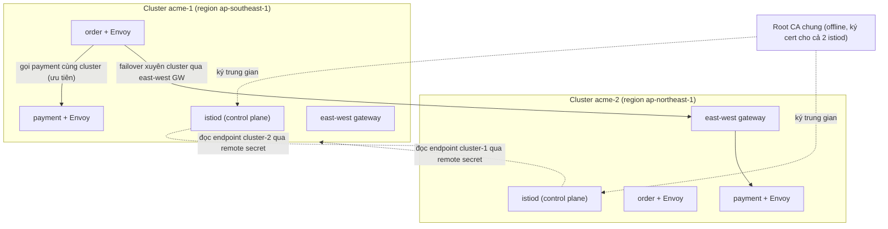
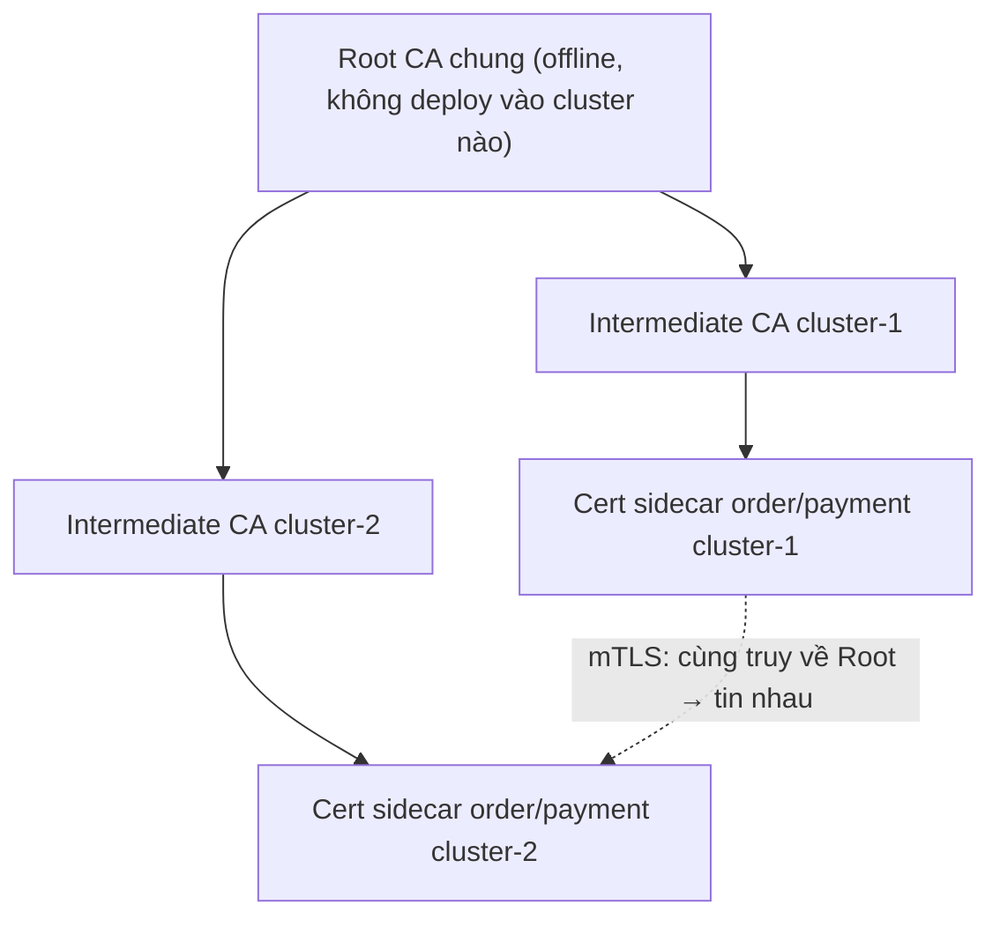

# Multi-Cluster Service Mesh — Mở rộng mesh qua nhiều cluster

> **Tác giả:** Mr.Rom\
> **Phiên bản:** v1.0.0\
> **Tạo lúc:** 13/06/2026\
> **Cập nhật:** 13/06/2026\
> **Level:** Intermediate\
> **Tags:** service-mesh, istio, multi-cluster, multi-primary, primary-remote, trust-domain, east-west-gateway, locality-failover\
> **Yêu cầu trước:** [Advanced Traffic & Resilience](01_advanced-traffic-and-resilience.md)

> 🎯 *Bài trước bạn đã tinh chỉnh resilience trong **một** cluster: locality LB, retry budget, rate limit, egress. Nhưng một cluster vẫn là một điểm chết duy nhất — region sập là cả Acme sập. Bài này mở mesh ra **nhiều cluster/region**: hai control plane ngang hàng (multi-primary) chia sẻ một root CA chung để mTLS xuyên cluster, đồng bộ endpoint qua remote secret, dẫn traffic giữa cluster bằng east-west gateway, và tự failover cross-cluster khi cả một region chết. Cuối bài bạn nối 2 cluster Acme ở 2 region theo multi-primary và gọi service xuyên cluster tự động — không sửa một dòng code.*

## 🎯 Sau bài này bạn sẽ

- [ ] Giải thích vì sao cần multi-cluster (HA toàn region, giảm geo-latency, cô lập theo compliance) và mesh giúp gì so với "tự nối 2 cluster"
- [ ] Phân biệt **multi-primary** (mỗi cluster một control plane) vs **primary-remote** (một control plane chung), và biết khi nào chọn cái nào
- [ ] Hiểu vì sao **trust domain + root CA chung** là điều kiện sống còn để mTLS hoạt động xuyên cluster
- [ ] Cấu hình **cross-cluster service discovery** bằng **remote secret** (mỗi control plane đọc endpoint của cluster kia)
- [ ] Dựng **east-west gateway** dẫn traffic giữa cluster và phân biệt **single-network** vs **multi-network**
- [ ] Bật **failover cross-cluster** qua locality để region sập tự đổ traffic sang region lành
- [ ] Nối 2 cluster Acme theo multi-primary và verify service gọi xuyên cluster tự động

---

## Tình huống — Acme Shop chỉ có một region, và một sáng thứ Hai nó biến mất

Acme Shop đã chạy Istio mesh production trên một cluster trải 3 zone ở region `ap-southeast-1` (Singapore). Locality LB, mTLS, rate limit — mọi thứ mượt. Cho tới sáng thứ Hai, AWS có sự cố mạng diện rộng ở `ap-southeast-1`: **cả region** mất kết nối control plane gần một tiếng. Locality failover giữa zone vô dụng vì *cả 3 zone* đều nằm trong region chết. Toàn bộ Acme offline. Doanh thu giờ cao điểm sáng = 0.

Ngồi họp post-mortem, đội rút ra ba vấn đề mà một cluster đơn không bao giờ giải quyết được:

- 🔴 **Một region = một điểm chết duy nhất (single point of failure).** Dù bạn trải bao nhiêu zone, khi cloud provider sập cả region (hoặc bạn cần nâng cấp K8s phá huỷ cluster), không có chỗ nào để traffic đổ sang. Cần một region **thứ hai** chạy song song.
- 🐢 **Khách ở xa chịu geo-latency cao.** Acme mở thị trường Nhật/Hàn, nhưng mọi request vẫn bay tới Singapore — thêm 80-120ms mỗi vòng (round-trip) chỉ vì khoảng cách địa lý. Cần một cluster **gần khách** ở `ap-northeast-1` (Tokyo).
- 🔒 **Compliance bắt cô lập dữ liệu.** Một số dữ liệu khách EU theo GDPR phải nằm trong cluster đặt tại EU, không được rời khu vực. Một cluster toàn cầu không tách được ranh giới này.

Sếp chốt: *"Dựng region thứ hai. Service ở region này phải gọi được service region kia **như thể cùng cluster** — và khi một region chết, traffic tự nhảy sang region còn lại. Vẫn mã hoá mTLS xuyên region. Và tuyệt đối không sửa code 40 service."*

Cả ba yêu cầu — HA toàn region, giảm geo-latency, cô lập compliance — đều giải được bằng **multi-cluster service mesh**: nhiều cluster nối thành **một mesh logic duy nhất**, service gọi nhau xuyên cluster bằng đúng tên DNS cũ (`http://payment`), mTLS và discovery do mesh lo hết.

> [!NOTE]
> Bài dùng **Istio** làm ví dụ (mesh hỗ trợ multi-cluster trưởng thành nhất). Hai cluster ví dụ tên `cluster-acme-1` (region `ap-southeast-1`) và `cluster-acme-2` (region `ap-northeast-1`), context kubeconfig tương ứng `cluster-acme-1`/`cluster-acme-2`. Toàn bộ tiền tố region, network là minh hoạ AWS — GCP/Azure có mô hình tương tự.

---

## 1️⃣ Bức tranh lớn — "một mesh" trải trên nhiều cluster nghĩa là gì

Trước khi đụng YAML, phải nắm cho chắc ý tưởng trung tâm — đây là phần trừu tượng nhất của bài. **Multi-cluster mesh không phải "2 mesh nối lại", mà là MỘT mesh logic duy nhất trải vật lý trên nhiều cluster.** Service `order` ở cluster 1 và `payment` ở cluster 2 nhìn nhau y như cùng một cluster: cùng tên DNS, cùng mTLS, cùng policy.

Để làm được điều "ảo diệu" đó, ba mảnh phải khớp nhau:

- **Danh tính chung** — service ở hai cluster phải có cert do **cùng một root CA** ký, nếu không mTLS giữa chúng sẽ thất bại (mỗi bên không tin cert bên kia).
- **Discovery chung** — control plane của mỗi cluster phải **biết endpoint của cluster kia**, để khi `order` gọi `payment`, Envoy của nó có trong danh sách cả Pod payment ở cluster 1 lẫn cluster 2.
- **Đường đi chung** — phải có một lối vật lý cho traffic chui từ cluster này sang cluster kia (east-west gateway), vì hai cluster thường ở hai mạng tách biệt.

🪞 **Ẩn dụ**: *Hãy hình dung mesh như **một công ty có 2 văn phòng ở 2 thành phố**. Để nhân viên 2 văn phòng làm việc "như cùng một công ty": (1) phải dùng chung **một loại thẻ nhân viên** do cùng phòng nhân sự cấp (root CA chung) — nếu mỗi văn phòng tự in thẻ riêng, bảo vệ bên kia không công nhận; (2) phải có **danh bạ nội bộ chung** liệt kê người ở cả 2 nơi (cross-cluster discovery); (3) phải có **một cầu nối** giữa 2 toà nhà để người qua lại (east-west gateway).*

Sơ đồ dưới ghép cả 3 mảnh vào một mesh 2 cluster theo mô hình multi-primary (mỗi cluster có control plane riêng). Đây là khung xương cả bài sẽ lấp dần từng phần.



Điểm mấu chốt: `order` ở cluster 1 **không biết** payment nó vừa gọi nằm cluster nào. Envoy của nó có một danh sách endpoint payment gộp từ cả 2 cluster (nhờ remote secret), ưu tiên cùng cluster/zone (nhờ locality LB của bài trước), và chỉ "nhảy" sang cluster 2 qua east-west gateway khi cluster 1 hết endpoint khoẻ. App `order` vẫn chỉ gọi `http://payment` như chưa từng có cluster thứ hai.

---

## 2️⃣ Vì sao multi-cluster — và mesh hơn gì "tự nối 2 cluster"

Trước khi đi sâu kỹ thuật, làm rõ ba động lực đẩy người ta lên multi-cluster — vì chúng quyết định bạn chọn mô hình nào (section 3).

🪞 **Ẩn dụ tiếp nối**: *Quay lại "công ty 2 văn phòng" — vì sao một công ty mở văn phòng thứ hai? Để **không sập khi toà nhà chính cháy** (HA), để **gần khách hàng vùng khác** (geo-latency), và đôi khi vì **luật bắt dữ liệu vùng nào ở lại vùng đó** (compliance).*

Ba lý do chính, kèm điều multi-cluster giải mà single-cluster không:

| Động lực | Vấn đề của single-cluster | Multi-cluster giải thế nào |
|---|---|---|
| **HA toàn region** | Region/cluster sập → toàn bộ offline; nâng cấp K8s phá cluster → downtime | Region thứ hai chạy song song; region chết → traffic tự failover sang region lành |
| **Geo-latency** | Mọi khách bay tới một region → khách xa chịu 80-120ms thêm mỗi vòng | Cluster đặt gần khách (Tokyo, Frankfurt); request đi tới cluster gần nhất |
| **Isolation / compliance** | Dữ liệu mọi vùng trộn trong một cluster → vi phạm GDPR/data residency | Mỗi vùng một cluster, dữ liệu ở lại đúng ranh giới pháp lý |
| **Tách team / blast radius** | Một cluster chung → lỗi của team A có thể lan sang team B | Mỗi team/môi trường một cluster, vẫn nằm chung một mesh để giao tiếp |

Câu hỏi tự nhiên: *"K8s đã có federation, mình tự dựng VPN nối 2 cluster rồi gọi nhau qua IP không được sao?"* Được, nhưng bạn sẽ phải tự làm tay tất cả những gì mesh làm sẵn:

- **Tự quản cert mTLS xuyên cluster** — không thì traffic giữa region chạy plaintext, hoặc bạn tự xoay cert thủ công.
- **Tự đồng bộ endpoint** — Pod IP đổi liên tục; bạn phải tự viết bộ đồng bộ "Pod payment ở cluster 2 đang ở IP nào".
- **Tự làm locality failover** — tự viết logic "cùng region trước, region chết thì đổ sang region kia".
- **Tự áp policy nhất quán** — VirtualService/AuthorizationPolicy phải đồng bộ tay trên cả 2 cluster.

Mesh gói toàn bộ những việc đó vào hạ tầng. Bạn khai báo một lần, mọi service hưởng — đúng tinh thần "không sửa code service" mà bài Basic đã đặt ra.

> [!IMPORTANT]
> Multi-cluster mesh **tăng độ phức tạp vận hành rõ rệt**: thêm root CA chung, thêm east-west gateway, thêm remote secret cần xoay khi cluster đổi. Đừng lên multi-cluster chỉ vì "nghe hay". Chỉ làm khi bạn thật sự cần một trong các động lực ở bảng trên — đặc biệt là HA toàn region.

---

## 3️⃣ Hai mô hình triển khai — multi-primary vs primary-remote

Đây là quyết định kiến trúc lớn nhất của bài: control plane (`istiod`) đặt ở đâu? Istio cho hai mô hình chính.

🪞 **Ẩn dụ**: *Quay lại "2 văn phòng". **Multi-primary** giống mỗi văn phòng có **một phòng nhân sự riêng** — tự cấp thẻ, tự quản nhân viên tại chỗ; văn phòng A sập thì văn phòng B vẫn tự vận hành đầy đủ. **Primary-remote** giống chỉ **một phòng nhân sự ở trụ sở chính** lo cho cả hai — văn phòng phụ chỉ có nhân viên, mọi việc nhân sự gọi về trụ sở; gọn nhẹ hơn nhưng trụ sở sập thì văn phòng phụ "mồ côi".*

### Multi-primary — mỗi cluster một control plane

Trong **multi-primary**, mỗi cluster chạy `istiod` riêng. Mỗi `istiod` quản data plane (sidecar) trong cluster của mình, **và** đọc endpoint cluster kia qua remote secret. Đây là mô hình HA cao nhất: control plane một cluster chết, cluster kia vẫn vận hành đầy đủ vì có control plane riêng.

### Primary-remote — một control plane chung

Trong **primary-remote**, chỉ cluster *primary* chạy `istiod`. Cluster *remote* không có control plane — sidecar của nó gọi về `istiod` của primary (qua east-west gateway) để xin config và cert. Nhẹ hơn (một control plane), nhưng nếu cluster primary chết, cluster remote mất nguồn config — Pod đang chạy vẫn sống nhưng không nhận config/cert mới được.

### Chọn cái nào?

Bảng dưới so sánh để bạn quyết theo nhu cầu thật. Đây là phần "WHEN" — đọc kỹ trước khi cài.

| Tiêu chí | **Multi-primary** | **Primary-remote** |
|---|---|---|
| Control plane | Mỗi cluster một `istiod` | Chỉ primary có `istiod` |
| Chịu lỗi control plane | Cao — cluster nào cũng tự đứng được | Thấp hơn — primary chết, remote mất nguồn config |
| Chi phí vận hành | Cao hơn (N control plane) | Thấp hơn (1 control plane) |
| Độ trễ lấy config | Thấp (config tại chỗ) | Cao hơn (remote gọi qua gateway) | 
| Khi nên chọn | HA nghiêm ngặt, mỗi region phải tự đứng được | Tiết kiệm tài nguyên, cluster phụ nhỏ, primary rất ổn định |

→ Acme cần HA toàn region nghiêm ngặt (region nào chết cũng phải tự đứng), nên chọn **multi-primary**. Phần hands-on cuối bài đi theo multi-primary. Primary-remote chỉ là một biến thể cài đặt — hiểu nguyên lý thì chuyển đổi không khó.

> [!NOTE]
> Ngoài 2 mô hình trên, còn trục **single-network vs multi-network** (section 6) — đó là câu hỏi *mạng* (2 cluster có thông IP trực tiếp không), độc lập với câu hỏi *control plane* (multi-primary vs primary-remote). Bạn có thể ghép: multi-primary + multi-network (phổ biến nhất cho 2 region tách mạng), hay multi-primary + single-network (2 cluster cùng VPC).

---

## 4️⃣ Trust domain + root CA chung — nền móng của mTLS xuyên cluster

Đây là bước **dễ bị bỏ sót nhất** và là nguyên nhân số một khiến multi-cluster "cài xong mà gọi nhau toàn lỗi TLS". Phải làm trước mọi thứ khác.

Nhớ lại bài Basic: mỗi `istiod` đóng vai CA (Certificate Authority — tổ chức cấp chứng chỉ) ký cert cho sidecar trong cluster mình. Vấn đề: nếu cài Istio mặc định trên 2 cluster, **mỗi `istiod` tự sinh một root CA riêng, khác nhau**. Khi `order` (cert ký bởi CA cluster 1) bắt tay mTLS với `payment` (cert ký bởi CA cluster 2), mỗi bên không tin CA của bên kia → bắt tay thất bại → mọi cuộc gọi xuyên cluster chết.

🪞 **Ẩn dụ tiếp nối**: *Hai văn phòng tự in thẻ nhân viên với con dấu khác nhau → bảo vệ văn phòng B nhìn thẻ văn phòng A thấy "con dấu lạ", không cho vào. Giải pháp: **một phòng nhân sự tổng** (root CA chung) in con dấu gốc, mỗi văn phòng được cấp một "con dấu con" (cert trung gian) bắt nguồn từ con dấu gốc đó. Giờ mọi thẻ đều truy về cùng một gốc → bảo vệ hai bên đều công nhận.*

### Cây chứng chỉ cần dựng

Mô hình chuẩn: **một root CA chung (offline, giữ an toàn)** ký **một cert trung gian (intermediate) riêng cho mỗi cluster**. Mỗi `istiod` dùng cert trung gian của cluster mình để ký cert sidecar. Vì cả hai intermediate đều bắt nguồn từ cùng root, cert sidecar 2 cluster cùng một "cây tin cậy" → mTLS xuyên cluster thành công.



Sơ đồ cho thấy điều cốt lõi: dù cert sidecar hai cluster do hai intermediate khác nhau ký, chúng **chung một root** — nên khi verify chuỗi cert (cert chain), mỗi bên đều lần ngược tới cùng root và chấp nhận. Đây là điều kiện *bắt buộc*, không có nó multi-cluster không thể có mTLS.

### Nạp cert vào mỗi cluster

Istio đọc bộ cert CA này từ một Secret tên cố định `cacerts` trong namespace `istio-system`, **trước khi** cài `istiod`. Bộ Istio kèm script tạo cert demo (`tools/certs/Makefile.selfsigned.mk`) — production thì dùng PKI thật của tổ chức. Các bước:

```bash
# 1. Sinh root CA chung (1 lần, giữ an toàn — KHÔNG commit, KHÔNG deploy root key vào cluster)
make -f tools/certs/Makefile.selfsigned.mk root-ca

# 2. Sinh intermediate cert riêng cho từng cluster (ký bởi root ở bước 1)
make -f tools/certs/Makefile.selfsigned.mk cluster-acme-1-cacerts
make -f tools/certs/Makefile.selfsigned.mk cluster-acme-2-cacerts
```

Sau đó nạp intermediate của từng cluster vào Secret `cacerts` của cluster tương ứng (làm **trước** khi `istioctl install`):

```bash
# Tạo namespace istio-system trước trên mỗi cluster
kubectl --context="cluster-acme-1" create namespace istio-system
kubectl --context="cluster-acme-2" create namespace istio-system

# Nạp cert chain của cluster-1 vào Secret cacerts của cluster-1
kubectl --context="cluster-acme-1" create secret generic cacerts -n istio-system \
  --from-file=cluster-acme-1/ca-cert.pem \
  --from-file=cluster-acme-1/ca-key.pem \
  --from-file=cluster-acme-1/root-cert.pem \
  --from-file=cluster-acme-1/cert-chain.pem

# Tương tự cho cluster-2 (intermediate khác, nhưng root-cert.pem GIỐNG HỆT)
kubectl --context="cluster-acme-2" create secret generic cacerts -n istio-system \
  --from-file=cluster-acme-2/ca-cert.pem \
  --from-file=cluster-acme-2/ca-key.pem \
  --from-file=cluster-acme-2/root-cert.pem \
  --from-file=cluster-acme-2/cert-chain.pem
```

Kết quả mong đợi (lặp lại tương tự cho cả 2 context):

```text
namespace/istio-system created
namespace/istio-system created
secret/cacerts created
secret/cacerts created
```

Điểm sống còn: `root-cert.pem` trong cả 2 Secret phải **giống hệt nhau** (cùng một root), còn `ca-cert.pem`/`ca-key.pem` (intermediate) thì khác nhau cho mỗi cluster. Sai chỗ này — ví dụ quên nạp `cacerts` để `istiod` tự sinh root riêng — là lỗi multi-cluster kinh điển: cài xong, mọi cuộc gọi xuyên cluster báo TLS handshake failure.

### Trust domain phải khớp

Bên cạnh root CA, còn một thứ phải đồng nhất: **trust domain** (miền tin cậy). Đây là tiền tố của SPIFFE ID (`spiffe://<trust-domain>/...`, bài Basic). Mặc định Istio là `cluster.local`. Trong một mesh đa cluster, mọi cluster phải dùng **cùng một trust domain** — nếu cluster 1 là `cluster.local` còn cluster 2 là `acme.internal`, danh tính 2 bên khác "miền" → AuthorizationPolicy theo principal sẽ không khớp xuyên cluster.

→ Tóm lại nền móng: **một root CA chung + một trust domain chung**. Dựng xong hai cái này, mới sang bước cho các cluster "nhìn thấy" nhau.

---

## 5️⃣ Cross-cluster service discovery — remote secret

Đã có danh tính chung (root CA). Giờ tới mảnh thứ hai: mỗi `istiod` phải **biết endpoint của cluster kia**. Đây là phần làm cho `payment` ở cluster 2 "xuất hiện" trong danh sách endpoint mà Envoy của `order` ở cluster 1 nhìn thấy.

🪞 **Ẩn dụ tiếp nối**: *Hai văn phòng đã dùng chung con dấu, nhưng văn phòng A vẫn chưa có **danh bạ** của văn phòng B — không biết bên kia có ai, ngồi đâu. **Remote secret** chính là việc đưa cho phòng nhân sự văn phòng A một "chìa khoá đọc danh bạ" của văn phòng B (và ngược lại). Từ đó mỗi bên thấy đủ nhân viên cả hai nơi trong một danh bạ gộp.*

### Remote secret là gì

**Remote secret** là một Secret chứa **kubeconfig có quyền đọc** (read-only) tới API server của cluster kia. Khi bạn nạp remote secret của cluster 2 vào cluster 1, `istiod` của cluster 1 dùng nó để **watch** các Service/Endpoint trong cluster 2, rồi gộp endpoint đó vào discovery của mình. Kết quả: sidecar trong cluster 1 nhận được danh sách endpoint `payment` gồm **cả Pod ở cluster 1 lẫn cluster 2**.

Vì là multi-primary (mỗi cluster có control plane riêng), remote secret phải nạp **hai chiều**: cluster 1 đọc cluster 2, *và* cluster 2 đọc cluster 1.

### Tạo và nạp remote secret

`istioctl` có lệnh chuyên dụng sinh remote secret từ một context, rồi bạn apply nó vào cluster còn lại:

```bash
# 1. Sinh remote secret CHO cluster-2, rồi nạp VÀO cluster-1
#    → istiod cluster-1 sẽ đọc được endpoint của cluster-2
istioctl create-remote-secret \
  --context="cluster-acme-2" \
  --name=cluster-acme-2 \
  | kubectl apply -f - --context="cluster-acme-1"

# 2. Chiều ngược lại: sinh remote secret CHO cluster-1, nạp VÀO cluster-2
istioctl create-remote-secret \
  --context="cluster-acme-1" \
  --name=cluster-acme-1 \
  | kubectl apply -f - --context="cluster-acme-2"
```

Kết quả mong đợi (mỗi lệnh tạo một Secret trong `istio-system`):

```text
secret/istio-remote-secret-cluster-acme-2 created
secret/istio-remote-secret-cluster-acme-1 created
```

Xác nhận remote secret đã có mặt — Istio gắn label `istio/multiCluster=true` cho loại Secret này:

```bash
kubectl --context="cluster-acme-1" get secrets -n istio-system -l istio/multiCluster=true
```

Kết quả mong đợi (cluster-1 đang giữ secret đọc cluster-2):

```text
NAME                                       TYPE     DATA   AGE
istio-remote-secret-cluster-acme-2         Opaque   1      20s
```

Dòng này xác nhận `istiod` của cluster 1 đã có "chìa khoá" đọc danh bạ cluster 2. Cột `DATA 1` là kubeconfig nhúng bên trong. Từ giờ, mọi Service tồn tại ở cả 2 cluster (cùng tên, cùng namespace) sẽ được `istiod` cluster 1 coi là **một service logic duy nhất** với endpoint gộp.

> [!WARNING]
> Remote secret chứa credential đọc cluster kia — coi nó như bí mật cấp cao. Khi credential của cluster đổi (xoay token, đổi API server endpoint), remote secret **cũ sẽ hỏng âm thầm**: discovery xuyên cluster ngừng cập nhật mà không báo lỗi rõ ràng, endpoint dần "đóng băng". Phải sinh lại remote secret mỗi khi credential cluster thay đổi.

### Điều kiện để service được "gộp" xuyên cluster

Hai service ở hai cluster chỉ được mesh coi là *một* khi chúng **cùng namespace và cùng tên Service**. Acme phải đảm bảo `payment` ở cả 2 cluster đều nằm namespace `acme` và tên Service đều là `payment`. Nếu cluster 2 đặt tên `payment-v2` hay namespace `acme-jp`, mesh coi đó là service *khác* — không gộp endpoint, không failover xuyên cluster.

→ Có danh tính chung (root CA) và danh bạ chung (remote secret), nhưng giữa 2 region thường là 2 mạng tách biệt — IP Pod cluster 1 không route thẳng tới Pod cluster 2. Cần một "cây cầu" vật lý: east-west gateway.

---

## 6️⃣ Single-network vs multi-network + east-west gateway

Câu hỏi *mạng* tách hẳn câu hỏi *control plane*. Trước khi cài gateway, phải biết 2 cluster của bạn thuộc loại nào.

### Single-network vs multi-network

- **Single-network**: 2 cluster nằm **chung một mạng phẳng** — Pod cluster 1 có thể route trực tiếp tới IP Pod cluster 2 (vd cùng VPC, peering đầy đủ, không trùng dải IP). Traffic xuyên cluster đi **thẳng** Pod-to-Pod, không cần gateway trung gian.
- **Multi-network**: 2 cluster ở **2 mạng tách biệt** — IP Pod không route thẳng được (2 region khác nhau, hoặc trùng dải CIDR). Traffic xuyên cluster phải qua một **east-west gateway** làm điểm vào/ra.

🪞 **Ẩn dụ**: *Single-network giống 2 toà nhà có **hành lang nối thẳng** ở mỗi tầng — đi từ phòng này sang phòng kia thoải mái. Multi-network giống 2 toà nhà cách con đường — muốn qua phải đi xuống **một cây cầu vượt duy nhất** (east-west gateway) rồi mới lên toà bên kia.*

Bảng quyết định nhanh:

| Đặc điểm | **Single-network** | **Multi-network** |
|---|---|---|
| IP Pod 2 cluster | Route thẳng được | Không route thẳng |
| Đường traffic xuyên cluster | Thẳng Pod-to-Pod | Qua east-west gateway |
| Cần east-west gateway? | Không bắt buộc | **Bắt buộc** |
| Phù hợp | 2 cluster cùng VPC/region | 2 cluster khác region (case Acme) |

Acme có 2 region cách xa (Singapore ↔ Tokyo), mạng tách biệt → **multi-network**, bắt buộc east-west gateway.

### East-west gateway là gì

Bạn đã quen *ingress gateway* (north-south — traffic từ ngoài Internet vào mesh). **East-west gateway** là một loại gateway khác chuyên cho **traffic giữa các cluster trong cùng mesh** (đông-tây, ngang hàng). Nó nhận traffic mTLS từ cluster kia và chuyển tiếp tới Pod đích trong cluster mình.

Điểm tinh tế quan trọng: east-west gateway dùng chế độ TLS **`AUTO_PASSTHROUGH`**. Khác ingress thường (terminate TLS rồi route theo HTTP host/path), east-west gateway **không giải mã** traffic — nó đọc thông tin định tuyến từ **SNI** (Server Name Indication — tên service nhúng trong phần đầu bắt tay TLS) và chuyển tiếp gói đã mã hoá thẳng tới đích. Nhờ vậy mTLS vẫn đầu-cuối: traffic mã hoá từ Envoy nguồn tới Envoy đích, gateway chỉ là trạm trung chuyển không thấy nội dung.

### Cài east-west gateway + đánh dấu network

Mỗi cluster trong mô hình multi-network cần (1) được gán nhãn **network** để mesh biết nó thuộc mạng nào, và (2) một east-west gateway. Trước hết gán nhãn network cho namespace `istio-system` (làm trước khi cài, để injection biết network):

```bash
# Gán nhãn network cho mỗi cluster — tên network phải KHÁC nhau giữa 2 cluster
kubectl --context="cluster-acme-1" label namespace istio-system \
  topology.istio.io/network=network-ap-southeast-1

kubectl --context="cluster-acme-2" label namespace istio-system \
  topology.istio.io/network=network-ap-northeast-1
```

Bộ Istio kèm script sinh manifest east-west gateway theo network. Cài gateway cho từng cluster (script `gen-eastwest-gateway.sh` nằm trong `samples/multicluster/` của bản phân phối Istio):

```bash
# East-west gateway cho cluster-1 (network-ap-southeast-1)
samples/multicluster/gen-eastwest-gateway.sh \
  --network network-ap-southeast-1 \
  | istioctl --context="cluster-acme-1" install -y -f -

# East-west gateway cho cluster-2 (network-ap-northeast-1)
samples/multicluster/gen-eastwest-gateway.sh \
  --network network-ap-northeast-1 \
  | istioctl --context="cluster-acme-2" install -y -f -
```

Kết quả mong đợi (rút gọn, lặp cho mỗi cluster):

```text
✔ Ingress gateways installed
✔ Installation complete
```

Kiểm tra east-west gateway đã chạy và có địa chỉ ngoài (LoadBalancer IP để cluster kia gọi tới):

```bash
kubectl --context="cluster-acme-1" get svc istio-eastwestgateway -n istio-system
```

Kết quả mong đợi (cột `EXTERNAL-IP` phải có IP/hostname, không được `<pending>`):

```text
NAME                    TYPE           CLUSTER-IP      EXTERNAL-IP      PORT(S)
istio-eastwestgateway   LoadBalancer   10.96.120.45    52.74.10.20      15021:31...,15443:30...,...
```

Cột `EXTERNAL-IP` có giá trị thật (`52.74.10.20`) là dấu hiệu gateway sẵn sàng nhận traffic từ cluster kia. Port `15443` là cổng `AUTO_PASSTHROUGH` chuyên cho traffic cross-network. Nếu thấy `<pending>`, LoadBalancer chưa cấp IP — kiểm tra cloud provider hỗ trợ Service type LoadBalancer.

### Mở (expose) service qua east-west gateway

Cuối cùng, cần một `Gateway` khai báo cho phép service `.local` (service nội mesh) đi qua east-west gateway. Đây là bước "mở cửa cầu" cho traffic cross-network:

```yaml
# expose-services.yaml — cho phép service mesh đi qua east-west gateway (apply ở MỖI cluster)
apiVersion: networking.istio.io/v1
kind: Gateway
metadata:
  name: cross-network-gateway
  namespace: istio-system
spec:
  selector:
    istio: eastwestgateway          # chọn east-west gateway vừa cài
  servers:
    - port:
        number: 15443
        name: tls
        protocol: TLS
      tls:
        mode: AUTO_PASSTHROUGH      # KHÔNG giải mã — định tuyến theo SNI, giữ mTLS đầu-cuối
      hosts:
        - "*.local"                 # mọi service nội mesh (đuôi .local)
```

Apply ở cả 2 cluster:

```bash
kubectl --context="cluster-acme-1" apply -f expose-services.yaml
kubectl --context="cluster-acme-2" apply -f expose-services.yaml
```

Kết quả mong đợi:

```text
gateway.networking.istio.io/cross-network-gateway created
gateway.networking.istio.io/cross-network-gateway created
```

Từ giây phút này, ba mảnh đã đủ: **danh tính chung** (root CA), **danh bạ chung** (remote secret), **cầu nối vật lý** (east-west gateway + expose). Một service ở cluster 1 đã có thể gọi service cùng tên ở cluster 2 — mTLS, qua gateway, tự động.

---

## 7️⃣ Failover cross-cluster qua locality

Multi-cluster mới chỉ cho service "gọi được" xuyên cluster. Nhưng mục tiêu HA của Acme là: **bình thường gọi cùng cluster (nhanh, không tốn phí cross-region), chỉ khi cluster mình hết endpoint khoẻ mới đổ sang cluster kia.** Đây chính là **locality failover** của bài trước, giờ áp ở cấp cluster/region.

🪞 **Ẩn dụ tiếp nối**: *Văn phòng A có việc cần xử lý → ưu tiên giao cho nhân viên **ngay tại văn phòng A** (cùng region, nhanh). Chỉ khi cả văn phòng A nghỉ (region sập) mới chuyển việc sang **văn phòng B** qua cây cầu. Không ai gửi việc xuyên thành phố khi người ngồi cạnh đang rảnh.*

### Locality tự nhiên có sẵn nhờ network label

Tin tốt: khi bạn đã gán nhãn network và 2 cluster ở 2 region khác nhau, Istio **tự** hiểu Pod cluster 1 và cluster 2 thuộc 2 locality (region) khác nhau — đọc từ label node `topology.kubernetes.io/region` (bài trước). Locality LB mặc định đã **ưu tiên cùng region** rồi: traffic ở lại cluster mình chừng nào còn endpoint khoẻ.

Nhưng — đúng như bài trước đã nhấn — **failover chỉ kích hoạt khi có outlier detection**. Không có nó, Envoy coi mọi endpoint khoẻ vĩnh viễn → khi cả cluster 1 sập, traffic vẫn cố gửi vào cluster 1 → lỗi hàng loạt thay vì nhảy sang cluster 2.

### DestinationRule cho failover cấp region

Áp DestinationRule với locality failover + outlier detection cho `payment`, khai báo region nào hỏng thì đổ sang region nào. Apply ở cả 2 cluster (cấu hình giống nhau để hành vi đối xứng):

```yaml
# payment-dr-failover.yaml — failover cấp region + outlier (BẮT BUỘC đi cặp)
apiVersion: networking.istio.io/v1
kind: DestinationRule
metadata:
  name: payment
  namespace: acme
spec:
  host: payment.acme.svc.cluster.local
  trafficPolicy:
    loadBalancer:
      simple: LEAST_REQUEST
      localityLbSetting:
        enabled: true
        failover:                       # region nguồn hỏng → đổ sang region đích
          - from: ap-southeast-1        # cluster-1 hỏng...
            to: ap-northeast-1          # ...failover sang cluster-2
          - from: ap-northeast-1        # và chiều ngược lại
            to: ap-southeast-1
    outlierDetection:                   # BẮT BUỘC — thiếu cái này failover không chạy
      consecutive5xxErrors: 5
      interval: 5s
      baseEjectionTime: 30s
      maxEjectionPercent: 100           # cho eject 100% endpoint của region sập
```

Apply ở cả 2 cluster:

```bash
kubectl --context="cluster-acme-1" apply -f payment-dr-failover.yaml
kubectl --context="cluster-acme-2" apply -f payment-dr-failover.yaml
```

Kết quả mong đợi:

```text
destinationrule.networking.istio.io/payment created
destinationrule.networking.istio.io/payment created
```

### Verify endpoint xuyên cluster

Để chứng minh Envoy của `order` cluster 1 thật sự thấy endpoint payment ở **cả 2 cluster**, soi endpoint cluster của nó:

```bash
ORDER_POD=$(kubectl --context="cluster-acme-1" get pod -n acme -l app=order -o jsonpath='{.items[0].metadata.name}')
istioctl --context="cluster-acme-1" proxy-config endpoint "$ORDER_POD" -n acme \
  --cluster "outbound|8080||payment.acme.svc.cluster.local"
```

Kết quả mong đợi (endpoint nội cluster có IP Pod thật; endpoint cluster kia trỏ qua east-west gateway):

```text
ENDPOINT                STATUS      OUTLIER CHECK     CLUSTER
10.1.0.21:8080          HEALTHY     OK                outbound|8080||payment.acme.svc.cluster.local
10.1.0.55:8080          HEALTHY     OK                outbound|8080||payment.acme.svc.cluster.local
52.196.40.11:15443      HEALTHY     OK                outbound|8080||payment.acme.svc.cluster.local
```

Hai dòng đầu (`10.1.x.x`) là Pod payment **trong cluster 1** — locality gần, ưu tiên gọi. Dòng cuối (`52.196.40.11:15443`) là **east-west gateway của cluster 2** — Envoy biết đây là đường tới payment cluster 2 nhưng để dành cho failover. `STATUS HEALTHY` cho thấy mesh đã "nhìn thấy" endpoint xuyên cluster. Khi cả cluster 1 trả lỗi, outlier detection eject 2 dòng đầu → traffic dồn vào dòng cuối → tự sang cluster 2. Đây chính là HA toàn region.

> [!CAUTION]
> `maxEjectionPercent: 100` cho phép eject toàn bộ endpoint một region — đúng ý đồ khi region thật sự sập. Nhưng nếu outlier detection quá nhạy gặp một lỗi *toàn cục* (vd bug deploy mới làm payment cả 2 region cùng trả 5xx), nó có thể eject sạch **cả hai** cluster cùng lúc → tê liệt hoàn toàn. Cân ngưỡng `consecutive5xxErrors`/`interval` theo SLO thật và luôn test failover ở staging trước.

---

## 8️⃣ Hands-on — nối 2 cluster Acme, gọi service xuyên cluster tự động

Giờ ráp tất cả thành một mạch: nối `cluster-acme-1` và `cluster-acme-2` theo **multi-primary multi-network**, deploy `payment` ở cả hai, rồi **chứng minh** `order` ở cluster 1 gọi được `payment` ở cluster 2 khi cluster 1 không có payment.

### 🛠️ Bước 1: Nền cert chung + cài Istio multi-primary

Phần cert đã làm ở §4 (cùng root CA, Secret `cacerts` trên mỗi cluster). Giờ cài `istiod` đa cluster bằng IstioOperator, khai báo `meshID`, `clusterName`, `network` cho từng cluster:

```yaml
# istio-cluster-acme-1.yaml — control plane cho cluster-1 (multi-primary)
apiVersion: install.istio.io/v1alpha1
kind: IstioOperator
metadata:
  name: cluster-acme-1
spec:
  values:
    global:
      meshID: acme-mesh                       # CÙNG meshID trên cả 2 cluster
      multiCluster:
        clusterName: cluster-acme-1           # tên cluster (khác nhau)
      network: network-ap-southeast-1         # network của cluster này
```

```yaml
# istio-cluster-acme-2.yaml — control plane cho cluster-2 (multi-primary)
apiVersion: install.istio.io/v1alpha1
kind: IstioOperator
metadata:
  name: cluster-acme-2
spec:
  values:
    global:
      meshID: acme-mesh                       # CÙNG meshID
      multiCluster:
        clusterName: cluster-acme-2           # tên khác
      network: network-ap-northeast-1         # network khác
```

Cài lên từng cluster:

```bash
istioctl --context="cluster-acme-1" install -y -f istio-cluster-acme-1.yaml
istioctl --context="cluster-acme-2" install -y -f istio-cluster-acme-2.yaml
```

Kết quả mong đợi (rút gọn, mỗi cluster):

```text
✔ Istio core installed
✔ Istiod installed
✔ Installation complete
```

Điểm sống còn ở bước này: `meshID: acme-mesh` phải **giống hệt** trên cả 2 cluster (cùng một mesh logic), còn `clusterName` và `network` phải **khác nhau** (để mesh phân biệt và làm locality). Vì đã nạp `cacerts` chung từ §4, cả 2 `istiod` ký cert từ cùng một root.

### 🛠️ Bước 2: East-west gateway + remote secret hai chiều

Cài east-west gateway (§6) và nạp remote secret hai chiều (§5) — gộp lại để dễ theo dõi:

```bash
# 1. East-west gateway cho mỗi cluster
samples/multicluster/gen-eastwest-gateway.sh --network network-ap-southeast-1 \
  | istioctl --context="cluster-acme-1" install -y -f -
samples/multicluster/gen-eastwest-gateway.sh --network network-ap-northeast-1 \
  | istioctl --context="cluster-acme-2" install -y -f -

# 2. Mở service .local qua east-west gateway (file §6)
kubectl --context="cluster-acme-1" apply -f expose-services.yaml
kubectl --context="cluster-acme-2" apply -f expose-services.yaml

# 3. Remote secret hai chiều
istioctl create-remote-secret --context="cluster-acme-2" --name=cluster-acme-2 \
  | kubectl apply -f - --context="cluster-acme-1"
istioctl create-remote-secret --context="cluster-acme-1" --name=cluster-acme-1 \
  | kubectl apply -f - --context="cluster-acme-2"
```

Kết quả mong đợi (dòng cuối quan trọng nhất — remote secret tạo thành công):

```text
secret/istio-remote-secret-cluster-acme-2 created
secret/istio-remote-secret-cluster-acme-1 created
```

### 🛠️ Bước 3: Deploy service ở 2 cluster

Để chứng minh cross-cluster rõ ràng, ta cố tình **chỉ deploy `payment` ở cluster 2**, còn `order` (Pod gọi thử) ở cluster 1. Cả hai phải cùng namespace `acme`, cùng tên Service `payment`. Trước hết tạo namespace + bật injection ở cả 2 cluster:

```bash
for ctx in cluster-acme-1 cluster-acme-2; do
  kubectl --context="$ctx" create namespace acme
  kubectl --context="$ctx" label namespace acme istio-injection=enabled
done
```

Kết quả mong đợi:

```text
namespace/acme created
namespace/acme labeled
namespace/acme created
namespace/acme labeled
```

Deploy `payment` **chỉ ở cluster 2** (text trả về ghi rõ region để ta nhận biết Pod đang phục vụ là của cluster nào):

```yaml
# payment-cluster2.yaml — payment chỉ tồn tại ở cluster-2
apiVersion: v1
kind: ServiceAccount
metadata:
  name: payment-sa
  namespace: acme
---
apiVersion: apps/v1
kind: Deployment
metadata:
  name: payment
  namespace: acme
spec:
  replicas: 1
  selector:
    matchLabels:
      app: payment
  template:
    metadata:
      labels:
        app: payment
    spec:
      serviceAccountName: payment-sa
      containers:
        - name: payment
          image: hashicorp/http-echo:1.0
          args: ["-text=charged from cluster-acme-2 (ap-northeast-1)", "-listen=:8080"]
          ports:
            - containerPort: 8080
---
apiVersion: v1
kind: Service
metadata:
  name: payment
  namespace: acme
spec:
  selector:
    app: payment
  ports:
    - port: 8080
      targetPort: 8080
```

Quan trọng cho cross-cluster discovery: ngay cả khi cluster **không có Pod** payment, vẫn nên tạo **Service `payment`** (không có endpoint) ở cluster đó, để mesh "biết tên" và route ra cluster kia. Tạo Service payment "rỗng" ở cluster 1 + Pod `order` để gọi thử:

```yaml
# order-cluster1.yaml — order ở cluster-1 + Service payment rỗng (chỉ để route xuyên cluster)
apiVersion: v1
kind: ServiceAccount
metadata:
  name: order-sa
  namespace: acme
---
apiVersion: apps/v1
kind: Deployment
metadata:
  name: order
  namespace: acme
spec:
  replicas: 1
  selector:
    matchLabels:
      app: order
  template:
    metadata:
      labels:
        app: order
    spec:
      serviceAccountName: order-sa
      containers:
        - name: order
          image: curlimages/curl:8.7.1
          command: ["sleep", "infinity"]     # giữ Pod sống để exec vào gọi thử
---
apiVersion: v1
kind: Service
metadata:
  name: payment                  # cùng tên Service như cluster-2 (KHÔNG có Pod ở đây)
  namespace: acme
spec:
  selector:
    app: payment
  ports:
    - port: 8080
      targetPort: 8080
```

Apply mỗi file vào đúng cluster:

```bash
kubectl --context="cluster-acme-2" apply -f payment-cluster2.yaml
kubectl --context="cluster-acme-1" apply -f order-cluster1.yaml
```

Kết quả mong đợi:

```text
serviceaccount/payment-sa created
deployment.apps/payment created
service/payment created
serviceaccount/order-sa created
deployment.apps/order created
service/payment created
```

### 🛠️ Bước 4: Chờ Pod sẵn sàng + xác nhận discovery xuyên cluster

Chờ Pod `2/2` (app + sidecar) ở cả 2 cluster:

```bash
kubectl --context="cluster-acme-1" get pods -n acme
kubectl --context="cluster-acme-2" get pods -n acme
```

Kết quả mong đợi (cluster 1 có `order`, cluster 2 có `payment`, đều `2/2`):

```text
NAME                       READY   STATUS    RESTARTS   AGE
order-6b8c9d-xxxxx         2/2     Running   0          50s

NAME                       READY   STATUS    RESTARTS   AGE
payment-7c9f4a-yyyyy       2/2     Running   0          50s
```

`2/2` xác nhận sidecar đã inject. Giờ kiểm tra Envoy của `order` (cluster 1) có thấy endpoint payment **dù cluster 1 không có Pod payment** không — endpoint duy nhất phải trỏ qua east-west gateway cluster 2:

```bash
ORDER_POD=$(kubectl --context="cluster-acme-1" get pod -n acme -l app=order -o jsonpath='{.items[0].metadata.name}')
istioctl --context="cluster-acme-1" proxy-config endpoint "$ORDER_POD" -n acme \
  --cluster "outbound|8080||payment.acme.svc.cluster.local"
```

Kết quả mong đợi (chỉ có endpoint qua gateway cluster 2 — `15443` là cổng east-west):

```text
ENDPOINT                STATUS      OUTLIER CHECK     CLUSTER
52.196.40.11:15443      HEALTHY     OK                outbound|8080||payment.acme.svc.cluster.local
```

Endpoint `52.196.40.11:15443` (east-west gateway cluster 2) xuất hiện trong cluster của `order` ở cluster 1 — đây là bằng chứng cross-cluster discovery hoạt động. `istiod` cluster 1 đọc Service `payment` của cluster 2 qua remote secret, thấy nó có Pod, và đăng ký đường tới nó qua gateway. Cluster 1 không có Pod payment nên đây là endpoint **duy nhất**.

### 🛠️ Bước 5: Chứng minh — order gọi payment xuyên cluster tự động

Phần thoả mãn nhất. `exec` vào Pod `order` (cluster 1) gọi `http://payment` — request phải bay sang cluster 2 và trả về text của region 2:

```bash
kubectl --context="cluster-acme-1" exec -n acme deploy/order -c order -- \
  curl -s http://payment:8080/
```

Kết quả mong đợi (text do payment **cluster 2** trả về):

```text
charged from cluster-acme-2 (ap-northeast-1)
```

Dòng `charged from cluster-acme-2 (ap-northeast-1)` chứng minh: `order` ở Singapore gọi `http://payment` — đúng cái tên DNS như chưa từng có cluster thứ hai — và mesh tự dẫn request qua east-west gateway sang Tokyo, mTLS đầu-cuối, rồi trả kết quả. App `order` hoàn toàn không biết payment đang ở region khác.

Bắn 10 lần để thấy nó ổn định (không phải may rủi):

```bash
kubectl --context="cluster-acme-1" exec -n acme deploy/order -c order -- \
  sh -c 'for i in $(seq 10); do curl -s http://payment:8080/; echo; done | sort | uniq -c'
```

Kết quả mong đợi:

```text
  10 charged from cluster-acme-2 (ap-northeast-1)
```

Cả 10 request đều sang cluster 2 thành công — vì cluster 1 không có payment nên 100% đi xuyên cluster. Trong thực tế khi *cả hai* cluster đều có payment, locality LB (§7) sẽ ưu tiên cùng cluster và chỉ failover sang cluster kia khi cluster mình hết endpoint khoẻ. Tổng kết: 2 cluster ở 2 region giờ là **một mesh logic**, service gọi nhau xuyên cluster tự động, mTLS xuyên region, không sửa một dòng code service nào.

---

## 💡 Cạm bẫy thường gặp & Best practice

### ❌ Cạm bẫy: mỗi cluster tự sinh root CA riêng → mTLS xuyên cluster chết

- **Triệu chứng**: Cài multi-cluster xong, gọi xuyên cluster báo `TLS handshake failure` / `connection reset`; trong cùng cluster thì bình thường.
- **Nguyên nhân**: Cài Istio mặc định mỗi `istiod` tự sinh một root CA **khác nhau**. Cert sidecar 2 cluster không cùng cây tin cậy → mỗi bên không verify được cert bên kia → bắt tay mTLS thất bại.
- **Cách tránh**: Trước khi `istioctl install`, nạp Secret `cacerts` (intermediate ký bởi **cùng một root CA chung**) vào `istio-system` của **mọi** cluster. `root-cert.pem` phải giống hệt nhau giữa các cluster.

### ❌ Cạm bẫy: Service khác tên/namespace giữa 2 cluster → không gộp, không failover

- **Triệu chứng**: Đã nối cluster, nhưng `order` không bao giờ thấy endpoint payment cluster kia; failover region không kích hoạt.
- **Nguyên nhân**: Mesh chỉ coi 2 service ở 2 cluster là *một* khi **cùng tên Service + cùng namespace**. Đặt `payment` ở `acme` cluster 1 nhưng `payment` ở `acme-jp` cluster 2 (hoặc đổi tên) → mesh coi là 2 service khác → không gộp endpoint.
- **Cách tránh**: Giữ tên Service và namespace **đồng nhất** tuyệt đối giữa các cluster cho mọi service cần gọi xuyên cluster.

### ❌ Cạm bẫy: locality failover bật nhưng quên outlier detection

- **Triệu chứng**: Cluster 1 sập (payment trả lỗi hàng loạt) nhưng traffic vẫn cố gửi vào cluster 1, không nhảy sang cluster 2.
- **Nguyên nhân**: Giống bài trước — locality failover chỉ đổ sang region khác khi Envoy biết region hiện tại "không khoẻ", mà thông tin đó **chỉ đến từ outlier detection**. Thiếu `outlierDetection`, mọi endpoint luôn HEALTHY → không bao giờ failover.
- **Cách tránh**: Luôn khai báo `outlierDetection` **cùng** `localityLbSetting` trong DestinationRule. Cặp bất khả phân ly — đúng cả ở cấp zone lẫn cấp cluster/region.

### ❌ Cạm bẫy: remote secret hỏng âm thầm khi credential cluster đổi

- **Triệu chứng**: Multi-cluster chạy ổn một thời gian, rồi tự nhiên endpoint cluster kia "đóng băng" — Pod mới ở cluster kia không xuất hiện trong discovery, không có lỗi rõ ràng.
- **Nguyên nhân**: Remote secret chứa kubeconfig đọc cluster kia. Khi token/endpoint API server của cluster kia đổi (xoay credential, đổi địa chỉ), remote secret cũ hết hiệu lực → `istiod` ngừng watch được cluster kia.
- **Cách tránh**: Mỗi khi credential/endpoint của một cluster thay đổi, **sinh lại** remote secret tương ứng (`istioctl create-remote-secret`) và apply đè. Đưa việc này vào quy trình rotate credential.

### ✅ Best practice: multi-primary cho HA, đồng bộ policy bằng GitOps

- **Vì sao**: Multi-primary để mỗi region tự đứng được khi region kia chết (HA cao nhất). Nhưng nhiều control plane nghĩa là policy (DestinationRule, AuthorizationPolicy, VirtualService) phải **giống nhau** trên mọi cluster — lệch là hành vi xuyên cluster khó đoán.
- **Cách áp dụng**: Đặt mọi cấu hình mesh trong Git, dùng Argo CD/Flux đồng bộ **cùng một bộ manifest** ra tất cả cluster. Tránh `kubectl apply` tay từng cluster (dễ lệch, dễ quên một cluster).

### ✅ Best practice: test failover region ở staging trước khi tin nó

- **Vì sao**: HA chỉ "có giá trị" khi nó thật sự cứu bạn lúc region sập. Một config locality/outlier sai chỉ lộ ra khi sự cố thật — quá muộn.
- **Cách áp dụng**: Ở staging đa cluster, chủ động làm "chết" payment một cluster (scale về 0 hoặc inject lỗi 503 — fault injection bài trước) và xác nhận traffic tự đổ sang cluster kia trong thời gian chấp nhận được. Diễn tập định kỳ như chữa cháy.

---

## 🧠 Tự kiểm tra (Self-check)

**Q1.** Vì sao trust domain + root CA chung là điều kiện bắt buộc cho multi-cluster mesh? Điều gì xảy ra nếu mỗi cluster dùng root CA riêng?

<details>
<summary>💡 Đáp án</summary>

mTLS giữa 2 service ở 2 cluster chỉ thành công khi mỗi bên **verify được cert của bên kia**. Cert sidecar do `istiod` (đóng vai CA) ký. Nếu mỗi cluster có root CA **riêng, khác nhau**, cert sidecar cluster 1 và cluster 2 thuộc 2 cây tin cậy khác nhau → khi bắt tay mTLS, mỗi bên thấy cert đối phương ký bởi "CA lạ" không tin được → handshake thất bại → mọi cuộc gọi xuyên cluster chết.

Giải pháp: một **root CA chung** ký một **intermediate cert riêng cho mỗi cluster**; mọi cert sidecar đều lần ngược về cùng root → 2 bên tin nhau. Ngoài ra **trust domain** (tiền tố SPIFFE ID, mặc định `cluster.local`) cũng phải đồng nhất, nếu không AuthorizationPolicy theo principal sẽ không khớp xuyên cluster.

</details>

**Q2.** Phân biệt multi-primary và primary-remote. Acme cần HA toàn region nghiêm ngặt — nên chọn cái nào và vì sao?

<details>
<summary>💡 Đáp án</summary>

- **Multi-primary**: mỗi cluster chạy `istiod` riêng. Cluster nào cũng tự đứng được (có control plane tại chỗ). HA cao nhất, nhưng tốn tài nguyên hơn (N control plane).
- **Primary-remote**: chỉ cluster primary có `istiod`; cluster remote gọi về primary để xin config/cert qua east-west gateway. Nhẹ hơn (1 control plane), nhưng primary chết thì remote mất nguồn config — Pod cũ còn chạy nhưng không nhận config/cert mới.

Acme cần **multi-primary**: yêu cầu là region nào chết cũng phải tự đứng được. Với primary-remote, nếu region chứa primary sập thì region remote bị "mồ côi" control plane — không đạt HA toàn region.

</details>

**Q3.** Remote secret là gì, và vì sao trong multi-primary phải nạp nó hai chiều?

<details>
<summary>💡 Đáp án</summary>

**Remote secret** là một Secret chứa kubeconfig (read-only) tới API server của cluster kia. Nạp remote secret của cluster B vào cluster A → `istiod` của A dùng nó để **watch** Service/Endpoint trong B và gộp endpoint đó vào discovery của A. Nhờ đó sidecar trong A thấy danh sách endpoint gồm Pod ở cả A lẫn B.

Trong **multi-primary**, mỗi cluster có control plane riêng và mỗi control plane cần biết endpoint cluster kia → phải nạp **hai chiều**: A đọc B *và* B đọc A. Nếu chỉ nạp một chiều, chỉ một cluster thấy được cluster kia, chiều ngược lại "mù".

</details>

**Q4.** Khi nào bắt buộc cần east-west gateway? Vì sao nó dùng `AUTO_PASSTHROUGH` thay vì terminate TLS như ingress thường?

<details>
<summary>💡 Đáp án</summary>

East-west gateway **bắt buộc** trong mô hình **multi-network** — khi 2 cluster ở 2 mạng tách biệt, IP Pod không route thẳng được (vd 2 region khác nhau, hoặc trùng dải CIDR). Traffic xuyên cluster phải qua gateway này làm điểm vào/ra. Trong single-network (Pod 2 cluster route thẳng được), không bắt buộc.

Nó dùng **`AUTO_PASSTHROUGH`** vì phải **giữ mTLS đầu-cuối**: nếu gateway terminate (giải mã) TLS thì nó thấy được nội dung và mTLS không còn là đầu-cuối nữa. Với `AUTO_PASSTHROUGH`, gateway không giải mã — nó đọc đích từ **SNI** (tên service trong phần đầu bắt tay TLS) và chuyển tiếp gói vẫn mã hoá tới Envoy đích. mTLS bảo toàn từ Envoy nguồn tới Envoy đích, gateway chỉ là trạm trung chuyển không thấy nội dung.

</details>

**Q5.** Hai service ở 2 cluster cần điều kiện gì để mesh coi là "một service" và gộp endpoint xuyên cluster? Failover cross-cluster cần thêm gì để hoạt động?

<details>
<summary>💡 Đáp án</summary>

Điều kiện gộp: 2 service phải **cùng tên Service + cùng namespace** trên cả 2 cluster (và 2 cluster đã nối qua remote secret). Khác tên hoặc khác namespace → mesh coi là 2 service riêng, không gộp endpoint.

Failover cross-cluster cần: (1) **locality LB** bật (`localityLbSetting.enabled: true`) để ưu tiên cùng region và khai báo `failover` region→region; (2) **outlier detection** đi kèm — vì failover chỉ kích hoạt khi Envoy biết region hiện tại "không khoẻ", mà thông tin đó chỉ đến từ outlier detection. Thiếu outlier detection, region sập vẫn không nhảy sang cluster kia.

</details>

---

## ⚡ Tra cứu nhanh (Cheatsheet)

```bash
# Quy ước placeholder: CTX/CTXA/CTXB = kubeconfig context; NAMEA/NAMEB = tên cluster; NET = tên network

# === Nền cert chung (làm TRƯỚC khi install, trên MỖI cluster) ===
kubectl --context="$CTX" create namespace istio-system
kubectl --context="$CTX" create secret generic cacerts -n istio-system \
  --from-file=ca-cert.pem --from-file=ca-key.pem \
  --from-file=root-cert.pem --from-file=cert-chain.pem   # root-cert GIỐNG nhau giữa các cluster

# === Cài Istio multi-primary (IstioOperator: cùng meshID, khác clusterName/network) ===
istioctl --context="$CTX" install -y -f istio-operator.yaml

# === East-west gateway + mở service (NET vd network-ap-southeast-1) ===
samples/multicluster/gen-eastwest-gateway.sh --network "$NET" | istioctl --context="$CTX" install -y -f -
kubectl --context="$CTX" apply -f expose-services.yaml          # Gateway *.local AUTO_PASSTHROUGH
kubectl --context="$CTX" get svc istio-eastwestgateway -n istio-system   # EXTERNAL-IP phải có

# === Remote secret (multi-primary: nạp HAI chiều) ===
istioctl create-remote-secret --context="$CTXB" --name="$NAMEB" | kubectl apply -f - --context="$CTXA"
istioctl create-remote-secret --context="$CTXA" --name="$NAMEA" | kubectl apply -f - --context="$CTXB"
kubectl --context="$CTX" get secrets -n istio-system -l istio/multiCluster=true

# === Verify endpoint xuyên cluster ===
POD=$(kubectl --context="$CTX" get pod -n acme -l app=order -o jsonpath='{.items[0].metadata.name}')
istioctl --context="$CTX" proxy-config endpoint "$POD" -n acme \
  --cluster "outbound|8080||payment.acme.svc.cluster.local"

# === Network label (multi-network) ===
kubectl --context="$CTX" label namespace istio-system topology.istio.io/network="$NET"
```

```yaml
# === DestinationRule: failover cấp region + outlier (đi cặp) ===
spec:
  host: payment.acme.svc.cluster.local
  trafficPolicy:
    loadBalancer:
      simple: LEAST_REQUEST
      localityLbSetting:
        enabled: true
        failover:
          - { from: ap-southeast-1, to: ap-northeast-1 }
          - { from: ap-northeast-1, to: ap-southeast-1 }
    outlierDetection:
      consecutive5xxErrors: 5
      interval: 5s
      baseEjectionTime: 30s
      maxEjectionPercent: 100

# === Gateway: mở service .local qua east-west gateway ===
spec:
  selector: { istio: eastwestgateway }
  servers:
    - port: { number: 15443, name: tls, protocol: TLS }
      tls: { mode: AUTO_PASSTHROUGH }
      hosts: [ "*.local" ]
```

---

## 📚 Từ Điển Thuật Ngữ (Glossary)

| EN | VN | Giải thích |
|---|---|---|
| Multi-cluster mesh | Mesh đa cluster | Nhiều cluster nối thành một mesh logic; service gọi nhau xuyên cluster như cùng cluster |
| Multi-primary | Đa control plane | Mỗi cluster chạy `istiod` riêng — HA cao, cluster nào cũng tự đứng được |
| Primary-remote | Control plane chung | Chỉ cluster primary có `istiod`; remote gọi về primary xin config/cert |
| Control plane | Mặt phẳng điều khiển | Phần điều khiển mesh (`istiod`) — ký cert, đẩy config xuống sidecar |
| Data plane | Mặt phẳng dữ liệu | Các sidecar Envoy thực sự xử lý traffic |
| Root CA | CA gốc | Tổ chức cấp chứng chỉ ở đỉnh cây tin cậy; ký intermediate cho mỗi cluster |
| Intermediate CA | CA trung gian | Cert do root ký, mỗi cluster một cái, dùng ký cert sidecar |
| `cacerts` | Secret cert CA | Secret trong `istio-system` chứa cert chain để `istiod` làm CA |
| Trust domain | Miền tin cậy | Tiền tố SPIFFE ID (mặc định `cluster.local`); phải đồng nhất mọi cluster |
| Mesh ID | Định danh mesh | `meshID` — phải giống nhau giữa các cluster trong cùng một mesh |
| Remote secret | Bí mật cluster từ xa | Secret chứa kubeconfig đọc cluster kia, cho `istiod` discovery xuyên cluster |
| Service discovery | Khám phá dịch vụ | Cơ chế mesh biết service nào có endpoint nào ở đâu |
| East-west gateway | Cổng đông-tây | Gateway chuyên traffic GIỮA các cluster trong mesh (khác ingress north-south) |
| North-south | Bắc-nam | Traffic từ ngoài Internet vào mesh (qua ingress gateway) |
| East-west | Đông-tây | Traffic ngang hàng giữa các service/cluster trong mesh |
| `AUTO_PASSTHROUGH` | Chuyển tiếp tự động | Chế độ TLS không giải mã — định tuyến theo SNI, giữ mTLS đầu-cuối |
| SNI | Chỉ báo tên server | Tên service nhúng trong phần đầu bắt tay TLS, dùng định tuyến không giải mã |
| Single-network | Mạng đơn | 2 cluster chung mạng phẳng, Pod route thẳng nhau — không cần east-west gateway |
| Multi-network | Đa mạng | 2 cluster mạng tách biệt — bắt buộc east-west gateway |
| Network label | Nhãn mạng | `topology.istio.io/network` — gắn cho cluster để mesh biết nó thuộc mạng nào |
| Locality failover | Chuyển vùng dự phòng | Ưu tiên cùng region/cluster; region hỏng tự đổ sang region lành |
| Geo-latency | Độ trễ địa lý | Độ trễ thêm do khoảng cách vật lý giữa khách và cluster |
| Data residency | Cư trú dữ liệu | Yêu cầu pháp lý buộc dữ liệu một vùng phải ở lại vùng đó |
| Blast radius | Bán kính ảnh hưởng | Phạm vi thiệt hại khi một thành phần lỗi |

---

## 🔗 Liên kết & Tài nguyên

### 🧭 Định hướng lộ trình học

- ⬅️ **Bài trước:** [Advanced Traffic & Resilience — Locality LB, Rate Limit, Egress](01_advanced-traffic-and-resilience.md)
- ➡️ **Bài tiếp theo:** [Observability mesh — Kiali, Metrics & Distributed Tracing](03_observability-kiali-and-tracing.md)
- ↑ **Về cụm:** [Service Mesh — README cụm](../../README.md)

### 🧩 Các chủ đề có thể bạn quan tâm

- [Service Mesh Intermediate — Vận hành mesh ở Production](00_intermediate-overview.md)
- [Bảo mật Service Mesh — mTLS tự động & Authorization Policy](../01_basic/03_security-mtls-and-authz.md)
- [Istio vs Linkerd vs Cilium — Chọn service mesh nào?](../01_basic/04_istio-vs-linkerd-vs-cilium.md)
- [Ambient Mesh & Production Ops — Sidecarless, nâng cấp an toàn](04_ambient-mesh-and-production-ops.md)

### 🌐 Tài nguyên tham khảo khác

- [Istio — Multicluster Installation](https://istio.io/latest/docs/setup/install/multicluster/) — hướng dẫn chính thức multi-primary/primary-remote, single/multi-network
- [Istio — Deployment Models](https://istio.io/latest/docs/ops/deployment/deployment-models/) — so sánh các mô hình cluster/network/mesh/control plane
- [Istio — Plug in CA Certificates](https://istio.io/latest/docs/tasks/security/cert-management/plugin-ca-cert/) — dựng root CA chung + `cacerts`
- [Istio — Locality Load Balancing](https://istio.io/latest/docs/tasks/traffic-management/locality-load-balancing/) — failover/distribute theo locality (áp cả cấp cluster)
- [SPIFFE — Concepts](https://spiffe.io/docs/latest/spiffe-about/overview/) — chuẩn trust domain/SPIFFE ID gốc

---

## 📌 Nhật ký thay đổi (Changelog)

- **v1.0.0 (13/06/2026)** — Bản đầu tiên. Lesson 02 cụm Service Mesh Intermediate: vì sao multi-cluster (HA toàn region, geo-latency, isolation/compliance) và mesh hơn gì "tự nối cluster"; hai mô hình triển khai multi-primary (mỗi cluster một control plane) vs primary-remote (control plane chung) + bảng chọn; trust domain + root CA chung (intermediate ký bởi cùng root, Secret `cacerts`) làm nền mTLS xuyên cluster; cross-cluster service discovery qua remote secret hai chiều; single-network vs multi-network + east-west gateway `AUTO_PASSTHROUGH` giữ mTLS đầu-cuối qua SNI; failover cross-cluster qua locality + outlier detection cấp region. Hands-on: nối 2 cluster Acme (2 region) theo multi-primary multi-network, deploy payment chỉ ở cluster 2, chứng minh order ở cluster 1 gọi xuyên cluster tự động và verify endpoint qua east-west gateway. Kèm 6 cạm bẫy/best practice + 5 self-check + cheatsheet + glossary.
