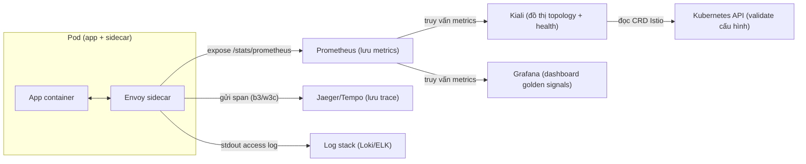

# Observability mesh — Kiali, Metrics & Distributed Tracing

> **Tác giả:** Mr.Rom\
> **Phiên bản:** v1.0.0\
> **Tạo lúc:** 13/06/2026\
> **Cập nhật:** 13/06/2026\
> **Level:** Intermediate\
> **Tags:** service-mesh, istio, observability, kiali, prometheus, jaeger, tracing, telemetry\
> **Yêu cầu trước:** [Multi-Cluster Service Mesh](02_multi-cluster-mesh.md)

> 🎯 *Mesh của bạn giờ đã trải nhiều cluster (bài 02) và được tinh chỉnh traffic/resilience (bài 01) — và đúng lúc đó, câu hỏi "request này đi qua những đâu, chậm ở chặng nào, ai gọi ai" trở nên gắt hơn bao giờ hết. Bài này bạn sẽ khai thác kho telemetry mà mesh **tự sinh sẵn không cần sửa app**: dựng đồ thị topology service bằng Kiali, đọc golden signals từ metrics Prometheus chuẩn Istio, hiểu vì sao distributed tracing vẫn cần app forward trace header (mesh KHÔNG tự nối span hộ), và bật Jaeger để soi đường đi `order → payment` của Acme Shop.*

## 🎯 Sau bài này bạn sẽ

- [ ] Hiểu vì sao mesh sinh **metrics + access log** tự động mà app không cần thêm dòng code nào, và ranh giới của "tự động" đó
- [ ] Cài và dùng **Kiali** — đọc đồ thị topology, health, animation traffic, và validate cấu hình Istio
- [ ] Đọc metrics Prometheus chuẩn Istio (`istio_requests_total`, `istio_request_duration_milliseconds`) theo **golden signals** (traffic / error / latency / saturation)
- [ ] Giải thích vì sao **distributed tracing bắt buộc app phải forward trace header** (`b3` / W3C `traceparent`) — mesh không tự nối span qua app được
- [ ] Cấu hình **sampling** hợp lý cho tracing và bật **Jaeger/Tempo** để xem trace end-to-end
- [ ] Bật và đọc **access log Envoy** để debug từng request lẻ

---

## Tình huống — Acme Shop có mesh rồi, nhưng vẫn "mù" khi sự cố

Acme Shop đã đi một quãng dài: Istio chạy production, traffic được canary/retry/circuit-break, mTLS bật STRICT, và bài trước mesh đã trải qua 2 cluster `us` + `eu`. Mọi thứ "có vẻ ổn".

Rồi 9 giờ sáng thứ Hai, kênh `#support` nổ tung:

- 😱 *"Khách than checkout chậm. Chậm ở đâu? `web`? `order`? `payment`? Hay chặng `order → payment` qua cluster `eu`?"*
- 😱 *"Tỷ lệ lỗi `payment` đang là bao nhiêu? p99 latency tăng từ lúc nào? Có service nào đang nuốt 5xx âm thầm không?"*
- 😱 *"Vẽ giúp tôi cái sơ đồ ai-gọi-ai trong cluster đi — tôi còn chẳng nhớ hết 40 service nối với nhau ra sao."*

Nếu chưa có observability, câu trả lời cho mọi câu hỏi trên là... mở `kubectl logs` từng Pod rồi đoán. Với 40 service, mỗi service vài Pod, trải 2 cluster — đó là cực hình. Và logs lẻ tẻ **không** trả lời được "request #abc123 của khách đi qua những service nào và chậm ở chặng nào" — vì mỗi service chỉ thấy phần của nó.

Tin tốt: bạn **đã có sẵn** một mỏ vàng dữ liệu mà không hề hay biết. Vì mọi traffic đều chui qua sidecar Envoy (bài [Kiến trúc & Sidecar](../01_basic/01_architecture-and-sidecar.md)), Envoy **đo đếm mọi request** — đếm số request, tính thời gian, ghi nhận status code — rồi phơi ra dưới dạng metrics. Bài này dạy bạn khai thác mỏ vàng đó: biến nó thành đồ thị (Kiali), thành số liệu cảnh báo (Prometheus), và thành trace end-to-end (Jaeger).

> [!NOTE]
> Bài dùng **Istio** làm ví dụ vì hệ observability của nó (Envoy metrics + Telemetry API + tích hợp Kiali/Prometheus/Jaeger) là chuẩn mực và tài liệu hoá rõ nhất. Linkerd có `linkerd viz` (dashboard tương đương), Cilium dùng Hubble — khái niệm golden signals và yêu cầu forward trace header là **chung cho mọi mesh**.

---

## 1️⃣ Vì sao mesh "nhìn thấy" mọi thứ mà app không cần đổi code?

Trước khi cài công cụ, phải hiểu điều cốt lõi: dữ liệu observability từ đâu ra. Đây là chỗ quyết định bạn dùng mesh đúng hay sai kỳ vọng.

Mỗi request giữa hai service **luôn** đi qua 2 sidecar: sidecar của caller (outbound) và sidecar của callee (inbound). Sidecar Envoy nằm đúng vị trí "nút cổ chai" của mọi cuộc gọi, nên nó tự nhiên đo được 3 thứ mà không cần app hợp tác:

- **Đếm** mỗi request: từ đâu, đến đâu, status code gì → ra `istio_requests_total`.
- **Bấm giờ** mỗi request: mất bao lâu → ra `istio_request_duration_milliseconds`.
- **Ghi sổ** mỗi request: 1 dòng access log có method, path, status, thời gian.

🪞 **Ẩn dụ:** *Hãy hình dung mesh như một **toà nhà có cổng từ ở mọi cửa**. Mỗi lần ai đó đi qua cửa (request), cổng từ tự động ghi: ai vào, vào phòng nào, lúc mấy giờ, mất bao lâu trong phòng. Người đi lại (app) chẳng cần khai báo gì — chỉ việc đi, cổng tự đếm. Kiali là **màn hình an ninh** vẽ lại luồng người đi; Prometheus là **sổ thống kê** ai-vào-ra bao nhiêu lượt; Jaeger là **camera nối tiếp** dựng lại trọn hành trình của một người qua nhiều phòng.*

Nhưng ẩn dụ "camera nối tiếp" hé lộ giới hạn quan trọng: cổng từ ở mỗi cửa là **độc lập**. Cửa phòng A không biết người vừa qua nó có phải cùng một người vừa qua cửa phòng B hay không — trừ khi người đó **đeo cùng một thẻ** xuyên suốt. Trong distributed tracing, "thẻ" đó là **trace header**, và việc đeo thẻ qua từng phòng là việc **app phải làm**, không phải cổng từ. Ta sẽ quay lại điểm này ở §4 — nó là nguồn hiểu nhầm số một về tracing.

| Loại dữ liệu | Mesh tự sinh? | App cần làm gì? |
|---|---|---|
| **Metrics** (số request, latency, error rate) | ✅ Hoàn toàn tự động | Không cần gì |
| **Access log** (1 dòng/request ở Envoy) | ✅ Tự động (bật cấu hình) | Không cần gì |
| **Topology graph** (Kiali) | ✅ Suy ra từ metrics | Không cần gì |
| **Distributed trace** (nối span qua nhiều service) | ⚠️ Một nửa | **App phải forward trace header** |

Bảng trên là bản đồ cả bài: 3 dòng đầu "miễn phí", dòng cuối có một điều kiện app phải đáp ứng. Giờ ta đi vào phần trừu tượng nhất — luồng dữ liệu từ sidecar tới các công cụ — qua sơ đồ.

> 💡 Sơ đồ dưới là phần trừu tượng nhất của bài: dữ liệu observability chảy từ sidecar Envoy ra sao tới Prometheus (số liệu), Kiali (đồ thị), và Jaeger (trace).



Điểm mấu chốt từ sơ đồ: **Prometheus là trung tâm** — Envoy đẩy metrics vào đó, rồi cả Kiali lẫn Grafana đều *đọc lại* từ Prometheus chứ không hỏi Envoy trực tiếp. Trace lại đi đường riêng (Envoy → Jaeger), vì span là dữ liệu per-request chứ không phải số liệu cộng dồn. Nắm cấu trúc này rồi, ta cài từng mảnh.

---

## 2️⃣ Cài addon observability — Prometheus, Kiali, Jaeger

Istio đóng gói sẵn một bộ addon "demo" để bạn dựng nhanh stack observability trong môi trường học/staging. Đây là HOW nền tảng — mọi phần sau dựa lên các addon này.

> [!CAUTION]
> Các addon dưới đây là bản **demo/quickstart** của Istio — Prometheus không bật persistence, Jaeger lưu trace in-memory (mất khi restart). Tuyệt đối **không** dùng nguyên si cho production. Production cần Prometheus có storage bền, Jaeger/Tempo có backend lưu trữ thật. Mục đích ở đây là học cách dùng, không phải vận hành lâu dài.

### 🛠️ Bước 1: Cài 3 addon từ thư mục samples của Istio

Giả sử bạn đã cài Istio (biến `$ISTIO_DIR` trỏ tới thư mục giải nén bản Istio, ví dụ `istio-1.22.0`). Bộ manifest addon nằm trong `samples/addons/`. Ta apply Prometheus (kho metrics), Kiali (đồ thị), Jaeger (trace):

```bash
# 1. Cài Prometheus — kho lưu metrics, là trung tâm của cả stack
kubectl apply -f "$ISTIO_DIR/samples/addons/prometheus.yaml"

# 2. Cài Kiali — đồ thị topology, đọc lại từ Prometheus
kubectl apply -f "$ISTIO_DIR/samples/addons/kiali.yaml"

# 3. Cài Jaeger — backend lưu distributed trace
kubectl apply -f "$ISTIO_DIR/samples/addons/jaeger.yaml"
```

Các addon này được deploy vào namespace `istio-system` (chung với `istiod`). Sau khi apply, chờ chúng chạy rồi kiểm tra:

```bash
kubectl rollout status deployment/prometheus -n istio-system --timeout=120s
kubectl rollout status deployment/kiali -n istio-system --timeout=120s
kubectl rollout status deployment/jaeger -n istio-system --timeout=120s

kubectl get pods -n istio-system
```

Kết quả mong đợi (rút gọn — các Pod đều `Running`):

```text
NAME                          READY   STATUS    RESTARTS   AGE
istiod-7d4b9c6f8-abcde        1/1     Running   0          2d
prometheus-5f9c8d7b4-fghij    2/2     Running   0          50s
kiali-6b8c9d7f4-klmno         1/1     Running   0          50s
jaeger-7c9f4a8d5-pqrst        1/1     Running   0          50s
```

Cột `READY` của `prometheus` là `2/2` (Prometheus thêm 1 container config-reloader), còn `kiali`/`jaeger` là `1/1` — đây là các addon, **không** nằm trong mesh nên không bị inject sidecar. Mọi Pod `Running` nghĩa stack đã sẵn sàng.

> 📖 *Stack đã dựng xong. Nhưng Jaeger cần Istio thực sự **gửi span** tới nó — mặc định tracing có thể đang tắt hoặc sampling 0%. Trước khi mở dashboard, ta cấu hình tracing ở §5. Giờ làm quen Kiali trước vì nó hoạt động ngay từ metrics.*

---

## 3️⃣ Kiali — đồ thị topology, health & validate cấu hình

Kiali là "bảng điều khiển" trực quan nhất của mesh. Nó **không** tự đo gì cả — nó **đọc metrics từ Prometheus** rồi vẽ thành đồ thị, đồng thời **đọc CRD Istio từ K8s API** để bắt lỗi cấu hình. Đây là công cụ đầu tiên bạn nên mở khi có sự cố.

### Mở Kiali dashboard

`istioctl` có lệnh tiện mở dashboard qua port-forward tự động:

```bash
istioctl dashboard kiali
```

Lệnh này mở trình duyệt tại `http://localhost:20001/kiali`. Nếu chạy trên server không có trình duyệt, dùng port-forward thủ công rồi tự mở:

```bash
kubectl port-forward -n istio-system svc/kiali 20001:20001
# Mở trình duyệt: http://localhost:20001
```

Để đồ thị có gì để vẽ, cần có traffic chảy. Giả sử namespace `acme` đang chạy `web → order → payment` (từ các bài trước), bắn ít traffic cho Kiali có dữ liệu:

```bash
# Bắn 100 request qua web để sinh traffic cho đồ thị
kubectl exec -n acme deploy/web -c web -- \
  sh -c 'for i in $(seq 100); do curl -s -o /dev/null http://order:8080/; done'
```

### Đọc Graph — đồ thị topology service

Vào tab **Graph**, chọn namespace `acme`. Kiali vẽ mỗi service thành một node, mỗi cuộc gọi thành một cạnh có mũi tên. 4 thứ quan trọng cần đọc trên đồ thị:

- **Hướng cạnh** — mũi tên chỉ chiều gọi (`web → order → payment`). Đây chính là cái sếp cần: "ai gọi ai" tự động hiện ra, không phải vẽ tay.
- **Màu node/cạnh** — xanh lá = khoẻ, vàng/cam = có lỗi nhẹ, đỏ = lỗi nặng (error rate cao). Liếc một cái biết chặng nào đang đỏ.
- **Animation traffic** — bật chế độ animation, Kiali vẽ các "chấm" chạy dọc cạnh theo thời gian thực, mật độ chấm tỷ lệ với lượng request. Chặng nào nhiều traffic, chấm chạy dày.
- **Nhãn cạnh** — hiển thị được rps (request/giây), % lỗi, hoặc latency tuỳ bạn chọn ở menu "Edge labels".

🪞 **Ẩn dụ:** *Tab Graph giống **bản đồ giao thông thời gian thực** (như Google Maps traffic layer): mỗi con đường (cạnh) đổi màu xanh/vàng/đỏ theo độ "kẹt" (error rate), và bạn thấy xe (request) chạy trên đường theo thời gian thực. Nhìn phát là biết ngã tư nào đang tắc.*

### Validate cấu hình Istio — Kiali bắt lỗi giúp bạn

Đây là tính năng bị đánh giá thấp nhất của Kiali. Ngoài vẽ đồ thị, Kiali **đọc các CRD Istio** (VirtualService, DestinationRule, AuthorizationPolicy...) và cảnh báo khi chúng sai. Vào tab **Istio Config**, các cấu hình lỗi được gắn icon đỏ với mô tả cụ thể, ví dụ:

- VirtualService trỏ tới `subset` chưa định nghĩa trong DestinationRule (lỗi kinh điển ở [bài Traffic Management](../01_basic/02_traffic-management.md)).
- DestinationRule có `host` không khớp Service nào tồn tại.
- Tổng `weight` các route không bằng 100.
- Hai VirtualService cùng host chồng chéo nhau.

Bạn cũng làm việc này bằng dòng lệnh với `istioctl analyze` — nên tích hợp vào CI:

```bash
istioctl analyze -n acme
```

Kết quả mong đợi khi cấu hình sạch:

```text
✔ No validation issues found when analyzing namespace: acme.
```

Nếu có lỗi, output chỉ rõ resource nào, dòng nào, ví dụ `Error [IST0101] (VirtualService order.acme) Referenced host+subset in destination not found: "order+v3"`. Mỗi mã `IST0xxx` có trang giải thích riêng — đây là cách phát hiện cấu hình hỏng **trước khi** nó gây 503 trên production.

> [!TIP]
> Đưa `istioctl analyze -n <namespace>` vào pipeline CI (chạy với cờ `--use-kube=false` trên file YAML chưa apply nếu muốn check offline). Bắt lỗi cấu hình ở CI rẻ hơn rất nhiều so với debug 503 lúc 3 giờ sáng.

---

## 4️⃣ Metrics chuẩn Istio & Golden Signals

Kiali đẹp nhưng để **cảnh báo** (alert) và **dashboard** lâu dài, bạn làm việc thẳng với metrics Prometheus. Mọi sidecar Envoy phơi metrics chuẩn Istio — không cần app instrument gì. Trước khi viết query, hiểu khung tư duy: **golden signals**.

### Golden signals — 4 tín hiệu vàng

Cuốn SRE của Google chỉ ra: để biết một service "khoẻ" hay "ốm", chỉ cần theo 4 tín hiệu. Mọi metrics khác là chi tiết phụ.

| Tín hiệu vàng | Câu hỏi nó trả lời | Metric Istio tương ứng |
|---|---|---|
| **Traffic** (lưu lượng) | Service đang nhận bao nhiêu request? | `istio_requests_total` (đếm theo rate) |
| **Errors** (lỗi) | Bao nhiêu % request thất bại? | `istio_requests_total` lọc `response_code=~"5.."` |
| **Latency** (độ trễ) | Request mất bao lâu? p50/p95/p99? | `istio_request_duration_milliseconds_bucket` |
| **Saturation** (bão hoà) | Tài nguyên (CPU/mem/connection) đầy chưa? | `istio_tcp_connections_opened_total`, metrics resource của Pod |

### 2 metric cốt lõi của Istio

Toàn bộ HTTP observability của Istio xoay quanh 2 metric. Hiểu nhãn (label) của chúng là hiểu cả hệ thống:

- **`istio_requests_total`** — một *counter* (bộ đếm chỉ tăng) đếm tổng số request. Mỗi request cộng 1 vào đúng tổ hợp label của nó.
- **`istio_request_duration_milliseconds`** — một *histogram* (biểu đồ phân phối) ghi thời gian xử lý request, chia vào các "bucket" để tính percentile.

Cả hai mang chung bộ label quan trọng (đây là chìa khoá lọc dữ liệu):

| Label | Ý nghĩa | Ví dụ giá trị |
|---|---|---|
| `source_workload` | Workload gọi đi | `web` |
| `destination_workload` | Workload nhận | `order` |
| `destination_service` | Service đích (FQDN rút gọn) | `order.acme.svc.cluster.local` |
| `response_code` | HTTP status code | `200`, `503` |
| `reporter` | Phía nào báo cáo metric | `source` (sidecar caller) hoặc `destination` (sidecar callee) |
| `response_flags` | Cờ chi tiết của Envoy | `-`, `UH` (no healthy upstream), `UO` (overflow circuit breaker) |

> [!IMPORTANT]
> Label `reporter` cực kỳ hay bị bỏ quên và gây **đếm đôi**. Mỗi request được báo cáo **2 lần**: một bởi sidecar phía source, một bởi sidecar phía destination. Khi tính rate, luôn lọc `reporter="destination"` (hoặc `"source"`) — nếu không bạn sẽ thấy traffic gấp đôi thực tế.

### Mở Prometheus và viết query golden signals

Mở Prometheus UI để chạy thử PromQL:

```bash
istioctl dashboard prometheus
# hoặc: kubectl port-forward -n istio-system svc/prometheus 9090:9090
```

**Traffic** — request/giây tới `order` trong 5 phút gần nhất (lọc `reporter` chống đếm đôi):

```promql
sum(rate(istio_requests_total{destination_workload="order", reporter="destination"}[5m]))
```

**Errors** — tỷ lệ % request 5xx của `order` (số 5xx chia tổng):

```promql
sum(rate(istio_requests_total{destination_workload="order", reporter="destination", response_code=~"5.."}[5m]))
/
sum(rate(istio_requests_total{destination_workload="order", reporter="destination"}[5m]))
```

**Latency** — p99 (99% request nhanh hơn ngưỡng này) của `order`, tính từ histogram bucket:

```promql
histogram_quantile(0.99,
  sum(rate(istio_request_duration_milliseconds_bucket{destination_workload="order", reporter="destination"}[5m]))
  by (le)
)
```

Kết quả mẫu cho query latency (Prometheus trả về giá trị mili-giây):

```text
{}   148.5
```

Giá trị `148.5` nghĩa là 99% request tới `order` hoàn tất dưới ~148.5ms. `histogram_quantile` cần nhóm theo nhãn `le` (less-or-equal — biên trên mỗi bucket) — đó là lý do có `by (le)`. Nếu thiếu `by (le)`, query trả về sai hoàn toàn.

→ 3 query này là xương sống của mọi alert: "error rate > 1% trong 5 phút" hay "p99 > 500ms" đều dựng từ chúng. Nhưng metrics chỉ cho biết *service nào* đang ốm, không cho biết *một request cụ thể* tắc ở chặng nào. Đó là việc của distributed tracing.

---

## 5️⃣ Distributed Tracing — và vì sao mesh KHÔNG tự làm hộ được

Đây là phần quan trọng nhất và bị hiểu nhầm nhiều nhất của cả bài. Đọc thật kỹ.

### Vấn đề: một request đi qua N service

Khi khách bấm "Thanh toán", request đi `web → order → payment → inventory`. Nếu tổng thời gian là 2 giây, **chặng nào** ngốn 2 giây đó? Metrics nói "`payment` p99 cao" — nhưng `payment` cao vì *bản thân nó* chậm, hay vì nó *chờ* `inventory` chậm? Metrics không phân biệt được. Bạn cần **distributed trace**: một bản ghi nối liền tất cả các chặng của *cùng một request*, mỗi chặng là một **span** (đoạn) có thời gian bắt đầu/kết thúc.

🪞 **Ẩn dụ:** *Trace giống **vận đơn theo dõi bưu kiện**. Bưu kiện (request) đi qua nhiều bưu cục (service); mỗi bưu cục đóng dấu "nhận lúc 9:00, gửi đi 9:05" (một span). Ghép tất cả con dấu lại theo **cùng một mã vận đơn** (trace ID), bạn thấy trọn hành trình và biết bưu cục nào giữ hàng lâu nhất.*

### Vì sao mesh không tự nối được — "mã vận đơn" phải do app mang theo

Quay lại ẩn dụ cổng từ ở §1: mỗi sidecar độc lập, nó **không biết** request inbound nó vừa nhận có liên quan gì tới request outbound mà app sắp gửi đi tiếp. Khi `order` nhận request từ `web` rồi gọi sang `payment`, đó là **2 kết nối TCP riêng biệt** với sidecar — về mặt mạng, chúng chẳng dính gì nhau.

Để nối chúng, request đầu phải mang một **trace header** (ví dụ `x-b3-traceid`), và khi `order` gọi `payment`, app `order` phải **chép header đó sang** request mới. Có vậy sidecar payment mới biết "à, request này thuộc cùng trace ID với request web→order".

> [!CAUTION]
> Đây là điểm chí mạng: **mesh tự tạo span ở mỗi sidecar, nhưng việc TRUYỀN trace header qua app (propagation) là việc của APP, không phải mesh.** Sidecar không thể đọc request inbound rồi "đoán" request outbound nào là hệ quả của nó — giữa hai cuộc gọi đó là code nghiệp vụ của app mà sidecar không can thiệp được. Nếu app **không** forward header, trace sẽ **đứt** thành nhiều mảnh rời, không nối thành cây.

Cụ thể, app cần forward một trong các bộ header chuẩn (Envoy mặc định dùng **B3**, ngoài ra có chuẩn W3C):

| Bộ header | Header chính | Ghi chú |
|---|---|---|
| **B3 (Zipkin)** | `x-b3-traceid`, `x-b3-spanid`, `x-b3-parentspanid`, `x-b3-sampled` | Mặc định lịch sử của Envoy/Istio |
| **W3C Trace Context** | `traceparent`, `tracestate` | Chuẩn mới, đa nền tảng — nên dùng cho hệ thống mới |
| **Request ID** | `x-request-id` | Envoy tự sinh, nên forward kèm để nối log |

Tin tốt là việc forward này thường **gần như tự động** nếu app dùng một thư viện instrument chuẩn:

- Dùng **OpenTelemetry SDK** (auto-instrumentation cho Java/Python/Node/Go...) → header được forward tự động khi gọi HTTP.
- Hoặc thủ công: trong handler, đọc các header `x-b3-*` / `traceparent` từ request vào và set lại vào mọi request gọi ra.

Ví dụ thủ công đơn giản ở app `order` (Python/FastAPI) — chép header trace từ request vào sang request gọi `payment`:

```python
import httpx
from fastapi import FastAPI, Request

app = FastAPI()

# Các header trace cần forward để trace không bị đứt
TRACE_HEADERS = [
    "x-request-id",
    "x-b3-traceid", "x-b3-spanid", "x-b3-parentspanid",
    "x-b3-sampled", "x-b3-flags",
    "traceparent", "tracestate",   # chuẩn W3C
]


@app.post("/checkout")
async def checkout(request: Request):
    # 1. Trích các header trace từ request đến (do sidecar/web gắn vào)
    fwd = {h: request.headers[h] for h in TRACE_HEADERS if h in request.headers}

    # 2. Chép chúng sang request gọi payment — đây là bước "đeo cùng mã vận đơn"
    async with httpx.AsyncClient() as client:
        resp = await client.post("http://payment:8080/charge", headers=fwd)

    # 3. Nếu KHÔNG làm bước 2, trace web→order và order→payment sẽ rời nhau
    return {"payment_status": resp.status_code}
```

→ Chỉ vài dòng "đeo lại thẻ", nhưng nó là khác biệt giữa một trace liền mạch và một mớ span rời rạc. Giờ ta bật tracing trong Istio và xem kết quả.

### Bật tracing & cấu hình sampling

Tracing tốn tài nguyên (mỗi trace là dữ liệu thật được lưu), nên không ai trace 100% request ở production. **Sampling** quyết định *bao nhiêu %* request được trace. Trong Istio hiện đại (1.21+), cấu hình tracing chuẩn dùng **Telemetry API** kết hợp một tracing provider khai báo trong `MeshConfig`.

Cách gọn nhất với addon Jaeger: cấu hình một provider tên `jaeger` rồi dùng resource `Telemetry` để bật và đặt sampling. Trước hết, provider thường đã có sẵn khi cài bằng profile `demo`; nếu chưa, khai báo trong cấu hình mesh. Dưới đây là resource `Telemetry` bật trace với sampling 10% cho toàn mesh (đặt ở namespace gốc của Istio):

```yaml
# telemetry-tracing.yaml — bật tracing, sampling 10% toàn mesh
apiVersion: telemetry.istio.io/v1
kind: Telemetry
metadata:
  name: mesh-tracing
  namespace: istio-system        # namespace gốc Istio → áp toàn mesh
spec:
  tracing:
    - providers:
        - name: jaeger           # tên provider khai báo trong MeshConfig
      randomSamplingPercentage: 10.0   # trace 10% số request (đủ thấy pattern, ít tốn)
```

Muốn một namespace nhạy cảm (ví dụ `acme` lúc đang điều tra sự cố) trace dày hơn, áp thêm Telemetry riêng cho namespace đó với sampling cao:

```yaml
# telemetry-acme-debug.yaml — tạm tăng sampling lên 100% khi điều tra
apiVersion: telemetry.istio.io/v1
kind: Telemetry
metadata:
  name: acme-debug-tracing
  namespace: acme                # chỉ áp cho namespace acme
spec:
  tracing:
    - providers:
        - name: jaeger
      randomSamplingPercentage: 100.0   # trace MỌI request — chỉ dùng tạm khi debug
```

Apply và kiểm tra resource đã có:

```bash
kubectl apply -f telemetry-tracing.yaml
kubectl get telemetry -n istio-system
```

Kết quả mong đợi:

```text
NAME           AGE
mesh-tracing   10s
```

> [!WARNING]
> `randomSamplingPercentage: 100.0` chỉ nên bật **tạm thời** khi đang điều tra một sự cố cụ thể, và nhớ **tắt sau đó**. Để 100% trên production lưu lượng cao sẽ ngốn storage Jaeger/Tempo và thêm overhead. Sampling production điển hình là **1%–10%**, gỡ lên cao chỉ trong cửa sổ debug.

### Sampling — chọn tỷ lệ thế nào

Không có con số đúng tuyệt đối, nhưng đây là khung tham khảo theo lưu lượng:

| Lưu lượng service | Sampling gợi ý | Lý do |
|---|---|---|
| Thấp (dev/staging, <10 rps) | 100% | Ít request, trace hết để học/debug thoải mái |
| Trung bình (production thường) | 1%–10% | Đủ thấy pattern lỗi/chậm mà không ngập storage |
| Rất cao (>10k rps) | 0.1%–1% | Khối lượng lớn, vài % cũng là rất nhiều trace |
| Đang điều tra sự cố | Tăng tạm 100% cho namespace liên quan | Bắt trọn pattern, nhớ hạ lại sau |

→ Cấu hình xong, ta gửi traffic rồi xem trace `order → payment` thật trên Jaeger.

---

## 6️⃣ Hands-on — soi trace order → payment của Acme trên Jaeger

Giờ ráp tất cả: sinh traffic, mở Jaeger, và đọc một trace hoàn chỉnh. Đây là lúc thấy toàn bộ công sức ở §5 trả quả.

### 🛠️ Bước 1: Sinh traffic qua chuỗi web → order → payment

Cho namespace `acme` chạy `web`, `order`, `payment` (từ các bài trước, với `order` đã forward trace header như §5). Bắn một loạt request `checkout` để có trace:

```bash
# Bắn 30 request checkout để Jaeger có trace để hiển thị
kubectl exec -n acme deploy/web -c web -- \
  sh -c 'for i in $(seq 30); do curl -s -o /dev/null http://order:8080/checkout; done'
```

### 🛠️ Bước 2: Mở Jaeger UI

```bash
istioctl dashboard jaeger
# hoặc: kubectl port-forward -n istio-system svc/tracing 16686:80
```

Lệnh `istioctl dashboard jaeger` mở `http://localhost:16686`. Ở thanh tìm kiếm bên trái, chọn **Service** là `order.acme` (Istio đặt tên service trong Jaeger theo dạng `<workload>.<namespace>`), rồi bấm **Find Traces**.

### 🛠️ Bước 3: Đọc một trace — cây span và thời gian từng chặng

Bấm vào một trace, Jaeger hiển thị **timeline** dạng thanh ngang lồng nhau. Cấu trúc một trace `checkout` điển hình:

```text
Trace: checkout  (total 182ms)
└─ order.acme: /checkout                     [████████████████████] 182ms
   ├─ order.acme egress → payment            [        ██████████  ] 120ms   ← chặng order gọi payment
   │  └─ payment.acme: /charge               [         █████████  ] 110ms   ← payment xử lý
   └─ order.acme egress → inventory          [██████              ]  40ms
```

Cách đọc cây trace này:

- **Span gốc** (`order.acme: /checkout`) dài 182ms — tổng thời gian cả request.
- **Span con** thụt vào trong, mỗi span là một chặng. Độ dài thanh = thời gian chặng đó.
- Chặng `order → payment` chiếm 120ms, trong đó `payment` tự xử lý 110ms → `payment` chính là điểm nghẽn, không phải `order`.
- Các span **xếp chồng đúng quan hệ cha-con** chỉ vì trace header được forward (§5). Nếu app `order` không forward, span `payment` sẽ tách thành một trace riêng và bạn **không** thấy nó nằm dưới `checkout`.

🪞 Quay lại ẩn dụ vận đơn: cây span này chính là bảng tra cứu "bưu kiện ở mỗi bưu cục bao lâu" — và nó chỉ ráp được vì mọi chặng dùng **cùng một mã vận đơn** (trace ID) mà app đã chăm chỉ chép sang.

> [!NOTE]
> Nếu mở Jaeger mà **không thấy span nào của `payment` dưới `order`** dù traffic vẫn chạy, 90% nguyên nhân là app `order` chưa forward trace header. Kiểm tra lại code ở §5 — đây là lỗi tracing phổ biến nhất, và không công cụ nào "sửa hộ" được ngoài việc app tự forward.

### 🛠️ Bước 4: Đối chiếu với access log Envoy

Trace cho bức tranh tổng, access log cho chi tiết từng request. Bật access log (nếu chưa) bằng Telemetry rồi đọc log sidecar của `payment`:

```yaml
# telemetry-accesslog.yaml — bật access log Envoy cho toàn mesh
apiVersion: telemetry.istio.io/v1
kind: Telemetry
metadata:
  name: mesh-access-logging
  namespace: istio-system
spec:
  accessLogging:
    - providers:
        - name: envoy        # provider access log mặc định của Istio
```

Apply rồi xem log của container `istio-proxy` (chính là Envoy) trong Pod `payment`:

```bash
kubectl apply -f telemetry-accesslog.yaml

# Đọc access log của sidecar Envoy trong Pod payment
kubectl logs -n acme -l app=payment -c istio-proxy --tail=5
```

Kết quả mong đợi (mỗi dòng là 1 request, định dạng mặc định của Istio):

```text
[2026-06-13T08:30:12.345Z] "POST /charge HTTP/1.1" 200 - via_upstream - "-" 84 17 110 108 "-" "curl/8.7.1" "abc123-de45-..." "payment:8080" "10.1.2.7:8080" ...
```

Các trường quan trọng trong một dòng access log:

- `"POST /charge HTTP/1.1"` — method, path, protocol.
- `200` — response code (status trả về).
- Token `-` ngay sau `200` — `response_flags` của Envoy (`-` là bình thường; `UH`/`UO`/`UC` báo lỗi cụ thể).
- `via_upstream` — `RESPONSE_CODE_DETAILS`: chi tiết vì sao có status đó (không phải response_flags).
- `110` (số gần cuối các con số) — thời gian xử lý request (mili-giây), khớp với span trên Jaeger.
- `"abc123-de45-..."` — chính là **`x-request-id`**, dùng để **nối log này với trace tương ứng** trên Jaeger.

> 📖 *Đến đây bạn có đủ 3 lớp quan sát: Kiali (bức tranh ai-gọi-ai), Prometheus (số liệu golden signals + alert), Jaeger + access log (mổ xẻ một request cụ thể). Khi sự cố tới, quy trình là: Kiali thấy chặng đỏ → Prometheus xác nhận error/latency tăng → Jaeger soi trace tìm span tắc → access log + `x-request-id` đọc chi tiết request lỗi.*

---

## 💡 Cạm bẫy thường gặp & Best practice

### ❌ Cạm bẫy: tưởng mesh tự nối distributed trace mà không cần đụng app

- **Triệu chứng**: Cài Jaeger, bật sampling, nhưng mỗi service hiện thành trace **rời rạc** — không thấy `payment` nằm dưới `order`, trace cụt một mảnh.
- **Nguyên nhân**: App **không forward trace header** (`x-b3-*` / `traceparent`) từ request vào sang request gọi ra. Sidecar tạo được span riêng lẻ nhưng không có "mã vận đơn" chung để ráp cây — và sidecar không thể tự ráp hộ vì giữa 2 cuộc gọi là code app nó không can thiệp được.
- **Cách tránh**: Dùng OpenTelemetry auto-instrumentation, hoặc forward thủ công danh sách header trace trong mọi cuộc gọi outbound (xem §5). Đây là việc **bắt buộc của app**, không mesh nào làm hộ.

### ❌ Cạm bẫy: đếm đôi metrics vì quên lọc `reporter`

- **Triệu chứng**: Dashboard traffic hiển thị rps gấp đôi thực tế; error rate trông "loãng" đi một nửa.
- **Nguyên nhân**: Mỗi request được báo cáo bởi **cả** sidecar source lẫn destination. Query không lọc `reporter` → cộng cả hai → x2.
- **Cách tránh**: Luôn thêm `reporter="destination"` (hoặc `"source"`) vào mọi query `istio_requests_total` và `istio_request_duration_milliseconds`. Chọn `destination` khi muốn đo "service nhận được bao nhiêu".

### ❌ Cạm bẫy: để sampling 100% trên production

- **Triệu chứng**: Storage Jaeger/Tempo phình nhanh, có thêm overhead nhẹ ở mỗi request, chi phí lưu trữ tăng vọt.
- **Nguyên nhân**: Bật `randomSamplingPercentage: 100.0` để debug rồi **quên tắt**, hoặc tưởng phải trace hết mới "đủ".
- **Cách tránh**: Production để 1%–10%. Khi điều tra, tăng tạm cho **riêng namespace** liên quan rồi hạ lại ngay sau khi xong.

### ✅ Best practice: dùng access log để nối với trace qua `x-request-id`

- **Vì sao**: Trace cho bức tranh tổng nhưng có thể bị sampling bỏ qua; access log ghi **mọi** request. Cùng một `x-request-id` xuất hiện ở cả access log lẫn trace → bạn nhảy qua lại được giữa "chi tiết một request" và "hành trình của nó".
- **Cách áp dụng**: Bật access log Envoy (Telemetry `accessLogging`), đẩy log vào Loki/ELK, index theo `x-request-id`. Khi có request lỗi, copy `x-request-id` từ log rồi tìm đúng trace trên Jaeger.

### ✅ Best practice: alert dựa trên golden signals, không alert từng metric vụn

- **Vì sao**: Alert quá nhiều metric vụn → "alert fatigue" (mỏi vì báo động), bỏ sót báo động thật. 4 golden signals (traffic/error/latency/saturation) đủ bắt hầu hết sự cố.
- **Cách áp dụng**: Mỗi service đặt sẵn 2-3 alert cốt lõi: error rate > ngưỡng (vd 1% trong 5 phút), p99 latency > ngưỡng, và traffic rớt bất thường (dấu hiệu service chết). Dựng từ query `istio_requests_total` + `istio_request_duration_milliseconds` ở §4.

---

## 🧠 Tự kiểm tra (Self-check)

**Q1.** Vì sao mesh sinh được metrics và access log mà app không cần thêm dòng code nào, nhưng distributed trace thì lại **cần** app hợp tác?

<details>
<summary>💡 Xem giải thích</summary>

Metrics và access log đo trên **một request đơn lẻ** tại sidecar — sidecar nằm ngay nút cổ chai nên tự đếm/bấm giờ/ghi log được, không cần app. Distributed trace lại cần **nối nhiều chặng của cùng một request** thành một cây span. Sidecar của `order` không biết request inbound (từ `web`) có liên quan gì tới request outbound (gọi `payment`) — giữa hai cuộc gọi đó là code nghiệp vụ của app mà sidecar không can thiệp. Để nối, request phải mang một trace header chung (`x-b3-traceid`/`traceparent`) và app phải **chép header đó sang** mọi cuộc gọi ra. Việc forward header là của app, mesh không làm hộ được.

</details>

**Q2.** Bạn viết query `sum(rate(istio_requests_total{destination_workload="order"}[5m]))` và thấy rps gấp đôi mong đợi. Sai ở đâu?

<details>
<summary>💡 Xem giải thích</summary>

Thiếu lọc nhãn `reporter`. Mỗi request được báo cáo **hai lần**: bởi sidecar phía source và sidecar phía destination. Query không lọc → cộng cả hai → gấp đôi. Sửa thành `istio_requests_total{destination_workload="order", reporter="destination"}`. Chọn `destination` khi muốn đo "service `order` nhận được bao nhiêu request".

</details>

**Q3.** 4 golden signals là gì, và mỗi cái ánh xạ tới metric Istio nào?

<details>
<summary>💡 Xem giải thích</summary>

- **Traffic** (lưu lượng): `rate(istio_requests_total)` — bao nhiêu request/giây.
- **Errors** (lỗi): `istio_requests_total{response_code=~"5.."}` chia tổng — % request thất bại.
- **Latency** (độ trễ): `histogram_quantile(...)` trên `istio_request_duration_milliseconds_bucket` — p50/p95/p99.
- **Saturation** (bão hoà): connection/resource metrics (`istio_tcp_connections_opened_total`, CPU/mem Pod) — tài nguyên đã đầy chưa.

</details>

**Q4.** Tại sao `histogram_quantile` để tính p99 latency bắt buộc phải có `by (le)`?

<details>
<summary>💡 Xem giải thích</summary>

`istio_request_duration_milliseconds` là histogram, chia thời gian vào nhiều **bucket**; mỗi bucket được đánh dấu bằng nhãn `le` (less-or-equal — biên trên của bucket). `histogram_quantile` tính percentile bằng cách nội suy giữa các bucket, nên nó **phải** thấy phân bố theo `le`. Nếu không `by (le)`, các bucket bị gộp mất chiều `le` → hàm không có dữ liệu phân phối → kết quả sai. Khi gộp nhiều workload, vẫn giữ `le` trong `by(...)`.

</details>

**Q5.** Trên production lưu lượng cao, nên đặt sampling tracing bao nhiêu? Khi nào tăng lên 100%?

<details>
<summary>💡 Xem giải thích</summary>

Production thường để **1%–10%** (lưu lượng rất cao như >10k rps có thể xuống 0.1%–1%). Đủ để thấy pattern lỗi/chậm mà không ngập storage và không thêm overhead đáng kể. Chỉ tăng lên **100% tạm thời** khi đang điều tra một sự cố cụ thể, và chỉ cho **namespace liên quan**, rồi **hạ lại ngay** sau khi xong. Để 100% lâu dài trên production sẽ phình storage Jaeger/Tempo và tốn chi phí.

</details>

---

## ⚡ Tra cứu nhanh (Cheatsheet)

```bash
# === Cài addon observability (môi trường học/staging) ===
kubectl apply -f "$ISTIO_DIR/samples/addons/prometheus.yaml"
kubectl apply -f "$ISTIO_DIR/samples/addons/kiali.yaml"
kubectl apply -f "$ISTIO_DIR/samples/addons/jaeger.yaml"

# === Mở dashboard ===
istioctl dashboard kiali          # đồ thị topology + validate cấu hình
istioctl dashboard prometheus     # viết PromQL
istioctl dashboard jaeger         # xem distributed trace
istioctl dashboard grafana        # dashboard golden signals (nếu cài)

# === Validate cấu hình Istio ===
istioctl analyze -n acme          # bắt lỗi VirtualService/DestinationRule/...

# === Đọc access log của sidecar ===
kubectl logs -n acme -l app=payment -c istio-proxy --tail=20
```

```promql
# === Golden signals (luôn lọc reporter chống đếm đôi) ===

# Traffic — request/giây tới order
sum(rate(istio_requests_total{destination_workload="order", reporter="destination"}[5m]))

# Errors — % 5xx của order
sum(rate(istio_requests_total{destination_workload="order", reporter="destination", response_code=~"5.."}[5m]))
/
sum(rate(istio_requests_total{destination_workload="order", reporter="destination"}[5m]))

# Latency — p99 của order (nhớ by (le))
histogram_quantile(0.99,
  sum(rate(istio_request_duration_milliseconds_bucket{destination_workload="order", reporter="destination"}[5m]))
  by (le)
)
```

```yaml
# === Telemetry: bật tracing + sampling ===
apiVersion: telemetry.istio.io/v1
kind: Telemetry
metadata: { name: mesh-tracing, namespace: istio-system }
spec:
  tracing:
    - providers: [{ name: jaeger }]
      randomSamplingPercentage: 10.0
---
# === Telemetry: bật access log Envoy ===
apiVersion: telemetry.istio.io/v1
kind: Telemetry
metadata: { name: mesh-access-logging, namespace: istio-system }
spec:
  accessLogging:
    - providers: [{ name: envoy }]
```

| Header trace cần app forward | Bộ chuẩn |
|---|---|
| `x-b3-traceid`, `x-b3-spanid`, `x-b3-parentspanid`, `x-b3-sampled` | B3 (Zipkin) — mặc định Envoy |
| `traceparent`, `tracestate` | W3C Trace Context — chuẩn mới |
| `x-request-id` | Envoy sinh — forward để nối log ↔ trace |

---

## 📚 Từ Điển Thuật Ngữ (Glossary)

| EN | VN | Giải thích |
|---|---|---|
| Observability | Khả năng quan sát | Năng lực hiểu trạng thái bên trong hệ thống qua metrics/log/trace |
| Telemetry | Dữ liệu đo từ xa | Metrics + trace + log mà mesh sinh ra để quan sát |
| Metric | Số liệu đo | Giá trị số cộng dồn theo thời gian (đếm request, đo latency) |
| Golden signals | 4 tín hiệu vàng | Traffic / Errors / Latency / Saturation — bộ tối thiểu đánh giá sức khoẻ service |
| Traffic | Lưu lượng | Số request/giây service đang xử lý |
| Latency | Độ trễ | Thời gian xử lý một request (đọc theo percentile p50/p95/p99) |
| Saturation | Độ bão hoà | Mức tài nguyên (CPU/mem/connection) đã dùng, gần đầy chưa |
| Counter | Bộ đếm | Metric chỉ tăng (vd `istio_requests_total`) |
| Histogram | Biểu đồ phân phối | Metric chia giá trị vào bucket để tính percentile (latency) |
| Percentile (p99) | Phân vị | p99 = 99% request nhanh hơn ngưỡng này |
| `reporter` | Phía báo cáo | Nhãn cho biết metric do sidecar source hay destination ghi |
| PromQL | Ngôn ngữ truy vấn Prometheus | Cú pháp query metrics (rate, sum, histogram_quantile) |
| Distributed tracing | Truy vết phân tán | Nối các chặng của cùng một request qua nhiều service thành một cây |
| Span | Đoạn trace | Một chặng trong trace, có thời gian bắt đầu/kết thúc |
| Trace ID | Mã trace | Định danh chung gắn tất cả span của cùng một request |
| Trace propagation | Truyền ngữ cảnh trace | App forward trace header sang cuộc gọi tiếp để nối span |
| B3 | Bộ header trace Zipkin | `x-b3-traceid`/`x-b3-spanid`... — mặc định của Envoy |
| W3C Trace Context | Chuẩn trace W3C | `traceparent`/`tracestate` — chuẩn đa nền tảng mới |
| Sampling | Lấy mẫu | Chỉ trace một tỷ lệ % request để tiết kiệm tài nguyên |
| Access log | Nhật ký truy cập | 1 dòng/request do Envoy ghi (method/path/status/thời gian) |
| `x-request-id` | Mã định danh request | Header Envoy sinh, nối access log với trace |
| Kiali | (giữ nguyên) | Dashboard đồ thị topology + health + validate cấu hình Istio |
| Prometheus | (giữ nguyên) | Hệ thống thu thập + lưu + query metrics |
| Jaeger | (giữ nguyên) | Backend lưu và xem distributed trace |
| Tempo | (giữ nguyên) | Backend trace của Grafana, thay thế Jaeger được |
| Telemetry API | (giữ nguyên) | CRD Istio cấu hình tracing/metrics/access log |

---

## 🔗 Liên kết & Tài nguyên

### 🧭 Định hướng lộ trình học

- ⬅️ **Bài trước:** [Multi-Cluster Service Mesh — Mở rộng mesh qua nhiều cluster](02_multi-cluster-mesh.md)
- ➡️ **Bài tiếp theo:** [Ambient Mesh & Production Ops — Sidecarless, nâng cấp an toàn](04_ambient-mesh-and-production-ops.md)
- ↑ **Về cụm:** [Service Mesh — README cụm](../../README.md)

### 🧩 Các chủ đề có thể bạn quan tâm

- [Advanced Traffic & Resilience — Locality LB, Rate Limit, Egress](01_advanced-traffic-and-resilience.md)
- [Traffic Management — Routing, Canary, Retry & Circuit Breaking](../01_basic/02_traffic-management.md)
- [Bảo mật Service Mesh — mTLS tự động & Authorization Policy](../01_basic/03_security-mtls-and-authz.md)

### 🌐 Tài nguyên tham khảo khác

- [Istio — Observability concepts](https://istio.io/latest/docs/concepts/observability/) — tổng quan metrics/trace/log của mesh
- [Istio — Standard Metrics](https://istio.io/latest/docs/reference/config/metrics/) — danh sách đầy đủ metric + label (`istio_requests_total`...)
- [Istio — Distributed Tracing FAQ](https://istio.io/latest/docs/tasks/observability/distributed-tracing/overview/) — giải thích vì sao app phải forward trace header
- [Kiali docs](https://kiali.io/docs/) — đồ thị, health, validation
- [Google SRE Book — Monitoring Distributed Systems](https://sre.google/sre-book/monitoring-distributed-systems/) — nguồn gốc khái niệm golden signals
- [W3C Trace Context](https://www.w3.org/TR/trace-context/) — chuẩn `traceparent`/`tracestate`

---

## 📌 Nhật ký thay đổi (Changelog)

- **v1.0.0 (13/06/2026)** — Bản đầu tiên. Lesson 03 cụm Service Mesh Intermediate: mesh sinh telemetry (metrics + access log + topology) tự động không cần sửa app; Kiali (đồ thị topology, health, animation traffic, validate cấu hình + `istioctl analyze`); metrics Prometheus chuẩn Istio (`istio_requests_total`, `istio_request_duration_milliseconds`) theo golden signals traffic/error/latency/saturation với PromQL có lọc `reporter`; distributed tracing và giải thích vì sao app PHẢI forward trace header b3/W3C (mesh không tự nối span qua app), sampling theo lưu lượng, Jaeger/Tempo; access log Envoy + nối log ↔ trace qua `x-request-id`. Hands-on cài Kiali + Prometheus + Jaeger và soi trace `order → payment` của Acme. Kèm 5 cạm bẫy/best practice + 5 self-check + cheatsheet + glossary.
