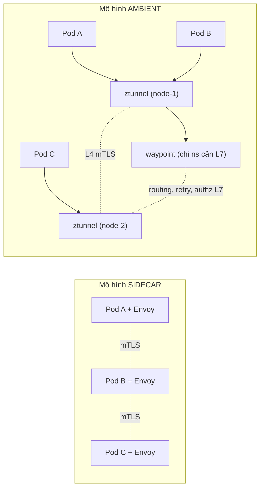

# Ambient Mesh & Production Ops — Sidecarless, nâng cấp an toàn

> **Tác giả:** Mr.Rom\
> **Phiên bản:** v1.0.0\
> **Tạo lúc:** 13/06/2026\
> **Cập nhật:** 13/06/2026\
> **Level:** Intermediate\
> **Tags:** service-mesh, istio, ambient, ztunnel, waypoint, upgrade, revision, production\
> **Yêu cầu trước:** [Observability — Kiali & Tracing](03_observability-kiali-and-tracing.md)

> 🎯 *Suốt cụm Intermediate, mọi tính năng đều dựa trên **sidecar** — một Envoy chạy kèm mỗi Pod. Sidecar mạnh nhưng đắt: mỗi Pod tốn thêm RAM/CPU, và mỗi lần nâng Istio bạn phải **restart toàn bộ Pod** để thay sidecar. Bài cuối này giới thiệu **ambient mode** (sidecarless) của Istio — tách mesh thành `ztunnel` (L4 mTLS per-node) và `waypoint` (L7 theo namespace khi cần), nên giảm tài nguyên và không phải restart Pod khi nâng mesh. Rồi ta khép lại cụm bằng kỹ năng vận hành sống còn: nâng Istio **canary qua revision + revision tags**, tuning hiệu năng, và một checklist production hoàn chỉnh. Cuối bài bạn migrate được một namespace từ sidecar sang ambient và nâng control plane an toàn không downtime.*

## 🎯 Sau bài này bạn sẽ

- [ ] Hiểu kiến trúc **ambient mode**: `ztunnel` (per-node, L4 mTLS) + `waypoint` (L7 theo namespace/service khi cần) — và vì sao bỏ được sidecar
- [ ] So sánh **ambient vs sidecar** theo chi phí tài nguyên, độ trễ, và tính năng L7 — để biết khi nào chọn cái nào
- [ ] **Migrate dần** một namespace từ sidecar sang ambient mà không đứt traffic
- [ ] Nâng cấp Istio **an toàn**: canary control plane qua **revision** + **revision tags**, nâng data plane sau
- [ ] Tuning hiệu năng sidecar: `concurrency`, resource request/limit, và giới hạn cấu hình bằng `Sidecar` resource
- [ ] Áp dụng **checklist production**: resource, PodDisruptionBudget, probe, mTLS `STRICT` toàn mesh
- [ ] Quyết định **khi nào chọn sidecarless (ambient)** và khi nào sidecar vẫn hợp lý hơn

---

## Tình huống — Acme Shop trả tiền RAM cho sidecar nhiều hơn cho app, và mỗi lần nâng Istio là một đêm trắng

Qua bốn bài Intermediate, Acme Shop đã có một mesh production thực thụ: locality LB, rate limit, multi-cluster, observability đầy đủ. Nhưng vận hành lâu dài lộ ra hai nỗi đau mà tính năng mesh không chữa được — vì chúng đến từ chính **kiến trúc sidecar**:

- 💸 **Sidecar ăn tài nguyên tỉ lệ với số Pod.** Acme có ~600 Pod. Mỗi sidecar Envoy "ăn" cỡ 100-150 MiB RAM và một phần CPU **kể cả lúc Pod gần như rảnh**. Cộng lại là hàng chục GiB RAM chỉ để chạy proxy — nhiều hơn cả RAM của một số service nhỏ. Một `CronJob` 5 giây cũng phải kéo theo một sidecar khởi động chậm hơn cả job.
- 🌙 **Mỗi lần nâng Istio là một đêm trắng.** Sidecar được "nướng" vào Pod lúc tạo. Muốn nâng phiên bản data plane, bạn phải **restart mọi Pod** để inject sidecar mới. 600 Pod restart cuốn chiếu = rủi ro, cần PodDisruptionBudget cẩn thận, và không ai dám làm giờ cao điểm.
- 🐢 **Job ngắn và batch khổ với sidecar.** Sidecar không tự tắt khi container chính xong → `Job`/`CronJob` "treo" ở trạng thái không hoàn thành vì Envoy vẫn chạy. Phải vá đủ thứ workaround.

Sếp chốt: *"Mình không cần L7 cho TẤT CẢ service — phần lớn chỉ cần mã hoá mTLS và authz L4 là đủ. Có cách nào trả tiền proxy theo NODE thay vì theo POD không? Và lần nâng Istio tới, tôi không muốn restart 600 Pod nữa. Làm sao nâng control plane mà không ai biết?"*

Cả hai yêu cầu này chính là thứ **ambient mode** sinh ra để giải quyết, cộng với kỹ thuật **canary upgrade qua revision** đã có sẵn trong Istio. Đây là chương khép lại: từ "mesh chạy được" sang "mesh vận hành được lâu dài".

> [!NOTE]
> Bài dùng **Istio** (mesh duy nhất hiện có cả 2 mô hình sidecar và ambient trong cùng sản phẩm). Ambient mode đạt mốc ổn định (GA) từ Istio 1.24 và là hướng đi chiến lược của dự án. Linkerd dùng micro-proxy per-Pod (nhẹ hơn Envoy nhưng vẫn per-Pod); Cilium làm mesh ở tầng eBPF/kernel — khác cách tiếp cận, không phải "ambient" theo nghĩa Istio.

---

## 1️⃣ Bức tranh lớn — ambient tách mesh thành 2 lớp, sidecar gộp tất cả vào 1

Trước khi đụng YAML, hãy nắm ý tưởng cốt lõi — đây là phần trừu tượng nhất của bài, hiểu nó rồi mọi thứ sau chỉ là chi tiết.

Mô hình **sidecar** gộp **mọi** thứ vào một Envoy duy nhất cạnh mỗi Pod: vừa mã hoá mTLS (L4), vừa routing/retry/rate limit (L7), vừa thu metric. Mạnh, nhưng cái giá là *mỗi Pod một Envoy đầy đủ* — kể cả Pod chẳng dùng tới L7.

Mô hình **ambient** tách đôi trách nhiệm:

- **`ztunnel`** (zero-trust tunnel) — một DaemonSet chạy **một instance mỗi node**, lo phần **L4**: mTLS, danh tính (mã hoá + identity), telemetry L4. Mọi Pod trên node đó chia sẻ chung một `ztunnel`. Đây gọi là **secure overlay** — lớp mã hoá nền.
- **`waypoint`** — một proxy Envoy chạy **theo namespace (hoặc theo service)**, lo phần **L7**: routing, retry, traffic shifting, `AuthorizationPolicy` theo HTTP path/method, rate limit. **Chỉ tạo waypoint khi namespace đó thật sự cần L7** — không cần thì không tốn gì.

🪞 **Ẩn dụ**: *Sidecar giống mỗi căn hộ tự lắp một máy lọc nước + máy phát điện + camera riêng — đầy đủ nhưng tốn và lặp. Ambient giống chung cư: tầng hầm có **một hệ thống điện + nước chung cho cả toà** (`ztunnel` per-node lo mã hoá nền), còn **camera an ninh L7 chỉ lắp ở những tầng cần** (`waypoint` chỉ tạo cho namespace cần kiểm soát HTTP). Căn hộ không cần camera thì không phải trả tiền camera.*

Sơ đồ dưới đặt cạnh nhau hai mô hình để thấy rõ "proxy nằm ở đâu". Điểm mấu chốt: ở sidecar, proxy gắn vào **từng Pod**; ở ambient, L4 dồn về **node** và L7 chỉ bật **theo namespace cần**.



Nhìn vào sơ đồ: bên trái mỗi Pod kéo theo một Envoy (3 Pod = 3 Envoy); bên phải 3 Pod chỉ dùng 2 `ztunnel` (theo node) và **một** `waypoint` dùng chung khi cần L7. Đó chính là chỗ ambient tiết kiệm: proxy không còn nhân lên theo số Pod.

> [!IMPORTANT]
> Ranh giới L4/L7 là chìa khoá để hiểu ambient. **`ztunnel` chỉ làm L4** — nó mã hoá và xác thực danh tính, nhưng *không* hiểu HTTP path/method. Mọi thứ cần L7 (routing theo URL, retry theo HTTP, `AuthorizationPolicy` có `paths`/`methods`, traffic shifting theo %) **bắt buộc đi qua waypoint**. Bật ambient mà quên tạo waypoint cho namespace cần L7 = các luật L7 của bạn lặng lẽ không có hiệu lực.

---

## 2️⃣ ztunnel — lớp mTLS L4 dùng chung theo node

`ztunnel` là trái tim của ambient. Nó là một **DaemonSet** (một Pod mỗi node) viết bằng Rust (nhẹ hơn Envoy nhiều), đảm nhận đúng một việc cốt lõi: bắt mọi traffic L4 của các Pod "trong ambient" trên node đó và bọc nó trong một đường hầm mTLS tới `ztunnel` của node đích.

🪞 **Ẩn dụ**: *`ztunnel` giống **trạm thu phí + cổng an ninh chung ở lối ra vào mỗi toà nhà**. Mọi người (traffic) ra khỏi toà nhà đều qua cổng này để được "đóng dấu danh tính" và đi trong đường ống an toàn sang toà nhà khác — thay vì mỗi căn hộ tự dựng cổng riêng.*

### Đưa một namespace vào ambient — chỉ một label

Khác sidecar (phải inject + restart Pod), đưa workload vào ambient **không cần đụng Pod**. Bạn chỉ gắn một label lên namespace; `ztunnel` của node lập tức "nhận" mọi Pod trong đó vào secure overlay. Đây là điểm vàng: **không restart, không đổi spec Pod**.

Lệnh dưới đưa namespace `acme` vào ambient. `istio.io/dataplane-mode=ambient` là công tắc duy nhất:

```bash
# 1. Đưa namespace acme vào ambient mesh (không restart Pod nào)
kubectl label namespace acme istio.io/dataplane-mode=ambient

# 2. Xác nhận label đã gắn
kubectl get namespace acme --show-labels
```

Kết quả mong đợi (rút gọn cột labels):

```text
NAME   STATUS   AGE   LABELS
acme   Active   30d   istio.io/dataplane-mode=ambient,kubernetes.io/metadata.name=acme
```

Label `istio.io/dataplane-mode=ambient` xác nhận namespace đã vào ambient. Từ giây này, mọi Pod trong `acme` được `ztunnel` bọc mTLS L4 — **mà không Pod nào phải restart**. So với sidecar (phải xoá/tạo lại Pod để inject Envoy), đây là khác biệt vận hành lớn nhất.

> [!WARNING]
> Một namespace **không thể vừa sidecar vừa ambient**. Nếu `acme` đang có label `istio-injection=enabled` (sidecar) mà bạn thêm `istio.io/dataplane-mode=ambient`, hành vi sẽ xung đột — Pod đã có sidecar không được `ztunnel` quản. Khi migrate (section 4), bạn phải **gỡ** label sidecar trước/sau theo đúng trình tự, không để Pod "kẹt giữa hai chế độ".

### Kiểm tra ztunnel đang chạy + thấy traffic mã hoá

`ztunnel` chạy trong namespace `istio-system` dưới dạng DaemonSet. Kiểm tra nó có mặt trên mọi node, rồi xem nó đã "biết" workload nào:

```bash
# ztunnel là DaemonSet — 1 Pod mỗi node
kubectl get daemonset ztunnel -n istio-system

# Xem ztunnel đang quản workload nào (danh tính, địa chỉ)
istioctl ztunnel-config workload --namespace acme
```

Kết quả mong đợi (rút gọn):

```text
NAME      DESIRED   CURRENT   READY   UP-TO-DATE   AVAILABLE   NODE SELECTOR   AGE
ztunnel   3         3         3       3            3           <none>          12d

NAMESPACE   POD NAME              ADDRESS     NODE     WAYPOINT   PROTOCOL
acme        order-6b8c9d-aaaaa    10.1.0.21   node-1   None       HBONE
acme        payment-7c9f4a-bbbbb  10.1.0.55   node-2   None       HBONE
```

Cột `PROTOCOL` = `HBONE` (HTTP-Based Overlay Network Encapsulation — đường hầm mTLS của ambient) xác nhận traffic giữa các Pod đang được `ztunnel` mã hoá. Cột `WAYPOINT` = `None` nghĩa hai service này hiện chỉ dùng L4, chưa gắn waypoint L7 — đúng như mong đợi khi mới vào ambient.

> [!NOTE]
> **HBONE** là giao thức ambient dùng để bọc traffic: nó tunnel traffic qua một kết nối HTTP/2 + mTLS trên cổng 15008. Bạn không cần cấu hình gì — chỉ cần biết khi thấy `HBONE` trong output nghĩa là traffic đã được mã hoá đúng, không còn plaintext.

---

## 3️⃣ Waypoint — bật L7 theo namespace khi (và chỉ khi) cần

`ztunnel` cho bạn mTLS + identity + authz **L4** (theo nguồn/đích, port — như `AuthorizationPolicy` không có `paths`/`methods`). Nhưng nhiều luật production cần **L7**: routing theo URL, retry theo HTTP code, traffic shifting theo %, hay `AuthorizationPolicy` giới hạn đúng `POST /charge`. Những thứ này cần một Envoy đầy đủ — đó là **waypoint**.

🪞 **Ẩn dụ**: *Nếu `ztunnel` là cổng an ninh chung của toà nhà (kiểm danh tính ai ra ai vào — L4), thì `waypoint` là **quầy lễ tân ở sảnh một tầng cụ thể** đọc kỹ "anh đến gặp ai, vào phòng nào, mang gì" (L7). Không phải tầng nào cũng cần lễ tân — chỉ tầng có khách ra vào phức tạp mới đặt.*

### Waypoint là một Gateway (API chuẩn Kubernetes)

Điểm hiện đại của ambient: waypoint không phải CRD riêng của Istio mà là một **`Gateway`** theo **Gateway API** chuẩn của Kubernetes, với `gatewayClassName: istio-waypoint`. Cách nhanh nhất để tạo là `istioctl waypoint`, nhưng hiểu YAML bên dưới giúp bạn quản nó bằng GitOps.

Tạo waypoint cho namespace `acme` bằng `istioctl` (cách khuyên dùng) — `--enroll-namespace` đồng thời gắn label để mọi service trong ns dùng waypoint này:

```bash
# 1. Tạo waypoint cho cả namespace acme và enroll luôn (chờ ready)
istioctl waypoint apply --namespace acme --enroll-namespace --wait

# 2. Liệt kê waypoint trong namespace
istioctl waypoint list --namespace acme
```

Kết quả mong đợi:

```text
✓ waypoint acme/waypoint applied
✓ waypoint acme/waypoint is ready

NAME       REVISION   PROGRAMMED
waypoint   default    True
```

Cột `PROGRAMMED` = `True` xác nhận waypoint đã được cấp phát và sẵn sàng nhận traffic L7. Từ giờ traffic trong `acme` cần L7 sẽ đi: Pod nguồn → `ztunnel` → **waypoint** (xử lý L7) → `ztunnel` → Pod đích.

Nếu bạn quản bằng GitOps, đây là chính xác `Gateway` mà lệnh trên tạo ra — `gatewayClassName: istio-waypoint` là thứ báo cho Istio "đây là waypoint, không phải ingress gateway":

```yaml
# waypoint.yaml — waypoint cho namespace acme (Gateway API chuẩn)
apiVersion: gateway.networking.k8s.io/v1
kind: Gateway
metadata:
  name: waypoint
  namespace: acme
  labels:
    istio.io/waypoint-for: service     # waypoint này xử lý traffic Ở MỨC service
spec:
  gatewayClassName: istio-waypoint     # ← class đặc biệt báo Istio đây là waypoint
  listeners:
    - name: mesh
      port: 15008                      # cổng HBONE của ambient
      protocol: HBONE
```

### Bằng chứng waypoint thật sự xử lý L7

Để thấy waypoint có ăn không, gắn một `AuthorizationPolicy` **L7** (có `paths` — thứ `ztunnel` không làm được), xác nhận workload đã được điều hướng qua waypoint, rồi verify bằng hành vi request thật. Dưới đây ta khoá `payment` chỉ cho `POST /charge`:

```yaml
# authz-payment-l7.yaml — luật L7 (có paths) → BẮT BUỘC qua waypoint
apiVersion: security.istio.io/v1
kind: AuthorizationPolicy
metadata:
  name: payment-allow-charge
  namespace: acme
spec:
  targetRefs:
    - kind: Service                    # ambient: target theo Service, không phải selector Pod
      group: ""
      name: payment
  action: ALLOW
  rules:
    - to:
        - operation:
            methods: ["POST"]
            paths: ["/charge"]         # ← path = L7, chỉ waypoint enforce được
```

Apply policy, rồi xác nhận các workload trong `acme` đã được điều hướng qua waypoint (cột `WAYPOINT` = `waypoint`). Lưu ý: cột này đã là `waypoint` từ bước `--enroll-namespace` ở trên (nó phản ánh việc workload có được *enroll* vào waypoint hay không — qua label `istio.io/use-waypoint`/`--enroll-namespace`), **không** phải do apply `AuthorizationPolicy`:

```bash
kubectl apply -f authz-payment-l7.yaml
istioctl ztunnel-config workload --namespace acme
```

Kết quả mong đợi (rút gọn):

```text
NAMESPACE   POD NAME              ADDRESS     NODE     WAYPOINT          PROTOCOL
acme        order-6b8c9d-aaaaa    10.1.0.21   node-1   waypoint          HBONE
acme        payment-7c9f4a-bbbbb  10.1.0.55   node-2   waypoint          HBONE
```

Để ý: **cả** `order` và `payment` đều hiện `waypoint` dù ta chỉ gắn policy cho `payment` — đó chính là dấu hiệu cột này đến từ `--enroll-namespace` (enroll cả ns), không phải từ `AuthorizationPolicy`. Cột `WAYPOINT` = `waypoint` chỉ chứng tỏ traffic của các workload này được **điều hướng qua waypoint** trước khi tới Pod; còn `AuthorizationPolicy` có `paths` là luật mà waypoint *enforce* — nó chỉ có hiệu lực **nhờ** đã có waypoint trên đường đi (điều `ztunnel` một mình không làm nổi).

Muốn thực sự **chứng minh** luật `paths: ["/charge"]` đang được enforce, đừng dừng ở việc đọc cột này — hãy verify bằng hành vi thật: gửi `POST /charge` (kỳ vọng được allow) so với một path khác như `GET /status` (kỳ vọng bị deny `403`), hoặc kiểm tra `istioctl waypoint status` / log của Pod waypoint:

```bash
# Từ một Pod trong mesh — path khớp policy → allow, path khác → deny
kubectl exec deploy/order -n acme -- curl -s -o /dev/null -w "%{http_code}\n" \
  -X POST http://payment.acme.svc.cluster.local/charge   # kỳ vọng 200
kubectl exec deploy/order -n acme -- curl -s -o /dev/null -w "%{http_code}\n" \
  http://payment.acme.svc.cluster.local/status           # kỳ vọng 403
```

> [!IMPORTANT]
> Trong ambient, `AuthorizationPolicy` và các CRD traffic (`VirtualService`/routing) dùng **`targetRefs`** trỏ tới `Gateway` (waypoint) hoặc `Service`, **không** dùng `selector` matchLabels theo Pod như sidecar. Đây là sai lầm phổ biến khi migrate: copy nguyên policy sidecar (có `selector`) sang ambient và nó không enforce L7 vì không có waypoint nào nhận.

---

## 4️⃣ So sánh ambient vs sidecar — chọn cái nào, khi nào

Đến đây bạn đã thấy cả hai mô hình. Câu hỏi thực tế: *chuyển hết sang ambient có phải luôn tốt hơn?* Câu trả lời là **không** — mỗi mô hình mạnh ở chỗ khác nhau. Bảng dưới so sánh theo đúng 3 trục sếp quan tâm: chi phí, độ trễ, tính năng L7.

| Tiêu chí | Sidecar | Ambient |
|---|---|---|
| **Proxy chạy ở đâu** | Mỗi Pod một Envoy | `ztunnel` per-node (L4) + `waypoint` per-ns khi cần (L7) |
| **Chi phí tài nguyên** | Cao — RAM/CPU nhân theo số Pod | Thấp hơn nhiều — L4 dồn về node, L7 chỉ ns cần |
| **Nâng data plane** | Phải **restart mọi Pod** để thay sidecar | Nâng `ztunnel`/`waypoint` riêng, **không restart app Pod** |
| **Độ trễ — chỉ L4 (mTLS)** | Qua 1 hop Envoy | Qua `ztunnel` (rất nhẹ, Rust) — thường thấp hơn |
| **Độ trễ — có L7** | 1 hop (sidecar làm luôn L7) | Thêm hop qua waypoint (nguồn → ztunnel → waypoint → ztunnel → đích) |
| **Tính năng L7 đầy đủ** | ✅ Mọi tính năng ngay tại sidecar | ✅ Nhưng phải bật waypoint cho ns/service đó |
| **Job/CronJob ngắn** | Khổ — sidecar không tự tắt | ✅ Tốt — không proxy bám vào Pod |
| **Cô lập lỗi (blast radius)** | Cao — Envoy lỗi chỉ ảnh hưởng 1 Pod | `ztunnel` lỗi ảnh hưởng mọi Pod trên node đó |
| **Độ chín (maturity)** | Rất chín, dùng nhiều năm | GA từ 1.24 — mới hơn, đang phổ biến nhanh |

Hai dòng quan trọng nhất để hiểu trade-off độ trễ: **với traffic chỉ-L4** (phần lớn service nội bộ chỉ cần mTLS + authz đơn giản), ambient thường **nhanh hơn** vì `ztunnel` nhẹ và không có overhead L7. Nhưng **với traffic cần L7**, ambient đi qua **một hop thêm** (waypoint) so với sidecar làm L7 tại chỗ — đây là cái giá của việc tách lớp.

🪞 **Ẩn dụ cho trade-off**: *Sidecar giống mỗi nhà có sẵn bác sĩ riêng — khám gì cũng nhanh tại chỗ, nhưng nuôi bác sĩ rất tốn dù phần lớn thời gian chỉ cần đo huyết áp. Ambient giống khu dân cư có **trạm y tế chung** (ztunnel, lo việc đơn giản cực rẻ) và **chỉ những khu cần** mới có phòng khám chuyên (waypoint) — phải đi tới phòng khám đó (thêm quãng đường) nhưng tổng chi phí cả khu rẻ hơn nhiều.*

> [!TIP]
> Quy tắc thực dụng: **mặc định ambient cho phần lớn service** (đa số chỉ cần L4 mTLS — đây là chỗ ambient thắng đậm về chi phí), **bật waypoint chỉ cho namespace/service thật sự cần L7** (routing phức tạp, authz theo path, traffic shifting). Service nào cần độ trễ L7 cực thấp và đã quen sidecar thì cứ giữ sidecar — Istio cho **hai mô hình sống chung** trong cùng mesh.

---

## 5️⃣ Migrate dần sidecar → ambient, không đứt traffic

Acme không thể "tắt sidecar bật ambient" một phát cho 600 Pod — quá rủi ro. May là Istio cho **sidecar và ambient cùng tồn tại** và gọi nhau xuyên mô hình (cùng dùng mTLS/identity), nên ta migrate **từng namespace một**, có cổng quan sát giữa các bước.

Ý tưởng: chuyển một namespace ít rủi ro trước, quan sát kỹ, rồi nhân rộng. Bảng dưới là quy trình chuẩn cho một namespace `acme`:

| Bước | Việc | Cổng kiểm tra trước khi sang bước kế |
|---|---|---|
| 1 | Đảm bảo control plane đã cài profile `ambient` (có `ztunnel`) | `kubectl get ds ztunnel -n istio-system` thấy READY đủ node |
| 2 | Gắn `istio.io/dataplane-mode=ambient` + **gỡ** `istio-injection` | Label đúng, chưa restart Pod nào |
| 3 | **Rolling restart** để gỡ sidecar cũ khỏi Pod | Mọi Pod về `1/1` (không còn container Envoy) |
| 4 | Tạo waypoint nếu ns cần L7; chuyển policy sang `targetRefs` | `istioctl ztunnel-config workload` thấy `WAYPOINT` đúng |
| 5 | Quan sát Kiali/metrics 1 chu kỳ traffic thật | Error rate không tăng, mTLS vẫn 100% |

Bước nhạy cảm nhất là 2-3. Trình tự đúng: **thêm label ambient + gỡ label sidecar trước**, *rồi* rolling restart để Pod sinh lại **không** có sidecar (và tự động được `ztunnel` nhận). Dưới đây là các lệnh cho namespace `acme`:

```bash
# 1. Gắn ambient, ĐỒNG THỜI gỡ label sidecar (tránh kẹt 2 chế độ)
kubectl label namespace acme istio.io/dataplane-mode=ambient
kubectl label namespace acme istio-injection-              # dấu '-' = xoá label

# 2. Rolling restart để Pod sinh lại KHÔNG còn sidecar
kubectl rollout restart deployment -n acme

# 3. Chờ rollout xong rồi xác nhận Pod về 1/1 (hết container Envoy)
kubectl rollout status deployment/order -n acme
kubectl get pods -n acme
```

Kết quả mong đợi (cột READY về `1/1` — sidecar đã biến mất):

```text
NAME                       READY   STATUS    RESTARTS   AGE
order-7d9f8a-newpod        1/1     Running   0          25s
payment-8c4e2b-newpod      1/1     Running   0          25s
web-5a1c9d-newpod          1/1     Running   0          25s
```

`READY = 1/1` (thay vì `2/2` của sidecar) là bằng chứng Pod giờ chỉ còn container app — proxy đã chuyển xuống `ztunnel` của node. Traffic vẫn mã hoá (kiểm tra bằng `istioctl ztunnel-config workload` thấy `HBONE`), nhưng tài nguyên proxy đã dồn về node thay vì nhân theo Pod.

> [!CAUTION]
> Nếu trước migrate bạn có `AuthorizationPolicy` **L7** (có `paths`/`methods`) dùng `selector` theo Pod, chúng sẽ **ngừng enforce** sau khi gỡ sidecar — vì ambient cần waypoint + `targetRefs` cho L7. Trước khi rollout restart, hãy (1) tạo waypoint cho ns, (2) viết lại policy L7 sang `targetRefs`, và (3) verify ở staging. Quên bước này = một service tưởng đang được bảo vệ L7 nhưng thực chất đã mở toang.

> [!TIP]
> Migrate từ **namespace ít rủi ro nhất trước** (dev/staging, hoặc service nội bộ chỉ-L4 không có policy phức tạp). Service chỉ cần mTLS không có policy L7 là ứng viên lý tưởng — migrate gần như zero-config. Để service có routing/authz L7 phức tạp lại sau cùng, khi bạn đã quen waypoint.

---

## 6️⃣ Nâng cấp Istio an toàn — canary control plane qua revision + revision tags

Đây là kỹ năng vận hành quan trọng nhất của bài, áp dụng cho **cả** sidecar lẫn ambient. Vấn đề: nâng Istio (vd `1.24` → `1.26`) là nâng một thứ **mọi traffic đi qua**. Nâng "tại chỗ" (in-place) là canh bạc — lỗi là sập toàn mesh. Cách an toàn là **canary control plane**: cài phiên bản mới **song song** phiên bản cũ, chuyển dần workload sang, rollback rẻ nếu lỗi.

🪞 **Ẩn dụ**: *Nâng in-place giống thay động cơ máy bay **giữa lúc đang bay** — sai một nhịp là rơi. Canary upgrade giống chuẩn bị **một máy bay thứ hai** chạy động cơ mới ngay bên cạnh, chuyển hành khách sang dần; máy mới có vấn đề thì khách quay lại máy cũ, không ai rơi.*

### Revision — cài 2 control plane song song

**Revision** cho phép cài nhiều `istiod` cùng lúc, mỗi cái mang một nhãn phiên bản. Cài bản mới với một revision riêng (vd `1-26-0`), bản cũ (`1-24-0`) vẫn nguyên:

```bash
# 1. Cài istiod bản mới với revision riêng (KHÔNG đụng bản cũ đang chạy)
istioctl install --set revision=1-26-0 --set profile=ambient -y

# 2. Xác nhận có 2 control plane chạy song song
kubectl get pods -n istio-system -l app=istiod -L istio.io/rev
```

Kết quả mong đợi (2 istiod, 2 revision khác nhau):

```text
NAME                            READY   STATUS    RESTARTS   AGE   REV
istiod-1-24-0-7c9f8a-aaaaa      1/1     Running   0          30d   1-24-0
istiod-1-26-0-8d4e2b-bbbbb      1/1     Running   0          2m    1-26-0
```

Hai `istiod` với cột `REV` khác nhau xác nhận hai control plane chạy song song, độc lập. Workload vẫn dùng bản cũ (`1-24-0`) cho tới khi bạn chủ động chuyển. Đây là nền của canary: không có gì thay đổi với traffic production *cho tới khi bạn quyết*.

### Revision tags — alias để không phải relabel hàng loạt namespace

Nếu trỏ namespace thẳng vào revision (`istio.io/rev=1-24-0`), mỗi lần nâng bạn phải **đổi label trên mọi namespace** từ `1-24-0` sang `1-26-0` — đụng hàng trăm namespace, dễ sai. **Revision tag** là một *alias bất biến* (vd `prod`, `canary`) trỏ tới revision; namespace gắn vào **tag**, còn việc tag trỏ revision nào do bạn đổi ở **một chỗ**.

🪞 **Ẩn dụ**: *Revision tag giống cái **công tắc tổng** ở phòng kỹ thuật. Mỗi phòng (namespace) cắm vào ổ điện "prod" cố định; muốn đổi nguồn điện (revision), bạn gạt công tắc tổng một lần — không phải đi rút cắm lại từng phòng.*

Tạo tag `prod` trỏ bản cũ, tag `canary` trỏ bản mới. Namespace nào gắn tag nào sẽ được control plane tương ứng quản:

```bash
# 1. Tag 'prod' trỏ revision cũ (mọi ns production đang gắn tag này)
istioctl tag set prod --revision 1-24-0

# 2. Tag 'canary' trỏ revision mới (để thử nghiệm trước)
istioctl tag set canary --revision 1-26-0

# 3. Liệt kê tag và revision chúng trỏ tới
istioctl tag list
```

Kết quả mong đợi:

```text
TAG      REVISION   NAMESPACES
canary   1-26-0     
prod     1-24-0     acme,shop,checkout
```

Bảng cho thấy `prod` đang trỏ `1-24-0` và bao 3 namespace; `canary` trỏ `1-26-0` chưa có namespace nào. Giờ ta thử bản mới trên **một** namespace ít rủi ro bằng cách gắn nó vào tag `canary`:

```bash
# Chuyển 1 namespace staging sang canary (bản mới) để thử
kubectl label namespace acme-staging istio.io/rev=canary --overwrite
kubectl rollout restart deployment -n acme-staging   # sidecar; ambient không cần restart app
```

Quan sát `acme-staging` một chu kỳ traffic. Nếu ổn, **lật toàn bộ production sang bản mới chỉ bằng một lệnh** — đổi tag `prod` trỏ revision mới, không đụng label namespace nào:

```bash
# Cổng PASS → lật prod sang bản mới (mọi ns gắn tag 'prod' theo luôn)
istioctl tag set prod --revision 1-26-0 --overwrite
```

Sau lệnh trên, mọi namespace gắn tag `prod` (acme, shop, checkout...) sẽ **được control plane mới quản từ lần inject/cập nhật tiếp theo**. Đây là sức mạnh của tag: nâng cả production chỉ bằng đổi một con trỏ.

### Data plane nâng sau — và đây là chỗ ambient toả sáng

Quan trọng: đổi tag chỉ chuyển **control plane**. Data plane (proxy) phải được cập nhật để dùng phiên bản mới:

- **Với sidecar**: phải **rolling restart** workload để inject sidecar bản mới — đúng nỗi đau "restart 600 Pod" của sếp.
- **Với ambient**: chỉ cần nâng **`ztunnel`** (DaemonSet) + **`waypoint`** (Deployment) — **app Pod không restart**. `ztunnel`/`waypoint` cập nhật theo cơ chế rolling của chính chúng, độc lập với workload.

```bash
# Ambient: nâng data plane KHÔNG đụng app Pod — chỉ ztunnel + waypoint
kubectl rollout restart daemonset/ztunnel -n istio-system
kubectl rollout restart deployment/waypoint -n acme
```

Cuối cùng, khi production đã ổn định trên bản mới một thời gian, gỡ control plane cũ để thu hồi tài nguyên:

```bash
# Gỡ revision cũ sau khi chắc chắn không còn ai dùng
istioctl uninstall --revision 1-24-0 -y
```

> [!CAUTION]
> **Đừng gỡ revision cũ vội.** Trước khi `uninstall --revision 1-24-0`, kiểm tra **không còn workload nào dùng nó**: `istioctl proxy-status` xem proxy nào còn trỏ revision cũ. Gỡ trong khi còn Pod dùng = các Pod đó mất control plane, config đóng băng, không nhận update mới — và lần restart kế tiếp sẽ lỗi inject.

---

## 7️⃣ Tuning hiệu năng — concurrency, resource request, và Sidecar resource

Dù ambient nhẹ hơn, mọi mesh production vẫn cần tune để proxy không thành nút thắt hay ngốn tài nguyên oan. Ba đòn bẩy chính (áp cho sidecar; phần lớn cũng đúng cho waypoint):

🪞 **Ẩn dụ**: *Tune proxy giống chỉnh một quán ăn: `concurrency` là **số đầu bếp** (CPU thread Envoy dùng), resource request/limit là **suất ăn cố định bạn đặt trước cho bếp** (đảm bảo không bị đói cũng không lãng phí), còn `Sidecar` resource là **tấm menu rút gọn** — chỉ đưa bếp danh sách món thật sự phục vụ, thay vì cả nghìn món toàn nhà hàng.*

### Đòn bẩy 1: `concurrency` — số worker thread của Envoy

Mặc định Envoy dùng số thread bằng số core của node — trên node 64 core, mỗi sidecar tạo 64 worker thread dù Pod chỉ cần vài core. Lãng phí RAM/CPU khổng lồ. Đặt `concurrency` về số core Pod thực sự dùng (thường 2):

```yaml
# proxy-concurrency.yaml — giới hạn worker thread Envoy cho 1 Deployment
apiVersion: apps/v1
kind: Deployment
metadata:
  name: order
  namespace: acme
spec:
  template:
    metadata:
      annotations:
        proxy.istio.io/config: |
          concurrency: 2          # Envoy dùng 2 worker thread (không phải = số core node)
    spec:
      containers:
        - name: order
          image: acme/order:1.0
```

### Đòn bẩy 2: resource request/limit cho sidecar

Sidecar mặc định có request rất thấp (`100m` CPU, `128Mi` RAM) — dễ bị throttle khi traffic cao, hoặc OOMKilled. Đặt rõ qua annotation để sidecar có tài nguyên ổn định:

```yaml
# proxy-resources.yaml — đặt resource cho sidecar (qua annotation)
apiVersion: apps/v1
kind: Deployment
metadata:
  name: order
  namespace: acme
spec:
  template:
    metadata:
      annotations:
        sidecar.istio.io/proxyCPU: "200m"          # request CPU cho sidecar
        sidecar.istio.io/proxyMemory: "256Mi"      # request RAM cho sidecar
        sidecar.istio.io/proxyCPULimit: "1000m"    # limit CPU
        sidecar.istio.io/proxyMemoryLimit: "512Mi" # limit RAM
    spec:
      containers:
        - name: order
          image: acme/order:1.0
```

### Đòn bẩy 3: `Sidecar` resource — cắt config thừa

Đây là tối ưu **lớn nhất** ở mesh đông service mà nhiều người bỏ qua. Mặc định, mỗi sidecar nhận config về **toàn bộ** service trong mesh — mesh 1000 service thì mỗi Envoy ôm 1000 cluster/endpoint dù chỉ gọi 3 cái. RAM phình + `istiod` đẩy config chậm. Resource **`Sidecar`** giới hạn mỗi proxy chỉ "thấy" những namespace nó thật sự gọi:

```yaml
# sidecar-scope.yaml — order chỉ thấy config của acme + istio-system
apiVersion: networking.istio.io/v1
kind: Sidecar
metadata:
  name: order-scope
  namespace: acme
spec:
  workloadSelector:
    labels:
      app: order
  egress:
    - hosts:
        - "acme/*"             # chỉ thấy service trong namespace acme
        - "istio-system/*"     # + control plane
```

Apply và kiểm tra số cluster trong config Envoy giảm hẳn:

```bash
kubectl apply -f sidecar-scope.yaml
ORDER_POD=$(kubectl get pod -n acme -l app=order -o jsonpath='{.items[0].metadata.name}')
istioctl proxy-config cluster "$ORDER_POD" -n acme | wc -l
```

Kết quả mong đợi (số cluster nhỏ đi rõ rệt so với trước khi áp `Sidecar`):

```text
24
```

Con số nhỏ (thay vì hàng trăm/nghìn) xác nhận Envoy giờ chỉ ôm config của các service nó thực sự gọi. Mỗi sidecar nhẹ RAM hơn và `istiod` đẩy config nhanh hơn — lợi ích càng lớn khi mesh càng đông.

> [!TIP]
> Ở **ambient**, đòn bẩy 1-2 không còn ý nghĩa với app Pod (không còn sidecar trong Pod). Thay vào đó bạn tune `ztunnel` (DaemonSet — đặt resource request hợp lý theo mật độ Pod/node) và `waypoint` (Deployment — scale replicas + resource theo lượng traffic L7). Bản chất "đừng để proxy đói cũng đừng phình" vẫn nguyên.

---

## 8️⃣ Checklist production — đóng cụm Intermediate

Bạn đã có đủ mảnh ghép qua cả cụm. Đây là checklist tổng hợp để một mesh thực sự "production-ready", gom mọi bài lại. Coi đây là danh sách phải tick trước khi tuyên bố mesh sẵn sàng.

| Hạng mục | Yêu cầu production | Vì sao |
|---|---|---|
| **mTLS** | `STRICT` toàn mesh (sau khi đã quan sát hết plaintext) | Mọi traffic nội bộ mã hoá + có danh tính (zero-trust) |
| **Resource proxy** | request/limit rõ ràng, `concurrency` hợp lý, `Sidecar` scope | Proxy không bị OOM/throttle, `istiod` không quá tải config |
| **PodDisruptionBudget** | Mọi service quan trọng có PDB | Khi drain node / rolling upgrade, không bao giờ rớt hết replica |
| **Health probe** | readiness/liveness đúng, có `holdApplicationUntilProxyStarts` | App không nhận traffic trước khi proxy sẵn sàng |
| **istiod HA** | ≥ 2 replica istiod + PDB + resource | Control plane không là single point of failure |
| **Upgrade** | Quy trình canary qua revision + tag, có rollback | Nâng mesh không sập production |
| **Observability** | Metrics + tracing + Kiali (đã làm ở bài 03) | Thấy được sự cố trước khi khách báo |

Hai hạng mục dễ quên nhất là **PodDisruptionBudget** và **mTLS STRICT toàn mesh**. Làm rõ cả hai.

### PodDisruptionBudget — đừng để rolling upgrade rớt hết replica

Khi nâng Istio (sidecar) hay drain node để bảo trì, Pod bị evict hàng loạt. Không có **PodDisruptionBudget** (PDB — ngân sách gián đoạn Pod), Kubernetes có thể evict *đồng thời* cả 3 replica của một service → downtime. PDB ép "luôn giữ ít nhất N Pod sống":

```yaml
# pdb-payment.yaml — luôn giữ tối thiểu 2 Pod payment khi có disruption
apiVersion: policy/v1
kind: PodDisruptionBudget
metadata:
  name: payment-pdb
  namespace: acme
spec:
  minAvailable: 2                # luôn còn ≥ 2 Pod payment sống
  selector:
    matchLabels:
      app: payment
```

Áp cho cả `istiod` nữa — control plane cũng cần PDB để không bị evict sạch khi nâng cấp/bảo trì node.

### mTLS STRICT toàn mesh — chốt chặn cuối

Ở bài Basic bạn bật `STRICT` theo namespace. Production muốn `STRICT` **toàn mesh** — đặt `PeerAuthentication` trong namespace gốc của Istio, **không** `selector`, áp cho mọi workload. Chỉ làm khi đã chắc 0 plaintext còn sót:

```yaml
# mesh-strict.yaml — STRICT cho TOÀN mesh (đặt ở istio-system, không selector)
apiVersion: security.istio.io/v1
kind: PeerAuthentication
metadata:
  name: default
  namespace: istio-system        # ← namespace gốc Istio = phạm vi TOÀN mesh
spec:
  mtls:
    mode: STRICT                 # mọi workload toàn mesh bắt buộc mTLS
```

Apply và verify policy đã ở phạm vi mesh:

```bash
kubectl apply -f mesh-strict.yaml
kubectl get peerauthentication -n istio-system
```

Kết quả mong đợi:

```text
NAME      MODE     AGE
default   STRICT   10s
```

`PeerAuthentication` tên `default` trong `istio-system` không có `selector` chính là quy ước "áp toàn mesh". Từ đây mọi service — sidecar hay ambient — đều bắt buộc mTLS. Đây là chốt chặn cuối: dù ai đó quên cấu hình một service, mesh vẫn không cho plaintext lọt qua.

> [!CAUTION]
> Bật `STRICT` toàn mesh khi còn workload chưa vào mesh (chưa inject sidecar / chưa label ambient), hoặc còn healthcheck/job từ ngoài mesh gọi vào bằng plaintext, sẽ **đứt traffic ngay lập tức**. Đây là thao tác cuối cùng của lộ trình, làm sau khi đã: (1) mọi workload vào mesh, (2) quan sát 0 plaintext, (3) test ở staging. Không bao giờ là bước đầu tiên.

### Khi nào chọn sidecarless (ambient)?

Khép lại bằng quyết định thực dụng. Không có câu trả lời "luôn đúng" — chọn theo bối cảnh:

| Chọn **ambient (sidecarless)** khi… | Giữ **sidecar** khi… |
|---|---|
| Mesh đông Pod, chi phí RAM/CPU sidecar là vấn đề thật | Mesh nhỏ, chi phí proxy không đáng kể |
| Phần lớn service chỉ cần L4 (mTLS + authz đơn giản) | Hầu hết service cần L7 phức tạp tại mọi hop |
| Ngại "restart 600 Pod" mỗi lần nâng mesh | Đã có quy trình rolling restart trơn tru, chấp nhận được |
| Nhiều Job/CronJob ngắn khổ với sidecar | Workload toàn long-running service |
| Cần độ trễ L4 thấp nhất cho traffic nội bộ | Cần độ trễ L7 thấp nhất, không muốn thêm hop waypoint |
| Đội sẵn sàng học mô hình mới (ztunnel/waypoint) | Đội đã thành thạo sidecar, ưu tiên ổn định đã chứng minh |

→ Lựa chọn không phải "tất cả hoặc không gì cả". Istio cho **trộn lẫn**: ambient cho phần lớn service rẻ-và-nhẹ, sidecar giữ lại cho vài service L7 đặc thù — tất cả trong cùng một mesh, cùng mTLS/identity. Đây là cách Acme Shop khép lại hành trình: hạ chi phí proxy bằng ambient cho đa số, giữ sidecar cho vài service nóng, và mỗi lần nâng Istio không còn là đêm trắng.

---

## 💡 Cạm bẫy thường gặp & Best practice

### ❌ Cạm bẫy: bật ambient nhưng luật L7 không có hiệu lực

- **Triệu chứng**: Đưa namespace vào ambient, `AuthorizationPolicy` có `paths`/`methods` hoặc `VirtualService` routing không enforce — request lẽ ra bị chặn vẫn lọt.
- **Nguyên nhân**: `ztunnel` chỉ làm **L4**. Mọi thứ L7 (path, method, retry HTTP, traffic shifting) cần **waypoint**. Không tạo waypoint cho namespace/service đó → luật L7 không có proxy nào thực thi.
- **Cách tránh**: Với ns cần L7, luôn `istioctl waypoint apply --enroll-namespace` trước, và viết policy bằng `targetRefs` (trỏ Service/Gateway) thay vì `selector` Pod. Verify `WAYPOINT` đã đổi từ `None` bằng `istioctl ztunnel-config workload`.

### ❌ Cạm bẫy: namespace kẹt giữa sidecar và ambient

- **Triệu chứng**: Sau khi thêm label ambient, một số Pod giao tiếp lỗi/lạ, mTLS chỗ có chỗ không.
- **Nguyên nhân**: Namespace còn cả `istio-injection=enabled` (sidecar) lẫn `istio.io/dataplane-mode=ambient`. Pod đã có sidecar không được `ztunnel` quản → hai mô hình giẫm chân.
- **Cách tránh**: Khi migrate, **gỡ** `istio-injection` cùng lúc gắn label ambient, rồi **rolling restart** để Pod sinh lại không sidecar. Một namespace chỉ một mô hình.

### ❌ Cạm bẫy: nâng Istio in-place rồi sập toàn mesh

- **Triệu chứng**: Chạy `istioctl upgrade` đè lên bản cũ, lỗi tương thích → mọi proxy nhận config hỏng, traffic đứt diện rộng, rollback chậm và đau.
- **Nguyên nhân**: Nâng in-place thay control plane tại chỗ, không có bản cũ để quay về nhanh. Một incompatibility là sự cố toàn mesh.
- **Cách tránh**: Luôn canary qua **revision** (cài bản mới song song) + **revision tag** (`prod`/`canary`). Thử canary trên ns staging, lật `prod` sang revision mới bằng một lệnh, rollback = trỏ tag về revision cũ. Gỡ revision cũ chỉ sau khi `istioctl proxy-status` xác nhận không ai dùng.

### ❌ Cạm bẫy: gỡ revision cũ khi còn Pod đang dùng

- **Triệu chứng**: Sau `istioctl uninstall --revision <cũ>`, một số Pod đóng băng config, không nhận update, restart kế tiếp lỗi inject sidecar.
- **Nguyên nhân**: Còn workload trỏ revision cũ nhưng control plane đã bị gỡ → mất nguồn cấp cert/config.
- **Cách tránh**: Trước khi uninstall, chạy `istioctl proxy-status` kiểm tra **0 proxy** còn trỏ revision cũ. Đảm bảo data plane (sidecar restart / ztunnel+waypoint nâng) đã chuyển hết sang revision mới.

### ✅ Best practice: ambient cho số đông, sidecar cho ngoại lệ — trộn lẫn

- **Vì sao**: Đa số service nội bộ chỉ cần L4 mTLS — đó là chỗ ambient hạ chi phí mạnh nhất. Vài service cần L7 cực thấp độ trễ thì sidecar (làm L7 tại chỗ, không thêm hop waypoint) hợp hơn.
- **Cách áp dụng**: Mặc định ambient cho phần lớn namespace; bật waypoint chỉ nơi cần L7; giữ sidecar cho vài service nóng. Istio cho hai mô hình sống chung, cùng mTLS/identity — không phải chọn một bỏ một.

### ✅ Best practice: PDB + canary upgrade là cặp bất khả phân ly

- **Vì sao**: Nâng mesh (đặc biệt sidecar — phải rolling restart) là lúc Pod bị evict nhiều nhất. Thiếu PDB, một service có thể rớt hết replica giữa upgrade → downtime ngay trong lúc đang "nâng cho an toàn hơn".
- **Cách áp dụng**: Mọi service quan trọng + `istiod` đều có PodDisruptionBudget (`minAvailable` hợp lý). Kết hợp canary upgrade qua revision để control plane không bao giờ là điểm sập đơn lẻ.

---

## 🧠 Tự kiểm tra (Self-check)

**Q1.** Trong ambient mode, `ztunnel` và `waypoint` mỗi cái lo phần nào? Cái nào chạy per-node, cái nào per-namespace?

<details>
<summary>💡 Đáp án</summary>

- **`ztunnel`** lo **L4**: mTLS, danh tính (identity), telemetry L4. Nó là **DaemonSet — một instance mỗi node**, mọi Pod trên node chia sẻ chung.
- **`waypoint`** lo **L7**: routing, retry HTTP, traffic shifting, `AuthorizationPolicy` theo path/method, rate limit L7. Nó chạy **theo namespace (hoặc service)** và **chỉ tạo khi cần L7**.

Vì L4 dồn về node và L7 chỉ bật nơi cần, ambient không nhân proxy theo số Pod như sidecar — đó là chỗ tiết kiệm tài nguyên.

</details>

**Q2.** Vì sao bật ambient cho một namespace **không cần restart Pod**, còn nâng data plane sidecar thì **phải restart**?

<details>
<summary>💡 Đáp án</summary>

Ambient không "nướng" proxy vào Pod. Đưa namespace vào ambient chỉ là gắn label `istio.io/dataplane-mode=ambient`; `ztunnel` (đã chạy sẵn trên node) lập tức nhận mọi Pod trong ns vào secure overlay — không đụng spec Pod, không restart.

Sidecar thì ngược lại: Envoy được inject vào Pod **lúc tạo Pod**. Muốn thay sidecar (nâng phiên bản) bắt buộc **xoá/tạo lại Pod** (rolling restart) để inject sidecar mới. Đó là lý do nâng data plane ambient chỉ cần nâng `ztunnel`/`waypoint`, app Pod đứng yên.

</details>

**Q3.** Một namespace cần `AuthorizationPolicy` chặn theo `paths: ["/admin"]`. Trong ambient, chỉ có `ztunnel` (chưa tạo waypoint) thì luật này có enforce không? Vì sao?

<details>
<summary>💡 Đáp án</summary>

**Không.** `paths` là tính năng **L7** (cần đọc HTTP path). `ztunnel` chỉ làm **L4** (mTLS, identity, port) — nó không hiểu HTTP path. Phải tạo **waypoint** cho namespace/service đó thì luật L7 mới có proxy thực thi. Đây là cạm bẫy phổ biến: bật ambient, copy nguyên policy L7 từ sidecar sang mà quên waypoint → luật lặng lẽ không hiệu lực, service tưởng được bảo vệ nhưng thực chất mở.

</details>

**Q4.** Revision và revision tag khác nhau thế nào? Vì sao dùng tag giúp nâng cấp an toàn hơn?

<details>
<summary>💡 Đáp án</summary>

- **Revision**: một phiên bản control plane cụ thể (vd `1-24-0`, `1-26-0`). Cài nhiều revision cho phép 2 `istiod` chạy song song.
- **Revision tag**: một *alias bất biến* (vd `prod`, `canary`) trỏ tới một revision. Namespace gắn vào **tag**, không gắn thẳng revision.

Tag an toàn hơn vì: namespace chỉ gắn tag `prod` **một lần**; muốn nâng cả production, bạn đổi tag `prod` trỏ sang revision mới ở **một chỗ** (`istioctl tag set prod --revision <mới> --overwrite`) — không phải relabel hàng trăm namespace. Rollback cũng chỉ là trỏ tag về revision cũ. Quy trình chuẩn: thử revision mới trên ns staging (tag `canary`), pass → lật `prod`, nâng data plane, rồi gỡ revision cũ khi `proxy-status` xác nhận 0 ai dùng.

</details>

**Q5.** Vì sao đặt `concurrency: 2` và resource `Sidecar` lại quan trọng ở mesh đông service? Mỗi cái tối ưu điều gì?

<details>
<summary>💡 Đáp án</summary>

- **`concurrency`**: mặc định Envoy tạo số worker thread = số core **node** (vd 64). Trên node nhiều core, mỗi sidecar phình RAM/CPU vô ích dù Pod chỉ dùng vài core. Đặt `concurrency: 2` giới hạn thread về đúng nhu cầu → tiết kiệm tài nguyên mỗi proxy.
- **`Sidecar` resource**: mặc định mỗi sidecar nhận config về **toàn bộ** service trong mesh (mesh 1000 service → mỗi Envoy ôm 1000 cluster/endpoint dù gọi 3 cái). Giới hạn `egress.hosts` để proxy chỉ "thấy" ns nó thật sự gọi → RAM mỗi sidecar giảm mạnh + `istiod` đẩy config nhanh hơn.

Cả hai cùng giải quyết bài toán "proxy nhân theo Pod thì lãng phí phải được nén lại". Ở ambient, thay vì tune sidecar, bạn tune `ztunnel` (resource theo mật độ node) và `waypoint` (scale theo traffic L7).

</details>

---

## ⚡ Tra cứu nhanh (Cheatsheet)

```bash
# === Ambient: đưa namespace vào / ra ===
kubectl label namespace acme istio.io/dataplane-mode=ambient        # vào ambient (không restart)
kubectl label namespace acme istio.io/dataplane-mode-               # ra ambient
kubectl get daemonset ztunnel -n istio-system                       # ztunnel mỗi node
istioctl ztunnel-config workload --namespace acme                   # workload + cột WAYPOINT/PROTOCOL

# === Waypoint (L7) ===
istioctl waypoint apply --namespace acme --enroll-namespace --wait  # tạo + enroll waypoint
istioctl waypoint list --namespace acme                             # liệt kê waypoint
istioctl waypoint delete --namespace acme                           # xoá waypoint

# === Migrate sidecar -> ambient ===
kubectl label namespace acme istio.io/dataplane-mode=ambient
kubectl label namespace acme istio-injection-                       # gỡ label sidecar
kubectl rollout restart deployment -n acme                          # Pod sinh lại 1/1 (hết Envoy)

# === Canary upgrade qua revision + tag ===
istioctl install --set revision=1-26-0 --set profile=ambient -y     # cài bản mới song song
istioctl tag set prod --revision 1-24-0                             # tag prod -> bản cũ
istioctl tag set canary --revision 1-26-0                           # tag canary -> bản mới
istioctl tag list                                                   # xem tag -> revision
istioctl tag set prod --revision 1-26-0 --overwrite                 # lật prod sang bản mới
istioctl proxy-status                                               # ai còn dùng revision nào
istioctl uninstall --revision 1-24-0 -y                             # gỡ revision cũ (sau khi 0 ai dùng)

# === Nâng data plane ===
kubectl rollout restart daemonset/ztunnel -n istio-system          # ambient: nâng ztunnel
kubectl rollout restart deployment/waypoint -n acme                # ambient: nâng waypoint
# (sidecar: kubectl rollout restart deployment -n <ns> để inject bản mới)

# === Tuning / verify config ===
istioctl proxy-config cluster <pod> -n acme | wc -l                # số cluster (giảm sau Sidecar scope)
kubectl get pdb -n acme                                            # PodDisruptionBudget
kubectl get peerauthentication -n istio-system                     # mTLS STRICT toàn mesh
```

```yaml
# === Waypoint (Gateway API) ===
apiVersion: gateway.networking.k8s.io/v1
kind: Gateway
metadata: { name: waypoint, namespace: acme, labels: { istio.io/waypoint-for: service } }
spec:
  gatewayClassName: istio-waypoint
  listeners: [{ name: mesh, port: 15008, protocol: HBONE }]

# === Sidecar scope (cắt config thừa) ===
apiVersion: networking.istio.io/v1
kind: Sidecar
metadata: { name: order-scope, namespace: acme }
spec:
  workloadSelector: { labels: { app: order } }
  egress: [{ hosts: ["acme/*", "istio-system/*"] }]

# === PodDisruptionBudget ===
apiVersion: policy/v1
kind: PodDisruptionBudget
metadata: { name: payment-pdb, namespace: acme }
spec:
  minAvailable: 2
  selector: { matchLabels: { app: payment } }
```

---

## 📚 Từ Điển Thuật Ngữ (Glossary)

| EN | VN | Giải thích |
|---|---|---|
| Ambient mode | Chế độ ambient (sidecarless) | Mô hình Istio không sidecar: tách L4 (`ztunnel`) và L7 (`waypoint`) |
| Sidecar | Proxy đi kèm Pod | Envoy chạy cạnh mỗi Pod, gộp cả L4 lẫn L7 — mô hình truyền thống |
| ztunnel | Đường hầm zero-trust | DaemonSet per-node lo L4: mTLS, identity, telemetry L4 |
| Waypoint | Proxy L7 theo ns/service | Envoy per-namespace lo L7: routing, retry, authz path/method, rate limit |
| L4 / L7 | Tầng 4 / tầng 7 | L4 = TCP/mTLS/port; L7 = HTTP path/method/header — quyết định proxy nào cần |
| HBONE | (giữ nguyên) | Giao thức ambient tunnel traffic qua HTTP/2 + mTLS (cổng 15008) |
| Secure overlay | Lớp mã hoá nền | Lớp mTLS L4 do `ztunnel` cung cấp cho mọi Pod trong ambient |
| Gateway API | (giữ nguyên) | Chuẩn K8s cho gateway/routing; waypoint là một `Gateway` của nó |
| `targetRefs` | Tham chiếu đích | Cách ambient gắn policy vào Service/Gateway (thay `selector` Pod) |
| Revision | Phiên bản control plane | Một `istiod` mang nhãn version; cài nhiều revision để canary upgrade |
| Revision tag | Nhãn alias revision | Alias bất biến (`prod`/`canary`) trỏ tới revision — nâng cấp đổi 1 chỗ |
| Canary upgrade | Nâng cấp kiểu canary | Cài bản mới song song, chuyển dần workload, rollback rẻ |
| In-place upgrade | Nâng tại chỗ | Đè bản mới lên bản cũ — rủi ro, không bài này khuyên dùng |
| Control plane | Mặt phẳng điều khiển | `istiod` — cấp cert, đẩy config xuống data plane |
| Data plane | Mặt phẳng dữ liệu | Proxy thật xử lý traffic: sidecar / `ztunnel` / `waypoint` |
| `concurrency` | Số worker thread | Số thread Envoy dùng; mặc định = số core node (thường thừa) |
| Sidecar (resource) | (giữ nguyên) | Istio CRD giới hạn config mỗi proxy thấy được (cắt cluster thừa) |
| PDB (PodDisruptionBudget) | Ngân sách gián đoạn Pod | Ép luôn giữ ≥ N Pod sống khi evict/drain/upgrade |
| `holdApplicationUntilProxyStarts` | Chờ proxy sẵn sàng | Hoãn app nhận traffic tới khi proxy đã start xong |
| DaemonSet | (giữ nguyên) | Workload K8s chạy đúng 1 Pod mỗi node — dạng của `ztunnel` |
| GA (General Availability) | Phát hành chính thức | Mốc tính năng đủ ổn định cho production |

---

## 🔗 Liên kết & Tài nguyên

### 🧭 Định hướng lộ trình học

- ⬅️ **Bài trước:** [Observability mesh — Kiali, Metrics & Distributed Tracing](03_observability-kiali-and-tracing.md)
- ↑ **Về cụm:** [Service Mesh — README cụm](../../README.md)

### 🧩 Các chủ đề có thể bạn quan tâm

- [Service Mesh Intermediate — Vận hành mesh ở Production](00_intermediate-overview.md)
- [Advanced Traffic & Resilience — Locality LB, Rate Limit, Egress](01_advanced-traffic-and-resilience.md)
- [Multi-Cluster Service Mesh — Mở rộng mesh qua nhiều cluster](02_multi-cluster-mesh.md)
- [Bảo mật Service Mesh — mTLS tự động & Authorization Policy](../01_basic/03_security-mtls-and-authz.md)

### 🌐 Tài nguyên tham khảo khác

- [Istio — Ambient Mesh overview](https://istio.io/latest/docs/ambient/overview/) — kiến trúc ztunnel + waypoint chính thức
- [Istio — Ambient: add workloads](https://istio.io/latest/docs/ambient/usage/add-workloads/) — label dataplane-mode, hành vi không restart
- [Istio — Waypoint proxy](https://istio.io/latest/docs/ambient/usage/waypoint/) — tạo/quản waypoint, khi nào cần L7
- [Istio — Canary upgrades (revisions)](https://istio.io/latest/docs/setup/upgrade/canary/) — revision + revision tags
- [Istio — Performance and scalability](https://istio.io/latest/docs/ops/deployment/performance-and-scalability/) — concurrency, Sidecar resource, tuning

---

## 📌 Nhật ký thay đổi (Changelog)

- **v1.0.0 (13/06/2026)** — Bản đầu tiên. Lesson 04 (bài cuối) cụm Service Mesh Intermediate: kiến trúc ambient mode của Istio (`ztunnel` per-node L4 mTLS + `waypoint` per-namespace/service L7, secure overlay qua HBONE) — bỏ sidecar nên giảm tài nguyên và không phải restart Pod khi nâng mesh; so sánh ambient vs sidecar theo chi phí/độ trễ/tính năng L7; quy trình migrate dần sidecar→ambient không đứt traffic (label dataplane-mode + gỡ injection + rolling restart, chuyển policy L7 sang `targetRefs`/waypoint); nâng Istio an toàn bằng canary control plane qua revision + revision tags (lật `prod` một lệnh, data plane nâng sau — ambient không restart app Pod); tuning hiệu năng (`concurrency`, resource request/limit sidecar, `Sidecar` resource cắt config thừa); checklist production (resource, PodDisruptionBudget, probe, istiod HA, mTLS STRICT toàn mesh); bảng quyết định khi nào chọn sidecarless. Hands-on verify bằng `istioctl ztunnel-config`/`waypoint`/`tag`. Kèm 5 cạm bẫy + 2 best practice + 5 self-check + cheatsheet + glossary. Đóng cụm Intermediate.
