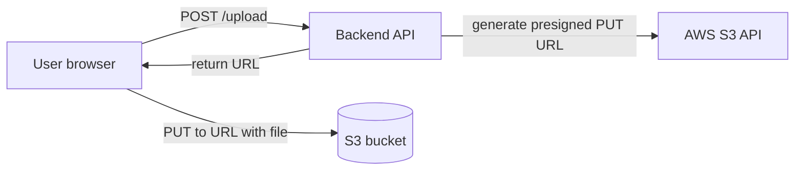

# 🎓 S3 deep + IAM fundamentals

> **Tác giả:** Mr.Rom\
> **Phiên bản:** v1.0.0\
> **Tạo lúc:** 24/05/2026\
> **Cập nhật:** 24/05/2026\
> **Level:** Basic\
> **Tags:** [MUST-KNOW]\
> **Thời lượng đọc:** ~22 phút\
> **Prerequisites:** [01_ec2-and-ebs-compute.md](01_ec2-and-ebs-compute.md), [Cloud security basic](../../../cloud-fundamentals/lessons/01_basic/04_cloud-security-and-shared-responsibility.md)

> 🎯 *S3 = AWS's flagship storage. 90% AWS apps touch S3. Bài này deep: bucket policy, presigned URL, lifecycle, CORS, static website, versioning, encryption. IAM cho S3: users, roles, policies, common patterns. Build static website + secure file uploads.*

## 🎯 Sau bài này bạn sẽ

- [ ] Tạo + manage S3 buckets (Console + CLI + SDK)
- [ ] **Bucket policy** vs **IAM policy** — when each
- [ ] **Presigned URL** cho time-limited access
- [ ] **Lifecycle policy** auto move storage tiers
- [ ] **Versioning** + **MFA delete**
- [ ] **CORS** cho frontend upload
- [ ] **Static website hosting** + CloudFront
- [ ] **Encryption** SSE-S3 / SSE-KMS / Client-side
- [ ] **IAM** users, roles, policies cho S3
- [ ] **Service-to-service IAM** (EC2 reads S3 via IAM role)

---

## Tình huống — Upload file từ frontend SPA → AWS S3

Build React app, user upload images:
- File large (5MB).
- Upload qua API backend → backend → S3 = bottleneck + bandwidth cost.
- Better: frontend uploads **directly to S3** (presigned URL).

But:
- S3 bucket should NOT be public.
- User shouldn't have AWS credentials.
- Need secure temporary access.

Sếp: *"Use S3 presigned URL pattern. Backend gives frontend a time-limited URL, user uploads direct. Bài này dạy."*

→ Bài này: S3 deep + IAM correct pattern.

---

## 1️⃣ S3 basics refresher

🪞 **Ẩn dụ**: *S3 như **kho hàng tự phục vụ vô hạn** — bạn không cần quan tâm kệ nào, kho nào; bạn chỉ cần dán mã vạch (key) cho gói hàng (object). IAM là thẻ ra-vào kho — ai cầm thẻ nào thì lấy được kệ nào; presigned URL là "vé một lần" để khách hàng vào tự lấy gói hàng mà không cần thẻ.*

(Recall cloud-fundamentals bài 03.)

- **Bucket** = top-level container (globally unique name).
- **Object** = data + metadata (key + value).
- **Key** = path within bucket: `2026/photos/cat.jpg`.

### S3 URL formats

```
# Virtual hosted-style (recommend 2026)
https://bucket-name.s3.us-east-1.amazonaws.com/key
https://bucket-name.s3.amazonaws.com/key       (older, deprecated)

# Path-style (deprecated 2020+, removed for new buckets)
https://s3.us-east-1.amazonaws.com/bucket-name/key
```

→ Use virtual hosted-style. Path-style being phased out.

### CLI basics

```bash
# Create bucket
aws s3 mb s3://my-unique-bucket-name --region ap-southeast-1

# Upload
aws s3 cp local.txt s3://my-bucket/path/
aws s3 cp local-dir/ s3://my-bucket/folder/ --recursive

# Sync (efficient)
aws s3 sync ./local s3://my-bucket/folder/

# Download
aws s3 cp s3://my-bucket/file.txt ./

# List
aws s3 ls s3://my-bucket/
aws s3 ls s3://my-bucket/folder/ --recursive --human-readable --summarize

# Delete
aws s3 rm s3://my-bucket/file.txt
aws s3 rb s3://my-bucket --force   # delete bucket + contents

# Move
aws s3 mv s3://bucket/old.txt s3://bucket/new.txt
```

### SDK example (Python)

```python
import boto3

s3 = boto3.client('s3')

# Upload
s3.upload_file('local.txt', 'my-bucket', 'remote.txt')

# Download
s3.download_file('my-bucket', 'remote.txt', 'local.txt')

# List
response = s3.list_objects_v2(Bucket='my-bucket', Prefix='folder/')
for obj in response.get('Contents', []):
    print(obj['Key'], obj['Size'])

# Delete
s3.delete_object(Bucket='my-bucket', Key='remote.txt')

# Generate presigned URL (next section)
url = s3.generate_presigned_url(
    'get_object',
    Params={'Bucket': 'my-bucket', 'Key': 'remote.txt'},
    ExpiresIn=3600   # 1 hour
)
```

---

## 2️⃣ Bucket policy vs IAM policy

### Two policy systems

**IAM policy** (attached to user/role/group):
- "What can this **identity** do?"
- Says: alice can read bucket-A.

**Bucket policy** (attached to bucket):
- "Who can do what with this **bucket**?"
- Says: bucket-A allows public read on /static/*.

→ Both can grant/deny. Both evaluated.

### Bucket policy example

```json
{
  "Version": "2012-10-17",
  "Statement": [
    {
      "Sid": "AllowPublicReadStatic",
      "Effect": "Allow",
      "Principal": "*",
      "Action": "s3:GetObject",
      "Resource": "arn:aws:s3:::my-bucket/static/*"
    },
    {
      "Sid": "DenyInsecureTransport",
      "Effect": "Deny",
      "Principal": "*",
      "Action": "s3:*",
      "Resource": [
        "arn:aws:s3:::my-bucket",
        "arn:aws:s3:::my-bucket/*"
      ],
      "Condition": {
        "Bool": { "aws:SecureTransport": "false" }
      }
    }
  ]
}
```

→ Allow public read for `/static/*`. Deny non-HTTPS access.

Apply:
```bash
aws s3api put-bucket-policy --bucket my-bucket --policy file://policy.json
```

### IAM policy example

```json
{
  "Version": "2012-10-17",
  "Statement": [{
    "Effect": "Allow",
    "Action": ["s3:GetObject", "s3:PutObject"],
    "Resource": "arn:aws:s3:::my-bucket/users/${aws:userid}/*"
  }]
}
```

→ User can only access their own folder via `${aws:userid}`.

### When use which?

| Scenario | Use |
|---|---|
| Make some objects public | Bucket policy |
| Grant cross-account access | Bucket policy (with cross-account principal) |
| Grant specific IAM users access | IAM policy on user |
| Force HTTPS | Bucket policy (deny non-HTTPS) |
| Force encryption | Bucket policy (deny unencrypted PUT) |
| Service role access | IAM policy attached to role |

**Both together** = common. Bucket policy sets boundaries; IAM policy grants specific access.

### Block Public Access (BPA)

**Account + bucket level** override that **blocks public access** regardless of policy:

```bash
aws s3api put-public-access-block --bucket my-bucket \
  --public-access-block-configuration \
    BlockPublicAcls=true,IgnorePublicAcls=true,BlockPublicPolicy=true,RestrictPublicBuckets=true
```

→ Even if bucket policy says `"Principal": "*"`, BPA blocks. Safe by default.

→ **Enable account-wide** as Day 1 baseline.

---

## 3️⃣ Presigned URL — Secure temporary access

### Use case

User uploads photo via frontend:
- User has no AWS credentials.
- Bucket private.
- Backend gives time-limited URL for upload/download.

### Workflow



### Generate presigned URL

```python
import boto3
s3 = boto3.client('s3')

# Presigned GET (download)
url = s3.generate_presigned_url(
    ClientMethod='get_object',
    Params={
        'Bucket': 'my-bucket',
        'Key': 'photos/cat.jpg'
    },
    ExpiresIn=3600   # 1 hour
)

# Presigned PUT (upload)
upload_url = s3.generate_presigned_url(
    ClientMethod='put_object',
    Params={
        'Bucket': 'my-bucket',
        'Key': f'uploads/{user_id}/{filename}',
        'ContentType': 'image/jpeg',
    },
    ExpiresIn=600   # 10 minutes
)
```

### FastAPI endpoint example

```python
from fastapi import FastAPI
from pydantic import BaseModel
import boto3, uuid

app = FastAPI()
s3 = boto3.client('s3')

class UploadRequest(BaseModel):
    filename: str
    content_type: str

@app.post("/api/upload-url")
async def get_upload_url(req: UploadRequest, current_user_id: str):
    object_key = f"uploads/{current_user_id}/{uuid.uuid4()}-{req.filename}"
    
    url = s3.generate_presigned_url(
        'put_object',
        Params={
            'Bucket': 'my-bucket',
            'Key': object_key,
            'ContentType': req.content_type,
        },
        ExpiresIn=600
    )
    
    return {
        'upload_url': url,
        'object_key': object_key,
        'expires_in': 600
    }
```

### Frontend upload

```javascript
// 1. Get presigned URL from backend
const { upload_url, object_key } = await fetch('/api/upload-url', {
  method: 'POST',
  body: JSON.stringify({
    filename: file.name,
    content_type: file.type
  }),
  headers: { 'Content-Type': 'application/json' }
}).then(r => r.json());

// 2. Upload directly to S3
await fetch(upload_url, {
  method: 'PUT',
  body: file,
  headers: { 'Content-Type': file.type }
});

// 3. Notify backend of completion
await fetch('/api/upload-complete', {
  method: 'POST',
  body: JSON.stringify({ object_key })
});
```

### Presigned POST (for browser uploads)

Alternative: **Presigned POST** allows:
- Browser-friendly (multipart form).
- Conditions (content-type, size limit).

```python
post = s3.generate_presigned_post(
    Bucket='my-bucket',
    Key=f'uploads/{uuid.uuid4()}',
    Conditions=[
        ['content-length-range', 0, 5_000_000],   # max 5 MB
        ['starts-with', '$Content-Type', 'image/']
    ],
    ExpiresIn=600
)
```

```javascript
const formData = new FormData();
Object.entries(post.fields).forEach(([k, v]) => formData.append(k, v));
formData.append('file', file);

await fetch(post.url, { method: 'POST', body: formData });
```

→ Server-enforced size/type limits.

### Why this pattern

**Without presigned URL**:
- User → API → backend → S3.
- Backend bandwidth: GB of traffic per upload.
- Cost: data transfer + API server time.

**With presigned URL**:
- User → API (small request) for URL.
- User → S3 direct upload.
- Backend handles 0 bytes of upload data.

→ Scale better. Cheaper.

---

## 4️⃣ Lifecycle policies

### Move objects through storage tiers

```json
{
  "Rules": [
    {
      "Id": "AutoTiering",
      "Status": "Enabled",
      "Filter": { "Prefix": "logs/" },
      "Transitions": [
        { "Days": 30, "StorageClass": "STANDARD_IA" },
        { "Days": 90, "StorageClass": "GLACIER_IR" },
        { "Days": 365, "StorageClass": "DEEP_ARCHIVE" }
      ],
      "Expiration": {
        "Days": 2555    // 7 years for compliance
      },
      "NoncurrentVersionExpiration": {
        "NoncurrentDays": 90
      }
    }
  ]
}
```

Apply:
```bash
aws s3api put-bucket-lifecycle-configuration \
  --bucket my-bucket \
  --lifecycle-configuration file://lifecycle.json
```

### Common patterns

**Logs**:
- Day 0-30: Standard (hot, recent debugging).
- Day 30-90: Standard-IA.
- Day 90-365: Glacier Instant Retrieval.
- Day 365+: Deep Archive.
- Day 2555 (7 years): Delete.

**User uploads**:
- Day 0-90: Standard.
- Day 90+: Intelligent-Tiering (auto-tier).

**Backups**:
- Day 0-30: Standard.
- Day 30+: Glacier Instant.
- Day 365+: Deep Archive.
- Keep forever (or compliance window).

**Temp files**:
- Day 7: delete.

→ Lifecycle saves 50-80% storage cost.

---

## 5️⃣ Versioning + MFA Delete

### Versioning

Enable:
```bash
aws s3api put-bucket-versioning \
  --bucket my-bucket \
  --versioning-configuration Status=Enabled
```

Result:
- Every PUT creates new version.
- DELETE marks delete marker (file appears gone, version still there).
- Restore: copy old version forward.

```bash
# List versions
aws s3api list-object-versions --bucket my-bucket --prefix file.txt

# Restore specific version
aws s3 cp s3://my-bucket/file.txt?versionId=abc s3://my-bucket/file.txt
```

### Use cases

- **Accidental delete recovery**: restore prev version.
- **Compliance**: audit trail of changes.
- **Ransomware mitigation**: versions of pre-encrypted files survive.

### Cost

Each version = stored separately. 100 versions of 1MB file = 100MB storage.

→ Combine with lifecycle policy:
```json
"NoncurrentVersionTransitions": [
  { "NoncurrentDays": 30, "StorageClass": "GLACIER_IR" }
],
"NoncurrentVersionExpiration": {
  "NoncurrentDays": 365
}
```

→ Old versions → Glacier → eventually deleted.

### MFA Delete

For **extra protection on delete**:

```bash
aws s3api put-bucket-versioning \
  --bucket my-bucket \
  --versioning-configuration Status=Enabled,MFADelete=Enabled \
  --mfa "arn:aws:iam::ACCOUNT:mfa/user 123456"
```

→ Permanently delete version requires MFA. Useful for compliance, ransomware.

⚠️ Only enable via root account. Disabling also requires MFA.

---

## 6️⃣ CORS for frontend upload

### Problem

Browser blocks cross-origin requests by default. Frontend `app.acmeshop.vn` calls S3 `my-bucket.s3.amazonaws.com` = CORS error.

### Solution: CORS config

```json
[
  {
    "AllowedOrigins": ["https://app.acmeshop.vn"],
    "AllowedMethods": ["GET", "PUT", "POST", "DELETE", "HEAD"],
    "AllowedHeaders": ["*"],
    "ExposeHeaders": ["ETag"],
    "MaxAgeSeconds": 3000
  }
]
```

Apply:
```bash
aws s3api put-bucket-cors \
  --bucket my-bucket \
  --cors-configuration file://cors.json
```

### CORS subtleties

- `AllowedOrigins`: include schema (`https://`).
- `MaxAgeSeconds`: browser cache preflight response.
- Preflight: OPTIONS request before actual request.
- `*` wildcard supported, but specific origins safer.

### Browser checks

```javascript
// Browser console
fetch('https://my-bucket.s3.amazonaws.com/file.txt')
  .then(r => r.text())
  .then(console.log);
// CORS error if origin not allowed.
```

→ Set CORS once per bucket. Tested in browser, not curl.

---

## 7️⃣ Static website hosting

### Use case

Host static site (HTML/CSS/JS) directly on S3 — no server.

### Setup

```bash
# Enable static hosting
aws s3 website s3://my-bucket/ \
  --index-document index.html \
  --error-document error.html

# Bucket policy (public read)
aws s3api put-bucket-policy --bucket my-bucket --policy '{
  "Version": "2012-10-17",
  "Statement": [{
    "Sid": "PublicRead",
    "Effect": "Allow",
    "Principal": "*",
    "Action": "s3:GetObject",
    "Resource": "arn:aws:s3:::my-bucket/*"
  }]
}'

# Disable Block Public Access (carefully!)
aws s3api put-public-access-block --bucket my-bucket \
  --public-access-block-configuration \
    BlockPublicAcls=false,IgnorePublicAcls=false,BlockPublicPolicy=false,RestrictPublicBuckets=false
```

→ Access: `http://my-bucket.s3-website-us-east-1.amazonaws.com`.

### Issues with S3 static hosting alone

- **HTTP only** (no HTTPS).
- **No custom domain TLS**.
- **No CDN**.
- **No edge logic**.

### Solution: CloudFront in front

```
User → CloudFront (CDN, HTTPS) → S3 bucket (private with OAI)
```

```bash
# 1. Create CloudFront distribution pointing to S3
# 2. Use Origin Access Identity (OAI) so S3 only accessible via CloudFront
# 3. Add custom domain + ACM certificate
# 4. Block public access on S3 (only CloudFront has access)
```

Bucket policy with OAI:
```json
{
  "Statement": [{
    "Effect": "Allow",
    "Principal": {
      "AWS": "arn:aws:iam::cloudfront:user/CloudFront Origin Access Identity ABC123"
    },
    "Action": "s3:GetObject",
    "Resource": "arn:aws:s3:::my-bucket/*"
  }]
}
```

→ **Modern pattern**: CloudFront + S3 with OAI. Block Public Access enabled.

### Alternative for SPA hosting

- **Vercel / Netlify**: easier (CDN + git deploy built-in).
- **AWS Amplify**: AWS-native SPA hosting.
- **Cloudflare Pages**: CDN with edge functions.

→ S3 + CloudFront still works, but more setup.

---

## 8️⃣ Encryption

### Server-side encryption (SSE)

**SSE-S3** (default 2026):
- AWS manages keys.
- Free.
- Use case: most data.

**SSE-KMS**:
- KMS customer-managed keys.
- Audit log per access.
- BYOK supported.
- Use case: PII, PHI, compliance.

**SSE-C**:
- You supply key per request.
- AWS doesn't store key.
- Use case: ultra-sensitive, you manage keys offline.

### Enable default encryption

```bash
aws s3api put-bucket-encryption --bucket my-bucket \
  --server-side-encryption-configuration '{
    "Rules": [{
      "ApplyServerSideEncryptionByDefault": {
        "SSEAlgorithm": "aws:kms",
        "KMSMasterKeyID": "arn:aws:kms:..."
      },
      "BucketKeyEnabled": true
    }]
  }'
```

→ All uploads auto-encrypted with KMS.

### Force encryption on upload

Bucket policy:
```json
{
  "Effect": "Deny",
  "Action": "s3:PutObject",
  "Resource": "arn:aws:s3:::my-bucket/*",
  "Condition": {
    "StringNotEquals": {
      "s3:x-amz-server-side-encryption": "aws:kms"
    }
  }
}
```

→ Reject upload without encryption header.

### Client-side encryption

Encrypt before upload, decrypt after download.

```python
from cryptography.fernet import Fernet

key = Fernet.generate_key()
cipher = Fernet(key)

# Encrypt
encrypted = cipher.encrypt(b"secret data")
s3.put_object(Bucket='my-bucket', Key='encrypted.bin', Body=encrypted)

# Decrypt
obj = s3.get_object(Bucket='my-bucket', Key='encrypted.bin')
decrypted = cipher.decrypt(obj['Body'].read())
```

→ AWS sees only encrypted blob. Strongest guarantee.

---

## 9️⃣ IAM for S3 deep

### IAM identity types

**User**: human, has password + access keys.
**Group**: collection of users.
**Role**: assumed by services (EC2, Lambda) or users (cross-account).

### Policy structure

```json
{
  "Version": "2012-10-17",
  "Statement": [
    {
      "Sid": "OptionalIdentifier",
      "Effect": "Allow",    // or "Deny"
      "Action": ["s3:GetObject"],
      "Resource": "arn:aws:s3:::my-bucket/*",
      "Condition": {
        "IpAddress": { "aws:SourceIp": "1.2.3.4/32" }
      }
    }
  ]
}
```

### Common S3 IAM policies

**Read-only S3 user**:
```json
{
  "Effect": "Allow",
  "Action": [
    "s3:GetObject",
    "s3:ListBucket"
  ],
  "Resource": [
    "arn:aws:s3:::my-bucket",
    "arn:aws:s3:::my-bucket/*"
  ]
}
```

**App needs to read/write specific prefix**:
```json
{
  "Effect": "Allow",
  "Action": ["s3:GetObject", "s3:PutObject", "s3:DeleteObject"],
  "Resource": "arn:aws:s3:::my-bucket/app-data/*"
}
```

**User-scoped folder**:
```json
{
  "Effect": "Allow",
  "Action": ["s3:GetObject", "s3:PutObject"],
  "Resource": "arn:aws:s3:::my-bucket/users/${aws:userid}/*"
}
```

→ `${aws:userid}` placeholder = actual user's ID at runtime.

### EC2 reads S3 via IAM role

**Not via access keys**. Attach IAM role:

```hcl
resource "aws_iam_role" "app" {
  name = "app-role"
  assume_role_policy = jsonencode({
    Statement = [{
      Effect = "Allow"
      Principal = { Service = "ec2.amazonaws.com" }
      Action = "sts:AssumeRole"
    }]
  })
}

resource "aws_iam_role_policy" "s3" {
  role = aws_iam_role.app.id
  policy = jsonencode({
    Statement = [{
      Effect = "Allow"
      Action = ["s3:GetObject", "s3:PutObject"]
      Resource = "arn:aws:s3:::my-bucket/*"
    }]
  })
}

resource "aws_iam_instance_profile" "app" {
  name = "app-profile"
  role = aws_iam_role.app.name
}

resource "aws_instance" "app" {
  iam_instance_profile = aws_iam_instance_profile.app.name
  # No access keys needed!
}
```

Inside EC2:
```python
import boto3
# AWS SDK auto-fetches credentials from instance metadata
s3 = boto3.client('s3')
s3.get_object(Bucket='my-bucket', Key='file.txt')
```

→ Credentials auto-rotated. No leaked keys.

### Lambda + S3 IAM

```hcl
resource "aws_iam_role" "lambda" {
  assume_role_policy = jsonencode({
    Statement = [{
      Effect = "Allow"
      Principal = { Service = "lambda.amazonaws.com" }
      Action = "sts:AssumeRole"
    }]
  })
}

resource "aws_iam_role_policy_attachment" "lambda_logs" {
  role = aws_iam_role.lambda.name
  policy_arn = "arn:aws:iam::aws:policy/service-role/AWSLambdaBasicExecutionRole"
}

resource "aws_iam_role_policy" "lambda_s3" {
  role = aws_iam_role.lambda.id
  policy = jsonencode({
    Statement = [{
      Effect = "Allow"
      Action = ["s3:GetObject"]
      Resource = "arn:aws:s3:::my-bucket/*"
    }]
  })
}
```

### Cross-account access

Bucket policy in Account A:
```json
{
  "Effect": "Allow",
  "Principal": { "AWS": "arn:aws:iam::ACCOUNT_B:root" },
  "Action": ["s3:GetObject", "s3:PutObject"],
  "Resource": "arn:aws:s3:::my-bucket/*"
}
```

Account B's user must also have IAM policy granting S3 access to that bucket.

→ Both bucket policy (Account A) AND IAM policy (Account B) needed.

---

## 🔟 Hands-on: Static blog + secure file upload

### Goal

1. **Static website** (blog) on S3 + CloudFront.
2. **Secure file upload** via presigned URL.

### Part 1: Static website

```bash
# Create bucket
BUCKET=acme-blog-$(aws sts get-caller-identity --query Account --output text)
aws s3 mb s3://$BUCKET --region ap-southeast-1

# Upload site
aws s3 sync ./dist s3://$BUCKET/ \
  --cache-control "public, max-age=3600" \
  --metadata-directive REPLACE

# Specifically static assets — longer cache
aws s3 sync ./dist/assets s3://$BUCKET/assets/ \
  --cache-control "public, max-age=31536000, immutable"
```

### CloudFront in front

```bash
# 1. Create CloudFront Origin Access Identity (OAI)
OAI_ID=$(aws cloudfront create-cloud-front-origin-access-identity \
  --cloud-front-origin-access-identity-config \
    CallerReference=$(date +%s),Comment="OAI for blog" \
  --query 'CloudFrontOriginAccessIdentity.Id' \
  --output text)

# 2. Bucket policy allowing CloudFront only
aws s3api put-bucket-policy --bucket $BUCKET --policy "{
  \"Version\": \"2012-10-17\",
  \"Statement\": [{
    \"Effect\": \"Allow\",
    \"Principal\": {
      \"AWS\": \"arn:aws:iam::cloudfront:user/CloudFront Origin Access Identity $OAI_ID\"
    },
    \"Action\": \"s3:GetObject\",
    \"Resource\": \"arn:aws:s3:::$BUCKET/*\"
  }]
}"

# 3. Create distribution (interactive via Console or detailed JSON)
# blog.acmeshop.vn → CloudFront → $BUCKET

# 4. Custom domain via ACM cert + Route 53 alias
```

→ Result: `https://blog.acmeshop.vn` (HTTPS, CDN, low latency, low cost).

### Part 2: File upload backend

`upload_api.py`:
```python
from fastapi import FastAPI
from pydantic import BaseModel
import boto3, uuid

app = FastAPI()
s3 = boto3.client('s3')
UPLOAD_BUCKET = 'acme-uploads'

class UploadReq(BaseModel):
    filename: str
    content_type: str

@app.post("/api/upload-url")
async def generate_upload_url(req: UploadReq, user_id: str = "demo"):
    key = f"uploads/{user_id}/{uuid.uuid4()}/{req.filename}"
    
    url = s3.generate_presigned_url(
        'put_object',
        Params={
            'Bucket': UPLOAD_BUCKET,
            'Key': key,
            'ContentType': req.content_type,
        },
        ExpiresIn=600
    )
    
    return {'upload_url': url, 'object_key': key}

@app.get("/api/download-url")
async def generate_download_url(key: str):
    url = s3.generate_presigned_url(
        'get_object',
        Params={'Bucket': UPLOAD_BUCKET, 'Key': key},
        ExpiresIn=3600
    )
    return {'download_url': url}
```

Run via uvicorn:
```bash
uvicorn upload_api:app --host 0.0.0.0 --port 8000
```

### Bucket setup

```bash
aws s3 mb s3://acme-uploads --region ap-southeast-1

# Block public access
aws s3api put-public-access-block --bucket acme-uploads \
  --public-access-block-configuration \
    BlockPublicAcls=true,IgnorePublicAcls=true,BlockPublicPolicy=true,RestrictPublicBuckets=true

# CORS for frontend
aws s3api put-bucket-cors --bucket acme-uploads --cors-configuration '{
  "CORSRules": [{
    "AllowedOrigins": ["https://app.acmeshop.vn"],
    "AllowedMethods": ["GET", "PUT", "POST", "HEAD"],
    "AllowedHeaders": ["*"],
    "MaxAgeSeconds": 3000
  }]
}'

# Encryption
aws s3api put-bucket-encryption --bucket acme-uploads \
  --server-side-encryption-configuration '{
    "Rules": [{
      "ApplyServerSideEncryptionByDefault": { "SSEAlgorithm": "AES256" }
    }]
  }'

# Lifecycle (cleanup old uploads after 30 days for free tier)
aws s3api put-bucket-lifecycle-configuration --bucket acme-uploads --lifecycle-configuration '{
  "Rules": [{
    "Id": "ExpireAfter30Days",
    "Status": "Enabled",
    "Filter": { "Prefix": "uploads/" },
    "Expiration": { "Days": 30 }
  }]
}'
```

### Frontend test

```html
<script>
async function uploadFile(file) {
  const { upload_url, object_key } = await fetch('/api/upload-url', {
    method: 'POST',
    body: JSON.stringify({ filename: file.name, content_type: file.type }),
    headers: { 'Content-Type': 'application/json' }
  }).then(r => r.json());
  
  await fetch(upload_url, {
    method: 'PUT',
    body: file,
    headers: { 'Content-Type': file.type }
  });
  
  console.log('Uploaded to:', object_key);
}
</script>
```

→ User uploads file → presigned URL → direct to S3. Backend handles 0 bytes of upload data.

---

## 💡 Pitfall & Best practice

### ❌ Pitfall: Public S3 bucket leak

→ "Set public for testing" → forget → PII leaked.

→ **Fix**:
- Block Public Access account-wide.
- CloudFront + OAI instead of public.
- AWS Config rule detect public buckets.
- Quarterly audit.

### ❌ Pitfall: Long-lived access keys in app

→ App has AWS access key in env. Leaked → AWS account compromised.

→ **Fix**:
- EC2: IAM role (instance profile).
- Lambda: execution role.
- Local dev: SSO temporary credentials.
- CI/CD: OIDC federation.
- **Zero access keys** in code, env, config files.

### ❌ Pitfall: Presigned URL no expiry / too long

```python
generate_presigned_url(..., ExpiresIn=604800)   # 7 days!
```

→ URL leaked = 7-day window for abuse.

→ **Fix**: 10-60 minutes typical. Just enough for the action.

### ❌ Pitfall: No lifecycle policy

→ Logs accumulate forever. Bill grows.

→ **Fix**: lifecycle policy from Day 1.

### ❌ Pitfall: No versioning on critical bucket

→ User accident delete → data gone.

→ **Fix**: versioning enabled. Lifecycle for old versions.

### ❌ Pitfall: Bucket name collision

→ `mybucket` taken. Error "BucketAlreadyExists" or "AccessDenied".

→ **Fix**: unique naming pattern: `{org}-{purpose}-{account-id}`.

### ❌ Pitfall: Force HTTPS not enforced

→ Bucket allows HTTP requests = data in clear.

→ **Fix**: bucket policy deny `aws:SecureTransport=false`.

### ❌ Pitfall: No encryption default

→ Some uploads not encrypted.

→ **Fix**: default encryption enabled at bucket level.

### ✅ Best practice: BPA + KMS + HTTPS Day 1

Every bucket Day 1:
1. Block Public Access on.
2. Default encryption (SSE-S3 or SSE-KMS).
3. Versioning on (for important buckets).
4. Bucket policy deny non-HTTPS.
5. Lifecycle policy for cleanup.
6. CloudWatch metrics enabled.

### ✅ Best practice: IAM role pattern

Hierarchy:
- **User/SSO**: humans.
- **Group**: collection.
- **Role**: services + cross-account.
- **Permission boundary**: max permissions limit.

### ✅ Best practice: Tagging for cost

Every bucket tagged:
```hcl
tags = {
  Environment = "prod"
  Service     = "api"
  Team        = "backend"
  CostCenter  = "engineering"
  DataClass   = "PII"
}
```

→ Cost Explorer + Macie filter by tags.

### ✅ Best practice: S3 Object Ownership = "Bucket Owner Enforced"

(2026 default for new buckets)

→ All objects owned by bucket owner. No ACL complications.

---

## 🧠 Self-check

**Q1.** Bucket policy vs IAM policy — when each?

<details>
<summary>💡 Đáp án</summary>

**Both work, sometimes overlap. Differences**:

**Bucket policy** (resource-based):
- Attached to **bucket**.
- "What can be done with **this bucket**?"
- Specifies **principal** (who).
- Use cases:
  - Make objects public.
  - Cross-account access.
  - Force HTTPS / encryption.
  - Deny non-AWS IPs.

**IAM policy** (identity-based):
- Attached to **user/role/group**.
- "What can this **identity** do?"
- No principal (identity is implicit).
- Use cases:
  - Grant specific user/role permissions.
  - Cross-resource access (user → many buckets).
  - Service role for EC2/Lambda.

**Decision matrix**:

| Scenario | Policy type |
|---|---|
| App role needs to read 5 buckets | IAM policy on role |
| One specific bucket has public folder | Bucket policy |
| Cross-account: AccountB reads AccountA's bucket | Bucket policy (in A) + IAM policy (in B) |
| Force encryption upload to specific bucket | Bucket policy |
| User can only access their own folder | IAM policy with `${aws:userid}` |
| Deny all uploads outside HTTPS | Bucket policy |

**Combined**:
- Both evaluated.
- Explicit Deny in **either** = denied.
- Allow needs both: bucket policy + IAM policy (if cross-account).

**Same account, simple case**:
- IAM policy alone usually sufficient.
- Bucket policy not needed.

**Real example**:

1. **App reads my-bucket** (same account):
   - IAM policy on app role: `s3:GetObject on arn:aws:s3:::my-bucket/*`.
   - No bucket policy needed.

2. **Make /static/* public**:
   - Bucket policy: `Allow s3:GetObject Principal * on /static/*`.
   - Plus Block Public Access carefully.

3. **AccountB lambda reads AccountA bucket**:
   - Bucket policy (A): `Allow Principal arn:aws:iam::B:role/lambda-role`.
   - IAM policy (B): `Allow s3:GetObject on arn:aws:s3:::a-bucket/*`.

**Best practice**: prefer IAM policies for granular. Bucket policy for cross-account or bucket-wide rules.
</details>

**Q2.** Presigned URL — security considerations?

<details>
<summary>💡 Đáp án</summary>

**Presigned URL = signed URL with expiry** that anyone with URL can use.

**Security considerations**:

**1. Expiry time**:
- Too short: user fails upload mid-way.
- Too long: leak = long-term abuse.
- **Recommend**: 5-60 minutes for uploads, 1-24 hours for downloads.

**2. URL leakage**:
- URL ends in browser history.
- Logs (server, proxy, CDN).
- Shared via Slack/email.
- → Treat URL as **secret** until expires.

**3. Principal context**:
- Presigned URL inherits **generator's permissions**.
- If generator has `s3:*`, presigned URL can do `s3:*` on that object.
- Generate with **minimal permissions** identity (IAM role for app).

**4. Conditions**:
- Standard presigned URL: just URL + signature.
- **Presigned POST**: can include conditions:
  ```python
  Conditions=[
    ['content-length-range', 0, 5_000_000],   # max 5 MB
    ['starts-with', '$Content-Type', 'image/'],
    {'x-amz-server-side-encryption': 'AES256'}
  ]
  ```
- Server-enforced limits via POST presigned.

**5. HTTPS only**:
- Always serve presigned URL over HTTPS.
- Bucket policy enforce HTTPS:
  ```json
  "Condition": { "Bool": { "aws:SecureTransport": "false" } },
  "Effect": "Deny"
  ```

**6. Verify upload**:
- Backend gives URL.
- User uploads.
- **Verify with backend** before counting as done.
- Don't trust client "I uploaded" — verify object exists in S3.

**7. Rate limiting**:
- API endpoint giving presigned URLs = limit per user.
- Prevent abuse (10K URL/sec → 10K simultaneous uploads).

**8. Object ownership**:
- Bucket Owner Enforced (2026 default).
- Uploads automatically owned by bucket owner.

**9. Cleanup partial uploads**:
- User starts upload, abandons.
- **Multipart upload** debris: pay for incomplete data.
- Lifecycle policy:
  ```json
  "AbortIncompleteMultipartUpload": { "DaysAfterInitiation": 7 }
  ```

**10. Audit log**:
- CloudTrail logs presigned URL usage.
- Monitor unusual patterns (sudden spike, weird IP).

**Patterns**:

- **User profile pics**: presigned PUT, 10 min expiry, 5MB limit, content-type image/*.
- **Document download** (subscription): presigned GET, 1 hour, user must be authenticated to get URL.
- **Public download**: just public object, no presigned needed.
- **Internal report**: long-lived (24h) presigned for batch download.

**Anti-patterns**:

- Presigned URL valid 1 week → ticking time bomb.
- Same URL reused for multiple uploads.
- No upload size limit → user uploads 5GB cat video.
- No verification → relies on client "I uploaded".

→ Presigned URL = great pattern with discipline.
</details>

**Q3.** S3 lifecycle vs Intelligent-Tiering — choose?

<details>
<summary>💡 Đáp án</summary>

**S3 Intelligent-Tiering**:
- AWS auto-monitors access patterns.
- Moves objects between tiers automatically.
- Tiers: Frequent → Infrequent → Archive Instant → Archive (long-term).
- **Cost**: $0.0025 per 1000 objects monitored/month.

**Use Intelligent-Tiering when**:
- **Unknown access patterns**: can't predict if/when objects accessed.
- **Mixed objects**: some hot, some cold, varies per user.
- **Hands-off**: don't want to manage policies.
- **Object size > 128 KB**: small objects not eligible for archive tiers.

**Lifecycle policy (manual)**:
- You define transition rules.
- Predictable cost (no monitoring fee).

**Use lifecycle when**:
- **Known access patterns**: logs hot 30 days, cold after.
- **Predictable workload**: backups always archived after period.
- **Small objects**: < 128 KB (Intelligent doesn't help).
- **Strict compliance retention**: delete at exact day count.

**Cost comparison**:

Scenario: 1TB data, mixed access:

**Lifecycle Standard → IA at 30 → Glacier IR at 90**:
- Some objects accessed often (in Glacier = retrieval cost).
- Predicted: $30/month.

**Intelligent-Tiering**:
- AWS auto-tier based on actual access.
- Pay monitoring fee.
- Actual: $25/month (more accurate tier placement).

→ Intelligent-Tiering often wins for unpredictable workloads.

**Hybrid**:

```json
{
  "Rules": [
    {
      "Id": "TransitionToIntelligent",
      "Status": "Enabled",
      "Transitions": [
        { "Days": 0, "StorageClass": "INTELLIGENT_TIERING" }
      ]
    }
  ]
}
```

→ All new objects → Intelligent-Tiering. AWS optimizes after that.

**Specific case**:
- **Logs**: typically lifecycle (predictable hot→cold pattern).
- **User uploads**: Intelligent-Tiering (unpredictable access).
- **Backups**: lifecycle to Glacier (always cold).
- **Database snapshots**: lifecycle (predictable).
- **Media library** (mixed): Intelligent-Tiering.

**Verify with metrics**:
- CloudWatch S3 metrics: track storage class distribution.
- Cost Explorer: cost per storage class.

→ Default 2026: Intelligent-Tiering for unknown. Lifecycle for known.
</details>

**Q4.** EC2 → S3 access — access key vs IAM role?

<details>
<summary>💡 Đáp án</summary>

**Anti-pattern (access key)**:
```python
# Hardcoded or env var
import boto3
session = boto3.Session(
    aws_access_key_id='AKIAXXXXX',
    aws_secret_access_key='secret-key'
)
s3 = session.client('s3')
```

**Problems**:
1. **Leak risk**: key in code/env/Docker image. Git commit by mistake. Container introspection.
2. **No rotation**: key valid forever.
3. **Limited scope**: bound to specific IAM user, not service.
4. **Audit**: hard to attribute actions to specific compute resource.

**Best practice (IAM role)**:

```hcl
# Terraform
resource "aws_iam_role" "ec2_app" {
  name = "ec2-app-role"
  assume_role_policy = jsonencode({
    Statement = [{
      Effect = "Allow"
      Principal = { Service = "ec2.amazonaws.com" }
      Action = "sts:AssumeRole"
    }]
  })
}

resource "aws_iam_role_policy" "s3_access" {
  role = aws_iam_role.ec2_app.id
  policy = jsonencode({
    Statement = [{
      Effect = "Allow"
      Action = ["s3:GetObject", "s3:PutObject"]
      Resource = "arn:aws:s3:::my-bucket/*"
    }]
  })
}

resource "aws_iam_instance_profile" "ec2_app" {
  name = "ec2-app-profile"
  role = aws_iam_role.ec2_app.name
}

resource "aws_instance" "app" {
  iam_instance_profile = aws_iam_instance_profile.ec2_app.name
  # ... no access keys passed
}
```

```python
# Inside EC2:
import boto3
s3 = boto3.client('s3')   # SDK auto-fetches credentials
s3.get_object(Bucket='my-bucket', Key='file.txt')
```

**How SDK gets credentials**:
1. SDK looks at `~/.aws/credentials` (not present).
2. SDK looks at env vars (not present).
3. SDK queries **EC2 instance metadata** at `http://169.254.169.254/latest/meta-data/iam/security-credentials/{role-name}`.
4. AWS returns temporary credentials (1-hour TTL).
5. SDK uses + auto-refreshes.

**Benefits**:
1. **No leaked keys** — credentials never in code/env.
2. **Auto-rotation** — refreshed every hour.
3. **Audit clear** — CloudTrail logs show role + EC2 instance ID.
4. **Principle of least privilege** — role granted only what app needs.

**Other services use similar pattern**:
- **Lambda**: execution role.
- **ECS task**: task role.
- **EKS pod**: IRSA (IAM Roles for Service Accounts).
- **CodeBuild**: build role.

**IMDSv2** (Instance Metadata Service v2):
- Requires session token (PUT then GET).
- Mitigates SSRF attacks.
- Default 2026 for new EC2.

```bash
# IMDSv2 example
TOKEN=$(curl -X PUT "http://169.254.169.254/latest/api/token" -H "X-aws-ec2-metadata-token-ttl-seconds: 21600")
curl -H "X-aws-ec2-metadata-token: $TOKEN" http://169.254.169.254/latest/meta-data/iam/security-credentials/
```

→ Always IAM role for EC2 → S3. Never access keys.

**Migration path**:
1. Audit code for hardcoded keys.
2. Create IAM role with required permissions.
3. Attach instance profile to EC2.
4. Test SDK works without keys.
5. Remove env vars / hardcoded keys.
6. Rotate (invalidate) old keys.

→ Roll out across fleet.
</details>

**Q5.** S3 + CloudFront vs Vercel/Netlify — for static site?

<details>
<summary>💡 Đáp án</summary>

**S3 + CloudFront**:
- AWS-native.
- Setup: bucket + distribution + Route 53.
- Custom: tune cache, headers, edge functions.
- Cost: storage $0.023/GB + CloudFront egress + cache invalidation.

**Pros**:
- Full control.
- Integrate with AWS Lambda@Edge.
- Long-lived setup (no startup churn).
- Pay per use.

**Cons**:
- Setup complexity (1-2 hours first time).
- No git push deploy.
- No PR preview deployments by default.
- Manual cache invalidation needed.

**Vercel / Netlify**:
- SaaS PaaS for frontend.
- Git push → auto deploy.
- Preview deploys per PR.
- Built-in CDN, edge functions.

**Pros**:
- **Zero config**: connect Git, done.
- **Preview deploys**: per PR.
- **Built-in optimizations**: image transformation, smart caching.
- **Edge functions** built-in.
- Free tier generous (~100GB egress).

**Cons**:
- Pricing scales with usage ($20+/month easy).
- Vendor lock-in (Next.js features Vercel-specific).
- Less custom than AWS.

**Choose Vercel/Netlify when**:
- **Pure frontend** (SPA, SSG, SSR).
- **Small team, fast iteration**.
- **Next.js / Nuxt / SvelteKit** projects.
- **Want PR preview deploys**.
- **Don't want infra ops**.

**Choose S3 + CloudFront when**:
- **AWS-only stack**.
- **Custom CDN logic** (Lambda@Edge).
- **Cost control at scale** ($1000+/month).
- **Compliance**: AWS-specific certifications.
- **Existing AWS pipeline**.

**Hybrid**:
- Static blog: Cloudflare Pages (cheap CDN).
- Dynamic frontend: Vercel.
- Internal tools: S3 + CloudFront.
- Different sites, different tools.

**Cost comparison** (small blog, 10K visits/month):

- **S3 + CloudFront**: 
  - Storage: 5GB × $0.023 = $0.12.
  - CloudFront egress: 50GB × $0.085 = $4.25.
  - Requests: minimal.
  - **Total**: ~$5/month.

- **Vercel Free tier**:
  - 100GB egress free.
  - **$0/month**.

→ Small site: Vercel/Netlify free tier wins.

**Cost at scale** (100K visits/month, lots of bandwidth):

- **S3 + CloudFront**: $100-200/month (predictable per-GB).
- **Vercel Pro**: $20-$200/month (varies on bandwidth, can spike).

→ Predictable AWS pricing wins at scale.

**Recommendation 2026**:
- Side project / personal: Vercel/Netlify/Cloudflare Pages (free or cheap).
- Startup B2C: Vercel.
- Scale stage B2C: S3 + CloudFront for cost predictability.
- Internal AWS-shop: S3 + CloudFront.
- Multi-region geographic: Cloudflare Pages (global edge).

→ No one-size-fits-all. Pick by team + scale.
</details>

---

## ⚡ Cheatsheet

```bash
# === S3 ===
aws s3 mb s3://bucket --region ap-southeast-1
aws s3 cp file.txt s3://bucket/
aws s3 cp s3://bucket/file.txt ./
aws s3 sync ./local s3://bucket/
aws s3 ls s3://bucket/
aws s3 rm s3://bucket/file.txt
aws s3 rb s3://bucket --force

# Bucket policy
aws s3api put-bucket-policy --bucket bucket --policy file://policy.json
aws s3api get-bucket-policy --bucket bucket

# Encryption
aws s3api put-bucket-encryption --bucket bucket --server-side-encryption-configuration file://encryption.json

# Versioning
aws s3api put-bucket-versioning --bucket bucket --versioning-configuration Status=Enabled

# Lifecycle
aws s3api put-bucket-lifecycle-configuration --bucket bucket --lifecycle-configuration file://lifecycle.json

# CORS
aws s3api put-bucket-cors --bucket bucket --cors-configuration file://cors.json

# Block Public Access
aws s3api put-public-access-block --bucket bucket \
  --public-access-block-configuration BlockPublicAcls=true,IgnorePublicAcls=true,BlockPublicPolicy=true,RestrictPublicBuckets=true

# === Presigned URL ===
aws s3 presign s3://bucket/file.txt --expires-in 3600
```

```python
# === Boto3 ===
import boto3
s3 = boto3.client('s3')

# Upload
s3.upload_file('local.txt', 'bucket', 'remote.txt')
s3.upload_fileobj(file_obj, 'bucket', 'key')

# Download
s3.download_file('bucket', 'remote.txt', 'local.txt')

# Presigned
url = s3.generate_presigned_url(
    'get_object',
    Params={'Bucket': 'bucket', 'Key': 'file.txt'},
    ExpiresIn=3600
)

# Presigned POST (with conditions)
post = s3.generate_presigned_post(
    Bucket='bucket', Key='file.txt',
    Conditions=[['content-length-range', 0, 5_000_000]],
    ExpiresIn=600
)

# List with prefix
for obj in s3.list_objects_v2(Bucket='bucket', Prefix='folder/').get('Contents', []):
    print(obj['Key'], obj['Size'])
```

```hcl
# === Terraform ===
resource "aws_s3_bucket" "main" {
  bucket = "my-bucket"
}

resource "aws_s3_bucket_public_access_block" "main" {
  bucket = aws_s3_bucket.main.id
  block_public_acls       = true
  block_public_policy     = true
  ignore_public_acls      = true
  restrict_public_buckets = true
}

resource "aws_s3_bucket_server_side_encryption_configuration" "main" {
  bucket = aws_s3_bucket.main.id
  rule {
    apply_server_side_encryption_by_default {
      sse_algorithm = "aws:kms"
      kms_master_key_id = aws_kms_key.s3.arn
    }
  }
}

resource "aws_s3_bucket_versioning" "main" {
  bucket = aws_s3_bucket.main.id
  versioning_configuration { status = "Enabled" }
}

resource "aws_s3_bucket_lifecycle_configuration" "main" {
  bucket = aws_s3_bucket.main.id
  rule {
    id     = "transition"
    status = "Enabled"
    transition {
      days          = 30
      storage_class = "STANDARD_IA"
    }
    transition {
      days          = 90
      storage_class = "GLACIER_IR"
    }
  }
}
```

---

## 📚 Glossary

| Term | Vietnamese / Explanation |
|---|---|
| **S3** | Simple Storage Service |
| **Bucket** | S3 top-level container (globally unique) |
| **Object** | Stored data + metadata |
| **Key** | Object path within bucket |
| **Prefix** | Folder-like grouping (s3 doesn't have real folders) |
| **Bucket policy** | Resource-based policy attached to bucket |
| **IAM policy** | Identity-based policy attached to user/role |
| **Presigned URL** | Time-limited URL with embedded signature |
| **Presigned POST** | Browser-friendly upload form with conditions |
| **Lifecycle policy** | Auto-transition / delete rules |
| **Storage class** | Standard / IA / Glacier / Deep Archive |
| **Intelligent-Tiering** | AWS auto-tier based on access |
| **Versioning** | Keep multiple object versions |
| **MFA Delete** | Require MFA for permanent delete |
| **CORS** | Cross-Origin Resource Sharing |
| **Static website hosting** | Serve HTML directly from S3 |
| **OAI** | Origin Access Identity (CloudFront → S3 private) |
| **OAC** | Origin Access Control (newer OAI alternative) |
| **SSE-S3** | Server-Side Encryption AWS keys |
| **SSE-KMS** | Server-Side Encryption KMS keys |
| **SSE-C** | Server-Side Encryption Customer keys |
| **BPA** | Block Public Access (account/bucket setting) |
| **IAM role** | Identity assumed by service (EC2, Lambda) |
| **Instance profile** | Container for IAM role attached to EC2 |
| **IMDSv2** | Instance Metadata Service v2 (SSRF mitigation) |
| **IRSA** | IAM Roles for Service Accounts (EKS) |
| **Bucket Owner Enforced** | Default ownership for new buckets 2026 |
| **ACL** | Access Control List (legacy, prefer policy) |
| **CloudFront OAI/OAC** | CloudFront-only access to S3 origin |
| **ETag** | Object content hash |

---

## 🔗 Liên kết & Tài nguyên

### Trong cluster
- ↶ Trước: [01_ec2-and-ebs-compute.md](01_ec2-and-ebs-compute.md)
- → Tiếp: [03_rds-and-dynamodb.md](03_rds-and-dynamodb.md) *(sắp viết)*
- ↑ Cluster: [AWS README](../../README.md)

### Cross-reference
- ☁️ [Cloud Fundamentals storage](../../../cloud-fundamentals/lessons/01_basic/03_storage-and-databases.md) — block/object/file
- ☁️ [Cloud Fundamentals security](../../../cloud-fundamentals/lessons/01_basic/04_cloud-security-and-shared-responsibility.md) — IAM context
- 🐍 [FastAPI basic](../../../../07_Web/backend/python-fastapi/) — backend integration

### Tài nguyên ngoài
- 📖 [S3 docs](https://docs.aws.amazon.com/s3/)
- 📖 [IAM docs](https://docs.aws.amazon.com/iam/)
- 📖 [S3 best practices](https://docs.aws.amazon.com/AmazonS3/latest/userguide/security-best-practices.html)
- 📖 [Presigned URL guide](https://docs.aws.amazon.com/AmazonS3/latest/userguide/PresignedUrlUploadObject.html)
- 📖 [IAM policy generator](https://awspolicygen.s3.amazonaws.com/policygen.html)
- 📖 [S3 pricing](https://aws.amazon.com/s3/pricing/)
- 📖 [Cloudflare R2](https://developers.cloudflare.com/r2/) — S3-compatible alternative

---

## 📌 Changelog

- **v1.0.0 (24/05/2026)** — Bài 02 AWS basic cluster. S3 deep (bucket policy + IAM policy + presigned URL + lifecycle + versioning + MFA delete + CORS + encryption + static hosting) + IAM fundamentals (users/roles/policies + EC2 instance profile + cross-account) + hands-on static blog + secure file upload pattern. 8 pitfall + 4 best practice + 5 self-check + cheatsheet.
