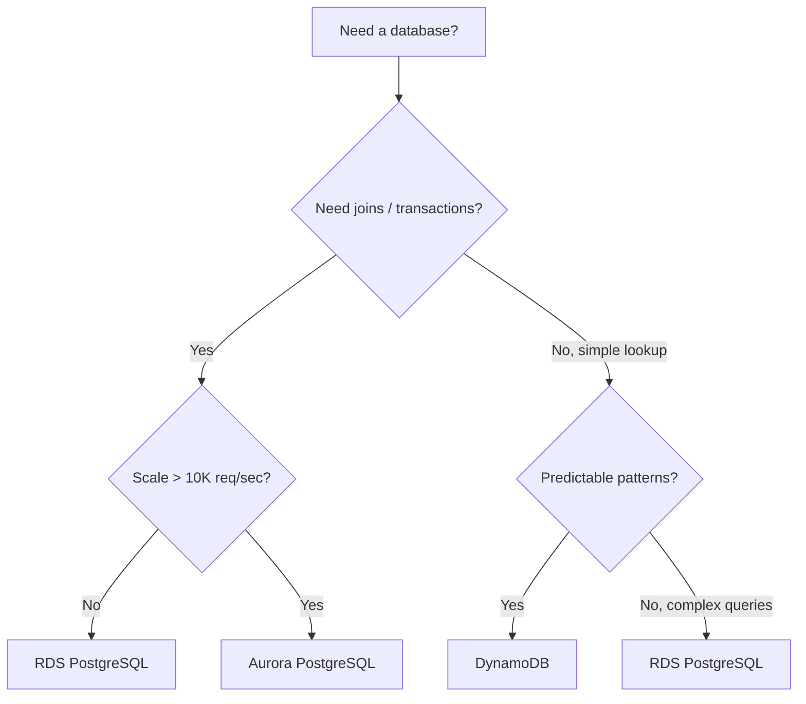

# 🎓 RDS + DynamoDB — Managed databases

> **Tác giả:** Mr.Rom\
> **Phiên bản:** v1.0.0\
> **Tạo lúc:** 24/05/2026\
> **Cập nhật:** 24/05/2026\
> **Level:** Basic\
> **Tags:** [MUST-KNOW]\
> **Thời lượng đọc:** ~20 phút\
> **Prerequisites:** [02_s3-deep-and-iam.md](02_s3-deep-and-iam.md), [PostgreSQL basic](../../../../06_Databases/postgresql/)

> 🎯 *2 managed DB AWS bạn dùng nhiều nhất 2026: **RDS** (relational Postgres/MySQL) cho ACID + queries phức tạp, **DynamoDB** (NoSQL key-value/document) cho scale + low-latency. Bài này: setup từ đầu, Multi-AZ, snapshots, design patterns, decision matrix.*

## 🎯 Sau bài này bạn sẽ

- [ ] Deploy **RDS Postgres** Multi-AZ với backup
- [ ] Cấu hình **parameter groups** + **option groups**
- [ ] **Read replicas** cho read scaling
- [ ] **Snapshots** + point-in-time recovery
- [ ] **Performance Insights** debug slow queries
- [ ] Design **DynamoDB table** với partition key + sort key
- [ ] **GSI** (Global Secondary Index) cho query patterns khác
- [ ] **DynamoDB Streams** + Lambda triggers
- [ ] **DAX** cache cho hot partition
- [ ] So sánh **Aurora** vs RDS Postgres
- [ ] Quyết định **RDS vs DynamoDB** per use case

---

## Tình huống — App e-commerce: user/order/cart

App e-commerce có:
- **Users**: 100K, relational (joins với orders, addresses).
- **Orders**: 1M, ACID required (payment transactions).
- **Shopping cart**: live, hot path (millions of reads/sec at peak).
- **Activity logs**: append-heavy, eventual consistency OK.

Một DB không phù hợp hết:
- All in Postgres: cart reads slow at scale.
- All in DynamoDB: orders need joins + transactions.

Sếp: *"Mix DB. RDS for users/orders. DynamoDB for cart/sessions. Best fit per workload. Bài này dạy."*

→ Bài này: RDS + DynamoDB practical.

---

## 1️⃣ RDS — Managed relational

🪞 **Ẩn dụ**: *RDS như **căn hộ dịch vụ** — bạn vào ở liền, có người dọn dẹp (backup) và sửa ống nước (patch); nhưng nội thất cố định (schema chặt). DynamoDB như **container kho** — bạn muốn cất gì cũng được, tùy biến tự do, nhưng phải biết cách sắp xếp (partition key) thì mới tìm hàng nhanh.*

### Supported engines

| Engine | License | Best for |
|---|---|---|
| **PostgreSQL** | Open source | **2026 default** — most flexible |
| **MySQL** | Open source | Web app legacy, MySQL ecosystem |
| **MariaDB** | Open source | MySQL fork, slight differences |
| **Microsoft SQL Server** | Proprietary | .NET ecosystem |
| **Oracle** | Proprietary | Enterprise legacy |
| **Aurora MySQL** | AWS proprietary | High-performance MySQL |
| **Aurora PostgreSQL** | AWS proprietary | High-performance Postgres |

→ **2026 recommend**: **Aurora PostgreSQL** for production, **RDS PostgreSQL** for smaller scale.

### Instance classes

```
db.t3.micro    = 1 vCPU, 1 GB RAM    (Free Tier, dev)
db.t3.small    = 1 vCPU, 2 GB
db.t3.medium   = 2 vCPU, 4 GB
db.m6i.large   = 2 vCPU, 8 GB
db.m6i.xlarge  = 4 vCPU, 16 GB
db.r6i.large   = 2 vCPU, 16 GB       (memory-optimized)
db.r6i.xlarge  = 4 vCPU, 32 GB
...
db.r7i.24xlarge = 96 vCPU, 768 GB    (huge)
```

→ Like EC2 families: **T (burstable)**, **M (general)**, **R (memory)**.

### Storage

- **gp3 SSD** (default 2026): predictable IOPS, 20-65,536 GB.
- **io1/io2 SSD**: high-perf, custom IOPS.
- **Magnetic** (legacy): cheap, slow.

**Auto-scaling storage**: enable → DB grows on demand without manual resize.

### Multi-AZ deployment

**Standard (single-AZ)**:
- 1 instance, 1 AZ.
- AZ outage = DB down.
- Backup snapshot daily.

**Multi-AZ (recommend production)**:
- **Primary** in AZ-a.
- **Standby** in AZ-b (synchronous replication).
- Failover automatic on AZ outage (60-120s downtime).
- DNS endpoint same (apps don't change config).

```
Without Multi-AZ:           With Multi-AZ:
  EC2 → primary (AZ-a)        EC2 → primary (AZ-a) ←sync→ standby (AZ-b)
                                    ↑
                              On failover, DNS points to standby
```

→ **Always Multi-AZ for production**. 2x cost worth it.

### Read replicas

For **read scaling**:
```
                Primary (write)
                    ↓ async replication
        ┌───────────┼───────────┐
        ↓           ↓           ↓
    Replica-1   Replica-2   Replica-3
    (read-only) (read-only) (read-only)
```

- Up to **5 read replicas** (RDS), 15 (Aurora).
- Async replication (lag 100ms-seconds).
- Different region replicas possible.
- App routes reads to replicas, writes to primary.

**Use case**:
- Read-heavy app (90% reads).
- Reporting + analytics (don't impact primary).
- Disaster recovery (promote replica to primary).

### Backups

**Automated backups**:
- Daily snapshot (configurable window).
- **Point-in-time recovery (PITR)**: restore to any second within retention (1-35 days).
- Stored in S3 (managed).

```bash
# Restore to specific time
aws rds restore-db-instance-to-point-in-time \
  --source-db-instance-identifier mydb \
  --target-db-instance-identifier mydb-restored \
  --restore-time 2026-05-24T10:30:00Z
```

**Manual snapshots**:
- Trigger anytime.
- Retained forever (until deleted).
- Can copy cross-region.

### Encryption

- **At-rest**: AES-256 with KMS keys.
- **In-transit**: SSL/TLS connection.

```python
import psycopg2
conn = psycopg2.connect(
    host="mydb.xyz.us-east-1.rds.amazonaws.com",
    port=5432,
    user="admin",
    password="...",
    database="myapp",
    sslmode="require"   # enforce SSL
)
```

→ Bucket-level encryption setting on creation. Can't enable later (snapshot + restore needed).

### Parameter groups

Custom PostgreSQL config:

```bash
aws rds create-db-parameter-group \
  --db-parameter-group-name custom-postgres-16 \
  --db-parameter-group-family postgres16 \
  --description "Custom Postgres 16 params"

aws rds modify-db-parameter-group \
  --db-parameter-group-name custom-postgres-16 \
  --parameters "ParameterName=max_connections,ParameterValue=200,ApplyMethod=pending-reboot"
```

→ Tune: connection limits, shared_buffers, work_mem, etc.

### Performance Insights

Built-in DB performance analysis.

```bash
aws rds describe-db-instances --db-instance-identifier mydb \
  --query 'DBInstances[0].PerformanceInsightsEnabled'
```

→ See top queries, wait events, in Console dashboard.

### Aurora — AWS proprietary

**Aurora benefits over RDS PostgreSQL**:
- 3-5x faster (storage rewritten).
- 6 copies of data across 3 AZs (durable).
- **Aurora Serverless v2**: scale to zero or auto.
- **Up to 15 read replicas** (vs 5 for RDS).
- **Sub-second failover** (vs 60-120s RDS).
- **Aurora Global Database**: cross-region < 1s lag.
- **Backtrack**: rewind DB (no restore needed).

**Cost**: ~20% more than RDS.

**Use Aurora when**:
- Production OLTP.
- Need many read replicas.
- Multi-region.
- Variable workload (Aurora Serverless).

**Use RDS PostgreSQL when**:
- Small/dev workload.
- Need specific Postgres extensions Aurora lacks.
- Cost-sensitive.
- Older deploys.

→ **2026 default for production: Aurora PostgreSQL**.

---

## 2️⃣ RDS — Hands-on deploy

### Step 1: Create subnet group (VPC config)

DB in private subnet:

```bash
aws rds create-db-subnet-group \
  --db-subnet-group-name acme-db-subnet \
  --db-subnet-group-description "Acme DB subnets" \
  --subnet-ids subnet-priv-a subnet-priv-b subnet-priv-c
```

### Step 2: Security group

Allow Postgres only from app SG:

```bash
DB_SG=$(aws ec2 create-security-group \
  --group-name acme-db-sg \
  --description "DB access" \
  --vpc-id $VPC_ID \
  --query 'GroupId' --output text)

# Allow port 5432 from app SG
aws ec2 authorize-security-group-ingress \
  --group-id $DB_SG \
  --protocol tcp --port 5432 \
  --source-group $APP_SG
```

### Step 3: Create RDS Postgres

```bash
aws rds create-db-instance \
  --db-instance-identifier acme-postgres \
  --db-instance-class db.t3.medium \
  --engine postgres \
  --engine-version 16.4 \
  --master-username acmedba \
  --master-user-password "$(openssl rand -base64 24)" \
  --allocated-storage 20 \
  --storage-type gp3 \
  --storage-encrypted \
  --multi-az \
  --vpc-security-group-ids $DB_SG \
  --db-subnet-group-name acme-db-subnet \
  --backup-retention-period 7 \
  --preferred-backup-window "03:00-04:00" \
  --preferred-maintenance-window "Sun:04:00-Sun:05:00" \
  --enable-performance-insights \
  --performance-insights-retention-period 7 \
  --no-publicly-accessible \
  --tags Key=Environment,Value=prod Key=Service,Value=core
```

→ ~10-15 minutes to create.

### Step 4: Verify + connect

```bash
# Get endpoint
ENDPOINT=$(aws rds describe-db-instances \
  --db-instance-identifier acme-postgres \
  --query 'DBInstances[0].Endpoint.Address' \
  --output text)

# Connect (from EC2 in app SG)
psql -h $ENDPOINT -U acmedba -d postgres

# Create database
postgres=> CREATE DATABASE acme;
postgres=> \c acme
```

### Step 5: Setup monitoring

```bash
# CloudWatch alarms
aws cloudwatch put-metric-alarm \
  --alarm-name rds-cpu-high \
  --namespace AWS/RDS \
  --metric-name CPUUtilization \
  --statistic Average --period 300 --threshold 80 \
  --comparison-operator GreaterThanThreshold \
  --evaluation-periods 2 \
  --dimensions Name=DBInstanceIdentifier,Value=acme-postgres

aws cloudwatch put-metric-alarm \
  --alarm-name rds-storage-low \
  --namespace AWS/RDS \
  --metric-name FreeStorageSpace \
  --statistic Average --period 300 --threshold 5000000000 \
  --comparison-operator LessThanThreshold \
  --dimensions Name=DBInstanceIdentifier,Value=acme-postgres
```

→ Alert when CPU > 80% or storage < 5GB.

### Step 6: Test failover

```bash
# Force failover (Multi-AZ)
aws rds reboot-db-instance \
  --db-instance-identifier acme-postgres \
  --force-failover

# Watch
aws rds wait db-instance-available --db-instance-identifier acme-postgres

# Should be ~60-90 seconds
```

→ App sees brief connection drop. Reconnect automatic if SDK retries.

### Step 7: Snapshot + restore

```bash
# Manual snapshot
aws rds create-db-snapshot \
  --db-instance-identifier acme-postgres \
  --db-snapshot-identifier acme-pre-migration

# List snapshots
aws rds describe-db-snapshots --db-instance-identifier acme-postgres

# Restore (creates new instance)
aws rds restore-db-instance-from-db-snapshot \
  --db-instance-identifier acme-postgres-restored \
  --db-snapshot-identifier acme-pre-migration \
  --db-subnet-group-name acme-db-subnet
```

→ Restore = new instance. Update app to point at new endpoint if needed.

---

## 3️⃣ DynamoDB — NoSQL deep

### Concepts

**Table** = container for items (rows).
**Item** = record (~JSON document).
**Attribute** = field within item.

```json
// Table: Users
{
  "user_id": "u-12345",       // Partition Key (PK)
  "email": "nguyenvana@acme.com",
  "name": "Nguyen Van A",
  "created_at": "2026-05-24T10:00:00Z",
  "tags": ["premium", "verified"]
}
```

### Keys

**Partition Key (PK)** (required):
- Unique per item (if no sort key).
- Hash function distributes items across partitions.

**Sort Key (SK)** (optional):
- Combined with PK = composite key.
- Sort items within same PK.
- Allows query by range.

### Single-table design

DynamoDB best practice: **1 table for many entity types** (not 1 table per entity).

```
Table: AcmeApp

PK              SK                     ItemData
USER#u-1        PROFILE                {name: "Nguyen Van A", email: ...}
USER#u-1        ORDER#o-100            {amount: 99, ...}
USER#u-1        ORDER#o-101            {amount: 50, ...}
PRODUCT#p-1     METADATA               {name: "Widget", price: 10}
PRODUCT#p-1     REVIEW#r-50            {rating: 5, ...}
```

→ Query pattern:
- "All orders for user u-1": `PK=USER#u-1, SK begins_with ORDER#`.
- "All reviews for product p-1": `PK=PRODUCT#p-1, SK begins_with REVIEW#`.

→ Each query hits 1 partition = fast.

### Indexes

**Local Secondary Index (LSI)**:
- Same PK, different SK.
- Created at table creation only.
- Max 5 per table.

**Global Secondary Index (GSI)**:
- Different PK + SK.
- Can create/delete anytime.
- Each GSI = own throughput.

```python
# Main table: PK=user_id, SK=order_id
# GSI: GSI1PK=email, GSI1SK=created_at

# Query orders by email instead of user_id:
table.query(
    IndexName='GSI1',
    KeyConditionExpression=Key('GSI1PK').eq('nguyenvana@acme.com')
)
```

→ GSI enables additional query patterns.

### Capacity modes

**On-demand**:
- Pay per request.
- Auto-scale.
- $1.25/million writes, $0.25/million reads (2026 US East).

**Provisioned**:
- Pre-allocate read/write capacity units.
- Cheaper at predictable scale.
- $0.00065/WCU-hour, $0.00013/RCU-hour.

→ **Start on-demand**. Switch to provisioned when patterns predictable.

### Pricing example

10K reads/sec, 1K writes/sec, all eventually consistent:

**On-demand**:
- 10K × 0.5 (eventual) = 5K RCU equivalent... actually pay per million.
- Daily: 10K × 86400 = 864M reads × $0.25/M = $216/day.
- Monthly: ~$6500.

**Provisioned**:
- 10K RCU × $0.00013 × 720h = $936/month.
- Add 1K WCU × $0.00065 × 720h = $468/month.
- Total: $1404/month.

→ On-demand ~5x more expensive at constant load. Provisioned wins for steady.

### Streams + Lambda

**DynamoDB Streams**: change log of all writes.

```bash
aws dynamodb update-table \
  --table-name Users \
  --stream-specification StreamEnabled=true,StreamViewType=NEW_AND_OLD_IMAGES
```

Trigger Lambda on changes:
```python
def lambda_handler(event, context):
    for record in event['Records']:
        if record['eventName'] == 'INSERT':
            # New user created
            new_image = record['dynamodb']['NewImage']
            send_welcome_email(new_image['email']['S'])
```

→ Event-driven architecture: DDB write → Lambda → external API (SNS, email, search index update).

### DAX — DynamoDB Accelerator

**DAX** = in-memory cache for DynamoDB:
- Microsecond latency.
- API-compatible (drop-in).
- Use case: hot keys, repeated reads.

```python
# Without DAX
import boto3
dynamodb = boto3.client('dynamodb')

# With DAX
from amazondax import AmazonDaxClient
dax = AmazonDaxClient.resource(endpoint_url='dax-endpoint.cluster.dax-clusters.region.amazonaws.com:8111')
```

→ Cost: $0.04-0.13/node-hour. Useful for repeat-heavy workloads.

---

## 4️⃣ DynamoDB — Hands-on

### Step 1: Create table

```bash
aws dynamodb create-table \
  --table-name AcmeUsers \
  --attribute-definitions \
    AttributeName=user_id,AttributeType=S \
  --key-schema \
    AttributeName=user_id,KeyType=HASH \
  --billing-mode PAY_PER_REQUEST \
  --sse-specification Enabled=true \
  --tags Key=Service,Value=core
```

### Step 2: Put + Get items

```python
import boto3
table = boto3.resource('dynamodb').Table('AcmeUsers')

# Put item
table.put_item(Item={
    'user_id': 'u-12345',
    'email': 'nguyenvana@acme.com',
    'name': 'Nguyen Van A',
    'created_at': '2026-05-24T10:00:00Z',
    'tier': 'premium'
})

# Get item
response = table.get_item(Key={'user_id': 'u-12345'})
print(response.get('Item'))

# Update
table.update_item(
    Key={'user_id': 'u-12345'},
    UpdateExpression='SET tier = :t',
    ExpressionAttributeValues={':t': 'enterprise'}
)

# Delete
table.delete_item(Key={'user_id': 'u-12345'})
```

### Step 3: Query (efficient)

```python
from boto3.dynamodb.conditions import Key

# Query by PK
response = table.query(
    KeyConditionExpression=Key('user_id').eq('u-12345')
)

# Composite key with sort range
table.query(
    KeyConditionExpression=Key('user_id').eq('u-12345') & Key('created_at').between('2026-05-01', '2026-05-31')
)
```

### Step 4: Scan (avoid!)

```python
# Scan reads ENTIRE table (expensive, slow)
response = table.scan(
    FilterExpression=Attr('tier').eq('premium')
)

# Better: GSI on tier field
```

→ Scan = bad in production. Always design queries with PK + GSI.

### Step 5: Create GSI

```bash
aws dynamodb update-table \
  --table-name AcmeUsers \
  --attribute-definitions \
    AttributeName=email,AttributeType=S \
  --global-secondary-index-updates \
    "[{
      \"Create\": {
        \"IndexName\": \"email-index\",
        \"KeySchema\": [{\"AttributeName\":\"email\",\"KeyType\":\"HASH\"}],
        \"Projection\": {\"ProjectionType\":\"ALL\"}
      }
    }]"
```

Query by email:
```python
table.query(
    IndexName='email-index',
    KeyConditionExpression=Key('email').eq('nguyenvana@acme.com')
)
```

---

## 5️⃣ Decision matrix — RDS vs DynamoDB vs Aurora



### Use case mapping

| Use case | Recommended DB |
|---|---|
| User accounts (joins, profile) | RDS / Aurora Postgres |
| Orders + line items (ACID) | RDS / Aurora Postgres |
| Shopping cart (high-write, simple) | DynamoDB |
| Session storage | DynamoDB (or ElastiCache) |
| Product catalog (read-heavy, complex queries) | RDS Postgres + OpenSearch |
| User activity log (write-heavy, eventual) | DynamoDB |
| Real-time leaderboard | DynamoDB + Redis |
| Analytics / reports | Redshift / Athena |
| Time-series metrics | Timestream / TimescaleDB |
| Document store | DynamoDB or DocumentDB |
| Graph (relationships) | Neptune |
| Caching | ElastiCache Redis |
| Full-text search | OpenSearch |

### Hybrid (common 2026)

Most apps use **multiple DBs**:

```
Source of truth: RDS Postgres (users, orders)
Cache: ElastiCache Redis (sessions, hot data)
Search: OpenSearch (product search)
Activity log: DynamoDB (append-heavy, eventual)
Analytics: Redshift (BI dashboards)
```

→ Right tool per workload.

---

## 6️⃣ Hands-on: E-commerce DB stack

### Architecture

```
                  FastAPI
                /   |   \
            RDS    DynamoDB  ElastiCache
         (Postgres)  (cart)   (sessions)
        users, orders
```

### RDS for relational (users, orders)

```sql
-- users table
CREATE TABLE users (
    user_id UUID PRIMARY KEY,
    email VARCHAR(255) UNIQUE NOT NULL,
    name VARCHAR(255),
    created_at TIMESTAMP DEFAULT NOW()
);

-- orders + items (ACID)
CREATE TABLE orders (
    order_id UUID PRIMARY KEY,
    user_id UUID REFERENCES users(user_id),
    total NUMERIC(10,2),
    status VARCHAR(20),
    created_at TIMESTAMP DEFAULT NOW()
);

CREATE TABLE order_items (
    order_id UUID REFERENCES orders(order_id),
    product_id UUID,
    quantity INT,
    price NUMERIC(10,2),
    PRIMARY KEY (order_id, product_id)
);

-- Transaction example
BEGIN;
  UPDATE inventory SET stock = stock - 1 WHERE product_id = 'p-1';
  INSERT INTO orders (...) VALUES (...);
  INSERT INTO order_items (...) VALUES (...);
COMMIT;
```

→ ACID transactions for payment-critical.

### DynamoDB for cart (high-write, simple)

```python
# Table: ShoppingCart
# PK: user_id

cart_table.put_item(Item={
    'user_id': 'u-12345',
    'items': [
        {'product_id': 'p-1', 'quantity': 2, 'price': 10},
        {'product_id': 'p-2', 'quantity': 1, 'price': 25}
    ],
    'total': 45,
    'updated_at': '2026-05-24T10:00:00Z'
})

# Get cart
cart = cart_table.get_item(Key={'user_id': 'u-12345'})['Item']

# Add item
cart_table.update_item(
    Key={'user_id': 'u-12345'},
    UpdateExpression='SET items = list_append(items, :i), #t = #t + :p',
    ExpressionAttributeNames={'#t': 'total'},
    ExpressionAttributeValues={
        ':i': [{'product_id': 'p-3', 'quantity': 1, 'price': 15}],
        ':p': 15
    }
)
```

### ElastiCache for sessions (super-fast)

```python
import redis
r = redis.Redis(host='session-cache.xyz.cache.amazonaws.com')

# Set session
r.setex(f'session:{session_id}', 3600, json.dumps(user_data))

# Get session
data = r.get(f'session:{session_id}')
```

### Cost estimate (small e-commerce, ap-southeast-1)

- RDS Aurora Postgres db.t4g.medium Multi-AZ: ~$140/month.
- DynamoDB on-demand 1M write + 5M read/month: ~$10/month.
- ElastiCache cache.t4g.small: ~$30/month.
- **Total DB layer**: ~$180/month.

→ Production-grade DB stack at modest cost.

---

## 💡 Pitfall & Best practice

### ❌ Pitfall: RDS single-AZ for production

→ AZ outage = downtime.

→ **Fix**: Multi-AZ from Day 1. Cost 2x, worth it.

### ❌ Pitfall: t-class for production DB

→ Burstable credits exhausted → DB slow → cascade.

→ **Fix**: m-class or r-class for production. t-class for dev/staging only.

### ❌ Pitfall: No backups beyond automated

→ Default 1-day retention. Mistake before then = lost.

→ **Fix**: 
- Backup retention 7-30 days minimum.
- Manual snapshot before major changes.
- Cross-region copy for DR.

### ❌ Pitfall: DynamoDB scan in production

```python
table.scan()   # reads entire table!
```

→ Slow, expensive.

→ **Fix**: Design table for query patterns. Use GSI if needed. Scan only for analytics/migration.

### ❌ Pitfall: Hot partition in DynamoDB

→ All requests for `user_id=alice` hit same partition → throttled.

→ **Fix**: 
- Spread keys (don't use sequential IDs).
- Use **write sharding**: `user-alice#shard1`, `user-alice#shard2`.
- DAX cache for repeat reads.

### ❌ Pitfall: RDS in public subnet

→ Internet exposed = brute force attack.

→ **Fix**: Private subnet only. App connects via VPC.

### ❌ Pitfall: No connection pooling

→ Each request creates new DB connection → DB connection exhausted (Postgres max 100).

→ **Fix**: 
- App-level pool (SQLAlchemy, pg_bouncer).
- **RDS Proxy**: managed connection pool.

### ❌ Pitfall: DynamoDB single-table design wrong

→ Misunderstood single-table → over-complicated for simple app.

→ **Fix**: Start with simple table (1 entity = 1 table). Refactor to single-table when query patterns known.

### ✅ Best practice: Enable Performance Insights

```bash
--enable-performance-insights \
--performance-insights-retention-period 7
```

→ Identify slow queries, lock contention, missing indexes.

### ✅ Best practice: Read replica for reporting

→ Don't hit primary with heavy analytical queries. Use read replica.

### ✅ Best practice: Use RDS Proxy

```bash
aws rds create-db-proxy ...
```

→ Connection pooling + failover faster (no DNS wait).

### ✅ Best practice: DynamoDB TTL

```python
table.put_item(Item={
    'session_id': 'abc',
    'data': {...},
    'expires_at': int(time.time()) + 3600   # Unix timestamp
})
```

```bash
aws dynamodb update-time-to-live --table-name Sessions \
  --time-to-live-specification "Enabled=true, AttributeName=expires_at"
```

→ DDB auto-deletes expired items. No app-level cleanup.

---

## 🧠 Self-check

**Q1.** RDS Multi-AZ vs Aurora — which is "real HA"?

<details>
<summary>💡 Đáp án</summary>

**RDS Multi-AZ** (Postgres/MySQL):
- Primary in AZ-a + Standby in AZ-b.
- **Synchronous replication** to standby.
- Failover ~60-120 seconds.
- Standby cannot serve reads.
- Same instance type (cost = 2x).

**Aurora**:
- 1 writer + up to 15 readers across AZs.
- Storage layer replicated 6x across 3 AZs (volume level, not instance).
- **Sub-second failover** (instance promotion).
- All readers can serve reads.
- Storage scales independently of compute.

**Comparison**:

| Aspect | RDS Multi-AZ | Aurora |
|---|---|---|
| Failover time | 60-120s | < 30s |
| Read replicas | 5 max, async | 15 max, < 100ms lag |
| Storage durability | Standard SSD | 6 copies (more durable) |
| Cost | 2x compute (Standby idle) | 1x compute + storage |
| Scaling reads | Need add-on read replica | Built-in fast replicas |

**Both achieve HA**, Aurora better:
- More replicas for read scaling.
- Faster failover.
- Better durability (6 copies).
- Aurora Serverless option (scale to zero).

**Recommend**:
- **Small workload**: RDS Postgres Multi-AZ (simpler, slightly cheaper).
- **Production scale**: Aurora PostgreSQL.
- **Variable workload**: Aurora Serverless v2 (only pays when active).
- **Multi-region**: Aurora Global (no RDS equivalent).

**Migration**:
- RDS Postgres → Aurora Postgres: snapshot restore (or read replica → promote).
- 1-2 hour migration. Same SDK/driver compatible.

→ Aurora is **modern RDS Multi-AZ replacement** for production.
</details>

**Q2.** DynamoDB single-table vs multi-table — when each?

<details>
<summary>💡 Đáp án</summary>

**Multi-table** (1 table per entity):
- `Users` table.
- `Orders` table.
- `Products` table.

**Pros**:
- Mental model simple (like SQL).
- Easy migrations.
- Tooling friendly.

**Cons**:
- Each query is 1 table = 1 partition.
- Cross-entity queries (user + their orders) = N queries.
- Higher complexity at scale.

**Single-table** (1 table, many entity types):
```
PK              SK                     Item type
USER#u-1        PROFILE                user data
USER#u-1        ORDER#o-100            order
USER#u-1        ORDER#o-101            order
USER#u-1        ADDRESS#default        address
```

**Pros**:
- All related data co-located (same partition).
- 1 query gets user + orders + addresses.
- Lower cost at scale.
- DynamoDB designed for this.

**Cons**:
- Schema mental gymnastics.
- Hard to onboard new devs.
- Migrations complex.

**When use multi-table**:
- **Beginner with DynamoDB**.
- **Few entity types** (< 5).
- **Mostly independent entities** (rarely query together).
- **Small scale**.

**When use single-table**:
- **Advanced DynamoDB usage**.
- **Many related queries** (user → orders → items).
- **Scale > 100K req/sec**.
- **Cost-critical**.

**Hybrid (common 2026)**:
- **Single-table** for highly-related core data (user, orders, items).
- **Multi-table** for independent data (audit log, sessions).

**Reality check**:
- Most teams **start multi-table** (easier).
- Migrate to single-table **when patterns mature**.
- Don't over-engineer day 1.

**Migration**:
- Hard! Different access patterns.
- Plan single-table refactor as project (weeks).

**Tools**:
- **NoSQL Workbench** for DynamoDB: design + visualize single-table.
- **Alex DeBrie's** "DynamoDB Book": canonical reference.

**Anti-pattern**:
- "Single-table because it's recommended" without understanding why.
- "Multi-table forever" missing perf opportunity.

→ Default: start multi-table. Single-table when bottleneck or new project with clear patterns.
</details>

**Q3.** RDS Proxy — when worth using?

<details>
<summary>💡 Đáp án</summary>

**RDS Proxy** = managed connection pooling + failover layer in front of RDS/Aurora.

**Problem it solves**:

1. **Connection exhaustion**:
   - Postgres default max_connections = 100.
   - Lambda/microservices: 1000+ concurrent functions.
   - Each opens new connection → DB OOM → error.

2. **Slow failover**:
   - DB failover: 60-120s for RDS, < 30s Aurora.
   - DNS TTL: clients may wait 30s+ before reconnect.
   - RDS Proxy: maintains connections, faster reconnect.

3. **Application code simpler**:
   - No need for app-level connection pool (HikariCP, SQLAlchemy pool).

**When worth using**:

1. **Serverless apps (Lambda)**:
   - Lambda functions transient.
   - Connection creation overhead high.
   - Proxy multiplexes connections.

2. **High-concurrency apps**:
   - Many short-lived connections.
   - Spikes overwhelm DB.

3. **HA requirement**:
   - Faster failover.
   - App reconnect transparent.

4. **Multi-account access**:
   - Proxy in one account, DB in another.

**Not worth when**:

1. **Few persistent connections**:
   - Traditional app server with stable pool.
   - Proxy adds latency (small but real).

2. **Small workload**:
   - Cost: $0.018/vCPU-hour ($13/month minimum).
   - Not worth for dev/small prod.

3. **Performance-critical low-latency**:
   - Proxy adds ~5-10ms latency.
   - Direct connection faster.

**Cost**:
- Minimum: 2 vCPUs for HA → $26/month.
- Plus data transfer.

**Setup**:
```bash
aws rds create-db-proxy \
  --db-proxy-name acme-proxy \
  --engine-family POSTGRESQL \
  --auth '{"AuthScheme":"SECRETS","SecretArn":"arn:aws:secretsmanager:...:secret:rds-creds"}' \
  --role-arn $PROXY_ROLE_ARN \
  --vpc-subnet-ids $SUBNET_IDS

aws rds register-db-proxy-targets \
  --db-proxy-name acme-proxy \
  --target-group-name default \
  --db-instance-identifiers acme-postgres
```

Apps connect to proxy endpoint instead of DB endpoint.

**Decision matrix**:

| Workload | RDS Proxy needed? |
|---|---|
| Lambda + RDS | YES |
| App with HikariCP | usually no |
| ECS/EKS with stable pool | depends on scale |
| Tier-1 (99.95%+ SLA) | YES |
| Cost-sensitive dev | NO |

**Modern alternative**: 
- App-level pgBouncer container sidecar.
- Cheaper but more ops.

→ Default 2026: **RDS Proxy for serverless + high-scale prod**. Skip for traditional pool-based apps at small scale.
</details>

**Q4.** DynamoDB hot partition — how to mitigate?

<details>
<summary>💡 Đáp án</summary>

**Hot partition** = single partition key receives disproportionate traffic, throttling.

**Cause**:
- DynamoDB distributes data across partitions by hash of PK.
- If 1 PK is super-popular → all traffic hits 1 partition.
- Partition has limits: **3000 RCU + 1000 WCU per second**.

**Examples**:

- **Sequential timestamps as PK**: all new writes hit same partition.
- **Celebrity user**: 1 user has 90% of cart updates.
- **Single product page**: P-popular item gets 100K req/sec.

**Symptoms**:
- `ProvisionedThroughputExceededException` errors.
- Hot partition CloudWatch metric.
- Latency spikes.

**Mitigations**:

**1. Composite PK with sharding**:
```python
# Bad: all events go to same PK
{
  "event_type": "page_view",   # everyone uses this PK
  "timestamp": ...
}

# Good: shard PK
{
  "event_type#shard": "page_view#3",   # random 1-10
  "timestamp": ...
}

# Query: parallel queries across all shards
```

**2. Random suffix for sequential keys**:
```python
# Bad: "user-1", "user-2", ... (sequential = same partition)
# Good: hash prefix
import hashlib
user_id = hashlib.md5(b"user-1").hexdigest()[:4] + "#user-1"
```

**3. DAX caching**:
- Repeat reads of hot key cached in DAX.
- DAX node: 100K req/sec capacity.

**4. Read replicas via GSI**:
- Multiple GSI = multiple read paths.

**5. ElastiCache front of DynamoDB**:
- Redis cache for ultra-hot keys.

**6. Application-level batching**:
- Aggregate writes (1 update per second instead of 100).

**7. Write sharding aggregation**:
- Sharded writes: `counter#0`, `counter#1`, ..., `counter#9`.
- Read: sum all shards.
- Used for high-traffic counters.

**8. On-demand capacity**:
- Auto-scale to handle bursts.
- More expensive but handles spikes.

**9. Use Aurora for hot data**:
- Some workloads better suited to relational DB.
- Aurora handles hot rows differently (cached in memory).

**10. Adaptive capacity**:
- DynamoDB auto-allocates more capacity to hot partitions.
- Default 2026, less manual intervention.

**Monitoring**:
```bash
# CloudWatch metric: ConsumedReadCapacityUnits per partition key
# CloudWatch metric: SystemErrors / UserErrors
```

**Tools**:
- **NoSQL Workbench**: visualize partition distribution.
- **Contributor Insights**: top accessed keys.

**Decision**:
- If hot partition + writes: shard PK.
- If hot partition + reads: DAX or ElastiCache.
- If celebrity problem: combination of above.

→ Design **before** scaling. Hard to fix after.
</details>

**Q5.** TTL trong DynamoDB — use cases + caveats?

<details>
<summary>💡 Đáp án</summary>

**TTL** (Time To Live) = auto-delete items after specified time.

**Setup**:
```bash
aws dynamodb update-time-to-live \
  --table-name Sessions \
  --time-to-live-specification "Enabled=true,AttributeName=expires_at"
```

```python
# Put item with TTL
import time
table.put_item(Item={
    'session_id': 'abc',
    'data': {...},
    'expires_at': int(time.time()) + 3600   # 1 hour from now
})
# After 1 hour, item auto-deleted
```

**Use cases**:

1. **Session storage**:
   - User login session expires 30 min.
   - DDB auto-cleanup.

2. **Cache layer**:
   - TTL = cache expiry.
   - No manual purge.

3. **Time-bound data**:
   - Promo codes expire.
   - Notifications older than 90 days deleted.

4. **GDPR right-to-be-forgotten**:
   - User data with 90-day retention auto-cleared.

5. **Cost optimization**:
   - Old data deleted = less storage.

**Caveats**:

1. **Not real-time**:
   - DDB deletes within **48 hours** of expiry.
   - Items still visible (with `expires_at` past) until processed.
   - Filter in queries: `expires_at > now`.

```python
# Items not yet deleted but expired:
table.scan(
    FilterExpression='expires_at > :now',
    ExpressionAttributeValues={':now': int(time.time())}
)
```

2. **TTL attribute must be Number (Unix timestamp)**:
   - Not ISO 8601 string.
   - Seconds (not ms).

```python
# Correct
expires_at = int(time.time() + 3600)   # Number, seconds

# Wrong
expires_at = '2026-05-25T10:00:00Z'    # String, ignored
```

3. **No notification on TTL delete**:
   - Use DynamoDB Streams to trigger Lambda when item deleted.

```python
def lambda_handler(event, context):
    for record in event['Records']:
        if record['eventName'] == 'REMOVE':
            # Could be TTL delete or manual delete
            if record.get('userIdentity', {}).get('type') == 'Service':
                # TTL deletion
                old = record['dynamodb']['OldImage']
                cleanup_related(old['session_id']['S'])
```

4. **Doesn't reduce billed storage size immediately**:
   - Storage billing reflects after delete completes.

5. **Can't be retroactive**:
   - Set TTL: future writes deleted at TTL time.
   - Existing items: need batch update to add `expires_at`.

6. **Index impact**:
   - GSI items deleted when source deleted.
   - But: visible until propagation (~1s).

**Cost benefit**:
- TTL deletion **free** (no consumed capacity).
- Vs manual scan + delete: costs RCU + WCU.

**Workflow example**:

```python
# Login: create session with 30-min TTL
def login(user):
    table.put_item(Item={
        'session_id': generate_session_id(),
        'user_id': user.id,
        'data': {...},
        'expires_at': int(time.time()) + 1800   # 30 min
    })

# Get session — filter expired
def get_session(session_id):
    response = table.get_item(Key={'session_id': session_id})
    item = response.get('Item')
    if item and item['expires_at'] > time.time():
        return item
    return None   # expired or not found
```

**Alternative**:
- Manual lifecycle (CloudWatch Events + Lambda scanning expired).
- TTL simpler, free.

**Best practice**:
- Always filter in app: `expires_at > now`.
- Use Streams for cleanup of related data.
- Monitor TTL deletes via CloudWatch.
- Realistic TTL: hours/days, not seconds.

→ TTL = essential DynamoDB pattern. Use for transient data.
</details>

---

## ⚡ Cheatsheet

```bash
# === RDS ===
aws rds describe-db-instances
aws rds create-db-instance --db-instance-identifier mydb --engine postgres ...
aws rds modify-db-instance --db-instance-identifier mydb --allocated-storage 100
aws rds create-db-snapshot --db-instance-identifier mydb --db-snapshot-identifier snap-1
aws rds restore-db-instance-from-db-snapshot --db-snapshot-identifier snap-1 ...
aws rds reboot-db-instance --db-instance-identifier mydb --force-failover
aws rds create-db-proxy --db-proxy-name myproxy ...

# === DynamoDB ===
aws dynamodb create-table --table-name MyTable \
  --attribute-definitions AttributeName=PK,AttributeType=S AttributeName=SK,AttributeType=S \
  --key-schema AttributeName=PK,KeyType=HASH AttributeName=SK,KeyType=RANGE \
  --billing-mode PAY_PER_REQUEST

aws dynamodb put-item --table-name MyTable --item '{"PK":{"S":"USER#1"},"SK":{"S":"PROFILE"}}'
aws dynamodb get-item --table-name MyTable --key '{"PK":{"S":"USER#1"},"SK":{"S":"PROFILE"}}'
aws dynamodb query --table-name MyTable --key-condition-expression "PK = :pk" \
  --expression-attribute-values '{":pk":{"S":"USER#1"}}'
aws dynamodb update-time-to-live --table-name MyTable \
  --time-to-live-specification "Enabled=true,AttributeName=expires_at"

# Stream
aws dynamodb update-table --table-name MyTable \
  --stream-specification "StreamEnabled=true,StreamViewType=NEW_AND_OLD_IMAGES"
```

```python
# === RDS Postgres (psycopg2) ===
import psycopg2
conn = psycopg2.connect(
    host="mydb.xyz.rds.amazonaws.com",
    port=5432, user="admin", password="...",
    database="myapp", sslmode="require"
)

# === DynamoDB (boto3) ===
import boto3
from boto3.dynamodb.conditions import Key, Attr

dynamodb = boto3.resource('dynamodb')
table = dynamodb.Table('MyTable')

# Put
table.put_item(Item={'PK': 'USER#1', 'SK': 'PROFILE', 'name': 'Nguyen Van A'})

# Get
response = table.get_item(Key={'PK': 'USER#1', 'SK': 'PROFILE'})

# Query (efficient)
table.query(KeyConditionExpression=Key('PK').eq('USER#1'))

# Query with sort key
table.query(
    KeyConditionExpression=Key('PK').eq('USER#1') & Key('SK').begins_with('ORDER#')
)

# Update
table.update_item(
    Key={'PK': 'USER#1', 'SK': 'PROFILE'},
    UpdateExpression='SET #n = :n',
    ExpressionAttributeNames={'#n': 'name'},
    ExpressionAttributeValues={':n': 'Nguyen Van A Updated'}
)

# Batch
with table.batch_writer() as batch:
    for item in items:
        batch.put_item(Item=item)
```

---

## 📚 Glossary

| Term | Vietnamese / Explanation |
|---|---|
| **RDS** | Relational Database Service |
| **Aurora** | AWS proprietary high-perf MySQL/Postgres |
| **Multi-AZ** | Primary + Standby in different AZs |
| **Read replica** | Async-replicated read-only copy |
| **PITR** | Point-in-time recovery (any second within retention) |
| **Parameter group** | Custom DB engine config |
| **Performance Insights** | Built-in DB query analysis |
| **RDS Proxy** | Connection pooling + faster failover |
| **DynamoDB** | NoSQL key-value/document |
| **Item** | DDB record (~JSON document) |
| **PK** | Partition Key (HASH) |
| **SK** | Sort Key (RANGE) |
| **GSI** | Global Secondary Index |
| **LSI** | Local Secondary Index |
| **TTL** | Time To Live (auto-delete) |
| **DAX** | DynamoDB Accelerator (in-memory cache) |
| **Stream** | Change log of DDB writes |
| **On-demand capacity** | Pay-per-request DDB |
| **Provisioned capacity** | Pre-allocated WCU/RCU |
| **RCU** | Read Capacity Unit |
| **WCU** | Write Capacity Unit |
| **Single-table design** | One DDB table for many entity types |
| **Hot partition** | Single PK overwhelms |
| **Aurora Serverless** | Auto-scale Aurora (v2 = continuous) |
| **Backtrack** | Aurora rewind without restore |
| **Aurora Global** | Multi-region Aurora |

---

## 🔗 Liên kết & Tài nguyên

### Trong cluster
- ↶ Trước: [02_s3-deep-and-iam.md](02_s3-deep-and-iam.md)
- → Tiếp: [04_lambda-and-api-gateway.md](04_lambda-and-api-gateway.md) *(sắp viết)*
- ↑ Cluster: [AWS README](../../README.md)

### Cross-reference
- 🗄️ [PostgreSQL basics](../../../../06_Databases/postgresql/) — SQL + Postgres concepts
- 🗄️ [SQL fundamentals](../../../../06_Databases/sql-fundamentals/) — SQL queries
- ☁️ [Cloud Fundamentals storage](../../../cloud-fundamentals/lessons/01_basic/03_storage-and-databases.md) — managed DB landscape

### Tài nguyên ngoài
- 📖 [RDS docs](https://docs.aws.amazon.com/rds/)
- 📖 [DynamoDB docs](https://docs.aws.amazon.com/dynamodb/)
- 📖 [Aurora docs](https://docs.aws.amazon.com/AmazonRDS/latest/AuroraUserGuide/)
- 📖 [DynamoDB Book by Alex DeBrie](https://www.dynamodbbook.com/)
- 📖 [DynamoDB best practices](https://docs.aws.amazon.com/amazondynamodb/latest/developerguide/best-practices.html)
- 📖 [RDS pricing](https://aws.amazon.com/rds/pricing/)
- 📖 [DynamoDB pricing](https://aws.amazon.com/dynamodb/pricing/)
- 📖 [NoSQL Workbench](https://docs.aws.amazon.com/amazondynamodb/latest/developerguide/workbench.html)

---

## 📌 Changelog

- **v1.0.0 (24/05/2026)** — Bài 03 AWS basic cluster. RDS deep (instances, Multi-AZ, read replicas, snapshots, PITR, Performance Insights) + Aurora vs RDS + DynamoDB deep (PK/SK, indexes, on-demand/provisioned, Streams, DAX, TTL, single-table design) + decision matrix RDS vs DynamoDB vs Aurora + hands-on e-commerce DB stack. 8 pitfall + 4 best practice + 5 self-check + cheatsheet.
