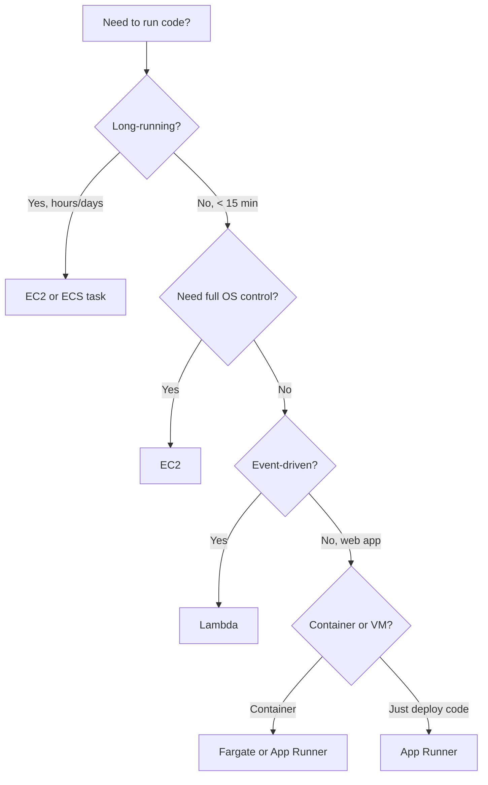

# 🎓 Lambda + API Gateway — Serverless intro

> **Tác giả:** Mr.Rom\
> **Phiên bản:** v1.0.0\
> **Tạo lúc:** 24/05/2026\
> **Cập nhật:** 24/05/2026\
> **Level:** Basic\
> **Tags:** [MUST-KNOW]\
> **Thời lượng đọc:** ~22 phút\
> **Prerequisites:** [03_rds-and-dynamodb.md](03_rds-and-dynamodb.md)

> 🎯 *Bài cuối AWS basic. **Lambda** = serverless functions, pay per execution. **API Gateway** = managed HTTP entry. Together = serverless API. Bài này: first Lambda, triggers, API Gateway HTTP API, cold start, cost model, when serverless vs EC2.*

## 🎯 Sau bài này bạn sẽ

- [ ] Hiểu **Lambda** model: stateless, event-driven, autoscale
- [ ] Deploy first Lambda function (Console + CLI + SAM)
- [ ] **Triggers**: S3, DynamoDB Streams, EventBridge, API Gateway
- [ ] **Cold start** + mitigation (provisioned concurrency, SnapStart)
- [ ] **API Gateway** HTTP API vs REST API
- [ ] **Lambda + API Gateway** serverless web API
- [ ] **Pricing**: $/request + $/GB-second
- [ ] **When serverless vs EC2** — decision matrix
- [ ] **Common limits**: 15-min timeout, 10GB memory

---

## Tình huống — User upload image, auto-resize?

User uploads image to S3:
- 5MB original → need 200KB thumbnail.

Options:
1. **EC2 background worker**:
   - Always running, polls S3.
   - Costs $30/month for low traffic.
2. **Lambda triggered by S3 upload**:
   - Only runs when needed.
   - Costs $0.50/month for 1000 images.
3. **Build server-side in app**:
   - Couples to main app.
   - Doesn't scale separately.

Sếp: *"Lambda + S3 trigger. Modern pattern. Pay-per-execution. Bài này dạy."*

→ Bài này: serverless deep + when to use.

---

## 1️⃣ Lambda fundamentals

🪞 **Ẩn dụ**: *Lambda như **taxi công nghệ** — gọi mới chạy, hết chuyến tự tắt máy, trả tiền theo cuốc; không phải nuôi tài xế thường trực (EC2 luôn bật). API Gateway là **tổng đài điều phối** — nhận yêu cầu khách, gọi đúng taxi (function) và trả kết quả về cho khách.*

### What is Lambda

**Lambda** = serverless function execution:
- **No servers to manage**.
- **Auto-scale** from 0 to 1000s concurrent.
- **Pay per invocation** + compute time.
- **Stateless** (no persistent storage in function).

### Programming model

```python
def lambda_handler(event, context):
    # event: input data (varies by trigger)
    # context: runtime info (request ID, time remaining)
    
    # Your code here
    
    return {
        'statusCode': 200,
        'body': 'Hello from Lambda'
    }
```

→ Function = code + handler. AWS runs code when invoked.

### Supported runtimes (2026)

| Runtime | Latest |
|---|---|
| **Python** | 3.13 (3.10-3.13 supported) |
| **Node.js** | 22 (18, 20, 22 supported) |
| **Java** | 21 |
| **Go** | 1.21 (custom runtime) |
| **Ruby** | 3.3 |
| **.NET** | 8 |
| **Rust** | Custom runtime |
| **Custom (bootstrap)** | Any language via custom runtime |

→ **Python + Node.js** most popular. **Rust + Go** for performance-critical.

### Lambda function structure

```
my-function/
├── lambda_function.py   # main code
├── requirements.txt     # dependencies
└── ...                  # other code
```

For Node.js:
```
my-function/
├── index.js
├── package.json
├── node_modules/
└── ...
```

### Configuration

```yaml
# Lambda function config
Runtime: python3.13
Handler: lambda_function.lambda_handler   # file.function
MemorySize: 256                            # MB (128-10240)
Timeout: 30                                # seconds (max 900 = 15 min)
EphemeralStorage: 512                      # MB /tmp (max 10240)
Architecture: arm64                         # or x86_64
Environment:
  Variables:
    DB_URL: postgres://...
Role: arn:aws:iam::ACCOUNT:role/lambda-role
```

### Memory affects CPU

**Lambda CPU is proportional to memory**:
- 128 MB: ~0.07 vCPU equivalent.
- 1769 MB: 1 full vCPU.
- 10240 MB: 6 vCPUs.

→ Increasing memory often makes function **faster** + cheaper (faster = less duration).

### Architecture: ARM (Graviton) vs x86

- **arm64** (Graviton2): 20% cheaper, 19% better performance.
- **x86_64**: legacy compatibility.

→ **Default arm64** 2026 unless dependency requires x86.

---

## 2️⃣ Hello Lambda — deploy first function

### Method 1: AWS Console

1. Lambda Console → Create function.
2. Runtime: Python 3.13.
3. Architecture: arm64.
4. Permissions: Create role (basic Lambda execution).
5. Save.
6. Edit code:
   ```python
   def lambda_handler(event, context):
       return {
           'statusCode': 200,
           'body': 'Hello from Lambda'
       }
   ```
7. Test: deploy + invoke with test event.

### Method 2: AWS CLI

```bash
# 1. Create execution role
aws iam create-role \
  --role-name lambda-hello-role \
  --assume-role-policy-document '{
    "Version":"2012-10-17",
    "Statement":[{"Effect":"Allow","Principal":{"Service":"lambda.amazonaws.com"},"Action":"sts:AssumeRole"}]
  }'

aws iam attach-role-policy \
  --role-name lambda-hello-role \
  --policy-arn arn:aws:iam::aws:policy/service-role/AWSLambdaBasicExecutionRole

# 2. Create function code
mkdir lambda-hello && cd lambda-hello
cat > lambda_function.py <<'EOF'
def lambda_handler(event, context):
    return {
        'statusCode': 200,
        'body': 'Hello from Lambda'
    }
EOF

zip lambda.zip lambda_function.py

# 3. Create Lambda function
ROLE_ARN=$(aws iam get-role --role-name lambda-hello-role --query 'Role.Arn' --output text)

aws lambda create-function \
  --function-name hello-lambda \
  --runtime python3.13 \
  --architectures arm64 \
  --handler lambda_function.lambda_handler \
  --zip-file fileb://lambda.zip \
  --role $ROLE_ARN

# 4. Invoke
aws lambda invoke \
  --function-name hello-lambda \
  --payload '{}' \
  response.json

cat response.json
# {"statusCode": 200, "body": "Hello from Lambda"}
```

### Method 3: AWS SAM (Serverless Application Model)

```yaml
# template.yaml
AWSTemplateFormatVersion: '2010-09-09'
Transform: AWS::Serverless-2016-10-31

Resources:
  HelloFunction:
    Type: AWS::Serverless::Function
    Properties:
      CodeUri: ./
      Handler: lambda_function.lambda_handler
      Runtime: python3.13
      Architectures: [arm64]
      MemorySize: 256
      Timeout: 30
      Events:
        Api:
          Type: HttpApi
          Properties:
            Path: /hello
            Method: get
```

```bash
sam build
sam deploy --guided
# Creates Lambda + API Gateway + IAM role
```

→ Most modern way to deploy Lambda.

### Method 4: Terraform

```hcl
resource "aws_lambda_function" "hello" {
  function_name    = "hello-lambda"
  filename         = "lambda.zip"
  source_code_hash = filebase64sha256("lambda.zip")
  
  role    = aws_iam_role.lambda.arn
  handler = "lambda_function.lambda_handler"
  runtime = "python3.13"
  architectures = ["arm64"]
  
  memory_size = 256
  timeout     = 30
  
  environment {
    variables = {
      ENV = "prod"
    }
  }
}
```

---

## 3️⃣ Lambda triggers (event sources)

### Common triggers

| Trigger | Use case |
|---|---|
| **API Gateway** | HTTP API endpoint |
| **S3** | Object upload/delete |
| **DynamoDB Streams** | DDB item change |
| **EventBridge** | Cron schedule, custom events |
| **SQS** | Process queue messages |
| **SNS** | Pub-sub topic |
| **Kinesis** | Streaming data |
| **CloudWatch Logs** | Log subscription filter |
| **Cognito** | Auth flow customization |
| **Step Functions** | Workflow step |
| **MSK** (Kafka) | Process Kafka topic |
| **Application Load Balancer** | Custom HTTP endpoint |

### Example: S3 trigger (image resize)

```python
# resize_image.py
import boto3
from PIL import Image
import io

s3 = boto3.client('s3')

def lambda_handler(event, context):
    for record in event['Records']:
        bucket = record['s3']['bucket']['name']
        key = record['s3']['object']['key']
        
        # Download original
        response = s3.get_object(Bucket=bucket, Key=key)
        image_data = response['Body'].read()
        
        # Resize
        img = Image.open(io.BytesIO(image_data))
        img.thumbnail((200, 200))
        
        # Upload thumbnail
        output = io.BytesIO()
        img.save(output, format='JPEG')
        output.seek(0)
        
        thumb_key = key.replace('uploads/', 'thumbnails/')
        s3.put_object(Bucket=bucket, Key=thumb_key, Body=output, ContentType='image/jpeg')
        
        print(f"Resized {key} → {thumb_key}")
```

Configure S3 trigger:
```bash
aws lambda add-permission \
  --function-name resize-image \
  --statement-id s3-trigger \
  --action lambda:InvokeFunction \
  --principal s3.amazonaws.com \
  --source-arn arn:aws:s3:::my-uploads

aws s3api put-bucket-notification-configuration \
  --bucket my-uploads \
  --notification-configuration '{
    "LambdaFunctionConfigurations": [{
      "LambdaFunctionArn": "arn:aws:lambda:...:function:resize-image",
      "Events": ["s3:ObjectCreated:*"],
      "Filter": {
        "Key": {
          "FilterRules": [{ "Name": "prefix", "Value": "uploads/" }]
        }
      }
    }]
  }'
```

→ User uploads to `uploads/` → Lambda triggered → creates thumbnail in `thumbnails/`.

### EventBridge cron

```hcl
resource "aws_cloudwatch_event_rule" "every_5_min" {
  schedule_expression = "rate(5 minutes)"
  # Or cron: cron(0 12 * * ? *)  # daily 12 UTC
}

resource "aws_cloudwatch_event_target" "lambda" {
  rule = aws_cloudwatch_event_rule.every_5_min.name
  arn  = aws_lambda_function.scheduled.arn
}
```

→ Lambda triggered every 5 minutes. Use for: scheduled tasks, cleanup, polling.

### SQS trigger

```yaml
# SAM template
Events:
  SQSEvent:
    Type: SQS
    Properties:
      Queue: !GetAtt MyQueue.Arn
      BatchSize: 10
```

→ Messages in queue → Lambda processes batch.

---

## 4️⃣ Cold start

### What is cold start

**Cold start** = first invocation after idle:
- AWS provisions container.
- Loads runtime.
- Loads function code.
- **~100-1000ms overhead**.

**Warm invocation**:
- Container already running.
- ~1-10ms overhead.

### Cold start by runtime

| Runtime | Cold start |
|---|---|
| Node.js | ~200-500ms |
| Python | ~250-500ms |
| Go | ~100-300ms |
| Rust | ~50-200ms |
| Java | ~500-2000ms (JVM heavy) |
| .NET | ~400-1500ms |

→ **Java/.NET slowest**. **Rust fastest**.

### Mitigations

**1. Provisioned Concurrency**:
- Keep N containers warm.
- Charged for provisioned capacity ($0.00001/GB-sec).

```bash
aws lambda put-provisioned-concurrency-config \
  --function-name my-fn \
  --qualifier '$LATEST' \
  --provisioned-concurrent-executions 5
```

→ 5 warm containers always ready. No cold start for first 5 concurrent.

**2. SnapStart** (Java specific):
- Snapshot JVM state.
- Restore in milliseconds.
- 10x faster cold start.

```yaml
SnapStart:
  ApplyOn: PublishedVersions
```

**3. Smaller deployment package**:
- Less code = faster load.
- Remove unused dependencies.

**4. Lambda Layers** (shared deps):
- Common deps in layer.
- Lambda package smaller.

**5. Async invocation**:
- Don't make user wait for cold start.
- Lambda response queued for async work.

**6. EventBridge "warm" pings** (anti-pattern, but common):
- CRON every 5 min: invoke Lambda to keep warm.
- Free-ish if low invocations.
- ⚠️ Hacky. Provisioned Concurrency cleaner.

### When cold start matters

- **User-facing APIs**: latency-sensitive.
- **Real-time systems**.

### When cold start OK

- **Background jobs**: async, queue-driven.
- **Scheduled tasks**: cron, no user waiting.
- **Async event processing**.

→ Lambda great for non-latency-critical workloads. Use provisioned concurrency for user-facing.

---

## 5️⃣ API Gateway

### HTTP API vs REST API

AWS has 2 API Gateway types:

**HTTP API** (newer 2019+):
- Cheaper ($1/M requests).
- Faster.
- Simpler features (JWT auth, CORS).
- **Recommend 2026** for most.

**REST API** (older):
- More expensive ($3.50/M).
- More features (request validation, transformation, API keys, usage plans).
- Use when need specific REST features.

→ Default 2026: HTTP API. REST API for legacy / specific needs.

### Setup HTTP API with Lambda

```bash
# 1. Create Lambda function (above)

# 2. Create HTTP API
API_ID=$(aws apigatewayv2 create-api \
  --name acme-api \
  --protocol-type HTTP \
  --target arn:aws:lambda:us-east-1:ACCOUNT:function:hello-lambda \
  --query 'ApiId' --output text)

# 3. Grant API Gateway permission to invoke Lambda
aws lambda add-permission \
  --function-name hello-lambda \
  --statement-id apigateway-invoke \
  --action lambda:InvokeFunction \
  --principal apigateway.amazonaws.com \
  --source-arn "arn:aws:execute-api:us-east-1:ACCOUNT:$API_ID/*/*"

# 4. Endpoint URL
echo "https://$API_ID.execute-api.us-east-1.amazonaws.com/"

curl https://$API_ID.execute-api.us-east-1.amazonaws.com/
# {"statusCode": 200, "body": "Hello from Lambda"}
```

### SAM template (cleaner)

```yaml
# template.yaml
Resources:
  HelloApi:
    Type: AWS::Serverless::HttpApi
    Properties:
      StageName: prod
      CorsConfiguration:
        AllowOrigins: ["https://acmeshop.vn"]
        AllowMethods: [GET, POST]
  
  HelloFunction:
    Type: AWS::Serverless::Function
    Properties:
      CodeUri: ./
      Handler: lambda_function.lambda_handler
      Runtime: python3.13
      Architectures: [arm64]
      Events:
        Hello:
          Type: HttpApi
          Properties:
            ApiId: !Ref HelloApi
            Path: /hello
            Method: GET
        Users:
          Type: HttpApi
          Properties:
            ApiId: !Ref HelloApi
            Path: /users/{id}
            Method: GET
```

```bash
sam deploy
```

→ Lambda + API Gateway + routes. 5 lines per route.

### Routes

```python
def lambda_handler(event, context):
    path = event['rawPath']             # /users/123
    method = event['requestContext']['http']['method']
    path_params = event.get('pathParameters', {})  # {'id': '123'}
    query = event.get('queryStringParameters', {})
    body = event.get('body', '')
    
    if path == '/hello':
        return {'statusCode': 200, 'body': 'Hello'}
    elif path.startswith('/users/'):
        user_id = path_params.get('id')
        return {'statusCode': 200, 'body': f'User {user_id}'}
    else:
        return {'statusCode': 404, 'body': 'Not found'}
```

### CORS

```yaml
CorsConfiguration:
  AllowOrigins: ["https://acmeshop.vn"]
  AllowMethods: [GET, POST, PUT, DELETE]
  AllowHeaders: [Content-Type, Authorization]
  MaxAge: 3600
```

→ API Gateway handles CORS automatically. No code in Lambda.

### Custom domain + HTTPS

```bash
# 1. Issue ACM cert
aws acm request-certificate \
  --domain-name api.acmeshop.vn \
  --validation-method DNS

# 2. Verify cert (DNS challenge)
# 3. Create custom domain in API Gateway
aws apigatewayv2 create-domain-name \
  --domain-name api.acmeshop.vn \
  --domain-name-configurations CertificateArn=arn:aws:acm:...

# 4. Route 53 alias → API Gateway domain
```

→ `https://api.acmeshop.vn` instead of long execute-api URL.

### Authentication

**JWT (Cognito or custom)**:
```yaml
HelloApi:
  Type: AWS::Serverless::HttpApi
  Properties:
    Auth:
      Authorizers:
        JwtAuth:
          JwtConfiguration:
            issuer: https://cognito-idp.us-east-1.amazonaws.com/USERPOOL
            audience: ['CLIENT_ID']
          IdentitySource: $request.header.Authorization
      DefaultAuthorizer: JwtAuth
```

→ API Gateway validates JWT before invoking Lambda. Lambda doesn't see invalid requests.

**IAM authorization**:
```yaml
Auth:
  Authorizers:
    AWS_IAM: {}
  DefaultAuthorizer: AWS_IAM
```

→ Internal AWS-to-AWS calls. SigV4 signed requests.

### Throttling + quotas

```yaml
HelloApi:
  Type: AWS::Serverless::HttpApi
  Properties:
    DefaultRouteSettings:
      ThrottlingBurstLimit: 100
      ThrottlingRateLimit: 50
```

→ 50 req/sec sustained, 100 burst. Protect Lambda from overwhelming.

---

## 6️⃣ Pricing

### Lambda

**Pricing components**:
1. **Requests**: $0.20 per 1M requests.
2. **Compute time**: $0.0000166667 per GB-second.

**Calculation example**:
- 1M invocations/month.
- Each runs 200ms with 256 MB memory.
- Compute: 1M × 0.2s × (256/1024 GB) = 50,000 GB-s.
- Cost: 1M × $0.20 + 50,000 × $0.0000166667 = $0.20 + $0.83 = **$1.03/month**.

→ Very cheap for moderate workloads.

### Free tier (always)

- **1M requests/month** free.
- **400,000 GB-seconds/month** free.

→ Most personal projects fit free tier.

### API Gateway HTTP API

- **$1.00 per million requests**.

### Combined cost

Lambda + API Gateway, 1M requests/month, 200ms × 256MB:
- Lambda: ~$1.
- API Gateway HTTP: $1.
- **Total: $2/month**.

→ Cheap vs EC2 ($30+/month minimum).

### When Lambda gets expensive

- **High traffic**: 1B req/month = $200 Lambda + $1000 API Gateway.
- **bạn compute**: 60s × 10GB memory × 1M = $1000/month.
- **Cold start mitigation**: provisioned concurrency = $$.

→ At scale, EC2 cheaper. Lambda for unpredictable / low-mid traffic.

---

## 7️⃣ Lambda limits

| Limit | Value |
|---|---|
| Max execution time | 900 seconds (15 min) |
| Memory | 128 MB - 10,240 MB |
| Ephemeral storage (/tmp) | 512 MB - 10,240 MB |
| Concurrent executions | 1000 (default, can raise) |
| Function package (zipped) | 50 MB |
| Function package (unzipped) | 250 MB |
| Container image | 10 GB |
| Layers per function | 5 |
| Environment variables | 4 KB total |
| Payload (sync) | 6 MB |
| Payload (async) | 256 KB |

**Common pitfalls**:
- 15-min timeout: long jobs → use Step Functions or ECS.
- 50 MB package: large deps → Lambda Layers or container image.
- 10 GB memory max: heavier needs → EC2.

### Lambda container images

Bypass 50 MB limit:

```dockerfile
# Dockerfile.lambda
FROM public.ecr.aws/lambda/python:3.13-arm64

COPY requirements.txt ${LAMBDA_TASK_ROOT}
RUN pip install -r requirements.txt

COPY lambda_function.py ${LAMBDA_TASK_ROOT}

CMD ["lambda_function.lambda_handler"]
```

Build + push:
```bash
docker build -t my-fn .
docker tag my-fn ACCOUNT.dkr.ecr.us-east-1.amazonaws.com/my-fn:v1
docker push ACCOUNT.dkr.ecr.us-east-1.amazonaws.com/my-fn:v1
```

Create Lambda:
```bash
aws lambda create-function \
  --function-name my-fn \
  --package-type Image \
  --code ImageUri=ACCOUNT.dkr.ecr.us-east-1.amazonaws.com/my-fn:v1 \
  --role ...
```

→ Up to 10 GB image. Useful for ML models, large dependencies.

---

## 8️⃣ Decision: Lambda vs EC2 vs Fargate vs App Runner



### Comparison

| Aspect | Lambda | Fargate | ECS on EC2 | EC2 |
|---|---|---|---|---|
| Server mgmt | None | None | Some | All |
| Scale to zero | Yes | No (idle cost) | No | No |
| Cold start | Yes (~500ms) | ~30s | None | None |
| Max execution | 15 min | Unlimited | Unlimited | Unlimited |
| Pricing | Per request | Per second | Per second | Per hour |
| Best for | Event-driven, sporadic | Containers, predictable | Custom orchestration | Specific needs |

### Use Lambda when

- **Event-driven**: S3 upload, DDB change, scheduled.
- **Low/sporadic traffic**: < 1M req/month.
- **No persistent state**.
- **Short tasks**: < 15 min.
- **Quick prototyping**.

### Use EC2/Fargate when

- **High constant traffic**: cheaper at scale.
- **Long-running**: > 15 min.
- **Specific OS / kernel needs**.
- **Container ecosystem**.

### Use App Runner when

- **Want simple PaaS**.
- **Source code or container deploy**.
- **Auto-scale + HTTPS + LB built-in**.
- **Avoid configuring Fargate manually**.

---

## 9️⃣ Hands-on: Image resize Lambda + S3

### Architecture

```
User → presigned URL (FastAPI) → S3 (uploads/)
                                      ↓ trigger
                                  Lambda (resize)
                                      ↓
                                  S3 (thumbnails/)
```

### Lambda code

```python
# resize_lambda.py
import boto3
import os
from PIL import Image
import io

s3 = boto3.client('s3')

def lambda_handler(event, context):
    for record in event['Records']:
        bucket = record['s3']['bucket']['name']
        key = record['s3']['object']['key']
        
        # Skip if already thumbnail
        if key.startswith('thumbnails/'):
            continue
        
        print(f"Processing {bucket}/{key}")
        
        # Download
        response = s3.get_object(Bucket=bucket, Key=key)
        image_data = response['Body'].read()
        
        # Resize
        img = Image.open(io.BytesIO(image_data))
        img.thumbnail((300, 300))
        
        # Convert to JPEG (smaller)
        if img.mode != 'RGB':
            img = img.convert('RGB')
        
        # Save
        output = io.BytesIO()
        img.save(output, format='JPEG', quality=85)
        output.seek(0)
        
        thumb_key = key.replace('uploads/', 'thumbnails/').rsplit('.', 1)[0] + '.jpg'
        
        s3.put_object(
            Bucket=bucket,
            Key=thumb_key,
            Body=output,
            ContentType='image/jpeg',
            CacheControl='public, max-age=31536000'
        )
        
        print(f"Created {thumb_key}")
    
    return {'statusCode': 200, 'body': 'Done'}
```

### SAM template

```yaml
# template.yaml
AWSTemplateFormatVersion: '2010-09-09'
Transform: AWS::Serverless-2016-10-31

Globals:
  Function:
    Runtime: python3.13
    Architectures: [arm64]

Parameters:
  BucketName:
    Type: String
    Default: my-uploads-bucket

Resources:
  ResizeFunction:
    Type: AWS::Serverless::Function
    Properties:
      CodeUri: ./
      Handler: resize_lambda.lambda_handler
      MemorySize: 512    # Image processing needs memory
      Timeout: 60         # 1 minute should be plenty
      Policies:
        - S3CrudPolicy:
            BucketName: !Ref BucketName
      Events:
        S3Event:
          Type: S3
          Properties:
            Bucket: !Ref UploadsBucket
            Events: s3:ObjectCreated:*
            Filter:
              S3Key:
                Rules:
                  - Name: prefix
                    Value: uploads/
                  - Name: suffix
                    Value: .jpg
  
  UploadsBucket:
    Type: AWS::S3::Bucket
    Properties:
      BucketName: !Ref BucketName
      PublicAccessBlockConfiguration:
        BlockPublicAcls: true
        IgnorePublicAcls: true
        BlockPublicPolicy: true
        RestrictPublicBuckets: true
      BucketEncryption:
        ServerSideEncryptionConfiguration:
          - ServerSideEncryptionByDefault:
              SSEAlgorithm: AES256
```

### Dependencies

```bash
# requirements.txt
Pillow==10.2.0
```

### Build + deploy

```bash
sam build
sam deploy --guided
# Provide stack name, region, etc.
```

### Test

```bash
# Upload image
aws s3 cp cat.jpg s3://my-uploads-bucket/uploads/cat.jpg

# Wait ~5 seconds
sleep 5

# Check thumbnail created
aws s3 ls s3://my-uploads-bucket/thumbnails/
# thumbnails/cat.jpg (smaller size)

# Verify dimensions
aws s3 cp s3://my-uploads-bucket/thumbnails/cat.jpg /tmp/thumb.jpg
identify /tmp/thumb.jpg
# /tmp/thumb.jpg JPEG 300x200 (or whatever fits in 300×300)
```

### Cost estimate

- 1000 images/month uploaded.
- Each resize: 500ms × 512 MB.
- Lambda compute: 1000 × 0.5s × 0.5GB = 250 GB-s.
- Lambda requests: 1000 × $0.20/M = $0.0002.
- Lambda compute: 250 × $0.0000166 = $0.004.
- **Total: ~$0.005/month**.

→ Effectively free for moderate use.

---

## 💡 Pitfall & Best practice

### ❌ Pitfall: Lambda timeout 3 seconds default

→ Function times out at 3s, but task needs 10s.

→ **Fix**: set `Timeout: 60` in template. Increase as needed (max 900).

### ❌ Pitfall: Lambda memory too low

→ Function slow because not enough CPU (CPU scales with memory).

→ **Fix**: Increase memory. Often makes function **faster + cheaper** (less duration × more memory).

### ❌ Pitfall: Cold start ruins UX

→ User-facing API has 500ms cold start on first request.

→ **Fix**:
- Provisioned Concurrency.
- Smaller deployment package.
- Choose faster runtime (Rust, Go).

### ❌ Pitfall: Lambda in VPC slow

→ Lambda in VPC needs ENI provisioning → cold start +5s.

→ **Fix**: 
- Don't put Lambda in VPC unless required (DB in private subnet).
- AWS auto-improved 2019+, but still slower.
- Alternative: VPC endpoints, IAM auth instead of password.

### ❌ Pitfall: No error handling

```python
def lambda_handler(event, context):
    response = call_external_api()   # may fail
    return response
```

→ Failure = Lambda retries (3 times by default for async invocations) → 3x cost + side effects.

→ **Fix**: 
- Try/except.
- Dead Letter Queue (DLQ) for failed messages.
- Idempotent functions (safe to retry).

### ❌ Pitfall: Reading 1GB file in Lambda

→ Lambda memory limit. OOM.

→ **Fix**:
- Stream processing (don't load all in memory).
- Use larger memory (up to 10 GB).
- Or use EC2 for big batches.

### ❌ Pitfall: Lambda + Aurora connection storm

→ 1000 concurrent Lambda → 1000 DB connections → Postgres max_connections exceeded.

→ **Fix**:
- RDS Proxy (connection pooling).
- Aurora Serverless v2 with connection pooling.
- Or use DynamoDB (no connection limit).

### ❌ Pitfall: Logging sensitive data

```python
logger.info(f"User {email} login with password {password}")
```

→ Password in CloudWatch logs forever.

→ **Fix**: Sanitize logs. Never log secrets.

### ✅ Best practice: Lambda + DLQ + retries

```yaml
Events:
  SqsEvent:
    Type: SQS
    Properties:
      Queue: !GetAtt MainQueue.Arn
      BatchSize: 10
    DeadLetterQueue:
      Type: SQS
      TargetArn: !GetAtt DLQ.Arn
```

→ Failed messages → DLQ. Investigate + reprocess.

### ✅ Best practice: Layered tests

- **Unit tests**: function logic, mocked AWS.
- **Integration tests**: deploy to staging, run via API Gateway.
- **Local testing**: `sam local invoke`.

### ✅ Best practice: Observability

```python
import os
import json
import logging

logger = logging.getLogger()
logger.setLevel(logging.INFO)

def lambda_handler(event, context):
    logger.info(json.dumps({
        'event': 'invoke',
        'function': context.function_name,
        'request_id': context.aws_request_id,
    }))
    
    # ... work ...
    
    logger.info(json.dumps({
        'event': 'success',
        'duration_ms': context.get_remaining_time_in_millis(),
    }))
```

→ Structured JSON logs. CloudWatch Logs Insights query.

### ✅ Best practice: AWS X-Ray tracing

```yaml
Globals:
  Function:
    Tracing: Active
```

```python
from aws_xray_sdk.core import xray_recorder, patch_all
patch_all()   # auto-trace boto3, requests, etc.

@xray_recorder.capture('my_function')
def my_function():
    # auto-traced
    pass
```

→ Visualize Lambda → S3 → DynamoDB call tree.

---

## 🧠 Self-check

**Q1.** When Lambda vs EC2 / Fargate?

<details>
<summary>💡 Đáp án</summary>

**Lambda**:
- **Event-driven**: S3 upload, DDB stream, EventBridge cron.
- **Sporadic / unpredictable** workload.
- **Stateless** functions.
- **< 15 min** execution.
- Pay-per-request (cheap at low scale).

**EC2**:
- **Specific OS / kernel needs**.
- **Long-running** processes.
- **Predictable, high traffic**.
- **Stateful** services (cache server, custom DB).
- Pay-per-hour (cheap at high constant load).

**Fargate (containers)**:
- **Container-based** (Docker).
- **Predictable traffic**.
- **Need container orchestration** without managing nodes.
- Mid-ground: more control than Lambda, less than EC2.

**App Runner**:
- **Simple web app deploy** from source/container.
- **Auto HTTPS + LB**.
- **PaaS-like**.

**Decision criteria**:

1. **Traffic pattern**:
   - Sporadic (< 100 req/day): Lambda.
   - Variable (peaks + valleys): Lambda or Fargate.
   - Constant high (10K req/sec): EC2 or Fargate.

2. **Execution time**:
   - < 15 min: Lambda OK.
   - 15 min - 1 hour: Fargate task.
   - Hours: EC2 or ECS persistent task.

3. **State**:
   - Stateless: any (Lambda easiest).
   - Stateful: EC2 (with persistent storage).

4. **Cost at scale**:
   - 100 req/day: Lambda (free tier).
   - 1M req/month: Lambda ($1/mo).
   - 100M req/month: Lambda $200+, Fargate may be cheaper.
   - 1B req/month: EC2 wins.

5. **Cold start tolerance**:
   - Tolerate cold start: Lambda.
   - Strict latency: EC2 / provisioned Lambda.

**Real example**:

- **Image resize on upload**: Lambda (event-driven, sporadic).
- **Background worker queue**: Lambda (SQS trigger) OR EC2 ASG (constant queue).
- **REST API < 1M req/month**: Lambda + API Gateway.
- **REST API 100M req/month**: EC2 ASG + ALB (cheaper).
- **WebSocket chat**: EC2 / Fargate (Lambda WebSocket exists but limited).
- **ML inference**: Fargate or EC2 (Lambda OK for small models).
- **Cron jobs**: Lambda + EventBridge.
- **Scheduled report generation**: Lambda (< 15 min) or ECS task (longer).

→ Most modern apps **mix all three**: Lambda for event-driven, EC2/Fargate for steady, App Runner for simple web.
</details>

**Q2.** Lambda cold start — when matters, when not?

<details>
<summary>💡 Đáp án</summary>

**Cold start matters**:

1. **User-facing synchronous APIs**:
   - User waits for response.
   - 500ms cold start = visible UX delay.
   - Especially on first request after deploy.

2. **Real-time systems**:
   - Trading, gaming, IoT.
   - Latency budget < 100ms.

3. **Tight SLA**:
   - 99.9% latency P99 < 200ms.

**Cold start doesn't matter**:

1. **Async events**:
   - S3 trigger, DDB stream, SQS.
   - User doesn't wait.

2. **Scheduled tasks**:
   - Cron jobs.
   - Backoffice processing.

3. **Background workers**:
   - Image resize, video transcode.
   - Eventual completion OK.

4. **Low traffic**:
   - 100 req/day. Most are cold start.
   - But: each invocation is rare.

**Mitigations** (when cold start matters):

1. **Provisioned Concurrency**:
   - Keep N containers warm.
   - $0.000004/GB-s for provisioned.
   - Set min concurrency to expected baseline.
   ```bash
   aws lambda put-provisioned-concurrency-config \
     --function-name fn --qualifier '$LATEST' \
     --provisioned-concurrent-executions 10
   ```

2. **SnapStart** (Java):
   - 10x faster Java cold start.
   - Snapshots JVM state.

3. **Smaller package**:
   - Remove unused dependencies.
   - Tree-shake imports.

4. **Init outside handler**:
   ```python
   # Bad — init each invocation
   def lambda_handler(event, context):
       client = boto3.client('s3')
       ...
   
   # Good — init once on cold start
   client = boto3.client('s3')   # module-level
   def lambda_handler(event, context):
       client.get_object(...)
   ```

5. **ARM (Graviton2)**:
   - Faster startup.
   - 20% cheaper.

6. **Faster runtime**:
   - Rust < Go < Python < Node.js < Java.

**Cost trade-off**:

Provisioned Concurrency (10 instances, 256 MB, 24/7):
- $0.000004 × 0.25 GB × 86400s × 30 days × 10 = $26/month.
- For consistent low latency.

vs. accepting cold start:
- Free (no extra cost).
- ~500ms occasional latency hit.

**Decision**:

- **User-facing API + < 1s latency budget**: Provisioned Concurrency.
- **Event-driven async**: ignore cold start.
- **High-frequency invocations**: containers stay warm anyway (rarely cold).

**Reality**:
- Lambda invoked > 1/min: usually warm (container reused).
- Cold start only on **scale-out** events.

→ Cold start ≠ universal problem. Architect around it OR pay for provisioned. Don't fight it for async workloads.
</details>

**Q3.** API Gateway HTTP vs REST — Which choose?

<details>
<summary>💡 Đáp án</summary>

**HTTP API** (recommend 2026):
- $1/M requests.
- Latency 5-10x faster.
- Simpler config.
- Native JWT auth.
- Built-in CORS.

**Pros**:
- Cheap.
- Fast.
- Modern.
- 2026 default.

**Cons**:
- Fewer features.
- No usage plans / API keys (use IAM/JWT instead).
- No request validation (use Lambda).
- No request/response transformation.

**REST API** (older):
- $3.50/M requests.
- Higher latency.
- More features.

**Pros**:
- **Usage plans** (rate limit per API key).
- **API keys** for third-party access.
- **Request validation** at API Gateway.
- **Request/response transformation** (rename fields, add headers).
- **Stage variables**.
- **Resource policies** (IP restriction).
- **AWS WAF integration**.
- **Private API** (VPC endpoint).
- **mTLS**.

**Cons**:
- 3.5x more expensive.
- More setup.
- Older patterns.

**Decision matrix**:

| Need | HTTP API | REST API |
|---|---|---|
| Simple REST endpoint | ✅ | ✅ |
| JWT auth | ✅ | ✅ |
| IAM auth | ✅ | ✅ |
| **API keys for third party** | ❌ | ✅ |
| **Usage plans (rate per key)** | ❌ | ✅ |
| **Request validation** | ❌ | ✅ |
| **Request transformation** | ❌ | ✅ |
| **Private API in VPC** | ❌ | ✅ |
| WebSocket | ✅ (separate WebSocket API) | ❌ |
| **Lowest cost** | ✅ | ❌ |
| **Lowest latency** | ✅ | ❌ |

**Choose HTTP API when**:
- Internal API.
- Simple authenticated endpoints.
- Microservices.
- Cost-sensitive.
- 90% of use cases 2026.

**Choose REST API when**:
- Third-party API with usage plans.
- Need request/response transformation.
- Private API in VPC.
- Migrating from older REST API.
- Compliance requires WAF + private.

**Migration path**:
- Start HTTP API.
- Migrate to REST API only if specific feature needed.

**Cost example** (10M requests/month):
- HTTP API: $10.
- REST API: $35.
- Difference: $25/month or $300/year.

**Reality 2026**:
- New projects: HTTP API.
- Legacy / specific features: REST API.
- AWS keeps both, no deprecation.

→ Default: **HTTP API**. Upgrade to REST API only if specific feature needed.
</details>

**Q4.** Lambda + RDS — handle connection limits?

<details>
<summary>💡 Đáp án</summary>

**Problem**: 

- Postgres `max_connections` default 100.
- Lambda scales to 1000+ concurrent.
- Each Lambda → new connection → DB exhausted.

**Symptoms**:
- `FATAL: too many connections`.
- App errors.
- DB CPU spike (connection management overhead).

**Solutions**:

**1. RDS Proxy** (recommended):
- Managed connection pool.
- Lambda → RDS Proxy → reuses DB connections.
- Reduces 1000 client connections → 100 backend.

```yaml
ProxyConfig:
  Engine: postgresql
  DBProxyName: my-proxy
  Auth:
    - SecretArn: !Ref DBSecret
  RoleArn: !GetAtt ProxyRole.Arn
```

```python
# Lambda connects to proxy endpoint, not DB endpoint
import psycopg2
conn = psycopg2.connect(
    host="my-proxy.proxy-xyz.rds.amazonaws.com",  # proxy endpoint
    ...
)
```

**Pros**: managed, auto-failover faster, supports IAM auth.
**Cons**: cost ($26+/month), slight latency overhead.

**2. Connection pooling in Lambda**:

```python
# Module-level pool
import psycopg2
from psycopg2 import pool

conn_pool = psycopg2.pool.ThreadedConnectionPool(
    minconn=1, maxconn=2,
    host=..., user=..., password=...
)

def lambda_handler(event, context):
    conn = conn_pool.getconn()
    try:
        # use conn
    finally:
        conn_pool.putconn(conn)
```

**Pros**: no extra service.
**Cons**: per-Lambda pool, still scales with concurrent.

**3. Aurora Serverless v2 + Data API**:

- Aurora Serverless v2 has built-in pooling.
- **Data API**: HTTP API to Aurora, no persistent connection.

```python
import boto3
rds_data = boto3.client('rds-data')

response = rds_data.execute_statement(
    resourceArn=cluster_arn,
    secretArn=secret_arn,
    database='myapp',
    sql='SELECT * FROM users WHERE id = :id',
    parameters=[{'name': 'id', 'value': {'longValue': 123}}]
)
```

**Pros**: no connection management.
**Cons**: latency higher than direct connection. Aurora Serverless only.

**4. DynamoDB instead**:

- DDB no connection limit.
- Each request independent.
- If your data model fits.

**5. Connection limit increase**:

- Tune `max_connections` parameter.
- 100 → 500 (depends on DB size).
- Each connection costs memory ~5-10 MB.

**6. Reserved concurrency** (Lambda):

- Limit Lambda max concurrent.

```yaml
ReservedConcurrentExecutions: 50
```

→ Cap at 50 concurrent Lambdas = max 50 DB connections.

**Decision matrix**:

| Workload | Recommend |
|---|---|
| Low traffic Lambda + Postgres | Connection pool in Lambda |
| Medium traffic Lambda + Postgres | RDS Proxy |
| High traffic Lambda + Aurora | Aurora Data API |
| Sporadic Lambda | Reserved concurrency cap |
| Variable Lambda | RDS Proxy + Aurora Serverless v2 |
| Pure key-value access | Use DynamoDB instead |

**Hybrid pattern**:

```
Hot path (queries) → Aurora Data API
Background writes → RDS Proxy
Bulk operations → Direct Aurora connection
```

**Cost**:
- RDS Proxy: $26/month minimum (2 vCPU × $13).
- Worth for any production Lambda + RDS.

→ Default 2026: **RDS Proxy** for Lambda + RDS production.
</details>

**Q5.** Lambda function size — when worry?

<details>
<summary>💡 Đáp án</summary>

**Size matters for**:

1. **Cold start**:
   - Larger function = slower cold start.
   - 1 MB package: ~200 ms cold start.
   - 50 MB package: ~500 ms cold start.

2. **Deploy time**:
   - Larger package = longer upload + processing.
   - 50 MB: ~30 sec deploy.

3. **Limits**:
   - 50 MB zip uploaded direct.
   - 250 MB unzipped total.
   - 10 GB container image (alternative).

**Common bloat sources**:

1. **Unused dependencies**:
   - Installed `boto3` (already in Lambda runtime).
   - Installed dev deps (`pytest`, `black`).

2. **Build artifacts**:
   - `.git`, `__pycache__`, `node_modules` debris.
   - `.pyc` files.

3. **Heavy ML models**:
   - 100 MB TensorFlow.
   - 500 MB transformer model.

**Solutions**:

**1. Lambda Layers** (shared deps):

```yaml
Resources:
  CommonLayer:
    Type: AWS::Serverless::LayerVersion
    Properties:
      LayerName: common-deps
      ContentUri: layer/
      CompatibleRuntimes: [python3.13]
  
  MyFunction:
    Type: AWS::Serverless::Function
    Properties:
      Layers:
        - !Ref CommonLayer
```

- Up to 5 layers per function.
- Layer max 50 MB unzipped.

**2. Tree-shake / minify**:

```bash
# Node.js
npm prune --production
esbuild --bundle --minify --tree-shaking ...

# Python
pip install --no-deps --target=./   # skip transitive
```

**3. .lambdaignore (SAM)**:

```
*.pyc
__pycache__/
.git/
tests/
docs/
README.md
```

**4. Container image** (10 GB):

```dockerfile
FROM public.ecr.aws/lambda/python:3.13

COPY requirements.txt ${LAMBDA_TASK_ROOT}
RUN pip install -r requirements.txt --target ${LAMBDA_TASK_ROOT}

COPY function.py ${LAMBDA_TASK_ROOT}
CMD ["function.lambda_handler"]
```

- Build + push to ECR.
- Lambda uses image as code source.
- Cold start ~100ms slower than zip.

**5. Lambda Function URL** (small bonus):

- Direct HTTP URL without API Gateway.
- Free.
- For internal endpoints.

**Size monitoring**:

```bash
aws lambda get-function --function-name fn --query 'Code.CodeSize'
# Returns bytes
```

CloudWatch metric: monitor code size over time.

**Best practices**:

1. **Audit deps quarterly**: remove unused.
2. **Layer for shared**: SDK customizations, common libs.
3. **Container for heavy**: ML models, scientific libs.
4. **Compress wisely**: gzip JSON resources.

**Anti-patterns**:

- Include entire `pandas` for trivial CSV parsing.
- 200 MB function for "hello world".
- Bundle Webpack output without tree-shaking.
- Include `tests/` folder in production deploy.

**Reality check**:

- Typical Lambda: 5-30 MB.
- Heavy with ML: 100 MB + container.
- Microservice: < 10 MB.

→ Most Lambdas don't need to worry. Optimize when cold start critical or hit limits.
</details>

---

## ⚡ Cheatsheet

```bash
# === Lambda ===
aws lambda create-function --function-name fn --runtime python3.13 ...
aws lambda update-function-code --function-name fn --zip-file fileb://lambda.zip
aws lambda invoke --function-name fn --payload '{}' output.json
aws lambda list-functions
aws lambda delete-function --function-name fn

# Concurrency
aws lambda put-function-concurrency --function-name fn --reserved-concurrent-executions 50

# Provisioned concurrency
aws lambda put-provisioned-concurrency-config --function-name fn --qualifier '$LATEST' --provisioned-concurrent-executions 5

# === API Gateway ===
aws apigatewayv2 create-api --name api --protocol-type HTTP
aws apigatewayv2 create-route --api-id $API_ID --route-key 'GET /hello'

# === SAM ===
sam init
sam build
sam deploy --guided
sam local invoke
sam local start-api
sam logs --tail

# === Triggers ===
# S3 trigger
aws s3api put-bucket-notification-configuration --bucket bucket ...

# EventBridge cron
aws events put-rule --schedule-expression "rate(5 minutes)"
aws events put-targets --rule rule-name --targets "Id=1,Arn=lambda-arn"

# SQS trigger
aws lambda create-event-source-mapping \
  --function-name fn \
  --event-source-arn arn:aws:sqs:...:queue \
  --batch-size 10
```

```yaml
# === SAM template essentials ===
AWSTemplateFormatVersion: '2010-09-09'
Transform: AWS::Serverless-2016-10-31

Globals:
  Function:
    Runtime: python3.13
    Architectures: [arm64]
    MemorySize: 256
    Timeout: 30
    Tracing: Active

Resources:
  Api:
    Type: AWS::Serverless::HttpApi
    Properties:
      CorsConfiguration:
        AllowOrigins: ["*"]
  
  Function:
    Type: AWS::Serverless::Function
    Properties:
      CodeUri: ./
      Handler: lambda_function.handler
      Events:
        Http:
          Type: HttpApi
          Properties:
            ApiId: !Ref Api
            Path: /hello
            Method: get
      Policies:
        - S3ReadPolicy:
            BucketName: !Ref MyBucket
        - DynamoDBCrudPolicy:
            TableName: !Ref MyTable

Outputs:
  ApiUrl:
    Value: !Sub "https://${Api}.execute-api.${AWS::Region}.amazonaws.com"
```

---

## 📚 Glossary

| Term | Vietnamese / Explanation |
|---|---|
| **Lambda** | AWS serverless function service |
| **Function** | Single Lambda unit |
| **Handler** | Entry point function `file.method` |
| **Runtime** | Language environment (python3.13, nodejs22, etc.) |
| **Cold start** | First invocation after idle (provisioning overhead) |
| **Warm invocation** | Container reused (fast) |
| **Provisioned Concurrency** | Pre-warmed function instances |
| **SnapStart** | Java-specific cold start optimization |
| **Lambda Layer** | Shared dependencies package |
| **Container image** | Alternative to zip, up to 10 GB |
| **Execution role** | IAM role Lambda assumes |
| **DLQ** | Dead Letter Queue (failed invocations) |
| **Reserved concurrency** | Max concurrent invocations cap |
| **Event source** | Lambda trigger (S3, SQS, EventBridge, etc.) |
| **Async invocation** | Fire-and-forget (S3, SNS) |
| **Sync invocation** | Wait for response (API Gateway, direct) |
| **API Gateway** | Managed HTTP API service |
| **HTTP API** | Newer, cheaper, simpler API Gateway |
| **REST API** | Older, more features (usage plans, validation) |
| **WebSocket API** | Bidirectional Lambda + API Gateway |
| **CORS** | Cross-Origin Resource Sharing |
| **JWT authorizer** | API Gateway validate JWT tokens |
| **IAM authorizer** | API Gateway use IAM SigV4 |
| **Custom domain** | API at api.acmeshop.vn instead of execute-api |
| **SAM** | Serverless Application Model (CloudFormation extension) |
| **EventBridge** | AWS event bus (cron + SaaS events) |
| **Step Functions** | Workflow orchestration (alternative to long Lambda) |
| **App Runner** | AWS PaaS for containers |
| **Fargate** | Serverless containers (ECS/EKS) |
| **X-Ray** | Distributed tracing |
| **CloudWatch Logs Insights** | Query Lambda logs with SQL |

---

## 🔗 Liên kết & Tài nguyên

### Trong cluster
- ↶ Trước: [03_rds-and-dynamodb.md](03_rds-and-dynamodb.md)
- ↑ Cluster: [AWS README](../../README.md)
- 🎯 Hoàn thành AWS basic 5/5!

### Cross-reference
- ☁️ [Cloud Fundamentals](../../../cloud-fundamentals/) — vendor-neutral cloud
- 🐍 [FastAPI basic](../../../../07_Web/backend/python-fastapi/) — vs Lambda
- 🐍 [Serverless cluster](../../../serverless/) — serverless deep (future)

### Tài nguyên ngoài
- 📖 [Lambda docs](https://docs.aws.amazon.com/lambda/)
- 📖 [API Gateway docs](https://docs.aws.amazon.com/apigateway/)
- 📖 [SAM docs](https://docs.aws.amazon.com/serverless-application-model/)
- 📖 [Lambda best practices](https://docs.aws.amazon.com/lambda/latest/dg/best-practices.html)
- 📖 [Lambda pricing](https://aws.amazon.com/lambda/pricing/)
- 📖 [API Gateway pricing](https://aws.amazon.com/api-gateway/pricing/)
- 📖 [Serverless Framework](https://www.serverless.com/) — alternative to SAM
- 📖 [Lambda Power Tuning](https://github.com/alexcasalboni/aws-lambda-power-tuning) — find optimal memory
- 📖 [Awesome Serverless](https://github.com/anaibol/awesome-serverless)

---

## 📌 Changelog

- **v1.0.0 (24/05/2026)** — Bài 04 — cuối AWS basic cluster. Lambda fundamentals + runtimes + memory/CPU model + triggers (S3/DDB/EventBridge/SQS) + cold start + mitigations + API Gateway (HTTP vs REST) + pricing + limits + decision matrix Lambda vs EC2/Fargate + hands-on image resize Lambda. 8 pitfall + 4 best practice + 5 self-check + cheatsheet.
