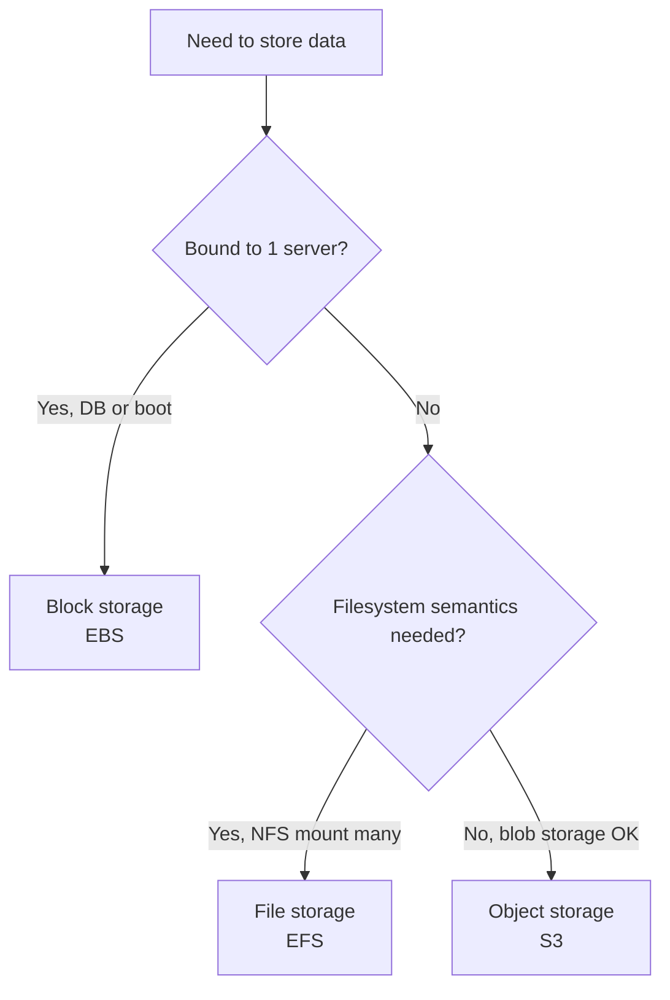

# 🎓 Cloud Storage + Databases landscape

> **Tác giả:** Mr.Rom\
> **Phiên bản:** v1.1.0\
> **Tạo lúc:** 24/05/2026\
> **Cập nhật:** 25/05/2026\
> **Level:** Basic\
> **Tags:** [MUST-KNOW]\
> **Thời lượng đọc:** ~17 phút\
> **Prerequisites:** [02_cloud-networking.md](02_cloud-networking.md), [PostgreSQL basic](../../../../06_Databases/postgresql/)

> 🎯 *Cloud storage: **block / object / file** — 3 categories, dùng đúng cái. Cloud databases: **relational / NoSQL / cache / search / time-series**. Bài này dạy landscape + decision matrix cho mỗi nhu cầu.*

## 🎯 Sau bài này bạn sẽ

- [ ] Phân biệt **block / object / file storage** + use case
- [ ] Hiểu **S3** + storage classes + lifecycle
- [ ] **EBS** (block) vs **EFS** (file) — khi nào dùng
- [ ] **Managed databases** landscape: RDS / Aurora / DynamoDB / Cloud SQL
- [ ] **Cache** (Redis, Memcached) vs **CDN cache**
- [ ] **Search** (OpenSearch, Algolia)
- [ ] **Time-series** (Timestream, InfluxDB)
- [ ] **Message queue** (SQS, SNS, EventBridge, Kafka MSK)

---

## Tình huống — Photo upload app, lưu vào EBS, scale fail

Photo upload app:
- EC2 nhận upload → save to local EBS disk.
- Image processing read from EBS.

Traffic tăng:
- Add 2nd EC2 → can't read images uploaded to EC2 #1 (EBS bound to 1 EC2).
- Manual rsync between EBS = slow.
- Customer report: "uploaded photo can't see later".

Sếp: *"EBS is block storage, bound to 1 instance. Photo storage = object storage (S3). Bài này dạy distinction."*

→ Bài này dạy storage types + when to use which.

---

## 1️⃣ 3 Storage categories

### Block storage

**Block storage** = raw disk attached to 1 server. Like external HDD.

- **API**: filesystem (mount, read/write files like local disk).
- **Performance**: low latency, high throughput.
- **Mount**: 1 server at a time (mostly).
- **Examples**: AWS EBS, GCP Persistent Disk, Azure Managed Disk.

**Use cases**:
- Database storage (PostgreSQL data files).
- Boot volume (OS).
- Application file storage that needs filesystem.

**Limitations**:
- Bound to single AZ.
- Bound to single server (mostly — Multi-Attach EBS limited).
- Pay for provisioned size even if empty.

### Object storage

**Object storage** = key-value storage for arbitrary blobs. Like global file system.

- **API**: HTTP REST (PUT, GET, DELETE).
- **Performance**: higher latency (10-100ms) vs block, but unlimited throughput parallel.
- **Mount**: not a filesystem, accessed via SDK/CLI.
- **Examples**: AWS S3, GCP GCS, Azure Blob, Cloudflare R2, MinIO.

**Use cases**:
- Static assets (images, videos, JS bundles).
- Backups, archives.
- Data lake (analytics).
- Cross-region accessible.

**Strengths**:
- **Unlimited scale** (no provisioning).
- **Pay per GB** stored (no idle cost).
- **Multi-region replication**.
- **High durability** (11 nines = 99.999999999%).
- **Multi-access** (anywhere, any compute).

### File storage

**File storage** = network filesystem (NFS, SMB). Like shared drive.

- **API**: filesystem (mount on many servers simultaneously).
- **Performance**: medium latency.
- **Mount**: many servers.
- **Examples**: AWS EFS (NFS), AWS FSx (Lustre, Windows), GCP Filestore.

**Use cases**:
- Shared file system across many EC2.
- Legacy app needing NFS.
- CI/CD shared workspace.
- ML training data shared.

**Trade-offs**:
- More expensive than object.
- Slower than block.
- Use only when filesystem semantics needed.

### Decision matrix

3 loại storage (Block/Object/File) phục vụ 3 use case khác nhau. Quy tắc đơn giản: cần bind cứng 1 máy chủ (DB, boot disk) → **Block**; cần share filesystem cho nhiều máy → **File**; còn lại (90% case) → **Object**. Diagram dưới giúp đưa quyết định nhanh:



→ Most apps: 90% S3, 10% EBS, rare EFS.

🪞 **Ẩn dụ**: 
- **Block** = ổ cứng cắm máy tính cá nhân (1 máy 1 ổ).
- **Object** = kho chứa hàng (warehouse) — đặt ID → lấy hàng. Không phải filesystem.
- **File** = ổ mạng NAS — nhiều người dùng chung.

---

## 2️⃣ S3 — Object storage deep

### S3 fundamentals

**Bucket** = top-level container (globally unique name).
**Object** = data + metadata, identified by key.

```bash
aws s3 mb s3://acme-images          # create bucket
aws s3 cp photo.jpg s3://acme-images/2026/photo.jpg
aws s3 ls s3://acme-images/2026/
aws s3 rm s3://acme-images/2026/photo.jpg
```

URL format:
```
https://acme-images.s3.us-east-1.amazonaws.com/2026/photo.jpg
```

### Storage classes (cost tiers)

S3 không phải "1 giá". AWS chia thành 7 tier theo tần suất truy cập — từ Standard ($0.023/GB, truy cập liên tục) đến Deep Archive ($0.00099/GB, lấy ra mất 12 giờ). Data 1 năm tuổi thường chuyển xuống Glacier hoặc Deep Archive → tiết kiệm 95%+ chi phí:

| Class | Use case | Cost/GB/month (US East) | Retrieval |
|---|---|---|---|
| **S3 Standard** | Hot data, frequent access | $0.023 | Free |
| **S3 Intelligent-Tiering** | Unknown access pattern | $0.023 + monitoring fee | Free |
| **S3 Standard-IA** (Infrequent Access) | Backup, monthly access | $0.0125 | $0.01/GB |
| **S3 One Zone-IA** | Less critical IA | $0.01 | $0.01/GB |
| **S3 Glacier Instant Retrieval** | Archive, quarterly access | $0.004 | $0.03/GB |
| **S3 Glacier Flexible Retrieval** | Archive, hours retrieval | $0.0036 | $0.03/GB |
| **S3 Glacier Deep Archive** | Long-term archive, 12h retrieval | $0.00099 | $0.02/GB |

→ Move old data to cheaper tiers via **lifecycle policy**:

```json
{
  "Rules": [{
    "Status": "Enabled",
    "Transitions": [
      { "Days": 30, "StorageClass": "STANDARD_IA" },
      { "Days": 90, "StorageClass": "GLACIER_IR" },
      { "Days": 365, "StorageClass": "DEEP_ARCHIVE" }
    ]
  }]
}
```

### Durability vs availability

**Durability**: probability data survives.
- S3 Standard: **99.999999999%** (11 nines). 1 lost object per 10B per year.

**Availability**: probability accessible.
- S3 Standard: **99.99%**. ~52 min downtime/year.

→ S3 most durable storage commercially available.

### Encryption

S3 hỗ trợ 4 cơ chế mã hoá at-rest, khác nhau ở chỗ **ai giữ key**. SSE-S3 đơn giản nhất (AWS quản key, default 2026). SSE-KMS bổ sung audit log + per-key access policy — production thường chọn cái này cho data nhạy cảm. Client-side mã hoá trước khi upload là mức cao nhất (AWS không thấy plaintext):

- **SSE-S3**: AWS manages keys (default 2026, free).
- **SSE-KMS**: KMS customer managed key (BYOK, audit log).
- **SSE-C**: Customer provides key (you manage).
- **Client-side encryption**: encrypt before upload.

→ Default SSE-KMS for sensitive data.

### S3 features beyond storage

S3 không chỉ là "ổ chứa file". Bộ feature đi kèm biến nó thành nền tảng phục vụ nhiều pattern: **Versioning** (rollback), **Object lock** (WORM cho compliance), **CRR** (DR cross-region), **Event notification** (trigger Lambda), **Presigned URL** (chia sẻ tạm thời), **Static hosting** (serve web tĩnh), **S3 Select** (SQL trên Parquet):

- **Versioning**: keep multiple versions of object.
- **Object lock**: write-once-read-many (compliance).
- **Cross-region replication**: auto-replicate to another region.
- **Event notifications**: trigger Lambda on upload.
- **Presigned URLs**: temporary access without IAM.
- **Static website hosting**: serve HTML directly.
- **S3 Select**: SQL query on objects (CSV, JSON, Parquet).

### S3 vs alternatives

S3 không độc quyền object storage — nhiều vendor cung cấp **S3-compatible API**, đổi backend dễ dàng. Khác biệt nằm ở giá egress và region coverage. **Cloudflare R2** nổi bật vì **zero egress fee** (giá lưu trữ tương đương S3 nhưng không tính phí kéo data ra — phù hợp workload serve nhiều bandwidth):

| Service | Equivalent | Notes |
|---|---|---|
| AWS S3 | — | Market leader, most features |
| GCP GCS | S3-compatible | Strong with BigQuery integration |
| Azure Blob | similar | Hot/Cool/Archive tiers |
| **Cloudflare R2** | S3-compatible, **zero egress** | Great for bandwidth-heavy |
| MinIO | S3-compatible self-host | On-prem, K8s native |
| Backblaze B2 | cheap S3-compatible | $0.005/GB, $0.01 egress |

→ **R2 for egress-heavy workloads**. S3 default. MinIO on-prem.

### S3 cost surprise

```
1TB data stored: $23/month
But...
1TB egress: $90/month
1M GET requests: $0.40
1M PUT requests: $5

Total real cost: depends on access pattern.
```

→ **Egress** is biggest surprise. CDN caching reduces.

---

## 3️⃣ EBS — Block storage deep

### EBS volume types

| Type | Use case | IOPS | Throughput |
|---|---|---|---|
| **gp3** (general purpose SSD) | Default 2026, cheap, customizable IOPS | 3,000-16,000 | 125-1000 MB/s |
| **gp2** (older) | Same use case, throughput tied to size | 100-16,000 | 128-250 MB/s |
| **io2 Block Express** | High-performance DB | up to 256,000 | 4000 MB/s |
| **st1** (HDD) | Big sequential workload, throughput-focused | — | 500 MB/s |
| **sc1** (cold HDD) | Cold data, cheapest | — | 250 MB/s |

→ **gp3** default for most. **io2** for high-performance DB. **st1/sc1** for cold throughput-bound.

### Cost (us-east-1)

- gp3: $0.08/GB/month storage + $0.005/IOPS-month above 3000 + $0.04/MB/s-month above 125.
- io2: $0.125/GB/month + $0.065/IOPS-month.

100GB gp3 default: $8/month. 100GB io2 with 10K IOPS: $662.50/month.

### EBS snapshots

```bash
aws ec2 create-snapshot --volume-id vol-abc --description "Daily backup"
```

- **Incremental**: only changed blocks since last snapshot.
- **Stored in S3** (managed): durable.
- **Cross-region copy**: for DR.
- **Cost**: $0.05/GB/month (cheaper than active EBS).

→ Snapshot strategy:
- Daily snapshot retained 7 days.
- Weekly snapshot retained 4 weeks.
- Monthly retained 1 year.

Use **AWS Backup** for automation.

### EBS Multi-Attach

io1/io2 volumes can attach to 16 instances simultaneously (read-write, like SAN).

**Use case**: shared storage for clustered filesystem (GFS, Lustre).

**Limitations**: requires filesystem supporting concurrent writes (rare).

→ Rare use case. EFS easier for shared file access.

---

## 4️⃣ Managed databases — Relational

### RDS (Relational Database Service)

**AWS managed databases**:
- **PostgreSQL** — most popular open source.
- **MySQL**, **MariaDB** — also popular OSS.
- **Oracle**, **SQL Server** — commercial.
- **Aurora** — AWS proprietary, MySQL/Postgres compatible.

**RDS handles**:
- Provisioning.
- OS patching.
- DB engine upgrades.
- Backup automated (daily snapshot + transaction log).
- Failover (Multi-AZ).
- Read replicas.
- Monitoring + metrics.
- Encryption at rest (KMS) + in transit (TLS).

**You handle**:
- Schema design.
- Query optimization.
- Connection management.
- Application-level concerns.

### RDS vs DIY Postgres on EC2

| Aspect | DIY on EC2 | RDS |
|---|---|---|
| Setup | Hours-days | Minutes |
| Patching | Manual | Auto (windows configurable) |
| Backup | Custom script + S3 | Built-in, point-in-time |
| Multi-AZ | Custom replication | Single setting |
| Read replicas | Manual | Single API call |
| Monitoring | Custom Prometheus | CloudWatch built-in |
| Cost | EC2 + EBS + your time | RDS premium (~30% more) |
| Flexibility | Full control | RDS API limits |

→ **Use RDS unless** specific need (custom extensions, full control, cost-extreme).

### Aurora — AWS proprietary

**Aurora**: AWS rewrote MySQL/Postgres storage layer.
- **6x faster** than RDS Postgres claim.
- **Auto-scaling** storage (10GB - 128TB).
- **15 read replicas** across AZs.
- **Aurora Serverless**: pay per ACU-second when active, scale to zero.
- **Global Database**: cross-region < 1s replication.

**Use case**:
- High-traffic OLTP.
- Need 5+ read replicas.
- Want cloud-native HA.

**Cost**: ~20% more than RDS, but performance can justify.

### Cloud SQL (GCP)

Similar to RDS:
- PostgreSQL, MySQL, SQL Server.
- Integrated with GCP services.
- Cloud Spanner = global transactional (different product).

### Azure SQL

Microsoft SQL Server flagship in Azure.
- Azure SQL Database (managed).
- Azure SQL Managed Instance (full SQL Server).
- Hyperscale (storage scales separately).

---

## 5️⃣ NoSQL databases — Cloud managed

### Why NoSQL

Relational DB ACID, structured schema. NoSQL trade-offs:
- **Key-value** (Redis, DynamoDB): O(1) lookup, simple.
- **Document** (MongoDB, DynamoDB): JSON-like flexible schema.
- **Column-family** (Cassandra, DynamoDB): wide tables.
- **Graph** (Neo4j, Neptune): relationships.

### DynamoDB (AWS)

**Key-value + document** at massive scale.
- Single-digit ms latency at any scale.
- Auto-scaling.
- **Global Tables**: multi-region.
- Pay-per-request OR provisioned capacity.

**Use cases**:
- User profiles, session storage.
- Shopping cart.
- Gaming leaderboards.
- IoT data.

**Limitations**:
- 400KB max item.
- Query patterns must be designed upfront (no flexible SQL).
- Cost can spike if access patterns wrong.

**Pricing 2026**:
- On-demand: $1.25 per million write requests.
- Provisioned: $0.65 per WCU-hour.

### MongoDB Atlas, Firestore, Cosmos DB

- **MongoDB Atlas**: managed MongoDB, multi-cloud.
- **GCP Firestore**: document DB with realtime sync.
- **Azure Cosmos DB**: multi-model (document, key-value, graph, column).

### Decision: which NoSQL?

| Use case | Recommend |
|---|---|
| Simple key-value, low latency | Redis (cache) or DynamoDB (durable) |
| Flexible schema, querying | MongoDB |
| Realtime sync mobile | Firebase Firestore |
| Multi-model needs | Cosmos DB |
| Massive scale eventual consistency | DynamoDB |
| Graph relationships | Neptune (AWS) or Neo4j |

---

## 6️⃣ Cache — Redis, Memcached

### Why cache?

**DB query**: 10-100ms.
**Cache hit**: 0.1-1ms.

→ 100x faster. Reduce DB load + improve user latency.

### Redis vs Memcached

| Aspect | Redis | Memcached |
|---|---|---|
| Data structures | Strings, lists, sets, hashes, sorted sets, streams | Strings only |
| Persistence | Optional (RDB, AOF) | None |
| Replication | Yes | No |
| Cluster | Yes (Redis Cluster) | Client-side sharding |
| Use cases | Cache + queue + pub/sub + leaderboard | Pure cache |

→ **Redis** default 2026. Memcached for legacy or specific scenarios.

### Managed: AWS ElastiCache, GCP Memorystore, Azure Cache

```bash
aws elasticache create-replication-group \
  --replication-group-id my-redis \
  --engine redis \
  --num-cache-clusters 3 \
  --cache-node-type cache.t3.medium
```

**Cost**: cache.t3.medium ~$50/month.

### Cache patterns

**Cache-aside**:
```python
def get_user(user_id):
    cached = redis.get(f"user:{user_id}")
    if cached:
        return cached
    
    user = db.query("SELECT * FROM users WHERE id = ?", user_id)
    redis.setex(f"user:{user_id}", 3600, user)   # cache 1h
    return user
```

**Write-through**: write to cache + DB simultaneously.

**Write-behind**: write to cache immediately, async to DB.

**TTL** important — stale data risk.

---

## 7️⃣ Search — OpenSearch, Algolia

### Full-text search

PostgreSQL has `tsvector` but limited at scale. Specialized search engines:

- **Elasticsearch / OpenSearch** (AWS managed = OpenSearch Service).
- **Algolia**: SaaS, fast, expensive.
- **Meilisearch**: OSS modern.
- **Typesense**: OSS modern.

### Use cases

- Product search (e-commerce).
- Log search (ELK, Loki).
- Full-text search in app.
- Autocomplete.

### Algolia vs OpenSearch

| Algolia | OpenSearch |
|---|---|
| SaaS, hosted | Self-host or AWS managed |
| Best DX, fast | More control |
| Expensive ($10K+/year easily) | Cheaper (compute + storage) |
| 50ms search globally | Faster but need tuning |

→ Algolia for B2C search apps. OpenSearch for log analytics + flexibility.

### Hybrid: Postgres + Search

Modern pattern:
- **Primary** in Postgres (ACID, source of truth).
- **Search index** in OpenSearch.
- **Sync** via CDC (Debezium) or app double-write.

→ Best of both. Common stack 2026.

---

## 8️⃣ Time-series databases

### Why time-series

Metrics, IoT, logs, financial — special data shape:
- Append-only.
- Query by time range.
- Aggregations (avg per minute).
- Downsampling.

### Options

- **AWS Timestream**: managed.
- **InfluxDB** (Cloud or OSS).
- **TimescaleDB** (Postgres extension).
- **Prometheus** (metrics, short-term).
- **VictoriaMetrics** (Prometheus alternative).

**Use cases**:
- Application metrics (Prometheus default).
- IoT sensor data.
- Financial trading.
- Server monitoring.

### TimescaleDB

Postgres extension → SQL on time-series.

```sql
SELECT time_bucket('1 hour', timestamp) AS hour,
       avg(cpu_usage)
FROM metrics
WHERE timestamp > NOW() - INTERVAL '1 day'
GROUP BY hour;
```

→ Easy if team knows Postgres.

---

## 9️⃣ Message queue + Event streaming

### Why queue?

- **Async processing**: order placed → queue → worker.
- **Decoupling**: producer/consumer separate.
- **Buffering**: handle spike without overloading consumer.

### Cloud queue services

**SQS** (Simple Queue Service - AWS):
- Standard queue: at-least-once, best-effort ordering.
- FIFO queue: exactly-once, strict ordering.
- $0.40/million requests.

**SNS** (Simple Notification Service):
- Pub/sub: 1 publisher → many subscribers.
- Fan-out: SNS → multiple SQS.

**EventBridge** (event bus):
- More features: pattern matching, schema registry.
- Integrate with SaaS (Stripe, GitHub events).

### Streaming — Kafka

- **AWS MSK**: managed Kafka.
- **Confluent Cloud**: Kafka SaaS.
- **Kinesis Data Streams**: AWS-native.
- **GCP Pub/Sub**: GCP equivalent.

**Use case**:
- Event sourcing.
- Log aggregation.
- Real-time analytics.

### SQS vs Kafka

| Aspect | SQS | Kafka |
|---|---|---|
| Model | Pull queue | Pub-sub log |
| Ordering | FIFO only | Per-partition |
| Replay | No (1 consumer takes message) | Yes (offset rewind) |
| Throughput | High | Very high (millions/sec) |
| Latency | 10-100ms | 1-10ms |
| Use case | Task queue | Event stream |

→ SQS simple. Kafka for event-driven architecture, log streams.

---

## 🔟 Hands-on: Storage + DB design for FastAPI e-commerce

### Requirements

- User accounts.
- Product catalog.
- Orders.
- Product images.
- Search products.
- Recent product cache.

### Design

```
┌─────────────────────────────────────────┐
│ Load Balancer (Public)                  │
└────────────┬────────────────────────────┘
             ↓
        ┌────────┐
        │ FastAPI│ (private subnet)
        └────┬───┘
             ↓
   ┌─────────┼─────────┬───────────┬───────────┐
   ↓         ↓         ↓           ↓           ↓
 RDS Postgres  ElastiCache  OpenSearch  S3 (images)  SQS (orders)
 (users, orders) (Redis cache) (search)
```

### Resource list

| Component | Service | Reason |
|---|---|---|
| User data | RDS Postgres (db.t3.medium, Multi-AZ) | ACID, relations |
| Product catalog | RDS Postgres + OpenSearch sync | SQL + search |
| Orders | RDS Postgres | ACID critical |
| Product images | S3 + CloudFront | Object storage, CDN |
| Recent cache | ElastiCache Redis (cache.t3.small) | Hot data fast access |
| Search index | OpenSearch (small instance) | Full-text |
| Order processing | SQS standard | Async worker |
| Image upload events | SQS → Lambda → resize | Event-driven |

### Cost estimate (ap-southeast-1, small scale)

- RDS db.t3.medium Multi-AZ: ~$130/month.
- ElastiCache cache.t3.small: ~$45/month.
- OpenSearch t3.small.search 1 node: ~$60/month.
- S3 (100GB) + CloudFront (100GB): ~$10/month.
- SQS: free tier covers small workload.
- **Total storage+DB**: ~$245/month.

→ Production-grade for ~$250 + EC2/Lambda compute.

---

## 💡 Pitfall & Best practice

### ❌ Pitfall: Photos in EBS instead of S3

→ EBS bound to 1 EC2, can't scale, expensive per GB.

→ **Fix**: S3 for object storage. EBS for DB only.

### ❌ Pitfall: Read-replicas without lag awareness

→ App reads from read replica → user just wrote, can't see → confused.

→ **Fix**: 
- Read-your-writes: read from primary for X seconds after write.
- Or app-level routing.

### ❌ Pitfall: RDS db.t3.micro for production

→ Burstable T-class can run out of CPU credits → DB slow → cascade failure.

→ **Fix**: Use db.m5/m6 (consistent performance) or db.r5 (memory-optimized) for production. T-class for dev/staging only.

### ❌ Pitfall: DynamoDB without capacity planning

→ Provisioned mode + traffic spike → throttling.

→ **Fix**: 
- On-demand for unpredictable.
- Provisioned + auto-scaling for predictable.
- DAX cache for hot keys.

### ❌ Pitfall: Cache TTL too long

→ Stale data 24h after update.

→ **Fix**: 
- TTL by data type (5min for products, 1h for users).
- Active invalidation on write.

### ❌ Pitfall: Egress cost surprise from S3

→ App serves S3 URLs directly to users → 1TB egress = $90/month.

→ **Fix**: 
- CloudFront in front of S3 (cheaper egress + faster).
- Cloudflare R2 (zero egress).

### ❌ Pitfall: Multi-AZ "for show"

→ RDS Multi-AZ enabled but no test failover.

→ **Fix**: Quarterly failover drill in staging.

### ✅ Best practice: Choose right storage tier from start

Plan lifecycle:
- New uploads: S3 Standard.
- 30 days old: Intelligent-Tiering (auto move).
- 1 year+: Glacier.
- Logs after 90 days: Deep Archive (if must retain compliance).

→ Audit storage classes monthly.

### ✅ Best practice: Tag resources for cost allocation

```hcl
tags = {
  Environment = "prod"
  Service     = "checkout"
  Team        = "payments"
  CostCenter  = "engineering"
}
```

→ Cost Explorer can filter by tags.

### ✅ Best practice: Encrypt everything

- S3: SSE-KMS default.
- EBS: encryption at rest enabled.
- RDS: encryption at rest enabled.
- TLS for transit.

→ Compliance + security baseline.

---

## 🧠 Self-check

**Q1.** Block vs object vs file storage — quick decision?

<details>
<summary>💡 Đáp án</summary>

**Block (EBS, GCP PD)**:
- Behaves like a disk. 1 server at a time.
- **Use for**: DB data, OS boot volume, app needing local fs.
- Key: "needs filesystem on single host."

**Object (S3, GCS, R2)**:
- API-only (PUT/GET). No filesystem.
- **Use for**: images/videos, backups, data lake, anything accessible from many compute.
- Key: "blob accessible from anywhere via API."

**File (EFS, FSx, Filestore)**:
- NFS-like filesystem mountable on many servers.
- **Use for**: legacy NFS apps, shared workspace, ML training data.
- Key: "multi-server filesystem semantics."

**Quick test**:
- "I need to store the database files." → Block.
- "I need to store images for my website." → Object.
- "I have a legacy app that mounts /shared and writes files." → File.

**Most apps 2026**:
- 70% S3 (object).
- 25% EBS (block for DB).
- 5% EFS (file for legacy or ML).

**Anti-pattern**:
- Photos on EBS → can't scale.
- Database on S3 → not a filesystem.
- Static assets on EFS → too expensive.

→ Choose by access pattern, not familiarity.
</details>

**Q2.** S3 storage class strategy — when each tier?

<details>
<summary>💡 Đáp án</summary>

**Lifecycle tiers**:

**Standard** ($0.023/GB):
- Day 0-30: hot data, frequently accessed.
- User uploads, recent backups.

**Intelligent-Tiering** ($0.023/GB + monitoring):
- Unknown access pattern, let AWS auto-tier.
- Recommended default 2026.

**Standard-IA** ($0.0125/GB):
- Day 30-90: warm data, monthly access.
- Older logs, monthly reports.
- **Caveat**: $0.01/GB retrieval cost — if accessed often, costs more than Standard.

**Glacier Instant Retrieval** ($0.004/GB):
- Day 90-365: cold archives, quarterly access.
- Compliance logs, historical data.
- < 100ms retrieval.

**Glacier Flexible** ($0.0036/GB):
- Day 365+: rare access.
- 1-12h retrieval.
- Cheap.

**Glacier Deep Archive** ($0.00099/GB):
- Day 365+: very rare access (compliance only).
- 12h retrieval.
- Cheapest.

**Cost example** (100GB stored 1 year):

| Strategy | Year cost |
|---|---|
| All Standard | $27.60 |
| Lifecycle to IA at 30d | $19.50 |
| Lifecycle: Standard → IA → Glacier IR → Deep | $7-12 |

→ Lifecycle saves 50-80%.

**Anti-patterns**:
1. **Manual move**: forget, accumulate Standard cost.
2. **Too aggressive transition**: IA accessed frequently = retrieval cost > Standard cost.
3. **Glacier for active data**: 12h retrieval delay.

**Recommend setup**:
- Lifecycle policy from day 1.
- Intelligent-Tiering for unknown.
- Specific lifecycle for known patterns (logs, backups).

```json
{
  "Rules": [{
    "Status": "Enabled",
    "Transitions": [
      { "Days": 30, "StorageClass": "STANDARD_IA" },
      { "Days": 90, "StorageClass": "GLACIER_IR" },
      { "Days": 365, "StorageClass": "DEEP_ARCHIVE" }
    ],
    "Expiration": { "Days": 2555 }
  }]
}
```

→ 7 years for compliance, then delete.
</details>

**Q3.** Aurora vs RDS Postgres — when worth premium?

<details>
<summary>💡 Đáp án</summary>

**Aurora premium**: ~20% more cost than RDS Postgres of same size.

**Aurora wins when**:

1. **Need many read replicas (3+)**:
   - RDS: up to 5 read replicas, replication can lag.
   - Aurora: up to 15 read replicas, sub-second replication.

2. **High write throughput**:
   - Aurora storage layer rewritten for parallelism.
   - Claimed 3-5x faster writes for similar instance.

3. **Storage auto-scaling**:
   - RDS: provision storage upfront.
   - Aurora: storage scales 10GB-128TB automatically.

4. **Faster failover**:
   - RDS Multi-AZ: 60-120s failover.
   - Aurora: < 30s.

5. **Cross-region replication**:
   - Aurora Global Database: < 1s lag cross-region.
   - RDS cross-region read replica: minutes lag.

6. **Aurora Serverless**:
   - Scale to zero (or minimum) when idle.
   - Great for dev/staging or unpredictable workloads.
   - RDS no equivalent.

**Aurora doesn't win when**:

1. **Small DB, low traffic**:
   - Cost premium not justified.
   - RDS sufficient.

2. **Need specific PG extensions**:
   - Aurora has subset of Postgres extensions.
   - Check `pg_available_extensions` before choosing.

3. **Need exact Postgres version control**:
   - Aurora lags upstream Postgres releases.
   - RDS more current.

4. **Cost-sensitive small workload**:
   - 20% premium adds up.

**Decision**:
- **Small/medium** workload: RDS.
- **High-scale OLTP**: Aurora.
- **Need 5+ read replicas**: Aurora.
- **Multi-region**: Aurora Global.
- **Dev/staging spiky**: Aurora Serverless.

**Migration**: RDS → Aurora is straightforward (in-place restore from snapshot). Aurora → other = harder (Aurora-specific features).

**Reality 2026**: most production AWS Postgres workloads on Aurora. RDS for legacy or specific needs.

→ Default Aurora for new prod Postgres. RDS for niche cases.
</details>

**Q4.** DynamoDB vs RDS — when DynamoDB?

<details>
<summary>💡 Đáp án</summary>

**Use DynamoDB when**:

1. **Predictable access patterns**:
   - "Get user by ID."
   - "Get user's recent orders."
   - Designed access patterns = fast.

2. **Massive scale**:
   - Millions of reads/writes per second.
   - No DB tuning needed.

3. **Simple data**:
   - Key-value, document.
   - Don't need complex joins, transactions.

4. **Single-digit ms latency required**:
   - Gaming leaderboards.
   - Session storage.
   - Real-time features.

5. **Multi-region**:
   - Global Tables built-in.
   - Eventually consistent.

6. **Serverless**:
   - Pay-per-request, scale to zero.
   - No instance to manage.

**Use RDS (relational) when**:

1. **Complex queries**:
   - Joins across tables.
   - Aggregations.
   - Ad-hoc analysis.

2. **ACID transactions across multiple records**:
   - Bank transfer (debit + credit).
   - Order with line items (atomic update).

3. **Schema evolution**:
   - Add columns frequently.
   - SQL migrations.

4. **Reporting**:
   - SQL is universal for analytics.
   - BI tools integrate.

5. **Team SQL expertise**:
   - Easier hire SQL devs.
   - More tools.

**Hybrid (common 2026)**:
- **RDS for source of truth + reporting**.
- **DynamoDB for hot path** (user profile cache, session, leaderboards).
- **Both** complement, don't compete.

**Cost comparison** (10GB, 1M reads/day):
- RDS db.t3.small: $30/month.
- DynamoDB on-demand: $1/month (just storage + low reads).
- DynamoDB provisioned: $30/month minimum.

→ DynamoDB cheap for sparse access. RDS predictable.

**Anti-patterns**:

1. **DynamoDB as primary OLTP without thinking**:
   - Need ad-hoc query → DynamoDB scan = expensive + slow.
   - Should have been RDS.

2. **RDS for high-scale simple lookup**:
   - 1M req/s key-value → RDS struggles.
   - DynamoDB designed for this.

3. **Migrate RDS → DynamoDB hoping for "scale"**:
   - Different access patterns required.
   - Total redesign, not migration.

→ Choose based on **access patterns**, not "modern vs old."
</details>

**Q5.** Cache patterns — cache-aside vs write-through trade-offs?

<details>
<summary>💡 Đáp án</summary>

**Cache-aside** (lazy loading):
```python
def get_user(user_id):
    cached = redis.get(f"user:{user_id}")
    if cached:
        return cached
    user = db.query(...)
    redis.setex(f"user:{user_id}", 3600, user)
    return user
```

**Pros**:
- Cache only what's accessed (memory efficient).
- DB still works if cache fails.
- Simple to implement.

**Cons**:
- First request slow (cache miss).
- Stale data if cache hit but DB changed.
- Race condition: 2 concurrent misses → both query DB.

**Best for**: most apps. Read-heavy.

**Write-through**:
```python
def update_user(user_id, data):
    db.execute(...)
    redis.setex(f"user:{user_id}", 3600, data)   # update cache too
```

**Pros**:
- Cache always fresh.
- Read after write = cache hit.

**Cons**:
- Slower writes (cache + DB).
- Cache may have data never read (memory waste).

**Best for**: write + immediate read patterns.

**Write-behind** (write-back):
```python
def update_user(user_id, data):
    redis.setex(f"user:{user_id}", 3600, data)   # cache first
    queue_async_db_write(user_id, data)            # DB later
```

**Pros**:
- Fast writes (cache only).
- Batch DB writes.

**Cons**:
- Data loss risk if cache crashes before DB write.
- Complex error handling.

**Best for**: high write throughput, can tolerate slight loss (analytics, metrics).

**Refresh-ahead**:
- Proactively refresh cache before expiry.
- Combines with cache-aside.

**Anti-patterns**:

1. **No TTL**: cache grows forever, stale data.
2. **TTL too short**: cache miss often, defeat purpose.
3. **Cache as DB**: not durable, data loss.
4. **No invalidation**: write to DB, forget update cache.

**Hybrid (recommended)**:
- **Cache-aside** for reads.
- **Cache invalidation** (delete cache key) on write.
- **TTL** as safety net (auto-refresh after expiry).

```python
def update_user(user_id, data):
    db.execute(...)
    redis.delete(f"user:{user_id}")    # invalidate

def get_user(user_id):
    # cache-aside as before
```

→ Simple + effective. Default pattern.

**Cache hit ratio target**:
- > 80% for production.
- < 50% = cache ineffective, reconsider.

→ Monitor `cache_hits / (cache_hits + cache_misses)` in metrics.
</details>

---

## ⚡ Cheatsheet

```bash
# === S3 ===
aws s3 mb s3://bucket
aws s3 cp file.txt s3://bucket/
aws s3 sync ./local s3://bucket/
aws s3 rm s3://bucket/file
aws s3api list-objects-v2 --bucket bucket

# Lifecycle
aws s3api put-bucket-lifecycle-configuration --bucket bucket --lifecycle-configuration file://policy.json

# Versioning
aws s3api put-bucket-versioning --bucket bucket --versioning-configuration Status=Enabled

# === EBS ===
aws ec2 describe-volumes
aws ec2 create-volume --size 100 --volume-type gp3 --availability-zone us-east-1a
aws ec2 create-snapshot --volume-id vol-abc

# === RDS ===
aws rds describe-db-instances
aws rds create-db-instance --db-instance-identifier mydb --engine postgres --db-instance-class db.t3.small ...
aws rds create-db-snapshot --db-instance-identifier mydb --db-snapshot-identifier snap-1

# === DynamoDB ===
aws dynamodb create-table --table-name users --attribute-definitions ...
aws dynamodb put-item --table-name users --item ...
aws dynamodb query --table-name users --key-condition-expression "user_id = :id" ...

# === ElastiCache ===
aws elasticache create-replication-group --replication-group-id myredis ...
aws elasticache describe-cache-clusters
```

```python
# === S3 SDK Python ===
import boto3
s3 = boto3.client('s3')
s3.upload_file('local.txt', 'bucket', 'remote.txt')
s3.download_file('bucket', 'remote.txt', 'local.txt')
url = s3.generate_presigned_url('get_object', Params={'Bucket': 'bucket', 'Key': 'remote.txt'}, ExpiresIn=3600)

# === DynamoDB SDK ===
dynamodb = boto3.resource('dynamodb')
table = dynamodb.Table('users')
table.put_item(Item={'user_id': '123', 'name': 'Nguyen Van A'})
response = table.get_item(Key={'user_id': '123'})
```

---

## 📚 Glossary

| Term | Vietnamese / Explanation |
|---|---|
| **Block storage** | Disk attached to 1 server (EBS, PD) |
| **Object storage** | Key-value blob storage (S3, GCS) |
| **File storage** | Network filesystem NFS/SMB (EFS, Filestore) |
| **S3** | AWS Simple Storage Service |
| **Bucket** | S3 top-level container (globally unique name) |
| **Object** | S3 stored data + metadata |
| **Storage class** | S3 pricing tier (Standard, IA, Glacier) |
| **Lifecycle policy** | Auto-transition objects to cheaper tier |
| **EBS** | Elastic Block Store (AWS block) |
| **gp3** | EBS general purpose SSD (default) |
| **io2** | EBS high-performance SSD |
| **EBS snapshot** | Incremental backup to S3 |
| **EFS** | Elastic File System (AWS NFS) |
| **RDS** | Relational Database Service (AWS) |
| **Aurora** | AWS proprietary MySQL/Postgres rewrite |
| **DynamoDB** | AWS NoSQL key-value/document |
| **ElastiCache** | AWS managed Redis/Memcached |
| **OpenSearch** | AWS managed Elasticsearch fork |
| **Multi-AZ** | DB primary + standby in separate AZ |
| **Read replica** | Async-replicated read-only DB copy |
| **Provisioned capacity** | Pre-allocated capacity (DynamoDB) |
| **On-demand capacity** | Pay-per-request (DynamoDB) |
| **CDN** | Content Delivery Network |
| **Egress** | Data leaving cloud (charged) |
| **R2** | Cloudflare object storage (zero egress) |

---

## 🔗 Liên kết & Tài nguyên

### Trong cluster
- ↶ Trước: [02_cloud-networking.md](02_cloud-networking.md)
- → Tiếp: [04_cloud-security-and-shared-responsibility.md](04_cloud-security-and-shared-responsibility.md) *(sắp viết)*
- ↑ Cluster: [Cloud Fundamentals README](../../README.md)

### Cross-reference
- 🗄️ [PostgreSQL basics](../../../../06_Databases/postgresql/) — Postgres concepts
- 🗄️ [SQL fundamentals](../../../../06_Databases/sql-fundamentals/) — SQL basics
- ☸️ [K8s StatefulSet + Storage](../../../../10_DevOps/kubernetes/lessons/02_intermediate/03_statefulset-and-storage.md) — K8s storage

### Tài nguyên ngoài
- 📖 [AWS Storage docs](https://docs.aws.amazon.com/storage/)
- 📖 [S3 best practices](https://docs.aws.amazon.com/AmazonS3/latest/userguide/best-practices.html)
- 📖 [RDS best practices](https://docs.aws.amazon.com/AmazonRDS/latest/UserGuide/CHAP_BestPractices.html)
- 📖 [DynamoDB design patterns](https://docs.aws.amazon.com/amazondynamodb/latest/developerguide/best-practices.html)
- 📖 [Aurora vs RDS](https://aws.amazon.com/rds/aurora/faqs/)
- 📖 [Redis docs](https://redis.io/docs/)
- 📖 [Cloudflare R2](https://developers.cloudflare.com/r2/)
- 📖 [AWS Storage pricing](https://aws.amazon.com/s3/pricing/)

---

## 📌 Changelog

- **v1.1.0 (25/05/2026)** — Apply Blueprint v0.5.4+ §3.6: thêm lead-in trước Decision matrix + Storage classes cost tiers + Encryption + S3 features beyond storage + S3 vs alternatives.
- **v1.0.0 (24/05/2026)** — Bài 03 cluster cloud-fundamentals. 3 storage categories (block/object/file) + S3 deep (classes, lifecycle, durability) + EBS deep + Managed DB (RDS/Aurora/DynamoDB) + Cache Redis + Search OpenSearch + Time-series + Message queue SQS/Kafka. Hands-on FastAPI e-commerce storage+DB design.
