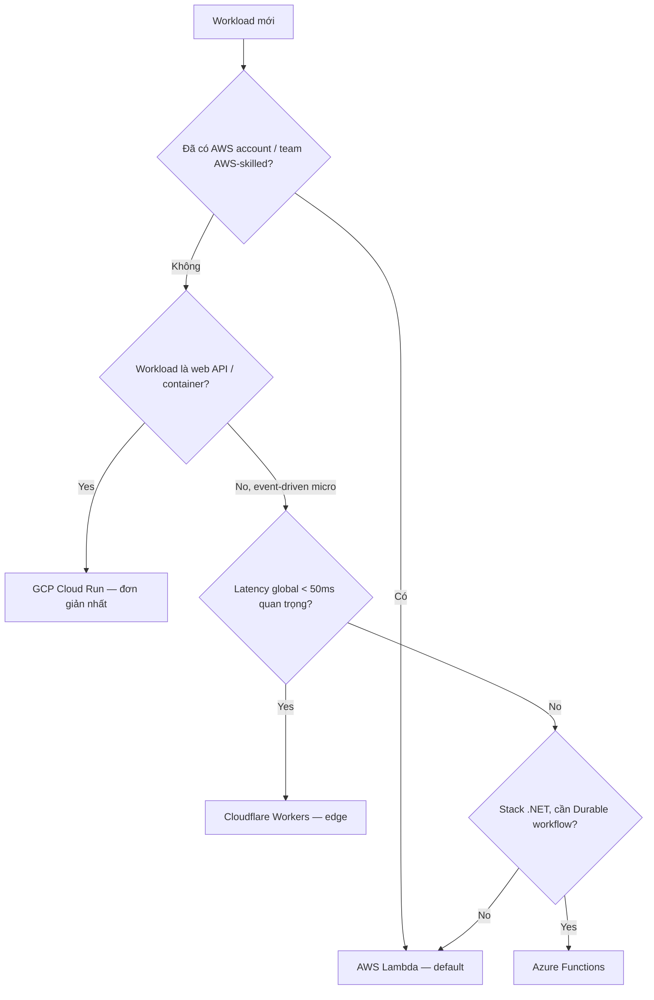

# 🎓 Serverless là gì — Bức tranh tổng thể & 4 nhà cung cấp lớn

> **Tác giả:** Mr.Rom\
> **Phiên bản:** v1.0.0\
> **Tạo lúc:** 24/05/2026\
> **Cập nhật:** 24/05/2026\
> **Level:** Basic\
> **Tags:** [MUST-KNOW]\
> **Thời lượng đọc:** ~18 phút\
> **Prerequisites:** đã đọc [cloud-fundamentals](../../../cloud-fundamentals/) — IaaS/PaaS/SaaS, region/AZ, billing model

> 🎯 *Bài mở màn cluster Serverless vendor-neutral. Sau bài này bạn hiểu rõ "serverless" không phải "không có server" mà là **mô hình kinh tế + vận hành mới**: pay-per-use, không quản hạ tầng, auto-scale từ 0 đến vô cực, event-driven. Bạn cũng biết 4 nhà cung cấp lớn (AWS Lambda, Cloud Functions/Run, Azure Functions, Cloudflare Workers) khác nhau ở đâu, khi nào nên (và không nên) dùng serverless.*

## 🎯 Sau bài này bạn sẽ

- [ ] Hiểu **định nghĩa serverless** theo 4 tiêu chí (no server mgmt, pay-per-use, auto-scale, event-driven)
- [ ] Phân biệt **FaaS** (Function as a Service) vs **container-based serverless** (Cloud Run, Fargate)
- [ ] So sánh **4 vendor lớn**: AWS Lambda, GCP Cloud Functions/Run, Azure Functions, Cloudflare Workers
- [ ] Biết **khi nào nên dùng** serverless (event-driven, sporadic traffic, API low-mid scale)
- [ ] Biết **anti-pattern** "serverless cho mọi thứ" (long-running, stateful, ultra-low-latency)
- [ ] Đọc được **so sánh chi phí** cơ bản: serverless rẻ ở low scale, EC2/VM rẻ ở high constant
- [ ] Có **mental model** chuẩn để vào sâu các bài sau (FaaS deep, triggers, patterns, cost)

---

## Tình huống — Acme Shop migrate API từ EC2 sang serverless?

Acme Shop có API backend chạy trên 4 con EC2 t3.medium ($120/tháng). Lượng request rất lệch:
- **Business hours (8h-22h)**: 500-2000 req/phút.
- **Đêm (22h-8h)**: 5-20 req/phút.
- **Cuối tuần**: tăng 3x giờ cao điểm.

Hiện trạng đau đầu:
- **Đêm**: 4 con EC2 idle, vẫn trả tiền đủ.
- **Cuối tuần peak**: 4 con bị quá tải, phải scale manual → trễ.
- **Patch OS, update kernel**: dev không có thời gian, security alert ngày càng nhiều.

Sếp đọc bài về serverless trên blog AWS, hỏi:
> *"Migrate sang Lambda + API Gateway được không? Nghe nói 'pay-per-use', không phải lo server. Đêm tiết kiệm tiền, peak tự scale."*

Bạn cần trả lời:
1. **Serverless thực sự là gì** — có "không server" thật không?
2. **Khác gì** EC2, Fargate, Cloud Run?
3. **Có nên migrate** toàn bộ API không? Phần nào nên, phần nào không?
4. **Vendor nào** chọn — Lambda? Cloud Functions? Cloudflare Workers?

Bài này trả lời cả 4 câu — vendor-neutral, không bias.

---

## Vậy serverless thực sự là gì?

🪞 **Ẩn dụ**: *Serverless giống như **đi taxi/Grab** thay vì mua xe riêng. Taxi (Lambda/Cloud Run) — gọi mới đến, hết chuyến tự đi, trả tiền theo cuốc và quãng đường, không phải lo xăng/bảo dưỡng/chỗ đậu. Xe riêng (EC2/VM) — bạn sở hữu, dùng được lúc nào tuỳ ý nhưng phải trả tiền bãi + bảo dưỡng kể cả khi không chạy. Sai lầm là nghĩ "taxi không có xe" — vẫn có xe và tài xế, chỉ là **bạn không sở hữu, không vận hành**.*

### Định nghĩa kỹ thuật chính thức

**Serverless** là mô hình điện toán đám mây nơi nhà cung cấp **toàn quyền quản lý hạ tầng** (provision, scale, patch, monitor), người dùng chỉ trả tiền theo **resource thực sự sử dụng** (request, GB-second). Không có "no server" — server vẫn tồn tại (ở phía vendor), chỉ là **invisible với developer**.

### 4 tiêu chí chuẩn (do CNCF + AWS định nghĩa)

Một dịch vụ được gọi "serverless" khi đủ **cả 4** tiêu chí:

| # | Tiêu chí | Ý nghĩa | Ví dụ |
|---|---|---|---|
| 1 | **No server management** | Không SSH, không OS patch, không capacity planning | Lambda: bạn upload code, AWS lo phần còn lại |
| 2 | **Pay-per-use** | Trả $0 khi không chạy. Trả $X theo request + duration | Lambda free tier 1M req/tháng |
| 3 | **Auto-scale 0 → ∞** | Từ 0 instance đến hàng nghìn concurrent — vendor xử lý | Lambda: 1 → 1000 concurrent trong giây |
| 4 | **Event-driven** | Function chỉ chạy khi có event (HTTP, queue, schedule, ...) | S3 upload → Lambda trigger |

> ⚠️ **Bẫy thuật ngữ**: Nhiều dịch vụ tự xưng "serverless" nhưng thiếu 1-2 tiêu chí. Ví dụ:
> - **Aurora Serverless v1** — có pay-per-use, có auto-scale, nhưng **không scale về 0** (luôn có ACU min) → "serverless" nhưng không hoàn toàn.
> - **Cloud Run** (default) — pay-per-use, auto-scale 0 → N, no server mgmt → **đầy đủ serverless** dù chạy container.
> - **ECS Fargate** — no server mgmt, pay-per-second, nhưng **không scale về 0 mặc định** → "serverless containers" nhưng vẫn trả khi idle (trừ khi dùng scheduler).

### Lịch sử rất ngắn

```
2008  ← Google App Engine — PaaS đầu tiên kiểu serverless (autoscale + pay-per-use)
2014  ← AWS Lambda ra mắt — FaaS "thuần" + event-driven
2016  ← Azure Functions, Google Cloud Functions
2017  ← Cloudflare Workers — V8 isolates, edge compute
2019  ← AWS Lambda + Provisioned Concurrency, AWS Fargate
2020  ← Cloud Run GA (containers serverless), Lambda container image support
2022  ← Cloud Run Jobs (batch serverless), Lambda Snapstart (Java)
2024  ← Cloudflare Workers Smart Placement, AWS Lambda response streaming
2026  ← Trạng thái: serverless là default cho event-driven workload mới
```

Hiểu ngữ cảnh rồi, ta xem 2 nhánh lớn của serverless để không nhầm khái niệm.

---

## 2 nhánh serverless — FaaS vs containers serverless

Không phải mọi serverless đều giống nhau. Có **2 mô hình lớn**:

### Nhánh 1: FaaS (Function as a Service)

🪞 **Ẩn dụ**: *Giống **gọi xe ôm cho 1 chuyến ngắn** — bạn chỉ định "chở từ A đến B", tài xế tự lo xe + đường, hết chuyến tự đi. Không thể "thuê chuyến 5 tiếng đi nhiều nơi".*

**Đặc điểm**:
- 1 function = 1 nhiệm vụ ngắn (vài giây, max 15 phút).
- Upload code dạng zip/container nhỏ.
- Trigger event → chạy → trả kết quả → tắt.
- Cold start ~100-500ms khi container mới spin up.

**Đại diện**:
- AWS **Lambda**.
- GCP **Cloud Functions** (1st gen + 2nd gen).
- **Azure Functions**.
- **Cloudflare Workers** (V8 isolate).

**Phù hợp**:
- Image resize sau upload.
- Cron job ngắn.
- Webhook handler.
- API endpoint nhẹ.

### Nhánh 2: Container-based serverless

🪞 **Ẩn dụ**: *Giống **thuê xe có tài xế theo giờ** — bạn mang xe của bạn (container image), thuê tài xế lúc cần, có thể chạy lâu hơn, có nhiều route trong 1 chuyến. Linh hoạt hơn xe ôm nhưng vẫn không phải mua xe.*

**Đặc điểm**:
- Đóng gói app thành container (Docker image).
- Vendor chạy container theo request, auto-scale 0 → N.
- Có thể chạy lâu hơn (60 phút Cloud Run, vô hạn Cloud Run Job).
- Cold start ~1-3s (kéo image + start container).

**Đại diện**:
- GCP **Cloud Run** (đại diện chuẩn).
- AWS **Fargate** + App Runner.
- Azure **Container Apps**.
- **Cloudflare Containers** (beta 2026).

**Phù hợp**:
- Web app full-stack (FastAPI, Next.js).
- API server moderate complexity.
- Migration từ container monolith.
- Cần dùng image hiện có không refactor.

### So sánh nhanh 2 nhánh

| Tiêu chí | FaaS | Container serverless |
|---|---|---|
| **Đơn vị deploy** | Function (zip code) | Container image |
| **Cold start** | 100-500ms (zip), 1-2s (container image) | 1-3s thường |
| **Max duration** | 15 phút (Lambda), 60 phút (Cloud Functions Gen2) | 60 phút (Cloud Run), không giới hạn (Cloud Run Job) |
| **Use case chính** | Event handler, glue code | Web app, API server |
| **Refactor app cũ** | Phải rewrite kiểu handler | Container hoá là chạy được |
| **Local dev** | SDK riêng (SAM, Functions Core Tools) | Docker quen thuộc |
| **Vendor lock-in** | Cao (handler signature riêng) | Thấp (container portable) |

→ Khi sếp hỏi "migrate Lambda hay Cloud Run?", câu trả lời thường là: **API web full-stack → Cloud Run**. **Event-driven micro-task → Lambda/Functions**. Bài này còn nhiều bài sau đi sâu.

---

## Vậy 4 vendor lớn khác nhau ở đâu?

Mọi vendor lớn đều có offering serverless. So sánh ở mặt **basics 2026**:

### Bảng tổng — chọn 1 hàng đại diện cho 1 nhánh

| Vendor | FaaS | Container serverless | Edge | Workflow |
|---|---|---|---|---|
| **AWS** | Lambda | Fargate / App Runner | Lambda@Edge, CloudFront Functions | Step Functions |
| **GCP** | Cloud Functions (1st + Gen2) | **Cloud Run** | Cloud CDN edge | Workflows |
| **Azure** | Azure Functions | Container Apps | Front Door Functions | Logic Apps, Durable Functions |
| **Cloudflare** | **Workers** (V8 isolate) | Containers (beta) | Native edge ở 300+ POP | Durable Objects, Workflows |

### Mặt mạnh / yếu của từng vendor

#### AWS Lambda

✅ **Mạnh**:
- Ecosystem khổng lồ (200+ services tích hợp).
- Trigger phong phú (S3, DDB Streams, SQS, Kinesis, EventBridge, ...).
- Provisioned Concurrency cho low-latency.
- Container image hỗ trợ tốt (10 GB max).

❌ **Yếu**:
- Max 15 phút duration — không phù hợp batch dài.
- Cold start chậm với Java/.NET (Snapstart cải thiện Java).
- Pricing khá phức tạp (request + GB-sec + provisioned + storage).

> 📖 Chi tiết: [AWS Lambda lesson](../../../aws/lessons/01_basic/04_lambda-and-api-gateway.md).

#### GCP Cloud Functions + Cloud Run

✅ **Mạnh**:
- **Cloud Run** là gold standard cho container serverless — đơn giản, mạnh.
- Cloud Functions Gen2 build trên Cloud Run → consistent model.
- Free tier hào phóng (2M req/tháng Cloud Run).
- Concurrency per instance (1 instance xử lý nhiều request đồng thời) — tiết kiệm cold start.

❌ **Yếu**:
- Trigger ecosystem nhỏ hơn AWS.
- Cloud Functions 1st gen có nhiều giới hạn (sẽ deprecate).
- Cold start tương đương Lambda.

> 📖 Chi tiết: [GCP Cloud Functions + Cloud Run lesson](../../../gcp/lessons/01_basic/04_cloud-functions-cloud-run-and-api-gateway.md).

#### Azure Functions

✅ **Mạnh**:
- **Durable Functions** — stateful workflow trên FaaS, không vendor khác có ngang ngửa.
- Tích hợp .NET sâu (đương nhiên — Microsoft).
- Premium plan + Consumption plan + Flex plan — nhiều tier.

❌ **Yếu**:
- Documentation và DX không bằng AWS/GCP.
- Ít people on Stack Overflow.
- Cold start Java vẫn chậm.

#### Cloudflare Workers

✅ **Mạnh**:
- **V8 isolate** thay vì container → cold start ~5ms (gần như không có).
- Chạy ở **300+ edge location** mặc định → latency thấp toàn cầu.
- Pricing siêu rẻ ($5/10M req).
- Durable Objects = state ở edge (unique).

❌ **Yếu**:
- Runtime hạn chế (JS/TS, WASM, Python beta) — không Java/Go native.
- CPU time limit (10ms free, 30s paid) — không chạy task dài.
- API surface khác Lambda → khó migrate.
- Một số npm package không chạy (Node API thiếu).

### Khi nào chọn vendor nào — quy tắc nhanh



→ Không có "vendor tốt nhất" tuyệt đối. Có **vendor phù hợp nhất với workload + team skill + ecosystem hiện có**.

---

## Khi nào nên dùng serverless?

🪞 **Ẩn dụ**: *Quay lại taxi vs xe riêng — bạn đi 2 chuyến/tuần thì taxi rẻ hơn nhiều. Bạn lái đi làm 8h mỗi ngày thì mua xe rẻ hơn. Serverless cũng vậy — **nó rẻ ở low/sporadic, đắt ở high constant**.*

### ✅ Phù hợp serverless

| Use case | Vì sao serverless thắng |
|---|---|
| **API low-mid traffic** (<10M req/tháng) | Free tier + pay-per-request rẻ hơn EC2 idle |
| **Event-driven**: S3 upload, queue message, webhook | Trigger trực tiếp, không cần worker daemon |
| **Cron job ngắn**: cleanup, daily report | Trả vài cents/tháng vs EC2 luôn bật |
| **Spiky traffic**: marketing campaign, news viral | Auto-scale 0 → N tức thì |
| **Glue code**: nối 2 SaaS qua webhook | Lightweight, không cần infra riêng |
| **API backend cho startup / MVP** | Khởi đầu free, scale khi cần |
| **Image/video processing on upload** | S3/Storage trigger native |
| **Chatbot, voice assistant backend** | Conversational = sporadic |
| **Auth flow (signup, password reset)** | Spiky, event-driven |

### ⚠️ Đáng cân nhắc (case by case)

| Use case | Trade-off |
|---|---|
| **API mid-high traffic** (10M-100M req/tháng) | Tính cost cụ thể — Lambda có thể đắt hơn Fargate |
| **WebSocket persistent** | Lambda WebSocket có nhưng đắt — Fargate/EC2 thường tốt hơn |
| **Workload dùng AI inference** | GPU không available trên Lambda; Cloud Run có CPU only |
| **Stack legacy (Java with heavy JVM init)** | Cold start lâu — cần Snapstart hoặc provisioned |
| **Multi-step workflow** | Cần Step Functions / Durable Functions / Workflows — tăng complexity |

### ❌ Anti-pattern — đừng dùng serverless

| Use case | Vì sao không nên |
|---|---|
| **Batch processing > 15 phút (Lambda)** | Vượt timeout. Dùng ECS task / Cloud Run Job / Batch |
| **Ultra-low-latency** (<10ms P99) | Cold start phá SLA. Dùng EC2/VM dedicated |
| **High constant traffic** (>1B req/tháng) | $/request × volume → đắt hơn EC2 nhiều |
| **Stateful long-running** (game server, video stream relay) | Function model không phù hợp. Dùng container hoặc VM |
| **Heavy DB connection** (Lambda + Postgres 1000 concurrent) | Connection storm → exhaust DB. Phải có RDS Proxy + provisioned |
| **Use case yêu cầu specific OS / kernel / GPU** | Vendor không cho — dùng EC2/VM |
| **"Lift and shift" monolith Java** | Cold start 5-10s + connection issue → fail. Cần refactor |

### Anti-pattern phổ biến nhất: "Serverless cho mọi thứ"

❌ **Tránh**: Migrate toàn bộ monolith Spring Boot 500MB → Lambda container image. Cold start 10s, connection storm, cost $1000/tháng.

✅ **Đúng**: 
1. Giữ monolith trên Fargate/Cloud Run (container serverless, không 15-min limit).
2. Strangler pattern: tách dần các endpoint event-driven (image resize, email send) sang Lambda.
3. Cron jobs → Lambda + EventBridge.
4. Heavy synchronous endpoint giữ trên container.

→ Serverless là **công cụ**, không phải tôn giáo. Kết hợp đúng chỗ.

---

## Acme Shop nên migrate thế nào?

Quay lại tình huống đầu bài. Phân tích cụ thể:

### Workload breakdown

| Endpoint | Traffic | Đặc điểm | Khuyến nghị |
|---|---|---|---|
| `/api/products/*` (browse) | 70% traffic, đều cả ngày | Cache-friendly, stateless | **Cloud Run / Fargate** — container serverless |
| `/api/checkout` | 5% traffic, peak cao tuần | Stateful (cart), DB-heavy | Giữ trên EC2 (hoặc Fargate) — provisioned |
| `/api/upload-product-image` | 1% traffic, sporadic | Event-driven (S3 trigger) | **Lambda** — perfect fit |
| `/api/send-order-email` | 5% traffic, async OK | Queue-driven | **Lambda + SQS** |
| `cron daily-report` | 1x/ngày | Short batch | **Lambda + EventBridge** |
| `webhook payment-callback` | 18% traffic, spiky | HTTP webhook | **Lambda + API Gateway** |

### Kế hoạch migration 4 phase

```
Phase 1 (tuần 1-2): Migrate cron + webhook + upload trigger → Lambda
  → Tiết kiệm ~1 con EC2 (cron runner). Học ecosystem Lambda.

Phase 2 (tuần 3-4): Migrate browse API → Cloud Run với min instances=1
  → Container hoá API hiện có. Auto-scale theo traffic.

Phase 3 (tuần 5-6): Optimize cost
  → Giảm số EC2 còn 1 (checkout). Tune Cloud Run concurrency/memory.

Phase 4 (tuần 7+): Quan sát + iterate
  → Đo cost thực tế. Nếu Cloud Run đắt hơn dự tính → tune lại.
```

### Cost ước tính (rough)

| Phương án | Hiện tại | Sau migration |
|---|---|---|
| EC2 (4 con t3.medium 24/7) | $120/tháng | $30/tháng (1 con checkout) |
| Cloud Run (browse API) | $0 | $40/tháng |
| Lambda (cron + webhook + upload + email) | $0 | $5/tháng |
| **Tổng** | **$120/tháng** | **~$75/tháng** |

→ Tiết kiệm ~40% **và** giải quyết được pain point auto-scale + patching.

> ⚠️ **Lưu ý**: số liệu rough cho minh hoạ. Thực tế cần đo bằng AWS Pricing Calculator / GCP Calculator + load test. Một số case migrate có thể **đắt hơn** chứ không rẻ hơn — luôn tính trước.

---

## 💡 Pitfall thường gặp

### ❌ Pitfall: "Serverless = không có server, không cần lo gì"

- **Triệu chứng**: Đẩy app lên Lambda mà không monitor, không alert. App fail im lặng nhiều giờ.
- **Nguyên nhân**: Hiểu sai từ "serverless". Vendor lo **hạ tầng**, không lo **logic app của bạn**.
- **Cách tránh**: Vẫn cần CloudWatch / Cloud Logging + alerts + X-Ray / Cloud Trace. Observability là **trách nhiệm của bạn**.

### ❌ Pitfall: "Pay-per-use luôn rẻ hơn"

- **Triệu chứng**: Migrate xong nhận hoá đơn $2000 trong khi EC2 chỉ $500.
- **Nguyên nhân**: High constant traffic + long duration + provisioned concurrency → đắt nhanh.
- **Cách tránh**: Luôn dùng pricing calculator + load test 1 tuần ở staging trước khi migrate prod. Tính cả phí egress + API Gateway.

### ❌ Pitfall: Chọn FaaS cho web app full-stack

- **Triệu chứng**: API Lambda cold start 800ms, user thấy chậm.
- **Nguyên nhân**: FaaS không tối ưu cho HTTP API thông thường có session, middleware nặng.
- **Cách tránh**: Web app full-stack → **container serverless (Cloud Run, Fargate, App Runner)**. FaaS dành cho event handler nhỏ.

### ❌ Pitfall: Bỏ qua vendor lock-in

- **Triệu chứng**: 2 năm sau muốn migrate AWS → GCP, phát hiện 50 Lambda handler dùng AWS SDK + Lambda runtime API → rewrite hết.
- **Nguyên nhân**: FaaS handler signature riêng theo vendor. Container portable hơn nhiều.
- **Cách tránh**: 
  - Nếu nghi ngờ migrate → ưu tiên **container serverless** (Cloud Run, Fargate).
  - Tách business logic vào module thuần (`def process_order(data)`) — handler chỉ là wrapper mỏng.
  - Dùng framework như **Serverless Framework**, **SST**, **AWS CDK** để portable hơn.

### ✅ Best practice: Hybrid architecture

- **Vì sao**: Hiếm khi 1 vendor / 1 mô hình giải quyết tốt mọi vấn đề.
- **Cách áp dụng**: 
  - Container monolith / mid-complexity API → Cloud Run / Fargate.
  - Event handlers, cron → Lambda / Cloud Functions.
  - Edge compute (geo, A/B test, CDN logic) → Cloudflare Workers.
  - Stateful workflow → Step Functions / Durable Functions / Workflows.

### ✅ Best practice: Start FaaS, scale to containers khi cần

- **Vì sao**: FaaS dễ bắt đầu, free tier hào phóng. Khi traffic/complexity tăng có thể migrate sang container.
- **Cách áp dụng**: Code business logic là module thuần. Handler là wrapper. Sau này wrap thành Express/FastAPI/Gin server → deploy Cloud Run = 30 phút.

---

## 🧠 Self-check

**Q1.** Serverless có thực sự "không có server" không? Giải thích ngắn.

<details>
<summary>💡 Đáp án</summary>

**Không**. Server vẫn tồn tại — VM, container, isolate đều chạy trên hardware của vendor. "Serverless" có nghĩa là:

1. **Server invisible với developer** — không SSH, không OS patch, không capacity planning.
2. **Pay-per-use** — không trả khi idle.
3. **Auto-scale 0 → N** — vendor quản lý.

Cụm "serverless" là một **marketing term** đánh dấu sự dịch chuyển trách nhiệm: từ "bạn quản server" → "vendor quản server, bạn tập trung code". Hardware/OS/runtime đều ở phía vendor, chỉ là developer không thấy.

Tương tự "wireless" — vẫn có wire (trong infrastructure), chỉ là người dùng cuối không cần kéo dây.
</details>

**Q2.** Phân biệt FaaS vs container serverless. Cho 1 ví dụ mỗi loại.

<details>
<summary>💡 Đáp án</summary>

| Tiêu chí | FaaS | Container serverless |
|---|---|---|
| Đơn vị | Function (1 handler) | Container image (Docker) |
| Tối đa | 15 phút (Lambda), 60p (CF Gen2) | 60 phút HTTP, ∞ batch |
| Cold start | 100-500ms | 1-3s |
| Use case | Event handler, glue code | Web app, API server |
| Migration | Phải refactor handler | Container có sẵn deploy được |

**Ví dụ FaaS**: AWS Lambda nhận S3 upload event, resize ảnh 5MB → 200KB, lưu lại S3. Function `lambda_handler(event, context)` ~30 dòng Python. Chạy 500ms mỗi lần, free tier cover.

**Ví dụ container serverless**: Cloud Run chạy FastAPI app (10 endpoints, có middleware auth + logging). Deploy bằng `gcloud run deploy --image gcr.io/proj/api:v1`. Auto-scale 0 → 10 instances theo traffic. Mỗi instance xử lý 80 request concurrent.
</details>

**Q3.** Acme Shop có 1B request/tháng API browse products. Có nên dùng Lambda?

<details>
<summary>💡 Đáp án</summary>

**Không nên** dùng Lambda thuần — chi phí sẽ rất đắt.

Tính nhanh (mỗi request 100ms × 256MB):
- Request cost: 1B × $0.20/M = **$200**.
- Compute cost: 1B × 0.1s × 0.25 GB × $0.0000166 = **$415**.
- API Gateway HTTP: 1B × $1/M = **$1000**.
- **Tổng Lambda: ~$1615/tháng**.

So với EC2 ASG 4-10 con c7g.xlarge + ALB: ~$400-800/tháng cho cùng traffic.

**Khuyến nghị**:
1. **Cloud Run với min_instances ≥ 5**: ~$300-500/tháng + concurrency tốt + auto-scale.
2. **ECS Fargate behind ALB**: ~$400-600/tháng, container portable.
3. **EC2 ASG**: $300-500/tháng, classic, ổn định ở scale này.

Lambda chỉ phù hợp khi:
- Sporadic traffic.
- < 100M req/tháng.
- Hoặc các endpoint **đặc biệt event-driven** (upload, webhook).

**Quy tắc rough**: 1B req/tháng = ranh giới Lambda thường thua container serverless / VM.
</details>

**Q4.** Khi nào chọn Cloudflare Workers thay vì Lambda?

<details>
<summary>💡 Đáp án</summary>

**Chọn Cloudflare Workers khi**:

1. **Latency global quan trọng** — Workers chạy ở 300+ POP, user ở Việt Nam hit POP Singapore (~30ms) thay vì us-east-1 (~250ms).
2. **Workload nhẹ + ngắn** — < 30s CPU, JS/TS native, không cần Java/Go.
3. **Edge use case** — A/B testing, geo routing, CDN logic, image optimization on the fly.
4. **Cost cực thấp** — $5/10M req vs Lambda $2/M = Workers rẻ ~4x.
5. **Cold start gần như 0** — V8 isolate spin up ~5ms vs Lambda 100-500ms.

**Chọn Lambda khi**:

1. **Trigger AWS** — S3, DynamoDB Streams, Kinesis, SQS. Workers không có.
2. **Runtime đa dạng** — Python, Java, Go, .NET. Workers chủ yếu JS/TS/Python beta.
3. **Long duration** — > 30s. Workers max 30s CPU (5 phút wall time với background tasks).
4. **Heavy dependency** — npm package có Node API. Workers không hỗ trợ đầy đủ Node API.
5. **AWS ecosystem** — IAM role, VPC, RDS Proxy.

**Pattern thực tế**: Dùng **cả 2**. Cloudflare Workers ở front (edge cache + auth + geo) → forward sâu vào API Lambda/Cloud Run khi cần logic phức tạp.
</details>

**Q5.** Liệt kê 3 anti-pattern khi dùng serverless.

<details>
<summary>💡 Đáp án</summary>

1. **"Serverless cho mọi thứ"** — Migrate toàn bộ monolith Java/Spring Boot 500MB sang Lambda. Cold start 5-10s, JDBC connection storm, cost cao. **Fix**: container serverless (Cloud Run, Fargate) hoặc giữ trên VM; chỉ tách event-driven endpoint sang FaaS.

2. **"Long batch trong Lambda"** — Process file CSV 5GB → 30 phút compute → vượt 15p limit của Lambda. **Fix**: ECS Fargate task, Cloud Run Job, AWS Batch, hoặc chia nhỏ thành nhiều Lambda chạy parallel + Step Functions.

3. **"Synchronous chat/WebSocket Lambda"** — User chat realtime qua WebSocket Lambda. Mỗi message 1 invocation + state external store → đắt, complexity cao. **Fix**: WebSocket → Fargate/EC2 + Redis pub-sub; Lambda chỉ cho async events bên ngoài.

(Có thể thêm: **Lambda + RDS không có proxy** = connection storm; **provisioned concurrency cho mọi function** = lãng phí khi traffic spiky thật.)
</details>

---

## ⚡ Cheatsheet

### Định nghĩa nhanh

```
Serverless = no server mgmt + pay-per-use + auto-scale 0→N + event-driven
```

### 2 nhánh

| FaaS | Container serverless |
|---|---|
| Lambda, Cloud Functions, Azure Functions, CF Workers | Cloud Run, Fargate, Container Apps, App Runner |
| Function = 1 handler | Container image |
| Max 15p-60p | Max 60p HTTP, ∞ batch |

### Decision tree gọn

```
Event-driven, < 15p, micro-task   → FaaS
Web app, container có sẵn         → Container serverless
Global latency quan trọng         → Cloudflare Workers
Long batch / stateful             → ECS task / VM
Constant high traffic (>1B/tháng) → VM / ASG / container
```

### 4 vendor gọn

| Vendor | Mạnh | Yếu |
|---|---|---|
| AWS Lambda | Ecosystem rộng, trigger phong phú | Cold start Java chậm, 15p limit |
| GCP Cloud Run | Container serverless dễ nhất | Trigger ecosystem nhỏ hơn |
| Azure Functions | Durable Functions stateful | DX kém hơn AWS/GCP |
| Cloudflare Workers | Edge, cold start ~5ms, rẻ | Runtime hạn chế, CPU 30s max |

---

## 📚 Glossary

| EN | VN | Giải thích |
|---|---|---|
| Serverless | Không quản hạ tầng | Mô hình cloud nơi vendor quản infrastructure, dev chỉ trả tiền theo sử dụng |
| FaaS | Function as a Service | Function ngắn, event-driven (Lambda, Cloud Functions) |
| Container serverless | — | Serverless dùng container image (Cloud Run, Fargate) |
| Cold start | Khởi động lạnh | Lần đầu tiên function chạy sau idle, tốn time provision |
| Warm invocation | Gọi nóng | Container đã có sẵn, response nhanh |
| Auto-scale | Tự co giãn | Tự tăng/giảm instance theo traffic |
| Event-driven | Hướng sự kiện | Function chỉ chạy khi có trigger (HTTP, queue, ...) |
| Edge compute | Tính toán biên | Chạy code ở POP gần user (Cloudflare Workers, Lambda@Edge) |
| V8 isolate | Cách ly V8 | Cloudflare Workers dùng isolate thay vì container — nhẹ hơn 1000x |
| Trigger / event source | Nguồn sự kiện | Thứ kích hoạt function (S3, queue, schedule, ...) |
| Provisioned Concurrency | Đảm bảo concurrency | Giữ N container warm sẵn để tránh cold start |
| Pay-per-use | Trả theo dùng | Tính tiền theo request + duration thực tế |
| Vendor lock-in | Khoá nhà cung cấp | Khó migrate code sang vendor khác |
| DLQ | Dead Letter Queue | Queue chứa message fail để xử lý sau |
| Idempotency | Bất biến trạng thái | Function chạy nhiều lần cho cùng input → cùng kết quả |
| Concurrency | Đồng thời | Số lượng function chạy song song |

---

## 🔗 Liên kết & Tài nguyên

### Trong cluster
- ↑ [Serverless README](../../README.md) — cluster overview
- → Tiếp theo: [01_function-as-a-service-deep.md](01_function-as-a-service-deep.md) — FaaS đào sâu

### Cross-reference (đã có trong kho)
- 🟧 [AWS Lambda + API Gateway](../../../aws/lessons/01_basic/04_lambda-and-api-gateway.md) — Lambda vendor deep
- 🟦 [GCP Cloud Functions + Cloud Run](../../../gcp/lessons/01_basic/04_cloud-functions-cloud-run-and-api-gateway.md) — GCP serverless deep
- ☁️ [Cloud Fundamentals](../../../cloud-fundamentals/) — vendor-neutral foundation
- 🐍 [FastAPI](../../../../07_Web/backend/python-fastapi/) — framework hay deploy lên Cloud Run

### Tài nguyên ngoài
- 📖 [CNCF Serverless Whitepaper](https://github.com/cncf/wg-serverless) — chuẩn hoá định nghĩa
- 📖 [AWS Serverless](https://aws.amazon.com/serverless/) — landing page
- 📖 [Google Serverless](https://cloud.google.com/serverless) — landing page
- 📖 [Azure Serverless](https://azure.microsoft.com/en-us/solutions/serverless/)
- 📖 [Cloudflare Workers docs](https://developers.cloudflare.com/workers/)
- 📖 [Serverless Framework](https://www.serverless.com/) — multi-cloud abstraction
- 📖 [SST](https://sst.dev/) — TypeScript-first serverless on AWS
- 📖 [Berkeley View on Serverless (paper)](https://arxiv.org/abs/1902.03383) — academic foundation
- 📖 [Awesome Serverless](https://github.com/anaibol/awesome-serverless)

---

## 📌 Changelog

- **v1.0.0 (24/05/2026)** — Bài mở màn cluster Serverless vendor-neutral. Định nghĩa 4 tiêu chí + 2 nhánh FaaS/container + so sánh 4 vendor (AWS/GCP/Azure/Cloudflare) + decision tree + Acme Shop migration plan + 4 pitfall + 2 best practice + 5 self-check. Cross-link AWS Lambda + GCP Cloud Run lessons đã có.
