# 🎓 Serverless Patterns & Anti-patterns — Khi nào dùng, khi nào tránh

> **Tác giả:** Mr.Rom\
> **Phiên bản:** v1.0.0\
> **Tạo lúc:** 24/05/2026\
> **Cập nhật:** 24/05/2026\
> **Level:** Basic\
> **Tags:** [MUST-KNOW]\
> **Thời lượng đọc:** ~18 phút\
> **Prerequisites:** [02_event-driven-and-triggers.md](02_event-driven-and-triggers.md)

> 🎯 *Bài 00-02 đã cho bạn nền tảng. Bài này tổng hợp **8 pattern thực chiến** mà mọi team serverless đều áp dụng, và **6 anti-pattern** đắt giá bạn cần tránh. Sau bài này bạn có 1 "playbook" để mỗi khi nhận yêu cầu mới, bạn biết ngay "pattern nào áp dụng" thay vì design từ đầu.*

## 🎯 Sau bài này bạn sẽ

- [ ] Biết **8 pattern phổ biến**: API backend, file pipeline, ETL stream, cron, webhook, chatbot, fanout/fan-in, saga
- [ ] Biết **6 anti-pattern phổ biến**: chatty backend, big monolith function, sync long DB query, no versioning, no monitoring, "serverless cho mọi thứ"
- [ ] Biết cách **chọn pattern** theo workload (decision tree)
- [ ] Có **architecture template** vẽ được cho mỗi pattern
- [ ] Hiểu **trade-off** của mỗi pattern (latency, cost, complexity)
- [ ] Biết **migration path** từ anti-pattern sang pattern đúng

---

## Tình huống — Acme Shop muốn build nhiều feature mới

Quý mới, Acme Shop có 5 feature cần build:

1. **Mobile API** cho app khách hàng — REST endpoint.
2. **Auto-resize ảnh sản phẩm** khi seller upload.
3. **Sync inventory** từ ERP (Postgres) → Algolia search.
4. **Báo cáo doanh thu ngày** gửi Slack 8h sáng.
5. **Stripe webhook** xử lý payment confirm.
6. **Chatbot Zalo OA** trả lời FAQ + check order.
7. **Newsletter campaign** gửi 100k email với 5 template A/B.
8. **Checkout flow** với 4 bước (validate cart → reserve stock → charge → ship).

Sếp:
> *"Mỗi feature có pattern serverless chuẩn không? Đừng tự nghĩ từ đầu — phí time. Bạn làm slide map feature → pattern + mỗi pattern 1 diagram. Deadline 14h ngày mai."*

Bài này là **playbook** sếp cần — mỗi pattern có description + diagram + AWS/GCP equivalent.

---

## 8 Pattern phổ biến

🪞 **Ẩn dụ tổng**: *Pattern serverless như **công thức nấu ăn chuẩn**. Mỗi món có công thức chuẩn (pizza dùng lò, phở dùng nồi hầm). Đừng nấu phở trong lò → không ngon mà tốn time.*

### Pattern 1 — API Backend (HTTP API)

🪞 **Ẩn dụ**: *Như **quán cà phê có menu cố định** — khách order, barista pha (function), trả ly. Mỗi request là 1 đơn riêng.*

**Use case**: REST/GraphQL API cho mobile/web app, microservice nội bộ.

**Architecture**:

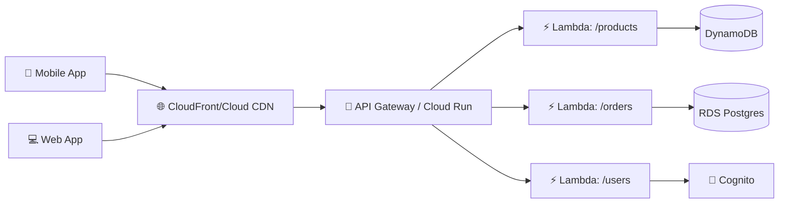

**Áp dụng**:
- Lambda + API Gateway HTTP API (AWS).
- Cloud Run native (GCP) — tốt hơn cho web app full-stack.
- Cloudflare Workers (edge logic, latency global).

**Khi nào dùng**:
- Traffic < 100M req/tháng.
- Mỗi request < 1s thực tế.
- Endpoint logic độc lập.

**Khi nào KHÔNG**:
- Traffic > 1B req/tháng (cost cao).
- Long-running request (>15p Lambda).
- WebSocket persistent (dùng Fargate / EC2).

**Tối ưu**:
- HTTP API thay REST API (rẻ 3.5x).
- Provisioned Concurrency cho hot endpoint.
- Caching ở CloudFront / API Gateway / function level.

---

### Pattern 2 — File Processing Pipeline

🪞 **Ẩn dụ**: *Như **dây chuyền sản xuất** — ảnh thô vào, dây chuyền tự động resize → watermark → thumbnail → lưu kho. Không có người đứng ngó.*

**Use case**: Upload ảnh/video → resize/transcode/analyze tự động.

**Architecture**:

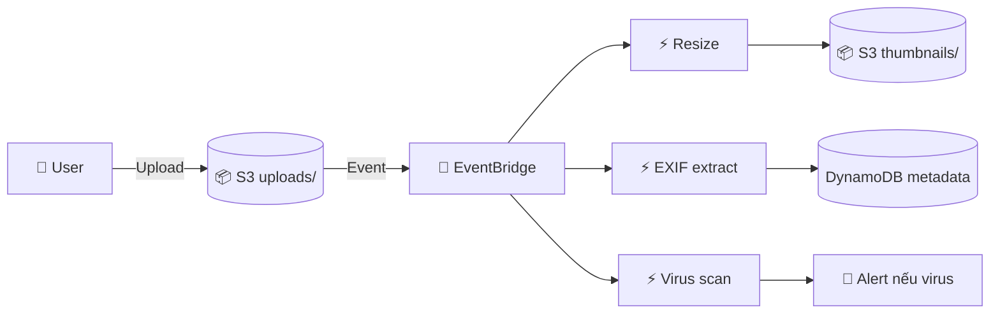

**Áp dụng**:
- AWS: S3 → EventBridge → multiple Lambda (parallel).
- GCP: GCS → Eventarc → multiple Cloud Functions.

**Variation**:
- Sync chain: 1 ảnh → resize → upload thumbnail → trigger watermark → upload final.
- Parallel: 1 ảnh → 3 Lambda song song (resize + EXIF + scan).

**Pitfall**:
- Lambda trigger trên S3 thumbnails/ output → vòng lặp vô tận. Phải filter prefix.
- Image > 50MB → Lambda OOM. Phải tăng memory hoặc dùng Fargate.

---

### Pattern 3 — ETL / Data Stream

🪞 **Ẩn dụ**: *Như **suối nước chảy không ngừng** — data từ source liên tục chảy qua filter (transform) → đổ vào hồ (data warehouse). Không phải ai cũng tắm liên tục — function chỉ chạy khi có dòng chảy.*

**Use case**: Sync DB → search index, replicate DB → warehouse, real-time analytics.

**Architecture**:

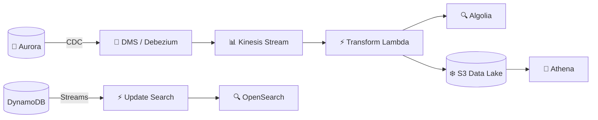

**Áp dụng**:
- AWS: DynamoDB Streams + Lambda, hoặc Kinesis + Lambda.
- GCP: Firestore + Cloud Functions, hoặc Pub/Sub + Cloud Functions.
- Kafka: MSK → Lambda (AWS), self-hosted Kafka → Cloud Run.

**Variation**:
- **Hot path**: DDB Streams → Lambda → Algolia (real-time search).
- **Cold path**: DDB → S3 export → Athena (batch analytics).

**Pitfall**:
- Kinesis shard chỉ 1 Lambda parallel per shard → throughput limit.
- DDB Streams 24h retention → consumer chậm mất event.
- Reordering: parallel Lambda → out-of-order events.

---

### Pattern 4 — Cron / Scheduled Tasks

🪞 **Ẩn dụ**: *Như **đồng hồ báo thức** — đúng giờ rung, làm nhiệm vụ, ngủ lại.*

**Use case**: Daily report, cleanup, sync external, health check.

**Architecture**:

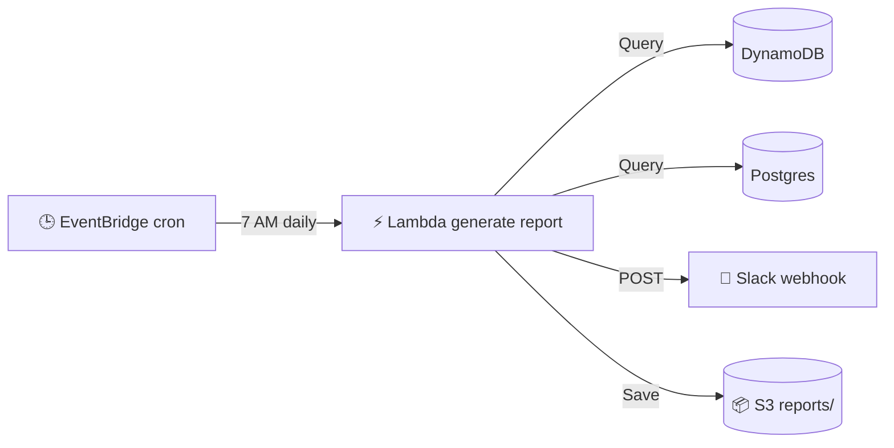

**Áp dụng**:
- AWS: EventBridge Schedule → Lambda.
- GCP: Cloud Scheduler → Cloud Functions / Cloud Run.
- Cloudflare: Workers Cron Triggers.

**Cron expression cheatsheet**:

| Lịch | EventBridge | Cloud Scheduler |
|---|---|---|
| Mỗi 5 phút | `rate(5 minutes)` | `*/5 * * * *` |
| 7 AM daily | `cron(0 7 * * ? *)` | `0 7 * * *` |
| Thứ 2 9 AM weekly | `cron(0 9 ? * MON *)` | `0 9 * * 1` |
| Ngày 1 hàng tháng | `cron(0 0 1 * ? *)` | `0 0 1 * *` |

**Pitfall**:
- Lambda max 15p — job dài hơn dùng Cloud Run Job hoặc Step Functions.
- Cron không cấp đảm bảo timing 100% (vendor delay ~1 phút có thể xảy ra).
- Timezone: cron mặc định UTC → convert sang VN (UTC+7).

---

### Pattern 5 — Webhook Receiver

🪞 **Ẩn dụ**: *Như **bưu tá gõ cửa** — Stripe (sender) gõ cửa (POST), bạn nhận thư (event), ký nhận (200 OK), xử lý sau.*

**Use case**: Nhận event từ Stripe, GitHub, Slack, Zalo OA, Twilio.

**Architecture**:

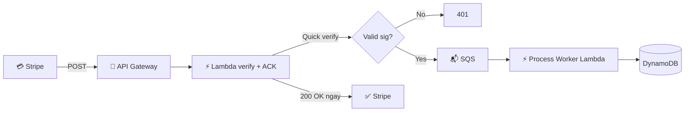

**Lý do tách 2 Lambda**:
- Stripe expect 200 OK < 5s. Nếu xử lý chậm → Stripe retry → trùng.
- Verify ngay → ACK ngay → đẩy SQS → process async.

**Code template**:

```python
def webhook_handler(event, context):
    # 1. Verify
    if not verify_stripe_sig(event['body'], event['headers'].get('stripe-signature'), SECRET):
        return {'statusCode': 401}
    
    # 2. Idempotency check + push SQS
    stripe_event = json.loads(event['body'])
    sqs.send_message(
        QueueUrl=PROCESSING_QUEUE,
        MessageBody=event['body'],
        MessageDeduplicationId=stripe_event['id']   # FIFO dedup
    )
    
    # 3. Quick 200
    return {'statusCode': 200, 'body': 'ack'}

def worker_handler(event, context):
    for record in event['Records']:
        stripe_event = json.loads(record['body'])
        if stripe_event['type'] == 'payment_intent.succeeded':
            handle_payment(stripe_event['data']['object'])
```

**Pitfall**:
- Quên verify sig → attacker giả lập.
- Process inline thay vì SQS → timeout → Stripe retry.
- Lưu raw body trước khi parse JSON (cần cho verify).

---

### Pattern 6 — Chatbot / Conversational Backend

🪞 **Ẩn dụ**: *Như **tổng đài chăm sóc** — khách nhắn câu hỏi, hệ thống nhận → routing → trả lời. Mỗi tin nhắn là 1 request riêng, state lưu DB.*

**Use case**: Zalo/Facebook Messenger bot, Slack app, Discord bot.

**Architecture**:

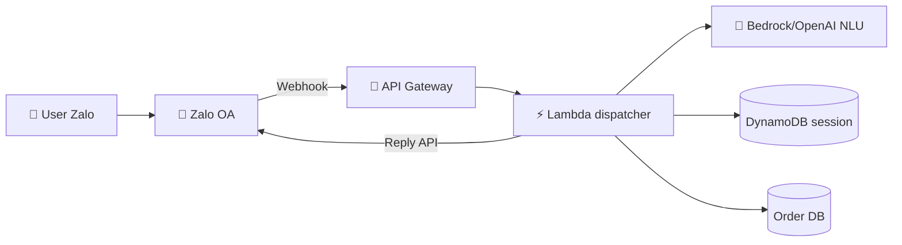

**Tại sao serverless phù hợp**:
- Conversational = sporadic spike (giờ nghỉ trưa burst, đêm im).
- Stateless function + DB lưu session.
- Auto-scale theo viral message.

**Pitfall**:
- Cold start làm phản hồi chậm → user nghĩ bot lag.
  - Fix: Provisioned Concurrency hoặc warm pings.
- Session state phình to → DDB quá hot.
  - Fix: TTL session 30 phút.
- LLM call chậm (5-10s) → API Gateway timeout.
  - Fix: async (ACK ngay → reply lại sau qua Zalo API).

---

### Pattern 7 — Fanout / Fan-in

🪞 **Ẩn dụ**: *Fanout = **gửi thư mời 100 khách** — 1 nguồn, N người. Fan-in = **thu kết quả khảo sát từ 100 nơi về 1 chỗ** — N nguồn, 1 đích.*

**Use case fanout**: Newsletter campaign 100k user, notification fanout.
**Use case fan-in**: Aggregate kết quả N parallel task.

**Architecture fanout**:

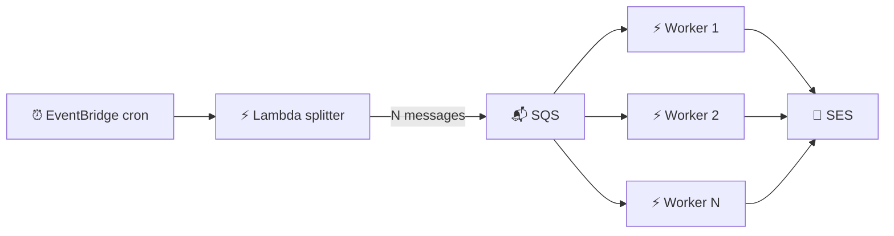

**Code splitter**:

```python
def splitter(event, context):
    users = get_all_users()   # 100k user
    for batch in chunks(users, 10):   # 10k batch của 10 user
        sqs.send_message_batch(
            QueueUrl=NEWSLETTER_QUEUE,
            Entries=[{'Id': str(i), 'MessageBody': json.dumps(u)} for i, u in enumerate(batch)]
        )
```

→ 1 splitter → 10k SQS message → 100-1000 Lambda parallel → 100k email sent trong 5 phút.

**Architecture fan-in (với Step Functions)**:

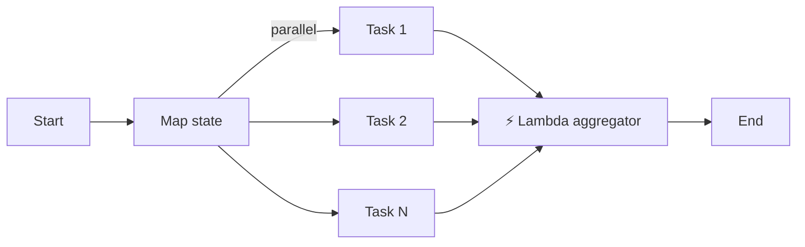

```yaml
# Step Functions definition
States:
  ProcessParallel:
    Type: Map
    ItemsPath: $.items
    MaxConcurrency: 100
    Iterator:
      States:
        ProcessItem:
          Type: Task
          Resource: arn:aws:lambda:...:processor
          End: true
    Next: Aggregate
  
  Aggregate:
    Type: Task
    Resource: arn:aws:lambda:...:aggregator
    End: true
```

**Pitfall**:
- Hit concurrency limit (1000 Lambda default).
- DB connection storm.
- Cost spike khi không monitor.

---

### Pattern 8 — Saga (Distributed Transaction)

🪞 **Ẩn dụ**: *Như **đăng ký nhập học** — phải xong 4 bước (đóng học phí, đăng ký môn, lấy thẻ, vô nhóm Discord). Nếu bước 3 fail (hết thẻ) → quay lại huỷ bước 1+2 (hoàn học phí + huỷ môn).*

**Use case**: Checkout (validate → reserve → charge → ship), workflow nhiều bước.

**Architecture với Step Functions**:

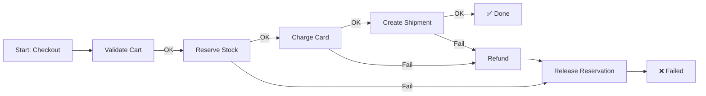

**Step Functions definition**:

```yaml
States:
  Validate:
    Type: Task
    Resource: arn:aws:lambda:...:validate
    Catch:
      - ErrorEquals: [States.ALL]
        Next: Failed
    Next: Reserve
  
  Reserve:
    Type: Task
    Resource: arn:aws:lambda:...:reserve
    Catch:
      - ErrorEquals: [States.ALL]
        Next: ReleaseReservation
    Next: Charge
  
  Charge:
    Type: Task
    Resource: arn:aws:lambda:...:charge
    Catch:
      - ErrorEquals: [States.ALL]
        Next: Refund
    Next: Ship
  
  # Compensation states
  ReleaseReservation:
    Type: Task
    Resource: arn:aws:lambda:...:release
    Next: Failed
  
  Refund:
    Type: Task
    Resource: arn:aws:lambda:...:refund
    Next: ReleaseReservation
```

**Alternative**: Choreography (event-driven saga, không có central orchestrator).
- Mỗi service publish event → service tiếp theo subscribe.
- Phức tạp hơn nhưng decentralized.

→ **Khuyên cho beginner**: dùng Step Functions / Durable Functions (orchestration). Choreography khi team đông + microservice mature.

---

## Acme Shop — map feature → pattern

Quay lại 8 feature đầu bài:

| Feature | Pattern | Vendor |
|---|---|---|
| 1. Mobile API | **API Backend** | API Gateway + Lambda (low traffic) hoặc Cloud Run (mid-high) |
| 2. Auto-resize ảnh | **File Pipeline** | S3 → Lambda |
| 3. Sync inventory → search | **ETL Stream** | DynamoDB Streams → Lambda → Algolia |
| 4. Báo cáo Slack 8h sáng | **Cron** | EventBridge cron → Lambda |
| 5. Stripe webhook | **Webhook** | API Gateway → Lambda verify → SQS → worker |
| 6. Chatbot Zalo | **Chatbot** | API Gateway → Lambda (LLM Bedrock) |
| 7. Newsletter 100k | **Fanout** | Splitter Lambda → SQS → 1000 worker Lambda → SES |
| 8. Checkout 4 bước | **Saga** | Step Functions orchestrating 4 Lambda |

→ Mỗi feature 1 pattern chuẩn. Không cần re-invent.

---

## 6 Anti-pattern phổ biến

### ❌ Anti-pattern 1: Chatty backend

**Mô tả**: 1 API request → Lambda gọi 10 Lambda khác → mỗi cái gọi 5 DB query.

```
Mobile request → API GW → Lambda A
                          ├─ invoke Lambda B (HTTP) → DB query
                          ├─ invoke Lambda C (HTTP) → DB query
                          ├─ invoke Lambda D (HTTP) → DB query
                          └─ invoke Lambda E (HTTP) → DB query

Total: 1 client request = 5 Lambda invocations + 4 internal HTTP roundtrips + 5 DB queries
```

**Vì sao xấu**:
- Latency: 5 × cold start risk + 4 × network HTTP.
- Cost: 5x Lambda invocations.
- Debug: trace cross multiple services khó.

**Fix**:
- **Coarse-grained Lambda**: 1 Lambda handle 1 use case end-to-end.
- Hoặc dùng **Step Functions** nếu thực sự cần orchestration.
- **Backend for Frontend (BFF) pattern**: 1 Lambda aggregate data cần cho 1 screen.

---

### ❌ Anti-pattern 2: Big Monolith Function

**Mô tả**: 1 Lambda function 5000 dòng code, 50 npm package, handle 20 endpoint khác nhau qua if-else.

```python
def lambda_handler(event, context):
    path = event['rawPath']
    if path == '/users':
        return handle_users(event)
    elif path == '/products':
        return handle_products(event)
    elif path == '/orders':
        return handle_orders(event)
    # ... 17 endpoint khác
```

**Vì sao xấu**:
- Cold start chậm (load 50 package mỗi cold start).
- Deploy chậm (50MB zip).
- IAM permission rộng (function cần permission cho mọi service).
- Test khó (mock nhiều thứ).
- Khi 1 endpoint bug → cả Lambda risk redeploy.

**Fix**:
- 1 Lambda per route hoặc per resource (`/users` → 1 Lambda, `/products` → 1 Lambda).
- Hoặc dùng Lambda monolith **chỉ khi** dùng framework như Mangum (FastAPI on Lambda) — cụ thể, cố ý.
- Hoặc Cloud Run / Fargate cho web app nguyên khối.

**Khi nào monolith Lambda OK**:
- App nhỏ < 5 endpoint, code < 500 dòng.
- Dùng Mangum/Serverless Express để map.
- Có testing tốt.

---

### ❌ Anti-pattern 3: Sync long DB query trong Lambda HTTP

**Mô tả**: API endpoint kéo report 100k row → process → trả về.

```python
def lambda_handler(event, context):
    # User hits /reports/sales-2024
    rows = db.execute("SELECT * FROM sales WHERE year=2024")   # 100k rows
    result = process(rows)   # 10 seconds
    return {'statusCode': 200, 'body': json.dumps(result)}
```

**Vì sao xấu**:
- API Gateway timeout 30s → fail.
- User chờ 10s — UX kém.
- Lambda timeout risk.
- Memory exhaust khi 100k rows trong RAM.

**Fix — Pattern async**:

```python
def lambda_handler(event, context):
    # Quick endpoint: queue + return job_id
    job_id = uuid.uuid4().hex
    sqs.send_message(QueueUrl=Q, MessageBody=json.dumps({'job_id': job_id, ...}))
    return {'statusCode': 202, 'body': json.dumps({'job_id': job_id})}

def worker_handler(event, context):
    # Async worker: process + lưu kết quả
    for record in event['Records']:
        result = heavy_process(...)
        s3.put_object(Bucket=..., Key=f"reports/{job_id}.json", Body=json.dumps(result))

def get_result_handler(event, context):
    # User poll: GET /reports/{job_id}
    job_id = event['pathParameters']['job_id']
    try:
        result = s3.get_object(Bucket=..., Key=f"reports/{job_id}.json")
        return {'statusCode': 200, 'body': result['Body'].read()}
    except NoSuchKey:
        return {'statusCode': 202, 'body': 'still processing'}
```

→ User: POST → 202 + job_id → poll GET → 200 khi xong.

Hoặc dùng WebSocket / Server-Sent Events / SNS push.

---

### ❌ Anti-pattern 4: No versioning, no aliasing

**Mô tả**: Deploy Lambda thẳng `$LATEST`. Không có version. Rollback bằng cách deploy lại code cũ.

**Vì sao xấu**:
- Không rollback nhanh được.
- A/B test không làm được.
- Traffic shifting (canary) impossible.

**Fix**:

```yaml
# SAM with versioning + alias
HelloFn:
  Type: AWS::Serverless::Function
  Properties:
    AutoPublishAlias: live
    DeploymentPreference:
      Type: Canary10Percent5Minutes   # 10% traffic 5p, 90% sau
      Alarms:
        - !Ref LiveAlarm
```

→ Mỗi deploy tự publish version + shift traffic dần. Alarm rollback tự động.

Hoặc manual:

```bash
# Publish version
aws lambda publish-version --function-name fn

# Create/update alias
aws lambda update-alias --function-name fn --name live --function-version 5

# Canary: 90% v4, 10% v5
aws lambda update-alias --function-name fn --name live \
  --function-version 4 \
  --routing-config "AdditionalVersionWeights={5=0.1}"
```

---

### ❌ Anti-pattern 5: No monitoring, no alerting

**Mô tả**: Deploy Lambda → không setup CloudWatch alarm → fail im lặng.

**Vì sao xấu**:
- Bug → DLQ phình → mất data.
- Cost spike → cuối tháng shock $5000.
- Latency degrade → user complain → bạn không biết.

**Fix — Observability baseline**:

```yaml
# Mỗi Lambda phải có:
1. Structured JSON log (Powertools Logger)
2. X-Ray tracing enabled
3. CloudWatch alarm:
   - Errors > 1% in 5 min
   - Duration P99 > X ms
   - Throttles > 0
   - DLQ depth > 0
4. Dashboard: invocations / errors / duration / cost
5. Alarm action: SNS → PagerDuty / Slack
```

Template:

```yaml
ErrorAlarm:
  Type: AWS::CloudWatch::Alarm
  Properties:
    MetricName: Errors
    Namespace: AWS/Lambda
    Dimensions:
      - Name: FunctionName
        Value: !Ref MyFn
    Statistic: Sum
    Period: 300
    EvaluationPeriods: 1
    Threshold: 5
    ComparisonOperator: GreaterThanThreshold
    AlarmActions: [!Ref OnCallSNS]
```

---

### ❌ Anti-pattern 6: "Serverless cho mọi thứ"

**Mô tả**: Migrate toàn bộ monolith Spring Boot 800MB → Lambda container image. Hoặc dùng Lambda cho WebSocket persistent chat. Hoặc Lambda cho video transcoding 30 phút.

**Vì sao xấu**:
- Cold start Spring 5-10s — UX hỏng.
- Lambda WebSocket có nhưng đắt và phức tạp.
- Lambda timeout 15p — video transcode dài fail.

**Fix — Hybrid architecture**:

```
✅ Container monolith → Cloud Run / Fargate
✅ Event handlers / cron → Lambda
✅ Edge compute → Cloudflare Workers
✅ Long batch → Cloud Run Job / ECS Fargate task
✅ WebSocket → Fargate + Redis pub-sub
✅ ML inference → Cloud Run (CPU) / EC2 GPU (heavy)
```

**Decision tree migration**:

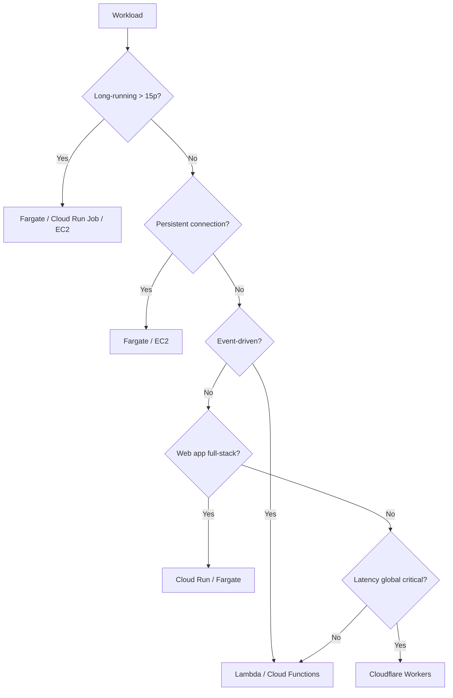

---

## 💡 Best practice tổng

### ✅ Best practice 1: Coarse-grained Lambda, không micro-micro

- 1 Lambda = 1 logical use case (resize image, charge payment, send daily report).
- Không tách thành 10 Lambda nhỏ cho 1 use case.
- Mỗi Lambda < 500 dòng code, single responsibility.

### ✅ Best practice 2: Event-driven > scheduled polling

```python
# ❌ Anti-pattern: cron Lambda mỗi 1 phút check DB cho row mới
def cron_handler(event, context):
    new_rows = db.execute("SELECT * FROM orders WHERE processed=false")
    for row in new_rows:
        process(row)

# ✅ Pattern: DDB Streams trigger ngay khi có row mới
def stream_handler(event, context):
    for record in event['Records']:
        if record['eventName'] == 'INSERT':
            process(record['dynamodb']['NewImage'])
```

→ Event-driven: low latency, ít invocation rỗng, đúng nguyên tắc serverless.

### ✅ Best practice 3: Idempotent always

- Mọi function async phải idempotent.
- Dùng AWS Powertools `@idempotent` hoặc DDB conditional.
- Test bằng cách invoke 2 lần liên tiếp cùng event → kết quả phải giống.

### ✅ Best practice 4: Observability từ ngày 1

- Structured logging (JSON).
- Distributed tracing (X-Ray / Cloud Trace).
- Metric & alarm (errors, duration P99, DLQ depth).
- Cost monitoring (Cost Explorer + Budget alert).

### ✅ Best practice 5: Infrastructure as Code

- SAM, CDK, Terraform, Serverless Framework — không deploy bằng Console.
- Git versioned.
- CI/CD pipeline cho deploy.
- Rollback dễ.

---

## 🧠 Self-check

**Q1.** Pattern File Processing Pipeline khác Chatty Backend ở điểm gì? Vì sao 1 cái là pattern tốt, 1 cái là anti-pattern dù cả 2 đều có nhiều function?

<details>
<summary>💡 Đáp án</summary>

**File Pipeline (pattern tốt)**:
- Nhiều Lambda nhưng **trigger độc lập từ event**, không gọi nhau qua HTTP.
- Mỗi Lambda 1 responsibility (resize, EXIF, scan) chạy **song song**.
- Source of truth là **event** (S3 notification) — không phải HTTP roundtrip.
- Latency: 1 cold start max (parallel).

```
S3 → EventBridge → Lambda A (resize)    ← all parallel, independent
                → Lambda B (EXIF)
                → Lambda C (scan)
```

**Chatty Backend (anti-pattern)**:
- Lambda gọi Lambda qua HTTP/invoke API → **chain serialized**.
- Mỗi step thêm cold start risk + network roundtrip.
- Latency: N × cold start risk + N × network.
- Coupling: Lambda A biết Lambda B URL, fail cascade.

```
Mobile → Lambda A → Lambda B → Lambda C → Lambda D    ← serialized chain
              ↓                     ↓
            DB                    DB
```

**Tóm tắt**: 
- Nhiều Lambda **song song event-driven** = ✅ pattern.
- Nhiều Lambda **gọi nhau sync qua HTTP** = ❌ anti-pattern.

**Khi cần orchestration nhiều bước**:
- Dùng Step Functions (visual workflow) thay vì Lambda gọi Lambda.
- Hoặc gộp logic vào 1 Lambda nếu fit.
</details>

**Q2.** Khi nào dùng Step Functions thay vì Lambda gọi Lambda?

<details>
<summary>💡 Đáp án</summary>

**Dùng Step Functions khi**:

1. **Workflow có nhiều step nối tiếp**:
   - Checkout: validate → reserve → charge → ship.
   - Onboarding: signup → email verify → KYC → create account.

2. **Cần compensation (saga)**:
   - Nếu step 3 fail → rollback step 1-2.
   - Step Functions có `Catch` + compensation states.

3. **Workflow > 15 phút**:
   - Lambda max 15p, Step Functions max 1 năm (Standard) / 5 phút (Express).

4. **Cần human approval**:
   - Wait for callback (manual approve).
   - Step Functions `WaitForTaskToken`.

5. **Map/Parallel state**:
   - Process 1000 items parallel với MaxConcurrency.
   - Aggregate kết quả.

6. **Cần visual workflow + audit**:
   - Step Functions console hiển thị execution history.
   - Mỗi step có timestamp + input/output.

**KHÔNG dùng Step Functions khi**:

1. **Workflow đơn giản 1-2 step**:
   - 1 Lambda đủ rồi.

2. **High throughput per second**:
   - Step Functions Standard $25/1M state transitions (đắt).
   - Express rẻ hơn ($1/M) nhưng max 5 phút.

3. **Real-time low-latency**:
   - Step Functions có overhead 100-300ms per transition.

4. **Choreography phù hợp hơn**:
   - Microservice mature, mỗi service publish event → consumer subscribe.
   - Không cần central orchestrator.

**Lambda gọi Lambda OK khi**:
- 1 lần invoke async (fire-and-forget): notification fanout.
- Library wrapper (helper Lambda common).

**Anti-pattern**: chain 5 Lambda gọi sync HTTP — dùng Step Functions thay.

**Cost compare** (workflow 4 step, 1M execution/tháng):

| Phương án | Cost |
|---|---|
| 4 Lambda chain sync HTTP | $1 Lambda + 4M API GW calls = $4 |
| Step Functions Express | $0.20 × 4M state = $0.80 |
| Step Functions Standard | $25 × 4 = $100 (đắt!) |

→ Express cho high-throughput, Standard cho long workflow.
</details>

**Q3.** Acme Shop cần build "checkout 4 bước (validate → reserve → charge → ship)" với rollback nếu lỗi. Đề xuất architecture.

<details>
<summary>💡 Đáp án</summary>

**Pattern**: Saga với Step Functions (orchestration).

**Architecture**:

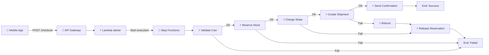

**Step Functions definition**:

```yaml
StartAt: Validate
States:
  Validate:
    Type: Task
    Resource: arn:aws:lambda:...:validate
    Catch:
      - ErrorEquals: [States.ALL]
        Next: Failed
    Next: Reserve

  Reserve:
    Type: Task
    Resource: arn:aws:lambda:...:reserve
    Retry:
      - ErrorEquals: [States.TaskFailed]
        IntervalSeconds: 2
        MaxAttempts: 3
        BackoffRate: 2.0
    Catch:
      - ErrorEquals: [States.ALL]
        Next: Failed
    Next: Charge

  Charge:
    Type: Task
    Resource: arn:aws:lambda:...:charge
    Catch:
      - ErrorEquals: [States.ALL]
        ResultPath: $.error
        Next: ReleaseReservation
    Next: Ship

  Ship:
    Type: Task
    Resource: arn:aws:lambda:...:ship
    Catch:
      - ErrorEquals: [States.ALL]
        Next: Refund
    Next: Notify

  Refund:
    Type: Task
    Resource: arn:aws:lambda:...:refund
    Next: ReleaseReservation

  ReleaseReservation:
    Type: Task
    Resource: arn:aws:lambda:...:release
    Next: Failed

  Notify:
    Type: Task
    Resource: arn:aws:lambda:...:notify
    End: true

  Failed:
    Type: Fail
```

**Caller (API)**:

```python
def lambda_handler(event, context):
    body = json.loads(event['body'])
    
    response = sf_client.start_execution(
        stateMachineArn=STATE_MACHINE_ARN,
        input=json.dumps({
            'user_id': body['user_id'],
            'cart_id': body['cart_id'],
            'idempotency_key': body['idempotency_key']
        })
    )
    
    return {
        'statusCode': 202,
        'body': json.dumps({
            'execution_arn': response['executionArn'],
            'status': 'processing'
        })
    }
```

**User poll status**:

```python
def get_status(event, context):
    arn = event['queryStringParameters']['execution_arn']
    execution = sf_client.describe_execution(executionArn=arn)
    return {
        'statusCode': 200,
        'body': json.dumps({
            'status': execution['status'],  # RUNNING / SUCCEEDED / FAILED
            'output': execution.get('output')
        })
    }
```

**Mỗi Lambda task**:
- Idempotent (dedup theo `idempotency_key`).
- Return success/fail rõ ràng.
- Throw exception cho transient error (Step Functions retry).
- Throw `BusinessException` cho fatal error (Step Functions catch → compensation).

**Observability**:
- Step Functions Console hiển thị execution graph real-time.
- Mỗi step có input/output/duration.
- CloudWatch alarm: `ExecutionsFailed > 0`.

**Cost** (10k checkout/ngày):
- 10k × 30 ngày = 300k execution/tháng.
- ~7 state transitions average = 2.1M state changes.
- Step Functions **Express** ($1/M) = $2.10/tháng.
- 7 Lambda × invocations × duration ~$5/tháng.
- **Tổng: ~$7/tháng** — rẻ cho 10k order/ngày.

**Alternative**:
- **Choreography** (Lambda + SNS events, không Step Functions): rẻ hơn nhưng debug khó.
- **Monolith Lambda checkout**: đơn giản nhưng không rollback dễ.

→ Step Functions Express là **sweet spot** cho checkout workflow 4-7 step.
</details>

**Q4.** Khi nào dùng Cloud Run thay Lambda cho API backend?

<details>
<summary>💡 Đáp án</summary>

**Dùng Cloud Run khi**:

1. **App full-stack có middleware nặng**: Express, FastAPI, Flask, Spring Boot. Container hoá có sẵn → deploy 5 phút.

2. **Concurrency benefit**: 1 instance Cloud Run handle 80 request concurrent → ít cold start hơn Lambda (1 invocation per container).

3. **Cold start chấp nhận được tính theo instance, không per-request**: với min_instances=1, không cold start cho user.

4. **Stateful in-memory cache OK**: 80 request share memory → cache hit rate cao.

5. **Long duration request**: Cloud Run max 60 phút (Lambda 15p).

6. **Migration container monolith**: container hoá sẵn → Cloud Run, không refactor handler.

7. **Cost ở mid traffic**: Cloud Run thường rẻ hơn Lambda ở 10M-100M req/tháng vì concurrency.

**Dùng Lambda khi**:

1. **True event-driven**: S3 trigger, DDB stream, SQS, EventBridge — Lambda native.

2. **Ultra sporadic**: 100 req/ngày — Lambda free tier cover, Cloud Run min_instances tốn.

3. **Glue code micro-task**: 50-line function, ko cần framework.

4. **AWS ecosystem deep**: Cognito + DDB + S3 + Lambda — Lambda integration native.

5. **Sub-second latency với provisioned**: provisioned Lambda + cold start gần như 0.

**Hybrid pattern thường gặp**:

```
Web/Mobile API (10M req/tháng) → Cloud Run (chính)
Webhook receiver (1k req/ngày) → Lambda
Cron jobs                       → Lambda + EventBridge
Image resize (S3 trigger)       → Lambda
ETL stream (DDB Streams)        → Lambda
```

**Decision matrix**:

| Tiêu chí | Lambda | Cloud Run |
|---|---|---|
| Event-driven from AWS source | ✅✅✅ | ❌ |
| Container có sẵn | ❌ | ✅✅ |
| Concurrency per instance | 1 | 80 (default) |
| Max duration | 15p | 60p |
| Cold start | 100-1000ms | 1-3s |
| Free tier | 1M req | 2M req |
| Pricing 10M req/tháng (small API) | ~$10-30 | ~$15-25 |
| Pricing 100M req/tháng | ~$200 | ~$80 |
| Pricing 1B req/tháng | ~$2000 | ~$500 |

→ Lambda thắng ở **sporadic + event-driven AWS**. Cloud Run thắng ở **container app + mid-high traffic**.
</details>

**Q5.** Liệt kê 3 anti-pattern + cách fix.

<details>
<summary>💡 Đáp án</summary>

**Anti-pattern 1: Big Monolith Function**

- **Mô tả**: 1 Lambda 5000 dòng handle 20 endpoint qua if-else.
- **Vấn đề**: cold start chậm, IAM rộng, test khó, deploy risk.
- **Fix**: 
  - 1 Lambda per route/resource.
  - Hoặc dùng Mangum (FastAPI) / Serverless Express nếu intentional + nhỏ.
  - Hoặc chuyển sang Cloud Run cho web app full-stack.

**Anti-pattern 2: Sync long DB query**

- **Mô tả**: API endpoint `/reports` chạy 10s, query 100k row.
- **Vấn đề**: API Gateway timeout 30s, UX kém, memory exhaust.
- **Fix — Async pattern**:
  ```
  POST /reports → 202 + job_id (Lambda push SQS)
  Worker Lambda process → S3
  GET /reports/{job_id} → 200 nếu xong, 202 nếu chưa
  ```

**Anti-pattern 3: No observability**

- **Mô tả**: Deploy Lambda → không có log structured, không alarm, không trace.
- **Vấn đề**: bug im lặng, cost spike không biết, latency degrade.
- **Fix**:
  - Structured JSON log (Powertools Logger).
  - X-Ray tracing enabled.
  - CloudWatch alarm: errors > 1%, P99 duration, DLQ depth.
  - Dashboard + on-call rotation.

**Bonus anti-pattern: "Serverless cho mọi thứ"**

- **Mô tả**: Migrate Spring Boot 800MB monolith → Lambda container.
- **Vấn đề**: cold start 10s, JDBC storm, cost cao.
- **Fix**: 
  - Container monolith → Fargate/Cloud Run.
  - Tách event-driven endpoint dần sang Lambda (strangler).
  - Lambda chỉ cho new feature event-driven.
</details>

---

## ⚡ Cheatsheet

### 8 Pattern map

| Pattern | Trigger | Vendor service |
|---|---|---|
| API Backend | HTTP | API GW + Lambda / Cloud Run |
| File Pipeline | S3 / GCS event | Lambda / Cloud Functions |
| ETL Stream | DDB Stream / Pub/Sub | Lambda / Cloud Functions |
| Cron | Schedule | EventBridge / Cloud Scheduler |
| Webhook | HTTP external | API GW → Lambda → SQS → worker |
| Chatbot | Webhook | API GW → Lambda → LLM |
| Fanout | Splitter → queue | Lambda + SQS/Pub-Sub |
| Saga | Workflow | Step Functions / Workflows |

### 6 Anti-pattern

| # | Anti-pattern | Fix |
|---|---|---|
| 1 | Chatty backend | Coarse Lambda OR Step Functions |
| 2 | Big monolith function | 1 Lambda per route OR Cloud Run |
| 3 | Sync long DB query | Async pattern + job_id + poll |
| 4 | No versioning/aliasing | AutoPublishAlias + Canary deployment |
| 5 | No monitoring | Powertools logger + X-Ray + alarm |
| 6 | Serverless cho mọi thứ | Hybrid: Lambda + Cloud Run + Workers |

### Decision tree gọn

```
Long batch?      → Cloud Run Job / Fargate
WebSocket?       → Fargate / EC2
Event AWS?       → Lambda
Container app?   → Cloud Run
Edge latency?    → Cloudflare Workers
Workflow > 2 step? → Step Functions
```

---

## 📚 Glossary

| EN | VN | Giải thích |
|---|---|---|
| API Backend | — | Pattern HTTP API qua Lambda/Cloud Run |
| File Pipeline | — | Pattern S3/GCS event → parallel function |
| ETL Stream | — | Extract-Transform-Load qua DB stream |
| Cron / Scheduled | — | Pattern function chạy theo lịch |
| Webhook | — | Pattern nhận HTTP từ external service |
| Fanout | Phân tán | 1 nguồn → N consumer parallel |
| Fan-in | Tập trung | N task → 1 aggregator |
| Saga | — | Distributed transaction với compensation |
| Orchestration | Điều phối tập trung | Central workflow (Step Functions) |
| Choreography | Điều phối phân tán | Event-driven, không central |
| Compensation | Bù trừ | Action rollback khi step fail |
| Chatty backend | Backend "nói chuyện nhiều" | Anti-pattern Lambda gọi Lambda chain |
| BFF | Backend for Frontend | Aggregator Lambda cho 1 screen |
| Canary deployment | — | Shift traffic dần (10% v2, 90% v1) |
| Alias | Bí danh | Lambda alias trỏ về version cụ thể |
| Strangler pattern | — | Migrate dần monolith → microservice |

---

## 🔗 Liên kết & Tài nguyên

### Trong cluster
- ↶ Trước: [02_event-driven-and-triggers.md](02_event-driven-and-triggers.md)
- → Tiếp theo: [04_serverless-cost-cold-start-and-observability.md](04_serverless-cost-cold-start-and-observability.md)

### Cross-reference
- 🟧 [AWS Lambda + API Gateway](../../../aws/lessons/01_basic/04_lambda-and-api-gateway.md)
- 🟦 [GCP Cloud Run + API Gateway](../../../gcp/lessons/01_basic/04_cloud-functions-cloud-run-and-api-gateway.md)

### Tài nguyên ngoài
- 📖 [Serverless Patterns Collection (AWS)](https://serverlessland.com/patterns) — 500+ pattern AWS chính thức
- 📖 [AWS Lambda Best Practices](https://docs.aws.amazon.com/lambda/latest/dg/best-practices.html)
- 📖 [AWS Step Functions Patterns](https://docs.aws.amazon.com/step-functions/latest/dg/sample-projects.html)
- 📖 [Saga Pattern (microservices.io)](https://microservices.io/patterns/data/saga.html)
- 📖 [Event-Driven Architecture (Martin Fowler)](https://martinfowler.com/articles/201701-event-driven.html)
- 📖 [Serverless Anti-patterns (Yan Cui)](https://theburningmonk.com/) — blog chuyên sâu

---

## 📌 Changelog

- **v1.0.0 (24/05/2026)** — Patterns + Anti-patterns cho Basic cluster. 8 pattern (API/File/ETL/Cron/Webhook/Chatbot/Fanout/Saga) + 6 anti-pattern (chatty/monolith/sync-long/no-version/no-monitor/serverless-cho-mọi-thứ) + Acme Shop feature mapping + Step Functions saga template. 5 best practice + 5 self-check.
