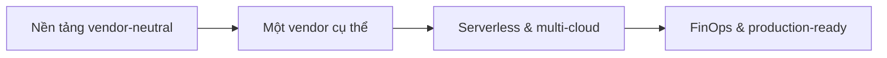

# 📋 Overview — 11_cloud

> **Tác giả:** Mr.Rom\
> **Phiên bản:** v1.0.0\
> **Tạo lúc:** 16/05/2026\
> **Cập nhật:** 01/06/2026

> 🎯 *Cloud computing là việc thuê hạ tầng máy tính (máy chủ, lưu trữ, mạng, database) qua Internet theo kiểu trả tiền theo mức dùng, thay vì tự mua và tự vận hành phòng máy. Cụm 11_cloud dạy bạn nền tảng vendor-neutral trước, rồi đào sâu từng nhà cung cấp lớn (AWS, GCP, Azure...) và các chủ đề xuyên suốt như serverless, multi-cloud và quản lý chi phí.*

---

## 1️⃣ Cloud computing là gì

Hãy tưởng tượng bạn muốn có điện để dùng trong nhà. Bạn không cần xây một nhà máy phát điện riêng ở sân sau, mua máy phát, thuê người vận hành rồi tự lo nhiên liệu. Bạn chỉ cần cắm phích vào ổ điện, dùng bao nhiêu trả tiền bấy nhiêu, và nhà máy điện ở đâu đó lo phần còn lại. *Cloud computing* chính là "ổ điện" cho hạ tầng máy tính.

Nói chính xác hơn, **cloud computing** là mô hình cung cấp tài nguyên máy tính — máy chủ (*compute*), lưu trữ (*storage*), mạng (*networking*), cơ sở dữ liệu (*database*) — qua Internet, do một nhà cung cấp (*cloud provider*) sở hữu và vận hành. Bạn dùng đến đâu trả tiền đến đó (*pay-as-you-go*), tăng giảm quy mô trong vài phút, và không phải đụng tay vào phần cứng vật lý.

## 2️⃣ Vì sao có cloud computing

Trước đây, mỗi công ty muốn chạy phần mềm đều phải tự lo toàn bộ hạ tầng. Điều này tạo ra một rào cản khổng lồ về vốn và tốc độ, đặc biệt với các startup vừa thành lập. Cloud ra đời để xoá bỏ rào cản đó: biến chi phí đầu tư phần cứng (*CapEx*) thành chi phí vận hành theo nhu cầu (*OpEx*).

### Trước khi có cloud

Một đội kỹ thuật muốn ra mắt sản phẩm web sẽ phải đi qua một chuỗi việc nặng nề: dự trù số lượng máy chủ cho 2-3 năm tới, bỏ tiền mua server đắt đỏ, thuê chỗ đặt máy ở *data center*, kéo đường mạng, tự cài hệ điều hành, tự lo điện dự phòng và làm mát. Quá trình từ lúc quyết định đến lúc server sẵn sàng có thể kéo rất dài. Tệ hơn, nếu dự đoán sai: mua dư thì lãng phí, mua thiếu thì sập khi có lượng truy cập tăng đột biến.

### Sau khi có cloud

Cũng đội kỹ thuật đó giờ chỉ cần mở trình duyệt, đăng nhập vào *console* của nhà cung cấp, bấm vài nút (hoặc chạy vài dòng lệnh) là có ngay một máy chủ đang chạy. Cần thêm 50 máy cho đợt khuyến mãi? Tạo trong vài phút rồi xoá đi khi hết đợt, chỉ trả tiền cho khoảng thời gian thực dùng. Toàn bộ phần cứng, điện, làm mát, an ninh vật lý đã có nhà cung cấp lo.

## 3️⃣ Khi nào dùng cloud

Cloud mạnh ở khả năng co giãn và trả tiền theo nhu cầu, nhưng không phải lúc nào cũng là lựa chọn rẻ nhất hay phù hợp nhất. Bảng dưới đây tóm tắt vài tình huống thường gặp để bạn cân nhắc.

| Tình huống | Có nên dùng |
|---|---|
| Startup cần ra mắt nhanh, lượng truy cập khó đoán | ✅ Có — co giãn theo nhu cầu, không cần vốn lớn ban đầu |
| Tải tăng giảm thất thường (sự kiện, mùa cao điểm) | ✅ Có — scale lên lúc đông, scale xuống lúc vắng để tiết kiệm |
| Cần dịch vụ quản lý sẵn (database, AI, queue) thay vì tự dựng | ✅ Có — dùng *managed service* để đỡ gánh nặng vận hành |
| Tải ổn định, chạy 24/7 ở quy mô rất lớn và rất biết trước | ⚠️ Cân nhắc — chạy lâu dài trên cloud có thể đắt hơn tự đặt máy (*on-premise*) |
| Ràng buộc pháp lý buộc dữ liệu phải nằm trong phòng máy riêng | ❌ Không — cân nhắc on-premise hoặc *private cloud* |

Quy tắc ngầm: cloud thắng khi nhu cầu *biến động* hoặc *chưa rõ*; còn khi tải đã rất ổn định và lớn trong nhiều năm, bài toán chi phí cần tính lại cẩn thận (đây chính là lý do FinOps tồn tại — xem cụm `cloud-cost-management/`).

## 4️⃣ Các khái niệm cốt lõi

Toàn bộ thế giới cloud, dù của nhà cung cấp nào, đều xoay quanh một số khái niệm nền tảng giống nhau. Nắm chắc nhóm này thì học vendor cụ thể (AWS/GCP/Azure) chỉ còn là chuyện đổi tên gọi.

- **Mô hình dịch vụ (IaaS / PaaS / SaaS)**: ba mức "thuê" khác nhau — thuê máy ảo thô (*IaaS*), thuê nền tảng chạy app (*PaaS*), hay thuê phần mềm dùng luôn (*SaaS*); càng lên cao bạn càng quản lý ít, nhà cung cấp lo nhiều.
- **Region, Availability Zone, Edge**: tài nguyên cloud được đặt rải rác theo địa lý; chọn vị trí gần người dùng để giảm độ trễ và phân tán rủi ro để tránh sập cả hệ thống khi một khu vực gặp sự cố.
- **Compute, Storage, Networking, Database**: bốn nhóm tài nguyên xương sống — sức tính toán, nơi lưu dữ liệu, đường truyền kết nối, và nơi lưu trữ có cấu trúc.
- **Mô hình trách nhiệm chung (*Shared Responsibility*)**: cloud lo an toàn *của* hạ tầng (phần cứng, data center), còn bạn lo an toàn *trên* hạ tầng (cấu hình, quyền truy cập, dữ liệu) — hiểu sai ranh giới này là nguồn gốc của hầu hết sự cố lộ dữ liệu.
- **Pay-as-you-go & co giãn (*elasticity*)**: trả theo mức dùng thực tế và tự động tăng/giảm tài nguyên theo tải, thay vì cố định một dung lượng.

> 📖 *Chi tiết từng khái niệm xem trong cụm nền tảng vendor-neutral [`cloud-fundamentals/`](./cloud-fundamentals/lessons/01_basic/).*

## 5️⃣ Hệ sinh thái & công cụ liên quan

Kho tri thức này chia 11_cloud thành 9 cụm con. Tư duy tổng thể: học **nền tảng chung trước**, rồi chọn **vendor cụ thể** để đào sâu, và phủ thêm các **chủ đề xuyên suốt** (serverless, multi-cloud, chi phí). Bảng dưới đây là bản đồ để bạn biết đi đâu cho mục tiêu nào.

| Cụm | Vai trò | Liên kết |
|---|---|---|
| cloud-fundamentals | Nền tảng vendor-neutral — học trước tiên | [cloud-fundamentals/](./cloud-fundamentals/) |
| aws | Vendor lớn nhất, hệ sinh thái rộng nhất | [aws/](./aws/) |
| gcp | Mạnh về data, AI/ML và Kubernetes | [gcp/](./gcp/) |
| azure | Mạnh trong doanh nghiệp và hệ sinh thái Microsoft | [azure/](./azure/) |
| digitalocean | Đơn giản, giá dễ đoán — hợp dev cá nhân và startup nhỏ | [digitalocean/](./digitalocean/) |
| cloudflare | CDN, edge computing, bảo mật và Zero Trust | [cloudflare/](./cloudflare/) |
| serverless | Mô hình không quản lý máy chủ (vendor-neutral) | [serverless/](./serverless/) |
| multi-cloud-strategies | Chiến lược dùng nhiều cloud, tránh khoá nhà cung cấp | [multi-cloud-strategies/](./multi-cloud-strategies/) |
| cloud-cost-management | FinOps — kiểm soát và tối ưu chi phí cloud | [cloud-cost-management/](./cloud-cost-management/) |

Cloud không đứng một mình. Nó là nơi các công cụ DevOps "hạ cánh": bạn đóng gói app bằng [Docker](../10_devops/docker/), điều phối bằng [Kubernetes](../10_devops/kubernetes/), dựng hạ tầng cloud bằng code với [IaC/Terraform](../10_devops/iac/), tự động triển khai bằng [CI/CD](../10_devops/ci-cd/), và giám sát bằng [Observability](../10_devops/observability/). Nền tảng [Networking](../05_networking/) (TCP/IP, DNS) cũng là kiến thức bắt buộc trước khi hiểu mạng trong cloud.

## 6️⃣ Lộ trình học đề xuất

Cách học hiệu quả nhất là đi từ nền tảng chung lên vendor cụ thể, rồi mới đến các chủ đề nâng cao xuyên suốt. Đừng nhảy thẳng vào một vendor khi chưa nắm Region, IAM hay Shared Responsibility — vì những khái niệm đó lặp lại ở mọi nhà cung cấp.

| Bước | Đọc gì |
|---|---|
| 1 | [cloud-fundamentals — basic](./cloud-fundamentals/lessons/01_basic/) — Region/AZ, networking, storage, security |
| 2 | Chọn 1 vendor và học sâu basic: [aws](./aws/lessons/01_basic/) (mặc định phổ biến nhất), hoặc [gcp](./gcp/lessons/01_basic/) / [azure](./azure/lessons/01_basic/) |
| 3 | [serverless — basic](./serverless/lessons/01_basic/) — mô hình không quản lý server, áp dụng cross-vendor |
| 4 | [multi-cloud-strategies — basic](./multi-cloud-strategies/lessons/01_basic/) — tránh khoá vendor, kiến trúc dự phòng |
| 5 | [cloud-cost-management — basic](./cloud-cost-management/lessons/01_basic/) — FinOps, tối ưu chi phí trước khi lên production thật |

## 7️⃣ Câu hỏi thường gặp

**Q: Nên học AWS, GCP hay Azure trước?**

A: Học [cloud-fundamentals](./cloud-fundamentals/) trước đã, vì khái niệm là chung. Khi chọn vendor đầu tiên, AWS thường là lựa chọn mặc định do thị phần và lượng tài liệu/việc làm lớn nhất. Nhưng nếu công ty bạn đang dùng GCP hay Azure thì cứ học theo đúng vendor đó — kiến thức nền tảng chuyển đổi gần như 1:1, chỉ khác tên dịch vụ.

**Q: Học cloud có cần biết Docker và Kubernetes trước không?**

A: Không bắt buộc, nhưng rất nên. Cloud và DevOps bổ trợ cho nhau: bạn có thể học song song. Nếu mới bắt đầu, hãy nắm [Docker](../10_devops/docker/) trước (đóng gói app), rồi học cloud để biết "chạy" app đó ở đâu, sau cùng mới đến Kubernetes khi cần điều phối nhiều container ở quy mô lớn.

**Q: Học cloud bằng tài khoản miễn phí có đủ không, có sợ tốn tiền không?**

A: Đủ cho phần lớn bài basic. Các nhà cung cấp đều có *free tier* (mức miễn phí) và credit dùng thử cho người mới. Nguyên tắc an toàn: luôn bật cảnh báo chi phí (*billing alert*), xoá tài nguyên ngay sau khi thực hành xong, và đừng để máy ảo hay database chạy quên qua đêm. Cụm [cloud-cost-management](./cloud-cost-management/) dạy kỹ cách kiểm soát chi phí này.

---

## 🔗 Liên kết & Tài nguyên

### 🧭 Định hướng lộ trình học

- ⬅️ **Bài trước:** [Overview — 10_devops](../10_devops/00_overview.md)
- ➡️ **Bài tiếp theo:** [Overview — 12_security](../12_security/00_overview.md)
- ↑ **Về cụm:** [☁️ 11_cloud](./README.md)

### 🧩 Các chủ đề liên quan

- ⬅️ **Bài trước:** [Overview — 05_networking](../05_networking/00_overview.md) — nền tảng TCP/IP, DNS trước khi hiểu mạng cloud
- [📋 Overview — 10_devops](../10_devops/00_overview.md) — Docker, K8s, IaC, CI/CD chạy trên cloud
- [DevOps Engineer — Career roadmap](../00_roadmaps/career/devops-engineer_career-roadmap.md)
- [Cloud Engineer — Career roadmap](../00_roadmaps/career/cloud-engineer_career-roadmap.md)

### 🌐 Tài nguyên tham khảo khác

- [AWS Documentation](https://docs.aws.amazon.com/) — tài liệu chính thức AWS
- [Google Cloud Documentation](https://cloud.google.com/docs) — tài liệu chính thức GCP
- [Microsoft Azure Documentation](https://learn.microsoft.com/azure/) — tài liệu chính thức Azure

---

## 📌 Nhật ký thay đổi (Changelog)

- **v0.1.0 (16/05/2026)** — Khởi tạo file khung (skeleton).
- **v1.0.0 (01/06/2026)** — Biên soạn nội dung narrative hoàn chỉnh cho file tổng quan 11_cloud: định nghĩa + ẩn dụ, bối cảnh trước/sau cloud, bảng khi nào dùng, 5 khái niệm cốt lõi, bản đồ 9 cụm con, lộ trình học, FAQ; chuẩn hoá nav (⬅️/➡️/↑) và 3 sub-heading liên kết.
