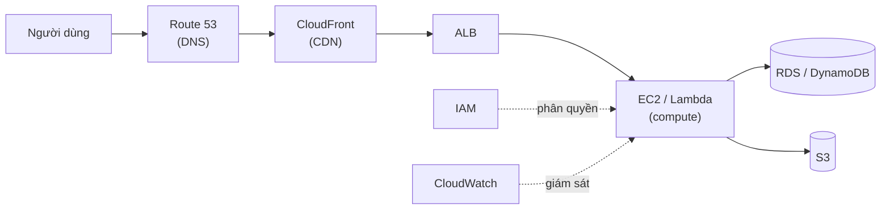

# 🎓 AWS Overview — Bản đồ dịch vụ + Thiết lập tài khoản 2026

> **Tác giả:** Mr.Rom\
> **Phiên bản:** v2.0.1\
> **Tạo lúc:** 24/05/2026\
> **Cập nhật:** 11/06/2026\
> **Level:** Basic\
> **Tags:** [MUST-KNOW]\
> **Yêu cầu trước:** [Cloud Fundamentals basic](../../../cloud-fundamentals/)

> 🎯 *Đây là bài đầu tiên của cụm AWS basic. Năm 2026 AWS có hơn 300 dịch vụ — nhìn vào ai cũng ngợp. Bài này không cố nhồi hết, mà chỉ ra nhóm dịch vụ bạn thực sự dùng tới 95% thời gian, cách đặt tên tài nguyên, cách dựng tài khoản an toàn ngay từ ngày đầu, kiến thức nền về AWS CLI, và một cảnh báo hoá đơn để không bị "sốc" cuối tháng. Đây là nền móng cho 4 bài đi sâu kế tiếp.*

## 🎯 Sau bài này bạn sẽ

- [ ] Nắm được **nhóm dịch vụ AWS cốt lõi** (Tier 1) — số ít nhưng dùng nhiều nhất.
- [ ] Dựng **AWS account** an toàn (bật MFA cho root, đặt cảnh báo hoá đơn).
- [ ] Dùng được **AWS CLI** và biết tách **profiles** cho nhiều tài khoản.
- [ ] Hiểu **ARN** và quy ước đặt tên tài nguyên.
- [ ] Cài **IAM Identity Center (SSO)** thay cho IAM user kiểu cũ.
- [ ] Biết cách dùng **AWS Free Tier** đúng để học không tốn tiền.
- [ ] Phân biệt các **mức support của AWS** và công cụ Trusted Advisor.

---

## Tình huống — 300 dịch vụ trong Console, không biết bắt đầu từ đâu

Hãy hình dung lần đầu bạn đăng nhập AWS Console. Gõ vào thanh tìm kiếm là một danh sách dài hơn 300 dịch vụ đổ ra. Bạn lướt qua và thấy hàng loạt cái tên na ná nhau:

- Nhóm hay nghe: *"EC2, S3, Lambda, DynamoDB, EKS, ECS, Fargate, Aurora, RDS, ElastiCache, OpenSearch, Glue, Athena, Redshift, Kinesis, MSK..."*
- Nhóm chưa nghe bao giờ: *"Apigee, AppRunner, AppMesh, AppSync, AppStream, AppConfig..."*

Đọc tới đây thì đầu bắt đầu ong ong. Cảm giác "phải biết hết mới dám đụng vào AWS" là cái bẫy đầu tiên mà người mới nào cũng dính.

Một đồng nghiệp đi ngang, thấy vậy thì trấn an: *"Đừng cố biết hết làm gì. Khoảng 20 dịch vụ chính là bạn đã dùng tới 95% thời gian rồi. Mấy cái còn lại, khi nào cần thì mở tài liệu ra tra. Bài này chỉ cần giúp bạn vẽ được tấm bản đồ là đủ."*

→ Vì thế, bài này tập trung vào hai việc: khoanh vùng nhóm dịch vụ cốt lõi, và dựng một nền tảng tài khoản an toàn để bắt đầu.

---

## 1️⃣ Bản đồ dịch vụ AWS — nhóm cốt lõi (2026)

Thay vì học theo bảng chữ cái, cách dễ nhớ nhất là gom dịch vụ theo *chức năng*: chạy code (compute), lưu trữ (storage), cơ sở dữ liệu, mạng, bảo mật, quan sát hệ thống, công cụ lập trình, và truyền tin. Mỗi nhóm dưới đây liệt kê những dịch vụ bạn sẽ chạm tay vào sớm nhất, kèm một câu mô tả ngắn để định vị nó dùng cho việc gì.

### Compute — nơi chạy code của bạn

| Dịch vụ | Mô tả | Hợp khi |
|---|---|---|
| **EC2** | Máy ảo (*virtual machine*) | Compute đa dụng, toàn quyền điều khiển máy |
| **Lambda** | Hàm *serverless* (không cần quản máy chủ) | Tác vụ ngắn, chạy theo sự kiện |
| **ECS** | Dịch vụ chạy container của AWS | Chạy Docker container theo kiểu AWS |
| **EKS** | Kubernetes do AWS quản lý | Cần Kubernetes chuẩn |
| **Fargate** | Chạy container không cần quản máy nền (backend cho ECS/EKS) | Container "no-ops", khỏi lo máy chủ |
| **AppRunner** | Triển khai container kiểu PaaS, rất nhanh | Đẩy web app lên gọn lẹ |

### Storage — nơi cất dữ liệu

| Dịch vụ | Mô tả | Hợp khi |
|---|---|---|
| **S3** | Lưu trữ dạng object (*object storage*) | Ảnh, video, backup, *data lake* |
| **EBS** | Lưu trữ dạng block (ổ đĩa) | Đĩa gắn vào EC2, dữ liệu DB |
| **EFS** | Hệ thống file qua mạng (NFS) | Nhiều máy cùng mount chung một thư mục |

### Database — cơ sở dữ liệu

| Dịch vụ | Mô tả | Hợp khi |
|---|---|---|
| **RDS** | CSDL quan hệ do AWS quản lý (Postgres/MySQL/SQL Server) | OLTP tiêu chuẩn |
| **Aurora** | Bản RDS độc quyền của AWS, nhanh hơn | OLTP quy mô lớn |
| **DynamoDB** | NoSQL dạng key-value/document | Quy mô lớn, độ trễ thấp |
| **ElastiCache** | Redis/Memcached được quản lý | Lớp cache |
| **Redshift** | Kho dữ liệu (*data warehouse*) | Phân tích, BI |

### Networking — mạng

| Dịch vụ | Mô tả | Hợp khi |
|---|---|---|
| **VPC** | Mạng riêng ảo | Cô lập hệ thống, chia subnet |
| **Route 53** | DNS + định tuyến | Tên miền, định tuyến theo độ trễ |
| **CloudFront** | CDN (mạng phân phối nội dung) | File tĩnh, cache ở biên (*edge*) |
| **ALB / NLB** | Bộ cân bằng tải | Lưu lượng HTTP / TCP |
| **API Gateway** | Cổng API được quản lý | API REST/WebSocket |

### Security & Identity — bảo mật và danh tính

| Dịch vụ | Mô tả | Hợp khi |
|---|---|---|
| **IAM** | Danh tính + phân quyền | User, role, policy |
| **IAM Identity Center** | SSO (đăng nhập một lần) | Danh tính liên kết (*federated identity*) |
| **KMS** | Quản lý khoá mã hoá | Khoá để mã hoá dữ liệu |
| **Secrets Manager** | Kho lưu bí mật | Mật khẩu DB, API key |
| **Certificate Manager (ACM)** | Chứng chỉ TLS | HTTPS cho ALB/CloudFront |
| **WAF** | Tường lửa web | Chặn bot, chống OWASP top 10 |
| **GuardDuty** | Phát hiện mối đe doạ | Bảo mật dựa trên *machine learning* |

### Observability & Ops — quan sát và vận hành

| Dịch vụ | Mô tả | Hợp khi |
|---|---|---|
| **CloudWatch** | Số liệu + log + cảnh báo | Giám sát mặc định của AWS |
| **CloudTrail** | Nhật ký mọi lệnh gọi API | Tuân thủ, điều tra sự cố |
| **AWS Config** | Theo dõi tuân thủ của tài nguyên | Phát hiện trôi cấu hình (*drift*) |
| **Systems Manager** | Nền tảng vận hành | Vá lỗi, Session Manager |

### Developer tools — công cụ lập trình

| Dịch vụ | Mô tả | Hợp khi |
|---|---|---|
| **CodeCommit** | Lưu trữ Git | (kiểu cũ, nay thường ưu tiên GitHub) |
| **CodeBuild** | Chạy build cho CI | CI gốc của AWS |
| **CodePipeline** | Điều phối CI/CD | Quy trình giao hàng gốc AWS |
| **CodeDeploy** | Triển khai | Blue-green, canary |

### Messaging — truyền tin

| Dịch vụ | Mô tả | Hợp khi |
|---|---|---|
| **SQS** | Hàng đợi tin nhắn | Xử lý tác vụ bất đồng bộ |
| **SNS** | Pub-sub | Thông báo, phát tán (*fan-out*) |
| **EventBridge** | Bus sự kiện | Định tuyến sự kiện từ SaaS |
| **MSK** | Kafka do AWS quản lý | Truyền dòng sự kiện (*event streaming*) |
| **Kinesis** | Dòng dữ liệu thời gian thực | Phân tích real-time |

### Data & AI — dữ liệu và trí tuệ nhân tạo

| Dịch vụ | Mô tả | Hợp khi |
|---|---|---|
| **Bedrock** | Dịch vụ chạy mô hình nền (*foundation model*) | App LLM (Claude, Llama) |
| **SageMaker** | Nền tảng ML | Huấn luyện + triển khai mô hình |
| **Glue** | Dịch vụ ETL | Đường ống dữ liệu |
| **Athena** | Truy vấn dữ liệu trong S3 bằng SQL | Phân tích nhanh, ngẫu hứng |

Nhìn cả "tủ kệ" thì nhiều, nhưng nếu rút ra danh sách bạn đụng tới hằng ngày thì gọn hơn rất nhiều. Đây là nhóm Tier 1 chiếm khoảng 95% công việc thực tế:

> **Top 20 (95% công việc)**: EC2, S3, RDS, Lambda, IAM, VPC, CloudWatch, CloudTrail, KMS, Secrets Manager, ALB, Route 53, CloudFront, DynamoDB, ElastiCache, SQS, EventBridge, EKS, Fargate, ACM.

Để thấy nhóm Tier 1 này ráp với nhau thế nào trong một hệ thống thật, hãy nhìn đường đi của một request điển hình từ người dùng tới dữ liệu:



→ Chỉ với 8-9 dịch vụ trong sơ đồ là đã dựng được trọn một web app production — đó là lý do nên nắm chắc Tier 1 trước khi mở rộng sang các kệ "đặc sản".

🪞 **Ẩn dụ**: *AWS giống một **siêu thị hơn 300 kệ hàng**. Bạn đâu có mua đồ ở mọi kệ. Khoảng 20 kệ chính (rau củ, thịt cá, đồ khô, đồ uống) đã chiếm 95% giỏ hàng. Mấy kệ đặc sản — chocolate Bỉ, ô-liu Hy Lạp — chỉ ghé khi có dịp đặc biệt.*

---

## 2️⃣ Thiết lập tài khoản AWS (nền tảng Ngày 1)

Có bản đồ rồi, việc đầu tiên là dựng tài khoản cho an toàn. Phần lớn câu chuyện "bị hack AWS, nợ chục nghìn đô" đều bắt nguồn từ việc bỏ qua mấy bước cơ bản dưới đây ngay ngày đầu. Tám bước sau đây là một quy trình baseline đáng làm một lần cho xong, theo đúng thứ tự.

### Bước 1: Tạo tài khoản AWS

Khâu đăng ký cần email và thẻ tín dụng. Hai việc cần làm ngay lúc này là đặt mật khẩu root thật mạnh và bật MFA — đừng để "lát nữa làm":

- Email + thẻ tín dụng.
- Mật khẩu root từ 16 ký tự trở lên.
- **Bật MFA cho tài khoản root ngay lập tức** (tốt nhất là khoá phần cứng).

### Bước 2: Bảo vệ tài khoản root

Tài khoản root là "chìa khoá vạn năng" — mất nó là mất tất cả. Vì vậy hãy siết nó lại theo checklist dưới đây rồi *cất đi*, chỉ đụng tới khi thật sự bắt buộc:

```text
☐ Mật khẩu root ngẫu nhiên, từ 16 ký tự trở lên.
☐ Khoá MFA phần cứng (ví dụ YubiKey).
☐ Mã MFA dự phòng cất offline (USB mã hoá).
☐ Lưu thông tin root vào trình quản lý mật khẩu offline.
☐ Không bao giờ dùng root cho công việc hằng ngày.
☐ Viết lại quy trình khôi phục (phòng khi mất quyền truy cập).
```

### Bước 3: Cài IAM Identity Center (SSO)

Mặc định khuyến nghị của AWS hiện nay là **IAM Identity Center** (trước đây tên là AWS SSO) thay cho việc tạo IAM user tĩnh cho từng người. Lý do nó được ưa chuộng nằm ở mấy ưu điểm sau:

```text
Ưu điểm:
- Danh tính tập trung từ Google Workspace / Okta / Azure AD
- Cấp credential tạm thời (sống 1-12 giờ)
- Truy cập nhiều tài khoản từ một chỗ
- Nhật ký kiểm toán gom về một nơi
```

Quy trình cài đặt làm trên Console, gói gọn trong năm thao tác:

```bash
# Trên AWS Console:
# 1. Bật IAM Identity Center trong management account
# 2. Chọn nguồn danh tính (Identity Center mặc định là đủ cho nhóm nhỏ)
# 3. Tạo users + groups
# 4. Gán permission sets
# 5. Dev đăng nhập qua URL của portal
```

### Bước 4: Tạo IAM admin user dự phòng

Dù đã có SSO, bạn vẫn nên giữ một IAM admin user làm "lối thoát hiểm". Nếu một ngày SSO trục trặc, đây là cách duy nhất để vào lại mà không phải đụng tới root:

- Mật khẩu mạnh + MFA.
- Quyền: AdministratorAccess.
- Không dùng hằng ngày.
- Dùng để khôi phục khi SSO hỏng.

### Bước 5: Thiết lập cảnh báo hoá đơn

Đây là bước **sống còn** để tránh hoá đơn bất ngờ. Trước hết bật các tuỳ chọn billing trong Console:

```bash
# Bật cảnh báo billing
# AWS Console → Billing → Billing preferences:
# ☐ Nhận hoá đơn PDF qua email
# ☐ Nhận cảnh báo sử dụng Free Tier
# ☐ Nhận cảnh báo billing
```

Sau đó tạo một **cảnh báo billing trên CloudWatch** để được email khi chi phí vượt ngưỡng. Lệnh dưới đặt ngưỡng 50 USD:

```bash
aws cloudwatch put-metric-alarm \
  --alarm-name "Billing-50USD" \
  --namespace "AWS/Billing" \
  --metric-name "EstimatedCharges" \
  --statistic Maximum \
  --period 21600 \
  --evaluation-periods 1 \
  --threshold 50 \
  --comparison-operator GreaterThanThreshold \
  --dimensions Name=Currency,Value=USD \
  --alarm-actions arn:aws:sns:us-east-1:ACCOUNT:billing-alarm
```

→ Đặt thêm các mốc ở $50, $100, $500 là bạn bắt được cú tăng chi phí đột biến từ sớm, trước khi nó thành vấn đề lớn.

### Bước 6: Bật CloudTrail (nhật ký kiểm toán)

CloudTrail ghi lại mọi lệnh gọi API trên tài khoản — về sau cần điều tra "ai làm gì, lúc nào" là có ngay. Hai lệnh dưới tạo một trail đa vùng rồi bật ghi log:

```bash
aws cloudtrail create-trail \
  --name acme-trail \
  --s3-bucket-name acme-cloudtrail-logs-$(aws sts get-caller-identity --query Account --output text) \
  --is-multi-region-trail \
  --include-global-service-events \
  --enable-log-file-validation

aws cloudtrail start-logging --name acme-trail
```

→ Từ đây mọi lệnh gọi API đều được lưu lại vĩnh viễn.

### Bước 7: Bật GuardDuty

GuardDuty là dịch vụ phát hiện mối đe doạ dựa trên *machine learning*. Bật nó chỉ tốn một lệnh:

```bash
aws guardduty create-detector --enable
```

→ Chi phí khoảng $5-30/tháng cho mỗi tài khoản, đổi lại có một lớp giám sát bảo mật tự động.

### Bước 8: Chặn S3 public ở cấp tài khoản

Một trong những sự cố rò rỉ dữ liệu kinh điển là vô tình để bucket S3 ở chế độ public. Lệnh dưới khoá chặn việc đó ở cấp toàn tài khoản:

```bash
aws s3control put-public-access-block \
  --account-id $(aws sts get-caller-identity --query Account --output text) \
  --public-access-block-configuration \
    BlockPublicAcls=true,IgnorePublicAcls=true,BlockPublicPolicy=true,RestrictPublicBuckets=true
```

→ Từ giờ khó mà lỡ tay tạo bucket công khai ra ngoài.

### Chi phí ước tính cho Ngày 1

Câu hỏi tự nhiên tiếp theo là: dựng cả baseline này tốn bao nhiêu? Bảng dưới gom chi phí từng phần — phần lớn miễn phí, chỉ GuardDuty là đáng kể:

| Dịch vụ | Chi phí/tháng |
|---|---|
| AWS Account | $0 |
| IAM Identity Center | $0 (tích hợp sẵn) |
| CloudTrail | $0 (1 trail miễn phí) |
| GuardDuty | $5-30 |
| S3 (chứa log) | <$1 |
| **Tổng baseline** | **~$10-30/tháng** |

→ Một nền tảng an toàn với chi phí dễ chịu — đáng để bỏ ra ngay từ đầu.

---

## 3️⃣ Quy ước đặt tên trong AWS

Khi tài nguyên còn ít thì đặt tên kiểu gì cũng được. Nhưng đến lúc có hàng trăm resource, một quy ước nhất quán là thứ giúp bạn tìm kiếm, sắp xếp và phân bổ chi phí mà không phát điên. Bắt đầu từ cách AWS định danh mọi thứ: ARN.

### ARN — Amazon Resource Name

Mỗi tài nguyên trên AWS đều có một ARN duy nhất, theo cấu trúc:

```text
arn:aws:<service>:<region>:<account-id>:<resource-type>/<resource-id>
```

Một vài ví dụ cho thấy cấu trúc này linh hoạt ra sao — có dịch vụ toàn cục thì bỏ trống phần region/account:

```text
arn:aws:s3:::my-bucket                          (S3 bucket — toàn cục, không region/account)
arn:aws:s3:::my-bucket/path/to/file.txt          (S3 object)
arn:aws:ec2:us-east-1:123456789012:instance/i-abc  (EC2 instance)
arn:aws:lambda:us-east-1:123456789012:function:myFn (Lambda function)
arn:aws:iam::123456789012:user/alice              (IAM user — toàn cục, không region)
```

Bạn sẽ gặp ARN nhiều nhất khi viết policy — đó là cách chỉ đích danh tài nguyên được phép truy cập:

```json
{
  "Resource": "arn:aws:s3:::my-bucket/*"
}
```

### Tên vùng (region)

AWS đặt tên vùng theo dạng `<khu vực địa lý>-<hướng>-<số thứ tự>`. Bảng dưới là các vùng hay gặp nhất:

| Mã vùng | Vị trí |
|---|---|
| `us-east-1` | N. Virginia |
| `us-east-2` | Ohio |
| `us-west-1` | N. California |
| `us-west-2` | Oregon |
| `eu-west-1` | Ireland |
| `eu-west-2` | London |
| `eu-central-1` | Frankfurt |
| `eu-north-1` | Stockholm |
| `ap-southeast-1` | Singapore |
| `ap-southeast-2` | Sydney |
| `ap-northeast-1` | Tokyo |
| `ap-northeast-2` | Seoul |
| `ap-south-1` | Mumbai |
| `sa-east-1` | São Paulo |
| `ca-central-1` | Canada |

→ Một mẹo nhỏ: vùng có số thứ tự nhỏ thường là vùng ra đời sớm. `us-east-1` (N. Virginia) là vùng lâu đời nhất, cũng là nơi nhiều dịch vụ toàn cục đặt "trụ sở".

### Quy ước đặt tên tài nguyên

Với chính các tài nguyên bạn tạo ra, một mẫu tên có cấu trúc giúp ích rất nhiều về sau:

```text
Quy ước:
  <project>-<env>-<service>-<role>

Ví dụ:
  acme-prod-eks-cluster
  acme-prod-rds-postgres
  acme-staging-s3-uploads
  acme-prod-lambda-api
```

→ Đặt tên kiểu này thì tài nguyên tự sắp xếp gọn gàng trong Console, dễ tìm kiếm, và dễ phân bổ chi phí.

### Tags (nhãn)

Đặt tên thôi chưa đủ; *tag* mới là thứ giúp lọc và phân tích chi phí linh hoạt. Mọi tài nguyên đều gắn tag được:

```hcl
tags = {
  Environment = "prod"
  Service     = "checkout"
  Team        = "payments"
  CostCenter  = "engineering"
  Owner       = "nguyenvana@acme.com"
}
```

→ Có tag rồi thì Cost Explorer lọc chi phí theo tag được, và việc kiểm toán tuân thủ cũng dựa vào tag mà ra.

---

## 4️⃣ Kiến thức nền về AWS CLI

Console hợp để mò mẫm và quan sát, nhưng làm việc lâu dài thì CLI mới là công cụ chính — vì nó tự động hoá được. Phần này đi từ cài đặt, cấu hình, tới những lệnh bạn gõ hằng ngày.

### Cài đặt

Trên macOS dùng Homebrew là nhanh nhất, hoặc cài qua pip nếu bạn quen Python. Cài xong nhớ kiểm tra version để chắc chắn là CLI v2:

```bash
# macOS
brew install awscli

# Hoặc qua pip
pip install awscli --upgrade --user

# Kiểm tra
aws --version
# aws-cli/2.15.40 Python/3.12.0 Darwin/...
```

### Cấu hình

Lệnh `aws configure` hỏi bốn thông tin và lưu vào file cấu hình trong thư mục `~/.aws/`:

```bash
# Thiết lập tương tác
aws configure
# AWS Access Key ID: <key>
# AWS Secret Access Key: <secret>
# Default region: ap-southeast-1
# Default output: json

# Lưu vào ~/.aws/credentials và ~/.aws/config
```

### Profiles (nhiều tài khoản)

Thực tế bạn thường làm việc với nhiều môi trường cùng lúc — dev, prod riêng biệt. *Profile* cho phép tách credential ra theo từng tài khoản và chọn dùng khi cần:

```bash
# Nhiều profile
aws configure --profile dev
aws configure --profile prod

# Dùng profile
aws s3 ls --profile prod

# Hoặc đặt qua biến môi trường
export AWS_PROFILE=prod
aws s3 ls
```

Khi đó file `~/.aws/credentials` chứa nhiều khối, mỗi khối là một profile:

```ini
[default]
aws_access_key_id = ...
aws_secret_access_key = ...

[dev]
aws_access_key_id = ...
aws_secret_access_key = ...

[prod]
aws_access_key_id = ...
aws_secret_access_key = ...
```

### Dùng IAM Identity Center SSO với CLI

Cách trên dùng *key tĩnh* — tiện nhưng rủi ro nếu key lộ. An toàn hơn hẳn là đăng nhập qua SSO, vì credential được cấp tạm thời và tự xoay vòng:

```bash
# Cấu hình SSO
aws configure sso
# SSO start URL: https://acme.awsapps.com/start
# Region: ap-southeast-1
# Chọn account + role

# Đăng nhập
aws sso login --profile prod

# Dùng
aws s3 ls --profile prod
```

→ Credential ở đây là tạm thời và tự động xoay vòng, không có key tĩnh nằm phơi trên máy.

### Các lệnh CLI thường dùng

Dưới đây là nhóm lệnh bạn sẽ gõ nhiều nhất, gom theo dịch vụ — từ kiểm tra danh tính hiện tại tới thao tác với S3, EC2, IAM, Lambda:

```bash
# Danh tính
aws sts get-caller-identity

# Thiết lập region
aws configure set region ap-southeast-1

# S3
aws s3 ls
aws s3 cp file.txt s3://bucket/
aws s3 sync ./local s3://bucket/

# EC2
aws ec2 describe-instances
aws ec2 describe-regions

# IAM
aws iam list-users
aws iam list-roles

# Lambda
aws lambda list-functions
aws lambda invoke --function-name myFn output.json
```

### Định dạng kết quả

Cùng một lệnh, CLI cho bạn chọn cách hiển thị kết quả — JSON để máy đọc, table cho người đọc, text để dễ parse trong script:

```bash
# JSON (mặc định)
aws ec2 describe-instances

# Table (dễ đọc)
aws ec2 describe-instances --output table

# Text (dễ parse)
aws ec2 describe-instances --output text

# YAML
aws ec2 describe-instances --output yaml
```

### Lọc và truy vấn (JMESPath)

Kết quả AWS trả về thường rất dài. `--filter` lọc ở phía server, còn `--query` (dùng cú pháp JMESPath) bóc đúng trường bạn cần ở phía client:

```bash
# Lọc
aws ec2 describe-instances \
  --filters "Name=instance-state-name,Values=running"

# Truy vấn trường cụ thể
aws ec2 describe-instances \
  --query 'Reservations[].Instances[].InstanceId'

# Kết hợp
aws ec2 describe-instances \
  --filters "Name=tag:Environment,Values=prod" \
  --query 'Reservations[].Instances[].[InstanceId,InstanceType,State.Name]' \
  --output table
```

---

## 5️⃣ AWS Free Tier (2026)

Tin vui cho người học: bạn có thể tập AWS gần như miễn phí nếu hiểu rõ ranh giới của Free Tier. Có ba loại "miễn phí" khác nhau, và lẫn lộn giữa chúng chính là nguồn gốc của những hoá đơn bất ngờ.

### Cái gì được miễn phí

Loại thứ nhất là **miễn phí 12 tháng** (tính từ ngày tạo tài khoản):

- **EC2**: 750 giờ/tháng instance t2.micro hoặc t3.micro chạy Linux.
- **S3**: 5 GB lưu trữ + 20K lượt GET + 2K lượt PUT.
- **RDS**: 750 giờ db.t2.micro / db.t3.micro Single-AZ + 20 GB lưu trữ.
- **EBS**: 30 GB lưu trữ SSD.
- **CloudFront**: 1 TB lưu lượng ra (*egress*).
- **API Gateway**: 1 triệu lượt gọi API.
- **Lambda**: 1 triệu request + 400K GB-giây compute (loại này miễn phí vĩnh viễn).

Loại thứ hai là **miễn phí vĩnh viễn** — không hết hạn theo thời gian:

- **Lambda**: 1 triệu request + 400K GB-giây/tháng, vĩnh viễn.
- **DynamoDB**: 25 GB + 25 WCU + 25 RCU.
- **CloudWatch**: 10 metric + 10 alarm.

Loại thứ ba là **dùng thử** (giới hạn theo thời gian cụ thể):

- **SageMaker**: dùng thử 2 tháng.
- **Aurora**: 30 ngày.

### Những cái bẫy hay dính

Hiểu lý thuyết là một chuyện, dính bẫy là chuyện khác. Đây là ba tình huống làm người mới "ăn" hoá đơn:

- **Lỡ tay tạo nhầm t2.large** (không nằm trong free tier) → bất ngờ tốn ~$50/tháng.
- **Free tier chỉ phủ 1 instance.** Chạy 5 con t3.micro thì 4 con bị tính tiền.
- **Quên xoá sau khi test xong** → tháng sau vẫn bị tính tiền đều.

### Cài đặt an toàn để học

Để học mà không lo cháy túi, hãy dựng sẵn mấy chốt chặn sau:

1. **Cảnh báo billing**: đặt các ngưỡng $1, $5, $10.
2. **AWS Free Tier Usage Alert**: bật lên.
3. **Tắt mọi thứ mỗi tuần**: rà lại các tài nguyên đang chạy.
4. **Dùng AWS Budgets**: dự báo chi tiêu trước.

→ Có kỷ luật với mấy chốt chặn này thì bạn học AWS gần như miễn phí.

---

## 6️⃣ Các mức support của AWS

Khi gặp sự cố và cần AWS hỗ trợ, mức độ phản hồi bạn nhận được phụ thuộc vào gói support đang dùng. Bảng dưới đi từ gói miễn phí tới gói enterprise, để bạn biết khi nào nên nâng cấp:

| Mức | Chi phí | Bao gồm |
|---|---|---|
| **Basic** | Miễn phí | Diễn đàn, tài liệu, 7 mục kiểm tra của Trusted Advisor |
| **Developer** | $29/tháng hoặc 3% mức dùng | Hỗ trợ qua email (giờ hành chính), phản hồi 12h |
| **Business** | $100/tháng hoặc 10% mức dùng | Điện thoại 24/7, phản hồi 1h khi production sập |
| **Enterprise On-Ramp** | $5,500/tháng | TAM (Technical Account Manager) mức nhẹ |
| **Enterprise** | $15,000+/tháng hoặc 5-10% | TAM riêng, phản hồi trong 15 phút |

Một điểm đáng để ý ở các gói cao là **Trusted Advisor** — công cụ tự rà soát và gợi ý cải thiện trên bốn mặt:

- Tối ưu chi phí.
- Hiệu năng.
- Phát hiện rủi ro bảo mật.
- Khả năng chịu lỗi.

→ Gói Basic là đủ để học. Production thì nên lên Business. Còn Enterprise chỉ đáng tiền khi bạn chi cho AWS cỡ $1 triệu trở lên mỗi năm.

---

## 7️⃣ Lộ trình AWS basic — 4 bài đi sâu

Bài này mới là tấm bản đồ. Bốn bài kế tiếp sẽ lần lượt dẫn bạn thực hành trên những dịch vụ cốt lõi nhất, mỗi bài kết thúc bằng một thành phẩm chạy được:

| Bài | Nội dung | Output |
|---|---|---|
| **01** EC2 + EBS | Loại instance + AMI + EBS + key pair + user data + ASG cơ bản | Deploy EC2 đầu tiên kèm web server |
| **02** S3 + IAM basics | Bucket + policy + lifecycle + presigned URL + IAM user/role cho S3 | Website tĩnh trên S3 + truy cập an toàn bằng IAM |
| **03** RDS + DynamoDB | Postgres được quản lý + thiết kế DynamoDB + Multi-AZ + snapshot | DB đầu tiên kèm chiến lược backup |
| **04** Lambda + API Gateway | Hàm serverless đầu tiên + HTTP API + trigger theo sự kiện | API serverless chạy live |

→ Đi hết 4 bài này là bạn đủ sức triển khai một ứng dụng nhỏ ở mức production trên AWS.

---

## 💡 Câu hỏi beginner hay hỏi

Trước khi vào phần tự kiểm tra, đây là vài câu mà người mới học AWS gần như ai cũng từng thắc mắc:

**Q1.** "Học AWS bắt đầu từ đâu?"

→ Bắt đầu từ **nhóm 20 dịch vụ Tier 1** ở trên. Đừng cố học hết mọi thứ. Chọn lấy 1 dự án (web app, đường ống dữ liệu) rồi dùng 5-7 dịch vụ quanh nó là vừa đủ để có nền.

**Q2.** "Có cần chứng chỉ AWS không?"

→ **Có ích cho sự nghiệp, nhưng không bắt buộc để làm kỹ thuật.** Năm 2026 khuyến nghị:

- **AWS Certified Solutions Architect Associate** (SAA-C03): kiến thức rộng.
- **AWS Certified Developer Associate**: dành cho hướng dev.
- Có thể bỏ qua Cloud Practitioner nếu bạn đã có kinh nghiệm thực hành.

→ Chi phí thi khoảng $150.

**Q3.** "AWS Console, CLI hay Terraform — nên học cái nào?"

→ **Cả ba**, mỗi cái một vai trò:

- **Console**: khám phá, debug, làm việc một lần.
- **CLI**: viết script, tự động hoá.
- **Terraform**: hạ tầng dưới dạng code (cho production).

→ Hằng ngày bạn sống với CLI + Terraform; Console để mở ra khi cần xử lý sự cố.

**Q4.** "Làm sao học AWS cho nhanh?"

→ Cách nhanh nhất là làm dự án thật:

- Deploy WordPress lên EC2.
- Dựng site tĩnh trên S3 + CloudFront.
- Viết một Lambda được kích hoạt khi có file upload lên S3.
- Dựng RDS Postgres + ứng dụng Python.

→ Bốn dự án này chạm tới khoảng 80% kiến thức nền của AWS — học kiểu này thấm hơn nhiều so với xem hàng trăm giờ tutorial.

**Q5.** "AWS có đắt cho dự án cá nhân không?"

→ **Free tier đủ để học.** Vượt ngưỡng đó thì chi phí tham khảo:

- Site tĩnh: $1-5/tháng (S3 + CloudFront).
- App nhỏ: $20-50/tháng (EC2 nhỏ + RDS nhỏ).
- Với dự án cá nhân thật sự: **DigitalOcean / Hetzner** thường rẻ hơn.

→ Lời khuyên: dùng AWS cho công việc **chuyên nghiệp**; dự án cá nhân thì cân nhắc các nhà cung cấp rẻ hơn.

---

## 🗺️ Beyond basic — Các hướng nghề nghiệp

Học xong AWS basic, mỗi vai trò sẽ đi sâu vào một nhóm dịch vụ khác nhau. Bảng dưới gợi ý các dịch vụ tiếp theo nên đào theo từng hướng:

| Hướng | Dịch vụ AWS tiếp theo |
|---|---|
| **DevOps Engineer** | EKS, ECS, Fargate, ECR, CodeBuild, Systems Manager |
| **Backend Engineer** | Aurora, ElastiCache, Lambda, API Gateway, SQS |
| **Data Engineer** | Glue, Athena, Redshift, Kinesis, EMR |
| **ML Engineer** | SageMaker, Bedrock, EC2 GPU instances |
| **Cloud Architect** | Well-Architected, Multi-account Organizations, Control Tower |
| **Security Engineer** | GuardDuty, Macie, Security Hub, Inspector, Detective |

→ Chọn một hướng, rồi đào sâu 5-10 dịch vụ của hướng đó.

---

## 🧠 Tự kiểm tra (Self-check)

Năm câu dưới chạm vào đúng những chỗ người mới hay nhầm khi mới tiếp cận AWS. Bạn thử tự trả lời trước khi mở đáp án để biết mình đã thật sự nắm hay mới chỉ thấy quen.

**Q1.** Vì sao không nên dùng tài khoản root cho công việc hằng ngày, và thay vào đó nên dùng gì?

<details>
<summary>💡 Đáp án</summary>

Tài khoản root có quyền tuyệt đối trên toàn bộ tài khoản AWS — kể cả những việc không IAM policy nào chặn được (đóng tài khoản, đổi billing). Nếu credential root lộ ra, kẻ tấn công nắm trọn quyền và bạn không có lớp phòng vệ nào.

Thay vào đó: bật MFA cho root rồi *cất nó đi*, chỉ dùng cho vài tác vụ bắt buộc phải có root. Công việc hằng ngày làm qua **IAM Identity Center (SSO)** với credential tạm thời, hoặc qua IAM role/user có quyền vừa đủ. Giữ thêm một IAM admin user dự phòng phòng khi SSO hỏng.
</details>

**Q2.** ARN của một S3 bucket trông như `arn:aws:s3:::my-bucket` — vì sao phần region và account-id lại để trống?

<details>
<summary>💡 Đáp án</summary>

Vì tên S3 bucket là **toàn cục, duy nhất trên toàn AWS** — không thuộc về một region hay account cụ thể nào trong không gian tên ARN. Cùng lý do đó, IAM user (`arn:aws:iam::123456789012:user/alice`) bỏ trống phần region vì IAM là dịch vụ toàn cục, nhưng vẫn giữ account-id vì user gắn với một tài khoản cụ thể.

Ngược lại, một EC2 instance luôn nằm trong một region và một account, nên ARN của nó điền đủ cả hai: `arn:aws:ec2:us-east-1:123456789012:instance/i-abc`.
</details>

**Q3.** Bạn đặt cảnh báo billing CloudWatch nhưng mãi không thấy nó kích hoạt. Một nguyên nhân hay gặp về region là gì?

<details>
<summary>💡 Đáp án</summary>

Metric billing `EstimatedCharges` (namespace `AWS/Billing`) **chỉ tồn tại ở vùng `us-east-1`** (N. Virginia). Nếu bạn tạo alarm ở vùng khác, nó sẽ không tìm thấy metric để theo dõi.

→ Luôn tạo alarm billing ở `us-east-1`. Ngoài ra, metric này chỉ cập nhật vài giờ một lần (period 21600 giây = 6 giờ trong ví dụ phản ánh đúng nhịp đó), nên đừng kỳ vọng cảnh báo theo thời gian thực.
</details>

**Q4.** Free tier RDS cho 750 giờ/tháng. Bạn bật một instance Multi-AZ rồi để chạy cả tháng — có bị tính tiền không?

<details>
<summary>💡 Đáp án</summary>

**Có.** Free tier RDS chỉ phủ instance **Single-AZ** (db.t2.micro / db.t3.micro). Cấu hình Multi-AZ chạy thêm một bản dự phòng (standby) ở vùng khả dụng khác → tốn gấp đôi số giờ instance, phần vượt ngoài 750 giờ Single-AZ sẽ bị tính tiền.

Tương tự, "750 giờ" đủ cho **một** instance chạy liên tục cả tháng (~730 giờ). Chạy hai instance song song là một con vượt free tier ngay.
</details>

**Q5.** Lambda có hai dòng "miễn phí 12 tháng" và "miễn phí vĩnh viễn". Phần Lambda free thực chất thuộc loại nào?

<details>
<summary>💡 Đáp án</summary>

Lambda thuộc nhóm **miễn phí vĩnh viễn (always free)**: 1 triệu request + 400.000 GB-giây compute mỗi tháng, **không hết hạn** sau 12 tháng. Cùng nhóm này còn có DynamoDB (25 GB + 25 WCU + 25 RCU) và CloudWatch (10 metric + 10 alarm).

Phân biệt với nhóm **12 tháng** (EC2 750h, S3 5GB, RDS 750h...) sẽ hết khi tài khoản qua 1 năm, và nhóm **dùng thử** có thời hạn cố định (SageMaker 2 tháng, Aurora 30 ngày). Nhầm Lambda sang nhóm 12 tháng là lỗi hay gặp khi ước tính chi phí dài hạn.
</details>

---

## ⚡ Tra cứu nhanh (Cheatsheet)

Phần tra nhanh cho lúc làm việc thật — gom theo nhóm: cấu hình CLI và profile, các lệnh thường dùng, và các bước dựng nền tảng tài khoản an toàn.

```bash
# === Cài đặt & cấu hình CLI ===
brew install awscli                       # macOS
aws --version
aws configure                             # key tĩnh
aws configure sso                         # SSO (khuyến nghị)
aws sso login --profile prod

# === Profile ===
aws configure --profile dev
aws s3 ls --profile prod
export AWS_PROFILE=prod

# === Lệnh hằng ngày ===
aws sts get-caller-identity               # tôi đang là ai
aws s3 ls
aws s3 cp file.txt s3://bucket/
aws s3 sync ./local s3://bucket/
aws ec2 describe-instances --output table
aws iam list-users
aws lambda list-functions

# === Lọc & query (JMESPath) ===
aws ec2 describe-instances \
  --filters "Name=instance-state-name,Values=running" \
  --query 'Reservations[].Instances[].InstanceId'

# === Nền tảng tài khoản an toàn (Ngày 1) ===
# 1. Bật MFA cho root (qua Console)
# 2. Bật IAM Identity Center (qua Console)
# 3. Cảnh báo billing (tạo alarm ở us-east-1):
aws cloudwatch put-metric-alarm --alarm-name "Billing-50USD" \
  --namespace "AWS/Billing" --metric-name "EstimatedCharges" \
  --statistic Maximum --period 21600 --evaluation-periods 1 \
  --threshold 50 --comparison-operator GreaterThanThreshold \
  --dimensions Name=Currency,Value=USD \
  --alarm-actions arn:aws:sns:us-east-1:ACCOUNT:billing-alarm
# 4. CloudTrail:
aws cloudtrail create-trail --name acme-trail \
  --s3-bucket-name <bucket> --is-multi-region-trail \
  --include-global-service-events --enable-log-file-validation
aws cloudtrail start-logging --name acme-trail
# 5. GuardDuty:
aws guardduty create-detector --enable
# 6. Chặn S3 public toàn account:
aws s3control put-public-access-block --account-id <id> \
  --public-access-block-configuration \
  BlockPublicAcls=true,IgnorePublicAcls=true,BlockPublicPolicy=true,RestrictPublicBuckets=true
```

---

## 💡 Cạm bẫy thường gặp & Best practice

Khép lại phần kiến thức bằng những lỗi mà người mới hay vấp khi mới dựng tài khoản AWS, kèm cách làm đúng.

### ❌ Cạm bẫy: Tạo alarm billing ở sai region

```bash
# ❌ Tạo alarm billing ở ap-southeast-1
aws cloudwatch put-metric-alarm --alarm-name "Billing" \
  --namespace "AWS/Billing" --metric-name "EstimatedCharges" \
  --region ap-southeast-1 ...
```

→ Metric `EstimatedCharges` chỉ có ở `us-east-1`, nên alarm tạo ở vùng khác không bao giờ kích hoạt.

→ **Fix**: Luôn tạo alarm billing ở `us-east-1` (hoặc bỏ `--region` nếu profile mặc định đã trỏ về đó).

### ❌ Cạm bẫy: Dùng tài khoản root cho việc hằng ngày

```text
# ❌ Đăng nhập root → tạo EC2, deploy code, debug mỗi ngày bằng root
```

→ Root có quyền tuyệt đối; lộ credential root là mất trắng tài khoản, không lớp phòng vệ nào cản được.

→ **Fix**: Bật MFA cho root rồi cất đi. Việc hằng ngày dùng IAM Identity Center (SSO) với credential tạm thời.

### ❌ Cạm bẫy: Quên xoá tài nguyên sau khi test

```bash
# ❌ Test xong tắt máy, nhưng để nguyên EC2/RDS/NAT Gateway đang chạy
```

→ Tài nguyên vẫn chạy là vẫn tính tiền, kể cả khi bạn không dùng. NAT Gateway và RDS là hai thủ phạm hay bị quên nhất.

→ **Fix**: Rà tài nguyên đang chạy mỗi tuần; dùng `aws ec2 describe-instances` / `aws rds describe-db-instances` để soát, và bật AWS Budgets để được cảnh báo sớm.

### ✅ Best practice: Dùng SSO + credential tạm thời thay key tĩnh

```bash
# ✅ Đăng nhập qua SSO, credential tự xoay vòng
aws configure sso
aws sso login --profile prod
```

→ Key tĩnh (`aws_access_key_id`) nếu lọt vào git hoặc log là rò rỉ vĩnh viễn. Credential SSO sống tối đa vài giờ rồi tự hết hạn.

### ✅ Best practice: Gắn tag nhất quán ngay từ đầu

```hcl
tags = {
  Environment = "prod"
  Service     = "checkout"
  Owner       = "nguyenvana@acme.com"
}
```

→ Có tag từ sớm thì Cost Explorer phân bổ chi phí theo team/service được, và việc dọn dẹp tài nguyên cũ về sau cũng dễ hơn nhiều.

---

## 📚 Từ Điển Thuật Ngữ (Glossary)

| Thuật ngữ | Tiếng Việt | Giải thích |
|---|---|---|
| **AWS** | Amazon Web Services | Nền tảng điện toán đám mây của Amazon |
| **EC2** | Elastic Compute Cloud | Máy ảo trên AWS |
| **S3** | Simple Storage Service | Lưu trữ dạng object |
| **RDS** | Relational Database Service | CSDL quan hệ được quản lý |
| **VPC** | Virtual Private Cloud | Mạng riêng ảo |
| **IAM** | Identity and Access Management | Quản lý danh tính và phân quyền |
| **ARN** | Amazon Resource Name | Định danh duy nhất của mỗi tài nguyên |
| **Region** | Vùng | Cụm trung tâm dữ liệu theo địa lý |
| **AZ** | Availability Zone | Vùng khả dụng (nằm trong một region) |
| **AMI** | Amazon Machine Image | Bản mẫu (template) để dựng EC2 |
| **ASG** | Auto Scaling Group | Nhóm EC2 có quy tắc tự co giãn |
| **ALB / NLB** | Application/Network Load Balancer | Bộ cân bằng tải tầng ứng dụng/mạng |
| **CloudFront** | — | Dịch vụ CDN |
| **Route 53** | — | Dịch vụ DNS |
| **Lambda** | — | Dịch vụ chạy hàm serverless |
| **EKS / ECS** | — | Dịch vụ Kubernetes / chạy container |
| **Fargate** | — | Chạy container không cần quản máy nền |
| **DynamoDB** | — | CSDL NoSQL |
| **ElastiCache** | — | Redis/Memcached được quản lý |
| **SQS / SNS** | Hàng đợi / Pub-sub | Hàng đợi tin nhắn / phát tán thông báo |
| **EventBridge** | Bus sự kiện | Định tuyến sự kiện |
| **KMS** | Key Management Service | Dịch vụ quản lý khoá mã hoá |
| **ACM** | Certificate Manager | Quản lý chứng chỉ TLS |
| **Secrets Manager** | — | Kho lưu bí mật |
| **CloudWatch** | — | Giám sát: số liệu + log + cảnh báo |
| **CloudTrail** | — | Nhật ký kiểm toán mọi lệnh gọi API |
| **AWS Config** | — | Theo dõi tuân thủ của tài nguyên |
| **GuardDuty** | — | Phát hiện đe doạ bằng ML |
| **WAF** | Web Application Firewall | Tường lửa cho ứng dụng web |
| **IAM Identity Center** | SSO | Đăng nhập một lần (trước tên là AWS SSO) |
| **Trusted Advisor** | — | Bộ máy gợi ý cải thiện của AWS |
| **Free Tier** | Gói miễn phí | Hạn mức dùng miễn phí cho tài khoản mới |
| **AWS CLI** | — | Giao diện dòng lệnh |
| **Profile** | — | Bộ credential có tên trong CLI |
| **SSO** | Single Sign-On | Đăng nhập một lần |

---

## 🔗 Liên kết & Tài nguyên

### 🧭 Định hướng lộ trình học

- ➡️ **Bài tiếp theo:** [EC2 + EBS — Compute foundation](01_ec2-and-ebs-compute.md)
- ↑ **Về cụm:** [AWS — Nền tảng điện toán đám mây của Amazon](../../README.md)

### 🧩 Các chủ đề có thể bạn quan tâm

- ☁️ [Cloud Fundamentals — Nền tảng điện toán đám mây](../../../cloud-fundamentals/) — kiến thức nền không phụ thuộc nhà cung cấp
- 🏗️ [IaC Terraform](../../../../10_devops/iac/) — quản lý AWS bằng code

### 🌐 Tài nguyên tham khảo khác

- 📖 [AWS docs](https://docs.aws.amazon.com/) — tài liệu chính thức
- 📖 [AWS CLI docs](https://docs.aws.amazon.com/cli/)
- 📖 [AWS Well-Architected Framework](https://aws.amazon.com/architecture/well-architected/)
- 📖 [AWS Free Tier](https://aws.amazon.com/free/)
- 📖 [AWS Pricing Calculator](https://calculator.aws/)
- 📖 [AWS Certified Solutions Architect Associate](https://aws.amazon.com/certification/certified-solutions-architect-associate/)
- 📖 [A Cloud Guru](https://acloudguru.com/) — các khoá học
- 📖 [AWS Skill Builder](https://skillbuilder.aws/) — khoá học chính thức miễn phí

---

## 📌 Nhật ký thay đổi (Changelog)

- **v1.0.0 (24/05/2026)** — Bài 00 cụm AWS basic. 20 dịch vụ tier 1 + nền tảng thiết lập tài khoản (root MFA, billing alert, CloudTrail, GuardDuty) + ARN naming + AWS CLI + profiles + IAM Identity Center SSO + Free Tier + Support tiers. Nền móng cho 4 bài kế tiếp.
- **v2.0.0 (01/06/2026)** — Viết lại toàn bộ prose từ kiểu "điện tín tiếng Anh" sang narrative tiếng Việt theo chuẩn gold-standard: thêm lời dẫn trước mỗi bảng/code/list và câu phân tích sau, bắc cầu giữa các section, Việt hoá phần diễn giải (giữ nguyên tên dịch vụ và toàn bộ code/lệnh/số liệu). Chuẩn hoá heading framework (Self-check/Cheatsheet/Cạm bẫy & Best practice), thêm 3 section còn thiếu (Self-check 5 câu dạng `<details>`, Cheatsheet, Cạm bẫy & Best practice). Việt hoá metadata "Yêu cầu trước"; Glossary đổi sang 3 cột (Thuật ngữ | Tiếng Việt | Giải thích); nav đồng bộ marker ⬅️/➡️/↑ + link text = tiêu đề H1 thực, gỡ nhãn "(sắp viết)" cho bài 01 đã tồn tại. Sửa lỗi factual: Free Tier RDS là Single-AZ (không phải Multi-AZ).
- **v2.0.1 (11/06/2026)** — Bổ sung sơ đồ đường đi request qua nhóm dịch vụ Tier 1 cho trực quan.
