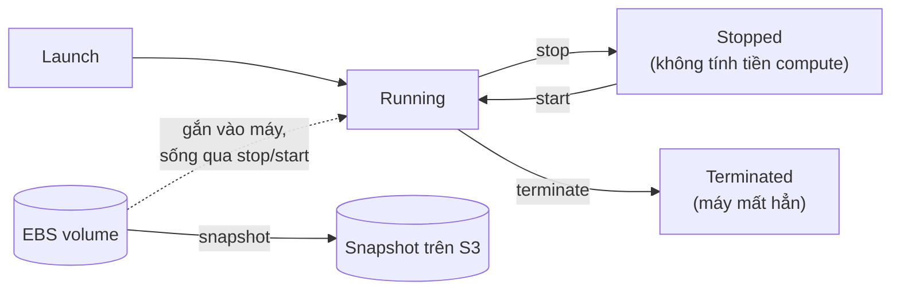

# 🎓 EC2 + EBS — Compute foundation

> **Tác giả:** Mr.Rom\
> **Phiên bản:** v2.0.1\
> **Tạo lúc:** 24/05/2026\
> **Cập nhật:** 11/06/2026\
> **Level:** Basic\
> **Tags:** [MUST-KNOW]\
> **Yêu cầu trước:** [AWS Overview — Service landscape + Account setup 2026](00_what-is-aws-overview.md), [kiến thức networking cloud cơ bản](../../../cloud-fundamentals/lessons/01_basic/02_cloud-networking.md)

> 🎯 *EC2 là dịch vụ *compute* (máy tính ảo) chủ lực của AWS — học EC2 là đặt nền cho mọi thứ chạy trên AWS về sau. Bài này đi qua: cách đọc **instance type** (họ T/M/C/R/X), **AMI** (ảnh hệ điều hành để tạo máy), **EBS** (ổ đĩa mạng gắn vào máy), **key pair** để SSH, **user data** để cài đặt tự động lúc máy khởi động lần đầu, và **Auto Scaling Group** để nhân bản máy tự động. Đích đến: bạn tự tay deploy một app FastAPI lên EC2 từ đầu tới cuối.*

## 🎯 Sau bài này bạn sẽ

- [ ] Đọc hiểu **EC2 instance type** (họ T/M/C/R/X và các size).
- [ ] Tạo và khởi chạy một EC2 instance (cả Console lẫn CLI).
- [ ] Chọn **AMI** có sẵn và tự tạo AMI riêng.
- [ ] Phân biệt các loại **EBS volume**, biết cách *snapshot* (sao lưu).
- [ ] Dùng **key pair** để SSH vào máy.
- [ ] Viết **user data** để máy tự cài đặt lúc khởi động.
- [ ] Cấu hình **Security Group** (tường lửa) cho EC2.
- [ ] Hiểu **Elastic IP** (IP công khai tĩnh) dùng khi nào.
- [ ] Nắm cơ bản **Auto Scaling Group** (nhóm tự co giãn số máy).
- [ ] Phân biệt 3 kiểu giá **Spot / On-demand / Reserved**.

---

## Tình huống — Deploy FastAPI đầu tiên lên EC2

Bạn vừa code xong một app FastAPI chạy ngon trên máy local. Giờ cần đẩy nó lên một máy chủ ngoài để người khác truy cập được. Trước mắt có vài lựa chọn:

- **Vercel**: triển khai dễ, nhưng thiên về hệ JavaScript.
- **DigitalOcean**: gọn nhẹ, gói cơ bản tầm $10/tháng.
- **AWS EC2**: chuẩn công nghiệp, kiểm soát sâu, học được nhiều hơn.

Sếp ghé qua gợi ý: *"Thử EC2 trước đi. Đây là chuẩn cho production. Học EC2 coi như nắm được nền tảng compute của AWS."*

Cả bài này xoay quanh đúng một mục tiêu thực chiến: đưa app FastAPI đó lên EC2 chạy thật, từ con số 0 tới lúc `curl` ra kết quả. Mỗi khái niệm phía dưới đều là một mảnh ghép của bức tranh đó.

---

## 1️⃣ EC2 instance type

Việc đầu tiên khi tạo máy EC2 là chọn *instance type* — tức là chọn "cấu hình máy". AWS đặt tên theo một quy ước rất hệ thống, hiểu được quy ước này là đọc được mọi tên máy mà không cần tra cứu.

### Cách đọc tên họ máy

Tên một instance type chia làm hai phần: phần *họ* (family) nói máy được tối ưu cho việc gì, và phần *size* nói máy to nhỏ ra sao:

```
Instance type: t3.medium
                │  │
                │  └─ Size (nano/micro/small/medium/large/xlarge/.../48xlarge)
                └─ Family (T3 = burstable general purpose)
```

### Các họ máy phổ biến 2026

Mỗi họ máy sinh ra để phục vụ một loại workload khác nhau. Bảng dưới gom lại các họ hay gặp nhất kèm trường hợp dùng điển hình — bạn không cần thuộc lòng, chỉ cần biết "việc kiểu này thì nhắm tới họ nào":

| Họ | Tối ưu cho | Ví dụ | Trường hợp dùng |
|---|---|---|---|
| **T** (T3, T4g) | Burstable, rẻ | t3.medium | Dev, web app nhỏ, workload thi thoảng tăng vọt |
| **M** (M5, M6i, M7i) | Cân bằng (general purpose) | m6i.large | Web/app server tải đều |
| **C** (C5, C6i, C7i) | Mạnh CPU | c6i.xlarge | Tác vụ nặng CPU: game, tính toán khoa học |
| **R** (R5, R6i, R7i) | Nhiều RAM | r6i.xlarge | Database, cache trong bộ nhớ |
| **X** (X1, X2) | RAM cực lớn | x1.32xlarge | SAP HANA, in-memory DB |
| **I** (I3, I4i) | I/O cao (NVMe SSD) | i4i.xlarge | NoSQL DB, data warehouse |
| **D** (D3, D3en) | Lưu trữ HDD dày | d3.xlarge | Big data, hệ file phân tán |
| **P** (P4, P5) | GPU (huấn luyện) | p5.xlarge | Huấn luyện ML |
| **G** (G5, G6) | GPU (suy luận) | g6.xlarge | Suy luận ML, xử lý video |
| **Inf** (Inf1, Inf2) | Chip AWS Trainium/Inferentia | inf2.xlarge | Chip AI riêng của AWS, rẻ hơn |
| **Mac** | macOS | mac1.metal | Build iOS |

Quy tắc ngầm dễ nhớ: chữ cái đầu gợi đúng nhu cầu — **C** = Compute, **R** = RAM, **I** = I/O. Mới học thì 90% trường hợp bạn chỉ dùng tới họ **T** (dev) và **M** (production tải đều).

### Thế hệ máy

Con số đứng sau chữ họ cho biết *thế hệ* (generation) của máy. Thế hệ càng mới thì tỷ lệ hiệu năng trên giá càng tốt:

- Con số sau tên họ chính là thế hệ.
- Thế hệ mới hơn = giá/hiệu năng tốt hơn.
- Mới nhất tính tới 2026 là **thế hệ thứ 7** (Intel Sapphire Rapids, AMD Genoa, Graviton4).

Hậu tố chữ cái nhỏ phía sau cho biết dòng chip bên trong (Intel, AMD, hay chip ARM Graviton của chính AWS):

```
m5    → 2018 (Intel Skylake)
m5a   → AMD EPYC
m6i   → 2021 (Intel Ice Lake)
m6g   → 2020 (Graviton2 ARM)
m6a   → 2021 (AMD)
m7i   → 2023 (Intel Sapphire Rapids)
m7g   → 2022 (Graviton3 ARM)
m7a   → 2024 (AMD Genoa)
```

→ Khuyến nghị cho 2026: dùng **m7i** nếu cần x86, dùng **m7g** nếu app chạy được trên ARM (rẻ hơn mà hiệu năng tương đương).

### Size — kích cỡ máy

Trong cùng một họ, phần size quyết định số vCPU và dung lượng RAM. Điểm hay là các bậc size tăng gần như gấp đôi đều đặn, nên dễ ước lượng:

```
nano   = 1 vCPU, 0.5 GB RAM     (very small)
micro  = 1 vCPU, 1 GB
small  = 1 vCPU, 2 GB
medium = 2 vCPU, 4 GB
large  = 2 vCPU, 8 GB
xlarge = 4 vCPU, 16 GB
2xlarge = 8 vCPU, 32 GB
4xlarge = 16 vCPU, 64 GB
...
48xlarge = 192 vCPU, 768 GB     (huge)
```

→ Mỗi bậc gấp khoảng 2 lần bậc trước. Nguyên tắc chọn: lấy size nhỏ nhất vừa đủ chạy, rồi để Auto Scaling Group lo phần tải dao động — đừng mua dư từ đầu.

### Họ burstable (T) — điểm cần lưu ý

Họ **T** rẻ hơn hẳn các họ khác, nhưng đổi lại nó hoạt động theo cơ chế *CPU credit* (tín dụng CPU) chứ không cho dùng CPU đầy 100% liên tục. Hiểu cơ chế này để khỏi vỡ trận ở production:

- Mỗi máy có một mức **baseline** (ví dụ t3.medium chạy nền ở khoảng 20% vCPU).
- Muốn vọt lên trên baseline thì *tiêu* credit.
- Lúc máy rảnh thì credit lại *tích* dần lên.

Lấy **t3.medium** làm ví dụ cụ thể:

- Tích 24 credit mỗi giờ.
- Baseline 20% (tương đương ~0.4 vCPU chạy đầy).
- Có thể vọt lên 100% (2 vCPU) trong những đợt ngắn.

Họ T có hai chế độ vận hành, khác nhau ở chỗ "khi cạn credit thì sao":

**Chế độ T3 Unlimited** (mặc định 2026):

- Hết credit thì vẫn cho chạy tiếp, nhưng tính thêm $0.05/vCPU-giờ cho phần vượt baseline.
- Hiệu năng ổn định, đổi lại chi phí biến động.

**Chế độ T3 Standard**:

- Hết credit thì bị **bóp** (throttle) về đúng baseline.
- Chi phí cố định, đổi lại hiệu năng biến động.

→ Tóm lại: dùng T cho dev và workload nhỏ. Production cần CPU ổn định thì chọn M/C/R cho chắc.

🪞 **Ẩn dụ**: *Máy T giống **gói data 4G trả trước** — có một mức nền (baseline 20%) tự tích thêm khi bạn không xài, và cho phép "bùng" tốc độ cao trong chốc lát khi cần. Máy M giống **cáp quang riêng** — lúc nào cũng đều một tốc độ, không lo cạn.*

### Vài mức giá tham khảo (us-east-1, on-demand, Linux, 2026)

Để có cảm giác về tiền, đây là giá on-demand một số máy hay dùng. Cột $/tháng quy đổi theo chạy 24/7 cả tháng:

| Type | Cấu hình | $/giờ | $/tháng |
|---|---|---|---|
| t3.micro | 2 vCPU, 1 GB | $0.0104 | $7.50 |
| t3.medium | 2 vCPU, 4 GB | $0.0416 | $30 |
| m7i.large | 2 vCPU, 8 GB | $0.1008 | $73 |
| m7i.xlarge | 4 vCPU, 16 GB | $0.2016 | $146 |
| c7i.xlarge | 4 vCPU, 8 GB | $0.1785 | $129 |
| r7i.xlarge | 4 vCPU, 32 GB | $0.2646 | $192 |

→ Đây là giá on-demand "đắt nhất". Nếu cam kết trước: **Reserved 1 năm** rẻ hơn ~30%, **3 năm** rẻ hơn ~60%, còn **Spot** rẻ hơn 60-90% (đổi lại có thể bị thu hồi). Mục §9 đi sâu phần này.

---

## 2️⃣ AMI — Amazon Machine Image

Chọn xong cấu hình máy, câu hỏi tiếp theo là: máy này khởi động lên thì có sẵn hệ điều hành gì, phần mềm gì? Đó chính là vai trò của AMI.

### AMI là gì

**AMI** (Amazon Machine Image) là một *template* để tạo EC2 — hiểu nôm na là một ảnh đĩa khởi động được:

- Gồm hệ điều hành cộng phần mềm đã cài sẵn.
- Là một *snapshot* (ảnh chụp) khởi động được.
- Gắn với từng region (không dùng chéo region trực tiếp).

### Các AMI tiêu chuẩn

AWS và các nhà cung cấp OS đều phát hành sẵn nhiều AMI để bạn chọn. Bảng dưới điểm những lựa chọn phổ biến cùng đặc điểm:

| AMI | Nhà cung cấp | Dùng khi |
|---|---|---|
| **Amazon Linux 2023** | AWS | Tối ưu cho AWS, miễn phí, hợp khi cần tích hợp sâu với AWS |
| **Ubuntu 22.04 / 24.04** | Canonical | Phổ biến nhất để deploy app |
| **Debian 12** | Debian Project | Ổn định, bảo thủ |
| **RHEL 9 / 10** | Red Hat | Doanh nghiệp, có phí |
| **SUSE** | SUSE | Doanh nghiệp |
| **macOS** | AWS (đặc thù) | Dev iOS, đắt |
| **Windows Server 2022/2025** | Microsoft | Workload Windows |

→ Khuyến nghị 2026: dùng Ubuntu 24.04 LTS cho nhu cầu chung; chọn Amazon Linux 2023 khi muốn tích hợp chặt với AWS.

### Tìm AMI bằng CLI

Mỗi region có AMI ID khác nhau và AWS phát hành bản mới liên tục, nên thường ta truy vấn bản mới nhất thay vì hardcode ID. Hai lệnh dưới lấy AMI mới nhất cho Amazon Linux 2023 và Ubuntu 24.04:

```bash
# Latest Amazon Linux 2023
aws ec2 describe-images \
  --owners amazon \
  --filters "Name=name,Values=al2023-ami-*-x86_64" \
  --query 'sort_by(Images, &CreationDate)[-1].ImageId' \
  --output text

# Latest Ubuntu 24.04
aws ec2 describe-images \
  --owners 099720109477 \
  --filters "Name=name,Values=ubuntu/images/hvm-ssd*ubuntu-noble-24.04-amd64-server-*" \
  --query 'sort_by(Images, &CreationDate)[-1].ImageId' \
  --output text
```

### AMI tự tạo

Khi đã cấu hình một máy đúng ý (cài đủ app, dependency), bạn có thể "đóng băng" nó lại thành AMI riêng để lần sau tạo máy mới giống hệt mà khỏi cài lại từ đầu:

```bash
# After configuring EC2:
aws ec2 create-image \
  --instance-id i-abc \
  --name "myapp-v1.0.0" \
  --description "FastAPI app + dependencies"

# Returns AMI ID, can launch many EC2 from this AMI
```

→ Cách này nhanh hơn nhiều so với chạy lại user data script mỗi lần tạo máy. Đây chính là kỹ thuật *golden image* (ảnh chuẩn dùng đi dùng lại).

### AMI so với container

Cả AMI lẫn container (Docker) đều là cách đóng gói để chạy app, nhưng ở hai mức độ rất khác nhau. Bảng dưới đặt chúng cạnh nhau:

| Khía cạnh | AMI | Container (Docker) |
|---|---|---|
| Mức đóng gói | Cả OS + app | App + tối thiểu dependency |
| Dung lượng | GB | MB |
| Công cụ build | Packer + AWS | Dockerfile |
| Thời gian khởi động | 30-90 giây | 1-10 giây |
| Tính di động | AMI bó theo region | Docker chạy được mọi cloud |

→ Xu hướng 2026 nghiêng về **container** (khởi động nhanh, di động). AMI vẫn hợp khi: app *legacy* (cũ), cần cấu hình OS đặc thù, hoặc ràng buộc quy định pháp lý. (Phần so sánh sâu hơn nằm ở câu Q2 trong mục Self-check.)

### Dùng Packer để build AMI

Cách dựng AMI chuẩn công nghiệp ngày nay là dùng **Packer** (công cụ của HashiCorp) — khai báo bằng file cấu hình thay vì click tay. Ví dụ dưới dựng một AMI Ubuntu 24.04 đã cài sẵn nginx và FastAPI:

```hcl
# packer.pkr.hcl
source "amazon-ebs" "ubuntu" {
  ami_name      = "myapp-{{timestamp}}"
  instance_type = "t3.medium"
  region        = "ap-southeast-1"
  source_ami    = "ami-..."  # base Ubuntu 24.04
  ssh_username  = "ubuntu"
}

build {
  sources = ["source.amazon-ebs.ubuntu"]
  
  provisioner "shell" {
    inline = [
      "sudo apt-get update",
      "sudo apt-get install -y python3-pip nginx",
      "pip3 install fastapi uvicorn",
    ]
  }
}
```

```bash
packer build packer.pkr.hcl
# Builds AMI, registers
```

→ Đây là pipeline build AMI hiện đại: viết một lần, chạy ra AMI có version, tái lập được.

---

## 3️⃣ EBS volume

Máy EC2 cần chỗ lưu dữ liệu. Phần lớn trường hợp, ổ đĩa đó là EBS — và hiểu EBS giúp bạn tránh hai cú đau kinh điển: mất dữ liệu khi máy chết, và trả tiền oan cho IOPS không cần tới.

### EBS là gì

**EBS** (Elastic Block Store) là ổ đĩa gắn qua mạng cho EC2. Vài tính chất cốt lõi cần nắm:

- Bó theo AZ (*Availability Zone*) — không gắn được vào EC2 nằm ở AZ khác.
- Bền vững (*persistent*) — sống sót qua stop/start, restart máy.
- Snapshot được lưu lên S3 (có thể copy sang region khác).
- Thường một EBS gắn một EC2 (Multi-Attach có nhưng giới hạn).

Điểm trừu tượng nhất ở đây là **vòng đời EBS tách rời vòng đời EC2** — và stop khác hẳn terminate. Sơ đồ dưới tóm tắt mối quan hệ đó:



→ Stop chỉ tạm dừng máy (EBS và dữ liệu còn nguyên, nhưng vẫn tính tiền lưu trữ), còn terminate xoá máy vĩnh viễn — boot volume mặc định bị xoá theo, nên snapshot là lưới an toàn duy nhất cho dữ liệu.

### Các loại volume

EBS có nhiều "hạng" đĩa, khác nhau ở tốc độ (IOPS) và giá. Chọn đúng hạng là cân bằng giữa hiệu năng cần và tiền bỏ ra:

| Loại | Dùng cho | Giá | IOPS |
|---|---|---|---|
| **gp3** (general purpose SSD) | Mặc định 2026, ổn định | $0.08/GB/tháng | 3K-16K |
| **gp2** (gp đời cũ) | Deploy cũ | $0.10/GB/tháng | 3 IOPS/GB, tối đa 16K |
| **io2 Block Express** | DB hiệu năng cao | $0.125/GB/tháng + $0.065/IOPS | 256K |
| **st1** (HDD throughput) | Đọc tuần tự lớn | $0.045/GB/tháng | — |
| **sc1** (HDD cold) | Ít truy cập | $0.025/GB/tháng | — |

→ Năm 2026 mặc định cứ **gp3**. Dùng io2 cho DB production, st1/sc1 cho dữ liệu lạnh ít đụng tới.

### Cách tính dung lượng gp3

Điểm hay của gp3 là tách IOPS/throughput ra khỏi dung lượng — bạn có một mức nền miễn phí, vượt mức đó mới trả thêm. Lấy một volume 100 GB gp3 làm chuẩn:

Mặc định 100 GB gp3:

- Kèm sẵn 3,000 IOPS.
- Kèm sẵn 125 MB/s throughput.
- Chi phí: $8/tháng.

Cần thêm IOPS thì trả thêm:

- IOPS vượt 3,000: $0.005/IOPS-tháng.
- Throughput vượt 125: $0.04/MB/s-tháng.

Ví dụ một volume 100GB cần tới 10K IOPS sẽ tính như sau:

- Storage: $8.
- IOPS: 7000 × $0.005 = $35.
- Tổng: $43/tháng.

### Boot volume và data volume

Một máy EC2 thường có hai loại volume với vai trò khác nhau — đĩa hệ thống để khởi động, và đĩa dữ liệu để chứa app/log:

```
EC2 instance has:
  - 1 boot volume (root, OS)  — typically 8-20 GB
  - 0+ data volumes (app data, logs)  — variable
```

### Snapshot EBS

Snapshot là cách sao lưu EBS. Lệnh dưới tạo snapshot từ một volume, và khôi phục bằng cách tạo volume mới từ snapshot đó:

```bash
aws ec2 create-snapshot \
  --volume-id vol-abc \
  --description "Daily backup"

# Restore:
aws ec2 create-volume \
  --snapshot-id snap-xyz \
  --volume-type gp3 \
  --availability-zone us-east-1a
```

→ Snapshot là *incremental* (chỉ lưu block thay đổi) nên tiết kiệm, và được AWS lưu trên S3 (bạn không phải quản lý).

**Chi phí**: $0.05/GB/tháng cho dung lượng snapshot.

### Chiến lược backup

Thay vì tự chạy snapshot tay, AWS có dịch vụ **AWS Backup** lo lịch sao lưu tự động. Ví dụ sau đặt lịch backup hằng ngày lúc 2h sáng, giữ lại 7 ngày:

```bash
# Daily, retain 7 days
aws backup create-backup-plan \
  --backup-plan '{
    "BackupPlanName": "daily-ebs",
    "Rules": [{
      "RuleName": "DailyBackups",
      "TargetBackupVaultName": "Default",
      "ScheduleExpression": "cron(0 2 * * ? *)",
      "Lifecycle": {
        "DeleteAfterDays": 7
      }
    }]
  }'
```

→ Dùng **AWS Backup** để tự động hoá, kèm copy chéo region cho mục đích DR (*disaster recovery* — phục hồi sau thảm hoạ).

---

## 4️⃣ Key pair + truy cập SSH

Máy đã có rồi, giờ làm sao đăng nhập vào? Cách kinh điển là SSH bằng *key pair* (cặp khoá).

### Tạo key pair

Lệnh dưới tạo một key pair: AWS giữ phần khoá công khai, còn bạn tải về phần khoá riêng (file `.pem`) và phải giữ kín:

```bash
# Create key pair
aws ec2 create-key-pair \
  --key-name my-key \
  --query 'KeyMaterial' \
  --output text > my-key.pem

chmod 400 my-key.pem
```

→ Khoá công khai nằm trên AWS, khoá riêng (`.pem`) bạn cất kỹ. Mất file `.pem` là mất luôn đường vào máy bằng SSH.

### Khởi chạy EC2 kèm key

Khi tạo máy, gắn tên key pair vào để AWS nạp sẵn khoá công khai cho user mặc định:

```bash
aws ec2 run-instances \
  --image-id ami-abc \
  --instance-type t3.medium \
  --key-name my-key \
  --security-group-ids sg-xyz \
  --subnet-id subnet-pqr
```

### SSH vào EC2

Có khoá rồi thì SSH như bình thường, lưu ý user mặc định khác nhau tuỳ AMI (`ubuntu` cho Ubuntu, `ec2-user` cho Amazon Linux):

```bash
ssh -i my-key.pem ubuntu@<public-ip>
# Or for Amazon Linux:
ssh -i my-key.pem ec2-user@<public-ip>
```

### Vấn đề: quản lý SSH key ở quy mô lớn

SSH key chạy tốt cho một máy, một người. Nhưng khi đội đông và máy nhiều, nó nhanh chóng thành cơn ác mộng:

- Chia sẻ file `.pem` cho nhau? Không an toàn.
- 50 kỹ sư dùng chung 1 key? Một người nghỉ việc là phải xoay khoá cho tất cả.
- Mất khoá là mất luôn quyền vào máy.

### Giải pháp: AWS Systems Manager Session Manager

AWS có một cách vào shell mà **không cần SSH** chút nào — Session Manager. Không mở cổng 22, không quản lý khoá, mọi phiên đều xác thực qua IAM và ghi log audit:

```bash
# Install SSM Agent (default Amazon Linux 2023, Ubuntu 24.04)
# Attach IAM role with SSM permissions to EC2

# Then:
aws ssm start-session --target i-abc123
```

→ Vào thẳng shell, xác thực bằng IAM, có log audit, không phải mở cổng SSH, không phải quản lý khoá.

### Best practice 2026

Gom lại, hướng đi an toàn cho truy cập máy ngày nay là loại bỏ bề mặt tấn công của SSH:

- **Đừng mở cổng 22** ra Internet.
- **Ưu tiên Session Manager** để vào shell.
- **Hoặc AWS Client VPN** + máy *bastion* để SSH.
- **Hoặc VPN mesh** kiểu Tailscale / WireGuard.

→ Càng ít cổng SSH phơi ra ngoài, càng ít cửa cho kẻ tấn công.

---

## 5️⃣ User data — script khởi động

Bạn không muốn mỗi lần tạo máy lại phải SSH vào cài tay từng thứ. *User data* giải quyết đúng việc đó: một script chạy tự động ngay lần đầu máy bật lên.

### User data là gì

User data là một shell script chạy đúng **một lần lúc khởi động đầu tiên** của EC2. Ví dụ dưới cài nginx + FastAPI và đăng ký một service systemd để app tự chạy:

```bash
#!/bin/bash
# user-data.sh
apt-get update
apt-get install -y nginx python3-pip
pip3 install fastapi uvicorn

cat > /home/ubuntu/app.py <<EOF
from fastapi import FastAPI
app = FastAPI()

@app.get("/")
def root():
    return {"message": "Hello from EC2!"}
EOF

cat > /etc/systemd/system/myapp.service <<EOF
[Unit]
Description=FastAPI app
After=network.target

[Service]
ExecStart=/usr/bin/uvicorn app:app --host 0.0.0.0 --port 8000
WorkingDirectory=/home/ubuntu
User=ubuntu

[Install]
WantedBy=multi-user.target
EOF

systemctl enable myapp
systemctl start myapp
```

### Khởi chạy kèm user data

Truyền script vào lúc tạo máy qua cờ `--user-data`:

```bash
aws ec2 run-instances \
  --image-id ami-abc \
  --instance-type t3.medium \
  --key-name my-key \
  --user-data file://user-data.sh \
  --security-group-ids sg-xyz \
  --subnet-id subnet-pqr
```

→ User data chỉ chạy một lần. Muốn xem nó chạy ra sao để debug, đọc log ở `/var/log/cloud-init-output.log`.

### Các tình huống dùng

User data hợp với mọi việc cần làm "một lần lúc dựng máy":

- **Cài phần mềm**: Docker, app, dependency.
- **Cấu hình**: SSH key, sysctl, hostname.
- **Khởi động service**: systemd.
- **Kéo code về**: clone repo rồi `make install`.

### Cloud-init

Đằng sau user data là **cloud-init** — bộ xử lý script khởi động mặc định trên Linux EC2. Ngoài shell script, cloud-init còn nhận một định dạng khai báo `#cloud-config` gọn hơn:

```yaml
#cloud-config
packages:
  - nginx
  - python3-pip
runcmd:
  - pip3 install fastapi
  - systemctl start nginx
write_files:
  - path: /etc/myapp.conf
    content: |
      foo=bar
```

→ Đây là cách viết khai báo (*declarative*) thay cho shell script.

### Những điều cần lưu ý

User data tiện nhưng có vài cái bẫy cần nhớ trước khi dùng cho production:

- **Chỉ chạy một lần** (lần khởi động đầu). Muốn chạy lại = phải tạo máy mới.
- **Đừng để secret trong user data** — bất kỳ ai có quyền đọc EC2 đều thấy.
- **Log nhìn được**: đừng echo mật khẩu ra.
- **Giới hạn dung lượng**: user data tối đa 16 KB.

### Cách làm hiện đại hơn

Để máy khởi động nhanh và tái lập tốt hơn, xu hướng là **dùng AMI đã cài sẵn phần mềm** (build bằng Packer), còn user data chỉ giữ phần cấu hình tối thiểu:

→ Khởi động nhanh hơn (khỏi chờ cài đặt), và kết quả tái lập được.

---

## 6️⃣ Security Group cho EC2

Máy chạy rồi thì phải kiểm soát ai được kết nối vào. *Security Group* (SG) chính là tường lửa ảo gắn ngay vào từng máy.

### SG mặc định cho web server

Một web server điển hình cần mở HTTP/HTTPS ra Internet, và chỉ mở SSH cho đúng IP văn phòng. Đây là cấu hình Terraform tương ứng:

```hcl
resource "aws_security_group" "web" {
  name   = "web-sg"
  vpc_id = aws_vpc.main.id
  
  # HTTP from internet
  ingress {
    from_port   = 80
    to_port     = 80
    protocol    = "tcp"
    cidr_blocks = ["0.0.0.0/0"]
  }
  
  # HTTPS from internet
  ingress {
    from_port   = 443
    to_port     = 443
    protocol    = "tcp"
    cidr_blocks = ["0.0.0.0/0"]
  }
  
  # SSH from office IP only
  # (Better: no SSH, use Session Manager)
  ingress {
    from_port   = 22
    to_port     = 22
    protocol    = "tcp"
    cidr_blocks = ["1.2.3.4/32"]
  }
  
  # All outbound (default)
  egress {
    from_port   = 0
    to_port     = 0
    protocol    = "-1"
    cidr_blocks = ["0.0.0.0/0"]
  }
}
```

### Mẫu SG nhiều tầng

Cách dùng SG đẹp nhất là cho mỗi tầng tham chiếu tới SG của tầng phía trước, thay vì mở theo dải IP. Nhờ vậy luồng dữ liệu bị siết đúng một chiều (đã nói tới ở bài cloud-networking 02):

```
Internet → ALB SG (443/80 open) → App SG (8000 from ALB) → DB SG (5432 from App)
```

```hcl
resource "aws_security_group" "alb" {
  ingress { from_port = 443 to_port = 443 protocol = "tcp" cidr_blocks = ["0.0.0.0/0"] }
}

resource "aws_security_group" "app" {
  ingress {
    from_port       = 8000
    to_port         = 8000
    protocol        = "tcp"
    security_groups = [aws_security_group.alb.id]   # reference SG
  }
}

resource "aws_security_group" "db" {
  ingress {
    from_port       = 5432
    to_port         = 5432
    protocol        = "tcp"
    security_groups = [aws_security_group.app.id]
  }
}
```

Cái hay ở đây: tầng app chỉ nhận lưu lượng từ ALB, tầng DB chỉ nhận từ app — không ai từ ngoài chọc thẳng vào DB được, kể cả IP nội bộ.

---

## 7️⃣ Elastic IP (EIP)

Mặc định, IP công khai của EC2 sẽ đổi mỗi lần stop/start. Khi nào cần một IP cố định không đổi, đó là lúc cần Elastic IP.

### Tình huống dùng

EC2 mặc định có IP công khai *động* — cứ stop/start là đổi. **EIP** là một IP công khai *tĩnh* được cấp cho tài khoản, gắn vào máy nào tuỳ bạn:

```bash
# Allocate EIP
aws ec2 allocate-address --domain vpc

# Associate with EC2
aws ec2 associate-address \
  --instance-id i-abc \
  --allocation-id eipalloc-xyz
```

### Chi phí

Cách AWS tính tiền EIP thể hiện rõ triết lý "đừng giữ tài nguyên rồi bỏ không":

- Đã cấp và đang gắn vào EC2 đang chạy: **miễn phí**.
- Đã cấp nhưng KHÔNG gắn vào đâu: **$0.005/giờ ($3.60/tháng)** — phạt việc giữ khư khư không dùng.
- Mặc định giới hạn 5 EIP mỗi tài khoản.

### Khi nào nên dùng EIP

EIP chỉ thật sự cần khi có một bên ngoài đòi hỏi IP cố định:

- Cần IP tĩnh để bên thứ ba *whitelist* (firewall của họ chỉ cho IP này vào).
- DNS trỏ thẳng tới một IP cố định.

### Khi nào KHÔNG cần EIP

Ngược lại, đa số kiến trúc hiện đại không cần EIP, vì IP máy không còn là điểm truy cập:

- App nằm sau ALB (load balancer có DNS, không phải IP).
- Auto Scaling Group (các máy là tạm thời, sinh ra rồi mất đi).

→ Phần lớn app không cần EIP. Cứ dùng load balancer + DNS là gọn.

---

## 8️⃣ Auto Scaling Group (ASG) — cơ bản

Một máy đơn lẻ luôn là điểm yếu: nó chết thì cả dịch vụ chết, tải tăng đột biến thì nó nghẽn. ASG sinh ra để xử lý đúng hai nỗi lo đó bằng cách quản lý cả một *nhóm* máy.

### Vì sao cần ASG

So một máy đơn với một nhóm ASG là thấy ngay khác biệt:

EC2 đơn lẻ:

- Crash → downtime.
- Tải tăng vọt → quá tải.

ASG:

- **Trải nhiều AZ**: máy nằm rải ra nhiều AZ.
- **Tự thay máy**: máy chết được thay tự động.
- **Tự co giãn**: tải cao thì thêm máy.

### Các thành phần

ASG được ghép từ ba mảnh, mỗi mảnh một vai trò:

1. **Launch Template**: bản thiết kế cho EC2 (AMI, type, SG, user data).
2. **Auto Scaling Group**: số máy tối thiểu/tối đa/mong muốn.
3. **Scaling policies**: luật kích hoạt (CPU > 70% → +2 máy).

### Ví dụ Terraform

Đoạn Terraform dưới ráp đủ ba mảnh trên: một launch template, một ASG trải 3 subnet, cộng một chính sách scale-up gắn với cảnh báo CloudWatch khi CPU vượt 70%:

```hcl
resource "aws_launch_template" "web" {
  name_prefix   = "web-"
  image_id      = "ami-abc"
  instance_type = "t3.medium"
  
  vpc_security_group_ids = [aws_security_group.web.id]
  
  user_data = base64encode(file("user-data.sh"))
  
  tag_specifications {
    resource_type = "instance"
    tags = { Name = "web-asg" }
  }
}

resource "aws_autoscaling_group" "web" {
  name                = "web-asg"
  min_size            = 2
  max_size            = 10
  desired_capacity    = 2
  
  vpc_zone_identifier = [
    aws_subnet.private[0].id,
    aws_subnet.private[1].id,
    aws_subnet.private[2].id,
  ]
  
  launch_template {
    id      = aws_launch_template.web.id
    version = "$Latest"
  }
  
  health_check_type         = "ELB"
  health_check_grace_period = 60
  
  target_group_arns = [aws_lb_target_group.web.arn]
  
  tag {
    key                 = "Name"
    value               = "web-asg"
    propagate_at_launch = true
  }
}

# Scale up on high CPU
resource "aws_autoscaling_policy" "scale_up" {
  name                   = "scale-up"
  scaling_adjustment     = 2
  adjustment_type        = "ChangeInCapacity"
  cooldown               = 300
  autoscaling_group_name = aws_autoscaling_group.web.name
}

resource "aws_cloudwatch_metric_alarm" "cpu_high" {
  alarm_name          = "cpu-high"
  comparison_operator = "GreaterThanThreshold"
  evaluation_periods  = 2
  metric_name         = "CPUUtilization"
  namespace           = "AWS/EC2"
  period              = 120
  statistic           = "Average"
  threshold           = 70
  
  alarm_actions = [aws_autoscaling_policy.scale_up.arn]
  
  dimensions = {
    AutoScalingGroupName = aws_autoscaling_group.web.name
  }
}
```

### Các kiểu scaling của ASG

ASG cho nhiều cách quyết định "khi nào thêm/bớt máy", từ đơn giản tới thông minh:

- **Target tracking**: giữ một chỉ số ở mức mục tiêu (ví dụ CPU ở 50%).
- **Step scaling**: chia bậc (CPU > 70% +2, > 90% +5).
- **Scheduled scaling**: co giãn theo giờ (ví dụ giờ hành chính).
- **Predictive scaling**: dựa trên ML (AWS dự đoán nhu cầu).

→ Cụm K8s ở mức intermediate có mô hình tương tự (HPA + Cluster Autoscaler) — nếu sau này học K8s, bạn sẽ thấy quen.

---

## 9️⃣ Giá EC2 — On-demand vs Reserved vs Spot

Chọn đúng kiểu giá có thể cắt được nửa hoá đơn. AWS bán cùng một máy theo ba kiểu giá, mỗi kiểu đánh đổi giữa cam kết, độ rủi ro và mức tiết kiệm.

### On-demand

Đây là kiểu mặc định, linh hoạt nhất nhưng cũng đắt nhất:

- Trả theo giây (Linux) hoặc theo giờ (Windows).
- Chi phí cao nhất.
- Không ràng buộc cam kết.

**Hợp khi**: dev, workload khó đoán, chạy thử.

### Reserved Instances (RI) / Savings Plans

Nếu bạn biết chắc sẽ chạy đều một lượng máy nhất định, cam kết trước để được giảm giá sâu:

**Cam kết 1 hoặc 3 năm để giảm giá**:

- 1 năm: giảm 30-40%.
- 3 năm: giảm 50-72%.

**Savings Plans** (linh hoạt hơn RI):

- Compute Savings Plans: áp cho mọi region, mọi họ máy.
- EC2 Instance Savings Plans: cố định họ máy + region.

**Hợp khi**: workload nền ổn định, đoán được (production chạy đều).

```bash
# View Reserved Instance recommendations
aws ce get-reservation-purchase-recommendation \
  --service "AmazonEC2"
```

### Spot Instances

Spot là cách tận dụng năng lực dư của AWS với giá rẻ giật mình, đổi lại có thể bị thu hồi bất cứ lúc nào:

**Dùng năng lực nhàn rỗi của AWS**:

- Rẻ hơn 60-90% so với on-demand.
- AWS có thể thu hồi với **cảnh báo trước 2 phút**.

**Hợp khi**:

- Worker không giữ trạng thái (*stateless*).
- Job xử lý theo lô (*batch*).
- Runner CI/CD.
- App chịu lỗi tốt.

**Tránh dùng cho**:

- App giữ trạng thái (DB).
- Một máy đơn chạy dài hạn.
- Dịch vụ thời gian thực phục vụ khách hàng.

```bash
aws ec2 request-spot-instances \
  --spot-price "0.05" \
  --instance-count 5 \
  --launch-specification file://spec.json
```

→ Rẻ nhưng rủi ro. Kết hợp với on-demand để vừa tiết kiệm vừa giữ độ sẵn sàng cao (HA).

### Chiến lược giá

Cách tối ưu trong thực tế là *trộn* cả ba kiểu giá theo đúng tính chất từng phần workload:

```
Production:
  Baseline: Reserved Instances (40% off) — 70% of capacity
  Burst: On-demand — 20% of capacity
  Spot-tolerant workers: Spot — 10% of capacity
  
Result: ~50% savings vs all on-demand
```

→ Trộn chiến lược để cân giữa chi phí và độ tin cậy — đó là tư duy chuẩn cho hoá đơn EC2.

---

## 🔟 Hands-on: Deploy FastAPI lên EC2 từ đầu tới cuối

Đến lúc ráp mọi mảnh ghép lại thành một thứ chạy thật. Phần này đi từng bước: dựng tường lửa, tạo khoá, viết script khởi động, tìm AMI, bật máy, kiểm tra, rồi dọn dẹp. Làm xong là bạn có một app FastAPI sống trên Internet.

### Bước 1: Chuẩn bị

Trước khi bắt đầu, cần sẵn vài thứ:

- Tài khoản AWS.
- AWS CLI đã cấu hình.
- VPC có public subnet (từ bài cloud-fundamentals 02).

### Bước 2: Security group

Tạo SG cho web và mở cổng HTTP + HTTPS ra Internet:

```bash
aws ec2 create-security-group \
  --group-name fastapi-sg \
  --description "FastAPI web" \
  --vpc-id vpc-abc

# Allow HTTP + HTTPS (replace sg-id)
SG_ID=sg-xyz
aws ec2 authorize-security-group-ingress \
  --group-id $SG_ID \
  --protocol tcp --port 80 --cidr 0.0.0.0/0

aws ec2 authorize-security-group-ingress \
  --group-id $SG_ID \
  --protocol tcp --port 443 --cidr 0.0.0.0/0
```

### Bước 3: Key pair

Tạo khoá để lát nữa SSH vào debug:

```bash
aws ec2 create-key-pair \
  --key-name fastapi-key \
  --query 'KeyMaterial' \
  --output text > fastapi-key.pem
chmod 400 fastapi-key.pem
```

### Bước 4: Script user data

Script dưới làm trọn việc cài đặt lúc máy khởi động: cài nginx + FastAPI, chạy app bằng systemd, rồi để nginx *reverse proxy* (chuyển tiếp) về app ở cổng 8000:

`user-data.sh`:
```bash
#!/bin/bash
set -e

apt-get update
apt-get install -y python3-pip nginx

pip3 install fastapi uvicorn[standard]

mkdir -p /opt/myapp
cat > /opt/myapp/app.py <<'EOF'
from fastapi import FastAPI
from datetime import datetime

app = FastAPI()

@app.get("/")
def root():
    return {
        "message": "Hello from EC2 via FastAPI!",
        "time": datetime.utcnow().isoformat()
    }

@app.get("/health")
def health():
    return {"status": "ok"}
EOF

cat > /etc/systemd/system/myapp.service <<'EOF'
[Unit]
Description=FastAPI app
After=network.target

[Service]
ExecStart=/usr/local/bin/uvicorn app:app --host 127.0.0.1 --port 8000
WorkingDirectory=/opt/myapp
User=www-data
Restart=always

[Install]
WantedBy=multi-user.target
EOF

# Nginx config (proxy)
cat > /etc/nginx/sites-available/myapp <<'EOF'
server {
    listen 80;
    server_name _;
    location / {
        proxy_pass http://127.0.0.1:8000;
        proxy_set_header Host $host;
        proxy_set_header X-Real-IP $remote_addr;
    }
}
EOF

ln -sf /etc/nginx/sites-available/myapp /etc/nginx/sites-enabled/
rm /etc/nginx/sites-enabled/default

systemctl enable myapp
systemctl start myapp
systemctl restart nginx
```

### Bước 5: Tìm AMI Ubuntu

Truy vấn AMI Ubuntu 24.04 mới nhất và lưu vào biến để dùng ở bước sau:

```bash
AMI_ID=$(aws ec2 describe-images \
  --owners 099720109477 \
  --filters "Name=name,Values=ubuntu/images/hvm-ssd*ubuntu-noble-24.04-amd64-server-*" \
  --query 'sort_by(Images, &CreationDate)[-1].ImageId' \
  --output text)

echo $AMI_ID
```

### Bước 6: Khởi chạy EC2

Bật máy với đầy đủ AMI, key, SG, subnet, user data, kèm gắn IP công khai và tag để dễ nhận diện:

```bash
aws ec2 run-instances \
  --image-id $AMI_ID \
  --instance-type t3.medium \
  --key-name fastapi-key \
  --security-group-ids $SG_ID \
  --subnet-id subnet-public-abc \
  --user-data file://user-data.sh \
  --associate-public-ip-address \
  --tag-specifications 'ResourceType=instance,Tags=[{Key=Name,Value=fastapi-demo}]' \
  --query 'Instances[0].InstanceId' \
  --output text
```

### Bước 7: Kiểm tra

Chờ máy sẵn sàng rồi lấy IP công khai và gọi thử hai endpoint `/` và `/health`:

```bash
INSTANCE_ID=i-abc...   # from previous output

# Wait for instance to be ready (~30 seconds boot + ~2 min user data)
aws ec2 wait instance-status-ok --instance-ids $INSTANCE_ID

# Get public IP
PUBLIC_IP=$(aws ec2 describe-instances \
  --instance-ids $INSTANCE_ID \
  --query 'Reservations[0].Instances[0].PublicIpAddress' \
  --output text)

echo "Visit: http://$PUBLIC_IP"

# Test
curl http://$PUBLIC_IP
# {"message":"Hello from EC2 via FastAPI!","time":"..."}

curl http://$PUBLIC_IP/health
# {"status":"ok"}
```

→ Thấy JSON trả về đúng là app đã sống trên EC2 và đi qua nginx ngon lành.

### Bước 8: SSH (để debug)

Nếu có gì trục trặc, SSH vào xem trạng thái service và log:

```bash
ssh -i fastapi-key.pem ubuntu@$PUBLIC_IP

# Check service
sudo systemctl status myapp

# Check logs
sudo journalctl -u myapp -f

# Logout
exit
```

### Bước 9: Dọn dẹp (tránh bị tính tiền!)

Sau khi thử xong, xoá hết tài nguyên để khỏi trả tiền oan:

```bash
aws ec2 terminate-instances --instance-ids $INSTANCE_ID
aws ec2 delete-security-group --group-id $SG_ID
aws ec2 delete-key-pair --key-name fastapi-key
rm fastapi-key.pem
```

→ Luôn dọn dẹp tài nguyên thử nghiệm! Đây là thói quen quan trọng nhất khi học AWS.

---

## 💡 Cạm bẫy thường gặp & Best practice

### ❌ Cạm bẫy: Quên dọn dẹp → cháy hoá đơn

EC2 thử nghiệm để chạy mãi sẽ âm thầm ngốn $30+/tháng mà bạn không hề hay.

→ **Fix**:
- Tag rõ tài nguyên thử nghiệm.
- Đặt lịch dọn dẹp định kỳ.
- Bật cảnh báo AWS Budget.

### ❌ Cạm bẫy: Mở SSH ra 0.0.0.0/0

Mở cổng 22 cho cả Internet là mời bot vào dò mật khẩu (*brute force*).

→ **Fix**:
- Dùng SSM Session Manager (không cần mở cổng SSH).
- Hoặc chỉ SSH từ một IP cụ thể.
- Hoặc VPN/Tailscale.

### ❌ Cạm bẫy: Dùng máy họ T cho production

Họ T là burstable; cạn CPU credit là bị bóp hiệu năng → app chậm rì.

→ **Fix**: Dùng M/C/R cho production. T chỉ hợp dev hoặc workload chịu được dao động.

### ❌ Cạm bẫy: EBS quá nhỏ, đầy ổ

Volume đầy → app crash.

→ **Fix**:
- Theo dõi dung lượng EBS qua CloudWatch.
- Cảnh báo khi đạt 80%.
- Mở rộng nóng (`modify-volume` cho gp3) — không cần downtime.

### ❌ Cạm bẫy: Không có backup

EBS biến mất (máy bị terminate, snapshot bị xoá) → mất sạch dữ liệu.

→ **Fix**:
- Tự động hoá bằng AWS Backup.
- Đặt chính sách snapshot.
- Tập khôi phục (restore) định kỳ mỗi quý.

### ❌ Cạm bẫy: Hardcode IP trong config app

IP của EC2 đổi mỗi lần restart (trừ khi dùng EIP) → app gãy.

→ **Fix**:
- Dùng DNS của ALB (thay đổi không lan ra ngoài).
- Hoặc record Route 53.
- Hoặc EIP nếu bắt buộc phải có IP cố định.

### ✅ Best practice: Tag mọi thứ

Gắn tag đầy đủ giúp phân bổ chi phí, tự động hoá và đáp ứng yêu cầu tuân thủ:

```hcl
tags = {
  Name        = "fastapi-prod-1"
  Environment = "prod"
  Service     = "api"
  Team        = "backend"
  CostCenter  = "engineering"
}
```

→ Phục vụ phân bổ chi phí, tự động hoá, và compliance.

### ✅ Best practice: Dùng IAM role, không dùng access key

EC2 cần truy cập S3:

- ❌ Hardcode access key trong biến môi trường.
- ✅ Gắn IAM role vào EC2. SDK tự lấy credential.

### ✅ Best practice: Spot cho worker stateless

Runner CI, job batch:

- Dùng Spot instance.
- Tiết kiệm 60-90%.
- Chấp nhận bị gián đoạn.

### ✅ Best practice: Right-size + RI

Sau một thời gian chạy production:

- Xem lại mức dùng CPU/RAM thực tế.
- Chọn lại size cho vừa (thường là nhỏ hơn).
- Mua RI cho phần nền chạy đều.

→ Kỷ luật này tiết kiệm 30-60% chi phí.

---

## 🧠 Tự kiểm tra (Self-check)

Năm câu dưới chạm đúng những chỗ dễ chọn sai khi mới dùng EC2 — từ chọn họ máy tới chiến lược giá. Thử tự trả lời trước khi mở đáp án.

**Q1.** Khi nào dùng máy họ T, khi nào dùng họ M?

<details>
<summary>💡 Đáp án</summary>

**Họ T** (T3, T4g) — burstable:
- Hiệu năng CPU theo mức nền (ví dụ 20% vCPU).
- Vọt lên trên baseline bằng CPU credit.
- Rẻ (ít hơn M tầm 50-70%).

**Dùng họ T khi**:
- **Dev/staging**: tải thấp, chấp nhận dao động.
- **App ít traffic**: web nhỏ, công cụ nội bộ.
- **Workload bùng phát**: tăng vọt rồi nghỉ.
- **Nhạy chi phí**: ngân sách hẹp.

**Họ M** — general purpose, ổn định:
- CPU đều suốt thời gian.
- Đắt hơn, đổi lại hiệu năng đoán trước được.

**Dùng họ M khi**:
- **Web/app server production**: traffic đều.
- **Tác vụ nặng CPU**: API server, logic app.
- **DB**: RDS quy mô vừa.

**Tránh họ T khi**:
- CPU cao liên tục (cạn credit → bị bóp hoặc tính thêm tiền).
- Production phục vụ khách (cần hiệu năng đoán trước).
- Xử lý batch tần suất cao.

**Chế độ T3 Unlimited**:
- Mặc định 2026.
- Vọt bao nhiêu cũng được.
- Tính $0.05/vCPU-giờ cho phần vượt baseline.
- Nếu trung bình vẫn dưới baseline thì không tốn thêm.
- Nếu trung bình vượt baseline thì máy họ M thường rẻ hơn.

**Quyết định**:
- Workload đoán trước được, ≤ 20% CPU → T3.
- Dao động, CPU trung bình thấp → T3 (rẻ ở mức nền).
- CPU cao đều → họ M.

**Ví dụ thực tế**:
- Dashboard nội bộ, 10% CPU: t3.medium = $30/tháng, m6i.large = $73/tháng. T thắng.
- API production, 50% CPU: t3.medium bị tính thêm credit ~$50/tháng, m6i.large = $73 nhưng ổn định. M tốt hơn.

→ Cứ kiểm CPU thực qua CloudWatch metric, rồi right-size hằng tháng.
</details>

**Q2.** AMI hay container — chọn cái nào cho AWS?

<details>
<summary>💡 Đáp án</summary>

**Container (Docker trên ECS/EKS/Fargate)**:
- **Nhẹ**: MB, không phải GB.
- **Khởi động nhanh**: 1-10 giây.
- **Di động**: cùng một image chạy mọi cloud.
- **Phân lớp**: build hiệu quả + cache tốt.
- **Hiện đại**: chuẩn 2026 cho app mới.

**Dùng container khi**:
- Phát triển app hiện đại.
- Microservices.
- Pipeline CI/CD.
- Hệ sinh thái K8s.
- Chiến lược đa cloud.

**AMI**:
- **Snapshot cả OS**.
- **Khởi động chậm**: 30-90 giây.
- **Bó theo AWS**: mỗi region một AMI.
- **Kèm runtime**: cài sẵn Java, Python, v.v.

**Dùng AMI khi**:
- **App legacy**: phụ thuộc cứng vào tầng OS.
- **Cấu hình kernel/OS đặc thù**: không container hoá được.
- **Compliance**: môi trường nhà nước/bị quản lý, container = rủi ro mới.
- **Stateful chạy dài**: VM là đủ, không cần phụ phí container.
- **Chỉ deploy bằng EC2**: không xài ECS/EKS.

**Lai (hybrid)**:
- **AMI** = cài sẵn runtime + agent.
- **Container** = code app.
- Ví dụ: AMI cài sẵn Docker, EC2 kéo container về lúc khởi động.

**Thực tế 2026**:
- **App mới**: container (95% trường hợp).
- **Legacy**: AMI hoặc lift-and-shift.
- **Đặc thù**: AMI cho HPC, huấn luyện ML (VM lớn kèm GPU).

**Cách chọn**:
- **Làm mới (greenfield)**: container.
- **Dời từ on-prem (lift-and-shift)**: AMI trước, refactor sang container sau.
- **Web app stateless**: container.
- **Database**: dùng dịch vụ managed (RDS), không AMI cũng không container.

**Pipeline build**:
- AMI: Packer.
- Container: Docker + ECR.

→ Mặc định 2026: container. AMI cho các trường hợp đặc thù.
</details>

**Q3.** EBS gp3 vs gp2 — có nên chuyển không?

<details>
<summary>💡 Đáp án</summary>

**gp2** (general purpose SSD đời cũ, từ 2014):
- IOPS gắn với dung lượng: 3 IOPS/GB.
- 100GB = 300 IOPS, 1TB = 3000 IOPS.
- $0.10/GB/tháng.
- Burst: 3000 IOPS trong những đợt ngắn.

**gp3** (mới hơn, từ 2020):
- **IOPS + throughput độc lập**: không gắn với dung lượng.
- Mức nền: 3000 IOPS + 125 MB/s **cho mọi dung lượng**.
- $0.08/GB/tháng (**rẻ hơn 20%**).
- IOPS thêm: $0.005/IOPS-tháng trên mức 3000.
- Throughput thêm: $0.04/MB/s-tháng trên mức 125.

**Lợi ích khi chuyển**:

Với volume 100GB:
- gp2: $10/tháng + 300 IOPS.
- gp3: $8/tháng + 3000 IOPS.
- **gp3 rẻ hơn VÀ nhiều IOPS gấp 10 lần**.

Với volume 1TB:
- gp2: $100/tháng + 3000 IOPS.
- gp3: $80/tháng + 3000 IOPS.
- gp3 **rẻ hơn 20%**.

Với volume 4TB (cần IOPS cao):
- gp2: $400/tháng + 12000 IOPS (burst).
- gp3: $320/tháng + 12000 IOPS (provisioned).
- gp3 **rẻ hơn 20%, hiệu năng ổn định**.

**Cách chuyển**:

```bash
# In-place migration (no downtime, no data loss)
aws ec2 modify-volume \
  --volume-id vol-abc \
  --volume-type gp3
```

→ Chuyển nóng trong vài giờ. App vẫn chạy.

**Khi KHÔNG nên chuyển**:

- **Volume rất nhỏ** (< 50GB): chênh lệch tiền không đáng kể.
- **Tài khoản AWS cũ bị ràng buộc**: vài cấu hình cũ là ngoại lệ.

**Khi NÊN (gần như luôn luôn)**:

- 50GB+: rẻ hơn.
- Cần IOPS cao: gp3 tuỳ chỉnh được.
- Deploy mới: gp3 mặc định.

**Kiểm tra sau khi chuyển**:
- Hiệu năng bằng hoặc tốt hơn.
- Chi phí giảm ở hoá đơn kỳ sau.

**Ví dụ thực tế** (production cỡ vừa):
- 5 EC2, mỗi máy 200GB EBS = 1TB tổng.
- gp2: $100/tháng.
- gp3: $80/tháng + free 3000 IOPS mỗi volume.
- Tiết kiệm: $240/năm. Quá dễ.

**Ở quy mô lớn**:
- Fleet lớn 100TB EBS: tiết kiệm $1000+/tháng.
- ROI: 1 giờ viết script migration.

→ **Năm 2026 cứ mặc định gp3**. Không có lý do gì ở lại gp2.
</details>

**Q4.** Spot instance đánh đổi gì — hợp với workload nào?

<details>
<summary>💡 Đáp án</summary>

**Spot instance**:
- Giảm 60-90% so với on-demand.
- Có thể bị **thu hồi với cảnh báo trước 2 phút**.
- Giá biến động theo giờ (theo thị trường).

**Workload hợp** (chịu lỗi tốt):

1. **Worker stateless**:
   - Xử lý ảnh.
   - Mã hoá video.
   - Job ETL batch.
   - Runner CI/CD.

2. **Hệ phân tán**:
   - Kafka consumer (xử lý lại từ offset).
   - Node spot trong K8s (pod được lên lịch lại).
   - Hadoop/Spark batch (thử lại task).

3. **Môi trường test/dev**:
   - Chấp nhận gián đoạn.
   - Tiết kiệm 80% cho phần không quan trọng.

4. **Năng lực burst**:
   - Phần tải tăng vọt chạy spot, phần nền chạy on-demand.

**Workload không hợp** (tránh spot):

1. **Stateful**:
   - Database (rủi ro mất dữ liệu).
   - Build dài không có checkpoint.

2. **Thời gian thực**:
   - API phục vụ khách (bị thu hồi đột ngột = downtime).
   - Kết nối WebSocket.

3. **Một máy đơn quan trọng**:
   - Một dịch vụ then chốt, không có dự phòng.

**Chiến lược chọn spot**:

**Capacity-Optimized**:
- AWS gợi ý loại máy có xác suất bị thu hồi thấp nhất.
- Hợp cho: task chạy dài, nhạy với gián đoạn.

**Lowest-Price**:
- Loại máy rẻ nhất.
- Hợp cho: tối đa tiết kiệm, chịu lỗi rất tốt.

**Diversified**:
- Trải ra nhiều loại máy/AZ.
- Hợp cho: độ bền cao, ít khả năng bị thu hồi toàn bộ.

**Spot fleet vs Spot instance**:
- **Spot fleet**: nhiều loại, nhiều AZ, trộn on-demand + spot, đặt mức capacity mục tiêu.
- **Spot instance**: đơn giản hơn, ít linh hoạt hơn.

**Xử lý khi bị thu hồi**:

```bash
# Inside EC2: check metadata
curl http://169.254.169.254/latest/meta-data/spot/instance-action
# If 2-min warning, gracefully shut down
```

```python
# Application-level
import requests
def check_spot_termination():
    r = requests.get('http://169.254.169.254/latest/meta-data/spot/instance-action', timeout=2)
    if r.status_code == 200:
        # 2-min warning, drain + save state + exit
        cleanup_and_exit()
```

**Ví dụ tiết kiệm**:

- 100 CI runner chạy 8h/ngày các ngày làm việc:
  - On-demand m5.large: 100 × 8h × 20 ngày × $0.10 = $1600/tháng.
  - Spot m5.large (giảm 60%): $640/tháng.
  - **Tiết kiệm: $960/tháng**.

**Công cụ**:
- **Karpenter** (K8s): trộn spot + on-demand một cách thông minh.
- **AWS Spot Advisor**: phân tích tỷ lệ bị thu hồi.

→ Spot cho mọi workload chịu lỗi tốt = tiết kiệm cực lớn.

**Anti-pattern**:
- Để DB trên spot.
- Dịch vụ một máy đơn quan trọng trên spot.
- "Cứ spot tất" mà không xử lý gián đoạn cho mượt.
</details>

**Q5.** ASG vs scaling EC2 thủ công — khi nào cần ASG?

<details>
<summary>💡 Đáp án</summary>

**Scaling thủ công**: cấp N máy EC2 tĩnh, đổi size bằng tay khi cần.

**ASG (Auto Scaling Group)**: động, tự động.

**Dùng ASG khi**:

1. **Traffic dao động mạnh**:
   - Ngày vs đêm.
   - Trong tuần vs cuối tuần.
   - Đợt tăng vọt kiểu Black Friday.

2. **Cần độ sẵn sàng cao (HA)**:
   - Máy trải nhiều AZ.
   - Tự thay máy chết.

3. **Tối ưu chi phí**:
   - Giảm máy lúc tải thấp.
   - Tiết kiệm 30-70% so với cấp dư tĩnh.

4. **Workload stateless**:
   - Web server, API.
   - Worker.

**Scaling thủ công ổn khi**:

1. **Workload đoán trước được**:
   - Công cụ nội bộ, chỉ chạy giờ hành chính các ngày làm việc.

2. **Quy mô rất nhỏ**:
   - 1-2 máy.
   - Khởi động lại thủ công chấp nhận được.

3. **Stateful một máy đơn**:
   - Một DB instance cụ thể.
   - Cache server giữ trạng thái.

**Tính năng ASG**:

- **Min/Max/Desired count**.
- **Trải nhiều AZ**.
- **Tự thay** máy chết (qua health check).
- **Scaling policy**:
  - Target tracking (ví dụ CPU 50%).
  - Step scaling (chia bậc).
  - Scheduled (theo lịch cron).
  - Predictive (dựa trên ML).

**Đánh đổi**:

- **Bắt buộc stateless**: EC2 có thể bị terminate/launch. App phải xử lý được.
- **Thời gian khởi động**: máy cần bootstrap (user data) trước khi phục vụ. Thường mất 1-5 phút.
- **Chi phí tăng tạm lúc scale-up**: dư capacity trong chốc lát.

**Mẫu kiến trúc**:

1. **Tầng web**: ASG sau ALB. Trải nhiều AZ. Scale theo CPU/RPS.
2. **Tầng worker**: ASG xử lý queue. Scale theo độ sâu queue.
3. **Tầng cache**: KHÔNG dùng ASG. Dùng ElastiCache (managed).
4. **Tầng DB**: KHÔNG dùng ASG. Dùng RDS hoặc DynamoDB.

**Cách làm hiện đại hơn**:
- **K8s + HPA + Cluster Autoscaler**: linh hoạt hơn ASG, nhưng phức tạp hơn.
- **Fargate**: container serverless, không quản lý máy.
- **Lambda**: function serverless, scale về 0 được.

**Quyết định**:
- 1-2 máy tĩnh: thủ công.
- Workload dao động, stateless: ASG.
- Shop dùng K8s: dùng autoscaling của K8s.
- Ứng viên serverless: Lambda/Fargate.

→ ASG là **chuẩn cho tầng stateless có tải dao động**. Mặc định cho web/app production.

**Anti-pattern**:
- Cố ASG một database hay dịch vụ stateful.
- Quên terminate các máy mồ côi.
- Không có metric để kích hoạt scale → không scale thật.
- Scale lên mà không bao giờ scale xuống (cháy chi phí).
</details>

---

## ⚡ Tra cứu nhanh (Cheatsheet)

Phần tra nhanh cho lúc làm việc thật — gom theo nhóm dịch vụ: EC2, AMI, EBS, key pair, security group, EIP, ASG, Session Manager và user data.

```bash
# === EC2 ===
aws ec2 describe-instances
aws ec2 run-instances --image-id ami-xxx --instance-type t3.medium --key-name key
aws ec2 start-instances --instance-ids i-abc
aws ec2 stop-instances --instance-ids i-abc
aws ec2 terminate-instances --instance-ids i-abc
aws ec2 describe-instance-types --instance-types t3.medium

# === AMI ===
aws ec2 describe-images --owners amazon --filters Name=name,Values="al2023-ami-*"
aws ec2 create-image --instance-id i-abc --name "myapp-v1"

# === EBS ===
aws ec2 describe-volumes
aws ec2 create-volume --size 100 --volume-type gp3 --availability-zone us-east-1a
aws ec2 attach-volume --volume-id vol-abc --instance-id i-xyz --device /dev/sdf
aws ec2 modify-volume --volume-id vol-abc --volume-type gp3 --iops 10000
aws ec2 create-snapshot --volume-id vol-abc --description "Backup"

# === Key pairs ===
aws ec2 create-key-pair --key-name my-key --query 'KeyMaterial' --output text > my-key.pem
chmod 400 my-key.pem
aws ec2 describe-key-pairs

# === Security groups (recap) ===
aws ec2 create-security-group --group-name app-sg --vpc-id vpc-abc
aws ec2 authorize-security-group-ingress --group-id sg-abc --protocol tcp --port 443 --cidr 0.0.0.0/0

# === EIP ===
aws ec2 allocate-address --domain vpc
aws ec2 associate-address --instance-id i-abc --allocation-id eipalloc-xyz
aws ec2 release-address --allocation-id eipalloc-xyz

# === ASG ===
aws autoscaling describe-auto-scaling-groups
aws autoscaling update-auto-scaling-group --auto-scaling-group-name web-asg --min-size 2 --max-size 10
aws autoscaling set-desired-capacity --auto-scaling-group-name web-asg --desired-capacity 5

# === Session Manager (no SSH) ===
aws ssm start-session --target i-abc

# === User data ===
# In run-instances: --user-data file://user-data.sh
# Or base64: --user-data $(base64 user-data.sh)

# Verify user data executed
ssh ubuntu@ec2-ip "cat /var/log/cloud-init-output.log"
```

```hcl
# === Terraform EC2 + ASG + ALB ===
resource "aws_launch_template" "web" {
  image_id      = data.aws_ami.ubuntu.id
  instance_type = "t3.medium"
  
  user_data = base64encode(file("user-data.sh"))
  
  iam_instance_profile { name = aws_iam_instance_profile.app.name }
  
  network_interfaces {
    security_groups = [aws_security_group.web.id]
  }
}

resource "aws_autoscaling_group" "web" {
  min_size            = 2
  max_size            = 10
  desired_capacity    = 3
  vpc_zone_identifier = aws_subnet.private[*].id
  
  launch_template {
    id      = aws_launch_template.web.id
    version = "$Latest"
  }
  
  target_group_arns = [aws_lb_target_group.web.arn]
}

resource "aws_autoscaling_policy" "cpu_target" {
  name                   = "cpu-target"
  autoscaling_group_name = aws_autoscaling_group.web.name
  policy_type            = "TargetTrackingScaling"
  
  target_tracking_configuration {
    predefined_metric_specification {
      predefined_metric_type = "ASGAverageCPUUtilization"
    }
    target_value = 50.0
  }
}
```

---

## 📚 Từ Điển Thuật Ngữ (Glossary)

| Thuật ngữ | Tiếng Việt | Giải thích |
|---|---|---|
| **EC2** | Máy tính ảo đàn hồi | Elastic Compute Cloud — máy ảo trên AWS |
| **Instance type** | Loại máy | Họ + size của EC2 (t3.medium, m6i.large) |
| **Instance family** | Họ máy | T/M/C/R/X/I/D/P/G — tối ưu theo use case |
| **Instance size** | Kích cỡ máy | nano/micro/small/medium/large/xlarge/... |
| **Generation** | Thế hệ | Số sau tên họ (m5, m6i, m7i) |
| **Burstable (T)** | Bùng phát | Vọt trên baseline bằng CPU credit |
| **CPU credits** | Tín dụng CPU | Tích lúc rảnh, tiêu lúc bùng phát (họ T) |
| **AMI** | Ảnh máy | Amazon Machine Image — template tạo EC2 |
| **Region** | Vùng | Cụm trung tâm dữ liệu theo địa lý |
| **AZ** | Khu khả dụng | Availability Zone — trung tâm dữ liệu trong region |
| **EBS** | Ổ đĩa khối | Elastic Block Store — ổ đĩa qua mạng |
| **Volume type** | Loại volume | gp3/io2/st1/sc1 — hạng hiệu năng EBS |
| **Snapshot** | Ảnh chụp | Sao lưu EBS lên S3 (incremental) |
| **Key pair** | Cặp khoá | Khoá SSH công khai/riêng |
| **User data** | Dữ liệu khởi động | Shell script chạy lúc boot đầu tiên |
| **cloud-init** | Bộ khởi tạo cloud | Bộ xử lý script boot trên Linux EC2 |
| **Security Group** | Nhóm bảo mật | Tường lửa stateful gắn theo tài nguyên |
| **Elastic IP (EIP)** | IP tĩnh đàn hồi | IP công khai tĩnh |
| **Launch Template** | Mẫu khởi chạy | Bản thiết kế EC2 (mới hơn Launch Config) |
| **Auto Scaling Group (ASG)** | Nhóm tự co giãn | Nhóm EC2 kèm chính sách scaling |
| **Target tracking** | Bám mục tiêu | ASG scale để giữ một chỉ số mục tiêu |
| **Step scaling** | Scale theo bậc | ASG scale theo các bậc ngưỡng |
| **On-demand** | Theo nhu cầu | Trả theo dùng, không cam kết |
| **Reserved Instance (RI)** | Máy đặt trước | Cam kết 1-3 năm, giảm 30-70% |
| **Savings Plan** | Gói tiết kiệm | Cam kết linh hoạt (Compute, EC2 Instance) |
| **Spot Instance** | Máy giá rẻ thu hồi | Giảm 60-90%, có thể bị thu hồi |
| **Spot fleet** | Đội spot | Chiến lược spot đa loại, đa AZ |
| **Session Manager** | Quản lý phiên | Truy cập không cần SSH, qua AWS IAM |
| **IAM instance profile** | Hồ sơ IAM của máy | Gắn IAM role vào EC2 |
| **Packer** | Packer | Công cụ HashiCorp dựng AMI |
| **EC2 metadata** | Metadata máy | http://169.254.169.254/ — thông tin instance |
| **IMDSv2** | Metadata bản 2 | Phiên bản metadata bảo mật (mặc định 2026) |

---

## 🔗 Liên kết & Tài nguyên

### 🧭 Định hướng lộ trình học

- ⬅️ **Bài trước:** [AWS Overview — Bản đồ dịch vụ + Thiết lập tài khoản 2026](00_what-is-aws-overview.md)
- ➡️ **Bài tiếp theo:** [S3 chuyên sâu + Nền tảng IAM](02_s3-deep-and-iam.md)
- ↑ **Về cụm:** [AWS — Cloud platform](../../README.md)

### 🧩 Các chủ đề có thể bạn quan tâm

- ☁️ [Networking trên cloud (VPC + Security Group)](../../../cloud-fundamentals/lessons/01_basic/02_cloud-networking.md) — bối cảnh VPC + SG
- ☁️ [Lưu trữ và database trên cloud](../../../cloud-fundamentals/lessons/01_basic/03_storage-and-databases.md) — tổng quan block storage
- 🐳 [Docker cơ bản](../../../../10_devops/docker/lessons/01_basic/) — so sánh container với AMI

### 🌐 Tài nguyên tham khảo khác

- 📖 [EC2 docs](https://docs.aws.amazon.com/ec2/)
- 📖 [EC2 instance types](https://aws.amazon.com/ec2/instance-types/)
- 📖 [EBS docs](https://docs.aws.amazon.com/ebs/)
- 📖 [EC2 pricing](https://aws.amazon.com/ec2/pricing/)
- 📖 [Spot Instance Advisor](https://aws.amazon.com/ec2/spot/instance-advisor/)
- 📖 [Packer docs](https://www.packer.io/docs)
- 📖 [Auto Scaling docs](https://docs.aws.amazon.com/autoscaling/)
- 📖 [SSM Session Manager docs](https://docs.aws.amazon.com/systems-manager/latest/userguide/session-manager.html)

---

## 📌 Nhật ký thay đổi (Changelog)

- **v1.0.0 (24/05/2026)** — Bài 01 AWS basic cluster. EC2 instance families + sizes + generations + burstable T-class + AMI (standard + custom + Packer) + EBS volume types + snapshots + key pairs + user data scripts + Security Group patterns + Elastic IP + Auto Scaling Group basics + pricing (on-demand/RI/spot) + hands-on FastAPI on EC2 end-to-end. 6 pitfall + 4 best practice + 5 self-check + cheatsheet.
- **v2.0.0 (01/06/2026)** — Viết lại toàn bộ prose sang tiếng Việt narrative theo gold-standard: thêm lời dẫn 2-3 câu trước mỗi bảng/code/list và câu phân tích sau, Việt hoá các đoạn "điện tín" EN ở §1-§10, Việt hoá toàn bộ đáp án self-check Q1-Q5, thêm ẩn dụ và câu bắc cầu giữa các section. Chuẩn hoá metadata "Prerequisites" → "Yêu cầu trước"; Glossary đổi sang 3 cột "Thuật ngữ | Tiếng Việt | Giải thích"; nav đồng bộ marker ⬅️/➡️/↑ với link-text = tiêu đề H1 thực và 3 sub-heading chuẩn (🧭/🧩/🌐); xoá nhãn "(sắp viết)" cho bài đã tồn tại. Giữ nguyên 100% code/lệnh/config/số liệu kỹ thuật và cấu trúc 8 phần + diagram.
- **v2.0.1 (11/06/2026)** — Bổ sung sơ đồ vòng đời EC2 (stop ≠ terminate) + EBS tách rời cho trực quan.
