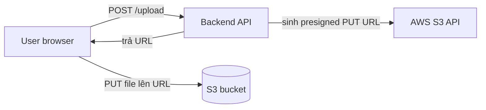

# 🎓 S3 chuyên sâu + Nền tảng IAM

> **Tác giả:** Mr.Rom\
> **Phiên bản:** v2.0.1\
> **Tạo lúc:** 24/05/2026\
> **Cập nhật:** 11/06/2026\
> **Level:** Basic\
> **Tags:** [MUST-KNOW]\
> **Yêu cầu trước:** [EC2 + EBS — Compute foundation](01_ec2-and-ebs-compute.md), [Cloud Security & Shared Responsibility Model](../../../cloud-fundamentals/lessons/01_basic/04_cloud-security-and-shared-responsibility.md)

> 🎯 *S3 là kho lưu trữ chủ lực của AWS — gần như mọi ứng dụng trên AWS đều đụng tới nó. Bài này đi sâu vào những phần bạn sẽ dùng hằng ngày: bucket policy, presigned URL, lifecycle, CORS, static website, versioning, encryption. Phần IAM dạy cách phân quyền đúng cho S3: users, roles, policies và các pattern thường gặp. Cuối bài bạn tự dựng được một static website và một luồng upload file an toàn cho frontend.*

## 🎯 Sau bài này bạn sẽ

- [ ] Tạo và quản lý S3 bucket (Console + CLI + SDK).
- [ ] Phân biệt **bucket policy** và **IAM policy** — khi nào dùng cái nào.
- [ ] Dùng **presigned URL** để cấp quyền truy cập có giới hạn thời gian.
- [ ] Dùng **lifecycle policy** để tự động chuyển object giữa các storage tier.
- [ ] Bật **versioning** và **MFA delete** để chống mất dữ liệu.
- [ ] Cấu hình **CORS** cho frontend upload trực tiếp.
- [ ] Dựng **static website hosting** kèm CloudFront.
- [ ] Hiểu ba kiểu **encryption**: SSE-S3 / SSE-KMS / Client-side.
- [ ] Dựng **IAM** users, roles, policies cho S3.
- [ ] Cho dịch vụ gọi dịch vụ an toàn — **EC2 đọc S3 qua IAM role** thay vì access key.

---

## Tình huống — Upload file từ frontend SPA lên S3

Hình dung bạn đang xây một app React, trong đó người dùng cần upload ảnh lên hệ thống. Mỗi tấm ảnh tầm 5 MB, không nhỏ. Cách làm "ngây thơ" là cho người dùng gửi file qua API backend, backend nhận xong rồi đẩy tiếp lên S3. Vấn đề là toàn bộ luồng dữ liệu nặng nề đó phải chui qua server của bạn — vừa nghẽn cổ chai, vừa tốn băng thông, vừa tốn tiền data transfer.

Cách tốt hơn là để frontend **upload thẳng lên S3**, không đi vòng qua backend. Nhưng làm vậy lại đẻ ra ba câu hỏi khó:

- Bucket thì *không nên* để public.
- Người dùng *không nên* cầm AWS credentials.
- Vậy phải có một cách cấp quyền truy cập tạm thời, an toàn.

Sếp đi ngang, gợi ý: *"Dùng pattern presigned URL của S3 đi. Backend phát cho frontend một URL có hạn dùng, người dùng tự upload thẳng lên S3 bằng URL đó. Bài này dạy đúng cái này."*

Đó chính là sợi chỉ xuyên suốt bài: đi sâu vào S3 và học cách phân quyền IAM cho đúng.

---

## 1️⃣ Ôn nhanh nền tảng S3

Trước khi đi sâu, ta gom lại vài khái niệm cốt lõi đã gặp ở cụm cloud-fundamentals (bài 03). Để dễ hình dung mối quan hệ giữa S3, IAM và presigned URL, dùng một ẩn dụ đời thường.

🪞 **Ẩn dụ**: *S3 như một **kho hàng tự phục vụ vô hạn** — bạn không cần quan tâm kệ nào, kho nào; bạn chỉ cần dán mã vạch (key) cho gói hàng (object). IAM là tấm thẻ ra-vào kho — ai cầm thẻ nào thì lấy được kệ nào; còn presigned URL là "vé một lần" để khách hàng tự vào lấy đúng gói hàng mà không cần cầm thẻ ra-vào.*

Ba khái niệm nền của S3:

- **Bucket** = thùng chứa cấp cao nhất, tên phải *unique toàn cầu* (không trùng với bất kỳ bucket nào trên thế giới).
- **Object** = dữ liệu kèm metadata, lưu dưới dạng cặp key + value.
- **Key** = "đường dẫn" của object trong bucket, ví dụ `2026/photos/cat.jpg`.

### Các dạng URL của S3

S3 có nhiều cách viết URL, và việc chọn đúng dạng quan trọng vì AWS đang loại dần dạng cũ:

```text
# Virtual hosted-style (khuyến nghị 2026)
https://bucket-name.s3.us-east-1.amazonaws.com/key
https://bucket-name.s3.amazonaws.com/key       (cũ hơn, deprecated)

# Path-style (deprecated từ 2020+, không còn cho bucket mới)
https://s3.us-east-1.amazonaws.com/bucket-name/key
```

Tóm lại: dùng *virtual hosted-style*. Dạng *path-style* đang bị khai tử dần nên không nên xài cho bucket mới.

### Các lệnh CLI cơ bản

Phần lớn thao tác hằng ngày với S3 đi qua nhóm lệnh `aws s3` — gọn và đủ dùng cho copy, sync, list, xoá:

```bash
# Tạo bucket
aws s3 mb s3://my-unique-bucket-name --region ap-southeast-1

# Upload
aws s3 cp local.txt s3://my-bucket/path/
aws s3 cp local-dir/ s3://my-bucket/folder/ --recursive

# Sync (hiệu quả — chỉ copy phần thay đổi)
aws s3 sync ./local s3://my-bucket/folder/

# Download
aws s3 cp s3://my-bucket/file.txt ./

# List
aws s3 ls s3://my-bucket/
aws s3 ls s3://my-bucket/folder/ --recursive --human-readable --summarize

# Delete
aws s3 rm s3://my-bucket/file.txt
aws s3 rb s3://my-bucket --force   # xoá bucket + toàn bộ nội dung

# Move
aws s3 mv s3://bucket/old.txt s3://bucket/new.txt
```

### Ví dụ với SDK (Python)

Khi viết app, bạn sẽ thao tác S3 qua SDK thay vì CLI. Đây là vài thao tác cơ bản với `boto3` — upload, download, list, delete, và sinh presigned URL (sẽ đào sâu ở phần kế):

```python
import boto3

s3 = boto3.client('s3')

# Upload
s3.upload_file('local.txt', 'my-bucket', 'remote.txt')

# Download
s3.download_file('my-bucket', 'remote.txt', 'local.txt')

# List
response = s3.list_objects_v2(Bucket='my-bucket', Prefix='folder/')
for obj in response.get('Contents', []):
    print(obj['Key'], obj['Size'])

# Delete
s3.delete_object(Bucket='my-bucket', Key='remote.txt')

# Sinh presigned URL (phần sau sẽ đào sâu)
url = s3.generate_presigned_url(
    'get_object',
    Params={'Bucket': 'my-bucket', 'Key': 'remote.txt'},
    ExpiresIn=3600   # 1 giờ
)
```

---

## 2️⃣ Bucket policy và IAM policy

Câu hỏi đầu tiên ai mới vào S3 cũng vướng: phân quyền thì đặt ở đâu? AWS có *hai* hệ thống policy cùng tồn tại, và hiểu rõ chúng khác nhau ở góc nhìn nào là chìa khoá.

**IAM policy** (gắn vào user/role/group) trả lời câu hỏi: "**Danh tính này** được làm gì?" — ví dụ: alice được đọc bucket-A.

**Bucket policy** (gắn vào chính bucket) trả lời câu hỏi: "Ai được làm gì với **bucket này**?" — ví dụ: bucket-A cho phép public đọc thư mục `/static/*`.

Cả hai đều có thể cấp (allow) hoặc chặn (deny), và AWS **đánh giá cả hai** khi quyết định một request có được phép hay không.

### Ví dụ bucket policy

Đây là một bucket policy điển hình làm hai việc cùng lúc: cho public đọc thư mục `/static/*`, đồng thời chặn mọi truy cập không qua HTTPS:

```json
{
  "Version": "2012-10-17",
  "Statement": [
    {
      "Sid": "AllowPublicReadStatic",
      "Effect": "Allow",
      "Principal": "*",
      "Action": "s3:GetObject",
      "Resource": "arn:aws:s3:::my-bucket/static/*"
    },
    {
      "Sid": "DenyInsecureTransport",
      "Effect": "Deny",
      "Principal": "*",
      "Action": "s3:*",
      "Resource": [
        "arn:aws:s3:::my-bucket",
        "arn:aws:s3:::my-bucket/*"
      ],
      "Condition": {
        "Bool": { "aws:SecureTransport": "false" }
      }
    }
  ]
}
```

Statement đầu cho phép public đọc `/static/*`; statement sau dùng `Deny` để chặn mọi request HTTP (không mã hoá đường truyền). Áp policy này lên bucket:

```bash
aws s3api put-bucket-policy --bucket my-bucket --policy file://policy.json
```

### Ví dụ IAM policy

Ngược lại, IAM policy gắn vào danh tính. Ví dụ dưới giới hạn mỗi user chỉ truy cập được đúng thư mục mang ID của chính họ, nhờ placeholder `${aws:userid}`:

```json
{
  "Version": "2012-10-17",
  "Statement": [{
    "Effect": "Allow",
    "Action": ["s3:GetObject", "s3:PutObject"],
    "Resource": "arn:aws:s3:::my-bucket/users/${aws:userid}/*"
  }]
}
```

Biến `${aws:userid}` được AWS thay bằng ID thật của user lúc chạy, nên một policy duy nhất phục vụ được mọi user mà ai cũng chỉ chạm tới thư mục riêng.

### Khi nào dùng cái nào?

Bảng dưới gom các tình huống thường gặp để bạn chọn nhanh — phần lớn ranh giới rất rõ:

| Tình huống | Dùng |
|---|---|
| Cho một số object public | Bucket policy |
| Cấp quyền truy cập cross-account | Bucket policy (với principal của account kia) |
| Cấp quyền cho IAM user cụ thể | IAM policy gắn vào user |
| Bắt buộc HTTPS | Bucket policy (deny non-HTTPS) |
| Bắt buộc encryption | Bucket policy (deny PUT chưa mã hoá) |
| Cấp quyền cho service role | IAM policy gắn vào role |

Trên thực tế **dùng cả hai cùng lúc** là chuyện rất phổ biến: bucket policy đặt ra ranh giới chung của bucket, còn IAM policy cấp quyền cụ thể cho từng danh tính.

### Block Public Access (BPA)

Có một "công tắc an toàn" mạnh hơn cả policy. **Block Public Access** là lớp chặn ở *cấp account và cấp bucket*, **chặn mọi truy cập public bất chấp policy** ghi gì:

```bash
aws s3api put-public-access-block --bucket my-bucket \
  --public-access-block-configuration \
    BlockPublicAcls=true,IgnorePublicAcls=true,BlockPublicPolicy=true,RestrictPublicBuckets=true
```

Nghĩa là dù bucket policy có ghi `"Principal": "*"`, BPA vẫn chặn — đây chính là cơ chế "an toàn mặc định" để tránh lỡ tay làm lộ bucket. Lời khuyên: **bật BPA toàn account ngay từ Day 1** như một baseline.

---

## 3️⃣ Presigned URL — truy cập tạm thời an toàn

Quay lại đúng bài toán mở đầu: cho phép người dùng upload/download mà không cần cầm credentials, không cần để bucket public. Presigned URL chính là lời giải.

### Bối cảnh

Người dùng cần upload ảnh qua frontend, nhưng:

- Người dùng không có AWS credentials.
- Bucket để private.
- Backend sẽ phát cho họ một URL có hạn dùng để upload hoặc download.

### Luồng hoạt động

Sơ đồ dưới mô tả vòng đời một lần upload qua presigned URL — backend chỉ phát URL, còn dữ liệu nặng đi thẳng từ trình duyệt lên S3:



### Sinh presigned URL

Phía backend, `boto3` sinh URL bằng `generate_presigned_url`. Lưu ý sự khác biệt giữa URL để *download* (`get_object`) và để *upload* (`put_object`), cũng như thời hạn (`ExpiresIn`) nên đặt ngắn hơn cho upload:

```python
import boto3
s3 = boto3.client('s3')

# Presigned GET (download)
url = s3.generate_presigned_url(
    ClientMethod='get_object',
    Params={
        'Bucket': 'my-bucket',
        'Key': 'photos/cat.jpg'
    },
    ExpiresIn=3600   # 1 giờ
)

# Presigned PUT (upload)
upload_url = s3.generate_presigned_url(
    ClientMethod='put_object',
    Params={
        'Bucket': 'my-bucket',
        'Key': f'uploads/{user_id}/{filename}',
        'ContentType': 'image/jpeg',
    },
    ExpiresIn=600   # 10 phút
)
```

### Endpoint FastAPI mẫu

Trong một app thật, bạn gói việc sinh URL vào một endpoint. Endpoint dưới nhận tên file + content-type, tạo key gắn với user, rồi trả về presigned PUT URL kèm thông tin để frontend dùng tiếp:

```python
from fastapi import FastAPI
from pydantic import BaseModel
import boto3, uuid

app = FastAPI()
s3 = boto3.client('s3')

class UploadRequest(BaseModel):
    filename: str
    content_type: str

@app.post("/api/upload-url")
async def get_upload_url(req: UploadRequest, current_user_id: str):
    object_key = f"uploads/{current_user_id}/{uuid.uuid4()}-{req.filename}"
    
    url = s3.generate_presigned_url(
        'put_object',
        Params={
            'Bucket': 'my-bucket',
            'Key': object_key,
            'ContentType': req.content_type,
        },
        ExpiresIn=600
    )
    
    return {
        'upload_url': url,
        'object_key': object_key,
        'expires_in': 600
    }
```

### Phía frontend upload

Frontend làm ba bước: xin URL từ backend, PUT file thẳng lên S3 bằng URL đó, rồi báo backend là đã xong:

```javascript
// 1. Lấy presigned URL từ backend
const { upload_url, object_key } = await fetch('/api/upload-url', {
  method: 'POST',
  body: JSON.stringify({
    filename: file.name,
    content_type: file.type
  }),
  headers: { 'Content-Type': 'application/json' }
}).then(r => r.json());

// 2. Upload thẳng lên S3
await fetch(upload_url, {
  method: 'PUT',
  body: file,
  headers: { 'Content-Type': file.type }
});

// 3. Báo backend đã upload xong
await fetch('/api/upload-complete', {
  method: 'POST',
  body: JSON.stringify({ object_key })
});
```

### Presigned POST (cho upload từ trình duyệt)

Có một biến thể mạnh hơn cho trình duyệt: **presigned POST**. Khác presigned URL thường ở chỗ nó dùng *multipart form* thân thiện với browser, và quan trọng hơn là cho phép đặt *điều kiện* (giới hạn content-type, giới hạn kích thước) ngay tại server:

```python
post = s3.generate_presigned_post(
    Bucket='my-bucket',
    Key=f'uploads/{uuid.uuid4()}',
    Conditions=[
        ['content-length-range', 0, 5_000_000],   # tối đa 5 MB
        ['starts-with', '$Content-Type', 'image/']
    ],
    ExpiresIn=600
)
```

```javascript
const formData = new FormData();
Object.entries(post.fields).forEach(([k, v]) => formData.append(k, v));
formData.append('file', file);

await fetch(post.url, { method: 'POST', body: formData });
```

Cái hay là giới hạn dung lượng và kiểu file được S3 *bắt buộc ở phía server*, không phụ thuộc vào frontend có trung thực hay không.

### Vì sao đáng dùng pattern này

So sánh hai cách để thấy lợi ích rất rõ. **Không có presigned URL**, dữ liệu đi qua backend:

- Luồng: User → API → backend → S3.
- Backend phải gánh hàng GB traffic mỗi lần upload.
- Tốn cả tiền data transfer lẫn thời gian xử lý của API server.

**Có presigned URL**, backend đứng ngoài luồng dữ liệu nặng:

- User gọi API (request nhỏ) chỉ để xin URL.
- User upload thẳng lên S3.
- Backend xử lý 0 byte dữ liệu upload.

Kết quả: hệ thống scale tốt hơn và rẻ hơn — backend không còn là nút thắt băng thông.

---

## 4️⃣ Lifecycle policy

Dữ liệu thường "nguội" dần theo thời gian: log của hôm nay rất cần, log một năm trước thì hiếm khi đụng tới. Lifecycle policy cho phép tự động chuyển object sang các storage tier rẻ hơn theo tuổi, và xoá khi hết hạn — không cần ai đụng tay.

### Chuyển object qua các storage tier

Cấu hình dưới chuyển log từ Standard sang Standard-IA sau 30 ngày, xuống Glacier IR sau 90 ngày, vào Deep Archive sau 1 năm, và xoá hẳn sau 7 năm:

```json
{
  "Rules": [
    {
      "Id": "AutoTiering",
      "Status": "Enabled",
      "Filter": { "Prefix": "logs/" },
      "Transitions": [
        { "Days": 30, "StorageClass": "STANDARD_IA" },
        { "Days": 90, "StorageClass": "GLACIER_IR" },
        { "Days": 365, "StorageClass": "DEEP_ARCHIVE" }
      ],
      "Expiration": {
        "Days": 2555
      },
      "NoncurrentVersionExpiration": {
        "NoncurrentDays": 90
      }
    }
  ]
}
```

Lưu ý con số `2555` ngày tương đương 7 năm — đây là mốc giữ lại thường dùng cho yêu cầu *compliance* (tuân thủ). Áp policy:

```bash
aws s3api put-bucket-lifecycle-configuration \
  --bucket my-bucket \
  --lifecycle-configuration file://lifecycle.json
```

### Các pattern thường gặp

Tùy loại dữ liệu mà vòng đời hợp lý khác nhau. Dưới đây là vài khuôn mẫu hay dùng:

**Logs**:
- Ngày 0–30: Standard (nóng, còn cần debug gần đây).
- Ngày 30–90: Standard-IA.
- Ngày 90–365: Glacier Instant Retrieval.
- Ngày 365+: Deep Archive.
- Ngày 2555 (7 năm): xoá.

**User uploads**:
- Ngày 0–90: Standard.
- Ngày 90+: Intelligent-Tiering (tự chọn tier).

**Backups**:
- Ngày 0–30: Standard.
- Ngày 30+: Glacier Instant.
- Ngày 365+: Deep Archive.
- Giữ vô thời hạn (hoặc theo cửa sổ compliance).

**Temp files**:
- Ngày 7: xoá.

Áp dụng đúng lifecycle có thể cắt **50–80% chi phí lưu trữ** so với để mọi thứ nằm mãi ở tier Standard.

---

## 5️⃣ Versioning và MFA Delete

Một sự cố kinh điển: ai đó lỡ tay ghi đè hoặc xoá nhầm file quan trọng, và không còn cách lấy lại. Versioning sinh ra để chống đúng nỗi đau này.

### Versioning

Bật versioning cho bucket bằng một lệnh:

```bash
aws s3api put-bucket-versioning \
  --bucket my-bucket \
  --versioning-configuration Status=Enabled
```

Sau khi bật, hành vi của bucket thay đổi như sau:

- Mỗi lần PUT tạo ra một version mới (không ghi đè bản cũ).
- Khi DELETE, S3 chỉ đặt một *delete marker* — file "trông như đã biến mất" nhưng version cũ vẫn còn đó.
- Khôi phục: copy version cũ trở lại làm bản hiện hành.

```bash
# Liệt kê các version
aws s3api list-object-versions --bucket my-bucket --prefix file.txt

# Khôi phục một version cụ thể
aws s3 cp s3://my-bucket/file.txt?versionId=abc s3://my-bucket/file.txt
```

### Khi nào hữu ích

- **Khôi phục khi xoá nhầm**: lấy lại version trước đó.
- **Compliance**: có dấu vết kiểm toán cho mọi thay đổi.
- **Giảm thiệt hại do ransomware**: các version trước-khi-bị-mã-hoá vẫn còn nguyên.

### Cái giá phải trả

Cẩn thận điểm này: mỗi version được lưu *riêng*. 100 version của một file 1 MB sẽ ngốn 100 MB. Vì vậy nên kết hợp versioning với lifecycle để đẩy version cũ xuống tier rẻ rồi xoá dần:

```json
{
  "Rules": [
    {
      "Id": "NoncurrentVersionTiering",
      "Status": "Enabled",
      "NoncurrentVersionTransitions": [
        { "NoncurrentDays": 30, "StorageClass": "GLACIER_IR" }
      ],
      "NoncurrentVersionExpiration": {
        "NoncurrentDays": 365
      }
    }
  ]
}
```

Hiệu quả: version cũ tự trôi xuống Glacier rồi cuối cùng bị xoá — vừa an toàn vừa không phình chi phí.

### MFA Delete

Khi cần thêm một lớp bảo vệ cho thao tác xoá, bật MFA Delete — muốn xoá vĩnh viễn một version thì phải nhập mã MFA:

```bash
aws s3api put-bucket-versioning \
  --bucket my-bucket \
  --versioning-configuration Status=Enabled,MFADelete=Enabled \
  --mfa "arn:aws:iam::ACCOUNT:mfa/user 123456"
```

Cơ chế này rất hợp cho compliance và chống ransomware: kẻ tấn công có credentials cũng không xoá được dữ liệu nếu thiếu thiết bị MFA.

⚠️ Chỉ bật được qua tài khoản root. Việc tắt MFA Delete cũng đòi hỏi MFA — cân nhắc kỹ trước khi bật.

---

## 6️⃣ CORS cho frontend upload

Ngay khi bạn cho frontend gọi thẳng S3 (như pattern presigned URL ở trên), một rào cản của trình duyệt sẽ hiện ra: CORS.

### Vấn đề

Trình duyệt mặc định chặn các request *cross-origin*. Frontend ở `app.acmeshop.vn` gọi sang S3 `my-bucket.s3.amazonaws.com` là khác origin → trình duyệt báo lỗi CORS.

### Giải pháp: cấu hình CORS

Bạn khai báo cho bucket biết origin nào được phép gọi, với những method và header nào:

```json
[
  {
    "AllowedOrigins": ["https://app.acmeshop.vn"],
    "AllowedMethods": ["GET", "PUT", "POST", "DELETE", "HEAD"],
    "AllowedHeaders": ["*"],
    "ExposeHeaders": ["ETag"],
    "MaxAgeSeconds": 3000
  }
]
```

```bash
aws s3api put-bucket-cors \
  --bucket my-bucket \
  --cors-configuration file://cors.json
```

### Vài điểm hay nhầm về CORS

Có mấy chỗ tinh tế dễ vấp khi cấu hình CORS:

- `AllowedOrigins` phải kèm schema (`https://`), không chỉ ghi tên miền trơn.
- `MaxAgeSeconds` là thời gian trình duyệt cache lại kết quả *preflight*.
- Preflight là request `OPTIONS` mà trình duyệt tự gửi *trước* request thật để hỏi quyền.
- Có hỗ trợ wildcard `*`, nhưng liệt kê origin cụ thể vẫn an toàn hơn.

### Kiểm tra trong trình duyệt

CORS là chuyện của trình duyệt, nên phải test bằng trình duyệt — `curl` sẽ không tái hiện được lỗi này:

```javascript
// Console của trình duyệt
fetch('https://my-bucket.s3.amazonaws.com/file.txt')
  .then(r => r.text())
  .then(console.log);
// Báo lỗi CORS nếu origin không nằm trong danh sách cho phép.
```

Nhớ: cấu hình CORS một lần cho mỗi bucket, và luôn kiểm chứng trong trình duyệt chứ không phải bằng `curl`.

---

## 7️⃣ Host web tĩnh (Static website hosting)

S3 không chỉ để chứa file — nó còn có thể *phục vụ* luôn một website tĩnh (HTML/CSS/JS) mà bạn không cần dựng server nào cả.

### Bối cảnh

Bạn có một site tĩnh (blog, landing page) và muốn đưa nó lên mạng nhanh, rẻ, không phải nuôi server.

### Cách dựng

Ba bước: bật chế độ static hosting, gắn bucket policy cho public đọc, và tắt Block Public Access (cẩn thận với bước này):

```bash
# Bật static hosting
aws s3 website s3://my-bucket/ \
  --index-document index.html \
  --error-document error.html

# Bucket policy (public read)
aws s3api put-bucket-policy --bucket my-bucket --policy '{
  "Version": "2012-10-17",
  "Statement": [{
    "Sid": "PublicRead",
    "Effect": "Allow",
    "Principal": "*",
    "Action": "s3:GetObject",
    "Resource": "arn:aws:s3:::my-bucket/*"
  }]
}'

# Tắt Block Public Access (cẩn thận!)
aws s3api put-public-access-block --bucket my-bucket \
  --public-access-block-configuration \
    BlockPublicAcls=false,IgnorePublicAcls=false,BlockPublicPolicy=false,RestrictPublicBuckets=false
```

Sau đó truy cập qua URL dạng: `http://my-bucket.s3-website-us-east-1.amazonaws.com`.

### Hạn chế khi dùng S3 static hosting một mình

Dựng nhanh thật, nhưng riêng S3 static hosting có vài giới hạn lớn:

- Chỉ **HTTP** (không có HTTPS).
- Không gắn được TLS cho custom domain.
- Không có CDN.
- Không chạy được logic ở edge.

### Giải pháp: đặt CloudFront ở phía trước

Cách làm chuẩn là để CloudFront đứng trước S3, lo phần HTTPS + CDN, còn bucket thì để private:

```text
User → CloudFront (CDN, HTTPS) → S3 bucket (private, qua OAI)
```

```bash
# 1. Tạo CloudFront distribution trỏ về S3
# 2. Dùng Origin Access Identity (OAI) để S3 chỉ truy cập được qua CloudFront
# 3. Thêm custom domain + ACM certificate
# 4. Bật Block Public Access trên S3 (chỉ CloudFront có quyền vào)
```

Lúc này bucket chỉ cho phép đúng "danh tính" CloudFront đọc, nhờ một bucket policy với OAI:

```json
{
  "Statement": [{
    "Effect": "Allow",
    "Principal": {
      "AWS": "arn:aws:iam::cloudfront:user/CloudFront Origin Access Identity ABC123"
    },
    "Action": "s3:GetObject",
    "Resource": "arn:aws:s3:::my-bucket/*"
  }]
}
```

Đây chính là **pattern hiện đại**: CloudFront + S3 qua OAI, và bật Block Public Access trên bucket.

### Lựa chọn khác cho việc host SPA

Nếu bạn chỉ host một SPA và không cần dính chặt vào AWS, có vài lựa chọn dễ thở hơn:

- **Vercel / Netlify**: gọn hơn (CDN + deploy theo git có sẵn).
- **AWS Amplify**: dịch vụ host SPA của chính AWS.
- **Cloudflare Pages**: CDN kèm edge function.

S3 + CloudFront vẫn chạy tốt, chỉ là cần thiết lập nhiều bước hơn.

---

## 8️⃣ Mã hoá (Encryption)

Câu hỏi cuối về S3: dữ liệu nằm trong bucket có được mã hoá không, và ai giữ chìa khoá? S3 có nhiều kiểu encryption, khác nhau chủ yếu ở chỗ *ai quản lý key*.

### Server-side encryption (SSE)

Ba kiểu SSE phổ biến, đi từ "AWS lo hết" tới "bạn lo hết":

**SSE-S3** (mặc định 2026):
- AWS quản lý key.
- Miễn phí.
- Dùng cho: phần lớn dữ liệu thông thường.

**SSE-KMS**:
- Dùng key quản lý qua KMS.
- Có audit log cho từng lần truy cập.
- Hỗ trợ BYOK (mang key của bạn vào).
- Dùng cho: dữ liệu PII, PHI, cần compliance.

**SSE-C**:
- Bạn cung cấp key theo từng request.
- AWS không lưu key.
- Dùng cho: dữ liệu cực nhạy cảm, bạn tự quản key ngoài AWS.

### Bật encryption mặc định

Để mọi object upload lên đều tự được mã hoá, bật default encryption ở cấp bucket. Ví dụ dưới dùng KMS:

```bash
aws s3api put-bucket-encryption --bucket my-bucket \
  --server-side-encryption-configuration '{
    "Rules": [{
      "ApplyServerSideEncryptionByDefault": {
        "SSEAlgorithm": "aws:kms",
        "KMSMasterKeyID": "arn:aws:kms:..."
      },
      "BucketKeyEnabled": true
    }]
  }'
```

Từ đây mọi upload tự động được mã hoá bằng KMS, không phụ thuộc client có nhớ đặt header hay không.

### Ép buộc mã hoá khi upload

Muốn chắc ăn hơn nữa, dùng bucket policy để *từ chối* mọi PUT không kèm header mã hoá đúng:

```json
{
  "Effect": "Deny",
  "Action": "s3:PutObject",
  "Resource": "arn:aws:s3:::my-bucket/*",
  "Condition": {
    "StringNotEquals": {
      "s3:x-amz-server-side-encryption": "aws:kms"
    }
  }
}
```

Request upload nào thiếu header mã hoá sẽ bị từ chối thẳng.

### Client-side encryption

Ở mức bảo vệ cao nhất, bạn mã hoá *trước khi* upload và giải mã *sau khi* download — AWS không bao giờ thấy dữ liệu gốc:

```python
from cryptography.fernet import Fernet

key = Fernet.generate_key()
cipher = Fernet(key)

# Encrypt
encrypted = cipher.encrypt(b"secret data")
s3.put_object(Bucket='my-bucket', Key='encrypted.bin', Body=encrypted)

# Decrypt
obj = s3.get_object(Bucket='my-bucket', Key='encrypted.bin')
decrypted = cipher.decrypt(obj['Body'].read())
```

Với cách này, AWS chỉ nhìn thấy một khối dữ liệu đã mã hoá — đảm bảo mạnh nhất, đổi lại bạn phải tự gánh trách nhiệm quản lý key.

---

## 9️⃣ IAM cho S3 chuyên sâu

Tới đây ta đã chạm IAM rải rác qua từng phần. Giờ gom lại thành một bức tranh đầy đủ: ai là "danh tính" trong AWS, policy cấu trúc ra sao, và các pattern phân quyền thực chiến.

### Các loại danh tính IAM

**User**: con người, có password + access key.
**Group**: một nhóm các user.
**Role**: được "đeo vào" bởi dịch vụ (EC2, Lambda) hoặc bởi user (cho cross-account).

### Cấu trúc một policy

Mọi IAM policy đều theo cùng một khung: hành động gì (`Action`), trên tài nguyên nào (`Resource`), cho phép hay chặn (`Effect`), kèm điều kiện tuỳ chọn (`Condition`):

```json
{
  "Version": "2012-10-17",
  "Statement": [
    {
      "Sid": "OptionalIdentifier",
      "Effect": "Allow",
      "Action": ["s3:GetObject"],
      "Resource": "arn:aws:s3:::my-bucket/*",
      "Condition": {
        "IpAddress": { "aws:SourceIp": "1.2.3.4/32" }
      }
    }
  ]
}
```

Trường `Effect` nhận giá trị `Allow` hoặc `Deny`; ví dụ trên còn thêm `Condition` để chỉ cho phép truy cập từ một IP cụ thể.

### Các IAM policy cho S3 hay gặp

Dưới đây là ba khuôn policy bạn sẽ viết đi viết lại trong thực tế.

**User chỉ đọc (read-only) S3**:
```json
{
  "Effect": "Allow",
  "Action": [
    "s3:GetObject",
    "s3:ListBucket"
  ],
  "Resource": [
    "arn:aws:s3:::my-bucket",
    "arn:aws:s3:::my-bucket/*"
  ]
}
```

**App cần đọc/ghi đúng một prefix**:
```json
{
  "Effect": "Allow",
  "Action": ["s3:GetObject", "s3:PutObject", "s3:DeleteObject"],
  "Resource": "arn:aws:s3:::my-bucket/app-data/*"
}
```

**Mỗi user một thư mục riêng**:
```json
{
  "Effect": "Allow",
  "Action": ["s3:GetObject", "s3:PutObject"],
  "Resource": "arn:aws:s3:::my-bucket/users/${aws:userid}/*"
}
```

Placeholder `${aws:userid}` được thay bằng ID thật của user lúc chạy, nên cùng một policy phục vụ mọi user mà ai cũng chỉ thấy thư mục của mình.

### EC2 đọc S3 qua IAM role

Đây là điểm quan trọng nhất của cả phần IAM: **đừng nhét access key vào EC2**. Thay vào đó, gắn một IAM role cho instance. Cấu hình Terraform dưới tạo role cho EC2 *assume*, cấp quyền S3, rồi gắn qua *instance profile*:

```hcl
resource "aws_iam_role" "app" {
  name = "app-role"
  assume_role_policy = jsonencode({
    Statement = [{
      Effect = "Allow"
      Principal = { Service = "ec2.amazonaws.com" }
      Action = "sts:AssumeRole"
    }]
  })
}

resource "aws_iam_role_policy" "s3" {
  role = aws_iam_role.app.id
  policy = jsonencode({
    Statement = [{
      Effect = "Allow"
      Action = ["s3:GetObject", "s3:PutObject"]
      Resource = "arn:aws:s3:::my-bucket/*"
    }]
  })
}

resource "aws_iam_instance_profile" "app" {
  name = "app-profile"
  role = aws_iam_role.app.name
}

resource "aws_instance" "app" {
  iam_instance_profile = aws_iam_instance_profile.app.name
  # Không cần access key!
}
```

Bên trong EC2, SDK tự lấy credentials tạm thời từ *instance metadata* — bạn không phải truyền key vào đâu cả:

```python
import boto3
# SDK tự lấy credentials từ instance metadata
s3 = boto3.client('s3')
s3.get_object(Bucket='my-bucket', Key='file.txt')
```

Lợi ích kép: credentials được tự động xoay vòng và không có key nào bị rò rỉ vì chẳng có key nào để rò.

### Lambda + S3 IAM

Lambda cũng theo đúng tinh thần đó — gắn một execution role thay vì access key. Role dưới vừa có quyền ghi log (qua managed policy có sẵn) vừa được đọc S3:

```hcl
resource "aws_iam_role" "lambda" {
  assume_role_policy = jsonencode({
    Statement = [{
      Effect = "Allow"
      Principal = { Service = "lambda.amazonaws.com" }
      Action = "sts:AssumeRole"
    }]
  })
}

resource "aws_iam_role_policy_attachment" "lambda_logs" {
  role = aws_iam_role.lambda.name
  policy_arn = "arn:aws:iam::aws:policy/service-role/AWSLambdaBasicExecutionRole"
}

resource "aws_iam_role_policy" "lambda_s3" {
  role = aws_iam_role.lambda.id
  policy = jsonencode({
    Statement = [{
      Effect = "Allow"
      Action = ["s3:GetObject"]
      Resource = "arn:aws:s3:::my-bucket/*"
    }]
  })
}
```

### Truy cập cross-account

Khi account B cần đọc bucket của account A, phải cấu hình *hai* phía. Bucket policy ở Account A cho phép principal của Account B:

```json
{
  "Effect": "Allow",
  "Principal": { "AWS": "arn:aws:iam::ACCOUNT_B:root" },
  "Action": ["s3:GetObject", "s3:PutObject"],
  "Resource": "arn:aws:s3:::my-bucket/*"
}
```

Đồng thời user/role ở Account B cũng phải có IAM policy cấp quyền truy cập bucket đó. Quy tắc cần nhớ: cross-account đòi **cả** bucket policy (Account A) **lẫn** IAM policy (Account B) — thiếu một bên là không vào được.

---

## 🔟 Hands-on: Static blog + upload file an toàn

Giờ ráp mọi mảnh ghép lại thành một hệ thống chạy thật. Mục tiêu gồm hai phần: một static website (blog) trên S3 + CloudFront, và một luồng upload file an toàn qua presigned URL.

### Phần 1: Static website

Đầu tiên tạo bucket với tên unique (gắn account ID để tránh trùng), rồi sync site lên kèm thiết lập cache hợp lý — asset tĩnh cache dài, file thường cache ngắn:

```bash
# Tạo bucket
BUCKET=acme-blog-$(aws sts get-caller-identity --query Account --output text)
aws s3 mb s3://$BUCKET --region ap-southeast-1

# Upload site
aws s3 sync ./dist s3://$BUCKET/ \
  --cache-control "public, max-age=3600" \
  --metadata-directive REPLACE

# Riêng asset tĩnh — cache dài hơn
aws s3 sync ./dist/assets s3://$BUCKET/assets/ \
  --cache-control "public, max-age=31536000, immutable"
```

### Đặt CloudFront ở phía trước

Tiếp theo dựng CloudFront với OAI để chỉ CloudFront truy cập được S3, đồng thời bucket vẫn private:

```bash
# 1. Tạo CloudFront Origin Access Identity (OAI)
OAI_ID=$(aws cloudfront create-cloud-front-origin-access-identity \
  --cloud-front-origin-access-identity-config \
    CallerReference=$(date +%s),Comment="OAI for blog" \
  --query 'CloudFrontOriginAccessIdentity.Id' \
  --output text)

# 2. Bucket policy chỉ cho phép CloudFront
aws s3api put-bucket-policy --bucket $BUCKET --policy "{
  \"Version\": \"2012-10-17\",
  \"Statement\": [{
    \"Effect\": \"Allow\",
    \"Principal\": {
      \"AWS\": \"arn:aws:iam::cloudfront:user/CloudFront Origin Access Identity $OAI_ID\"
    },
    \"Action\": \"s3:GetObject\",
    \"Resource\": \"arn:aws:s3:::$BUCKET/*\"
  }]
}"

# 3. Tạo distribution (qua Console hoặc JSON chi tiết)
# blog.acmeshop.vn → CloudFront → $BUCKET

# 4. Custom domain qua ACM cert + Route 53 alias
```

Thành quả: `https://blog.acmeshop.vn` chạy với HTTPS, có CDN, độ trễ thấp và chi phí thấp.

### Phần 2: Backend upload file

Phần upload tái dùng đúng pattern presigned URL đã học, đóng gói thành hai endpoint — một sinh URL upload, một sinh URL download:

`upload_api.py`:
```python
from fastapi import FastAPI
from pydantic import BaseModel
import boto3, uuid

app = FastAPI()
s3 = boto3.client('s3')
UPLOAD_BUCKET = 'acme-uploads'

class UploadReq(BaseModel):
    filename: str
    content_type: str

@app.post("/api/upload-url")
async def generate_upload_url(req: UploadReq, user_id: str = "demo"):
    key = f"uploads/{user_id}/{uuid.uuid4()}/{req.filename}"
    
    url = s3.generate_presigned_url(
        'put_object',
        Params={
            'Bucket': UPLOAD_BUCKET,
            'Key': key,
            'ContentType': req.content_type,
        },
        ExpiresIn=600
    )
    
    return {'upload_url': url, 'object_key': key}

@app.get("/api/download-url")
async def generate_download_url(key: str):
    url = s3.generate_presigned_url(
        'get_object',
        Params={'Bucket': UPLOAD_BUCKET, 'Key': key},
        ExpiresIn=3600
    )
    return {'download_url': url}
```

Chạy bằng uvicorn:
```bash
uvicorn upload_api:app --host 0.0.0.0 --port 8000
```

### Cấu hình bucket cho upload

Bucket nhận upload cần được "siết" đúng cách ngay từ đầu: chặn public, bật CORS cho frontend, mã hoá mặc định, và lifecycle để dọn file cũ:

```bash
aws s3 mb s3://acme-uploads --region ap-southeast-1

# Chặn public access
aws s3api put-public-access-block --bucket acme-uploads \
  --public-access-block-configuration \
    BlockPublicAcls=true,IgnorePublicAcls=true,BlockPublicPolicy=true,RestrictPublicBuckets=true

# CORS cho frontend
aws s3api put-bucket-cors --bucket acme-uploads --cors-configuration '{
  "CORSRules": [{
    "AllowedOrigins": ["https://app.acmeshop.vn"],
    "AllowedMethods": ["GET", "PUT", "POST", "HEAD"],
    "AllowedHeaders": ["*"],
    "MaxAgeSeconds": 3000
  }]
}'

# Encryption
aws s3api put-bucket-encryption --bucket acme-uploads \
  --server-side-encryption-configuration '{
    "Rules": [{
      "ApplyServerSideEncryptionByDefault": { "SSEAlgorithm": "AES256" }
    }]
  }'

# Lifecycle (dọn upload cũ sau 30 ngày để tiết kiệm)
aws s3api put-bucket-lifecycle-configuration --bucket acme-uploads --lifecycle-configuration '{
  "Rules": [{
    "Id": "ExpireAfter30Days",
    "Status": "Enabled",
    "Filter": { "Prefix": "uploads/" },
    "Expiration": { "Days": 30 }
  }]
}'
```

### Test phía frontend

Cuối cùng, một đoạn frontend tối giản để chạy thử cả vòng: xin URL, PUT file thẳng lên S3:

```html
<script>
async function uploadFile(file) {
  const { upload_url, object_key } = await fetch('/api/upload-url', {
    method: 'POST',
    body: JSON.stringify({ filename: file.name, content_type: file.type }),
    headers: { 'Content-Type': 'application/json' }
  }).then(r => r.json());
  
  await fetch(upload_url, {
    method: 'PUT',
    body: file,
    headers: { 'Content-Type': file.type }
  });
  
  console.log('Uploaded to:', object_key);
}
</script>
```

Đúng như mục tiêu: file đi từ trình duyệt → presigned URL → thẳng lên S3, backend xử lý 0 byte dữ liệu upload.

---

## 💡 Cạm bẫy thường gặp & Best practice

### ❌ Cạm bẫy: Lộ bucket S3 public

Kịch bản kinh điển: "để public cho dễ test" rồi quên tắt → dữ liệu PII bị lộ ra ngoài.

→ **Cách chữa**:
- Bật Block Public Access toàn account.
- Dùng CloudFront + OAI thay vì để bucket public.
- Bật AWS Config rule để phát hiện bucket public.
- Audit định kỳ hằng quý.

### ❌ Cạm bẫy: Access key sống lâu nằm trong app

App cắm access key cứng trong biến môi trường. Key rò ra ngoài → cả AWS account bị chiếm.

→ **Cách chữa**:
- EC2: dùng IAM role (instance profile).
- Lambda: dùng execution role.
- Dev local: dùng credentials tạm thời qua SSO.
- CI/CD: dùng OIDC federation.
- **Tuyệt đối không** để access key trong code, env hay file config.

### ❌ Cạm bẫy: Presigned URL không hạn dùng hoặc hạn quá dài

```python
generate_presigned_url(..., ExpiresIn=604800)   # 7 ngày!
```

URL mà lộ ra ngoài thì kẻ xấu có nguyên một cửa sổ 7 ngày để lạm dụng.

→ **Cách chữa**: đặt hạn 10–60 phút là đủ — vừa đúng cho thao tác cần làm.

### ❌ Cạm bẫy: Không có lifecycle policy

Log chất đống vô thời hạn, hoá đơn cứ thế phình ra.

→ **Cách chữa**: gắn lifecycle policy ngay từ Day 1.

### ❌ Cạm bẫy: Bucket quan trọng không bật versioning

Người dùng lỡ tay xoá → dữ liệu mất luôn, không lấy lại được.

→ **Cách chữa**: bật versioning, kèm lifecycle để dọn version cũ.

### ❌ Cạm bẫy: Trùng tên bucket

`mybucket` đã có người lấy → gặp lỗi "BucketAlreadyExists" hoặc "AccessDenied".

→ **Cách chữa**: đặt tên theo quy ước unique, ví dụ `{org}-{purpose}-{account-id}`.

### ❌ Cạm bẫy: Không ép buộc HTTPS

Bucket cho phép request HTTP → dữ liệu truyền dưới dạng plaintext.

→ **Cách chữa**: bucket policy deny khi `aws:SecureTransport=false`.

### ❌ Cạm bẫy: Không bật encryption mặc định

Một số object lọt qua mà chưa được mã hoá.

→ **Cách chữa**: bật default encryption ở cấp bucket.

### ✅ Best practice: BPA + KMS + HTTPS ngay Day 1

Mỗi bucket khi vừa tạo nên có ngay:
1. Bật Block Public Access.
2. Bật default encryption (SSE-S3 hoặc SSE-KMS).
3. Bật versioning (với bucket quan trọng).
4. Bucket policy deny non-HTTPS.
5. Lifecycle policy để dọn dẹp.
6. Bật CloudWatch metrics.

### ✅ Best practice: Pattern IAM role

Phân tầng danh tính rõ ràng:
- **User/SSO**: cho con người.
- **Group**: gom user.
- **Role**: cho dịch vụ + cross-account.
- **Permission boundary**: trần quyền tối đa.

### ✅ Best practice: Gắn tag để quản chi phí

Mọi bucket nên được gắn tag:
```hcl
tags = {
  Environment = "prod"
  Service     = "api"
  Team        = "backend"
  CostCenter  = "engineering"
  DataClass   = "PII"
}
```

→ Cost Explorer và Macie có thể lọc theo tag để bóc tách chi phí và phân loại dữ liệu.

### ✅ Best practice: S3 Object Ownership = "Bucket Owner Enforced"

(Mặc định 2026 cho bucket mới)

→ Mọi object đều thuộc về chủ bucket, không còn rắc rối với ACL.

---

## 🧠 Tự kiểm tra (Self-check)

Năm câu dưới chạm vào đúng những chỗ dễ nhầm nhất về S3 và IAM. Thử tự trả lời trước khi mở đáp án.

**Q1.** Bucket policy và IAM policy — khi nào dùng cái nào?

<details>
<summary>💡 Đáp án</summary>

Cả hai đều hoạt động và đôi khi chồng lấn nhau. Khác biệt nằm ở góc nhìn:

**Bucket policy** (resource-based):
- Gắn vào **bucket**.
- Trả lời "Được làm gì với **bucket này**?"
- Có chỉ định **principal** (ai).
- Dùng cho:
  - Cho object public.
  - Truy cập cross-account.
  - Ép HTTPS / encryption.
  - Deny các IP ngoài AWS.

**IAM policy** (identity-based):
- Gắn vào **user/role/group**.
- Trả lời "**Danh tính này** được làm gì?"
- Không có principal (danh tính đã ngầm hiểu).
- Dùng cho:
  - Cấp quyền cho user/role cụ thể.
  - Truy cập nhiều tài nguyên (một user → nhiều bucket).
  - Service role cho EC2/Lambda.

**Ma trận quyết định**:

| Tình huống | Loại policy |
|---|---|
| App role cần đọc 5 bucket | IAM policy gắn vào role |
| Một bucket cụ thể có thư mục public | Bucket policy |
| Cross-account: Account B đọc bucket của Account A | Bucket policy (ở A) + IAM policy (ở B) |
| Ép mã hoá khi upload vào một bucket cụ thể | Bucket policy |
| User chỉ truy cập được thư mục riêng | IAM policy với `${aws:userid}` |
| Chặn mọi upload không qua HTTPS | Bucket policy |

**Khi kết hợp cả hai**:
- Cả hai đều được đánh giá.
- Một `Deny` rõ ràng ở **bất kỳ phía nào** = bị chặn.
- Để allow thì cần đủ điều kiện ở cả hai phía (nếu là cross-account).

**Cùng account, trường hợp đơn giản**:
- IAM policy một mình thường là đủ.
- Không cần bucket policy.

**Ví dụ thực tế**:

1. **App đọc my-bucket** (cùng account):
   - IAM policy trên app role: `s3:GetObject on arn:aws:s3:::my-bucket/*`.
   - Không cần bucket policy.

2. **Cho /static/* public**:
   - Bucket policy: `Allow s3:GetObject Principal * on /static/*`.
   - Kèm Block Public Access được cấu hình cẩn thận.

3. **Lambda của Account B đọc bucket của Account A**:
   - Bucket policy (A): `Allow Principal arn:aws:iam::B:role/lambda-role`.
   - IAM policy (B): `Allow s3:GetObject on arn:aws:s3:::a-bucket/*`.

**Best practice**: ưu tiên IAM policy cho phân quyền chi tiết; dùng bucket policy cho cross-account hoặc các quy tắc áp cả bucket.
</details>

**Q2.** Presigned URL — cần lưu ý gì về bảo mật?

<details>
<summary>💡 Đáp án</summary>

Presigned URL là một URL đã được ký kèm hạn dùng, và *bất kỳ ai* cầm URL đều dùng được.

**Các điểm bảo mật cần để ý**:

**1. Thời hạn (expiry)**:
- Quá ngắn: user upload giữa chừng thì hết hạn.
- Quá dài: lộ ra là bị lạm dụng lâu dài.
- **Khuyến nghị**: 5–60 phút cho upload, 1–24 giờ cho download.

**2. Rò rỉ URL**:
- URL lọt vào history trình duyệt.
- Lọt vào log (server, proxy, CDN).
- Bị chia sẻ qua Slack/email.
- → Coi URL như một **bí mật** cho tới khi nó hết hạn.

**3. Bối cảnh principal**:
- Presigned URL kế thừa **quyền của danh tính sinh ra nó**.
- Nếu danh tính đó có `s3:*`, presigned URL cũng làm được `s3:*` trên object đó.
- Hãy sinh URL bằng một danh tính **quyền tối thiểu** (IAM role của app).

**4. Điều kiện (conditions)**:
- Presigned URL thường: chỉ có URL + chữ ký.
- **Presigned POST**: gắn được điều kiện:
  ```python
  Conditions=[
    ['content-length-range', 0, 5_000_000],   # tối đa 5 MB
    ['starts-with', '$Content-Type', 'image/'],
    {'x-amz-server-side-encryption': 'AES256'}
  ]
  ```
- Giới hạn được S3 bắt buộc ở phía server qua presigned POST.

**5. Chỉ HTTPS**:
- Luôn phát presigned URL qua HTTPS.
- Bucket policy ép HTTPS:
  ```json
  "Condition": { "Bool": { "aws:SecureTransport": "false" } },
  "Effect": "Deny"
  ```

**6. Xác minh upload**:
- Backend phát URL.
- User upload.
- **Xác minh lại với backend** trước khi coi là xong.
- Đừng tin client báo "tôi upload rồi" — kiểm tra object có thật trong S3 không.

**7. Rate limiting**:
- Endpoint phát presigned URL phải giới hạn theo user.
- Chống lạm dụng (10K URL/giây → 10K upload đồng thời).

**8. Object ownership**:
- Bucket Owner Enforced (mặc định 2026).
- Mọi upload tự thuộc về chủ bucket.

**9. Dọn upload dở dang**:
- User bắt đầu upload rồi bỏ ngang.
- Phần *multipart upload* dở dang vẫn tốn tiền lưu trữ.
- Lifecycle policy:
  ```json
  "AbortIncompleteMultipartUpload": { "DaysAfterInitiation": 7 }
  ```

**10. Audit log**:
- CloudTrail ghi lại việc dùng presigned URL.
- Theo dõi pattern bất thường (đột biến lưu lượng, IP lạ).

**Các pattern thường gặp**:

- **Ảnh profile**: presigned PUT, hạn 10 phút, giới hạn 5 MB, content-type image/*.
- **Tải tài liệu** (gói subscription): presigned GET, hạn 1 giờ, user phải đăng nhập mới lấy được URL.
- **Tải file public**: cứ để object public, không cần presigned.
- **Báo cáo nội bộ**: presigned sống lâu hơn (24h) cho tải hàng loạt.

**Anti-pattern**:

- Presigned URL hạn 1 tuần → quả bom hẹn giờ.
- Dùng lại một URL cho nhiều lần upload.
- Không giới hạn dung lượng → user upload cả video mèo 5 GB.
- Không xác minh → tin lời client báo "đã upload".

→ Presigned URL là pattern rất hay nếu dùng có kỷ luật.
</details>

**Q3.** S3 lifecycle và Intelligent-Tiering — chọn cái nào?

<details>
<summary>💡 Đáp án</summary>

**S3 Intelligent-Tiering**:
- AWS tự theo dõi pattern truy cập.
- Tự chuyển object giữa các tier.
- Các tier: Frequent → Infrequent → Archive Instant → Archive (dài hạn).
- **Chi phí**: $0.0025 cho mỗi 1000 object được giám sát/tháng.

**Dùng Intelligent-Tiering khi**:
- **Không biết trước pattern truy cập**: không đoán được object có/khi nào được dùng.
- **Object lẫn lộn**: cái nóng cái nguội, khác nhau theo từng user.
- **Muốn buông tay**: không muốn tự quản policy.
- **Object > 128 KB**: object nhỏ không vào được các archive tier.

**Lifecycle policy (thủ công)**:
- Bạn tự định nghĩa luật chuyển tier.
- Chi phí dự đoán được (không phí giám sát).

**Dùng lifecycle khi**:
- **Biết rõ pattern**: log nóng 30 ngày, sau đó nguội.
- **Workload đoán trước được**: backup luôn được archive sau một khoảng thời gian.
- **Object nhỏ**: < 128 KB (Intelligent không giúp được).
- **Compliance chặt về thời gian giữ**: xoá đúng vào ngày thứ N.

**So sánh chi phí**:

Kịch bản: 1TB dữ liệu, truy cập lẫn lộn:

**Lifecycle Standard → IA ở ngày 30 → Glacier IR ở ngày 90**:
- Một số object hay được dùng (nằm trong Glacier = tốn phí retrieval).
- Dự kiến: $30/tháng.

**Intelligent-Tiering**:
- AWS tự xếp tier theo truy cập thực tế.
- Trả phí giám sát.
- Thực tế: $25/tháng (xếp tier sát hơn).

→ Intelligent-Tiering thường thắng với workload khó đoán.

**Kết hợp (hybrid)**:

```json
{
  "Rules": [
    {
      "Id": "TransitionToIntelligent",
      "Status": "Enabled",
      "Transitions": [
        { "Days": 0, "StorageClass": "INTELLIGENT_TIERING" }
      ]
    }
  ]
}
```

→ Mọi object mới → Intelligent-Tiering. AWS tự tối ưu sau đó.

**Theo từng loại dữ liệu**:
- **Logs**: thường dùng lifecycle (pattern nóng→nguội đoán trước được).
- **User uploads**: Intelligent-Tiering (truy cập khó đoán).
- **Backups**: lifecycle xuống Glacier (luôn nguội).
- **Database snapshots**: lifecycle (đoán trước được).
- **Media library** (lẫn lộn): Intelligent-Tiering.

**Kiểm chứng bằng metrics**:
- CloudWatch S3 metrics: theo dõi phân bố storage class.
- Cost Explorer: chi phí theo từng storage class.

→ Mặc định 2026: Intelligent-Tiering cho dữ liệu khó đoán, lifecycle cho dữ liệu đoán được.
</details>

**Q4.** EC2 truy cập S3 — dùng access key hay IAM role?

<details>
<summary>💡 Đáp án</summary>

**Anti-pattern (access key)**:
```python
# Hardcode hoặc env var
import boto3
session = boto3.Session(
    aws_access_key_id='AKIAXXXXX',
    aws_secret_access_key='secret-key'
)
s3 = session.client('s3')
```

**Vấn đề**:
1. **Nguy cơ rò rỉ**: key nằm trong code/env/Docker image. Lỡ tay commit lên git. Bị moi qua introspection container.
2. **Không xoay vòng**: key sống mãi mãi.
3. **Phạm vi hẹp**: gắn cứng vào một IAM user, không phải service.
4. **Khó audit**: khó truy ra hành động thuộc về compute resource nào.

**Best practice (IAM role)**:

```hcl
# Terraform
resource "aws_iam_role" "ec2_app" {
  name = "ec2-app-role"
  assume_role_policy = jsonencode({
    Statement = [{
      Effect = "Allow"
      Principal = { Service = "ec2.amazonaws.com" }
      Action = "sts:AssumeRole"
    }]
  })
}

resource "aws_iam_role_policy" "s3_access" {
  role = aws_iam_role.ec2_app.id
  policy = jsonencode({
    Statement = [{
      Effect = "Allow"
      Action = ["s3:GetObject", "s3:PutObject"]
      Resource = "arn:aws:s3:::my-bucket/*"
    }]
  })
}

resource "aws_iam_instance_profile" "ec2_app" {
  name = "ec2-app-profile"
  role = aws_iam_role.ec2_app.name
}

resource "aws_instance" "app" {
  iam_instance_profile = aws_iam_instance_profile.ec2_app.name
  # ... không truyền access key
}
```

```python
# Bên trong EC2:
import boto3
s3 = boto3.client('s3')   # SDK tự lấy credentials
s3.get_object(Bucket='my-bucket', Key='file.txt')
```

**SDK lấy credentials bằng cách nào**:
1. SDK xem `~/.aws/credentials` (không có).
2. SDK xem env var (không có).
3. SDK query **EC2 instance metadata** tại `http://169.254.169.254/latest/meta-data/iam/security-credentials/{role-name}`.
4. AWS trả về credentials tạm thời (TTL 1 giờ).
5. SDK dùng + tự làm mới.

**Lợi ích**:
1. **Không rò key** — credentials không bao giờ nằm trong code/env.
2. **Tự xoay vòng** — làm mới mỗi giờ.
3. **Audit rõ ràng** — CloudTrail ghi role + EC2 instance ID.
4. **Quyền tối thiểu** — role chỉ được cấp đúng cái app cần.

**Các dịch vụ khác cũng theo pattern tương tự**:
- **Lambda**: execution role.
- **ECS task**: task role.
- **EKS pod**: IRSA (IAM Roles for Service Accounts).
- **CodeBuild**: build role.

**IMDSv2** (Instance Metadata Service v2):
- Bắt buộc session token (PUT rồi mới GET).
- Giảm thiểu tấn công SSRF.
- Mặc định 2026 cho EC2 mới.

```bash
# Ví dụ IMDSv2
TOKEN=$(curl -X PUT "http://169.254.169.254/latest/api/token" -H "X-aws-ec2-metadata-token-ttl-seconds: 21600")
curl -H "X-aws-ec2-metadata-token: $TOKEN" http://169.254.169.254/latest/meta-data/iam/security-credentials/
```

→ Luôn dùng IAM role cho EC2 → S3. Đừng dùng access key.

**Lộ trình migrate**:
1. Soát code tìm key hardcode.
2. Tạo IAM role với quyền cần thiết.
3. Gắn instance profile vào EC2.
4. Test SDK chạy được mà không cần key.
5. Gỡ env var / key hardcode.
6. Xoay vòng (vô hiệu hoá) key cũ.

→ Triển khai dần ra toàn fleet.
</details>

**Q5.** S3 + CloudFront và Vercel/Netlify — chọn gì cho static site?

<details>
<summary>💡 Đáp án</summary>

**S3 + CloudFront**:
- Thuần AWS.
- Thiết lập: bucket + distribution + Route 53.
- Tùy biến: chỉnh cache, header, edge function.
- Chi phí: storage $0.023/GB + CloudFront egress + cache invalidation.

**Ưu điểm**:
- Toàn quyền kiểm soát.
- Tích hợp với AWS Lambda@Edge.
- Setup ổn định lâu dài (ít biến động).
- Trả tiền theo lượng dùng.

**Nhược điểm**:
- Thiết lập rườm rà (lần đầu mất công).
- Không có deploy theo git push.
- Mặc định không có preview deploy theo PR.
- Phải invalidate cache thủ công.

**Vercel / Netlify**:
- Dịch vụ PaaS chuyên cho frontend.
- Git push → tự deploy.
- Preview deploy theo từng PR.
- CDN, edge function có sẵn.

**Ưu điểm**:
- **Zero config**: nối Git là xong.
- **Preview deploy**: cho từng PR.
- **Tối ưu sẵn**: chuyển đổi ảnh, cache thông minh.
- **Edge function** có sẵn.
- Free tier hào phóng (~100GB egress).

**Nhược điểm**:
- Giá tăng theo lượng dùng (dễ vượt $20+/tháng).
- Vendor lock-in (một số tính năng Next.js riêng cho Vercel).
- Ít tùy biến hơn AWS.

**Chọn Vercel/Netlify khi**:
- **Thuần frontend** (SPA, SSG, SSR).
- **Team nhỏ, lặp nhanh**.
- **Dự án Next.js / Nuxt / SvelteKit**.
- **Muốn preview deploy theo PR**.
- **Không muốn lo vận hành hạ tầng**.

**Chọn S3 + CloudFront khi**:
- **Stack thuần AWS**.
- **Cần logic CDN tùy biến** (Lambda@Edge).
- **Kiểm soát chi phí ở quy mô lớn** ($1000+/tháng).
- **Compliance**: cần chứng nhận riêng của AWS.
- **Đã có sẵn pipeline AWS**.

**Kết hợp**:
- Static blog: Cloudflare Pages (CDN rẻ).
- Frontend động: Vercel.
- Tool nội bộ: S3 + CloudFront.
- Mỗi site một công cụ phù hợp.

**So sánh chi phí** (blog nhỏ, 10K lượt truy cập/tháng):

- **S3 + CloudFront**: 
  - Storage: 5GB × $0.023 = $0.12.
  - CloudFront egress: 50GB × $0.085 = $4.25.
  - Request: không đáng kể.
  - **Tổng**: ~$5/tháng.

- **Vercel Free tier**:
  - 100GB egress miễn phí.
  - **$0/tháng**.

→ Site nhỏ: free tier của Vercel/Netlify thắng.

**Chi phí ở quy mô lớn** (100K lượt/tháng, nhiều băng thông):

- **S3 + CloudFront**: $100–200/tháng (đơn giá theo GB, đoán được).
- **Vercel Pro**: $20–$200/tháng (phụ thuộc băng thông, có thể vọt).

→ Đơn giá AWS đoán trước được sẽ thắng ở quy mô lớn.

**Khuyến nghị 2026**:
- Side project / cá nhân: Vercel/Netlify/Cloudflare Pages (miễn phí hoặc rẻ).
- Startup B2C: Vercel.
- Giai đoạn scale B2C: S3 + CloudFront để chi phí đoán trước được.
- Doanh nghiệp thuần AWS: S3 + CloudFront.
- Đa vùng địa lý: Cloudflare Pages (edge toàn cầu).

→ Không có lựa chọn vạn năng. Chọn theo team + quy mô.
</details>

---

## ⚡ Tra cứu nhanh (Cheatsheet)

Phần tra nhanh cho lúc làm việc thật — gom theo nhóm: lệnh `aws s3`/`s3api`, thao tác `boto3`, và mẫu Terraform dựng bucket chuẩn.

```bash
# === S3 ===
aws s3 mb s3://bucket --region ap-southeast-1
aws s3 cp file.txt s3://bucket/
aws s3 cp s3://bucket/file.txt ./
aws s3 sync ./local s3://bucket/
aws s3 ls s3://bucket/
aws s3 rm s3://bucket/file.txt
aws s3 rb s3://bucket --force

# Bucket policy
aws s3api put-bucket-policy --bucket bucket --policy file://policy.json
aws s3api get-bucket-policy --bucket bucket

# Encryption
aws s3api put-bucket-encryption --bucket bucket --server-side-encryption-configuration file://encryption.json

# Versioning
aws s3api put-bucket-versioning --bucket bucket --versioning-configuration Status=Enabled

# Lifecycle
aws s3api put-bucket-lifecycle-configuration --bucket bucket --lifecycle-configuration file://lifecycle.json

# CORS
aws s3api put-bucket-cors --bucket bucket --cors-configuration file://cors.json

# Block Public Access
aws s3api put-public-access-block --bucket bucket \
  --public-access-block-configuration BlockPublicAcls=true,IgnorePublicAcls=true,BlockPublicPolicy=true,RestrictPublicBuckets=true

# === Presigned URL ===
aws s3 presign s3://bucket/file.txt --expires-in 3600
```

```python
# === Boto3 ===
import boto3
s3 = boto3.client('s3')

# Upload
s3.upload_file('local.txt', 'bucket', 'remote.txt')
s3.upload_fileobj(file_obj, 'bucket', 'key')

# Download
s3.download_file('bucket', 'remote.txt', 'local.txt')

# Presigned
url = s3.generate_presigned_url(
    'get_object',
    Params={'Bucket': 'bucket', 'Key': 'file.txt'},
    ExpiresIn=3600
)

# Presigned POST (kèm conditions)
post = s3.generate_presigned_post(
    Bucket='bucket', Key='file.txt',
    Conditions=[['content-length-range', 0, 5_000_000]],
    ExpiresIn=600
)

# List theo prefix
for obj in s3.list_objects_v2(Bucket='bucket', Prefix='folder/').get('Contents', []):
    print(obj['Key'], obj['Size'])
```

```hcl
# === Terraform ===
resource "aws_s3_bucket" "main" {
  bucket = "my-bucket"
}

resource "aws_s3_bucket_public_access_block" "main" {
  bucket = aws_s3_bucket.main.id
  block_public_acls       = true
  block_public_policy     = true
  ignore_public_acls      = true
  restrict_public_buckets = true
}

resource "aws_s3_bucket_server_side_encryption_configuration" "main" {
  bucket = aws_s3_bucket.main.id
  rule {
    apply_server_side_encryption_by_default {
      sse_algorithm = "aws:kms"
      kms_master_key_id = aws_kms_key.s3.arn
    }
  }
}

resource "aws_s3_bucket_versioning" "main" {
  bucket = aws_s3_bucket.main.id
  versioning_configuration { status = "Enabled" }
}

resource "aws_s3_bucket_lifecycle_configuration" "main" {
  bucket = aws_s3_bucket.main.id
  rule {
    id     = "transition"
    status = "Enabled"
    transition {
      days          = 30
      storage_class = "STANDARD_IA"
    }
    transition {
      days          = 90
      storage_class = "GLACIER_IR"
    }
  }
}
```

---

## 📚 Từ Điển Thuật Ngữ (Glossary)

| Thuật ngữ | Tiếng Việt | Giải thích |
|---|---|---|
| **S3** | Simple Storage Service | Dịch vụ lưu trữ object của AWS |
| **Bucket** | Thùng chứa | Thùng chứa cấp cao nhất của S3 (tên unique toàn cầu) |
| **Object** | Đối tượng | Dữ liệu + metadata được lưu |
| **Key** | Khoá | Đường dẫn của object trong bucket |
| **Prefix** | Tiền tố | Cách nhóm kiểu thư mục (S3 không có thư mục thật) |
| **Bucket policy** | Policy theo tài nguyên | Policy gắn vào bucket |
| **IAM policy** | Policy theo danh tính | Policy gắn vào user/role |
| **Presigned URL** | URL ký sẵn | URL có hạn dùng kèm chữ ký nhúng |
| **Presigned POST** | POST ký sẵn | Form upload thân thiện trình duyệt, kèm điều kiện |
| **Lifecycle policy** | Policy vòng đời | Luật tự chuyển tier / xoá |
| **Storage class** | Lớp lưu trữ | Standard / IA / Glacier / Deep Archive |
| **Intelligent-Tiering** | Phân tầng thông minh | AWS tự xếp tier theo truy cập |
| **Versioning** | Quản lý phiên bản | Giữ nhiều version của object |
| **MFA Delete** | Xoá kèm MFA | Bắt nhập MFA khi xoá vĩnh viễn |
| **CORS** | Chia sẻ tài nguyên khác origin | Cross-Origin Resource Sharing |
| **Static website hosting** | Host web tĩnh | Phục vụ HTML trực tiếp từ S3 |
| **OAI** | Origin Access Identity | CloudFront → S3 private |
| **OAC** | Origin Access Control | Bản kế nhiệm mới hơn của OAI |
| **SSE-S3** | Mã hoá phía server, key AWS | Server-Side Encryption AWS keys |
| **SSE-KMS** | Mã hoá phía server, key KMS | Server-Side Encryption KMS keys |
| **SSE-C** | Mã hoá phía server, key khách | Server-Side Encryption Customer keys |
| **BPA** | Chặn truy cập public | Block Public Access (cấp account/bucket) |
| **IAM role** | Vai trò IAM | Danh tính được dịch vụ (EC2, Lambda) đeo vào |
| **Instance profile** | Hồ sơ instance | Bộ chứa IAM role gắn vào EC2 |
| **IMDSv2** | Dịch vụ metadata instance v2 | Instance Metadata Service v2 (chống SSRF) |
| **IRSA** | IAM Roles for Service Accounts | Phân quyền IAM cho pod EKS |
| **Bucket Owner Enforced** | Chủ bucket sở hữu | Ownership mặc định cho bucket mới 2026 |
| **ACL** | Danh sách kiểm soát truy cập | Access Control List (cũ, nên ưu tiên policy) |
| **CloudFront OAI/OAC** | Chỉ CloudFront vào S3 | Cho phép duy nhất CloudFront truy cập origin S3 |
| **ETag** | Mã băm nội dung | Object content hash |

---

## 🔗 Liên kết & Tài nguyên

### 🧭 Định hướng lộ trình học

- ⬅️ **Bài trước:** [EC2 + EBS — Compute foundation](01_ec2-and-ebs-compute.md)
- ➡️ **Bài tiếp theo:** [RDS + DynamoDB — Managed databases](03_rds-and-dynamodb.md)
- ↑ **Về cụm:** [AWS](../../README.md)

### 🧩 Các chủ đề có thể bạn quan tâm

- ☁️ [Cloud Storage + Databases — Chọn đúng nơi cất dữ liệu](../../../cloud-fundamentals/lessons/01_basic/03_storage-and-databases.md) — block/object/file storage
- ☁️ [Cloud Security & Shared Responsibility Model](../../../cloud-fundamentals/lessons/01_basic/04_cloud-security-and-shared-responsibility.md) — bối cảnh IAM
- 🐍 [FastAPI basic](../../../../07_web/backend/python-fastapi/) — tích hợp backend

### 🌐 Tài nguyên tham khảo khác

- 📖 [S3 docs](https://docs.aws.amazon.com/s3/)
- 📖 [IAM docs](https://docs.aws.amazon.com/iam/)
- 📖 [S3 security best practices](https://docs.aws.amazon.com/AmazonS3/latest/userguide/security-best-practices.html)
- 📖 [Presigned URL guide](https://docs.aws.amazon.com/AmazonS3/latest/userguide/PresignedUrlUploadObject.html)
- 📖 [IAM policy generator](https://awspolicygen.s3.amazonaws.com/policygen.html)
- 📖 [S3 pricing](https://aws.amazon.com/s3/pricing/)
- 📖 [Cloudflare R2](https://developers.cloudflare.com/r2/) — lựa chọn thay thế tương thích S3

---

## 📌 Nhật ký thay đổi (Changelog)

- **v1.0.0 (24/05/2026)** — Bài 02 AWS basic cluster. S3 deep (bucket policy + IAM policy + presigned URL + lifecycle + versioning + MFA delete + CORS + encryption + static hosting) + IAM fundamentals (users/roles/policies + EC2 instance profile + cross-account) + hands-on static blog + secure file upload pattern. 8 pitfall + 4 best practice + 5 self-check + cheatsheet.
- **v2.0.0 (01/06/2026)** — Viết lại toàn bộ prose từ kiểu "điện tín tiếng Anh" sang tiếng Việt narrative (lời dẫn trước mỗi code/bảng/list, câu phân tích sau, câu bắc cầu giữa các section, ẩn dụ giữ nguyên); giữ nguyên 100% code/lệnh/config/số liệu và cấu trúc 8 phần + diagram. Sửa lỗi QA: bỏ comment `//` không hợp lệ trong 2 fence JSON (lifecycle `2555` và policy structure `Effect`) — chuyển chú thích ra prose để JSON parse được; Việt hoá field metadata "Prerequisites" → "Yêu cầu trước" + cập nhật link-text yêu cầu trước theo H1 thực; chuẩn hoá Glossary sang 3 cột "Thuật ngữ | Tiếng Việt | Giải thích"; chuẩn hoá nav (`⬅️/➡️/↑` + 3 sub-heading chuẩn, link-text = H1 thực bài đích), xoá nhãn "(sắp viết)" cho bài 03 RDS đã tồn tại; đổi fence URL formats sang `text`.
- **v2.0.1 (11/06/2026)** — Việt hoá heading nội dung mô tả sang tiếng Việt (giữ thuật ngữ/brand/param) theo Vietnamese-first.
