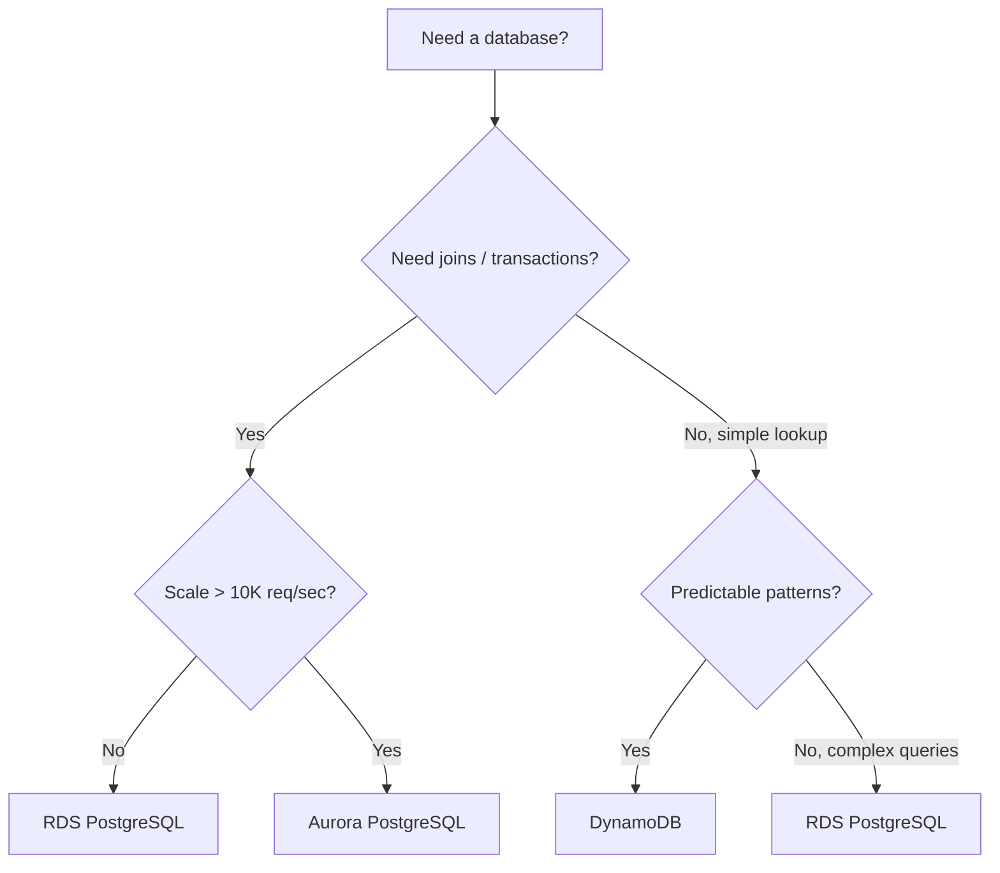

# 🎓 RDS + DynamoDB — Managed databases

> **Tác giả:** Mr.Rom\
> **Phiên bản:** v2.0.2\
> **Tạo lúc:** 24/05/2026\
> **Cập nhật:** 13/06/2026\
> **Level:** Basic\
> **Tags:** [MUST-KNOW]\
> **Yêu cầu trước:** [02_s3-deep-and-iam.md](02_s3-deep-and-iam.md), [PostgreSQL basic](../../../../06_databases/postgresql/)

> 🎯 *Hai dịch vụ database được dùng nhiều nhất trên AWS năm 2026 là **RDS** (relational — Postgres/MySQL) cho ACID và truy vấn phức tạp, và **DynamoDB** (NoSQL key-value/document) cho scale lớn và độ trễ thấp. Bài này đi từ đầu: setup, Multi-AZ, snapshots, design pattern, cho tới bảng quyết định chọn DB nào cho việc nào.*

## 🎯 Sau bài này bạn sẽ

- [ ] Deploy **RDS Postgres** Multi-AZ kèm backup.
- [ ] Cấu hình **parameter group** và **option group**.
- [ ] Dùng **read replica** để scale phần đọc.
- [ ] Dùng **snapshot** và *point-in-time recovery* (khôi phục về một thời điểm bất kỳ).
- [ ] Dùng **Performance Insights** để soi *slow query* (truy vấn chậm).
- [ ] Thiết kế **DynamoDB table** với *partition key* và *sort key*.
- [ ] Tạo **GSI** (Global Secondary Index) cho các kiểu query khác nhau.
- [ ] Bắt **DynamoDB Streams** kích hoạt Lambda.
- [ ] Dùng **DAX** cache cho *hot partition* (phân vùng nóng).
- [ ] So sánh **Aurora** với RDS Postgres.
- [ ] Quyết định **RDS hay DynamoDB** cho từng *use case*.

---

## Tình huống — App e-commerce với user, order và cart

Hãy bắt đầu từ một bài toán mà gần như app thương mại điện tử nào cũng gặp. App của bạn có bốn loại dữ liệu với tính chất hoàn toàn khác nhau:

- **Users**: 100K tài khoản, mang tính *relational* (join với orders, addresses).
- **Orders**: 1M đơn, bắt buộc ACID (giao dịch thanh toán không được sai một xu).
- **Shopping cart**: dữ liệu sống, nằm trên *hot path* (hàng triệu lượt đọc mỗi giây lúc cao điểm).
- **Activity logs**: ghi nhiều (append-heavy), chấp nhận *eventual consistency* (nhất quán sau cũng được).

Vấn đề là không có một DB nào hợp với cả bốn:

- Nhét hết vào Postgres thì phần đọc cart sẽ chậm khi scale.
- Nhét hết vào DynamoDB thì orders lại cần join và transaction — thứ DynamoDB không giỏi.

Sếp nhìn vào và chốt hướng: *"Mix DB. RDS cho users/orders, DynamoDB cho cart/sessions. Mỗi workload dùng đúng công cụ của nó. Bài này dạy chính cái đó."*

Đó là tinh thần của cả bài: học RDS và DynamoDB ở mức thực chiến, rồi biết khi nào chọn cái nào.

---

## 1️⃣ RDS — Managed relational

Trước khi đi vào từng tính năng, hãy hình dung bản chất của hai dịch vụ qua một ẩn dụ — vì nó sẽ giúp bạn nhớ được vì sao mỗi cái mạnh ở chỗ riêng.

🪞 **Ẩn dụ**: *RDS giống như một **căn hộ dịch vụ** — bạn dọn vào ở ngay, có người lo dọn dẹp (backup) và sửa ống nước (patch); đổi lại nội thất cố định, không kê lại được (schema chặt). DynamoDB giống như một **container kho** — muốn cất gì cũng được, tuỳ biến tự do, nhưng bạn phải biết cách sắp xếp hàng (partition key) thì lúc cần mới lấy ra nhanh.*

RDS (Relational Database Service) là dịch vụ database quan hệ được AWS quản lý hộ: bạn không phải tự cài, tự vá, tự backup máy chủ DB nữa.

### Các engine được hỗ trợ

RDS không trói bạn vào một loại DB duy nhất. Bảng dưới liệt kê các *engine* được hỗ trợ và việc nào hợp với engine nào:

| Engine | License | Hợp nhất với |
|---|---|---|
| **PostgreSQL** | Open source | **Mặc định 2026** — linh hoạt nhất |
| **MySQL** | Open source | Web app cũ, hệ sinh thái MySQL |
| **MariaDB** | Open source | Bản fork của MySQL, khác đôi chút |
| **Microsoft SQL Server** | Proprietary | Hệ sinh thái .NET |
| **Oracle** | Proprietary | Enterprise legacy |
| **Aurora MySQL** | AWS proprietary | MySQL hiệu năng cao |
| **Aurora PostgreSQL** | AWS proprietary | Postgres hiệu năng cao |

→ Khuyến nghị cho 2026: dùng **Aurora PostgreSQL** cho production, **RDS PostgreSQL** cho quy mô nhỏ hơn.

### Instance class

Giống như EC2, bạn chọn DB instance theo "size" CPU/RAM. Danh sách dưới đi từ máy nhỏ nhất (free tier) tới máy khổng lồ:

```
db.t3.micro    = 1 vCPU, 1 GB RAM    (Free Tier, dev)
db.t3.small    = 1 vCPU, 2 GB
db.t3.medium   = 2 vCPU, 4 GB
db.m6i.large   = 2 vCPU, 8 GB
db.m6i.xlarge  = 4 vCPU, 16 GB
db.r6i.large   = 2 vCPU, 16 GB       (memory-optimized)
db.r6i.xlarge  = 4 vCPU, 32 GB
...
db.r7i.24xlarge = 96 vCPU, 768 GB    (huge)
```

→ Quy ước họ máy giống EC2: **T (burstable)** cho tải nhẹ, **M (general)** cho tải đều, **R (memory)** cho workload ngốn RAM.

### Storage (Lưu trữ)

Phần lưu trữ quyết định IOPS (số thao tác đọc/ghi mỗi giây) bạn có. Ba loại chính:

- **gp3 SSD** (mặc định 2026): IOPS ổn định, dung lượng 20–65,536 GB.
- **io1/io2 SSD**: hiệu năng cao, IOPS tuỳ chỉnh được.
- **Magnetic** (legacy): rẻ nhưng chậm.

Khi bật **auto-scaling storage**, DB tự nới dung lượng theo nhu cầu mà bạn không phải resize thủ công.

### Multi-AZ deployment

Đây là quyết định quan trọng nhất về tính sẵn sàng (HA — High Availability). Có hai kiểu triển khai, khác nhau ở chỗ DB chịu được một AZ (Availability Zone — vùng khả dụng) sập hay không.

Kiểu **Standard (single-AZ)** đơn giản nhưng rủi ro:

- 1 instance, nằm trong 1 AZ.
- AZ đó sập là DB chết theo.
- Có snapshot backup hằng ngày.

Kiểu **Multi-AZ (khuyến nghị cho production)** bền hơn hẳn:

- **Primary** đặt ở AZ-a.
- **Standby** đặt ở AZ-b, *replication* đồng bộ (synchronous).
- Khi AZ sập, tự động *failover* (chuyển sang standby) trong khoảng 60–120 giây.
- Endpoint DNS không đổi → app không cần sửa config.

```
Without Multi-AZ:           With Multi-AZ:
  EC2 → primary (AZ-a)        EC2 → primary (AZ-a) ←sync→ standby (AZ-b)
                                    ↑
                              On failover, DNS points to standby
```

→ Production thì **luôn bật Multi-AZ**. Chi phí gấp đôi nhưng đáng.

### Read replica

Multi-AZ lo phần *sẵn sàng*, còn *read replica* lo phần *scale phần đọc*. Khi app đọc nhiều hơn ghi, bạn tách tải đọc sang các bản sao chỉ-đọc:

```
                Primary (write)
                    ↓ async replication
        ┌───────────┼───────────┐
        ↓           ↓           ↓
    Replica-1   Replica-2   Replica-3
    (read-only) (read-only) (read-only)
```

Vài đặc điểm cần nhớ về read replica:

- Tối đa **5 read replica** với RDS, **15** với Aurora.
- *Replication* bất đồng bộ (async), nên có độ trễ (lag) từ 100ms tới vài giây.
- Có thể đặt replica ở region khác.
- App tự định tuyến: đọc về replica, ghi về primary.

Read replica hợp với các tình huống sau:

- App đọc nhiều (ví dụ 90% là đọc).
- Báo cáo và phân tích (chạy trên replica để không đụng vào primary).
- Phương án dự phòng thảm hoạ (DR): khi cần, *promote* (nâng cấp) replica thành primary.

### Backups (Sao lưu)

Mất dữ liệu là cơn ác mộng, nên RDS cho hai lớp backup. **Automated backup** chạy tự động:

- Snapshot hằng ngày (chọn được khung giờ).
- **Point-in-time recovery (PITR)**: khôi phục về bất kỳ giây nào trong khoảng giữ lại (1–35 ngày).
- Lưu trong S3 (AWS quản lý hộ).

```bash
# Restore to specific time
aws rds restore-db-instance-to-point-in-time \
  --source-db-instance-identifier mydb \
  --target-db-instance-identifier mydb-restored \
  --restore-time 2026-05-24T10:30:00Z
```

Bên cạnh đó là **manual snapshot** do bạn chủ động chụp:

- Bấm chụp bất cứ lúc nào.
- Giữ mãi cho tới khi bạn xoá.
- Copy được sang region khác.

### Encryption (Mã hoá)

RDS mã hoá ở hai lớp. Mã hoá *at-rest* (lúc nằm trên đĩa) dùng AES-256 với khoá KMS; mã hoá *in-transit* (lúc truyền) dùng kết nối SSL/TLS. Đoạn dưới ép kết nối Postgres phải đi qua SSL:

```python
import psycopg2
conn = psycopg2.connect(
    host="mydb.xyz.us-east-1.rds.amazonaws.com",
    port=5432,
    user="admin",
    password="...",
    database="myapp",
    sslmode="require"   # enforce SSL
)
```

→ Lưu ý quan trọng: mã hoá at-rest **chỉ đặt được lúc tạo instance**. Không bật được sau — muốn mã hoá một DB đang chạy mà chưa mã hoá, bạn phải tạo snapshot rồi restore sang một instance mới đã bật mã hoá.

### Parameter group

*Parameter group* là nơi bạn tinh chỉnh config của engine Postgres (giống `postgresql.conf` nhưng do AWS quản lý). Hai lệnh dưới tạo một group riêng rồi sửa giới hạn kết nối:

```bash
aws rds create-db-parameter-group \
  --db-parameter-group-name custom-postgres-16 \
  --db-parameter-group-family postgres16 \
  --description "Custom Postgres 16 params"

aws rds modify-db-parameter-group \
  --db-parameter-group-name custom-postgres-16 \
  --parameters "ParameterName=max_connections,ParameterValue=200,ApplyMethod=pending-reboot"
```

→ Qua đây bạn tinh chỉnh được các thông số như giới hạn kết nối, `shared_buffers`, `work_mem`, v.v.

### Performance Insights

Khi DB chậm mà không biết tại sao, **Performance Insights** là công cụ phân tích hiệu năng dựng sẵn của RDS. Lệnh dưới kiểm tra xem nó đã bật chưa:

```bash
aws rds describe-db-instances --db-instance-identifier mydb \
  --query 'DBInstances[0].PerformanceInsightsEnabled'
```

→ Bật rồi, bạn xem được top query nặng nhất và các *wait event* (sự kiện chờ) ngay trên dashboard Console.

### Aurora — bản AWS làm riêng

Aurora là database quan hệ do AWS viết lại tầng storage, tương thích MySQL/Postgres nhưng nhanh và bền hơn. So với RDS PostgreSQL, Aurora có các điểm vượt trội:

- Nhanh hơn 3–5 lần (do storage được viết lại).
- Giữ 6 bản sao dữ liệu trải trên 3 AZ (rất bền).
- **Aurora Serverless v2**: tự scale, scale được về gần như bằng không.
- Tối đa **15 read replica** (so với 5 của RDS).
- *Failover* **dưới 30 giây** (so với 60–120 giây của RDS).
- **Aurora Global Database**: liên region với độ trễ dưới 1 giây.
- **Backtrack**: "tua ngược" DB về quá khứ mà không cần restore.

Đổi lại, chi phí Aurora nhỉnh hơn RDS khoảng 20%.

Vậy khi nào chọn cái nào? Dùng **Aurora** khi bạn cần một trong các thứ sau: OLTP production, nhiều read replica, đa region, hoặc workload lên xuống thất thường (dùng Aurora Serverless). Ngược lại, dùng **RDS PostgreSQL** khi workload nhỏ/dev, cần extension Postgres mà Aurora chưa có, cần tiết kiệm chi phí, hoặc đang chạy trên các deploy cũ.

→ Mặc định cho production năm 2026: **Aurora PostgreSQL**.

---

## 2️⃣ RDS — Hands-on deploy

Lý thuyết xong, giờ dựng thật một RDS Postgres Multi-AZ từ con số không. Bảy bước dưới đi theo đúng thứ tự thực chiến: chuẩn bị mạng trước, tạo DB, kiểm tra, giám sát, rồi thử nghiệm failover và snapshot.

### Bước 1: Tạo subnet group (config VPC)

DB production phải nằm trong *private subnet* (mạng con không lộ ra internet). Trước tiên gom các private subnet thành một subnet group:

```bash
aws rds create-db-subnet-group \
  --db-subnet-group-name acme-db-subnet \
  --db-subnet-group-description "Acme DB subnets" \
  --subnet-ids subnet-priv-a subnet-priv-b subnet-priv-c
```

### Bước 2: Security group

Tiếp theo, chỉ cho phép cổng Postgres (5432) được mở từ *security group* (nhóm tường lửa) của app — không mở cho cả thiên hạ:

```bash
DB_SG=$(aws ec2 create-security-group \
  --group-name acme-db-sg \
  --description "DB access" \
  --vpc-id $VPC_ID \
  --query 'GroupId' --output text)

# Allow port 5432 from app SG
aws ec2 authorize-security-group-ingress \
  --group-id $DB_SG \
  --protocol tcp --port 5432 \
  --source-group $APP_SG
```

### Bước 3: Tạo RDS Postgres

Có mạng và tường lửa rồi, giờ tạo instance. Lệnh dưới gói trọn mọi best practice đã nói ở trên: Multi-AZ, mã hoá at-rest, gp3, backup 7 ngày, bật Performance Insights, và không cho truy cập public:

```bash
aws rds create-db-instance \
  --db-instance-identifier acme-postgres \
  --db-instance-class db.t3.medium \
  --engine postgres \
  --engine-version 16.4 \
  --master-username acmedba \
  --master-user-password "$(openssl rand -base64 24)" \
  --allocated-storage 20 \
  --storage-type gp3 \
  --storage-encrypted \
  --multi-az \
  --vpc-security-group-ids $DB_SG \
  --db-subnet-group-name acme-db-subnet \
  --backup-retention-period 7 \
  --preferred-backup-window "03:00-04:00" \
  --preferred-maintenance-window "Sun:04:00-Sun:05:00" \
  --enable-performance-insights \
  --performance-insights-retention-period 7 \
  --no-publicly-accessible \
  --tags Key=Environment,Value=prod Key=Service,Value=core
```

→ Quá trình tạo instance mất khoảng 10–15 phút.

### Bước 4: Kiểm tra và kết nối

DB lên rồi, lấy endpoint ra rồi kết nối từ một máy EC2 nằm trong app SG (vì DB ở private subnet, không vào trực tiếp từ ngoài được):

```bash
# Get endpoint
ENDPOINT=$(aws rds describe-db-instances \
  --db-instance-identifier acme-postgres \
  --query 'DBInstances[0].Endpoint.Address' \
  --output text)

# Connect (from EC2 in app SG)
psql -h $ENDPOINT -U acmedba -d postgres

# Create database
postgres=> CREATE DATABASE acme;
postgres=> \c acme
```

### Bước 5: Dựng giám sát

DB chạy mà không có cảnh báo thì khi có sự cố bạn là người biết cuối cùng. Hai *CloudWatch alarm* dưới canh CPU và dung lượng trống:

```bash
# CloudWatch alarms
aws cloudwatch put-metric-alarm \
  --alarm-name rds-cpu-high \
  --namespace AWS/RDS \
  --metric-name CPUUtilization \
  --statistic Average --period 300 --threshold 80 \
  --comparison-operator GreaterThanThreshold \
  --evaluation-periods 2 \
  --dimensions Name=DBInstanceIdentifier,Value=acme-postgres

aws cloudwatch put-metric-alarm \
  --alarm-name rds-storage-low \
  --namespace AWS/RDS \
  --metric-name FreeStorageSpace \
  --statistic Average --period 300 --threshold 5000000000 \
  --comparison-operator LessThanThreshold \
  --dimensions Name=DBInstanceIdentifier,Value=acme-postgres
```

→ Cảnh báo khi CPU vượt 80% hoặc dung lượng trống tụt dưới 5GB.

### Bước 6: Thử failover

Đừng chờ tới khi AZ sập thật mới biết Multi-AZ có hoạt động không. Ép failover chủ động để kiểm chứng:

```bash
# Force failover (Multi-AZ)
aws rds reboot-db-instance \
  --db-instance-identifier acme-postgres \
  --force-failover

# Watch
aws rds wait db-instance-available --db-instance-identifier acme-postgres

# Should be ~60-90 seconds
```

→ App sẽ thấy kết nối rớt trong giây lát. Nếu SDK có cơ chế retry thì nó tự kết nối lại, người dùng gần như không nhận ra.

### Bước 7: Snapshot và restore

Trước mọi thay đổi lớn (migration, nâng version), hãy chụp một manual snapshot làm phao cứu sinh:

```bash
# Manual snapshot
aws rds create-db-snapshot \
  --db-instance-identifier acme-postgres \
  --db-snapshot-identifier acme-pre-migration

# List snapshots
aws rds describe-db-snapshots --db-instance-identifier acme-postgres

# Restore (creates new instance)
aws rds restore-db-instance-from-db-snapshot \
  --db-instance-identifier acme-postgres-restored \
  --db-snapshot-identifier acme-pre-migration \
  --db-subnet-group-name acme-db-subnet
```

→ Lưu ý: restore luôn tạo ra một instance **mới**. Nếu cần, hãy trỏ app sang endpoint mới này.

---

## 3️⃣ DynamoDB — NoSQL deep

Xong nửa quan hệ, giờ sang nửa NoSQL. DynamoDB tư duy khác hẳn RDS: không có join, không có schema cứng, mọi thứ xoay quanh việc thiết kế *key* cho đúng. Ta đi từ khái niệm gốc.

### Khái niệm

Ba từ vựng nền tảng cần phân biệt: **Table** là cái chứa các item (tương đương "bảng" nhưng lỏng lẻo hơn), **Item** là một bản ghi (gần giống một document JSON), còn **Attribute** là một trường trong item. Một item Users trông như sau — `user_id` chính là *partition key*:

```json
{
  "user_id": "u-12345",
  "email": "nguyenvana@acme.com",
  "name": "Nguyen Van A",
  "created_at": "2026-05-24T10:00:00Z",
  "tags": ["premium", "verified"]
}
```

### Keys

Toàn bộ sức mạnh (và cạm bẫy) của DynamoDB nằm ở thiết kế key. Có hai loại:

**Partition Key (PK)** — bắt buộc:

- Phải duy nhất cho mỗi item (nếu không có sort key).
- DynamoDB băm (hash) PK để rải item ra các partition.

**Sort Key (SK)** — tuỳ chọn:

- Ghép với PK thành *composite key* (khoá tổ hợp).
- Sắp xếp các item cùng PK với nhau.
- Cho phép query theo khoảng (range).

### Single-table design

Đây là chỗ DynamoDB ngược hẳn tư duy SQL. Best practice của DynamoDB là **gom nhiều loại thực thể vào 1 table** (chứ không phải 1 table cho mỗi thực thể như SQL). Ví dụ một table chứa cả user, order lẫn product:

```
Table: AcmeApp

PK              SK                     ItemData
USER#u-1        PROFILE                {name: "Nguyen Van A", email: ...}
USER#u-1        ORDER#o-100            {amount: 99, ...}
USER#u-1        ORDER#o-101            {amount: 50, ...}
PRODUCT#p-1     METADATA               {name: "Widget", price: 10}
PRODUCT#p-1     REVIEW#r-50            {rating: 5, ...}
```

Lý do làm vậy là để gom dữ liệu liên quan vào cùng một partition, nên mỗi query chỉ chạm 1 partition và rất nhanh:

- "Tất cả order của user u-1": `PK=USER#u-1, SK begins_with ORDER#`.
- "Tất cả review của product p-1": `PK=PRODUCT#p-1, SK begins_with REVIEW#`.

→ Mỗi query chỉ trúng 1 partition = nhanh.

### Indexes

Mặc định bạn chỉ query được theo PK/SK. Muốn query theo trường khác, bạn cần *index*. Có hai loại với ràng buộc khác nhau:

**Local Secondary Index (LSI)**:

- Cùng PK nhưng khác SK.
- Chỉ tạo được lúc tạo table.
- Tối đa 5 cái mỗi table.

**Global Secondary Index (GSI)**:

- Khác cả PK lẫn SK.
- Tạo/xoá được bất cứ lúc nào.
- Mỗi GSI có throughput riêng.

Ví dụ table chính dùng `user_id`, nhưng ta muốn query order theo `email` — đó là lúc GSI vào cuộc:

```python
# Main table: PK=user_id, SK=order_id
# GSI: GSI1PK=email, GSI1SK=created_at

# Query orders by email instead of user_id:
table.query(
    IndexName='GSI1',
    KeyConditionExpression=Key('GSI1PK').eq('nguyenvana@acme.com')
)
```

→ GSI mở thêm các kiểu query mà PK/SK gốc không làm được.

### Capacity modes

DynamoDB có hai cách tính tiền theo dung lượng, chọn sai là tốn tiền oan. **On-demand** trả theo lượt:

- Trả tiền theo từng request.
- Tự scale.
- Giá 2026 (US East): 1.25 USD/triệu lượt ghi, 0.25 USD/triệu lượt đọc.

**Provisioned** thì cấp phát trước:

- Đặt sẵn số *capacity unit* đọc/ghi.
- Rẻ hơn khi tải ổn định, đoán được.
- Giá: 0.00065 USD/WCU-giờ, 0.00013 USD/RCU-giờ.

→ Lời khuyên: **bắt đầu bằng on-demand**, khi nào tải đã đoán được thì chuyển sang provisioned.

### Ví dụ tính tiền

Để thấy khác biệt cụ thể, lấy một workload 10K lượt đọc/giây, 1K lượt ghi/giây, tất cả ở chế độ eventually consistent.

**On-demand**:

- 10K × 0.5 (eventual) = 5K RCU tương đương... thực tế tính theo từng triệu lượt.
- Mỗi ngày: 10K × 86400 = 864M lượt đọc × 0.25 USD/triệu = 216 USD/ngày.
- Mỗi tháng: khoảng 6500 USD.

**Provisioned**:

- 10K RCU × 0.00013 × 720 giờ = 936 USD/tháng.
- Cộng 1K WCU × 0.00065 × 720 giờ = 468 USD/tháng.
- Tổng: 1404 USD/tháng.

→ Ở tải đều, on-demand đắt gấp khoảng 5 lần. Tải ổn định thì provisioned thắng rõ.

### Streams + Lambda

**DynamoDB Streams** là một *change log* — bản ghi lại mọi thay đổi ghi vào table. Bật nó lên rồi gắn Lambda, bạn có ngay kiến trúc hướng sự kiện. Đầu tiên bật stream:

```bash
aws dynamodb update-table \
  --table-name Users \
  --stream-specification StreamEnabled=true,StreamViewType=NEW_AND_OLD_IMAGES
```

Rồi cho Lambda phản ứng mỗi khi có item mới:

```python
def lambda_handler(event, context):
    for record in event['Records']:
        if record['eventName'] == 'INSERT':
            # New user created
            new_image = record['dynamodb']['NewImage']
            send_welcome_email(new_image['email']['S'])
```

→ Đây chính là kiến trúc *event-driven*: ghi vào DynamoDB → kích hoạt Lambda → gọi tiếp dịch vụ ngoài (SNS, gửi email, cập nhật search index).

### DAX — DynamoDB Accelerator

Khi một vài key bị đọc đi đọc lại liên tục, **DAX** là lớp cache trong bộ nhớ đặt trước DynamoDB:

- Độ trễ cỡ micro giây.
- Tương thích API (drop-in, hầu như không sửa code).
- Hợp với: hot key, các lượt đọc lặp lại.

Đoạn dưới cho thấy việc đổi từ client DynamoDB thường sang client DAX gần như chỉ là đổi endpoint:

```python
# Without DAX
import boto3
dynamodb = boto3.client('dynamodb')

# With DAX
from amazondax import AmazonDaxClient
dax = AmazonDaxClient.resource(endpoint_url='dax-endpoint.cluster.dax-clusters.region.amazonaws.com:8111')
```

→ Chi phí: 0.04–0.13 USD/node-giờ. Đáng tiền cho workload đọc lặp nhiều.

---

## 4️⃣ DynamoDB — Hands-on

Lý thuyết key xong, giờ thao tác thật. Bốn bước cơ bản: tạo table, ghi/đọc item, query hiệu quả, và (quan trọng) hiểu vì sao phải tránh `scan`.

### Bước 1: Tạo table

Tạo một table đơn giản với PK là `user_id`, tính tiền theo lượt (on-demand) và bật mã hoá:

```bash
aws dynamodb create-table \
  --table-name AcmeUsers \
  --attribute-definitions \
    AttributeName=user_id,AttributeType=S \
  --key-schema \
    AttributeName=user_id,KeyType=HASH \
  --billing-mode PAY_PER_REQUEST \
  --sse-specification Enabled=true \
  --tags Key=Service,Value=core
```

### Bước 2: Put và Get item

Bốn thao tác CRUD cơ bản với `boto3` — ghi, đọc, sửa, xoá một item theo key:

```python
import boto3
table = boto3.resource('dynamodb').Table('AcmeUsers')

# Put item
table.put_item(Item={
    'user_id': 'u-12345',
    'email': 'nguyenvana@acme.com',
    'name': 'Nguyen Van A',
    'created_at': '2026-05-24T10:00:00Z',
    'tier': 'premium'
})

# Get item
response = table.get_item(Key={'user_id': 'u-12345'})
print(response.get('Item'))

# Update
table.update_item(
    Key={'user_id': 'u-12345'},
    UpdateExpression='SET tier = :t',
    ExpressionAttributeValues={':t': 'enterprise'}
)

# Delete
table.delete_item(Key={'user_id': 'u-12345'})
```

### Bước 3: Query (cách đúng)

`query` là cách đọc đúng chuẩn DynamoDB — luôn đi qua key nên nhanh và rẻ. Ví dụ query theo PK, hoặc kết hợp sort key để lấy theo khoảng thời gian:

```python
from boto3.dynamodb.conditions import Key

# Query by PK
response = table.query(
    KeyConditionExpression=Key('user_id').eq('u-12345')
)

# Composite key with sort range
table.query(
    KeyConditionExpression=Key('user_id').eq('u-12345') & Key('created_at').between('2026-05-01', '2026-05-31')
)
```

### Bước 4: Scan (tránh dùng!)

Ngược với `query`, `scan` đọc **toàn bộ** table rồi mới lọc — vừa chậm vừa tốn:

```python
# Scan reads ENTIRE table (expensive, slow)
response = table.scan(
    FilterExpression=Attr('tier').eq('premium')
)

# Better: GSI on tier field
```

→ Trong production, `scan` là điều cấm kỵ. Luôn thiết kế query dựa trên PK và GSI; chỉ dùng `scan` cho việc phân tích hoặc migration một lần.

### Bước 5: Tạo GSI

Nếu phát hiện hay phải query theo một trường ngoài key (ví dụ `email`), hãy thêm GSI thay vì `scan`:

```bash
aws dynamodb update-table \
  --table-name AcmeUsers \
  --attribute-definitions \
    AttributeName=email,AttributeType=S \
  --global-secondary-index-updates \
    "[{
      \"Create\": {
        \"IndexName\": \"email-index\",
        \"KeySchema\": [{\"AttributeName\":\"email\",\"KeyType\":\"HASH\"}],
        \"Projection\": {\"ProjectionType\":\"ALL\"}
      }
    }]"
```

Có GSI rồi, query theo email cũng nhanh như query theo key chính:

```python
table.query(
    IndexName='email-index',
    KeyConditionExpression=Key('email').eq('nguyenvana@acme.com')
)
```

---

## 5️⃣ Ma trận quyết định (Decision matrix) — RDS vs DynamoDB vs Aurora

Biết cả hai rồi, câu hỏi thực tế là: với một bài toán cụ thể thì chọn cái nào? Sơ đồ dưới gói gọn logic quyết định — bắt đầu từ câu hỏi "có cần join/transaction không":



### Ánh xạ theo use case

Sơ đồ trên là khung tư duy; bảng dưới đi chi tiết hơn — mỗi loại workload kèm DB hợp nhất, gồm cả những dịch vụ chuyên biệt ngoài RDS/DynamoDB:

| Use case | DB khuyến nghị |
|---|---|
| Tài khoản user (join, profile) | RDS / Aurora Postgres |
| Order + line item (ACID) | RDS / Aurora Postgres |
| Shopping cart (ghi nhiều, đơn giản) | DynamoDB |
| Lưu session | DynamoDB (hoặc ElastiCache) |
| Catalog sản phẩm (đọc nhiều, query phức tạp) | RDS Postgres + OpenSearch |
| Activity log (ghi nhiều, eventual) | DynamoDB |
| Bảng xếp hạng thời gian thực | DynamoDB + Redis |
| Phân tích / báo cáo | Redshift / Athena |
| Time-series metrics | Timestream / TimescaleDB |
| Document store | DynamoDB hoặc DocumentDB |
| Graph (quan hệ) | Neptune |
| Caching | ElastiCache Redis |
| Full-text search | OpenSearch |

### Kiến trúc hybrid (rất phổ biến năm 2026)

Thực tế hiếm app lớn nào chỉ xài đúng một DB. Phần lớn dùng **nhiều DB cùng lúc**, mỗi cái cho một việc:

```
Source of truth: RDS Postgres (users, orders)
Cache: ElastiCache Redis (sessions, hot data)
Search: OpenSearch (product search)
Activity log: DynamoDB (append-heavy, eventual)
Analytics: Redshift (BI dashboards)
```

→ Đúng công cụ cho đúng workload.

---

## 6️⃣ Hands-on: E-commerce DB stack

Quay lại đúng bài toán mở đầu, giờ ráp các mảnh lại thành một stack DB thật cho app e-commerce. Kiến trúc tách rõ ba lớp: RDS giữ dữ liệu quan hệ, DynamoDB giữ cart ghi nhiều, ElastiCache giữ session siêu nhanh.

### Kiến trúc

```
                  FastAPI
                /   |   \
            RDS    DynamoDB  ElastiCache
         (Postgres)  (cart)   (sessions)
        users, orders
```

### RDS cho dữ liệu quan hệ (users, orders)

Users và orders cần join và transaction nên thuộc về Postgres. Đoạn SQL dưới dựng schema và minh hoạ một transaction ACID — trừ kho và tạo đơn phải cùng thành công hoặc cùng thất bại:

```sql
-- users table
CREATE TABLE users (
    user_id UUID PRIMARY KEY,
    email VARCHAR(255) UNIQUE NOT NULL,
    name VARCHAR(255),
    created_at TIMESTAMP DEFAULT NOW()
);

-- orders + items (ACID)
CREATE TABLE orders (
    order_id UUID PRIMARY KEY,
    user_id UUID REFERENCES users(user_id),
    total NUMERIC(10,2),
    status VARCHAR(20),
    created_at TIMESTAMP DEFAULT NOW()
);

CREATE TABLE order_items (
    order_id UUID REFERENCES orders(order_id),
    product_id UUID,
    quantity INT,
    price NUMERIC(10,2),
    PRIMARY KEY (order_id, product_id)
);

-- Transaction example
BEGIN;
  UPDATE inventory SET stock = stock - 1 WHERE product_id = 'p-1';
  INSERT INTO orders (...) VALUES (...);
  INSERT INTO order_items (...) VALUES (...);
COMMIT;
```

→ Transaction ACID là bắt buộc cho các thao tác liên quan tới thanh toán.

### DynamoDB cho cart (ghi nhiều, đơn giản)

Cart thì ghi liên tục và tra cứu đơn giản theo `user_id` — đúng sở trường DynamoDB. Đoạn dưới ghi cả giỏ, đọc giỏ, và thêm món vào giỏ bằng `update_item`:

```python
# Table: ShoppingCart
# PK: user_id

cart_table.put_item(Item={
    'user_id': 'u-12345',
    'items': [
        {'product_id': 'p-1', 'quantity': 2, 'price': 10},
        {'product_id': 'p-2', 'quantity': 1, 'price': 25}
    ],
    'total': 45,
    'updated_at': '2026-05-24T10:00:00Z'
})

# Get cart
cart = cart_table.get_item(Key={'user_id': 'u-12345'})['Item']

# Add item
cart_table.update_item(
    Key={'user_id': 'u-12345'},
    UpdateExpression='SET items = list_append(items, :i), #t = #t + :p',
    ExpressionAttributeNames={'#t': 'total'},
    ExpressionAttributeValues={
        ':i': [{'product_id': 'p-3', 'quantity': 1, 'price': 15}],
        ':p': 15
    }
)
```

### ElastiCache cho session (cực nhanh)

Session cần đọc/ghi với độ trễ thấp nhất có thể nên đặt thẳng trên Redis, kèm thời gian hết hạn tự động:

```python
import redis
r = redis.Redis(host='session-cache.xyz.cache.amazonaws.com')

# Set session
r.setex(f'session:{session_id}', 3600, json.dumps(user_data))

# Get session
data = r.get(f'session:{session_id}')
```

### Ước tính chi phí (e-commerce nhỏ, ap-southeast-1)

Để bạn hình dung tiền bạc, đây là chi phí lớp DB cho một app nhỏ ở region Singapore:

- RDS Aurora Postgres db.t4g.medium Multi-AZ: khoảng 140 USD/tháng.
- DynamoDB on-demand 1M lượt ghi + 5M lượt đọc/tháng: khoảng 10 USD/tháng.
- ElastiCache cache.t4g.small: khoảng 30 USD/tháng.
- **Tổng lớp DB**: khoảng 180 USD/tháng.

→ Một stack DB cấp production với chi phí khá khiêm tốn.

---

## 💡 Cạm bẫy thường gặp & Best practice

Phần này gom các lỗi hay gặp nhất khi vận hành RDS/DynamoDB cùng cách chữa. Đọc kỹ vì phần lớn đều là bài học "trả giá bằng sự cố thật".

### ❌ Cạm bẫy: RDS single-AZ cho production

→ AZ sập là DB chết theo, app downtime.

→ **Fix**: Bật Multi-AZ ngay từ Day 1. Tốn gấp đôi nhưng xứng đáng.

### ❌ Cạm bẫy: Dùng máy họ T cho DB production

→ Hết *burst credit* là DB chậm đột ngột → kéo theo cả hệ thống nghẽn dây chuyền.

→ **Fix**: Production dùng họ M hoặc R; họ T chỉ để dev/staging.

### ❌ Cạm bẫy: Không có backup nào ngoài automated mặc định

→ Mặc định chỉ giữ 1 ngày. Lỡ tay xoá nhầm trước đó là mất luôn.

→ **Fix**:

- Đặt backup retention tối thiểu 7–30 ngày.
- Chụp manual snapshot trước mọi thay đổi lớn.
- Copy snapshot sang region khác cho phương án DR.

### ❌ Cạm bẫy: Dùng `scan` của DynamoDB trong production

```python
table.scan()   # reads entire table!
```

→ Chậm và đắt.

→ **Fix**: Thiết kế table theo kiểu query thật. Cần thì thêm GSI. `scan` chỉ dành cho phân tích/migration.

### ❌ Cạm bẫy: Hot partition trong DynamoDB

→ Mọi request cho `user_id=alice` đổ dồn vào cùng một partition → bị throttle (giới hạn lại).

→ **Fix**:

- Rải key ra (đừng dùng ID tuần tự).
- Dùng *write sharding*: `user-alice#shard1`, `user-alice#shard2`.
- Dùng DAX cache cho các lượt đọc lặp.

### ❌ Cạm bẫy: Đặt RDS trong public subnet

→ Lộ ra internet = mời gọi tấn công brute-force.

→ **Fix**: Chỉ đặt trong private subnet. App kết nối qua VPC.

### ❌ Cạm bẫy: Không dùng connection pooling

→ Mỗi request mở một kết nối DB mới → cạn kết nối (Postgres mặc định tối đa 100).

→ **Fix**:

- Pool ở tầng app (SQLAlchemy, pgbouncer).
- Hoặc dùng **RDS Proxy**: connection pool được AWS quản lý hộ.

### ❌ Cạm bẫy: Áp dụng single-table design sai chỗ

→ Hiểu nửa vời về single-table → bê vào một app đơn giản và làm mọi thứ phức tạp không cần thiết.

→ **Fix**: Bắt đầu bằng table đơn giản (1 thực thể = 1 table). Khi đã hiểu rõ các kiểu query thì mới refactor sang single-table.

### ✅ Best practice: Bật Performance Insights

```bash
--enable-performance-insights \
--performance-insights-retention-period 7
```

→ Giúp khoanh vùng truy vấn chậm, tranh chấp lock, index còn thiếu.

### ✅ Best practice: Dùng read replica cho báo cáo

→ Đừng nã các truy vấn phân tích nặng vào primary. Đẩy chúng sang read replica.

### ✅ Best practice: Dùng RDS Proxy

```bash
aws rds create-db-proxy ...
```

→ Vừa pool kết nối, vừa failover nhanh hơn (không phải chờ DNS).

### ✅ Best practice: Dùng TTL của DynamoDB

```python
table.put_item(Item={
    'session_id': 'abc',
    'data': {...},
    'expires_at': int(time.time()) + 3600   # Unix timestamp
})
```

```bash
aws dynamodb update-time-to-live --table-name Sessions \
  --time-to-live-specification "Enabled=true, AttributeName=expires_at"
```

→ DynamoDB tự xoá item hết hạn, bạn khỏi phải viết job dọn dẹp ở tầng app.

---

## 🧠 Tự kiểm tra (Self-check)

Năm câu dưới chạm đúng những chỗ dễ nhầm nhất khi chọn và vận hành RDS/DynamoDB. Thử tự trả lời trước khi mở đáp án.

**Q1.** RDS Multi-AZ với Aurora — cái nào mới là "HA thật"?

<details>
<summary>💡 Đáp án</summary>

**RDS Multi-AZ** (Postgres/MySQL):

- Primary ở AZ-a, Standby ở AZ-b.
- *Replication* đồng bộ (synchronous) sang standby.
- Failover khoảng 60–120 giây.
- Standby không phục vụ đọc được.
- Cùng loại instance (chi phí gấp đôi).

**Aurora**:

- 1 writer cộng tối đa 15 reader trải trên nhiều AZ.
- Tầng storage được nhân 6 bản trên 3 AZ (ở mức volume, không phải mức instance).
- Failover **dưới 30 giây** (chỉ cần promote instance).
- Mọi reader đều phục vụ đọc được.
- Storage scale độc lập với compute.

So sánh trực tiếp:

| Khía cạnh | RDS Multi-AZ | Aurora |
|---|---|---|
| Thời gian failover | 60–120s | < 30s |
| Read replica | Tối đa 5, async | Tối đa 15, lag < 100ms |
| Độ bền storage | SSD chuẩn | 6 bản sao (bền hơn) |
| Chi phí | Gấp đôi compute (standby nằm không) | 1x compute + storage |
| Scale phần đọc | Phải thêm read replica | Reader nhanh dựng sẵn |

**Cả hai đều đạt HA**, nhưng Aurora nhỉnh hơn:

- Nhiều replica hơn để scale đọc.
- Failover nhanh hơn.
- Bền hơn (6 bản sao).
- Có tuỳ chọn Aurora Serverless (scale về gần như bằng không).

Khuyến nghị:

- **Workload nhỏ**: RDS Postgres Multi-AZ (đơn giản, rẻ hơn chút).
- **Production quy mô lớn**: Aurora PostgreSQL.
- **Workload thất thường**: Aurora Serverless v2 (chỉ trả tiền khi có tải).
- **Đa region**: Aurora Global (RDS không có cái tương đương).

Về di chuyển:

- RDS Postgres → Aurora Postgres: restore từ snapshot (hoặc tạo read replica rồi promote).
- Tương thích cùng SDK/driver, không phải đổi code.

→ Aurora là **bản thay thế hiện đại** cho RDS Multi-AZ ở production.
</details>

**Q2.** DynamoDB single-table với multi-table — khi nào dùng cái nào?

<details>
<summary>💡 Đáp án</summary>

**Multi-table** (1 table cho mỗi thực thể):

- Table `Users`.
- Table `Orders`.
- Table `Products`.

Ưu điểm:

- Mô hình tư duy đơn giản (giống SQL).
- Migration dễ.
- Thân thiện với tooling.

Nhược điểm:

- Mỗi query trúng 1 table = 1 partition.
- Query xuyên thực thể (user cùng order của họ) = nhiều query.
- Phức tạp dần khi scale.

**Single-table** (1 table, nhiều loại thực thể):

```
PK              SK                     Item type
USER#u-1        PROFILE                user data
USER#u-1        ORDER#o-100            order
USER#u-1        ORDER#o-101            order
USER#u-1        ADDRESS#default        address
```

Ưu điểm:

- Mọi dữ liệu liên quan nằm chung một partition.
- 1 query lấy được cả user, order lẫn address.
- Rẻ hơn khi scale.
- Đúng thứ DynamoDB được thiết kế cho.

Nhược điểm:

- Phải "uốn não" với schema.
- Khó onboard dev mới.
- Migration phức tạp.

Khi nào dùng multi-table:

- **Mới làm quen DynamoDB**.
- **Ít loại thực thể** (dưới 5).
- **Thực thể chủ yếu độc lập** (hiếm khi query cùng nhau).
- **Quy mô nhỏ**.

Khi nào dùng single-table:

- **Đã thạo DynamoDB**.
- **Nhiều query liên quan** (user → order → item).
- **Scale trên 100K req/sec**.
- **Nhạy cảm về chi phí**.

Kiểu hybrid (phổ biến 2026):

- **Single-table** cho phần dữ liệu lõi liên quan chặt (user, order, item).
- **Multi-table** cho dữ liệu độc lập (audit log, session).

Thực tế:

- Phần lớn team **bắt đầu bằng multi-table** (dễ hơn).
- Chuyển sang single-table **khi các kiểu truy cập đã rõ**.
- Đừng over-engineer ngay từ ngày đầu.

Về di chuyển:

- Khó! Vì các kiểu truy cập khác nhau hoàn toàn.
- Coi việc refactor sang single-table như một dự án riêng.

Công cụ:

- **NoSQL Workbench** cho DynamoDB: thiết kế và trực quan hoá single-table.
- **"The DynamoDB Book"** của Alex DeBrie: tài liệu tham chiếu kinh điển.

Anti-pattern:

- "Dùng single-table vì người ta khuyên" mà không hiểu vì sao.
- "Multi-table mãi mãi" và bỏ lỡ cơ hội tối ưu hiệu năng.

→ Mặc định: bắt đầu multi-table. Chuyển single-table khi gặp nút thắt hoặc khi mở dự án mới đã rõ các kiểu query.
</details>

**Q3.** RDS Proxy — khi nào đáng dùng?

<details>
<summary>💡 Đáp án</summary>

**RDS Proxy** = lớp connection pooling và failover do AWS quản lý, đặt trước RDS/Aurora.

Nó giải quyết các vấn đề sau:

1. **Cạn kết nối**:
   - Postgres mặc định `max_connections` = 100.
   - Lambda/microservices có thể có 1000+ function chạy đồng thời.
   - Mỗi cái mở một kết nối mới → DB hết RAM → lỗi.

2. **Failover chậm**:
   - DB failover mất 60–120s với RDS, dưới 30s với Aurora.
   - DNS TTL khiến client có thể phải chờ hơn 30s mới kết nối lại.
   - RDS Proxy giữ sẵn kết nối nên reconnect nhanh hơn.

3. **Code app gọn hơn**:
   - Không cần tự dựng connection pool ở tầng app (HikariCP, SQLAlchemy pool).

Khi nào đáng dùng:

1. **App serverless (Lambda)**:
   - Lambda chạy tạm thời rồi tắt.
   - Chi phí mở kết nối cao.
   - Proxy ghép (multiplex) các kết nối lại.

2. **App đồng thời cao**:
   - Nhiều kết nối sống ngắn.
   - Các đợt tăng tải đột biến dễ làm DB ngộp.

3. **Yêu cầu HA cao**:
   - Failover nhanh hơn.
   - App reconnect trong suốt với người dùng.

4. **Truy cập đa account**:
   - Proxy ở account này, DB ở account khác.

Khi nào không đáng:

1. **Ít kết nối, kết nối bền**:
   - App server truyền thống với pool ổn định.
   - Proxy thêm chút độ trễ (nhỏ nhưng có thật).

2. **Workload nhỏ**:
   - Chi phí: 0.018 USD/vCPU-giờ (tối thiểu khoảng 13 USD/tháng).
   - Không đáng cho dev/prod nhỏ.

3. **Cần độ trễ cực thấp**:
   - Proxy thêm khoảng 5–10ms.
   - Kết nối thẳng nhanh hơn.

Chi phí:

- Tối thiểu: 2 vCPU cho HA → khoảng 26 USD/tháng.
- Cộng thêm data transfer.

Cách dựng:

```bash
aws rds create-db-proxy \
  --db-proxy-name acme-proxy \
  --engine-family POSTGRESQL \
  --auth '{"AuthScheme":"SECRETS","SecretArn":"arn:aws:secretsmanager:...:secret:rds-creds"}' \
  --role-arn $PROXY_ROLE_ARN \
  --vpc-subnet-ids $SUBNET_IDS

aws rds register-db-proxy-targets \
  --db-proxy-name acme-proxy \
  --target-group-name default \
  --db-instance-identifiers acme-postgres
```

App kết nối tới endpoint của proxy thay vì endpoint của DB.

Bảng quyết định:

| Workload | Cần RDS Proxy? |
|---|---|
| Lambda + RDS | CÓ |
| App có HikariCP | thường là không |
| ECS/EKS với pool ổn định | tuỳ scale |
| Tier-1 (SLA 99.95%+) | CÓ |
| Dev nhạy cảm chi phí | KHÔNG |

Phương án thay thế hiện đại:

- pgBouncer chạy dạng sidecar container ở tầng app.
- Rẻ hơn nhưng tốn công vận hành hơn.

→ Mặc định 2026: **dùng RDS Proxy cho serverless và prod quy mô lớn**. Bỏ qua với app pool truyền thống ở quy mô nhỏ.
</details>

**Q4.** Hot partition trong DynamoDB — làm sao giảm thiểu?

<details>
<summary>💡 Đáp án</summary>

**Hot partition** = một partition key nhận lượng traffic chênh lệch quá lớn, dẫn tới bị throttle.

Nguyên nhân:

- DynamoDB rải dữ liệu ra các partition theo hash của PK.
- Nếu 1 PK quá phổ biến → mọi traffic dồn vào 1 partition.
- Mỗi partition có giới hạn: **3000 RCU + 1000 WCU mỗi giây**.

Ví dụ:

- **Timestamp tuần tự làm PK**: mọi lượt ghi mới đổ vào cùng một partition.
- **User nổi tiếng**: 1 user chiếm 90% lượt cập nhật cart.
- **Trang sản phẩm hot**: một item hot nhận 100K req/sec.

Triệu chứng:

- Lỗi `ProvisionedThroughputExceededException`.
- Chỉ số hot partition trên CloudWatch.
- Độ trễ tăng vọt.

Các cách giảm thiểu:

**1. Composite PK kèm sharding**:

```python
# Bad: all events go to same PK
{
  "event_type": "page_view",   # everyone uses this PK
  "timestamp": ...
}

# Good: shard PK
{
  "event_type#shard": "page_view#3",   # random 1-10
  "timestamp": ...
}

# Query: parallel queries across all shards
```

**2. Thêm hậu tố ngẫu nhiên cho key tuần tự**:

```python
# Bad: "user-1", "user-2", ... (sequential = same partition)
# Good: hash prefix
import hashlib
user_id = hashlib.md5(b"user-1").hexdigest()[:4] + "#user-1"
```

**3. DAX caching**:

- Các lượt đọc lặp của hot key được cache trong DAX.
- Một node DAX gánh được khoảng 100K req/sec.

**4. Nhiều đường đọc qua GSI**:

- Nhiều GSI = nhiều đường đọc song song.

**5. ElastiCache đặt trước DynamoDB**:

- Cache Redis cho các key cực nóng.

**6. Gộp ghi ở tầng app**:

- Gom các lượt ghi (1 update/giây thay vì 100).

**7. Write sharding cho counter**:

- Sharded counter: `counter#0`, `counter#1`, ..., `counter#9`.
- Đọc: cộng tất cả shard.
- Dùng cho counter traffic cao.

**8. Dùng on-demand capacity**:

- Tự scale để hứng các đợt burst.
- Đắt hơn nhưng chịu được spike.

**9. Dùng Aurora cho hot data**:

- Vài workload hợp DB quan hệ hơn.
- Aurora xử lý hot row khác (cache trong bộ nhớ).

**10. Adaptive capacity**:

- DynamoDB tự cấp thêm capacity cho partition nóng.
- Mặc định bật từ 2026, đỡ phải can thiệp tay.

Giám sát:

```bash
# CloudWatch metric: ConsumedReadCapacityUnits per partition key
# CloudWatch metric: SystemErrors / UserErrors
```

Công cụ:

- **NoSQL Workbench**: trực quan hoá phân bố partition.
- **Contributor Insights**: liệt kê các key bị truy cập nhiều nhất.

Quyết định:

- Hot partition + ghi: shard PK.
- Hot partition + đọc: DAX hoặc ElastiCache.
- Bài toán user nổi tiếng: kết hợp các cách trên.

→ Thiết kế **trước khi** scale. Sửa sau rất khó.
</details>

**Q5.** TTL trong DynamoDB — use case và những lưu ý?

<details>
<summary>💡 Đáp án</summary>

**TTL** (Time To Live) = tự động xoá item sau một mốc thời gian định trước.

Cách bật:

```bash
aws dynamodb update-time-to-live \
  --table-name Sessions \
  --time-to-live-specification "Enabled=true,AttributeName=expires_at"
```

```python
# Put item with TTL
import time
table.put_item(Item={
    'session_id': 'abc',
    'data': {...},
    'expires_at': int(time.time()) + 3600   # 1 hour from now
})
# After 1 hour, item auto-deleted
```

Use case:

1. **Lưu session**:
   - Phiên đăng nhập hết hạn sau 30 phút.
   - DynamoDB tự dọn.

2. **Lớp cache**:
   - TTL chính là thời điểm cache hết hạn.
   - Khỏi purge thủ công.

3. **Dữ liệu có hạn**:
   - Mã khuyến mãi hết hạn.
   - Thông báo cũ hơn 90 ngày bị xoá.

4. **Quyền được lãng quên (GDPR)**:
   - Dữ liệu user giữ 90 ngày rồi tự xoá.

5. **Tối ưu chi phí**:
   - Xoá dữ liệu cũ = bớt dung lượng lưu trữ.

Những lưu ý:

1. **Không tức thời**:
   - DynamoDB xoá trong vòng **48 giờ** kể từ lúc hết hạn.
   - Item (đã quá `expires_at`) vẫn còn hiện cho tới khi được xử lý.
   - Vậy nên lọc trong query: `expires_at > now`.

```python
# Items not yet deleted but expired:
table.scan(
    FilterExpression='expires_at > :now',
    ExpressionAttributeValues={':now': int(time.time())}
)
```

2. **Thuộc tính TTL phải là Number (Unix timestamp)**:
   - Không phải chuỗi ISO 8601.
   - Tính bằng giây (không phải mili-giây).

```python
# Correct
expires_at = int(time.time() + 3600)   # Number, seconds

# Wrong
expires_at = '2026-05-25T10:00:00Z'    # String, ignored
```

3. **Không có thông báo khi TTL xoá**:
   - Dùng DynamoDB Streams để kích hoạt Lambda khi item bị xoá.

```python
def lambda_handler(event, context):
    for record in event['Records']:
        if record['eventName'] == 'REMOVE':
            # Could be TTL delete or manual delete
            if record.get('userIdentity', {}).get('type') == 'Service':
                # TTL deletion
                old = record['dynamodb']['OldImage']
                cleanup_related(old['session_id']['S'])
```

4. **Không giảm dung lượng tính tiền ngay lập tức**:
   - Dung lượng tính phí chỉ phản ánh sau khi xoá hoàn tất.

5. **Không hồi tố được**:
   - Bật TTL: chỉ các item ghi sau này mới bị xoá theo TTL.
   - Item đang có: phải batch update để thêm `expires_at`.

6. **Ảnh hưởng tới index**:
   - Item trong GSI bị xoá theo khi item gốc bị xoá.
   - Nhưng vẫn còn hiện cho tới khi propagate xong (khoảng 1s).

Lợi ích chi phí:

- Việc xoá theo TTL **miễn phí** (không tốn capacity).
- So với scan thủ công rồi delete: tốn cả RCU lẫn WCU.

Ví dụ luồng hoàn chỉnh:

```python
# Login: create session with 30-min TTL
def login(user):
    table.put_item(Item={
        'session_id': generate_session_id(),
        'user_id': user.id,
        'data': {...},
        'expires_at': int(time.time()) + 1800   # 30 min
    })

# Get session — filter expired
def get_session(session_id):
    response = table.get_item(Key={'session_id': session_id})
    item = response.get('Item')
    if item and item['expires_at'] > time.time():
        return item
    return None   # expired or not found
```

Phương án thay thế:

- Tự quản vòng đời (CloudWatch Events + Lambda quét item hết hạn).
- TTL đơn giản hơn và miễn phí.

Best practice:

- Luôn lọc ở tầng app: `expires_at > now`.
- Dùng Streams để dọn các dữ liệu liên quan.
- Theo dõi lượt TTL xoá qua CloudWatch.
- TTL hợp lý: tính bằng giờ/ngày, không phải bằng giây.

→ TTL là một pattern thiết yếu của DynamoDB. Dùng cho dữ liệu mang tính tạm thời.
</details>

---

## ⚡ Tra cứu nhanh (Cheatsheet)

Phần tra nhanh cho lúc làm việc thật — gom theo dịch vụ: lệnh CLI cho RDS và DynamoDB, rồi tới các đoạn code Python hay dùng nhất.

```bash
# === RDS ===
aws rds describe-db-instances
aws rds create-db-instance --db-instance-identifier mydb --engine postgres ...
aws rds modify-db-instance --db-instance-identifier mydb --allocated-storage 100
aws rds create-db-snapshot --db-instance-identifier mydb --db-snapshot-identifier snap-1
aws rds restore-db-instance-from-db-snapshot --db-snapshot-identifier snap-1 ...
aws rds reboot-db-instance --db-instance-identifier mydb --force-failover
aws rds create-db-proxy --db-proxy-name myproxy ...

# === DynamoDB ===
aws dynamodb create-table --table-name MyTable \
  --attribute-definitions AttributeName=PK,AttributeType=S AttributeName=SK,AttributeType=S \
  --key-schema AttributeName=PK,KeyType=HASH AttributeName=SK,KeyType=RANGE \
  --billing-mode PAY_PER_REQUEST

aws dynamodb put-item --table-name MyTable --item '{"PK":{"S":"USER#1"},"SK":{"S":"PROFILE"}}'
aws dynamodb get-item --table-name MyTable --key '{"PK":{"S":"USER#1"},"SK":{"S":"PROFILE"}}'
aws dynamodb query --table-name MyTable --key-condition-expression "PK = :pk" \
  --expression-attribute-values '{":pk":{"S":"USER#1"}}'
aws dynamodb update-time-to-live --table-name MyTable \
  --time-to-live-specification "Enabled=true,AttributeName=expires_at"

# Stream
aws dynamodb update-table --table-name MyTable \
  --stream-specification "StreamEnabled=true,StreamViewType=NEW_AND_OLD_IMAGES"
```

```python
# === RDS Postgres (psycopg2) ===
import psycopg2
conn = psycopg2.connect(
    host="mydb.xyz.rds.amazonaws.com",
    port=5432, user="admin", password="...",
    database="myapp", sslmode="require"
)

# === DynamoDB (boto3) ===
import boto3
from boto3.dynamodb.conditions import Key, Attr

dynamodb = boto3.resource('dynamodb')
table = dynamodb.Table('MyTable')

# Put
table.put_item(Item={'PK': 'USER#1', 'SK': 'PROFILE', 'name': 'Nguyen Van A'})

# Get
response = table.get_item(Key={'PK': 'USER#1', 'SK': 'PROFILE'})

# Query (efficient)
table.query(KeyConditionExpression=Key('PK').eq('USER#1'))

# Query with sort key
table.query(
    KeyConditionExpression=Key('PK').eq('USER#1') & Key('SK').begins_with('ORDER#')
)

# Update
table.update_item(
    Key={'PK': 'USER#1', 'SK': 'PROFILE'},
    UpdateExpression='SET #n = :n',
    ExpressionAttributeNames={'#n': 'name'},
    ExpressionAttributeValues={':n': 'Nguyen Van A Updated'}
)

# Batch
with table.batch_writer() as batch:
    for item in items:
        batch.put_item(Item=item)
```

---

## 📚 Từ Điển Thuật Ngữ (Glossary)

| Thuật ngữ | Tiếng Việt | Giải thích |
|---|---|---|
| **RDS** | Dịch vụ DB quan hệ | Relational Database Service — DB quan hệ do AWS quản lý |
| **Aurora** | Aurora | Bản MySQL/Postgres hiệu năng cao do AWS làm riêng |
| **Multi-AZ** | Đa vùng khả dụng | Primary + Standby đặt ở các AZ khác nhau |
| **Read replica** | Bản sao chỉ-đọc | Bản sao chỉ-đọc, replicate bất đồng bộ |
| **PITR** | Khôi phục theo thời điểm | Point-in-time recovery — về bất kỳ giây nào trong khoảng giữ lại |
| **Parameter group** | Nhóm tham số | Config tuỳ chỉnh của engine DB |
| **Performance Insights** | Phân tích hiệu năng | Công cụ phân tích truy vấn dựng sẵn của RDS |
| **RDS Proxy** | Proxy kết nối RDS | Connection pooling + failover nhanh hơn |
| **DynamoDB** | DynamoDB | NoSQL key-value/document |
| **Item** | Bản ghi | Bản ghi của DynamoDB (gần như một document JSON) |
| **PK** | Khoá phân vùng | Partition Key (HASH) |
| **SK** | Khoá sắp xếp | Sort Key (RANGE) |
| **GSI** | Index phụ toàn cục | Global Secondary Index |
| **LSI** | Index phụ cục bộ | Local Secondary Index |
| **TTL** | Thời gian sống | Time To Live — tự xoá item sau hạn |
| **DAX** | DynamoDB Accelerator | Cache trong bộ nhớ cho DynamoDB |
| **Stream** | Luồng thay đổi | Change log ghi lại mọi lượt ghi của DynamoDB |
| **On-demand capacity** | Dung lượng theo lượt | Trả tiền theo từng request |
| **Provisioned capacity** | Dung lượng đặt trước | Cấp phát sẵn WCU/RCU |
| **RCU** | Đơn vị đọc | Read Capacity Unit |
| **WCU** | Đơn vị ghi | Write Capacity Unit |
| **Single-table design** | Thiết kế một bảng | Một table DynamoDB chứa nhiều loại thực thể |
| **Hot partition** | Phân vùng nóng | Một PK gánh quá tải |
| **Aurora Serverless** | Aurora không máy chủ | Aurora tự scale (v2 = liên tục) |
| **Backtrack** | Tua ngược | Aurora "tua ngược" mà không cần restore |
| **Aurora Global** | Aurora đa region | Aurora liên region |

---

## 🔗 Liên kết & Tài nguyên

### 🧭 Định hướng lộ trình học

- ⬅️ **Bài trước:** [S3 chuyên sâu + Nền tảng IAM](02_s3-deep-and-iam.md)
- ➡️ **Bài tiếp theo:** [Lambda + API Gateway — Nhập môn Serverless](04_lambda-and-api-gateway.md)
- ↑ **Về cụm:** [AWS](../../README.md)

### 🧩 Các chủ đề có thể bạn quan tâm

- 🗄️ [PostgreSQL basics](../../../../06_databases/postgresql/) — khái niệm SQL và Postgres
- 🗄️ [SQL fundamentals](../../../../06_databases/sql-fundamentals/) — truy vấn SQL
- ☁️ [Cloud Fundamentals — Storage & databases](../../../cloud-fundamentals/lessons/01_basic/03_storage-and-databases.md) — toàn cảnh managed DB

### 🌐 Tài nguyên tham khảo khác

- 📖 [RDS docs](https://docs.aws.amazon.com/rds/)
- 📖 [DynamoDB docs](https://docs.aws.amazon.com/dynamodb/)
- 📖 [Aurora docs](https://docs.aws.amazon.com/AmazonRDS/latest/AuroraUserGuide/)
- 📖 [DynamoDB Book by Alex DeBrie](https://www.dynamodbbook.com/)
- 📖 [DynamoDB best practices](https://docs.aws.amazon.com/amazondynamodb/latest/developerguide/best-practices.html)
- 📖 [RDS pricing](https://aws.amazon.com/rds/pricing/)
- 📖 [DynamoDB pricing](https://aws.amazon.com/dynamodb/pricing/)
- 📖 [NoSQL Workbench](https://docs.aws.amazon.com/amazondynamodb/latest/developerguide/workbench.html)

---

## 📌 Nhật ký thay đổi (Changelog)

- **v1.0.0 (24/05/2026)** — Bài 03 AWS basic cluster. RDS deep (instances, Multi-AZ, read replicas, snapshots, PITR, Performance Insights) + Aurora vs RDS + DynamoDB deep (PK/SK, indexes, on-demand/provisioned, Streams, DAX, TTL, single-table design) + decision matrix RDS vs DynamoDB vs Aurora + hands-on e-commerce DB stack. 8 pitfall + 4 best practice + 5 self-check + cheatsheet.
- **v2.0.0 (01/06/2026)** — Viết lại toàn bộ prose từ kiểu "điện tín tiếng Anh" sang narrative tiếng Việt (lời dẫn trước bảng/code/list, câu phân tích sau, câu bắc cầu giữa section, dịch trọn 5 self-check answer); giữ nguyên 100% code/số liệu/lệnh/cấu trúc 8 phần. Sửa lỗi factual: bỏ từ "bucket" sai ngữ cảnh ở phần encryption RDS (RDS không có bucket — mã hoá at-rest chỉ bật lúc tạo instance, sau phải snapshot + restore). Sửa lỗi code: bỏ comment `//` trong block JSON (item Users) để JSON parse được. Chuẩn hoá QA: metadata "Prerequisites" → "Yêu cầu trước"; Glossary 3 cột; nav dùng marker ⬅️/➡️/↑ + link-text theo H1 thực + bỏ nhãn "(sắp viết)"; 3 sub-heading nav chuẩn.
- **v2.0.1 (11/06/2026)** — Việt hoá heading nội dung mô tả sang tiếng Việt (giữ thuật ngữ/brand/param) theo Vietnamese-first.
- **v2.0.2 (13/06/2026)** — Sửa mâu thuẫn nội bộ: Aurora failover "dưới 1 giây" (×2) → "dưới 30 giây" cho khớp bảng (< 30s) + Q3 (dưới 30s); giữ Global DB replication lag dưới 1 giây (đúng).
