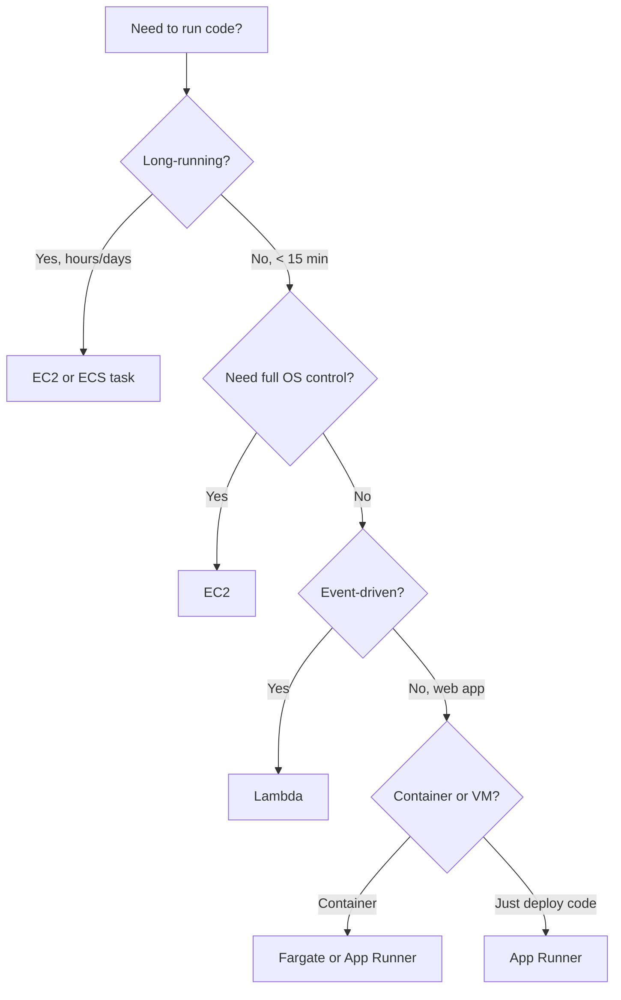

# 🎓 Lambda + API Gateway — Nhập môn Serverless

> **Tác giả:** Mr.Rom\
> **Phiên bản:** v2.0.0\
> **Tạo lúc:** 24/05/2026\
> **Cập nhật:** 01/06/2026\
> **Level:** Basic\
> **Tags:** [MUST-KNOW]\
> **Yêu cầu trước:** [RDS & DynamoDB](03_rds-and-dynamodb.md)

> 🎯 *Đây là bài cuối của cụm AWS basic. **Lambda** là *serverless function* — bạn chỉ viết code, AWS lo phần chạy, và bạn trả tiền theo từng lần gọi. **API Gateway** là cổng HTTP được quản lý sẵn, đứng trước Lambda để nhận request từ ngoài. Ghép hai thứ lại là có ngay một API *serverless* hoàn chỉnh. Bài này đi qua: function Lambda đầu tiên, các *trigger* (nguồn sự kiện kích hoạt), HTTP API của API Gateway, *cold start* (độ trễ lần gọi nguội), mô hình chi phí, và khi nào nên chọn serverless thay vì EC2.*

## 🎯 Sau bài này bạn sẽ

- [ ] Hiểu mô hình của **Lambda**: stateless, event-driven, tự co giãn.
- [ ] Deploy được function Lambda đầu tiên (Console + CLI + SAM).
- [ ] Nắm các **trigger** thông dụng: S3, DynamoDB Streams, EventBridge, API Gateway.
- [ ] Hiểu **cold start** và cách giảm thiểu (provisioned concurrency, SnapStart).
- [ ] Phân biệt **API Gateway** HTTP API và REST API.
- [ ] Dựng được một web API serverless với **Lambda + API Gateway**.
- [ ] Tính được **chi phí**: $/request + $/GB-second.
- [ ] Quyết định được **khi nào serverless, khi nào EC2** qua bảng so sánh.
- [ ] Biết các **giới hạn thường gặp**: timeout 15 phút, RAM tối đa 10 GB.

---

## Tình huống — User upload ảnh, tự động resize bằng cách nào?

Hãy bắt đầu từ một yêu cầu rất đời thường trong mọi web app có upload. Người dùng đẩy một tấm ảnh lên S3 — bản gốc nặng 5 MB, nhưng bạn cần một bản *thumbnail* chỉ khoảng 200 KB để hiển thị cho nhanh. Câu hỏi: ai sẽ làm việc resize đó, và làm lúc nào?

Có ba hướng tiếp cận, mỗi hướng đánh đổi khác nhau:

1. **EC2 background worker**: một máy chủ luôn bật, liên tục *poll* (hỏi thăm) S3 xem có ảnh mới chưa. Vấn đề: máy chạy 24/7 dù chẳng mấy khi có ảnh, tốn khoảng $30/tháng cho lưu lượng thấp.
2. **Lambda kích hoạt bởi S3 upload**: chỉ chạy đúng lúc có ảnh được upload, xong là tắt. Chi phí gần như bằng không — khoảng $0.50/tháng cho 1000 ảnh.
3. **Làm thẳng trong app**: nhúng logic resize vào ứng dụng chính. Vấn đề: dính chặt vào app, không co giãn riêng được, và làm app chính nặng thêm.

Sếp liếc qua rồi chốt: *"Lambda + S3 trigger. Đây là pattern hiện đại, trả tiền theo lần chạy. Bài này dạy đúng cái đó."*

→ Vậy bài này sẽ đào sâu serverless và quan trọng nhất là biết *khi nào* nên dùng nó.

---

## 1️⃣ Nền tảng về Lambda

Trước khi gõ dòng lệnh nào, cần hình dung đúng bản chất của Lambda. Một ẩn dụ giúp bạn ghim ngay mô hình này vào đầu.

🪞 **Ẩn dụ**: *Lambda như **taxi công nghệ** — gọi mới chạy, hết chuyến tự tắt máy, trả tiền theo cuốc; không phải nuôi tài xế thường trực (EC2 luôn bật). API Gateway là **tổng đài điều phối** — nhận yêu cầu khách, gọi đúng taxi (function) và trả kết quả về cho khách.*

### Lambda là gì

**Lambda** là dịch vụ chạy function theo kiểu *serverless* (không cần tự quản máy chủ). Bốn đặc tính cốt lõi phân biệt nó với mô hình máy chủ truyền thống:

- **Không có server để quản** — AWS lo toàn bộ hạ tầng bên dưới.
- **Tự co giãn** từ 0 lên hàng nghìn lần chạy đồng thời.
- **Trả tiền theo lần gọi** cộng với thời gian compute thực tế.
- **Stateless** (không trạng thái) — function không giữ dữ liệu lâu dài giữa các lần chạy.

### Mô hình lập trình

Function Lambda đơn giản đến bất ngờ: bạn chỉ cần một hàm `handler` nhận hai tham số `event` (dữ liệu vào) và `context` (thông tin runtime). AWS gọi đúng hàm này mỗi khi có sự kiện:

```python
def lambda_handler(event, context):
    # event: input data (varies by trigger)
    # context: runtime info (request ID, time remaining)
    
    # Your code here
    
    return {
        'statusCode': 200,
        'body': 'Hello from Lambda'
    }
```

→ Function = code + handler. AWS chạy code mỗi khi function được gọi (*invoke*).

### Các runtime được hỗ trợ (2026)

Lambda hỗ trợ phần lớn ngôn ngữ phổ biến. Bảng dưới liệt kê phiên bản mới nhất tính tới 2026 để bạn biết runtime nào còn được nhận support chính thức:

| Runtime | Phiên bản mới nhất |
|---|---|
| **Python** | 3.13 (hỗ trợ 3.10–3.13) |
| **Node.js** | 22 (hỗ trợ 18, 20, 22) |
| **Java** | 21 |
| **Go** | 1.21 (qua custom runtime) |
| **Ruby** | 3.3 |
| **.NET** | 8 |
| **Rust** | Custom runtime |
| **Custom (bootstrap)** | Mọi ngôn ngữ qua custom runtime |

→ **Python và Node.js** phổ biến nhất. **Rust và Go** dành cho các tác vụ cần hiệu năng cao.

### Cấu trúc một function Lambda

Một function chỉ là một thư mục code có file chứa handler cộng với phần khai báo thư viện phụ thuộc. Với Python:

```
my-function/
├── lambda_function.py   # main code
├── requirements.txt     # dependencies
└── ...                  # other code
```

Với Node.js cũng tương tự, chỉ khác tên file và nơi để thư viện:

```
my-function/
├── index.js
├── package.json
├── node_modules/
└── ...
```

### Cấu hình

Khi tạo function, bạn khai báo một loạt thông số quyết định nó chạy thế nào — runtime, handler, RAM, timeout, kiến trúc CPU, biến môi trường và IAM role. Đây là cấu hình mẫu:

```yaml
# Lambda function config
Runtime: python3.13
Handler: lambda_function.lambda_handler   # file.function
MemorySize: 256                            # MB (128-10240)
Timeout: 30                                # seconds (max 900 = 15 min)
EphemeralStorage: 512                      # MB /tmp (max 10240)
Architecture: arm64                         # or x86_64
Environment:
  Variables:
    DB_URL: postgres://...
Role: arn:aws:iam::ACCOUNT:role/lambda-role
```

### RAM quyết định luôn CPU

Một điểm dễ bị bỏ qua: với Lambda, **CPU tỉ lệ thuận với RAM bạn cấp**. Bạn không chỉnh CPU riêng được — muốn nhiều CPU thì tăng RAM:

- 128 MB: tương đương khoảng 0.07 vCPU.
- 1769 MB: đúng 1 vCPU đầy đủ.
- 10240 MB: 6 vCPU.

→ Tăng RAM thường khiến function chạy **nhanh hơn** mà lại **rẻ hơn** — vì chạy nhanh nghĩa là ít thời gian compute hơn, mà tiền tính theo GB-giây.

### Kiến trúc: ARM (Graviton) vs x86

Lambda cho chọn giữa hai kiến trúc CPU, và lựa chọn mặc định đã đổi trong vài năm gần đây:

- **arm64** (Graviton2): rẻ hơn 20%, hiệu năng tốt hơn 19%.
- **x86_64**: dành cho tương thích ngược với các thư viện cũ.

→ Mặc định nên chọn **arm64** cho năm 2026, trừ khi có thư viện bắt buộc x86.

---

## 2️⃣ Hello Lambda — deploy function đầu tiên

Lý thuyết đủ rồi, giờ tạo một function thật. Có nhiều cách deploy, đi từ thủ công (Console) tới tự động hoàn toàn (SAM, Terraform). Ta đi lần lượt từ dễ tới chuyên nghiệp.

### Cách 1: AWS Console

Đây là cách trực quan nhất để làm quen, click chuột từng bước:

1. Vào Lambda Console → Create function.
2. Runtime: Python 3.13.
3. Architecture: arm64.
4. Permissions: Create role (basic Lambda execution).
5. Save.
6. Sửa code:
   ```python
   def lambda_handler(event, context):
       return {
           'statusCode': 200,
           'body': 'Hello from Lambda'
       }
   ```
7. Test: deploy + invoke với một test event.

### Cách 2: AWS CLI

Khi đã hiểu các bước, làm bằng CLI sẽ nhanh và lặp lại được. Lưu ý một function cần một IAM role để có quyền chạy, nên ta tạo role trước, rồi mới đóng gói code và tạo function:

```bash
# 1. Create execution role
aws iam create-role \
  --role-name lambda-hello-role \
  --assume-role-policy-document '{
    "Version":"2012-10-17",
    "Statement":[{"Effect":"Allow","Principal":{"Service":"lambda.amazonaws.com"},"Action":"sts:AssumeRole"}]
  }'

aws iam attach-role-policy \
  --role-name lambda-hello-role \
  --policy-arn arn:aws:iam::aws:policy/service-role/AWSLambdaBasicExecutionRole

# 2. Create function code
mkdir lambda-hello && cd lambda-hello
cat > lambda_function.py <<'EOF'
def lambda_handler(event, context):
    return {
        'statusCode': 200,
        'body': 'Hello from Lambda'
    }
EOF

zip lambda.zip lambda_function.py

# 3. Create Lambda function
ROLE_ARN=$(aws iam get-role --role-name lambda-hello-role --query 'Role.Arn' --output text)

aws lambda create-function \
  --function-name hello-lambda \
  --runtime python3.13 \
  --architectures arm64 \
  --handler lambda_function.lambda_handler \
  --zip-file fileb://lambda.zip \
  --role $ROLE_ARN

# 4. Invoke
aws lambda invoke \
  --function-name hello-lambda \
  --payload '{}' \
  response.json

cat response.json
# {"statusCode": 200, "body": "Hello from Lambda"}
```

### Cách 3: AWS SAM (Serverless Application Model)

SAM là một lớp mở rộng của CloudFormation, viết riêng cho serverless. Thay vì gõ một loạt lệnh CLI, bạn khai báo toàn bộ tài nguyên trong một file `template.yaml` rồi để SAM dựng tất cả:

```yaml
# template.yaml
AWSTemplateFormatVersion: '2010-09-09'
Transform: AWS::Serverless-2016-10-31

Resources:
  HelloFunction:
    Type: AWS::Serverless::Function
    Properties:
      CodeUri: ./
      Handler: lambda_function.lambda_handler
      Runtime: python3.13
      Architectures: [arm64]
      MemorySize: 256
      Timeout: 30
      Events:
        Api:
          Type: HttpApi
          Properties:
            Path: /hello
            Method: get
```

```bash
sam build
sam deploy --guided
# Creates Lambda + API Gateway + IAM role
```

→ Chỉ một template, SAM tự dựng Lambda + API Gateway + IAM role. Đây là cách hiện đại và gọn nhất để deploy Lambda.

### Cách 4: Terraform

Nếu hạ tầng của bạn đã quản lý bằng Terraform, bạn khai báo function ngay trong đó để đồng bộ với phần còn lại của hệ thống:

```hcl
resource "aws_lambda_function" "hello" {
  function_name    = "hello-lambda"
  filename         = "lambda.zip"
  source_code_hash = filebase64sha256("lambda.zip")
  
  role    = aws_iam_role.lambda.arn
  handler = "lambda_function.lambda_handler"
  runtime = "python3.13"
  architectures = ["arm64"]
  
  memory_size = 256
  timeout     = 30
  
  environment {
    variables = {
      ENV = "prod"
    }
  }
}
```

---

## 3️⃣ Lambda triggers (nguồn sự kiện)

Function chỉ chạy khi có thứ gì đó "gọi" nó. Cái gọi đó chính là *trigger* (nguồn sự kiện). Sức mạnh thật sự của Lambda nằm ở chỗ nó cắm được vào gần như mọi dịch vụ AWS — upload S3, thay đổi DynamoDB, lịch cron, message trong hàng đợi... Mỗi sự kiện đó đều có thể kích hoạt một function.

### Các trigger thông dụng

Bảng dưới gom các nguồn sự kiện hay gặp nhất cùng tình huống dùng tương ứng:

| Trigger | Tình huống dùng |
|---|---|
| **API Gateway** | Endpoint HTTP API |
| **S3** | Upload/xoá object |
| **DynamoDB Streams** | Item trong DDB thay đổi |
| **EventBridge** | Lịch cron, sự kiện tùy chỉnh |
| **SQS** | Xử lý message trong hàng đợi |
| **SNS** | Pub-sub theo topic |
| **Kinesis** | Dữ liệu streaming |
| **CloudWatch Logs** | Lọc theo log subscription |
| **Cognito** | Tùy biến luồng xác thực |
| **Step Functions** | Một bước trong workflow |
| **MSK** (Kafka) | Xử lý topic Kafka |
| **Application Load Balancer** | Endpoint HTTP tùy chỉnh |

### Ví dụ: S3 trigger (resize ảnh)

Quay lại đúng tình huống mở đầu bài. Function dưới đây nhận sự kiện S3, đọc ảnh gốc, tạo thumbnail rồi ghi ngược lại S3 — toàn bộ chỉ chạy khi có ảnh được upload:

```python
# resize_image.py
import boto3
from PIL import Image
import io

s3 = boto3.client('s3')

def lambda_handler(event, context):
    for record in event['Records']:
        bucket = record['s3']['bucket']['name']
        key = record['s3']['object']['key']
        
        # Download original
        response = s3.get_object(Bucket=bucket, Key=key)
        image_data = response['Body'].read()
        
        # Resize
        img = Image.open(io.BytesIO(image_data))
        img.thumbnail((200, 200))
        
        # Upload thumbnail
        output = io.BytesIO()
        img.save(output, format='JPEG')
        output.seek(0)
        
        thumb_key = key.replace('uploads/', 'thumbnails/')
        s3.put_object(Bucket=bucket, Key=thumb_key, Body=output, ContentType='image/jpeg')
        
        print(f"Resized {key} → {thumb_key}")
```

Có code rồi, vẫn cần khai báo cho S3 biết "khi có object mới ở thư mục `uploads/` thì gọi function này". Hai lệnh dưới làm đúng việc đó — cấp quyền cho S3 gọi Lambda, rồi gắn notification vào bucket:

```bash
aws lambda add-permission \
  --function-name resize-image \
  --statement-id s3-trigger \
  --action lambda:InvokeFunction \
  --principal s3.amazonaws.com \
  --source-arn arn:aws:s3:::my-uploads

aws s3api put-bucket-notification-configuration \
  --bucket my-uploads \
  --notification-configuration '{
    "LambdaFunctionConfigurations": [{
      "LambdaFunctionArn": "arn:aws:lambda:...:function:resize-image",
      "Events": ["s3:ObjectCreated:*"],
      "Filter": {
        "Key": {
          "FilterRules": [{ "Name": "prefix", "Value": "uploads/" }]
        }
      }
    }]
  }'
```

→ User upload vào `uploads/` → Lambda được kích hoạt → tạo thumbnail trong `thumbnails/`. Hoàn toàn tự động, không cần máy chủ nào trực sẵn.

### EventBridge cron

Một nhu cầu kinh điển khác là chạy việc theo lịch — dọn dẹp định kỳ, gửi báo cáo, poll một nguồn dữ liệu. EventBridge cho bạn đặt lịch kiểu `rate()` hoặc `cron()` rồi trỏ vào function:

```hcl
resource "aws_cloudwatch_event_rule" "every_5_min" {
  schedule_expression = "rate(5 minutes)"
  # Or cron: cron(0 12 * * ? *)  # daily 12 UTC
}

resource "aws_cloudwatch_event_target" "lambda" {
  rule = aws_cloudwatch_event_rule.every_5_min.name
  arn  = aws_lambda_function.scheduled.arn
}
```

→ Function chạy mỗi 5 phút. Dùng cho: tác vụ theo lịch, dọn dẹp, polling.

### SQS trigger

Khi muốn xử lý message theo hàng đợi (để tách rời các thành phần và chịu tải tốt hơn), Lambda đọc theo *batch* từ SQS — mỗi lần kéo về một nhóm message:

```yaml
# SAM template
Events:
  SQSEvent:
    Type: SQS
    Properties:
      Queue: !GetAtt MyQueue.Arn
      BatchSize: 10
```

→ Có message trong hàng đợi → Lambda xử lý theo batch (ở đây 10 message một lần).

---

## 4️⃣ Cold start

Đây là khái niệm khiến nhiều người e ngại serverless — nhưng hiểu đúng thì sẽ thấy nó không phải vấn đề toàn cục. Cốt lõi nằm ở chỗ: Lambda không phải lúc nào cũng sẵn sàng tức thì.

### Cold start là gì

**Cold start** (khởi động nguội) là lần gọi đầu tiên sau một quãng nghỉ. Lúc đó AWS phải chuẩn bị một loạt việc trước khi code của bạn chạy:

- AWS cấp phát container.
- Nạp runtime.
- Nạp code của function.
- **Tốn thêm khoảng 100–1000 ms** so với bình thường.

Ngược lại là **warm invocation** (gọi nóng) — khi container đã sẵn sàng từ lần trước:

- Container đã chạy sẵn.
- Chỉ tốn thêm khoảng 1–10 ms.

### Cold start theo từng runtime

Độ trễ cold start phụ thuộc nhiều vào ngôn ngữ — runtime càng "nặng" lúc khởi động thì càng chậm:

| Runtime | Cold start |
|---|---|
| Node.js | ~200–500 ms |
| Python | ~250–500 ms |
| Go | ~100–300 ms |
| Rust | ~50–200 ms |
| Java | ~500–2000 ms (JVM nặng) |
| .NET | ~400–1500 ms |

→ **Java/.NET chậm nhất**, **Rust nhanh nhất**.

### Các cách giảm thiểu

Tin tốt là có nhiều cách trị cold start, từ trả tiền giữ container nóng cho tới tối ưu code. Đi từ cách "chắc ăn" tới cách "mẹo":

**1. Provisioned Concurrency**: giữ sẵn N container luôn nóng, đổi lại bạn trả tiền cho phần dung lượng giữ sẵn đó ($0.00001/GB-sec).

```bash
aws lambda put-provisioned-concurrency-config \
  --function-name my-fn \
  --qualifier '$LATEST' \
  --provisioned-concurrent-executions 5
```

→ 5 container luôn sẵn sàng. Không có cold start cho 5 request đồng thời đầu tiên.

**2. SnapStart** (riêng cho Java): chụp lại trạng thái JVM thành snapshot, lần sau khôi phục trong vài mili-giây — nhanh hơn cold start tới 10 lần.

```yaml
SnapStart:
  ApplyOn: PublishedVersions
```

**3. Package nhỏ hơn**: ít code thì nạp nhanh hơn. Gỡ bớt thư viện không dùng.

**4. Lambda Layers** (thư viện dùng chung): đẩy các thư viện chung vào layer, package của function gọn lại.

**5. Async invocation** (gọi bất đồng bộ): đừng bắt người dùng chờ cold start — đẩy việc vào hàng đợi xử lý sau.

**6. EventBridge "warm" pings** (anti-pattern, nhưng hay gặp): đặt cron mỗi 5 phút gọi Lambda để giữ nóng. Gần như miễn phí nếu lưu lượng thấp, nhưng ⚠️ đây là cách chắp vá — Provisioned Concurrency sạch sẽ hơn.

### Khi nào cold start là vấn đề

- **API hướng người dùng**: nhạy cảm với độ trễ, người dùng đang chờ phản hồi.
- **Hệ thống real-time**: ngân sách độ trễ cực thấp.

### Khi nào cold start không sao

- **Background job**: bất đồng bộ, chạy theo hàng đợi.
- **Tác vụ theo lịch**: cron, không ai ngồi chờ.
- **Xử lý sự kiện bất đồng bộ**.

→ Lambda rất hợp với các tải không nhạy độ trễ. Còn với API hướng người dùng thì dùng provisioned concurrency để dập cold start.

---

## 5️⃣ API Gateway

Function Lambda tự nó không có URL công khai cho thế giới gọi vào. API Gateway chính là cánh cổng đó — nhận request HTTP từ ngoài, chuyển vào Lambda, rồi trả kết quả về. Bước đầu tiên là chọn đúng loại API Gateway.

### HTTP API vs REST API

AWS có hai loại API Gateway, và việc chọn sai có thể khiến bạn trả gấp 3 lần tiền cho cùng một việc:

**HTTP API** (mới hơn, ra mắt 2019+):
- Rẻ hơn ($1/triệu request).
- Nhanh hơn.
- Tính năng đơn giản hơn (JWT auth, CORS).
- **Khuyến nghị 2026** cho đa số trường hợp.

**REST API** (cũ hơn):
- Đắt hơn ($3.50/triệu request).
- Nhiều tính năng hơn (request validation, transformation, API key, usage plan).
- Dùng khi cần đúng những tính năng REST chuyên sâu đó.

→ Mặc định 2026: HTTP API. REST API dành cho hệ thống cũ hoặc nhu cầu đặc thù.

### Dựng HTTP API với Lambda

Cách thủ công bằng CLI giúp bạn thấy rõ từng mảnh ghép: tạo API, cấp quyền cho API Gateway gọi Lambda, rồi lấy URL endpoint:

```bash
# 1. Create Lambda function (above)

# 2. Create HTTP API
API_ID=$(aws apigatewayv2 create-api \
  --name acme-api \
  --protocol-type HTTP \
  --target arn:aws:lambda:us-east-1:ACCOUNT:function:hello-lambda \
  --query 'ApiId' --output text)

# 3. Grant API Gateway permission to invoke Lambda
aws lambda add-permission \
  --function-name hello-lambda \
  --statement-id apigateway-invoke \
  --action lambda:InvokeFunction \
  --principal apigateway.amazonaws.com \
  --source-arn "arn:aws:execute-api:us-east-1:ACCOUNT:$API_ID/*/*"

# 4. Endpoint URL
echo "https://$API_ID.execute-api.us-east-1.amazonaws.com/"

curl https://$API_ID.execute-api.us-east-1.amazonaws.com/
# {"statusCode": 200, "body": "Hello from Lambda"}
```

### Template SAM (gọn hơn)

Làm bằng tay vài lần cho hiểu, sau đó nên chuyển sang SAM. Cùng một việc nhưng khai báo trong template ngắn hơn nhiều, và mỗi route chỉ tốn vài dòng:

```yaml
# template.yaml
Resources:
  HelloApi:
    Type: AWS::Serverless::HttpApi
    Properties:
      StageName: prod
      CorsConfiguration:
        AllowOrigins: ["https://acmeshop.vn"]
        AllowMethods: [GET, POST]
  
  HelloFunction:
    Type: AWS::Serverless::Function
    Properties:
      CodeUri: ./
      Handler: lambda_function.lambda_handler
      Runtime: python3.13
      Architectures: [arm64]
      Events:
        Hello:
          Type: HttpApi
          Properties:
            ApiId: !Ref HelloApi
            Path: /hello
            Method: GET
        Users:
          Type: HttpApi
          Properties:
            ApiId: !Ref HelloApi
            Path: /users/{id}
            Method: GET
```

```bash
sam deploy
```

→ Lambda + API Gateway + routes, mỗi route chỉ 5 dòng khai báo.

### Routes

Khi một function phục vụ nhiều route, bạn đọc thông tin route từ `event` rồi tự rẽ nhánh trong code. Đây là cách lấy path, method, path parameter và query string:

```python
def lambda_handler(event, context):
    path = event['rawPath']             # /users/123
    method = event['requestContext']['http']['method']
    path_params = event.get('pathParameters', {})  # {'id': '123'}
    query = event.get('queryStringParameters', {})
    body = event.get('body', '')
    
    if path == '/hello':
        return {'statusCode': 200, 'body': 'Hello'}
    elif path.startswith('/users/'):
        user_id = path_params.get('id')
        return {'statusCode': 200, 'body': f'User {user_id}'}
    else:
        return {'statusCode': 404, 'body': 'Not found'}
```

### CORS

Nếu frontend gọi API từ một domain khác, trình duyệt sẽ chặn nếu thiếu khai báo CORS. Cái hay là API Gateway tự lo CORS, bạn không phải viết một dòng code nào trong Lambda:

```yaml
CorsConfiguration:
  AllowOrigins: ["https://acmeshop.vn"]
  AllowMethods: [GET, POST, PUT, DELETE]
  AllowHeaders: [Content-Type, Authorization]
  MaxAge: 3600
```

→ API Gateway xử lý CORS tự động. Lambda không cần đụng tới.

### Custom domain + HTTPS

URL `execute-api` mặc định vừa dài vừa khó nhớ. Để dùng domain riêng như `api.acmeshop.vn`, bạn cần một chứng chỉ ACM và một bản ghi DNS:

```bash
# 1. Issue ACM cert
aws acm request-certificate \
  --domain-name api.acmeshop.vn \
  --validation-method DNS

# 2. Verify cert (DNS challenge)
# 3. Create custom domain in API Gateway
aws apigatewayv2 create-domain-name \
  --domain-name api.acmeshop.vn \
  --domain-name-configurations CertificateArn=arn:aws:acm:...

# 4. Route 53 alias → API Gateway domain
```

→ Dùng `https://api.acmeshop.vn` thay cho URL execute-api dài ngoằng.

### Xác thực (Authentication)

Một API thật gần như luôn cần xác thực. Điểm mạnh của API Gateway là nó kiểm tra danh tính *trước khi* request chạm tới Lambda — function chỉ thấy request hợp lệ.

Cách phổ biến là **JWT (Cognito hoặc custom)**:

```yaml
HelloApi:
  Type: AWS::Serverless::HttpApi
  Properties:
    Auth:
      Authorizers:
        JwtAuth:
          JwtConfiguration:
            issuer: https://cognito-idp.us-east-1.amazonaws.com/USERPOOL
            audience: ['CLIENT_ID']
          IdentitySource: $request.header.Authorization
      DefaultAuthorizer: JwtAuth
```

→ API Gateway kiểm tra JWT trước khi gọi Lambda. Function không bao giờ thấy request không hợp lệ.

Khi gọi nội bộ giữa các dịch vụ AWS, dùng **IAM authorization** (request được ký theo SigV4) thay vì JWT:

```yaml
Auth:
  Authorizers:
    AWS_IAM: {}
  DefaultAuthorizer: AWS_IAM
```

→ Dùng cho các cuộc gọi AWS-tới-AWS nội bộ với request ký SigV4.

### Throttling + quota

Để Lambda phía sau không bị "ngợp" khi lưu lượng tăng đột biến, API Gateway cho bạn giới hạn tốc độ ngay tại cổng:

```yaml
HelloApi:
  Type: AWS::Serverless::HttpApi
  Properties:
    DefaultRouteSettings:
      ThrottlingBurstLimit: 100
      ThrottlingRateLimit: 50
```

→ 50 request/giây duy trì, cho phép bùng lên 100. Bảo vệ Lambda khỏi bị quá tải.

---

## 6️⃣ Chi phí

Một trong những lý do lớn nhất chọn serverless là tiền — nhưng "rẻ" chỉ đúng trong một khoảng lưu lượng nhất định. Phần này bóc tách công thức tính để bạn biết chính xác mình trả cho cái gì, và ở đâu thì Lambda bắt đầu đắt.

### Lambda

Chi phí Lambda gồm đúng hai thành phần:

1. **Số request**: $0.20 cho mỗi 1 triệu request.
2. **Thời gian compute**: $0.0000166667 cho mỗi GB-giây.

Cùng tính một ví dụ cụ thể để thấy con số thực tế nhỏ tới mức nào:

- 1 triệu lần gọi/tháng.
- Mỗi lần chạy 200 ms với 256 MB RAM.
- Compute: 1M × 0.2s × (256/1024 GB) = 50,000 GB-s.
- Chi phí: 1M × $0.20 + 50,000 × $0.0000166667 = $0.20 + $0.83 = **$1.03/tháng**.

→ Rất rẻ cho mức tải vừa phải.

### Free tier (luôn có)

Đáng chú ý là Lambda có free tier vĩnh viễn (không hết hạn sau 12 tháng như nhiều dịch vụ khác):

- **1 triệu request/tháng** miễn phí.
- **400,000 GB-giây/tháng** miễn phí.

→ Phần lớn dự án cá nhân nằm gọn trong free tier.

### API Gateway HTTP API

- **$1.00 cho mỗi triệu request**.

### Chi phí gộp

Ghép Lambda + API Gateway lại, với 1 triệu request/tháng, mỗi request 200 ms × 256 MB:

- Lambda: ~$1.
- API Gateway HTTP: $1.
- **Tổng: $2/tháng**.

→ Rẻ hơn hẳn so với EC2 (tối thiểu $30+/tháng).

### Khi nào Lambda trở nên đắt

"Rẻ" không phải mãi mãi. Có ba kịch bản khiến hóa đơn serverless phình to:

- **Lưu lượng cao**: 1 tỉ request/tháng = $200 Lambda + $1000 API Gateway.
- **Compute nặng**: 60s × 10GB RAM × 1M = $1000/tháng.
- **Giảm thiểu cold start**: provisioned concurrency tốn thêm tiền.

→ Ở quy mô lớn, EC2 rẻ hơn. Lambda mạnh ở lưu lượng khó đoán hoặc thấp-tới-trung bình.

---

## 7️⃣ Giới hạn của Lambda

Serverless không phải "vô hạn". Lambda có một loạt giới hạn cứng mà nếu không biết trước, bạn sẽ đụng tường ngay khi đưa lên production. Bảng dưới gom các con số quan trọng nhất:

| Giới hạn | Giá trị |
|---|---|
| Thời gian chạy tối đa | 900 giây (15 phút) |
| RAM | 128 MB – 10,240 MB |
| Lưu trữ tạm (/tmp) | 512 MB – 10,240 MB |
| Số lần chạy đồng thời | 1000 (mặc định, có thể nâng) |
| Package (đã nén) | 50 MB |
| Package (chưa nén) | 250 MB |
| Container image | 10 GB |
| Số layer mỗi function | 5 |
| Biến môi trường | tổng 4 KB |
| Payload (sync) | 6 MB |
| Payload (async) | 256 KB |

Ba giới hạn hay khiến người mới vấp nhất, kèm cách xử lý:

- Timeout 15 phút: việc chạy lâu hơn → dùng Step Functions hoặc ECS.
- Package 50 MB: thư viện lớn → dùng Lambda Layers hoặc container image.
- RAM tối đa 10 GB: nhu cầu nặng hơn → chuyển sang EC2.

### Lambda container image

Khi package vượt 50 MB (hay gặp với model ML hoặc thư viện khoa học nặng), giải pháp là đóng gói function thành container image — nâng trần lên 10 GB:

```dockerfile
# Dockerfile.lambda
FROM public.ecr.aws/lambda/python:3.13-arm64

COPY requirements.txt ${LAMBDA_TASK_ROOT}
RUN pip install -r requirements.txt

COPY lambda_function.py ${LAMBDA_TASK_ROOT}

CMD ["lambda_function.lambda_handler"]
```

Build và push image lên ECR như một image Docker bình thường:

```bash
docker build -t my-fn .
docker tag my-fn ACCOUNT.dkr.ecr.us-east-1.amazonaws.com/my-fn:v1
docker push ACCOUNT.dkr.ecr.us-east-1.amazonaws.com/my-fn:v1
```

Rồi tạo function trỏ vào image đó thay vì file zip:

```bash
aws lambda create-function \
  --function-name my-fn \
  --package-type Image \
  --code ImageUri=ACCOUNT.dkr.ecr.us-east-1.amazonaws.com/my-fn:v1 \
  --role ...
```

→ Lên tới 10 GB cho mỗi image. Hữu ích cho model ML và các thư viện phụ thuộc cồng kềnh.

---

## 8️⃣ Quyết định: Lambda vs EC2 vs Fargate vs App Runner

Đến đây bạn đã hiểu Lambda làm được gì. Câu hỏi quan trọng nhất còn lại: *khi nào* chọn nó thay vì các lựa chọn khác? Sơ đồ dưới đây là cây quyết định nhanh dựa trên các yếu tố then chốt — thời gian chạy, mức kiểm soát OS, và mô hình kích hoạt:



### Bảng so sánh

Sơ đồ cho cái nhìn nhanh; bảng dưới đặt bốn lựa chọn cạnh nhau theo từng tiêu chí để bạn cân nhắc kỹ hơn:

| Tiêu chí | Lambda | Fargate | ECS on EC2 | EC2 |
|---|---|---|---|---|
| Quản máy chủ | Không | Không | Một phần | Toàn bộ |
| Scale về 0 | Có | Không (tốn tiền lúc idle) | Không | Không |
| Cold start | Có (~500ms) | ~30s | Không | Không |
| Thời gian chạy tối đa | 15 phút | Không giới hạn | Không giới hạn | Không giới hạn |
| Mô hình giá | Theo request | Theo giây | Theo giây | Theo giờ |
| Hợp nhất cho | Event-driven, lẻ tẻ | Container, đoán được | Tự điều phối tùy biến | Nhu cầu đặc thù |

### Chọn Lambda khi

- **Event-driven**: upload S3, thay đổi DDB, theo lịch.
- **Lưu lượng thấp/lẻ tẻ**: < 1 triệu request/tháng.
- **Không cần giữ trạng thái**.
- **Tác vụ ngắn**: < 15 phút.
- **Làm prototype nhanh**.

### Chọn EC2/Fargate khi

- **Lưu lượng cao và đều**: rẻ hơn ở quy mô lớn.
- **Chạy lâu**: > 15 phút.
- **Cần OS/kernel đặc thù**.
- **Hệ sinh thái container**.

### Chọn App Runner khi

- **Muốn một PaaS đơn giản**.
- **Deploy từ source code hoặc container**.
- **Auto-scale + HTTPS + load balancer có sẵn**.
- **Tránh phải tự cấu hình Fargate thủ công**.

---

## 9️⃣ Hands-on: Lambda resize ảnh + S3

Giờ ráp tất cả lại thành một thứ chạy thật. Mục tiêu: dựng đúng cái pipeline resize ảnh ở tình huống mở đầu — user upload, S3 kích hoạt, Lambda resize, ghi thumbnail ngược lại. Đây là kiến trúc tổng thể:

```
User → presigned URL (FastAPI) → S3 (uploads/)
                                      ↓ trigger
                                  Lambda (resize)
                                      ↓
                                  S3 (thumbnails/)
```

### Code Lambda

So với ví dụ ở phần 3, bản này hoàn chỉnh hơn — có bỏ qua chính file thumbnail (tránh vòng lặp vô hạn), chuyển sang RGB trước khi lưu JPEG, và set CacheControl cho CDN:

```python
# resize_lambda.py
import boto3
import os
from PIL import Image
import io

s3 = boto3.client('s3')

def lambda_handler(event, context):
    for record in event['Records']:
        bucket = record['s3']['bucket']['name']
        key = record['s3']['object']['key']
        
        # Skip if already thumbnail
        if key.startswith('thumbnails/'):
            continue
        
        print(f"Processing {bucket}/{key}")
        
        # Download
        response = s3.get_object(Bucket=bucket, Key=key)
        image_data = response['Body'].read()
        
        # Resize
        img = Image.open(io.BytesIO(image_data))
        img.thumbnail((300, 300))
        
        # Convert to JPEG (smaller)
        if img.mode != 'RGB':
            img = img.convert('RGB')
        
        # Save
        output = io.BytesIO()
        img.save(output, format='JPEG', quality=85)
        output.seek(0)
        
        thumb_key = key.replace('uploads/', 'thumbnails/').rsplit('.', 1)[0] + '.jpg'
        
        s3.put_object(
            Bucket=bucket,
            Key=thumb_key,
            Body=output,
            ContentType='image/jpeg',
            CacheControl='public, max-age=31536000'
        )
        
        print(f"Created {thumb_key}")
    
    return {'statusCode': 200, 'body': 'Done'}
```

### Template SAM

Template dưới khai báo cả function lẫn bucket S3, gắn trigger với bộ lọc (chỉ kích hoạt với file `.jpg` trong `uploads/`), và khóa bucket khỏi truy cập công khai:

```yaml
# template.yaml
AWSTemplateFormatVersion: '2010-09-09'
Transform: AWS::Serverless-2016-10-31

Globals:
  Function:
    Runtime: python3.13
    Architectures: [arm64]

Parameters:
  BucketName:
    Type: String
    Default: my-uploads-bucket

Resources:
  ResizeFunction:
    Type: AWS::Serverless::Function
    Properties:
      CodeUri: ./
      Handler: resize_lambda.lambda_handler
      MemorySize: 512    # Image processing needs memory
      Timeout: 60         # 1 minute should be plenty
      Policies:
        - S3CrudPolicy:
            BucketName: !Ref BucketName
      Events:
        S3Event:
          Type: S3
          Properties:
            Bucket: !Ref UploadsBucket
            Events: s3:ObjectCreated:*
            Filter:
              S3Key:
                Rules:
                  - Name: prefix
                    Value: uploads/
                  - Name: suffix
                    Value: .jpg
  
  UploadsBucket:
    Type: AWS::S3::Bucket
    Properties:
      BucketName: !Ref BucketName
      PublicAccessBlockConfiguration:
        BlockPublicAcls: true
        IgnorePublicAcls: true
        BlockPublicPolicy: true
        RestrictPublicBuckets: true
      BucketEncryption:
        ServerSideEncryptionConfiguration:
          - ServerSideEncryptionByDefault:
              SSEAlgorithm: AES256
```

### Thư viện phụ thuộc

```bash
# requirements.txt
Pillow==10.2.0
```

### Build + deploy

```bash
sam build
sam deploy --guided
# Provide stack name, region, etc.
```

### Test

Sau khi deploy, kiểm chứng bằng cách upload một ảnh rồi xác nhận thumbnail xuất hiện đúng kích thước:

```bash
# Upload image
aws s3 cp cat.jpg s3://my-uploads-bucket/uploads/cat.jpg

# Wait ~5 seconds
sleep 5

# Check thumbnail created
aws s3 ls s3://my-uploads-bucket/thumbnails/
# thumbnails/cat.jpg (smaller size)

# Verify dimensions
aws s3 cp s3://my-uploads-bucket/thumbnails/cat.jpg /tmp/thumb.jpg
identify /tmp/thumb.jpg
# /tmp/thumb.jpg JPEG 300x200 (or whatever fits in 300×300)
```

### Ước tính chi phí

Và đây là phần thưởng — toàn bộ pipeline này gần như miễn phí ở mức dùng vừa phải:

- 1000 ảnh/tháng được upload.
- Mỗi lần resize: 500 ms × 512 MB.
- Lambda compute: 1000 × 0.5s × 0.5GB = 250 GB-s.
- Lambda requests: 1000 × $0.20/M = $0.0002.
- Lambda compute: 250 × $0.0000166 = $0.004.
- **Tổng: ~$0.005/tháng**.

→ Coi như miễn phí cho mức dùng vừa phải.

---

## 💡 Cạm bẫy thường gặp & Best practice

### ❌ Cạm bẫy: Lambda timeout mặc định 3 giây

→ Function timeout ở giây thứ 3, nhưng tác vụ cần tới 10 giây.

→ **Fix**: đặt `Timeout: 60` trong template. Tăng theo nhu cầu (tối đa 900).

### ❌ Cạm bẫy: Lambda RAM quá thấp

→ Function chạy chậm vì thiếu CPU (CPU co giãn theo RAM).

→ **Fix**: tăng RAM. Thường khiến function **nhanh hơn và rẻ hơn** (ít thời gian chạy × nhiều RAM hơn).

### ❌ Cạm bẫy: Cold start phá trải nghiệm

→ API hướng người dùng bị cold start 500 ms ngay ở request đầu tiên.

→ **Fix**:
- Provisioned Concurrency.
- Package deploy nhỏ hơn.
- Chọn runtime nhanh hơn (Rust, Go).

### ❌ Cạm bẫy: Lambda trong VPC chạy chậm

→ Lambda đặt trong VPC cần cấp phát ENI → cold start tăng thêm ~5 giây.

→ **Fix**: 
- Đừng đặt Lambda vào VPC trừ khi bắt buộc (DB nằm trong private subnet).
- AWS đã cải thiện từ 2019+, nhưng vẫn chậm hơn.
- Phương án thay thế: VPC endpoint, dùng IAM auth thay cho mật khẩu.

### ❌ Cạm bẫy: Không xử lý lỗi

```python
def lambda_handler(event, context):
    response = call_external_api()   # may fail
    return response
```

→ Lỗi xảy ra = Lambda retry (mặc định 3 lần với async invocation) → tốn gấp 3 chi phí và sinh tác dụng phụ.

→ **Fix**: 
- Try/except.
- Dead Letter Queue (DLQ) cho các message thất bại.
- Function idempotent (an toàn khi retry).

### ❌ Cạm bẫy: Đọc file 1 GB trong Lambda

→ Vượt giới hạn RAM. OOM (hết bộ nhớ).

→ **Fix**:
- Xử lý theo luồng (đừng nạp toàn bộ vào RAM).
- Dùng RAM lớn hơn (tới 10 GB).
- Hoặc dùng EC2 cho các batch lớn.

### ❌ Cạm bẫy: Lambda + Aurora bùng nổ kết nối

→ 1000 Lambda chạy đồng thời → 1000 kết nối DB → vượt `max_connections` của Postgres.

→ **Fix**:
- RDS Proxy (gộp kết nối — connection pooling).
- Aurora Serverless v2 với connection pooling.
- Hoặc dùng DynamoDB (không có giới hạn kết nối).

### ❌ Cạm bẫy: Ghi log dữ liệu nhạy cảm

```python
logger.info(f"User {email} login with password {password}")
```

→ Mật khẩu nằm trong CloudWatch logs mãi mãi.

→ **Fix**: làm sạch log. Không bao giờ ghi secret ra log.

### ✅ Best practice: Lambda + DLQ + retry

```yaml
Events:
  SqsEvent:
    Type: SQS
    Properties:
      Queue: !GetAtt MainQueue.Arn
      BatchSize: 10
    DeadLetterQueue:
      Type: SQS
      TargetArn: !GetAtt DLQ.Arn
```

→ Message thất bại → đẩy vào DLQ. Điều tra và xử lý lại sau.

### ✅ Best practice: Kiểm thử theo tầng

- **Unit test**: logic của function, mock các dịch vụ AWS.
- **Integration test**: deploy lên staging, chạy qua API Gateway.
- **Test cục bộ**: `sam local invoke`.

### ✅ Best practice: Observability (khả năng quan sát)

```python
import os
import json
import logging

logger = logging.getLogger()
logger.setLevel(logging.INFO)

def lambda_handler(event, context):
    logger.info(json.dumps({
        'event': 'invoke',
        'function': context.function_name,
        'request_id': context.aws_request_id,
    }))
    
    # ... work ...
    
    logger.info(json.dumps({
        'event': 'success',
        'duration_ms': context.get_remaining_time_in_millis(),
    }))
```

→ Log JSON có cấu trúc. Query được bằng CloudWatch Logs Insights.

### ✅ Best practice: AWS X-Ray tracing

```yaml
Globals:
  Function:
    Tracing: Active
```

```python
from aws_xray_sdk.core import xray_recorder, patch_all
patch_all()   # auto-trace boto3, requests, etc.

@xray_recorder.capture('my_function')
def my_function():
    # auto-traced
    pass
```

→ Trực quan hóa cây gọi Lambda → S3 → DynamoDB.

---

## 🧠 Tự kiểm tra (Self-check)

Năm câu hỏi dưới đụng vào đúng những quyết định quan trọng nhất khi làm việc với Lambda. Thử tự trả lời trước khi mở đáp án — đó là cách nhanh nhất để biết mình thật sự hiểu hay chỉ mới thấy quen.

**Q1.** Khi nào chọn Lambda thay vì EC2 / Fargate?

<details>
<summary>💡 Đáp án</summary>

Mỗi lựa chọn có "vùng đất" riêng của nó. Tóm gọn:

**Lambda**:
- **Event-driven**: upload S3, DDB stream, EventBridge cron.
- Tải **lẻ tẻ / khó đoán**.
- Function **stateless**.
- Chạy **< 15 phút**.
- Trả tiền theo request (rẻ ở quy mô thấp).

**EC2**:
- Cần **OS / kernel đặc thù**.
- Tiến trình **chạy lâu**.
- Lưu lượng **cao và đều, đoán được**.
- Dịch vụ **có trạng thái** (cache server, DB tự dựng).
- Trả tiền theo giờ (rẻ khi tải cao và đều).

**Fargate (container)**:
- Dựa trên **container** (Docker).
- Lưu lượng **đoán được**.
- Cần **điều phối container** mà không phải quản lý node.
- Ở giữa: kiểm soát nhiều hơn Lambda, ít hơn EC2.

**App Runner**:
- Deploy web app đơn giản từ source/container.
- Tự lo HTTPS + LB.
- Kiểu PaaS.

**Các tiêu chí quyết định**:

1. **Mô hình lưu lượng**:
   - Lẻ tẻ (< 100 request/ngày): Lambda.
   - Biến động (lúc đỉnh lúc đáy): Lambda hoặc Fargate.
   - Cao và đều (10K request/giây): EC2 hoặc Fargate.

2. **Thời gian chạy**:
   - < 15 phút: Lambda OK.
   - 15 phút – 1 giờ: Fargate task.
   - Nhiều giờ: EC2 hoặc ECS task chạy thường trực.

3. **Trạng thái**:
   - Stateless: cái nào cũng được (Lambda dễ nhất).
   - Stateful: EC2 (có lưu trữ thường trực).

4. **Chi phí ở quy mô**:
   - 100 request/ngày: Lambda (free tier).
   - 1 triệu request/tháng: Lambda (~$1/tháng).
   - 100 triệu request/tháng: Lambda $200+, Fargate có thể rẻ hơn.
   - 1 tỉ request/tháng: EC2 thắng.

5. **Độ chịu đựng cold start**:
   - Chịu được cold start: Lambda.
   - Độ trễ khắt khe: EC2 / Lambda có provisioned.

**Ví dụ thực tế**:

- **Resize ảnh khi upload**: Lambda (event-driven, lẻ tẻ).
- **Background worker theo hàng đợi**: Lambda (SQS trigger) HOẶC EC2 ASG (hàng đợi đều).
- **REST API < 1 triệu request/tháng**: Lambda + API Gateway.
- **REST API 100 triệu request/tháng**: EC2 ASG + ALB (rẻ hơn).
- **Chat WebSocket**: EC2 / Fargate (Lambda có WebSocket nhưng hạn chế).
- **ML inference**: Fargate hoặc EC2 (Lambda OK cho model nhỏ).
- **Cron job**: Lambda + EventBridge.
- **Sinh báo cáo theo lịch**: Lambda (< 15 phút) hoặc ECS task (lâu hơn).

→ Phần lớn app hiện đại **trộn cả ba**: Lambda cho event-driven, EC2/Fargate cho tải đều, App Runner cho web đơn giản.
</details>

**Q2.** Cold start của Lambda — khi nào quan trọng, khi nào không?

<details>
<summary>💡 Đáp án</summary>

Mấu chốt: cold start chỉ là vấn đề khi *có người đang chờ*.

**Cold start quan trọng**:

1. **API đồng bộ hướng người dùng**:
   - Người dùng chờ phản hồi.
   - 500 ms cold start = độ trễ thấy rõ.
   - Đặc biệt ở request đầu sau khi deploy.

2. **Hệ thống real-time**:
   - Trading, gaming, IoT.
   - Ngân sách độ trễ < 100 ms.

3. **SLA chặt**:
   - 99.9% latency P99 < 200 ms.

**Cold start không quan trọng**:

1. **Sự kiện bất đồng bộ**:
   - S3 trigger, DDB stream, SQS.
   - Người dùng không chờ.

2. **Tác vụ theo lịch**:
   - Cron job.
   - Xử lý hậu trường.

3. **Background worker**:
   - Resize ảnh, transcode video.
   - Xong lúc nào cũng được.

4. **Lưu lượng thấp**:
   - 100 request/ngày, phần lớn là cold start.
   - Nhưng: mỗi lần gọi vốn đã hiếm.

**Cách giảm thiểu** (khi cold start quan trọng):

1. **Provisioned Concurrency**:
   - Giữ sẵn N container nóng.
   - $0.000004/GB-s cho phần provisioned.
   - Đặt mức tối thiểu bằng baseline kỳ vọng.
   ```bash
   aws lambda put-provisioned-concurrency-config \
     --function-name fn --qualifier '$LATEST' \
     --provisioned-concurrent-executions 10
   ```

2. **SnapStart** (Java):
   - Cold start Java nhanh hơn 10 lần.
   - Chụp snapshot trạng thái JVM.

3. **Package nhỏ hơn**:
   - Gỡ thư viện không dùng.
   - Tree-shake import.

4. **Khởi tạo bên ngoài handler**:
   ```python
   # Bad — init each invocation
   def lambda_handler(event, context):
       client = boto3.client('s3')
       ...
   
   # Good — init once on cold start
   client = boto3.client('s3')   # module-level
   def lambda_handler(event, context):
       client.get_object(...)
   ```

5. **ARM (Graviton2)**:
   - Khởi động nhanh hơn.
   - Rẻ hơn 20%.

6. **Runtime nhanh hơn**:
   - Rust < Go < Python < Node.js < Java.

**Đánh đổi chi phí**:

Provisioned Concurrency (10 instance, 256 MB, 24/7):
- $0.000004 × 0.25 GB × 86400s × 30 ngày × 10 = $26/tháng.
- Đổi lấy độ trễ thấp ổn định.

so với chấp nhận cold start:
- Miễn phí (không tốn thêm).
- Thỉnh thoảng có cú ~500 ms.

**Quyết định**:

- **API hướng người dùng + ngân sách độ trễ < 1s**: Provisioned Concurrency.
- **Event-driven bất đồng bộ**: bỏ qua cold start.
- **Gọi tần suất cao**: container vốn đã nóng sẵn (hiếm khi nguội).

**Thực tế**:
- Lambda được gọi > 1 lần/phút: thường luôn nóng (container tái dùng).
- Cold start chỉ xảy ra khi **scale-out** (mở rộng đột biến).

→ Cold start không phải vấn đề toàn cục. Kiến trúc để tránh nó HOẶC trả tiền cho provisioned. Đừng cố diệt nó cho tải bất đồng bộ.
</details>

**Q3.** API Gateway HTTP vs REST — chọn cái nào?

<details>
<summary>💡 Đáp án</summary>

Mặc định nên chọn HTTP API, chỉ nhảy sang REST API khi cần đúng một tính năng mà HTTP API không có.

**HTTP API** (khuyến nghị 2026):
- $1/triệu request.
- Độ trễ nhanh hơn 5–10 lần.
- Cấu hình đơn giản.
- JWT auth gốc.
- CORS có sẵn.

Điểm mạnh: rẻ, nhanh, hiện đại, là mặc định 2026.
Điểm yếu: ít tính năng hơn — không có usage plan/API key (dùng IAM/JWT thay), không validate request (đẩy vào Lambda), không transform request/response.

**REST API** (cũ hơn):
- $3.50/triệu request.
- Độ trễ cao hơn.
- Nhiều tính năng hơn.

Điểm mạnh:
- **Usage plan** (giới hạn tốc độ theo từng API key).
- **API key** cho bên thứ ba.
- **Request validation** ngay tại API Gateway.
- **Request/response transformation** (đổi tên field, thêm header).
- **Stage variable**.
- **Resource policy** (giới hạn theo IP).
- Tích hợp **AWS WAF**.
- **Private API** (qua VPC endpoint).
- **mTLS**.

Điểm yếu: đắt gấp 3.5 lần, cấu hình nhiều hơn, theo pattern cũ.

**Bảng quyết định**:

| Nhu cầu | HTTP API | REST API |
|---|---|---|
| Endpoint REST đơn giản | ✅ | ✅ |
| JWT auth | ✅ | ✅ |
| IAM auth | ✅ | ✅ |
| **API key cho bên thứ ba** | ❌ | ✅ |
| **Usage plan (giới hạn theo key)** | ❌ | ✅ |
| **Request validation** | ❌ | ✅ |
| **Request transformation** | ❌ | ✅ |
| **Private API trong VPC** | ❌ | ✅ |
| WebSocket | ✅ (WebSocket API riêng) | ❌ |
| **Chi phí thấp nhất** | ✅ | ❌ |
| **Độ trễ thấp nhất** | ✅ | ❌ |

**Chọn HTTP API khi**:
- API nội bộ.
- Endpoint có xác thực đơn giản.
- Microservices.
- Nhạy cảm chi phí.
- 90% trường hợp năm 2026.

**Chọn REST API khi**:
- API cho bên thứ ba có usage plan.
- Cần transform request/response.
- Private API trong VPC.
- Đang migrate từ REST API cũ.
- Compliance yêu cầu WAF + private.

**Lộ trình migrate**:
- Bắt đầu với HTTP API.
- Chỉ chuyển sang REST API khi thật sự cần một tính năng cụ thể.

**Ví dụ chi phí** (10 triệu request/tháng):
- HTTP API: $10.
- REST API: $35.
- Chênh lệch: $25/tháng hay $300/năm.

**Thực tế 2026**:
- Dự án mới: HTTP API.
- Hệ thống cũ / tính năng đặc thù: REST API.
- AWS giữ cả hai, không khai tử.

→ Mặc định: **HTTP API**. Chỉ nâng lên REST API khi cần một tính năng cụ thể.
</details>

**Q4.** Lambda + RDS — xử lý giới hạn kết nối thế nào?

<details>
<summary>💡 Đáp án</summary>

Đây là cái bẫy kinh điển khi ghép serverless với database truyền thống.

**Vấn đề**: 

- Postgres `max_connections` mặc định 100.
- Lambda co giãn lên 1000+ đồng thời.
- Mỗi Lambda → một kết nối mới → DB cạn slot.

**Triệu chứng**:
- `FATAL: too many connections`.
- App lỗi.
- CPU của DB tăng vọt (chi phí quản lý kết nối).

**Giải pháp**:

**1. RDS Proxy** (khuyến nghị):
- Pool kết nối được quản lý sẵn.
- Lambda → RDS Proxy → tái dùng kết nối DB.
- Giảm 1000 kết nối client → 100 kết nối backend.

```yaml
ProxyConfig:
  Engine: postgresql
  DBProxyName: my-proxy
  Auth:
    - SecretArn: !Ref DBSecret
  RoleArn: !GetAtt ProxyRole.Arn
```

```python
# Lambda connects to proxy endpoint, not DB endpoint
import psycopg2
conn = psycopg2.connect(
    host="my-proxy.proxy-xyz.rds.amazonaws.com",  # proxy endpoint
    ...
)
```

Ưu: được quản lý sẵn, failover nhanh hơn, hỗ trợ IAM auth.
Nhược: tốn tiền ($26+/tháng), thêm chút độ trễ.

**2. Connection pool trong Lambda**:

```python
# Module-level pool
import psycopg2
from psycopg2 import pool

conn_pool = psycopg2.pool.ThreadedConnectionPool(
    minconn=1, maxconn=2,
    host=..., user=..., password=...
)

def lambda_handler(event, context):
    conn = conn_pool.getconn()
    try:
        # use conn
    finally:
        conn_pool.putconn(conn)
```

Ưu: không cần dịch vụ thêm.
Nhược: pool theo từng Lambda, vẫn phình theo số lần chạy đồng thời.

**3. Aurora Serverless v2 + Data API**:

- Aurora Serverless v2 có pool sẵn bên trong.
- **Data API**: gọi Aurora qua HTTP, không giữ kết nối thường trực.

```python
import boto3
rds_data = boto3.client('rds-data')

response = rds_data.execute_statement(
    resourceArn=cluster_arn,
    secretArn=secret_arn,
    database='myapp',
    sql='SELECT * FROM users WHERE id = :id',
    parameters=[{'name': 'id', 'value': {'longValue': 123}}]
)
```

Ưu: không phải quản lý kết nối.
Nhược: độ trễ cao hơn kết nối trực tiếp. Lưu ý tính tới 2026, Data API hỗ trợ cả **Aurora Serverless v2 và Aurora provisioned (PostgreSQL/MySQL)** — không còn giới hạn riêng cho Serverless như trước.

**4. Dùng DynamoDB thay thế**:

- DDB không có giới hạn kết nối.
- Mỗi request độc lập.
- Nếu mô hình dữ liệu của bạn phù hợp.

**5. Tăng giới hạn kết nối**:

- Chỉnh tham số `max_connections`.
- 100 → 500 (tùy kích thước DB).
- Mỗi kết nối tốn ~5–10 MB RAM.

**6. Reserved concurrency** (Lambda):

- Giới hạn số Lambda chạy đồng thời tối đa.

```yaml
ReservedConcurrentExecutions: 50
```

→ Chặn ở 50 Lambda đồng thời = tối đa 50 kết nối DB.

**Bảng quyết định**:

| Tải | Khuyến nghị |
|---|---|
| Lambda + Postgres lưu lượng thấp | Connection pool trong Lambda |
| Lambda + Postgres lưu lượng trung bình | RDS Proxy |
| Lambda + Aurora lưu lượng cao | Aurora Data API |
| Lambda lẻ tẻ | Chặn bằng reserved concurrency |
| Lambda biến động | RDS Proxy + Aurora Serverless v2 |
| Truy cập key-value thuần | Dùng DynamoDB |

**Pattern lai**:

```
Hot path (queries) → Aurora Data API
Background writes → RDS Proxy
Bulk operations → Direct Aurora connection
```

**Chi phí**:
- RDS Proxy: tối thiểu $26/tháng (2 vCPU × $13).
- Đáng cho mọi Lambda + RDS chạy production.

→ Mặc định 2026: **RDS Proxy** cho Lambda + RDS production.
</details>

**Q5.** Kích thước function Lambda — khi nào cần lo?

<details>
<summary>💡 Đáp án</summary>

Phần lớn function không cần lo về kích thước — chỉ tối ưu khi cold start trở nên quan trọng hoặc đụng giới hạn.

**Kích thước ảnh hưởng tới**:

1. **Cold start**:
   - Package lớn = cold start chậm hơn.
   - Package 1 MB: cold start ~200 ms.
   - Package 50 MB: cold start ~500 ms.

2. **Thời gian deploy**:
   - Package lớn = upload + xử lý lâu hơn.
   - 50 MB: deploy ~30 giây.

3. **Giới hạn**:
   - 50 MB zip upload trực tiếp.
   - 250 MB tổng khi đã giải nén.
   - 10 GB container image (phương án thay thế).

**Các nguồn làm phình package**:

1. **Thư viện không dùng**:
   - Cài `boto3` (đã có sẵn trong runtime Lambda).
   - Cài dev deps (`pytest`, `black`).

2. **Artifact build**:
   - Rác `.git`, `__pycache__`, `node_modules`.
   - File `.pyc`.

3. **Model ML nặng**:
   - 100 MB TensorFlow.
   - 500 MB model transformer.

**Giải pháp**:

**1. Lambda Layers** (thư viện dùng chung):

```yaml
Resources:
  CommonLayer:
    Type: AWS::Serverless::LayerVersion
    Properties:
      LayerName: common-deps
      ContentUri: layer/
      CompatibleRuntimes: [python3.13]
  
  MyFunction:
    Type: AWS::Serverless::Function
    Properties:
      Layers:
        - !Ref CommonLayer
```

- Tối đa 5 layer mỗi function.
- Mỗi layer tối đa 50 MB khi giải nén.

**2. Tree-shake / minify**:

```bash
# Node.js
npm prune --production
esbuild --bundle --minify --tree-shaking ...

# Python
pip install --no-deps --target=./   # skip transitive
```

**3. .lambdaignore (SAM)**:

```
*.pyc
__pycache__/
.git/
tests/
docs/
README.md
```

**4. Container image** (10 GB):

```dockerfile
FROM public.ecr.aws/lambda/python:3.13

COPY requirements.txt ${LAMBDA_TASK_ROOT}
RUN pip install -r requirements.txt --target ${LAMBDA_TASK_ROOT}

COPY function.py ${LAMBDA_TASK_ROOT}
CMD ["function.lambda_handler"]
```

- Build + push lên ECR.
- Lambda dùng image làm nguồn code.
- Cold start chậm hơn zip khoảng 100 ms.

**5. Lambda Function URL** (mẹo nhỏ):

- URL HTTP trực tiếp, không cần API Gateway.
- Miễn phí.
- Cho các endpoint nội bộ.

**Theo dõi kích thước**:

```bash
aws lambda get-function --function-name fn --query 'Code.CodeSize'
# Returns bytes
```

CloudWatch metric: theo dõi kích thước code theo thời gian.

**Best practice**:

1. **Audit thư viện hằng quý**: gỡ cái không dùng.
2. **Layer cho phần dùng chung**: tùy chỉnh SDK, thư viện chung.
3. **Container cho phần nặng**: model ML, thư viện khoa học.
4. **Nén khôn ngoan**: gzip các tài nguyên JSON.

**Anti-pattern**:

- Nhét cả `pandas` chỉ để parse một file CSV tầm thường.
- Function 200 MB cho "hello world".
- Bundle output Webpack mà không tree-shake.
- Đưa cả thư mục `tests/` vào bản deploy production.

**Kiểm chứng thực tế**:

- Lambda điển hình: 5–30 MB.
- Nặng với ML: 100 MB + container.
- Microservice: < 10 MB.

→ Phần lớn Lambda không cần lo. Chỉ tối ưu khi cold start tối quan trọng hoặc đụng giới hạn.
</details>

---

## ⚡ Tra cứu nhanh (Cheatsheet)

Phần tra nhanh cho lúc làm việc thật — gom theo nhóm: lệnh Lambda, API Gateway, SAM, các trigger, và một template SAM mẫu đầy đủ.

```bash
# === Lambda ===
aws lambda create-function --function-name fn --runtime python3.13 ...
aws lambda update-function-code --function-name fn --zip-file fileb://lambda.zip
aws lambda invoke --function-name fn --payload '{}' output.json
aws lambda list-functions
aws lambda delete-function --function-name fn

# Concurrency
aws lambda put-function-concurrency --function-name fn --reserved-concurrent-executions 50

# Provisioned concurrency
aws lambda put-provisioned-concurrency-config --function-name fn --qualifier '$LATEST' --provisioned-concurrent-executions 5

# === API Gateway ===
aws apigatewayv2 create-api --name api --protocol-type HTTP
aws apigatewayv2 create-route --api-id $API_ID --route-key 'GET /hello'

# === SAM ===
sam init
sam build
sam deploy --guided
sam local invoke
sam local start-api
sam logs --tail

# === Triggers ===
# S3 trigger
aws s3api put-bucket-notification-configuration --bucket bucket ...

# EventBridge cron
aws events put-rule --schedule-expression "rate(5 minutes)"
aws events put-targets --rule rule-name --targets "Id=1,Arn=lambda-arn"

# SQS trigger
aws lambda create-event-source-mapping \
  --function-name fn \
  --event-source-arn arn:aws:sqs:...:queue \
  --batch-size 10
```

```yaml
# === SAM template essentials ===
AWSTemplateFormatVersion: '2010-09-09'
Transform: AWS::Serverless-2016-10-31

Globals:
  Function:
    Runtime: python3.13
    Architectures: [arm64]
    MemorySize: 256
    Timeout: 30
    Tracing: Active

Resources:
  Api:
    Type: AWS::Serverless::HttpApi
    Properties:
      CorsConfiguration:
        AllowOrigins: ["*"]
  
  Function:
    Type: AWS::Serverless::Function
    Properties:
      CodeUri: ./
      Handler: lambda_function.handler
      Events:
        Http:
          Type: HttpApi
          Properties:
            ApiId: !Ref Api
            Path: /hello
            Method: get
      Policies:
        - S3ReadPolicy:
            BucketName: !Ref MyBucket
        - DynamoDBCrudPolicy:
            TableName: !Ref MyTable

Outputs:
  ApiUrl:
    Value: !Sub "https://${Api}.execute-api.${AWS::Region}.amazonaws.com"
```

---

## 📚 Từ Điển Thuật Ngữ (Glossary)

| Thuật ngữ | Tiếng Việt | Giải thích |
|---|---|---|
| **Lambda** | Dịch vụ function serverless | Dịch vụ chạy function serverless của AWS |
| **Function** | Đơn vị function | Một đơn vị Lambda đơn lẻ |
| **Handler** | Điểm vào | Hàm điểm vào, dạng `file.method` |
| **Runtime** | Môi trường chạy | Môi trường ngôn ngữ (python3.13, nodejs22...) |
| **Cold start** | Khởi động nguội | Lần gọi đầu sau khi nghỉ (tốn thời gian cấp phát) |
| **Warm invocation** | Gọi nóng | Container được tái dùng (nhanh) |
| **Provisioned Concurrency** | Giữ sẵn instance nóng | Các instance function được làm nóng trước |
| **SnapStart** | Tối ưu cold start cho Java | Tối ưu cold start riêng cho Java |
| **Lambda Layer** | Gói thư viện dùng chung | Package thư viện phụ thuộc dùng chung |
| **Container image** | Image container | Thay cho zip, tối đa 10 GB |
| **Execution role** | IAM role thực thi | IAM role mà Lambda đảm nhận |
| **DLQ** | Hàng đợi thư chết | Dead Letter Queue (chứa lần gọi thất bại) |
| **Reserved concurrency** | Trần đồng thời | Giới hạn số lần chạy đồng thời tối đa |
| **Event source** | Nguồn sự kiện | Trigger của Lambda (S3, SQS, EventBridge...) |
| **Async invocation** | Gọi bất đồng bộ | Bắn-và-quên (S3, SNS) |
| **Sync invocation** | Gọi đồng bộ | Chờ phản hồi (API Gateway, gọi trực tiếp) |
| **API Gateway** | Cổng API được quản lý | Dịch vụ HTTP API được quản lý sẵn |
| **HTTP API** | API Gateway loại mới | Mới hơn, rẻ hơn, đơn giản hơn |
| **REST API** | API Gateway loại cũ | Cũ hơn, nhiều tính năng hơn (usage plan, validation) |
| **WebSocket API** | API hai chiều | Lambda + API Gateway hai chiều |
| **CORS** | Chia sẻ tài nguyên chéo nguồn | Cross-Origin Resource Sharing |
| **JWT authorizer** | Bộ xác thực JWT | API Gateway kiểm tra token JWT |
| **IAM authorizer** | Bộ xác thực IAM | API Gateway dùng IAM SigV4 |
| **Custom domain** | Tên miền riêng | API ở api.acmeshop.vn thay cho execute-api |
| **SAM** | Mô hình ứng dụng serverless | Serverless Application Model (mở rộng CloudFormation) |
| **EventBridge** | Bus sự kiện AWS | Bus sự kiện AWS (cron + sự kiện SaaS) |
| **Step Functions** | Điều phối workflow | Điều phối workflow (thay cho Lambda chạy dài) |
| **App Runner** | PaaS container của AWS | Dịch vụ PaaS cho container của AWS |
| **Fargate** | Container serverless | Container serverless (ECS/EKS) |
| **X-Ray** | Truy vết phân tán | Distributed tracing |
| **CloudWatch Logs Insights** | Query log bằng SQL | Truy vấn log Lambda bằng cú pháp SQL |

---

## 🔗 Liên kết & Tài nguyên

### 🧭 Định hướng lộ trình học

- ⬅️ **Bài trước:** [RDS + DynamoDB — Managed databases](03_rds-and-dynamodb.md)
- ↑ **Về cụm:** [AWS](../../README.md)
- 🎯 Hoàn thành AWS basic 5/5!

### 🧩 Các chủ đề có thể bạn quan tâm

- ☁️ [Cloud Fundamentals](../../../cloud-fundamentals/) — kiến thức đám mây không phụ thuộc nhà cung cấp.
- 🐍 [FastAPI basic](../../../../07_web/backend/python-fastapi/) — backend Python, so sánh với Lambda.
- ↑ **Về cụm:** [Serverless cluster](../../../serverless/) — đào sâu serverless.

### 🌐 Tài nguyên tham khảo khác

- 📖 [Lambda docs](https://docs.aws.amazon.com/lambda/)
- 📖 [API Gateway docs](https://docs.aws.amazon.com/apigateway/)
- 📖 [SAM docs](https://docs.aws.amazon.com/serverless-application-model/)
- 📖 [Lambda best practices](https://docs.aws.amazon.com/lambda/latest/dg/best-practices.html)
- 📖 [Lambda pricing](https://aws.amazon.com/lambda/pricing/)
- 📖 [API Gateway pricing](https://aws.amazon.com/api-gateway/pricing/)
- 📖 [Serverless Framework](https://www.serverless.com/) — phương án thay thế cho SAM.
- 📖 [Lambda Power Tuning](https://github.com/alexcasalboni/aws-lambda-power-tuning) — tìm mức RAM tối ưu.
- 📖 [Awesome Serverless](https://github.com/anaibol/awesome-serverless)

---

## 📌 Nhật ký thay đổi (Changelog)

- **v1.0.0 (24/05/2026)** — Bài 04 — cuối AWS basic cluster. Lambda fundamentals + runtimes + memory/CPU model + triggers (S3/DDB/EventBridge/SQS) + cold start + mitigations + API Gateway (HTTP vs REST) + pricing + limits + decision matrix Lambda vs EC2/Fargate + hands-on image resize Lambda. 8 pitfall + 4 best practice + 5 self-check + cheatsheet.
- **v2.0.0 (01/06/2026)** — Viết lại toàn bộ prose từ "điện tín tiếng Anh" sang tiếng Việt narrative (lời dẫn trước mỗi code/bảng/list, câu phân tích sau, câu bắc cầu giữa section, mạch WHY→WHAT→HOW); Việt hoá toàn bộ đáp án self-check; giữ nguyên 100% code/lệnh/số liệu/diagram. Sửa QA: residue "**bạn compute**" → "**Compute nặng**" (dòng chi phí Lambda); sửa factual RDS Data API "Aurora Serverless only" → hỗ trợ cả Aurora Serverless v2 và provisioned (đúng 2026). Chuẩn hoá: metadata "Prerequisites" → "Yêu cầu trước"; Glossary 3 cột (Thuật ngữ | Tiếng Việt | Giải thích); nav theo gold-standard (⬅️/↑ + link-text = tiêu đề H1 thực).
