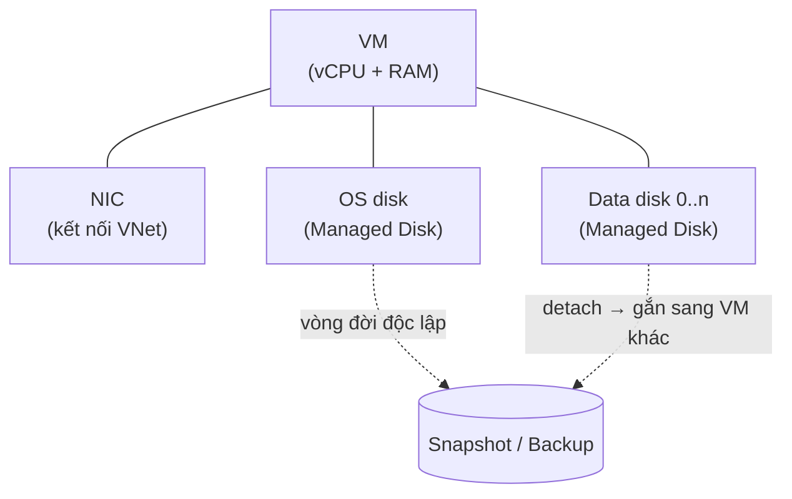

# 🖥️ Azure VM + Managed Disks — Compute foundation

> **Tác giả:** Mr.Rom\
> **Phiên bản:** v2.0.2\
> **Tạo lúc:** 24/05/2026\
> **Cập nhật:** 11/06/2026\
> **Level:** Basic (bài 01/5)\
> **Tags:** [MUST-KNOW]\
> **Yêu cầu trước:** [Azure — Tổng quan + account setup + az CLI](00_what-is-azure-overview.md) ✅, hiểu VPC/Region/AZ cơ bản

> 🎯 *Azure VM là dịch vụ *compute* (máy tính thuê theo nhu cầu) chủ lực của Azure, tương đương AWS EC2 hay GCP Compute Engine. Bài này đi qua: chọn **VM size** (các họ B/D/E/F/L/N và biến thể), **Managed Disks** (Standard HDD, Standard SSD, Premium SSD, Ultra Disk), **VMSS** (Virtual Machine Scale Sets — nhóm VM tự co giãn), bộ ba tiết kiệm cost **Spot VM** + **Reserved Instances** + **Azure Hybrid Benefit**, **Just-in-Time access** (mở port chỉ khi cần), rồi snapshot + backup. Khép lại bằng phần hands-on: deploy FastAPI trên VM Linux và để VMSS tự scale theo CPU.*

## 🎯 Sau bài này bạn sẽ

- [ ] Hiểu **VM size families** (B/D/E/F/L/N) và khi nào dùng họ nào.
- [ ] Phân biệt các loại **Managed Disk**: Standard HDD/SSD, Premium SSD v1/v2, Ultra Disk.
- [ ] Setup VM với **cloud-init** (tương đương *user data* của EC2).
- [ ] Phân biệt **Availability Zone vs Availability Set vs VMSS**.
- [ ] Deploy **VMSS** tự scale theo CPU.
- [ ] Hiểu **Spot VM** + **Reserved Instance** + **Azure Hybrid Benefit** (giảm cost 30-72%).
- [ ] Setup **Just-in-Time (JIT)** access cho SSH/RDP.
- [ ] Snapshot + Azure Backup cơ bản.
- [ ] Hands-on: FastAPI trên VM + auto-scale qua VMSS.

---

## Tình huống — Acme Shop scale website mùa sale 11.11

Hãy bắt đầu từ một sáng thứ Hai trước mùa sale lớn. Website Acme Shop lâu nay chạy gọn trên đúng một VM Linux, ngày thường vài nghìn lượt truy cập không sao. Nhưng sale 11.11 đang tới, marketing dự báo traffic tăng gấp 10 lần dồn vào 2 ngày — và sếp gọi bạn lên giao việc:

> *"Sale 11.11 traffic tăng 10x trong 2 ngày. Hiện chạy 1 VM Linux Standard_D2s_v5 — chắc chắn sập. Bạn deploy auto-scale: 1 VM baseline, scale lên 10 khi CPU > 70%, scale xuống khi < 30%. Tiết kiệm cost — dùng Spot VM cho phần scale, Reserved cho baseline. Backup hằng đêm. JIT SSH thay vì port 22 mở 24/7."*

Một câu nói của sếp gói trọn gần như toàn bộ kiến thức compute nền tảng của Azure. Dịch ra thành việc cần làm, bạn sẽ phải dựng:

- **VMSS** chạy image FastAPI.
- **Reserved Instance** cho 2 VM baseline (cam kết 1 năm để giảm ~40%).
- **Spot VM** cho phần burst (giảm tới 90%).
- **Azure Backup** snapshot hằng đêm, giữ 7 ngày.
- **JIT** chỉ mở port 22 khi cần.

Bài này sẽ mổ xẻ từng mảnh một, để đến cuối phần hands-on bạn ráp lại được đúng hệ thống sếp mô tả.

---

## 1️⃣ Azure VM size families

Việc đầu tiên khi tạo VM là chọn "size" — và đây là chỗ người mới hay choáng vì Azure có hàng trăm cái tên như `Standard_D4s_v5`. May là chúng được xếp thành vài **họ (family)** theo kiểu workload, nên thay vì nhớ từng cái, bạn chỉ cần nhớ "họ nào cho việc gì".

🪞 **Ẩn dụ**: *VM size giống **menu nhà hàng**. Mỗi family là một loại món: B = burger combo cân bằng giá rẻ; D = pizza general; E = mì Ý nhiều thịt (nhiều RAM); F = steak (CPU mạnh); L = buffet hải sản (nhiều SSD local); N = món GPU đặc biệt. Trong mỗi family, size (s, ms, l) là portion — nhỏ, vừa, lớn.*

### Quy ước đặt tên

Trước khi xem bảng, hãy giải mã chính cái tên. Mỗi ký tự trong `Standard_D4s_v5` đều mang thông tin, đọc được tên là đoán được VM mạnh yếu ra sao:

```text
Standard_D4s_v5
         │ │  │
         │ │  └─ Version (v1, v2, ..., v5 mới nhất 2026)
         │ └─── Features: s=Premium SSD, m=high-mem, d=local NVMe, a=AMD, b=block storage
         └───── Family + vCPU count (D family, 4 vCPU)
```

Nắm được công thức này, bạn đọc `E8s_v5` ra ngay: họ E (nhiều RAM), 8 vCPU, có hỗ trợ Premium SSD, thế hệ 5.

### Các họ VM năm 2026

Dưới đây là toàn bộ các họ phổ biến và việc nên giao cho từng họ. Đừng cố thuộc lòng — chỉ cần khi đứng trước một workload là biết ngắm vào cột "Use case" để chọn:

| Family | Tối ưu cho | Ví dụ | Use case |
|---|---|---|---|
| **B** (B1ls, B2ms, B4ms) | Burstable, rẻ nhất | B2s | Dev, web nhỏ, workload bùng phát từng lúc |
| **D** (Dv5, Dasv5, Ddsv5) | General purpose | D4s_v5 | Web/app server cân bằng |
| **E** (Ev5, Easv5, Edsv5) | Memory-optimized | E8s_v5 | Database, in-memory cache, SAP |
| **F** (Fsv2, Fxv2) | Compute-optimized | F4s_v2 | Batch, gaming server, scientific |
| **L** (Lsv3, Lasv3) | Storage-optimized (NVMe local) | L8s_v3 | NoSQL DB, data warehouse |
| **M** (Mv2, Mdsv2) | RAM khổng lồ (tới 12 TB) | M128ms | SAP HANA |
| **N** (NCv3, NDv5, NVv5) | GPU | NC24s_v3 | ML training/inference, rendering |
| **H** (HBv4, HC) | HPC | HB120rs_v3 | Scientific compute |
| **A** (Av2) | Entry-level legacy | A1_v2 | Test, không dùng production |
| **G** (Gsv2) | Memory + I/O optimized | G5 | Legacy SAP (deprecated) |

Phần lớn workload web/app đời thường rơi vào họ **D**; chỉ khi có nhu cầu đặc thù (DB ngốn RAM, batch ngốn CPU, ML cần GPU) bạn mới bước sang E/F/N.

### Chọn nhà sản xuất CPU

Ngoài họ, cái hậu tố nhỏ trong tên còn quyết định con chip bên dưới là Intel, AMD hay ARM — và điều này ảnh hưởng trực tiếp tới giá:

- **Mặc định**: Intel (Sapphire Rapids ở thế hệ v5).
- Hậu tố **`a`**: AMD EPYC — rẻ hơn ~10%, hiệu năng tương đương Intel cho hầu hết workload.
- Hậu tố **`p`**: Ampere ARM (Cobalt 100) — rẻ hơn ~30%, nhưng cần binary biên dịch sẵn cho ARM.

→ **Khuyến nghị 2026**: `Dasv5` (AMD general) cho web/app; `Edsv5` (Intel + local NVMe) cho DB stateful; `Fsv2` cho batch nặng CPU.

### Size, vCPU, RAM và disk

Sau khi chốt họ, bạn chọn size — tức số vCPU và lượng RAM đi kèm. Vài mốc quen thuộc để hình dung tỉ lệ:

```text
B1s     = 1 vCPU,  1 GB RAM,  free tier
B2s     = 2 vCPU,  4 GB RAM
B4ms    = 4 vCPU, 16 GB RAM (m=more RAM)
D2s_v5  = 2 vCPU,  8 GB RAM
D4s_v5  = 4 vCPU, 16 GB RAM
D8s_v5  = 8 vCPU, 32 GB RAM
E4s_v5  = 4 vCPU, 32 GB RAM (tỉ lệ RAM/vCPU cao hơn)
F4s_v2  = 4 vCPU,  8 GB RAM (ít RAM, nhiều CPU)
...
M128ms  = 128 vCPU, 3.8 TB RAM (khổng lồ)
```

→ Quy tắc dễ nhớ về tỉ lệ RAM trên mỗi vCPU: họ D là 1 vCPU : 4 GB; họ E là 1 : 8; họ F là 1 : 2. Nhìn tỉ lệ này là biết ngay họ nào nghiêng về RAM, họ nào nghiêng về CPU.

### Đối chiếu với AWS / GCP

Nếu bạn đã quen AWS hoặc GCP, bảng quy đổi sau giúp chuyển kiến thức cũ sang Azure mà không phải học lại từ đầu:

| Azure | AWS | GCP |
|---|---|---|
| B (burstable) | T3/T4g | e2-burst |
| D (general) | M5/M6i/M7i | n2/n2d |
| E (memory) | R5/R6i/R7i | n2-highmem |
| F (compute) | C5/C6i/C7i | c2/c2d |
| L (storage) | I3/I4i | n2-localssd |
| N (GPU) | P/G/Inf | a2/a3 (TPU/GPU) |

---

## 2️⃣ Managed Disks — Block storage

Chọn được VM rồi, câu hỏi tiếp theo là gắn ổ đĩa nào. Azure **Managed Disk** là *block storage* (ổ đĩa khối, giống ổ cứng gắn vào máy) do Azure tự quản lý vòng đời — bạn không phải lo Storage Account hay replication. Điều quyết định ở đây là chọn đúng *loại* disk, vì nó chi phối cả hiệu năng lẫn hoá đơn.

Trước khi đi vào từng loại disk, cần thấy rõ một điều trừu tượng: "VM" trên Azure thực chất là **nhiều resource rời nhau ghép lại** — compute, disk, NIC đều có vòng đời riêng:



→ Xoá VM không tự xoá data disk hay NIC — chính sự tách rời này cho phép snapshot, detach rồi gắn disk sang VM khác mà dữ liệu còn nguyên.

### Các loại disk năm 2026

Bốn loại disk xếp theo bậc thang giá–hiệu năng, từ rẻ-chậm tới đắt-nhanh:

| Loại | Use case | IOPS | Throughput | Cost (tương đối) |
|---|---|---|---|---|
| **Standard HDD** | Backup, dev, chi phí thấp | <500 | <60 MB/s | 1x (rẻ nhất) |
| **Standard SSD** | Web server, dev/test | <6,000 | <750 MB/s | 1.5x |
| **Premium SSD v1** | DB production, app | <20,000 | <900 MB/s | 3x |
| **Premium SSD v2** | DB hiệu năng cao (IOPS/throughput tách riêng) | tới 80,000 | tới 1,200 MB/s | 3x (trả cho sự linh hoạt) |
| **Ultra Disk** | DB top-tier (SAP HANA, Oracle) | tới 400,000 | tới 10,000 MB/s | 5-7x |

Quy tắc thực dụng: web/app thường dùng Standard SSD hoặc Premium SSD v1; chỉ DB ngốn I/O mới cần lên Premium SSD v2 hoặc Ultra Disk.

### Kích thước disk và hiệu năng

Có một điểm bẫy người mới: với disk thế hệ v1, hiệu năng **không** đặt riêng được — nó tăng theo kích thước. Đĩa lớn hơn nghĩa là nhanh hơn, kể cả khi bạn không cần dung lượng đó:

```text
Standard SSD:
  E1 (4 GiB)    → 500 IOPS, 60 MB/s
  E10 (128 GiB) → 500 IOPS, 60 MB/s
  E30 (1 TiB)   → 500 IOPS, 60 MB/s
  E80 (32 TiB)  → 2000 IOPS, 750 MB/s

Premium SSD v1:
  P10 (128 GiB) → 500 IOPS, 100 MB/s
  P30 (1 TiB)   → 5000 IOPS, 200 MB/s
  P80 (32 TiB)  → 20000 IOPS, 900 MB/s
```

→ **Quy tắc**: IOPS và throughput **scale theo size disk** (với v1). Đĩa lớn = nhanh hơn, đổi lại cost cao hơn. Đây là lý do nhiều người vô tình phải mua đĩa to chỉ để đủ IOPS.

### Premium SSD v2 (mới nhất)

Chính cái bẫy "phải mua to để đủ IOPS" ở trên là thứ Premium SSD v2 ra đời để chữa. Điểm khác biệt cốt lõi: nó **tách rời (decouple)** kích thước khỏi IOPS/throughput, cho phép bạn trả tiền đúng cho thứ mình cần.

```text
Premium SSD v2:
  Size:       1 GiB - 64 TiB
  IOPS:       3000 (miễn phí) + extra (tính phí)
  Throughput: 125 MB/s (miễn phí) + extra (tính phí)

Ví dụ:
  100 GiB + 10,000 IOPS + 500 MB/s = trả phí extra IOPS + throughput
```

→ Lý tưởng cho workload **không cần dung lượng lớn nhưng cần IOPS cao**. Lưu ý 2026: hiện chỉ có ở một số region và chưa dùng được làm OS disk.

### Disk caching

Bên cạnh loại disk, Azure còn cho bật *cache* trên host SSD để tăng tốc đọc/ghi. Chọn chế độ cache sai có thể làm mất dữ liệu, nên cần hiểu ba lựa chọn:

```text
ReadOnly  → cache read trên host SSD (mặc định cho OS disk + Premium data disk)
ReadWrite → cache cả read + write (có thể mất data nếu host crash — chỉ dùng cho SQL Server log)
None      → bỏ qua cache (cho workload ghi nhiều, file log)
```

Đặt chế độ cache ngay lúc attach disk:

```bash
# Set caching khi attach
az vm disk attach \
    --resource-group rg-prod-data \
    --vm-name vm-prod-db-01 \
    --name disk-prod-db-data \
    --caching ReadOnly
```

### Snapshot vs Backup

Cuối cùng là chuyện sao lưu. Azure cho hai cách bảo vệ dữ liệu disk, dễ nhầm vì nghe na ná nhau, nhưng phục vụ hai mục đích khác hẳn:

| Tiêu chí | Snapshot | Azure Backup |
|---|---|---|
| Mức độ | Một disk đơn lẻ | Cả VM (mọi disk + config) |
| Cost | Trả theo block tăng thêm | Trả theo VM + retention |
| Retention | Bạn tự quản lý thủ công | Policy tự động (daily/weekly/monthly/yearly) |
| App-consistent | Không (chỉ crash-consistent) | Có (VSS trên Windows / pre-post script trên Linux) |
| Cross-region | Copy thủ công | Built-in GRS |

→ VM production nên dùng Azure Backup (theo policy). Snapshot hợp cho việc one-off, ví dụ chụp nhanh trước một lần upgrade quan trọng.

---

## 3️⃣ High availability — AZ vs Availability Set vs VMSS

Một VM đơn lẻ luôn có rủi ro: rack mất điện, datacenter bảo trì, hay một sự cố vùng. Azure cho ba cấp độ "đề phòng" khác nhau, và phần lớn nhầm lẫn của người mới là không phân biệt được chúng. Hãy đi từ mạnh nhất tới cũ nhất.

### Availability Zone (AZ)

AZ là cách chống chịu tốt nhất: trải VM ra nhiều datacenter vật lý tách biệt trong cùng một region.

- Là các datacenter vật lý độc lập trong region (thường có 3 zone).
- VM trải qua nhiều zone → chịu được sự cố sập cả một zone.
- SLA: 99.99% khi dùng từ 2 zone trở lên.

Triển khai chỉ là thêm cờ `--zone` rồi lặp lại cho các zone khác:

```bash
# Deploy VM vào zone 1
az vm create --zone 1 --resource-group rg-prod --name vm-web-01 ...

# Deploy thêm vào zone 2, 3 cho HA
```

### Availability Set (legacy nhưng vẫn dùng)

Trước khi có AZ, Azure chống chịu sự cố bằng Availability Set — gom VM trong **cùng một datacenter** nhưng tách ra theo hai chiều:

- **Fault Domain (FD)**: tách theo rack (đề phòng mất điện, hỏng rack).
- **Update Domain (UD)**: tách theo đợt update (lúc Microsoft bảo trì host).
- SLA: 99.95% (thấp hơn AZ).

```bash
az vm availability-set create \
    --resource-group rg-prod \
    --name avset-web \
    --platform-fault-domain-count 2 \
    --platform-update-domain-count 5
```

→ **Best practice 2026**: ưu tiên **dùng AZ thay cho Availability Set**. Chỉ dùng Availability Set ở những region chưa có AZ.

### Virtual Machine Scale Sets (VMSS)

Hai cơ chế trên lo chuyện "không sập". VMSS lo thêm chuyện "đủ sức tải": nó là một nhóm VM giống hệt nhau, tự tăng/giảm số lượng theo metric.

```text
VMSS:
  - 1 VM image base
  - Capacity: min=1, max=10
  - Scale rule: CPU > 70% → +1; CPU < 30% → -1
  - Across AZs: tự động spread 3 zone
  - Load Balancer attach: chia traffic round-robin
```

→ Đây chính là cơ chế giải bài toán mùa sale 11.11 ở đầu bài. Tương đương AWS Auto Scaling Group / GCP Managed Instance Group.

### Chế độ orchestration

VMSS có hai chế độ điều phối, và chọn sai sẽ giới hạn khả năng của bạn về sau:

- **Uniform** (cũ): mọi VM giống hệt nhau, ít kiểm soát từng VM.
- **Flexible** (mới, mặc định từ 2024+): trộn được VM size, AZ, vòng đời từng VM — nên dùng cái này.

```bash
az vmss create \
    --resource-group rg-prod-web \
    --name vmss-web-prod \
    --orchestration-mode Flexible \
    --image Ubuntu2204 \
    --vm-sku Standard_D2s_v5 \
    --instance-count 2 \
    --admin-username azureuser \
    --generate-ssh-keys \
    --zones 1 2 3 \
    --upgrade-policy-mode Automatic
```

---

## 4️⃣ Pricing — Spot, Reserved, Hybrid Benefit

Có hạ tầng rồi thì câu hỏi tiếp theo luôn là tiền. Cùng một VM, hoá đơn có thể chênh nhau vài lần tuỳ cách bạn mua. Azure cho nhiều "hình thức trả tiền" — hiểu đúng từng cái là chìa khoá để baseline rẻ mà burst vẫn đủ.

🪞 **Ẩn dụ**: *Cost optimization giống **đặt vé máy bay**. Pay-as-you-go = mua tại quầy giá full; Reserved = đặt sớm 1-3 năm trước (giảm 30-72%); Spot = vé last-minute siêu rẻ (nhưng có thể bị huỷ bất cứ lúc nào); Hybrid Benefit = mang theo voucher license Windows/SQL Server sẵn có của công ty (giảm thêm ~40%).*

### Các hình thức pricing

Bảng dưới đặt cạnh nhau toàn bộ lựa chọn, theo trục mức giảm giá đổi lấy mức cam kết:

| Hình thức | Giảm | Cam kết | Use case |
|---|---|---|---|
| **Pay-As-You-Go (PAYG)** | 0% | Không | Dev, workload khó đoán |
| **Reserved Instance (RI) 1 năm** | tới 41% | 1 năm | Baseline production |
| **Reserved Instance 3 năm** | tới 62% | 3 năm | Baseline dài hạn |
| **Savings Plan 1 năm** | tới 28% | $/h linh hoạt | Trộn VM size linh hoạt |
| **Savings Plan 3 năm** | tới 65% | $/h linh hoạt | Linh hoạt dài hạn |
| **Spot VM** | tới 90% | Không (có thể bị evict) | Batch stateless, dev |
| **Azure Hybrid Benefit (AHB)** | tới 40% (Windows) + 55% (SQL) | License đã có | Khách đã có license Windows/SQL Server |

Nhìn bảng là thấy nguyên tắc: cam kết càng dài, càng rẻ; còn Spot rẻ nhất nhưng đánh đổi bằng rủi ro bị thu hồi.

### Spot VM

Spot là phần burst rẻ nhất cho mùa sale, nhưng phải tạo kèm chính sách thu hồi và giá trần để kiểm soát:

```bash
# Tạo Spot VM với eviction policy + max price
az vm create \
    --resource-group rg-batch \
    --name vm-spot-worker \
    --image Ubuntu2204 \
    --size Standard_D4s_v5 \
    --priority Spot \
    --eviction-policy Deallocate \
    --max-price 0.05 \
    --admin-username azureuser \
    --generate-ssh-keys
```

Ba điểm cần nắm khi dùng Spot:

- **eviction-policy**: `Deallocate` (giữ disk, dừng VM) hoặc `Delete` (xoá hẳn).
- **max-price**: giá trần $/h. Đặt `-1` nghĩa là chấp nhận giá hiện hành của Azure. Nếu giá Spot vượt trần → VM bị thu hồi.
- Cảnh báo trước khi bị thu hồi chỉ **30 giây** — nên workload bắt buộc phải tắt êm (*graceful shutdown*).

### Reserved Instance (RI)

RI là cách giảm giá cho phần baseline chạy ổn định quanh năm:

- Mua qua portal: vào "Reservations" → chọn VM family + region + kỳ hạn + cách trả (trả trước/trả theo tháng).
- Tự động áp cho mọi VM khớp size + region.
- Có thể **đổi/huỷ (exchange/cancel)** khá linh hoạt (chính sách 2026).

### Azure Hybrid Benefit (AHB)

Nếu công ty đã sở hữu license Windows hoặc SQL Server, AHB cho phép "mang lên" Azure để khỏi trả lại tiền license trong cost VM:

- Khách có **Windows Server license** kèm Software Assurance hoặc subscription → mang lên Azure VM Windows → không phải trả phần license Windows trong cost VM (giảm ~40%).
- Tương tự với **SQL Server license** → giảm tới 55% trên SQL VM / SQL Database.

```bash
# Bật AHB cho VM Windows
az vm update --resource-group rg-prod --name vm-win-01 --license-type Windows_Server

# Bật AHB cho SQL VM
az sql vm update --resource-group rg-prod --name sqlvm-prod --sql-license-type AHUB
```

→ **Kết hợp cả ba**: RI 3 năm + AHB + Spot cho phần burst có thể kéo tổng cost xuống tới **80%** so với PAYG. Đây chính là chiến lược cost mà sếp nhắm tới ở đầu bài.

---

## 5️⃣ Cloud-init — Bootstrap VM (tương đương EC2 user data)

VM tạo xong thì vẫn còn trống — cần cài phần mềm và cấu hình. Thay vì SSH vào gõ tay từng lệnh, *cloud-init* cho phép mô tả mọi thứ cần làm trong một file YAML, và VM tự chạy ngay lần boot đầu tiên (đúng vai trò của *user data* bên EC2):

```yaml
# cloud-init.yaml
#cloud-config
package_update: true
packages:
  - nginx
  - python3-pip

write_files:
  - path: /etc/nginx/sites-available/default
    content: |
      server {
        listen 80;
        location / { proxy_pass http://localhost:8000; }
      }

runcmd:
  - pip3 install fastapi uvicorn
  - systemctl enable nginx && systemctl start nginx
  - useradd -m apiuser
  - su - apiuser -c "uvicorn main:app --host 127.0.0.1 --port 8000 &"
```

Sau đó chỉ cần truyền file này vào lúc tạo VM qua cờ `--custom-data`:

```bash
az vm create \
    --resource-group rg-prod-web \
    --name vm-prod-web-01 \
    --image Ubuntu2204 \
    --size Standard_B2s \
    --admin-username azureuser \
    --generate-ssh-keys \
    --custom-data ./cloud-init.yaml
```

→ VM sẽ tự cài nginx + Python + FastAPI ngay khi boot, không cần ai động tay.

---

## 6️⃣ Just-in-Time (JIT) access

Phần cuối trong yêu cầu của sếp là bỏ thói quen mở port SSH 24/7. Để port 22 mở suốt là mời gọi *brute-force* (dò mật khẩu tự động). JIT giải quyết bằng cách chỉ mở cổng đúng lúc cần, đúng cho IP của bạn, rồi tự đóng.

🪞 **Ẩn dụ**: *JIT giống **thẻ key khách sạn**. Bạn yêu cầu mở phòng 22 trong 3 giờ → bộ phận an ninh mở NSG cho IP của bạn 3 giờ rồi tự khoá lại. Không có thẻ thì không vào được.*

### Vì sao cần JIT

Port 22 (SSH) / 3389 (RDP) mở 24/7 sẽ liên tục bị dò tìm mật khẩu. JIT chỉ mở **khi cần** và **chỉ cho IP của bạn**, nên thu hẹp tối đa bề mặt tấn công.

### Cài đặt

Bật JIT thường đi kèm Defender for Cloud, hoặc tự dựng workaround miễn phí bằng NSG + Logic App:

```bash
# Cần Defender for Cloud Standard ($15/server/tháng)
# Hoặc dùng manual NSG + Logic App như free workaround.

# Bật JIT cho VM (qua portal hoặc API)
# Portal:
#   Defender for Cloud → Workload protections → Just-in-time VM access
#   → Add VM → Set rule: port 22, max 3h, source "Per request"
```

### Yêu cầu mở quyền truy cập

Khi cần SSH vào để debug, bạn phát một request kèm IP hiện tại và thời lượng — NSG rule sẽ được tạo rồi tự xoá sau khi hết hạn:

```bash
# CLI request 1 giờ SSH từ IP nhà
MY_IP=$(curl -s ifconfig.me)
az security jit-policy initiate \
    --resource-group rg-prod-web \
    --name vm-prod-web-01 \
    --resource '[{"id":"/subscriptions/<sub>/resourceGroups/rg-prod-web/providers/Microsoft.Compute/virtualMachines/vm-prod-web-01","ports":[{"number":22,"allowedSourceAddressPrefix":"'$MY_IP'","duration":"PT1H"}]}]'

# NSG rule tạo tự động cho IP của bạn, 1 giờ, rồi tự xóa.
ssh azureuser@<vm-public-ip>
```

### Phương án miễn phí — Azure Bastion

Nếu không muốn mua Defender, có một hướng còn an toàn hơn: Azure Bastion — một *jump host* (máy trung gian) được Azure quản lý, giúp VM không cần public IP nào cả:

```bash
# Bastion = managed jump host, không cần public IP trên VM
az network bastion create \
    --resource-group rg-prod-shared \
    --name bastion-prod \
    --public-ip-address pip-bastion \
    --vnet-name vnet-prod \
    --sku Basic
# SSH qua portal hoặc native client → no public IP, no port 22
```

→ **Best practice**: Bastion + Conditional Access là nền tảng; JIT bổ sung khi vẫn cần truy cập trực tiếp.

---

## 7️⃣ Backup + Snapshot

Yêu cầu cuối cùng — "backup hằng đêm" — chạm tới hai công cụ đã so sánh ở phần 2. Giờ là lúc dùng chúng trong thực tế: snapshot cho lần chụp one-off, Azure Backup cho lịch tự động.

### Snapshot (one-off)

Snapshot hợp khi bạn muốn chụp nhanh một disk trước một thao tác rủi ro, rồi restore lại nếu cần:

```bash
# Snapshot OS disk
az snapshot create \
    --resource-group rg-prod-web \
    --name snap-vm-prod-web-01-os-20260524 \
    --source disk-vm-prod-web-01-os \
    --incremental true

# Restore: tạo disk từ snapshot rồi attach VM mới
az disk create \
    --resource-group rg-prod-web \
    --name disk-restored \
    --source snap-vm-prod-web-01-os-20260524
```

### Azure Backup (policy-based)

Còn với production, bạn muốn lịch backup tự động chạy mỗi đêm mà không phải nhớ — đó là việc của Azure Backup qua Recovery Services Vault:

```bash
# Tạo Recovery Services Vault
az backup vault create \
    --resource-group rg-prod-backup \
    --name rsv-acmeshop-prod \
    --location southeastasia

# Tạo backup policy (daily 02:00, retain 30 days)
# (Portal nhanh hơn CLI vì policy syntax phức tạp)

# Enable backup cho VM
az backup protection enable-for-vm \
    --resource-group rg-prod-backup \
    --vault-name rsv-acmeshop-prod \
    --vm vm-prod-web-01 \
    --policy-name DailyPolicy
```

→ Mỗi đêm Azure sẽ snapshot toàn bộ disk + config VM. Khi cần restore, bạn dựng VM mới hoặc thay disk từ bản backup.

---

## 🛠️ Hands-on — FastAPI trên VMSS auto-scale

Giờ ráp tất cả các mảnh trên lại thành đúng hệ thống sếp giao. Đọc qua mục tiêu trước để biết mình đang đi tới đâu, rồi làm tuần tự từng bước.

### Mục tiêu

Deploy FastAPI app trên VMSS chạy 2 instance baseline, scale-out tới 10 khi CPU > 70%, dùng Spot VM cho phần burst, đặt Load Balancer phía trước, và bật JIT cho lúc cần SSH debug.

### Bước 1 — VNet + NSG + LB

Đầu tiên dựng phần mạng: một VNet với subnet, một public IP và Load Balancer cùng health probe + rule để chia traffic port 80 về cổng 8000 của app:

```bash
# Resource Group
az group create --name rg-prod-web --location southeastasia

# VNet + Subnet
az network vnet create \
    --resource-group rg-prod-web \
    --name vnet-prod-web \
    --address-prefix 10.0.0.0/16 \
    --subnet-name snet-web \
    --subnet-prefix 10.0.1.0/24

# Public IP + LB
az network public-ip create \
    --resource-group rg-prod-web \
    --name pip-lb-web-prod \
    --sku Standard \
    --allocation-method Static \
    --zone 1 2 3

az network lb create \
    --resource-group rg-prod-web \
    --name lb-web-prod \
    --sku Standard \
    --public-ip-address pip-lb-web-prod \
    --frontend-ip-name fe-web \
    --backend-pool-name bp-web

# Health probe + rule port 80
az network lb probe create \
    --resource-group rg-prod-web \
    --lb-name lb-web-prod \
    --name probe-http \
    --protocol Http --port 80 --path /health

az network lb rule create \
    --resource-group rg-prod-web \
    --lb-name lb-web-prod \
    --name rule-http \
    --protocol Tcp --frontend-port 80 --backend-port 8000 \
    --frontend-ip-name fe-web --backend-pool-name bp-web \
    --probe-name probe-http
```

### Bước 2 — cloud-init cho FastAPI

Tiếp theo, mô tả phần cài đặt app bằng cloud-init: viết file `main.py` tối thiểu (có endpoint `/health` cho LB probe) và một systemd service để uvicorn tự chạy lại khi VM khởi động:

```bash
cat > cloud-init.yaml <<'EOF'
#cloud-config
package_update: true
packages:
  - python3-pip
write_files:
  - path: /home/azureuser/app/main.py
    owner: azureuser:azureuser
    content: |
      from fastapi import FastAPI
      import socket
      app = FastAPI()
      @app.get("/")
      def root(): return {"host": socket.gethostname()}
      @app.get("/health")
      def health(): return {"status": "ok"}
  - path: /etc/systemd/system/fastapi.service
    content: |
      [Unit]
      Description=FastAPI
      After=network.target
      [Service]
      User=azureuser
      WorkingDirectory=/home/azureuser/app
      ExecStart=/usr/local/bin/uvicorn main:app --host 0.0.0.0 --port 8000
      Restart=always
      [Install]
      WantedBy=multi-user.target
runcmd:
  - pip3 install fastapi uvicorn
  - systemctl daemon-reload
  - systemctl enable fastapi && systemctl start fastapi
EOF
```

### Bước 3 — Tạo VMSS Flexible

Dựng VMSS ở chế độ Flexible, gắn vào VNet + Load Balancer đã tạo, trải qua 3 zone và truyền cloud-init vừa viết:

```bash
az vmss create \
    --resource-group rg-prod-web \
    --name vmss-web-prod \
    --orchestration-mode Flexible \
    --image Ubuntu2204 \
    --vm-sku Standard_D2s_v5 \
    --instance-count 2 \
    --admin-username azureuser \
    --generate-ssh-keys \
    --vnet-name vnet-prod-web \
    --subnet snet-web \
    --lb lb-web-prod \
    --backend-pool-name bp-web \
    --zones 1 2 3 \
    --custom-data cloud-init.yaml \
    --upgrade-policy-mode Automatic
```

### Bước 4 — Autoscale rule

Đây là phần biến VMSS thành "tự co giãn": tạo profile autoscale (min 2, max 10) rồi gắn hai rule — scale-out khi CPU vượt 70%, scale-in khi tụt dưới 30%:

```bash
# Scale up: CPU > 70% trong 5 phút → +2
az monitor autoscale create \
    --resource-group rg-prod-web \
    --resource vmss-web-prod \
    --resource-type Microsoft.Compute/virtualMachineScaleSets \
    --name autoscale-web-prod \
    --min-count 2 --max-count 10 --count 2

az monitor autoscale rule create \
    --resource-group rg-prod-web \
    --autoscale-name autoscale-web-prod \
    --condition "Percentage CPU > 70 avg 5m" \
    --scale out 2

az monitor autoscale rule create \
    --resource-group rg-prod-web \
    --autoscale-name autoscale-web-prod \
    --condition "Percentage CPU < 30 avg 10m" \
    --scale in 1
```

### Bước 5 — Spot VM extra (thêm thủ công)

Để phần burst rẻ hơn, nâng capacity lên rồi cấu hình tier Spot cho instance mới (phần Spot tier cho VMSS Flexible làm gọn nhất qua ARM template):

```bash
# Thêm 5 Spot instance vào VMSS Flexible
az vmss scale --resource-group rg-prod-web --name vmss-web-prod --new-capacity 7

# Update profile để Spot tier cho instance mới (advanced — qua ARM template)
```

### Bước 6 — Test

Cuối cùng là kiểm chứng. Curl nhiều lần để thấy traffic chia luân phiên giữa các instance (hostname đổi), rồi load test để xem VMSS có thực sự scale lên khi CPU vượt ngưỡng không:

```bash
# Lấy public IP của LB
LB_IP=$(az network public-ip show -g rg-prod-web -n pip-lb-web-prod --query ipAddress -o tsv)

# Curl nhiều lần → thấy hostname khác nhau (round-robin)
for i in {1..10}; do curl http://$LB_IP/; echo; done

# Load test
ab -n 10000 -c 100 http://$LB_IP/
# Xem VMSS scale lên khi CPU > 70%
az vmss list-instances -g rg-prod-web -n vmss-web-prod --output table
```

### Bước 7 — Cleanup

Xoá nguyên resource group để dọn sạch mọi tài nguyên vừa tạo, tránh phát sinh cost:

```bash
az group delete --name rg-prod-web --yes --no-wait
```

→ **Kết quả**: VMSS tự scale theo CPU, Load Balancer phân phối traffic, và cost được tối ưu nhờ trộn Reserved cho baseline với Spot cho burst — đúng hệ thống sếp đặt hàng.

---

## 💡 Cạm bẫy thường gặp & Best practice

### 1. Chọn region không có AZ

**Bẫy**: Deploy ở `southeastasia` (Singapore) — có AZ ✅. Nhưng `southindia` chưa có AZ → không thể `--zone 1 2 3` → buộc fallback về Availability Set, SLA thấp hơn.

**Fix**: Kiểm tra region đã có AZ chưa bằng `az vm list-skus --location <region> --zone`. Các region thân thiện với Việt Nam mà có AZ: `southeastasia` ✅, `japaneast` ✅, `koreacentral` ✅.

### 2. Premium SSD chỉ support VM có hậu tố `s`

**Bẫy**: Attach Premium SSD vào `D4_v5` (không có `s`) → fail.

**Fix**: Luôn chọn VM có `s` (D4**s**_v5, B2**s**, E4**s**_v5) để hỗ trợ Premium Storage.

### 3. Spot VM bị evict mà không đủ cảnh báo

**Bẫy**: Chạy workload stateful trên Spot → bị thu hồi giữa chừng → mất data.

**Fix**:
- Spot **chỉ dành cho workload stateless** (web, batch).
- Lắng nghe sự kiện `eviction notice` (30s) → graceful shutdown.
- Việc quan trọng → dùng PAYG hoặc RI.
- Cách dung hoà: baseline RI + burst Spot.

### 4. Nhầm "disk to" với "disk nhanh"

**Bẫy**: Premium SSD P10 (128 GiB) → tưởng đủ. Nhưng nó chỉ có 500 IOPS. DB cần 5000 IOPS → nghẽn cổ chai.

**Fix**:
- Nhớ rằng IOPS scale theo size disk (với v1).
- DB cần P30 trở lên (1 TiB → 5000 IOPS).
- Hoặc dùng Premium SSD v2 — tách IOPS khỏi size.

### 5. Không bật disk caching cho OS

**Bẫy**: OS disk để caching = None → boot chậm, app load chậm.

**Fix**: OS disk **luôn** để ReadWrite caching (mặc định). Data disk: ReadOnly cho workload đọc nhiều, None cho file log ghi nhiều.

### 6. Public IP mặc định trên mọi VM

**Bẫy**: `az vm create` tự tạo Public IP mặc định → mọi VM expose ra Internet → bề mặt tấn công lớn.

**Fix**:
- Dùng `--public-ip-address ""` để bỏ qua.
- SSH/RDP qua **Azure Bastion** (managed jump host).
- Traffic outbound đi qua NAT Gateway / Azure Firewall.

### 7. Nhầm retention của Backup

**Bẫy**: Setup Backup retention 7 ngày → sau 1 năm phát hiện ransomware → đã quá 7 ngày, không restore được nữa.

**Fix**:
- Production: dùng pattern GFS (7 daily + 4 weekly + 12 monthly + 7 yearly).
- Test restore định kỳ mỗi quý — backup mà không restore được thì coi như vô dụng.

### 8. Mua Reserved Instance nhầm size

**Bẫy**: Mua RI cho `D4s_v5` 3 năm — sau 6 tháng workload đổi sang `E4s_v5` → RI không áp dụng được.

**Fix**:
- Khởi đầu bằng RI 1 năm (linh hoạt hơn 3 năm).
- Hoặc dùng **Savings Plan** — cam kết $/h, linh hoạt cross family/region.
- Đổi RI miễn phí (chính sách 2026).

### 9. Update Domain khiến Linux reboot bất ngờ

**Bẫy**: Microsoft bảo trì reboot VM khi update host → app chưa graceful shutdown → request fail.

**Fix**:
- Dùng VMSS / AZ → trải qua UD/FD/zone, Microsoft update từng nhóm một.
- Đăng ký **Scheduled Events** API (qua metadata service) — VM nhận cảnh báo 15 phút trước khi reboot.
- App graceful shutdown: rút kết nối khỏi LB (*drain*) rồi mới terminate.

---

## 🧠 Tự kiểm tra (Self-check)

- [ ] So sánh các họ B vs D vs E vs F vs L — chọn họ nào cho web server, DB, batch nặng CPU?
- [ ] Premium SSD v1 vs v2 — khi nào v2 tốt hơn?
- [ ] Vẽ sơ đồ Availability Zone vs Availability Set vs VMSS?
- [ ] Tính cost: 2 D4s_v5 PAYG vs 2 D4s_v5 RI 3 năm + AHB Windows. Giảm bao nhiêu %?
- [ ] Spot VM khi nào dùng đúng? Ba trường hợp KHÔNG nên dùng?
- [ ] Viết cloud-init cài nginx + start systemd service?
- [ ] JIT access vs Azure Bastion — khác nhau ra sao?
- [ ] Snapshot vs Azure Backup — khi nào dùng cái nào?
- [ ] VMSS Flexible vs Uniform orchestration — chọn cái nào năm 2026?

---

## ⚡ Tra cứu nhanh (Cheatsheet)

| Việc cần làm | Lệnh / cấu hình |
|---|---|
| Chọn VM general 2026 | `Standard_Dasv5` (AMD), có hậu tố `s` để hỗ trợ Premium SSD |
| Tạo VM với cloud-init | `az vm create ... --custom-data ./cloud-init.yaml` |
| Attach Premium disk với cache đọc | `az vm disk attach ... --caching ReadOnly` |
| Deploy HA tốt nhất | `--zone 1 2 3` (Availability Zone, SLA 99.99%) |
| Tạo nhóm tự scale | `az vmss create ... --orchestration-mode Flexible` |
| Rule scale theo CPU | `az monitor autoscale rule create --condition "Percentage CPU > 70 avg 5m" --scale out 2` |
| VM giá rẻ cho batch | `az vm create ... --priority Spot --eviction-policy Deallocate --max-price -1` |
| Bật AHB cho VM Windows | `az vm update ... --license-type Windows_Server` |
| Snapshot OS disk | `az snapshot create ... --incremental true` |
| Bật backup theo policy | `az backup protection enable-for-vm ...` |
| Kiểm tra region có AZ | `az vm list-skus --location <region> --zone` |

---

## 📚 Từ Điển Thuật Ngữ (Glossary)

| Thuật ngữ | Tiếng Việt | Giải thích |
|---|---|---|
| **VM** | Máy ảo | Virtual Machine — máy tính thuê theo nhu cầu |
| **VMSS** | Nhóm VM tự co giãn | Virtual Machine Scale Set — nhóm VM giống nhau, tự scale |
| **VM family** | Họ VM | B/D/E/F/L/N — phân loại theo kiểu workload được tối ưu |
| **vCPU** | CPU ảo | Virtual CPU — luồng CPU ảo cấp cho VM |
| **Managed Disk** | Ổ đĩa được quản lý | Block storage do Azure quản lý vòng đời (khác disk unmanaged trên Storage Account) |
| **Standard HDD/SSD** | Đĩa tiêu chuẩn | Loại disk rẻ, IOPS thấp |
| **Premium SSD** | Đĩa cao cấp | Loại disk cho production, IOPS cao |
| **Ultra Disk** | Đĩa top-tier | Disk hiệu năng đỉnh, IOPS tới 400k |
| **IOPS** | Số lệnh I/O mỗi giây | Input/Output Operations Per Second — thước đo tốc độ truy xuất disk |
| **AZ** | Vùng khả dụng | Availability Zone — datacenter tách biệt trong cùng region |
| **Availability Set** | Nhóm khả dụng | Group VM cùng datacenter, tách FD/UD |
| **Fault Domain (FD)** | Miền lỗi | Tách theo rack/nguồn điện |
| **Update Domain (UD)** | Miền cập nhật | Tách theo đợt bảo trì |
| **Spot VM** | VM giá hời | VM giảm tới 90%, có thể bị thu hồi |
| **Reserved Instance (RI)** | Instance đặt trước | Cam kết 1-3 năm, giảm 30-72% |
| **Savings Plan** | Gói tiết kiệm | Cam kết $/h, linh hoạt cross family |
| **Azure Hybrid Benefit (AHB)** | Ưu đãi license sẵn có | Dùng license Windows/SQL sẵn có → giảm 40-55% |
| **Cloud-init** | Script khởi tạo VM | Script bootstrap VM lần boot đầu tiên |
| **JIT access** | Truy cập đúng lúc | Just-in-Time — mở port chỉ khi cần |
| **Azure Bastion** | Máy trung gian được quản lý | Managed jump host SSH/RDP qua trình duyệt |
| **NSG** | Nhóm bảo mật mạng | Network Security Group — firewall tầng L4 |
| **Recovery Services Vault** | Kho phục hồi | Container chứa dữ liệu của Azure Backup |
| **Scheduled Events** | Sự kiện lịch trình | API metadata báo trước maintenance |

---

## 🔗 Liên kết & Tài nguyên

### 🧭 Định hướng lộ trình học

- ⬅️ **Bài trước:** [Azure — Tổng quan + account setup + az CLI](00_what-is-azure-overview.md)
- ➡️ **Bài tiếp theo:** [Azure Blob Storage + RBAC](02_blob-storage-and-rbac.md)
- ↑ **Về cụm:** [Azure](../../README.md)

### 🧩 Các chủ đề có thể bạn quan tâm

- ☁️ [EC2 + EBS — Compute foundation](../../../aws/lessons/01_basic/01_ec2-and-ebs-compute.md) — bản tương đương bên AWS.
- ☁️ [GCP Compute Engine + Persistent Disks](../../../gcp/lessons/01_basic/01_compute-engine-and-disks.md) — bản tương đương bên GCP.
- 🌐 [Cloud Networking — VPC, Subnets, Peering, VPN](../../../cloud-fundamentals/lessons/01_basic/02_cloud-networking.md) — nền tảng mạng cho VM.
- 🏗️ [IaC — Terraform Azure provider](../../../../10_devops/iac/) — quản lý hạ tầng bằng code.

### 🌐 Tài nguyên tham khảo khác

- [Azure VM sizes](https://learn.microsoft.com/azure/virtual-machines/sizes) — bảng tra đầy đủ các họ và size.
- [Azure Managed Disks](https://learn.microsoft.com/azure/virtual-machines/managed-disks-overview)
- [VMSS Flexible orchestration](https://learn.microsoft.com/azure/virtual-machine-scale-sets/virtual-machine-scale-sets-orchestration-modes)
- [Spot VM pricing](https://azure.microsoft.com/pricing/spot-advisor/)
- [Azure Hybrid Benefit](https://azure.microsoft.com/pricing/hybrid-benefit/)
- [Azure Bastion](https://learn.microsoft.com/azure/bastion/)
- [Azure Backup VM](https://learn.microsoft.com/azure/backup/backup-azure-vms-introduction)
- [cloud-init on Azure](https://learn.microsoft.com/azure/virtual-machines/linux/using-cloud-init)

---

## 📌 Nhật ký thay đổi (Changelog)

- **v1.0.0 (24/05/2026)** — Bài 01 cụm Azure basic. VM size families (B/D/E/F/L/N) + Managed Disks (Standard/Premium/Ultra) + AZ/Availability Set/VMSS + Spot/RI/Hybrid Benefit pricing + cloud-init + JIT/Bastion + Snapshot/Backup + hands-on VMSS FastAPI auto-scale + 9 pitfalls. Mirror bài AWS EC2+EBS.
- **v2.0.0 (01/06/2026)** — Viết lại toàn bộ prose từ kiểu "điện tín" sang tiếng Việt narrative (lời dẫn trước mỗi bảng/code/list, câu phân tích sau bảng, câu bắc cầu giữa các section); giữ nguyên toàn bộ nội dung kỹ thuật, số liệu và code. Chuẩn hoá heading framework (Self-check/Cheatsheet/Cạm bẫy) + thêm mục Cheatsheet mới; đổi metadata "Prerequisites" → "Yêu cầu trước"; Glossary chuyển sang 3 cột (Thuật ngữ | Tiếng Việt | Giải thích) + bổ sung IOPS; nav theo marker ⬅️/➡️/↑ với link-text là tiêu đề thật của bài đích + 3 sub chuẩn; fence output gắn ngôn ngữ `text`/`yaml`.
- **v2.0.1 (11/06/2026)** — Việt hoá heading nội dung mô tả sang tiếng Việt (giữ thuật ngữ/brand/param) theo Vietnamese-first.
- **v2.0.2 (11/06/2026)** — Bổ sung sơ đồ cấu tạo VM (compute + OS/data disk + NIC, vòng đời tách rời) cho trực quan.
