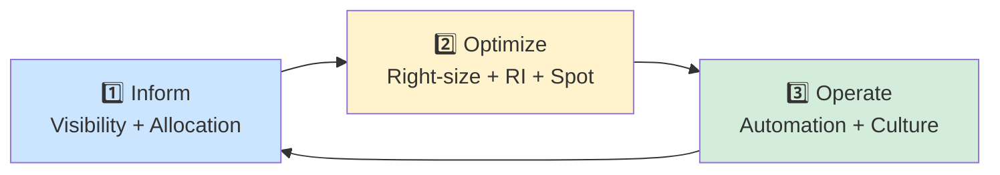
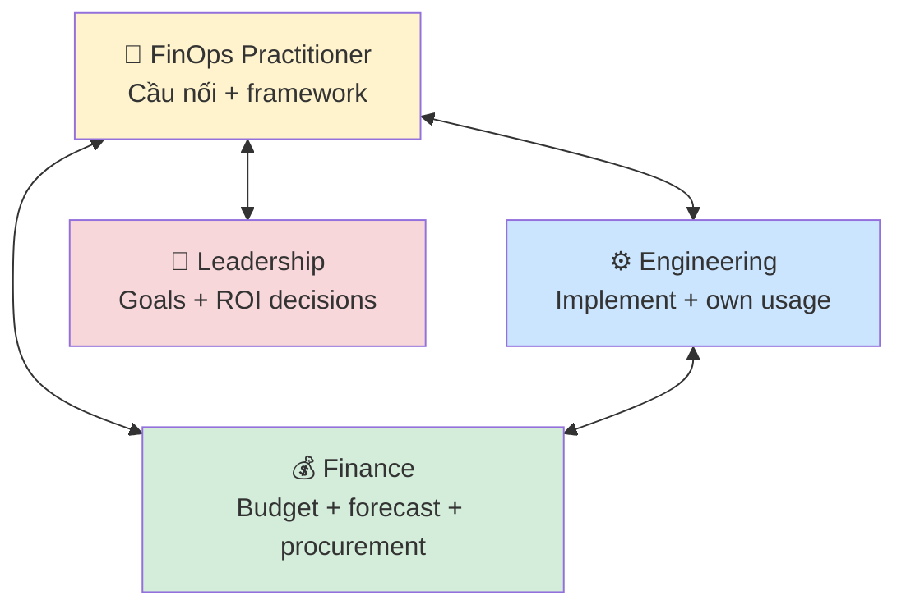

# 🎓 FinOps — Văn hóa quản lý chi phí Cloud

> **Tác giả:** Mr.Rom\
> **Phiên bản:** v1.1.0\
> **Tạo lúc:** 24/05/2026\
> **Cập nhật:** 01/06/2026\
> **Level:** Basic\
> **Tags:** [MUST-KNOW]\
> **Yêu cầu trước:** [Cloud fundamentals overview](../../../cloud-fundamentals/lessons/01_basic/00_what-is-cloud-computing.md)

> 🎯 *Trước khi học tactic cụ thể (RI, Spot, tag, optimization), bạn cần hiểu **FinOps là gì** và **vì sao** nó là 1 nghề riêng. Sau bài này bạn sẽ biết FinOps Foundation định nghĩa thế nào, 3 phases vận hành (Inform/Optimize/Operate), team structure 3-bên (engineer + finance + FinOps practitioner), và 2 model phân bổ chi phí showback vs chargeback.*

## 🎯 Sau bài này bạn sẽ

- [ ] Hiểu **FinOps** là gì, vì sao cần FinOps team riêng
- [ ] Nắm 6 nguyên tắc của FinOps Foundation
- [ ] Phân biệt 3 phases vận hành: **Inform → Optimize → Operate**
- [ ] Hiểu team structure: engineering + finance + FinOps practitioner
- [ ] Phân biệt **showback** vs **chargeback** model
- [ ] Nhận biết anti-pattern "tắt finance ra khi engineer chốt architecture"
- [ ] Tự đánh giá team mình đang ở phase nào

---

## Tình huống — Acme Shop nhận hóa đơn $50k/tháng

Một sáng thứ Hai, CFO Acme Shop gọi sếp tech vào phòng họp:

> *"Bill cloud tháng rồi $50k. Năm ngoái cùng kỳ $38k — tăng 30%. CFO board hỏi vì sao. Tôi không trả lời được. Bạn xem lại — cuối quý phải giảm 25%, không tôi cắt budget mảng khác."*

Sếp tech về team, ai cũng ngơ:
- Backend lead: *"Mình code chứ đâu xem bill?"*
- DevOps: *"Có Cost Explorer mở ra nhìn... nhưng đọc không hiểu hết."*
- Junior: *"Tag là gì? Mình chỉ biết tạo EC2 thôi."*

Vấn đề **không** phải kỹ thuật — bạn không thiếu công cụ. Vấn đề là **không ai chịu trách nhiệm tổng thể** về chi phí cloud. Engineer chỉ quan tâm chạy được; finance không hiểu kỹ thuật để hỏi câu đúng; CFO chỉ thấy con số tăng.

Chính vì thế **FinOps** ra đời.

---

## Vậy FinOps là gì?

**FinOps** (viết tắt *Cloud Financial Operations*) là **văn hóa và bộ thực hành** giúp tổ chức:
- Nắm được tiền cloud đang chảy đi đâu (visibility).
- Tối ưu chi phí mà không hy sinh tốc độ/chất lượng.
- Đẩy trách nhiệm chi phí xuống tới từng engineer — không chỉ finance.

🪞 **Ẩn dụ**: *FinOps giống như **household budget** — bạn phải biết tiền tiêu vào đâu (điện, nước, ăn, giải trí) mới cắt được mục dư thừa. Đổ tiền vào tài khoản chung mà không ai nhìn → cuối tháng "biến mất" mà không biết vì sao.*

🪞 **Ẩn dụ phụ**: *FinOps cũng giống **đèn báo xăng trên xe** — kỹ sư lái xe (engineer) thấy đèn báo sắp hết, sẽ đổ xăng (optimize) hoặc đổi đường ngắn hơn (re-architect). Không có đèn báo → cứ chạy đến khi xe chết giữa cao tốc (CFO la làng).*

### FinOps Foundation — tổ chức chuẩn hóa

**FinOps Foundation** (thuộc Linux Foundation, 2019) là nơi:
- Định nghĩa framework chính thức (Principles, Capabilities, Maturity).
- Cấp chứng chỉ **FOCP** (FinOps Certified Practitioner) + **FOCE** (Engineer).
- Cộng đồng 12,000+ practitioners (2026).

→ Khi nói "FinOps" ở các công ty enterprise, ngầm hiểu = follow **FinOps Foundation framework**.

### Định nghĩa kỹ thuật chính thức

> *"FinOps is an operational framework and cultural practice which maximizes the business value of cloud, enables timely data-driven decision making, and creates financial accountability through collaboration between engineering, finance, and business teams."* — [FinOps Foundation](https://www.finops.org/introduction/what-is-finops/)

→ 3 từ khóa: **maximize business value**, **data-driven decision**, **collaboration**.

---

## 6 nguyên tắc của FinOps Foundation

Hiểu FinOps là gì rồi, ta xem 6 nguyên tắc cốt lõi — mỗi nguyên tắc là 1 "kim chỉ nam" hành xử.

| # | Nguyên tắc | Ý nghĩa thực dụng |
|---|---|---|
| 1 | **Teams need to collaborate** | Engineer + Finance + Product + Leadership cùng bàn — không ai im lặng |
| 2 | **Everyone takes ownership of cloud usage** | Junior dev cũng phải biết EC2 m6i.xlarge của mình $146/tháng |
| 3 | **A centralized team drives FinOps** | Cần 1 nhóm chuyên trách kéo dữ liệu, định nghĩa standard, training |
| 4 | **Reports should be accessible and timely** | Cost dashboard hôm nay phải xem được số hôm qua — không chờ cuối tháng |
| 5 | **Decisions are driven by business value** | $1k/tháng cho monitoring là nhiều hay ít? Tùy ROI — không cắt mù |
| 6 | **Take advantage of the variable cost model of the cloud** | Cloud cho phép scale up/down — biến cost biến thiên thành lợi thế |

### Phân tích nguyên tắc 2 — Ownership

Đây là điểm **quan trọng nhất** và cũng **khó nhất** để áp dụng.

❌ **Anti-pattern**: Engineer chạy `terraform apply` mà không biết tốn bao nhiêu.\
✅ **Pattern đúng**: Trong PR review, bot tự comment: *"PR này thêm $230/tháng (RDS Multi-AZ + 2 EC2 m6i.large). Confirm to merge?"* — engineer thấy số liền tay.

→ Công cụ giúp việc này: **Infracost** (bài 04).

### Phân tích nguyên tắc 5 — Business value

Câu hỏi cuối cùng FinOps trả lời **không** phải *"làm sao rẻ nhất?"* mà là *"đầu tư X đô có đem lại Y giá trị tương xứng không?"*.

Ví dụ Acme Shop:
- Logging $5k/tháng → trông nhiều, nhưng giúp giảm thời gian debug từ 4h xuống 30 phút → ROI dương → giữ.
- Pre-prod cluster $8k/tháng nhưng team chỉ deploy 2 lần/tuần → ROI âm → schedule shutdown 18h-8h sáng + cuối tuần → tiết kiệm $4.5k.

→ FinOps **không** cắt mù. FinOps **cắt có lý do**.

---

## 3 phases vận hành — Inform / Optimize / Operate

FinOps Foundation chia journey thành 3 phases lặp lại liên tục (như Plan-Do-Check-Act của DevOps):



### Phase 1 — Inform (Visibility + Allocation)

**Mục tiêu**: *"Tiền đang chảy đi đâu?"*

Việc làm:
- Bật **Cost Explorer / Cost Management / Billing Console** native.
- **Tag** mọi resource (env, team, service, cost-center) — bài 02.
- Build **showback report** monthly: team X tốn $Y, team Z tốn $W.
- Setup budget alert (vượt 80% gửi Slack).

→ Đầu ra: dashboard ai cũng xem được, mỗi resource có owner.

🪞 **Ẩn dụ**: *Phase Inform giống **bật đèn trong nhà** — bạn cần thấy rõ trước khi quyết định dọn cái gì.*

### Phase 2 — Optimize (Tactical actions)

**Mục tiêu**: *"Cắt cái gì, cắt thế nào?"*

Việc làm:
- **Right-sizing** instance (Compute Optimizer / Recommender) — bài 03.
- Mua **Reserved Instance** / **CUD** / **Savings Plan** cho baseline — bài 01.
- Dùng **Spot** cho fault-tolerant workload — bài 01.
- Tắt resource không dùng (dev env nighttime, orphan snapshot).
- Lifecycle storage to colder tier — bài 03.

→ Đầu ra: hóa đơn giảm 20-40%, không hy sinh production.

### Phase 3 — Operate (Continuous improvement)

**Mục tiêu**: *"Làm sao không lặp lại bài học cũ?"*

Việc làm:
- **Automate remediation** — Lambda kill orphan EBS volume, GCP Function delete idle VM — bài 04.
- **Infracost trong CI/CD** — chặn PR đẩy cost lên không kiểm soát.
- **Anomaly detection** — ML alert khi cost spike bất thường.
- **Quarterly review** — RI/CUD expiring? Cần renew?
- **Training** engineer: cost-aware mindset.

→ Đầu ra: cost được monitor + tự sửa, FinOps embed vào DNA team.

### Maturity model

FinOps Foundation chia mỗi capability thành 3 maturity level:

| Level | Tên | Đặc điểm |
|---|---|---|
| 🐢 **Crawl** | Basic | Manual reporting, no tags, monthly review |
| 🚶 **Walk** | Intermediate | Auto-tagging enforced, weekly review, RI in place |
| 🏃 **Run** | Advanced | Automated remediation, anomaly detection, FinOps embedded in CI/CD |

→ Acme Shop $50k/tháng ở **Crawl** — mục tiêu sau 6 tháng lên **Walk**.

---

## Team structure — 3 vai trò không thể thiếu

FinOps **không** phải việc của 1 người. Nó là **collaboration** giữa 3 nhóm:



### Vai trò 1 — FinOps Practitioner (cầu nối)

- Pull dữ liệu cost, build dashboard.
- Định nghĩa **tagging policy**, **chargeback model**.
- Training engineer về cost-aware.
- Quarterly review với leadership.

Job title gặp: *FinOps Engineer*, *Cloud Cost Analyst*, *Cloud Economist*.

### Vai trò 2 — Engineering (owner usage)

- Tag resource khi tạo.
- Right-size instance khi recommend.
- Implement automation (auto-shutdown, lifecycle).
- Đề xuất re-architect khi cost không hợp lý.

### Vai trò 3 — Finance (budget guardian)

- Set budget per team.
- Forecast chi tiêu quý/năm.
- Mua RI/CUD/Savings Plan (cần phê duyệt finance).
- Hợp đồng EDP (Enterprise Discount Program) với cloud vendor.

### Anti-pattern phổ biến — "Tắt finance khi engineer chốt arch"

**Tình huống thật** (gặp ở 90% startup):
1. Engineer thiết kế architecture, chốt **dùng MongoDB Atlas Dedicated**.
2. Triển khai 3 tháng, $8k/tháng.
3. Finance review: *"Sao MongoDB tốn vậy? Có self-host được không?"*
4. Engineer: *"Quyết rồi, sửa giờ tốn 6 tháng migration."*

**Sai ở đâu**: Quyết định **architecture-level** (database choice, region strategy, multi-cloud) có **lifetime cost impact 3-5 năm** mà finance không có mặt khi chốt.

**Đúng**: Mọi quyết định arch ảnh hưởng > $1k/tháng phải có **TCO estimate** trước khi approve. Finance ngồi cùng. FinOps practitioner chuẩn bị số.

🪞 **Ẩn dụ**: *Giống mua nhà — kiến trúc sư (engineer) thiết kế đẹp, nhưng bạn (finance) phải check ngân sách trước khi đặt cọc. Đặt rồi mới hỏi tiền đâu = thảm họa.*

---

## Showback vs Chargeback — 2 model phân bổ chi phí

Phase Inform sinh ra cost report cho mỗi team. Câu hỏi: report đó là *"chỉ để xem"* hay *"thực sự tính tiền"*?

| Model | Cơ chế | Ai dùng |
|---|---|---|
| 📊 **Showback** | Báo cáo cho team biết tốn bao nhiêu, **không** trừ vào budget team | Startup, công ty đơn product |
| 💸 **Chargeback** | Cost team A **chuyển thực** vào budget team A (internal billing) | Enterprise đa BU, công ty mẹ-con |

### Showback (đơn giản, ít drama)

Mỗi tháng FinOps gửi báo cáo:
```
Team Backend: $12,400 (EC2 $6k + RDS $4k + S3 $2.4k)
Team Mobile:  $3,200 ($1k Cognito + $2.2k API GW)
Team Data:    $18,000 (BigQuery $12k + Snowflake $6k)
```

→ Team biết số mình tốn, **nhưng** finance vẫn trả tổng. Mục tiêu: tạo awareness, không tạo căng thẳng.

✅ Pros: Easy implement, không đụng accounting.\
❌ Cons: Team "biết nhưng không đau" → optimize lười.

### Chargeback (nghiêm túc, đụng tới ngân sách)

Mỗi tháng accounting **thực sự trừ** $12,400 vào budget team Backend. Team tiêu > budget → leadership hỏi.

✅ Pros: Tạo incentive thật, optimize quyết liệt.\
❌ Cons: Phức tạp setup (cross-charge giữa entity), có thể tạo conflict ("tại sao tôi phải trả cho shared infra?").

### Khi nào chọn cái nào

| Tình huống | Model phù hợp |
|---|---|
| Startup 1 product, < 50 engineer | **Showback** (đủ) |
| Enterprise 10+ BU, mỗi BU có P&L riêng | **Chargeback** |
| Đang transition Crawl → Walk | **Showback** trước, **Chargeback** sau 6-12 tháng |
| Shared infra (network, log, CI/CD) | **Showback** + cost-pool allocation pro-rata |

→ Bài 02 sẽ dạy chi tiết pro-rata cho shared resource.

---

## Cost-aware culture — gốc của mọi thứ

Công cụ + framework chỉ là 20%. 80% là **văn hóa**. Bạn có thể có Cost Explorer, Infracost, tag perfect — nhưng nếu engineer nghĩ *"cloud rẻ, scale lên đi"*, bill vẫn tăng.

### Hành vi cost-aware

| Hành vi | Cost-aware? |
|---|---|
| Trước khi tạo RDS db.r6i.4xlarge → mở calculator, check giá | ✅ |
| Code xong feature, deploy lên prod, không tag | ❌ |
| PR comment: *"Em chọn t3.small thay vì m6i.large, save $80/tháng"* | ✅ |
| Dev env chạy 24/7 cuối tuần, không ai động | ❌ |
| Phát hiện EBS volume orphan, mở ticket → DevOps xóa | ✅ |
| *"Cost không phải việc của tôi"* | ❌❌❌ |

### Cách build culture

1. **Cost dashboard public** — ai cũng xem được số team mình.
2. **Cost-of-day Slack** — daily report kênh #engineering.
3. **Cost OKR** — KPI quý có 1 mục về cost (giảm X%, hoặc maintain cost/customer < Y).
4. **Cost review hàng tuần** trong eng all-hands — 10 phút thôi, nhưng đều.
5. **Reward khi optimize** — bonus / shoutout cho engineer save > $1k/tháng.
6. **Onboarding mới**: 1 buổi FinOps 101 (chính là bài này).

---

## 💡 Cạm bẫy thường gặp & Best practice

### ❌ Cạm bẫy: Coi FinOps là job của 1 mình DevOps

- **Triệu chứng**: DevOps team Slack call lúc 11h đêm tìm cách giảm bill, engineer ai cũng phớt.
- **Nguyên nhân**: Lãnh đạo không ép ownership xuống dev team.
- **Cách tránh**: Cost OKR cho mọi engineer team, không chỉ DevOps. FinOps practitioner là **enabler**, không phải single point of accountability.

### ❌ Cạm bẫy: Cắt cost mù, hy sinh reliability

- **Triệu chứng**: Cắt Multi-AZ RDS → tiết kiệm $400/tháng → 1 tháng sau outage 4h → mất $200k revenue.
- **Nguyên nhân**: Áp dụng FinOps mà bỏ qua nguyên tắc 5 — *business value*.
- **Cách tránh**: Mọi cost-cut quyết định phải có **risk assessment**. SLA mission-critical → không touch.

### ❌ Cạm bẫy: Mua RI/CUD quá nhiều rồi không dùng hết

- **Triệu chứng**: Mua $20k Reserved Instance 3-year, sau 6 tháng team migrate sang Lambda → RI thừa.
- **Nguyên nhân**: Quá hào hứng discount, không forecast usage cẩn thận.
- **Cách tránh**: Bắt đầu với **Savings Plan / Flexible CUD** (linh hoạt hơn). 1-year trước, 3-year sau khi confident. Cover **70-80%** baseline, không 100%.

### ✅ Best practice: Bắt đầu Phase Inform trước, đừng nhảy Optimize

- **Vì sao**: Không có visibility = optimize mò → có thể cắt nhầm production-critical.
- **Cách áp dụng**: Tháng 1 chỉ làm tagging + dashboard. Tháng 2-3 mới Optimize. Tháng 4+ Operate.

### ✅ Best practice: FinOps khi mới nhỏ — embed sớm

- **Vì sao**: Tagging + cost-aware mindset rẻ khi team 10 người, đắt khi team 200 người (migration tags, retrain culture).
- **Cách áp dụng**: Startup từ $5k/tháng cloud đã nên start. Đừng đợi $50k mới kêu CFO.

---

## 🧠 Tự kiểm tra (Self-check)

**Q1.** FinOps khác gì so với Finance team truyền thống?

<details>
<summary>💡 Đáp án</summary>

Finance truyền thống: phụ trách kế toán, P&L, không can thiệp kỹ thuật.

FinOps: **cầu nối** giữa Finance + Engineering, có kiến thức cloud kỹ thuật để hỏi câu đúng (vd: *"Sao RDS Multi-AZ mà chỉ 1 instance?"*). FinOps practitioner thường xuất thân từ DevOps/Cloud Engineer học thêm finance, không phải accountant thuần.

</details>

**Q2.** Acme Shop $50k/tháng, mới bật Cost Explorer lần đầu. Phase nào?

<details>
<summary>💡 Đáp án</summary>

Phase 1 — **Inform**. Lý do: chưa có visibility, chưa biết tiền đi đâu. Bước tiếp:
1. Enforce tagging policy (env, team, service).
2. Build showback monthly report.
3. Set budget alert.

Nhảy thẳng Optimize (mua RI ngay) là sai — chưa biết workload nào steady để commit.

</details>

**Q3.** Khi nào nên chọn Chargeback thay vì Showback?

<details>
<summary>💡 Đáp án</summary>

Khi tổ chức có **đa Business Unit độc lập P&L** (vd: tập đoàn mẹ-con, công ty đa product với CFO mỗi mảng).

Lý do: Chargeback tạo accountability thật (đụng vào ngân sách team), incentive optimize cao hơn. Nhưng cần setup accounting phức tạp + agreement giữa các BU.

Startup 1 product, < 50 người → Showback đủ.

</details>

**Q4.** Engineer chốt dùng MongoDB Atlas Dedicated cost $8k/tháng mà không hỏi Finance. Vi phạm nguyên tắc FinOps nào?

<details>
<summary>💡 Đáp án</summary>

Vi phạm:
- **Nguyên tắc 1** (Teams need to collaborate) — quyết định arch lớn nhưng không có Finance.
- **Nguyên tắc 5** (Decisions driven by business value) — không có TCO analysis 3 năm trước khi chốt.

Cách đúng: Engineer chuẩn bị 3 option (self-host MongoDB, Atlas Shared, Atlas Dedicated) + TCO + risk → Finance + Leadership chọn cùng.

</details>

**Q5.** Tổ chức có dashboard cost, weekly review, nhưng không có ai làm gì với data. Vấn đề ở đâu?

<details>
<summary>💡 Đáp án</summary>

Vấn đề ở **văn hóa** (Operate phase chưa active) — có công cụ nhưng không có ownership.

Khắc phục:
- Đặt cost OKR cho mỗi team.
- Public dashboard + shoutout optimize success.
- Onboarding training cost-aware cho mọi engineer mới.

→ Tool 20%, culture 80%.

</details>

---

## ⚡ Tra cứu nhanh (Cheatsheet)

| Khái niệm | Tóm tắt 1 dòng |
|---|---|
| **FinOps** | Văn hóa + framework quản lý cloud cost qua collaboration eng+finance+leadership |
| **FinOps Foundation** | Tổ chức chuẩn hóa (Linux Foundation 2019), cấp chứng chỉ FOCP/FOCE |
| **6 nguyên tắc** | Collaborate / Ownership / Centralized team / Reports timely / Business value / Variable cost |
| **3 phases** | Inform (visibility) → Optimize (cut) → Operate (automate) → loop |
| **Maturity** | 🐢 Crawl → 🚶 Walk → 🏃 Run |
| **Team** | FinOps practitioner + Engineering + Finance + Leadership |
| **Showback** | Báo cáo cost team biết, không trừ budget |
| **Chargeback** | Trừ thực vào budget team (internal billing) |
| **Anti-pattern lớn** | Tắt finance khi engineer chốt architecture |

---

## 📚 Từ Điển Thuật Ngữ (Glossary)

| Thuật ngữ | Tiếng Việt | Giải thích |
|---|---|---|
| **FinOps** | (giữ nguyên) | Cloud Financial Operations |
| **FinOps Foundation** | Quỹ FinOps | Tổ chức chuẩn hóa thuộc Linux Foundation |
| **FOCP** | Chứng chỉ FinOps Practitioner | Cert cá nhân cho FinOps practitioner |
| **FOCE** | Chứng chỉ FinOps Engineer | Cert kỹ thuật chuyên sâu |
| **Inform / Optimize / Operate** | 3 phase vận hành | Inform: thấy / Optimize: cắt / Operate: tự động hóa |
| **Maturity** | Mức độ trưởng thành | Crawl / Walk / Run |
| **Showback** | Báo cáo cost | Cho team biết nhưng không trừ budget |
| **Chargeback** | Tính cost thật | Trừ vào budget team thông qua internal billing |
| **TCO** | Total Cost of Ownership | Chi phí toàn vòng đời (3-5 năm) — bao gồm hidden cost |
| **EDP** | Enterprise Discount Program | Hợp đồng discount lớn với cloud vendor |
| **Cost OKR** | KPI cost | Mục tiêu giảm/control cost theo quý |
| **Business value** | Giá trị kinh doanh | ROI = giá trị tạo ra / chi phí bỏ ra |

---

## 🔗 Liên kết & Tài nguyên

### 🧭 Định hướng lộ trình học

- ➡️ **Bài tiếp theo:** [Pricing Models — On-demand / Reserved / Spot / Savings Plans](01_pricing-models-deep.md)
- ↑ **Về cụm:** [Cloud Cost Management (FinOps)](../../README.md)

### 🧩 Các chủ đề có thể bạn quan tâm

- ☁️ [Cloud computing là gì? — IaaS / PaaS / SaaS + landscape 2026](../../../cloud-fundamentals/lessons/01_basic/00_what-is-cloud-computing.md) — nền tảng cloud economics
- ☁️ [EC2 + EBS — Compute foundation](../../../aws/lessons/01_basic/01_ec2-and-ebs-compute.md) — tham chiếu pricing pattern trên AWS
- ☁️ [GCP Compute Engine + Persistent Disks](../../../gcp/lessons/01_basic/01_compute-engine-and-disks.md) — CUD discount trên GCP

### 🌐 Tài nguyên tham khảo khác

- 📖 [FinOps Foundation — What is FinOps](https://www.finops.org/introduction/what-is-finops/) — định nghĩa gốc
- 📖 [FinOps Framework](https://www.finops.org/framework/) — 6 principles + capabilities + maturity
- 📖 [FinOps Open Cost & Usage Spec (FOCUS)](https://focus.finops.org/) — chuẩn hóa billing data đa cloud
- 📖 [Cloud FinOps Book — O'Reilly](https://www.oreilly.com/library/view/cloud-finops/9781492054616/) — sách bible của ngành
- 📖 [State of FinOps 2026 Report](https://www.finops.org/insights/state-of-finops/) — khảo sát industry hàng năm
- 📖 [FinOps Certified Practitioner course](https://learn.finops.org/) — cert path

---

## 📌 Nhật ký thay đổi (Changelog)

- **v1.0.0 (24/05/2026)** — Bản đầu tiên. Bài 00 cluster cloud-cost-management. Định nghĩa FinOps + FinOps Foundation 6 principles + 3 phases Inform/Optimize/Operate + maturity Crawl/Walk/Run + team structure 4 vai trò + anti-pattern "tắt finance khi chốt arch" + showback vs chargeback model + cost-aware culture + 5 pitfalls + 5 self-check. Tình huống Acme Shop $50k/tháng tăng 30% YoY làm xương sống cluster.
- **v1.1.0 (01/06/2026)** — Sửa lỗi QA: đổi field metadata `Prerequisites` → `Yêu cầu trước`; chuẩn hoá 3 sub-heading mục Liên kết về canonical (🧭 Định hướng lộ trình học / 🧩 Các chủ đề có thể bạn quan tâm / 🌐 Tài nguyên tham khảo khác) kèm marker ➡️/↑ và link-text dùng tiêu đề H1 thực của bài đích; đổi header Glossary sang 3 cột `Thuật ngữ | Tiếng Việt | Giải thích`.
